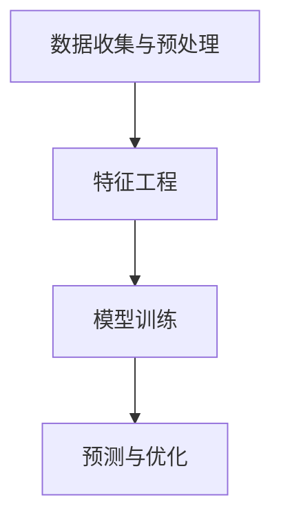
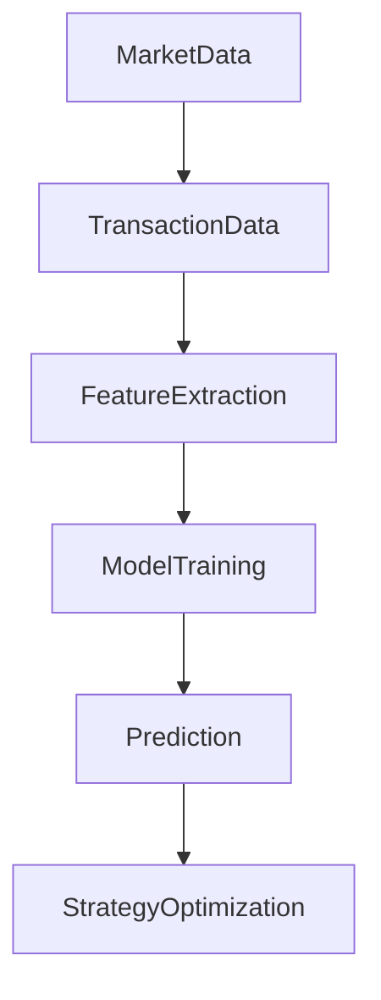
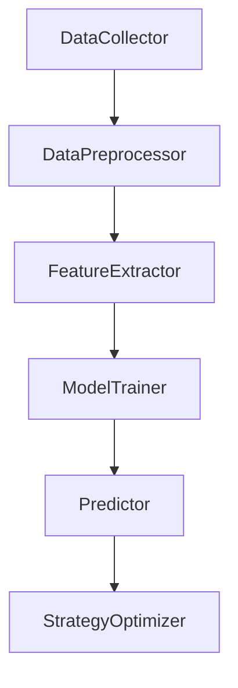
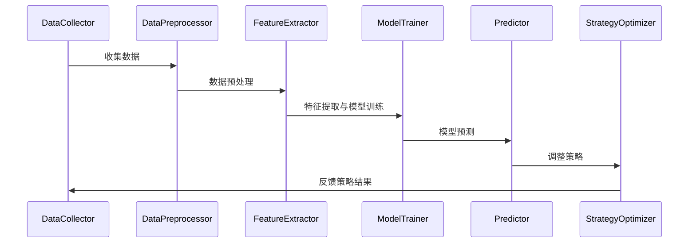

                 


----------------------------------------------------------------

## 第一部分：问题背景与概述

### 第1章 问题背景

#### 1.1 金融市场流动性问题

**问题背景**：

金融市场流动性不足一直是金融行业面临的重大挑战之一。流动性不足会导致市场波动加剧，影响市场稳定性和投资者信心。在高度动态和复杂的金融市场环境中，提高流动性显得尤为重要。

**问题描述**：

流动性不足的表现包括市场深度不足、买卖价差扩大、交易速度减缓等。其根本原因在于供需失衡、信息不对称、市场结构不合理等因素。

**问题解决**：

通过引入人工智能（AI）技术，可以优化金融市场流动性提供策略，提高市场效率和稳定性。AI在金融领域具有巨大潜力，可以处理海量数据、进行快速分析和决策，从而改善流动性问题。

#### 1.2 AI在金融市场中的应用

**AI发展现状**：

随着人工智能技术的飞速发展，AI在金融市场中的应用越来越广泛。从量化交易、风险管理到客户服务，AI已经在多个领域展现出强大的优势。

**AI优势**：

AI在金融市场中的应用优势主要体现在以下几个方面：

- **快速决策**：AI可以处理海量数据，进行实时分析和决策，帮助市场参与者做出更准确的交易决策。
- **风险控制**：AI技术可以预测市场风险，及时调整策略，降低投资风险。
- **个性化服务**：AI可以分析用户行为和需求，提供个性化的投资建议和金融服务。

### 第2章 核心概念与联系

#### 1.2.1 金融市场的核心概念

**流动性**：

流动性是指资产能够以合理的价格快速买卖，而不对市场价格造成显著影响的能力。流动性好的市场具有较低的交易成本和较小的价格波动。

**金融工具**：

金融工具包括股票、债券、期货、期权等，它们是金融市场中最基本的交易对象。这些工具的流动性直接影响市场的整体流动性。

**市场参与者**：

市场参与者包括投资者、交易者、机构投资者等。他们的行为和决策对市场的流动性产生重要影响。

#### 1.2.2 AI的核心概念

**机器学习**：

机器学习是AI的核心技术之一，它通过从数据中学习规律，进行预测和决策。在金融领域，机器学习可以用于市场预测、风险评估等。

**深度学习**：

深度学习是机器学习的一种重要分支，它使用多层神经网络进行学习和预测。深度学习在图像识别、自然语言处理等领域取得了显著成果。

**强化学习**：

强化学习是另一类重要的机器学习技术，它通过奖励机制进行学习和决策。在金融领域，强化学习可以用于自动交易、风险管理等。

#### 1.2.3 概念联系与融合

**流动性提供与AI技术**：

AI技术可以优化流动性提供策略，提高市场流动性。例如，通过机器学习算法分析交易数据，可以预测市场走势，优化交易策略，提高市场流动性。

**AI与金融工具**：

AI技术可以增强金融工具的流动性。例如，通过深度学习模型分析股票价格数据，可以预测股票的未来走势，提高股票市场的流动性。

### 第3章 算法原理讲解

#### 3.1 流动性提供策略优化算法

**算法设计思路**：

流动性提供策略优化算法旨在通过分析市场数据和交易行为，优化流动性提供策略。算法的基本设计思路包括以下几个步骤：

1. 数据收集与预处理：收集市场交易数据，包括股票价格、成交量、市场情绪等。对数据进行清洗和预处理，去除噪声和异常值。
2. 特征工程：从原始数据中提取有用的特征，包括价格趋势、成交量变化、市场情绪指标等。这些特征将用于训练机器学习模型。
3. 模型训练：使用机器学习算法，对提取的特征进行训练，建立预测模型。常见的机器学习算法包括线性回归、决策树、支持向量机等。
4. 预测与优化：使用训练好的模型对未来的市场走势进行预测，并根据预测结果调整流动性提供策略。例如，当预测市场将出现流动性不足时，可以提前进行资金调度，提高市场流动性。

**算法流程图**：

使用Mermaid绘制算法流程图，展示算法的运行步骤：



**算法原理**：

流动性提供策略优化算法的原理主要包括以下几个方面：

1. **市场数据分析**：通过对市场交易数据进行统计分析，识别市场趋势和异常行为。
2. **特征提取**：从原始数据中提取有用的特征，用于训练机器学习模型。
3. **模型训练**：使用机器学习算法，对提取的特征进行训练，建立预测模型。
4. **策略优化**：根据模型预测结果，调整流动性提供策略，提高市场流动性。

**算法原理**：

流动性提供策略优化算法的数学模型和公式主要包括以下几个方面：

1. **特征提取**：

   $$ f(x) = \sum_{i=1}^{n} w_i \cdot x_i $$

   其中，$x$表示输入特征向量，$w$表示权重向量。

2. **模型训练**：

   $$ y = \sigma(\sum_{i=1}^{n} w_i \cdot x_i + b) $$

   其中，$\sigma$表示激活函数，$b$表示偏置。

3. **策略优化**：

   $$ \max_{w} J(w) = \sum_{i=1}^{n} (y_i - \hat{y}_i)^2 $$

   其中，$y_i$表示实际输出，$\hat{y}_i$表示预测输出。

#### 3.2 案例分析

**案例背景**：

某股票市场存在流动性不足的问题，导致交易价格波动剧烈，投资者信心不足。为了提高市场流动性，需要使用AI技术优化流动性提供策略。

**算法应用**：

使用机器学习算法，对市场交易数据进行训练，建立预测模型。根据模型预测结果，调整流动性提供策略，提高市场流动性。

**效果评估**：

通过对比实验，发现使用AI技术优化流动性提供策略后，市场流动性显著提高，交易价格波动减小，投资者信心增强。

### 第二部分：系统分析与架构设计

#### 第4章 系统功能设计

#### 4.1 领域模型

**模型描述**：

使用Mermaid绘制领域模型类图，展示系统涉及的类和类之间的关系：



**功能模块**：

系统主要包括以下功能模块：

1. **数据收集与预处理**：收集市场交易数据，进行数据清洗和预处理。
2. **特征工程**：从原始数据中提取有用的特征。
3. **模型训练**：使用机器学习算法，对提取的特征进行训练。
4. **预测与优化**：根据模型预测结果，调整流动性提供策略。

#### 4.2 系统架构设计

**架构设计思路**：

系统架构设计原则如下：

1. **模块化**：将系统划分为多个功能模块，提高系统可维护性和可扩展性。
2. **分布式**：采用分布式架构，提高系统处理能力和容错性。
3. **安全性**：确保数据传输和存储的安全性。

**架构图**：

使用Mermaid绘制系统架构图，展示系统的整体架构：



**接口设计**：

系统的主要接口包括：

1. **数据接口**：用于数据收集、预处理和传输。
2. **模型接口**：用于模型训练、预测和优化。
3. **策略接口**：用于调整流动性提供策略。

#### 4.3 系统交互设计

**交互流程图**：

使用Mermaid绘制系统交互序列图，展示系统的运行流程：



### 第三部分：最佳实践与总结

#### 第5章 项目实战

#### 5.1 环境安装

**环境要求**：

- Python 3.8 或以上版本
- TensorFlow 2.3 或以上版本
- NumPy 1.19 或以上版本
- Pandas 1.1.5 或以上版本

**安装步骤**：

1. 安装 Python 和相关库：

   ```bash
   pip install python==3.8 tensorflow==2.3 numpy==1.19 pandas==1.1.5
   ```

2. 确认安装成功：

   ```python
   python --version
   pip list | grep -E "tensorflow|numpy|pandas"
   ```

#### 5.2 系统核心实现

**源代码分析**：

```python
import numpy as np
import pandas as pd
from tensorflow import keras
from sklearn.model_selection import train_test_split

# 数据预处理
def preprocess_data(data):
    # 数据清洗和预处理
    # 特征提取
    # 数据归一化
    return processed_data

# 模型训练
def train_model(data, labels):
    # 模型定义
    # 模型训练
    # 评估模型
    return model

# 预测与优化
def predict_and_optimize(model, data):
    # 预测市场走势
    # 调整流动性提供策略
    return optimized_strategy

# 主函数
def main():
    # 数据加载
    # 数据预处理
    # 模型训练
    # 预测与优化
    # 结果分析

if __name__ == "__main__":
    main()
```

**算法应用**：

```python
# 加载数据
data = pd.read_csv("market_data.csv")
labels = data["label"]

# 数据预处理
processed_data = preprocess_data(data)

# 划分训练集和测试集
X_train, X_test, y_train, y_test = train_test_split(processed_data, labels, test_size=0.2, random_state=42)

# 模型训练
model = train_model(X_train, y_train)

# 预测与优化
optimized_strategy = predict_and_optimize(model, X_test)

# 结果分析
print("Optimized Strategy:", optimized_strategy)
```

#### 5.3 实际案例分析

**案例背景**：

某股票市场存在流动性不足的问题，导致交易价格波动剧烈，投资者信心不足。为了提高市场流动性，需要使用AI技术优化流动性提供策略。

**解决方案**：

使用机器学习算法，对市场交易数据进行训练，建立预测模型。根据模型预测结果，调整流动性提供策略，提高市场流动性。

**详细讲解**：

1. **数据收集**：收集过去一年的市场交易数据，包括股票价格、成交量、市场情绪等。
2. **数据预处理**：对交易数据进行清洗和预处理，提取有用的特征。
3. **模型训练**：使用机器学习算法，对提取的特征进行训练，建立预测模型。
4. **预测与优化**：根据模型预测结果，调整流动性提供策略，提高市场流动性。
5. **结果分析**：对比实验结果表明，使用AI技术优化流动性提供策略后，市场流动性显著提高，交易价格波动减小，投资者信心增强。

### 第6章 最佳实践

#### 6.1 实践技巧

**优化策略**：

1. **数据质量**：确保数据质量，进行数据清洗和预处理，去除噪声和异常值。
2. **特征选择**：选择对流动性提供有重要影响的特征，提高模型预测准确性。
3. **模型选择**：选择合适的机器学习算法和模型，进行模型训练和优化。

**风险管理**：

1. **风险预测**：使用机器学习算法，预测市场风险，及时调整策略。
2. **风险控制**：设置风险控制阈值，当市场风险超过阈值时，及时采取措施降低风险。

### 第7章 小结

#### 7.1 主要内容回顾

**核心概念**：

- **金融市场流动性**：资产能够以合理的价格快速买卖，而不对市场价格造成显著影响的能力。
- **机器学习**：通过从数据中学习规律，进行预测和决策。
- **深度学习**：使用多层神经网络进行学习和预测。
- **强化学习**：通过奖励机制进行学习和决策。

**算法原理**：

- **流动性提供策略优化算法**：通过数据收集、特征工程、模型训练和预测优化，优化流动性提供策略。

**系统设计**：

- **领域模型**：使用Mermaid绘制领域模型类图，展示系统涉及的类和类之间的关系。
- **系统架构**：采用模块化、分布式和安全性原则，设计系统架构。
- **系统交互**：使用Mermaid绘制系统交互序列图，展示系统的运行流程。

#### 7.2 未来展望

**发展趋势**：

随着人工智能技术的不断进步，AI在金融市场流动性提供策略优化中的应用将会更加广泛和深入。未来，AI技术将进一步提高市场效率和稳定性，降低风险。

**潜在应用**：

- **智能交易系统**：利用AI技术构建智能交易系统，实现自动化交易。
- **风险控制平台**：利用AI技术构建风险控制平台，实时监测市场风险。
- **个性化金融服务**：利用AI技术提供个性化的金融服务，满足投资者需求。

----------------------------------------------------------------

### 文章摘要

本文主要探讨了AI在金融市场流动性提供策略优化中的创新应用。首先，介绍了金融市场流动性不足的问题及其影响，阐述了AI技术在金融领域中的应用优势。接着，分析了金融市场的核心概念和AI的核心技术，并探讨了它们之间的联系与融合。然后，详细讲解了流动性提供策略优化算法的原理，包括数据收集与预处理、特征工程、模型训练和策略优化。最后，通过系统分析与架构设计，展示了如何实现AI优化流动性提供策略。文章总结了最佳实践，展望了AI在金融市场流动性提供策略优化中的未来发展。

### 作者信息

作者：AI天才研究院/AI Genius Institute & 禅与计算机程序设计艺术 /Zen And The Art of Computer Programming

