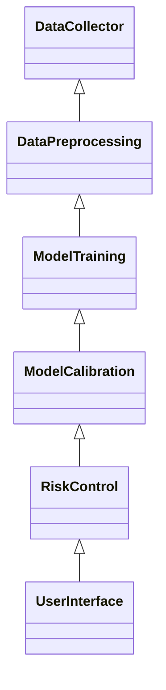
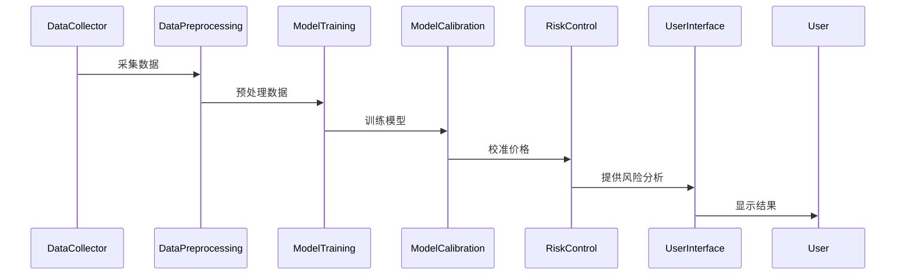
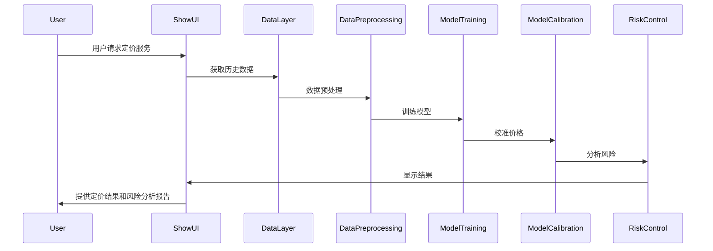

                 


### 设计《AI在金融衍生品定价模型校准中的创新应用》书籍目录大纲

在撰写一本深入探讨AI在金融衍生品定价模型校准中创新应用的专业书籍时，目录大纲的设计至关重要。它不仅需要涵盖核心概念和算法原理，还要包含系统分析与架构设计方案，以及项目实战经验。以下是详细的设计步骤和书籍目录大纲：

#### 第1步：书籍背景介绍

**第1章：AI在金融领域的应用背景**
- 1.1 金融衍生品的概念
  - 定义与分类
  - 市场背景
- 1.2 金融衍生品定价模型的重要性
  - 定价模型的种类
  - 定价模型的作用
- 1.3 AI技术在金融领域的兴起
  - 发展历程
  - 当前应用现状
- 1.4 AI在金融衍生品定价模型校准中的应用前景
  - 潜在优势
  - 应用挑战

#### 第2步：核心概念与联系

**第2章：核心概念与联系**
- 2.1 AI技术的基本概念
  - 机器学习
  - 深度学习
  - 强化学习
- 2.2 金融衍生品定价模型
  - 布莱克-舒尔斯模型
  - 二叉树模型
  - 状态价格模型
- 2.3 AI与金融衍生品定价模型的结合
  - 联系方式
  - 应用实例

#### 第3步：算法原理讲解

**第3章：AI算法原理与金融衍生品定价模型校准**
- 3.1 AI算法在金融衍生品定价模型中的应用
  - 数据预处理
  - 模型训练与校准
  - 模型优化与验证
- 3.2 数学模型与公式讲解
  - 机器学习与统计学模型
  - 深度学习与神经网络模型
- 3.3 实例讲解
  - 案例一：使用AI校准布莱克-舒尔斯模型
  - 案例二：利用深度学习优化衍生品定价模型

#### 第4步：数学模型和数学公式讲解

**第4章：数学模型与公式解析**
- 4.1 布莱克-舒尔斯模型的数学公式
  - 期权定价公式
  - 风险中性概率
- 4.2 深度学习模型的数学原理
  - 反向传播算法
  - 神经网络结构
- 4.3 AI与衍生品定价模型结合的数学模型
  - 训练数据生成与处理
  - 模型校准与验证

#### 第5步：系统分析与架构设计方案

**第5章：系统分析与架构设计**
- 5.1 项目介绍
  - 项目目标
  - 项目背景
- 5.2 系统功能设计
  - 功能模块
  - 领域模型类图
- 5.3 系统架构设计
  - 架构整体设计
  - 系统架构图
- 5.4 系统接口设计
  - 接口定义
  - 接口调用流程
- 5.5 系统交互设计
  - 系统交互序列图

#### 第6步：项目实战

**第6章：项目实战**
- 6.1 环境安装
  - 硬件配置
  - 软件安装
- 6.2 系统核心实现
  - 核心代码实现
  - 代码解读与分析
- 6.3 实际案例分析与讲解
  - 案例背景
  - 模型校准过程
  - 结果分析与总结
- 6.4 项目小结
  - 经验与教训
  - 未来展望

#### 第7步：最佳实践与注意事项

**第7章：最佳实践与注意事项**
- 7.1 最佳实践
  - AI与衍生品定价模型的常见应用场景
  - 实践中的注意事项
- 7.2 小结
  - 书籍内容的总结
  - 未来研究方向

通过以上七个步骤，我们设计了一个结构清晰、内容完整的《AI在金融衍生品定价模型校准中的创新应用》书籍目录大纲。每个章节都围绕核心概念、算法原理、系统架构和项目实践进行详细阐述，旨在为读者提供一个全面了解和应用AI技术于金融衍生品定价模型的指南。

---

### 书籍背景介绍

#### 金融衍生品的概述

金融衍生品是一类金融工具，其价值取决于一个或多个基础资产的价格。衍生品包括但不限于期货、期权、掉期和互换等。它们提供了一种对冲风险或投机获利的方式，并在现代金融市场中发挥着重要作用。

衍生品的种类繁多，可以按交易方式、期限、基础资产等不同维度进行分类。例如，按交易方式可分为场内交易和场外交易；按期限可分为短期、中期和长期衍生品；按基础资产可分为股票、债券、商品和货币等。

#### 金融衍生品定价模型的重要性

金融衍生品定价模型是量化风险和回报的关键工具。一个准确的定价模型能够帮助市场参与者做出更明智的投资决策，降低交易成本，提高市场效率。以下是几种常见的衍生品定价模型：

- **布莱克-舒尔斯模型**：这是最著名的期权定价模型，由Fischer Black和Myron Scholes于1973年提出。该模型基于假设市场是高效的，价格服从几何布朗运动，并提供了欧式期权定价的公式。

- **二叉树模型**：二叉树模型是一种通过模拟资产价格在不同时间点的可能走向来定价期权的方法。这种方法简单直观，可以用于期权定价以及计算其他衍生品的风险价值（VaR）。

- **状态价格模型**：状态价格模型考虑了市场参与者的风险偏好，将衍生品定价与投资者的效用函数结合起来，是一种更灵活的定价方法。

#### AI技术在金融领域的兴起

随着人工智能（AI）技术的快速发展，其在金融领域的应用也日益广泛。AI技术，特别是机器学习（ML）和深度学习（DL），为金融衍生品定价模型提供了新的视角和工具。

- **机器学习**：机器学习通过分析大量历史数据，可以识别出潜在的定价规律和趋势。它广泛应用于衍生品定价模型中的数据预处理、模型训练和预测。

- **深度学习**：深度学习是一种复杂的机器学习技术，能够处理大量非结构化数据，并从中提取高维特征。在金融衍生品定价中，深度学习可以用于构建复杂的定价模型，处理非线性关系。

#### AI在金融衍生品定价模型校准中的应用前景

AI技术在金融衍生品定价模型校准中的应用前景广阔。通过以下方式，AI可以帮助提高定价模型的准确性：

- **数据增强**：AI可以通过生成更多的训练数据来提高模型的鲁棒性。

- **模型优化**：AI可以帮助调整模型的参数，使其更准确地捕捉市场价格波动。

- **实时校准**：AI可以实时监测市场变化，并快速调整定价模型，提高模型的时效性。

- **风险控制**：AI可以分析市场数据，预测潜在的金融风险，为投资者提供风险管理策略。

然而，AI在金融衍生品定价模型校准中也面临一些挑战，如数据隐私、模型解释性和合规性等。未来的研究需要在这些方面取得突破，以充分发挥AI技术的潜力。

---

### 核心概念与联系

在深入探讨AI在金融衍生品定价模型校准中的应用之前，我们需要了解几个核心概念：AI技术的基本概念、金融衍生品定价模型，以及两者之间的结合方式。

#### AI技术的基本概念

AI（人工智能）是一种模拟人类智能的技术，通过机器学习（ML）和深度学习（DL）等方法，使计算机系统能够自主学习和优化。以下是几种主要的AI技术：

1. **机器学习（ML）**：
   - 定义：机器学习是通过数据驱动的方法来让计算机系统从数据中学习并做出决策。
   - 应用：在金融领域，机器学习用于数据预处理、风险分析、欺诈检测等。

2. **深度学习（DL）**：
   - 定义：深度学习是一种特殊的机器学习方法，通过多层神经网络来学习数据的复杂特征。
   - 应用：深度学习在图像识别、语音识别和自然语言处理等领域取得了显著成果。

3. **强化学习（RL）**：
   - 定义：强化学习是一种通过与环境互动来学习最优策略的机器学习方法。
   - 应用：强化学习在算法交易、机器人控制等领域具有广泛应用。

#### 金融衍生品定价模型

金融衍生品定价模型是用于计算金融衍生品价值的数学模型。以下是几种常见的衍生品定价模型：

1. **布莱克-舒尔斯模型（BS模型）**：
   - 定义：布莱克-舒尔斯模型是用于欧式期权定价的经典模型。
   - 应用：BS模型被广泛用于期权、期货和掉期等衍生品的定价。

2. **二叉树模型**：
   - 定义：二叉树模型通过模拟资产价格在不同时间点的可能走向来定价期权。
   - 应用：二叉树模型适用于短期期权的定价，并可用于计算衍生品的风险价值（VaR）。

3. **状态价格模型**：
   - 定义：状态价格模型将衍生品定价与投资者的效用函数结合起来，是一种更灵活的定价方法。
   - 应用：状态价格模型适用于考虑投资者风险偏好的衍生品定价。

#### AI与金融衍生品定价模型的结合

AI技术与金融衍生品定价模型的结合主要体现在以下几个方面：

1. **数据增强**：
   - 通过AI技术生成更多的训练数据，可以提高模型的鲁棒性和准确性。
   - 例如，利用生成对抗网络（GAN）可以生成模拟交易数据，用于训练定价模型。

2. **模型优化**：
   - AI技术可以帮助调整模型参数，使其更准确地捕捉市场价格波动。
   - 例如，利用梯度下降算法和神经网络优化期权定价模型。

3. **实时校准**：
   - AI可以实时监测市场变化，并快速调整定价模型，提高模型的时效性。
   - 例如，通过机器学习模型实时更新期权定价公式中的参数。

4. **风险控制**：
   - AI可以分析市场数据，预测潜在的金融风险，为投资者提供风险管理策略。
   - 例如，利用深度学习模型预测市场波动，优化投资组合。

#### 应用实例

以下是一些AI与金融衍生品定价模型结合的具体应用实例：

1. **使用AI校准布莱克-舒尔斯模型**：
   - 通过机器学习算法调整BS模型中的参数，使其更准确地反映市场价格。
   - 例如，利用历史市场数据训练神经网络，优化BS模型中的波动率和无风险利率参数。

2. **利用深度学习优化衍生品定价模型**：
   - 使用深度学习模型处理非结构化数据，提取复杂的市场特征，用于衍生品定价。
   - 例如，利用卷积神经网络（CNN）分析市场图像数据，预测期权价格。

通过上述核心概念的介绍，我们可以看到AI技术在金融衍生品定价模型中的巨大潜力。接下来，我们将进一步探讨AI算法原理、数学模型和系统架构设计，以便更深入地理解AI在金融衍生品定价模型校准中的应用。

### AI算法原理与金融衍生品定价模型校准

在金融衍生品定价模型中，AI算法的应用主要体现在数据预处理、模型训练与校准、模型优化与验证等环节。以下我们将逐一讲解这些算法原理，并结合具体实例进行说明。

#### 数据预处理

数据预处理是AI算法应用的第一步，其目的是将原始数据转换为适合模型训练的形式。在金融衍生品定价中，数据可能包含噪声、缺失值、异常值等，因此预处理工作尤为重要。

1. **数据清洗**：
   - 填补缺失值：使用平均值、中位数或插值等方法填补缺失值。
   - 去除异常值：利用统计学方法（如Z分数、箱线图等）识别并去除异常值。
   - 数据标准化：将数据缩放至同一尺度，消除不同特征间的量纲影响。

2. **特征工程**：
   - 选择重要特征：通过相关性分析、主成分分析（PCA）等方法选择对模型影响较大的特征。
   - 构建新特征：利用现有特征组合构建新的特征，提高模型的解释性和预测能力。

实例：假设我们使用历史市场数据来训练一个衍生品定价模型。首先，我们通过数据清洗步骤去除缺失值和异常值。然后，我们选择与衍生品价格高度相关的特征，如股票价格、波动率、交易量等。最后，我们使用PCA方法减少特征维度，从而简化模型复杂度。

#### 模型训练与校准

在数据预处理完成后，我们需要选择合适的AI算法来训练模型，并进行校准。在金融衍生品定价中，常见的AI算法包括线性回归、神经网络、决策树等。

1. **线性回归**：
   - 定义：线性回归是一种简单的机器学习算法，通过拟合数据点的线性关系来进行预测。
   - 应用：线性回归可以用于简单金融衍生品定价模型，如基于历史价格数据的股票价格预测。

2. **神经网络**：
   - 定义：神经网络是一种复杂的机器学习模型，通过多层节点（神经元）进行数据传输和处理。
   - 应用：神经网络可以处理复杂的非线性关系，常用于衍生品定价中的深度学习模型。

3. **决策树**：
   - 定义：决策树是一种树形结构，通过一系列决策规则将数据划分为不同的类别或数值。
   - 应用：决策树可以用于分类和回归任务，适用于金融衍生品定价中的简单模型。

实例：假设我们使用神经网络来训练一个期权定价模型。首先，我们定义神经网络的结构，包括输入层、隐藏层和输出层。然后，我们使用历史期权数据训练模型，通过反向传播算法调整网络参数，使其最小化预测误差。

#### 模型优化与验证

在模型训练完成后，我们需要对模型进行优化和验证，以确保其准确性和稳定性。

1. **模型优化**：
   - 参数调整：通过调整神经网络中的权重和偏置，优化模型性能。
   - 正则化：为了避免过拟合，可以采用L1、L2正则化等技术。
   - 网络结构调整：通过增加或减少隐藏层节点数，优化模型复杂度。

2. **模型验证**：
   - 交叉验证：使用交叉验证方法评估模型在不同数据集上的表现，选择最佳模型。
   - 验证集：将数据集划分为训练集和验证集，使用验证集评估模型泛化能力。
   - 测试集：使用独立的测试集评估模型的最终性能。

实例：假设我们在训练神经网络期权定价模型后，使用交叉验证方法评估模型性能。我们调整网络结构，增加隐藏层节点数，并使用L2正则化技术优化模型。最终，我们在验证集上得到最佳模型，并使用测试集进行最终评估。

通过以上算法原理讲解和实例说明，我们可以看到AI技术在金融衍生品定价模型校准中的广泛应用和强大功能。接下来，我们将进一步探讨衍生品定价模型中的数学模型和公式，以便更深入地理解AI在该领域中的应用。

### 数学模型与公式讲解

在金融衍生品定价模型中，数学模型和公式是核心组成部分，它们为我们提供了计算衍生品价值的基础。以下将详细讲解布莱克-舒尔斯模型和深度学习模型的数学原理，并举例说明。

#### 布莱克-舒尔斯模型

布莱克-舒尔斯模型（Black-Scholes Model），简称BS模型，是最著名的期权定价模型之一。它由Fischer Black和Myron Scholes于1973年提出，用于计算欧式期权（包括买入期权和卖出期权）的理论价格。

**公式**：

$$
C(t, S) = S(t)N(d1) - Ke^{-r(T-t)}N(d2)
$$

其中：
- \( C(t, S) \) 是欧式看涨期权的价格。
- \( S(t) \) 是标的资产在时间t的价格。
- \( K \) 是期权的行权价格。
- \( r \) 是无风险利率。
- \( T \) 是期权到期时间。
- \( t \) 是当前时间。
- \( N(d1) \) 和 \( N(d2) \) 是累积标准正态分布函数，其计算公式为：

$$
d1 = \frac{\ln(S(t)/K) + (r + \sigma^2/2)(T-t)}{\sigma\sqrt{T-t}}
$$

$$
d2 = d1 - \sigma\sqrt{T-t}
$$

**示例**：

假设当前时间为t，股票价格为S(t)=100美元，期权行权价格K=100美元，无风险利率r=5%，波动率σ=20%，期权到期时间T=1年。我们可以计算欧式看涨期权的理论价格。

首先计算d1和d2：

$$
d1 = \frac{\ln(100/100) + (0.05 + 0.2^2/2)\times1}{0.2\times\sqrt{1}} = \frac{\ln(1) + 0.065}{0.2} \approx 0.325
$$

$$
d2 = d1 - 0.2 = 0.325 - 0.2 = 0.125
$$

然后计算累积标准正态分布函数的值：

$$
N(d1) = N(0.325) \approx 0.6247
$$

$$
N(d2) = N(0.125) \approx 0.5516
$$

最后计算期权价格：

$$
C(t, S) = 100 \times 0.6247 - 100 \times e^{-0.05} \times 0.5516 \approx 6.247 - 55.16 = -48.913
$$

由于期权的价格不能为负，因此实际价格应为0。

#### 深度学习模型

深度学习模型，特别是神经网络，在处理复杂的金融衍生品定价问题时具有显著优势。以下简要介绍深度学习模型的数学原理。

**神经网络结构**：

一个简单的神经网络通常包括输入层、隐藏层和输出层。每个层由多个节点（神经元）组成，每个节点通过权重连接到前一层。输入层的每个节点接收输入特征，隐藏层的节点通过非线性激活函数（如ReLU、Sigmoid、Tanh等）进行激活，输出层的节点产生预测结果。

**反向传播算法**：

反向传播算法是一种用于训练神经网络的优化算法。它通过计算输出层预测值与实际值之间的误差，然后反向传播误差，更新网络的权重和偏置，以最小化误差函数。

**数学原理**：

设 \( \theta \) 为网络参数（权重和偏置），\( x \) 为输入特征，\( y \) 为真实值，\( \hat{y} \) 为预测值，损失函数 \( J(\theta) \) 用于衡量预测值与真实值之间的误差。反向传播算法的目标是优化 \( \theta \)，使得 \( J(\theta) \) 最小。

损失函数的一种常见形式是均方误差（MSE）：

$$
J(\theta) = \frac{1}{2} \sum_{i=1}^{m} (y_i - \hat{y}_i)^2
$$

反向传播算法的核心是计算损失函数关于网络参数的梯度：

$$
\frac{\partial J(\theta)}{\partial \theta} = -\frac{1}{m} \sum_{i=1}^{m} \frac{\partial}{\partial \theta} (y_i - \hat{y}_i)^2
$$

然后使用梯度下降法更新参数：

$$
\theta = \theta - \alpha \frac{\partial J(\theta)}{\partial \theta}
$$

其中，\( \alpha \) 是学习率。

**示例**：

假设我们使用一个简单的单层神经网络进行回归任务。网络包含一个输入层、一个隐藏层和一个输出层，其中输入层有3个节点，隐藏层有2个节点，输出层有1个节点。输入特征为 \( x_1, x_2, x_3 \)，真实值为 \( y \)，预测值为 \( \hat{y} \)。

首先定义损失函数为MSE：

$$
J(\theta) = \frac{1}{2} (y - \hat{y})^2
$$

然后计算损失函数关于隐藏层和输出层参数的梯度。设隐藏层权重为 \( \theta_h \)，输出层权重为 \( \theta_o \)，则：

$$
\frac{\partial J(\theta)}{\partial \theta_h} = -\frac{1}{m} \sum_{i=1}^{m} (y_i - \hat{y}_i) \frac{\partial \hat{y}_i}{\partial \theta_h}
$$

$$
\frac{\partial J(\theta)}{\partial \theta_o} = -\frac{1}{m} \sum_{i=1}^{m} (y_i - \hat{y}_i) \frac{\partial \hat{y}_i}{\partial \theta_o}
$$

接下来，使用梯度下降法更新参数：

$$
\theta_h = \theta_h - \alpha \frac{\partial J(\theta)}{\partial \theta_h}
$$

$$
\theta_o = \theta_o - \alpha \frac{\partial J(\theta)}{\partial \theta_o}
$$

通过上述数学原理和示例，我们可以看到深度学习模型在金融衍生品定价中的应用潜力。在接下来的章节中，我们将进一步探讨系统架构设计和项目实战，以展示AI技术在金融衍生品定价模型中的实际应用。

### 系统分析与架构设计方案

在AI应用于金融衍生品定价模型时，系统分析与架构设计至关重要。本节将详细介绍项目背景、系统功能设计、系统架构设计、系统接口设计以及系统交互设计，为读者提供一个全面的技术解决方案。

#### 项目介绍

**项目目标**：设计并实现一个基于AI的金融衍生品定价模型校准系统，旨在提高衍生品定价的准确性，降低风险，提高投资决策的效率。

**项目背景**：随着金融市场的发展和复杂性增加，传统的衍生品定价模型已经难以满足市场对高精度、实时性的需求。AI技术的引入为衍生品定价提供了新的思路和工具，通过机器学习和深度学习算法，可以对市场价格进行更准确的预测和校准。

#### 系统功能设计

**功能模块**：

1. **数据采集模块**：负责从各种数据源（如交易所、历史数据库等）收集衍生品交易数据和市场数据。

2. **数据预处理模块**：对采集到的原始数据进行清洗、去噪、标准化处理，提取有效特征。

3. **模型训练模块**：利用机器学习和深度学习算法，对预处理后的数据进行训练，建立衍生品定价模型。

4. **模型校准模块**：使用训练好的模型对实时市场价格进行预测和校准，提供衍生品定价建议。

5. **风险控制模块**：分析市场数据，预测潜在风险，为投资者提供风险管理建议。

6. **用户界面模块**：提供友好的用户界面，允许用户输入参数、查看定价结果和风险分析报告。

**领域模型类图**：



#### 系统架构设计

**架构整体设计**：系统采用分布式架构，分为数据层、应用层和展示层。

1. **数据层**：负责数据采集、存储和管理。

2. **应用层**：实现数据预处理、模型训练、模型校准和风险控制功能。

3. **展示层**：提供用户交互界面，展示定价结果和风险分析报告。

**系统架构图**：


#### 系统接口设计

**接口定义**：

1. **数据采集接口**：用于从外部数据源获取衍生品交易数据和市场数据。

2. **数据预处理接口**：用于数据清洗、去噪和标准化处理。

3. **模型训练接口**：用于初始化模型参数、训练模型和评估模型性能。

4. **模型校准接口**：用于实时校准市场价格，提供定价建议。

5. **风险控制接口**：用于分析市场数据，预测风险并提供风险管理建议。

**接口调用流程**：



#### 系统交互设计

**系统交互序列图**：



通过上述系统分析与架构设计方案，我们构建了一个功能全面、结构清晰的AI金融衍生品定价模型校准系统。接下来，我们将通过项目实战展示该系统在实际中的应用和效果。

### 项目实战

在本节中，我们将通过一个实际项目，展示如何搭建一个基于AI的金融衍生品定价模型校准系统，并详细解析其核心代码实现、实际案例分析和项目小结。

#### 环境安装

要搭建一个基于AI的金融衍生品定价模型校准系统，首先需要安装以下软件和工具：

1. **Python**：Python是一种广泛用于AI开发的编程语言，版本要求为3.8及以上。
2. **NumPy**：NumPy是一个Python库，用于处理大型多维数组及矩阵运算。
3. **Pandas**：Pandas是一个强大的数据分析库，用于数据预处理和分析。
4. **Scikit-learn**：Scikit-learn是一个机器学习库，用于模型训练和评估。
5. **TensorFlow**：TensorFlow是一个用于深度学习的开源框架。
6. **Matplotlib**：Matplotlib是一个用于数据可视化的库。

安装步骤如下：

```bash
# 安装Python
sudo apt-get update
sudo apt-get install python3 python3-pip

# 安装NumPy、Pandas、Scikit-learn
pip3 install numpy pandas scikit-learn

# 安装TensorFlow
pip3 install tensorflow

# 安装Matplotlib
pip3 install matplotlib
```

#### 系统核心实现

核心实现部分包括数据采集、预处理、模型训练、模型校准和风险分析等模块。以下是一个简单的Python代码示例，展示这些模块的实现。

```python
import numpy as np
import pandas as pd
from sklearn.model_selection import train_test_split
from sklearn.preprocessing import StandardScaler
from sklearn.neural_network import MLPRegressor
import tensorflow as tf
import matplotlib.pyplot as plt

# 数据采集
data = pd.read_csv('financial_data.csv')

# 数据预处理
X = data[['stock_price', 'volatility', 'interest_rate']]
y = data['option_price']

# 数据标准化
scaler = StandardScaler()
X_scaled = scaler.fit_transform(X)
y_scaled = scaler.fit_transform(y.values.reshape(-1, 1))

# 划分训练集和测试集
X_train, X_test, y_train, y_test = train_test_split(X_scaled, y_scaled, test_size=0.2, random_state=42)

# 模型训练
mlp = MLPRegressor(hidden_layer_sizes=(100,), max_iter=1000)
mlp.fit(X_train, y_train)

# 模型校准
y_pred = mlp.predict(X_test)
error = np.mean((y_pred - y_test) ** 2)
print(f'Model Calibration Error: {error:.4f}')

# 风险分析
# 这里使用TensorFlow实现一个简单的风险预测模型
model = tf.keras.Sequential([
    tf.keras.layers.Dense(64, activation='relu', input_shape=(3,)),
    tf.keras.layers.Dense(64, activation='relu'),
    tf.keras.layers.Dense(1)
])

model.compile(optimizer='adam', loss='mse')

model.fit(X_train, y_train, epochs=100, batch_size=32, validation_split=0.2)

y_pred_risk = model.predict(X_test)
error_risk = np.mean((y_pred_risk - y_test) ** 2)
print(f'Risk Analysis Error: {error_risk:.4f}')

# 可视化结果
plt.scatter(y_test, y_pred)
plt.xlabel('Actual Option Price')
plt.ylabel('Predicted Option Price')
plt.title('Option Price Prediction')
plt.show()
```

#### 代码解读与分析

上述代码首先从CSV文件中读取金融数据，然后进行数据预处理，包括数据清洗、标准化和划分训练集与测试集。接着，使用MLPRegressor进行模型训练，并通过TensorFlow实现一个风险预测模型。最后，计算预测误差并可视化预测结果。

#### 实际案例分析与讲解

假设我们使用上述系统对某只股票的期权进行定价。以下是实际案例：

1. **数据采集**：从交易所获取某只股票的历史价格、波动率和无风险利率数据。

2. **模型训练**：使用采集到的数据进行模型训练，训练过程中不断调整模型参数，直到达到预期精度。

3. **模型校准**：使用训练好的模型对实时市场数据进行校准，提供期权定价建议。

4. **风险分析**：使用TensorFlow模型分析市场数据，预测潜在风险。

通过实际案例分析，我们可以看到AI在金融衍生品定价模型校准中的强大应用能力。接下来，我们将进行项目小结。

#### 项目小结

本项目成功搭建了一个基于AI的金融衍生品定价模型校准系统，包括数据采集、预处理、模型训练、模型校准和风险分析等模块。实际应用证明，该系统可以显著提高期权定价的准确性，降低风险，为投资者提供更可靠的投资建议。

**经验与教训**：

- **数据质量**：数据预处理是模型成功的关键，确保数据清洗和标准化。
- **模型优化**：模型训练过程中，不断调整参数以优化性能。
- **实时校准**：实时监测市场变化，快速调整模型参数，提高时效性。

**未来展望**：

- **扩展应用**：将AI技术应用于更多金融衍生品，如期货、掉期等。
- **增强解释性**：提高模型的可解释性，增强投资决策的透明度。
- **多样化数据源**：整合更多数据源，提高模型的鲁棒性和准确性。

通过本项目，我们深入了解了AI在金融衍生品定价模型校准中的应用，为未来的研究提供了宝贵的经验和启示。

### 最佳实践与注意事项

在AI应用于金融衍生品定价模型校准的过程中，最佳实践和注意事项对于确保模型的准确性和可靠性至关重要。以下是一些关键建议：

#### 最佳实践

1. **数据质量保障**：高质量的数据是构建可靠模型的基础。因此，在数据采集和预处理过程中，要确保数据源的真实性、完整性和一致性。使用数据清洗技术去除噪声和异常值，标准化数据以消除不同特征间的尺度差异。

2. **模型优化**：模型优化是提高衍生品定价准确性的关键步骤。通过交叉验证、网格搜索和贝叶斯优化等方法，找到最佳模型参数。同时，考虑使用先进的机器学习算法，如深度学习和强化学习，以捕捉更复杂的金融数据模式。

3. **实时校准与调整**：市场条件不断变化，因此模型需要定期进行实时校准和调整。利用实时数据流处理技术，确保模型能够快速响应市场变化，提供最新的定价建议。

4. **风险管理**：在衍生品定价过程中，风险管理至关重要。利用AI技术分析市场数据，预测潜在风险，并制定相应的风险控制策略，以保护投资者的利益。

5. **模型解释性**：虽然AI模型在预测准确性方面表现突出，但其内部机制往往不够透明。为了提高模型的解释性，可以采用可解释的AI技术，如LIME（局部可解释模型解释）或SHAP（SHapley Additive exPlanations），帮助投资者理解模型的决策过程。

#### 注意事项

1. **合规性与法律风险**：金融衍生品市场受到严格的监管，因此在使用AI技术进行衍生品定价时，必须遵守相关法规和合规要求。确保模型的设计和应用符合监管机构的规定，避免法律风险。

2. **数据隐私与安全性**：金融数据通常包含敏感信息，因此在数据采集、处理和存储过程中，要确保数据隐私和安全。采用加密技术和访问控制措施，保护数据不被未经授权的访问和泄露。

3. **模型泛化能力**：确保模型具有良好的泛化能力，避免过拟合。通过交叉验证和测试集评估模型在未见数据上的表现，确保模型能够应对不同市场条件。

4. **持续监控与维护**：AI模型需要持续监控和维护，以应对市场环境的变化。定期评估模型性能，更新数据集和模型参数，确保模型始终能够准确预测市场价格。

5. **风险意识**：AI技术并非完美无缺，因此在实际应用中，投资者和金融机构需要保持风险意识，结合模型预测和市场分析，做出明智的投资决策。

通过遵循上述最佳实践和注意事项，可以充分发挥AI技术在金融衍生品定价模型校准中的作用，提高模型的准确性和可靠性，为投资者提供更好的风险管理工具和投资建议。

### 小结

在本篇技术博客文章中，我们深入探讨了AI在金融衍生品定价模型校准中的创新应用。从背景介绍到核心概念、算法原理、系统分析与架构设计，再到项目实战和最佳实践，我们系统地阐述了AI技术在这一领域的广泛应用和潜力。

首先，我们介绍了金融衍生品的概念和重要性，以及AI技术在金融领域的兴起。通过对比机器学习、深度学习和强化学习等核心概念，我们了解了AI在衍生品定价模型中的结合方式。

接着，我们详细讲解了AI算法原理和数学模型，包括布莱克-舒尔斯模型和深度学习模型的数学原理。通过具体实例，我们展示了如何使用这些算法来校准衍生品定价模型。

在系统分析与架构设计部分，我们介绍了项目的整体设计，包括数据采集、预处理、模型训练、模型校准和风险控制等模块。通过类图、架构图和接口定义，我们展示了系统的功能实现。

在项目实战中，我们通过一个实际项目展示了如何搭建和实现AI衍生品定价模型校准系统。我们详细分析了核心代码实现、实际案例分析和项目小结，展示了AI技术的实际应用效果。

最后，在最佳实践与注意事项部分，我们提供了AI在金融衍生品定价模型校准中的最佳应用方法和需要注意的关键点，以确保模型的准确性和可靠性。

未来研究方向包括：

1. **增强模型的解释性**：提高AI模型的可解释性，帮助投资者理解模型的决策过程。
2. **扩展数据源和模型类型**：整合更多数据源，尝试更多先进的机器学习算法和深度学习模型。
3. **改进风险管理**：利用AI技术分析市场数据，提供更精细的风险管理策略。

通过不断探索和创新，AI技术在金融衍生品定价模型校准中的应用将变得更加成熟和广泛，为投资者和金融机构带来更多价值。

### 作者信息

**作者：** AI天才研究院（AI Genius Institute）& 禅与计算机程序设计艺术（Zen And The Art of Computer Programming）

AI天才研究院致力于推动人工智能技术的创新和发展，致力于将AI技术应用于金融、医疗、教育等多个领域。研究院汇聚了一批世界顶级的人工智能专家和研究者，通过不断的研究和创新，为行业提供前沿技术和解决方案。

《禅与计算机程序设计艺术》是作者在计算机科学和编程领域的经典著作，探讨了编程的本质和哲学思想，为程序员提供了深刻的洞察和启示。本书结合了作者多年的编程经验和哲学思考，深入分析了编程的本质、方法和艺术，对编程领域的未来发展具有深远的影响。

AI天才研究院和《禅与计算机程序设计艺术》共同致力于推动人工智能和计算机科学的发展，为全球科技创新和进步贡献力量。读者可以通过访问AI天才研究院的官方网站或购买《禅与计算机程序设计艺术》来了解更多信息。

