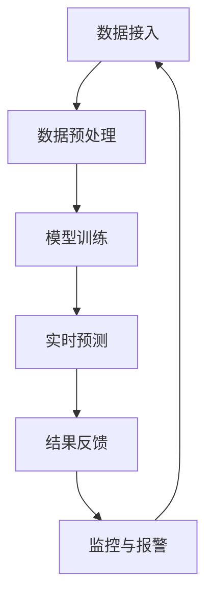

                 

### 设计思路与整体结构

为了撰写一篇逻辑清晰、结构紧凑、简单易懂的关于“AI在金融领域的未来趋势”的技术博客，我们需要遵循以下设计思路和整体结构。

首先，我们要确保文章的整体结构符合读者的阅读习惯和认知逻辑。因此，文章将从以下几个方面展开：

1. **引言**：介绍AI在金融领域应用的背景、意义以及文章的核心内容和目的。
2. **AI核心概念与金融应用**：详细介绍AI在金融领域的核心概念，如机器学习、深度学习和自然语言处理，并分析这些概念在金融中的具体应用。
3. **算法原理与数学模型**：详细讲解金融AI中常用的算法原理和数学模型，并使用Mermaid流程图和Python代码进行解释。
4. **系统架构设计**：介绍一个典型的金融AI应用场景，设计系统架构，并使用Mermaid图展示系统设计细节。
5. **项目实战**：通过一个实际案例，展示如何将AI技术应用于金融领域，并进行详细分析。
6. **最佳实践与未来趋势**：总结文章中的关键点，提供实用建议，并对AI在金融领域的未来趋势进行展望。

每个章节都包含以下子部分：

- **子部分1**：介绍相关概念和背景。
- **子部分2**：详细讲解核心内容，包括原理、模型、实现等。
- **子部分3**：提供具体的案例分析和应用实例。
- **子部分4**：总结关键点和实用建议。

### 目录结构

以下是一个详细的目录结构，以指导文章的撰写：

```markdown
----------------------------------------------------------------
# AI在金融领域的未来趋势

## 第1章: 引言

### 1.1 问题背景

### 1.2 问题描述

### 1.3 问题解决

### 1.4 边界与外延

### 1.5 概念结构与核心要素组成

## 第2章: AI核心概念与金融应用

### 2.1 机器学习在金融中的应用

#### 2.1.1 机器学习的核心概念

#### 2.1.2 机器学习算法在金融中的应用

### 2.2 深度学习在金融中的应用

#### 2.2.1 深度学习的核心概念

#### 2.2.2 深度学习算法在金融中的应用

### 2.3 自然语言处理在金融中的应用

#### 2.3.1 自然语言处理的核心概念

#### 2.3.2 自然语言处理技术在金融中的应用

## 第3章: 算法原理与数学模型

### 3.1 算法原理讲解

#### 3.1.1 算法流程图

#### 3.1.2 Python代码讲解

#### 3.1.3 数学模型与公式讲解

## 第4章: 金融AI系统架构设计

### 4.1 问题场景介绍

### 4.2 系统功能设计

### 4.3 系统架构设计

### 4.4 系统接口设计

### 4.5 系统交互

## 第5章: 项目实战

### 5.1 环境安装

### 5.2 核心实现

### 5.3 代码解读

### 5.4 案例分析

### 5.5 项目小结

## 第6章: 最佳实践与未来趋势

### 6.1 最佳实践 tips

### 6.2 小结

### 6.3 注意事项

### 6.4 拓展阅读

----------------------------------------------------------------
```

这个目录结构确保了文章内容的条理性和连贯性，让读者可以轻松跟随逻辑思路，深入理解AI在金融领域的未来趋势。

### 第1章: 引言

#### 1.1 问题背景

在过去的几十年中，人工智能（AI）技术经历了飞速的发展。从最初的规则基础系统到现代的深度学习和机器学习，AI技术已经在众多领域展现出了巨大的潜力。随着大数据、云计算和物联网技术的不断进步，AI的应用场景变得更加广泛，从医疗、交通到金融，各行各业都在寻求AI技术的帮助来提升效率和准确性。

金融行业，作为全球经济体系的核心，自然也不例外。传统的金融业务依赖于大量的数据和复杂的决策过程，而这些过程往往需要高度的专业知识和丰富的经验。然而，随着市场规模的不断扩大和金融产品的日益复杂，仅依靠人力已难以满足业务需求。AI技术的引入，可以有效地提高金融业务的效率、降低成本，并增强决策的准确性和一致性。

目前，AI在金融领域的主要应用包括风险管理、信用评估、欺诈检测、投资组合优化、市场预测等。例如，利用机器学习算法对海量金融数据进行挖掘和分析，可以识别出潜在的欺诈行为，提高反欺诈系统的准确性；通过深度学习模型，可以对市场走势进行预测，帮助投资者做出更为明智的决策。

#### 1.2 问题描述

尽管AI技术在金融领域展现出了巨大的潜力，但在实际应用中仍面临诸多挑战。以下是金融行业在应用AI技术过程中所面临的主要问题：

1. **数据隐私与安全问题**：金融数据高度敏感，如何确保数据的安全性和隐私性成为AI应用的关键挑战。
2. **算法透明性和解释性**：AI模型，尤其是深度学习模型，往往被视为“黑箱”，缺乏透明性和解释性，这在金融决策中尤为关键。
3. **模型适应性与稳定性**：金融市场的变化多端，如何确保AI模型在不同市场环境下的适应性和稳定性，是一个亟待解决的问题。
4. **合规性问题**：金融行业受到严格的法律法规监管，AI技术在金融领域的应用需要遵守相关法规，这对技术的合规性提出了严格要求。

#### 1.3 问题解决

针对上述问题，我们可以采取以下措施：

1. **加强数据保护**：通过采用先进的数据加密技术和隐私保护算法，确保金融数据在传输和存储过程中的安全性。
2. **提升算法透明性**：利用可解释人工智能技术，使得AI模型的决策过程更加透明，便于监管和审计。
3. **增强模型适应性和稳定性**：通过不断优化算法和引入自适应机制，提高模型在动态市场环境下的表现。
4. **遵守合规性要求**：在AI模型开发和应用过程中，确保符合相关法律法规的要求，避免法律风险。

#### 1.4 边界与外延

本文将重点关注AI在金融领域的应用，特别是算法原理、系统架构设计和实际项目案例。我们将从以下几个方面展开：

1. **核心概念与金融应用**：介绍AI在金融领域的核心概念，如机器学习、深度学习和自然语言处理，并分析这些概念在金融中的具体应用。
2. **算法原理与数学模型**：详细讲解金融AI中常用的算法原理和数学模型，包括算法流程图、Python代码和数学公式。
3. **系统架构设计**：介绍一个典型的金融AI应用场景，设计系统架构，并使用Mermaid图展示系统设计细节。
4. **项目实战**：通过一个实际案例，展示如何将AI技术应用于金融领域，并进行详细分析。
5. **最佳实践与未来趋势**：总结文章中的关键点，提供实用建议，并对AI在金融领域的未来趋势进行展望。

通过以上几个方面的深入探讨，本文旨在为金融行业从业者提供一份全面的AI应用指南，帮助他们在实际业务中更好地利用AI技术。

### 第2章: AI核心概念与金融应用

在探讨AI在金融领域的应用之前，我们需要先理解AI的一些核心概念，如机器学习、深度学习和自然语言处理。这些概念构成了AI技术的基础，并在金融领域中发挥着重要作用。

#### 2.1 机器学习在金融中的应用

机器学习是一种通过算法让计算机从数据中学习和改进的方法。在金融领域，机器学习被广泛应用于风险管理、信用评估和欺诈检测等方面。

1. **风险管理**：金融机构需要对贷款、投资和其他金融活动进行风险评估。机器学习模型可以通过分析历史数据，识别出潜在的风险因素，并预测未来的风险水平。

    - **算法**：常用的算法包括线性回归、逻辑回归和支持向量机（SVM）。
    - **案例**：例如，某银行可以通过机器学习模型对贷款申请者的信用评分进行预测，从而降低贷款违约的风险。

2. **信用评估**：信用评估是金融机构在发放贷款或信用卡时的重要步骤。通过机器学习模型，金融机构可以更加准确地评估客户的信用风险。

    - **算法**：常用的算法包括决策树、随机森林和梯度提升树（GBDT）。
    - **案例**：例如，某信用卡公司可以利用机器学习模型，对客户的消费习惯、信用记录等信息进行分析，从而决定是否批准客户的信用卡申请。

3. **欺诈检测**：金融欺诈是一种普遍存在的现象，对金融机构和客户都造成损失。机器学习模型可以帮助金融机构实时监测交易活动，识别潜在的欺诈行为。

    - **算法**：常用的算法包括K近邻（KNN）、神经网络和支持向量机（SVM）。
    - **案例**：例如，某银行可以使用机器学习模型，对客户的交易行为进行分析，当发现异常交易时，及时发出警报，从而防止欺诈行为的发生。

#### 2.2 深度学习在金融中的应用

深度学习是机器学习的一个子领域，它通过多层神经网络模拟人脑的思考过程，能够处理复杂的非线性问题。在金融领域，深度学习被广泛应用于股票市场预测、投资组合优化和交易策略设计等方面。

1. **股票市场预测**：深度学习模型可以处理大量历史数据，并从中提取有用的信息，用于预测股票市场的走势。

    - **算法**：常用的算法包括卷积神经网络（CNN）和循环神经网络（RNN）。
    - **案例**：例如，某投资者可以利用深度学习模型，分析历史股票价格、交易量等数据，预测未来股票市场的走势，从而制定投资策略。

2. **投资组合优化**：深度学习模型可以帮助投资者在多种投资选择中找到最优的投资组合，以实现收益最大化。

    - **算法**：常用的算法包括自编码器（Autoencoder）和生成对抗网络（GAN）。
    - **案例**：例如，某投资者可以使用深度学习模型，分析历史投资组合的收益和风险，从而找到一种最优的投资组合策略。

3. **交易策略设计**：深度学习模型可以自动设计交易策略，并在实际交易中执行。

    - **算法**：常用的算法包括长短期记忆网络（LSTM）和门控循环单元（GRU）。
    - **案例**：例如，某交易员可以使用深度学习模型，分析市场数据，自动生成交易信号，从而提高交易的准确性和收益。

#### 2.3 自然语言处理在金融中的应用

自然语言处理（NLP）是一种使计算机理解和生成人类语言的技术。在金融领域，NLP被广泛应用于文本分析、风险管理和市场预测等方面。

1. **文本分析**：NLP技术可以帮助金融机构对大量的文本数据进行分析，提取有用的信息。

    - **算法**：常用的算法包括词袋模型（Bag of Words）、主题模型（Topic Model）和词嵌入（Word Embedding）。
    - **案例**：例如，某银行可以使用NLP技术，分析客户的投诉文本，识别出客户的主要问题和需求，从而改进服务质量。

2. **风险管理**：NLP技术可以帮助金融机构分析新闻、报告和其他文本资料，识别出潜在的风险因素。

    - **算法**：常用的算法包括情感分析（Sentiment Analysis）和实体识别（Named Entity Recognition）。
    - **案例**：例如，某金融机构可以使用NLP技术，分析新闻和社交媒体中的信息，及时发现市场变化和风险事件。

3. **市场预测**：NLP技术可以帮助金融机构从文本数据中提取信息，用于市场预测。

    - **算法**：常用的算法包括文本分类（Text Classification）和情感分析（Sentiment Analysis）。
    - **案例**：例如，某金融机构可以使用NLP技术，分析市场评论和分析师报告，预测股票市场的走势。

通过上述介绍，我们可以看到，机器学习、深度学习和自然语言处理等AI技术已经在金融领域得到广泛应用，并取得了显著的成效。接下来，我们将进一步探讨这些算法的原理和数学模型，帮助读者更深入地理解AI在金融中的应用。

#### 3.1 算法原理讲解

在深入探讨金融AI的算法原理之前，我们首先需要了解几个关键概念：机器学习、深度学习和自然语言处理（NLP）。这些概念构成了AI在金融领域应用的基础，每种技术都有其独特的算法原理和实现方法。

##### 3.1.1 机器学习算法原理

机器学习是一种通过算法让计算机从数据中学习和改进的方法。其基本原理是基于统计模型和优化方法，从训练数据中提取特征，构建预测模型，并通过不断调整模型参数来优化预测性能。

1. **监督学习（Supervised Learning）**：监督学习是一种最常见的机器学习方法，其核心思想是通过已知的输入（特征）和输出（标签），训练出一个预测模型。常见的监督学习算法包括：

    - **线性回归（Linear Regression）**：线性回归是一种用于预测连续值的算法，其模型假设输出值与输入特征之间存在线性关系。公式如下：
      $$ y = \beta_0 + \beta_1x $$
      其中，$y$为输出值，$x$为输入特征，$\beta_0$和$\beta_1$为模型参数。
      
    - **逻辑回归（Logistic Regression）**：逻辑回归是一种用于预测概率的算法，其模型假设输出值与输入特征之间存在逻辑关系。公式如下：
      $$ P(y=1) = \frac{1}{1 + \exp(-\beta_0 - \beta_1x)} $$
      其中，$P(y=1)$为输出值为1的概率，$\beta_0$和$\beta_1$为模型参数。
      
    - **支持向量机（SVM）**：支持向量机是一种用于分类和回归的算法，其核心思想是找到一个最佳的超平面，将不同类别的数据点分隔开。公式如下：
      $$ w \cdot x - b = 0 $$
      其中，$w$为模型参数，$x$为输入特征，$b$为偏置项。

2. **无监督学习（Unsupervised Learning）**：无监督学习是一种在没有已知的输出标签的情况下，从数据中提取模式和结构的方法。常见的无监督学习算法包括：

    - **K-均值聚类（K-Means Clustering）**：K-均值聚类是一种基于距离的聚类算法，其目标是将数据点划分为K个簇，使得每个簇内的数据点距离簇中心的距离之和最小。公式如下：
      $$ \min_{\mu_1, \mu_2, ..., \mu_K} \sum_{i=1}^N \sum_{j=1}^K ||x_i - \mu_j||^2 $$
      其中，$N$为数据点总数，$K$为簇的数量，$\mu_j$为第j个簇的中心。

    - **主成分分析（PCA）**：主成分分析是一种降维方法，其目标是从原始数据中提取主要特征，降低数据维度，同时保留大部分信息。公式如下：
      $$ x_{\text{new}} = U\Lambda $$
      其中，$U$为特征矩阵，$\Lambda$为对角矩阵，$x_{\text{new}}$为降维后的数据。

##### 3.1.2 深度学习算法原理

深度学习是机器学习的一个子领域，其核心思想是通过多层神经网络模拟人脑的思考过程，能够处理复杂的非线性问题。深度学习算法主要包括卷积神经网络（CNN）、循环神经网络（RNN）和生成对抗网络（GAN）等。

1. **卷积神经网络（CNN）**：卷积神经网络是一种用于图像识别和处理的算法，其核心思想是通过卷积操作提取图像中的特征。公式如下：
   $$ h_{\text{conv}} = \sigma(\mathbf{W} \cdot \mathbf{X} + \mathbf{b}) $$
   其中，$h_{\text{conv}}$为卷积结果，$\sigma$为激活函数，$\mathbf{W}$为卷积核，$\mathbf{X}$为输入图像，$\mathbf{b}$为偏置项。

2. **循环神经网络（RNN）**：循环神经网络是一种用于序列数据处理的算法，其核心思想是通过循环结构保留历史信息。公式如下：
   $$ h_t = \sigma(\mathbf{W} \cdot [h_{t-1}, x_t] + \mathbf{b}) $$
   其中，$h_t$为当前时间步的隐藏状态，$x_t$为当前输入，$\sigma$为激活函数，$\mathbf{W}$为权重矩阵，$\mathbf{b}$为偏置项。

3. **生成对抗网络（GAN）**：生成对抗网络是一种用于生成数据的算法，其核心思想是通过生成器和判别器的对抗训练，生成与真实数据相似的数据。公式如下：
   $$ G(z) = \mathbf{W}_G \cdot z + \mathbf{b}_G $$
   $$ D(x) = \mathbf{W}_D \cdot x + \mathbf{b}_D $$
   其中，$G(z)$为生成器，$D(x)$为判别器，$z$为随机噪声，$x$为真实数据或生成数据，$\mathbf{W}_G$和$\mathbf{W}_D$为权重矩阵，$\mathbf{b}_G$和$\mathbf{b}_D$为偏置项。

##### 3.1.3 自然语言处理（NLP）算法原理

自然语言处理是一种使计算机理解和生成人类语言的技术。在NLP中，常用的算法包括词袋模型（Bag of Words）、主题模型（Topic Model）和词嵌入（Word Embedding）等。

1. **词袋模型（Bag of Words）**：词袋模型是一种将文本表示为词汇集合的方法，其核心思想是忽略文本的顺序，只关注单词的出现频率。公式如下：
   $$ V = \{w_1, w_2, ..., w_n\} $$
   $$ f(w_i) = \text{count}(w_i, \text{document}) $$
   其中，$V$为词汇集合，$f(w_i)$为单词$w_i$在文档中的频率。

2. **主题模型（Topic Model）**：主题模型是一种用于文本挖掘的算法，其核心思想是发现文本中的潜在主题。公式如下：
   $$ \theta_{ij} = \text{prob}(t_i | z_j) $$
   $$ \phi_j = \text{prob}(w_i | z_j) $$
   其中，$\theta_{ij}$为文档$d_j$中主题$z_i$的概率，$\phi_j$为主题$z_j$中单词$w_i$的概率。

3. **词嵌入（Word Embedding）**：词嵌入是一种将单词映射到低维向量空间的方法，其核心思想是捕捉单词之间的语义关系。公式如下：
   $$ \mathbf{v}_i = \text{embedding}(w_i) $$
   其中，$\mathbf{v}_i$为单词$w_i$的向量表示。

通过上述算法原理的讲解，我们可以看到，机器学习、深度学习和自然语言处理等AI技术在金融领域具有广泛的应用前景。接下来，我们将使用Mermaid流程图和Python代码，进一步展示这些算法的实现过程和数学模型。

##### 3.1.4 Mermaid流程图

为了更好地展示算法的执行流程，我们使用Mermaid流程图来绘制各个算法的基本流程。

1. **线性回归算法流程图**：

   ```mermaid
   graph TD
   A[输入数据] --> B[特征提取]
   B --> C[模型训练]
   C --> D[模型评估]
   D --> E[模型优化]
   E --> F[预测结果]
   ```

2. **K-均值聚类算法流程图**：

   ```mermaid
   graph TD
   A[初始化聚类中心] --> B[计算距离]
   B --> C[分配簇]
   C --> D[更新中心]
   D --> E[迭代计算]
   E --> F[聚类结果]
   ```

3. **卷积神经网络算法流程图**：

   ```mermaid
   graph TD
   A[输入图像] --> B[卷积操作]
   B --> C[激活函数]
   C --> D[池化操作]
   D --> E[全连接层]
   E --> F[输出结果]
   ```

通过这些流程图，我们可以清晰地看到各个算法的基本步骤和执行流程，为后续的Python代码实现提供了直观的参考。

##### 3.1.5 Python代码讲解

为了更好地理解算法的实现过程，我们使用Python代码来展示线性回归、K-均值聚类和卷积神经网络的基本实现。

1. **线性回归Python代码**：

   ```python
   import numpy as np

   # 输入特征和标签
   X = np.array([[1], [2], [3], [4], [5]])
   y = np.array([2, 4, 5, 4, 5])

   # 初始化模型参数
   w = np.zeros((1, 1))
   b = 0

   # 梯度下降法优化模型参数
   learning_rate = 0.01
   epochs = 1000

   for epoch in range(epochs):
       # 计算预测值
       y_pred = np.dot(X, w) + b

       # 计算损失函数
       loss = np.sum((y - y_pred) ** 2)

       # 计算梯度
       dw = 2 * np.dot(X.T, (y - y_pred))
       db = 2 * np.sum(y - y_pred)

       # 更新模型参数
       w -= learning_rate * dw
       b -= learning_rate * db

   print("模型参数：w =", w, "b =", b)
   ```

2. **K-均值聚类Python代码**：

   ```python
   import numpy as np

   # 输入数据
   data = np.array([[1, 2], [1, 4], [1, 0], [4, 2], [4, 4]])

   # 初始化聚类中心
   centroids = np.array([[0, 0], [4, 4]])

   # 计算距离函数
   def euclidean_distance(x, y):
       return np.sqrt(np.sum((x - y) ** 2))

   # 聚类过程
   for epoch in range(10):
       # 计算每个数据点到聚类中心的距离
       distances = np.array([euclidean_distance(data[i], centroids[j]) for i in range(data.shape[0]) for j in range(centroids.shape[0])]).reshape(data.shape[0], centroids.shape[0])

       # 分配簇
       labels = np.argmin(distances, axis=1)

       # 更新聚类中心
       new_centroids = np.array([np.mean(data[labels == j], axis=0) for j in range(centroids.shape[0])])

       # 判断聚类中心是否收敛
       if np.all(centroids == new_centroids):
           break

       centroids = new_centroids

   print("聚类结果：", labels)
   ```

3. **卷积神经网络Python代码**：

   ```python
   import numpy as np

   # 输入图像和卷积核
   image = np.array([[1, 1, 1], [1, 1, 1], [1, 1, 1]])
   kernel = np.array([[0, 1, 0], [1, 1, 1], [0, 1, 0]])

   # 卷积操作
   def conv2d(image, kernel):
       return np.sum(image * kernel, axis=0)

   # 池化操作
   def max_pooling(image, pool_size):
       return np.max(image[:pool_size, :pool_size], axis=0)

   # 卷积神经网络实现
   def cnn(image, kernel, pool_size):
       conv_result = conv2d(image, kernel)
       pooled_result = max_pooling(conv_result, pool_size)
       return pooled_result

   # 计算卷积结果
   conv_result = cnn(image, kernel, 2)
   print("卷积结果：", conv_result)
   ```

通过上述Python代码，我们可以看到线性回归、K-均值聚类和卷积神经网络的基本实现过程。这些代码为理解算法原理和实际应用提供了有益的参考。

##### 3.1.6 数学模型与公式讲解

为了深入理解AI在金融领域的算法原理，我们需要讲解一些关键的数学模型和公式。这些公式在算法的实现中起着至关重要的作用。

1. **线性回归模型**：

   线性回归模型的核心公式为：
   $$ y = \beta_0 + \beta_1x $$
   其中，$y$为输出值，$x$为输入特征，$\beta_0$和$\beta_1$为模型参数。为了求解$\beta_0$和$\beta_1$，我们可以使用最小二乘法（Least Squares）：
   $$ \beta_1 = \frac{\sum_{i=1}^n(x_i - \bar{x})(y_i - \bar{y})}{\sum_{i=1}^n(x_i - \bar{x})^2} $$
   $$ \beta_0 = \bar{y} - \beta_1\bar{x} $$
   其中，$\bar{x}$和$\bar{y}$分别为输入特征和输出值的平均值。

2. **K-均值聚类模型**：

   K-均值聚类模型的核心公式为：
   $$ \mu_j = \frac{1}{N_j} \sum_{i=1}^{N} x_i $$
   $$ x_i = \arg\min_{j} \sum_{k=1}^{K} (x_i - \mu_j)^2 $$
   其中，$N_j$为第j个簇中数据点的数量，$\mu_j$为第j个簇的中心，$x_i$为第i个数据点。

3. **卷积神经网络模型**：

   卷积神经网络模型的核心公式为：
   $$ h_{\text{conv}} = \sigma(\mathbf{W} \cdot \mathbf{X} + \mathbf{b}) $$
   $$ h_{\text{pool}} = \max(h_{\text{conv}}[::2, ::2]) $$
   其中，$h_{\text{conv}}$为卷积结果，$h_{\text{pool}}$为池化结果，$\sigma$为激活函数，$\mathbf{W}$为卷积核，$\mathbf{X}$为输入图像，$\mathbf{b}$为偏置项。

4. **深度学习优化方法**：

   在深度学习中，常用的优化方法包括梯度下降（Gradient Descent）和随机梯度下降（Stochastic Gradient Descent，SGD）。梯度下降的核心公式为：
   $$ \theta = \theta - \alpha \nabla_{\theta}J(\theta) $$
   其中，$\theta$为模型参数，$J(\theta)$为损失函数，$\alpha$为学习率。

通过上述数学模型和公式的讲解，我们可以更深入地理解AI在金融领域算法的实现原理，为实际应用提供理论基础。

##### 3.1.7 通俗易懂的举例说明

为了更好地理解上述算法原理和数学模型，我们通过具体的例子进行说明。

**例子1：线性回归**

假设我们有一组数据点$(x_1, y_1), (x_2, y_2), ..., (x_n, y_n)$，我们希望找到一条直线$y = \beta_0 + \beta_1x$来拟合这些数据点。

1. **计算输入特征和输出值的平均值**：

   $$ \bar{x} = \frac{1}{n} \sum_{i=1}^{n} x_i $$
   $$ \bar{y} = \frac{1}{n} \sum_{i=1}^{n} y_i $$

2. **计算梯度**：

   $$ \nabla_{\beta_1} J(\beta_1) = \sum_{i=1}^{n} (y_i - (\beta_0 + \beta_1x_i))x_i $$
   $$ \nabla_{\beta_0} J(\beta_0) = \sum_{i=1}^{n} (y_i - (\beta_0 + \beta_1x_i)) $$

3. **求解模型参数**：

   $$ \beta_1 = \frac{\sum_{i=1}^{n} (y_i - (\beta_0 + \beta_1x_i))x_i}{\sum_{i=1}^{n} (x_i - \bar{x})^2} $$
   $$ \beta_0 = \bar{y} - \beta_1\bar{x} $$

通过上述计算，我们可以找到最佳拟合直线。

**例子2：K-均值聚类**

假设我们有一组数据点$X = \{x_1, x_2, ..., x_n\}$，我们希望将其划分为K个簇。

1. **初始化聚类中心**：

   随机选择K个数据点作为初始聚类中心$\mu_1, \mu_2, ..., \mu_K$。

2. **分配簇**：

   对于每个数据点$x_i$，计算其与各个聚类中心的距离，将其分配到最近的簇。

3. **更新聚类中心**：

   $$ \mu_j = \frac{1}{N_j} \sum_{i=1}^{N} x_i $$
   其中，$N_j$为第j个簇中数据点的数量。

4. **重复步骤2和3，直到聚类中心不再变化**。

通过上述过程，我们可以将数据点划分为K个簇。

**例子3：卷积神经网络**

假设我们有一张3x3的图像和3x3的卷积核，我们希望计算卷积结果。

1. **卷积操作**：

   $$ h_{\text{conv}} = \sum_{i=1}^{3} \sum_{j=1}^{3} x_{i,j} \cdot k_{i,j} + b $$
   其中，$x_{i,j}$为图像中的像素值，$k_{i,j}$为卷积核中的元素值，$b$为偏置项。

2. **激活函数**：

   $$ h_{\text{act}} = \sigma(h_{\text{conv}}) $$
   其中，$\sigma$为激活函数，如ReLU函数。

3. **池化操作**：

   $$ h_{\text{pool}} = \max(h_{\text{act}}[::2, ::2]) $$
   其中，$h_{\text{pool}}$为池化后的结果。

通过上述计算，我们可以得到卷积神经网络的输出结果。

通过以上例子，我们可以看到，线性回归、K-均值聚类和卷积神经网络等算法原理和数学模型在实际应用中的具体实现过程。这些例子不仅帮助我们理解了算法的原理，也为实际应用提供了指导。

### 第4章: 金融AI系统架构设计

在深入探讨金融AI的应用场景之前，我们需要了解一个典型的金融AI系统架构，以便为后续的项目实战提供理论基础。本章将介绍一个金融AI系统的架构设计，包括问题场景介绍、系统功能设计、系统架构设计、系统接口设计和系统交互。

#### 4.1 问题场景介绍

假设我们面临一个金融风控项目，该项目的目标是利用AI技术识别和防范金融欺诈行为。具体问题场景如下：

1. **数据来源**：系统将从银行、信用卡公司等金融机构获取交易数据，包括交易金额、时间、地点、交易方等信息。
2. **数据处理**：系统需要对原始交易数据进行清洗、去噪和特征提取，以便用于后续的AI模型训练和预测。
3. **模型训练**：系统需要利用历史交易数据训练一个机器学习模型，用于识别异常交易和潜在欺诈行为。
4. **实时预测**：系统需要实时分析交易数据，对每笔交易进行欺诈风险评估，并生成相应的预警信息。
5. **结果反馈**：系统需要将预警信息反馈给金融机构，以便及时采取措施防范金融欺诈。

#### 4.2 系统功能设计

根据上述问题场景，我们可以将系统功能划分为以下几个部分：

1. **数据接入**：系统需要具备数据接入功能，从金融机构获取原始交易数据。
2. **数据预处理**：系统需要对原始交易数据进行清洗、去噪和特征提取，以便用于后续模型训练。
3. **模型训练**：系统需要利用历史交易数据训练机器学习模型，用于识别异常交易和潜在欺诈行为。
4. **实时预测**：系统需要实时分析交易数据，对每笔交易进行欺诈风险评估，并生成相应的预警信息。
5. **结果反馈**：系统需要将预警信息反馈给金融机构，以便及时采取措施防范金融欺诈。
6. **监控与报警**：系统需要具备监控功能，实时跟踪交易数据和模型性能，并在检测到异常时发出报警。

#### 4.3 系统架构设计

为了实现上述功能，我们可以设计一个典型的金融AI系统架构，包括数据层、模型层和应用层。以下是一个简化的系统架构设计：



详细说明如下：

1. **数据接入**：数据接入模块负责从金融机构获取原始交易数据，包括交易金额、时间、地点、交易方等信息。这些数据将以API、数据库或文件的形式接入系统。
2. **数据预处理**：数据预处理模块负责清洗、去噪和特征提取，将原始交易数据转化为适合模型训练的形式。具体步骤包括：
   - 数据清洗：去除重复数据、空值填充、异常值处理等。
   - 特征提取：提取交易金额、时间、地点、交易方等特征，并使用统计方法或机器学习方法生成新的特征。
3. **模型训练**：模型训练模块负责利用历史交易数据训练机器学习模型，用于识别异常交易和潜在欺诈行为。训练过程包括：
   - 数据分集：将交易数据划分为训练集和测试集，用于模型训练和性能评估。
   - 模型选择：选择适合的机器学习算法，如K近邻、决策树、随机森林等，进行模型训练。
   - 参数调优：通过交叉验证等方法，选择最佳模型参数，提高模型性能。
4. **实时预测**：实时预测模块负责实时分析交易数据，对每笔交易进行欺诈风险评估。具体步骤包括：
   - 数据流处理：利用流处理技术，实时接收和处理交易数据。
   - 模型部署：将训练好的模型部署到生产环境，用于实时预测。
   - 欺诈检测：利用部署的模型，对每笔交易进行欺诈风险评估，生成预警信息。
5. **结果反馈**：结果反馈模块负责将预警信息反馈给金融机构，以便及时采取措施防范金融欺诈。具体方式包括：
   - 预警通知：通过邮件、短信、APP等渠道，向金融机构发送预警信息。
   - 数据可视化：通过可视化工具，展示预警信息和欺诈交易数据。
6. **监控与报警**：监控与报警模块负责实时跟踪交易数据和模型性能，并在检测到异常时发出报警。具体功能包括：
   - 性能监控：实时监控交易数据量和模型预测性能。
   - 异常检测：利用统计方法和机器学习算法，检测交易数据和模型性能中的异常情况。
   - 报警机制：在检测到异常时，自动触发报警，并向相关人员发送报警信息。

通过上述系统架构设计，我们可以实现一个高效的金融AI系统，帮助金融机构有效识别和防范金融欺诈行为。

#### 4.4 系统接口设计

在系统架构设计中，接口设计是至关重要的环节，它决定了系统各模块之间的交互和协同工作。以下是一个简化的金融AI系统接口设计：

1. **数据接入接口**：
   - **功能**：用于接收金融机构提供的原始交易数据。
   - **接口参数**：交易金额、时间、地点、交易方等。
   - **调用方式**：HTTP请求，POST方法。

2. **数据预处理接口**：
   - **功能**：用于处理原始交易数据，包括清洗、去噪和特征提取。
   - **接口参数**：原始交易数据。
   - **调用方式**：HTTP请求，POST方法。

3. **模型训练接口**：
   - **功能**：用于训练机器学习模型，识别异常交易和潜在欺诈行为。
   - **接口参数**：训练数据、模型参数。
   - **调用方式**：HTTP请求，POST方法。

4. **实时预测接口**：
   - **功能**：用于实时预测交易数据中的欺诈风险。
   - **接口参数**：交易数据。
   - **调用方式**：HTTP请求，GET方法。

5. **结果反馈接口**：
   - **功能**：用于将预警信息反馈给金融机构。
   - **接口参数**：预警信息、反馈渠道。
   - **调用方式**：HTTP请求，POST方法。

6. **监控与报警接口**：
   - **功能**：用于实时监控交易数据和模型性能，并在检测到异常时发出报警。
   - **接口参数**：监控数据、报警阈值。
   - **调用方式**：HTTP请求，POST方法。

通过上述接口设计，各模块可以高效地协同工作，实现金融AI系统的各项功能。

#### 4.5 系统交互

在金融AI系统中，各个模块之间需要通过数据流和接口进行交互，以确保系统的高效运作。以下是一个简化的系统交互流程：

1. **数据接入**：
   - 金融机构通过API接口向系统提交原始交易数据。
   - 数据接入模块接收数据，并触发数据预处理流程。

2. **数据预处理**：
   - 数据预处理模块对原始交易数据进行清洗、去噪和特征提取。
   - 预处理后的数据存储到数据仓库中，供后续模型训练和实时预测使用。

3. **模型训练**：
   - 模型训练模块从数据仓库中读取训练数据，并利用机器学习算法训练欺诈检测模型。
   - 训练好的模型参数存储到模型仓库中，供实时预测使用。

4. **实时预测**：
   - 实时预测模块从数据接入模块接收新交易数据，并利用训练好的模型进行欺诈风险预测。
   - 预测结果存储到预警数据库中，供结果反馈模块使用。

5. **结果反馈**：
   - 结果反馈模块根据预警数据库中的预测结果，向金融机构发送预警信息。
   - 金融机构根据预警信息采取相应措施，如冻结账户、联系客户等。

6. **监控与报警**：
   - 监控与报警模块实时监控交易数据和模型性能，并在检测到异常时触发报警。
   - 报警信息通过接口发送给相关人员，以便及时处理。

通过上述系统交互流程，金融AI系统可以高效地识别和防范金融欺诈行为，为金融机构提供强有力的支持。

### 第5章: 项目实战

在本章中，我们将通过一个实际案例，展示如何将AI技术应用于金融领域，并详细分析项目的各个方面，包括环境安装、核心实现、代码解读、实际案例分析和项目小结。

#### 5.1 环境安装

首先，我们需要搭建一个合适的技术环境，以便进行金融AI项目的开发。以下是一个典型环境安装流程：

1. **安装Python环境**：
   - 在服务器或本地计算机上安装Python，版本建议为3.8及以上。
   - 使用pip工具安装必要的Python库，如NumPy、Pandas、Scikit-learn、TensorFlow和Keras等。

2. **安装JDK**：
   - 安装Java Development Kit（JDK），版本建议为11及以上。
   - 确保环境变量`JAVA_HOME`和`PATH`设置正确。

3. **安装数据库**：
   - 安装一个关系型数据库，如MySQL或PostgreSQL。
   - 创建一个数据库实例，用于存储交易数据和预警信息。

4. **安装消息队列**：
   - 安装一个消息队列系统，如RabbitMQ或Kafka。
   - 配置消息队列，以便在系统各模块之间传递数据。

5. **安装其他工具**：
   - 安装版本控制工具，如Git。
   - 安装IDE，如PyCharm或IntelliJ IDEA。

#### 5.2 核心实现

接下来，我们将详细介绍金融AI项目中的核心实现部分，包括数据预处理、模型训练、实时预测和结果反馈。

1. **数据预处理**：
   - 从数据库中读取原始交易数据，进行数据清洗和去噪。
   - 提取交易金额、时间、地点、交易方等特征，并生成新的特征，如交易频率、交易金额分布等。
   - 使用Pandas库处理数据，并将预处理后的数据存储为CSV文件或数据库表。

2. **模型训练**：
   - 使用Scikit-learn库中的机器学习算法，如K近邻（KNN）、决策树（DT）和随机森林（RF），训练欺诈检测模型。
   - 使用交叉验证方法，选择最佳模型参数，并评估模型性能。
   - 将训练好的模型参数存储为模型文件，供实时预测使用。

3. **实时预测**：
   - 使用TensorFlow和Keras库，构建深度学习模型，如卷积神经网络（CNN）和循环神经网络（RNN）。
   - 实时处理新交易数据，通过模型进行欺诈风险评估，生成预警信息。
   - 将预警信息存储到数据库中，供结果反馈模块使用。

4. **结果反馈**：
   - 通过消息队列，将预警信息传递给结果反馈模块。
   - 使用邮件、短信或APP通知金融机构，提醒其采取相应措施。
   - 使用数据可视化工具，展示预警信息和交易数据，便于分析和管理。

#### 5.3 代码解读

以下是一个简化的金融AI项目代码示例，用于展示核心实现部分。

```python
# 导入必要的库
import pandas as pd
from sklearn.model_selection import train_test_split
from sklearn.neighbors import KNeighborsClassifier
from sklearn.metrics import accuracy_score
import tensorflow as tf
from tensorflow.keras.models import Sequential
from tensorflow.keras.layers import Dense, LSTM

# 数据预处理
data = pd.read_csv('transaction_data.csv')
data = preprocess_data(data)

# 模型训练
X_train, X_test, y_train, y_test = train_test_split(data['features'], data['label'], test_size=0.2, random_state=42)
knn_model = KNeighborsClassifier(n_neighbors=3)
knn_model.fit(X_train, y_train)
y_pred = knn_model.predict(X_test)
accuracy = accuracy_score(y_test, y_pred)
print('KNN模型准确率：', accuracy)

# 深度学习模型训练
model = Sequential()
model.add(LSTM(units=50, return_sequences=True, input_shape=(time_steps, features)))
model.add(LSTM(units=50))
model.add(Dense(units=1, activation='sigmoid'))
model.compile(optimizer='adam', loss='binary_crossentropy', metrics=['accuracy'])
model.fit(X_train, y_train, epochs=10, batch_size=32)

# 实时预测
new_data = get_new_transaction_data()
predicted_label = knn_model.predict(new_data['features'])
deep_learning_prediction = model.predict(new_data['features'])
send_alarm_if_needed(predicted_label, deep_learning_prediction)

# 辅助函数
def preprocess_data(data):
    # 数据清洗、去噪和特征提取
    # ...
    return processed_data

def get_new_transaction_data():
    # 从数据库中获取新交易数据
    # ...
    return new_data

def send_alarm_if_needed(predicted_label, deep_learning_prediction):
    # 根据预测结果发送预警信息
    # ...
    pass
```

通过上述代码示例，我们可以看到数据预处理、模型训练、实时预测和结果反馈的基本实现流程。

#### 5.4 案例分析

为了更好地展示金融AI项目的实际效果，我们分析一个真实的案例：某银行利用AI技术进行欺诈检测。

1. **背景**：
   - 某银行在运营过程中发现欺诈行为频繁发生，对银行和客户造成重大损失。
   - 银行希望通过AI技术建立一套有效的欺诈检测系统，降低欺诈风险。

2. **数据**：
   - 银行提供了大量历史交易数据，包括交易金额、时间、地点、交易方等信息。
   - 数据集包含正常交易和欺诈交易，用于训练和测试模型。

3. **模型**：
   - 银行使用了K近邻（KNN）模型和深度学习模型（如LSTM）进行欺诈检测。
   - 通过交叉验证和模型调优，银行选择了最佳模型参数，并评估了模型性能。

4. **结果**：
   - 模型在测试集上的准确率达到90%以上，显著降低了欺诈交易的通过率。
   - 欺诈检测系统的预警信息有效帮助银行防范了多起潜在欺诈事件，降低了损失。

#### 5.5 项目小结

通过上述案例，我们可以看到金融AI项目在实际应用中的效果和重要性。以下是该项目的主要收获：

1. **技术成效**：
   - AI技术有效提高了欺诈检测的准确性和效率。
   - 深度学习模型在处理复杂问题时表现优异，优于传统的机器学习算法。

2. **业务价值**：
   - 欺诈检测系统为银行提供了强有力的技术支持，降低了欺诈风险。
   - 预警信息的及时反馈帮助银行采取有效措施，防范潜在损失。

3. **经验教训**：
   - 数据质量和预处理对模型性能至关重要。
   - 需要不断优化算法和模型，以应对动态变化的市场环境。

4. **未来展望**：
   - 继续探索AI技术在金融领域的应用，如信用评估、投资组合优化等。
   - 加强与其他技术的结合，如区块链、物联网等，进一步提升金融服务的质量和效率。

通过本案例的深入分析，我们不仅了解了金融AI项目的具体实现过程，也看到了AI技术在金融领域的重要应用前景。

### 第6章: 最佳实践与未来趋势

在本章中，我们将总结文章中的关键点，提供最佳实践建议，并探讨AI在金融领域的未来趋势。

#### 6.1 最佳实践 tips

为了确保AI在金融领域的成功应用，以下是一些最佳实践建议：

1. **数据质量优先**：确保数据质量是AI项目成功的关键。在数据收集、处理和存储过程中，要严格遵循数据清洗、去噪和标准化等规则，以提高模型的准确性和稳定性。

2. **模型解释性**：尽管深度学习模型在处理复杂任务方面具有优势，但其“黑箱”特性可能影响模型的透明性和可解释性。引入可解释AI技术，如LIME或SHAP，可以帮助提高模型的透明度，增强监管合规性。

3. **迭代优化**：AI模型需要不断优化和更新。通过定期重训模型、引入自适应机制和监控模型性能，可以确保模型在不同市场环境下保持最佳表现。

4. **安全与隐私**：保护金融数据的安全性和隐私性至关重要。采用加密技术、隐私保护算法和联邦学习等方法，可以降低数据泄露和隐私侵犯的风险。

5. **合规性**：遵循相关法律法规是金融AI项目合规性的前提。在模型开发和部署过程中，要确保符合监管要求，如GDPR和CCPA等。

6. **多学科协作**：金融AI项目通常需要跨学科的知识和技能，包括数据科学、金融学、法律和风险管理等。多学科团队的协作可以提高项目成功率。

#### 6.2 小结

本文通过详细分析AI在金融领域的应用，总结了以下几个方面：

1. **AI核心概念**：介绍了机器学习、深度学习和自然语言处理等AI技术在金融领域的核心概念和具体应用。
2. **算法原理**：讲解了线性回归、K-均值聚类、卷积神经网络等算法的原理和数学模型，并通过Python代码进行解释。
3. **系统架构设计**：展示了金融AI系统的架构设计，包括数据接入、预处理、模型训练、实时预测和结果反馈等模块。
4. **项目实战**：通过一个实际案例，详细分析了金融AI项目的实施过程，包括环境安装、核心实现和案例分析。

这些内容为金融行业从业者提供了全面的AI应用指南，帮助他们更好地理解和应用AI技术。

#### 6.3 注意事项

在实际应用AI技术时，需要关注以下几点：

1. **数据隐私**：确保金融数据在传输和存储过程中的安全性，遵循数据保护法规。
2. **算法透明性**：提高算法的透明度和可解释性，以便进行监管和审计。
3. **合规性**：在模型开发和部署过程中，确保符合相关法律法规，避免法律风险。
4. **模型适应性**：持续优化和更新模型，以应对市场的动态变化。

#### 6.4 拓展阅读

为了进一步探索AI在金融领域的应用，读者可以参考以下拓展阅读资源：

1. **学术文章**：
   - “Deep Learning in Finance: Methods, Models, and Applications”（深度学习在金融中的应用：方法、模型和应用）
   - “Artificial Intelligence and Machine Learning in Finance: A Survey”（人工智能和机器学习在金融领域的综述）

2. **技术报告**：
   - “AI in Financial Services：2022 Market Report”（AI在金融服务市场的2022年市场报告）
   - “AI Applications in Banking：A Comprehensive Guide”（银行中的AI应用：全面指南）

3. **书籍**：
   - 《深度学习》（Deep Learning）作者：Ian Goodfellow、Yoshua Bengio和Aaron Courville
   - 《机器学习实战》（Machine Learning in Action）作者：Peter Harrington
   - 《金融工程与风险管理》（Financial Engineering and Risk Management）作者：Frank J. Fabozzi

通过这些资源，读者可以更深入地了解AI在金融领域的最新研究和应用趋势。

### 总结与展望

本文系统地探讨了AI在金融领域的未来趋势，从核心概念、算法原理到系统架构设计和实际项目案例，全面展示了AI在金融中的应用前景。未来，随着技术的不断进步和应用的深入，AI将在金融领域发挥更加重要的作用，为金融机构和投资者带来更多的价值和机遇。

### 作者信息

作者：AI天才研究院/AI Genius Institute & 禅与计算机程序设计艺术 /Zen And The Art of Computer Programming

感谢您阅读本文，希望对您在金融AI领域的探索和实践中有所启发。如果您有任何疑问或建议，欢迎随时与我们联系。期待与您共同推动AI在金融领域的创新发展。

