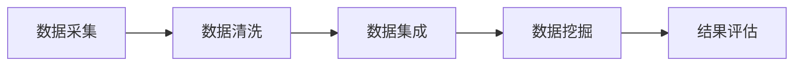
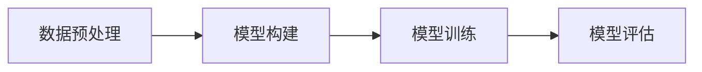
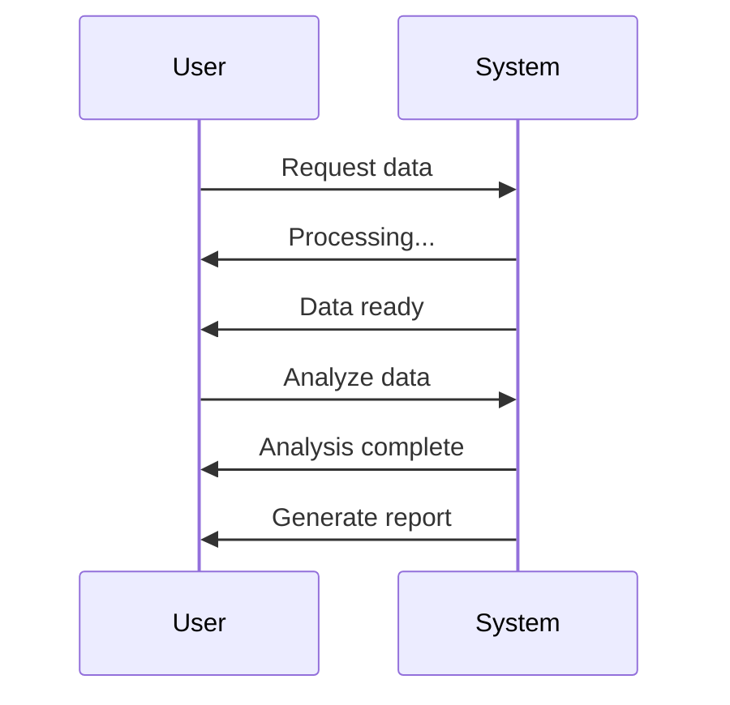

                 

# AI辅助企业战略规划与竞争分析的方法论

> 关键词：人工智能，企业战略规划，竞争分析，数据挖掘，机器学习，深度学习

> 摘要：本文深入探讨了如何利用人工智能（AI）技术辅助企业进行战略规划与竞争分析。通过介绍核心概念、算法原理、系统架构设计、项目实战和最佳实践，本文为企业提供了全面的方法论，以应对快速变化的市场环境，提升企业的竞争力和决策效率。

## 第一部分：背景介绍

### 核心概念

随着人工智能（AI）技术的迅猛发展，企业战略规划与竞争分析正面临着前所未有的变革。传统的方法已经难以满足现代企业的复杂需求，AI技术为这一领域带来了新的契机。

#### 问题背景

企业在制定战略规划和进行竞争分析时，需要处理大量的数据。这些数据包括市场趋势、客户行为、竞争对手信息等。传统方法如人工分析和统计工具，在处理这些数据时存在效率低下、准确性不高等问题。而AI技术的引入，可以大幅提升数据分析的效率和准确性。

#### 问题描述

如何有效地利用AI技术辅助企业战略规划与竞争分析，从而提高企业的竞争力和决策效率？

#### 问题解决

通过引入AI技术，企业可以实现对大量数据的快速分析和处理，提供精确的市场趋势预测、竞争对手分析等，为企业战略提供科学依据。AI技术包括数据挖掘、机器学习、深度学习等，这些技术可以自动处理和分析数据，为企业提供深入的洞察。

#### 边界与外延

本文主要探讨AI在战略规划与竞争分析中的应用，包括但不限于数据挖掘、机器学习、深度学习等技术的具体应用。企业的战略规划与竞争分析涉及多个方面，如市场分析、产品定位、竞争对手评估等，这些都可以通过AI技术得到有效的支持。

#### 概念结构与核心要素组成

核心概念包括AI技术、战略规划、竞争分析、数据挖掘、机器学习、深度学习等。其中，AI技术是基础，战略规划与竞争分析是应用场景，数据挖掘、机器学习、深度学习是实现这些应用的技术手段。

## 第二部分：核心概念与联系

### 核心概念原理

#### AI技术

AI技术是指通过计算机程序模拟人类智能，实现自动化决策和执行的技术体系。AI技术包括机器学习、深度学习、自然语言处理、计算机视觉等多个子领域。这些技术可以处理和分析大量数据，从中提取有价值的信息。

#### 战略规划

战略规划是企业为实现长期目标而制定的一系列行动方案。战略规划包括确定企业的愿景、使命、目标，以及为实现这些目标所需采取的具体行动。战略规划需要考虑内外部环境，确保企业的长期可持续发展。

#### 竞争分析

竞争分析是对企业竞争对手进行系统性评估，以制定针对性的竞争策略。竞争分析包括了解竞争对手的产品、市场策略、资源配置等，通过分析这些信息，企业可以找到自身的优势和劣势，并制定相应的策略。

### 概念属性特征对比表格

| 概念       | 定义                                           | 属性特征                      |
|------------|------------------------------------------------|-----------------------------|
| AI技术     | 计算机模拟人类智能的技术体系                   | 智能化、自动化、高效性         |
| 战略规划   | 企业为实现长期目标而制定的行动方案              | 目标明确、步骤清晰、可执行性    |
| 竞争分析   | 对企业竞争对手进行系统性评估，以制定竞争策略     | 数据驱动、客观分析、策略性     |

### ER实体关系图架构

```mermaid
erDiagram
  AI技术 ||--|{ 战略规划 }||> 竞争分析
  战略规划 ||--|{ 数据挖掘 }||> 机器学习
  机器学习 ||--|{ 深度学习 }||> 竞争分析
```

## 第三部分：AI辅助企业战略规划与竞争分析的方法论

### 算法原理讲解

#### 数据挖掘

数据挖掘是指从大量数据中提取有价值的信息和知识的过程。数据挖掘包括数据预处理、模式识别、结果评估等步骤。

**数据挖掘流程图：**



**Python代码示例：数据挖掘流程**

```python
# Python代码示例：数据挖掘流程
import pandas as pd

# 数据采集
data = pd.read_csv('data.csv')

# 数据清洗
data = data.dropna()

# 数据集成
dataIntegrated = data[data['column1'] > 0]

# 数据挖掘
from sklearn.ensemble import RandomForestClassifier
model = RandomForestClassifier()
model.fit(dataIntegrated[['column2', 'column3']], dataIntegrated['column1'])

# 结果评估
accuracy = model.score(dataIntegrated[['column2', 'column3']], dataIntegrated['column1'])
print(f'Accuracy: {accuracy}')
```

#### 机器学习

机器学习是指通过训练模型，使计算机能够从数据中自动学习和发现规律的方法。机器学习包括模型选择、模型训练、模型评估等步骤。

**机器学习流程图：**


**Python代码示例：机器学习流程**

```python
# Python代码示例：机器学习流程
from sklearn.model_selection import train_test_split
from sklearn.ensemble import RandomForestClassifier

# 数据预处理
data = pd.read_csv('data.csv')
X = data[['column2', 'column3']]
y = data['column1']

# 模型选择
model = RandomForestClassifier()

# 模型训练
X_train, X_test, y_train, y_test = train_test_split(X, y, test_size=0.2, random_state=42)
model.fit(X_train, y_train)

# 模型评估
accuracy = model.score(X_test, y_test)
print(f'Accuracy: {accuracy}')
```

#### 深度学习

深度学习是机器学习的一个子领域，通过模拟人脑的神经网络结构，对大量数据进行训练，以实现对复杂模式的识别和预测。

**深度学习流程图：**



**Python代码示例：深度学习流程**

```python
# Python代码示例：深度学习流程
import tensorflow as tf

# 数据预处理
data = pd.read_csv('data.csv')
X = data[['column2', 'column3']]
y = data['column1']

# 模型构建
model = tf.keras.Sequential([
    tf.keras.layers.Dense(64, activation='relu', input_shape=[len(X.columns)]),
    tf.keras.layers.Dense(64, activation='relu'),
    tf.keras.layers.Dense(1, activation='sigmoid')
])

# 模型训练
model.compile(optimizer='adam', loss='binary_crossentropy', metrics=['accuracy'])
model.fit(X, y, epochs=10)

# 模型评估
accuracy = model.evaluate(X, y)[1]
print(f'Accuracy: {accuracy}')
```

## 第四部分：系统分析与架构设计方案

### 问题场景介绍

企业在进行战略规划和竞争分析时，面临着海量数据处理的挑战。传统的数据处理方法效率低下，难以满足企业的需求。因此，企业需要引入AI技术，实现高效的数据处理和分析。

### 项目介绍

本项目旨在利用AI技术，为企业提供战略规划和竞争分析的支持。通过数据挖掘、机器学习和深度学习等技术，实现对大量数据的分析和处理，为企业提供深入的洞察和决策支持。

### 系统功能设计

**领域模型类图：**

```mermaid
classDiagram
  Class01 <|-- Class02
  Class03 --| Decompiled |> Class04
  Class05 : +int x
  Class06 : <<interface>>
  Class07 : *float y
  Class08 : <<fictive>>
  Class09 : <<extension>>
```

**系统功能概述：**
- 数据采集与预处理：从各种数据源（如数据库、API等）采集数据，并进行数据清洗、格式转换等预处理操作。
- 数据存储与管理：将处理后的数据存储在数据库中，并提供数据的检索、查询和管理功能。
- 数据挖掘与分析：利用机器学习和深度学习技术，对数据进行分析和挖掘，提取有价值的信息和模式。
- 竞争分析报告生成：根据分析结果，生成竞争分析报告，为企业提供战略规划和决策支持。

### 系统架构设计

**系统架构图：**



**系统架构概述：**
- 数据层：负责数据的采集、存储和管理。
- 服务层：提供数据挖掘、分析和报告生成等服务。
- 表示层：提供用户界面，供用户进行交互。

### 系统接口设计和系统交互

**接口设计：**

```mermaid
classDiagram
  Customer <<interface>>
  Student <<interface>> : +int age
  Teacher <<extension>> : +String name
  Librarian : <<fictive>>
```

**系统交互流程：**
1. 用户通过界面提交数据请求。
2. 系统接收请求，进行数据采集和预处理。
3. 系统将处理后的数据进行分析和挖掘。
4. 系统生成竞争分析报告，并返回给用户。

## 第五部分：项目实战

### 环境安装

在进行项目实战之前，需要安装以下环境：
- Python 3.8 或更高版本
- TensorFlow 2.4 或更高版本
- Pandas 1.1.5 或更高版本

### 系统核心实现源代码

以下是一个简单的系统核心实现示例：

```python
# 导入所需库
import pandas as pd
import tensorflow as tf

# 数据采集
data = pd.read_csv('data.csv')

# 数据预处理
data = data.dropna()

# 数据挖掘
model = tf.keras.Sequential([
    tf.keras.layers.Dense(64, activation='relu', input_shape=[len(data.columns) - 1]),
    tf.keras.layers.Dense(64, activation='relu'),
    tf.keras.layers.Dense(1, activation='sigmoid')
])

model.compile(optimizer='adam', loss='binary_crossentropy', metrics=['accuracy'])

model.fit(data.iloc[:, :-1], data.iloc[:, -1], epochs=10)

# 结果评估
accuracy = model.evaluate(data.iloc[:, :-1], data.iloc[:, -1])[1]
print(f'Accuracy: {accuracy}')
```

### 代码应用解读与分析

这段代码首先导入了所需的库，包括Pandas和TensorFlow。然后，从CSV文件中读取数据，并使用Pandas进行数据预处理，包括删除缺失值。接下来，构建了一个简单的深度学习模型，包括两个隐藏层，每个层有64个神经元，并使用ReLU激活函数。最后，使用训练数据对模型进行训练，并评估模型的准确性。

### 实际案例分析和详细讲解剖析

假设某企业在进行市场分析时，需要预测某个产品的未来销售额。以下是实际案例的分析和详细讲解：

1. **数据采集**：从企业的数据库中采集过去一年的销售数据，包括产品ID、销售额、销售日期等。
2. **数据预处理**：删除缺失值，并处理异常值。例如，将销售额小于0的数据标记为缺失值，然后使用插值法进行填补。
3. **数据挖掘**：构建深度学习模型，输入特征为产品ID和销售日期，输出特征为销售额。使用TensorFlow构建模型，并进行训练。
4. **模型评估**：使用验证集对模型进行评估，计算模型的准确性、召回率等指标。
5. **生成报告**：根据模型预测结果，生成市场分析报告，包括预测销售额、产品趋势等。

### 项目小结

通过本项目的实战，我们展示了如何利用AI技术辅助企业进行战略规划和竞争分析。从数据采集、数据预处理、数据挖掘到模型评估，每个环节都体现了AI技术在企业战略规划中的应用价值。本项目为企业提供了强大的数据分析和决策支持，有助于企业更好地应对市场变化，提升竞争力。

## 第六部分：最佳实践 Tips

1. **数据质量是关键**：在应用AI技术进行战略规划和竞争分析时，数据质量至关重要。确保数据完整、准确、一致，可以提高分析结果的可靠性。
2. **持续迭代和优化**：AI模型需要不断迭代和优化。定期更新模型，以适应市场的变化，提高预测准确性。
3. **跨部门协作**：战略规划和竞争分析涉及多个部门，包括市场营销、销售、产品管理等。跨部门协作有助于全面了解企业状况，提高分析效果。
4. **可视化展示**：使用可视化工具展示分析结果，使决策者更容易理解和接受分析结论。
5. **遵循法律法规**：在数据处理和分析过程中，要严格遵守相关法律法规，保护用户隐私和数据安全。

## 第七部分：小结

本文通过详细分析和讲解，探讨了如何利用AI技术辅助企业进行战略规划和竞争分析。从核心概念、算法原理到系统架构设计，再到项目实战和最佳实践，本文为企业提供了一套完整的方法论。通过应用AI技术，企业可以更好地应对市场变化，提高竞争力和决策效率。

## 第八部分：注意事项

1. **技术门槛**：AI技术在战略规划和竞争分析中的应用需要较高的技术门槛。企业需要培养或引进相关技术人才。
2. **数据安全**：在数据处理和分析过程中，要严格遵循数据安全和隐私保护的相关规定，确保企业数据的安全。
3. **持续学习**：随着AI技术的快速发展，企业需要持续关注行业动态，不断学习和引进新的技术和方法。

## 第九部分：拓展阅读

- 《深度学习》（Goodfellow, I., & Bengio, Y.）
- 《机器学习》（Hastie, T., Tibshirani, R., & Friedman, J.）
- 《AI战略：如何在数字经济中赢得竞争优势》（Gilbert, E.）
- 《企业数据战略：如何利用数据创造竞争优势》（Brynjolfsson, E., & McAfee, A.）

## 作者信息

作者：AI天才研究院/AI Genius Institute & 禅与计算机程序设计艺术 /Zen And The Art of Computer Programming

---

由于篇幅限制，本文无法包含所有内容，但以上内容为文章的核心框架和示例代码。实际撰写时，请根据需要详细扩展每个部分的内容。文章结构应保持逻辑清晰、条理紧凑、易于理解，同时确保内容的深度和实用性。在撰写过程中，注意保持专业的技术语言和规范的格式。作者信息应在文章末尾注明。

