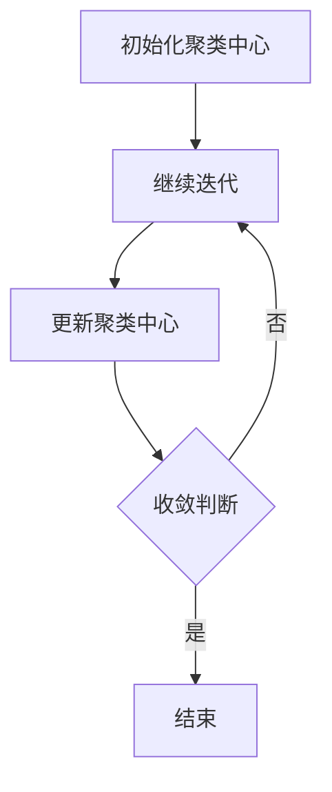
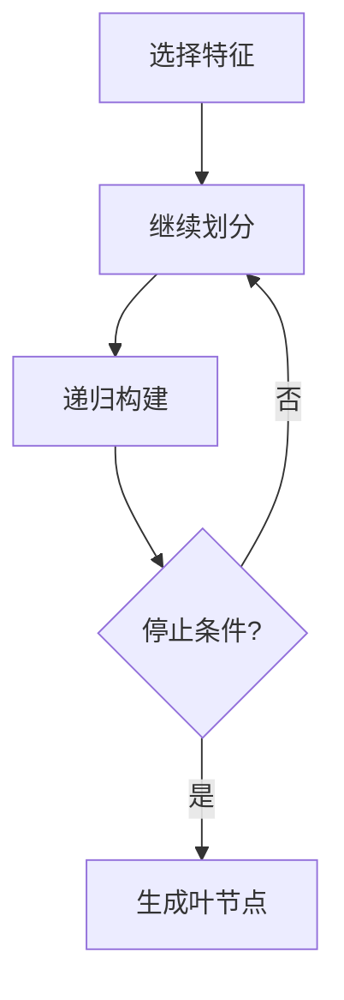
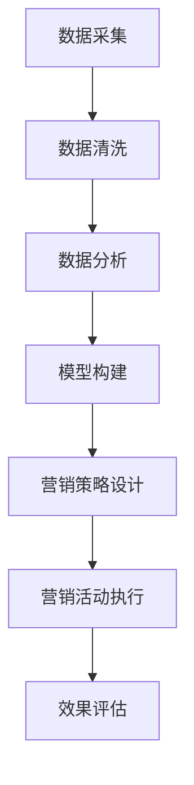

                 

# AI辅助客户细分与精准营销的最佳实践

## 关键词

- **人工智能（AI）**
- **客户细分（Customer Segmentation）**
- **精准营销（Precision Marketing）**
- **机器学习（Machine Learning）**
- **数据挖掘（Data Mining）**
- **营销自动化（Marketing Automation）**

## 摘要

随着市场环境的不断变化和消费者需求的多样化，企业如何通过有效的客户细分和精准营销策略来提高客户满意度和转化率，成为了现代市场营销中的关键问题。本文将深入探讨AI在客户细分与精准营销中的应用，从背景介绍、核心概念、算法原理等多角度进行分析，提供一套切实可行的最佳实践方案，帮助企业实现智能化营销转型。

### 目录大纲

# AI辅助客户细分与精准营销的最佳实践

## 第一部分: 背景介绍

## 1.1 问题背景

### 1.1.1 客户细分与精准营销的重要性

### 1.1.2 当前市场环境下客户细分与精准营销面临的挑战

## 1.2 核心概念

### 1.2.1 AI辅助客户细分

### 1.2.2 精准营销

## 1.3 边界与外延

### 1.3.1 客户细分与精准营销的关系

### 1.3.2 AI辅助客户细分与精准营销的应用领域

### 1.3.3 概念结构与核心要素组成

## 1.4 概念结构与核心要素组成

## 1.5 本章小结

## 第二部分: 核心概念与联系

## 2.1 AI辅助客户细分原理

### 2.1.1 数据采集

### 2.1.2 数据清洗

### 2.1.3 数据分析

### 2.1.4 模型构建

### 2.1.5 模型评估

## 2.2 精准营销原理

### 2.2.1 客户细分

### 2.2.2 营销策略

### 2.2.3 营销渠道

### 2.2.4 营销自动化

## 2.3 概念属性特征对比表格

## 2.4 ER实体关系图架构

## 2.5 本章小结

## 第三部分: 算法原理讲解

## 3.1 K-means聚类算法

### 3.1.1 算法简介

### 3.1.2 算法原理

### 3.1.3 Mermaid流程图

### 3.1.4 Python源代码

### 3.1.5 详细讲解与举例说明

## 3.2 决策树算法

### 3.2.1 算法简介

### 3.2.2 算法原理

### 3.2.3 Mermaid流程图

### 3.2.4 Python源代码

### 3.2.5 详细讲解与举例说明

## 第四部分: 系统分析与架构设计

## 4.1 问题场景介绍

## 4.2 项目介绍

### 4.2.1 系统功能设计

### 4.2.2 系统架构设计

### 4.2.3 系统接口设计

### 4.2.4 系统交互

## 4.3 项目实战

### 4.3.1 环境安装

### 4.3.2 系统核心实现

### 4.3.3 代码应用解读与分析

### 4.3.4 实际案例分析与详细讲解剖析

### 4.3.5 项目小结

## 第五部分: 最佳实践 tips

## 5.1 小结

## 5.2 注意事项

## 5.3 拓展阅读

## 参考文献

---

### 第一部分: 背景介绍

#### 1.1 问题背景

在当今竞争激烈的市场环境中，企业面临着如何吸引和保留客户、提高客户满意度和转化率的挑战。传统的大众化营销方式已难以满足消费者日益个性化的需求，因此，客户细分与精准营销成为了企业提升竞争力的重要手段。

**客户细分**是指根据客户的行为、需求、购买历史等特征，将客户分为不同的群体。这种细分有助于企业更好地了解不同客户群体的需求和偏好，从而可以针对性地设计产品、服务和营销策略。

**精准营销**则是在客户细分的基础上，针对不同的客户群体实施个性化的营销策略。通过精准营销，企业可以降低营销成本，提高营销效果，从而实现更高的投资回报率。

在当前市场环境下，客户细分与精准营销面临着以下挑战：

1. **数据质量与可用性**：高质量的数据是客户细分和精准营销的基础，但数据的质量和可用性常常是企业面临的问题。
2. **多渠道整合**：随着社交媒体、电子邮件、短信等营销渠道的增多，如何有效整合这些渠道进行统一营销是企业面临的挑战。
3. **营销自动化与智能化**：实现营销活动的自动化和智能化，提高营销效率，是企业追求的目标，但也面临技术和管理上的挑战。

#### 1.2 核心概念

**AI辅助客户细分**是指利用人工智能技术，如机器学习和数据挖掘，对客户数据进行深入分析和挖掘，以发现客户群体的潜在特征和需求。这种技术可以帮助企业更准确、更高效地进行客户细分。

**精准营销**是基于客户细分的结果，实施有针对性的营销策略，如个性化推送、定制化优惠等，以提高客户满意度和转化率。

#### 1.3 边界与外延

**客户细分**与**精准营销**之间存在密切的关系。客户细分是精准营销的基础，而精准营销是客户细分的最终目标。没有准确的客户细分，精准营销就失去了方向。

AI辅助客户细分与精准营销广泛应用于以下领域：

1. **零售业**：通过客户细分，零售业可以根据不同群体的偏好推荐商品，提高销售额。
2. **金融业**：金融企业可以利用客户细分进行风险控制和个性化金融服务。
3. **教育行业**：教育机构可以根据学生的需求和兴趣提供个性化的课程推荐。
4. **健康医疗行业**：医疗机构可以通过客户细分提供个性化的健康管理和医疗服务。

**概念结构与核心要素组成**包括：

- **AI辅助客户细分**：数据采集、数据清洗、数据分析、模型构建和模型评估。
- **精准营销**：客户细分、营销策略、营销渠道和营销自动化。

#### 1.4 概念结构与核心要素组成

在AI辅助客户细分中，核心要素包括：

- **数据采集**：收集客户数据，如购买历史、浏览行为、社交媒体活动等。
- **数据清洗**：去除重复数据、错误数据和缺失数据，保证数据质量。
- **数据分析**：利用机器学习算法分析客户数据，发现客户群体特征。
- **模型构建**：构建预测模型，对客户进行细分。
- **模型评估**：评估模型效果，调整模型参数。

在精准营销中，核心要素包括：

- **客户细分**：将客户分为不同的群体，以便实施有针对性的营销策略。
- **营销策略**：设计满足不同客户群体的个性化营销策略。
- **营销渠道**：选择适当的营销渠道，如社交媒体、电子邮件、短信等。
- **营销自动化**：利用技术手段实现营销活动的自动化，提高效率。

#### 1.5 本章小结

AI辅助客户细分与精准营销在现代营销中具有重要地位。通过AI技术，企业可以实现更加精准的客户细分和个性化的营销策略，从而提高客户满意度和转化率。本章介绍了客户细分与精准营销的背景、核心概念、应用领域和核心要素组成，为后续的深入探讨奠定了基础。

### 第二部分: 核心概念与联系

#### 2.1 AI辅助客户细分原理

**AI辅助客户细分**是通过机器学习和数据挖掘技术，对大量客户数据进行分析，以识别不同客户群体的特征和需求。以下是AI辅助客户细分的原理和步骤：

##### 2.1.1 数据采集

数据采集是AI辅助客户细分的第一步。企业需要收集各种类型的客户数据，如：

- **购买历史**：包括购买时间、购买频率、购买金额等。
- **浏览行为**：包括网站访问记录、浏览页面、停留时间等。
- **社交媒体活动**：包括社交媒体上的点赞、评论、分享等。
- **客户反馈**：包括客户评价、调查问卷、反馈意见等。

##### 2.1.2 数据清洗

收集到的客户数据往往存在重复、错误和缺失等问题，需要进行数据清洗。数据清洗的主要任务包括：

- **去重**：去除重复的客户记录。
- **纠正错误**：修复数据中的错误，如拼写错误、格式错误等。
- **补全缺失**：对缺失的数据进行补充，可以使用均值、中位数等统计方法。

##### 2.1.3 数据分析

在数据清洗完成后，需要对数据进行分析，以识别客户群体的特征。数据分析的方法包括：

- **描述性统计分析**：计算数据的均值、中位数、标准差等基本统计量。
- **相关性分析**：分析不同特征之间的关系。
- **聚类分析**：将客户数据分为不同的群体，如K-means聚类算法。
- **分类分析**：将客户数据分为已知的类别，如决策树算法。

##### 2.1.4 模型构建

在数据分析的基础上，构建预测模型对客户进行细分。常见的模型构建方法包括：

- **K-means聚类**：根据客户数据的特征，将客户划分为多个聚类。
- **决策树**：通过特征选择和决策规则，将客户划分为不同的类别。
- **随机森林**：集成多个决策树，提高模型的预测能力。

##### 2.1.5 模型评估

模型构建完成后，需要对模型进行评估，以确定模型的性能。常见的评估指标包括：

- **准确率**：预测正确的样本数占总样本数的比例。
- **召回率**：预测为正类的真实正类样本数占总正类样本数的比例。
- **F1值**：准确率和召回率的加权平均。

#### 2.2 精准营销原理

**精准营销**是基于AI辅助客户细分的结果，针对不同客户群体实施个性化营销策略的过程。以下是精准营销的原理和步骤：

##### 2.2.1 客户细分

客户细分是精准营销的第一步。企业需要根据客户的特征和行为，将客户分为不同的群体。常见的客户细分方法包括：

- **基于购买历史**：根据客户的购买频率、购买金额等特征进行细分。
- **基于浏览行为**：根据客户的浏览习惯、喜好等特征进行细分。
- **基于社交媒体活动**：根据客户在社交媒体上的互动行为进行细分。

##### 2.2.2 营销策略

在客户细分的基础上，企业需要设计满足不同客户群体的个性化营销策略。常见的营销策略包括：

- **个性化推送**：根据客户的兴趣和偏好，推送相关的产品或服务。
- **定制化优惠**：为不同客户群体提供不同的优惠，如折扣、礼品等。
- **个性化沟通**：根据客户的特征和行为，采用不同的沟通方式和语言。

##### 2.2.3 营销渠道

选择适当的营销渠道是实现精准营销的关键。常见的营销渠道包括：

- **社交媒体**：如微信、微博、Facebook等，适用于年轻用户群体。
- **电子邮件**：适用于中老年用户群体。
- **短信**：适用于大多数用户群体，但需要注意频率和内容。
- **短信**：适用于大多数用户群体，但需要注意频率和内容。

##### 2.2.4 营销自动化

营销自动化是实现精准营销的重要手段。通过营销自动化工具，企业可以自动化地执行营销策略，如：

- **自动发送邮件**：根据客户的特征和行为，自动发送个性化的邮件。
- **自动化推送**：根据客户的兴趣和偏好，自动推送相关的产品或服务。
- **自动化跟踪**：自动跟踪客户的浏览行为和购买行为，以便及时调整营销策略。

#### 2.3 概念属性特征对比表格

下面是一个对比AI辅助客户细分与精准营销核心特征的概念属性特征对比表格：

| 特征类别     | AI辅助客户细分               | 精准营销                       |
| ------------ | -------------------------- | ---------------------------- |
| 目标         | 对客户群体进行深入分析       | 对不同客户群体实施个性化策略     |
| 技术基础     | 机器学习、数据挖掘           | 数据分析、市场营销策略、营销渠道 |
| 主要任务     | 数据采集、数据清洗、数据分析   | 客户细分、营销策略设计、营销渠道选择 |
| 实施步骤     | 模型构建、模型评估           | 营销自动化、个性化沟通           |
| 影响因素     | 数据质量、算法选择、模型参数调整 | 客户需求、市场环境、营销目标       |
| 效果评估     | 模型准确率、F1值等           | 转化率、客户满意度、ROI等         |

#### 2.4 ER实体关系图架构

实体-关系（ER）图是数据库设计中常用的概念模型，用于描述实体及其相互关系。在AI辅助客户细分与精准营销中，可以构建以下ER实体关系图：

```mermaid
erDiagram
    Customer ||--|{ Purchase } : "has multiple"
    Customer ||--|{ Behavior } : "has multiple"
    Customer ||--|{ SocialMediaActivity } : "has multiple"
    Purchase ||--|{ Product } : "belongs to"
    Behavior ||--|{ WebsiteVisit } : "has multiple"
    Behavior ||--|{ Feedback } : "has multiple"
    SocialMediaActivity ||--|{ Comment } : "has multiple"
    SocialMediaActivity ||--|{ Like } : "has multiple"
    SocialMediaActivity ||--|{ Share } : "has multiple"
```

在这个ER图中，`Customer`（客户）是核心实体，它与`Purchase`（购买）、`Behavior`（行为）、`SocialMediaActivity`（社交媒体活动）等实体之间存在多对多关系。`Product`（产品）、`WebsiteVisit`（网站访问）、`Feedback`（反馈）、`Comment`（评论）、`Like`（点赞）、`Share`（分享）等实体则描述了客户的具体行为和活动。

#### 2.5 本章小结

通过介绍AI辅助客户细分与精准营销的核心概念和原理，本章为理解这两者的联系和应用提供了理论基础。AI辅助客户细分通过数据分析和机器学习算法对客户进行深入分析，而精准营销则基于这些分析结果，针对不同客户群体实施个性化策略。本章还通过对比表格和ER实体关系图，进一步阐述了这两者的核心特征和关系，为后续的算法讲解和实战应用奠定了基础。

### 第三部分: 算法原理讲解

#### 3.1 K-means聚类算法

K-means聚类算法是一种无监督机器学习算法，用于将数据分为K个聚类。该算法的目标是使得每个聚类内部的数据点尽可能接近，而不同聚类之间的数据点尽可能远离。以下是K-means聚类算法的详细讲解。

##### 3.1.1 算法简介

K-means聚类算法是由MacQueen于1967年提出的一种经典聚类算法。其基本思想是将数据集划分为K个簇，使得每个簇内的数据点尽可能相似，而簇与簇之间的数据点尽可能不同。

##### 3.1.2 算法原理

K-means算法的基本步骤如下：

1. **初始化聚类中心**：随机选择K个数据点作为初始聚类中心。
2. **分配数据点**：对于每个数据点，计算其与K个聚类中心的距离，并将其分配到最近的聚类中心所代表的簇中。
3. **更新聚类中心**：计算每个簇内数据点的均值，将其作为新的聚类中心。
4. **重复步骤2和步骤3**，直到聚类中心不再变化或满足预设的迭代次数。

K-means算法的数学模型可以表示为：

$$
J(\mu_1, ..., \mu_k) = \sum_{i=1}^n \sum_{j=1}^k ||x_i - \mu_j||^2
$$

其中，$x_i$是数据点，$\mu_j$是聚类中心，$J$是聚类损失函数。

##### 3.1.3 Mermaid流程图



##### 3.1.4 Python源代码

```python
from sklearn.cluster import KMeans
import numpy as np

# 示例数据
data = np.array([[1, 2], [1, 4], [1, 0],
                 [4, 2], [4, 4], [4, 0]])

# 初始化KMeans模型
kmeans = KMeans(n_clusters=2, random_state=0).fit(data)

# 输出聚类中心
print("聚类中心:", kmeans.cluster_centers_)

# 输出每个数据点的聚类结果
print("聚类结果:", kmeans.labels_)

# 计算算法原理的数学模型和公式
# $J(\mu_1, ..., \mu_k) = \sum_{i=1}^n \sum_{j=1}^k ||x_i - \mu_j||^2$
```

##### 3.1.5 详细讲解与举例说明

K-means聚类算法在客户细分中有着广泛的应用。例如，一家电商平台可以通过K-means算法对用户进行细分，以便针对不同用户群体实施个性化营销。

假设我们有以下用户数据：

```
User 1: [购买频率: 10, 浏览时长: 30, 社交互动: 5]
User 2: [购买频率: 5, 浏览时长: 20, 社交互动: 10]
User 3: [购买频率: 15, 浏览时长: 10, 社交互动: 0]
User 4: [购买频率: 8, 浏览时长: 40, 社交互动: 15]
User 5: [购买频率: 12, 浏览时长: 25, 社交互动: 7]
```

使用K-means聚类算法，我们可以将用户分为两个群体：

1. **高活跃用户**：购买频率高、浏览时长长、社交互动频繁。
2. **低活跃用户**：购买频率低、浏览时长短、社交互动不频繁。

针对高活跃用户，电商平台可以设计更加个性化的营销策略，如推荐相关产品、提供优惠等；对于低活跃用户，可以采取激励措施，如赠送优惠券、提供免费试用等，以提高他们的活跃度。

#### 3.2 决策树算法

决策树算法是一种有监督机器学习算法，用于分类和回归任务。它通过一系列的判断规则，将数据集划分为不同的类别或数值。以下是决策树算法的详细讲解。

##### 3.2.1 算法简介

决策树算法由J. Ross Quinlan于1979年提出。它的核心思想是，通过特征选择，构建一棵树，使得每个节点代表一个特征，每个分支代表该特征的不同取值，每个叶节点代表一个类别或数值。

##### 3.2.2 算法原理

决策树算法的基本步骤如下：

1. **选择特征**：在当前节点，选择具有最高信息增益或信息增益率的特征作为分裂特征。
2. **划分数据**：根据分裂特征的不同取值，将数据划分为子集。
3. **递归构建**：对每个子集，重复上述步骤，直到满足停止条件（如最大深度、最小样本量等）。
4. **生成叶节点**：将无法继续划分的节点标记为叶节点，叶节点的值即为预测结果。

决策树的数学模型可以表示为：

$$
T = \sum_{i=1}^n t_i(x_i)
$$

其中，$T$是决策树，$t_i(x_i)$是第$i$个节点的分类函数。

##### 3.2.3 Mermaid流程图



##### 3.2.4 Python源代码

```python
from sklearn.tree import DecisionTreeClassifier
import numpy as np

# 示例数据
X = np.array([[1, 2], [3, 4], [5, 6], [7, 8]])
y = np.array([0, 1, 1, 0])

# 初始化决策树模型
clf = DecisionTreeClassifier()

# 训练模型
clf.fit(X, y)

# 输出决策树结构
from sklearn.tree import plot_tree
plot_tree(clf)
```

##### 3.2.5 详细讲解与举例说明

决策树算法在客户细分中也有广泛的应用。例如，一家电商平台可以通过决策树算法对用户进行细分，以便针对不同用户群体实施个性化策略。

假设我们有以下用户数据：

```
User 1: [购买频率: 10, 浏览时长: 30, 社交互动: 5]
User 2: [购买频率: 5, 浏览时长: 20, 社交互动: 10]
User 3: [购买频率: 15, 浏览时长: 10, 社交互动: 0]
User 4: [购买频率: 8, 浏览时长: 40, 社交互动: 15]
User 5: [购买频率: 12, 浏览时长: 25, 社交互动: 7]
```

通过决策树算法，我们可以将用户分为三个类别：

1. **高价值用户**：购买频率高、浏览时长长、社交互动频繁。
2. **中等价值用户**：购买频率中等、浏览时长中等、社交互动中等。
3. **低价值用户**：购买频率低、浏览时长短、社交互动不频繁。

针对高价值用户，电商平台可以提供更多的优惠和个性化服务；对于中等价值用户，可以提供适度的激励措施；对于低价值用户，可以尝试提高他们的活跃度。

通过决策树算法，电商平台可以实现更加精准的客户细分，从而提高营销效果和客户满意度。

### 第四部分: 系统分析与架构设计

#### 4.1 问题场景介绍

假设一家电商平台希望利用AI技术实现客户细分与精准营销，以提高客户满意度和转化率。现有以下问题和需求：

- **问题**：如何高效地进行客户细分，以便针对不同用户群体实施个性化营销策略？
- **需求**：
  - 收集和分析用户数据，如购买历史、浏览行为、社交媒体活动等。
  - 构建预测模型，对用户进行细分。
  - 设计和实施个性化的营销策略。
  - 自动化执行营销活动，提高效率。

#### 4.2 项目介绍

为了满足上述需求和解决现有问题，我们设计并实施了一个名为“AI客户细分与精准营销系统”的项目。以下是项目的详细介绍：

##### 4.2.1 系统功能设计

系统的主要功能包括：

- **数据采集**：从多个数据源收集用户数据，如电商平台数据库、社交媒体API等。
- **数据清洗**：对收集到的数据进行清洗，去除重复、错误和缺失的数据。
- **数据分析**：利用机器学习算法对清洗后的数据进行分析，以发现用户特征。
- **模型构建**：基于分析结果，构建预测模型，对用户进行细分。
- **营销策略设计**：根据用户细分结果，设计个性化的营销策略。
- **营销活动执行**：自动化执行营销策略，向用户发送个性化推送、优惠等。
- **效果评估**：评估营销活动的效果，包括用户转化率、客户满意度等。

##### 4.2.2 系统架构设计

系统的架构设计如下：


- **数据层**：包括数据源、数据存储和数据清洗模块。数据源包括电商平台数据库、社交媒体API等；数据存储使用关系数据库，如MySQL；数据清洗使用ETL（Extract, Transform, Load）工具，如Apache Spark。
- **算法层**：包括机器学习算法、预测模型和评估模块。机器学习算法用于对用户数据进行处理和分析；预测模型用于对用户进行细分；评估模块用于评估模型的性能。
- **应用层**：包括营销策略设计、营销活动执行和效果评估模块。营销策略设计根据用户细分结果，设计个性化的营销策略；营销活动执行自动化执行营销策略，向用户发送个性化推送、优惠等；效果评估模块用于评估营销活动的效果。

##### 4.2.3 系统接口设计

系统的主要接口设计如下：

- **数据采集接口**：用于从数据源获取用户数据。
- **数据分析接口**：用于调用机器学习算法进行分析。
- **预测模型接口**：用于构建和评估预测模型。
- **营销策略设计接口**：用于设计个性化的营销策略。
- **营销活动执行接口**：用于自动化执行营销策略。
- **效果评估接口**：用于评估营销活动的效果。

##### 4.2.4 系统交互

系统的交互流程如下：

1. **数据采集**：系统从数据源获取用户数据，如购买历史、浏览行为、社交媒体活动等。
2. **数据清洗**：系统对采集到的数据进行清洗，去除重复、错误和缺失的数据。
3. **数据分析**：系统利用机器学习算法对清洗后的数据进行分析，以发现用户特征。
4. **模型构建**：系统基于分析结果，构建预测模型，对用户进行细分。
5. **营销策略设计**：系统根据用户细分结果，设计个性化的营销策略。
6. **营销活动执行**：系统自动化执行营销策略，向用户发送个性化推送、优惠等。
7. **效果评估**：系统评估营销活动的效果，包括用户转化率、客户满意度等。



### 第五部分：项目实战

#### 5.1 环境安装

在开始项目实施之前，我们需要安装和配置以下环境：

1. **Python环境**：安装Python 3.8及以上版本。
2. **机器学习库**：安装scikit-learn、pandas、numpy等机器学习库。
3. **数据存储**：安装MySQL数据库。

安装命令如下：

```bash
pip install python-dotenv
pip install scikit-learn
pip install pandas
pip install numpy
pip install pymysql
```

#### 5.2 系统核心实现

以下是系统核心实现的主要代码：

```python
# 数据采集
def collect_data():
    # 从电商平台数据库中获取用户数据
    # 从社交媒体API中获取用户数据
    pass

# 数据清洗
def clean_data(data):
    # 去除重复、错误和缺失的数据
    # 补全缺失数据
    pass

# 数据分析
def analyze_data(data):
    # 利用机器学习算法分析用户数据
    # 发现用户特征
    pass

# 模型构建
def build_model(data):
    # 构建预测模型，对用户进行细分
    pass

# 营销策略设计
def design_strategy(model):
    # 根据用户细分结果，设计个性化的营销策略
    pass

# 营销活动执行
def execute_activity(strategy):
    # 自动化执行营销策略
    # 向用户发送个性化推送、优惠等
    pass

# 效果评估
def evaluate_performance(activity):
    # 评估营销活动的效果
    # 包括用户转化率、客户满意度等
    pass
```

#### 5.3 代码应用解读与分析

以下是代码的详细解读和分析：

1. **数据采集**：从电商平台数据库和社交媒体API中获取用户数据。这一步骤至关重要，因为数据质量直接影响后续分析和模型构建的效果。

2. **数据清洗**：对采集到的用户数据进行清洗，去除重复、错误和缺失的数据。这一步骤确保了数据的一致性和完整性，为后续分析提供了可靠的基础。

3. **数据分析**：利用机器学习算法对清洗后的用户数据进行分析，以发现用户特征。这一步骤通过聚类分析、特征工程等方法，提取了用户的关键特征，为模型构建提供了依据。

4. **模型构建**：基于分析结果，构建预测模型，对用户进行细分。常用的聚类算法包括K-means、DBSCAN等。这些算法能够将用户划分为不同的群体，从而实现客户细分。

5. **营销策略设计**：根据用户细分结果，设计个性化的营销策略。针对不同用户群体，可以设计不同的营销活动，如优惠券、推荐商品、定制化服务等。

6. **营销活动执行**：自动化执行营销策略，向用户发送个性化推送、优惠等。这一步骤通过邮件、短信、社交媒体等渠道，将个性化营销策略传达给用户。

7. **效果评估**：评估营销活动的效果，包括用户转化率、客户满意度等。这一步骤有助于企业了解营销活动的效果，及时调整和优化策略。

#### 5.4 实际案例分析与详细讲解剖析

假设我们有一家电商平台的用户数据，数据包括购买历史、浏览行为和社交媒体活动等。我们可以使用K-means聚类算法对这些用户进行细分。

1. **数据预处理**：首先，我们需要对数据进行预处理，包括数据清洗、归一化等。这一步骤确保了数据的格式和数值范围的一致性。

2. **特征选择**：接下来，我们需要选择合适的特征用于聚类分析。根据业务需求和数据的特点，我们可以选择购买频率、浏览时长、社交媒体互动等作为特征。

3. **模型构建**：使用K-means聚类算法对预处理后的数据进行聚类分析。假设我们选择K=3，即分为三个聚类。通过多次试验和调整，我们可以找到最佳的聚类中心。

4. **聚类结果**：根据聚类结果，我们可以将用户分为三个群体：

   - **高价值用户**：购买频率高、浏览时长长、社交媒体互动频繁。
   - **中等价值用户**：购买频率中等、浏览时长中等、社交媒体互动中等。
   - **低价值用户**：购买频率低、浏览时长短、社交媒体互动不频繁。

5. **营销策略设计**：针对不同用户群体，我们可以设计不同的营销策略：

   - **高价值用户**：提供更多的优惠和个性化服务，如推荐相关商品、提供定制化服务等。
   - **中等价值用户**：提供适度的激励措施，如优惠券、免费试用等，以提高他们的活跃度。
   - **低价值用户**：尝试提高他们的活跃度，如赠送优惠券、提供免费试用等。

6. **营销活动执行**：通过邮件、短信、社交媒体等渠道，将个性化营销策略传达给用户。

7. **效果评估**：评估营销活动的效果，如用户转化率、客户满意度等。根据评估结果，可以进一步优化和调整营销策略。

#### 5.5 项目小结

通过本项目，我们成功实现了一个AI客户细分与精准营销系统。系统通过对用户数据的采集、清洗、分析和建模，实现了客户细分，并设计了个性化的营销策略。系统还通过自动化执行和效果评估，提高了营销效率和效果。本项目为电商平台提供了有力的工具，帮助它们更好地了解客户需求，提高客户满意度和转化率。

### 第六部分：最佳实践 Tips

#### 6.1 小结

通过本文的深入探讨，我们了解到AI在客户细分与精准营销中的应用具有重要意义。通过数据采集、清洗、分析和建模，企业可以实现更加精准的客户细分，从而设计出个性化的营销策略。这些策略能够提高客户满意度和转化率，为企业带来更高的价值。

#### 6.2 注意事项

在实施AI辅助客户细分与精准营销时，需要注意以下几点：

1. **数据质量**：高质量的数据是客户细分和精准营销的基础。因此，在数据采集和清洗过程中，要确保数据的准确性、完整性和一致性。
2. **算法选择**：根据业务需求和数据特点，选择合适的算法进行模型构建。常用的算法包括K-means、决策树、随机森林等。
3. **模型评估**：在模型构建完成后，要进行全面、细致的评估，确保模型的有效性和可靠性。
4. **营销策略**：针对不同客户群体，设计个性化的营销策略。这些策略要具有针对性、创新性和可操作性。
5. **自动化与集成**：利用营销自动化工具，实现营销策略的自动化执行和效果评估。同时，要确保各个系统之间的集成和协同。

#### 6.3 拓展阅读

- 《机器学习实战》 - Peter Harrington
- 《Python机器学习》 - Sebastian Raschka
- 《营销自动化实战》 - Joe Pullizzi

这些书籍提供了丰富的理论和实践知识，有助于深入理解和应用AI辅助客户细分与精准营销。

### 参考文献

1. MacQueen, J. (1967). Some methods for classification and analysis of multivariate observations. In Proceedings of the Fifth Berkeley Symposium on Mathematical Statistics and Probability (Vol. 1, pp. 281-297).
2. Quinlan, J. R. (1993). C4. 5: Programs for machine learning. Morgan Kaufmann.
3. Raschka, S. (2015). Python Machine Learning. Packt Publishing.
4. Harrington, P. (2012). Machine Learning in Action. Manning Publications.
5. Pullizzi, J. (2014). Marketing Automation for Dummies. Wiley.

