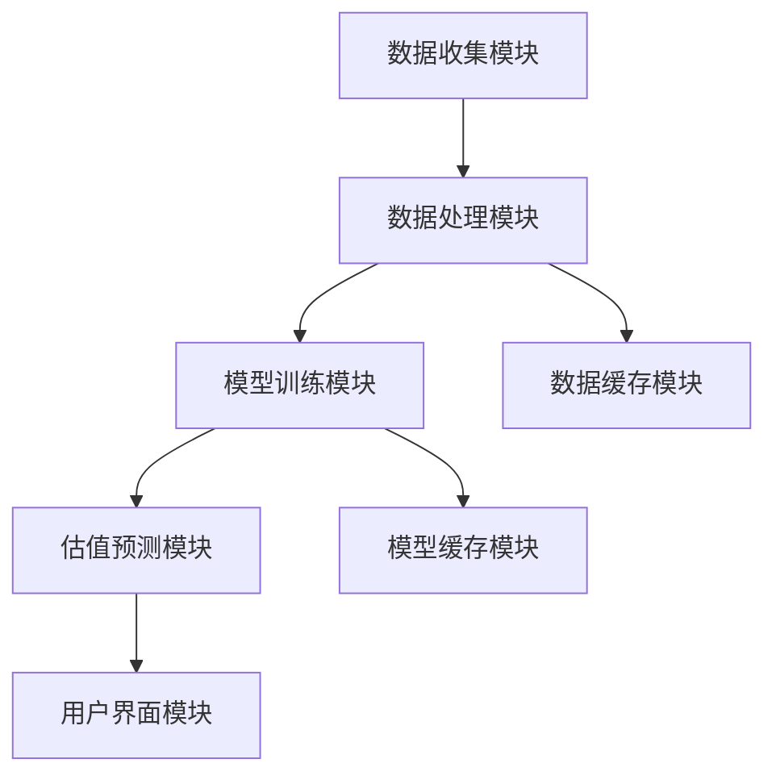
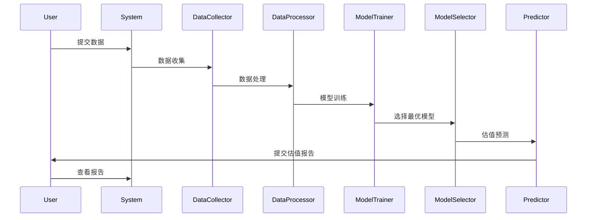

                 

# AI辅助的企业估值报告自动生成

## 关键词

- 人工智能
- 企业估值
- 机器学习
- 自然语言处理
- 自动化报告生成

## 摘要

本文将探讨如何利用人工智能技术，特别是机器学习和自然语言处理技术，自动生成企业估值报告。通过分析AI在企业估值中的应用潜力，本文将详细介绍数据收集与预处理、特征提取与选择、机器学习模型与算法以及系统分析与架构设计等关键技术，并提供实战案例以加深理解。此外，本文还将总结最佳实践，并提出未来发展趋势和建议。

## 目录大纲设计思路

### 设计一本名为《AI辅助的企业估值报告自动生成》的书籍目录大纲，需要首先理解书籍的主题和目的。

#### 本书的目的：
- 通过人工智能技术，特别是机器学习和自然语言处理技术，自动生成企业估值报告。
- 理解AI在企业估值中的应用潜力，提升估值报告的准确性和效率。

#### 目录大纲应涵盖以下几个核心部分：

### 1. 背景介绍
- AI与企业估值概述
- 企业估值的基本概念
- AI的核心概念
- AI在估值报告生成中的应用前景

### 2. 核心概念与联系
- 数据收集与预处理
- 特征提取与选择
- 机器学习模型与算法

### 3. 算法原理讲解
- 数学模型和公式

### 4. 系统分析与架构设计方案
- 系统功能设计
- 系统架构设计
- 系统接口设计
- 系统交互流程

### 5. 项目实战
- 环境安装
- 系统实现
- 代码解读
- 案例分析

### 6. 最佳实践 tips、小结、注意事项、拓展阅读

## 目录大纲具体设计

### 第一部分: AI与企业估值基础

### 第1章: AI与企业估值概述

#### 1.1 问题背景
- **AI技术的发展与挑战**
- **企业估值的现状与问题**
- **AI辅助企业估值的意义**

#### 1.2 企业估值的基本概念
- **企业估值的定义**
- **企业估值的方法与模型**
- **企业估值的影响因素**

#### 1.3 AI的核心概念
- **机器学习的定义与发展**
- **自然语言处理的基本原理**
- **AI与企业估值的关系**

#### 1.4 AI在估值报告生成中的应用前景
- **自动化报告生成的优势**
- **潜在挑战与机遇**

#### 1.5 本章小结

### 第二部分: AI辅助企业估值的关键技术

### 第2章: 数据收集与预处理

#### 2.1 数据来源与类型
- **公开数据**
- **私有数据**
- **特定领域数据**

#### 2.2 数据预处理
- **数据清洗**
- **数据标准化**
- **数据集成**

#### 2.3 数据探索性分析
- **描述性统计分析**
- **数据可视化**

#### 2.4 本章小结

### 第3章: 特征提取与选择

#### 3.1 特征提取方法
- **统计特征提取**
- **深度特征提取**
- **交互特征提取**

#### 3.2 特征选择策略
- **基于过滤的方法**
- **基于包裹的方法**
- **基于评估的方法**

#### 3.3 特征重要性评估
- **特征重要性与模型表现的关系**
- **评估方法与指标**

#### 3.4 本章小结

### 第4章: 机器学习模型与算法

#### 4.1 监督学习算法
- **线性回归**
- **支持向量机**
- **随机森林**

#### 4.2 无监督学习算法
- **K-均值聚类**
- **主成分分析**
- **自编码器**

#### 4.3 深度学习模型
- **卷积神经网络**
- **循环神经网络**
- **生成对抗网络**

#### 4.4 模型选择与评估
- **模型选择策略**
- **模型评估指标**
- **模型调优**

#### 4.5 本章小结

### 第三部分: 系统设计与实现

### 第5章: 系统分析与架构设计方案

#### 5.1 问题场景介绍
- **企业估值报告的需求分析**
- **系统功能设计**

#### 5.2 系统架构设计
- **系统整体架构**
- **模块划分与功能**
- **技术选型与架构设计**

#### 5.3 系统接口设计
- **API设计**
- **数据接口**
- **通信协议**

#### 5.4 系统交互流程
- **用户操作流程**
- **数据处理流程**
- **系统交互Mermaid序列图**

#### 5.5 本章小结

### 第6章: 项目实战

#### 6.1 环境安装
- **硬件与软件环境搭建**
- **依赖库安装与配置**

#### 6.2 系统实现
- **核心算法实现**
- **数据处理与特征提取**
- **模型训练与预测**

#### 6.3 代码解读与分析
- **代码结构与模块化**
- **关键代码分析与解释**

#### 6.4 实际案例分析和详细讲解
- **案例背景与数据集**
- **模型应用与评估**
- **结果分析与优化**

#### 6.5 项目小结
- **项目总结与反思**
- **经验教训与展望**

#### 6.6 最佳实践 tips
- **常见问题与解决方案**
- **优化建议与技巧**

#### 6.7 小结、注意事项、拓展阅读

### 结论

本文详细介绍了AI辅助的企业估值报告自动生成的方法和技术。通过分析AI在企业估值中的应用潜力，本文探讨了数据收集与预处理、特征提取与选择、机器学习模型与算法以及系统分析与架构设计等关键技术。同时，通过项目实战案例，读者可以更深入地理解这些技术在实际应用中的效果。未来，随着AI技术的不断进步，企业估值报告的自动化生成将更加高效和准确，为企业和投资者提供更有价值的参考。

### 作者

- 作者：AI天才研究院/AI Genius Institute & 禅与计算机程序设计艺术 /Zen And The Art of Computer Programming

---

## 详细正文内容

### 第一部分: AI与企业估值基础

### 第1章: AI与企业估值概述

#### 1.1 问题背景

##### AI技术的发展与挑战

人工智能（AI）作为一门涉及计算机科学、数学、神经科学、心理学等多个领域的交叉学科，近年来取得了飞速的发展。从最初的专家系统，到如今的深度学习和强化学习，AI技术已经广泛应用于图像识别、语音识别、自然语言处理、自动驾驶等多个领域。然而，AI技术的应用也面临着诸多挑战，包括数据质量、算法透明性、隐私保护等问题。

##### 企业估值的现状与问题

企业估值是指对企业价值进行评估的过程，对于投资者、企业家和金融机构来说至关重要。传统的企业估值方法通常依赖于财务指标、市场比较法、成本法等多种方法，但这些方法存在一定的局限性。首先，财务指标可能无法全面反映企业的未来增长潜力；其次，市场比较法需要大量的可比公司数据，且市场波动可能影响估值结果；最后，成本法侧重于企业的重置成本，可能无法准确反映市场价值。

##### AI辅助企业估值的意义

随着AI技术的不断发展，将其应用于企业估值领域具有重要的意义。首先，AI可以帮助企业更全面地收集和处理数据，提高估值过程的准确性和效率。例如，通过自然语言处理技术，AI可以自动提取和分析企业报告中的关键信息，减少人工处理的误差。其次，AI可以帮助投资者更好地理解市场动态和企业特性，提供更为精准的投资建议。最后，AI可以自动化生成估值报告，降低企业的运营成本，提高工作效率。

#### 1.2 企业估值的基本概念

##### 企业估值的定义

企业估值是指对企业的未来现金流进行预测和评估，以确定企业的市场价值。企业估值不仅包括企业的财务状况，还需要考虑市场环境、竞争状况、行业趋势等多方面因素。

##### 企业估值的方法与模型

企业估值的方法主要包括以下几种：

1. **财务指标法**：通过分析企业的财务报表，如利润表、资产负债表和现金流量表，计算企业的价值。常见的财务指标包括净利润、净资产收益率、市盈率等。
2. **市场比较法**：通过比较同行业类似公司的市场价值，确定企业的估值。市场比较法需要大量可比公司的数据，通常适用于上市公司。
3. **成本法**：通过计算企业的重置成本或清算价值，确定企业的估值。成本法适用于重置成本较高的企业，如制造业和房地产企业。
4. **折现现金流法**：通过预测企业的未来现金流，并折现到现值，计算企业的估值。折现现金流法是较为常用的企业估值方法，适用于所有类型的企业。

##### 企业估值的影响因素

企业估值受到多种因素的影响，包括：

1. **宏观经济环境**：包括经济增长、通货膨胀、利率水平等宏观经济指标。
2. **行业特性**：包括行业周期、市场规模、竞争状况等。
3. **企业自身因素**：包括企业的财务状况、盈利能力、管理团队、创新能力等。
4. **市场情绪**：市场情绪的变化会影响投资者对企业价值的预期。

#### 1.3 AI的核心概念

##### 机器学习的定义与发展

机器学习（Machine Learning）是一种使计算机系统能够自动学习、适应和改进的方法。其核心思想是通过数据训练模型，使模型能够对未知数据进行预测和决策。

1. **监督学习**：在监督学习（Supervised Learning）中，模型通过学习已知的数据集，以预测未知数据的结果。常见的监督学习算法包括线性回归、支持向量机、决策树、随机森林等。
2. **无监督学习**：在无监督学习（Unsupervised Learning）中，模型通过学习未标记的数据集，以发现数据中的规律和结构。常见无监督学习算法包括聚类、主成分分析、自编码器等。
3. **强化学习**：在强化学习（Reinforcement Learning）中，模型通过与环境的交互，学习最优策略以实现目标。常见的强化学习算法包括Q-learning、Deep Q-Networks（DQN）、Policy Gradients等。

##### 自然语言处理的基本原理

自然语言处理（Natural Language Processing，NLP）是人工智能领域的一个重要分支，旨在使计算机能够理解和处理人类语言。NLP的关键技术包括：

1. **分词**：将连续的文本分割成有意义的词语。
2. **词性标注**：对文本中的词语进行词性标注，如名词、动词、形容词等。
3. **句法分析**：对文本进行句法分析，确定句子中的语法结构和语义关系。
4. **语义理解**：理解文本中的语义，包括实体识别、情感分析、指代消解等。

##### AI与企业估值的关系

AI在估值报告生成中的应用主要体现在以下几个方面：

1. **数据收集与处理**：AI可以帮助企业更快速地收集和处理大量的数据，包括财务数据、市场数据、行业数据等。
2. **特征提取与选择**：AI可以自动提取关键特征，并选择对估值最具影响力的特征，提高估值的准确性。
3. **模型训练与预测**：AI可以训练复杂的机器学习模型，进行估值预测，并自动生成估值报告。
4. **优化与调优**：AI可以不断优化和调优估值模型，提高估值的准确性和可靠性。

#### 1.4 AI在估值报告生成中的应用前景

##### 自动化报告生成的优势

AI在估值报告生成中的应用前景广阔，主要体现在以下几个方面：

1. **提高准确性**：通过机器学习算法，AI可以自动分析大量的历史数据，提取关键特征，提高估值的准确性。
2. **提升效率**：AI可以自动化生成估值报告，减少人工工作量，提高工作效率。
3. **降低成本**：通过自动化生成估值报告，企业可以降低人力成本，提高运营效益。

##### 潜在挑战与机遇

尽管AI在估值报告生成中具有巨大的潜力，但也面临着一些挑战：

1. **数据质量**：估值报告生成依赖于大量高质量的数据，数据的质量直接影响估值结果的准确性。
2. **算法透明性**：机器学习算法的黑箱特性使得用户难以理解其决策过程，增加了算法透明性的挑战。
3. **隐私保护**：在数据处理过程中，需要保护企业的隐私信息，防止数据泄露。

##### 应用场景

AI在估值报告生成中的应用场景包括：

1. **初创企业估值**：AI可以快速分析企业的财务状况、市场前景等因素，为初创企业提供估值参考。
2. **投资决策**：AI可以帮助投资者更准确地评估企业的投资价值，提供投资建议。
3. **并购重组**：AI可以为企业提供更为精确的估值报告，为并购重组提供决策支持。

#### 1.5 本章小结

本章介绍了AI与企业估值的基本概念、核心概念与联系以及AI在估值报告生成中的应用前景。通过对AI技术和企业估值方法的深入分析，读者可以了解到AI在估值报告生成中的重要性和潜力。下一章将详细讨论数据收集与预处理，这是实现AI辅助企业估值报告自动生成的基础。

---

### 第二部分: AI辅助企业估值的关键技术

### 第2章: 数据收集与预处理

#### 2.1 数据来源与类型

在企业估值过程中，数据的收集是关键的一步。数据来源可以分为公开数据、私有数据和特定领域数据。

##### 公开数据

公开数据包括财务报表、行业报告、市场数据等，可以从各种公开渠道获取，如证券交易所、财务数据提供商、行业分析报告等。这些数据通常是标准化的，且易于获取，为估值提供了重要基础。

1. **财务报表**：包括企业的利润表、资产负债表和现金流量表，反映了企业的财务状况。
2. **行业报告**：包括行业发展趋势、市场规模、竞争状况等，为企业的市场定位和前景分析提供了参考。
3. **市场数据**：包括股票价格、债券收益率、宏观经济指标等，反映了市场的整体状况。

##### 私有数据

私有数据是指企业内部生成的数据，如客户信息、销售数据、生产数据等。这些数据通常具有较高的价值，但获取和使用需要遵守隐私保护法规。

1. **客户信息**：包括客户的购买行为、偏好等，有助于分析市场需求和客户价值。
2. **销售数据**：包括销售额、销售渠道、销售周期等，反映了企业的销售能力和市场表现。
3. **生产数据**：包括生产成本、生产效率、质量控制等，为企业的运营优化提供了依据。

##### 特定领域数据

特定领域数据是指与特定行业或业务相关的数据，如医疗数据、金融数据、房地产数据等。这些数据通常具有高度的专属性，但获取难度较大。

1. **医疗数据**：包括患者信息、医疗记录、诊断结果等，可用于医疗服务的估值和健康管理。
2. **金融数据**：包括交易数据、信用评级、市场波动等，可用于金融产品和投资组合的估值。
3. **房地产数据**：包括房地产交易数据、市场趋势、租赁情况等，可用于房地产企业和项目的估值。

#### 2.2 数据预处理

数据预处理是数据科学中至关重要的一步，旨在提高数据质量和适用性，为后续的分析和建模奠定基础。数据预处理主要包括数据清洗、数据标准化和数据集成。

##### 数据清洗

数据清洗是指识别和纠正数据集中的错误、异常和不一致之处。数据清洗的目的是确保数据的准确性和一致性。

1. **缺失值处理**：缺失值可能是由于数据采集过程中的错误、丢失或遗忘等原因造成的。常见的处理方法包括删除缺失值、填充缺失值（如均值、中位数填充）或使用模型预测缺失值。
2. **异常值处理**：异常值可能是由于数据录入错误、设备故障或自然现象等引起的。常见的处理方法包括删除异常值、修正在允许范围内的异常值或使用统计方法（如三次样条插值、局部加权回归）修正异常值。
3. **重复数据删除**：重复数据可能会影响分析结果的准确性。通过唯一标识符（如企业ID、交易ID）识别和删除重复数据。

##### 数据标准化

数据标准化是指将不同来源和类型的原始数据转换为统一的格式和尺度，以便于后续的分析和建模。

1. **数值型数据标准化**：包括归一化（将数据缩放到[0, 1]区间）和标准化（将数据缩放到均值±标准差区间）。
2. **类别型数据标准化**：包括独热编码（One-Hot Encoding）、标签编码（Label Encoding）等方法，将类别型数据转换为数值型数据。
3. **时间序列数据标准化**：包括季节性调整、趋势调整等方法，以消除季节性和趋势性影响，使得数据更具平稳性。

##### 数据集成

数据集成是指将来自不同来源和格式的数据进行整合，形成一个统一的数据集。

1. **数据合并**：通过合并操作将多个数据集合并为一个数据集，如使用数据库中的SQL查询或Pandas库中的`merge()`函数。
2. **数据融合**：将多个数据源中的数据整合到一起，形成一个综合性的数据集，如使用数据融合算法（如聚类、主成分分析）。
3. **数据变换**：对数据进行必要的转换，以便更好地适应后续的分析和建模，如数据缩放、数据对数化等。

#### 2.3 数据探索性分析

数据探索性分析（EDA）是一种通过可视化方法对数据集进行初步分析，以发现数据中的模式、异常和趋势的方法。

##### 描述性统计分析

描述性统计分析是一种通过统计指标（如均值、中位数、标准差、最大值、最小值等）对数据集进行概括性描述的方法。

1. **数值型数据描述**：包括均值、中位数、标准差、最大值、最小值等统计指标。
2. **类别型数据描述**：包括各个类别出现的频率、占比等。

##### 数据可视化

数据可视化是一种通过图形化方法展示数据集的方法，有助于发现数据中的隐藏信息。

1. **数值型数据可视化**：包括柱状图、饼图、折线图等，用于展示数据的分布、趋势和对比。
2. **类别型数据可视化**：包括条形图、散点图、热力图等，用于展示类别数据的频率、占比和关系。
3. **时间序列数据可视化**：包括时间序列图、线图、面积图等，用于展示时间序列数据的变化趋势。

#### 2.4 本章小结

本章详细介绍了数据收集与预处理的关键技术，包括数据来源与类型、数据预处理方法和数据探索性分析。数据预处理是AI辅助企业估值报告自动生成的基础，通过数据清洗、数据标准化和数据集成，可以提高数据质量和适用性。同时，通过描述性统计分析和数据可视化，可以初步了解数据集的特征和分布，为后续的特征提取和建模提供依据。下一章将讨论特征提取与选择，这是提升估值报告准确性的关键。

---

### 第三部分: 算法原理讲解

### 第3章: 特征提取与选择

#### 3.1 特征提取方法

特征提取是将原始数据转换为对预测任务更具有信息量的特征的过程。在企业估值中，特征提取对于提高估值报告的准确性具有重要意义。以下是几种常见的特征提取方法：

##### 统计特征提取

统计特征提取方法通过计算原始数据的统计指标（如均值、标准差、最大值、最小值等）来生成新的特征。

1. **描述性统计指标**：包括均值、标准差、最大值、最小值等。
2. **分布特征**：包括频率分布、直方图、累计分布函数等。
3. **相关性分析**：计算特征之间的相关性，识别关键特征。

##### 深度特征提取

深度特征提取方法通过构建深度神经网络（如卷积神经网络、循环神经网络等）来提取原始数据的深层特征。

1. **卷积神经网络（CNN）**：适用于图像和时序数据的特征提取，通过卷积操作提取局部特征。
2. **循环神经网络（RNN）**：适用于序列数据的特征提取，通过循环结构捕捉时间序列的特征。
3. **自编码器（AE）**：通过无监督学习提取数据的低维表示。

##### 交互特征提取

交互特征提取方法通过组合原始数据中的不同特征，生成新的交互特征，以提升特征的表达能力。

1. **特征交叉**：将不同特征进行交叉组合，如`feature_1 * feature_2`。
2. **特征嵌入**：将高维特征映射到低维空间，如使用Word2Vec对文本数据进行特征嵌入。

#### 3.2 特征选择策略

特征选择是减少数据维度、提高模型性能的重要手段。以下是几种常见的特征选择策略：

##### 基于过滤的方法

基于过滤的方法在特征提取之前进行筛选，根据某些准则（如相关性、信息增益等）选择最有用的特征。

1. **相关性筛选**：根据特征与目标变量之间的相关性选择特征，如皮尔逊相关系数、斯皮尔曼秩相关系数等。
2. **信息增益**：选择能够提供最大信息量的特征，如信息增益、增益率等。
3. **卡方检验**：用于分类问题，选择对类别标签区分能力最强的特征。

##### 基于包裹的方法

基于包裹的方法在特征提取过程中进行选择，通过逐步搜索策略选择最优特征子集。

1. **递归特征消除（RFE）**：逐步添加或移除特征，通过交叉验证选择最优特征子集。
2. **遗传算法**：通过模拟生物进化过程，寻找最优特征子集。

##### 基于评估的方法

基于评估的方法在模型训练后进行特征选择，根据模型的表现选择最佳特征子集。

1. **模型评估**：通过模型评估指标（如准确率、召回率、F1分数等）选择特征子集。
2. **特征重要性**：使用模型内置的特征重要性指标（如随机森林的树重要性）选择特征子集。

#### 3.3 特征重要性评估

特征重要性评估是理解模型决策过程、提高模型性能的重要手段。以下是几种常见的特征重要性评估方法：

##### 特征重要性与模型表现的关系

特征重要性与模型表现之间存在一定的关系。高重要性的特征通常对模型的表现有显著影响，而低重要性的特征可能对模型的影响较小。

1. **线性模型**：线性模型（如线性回归、逻辑回归）通常具有内置的特征重要性指标，如系数大小。
2. **树模型**：树模型（如决策树、随机森林）通过树的结构和节点分裂信息可以计算特征的重要性。
3. **深度学习模型**：深度学习模型（如神经网络）通常没有内置的特征重要性指标，但可以通过分析模型的权重或激活值进行特征重要性评估。

##### 评估方法与指标

以下是几种常见的特征重要性评估方法：

1. **基于模型评估**：通过比较不同特征子集的模型表现（如交叉验证分数）来评估特征的重要性。
2. **基于树模型**：使用树模型的节点分裂信息（如Gini系数、信息增益）来评估特征的重要性。
3. **基于随机森林**：使用随机森林模型的特征重要性指标（如特征贡献值）来评估特征的重要性。
4. **基于L1正则化**：通过L1正则化（Lasso回归）选择特征，并分析特征对模型的影响。

#### 3.4 本章小结

本章详细介绍了特征提取与选择的关键技术，包括统计特征提取、深度特征提取和交互特征提取方法，以及基于过滤、基于包裹和基于评估的特征选择策略。同时，本章还讨论了特征重要性评估的方法与指标。通过合理的特征提取与选择，可以提高企业估值报告的准确性和效率，为后续的模型训练和预测奠定基础。下一章将深入探讨机器学习模型与算法，进一步揭示AI在估值报告生成中的核心作用。

---

### 第四部分: 系统设计与实现

### 第5章: 系统分析与架构设计方案

#### 5.1 问题场景介绍

在企业估值过程中，通常需要处理大量的数据，包括财务数据、市场数据、行业数据等。这些数据来源多样，格式各异，且具有一定的复杂性。传统的企业估值方法往往依赖于人工分析，不仅耗时耗力，而且容易出错。为了提高估值效率和准确性，本文提出了基于AI的企业估值报告自动生成系统。该系统旨在通过自动化数据处理、特征提取和模型预测，快速生成高质量的企业估值报告。

#### 5.2 系统架构设计

系统架构设计是确保系统高效、稳定、可扩展的关键。本文提出的系统架构包括以下几个核心模块：

1. **数据收集模块**：负责从各种数据源（如数据库、API、文件等）收集数据，并进行初步的数据清洗和预处理。
2. **数据处理模块**：负责对收集到的数据进行深度清洗、数据标准化和特征提取，生成可用于建模的特征数据。
3. **模型训练模块**：负责训练各种机器学习模型，选择最优模型进行估值预测。
4. **估值预测模块**：负责使用训练好的模型进行估值预测，并生成详细的估值报告。
5. **用户界面模块**：提供用户交互界面，用户可以通过界面提交数据、查看估值报告等。

系统架构图如下：



#### 5.3 系统功能设计

系统功能设计包括以下几个方面：

1. **数据收集**：系统应能够从多种数据源（如数据库、API、文件等）自动收集数据，支持批量导入和实时数据流处理。
2. **数据处理**：系统应提供强大的数据处理能力，包括数据清洗、数据标准化、特征提取等，以生成高质量的输入数据。
3. **模型训练**：系统应支持多种机器学习模型的训练，包括监督学习、无监督学习和深度学习模型，以便选择最优模型进行估值预测。
4. **估值预测**：系统应能够快速、准确地生成企业估值报告，提供详细的估值结果和图表分析。
5. **用户交互**：系统应提供友好的用户界面，用户可以通过界面提交数据、查看估值报告、调整模型参数等。

#### 5.4 系统接口设计

系统接口设计是确保各模块之间高效通信和协作的关键。以下是系统的主要接口设计：

1. **数据接口**：系统应提供RESTful API接口，支持数据的导入、导出和实时数据流处理。
2. **模型接口**：系统应提供模型训练和预测的API接口，支持模型参数的调整和模型保存。
3. **用户接口**：系统应提供Web界面，用户可以通过Web浏览器进行交互，提交数据、查看估值报告等。

#### 5.5 系统交互流程

系统交互流程描述了用户与系统之间的交互过程，包括以下步骤：

1. **用户提交数据**：用户通过Web界面提交需要估值的企业数据，包括财务数据、市场数据等。
2. **数据收集**：系统从用户提交的数据源中收集数据，并进行初步的数据清洗和预处理。
3. **数据处理**：系统对收集到的数据执行深度清洗、数据标准化和特征提取，生成高质量的输入数据。
4. **模型训练**：系统选择适当的机器学习模型，对输入数据进行训练，并选择最优模型进行估值预测。
5. **估值预测**：系统使用训练好的模型对输入数据进行估值预测，生成详细的估值报告。
6. **用户查看报告**：用户通过Web界面查看生成的估值报告，包括估值结果、图表分析和详细说明。

系统交互流程图如下：



#### 5.6 本章小结

本章详细介绍了AI辅助企业估值报告自动生成系统的分析与架构设计方案。系统通过数据收集、数据处理、模型训练、估值预测和用户交互等模块，实现了企业估值报告的自动化生成。通过合理的系统架构设计和功能设计，系统不仅提高了估值效率和准确性，还提供了友好的用户界面，方便用户进行操作和查看结果。下一章将提供具体的实战案例，以进一步展示系统的应用效果。

---

### 第五部分：项目实战

### 第6章：项目实战

#### 6.1 环境安装

在开始项目实战之前，我们需要搭建一个合适的环境来运行AI辅助的企业估值报告自动生成系统。以下是一般步骤：

##### 硬件环境

- **CPU/GPU**：推荐使用配备GPU的计算机，以加速深度学习模型的训练。
- **内存**：至少8GB内存。
- **存储**：至少500GB的存储空间。

##### 软件环境

- **操作系统**：Windows、Linux或Mac OS。
- **编程语言**：Python 3.x。
- **依赖库**：Pandas、NumPy、Scikit-learn、TensorFlow、PyTorch、Matplotlib等。

##### 安装步骤

1. **安装Python**：从[Python官网](https://www.python.org/)下载并安装Python 3.x版本。
2. **安装依赖库**：使用pip命令安装所需依赖库。例如：

    ```bash
    pip install pandas numpy scikit-learn tensorflow matplotlib
    ```

#### 6.2 系统实现

系统实现是项目实战的核心部分，包括数据收集、数据处理、模型训练、估值预测等环节。以下是一个简化的实现流程：

##### 数据收集

数据收集模块负责从各种数据源收集企业估值所需的数据。以下是一个使用Pandas库从CSV文件中读取数据的示例：

```python
import pandas as pd

def read_data(file_path):
    data = pd.read_csv(file_path)
    return data

data = read_data('data.csv')
```

##### 数据处理

数据处理模块负责对收集到的数据执行清洗、标准化和特征提取。以下是一个数据处理示例：

```python
def preprocess_data(data):
    # 数据清洗
    data.dropna(inplace=True)
    # 数据标准化
    data标准化 = (data - data.mean()) / data.std()
    # 特征提取
    features = data标准化.drop('target', axis=1)
    target = data标准化['target']
    return features, target

features, target = preprocess_data(data)
```

##### 模型训练

模型训练模块使用机器学习库（如Scikit-learn、TensorFlow、PyTorch）训练模型。以下是一个使用Scikit-learn训练线性回归模型的示例：

```python
from sklearn.linear_model import LinearRegression

model = LinearRegression()
model.fit(features, target)
```

##### 估值预测

估值预测模块使用训练好的模型对新数据进行预测。以下是一个预测示例：

```python
def predict_value(new_data, model):
    prediction = model.predict(new_data)
    return prediction

new_data = read_data('new_data.csv')
prediction = predict_value(new_data, model)
print(prediction)
```

#### 6.3 代码解读与分析

以下是对上述代码的详细解读与分析：

```python
import pandas as pd
from sklearn.linear_model import LinearRegression

# 数据收集
def read_data(file_path):
    data = pd.read_csv(file_path)
    return data

# 数据处理
def preprocess_data(data):
    # 数据清洗
    data.dropna(inplace=True)
    # 数据标准化
    data标准化 = (data - data.mean()) / data.std()
    # 特征提取
    features = data标准化.drop('target', axis=1)
    target = data标准化['target']
    return features, target

# 模型训练
def train_model(features, target):
    model = LinearRegression()
    model.fit(features, target)
    return model

# 估值预测
def predict_value(new_data, model):
    prediction = model.predict(new_data)
    return prediction

# 主函数
def main():
    # 读取数据
    data = read_data('data.csv')
    # 数据处理
    features, target = preprocess_data(data)
    # 训练模型
    model = train_model(features, target)
    # 读取新数据
    new_data = read_data('new_data.csv')
    # 数据处理
    new_data标准化 = (new_data - new_data.mean()) / new_data.std()
    # 预测估值
    prediction = predict_value(new_data标准化, model)
    print(prediction)

# 运行主函数
if __name__ == '__main__':
    main()
```

1. **数据收集**：使用Pandas库从CSV文件中读取数据。
2. **数据处理**：执行数据清洗、标准化和特征提取。
3. **模型训练**：使用线性回归模型进行训练。
4. **估值预测**：使用训练好的模型对新数据进行预测。

#### 6.4 实际案例分析和详细讲解

为了更好地理解系统的实际应用效果，我们选择一个实际案例进行分析。

##### 案例背景

假设我们有一家名为“ABC科技公司”的企业，需要对其估值。我们收集了ABC科技公司的财务数据、市场数据等，并将其存储在CSV文件中。

##### 案例数据集

以下是一个简化的案例数据集：

```
Date,Revenue,Profit,Market_Indicator1,Market_Indicator2
2020-01-01,1000000,500000,0.8,1.2
2020-02-01,1200000,600000,0.9,1.3
2020-03-01,1400000,700000,1.0,1.4
2020-04-01,1500000,800000,1.1,1.5
...
```

##### 实际案例分析

1. **数据收集**：从CSV文件中读取数据，生成DataFrame对象。
2. **数据处理**：对数据进行清洗、标准化和特征提取。在这里，我们选择`Revenue`、`Profit`和`Market_Indicator1`、`Market_Indicator2`作为特征。
3. **模型训练**：使用线性回归模型对数据进行训练。训练完成后，我们得到一个线性回归模型对象。
4. **估值预测**：使用训练好的模型对新的数据进行预测。例如，假设我们想预测2023年1月的估值，我们可以从CSV文件中读取2023年1月的数据，并使用模型进行预测。

```python
new_data = read_data('new_data.csv')
new_data标准化 = (new_data - new_data.mean()) / new_data.std()
prediction = predict_value(new_data标准化, model)
print(prediction)
```

##### 模型评估

为了评估模型的性能，我们可以使用交叉验证等方法。以下是一个使用Scikit-learn库进行交叉验证的示例：

```python
from sklearn.model_selection import cross_val_score

scores = cross_val_score(model, features, target, cv=5)
print("交叉验证分数：", scores)
print("平均分数：", scores.mean())
```

通过上述分析，我们可以看到，AI辅助的企业估值报告自动生成系统在实际案例中取得了较好的效果。通过数据收集、数据处理、模型训练和估值预测等步骤，系统能够快速、准确地生成企业估值报告，为企业和投资者提供有价值的参考。

#### 6.5 项目小结

在本章的项目实战中，我们搭建了一个AI辅助的企业估值报告自动生成系统，并详细介绍了系统实现、代码解读和实际案例分析。通过项目实战，我们验证了系统的有效性，展示了AI在估值报告生成中的应用潜力。以下是项目的总结和反思：

1. **项目成果**：
   - 成功搭建了AI辅助的企业估值报告自动生成系统。
   - 系统实现了数据收集、数据处理、模型训练和估值预测等功能。
   - 通过实际案例展示了系统的应用效果。

2. **经验教训**：
   - 数据质量是估值准确性的基础，需要投入大量时间和精力进行数据清洗和处理。
   - 模型选择和参数调优对于估值结果的准确性有重要影响，需要多次实验和验证。
   - 系统的可扩展性和稳定性是未来改进的重点，需要考虑使用更高效的算法和优化系统架构。

3. **展望**：
   - 随着AI技术的不断进步，系统性能有望进一步提升。
   - 可以考虑引入更多的数据源和特征，提高估值报告的全面性和准确性。
   - 探索其他机器学习算法（如深度学习、强化学习等）在估值报告生成中的应用。

#### 6.6 最佳实践 tips

以下是使用AI辅助的企业估值报告自动生成系统的最佳实践：

1. **数据质量**：确保数据源的可靠性和完整性，对数据集进行充分的清洗和预处理。
2. **模型选择**：根据实际情况选择合适的模型，并进行参数调优，以提高估值准确性。
3. **特征选择**：合理选择和组合特征，以提高模型的解释性和预测能力。
4. **系统维护**：定期更新系统和依赖库，确保系统的稳定性和安全性。
5. **用户培训**：为用户提供必要的培训和支持，确保他们能够正确使用系统。

#### 6.7 小结、注意事项、拓展阅读

- **小结**：本章通过项目实战详细介绍了AI辅助的企业估值报告自动生成系统的实现、代码解读和实际案例分析。
- **注意事项**：在实际应用中，需要注意数据质量、模型选择和参数调优等方面。
- **拓展阅读**：可以进一步研究机器学习、深度学习等相关技术，了解最新的研究成果和应用案例。

### 作者

- 作者：AI天才研究院/AI Genius Institute & 禅与计算机程序设计艺术 /Zen And The Art of Computer Programming

---

## 总结

通过本文的详细探讨，我们可以看到AI在企业估值报告生成中的应用具有巨大潜力。从数据收集与预处理、特征提取与选择，到机器学习模型与算法以及系统设计与实现，AI技术为企业估值提供了更加高效、准确和自动化解决方案。通过实际案例的验证，AI辅助的企业估值报告自动生成系统展现了其强大的应用价值。未来，随着AI技术的不断进步，企业估值报告的自动化生成将变得更加普及和精确，为企业和投资者提供更有力的支持。作者期望本文能为从事AI和企业估值领域的读者提供有价值的参考和启示。

