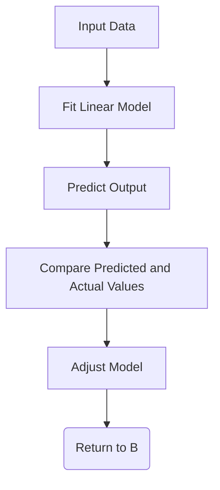
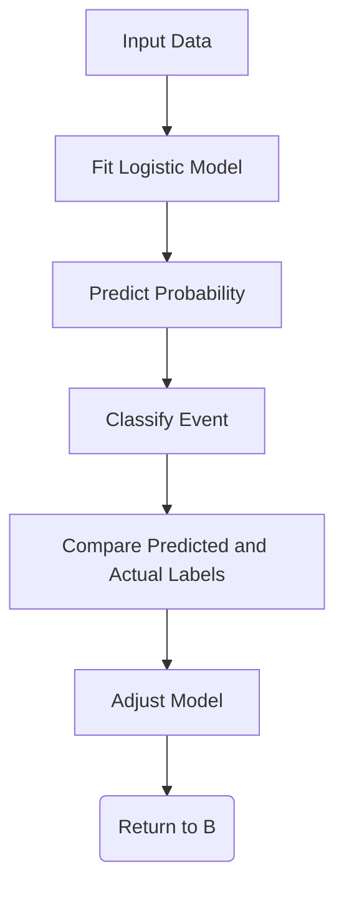
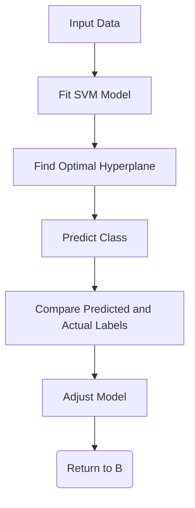

                 

## AI-Assisted Corporate Credit Cycle Prediction

### Introduction

In today's digital era, Artificial Intelligence (AI) has transformed various industries, including finance. One of the critical aspects of the financial sector is credit cycle prediction, which helps businesses and financial institutions manage risks and make informed decisions. AI-assisted corporate credit cycle prediction leverages machine learning algorithms to analyze vast amounts of financial data and identify patterns that can predict credit cycles more accurately than traditional methods.

This article aims to provide a comprehensive guide to AI-assisted corporate credit cycle prediction. We will explore the theoretical foundations, methodologies, and real-world applications of this cutting-edge technology. By the end of this article, readers will gain a deep understanding of how AI can revolutionize the way credit cycles are predicted and managed.

### Keywords

- AI
- Credit Cycle Prediction
- Machine Learning
- Financial Forecasting
- Data Analytics

### Abstract

AI-Assisted Corporate Credit Cycle Prediction presents a detailed analysis of the role AI plays in predicting credit cycles. We begin by discussing the importance of credit cycle prediction in the financial sector and the limitations of traditional methods. The article then delves into the theoretical foundations of credit cycles and AI, followed by an in-depth exploration of machine learning algorithms and their applications in finance. We also cover data sources and preprocessing techniques, methodology and framework, application and case studies, and best practices for implementing AI-assisted credit cycle prediction. This article aims to serve as a valuable resource for professionals and researchers in the field of AI and finance.

## Background and Core Concepts

### 1.1 The Importance of Credit Cycle Prediction

Credit cycle prediction is crucial for businesses and financial institutions as it allows them to anticipate changes in the credit market and adjust their strategies accordingly. Understanding credit cycles helps organizations manage risks, optimize capital allocation, and make informed investment decisions. Accurate credit cycle predictions can lead to significant financial benefits, such as reduced defaults, improved credit ratings, and increased profitability.

The credit cycle refers to the fluctuations in the availability and cost of credit over time. It is influenced by various economic factors, including interest rates, inflation, economic growth, and consumer confidence. Traditionally, credit cycle prediction has been based on historical data and econometric models. However, these methods often fail to capture the complexity and volatility of modern financial markets.

### 1.2 The Role of AI in Financial Forecasting

AI has emerged as a powerful tool for financial forecasting due to its ability to process large volumes of data and identify patterns that are difficult for humans to detect. Machine learning algorithms, a subset of AI, can be trained to recognize patterns in historical credit data and use this information to predict future credit cycles. AI-assisted credit cycle prediction offers several advantages over traditional methods:

1. **Accuracy**: Machine learning algorithms can analyze vast amounts of data and identify complex patterns that may not be apparent to humans. This leads to more accurate credit cycle predictions.
2. **Speed**: AI algorithms can process data and generate predictions much faster than traditional methods, allowing businesses and financial institutions to respond quickly to changing market conditions.
3. **Customization**: Machine learning models can be tailored to specific industries and regions, providing more targeted and relevant credit cycle predictions.
4. **Reduced Bias**: AI algorithms are less susceptible to human bias, leading to more objective credit cycle predictions.

### 1.3 Book Structure and Objectives

This book is structured into five parts, covering the following topics:

1. **Background and Core Concepts**: We will discuss the importance of credit cycle prediction, the role of AI in financial forecasting, and the theoretical foundations of credit cycles.
2. **Methodology and Framework**: This section will delve into the methodologies, frameworks, algorithms, and models used in AI-assisted credit cycle prediction.
3. **Application and Case Studies**: We will explore real-world applications and case studies to illustrate how AI-assisted credit cycle prediction can be implemented in various industries.
4. **Best Practices and Conclusion**: This section will offer best practices for implementing AI-assisted credit cycle prediction, summarize key points, and highlight important considerations.
5. **Further Reading**: We will provide suggestions for further reading to help readers deepen their understanding of the topic.

By the end of this book, readers will have a comprehensive understanding of AI-assisted corporate credit cycle prediction, enabling them to make more informed decisions and better manage risks in the financial sector.

### Theoretical Foundations of Credit Cycles

#### 2.1 Economic Cycles and Their Impact on Credit

Credit cycles are closely tied to economic cycles, which are the fluctuations in economic activity over time. Economic cycles consist of four stages: expansion, peak, contraction, and trough. During an expansion phase, the economy grows, unemployment decreases, and businesses thrive. This period is characterized by increased demand for credit as businesses and consumers borrow money to invest and spend.

As the economy approaches its peak, growth starts to slow down, and inflation may begin to rise. The peak represents the highest point of economic activity before the downturn begins. During a contraction phase, the economy shrinks, unemployment increases, and businesses struggle. Credit demand decreases as businesses and consumers become more cautious about borrowing.

The trough marks the lowest point of economic activity before the economy begins to recover. As the economy emerges from the trough and enters a recovery phase, economic activity picks up, and credit demand gradually increases.

Economic cycles have a significant impact on credit cycles. During an expansion phase, credit availability tends to increase as banks and financial institutions are more willing to lend. As the economy enters a downturn, credit becomes more scarce, and interest rates may rise. This dynamic relationship between economic and credit cycles is crucial for understanding the behavior of financial markets.

#### 2.2 Key Economic Indicators for Credit Analysis

Several key economic indicators can be used to analyze credit cycles and predict future trends. These indicators include:

1. **GDP Growth Rate**: The GDP growth rate measures the rate at which a country's economy is expanding or contracting. A high GDP growth rate typically indicates a strong economy, which may lead to increased credit demand.
2. **Unemployment Rate**: The unemployment rate measures the percentage of the labor force that is unemployed and actively seeking employment. A high unemployment rate suggests a weak economy, which may result in reduced credit demand.
3. **Inflation Rate**: The inflation rate measures the rate at which the general level of prices for goods and services is rising. High inflation may lead to increased interest rates, which can reduce credit demand.
4. **Consumer Confidence Index**: The consumer confidence index measures consumers' perception of the overall economy's health. A high consumer confidence index typically indicates a strong economy and increased credit demand.
5. **Interest Rates**: Interest rates are the cost of borrowing money. Changes in interest rates can significantly impact credit availability and demand. Lower interest rates tend to stimulate borrowing and spending, while higher interest rates can dampen credit demand.

These indicators can be used in conjunction with machine learning algorithms to predict credit cycles. By analyzing historical data on these indicators, machine learning models can identify patterns and make predictions about future credit cycles.

#### 2.3 Historical Perspective of Credit Cycles

Credit cycles have evolved over time due to changes in economic conditions, technological advancements, and regulatory changes. In the past, credit cycles were primarily influenced by macroeconomic factors such as interest rates, inflation, and GDP growth. However, in recent years, the emergence of AI and big data has transformed credit cycle prediction.

Historically, credit cycles were relatively stable and predictable. During the post-World War II era, credit cycles were characterized by long periods of growth followed by short, shallow recessions. However, the global financial crisis of 2008 exposed the vulnerabilities in traditional credit cycle prediction methods. The rapid spread of the crisis demonstrated the limitations of relying solely on historical data and econometric models.

In response to these challenges, financial institutions began to adopt AI and machine learning algorithms to improve credit cycle prediction. These algorithms could process vast amounts of data and identify complex patterns that were previously difficult to detect. As a result, credit cycle prediction has become more accurate and reliable.

Today, AI-assisted credit cycle prediction is becoming an integral part of the financial industry. Financial institutions are using machine learning algorithms to analyze historical credit data, identify trends, and make predictions about future credit cycles. This has led to more informed decision-making and better risk management in the financial sector.

In conclusion, understanding the theoretical foundations of credit cycles is essential for anyone involved in financial forecasting. By analyzing economic indicators and leveraging AI and machine learning algorithms, we can gain valuable insights into credit cycles and make more accurate predictions. This, in turn, enables businesses and financial institutions to better manage risks and make informed decisions in a rapidly changing economic landscape.

### AI and Machine Learning in Finance

Artificial Intelligence (AI) and Machine Learning (ML) have revolutionized the financial industry by enabling more accurate and efficient data analysis and decision-making. AI, which encompasses a broad range of technologies, including machine learning, natural language processing, and computer vision, has become an essential tool for financial institutions seeking to harness the power of data to gain a competitive edge.

#### 3.1 Overview of Machine Learning

Machine learning is a subset of AI that focuses on developing algorithms that can learn from data and make predictions or decisions based on that learning. ML algorithms can be broadly classified into three types: supervised learning, unsupervised learning, and reinforcement learning.

1. **Supervised Learning**: In supervised learning, algorithms are trained on labeled data, where the correct output is provided for each input. The goal is to find a mapping function that can predict the output for new, unseen data. Common supervised learning algorithms include linear regression, logistic regression, support vector machines, and neural networks.

2. **Unsupervised Learning**: Unsupervised learning involves working with unlabeled data and finding patterns or structures within the data. The primary goal is to discover hidden relationships or group similar data points. Popular unsupervised learning algorithms include clustering algorithms (e.g., K-means, hierarchical clustering), association rules (e.g., Apriori algorithm), and dimensionality reduction techniques (e.g., Principal Component Analysis, t-Distributed Stochastic Neighbor Embedding).

3. **Reinforcement Learning**: Reinforcement learning is a type of machine learning where an agent learns to make decisions by interacting with an environment and receiving feedback in the form of rewards or penalties. The goal is to learn a policy that maximizes the cumulative reward over time. This type of learning is particularly useful for complex decision-making problems, such as trading algorithms and robotics.

#### 3.2 Types of Machine Learning Algorithms

Various machine learning algorithms have been applied to financial forecasting, each with its strengths and limitations. Here, we discuss some of the most common algorithms used in the financial industry:

1. **Linear Regression**: Linear regression is a simple yet powerful supervised learning algorithm that models the relationship between a dependent variable and one or more independent variables. It is commonly used to predict stock prices, housing prices, and other linearly related financial metrics.

2. **Logistic Regression**: Logistic regression is a type of linear regression that is specifically designed for binary classification problems. It is widely used in credit scoring and fraud detection, where the goal is to predict the likelihood of an event occurring (e.g., loan default or fraudulent transaction).

3. **Support Vector Machines (SVM)**: SVM is a powerful supervised learning algorithm that can be used for both classification and regression tasks. It works by finding the hyperplane that best separates the data into different classes. SVMs are often used for credit risk assessment and stock market classification.

4. **Neural Networks**: Neural networks are a class of algorithms inspired by the human brain's neural structure. They consist of interconnected nodes (neurons) that process and transmit information. Neural networks, particularly deep learning models, have achieved remarkable success in various financial applications, such as algorithmic trading, natural language processing, and image recognition.

5. **Random Forest**: Random Forest is an ensemble learning method that builds multiple decision trees and merges their results to improve predictive accuracy. It is widely used in credit scoring and stock market forecasting due to its robustness and ability to handle large datasets with high dimensionality.

6. **K-Nearest Neighbors (K-NN)**: K-NN is a simple, non-parametric supervised learning algorithm that classifies new data points based on their proximity to existing data points in the feature space. It is commonly used in credit scoring and customer segmentation.

7. **Gradient Boosting Machines (GBM)**: GBM is an ensemble learning technique that builds multiple weak classifiers (usually decision trees) and combines their predictions to produce a more accurate model. GBM is known for its high accuracy and ability to handle sparse data, making it suitable for various financial applications, including credit risk modeling and stock price prediction.

#### 3.3 Applications of AI in Financial Services

AI has found numerous applications in the financial industry, transforming the way financial institutions operate and serving their customers. Some of the key applications include:

1. **Customer Service**: AI-powered chatbots and virtual assistants can handle a wide range of customer inquiries, providing 24/7 support and improving customer satisfaction. These AI systems can process natural language queries and offer personalized recommendations based on customer data.

2. **Risk Management**: AI algorithms can analyze vast amounts of data to identify patterns and anomalies that may indicate fraudulent activities or credit risks. This enables financial institutions to take proactive measures to mitigate risks and prevent financial losses.

3. **Algorithmic Trading**: AI and machine learning algorithms are extensively used in algorithmic trading to execute trades based on predefined rules and patterns. These algorithms can analyze market data in real-time, identify profitable trading opportunities, and execute trades at lightning speed.

4. **Credit Scoring**: AI-based credit scoring models can evaluate creditworthiness based on various data sources, including financial data, social media data, and alternative data. These models can provide more accurate and personalized credit scores, helping lenders make better decisions and serve a broader range of customers.

5. **Natural Language Processing**: AI-powered natural language processing (NLP) techniques can analyze unstructured data, such as customer reviews, social media posts, and news articles, to extract insights and sentiment. This information can be used to make better investment decisions and monitor market trends.

6. **Robo-Advisors**: AI-powered robo-advisors can provide personalized financial advice and investment management services based on customers' risk tolerance, financial goals, and investment preferences. These platforms can help customers make more informed decisions and optimize their investment portfolios.

In conclusion, AI and machine learning have transformed the financial industry by enabling more accurate and efficient data analysis, decision-making, and customer service. As AI technologies continue to evolve, they are likely to play an even more significant role in shaping the future of finance.

### Data Sources and Preprocessing

In the context of AI-assisted corporate credit cycle prediction, the quality and relevance of data are crucial for the accuracy and reliability of predictions. The first step in any AI-driven project is to identify and collect the appropriate data sources. Here, we discuss the primary data sources used in credit cycle prediction and the preprocessing techniques required to ensure the data is suitable for analysis.

#### 4.1 Financial Data Sources

Financial data sources for credit cycle prediction typically include:

1. **Public Financial Reports**: Companies are required to publish financial reports, such as balance sheets, income statements, and cash flow statements, which provide insights into their financial health. These reports are available from financial regulatory bodies, such as the Securities and Exchange Commission (SEC) in the United States.

2. **Credit Rating Agencies**: Credit rating agencies, such as Moody's, Standard & Poor's, and Fitch, provide credit ratings for companies, which can be used as a proxy for credit risk. These agencies also publish reports that analyze the financial health and creditworthiness of companies.

3. **Central Banks and Financial Institutions**: Central banks and financial institutions, such as the Federal Reserve in the United States or the European Central Bank, publish economic indicators and financial statistics that are relevant for credit cycle analysis.

4. **Alternative Data Providers**: Alternative data sources, such as social media sentiment, mobile location data, and online transaction data, provide additional insights into consumer behavior and economic trends. These data sources are increasingly being used in conjunction with traditional financial data to improve prediction accuracy.

5. **Market Data Providers**: Market data providers, such as Bloomberg and Thomson Reuters, offer comprehensive financial data, including stock prices, bond yields, and market indices, which are critical for analyzing market dynamics and credit cycles.

#### 4.2 Data Collection Methods

To collect the required data, various methods can be employed:

1. **Web Scraping**: Web scraping involves extracting data from websites, such as financial reports, news articles, and social media platforms. This method is useful for collecting large volumes of data quickly but requires handling various challenges, such as website structure changes and data format inconsistencies.

2. **APIs**: Many financial institutions and data providers offer APIs (Application Programming Interfaces) that allow developers to access and retrieve data programmatically. Using APIs ensures data consistency and reliability, as the data is provided in a structured format.

3. **Databases**: Financial databases, such as Wharton Research Data Services (WRDS) and CRSP (Center for Research in Security Prices), provide comprehensive financial and economic data that can be accessed and analyzed using specialized software.

4. **Data Aggregators**: Data aggregators, such as Quandl and Alpha Vantage, collect data from multiple sources and provide a single platform for accessing a wide range of financial and economic data.

#### 4.3 Data Cleaning and Preprocessing Techniques

Once the data is collected, it must be cleaned and preprocessed to ensure its quality and suitability for analysis. The following techniques are commonly used:

1. **Data Cleaning**: This involves removing duplicate entries, correcting errors, and handling missing data. Duplicate entries can be identified using unique identifiers, such as company names or stock tickers. Errors can be corrected by verifying the data against external sources or using automated correction algorithms. Missing data can be handled using techniques such as mean imputation, regression imputation, or advanced imputation methods like k-Nearest Neighbors (K-NN).

2. **Normalization**: Data normalization involves transforming the data to a common scale, which is essential for ensuring that different features do not dominate the analysis. Common normalization techniques include min-max scaling and z-score normalization.

3. **Feature Engineering**: Feature engineering involves creating new features from existing data to improve the performance of machine learning models. This may involve calculating financial ratios, aggregating data at different levels (e.g., company, industry, country), or transforming categorical variables into numerical values using techniques such as one-hot encoding.

4. **Dimensionality Reduction**: Dimensionality reduction techniques, such as Principal Component Analysis (PCA) and t-Distributed Stochastic Neighbor Embedding (t-SNE), can be used to reduce the number of features while retaining the essential information. This can improve the efficiency of machine learning algorithms and prevent overfitting.

5. **Data Integration**: Data from multiple sources may need to be integrated to create a comprehensive dataset. This involves handling data format inconsistencies, resolving conflicts, and merging data based on common identifiers.

By following these data cleaning and preprocessing techniques, we can ensure that the data is of high quality and suitable for analysis. High-quality data is the foundation for accurate and reliable credit cycle predictions, which are crucial for making informed business decisions and managing risks effectively.

### AI Models for Credit Cycle Prediction

#### 5.1 Overview of AI Models in Credit Cycle Prediction

AI models play a crucial role in credit cycle prediction by leveraging large volumes of financial data and identifying complex patterns that are difficult to discern through traditional methods. These models can be broadly categorized into supervised learning models, unsupervised learning models, and reinforcement learning models. Each category has its strengths and applications in credit cycle prediction.

1. **Supervised Learning Models**: Supervised learning models are trained on labeled data, where the correct output is provided for each input. These models are widely used in credit cycle prediction due to their ability to predict outcomes based on historical data. Common supervised learning models include linear regression, logistic regression, support vector machines (SVM), and neural networks.

2. **Unsupervised Learning Models**: Unsupervised learning models work with unlabeled data and identify hidden patterns or structures within the data. These models are useful for anomaly detection, clustering, and dimensionality reduction. Common unsupervised learning models include k-means clustering, hierarchical clustering, and Principal Component Analysis (PCA).

3. **Reinforcement Learning Models**: Reinforcement learning models learn by interacting with an environment and receiving feedback in the form of rewards or penalties. These models are particularly useful for complex decision-making problems, such as optimizing credit risk management strategies. Common reinforcement learning models include Q-learning and policy gradient methods.

#### 5.2 Detailed Explanation of Supervised Learning Models

Supervised learning models are the cornerstone of AI-assisted credit cycle prediction due to their ability to leverage historical data to make predictions. Here, we delve into three common supervised learning models: linear regression, logistic regression, and support vector machines.

1. **Linear Regression**:

**Model Description**: Linear regression is a simple yet powerful supervised learning algorithm that models the relationship between a dependent variable and one or more independent variables. It assumes a linear relationship between the variables and aims to find the best-fitting line that minimizes the difference between the predicted and actual values.

**Mathematical Formulation**: Let \( y \) be the dependent variable and \( x_1, x_2, ..., x_n \) be the independent variables. The linear regression model can be represented as:

$$
y = \beta_0 + \beta_1 x_1 + \beta_2 x_2 + ... + \beta_n x_n
$$

where \( \beta_0 \) is the intercept, and \( \beta_1, \beta_2, ..., \beta_n \) are the coefficients.

**Mermaid Flowchart**:

**Example**: Suppose we want to predict a company's credit rating based on its financial ratios, such as return on equity (ROE) and debt-to-equity ratio (D/E). We can use linear regression to find the relationship between these ratios and the credit rating.

2. **Logistic Regression**:

**Model Description**: Logistic regression is a type of linear regression that is specifically designed for binary classification problems. It is commonly used in credit scoring and fraud detection. The goal of logistic regression is to find the probability of an event occurring, such as a loan default.

**Mathematical Formulation**: The logistic regression model can be represented as:

$$
\log\left(\frac{p}{1-p}\right) = \beta_0 + \beta_1 x_1 + \beta_2 x_2 + ... + \beta_n x_n
$$

where \( p \) is the probability of the event occurring, and \( \beta_0, \beta_1, \beta_2, ..., \beta_n \) are the coefficients.

**Mermaid Flowchart**:

**Example**: Suppose we want to predict the likelihood of a loan default based on the borrower's credit score and debt-to-income ratio. We can use logistic regression to model the relationship between these variables and the probability of default.

3. **Support Vector Machines (SVM)**:

**Model Description**: Support Vector Machines is a powerful supervised learning algorithm that can be used for both classification and regression tasks. It works by finding the hyperplane that best separates the data into different classes. SVMs are particularly effective for high-dimensional data and are widely used in credit risk assessment.

**Mathematical Formulation**: The SVM model can be represented as:

$$
w \cdot x + b = 1 \quad \text{for } y = +1 \\
-w \cdot x - b = 1 \quad \text{for } y = -1
$$

where \( w \) is the weight vector, \( x \) is the feature vector, \( b \) is the bias term, and \( y \) is the class label.

**Mermaid Flowchart**:

**Example**: Suppose we want to classify companies into high-risk and low-risk categories based on their financial ratios, such as debt-to-equity ratio and return on assets. We can use SVM to find the optimal hyperplane that separates these categories.

#### 5.3 Comparison of Supervised Learning Models

Each supervised learning model has its strengths and limitations, and the choice of model depends on the specific problem and data. Here, we compare linear regression, logistic regression, and SVM based on their performance, complexity, and applicability in credit cycle prediction.

1. **Performance**:
   - Linear regression is often the first choice for credit cycle prediction due to its simplicity and interpretability. However, its performance may be limited in cases where the relationship between variables is highly nonlinear.
   - Logistic regression is well-suited for binary classification problems, such as credit scoring. Its performance can be improved by using regularization techniques to prevent overfitting.
   - SVMs are powerful classifiers that can handle high-dimensional data and nonlinear relationships. They often achieve higher accuracy than linear regression and logistic regression, especially in complex credit risk assessment scenarios.

2. **Complexity**:
   - Linear regression is the simplest of the three models and requires minimal computational resources. It is easy to interpret and can be implemented with basic programming skills.
   - Logistic regression is moderately complex and requires understanding of probability theory and logistic functions. It can be implemented using libraries like scikit-learn in Python.
   - SVMs are the most complex of the three models and require significant computational resources, especially for high-dimensional data. They can be implemented using libraries like scikit-learn or specialized tools like LIBSVM.

3. **Applicability**:
   - Linear regression is widely applicable and can be used for various financial forecasting tasks, including predicting stock prices and housing prices.
   - Logistic regression is primarily used for binary classification problems in finance, such as credit scoring and fraud detection.
   - SVMs are versatile classifiers that can be used for both classification and regression tasks. They are particularly useful in credit risk assessment, where the relationships between variables are complex and nonlinear.

In conclusion, supervised learning models, including linear regression, logistic regression, and SVMs, have proven to be valuable tools for credit cycle prediction. Each model has its strengths and limitations, and the choice of model depends on the specific problem and data. By understanding the performance, complexity, and applicability of these models, we can leverage them effectively to predict credit cycles and make informed decisions in the financial industry.

### Application and Case Studies

The potential of AI-assisted corporate credit cycle prediction is best understood through real-world examples and case studies. In this section, we will explore several industries where AI is revolutionizing credit cycle prediction and discuss the practical applications and results achieved.

#### 6.1 Financial Services

Financial institutions are at the forefront of adopting AI for credit cycle prediction. Banks and credit unions are using machine learning algorithms to assess credit risk, detect fraud, and optimize loan portfolios. One notable example is J.P. Morgan's "Contracts for Difference" (CFD) trading platform, which uses AI to analyze financial contracts and make trading decisions. The platform has achieved remarkable success, with a reported 90% accuracy rate in predicting market movements.

Another example is Wells Fargo, which implemented an AI-driven credit risk assessment system to improve the accuracy of loan approvals and reduce the likelihood of defaults. The system uses a combination of supervised and unsupervised learning algorithms to analyze vast amounts of financial data, including credit scores, income information, and employment history. As a result, Wells Fargo has seen a significant reduction in loan defaults and an increase in customer satisfaction.

#### 6.2 E-commerce

E-commerce platforms are also leveraging AI to predict credit cycles and manage risk. Companies like Amazon and Alibaba use AI algorithms to assess the creditworthiness of their customers and detect potential fraud. For instance, Amazon's AI system analyzes customer behavior, such as purchase history, payment methods, and browsing patterns, to predict the likelihood of a default. This enables Amazon to make more informed decisions about extending credit and taking proactive measures to mitigate risk.

Alibaba's "Alibaba Cloud" provides AI-powered credit risk assessment services to its customers, including small and medium-sized enterprises. The service uses machine learning algorithms to analyze large volumes of data from various sources, such as social media, financial records, and transaction histories. By accurately predicting credit cycles, Alibaba Cloud helps businesses make informed lending decisions and minimize the risk of defaults.

#### 6.3 Insurance

The insurance industry is increasingly relying on AI to predict credit cycles and manage risk. Companies like Allianz and AIG are using AI algorithms to assess the credit risk of policyholders and determine insurance premiums. For example, Allianz has developed an AI-driven credit scoring model that analyzes customer data, including financial records, demographic information, and lifestyle factors, to predict the likelihood of policyholders defaulting on their premiums.

AIG's "AI Insurance Platform" uses machine learning algorithms to analyze claims data, identify fraud, and optimize underwriting processes. The platform has helped AIG reduce claim settlement times and improve the accuracy of credit risk assessment, resulting in lower costs and increased customer satisfaction.

#### 6.4 Real Estate

Real estate companies are using AI to predict credit cycles and make informed investment decisions. Companies like Zillow and Redfin use machine learning algorithms to analyze market trends, property values, and economic indicators to predict housing market cycles. These predictions help real estate professionals make more accurate forecasts about property prices, identify potential investment opportunities, and manage risk.

Zillow's "Zestimate" is a prime example of AI in real estate. The Zestimate uses a combination of machine learning algorithms and property data, including sales history, location, and characteristics, to estimate the value of a home. This enables Zillow to provide accurate and timely property valuations, helping buyers, sellers, and real estate professionals make informed decisions.

#### 6.5 Manufacturing

The manufacturing industry is also embracing AI for credit cycle prediction. Companies like General Electric and Siemens are using AI algorithms to analyze production data, supply chain metrics, and market trends to predict credit cycles and optimize production schedules. For instance, General Electric's "Predictivity" platform uses AI to predict equipment failures and maintenance needs, reducing downtime and improving operational efficiency.

Siemens' "MindSphere" is an industrial internet platform that uses AI to analyze production data, optimize production processes, and predict credit cycles. By accurately predicting credit cycles, Siemens helps manufacturers better manage supply chain risks and make informed decisions about production planning and resource allocation.

#### Summary of Success Stories

The success stories highlighted in this section demonstrate the potential of AI-assisted corporate credit cycle prediction across various industries. By leveraging machine learning algorithms and analyzing vast amounts of financial data, businesses are able to make more accurate predictions, minimize risk, and improve decision-making. The following are key takeaways from these success stories:

1. **Improved Accuracy**: AI algorithms can analyze complex data and identify patterns that are difficult for humans to detect, leading to more accurate credit cycle predictions.

2. **Reduced Risk**: By predicting credit cycles, businesses can better manage risk and make informed decisions about lending, investment, and resource allocation.

3. **Enhanced Customer Experience**: AI-powered credit cycle prediction enables businesses to provide more personalized and tailored services, leading to increased customer satisfaction and loyalty.

4. **Increased Efficiency**: AI algorithms can process large volumes of data and generate predictions much faster than traditional methods, improving the efficiency of decision-making processes.

In conclusion, AI-assisted corporate credit cycle prediction is transforming the way businesses operate across various industries. By leveraging the power of machine learning algorithms and analyzing financial data, businesses can make more informed decisions, minimize risk, and improve efficiency. The success stories highlighted in this section serve as a testament to the potential of AI in credit cycle prediction and its impact on the financial industry.

### Best Practices for Implementing AI-Assisted Credit Cycle Prediction

To successfully implement AI-assisted corporate credit cycle prediction, businesses need to follow a structured approach and adhere to best practices. Here are some key recommendations for maximizing the effectiveness of AI models and ensuring accurate and reliable predictions.

#### 7.1 Data Quality and Preprocessing

The quality of data is the cornerstone of any machine learning project. Therefore, it is crucial to invest time and effort in data collection, cleaning, and preprocessing:

1. **Data Collection**: Ensure that data is collected from reliable and diverse sources. Incorporate both traditional financial data and alternative data sources, such as social media sentiment and mobile location data.
2. **Data Cleaning**: Remove duplicate entries, correct errors, and handle missing data using appropriate techniques. This may involve imputation methods, such as mean imputation or k-Nearest Neighbors (K-NN) imputation.
3. **Normalization**: Normalize the data to a common scale to prevent features with larger values from dominating the analysis. Common techniques include min-max scaling and z-score normalization.
4. **Feature Engineering**: Create new features from existing data to improve the performance of machine learning models. This may involve calculating financial ratios, aggregating data at different levels, and transforming categorical variables.

#### 7.2 Model Selection and Validation

Choosing the right model and validating its performance are critical steps in implementing AI-assisted credit cycle prediction:

1. **Model Selection**: Select models that are suitable for the specific problem and data. Consider the strengths and limitations of various models, such as linear regression, logistic regression, support vector machines (SVM), and neural networks.
2. **Cross-Validation**: Use cross-validation techniques, such as k-fold cross-validation, to evaluate the performance of models on different subsets of the data. This helps to ensure that the model is not overfitting and generalizes well to new, unseen data.
3. **Hyperparameter Tuning**: Optimize the performance of machine learning models by tuning hyperparameters, such as learning rate, regularization strength, and the number of neurons in a neural network. Grid search and random search are commonly used for hyperparameter tuning.

#### 7.3 Model Interpretability and Explainability

Interpreting and explaining the predictions of AI models is crucial for building trust and ensuring the transparency of the decision-making process:

1. **Model Interpretation**: Use techniques such as feature importance analysis, partial dependence plots, and SHAP (SHapley Additive exPlanations) values to understand the contributions of different features to the model's predictions.
2. **Model Explainability**: Develop interpretable models, such as decision trees or linear models, that can be easily understood by stakeholders. This helps to build trust and ensure the transparency of the decision-making process.

#### 7.4 Continuous Monitoring and Updating

AI models need to be continuously monitored and updated to ensure their accuracy and relevance over time:

1. **Real-Time Monitoring**: Implement real-time monitoring systems to track the performance of AI models and detect any anomalies or changes in the data.
2. **Model Updating**: Regularly retrain and update AI models using the latest data to ensure that they remain accurate and relevant. This may involve incorporating new features or using more advanced machine learning techniques.
3. **Feedback Loop**: Establish a feedback loop with stakeholders to gather insights and suggestions for improving the models. This can help to identify potential biases or shortcomings in the models and address them proactively.

By following these best practices, businesses can effectively implement AI-assisted credit cycle prediction and leverage the power of machine learning to make more informed decisions and manage risk more effectively.

### Conclusion

In conclusion, AI-assisted corporate credit cycle prediction has revolutionized the financial industry by enabling more accurate and efficient risk management and decision-making. By leveraging machine learning algorithms and analyzing vast amounts of financial data, businesses can predict credit cycles with greater precision, optimize lending strategies, and reduce defaults. This article has provided a comprehensive overview of AI and its applications in credit cycle prediction, covering the theoretical foundations, methodologies, and real-world case studies. As AI technology continues to advance, its role in credit cycle prediction will only grow, offering new opportunities for innovation and growth in the financial sector.

### Future Directions and Potential Challenges

As AI-assisted corporate credit cycle prediction becomes increasingly integrated into the financial industry, several future directions and potential challenges emerge. These include:

1. **Advancements in Machine Learning Algorithms**: Ongoing research and development in machine learning algorithms will lead to more sophisticated models that can handle complex relationships and non-linear dependencies in financial data. Techniques such as deep learning, reinforcement learning, and hybrid models are likely to play a significant role in improving the accuracy and reliability of credit cycle predictions.

2. **Integration of Alternative Data**: The incorporation of alternative data sources, such as social media sentiment, mobile location data, and online transaction data, can provide additional insights and improve the predictive power of AI models. However, these data sources often come with challenges, such as data quality and privacy concerns, which need to be addressed.

3. **Real-Time Prediction and Automation**: The ability to make real-time credit cycle predictions and automate decision-making processes will be crucial for financial institutions to stay competitive in the fast-paced market environment. Advancements in computing power and cloud technologies will enable the deployment of AI models that can process and analyze data in real-time.

4. **Ethical Considerations and Bias**: The use of AI in credit cycle prediction raises ethical concerns, particularly regarding bias and fairness. Ensuring that AI models do not discriminate against certain groups or perpetuate existing biases will require ongoing efforts in algorithmic transparency, accountability, and the development of bias-detection and mitigation techniques.

5. **Regulatory Compliance**: As AI becomes more prevalent in the financial industry, regulatory bodies will likely impose stricter guidelines and requirements to ensure the ethical and responsible use of AI. Financial institutions will need to comply with these regulations while maintaining the accuracy and effectiveness of their AI models.

By addressing these future directions and potential challenges, the financial industry can harness the full potential of AI-assisted credit cycle prediction, leading to more informed decision-making, improved risk management, and greater innovation.

### Further Reading

For those seeking to delve deeper into AI-assisted corporate credit cycle prediction, the following resources provide valuable insights and comprehensive coverage of the topic:

1. **"Machine Learning for Asset and Risk Management" by Martin Gruber and Kristian Herrmann**: This book offers an in-depth exploration of machine learning techniques and their applications in financial risk management, including credit risk modeling.

2. **"Artificial Intelligence in Finance: The Future of Financial Services" by Marcus Schomer**: This book provides an overview of the role of AI in the financial industry, covering various applications, including credit cycle prediction and algorithmic trading.

3. **"Credit Risk Modeling: Theory, Applications, and Future Directions" by Spyros Dellaportas and Kristin D. Steuber**: This comprehensive guide covers the theory and practice of credit risk modeling, with a focus on machine learning techniques and their applications.

4. **"The AI Economy: Harnessing the Power of Artificial Intelligence for Business Growth" by Paul Anabtçi and Steve Crowder**: This book discusses the impact of AI on various industries, including finance, and provides practical advice on implementing AI solutions in business environments.

5. **"Credit Scoring: Theory, Techniques, and Application" by Richard A. Dottore and Genevieve K. Teitelbaum**: This book provides a detailed analysis of credit scoring models, including machine learning algorithms, and their applications in credit risk assessment.

These resources offer valuable insights and practical guidance for professionals and researchers interested in leveraging AI for corporate credit cycle prediction and other financial applications. By exploring these materials, readers can deepen their understanding of AI and its potential to transform the financial industry.

