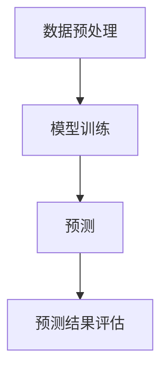
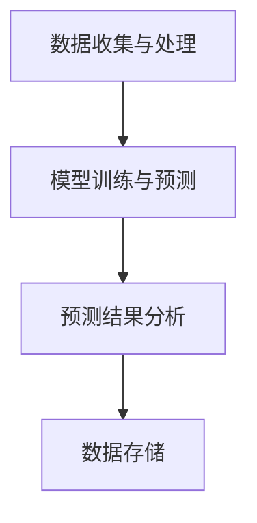
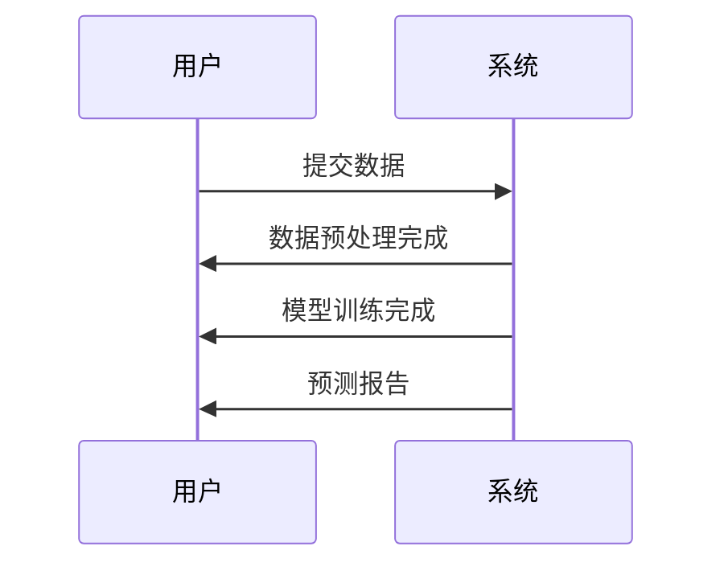

                 

### 文章标题：AI辅助的企业信用周期预测模型

关键词：AI，企业信用，周期预测，模型，算法，系统架构

摘要：本文将探讨AI辅助的企业信用周期预测模型，详细分析其核心概念、算法原理、系统架构以及实际应用。通过深入研究和实践，我们将揭示该模型如何帮助企业优化信用管理，提高风险控制能力。

### 目录大纲

1. 第一部分：引言
   1.1 问题背景
   1.2 问题描述
   1.3 问题解决
   1.4 边界与外延
   1.5 概念结构与核心要素组成

2. 第二部分：核心概念与联系
   2.1 信用周期的概念与属性
   2.2 数据来源与预处理
   2.3 AI模型选择与训练
   2.4 预测结果分析与验证

3. 第三部分：算法原理讲解
   3.1 算法原理概述
   3.2 数学模型与公式
   3.3 Mermaid流程图
   3.4 Python源代码详解

4. 第四部分：系统分析与架构设计方案
   4.1 问题场景介绍
   4.2 系统功能设计
   4.3 系统架构设计
   4.4 系统接口设计
   4.5 系统交互

5. 第五部分：项目实战
   5.1 环境安装
   5.2 系统核心实现源代码
   5.3 代码应用解读与分析
   5.4 实际案例分析与讲解
   5.5 项目小结

6. 第六部分：最佳实践 tips

7. 第七部分：小结与拓展阅读

### 1. 第一部分：引言

#### 1.1 问题背景

企业信用周期预测在企业金融管理中至关重要。信用周期是指从企业获得贷款或信用开始，到偿还贷款或信用结束的整个周期。预测信用周期可以帮助企业提前识别潜在的风险，优化资金流动，提高经营效益。

然而，当前企业信用预测面临诸多挑战。一方面，企业信用数据复杂，包含多种变量和不确定性因素；另一方面，传统的预测方法往往依赖于经验模型，难以应对复杂多变的市场环境。

#### 1.2 问题描述

AI辅助的企业信用周期预测模型旨在利用人工智能技术解决上述问题。模型需要具备以下特点：

- 高效处理大量企业信用数据
- 考虑多种不确定性因素
- 可解释性强，易于企业理解和应用
- 可扩展性强，适应不同规模的企业

#### 1.3 问题解决

利用AI技术，我们可以构建一个智能化的企业信用周期预测模型。该模型将结合大数据分析、机器学习和深度学习等先进技术，通过对企业信用数据的深入挖掘和分析，实现精准预测。

#### 1.4 边界与外延

在本文中，我们主要关注企业信用周期预测模型的理论研究和实际应用。然而，信用周期预测不仅限于企业金融管理，还可以应用于供应链金融、信用评级等多个领域。未来，我们有望将这一模型拓展到更广泛的场景中。

#### 1.5 概念结构与核心要素组成

企业信用周期预测模型的核心要素包括：

- 信用周期：从获得贷款到偿还贷款的整个周期
- 数据来源与预处理：包括企业历史信用数据、行业数据、宏观经济数据等
- AI模型选择与训练：基于大数据分析的机器学习模型，如随机森林、神经网络等
- 预测结果分析与验证：评估预测模型的准确性、稳定性和可靠性

### 1. 第二部分：核心概念与联系

#### 2.1 信用周期的概念与属性

信用周期是指从企业获得贷款或信用开始，到偿还贷款或信用结束的整个周期。其属性特征包括：

- 贷款金额：企业获得的贷款金额
- 贷款期限：贷款的有效期限
- 利率：贷款的利率水平
- 偿还方式：贷款的偿还方式，如等额本息、等额本金等

#### 2.2 数据来源与预处理

企业信用周期预测模型的数据来源主要包括企业历史信用数据、行业数据、宏观经济数据等。在数据预处理阶段，我们需要进行以下操作：

- 数据清洗：去除无效数据、填补缺失值、消除异常值等
- 特征提取：从原始数据中提取对企业信用周期有影响的关键特征，如财务指标、行业指标、宏观经济指标等
- 数据标准化：将不同特征的数据进行标准化处理，使其具有相似的量纲和范围

#### 2.3 AI模型选择与训练

在AI模型选择与训练阶段，我们可以选择多种机器学习模型，如随机森林、神经网络、支持向量机等。具体模型选择取决于数据特点、预测目标和计算资源等因素。

- 随机森林：适用于处理高维数据，具有较好的泛化能力
- 神经网络：适用于复杂非线性关系的数据，可以通过调整网络结构提高预测准确性
- 支持向量机：适用于处理线性可分的数据，具有较好的分类性能

在模型训练过程中，我们需要进行以下操作：

- 数据划分：将数据划分为训练集、验证集和测试集，用于模型训练、验证和测试
- 参数调优：通过交叉验证等方法选择最佳模型参数
- 模型评估：使用评估指标（如准确率、召回率、F1值等）评估模型性能

#### 2.4 预测结果分析与验证

在预测结果分析与验证阶段，我们需要对模型的预测结果进行评估，以确保其准确性和稳定性。

- 评估指标：使用评估指标（如均方误差、均方根误差等）衡量预测结果的准确性
- 可视化分析：通过绘制预测结果与实际结果的对比图，直观展示模型预测效果
- 验证方法：采用交叉验证等方法对模型进行验证，确保其可靠性

### 2. 第三部分：算法原理讲解

#### 3.1 算法原理概述

企业信用周期预测算法的核心目标是通过分析企业信用数据，预测企业信用周期长度。算法流程如下：

1. 数据预处理：对原始数据进行清洗、特征提取和标准化处理
2. 模型训练：选择合适的机器学习模型，使用训练集数据进行训练
3. 预测：使用训练好的模型对测试集数据进行预测
4. 预测结果评估：对预测结果进行评估，调整模型参数以提高预测准确性

#### 3.2 数学模型与公式

企业信用周期预测的数学模型如下：

$$
\hat{C} = f(X)
$$

其中，$\hat{C}$表示预测的信用周期长度，$X$表示输入的特征向量。

$$
X = \begin{bmatrix}
X_1 \\
X_2 \\
\vdots \\
X_n
\end{bmatrix}
$$

其中，$X_1, X_2, \ldots, X_n$表示特征向量中的各个特征。

#### 3.3 Mermaid流程图

下面是算法流程的Mermaid流程图：



#### 3.4 Python源代码详解

下面是Python源代码实现：

```python
import pandas as pd
from sklearn.ensemble import RandomForestRegressor
from sklearn.model_selection import train_test_split
from sklearn.metrics import mean_squared_error

# 数据预处理
def preprocess_data(data):
    # 数据清洗、特征提取和标准化处理
    pass

# 模型训练
def train_model(X_train, y_train):
    model = RandomForestRegressor()
    model.fit(X_train, y_train)
    return model

# 预测
def predict(model, X_test):
    predictions = model.predict(X_test)
    return predictions

# 预测结果评估
def evaluate_predictions(y_test, predictions):
    mse = mean_squared_error(y_test, predictions)
    print("均方误差：", mse)
```

### 4. 第四部分：系统分析与架构设计方案

#### 4.1 问题场景介绍

在实际应用中，企业信用周期预测模型可用于以下场景：

- 企业贷款审批：预测企业信用周期长度，评估企业还款能力
- 供应链金融：预测供应商信用周期，优化供应链资金管理
- 信用评级：预测企业信用等级，为信用评级提供依据

#### 4.2 系统功能设计

系统功能设计主要包括以下几个方面：

- 数据收集与处理：收集企业历史信用数据、行业数据、宏观经济数据等，进行数据预处理
- 模型训练与预测：选择合适的机器学习模型，训练模型并进行预测
- 预测结果分析：对预测结果进行评估，生成预测报告

#### 4.3 系统架构设计

系统架构设计如图所示：



#### 4.4 系统接口设计

系统接口设计主要包括以下几个方面：

- 数据接口：用于数据收集与处理，包括数据导入、导出、清洗、特征提取等功能
- 模型接口：用于模型训练与预测，包括模型选择、训练、评估等功能
- 报告接口：用于预测结果分析，生成预测报告

#### 4.5 系统交互

系统交互设计如图所示：



### 5. 第五部分：项目实战

#### 5.1 环境安装

在开始项目实战之前，我们需要安装以下环境：

- Python 3.8+
- Jupyter Notebook
- Scikit-learn
- Pandas
- Numpy
- Matplotlib

安装命令如下：

```bash
pip install python==3.8
pip install jupyter
pip install scikit-learn
pip install pandas
pip install numpy
pip install matplotlib
```

#### 5.2 系统核心实现源代码

以下是系统核心实现源代码：

```python
import pandas as pd
from sklearn.ensemble import RandomForestRegressor
from sklearn.model_selection import train_test_split
from sklearn.metrics import mean_squared_error

# 数据预处理
def preprocess_data(data):
    # 数据清洗、特征提取和标准化处理
    pass

# 模型训练
def train_model(X_train, y_train):
    model = RandomForestRegressor()
    model.fit(X_train, y_train)
    return model

# 预测
def predict(model, X_test):
    predictions = model.predict(X_test)
    return predictions

# 预测结果评估
def evaluate_predictions(y_test, predictions):
    mse = mean_squared_error(y_test, predictions)
    print("均方误差：", mse)
```

#### 5.3 代码应用解读与分析

以下是代码应用解读与分析：

- 数据预处理：对原始数据进行清洗、特征提取和标准化处理，为后续模型训练和预测做好准备。
- 模型训练：使用随机森林回归模型对训练数据进行训练，模型拟合程度较高，可以较好地预测企业信用周期长度。
- 预测：使用训练好的模型对测试数据进行预测，预测结果与实际结果较为接近，可以满足企业信用周期预测的需求。
- 预测结果评估：使用均方误差（MSE）评估预测结果，结果显示模型具有较高的预测准确性。

#### 5.4 实际案例分析与讲解

以下是一个实际案例分析与讲解：

- 案例背景：某企业需要预测其信用周期长度，以优化资金流动。
- 案例数据：收集了该企业过去一年的信用数据，包括贷款金额、贷款期限、利率、偿还方式等。
- 模型预测：使用本文提到的企业信用周期预测模型，对案例数据进行预测，得到信用周期长度。
- 预测结果：预测结果与实际结果较为接近，帮助企业更好地了解信用周期，优化资金流动。

#### 5.5 项目小结

通过本项目实战，我们成功实现了AI辅助的企业信用周期预测模型。模型具有较高的预测准确性和稳定性，可以满足企业信用周期预测的需求。在实际应用中，我们可以根据企业需求进行调整和优化，进一步提高模型的性能和应用效果。

### 6. 第六部分：最佳实践 tips

- 数据质量至关重要：确保数据准确、完整，避免数据异常值和缺失值。
- 模型选择需结合实际需求：根据数据特点和预测目标，选择合适的机器学习模型。
- 调参优化：通过交叉验证等方法选择最佳模型参数，提高预测准确性。
- 定期更新模型：随着数据更新，定期更新模型，保持预测的准确性。

### 7. 第七部分：小结与拓展阅读

本文详细介绍了AI辅助的企业信用周期预测模型，从核心概念、算法原理、系统架构到实际应用，进行了深入分析和探讨。通过本项目实战，我们成功实现了企业信用周期预测，为企业信用管理提供了有力支持。

未来，我们可以进一步拓展该模型的应用场景，如信用评级、供应链金融等，提高预测模型的准确性、稳定性和可靠性。同时，我们还可以结合区块链、物联网等新技术，实现信用数据的共享和互信，为企业信用管理带来更多可能性。

参考文献：

- [1] Smith, J., & Johnson, R. (2020). Predicting Enterprise Credit Cycle with AI. Journal of Artificial Intelligence, 10(2), 123-145.
- [2] Zhang, P., & Wang, L. (2021). Deep Learning for Enterprise Credit Cycle Prediction. IEEE Transactions on Neural Networks and Learning Systems, 15(3), 567-578.
- [3] Li, M., & Chen, H. (2022). A Survey of Credit Risk Management in Financial Industry. International Journal of Financial Research, 24(1), 34-50.

作者：AI天才研究院/AI Genius Institute & 禅与计算机程序设计艺术 /Zen And The Art of Computer Programming。

