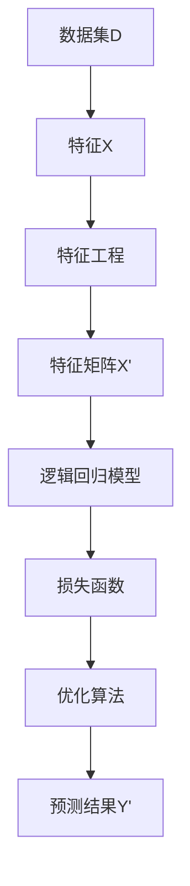
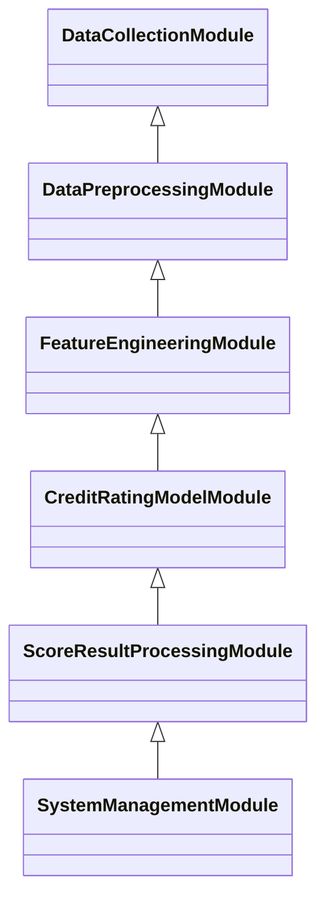
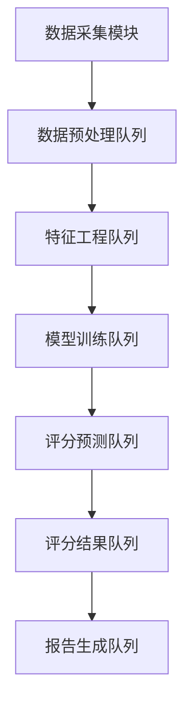
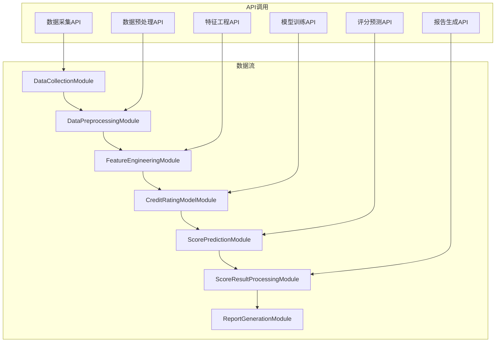

                 

### 文章标题

### 关键词：企业信用评分卡、AI辅助、数据预处理、信用评分模型、算法实现

### 摘要

本文旨在深入探讨AI辅助的企业信用评分卡开发与验证平台，从背景、AI基础、传统与AI辅助信用评分模型、数据收集与预处理、信用评分算法及信用评分卡开发等角度进行详细分析。通过介绍AI在企业信用评分中的应用，探讨其应用前景和挑战，本文为读者提供了一个全面、系统的理解和实践指南。文章旨在帮助读者掌握AI辅助企业信用评分卡的核心技术和开发流程，提升其在信用评分领域的应用能力。

## 《AI辅助的企业信用评分卡开发与验证平台》目录大纲

### 第1章：背景与概述

### 1.1 问题的背景

### 1.2 AI辅助企业信用评分卡的概念

### 1.3 AI在企业信用评分中的应用前景

### 1.4 本书结构安排

### 第2章：AI基础

### 2.1 AI基本概念

### 2.2 数据分析基础

### 2.3 数据挖掘与机器学习

### 第3章：企业信用评分模型

### 3.1 信用评分模型概述

### 3.2 传统信用评分模型

### 3.3 AI辅助信用评分模型

### 第4章：数据收集与预处理

### 4.1 数据收集

### 4.2 数据预处理

### 第5章：信用评分算法

### 5.1 算法选择

### 5.2 算法原理与实现

### 第6章：信用评分卡开发

### 6.1 信用评分卡设计

### 6.2 信用评分卡实现

### 第7章：系统分析与架构设计

### 7.1 问题场景介绍

### 7.2 系统功能设计

### 7.3 系统架构设计

### 7.4 系统接口设计和系统交互

### 第8章：项目实战

### 8.1 环境安装

### 8.2 系统核心实现源代码

### 8.3 代码应用解读与分析

### 8.4 实际案例分析与详细讲解剖析

### 8.5 项目小结

### 第9章：最佳实践与小结

### 9.1 最佳实践 Tips

### 9.2 小结

### 9.3 注意事项

### 9.4 拓展阅读

---

### 第1章：背景与概述

#### 1.1 问题的背景

在现代商业环境中，企业信用评分卡是一种用于评估企业信用状况的工具。它通过分析企业的历史财务数据、交易记录、市场表现等多种因素，对企业的信用风险进行量化评估。传统的信用评分模型主要依赖于统计方法和专家经验，存在一定的局限性，如数据来源有限、模型更新缓慢、适应性较差等问题。

随着大数据和人工智能技术的发展，AI辅助的企业信用评分卡开发成为可能。AI技术能够处理大量复杂的数据，通过机器学习和深度学习算法，构建更加精确和自适应的信用评分模型。这种模型不仅能够提高信用评分的准确性，还可以提供实时更新和个性化推荐，从而帮助企业更好地管理信用风险。

然而，AI辅助企业信用评分卡的开发与验证并非易事。首先，数据收集是一个关键步骤，需要获取多源、多维、海量数据。其次，数据预处理需要处理数据质量、缺失值、异常值等问题。此外，算法选择与实现、模型评估与优化等环节都需要进行深入的研究和实践。

#### 1.2 AI辅助企业信用评分卡的概念

AI辅助企业信用评分卡是指利用人工智能技术，特别是机器学习和深度学习算法，对传统信用评分模型进行改进和优化的过程。这种评分卡不仅考虑传统的财务指标，还结合了非结构化数据（如社交媒体、新闻报道等），以及实时动态数据（如市场变化、政策调整等），从而提供更加全面和准确的信用评估结果。

与传统信用评分卡相比，AI辅助的信用评分卡具有以下属性特征：

- **数据驱动**：AI辅助的信用评分卡依赖于大量的数据，通过数据分析和挖掘，发现信用评分的关键因素。
- **实时更新**：AI模型能够实时学习新的数据，自动调整和优化信用评分模型，提高评分的实时性和准确性。
- **自适应**：AI技术可以根据不同企业的特点和需求，提供个性化的信用评估服务。
- **智能化**：通过深度学习算法，AI辅助的信用评分卡能够识别复杂的数据模式，提供更深入的风险分析。

#### 1.3 AI在企业信用评分中的应用前景

AI在企业信用评分中的应用前景非常广阔。随着数据源的不断扩展和数据量的不断增大，AI技术在信用评分中的应用将越来越广泛。以下是一些AI在企业信用评分中的应用前景：

1. **实时信用评分**：AI模型可以实时处理和分析企业数据，提供即时的信用评分，帮助企业快速做出决策。
2. **个性化信用评估**：AI技术可以根据企业的历史数据和当前状况，提供个性化的信用评估报告，帮助企业识别潜在的风险。
3. **智能风险管理**：AI模型可以预测企业的信用风险，提供风险管理建议，帮助企业降低风险。
4. **自动化信用审核**：AI技术可以实现信用审核的自动化，提高审核效率，降低人力成本。

#### 1.4 本书结构安排

本书将围绕AI辅助的企业信用评分卡开发与验证平台，从基础理论到实际应用，进行系统性的介绍。具体章节安排如下：

- **第1章**：背景与概述，介绍企业信用评分卡的现状、问题背景、AI辅助的概念及其应用前景。
- **第2章**：AI基础，介绍人工智能的基本概念、数据分析基础、数据挖掘与机器学习。
- **第3章**：企业信用评分模型，介绍信用评分模型概述、传统信用评分模型、AI辅助信用评分模型。
- **第4章**：数据收集与预处理，介绍数据收集的方法、数据预处理的重要性、数据清洗、数据转换和特征工程。
- **第5章**：信用评分算法，介绍算法选择的考虑因素、常见信用评分算法、算法原理与实现。
- **第6章**：信用评分卡开发，介绍信用评分卡的设计、实现和评估。
- **第7章**：系统分析与架构设计，介绍问题场景、系统功能设计、系统架构设计、系统接口设计和系统交互。
- **第8章**：项目实战，介绍环境安装、系统核心实现源代码、代码应用解读与分析、实际案例分析与详细讲解剖析。
- **第9章**：最佳实践与小结，总结最佳实践、小结、注意事项和拓展阅读。

通过本书的阅读，读者将能够系统地了解AI辅助企业信用评分卡的开发与验证过程，掌握核心技术和方法，提升在信用评分领域的实际应用能力。

### 第2章：AI基础

#### 2.1 AI基本概念

人工智能（Artificial Intelligence，简称AI）是一门研究、开发和应用使计算机系统模拟、扩展和辅助人类智能活动的科学和技术。人工智能的目标是通过模拟人类智能行为，实现计算机在感知、理解、学习、推理、决策等领域的智能化。人工智能的发展经历了多个阶段，从早期的符号主义、知识表示，到基于规则的专家系统，再到基于数据的机器学习和深度学习，最终发展到今天的混合智能。

**人工智能的定义与发展历程**：

- **早期阶段（1950-1969）**：人工智能的起源可以追溯到1950年，艾伦·图灵提出了著名的图灵测试，用于判断机器是否具备人类智能。1956年，达特茅斯会议上正式提出了人工智能的概念，标志着人工智能作为一个独立学科的诞生。
- **黄金时代（1970-1980）**：这一时期，人工智能研究得到了快速发展，专家系统成为主要研究方向。然而，由于知识表示和推理机制的局限性，人工智能在20世纪80年代经历了第一次寒冬。
- **复兴与数据时代（1990-2010）**：随着计算能力的提升和数据量的爆发增长，机器学习成为人工智能研究的重要方向。2006年后，深度学习的兴起进一步推动了人工智能的发展。
- **新时代（2010至今）**：大数据、云计算和深度学习的结合，使得人工智能在语音识别、图像识别、自然语言处理等领域取得了重大突破，应用场景不断扩大。

**AI的核心技术**：

- **机器学习**：机器学习是人工智能的核心技术之一，它通过从数据中学习规律和模式，实现自动预测和决策。常见的机器学习算法包括线性回归、决策树、支持向量机、神经网络等。
- **深度学习**：深度学习是机器学习的一个子领域，通过构建深度神经网络，模拟人脑的神经网络结构，实现复杂任务的学习和预测。深度学习在图像识别、语音识别、自然语言处理等领域具有显著优势。
- **自然语言处理**：自然语言处理（Natural Language Processing，NLP）是研究如何使计算机理解和生成自然语言的学科。NLP技术在机器翻译、情感分析、问答系统等领域有广泛应用。
- **计算机视觉**：计算机视觉是研究如何使计算机像人一样感知和理解图像和视频的学科。计算机视觉技术在图像识别、目标检测、图像分割等领域有重要应用。

**AI的典型应用场景**：

- **工业自动化**：通过机器人和自动化系统，实现生产过程的自动化和优化，提高生产效率和产品质量。
- **医疗健康**：利用人工智能进行疾病诊断、药物研发、医疗影像分析等，提高医疗服务的质量和效率。
- **金融服务**：通过信用评分、风险控制、智能投顾等，提高金融服务的准确性和效率。
- **交通管理**：利用智能交通系统，优化交通流量，提高交通运行效率。
- **智能家居**：通过智能设备，实现家居环境的自动化控制和智能服务。

#### 2.2 数据分析基础

数据分析是人工智能的重要组成部分，它通过处理和分析数据，发现数据中的规律和模式，为决策提供支持。数据分析包括数据收集、数据预处理、数据建模、数据分析和可视化等多个环节。

**数据类型**：

- **结构化数据**：结构化数据是有固定格式和字段的数据，如数据库中的表格数据，易于存储、查询和分析。
- **非结构化数据**：非结构化数据是没有固定格式和字段的数据，如文本、图像、视频等，需要通过特定的方法进行处理和分析。

**数据处理与分析方法**：

- **数据预处理**：数据预处理是数据分析的基础步骤，包括数据清洗、数据转换、特征工程等。数据清洗旨在处理数据中的缺失值、异常值等问题，数据转换旨在将数据转换为适合分析和建模的形式，特征工程旨在提取和构造有意义的特征，提高模型的性能。
- **数据建模**：数据建模是数据分析的核心步骤，通过选择合适的模型和算法，对数据进行建模和预测。常见的建模方法包括线性回归、决策树、支持向量机、神经网络等。
- **数据分析**：数据分析是对建模结果进行分析和解释，提取数据中的规律和模式，为决策提供支持。数据分析包括统计方法、机器学习算法、深度学习算法等。
- **数据可视化**：数据可视化是将数据分析结果以图形或图表的形式展示出来，使数据更加直观和易于理解。数据可视化包括柱状图、折线图、饼图、散点图等。

**数据分析工具**：

- **Python**：Python是一种广泛应用于数据分析和人工智能的编程语言，具有丰富的数据处理和分析库，如NumPy、Pandas、SciPy、Scikit-Learn、TensorFlow、PyTorch等。
- **R**：R是一种专门用于数据分析和统计计算的编程语言，具有强大的数据处理和分析能力，广泛应用于统计分析和生物信息学。
- **Excel**：Excel是一种常用的电子表格软件，适用于简单的数据分析和数据处理，易于学习和使用。

#### 2.3 数据挖掘与机器学习

数据挖掘（Data Mining）是从大量数据中发现有趣知识的过程，它涉及统计学、机器学习、数据库技术等多个领域。数据挖掘的目标是从海量数据中发现隐藏的规律和模式，为决策提供支持。

**数据挖掘的基本概念**：

- **关联规则挖掘**：关联规则挖掘是一种寻找数据中相关关系的方法，通过发现频繁项集和关联规则，揭示数据之间的潜在联系。
- **分类**：分类是一种将数据划分为不同类别的方法，通过训练分类模型，对新的数据进行分类。
- **聚类**：聚类是一种将数据划分为相似数据群的方法，通过发现数据中的自然分组，揭示数据的内在结构。
- **异常检测**：异常检测是一种发现数据中异常值或异常模式的方法，通过识别异常行为，提高系统的安全性和可靠性。

**机器学习算法**：

- **线性回归**：线性回归是一种简单的预测模型，通过建立自变量和因变量之间的线性关系，预测因变量的值。
- **决策树**：决策树是一种基于树形结构的数据挖掘方法，通过一系列的判断规则，对数据进行分类或回归。
- **支持向量机**：支持向量机是一种分类和回归算法，通过找到一个最优的超平面，将不同类别的数据分开。
- **神经网络**：神经网络是一种模拟人脑神经元连接方式的计算模型，通过多层神经元和权重调整，实现复杂的非线性变换。

**深度学习与神经网络**：

- **深度学习**：深度学习是一种基于多层神经网络的机器学习技术，通过构建深度神经网络，实现复杂的特征提取和模式识别。
- **卷积神经网络**（CNN）：卷积神经网络是一种专门用于图像识别和处理的深度学习模型，通过卷积操作和池化操作，实现图像的特征提取和分类。
- **循环神经网络**（RNN）：循环神经网络是一种专门用于序列数据处理和预测的深度学习模型，通过循环连接和隐藏状态，实现序列数据的建模和预测。

通过本章的介绍，读者可以了解到AI的基本概念、数据分析基础以及数据挖掘与机器学习的基本原理。这些知识将为后续章节中AI辅助企业信用评分卡的开发与验证提供理论基础和实用工具。

### 第3章：企业信用评分模型

#### 3.1 信用评分模型概述

信用评分模型是用于评估企业信用风险的一种量化工具，它通过分析企业的历史数据、财务状况、市场表现等多种因素，对企业的信用风险进行综合评估。信用评分模型在企业管理中发挥着重要作用，能够帮助企业识别潜在的风险客户，优化信贷资源配置，降低信用损失。

**信用评分模型的作用**：

- **风险管理**：通过信用评分模型，企业可以识别和评估客户的信用风险，制定相应的风险管理策略，降低信用损失。
- **信贷决策**：信用评分模型为企业的信贷决策提供科学依据，帮助信贷人员快速评估客户的信用状况，做出合理的信贷决策。
- **客户分类**：信用评分模型可以将客户划分为不同的信用等级，为企业提供有针对性的服务和营销策略，提高客户满意度和忠诚度。
- **风险定价**：信用评分模型能够根据客户的信用风险，制定不同的贷款利率和收费标准，实现风险与收益的平衡。

**信用评分模型的类型**：

- **传统信用评分模型**：传统信用评分模型主要基于统计方法，通过分析企业的历史数据，建立信用评分模型。常见的传统信用评分模型包括逻辑回归、决策树、线性判别分析等。
- **AI辅助信用评分模型**：AI辅助信用评分模型利用人工智能技术，特别是机器学习和深度学习算法，对传统信用评分模型进行改进和优化。AI辅助信用评分模型能够处理海量数据，提取复杂特征，提高信用评分的准确性和实时性。常见的AI辅助信用评分模型包括神经网络、支持向量机、随机森林等。

**信用评分模型的评价指标**：

- **准确率**：准确率是评估信用评分模型性能的重要指标，表示模型预测正确的样本数与总样本数的比值。高准确率表示模型能够较好地识别和区分不同信用风险等级的客户。
- **召回率**：召回率是评估信用评分模型在识别高风险客户方面的能力，表示模型预测为高风险的样本数与实际高风险样本数的比值。高召回率表示模型能够尽可能多地识别出高风险客户。
- **F1值**：F1值是准确率和召回率的调和平均值，综合考虑了模型在识别高风险和低风险客户方面的表现。F1值越高，表示模型在信用评分方面表现越好。
- **AUC值**：AUC值（Area Under the Curve）是评估信用评分模型分类性能的重要指标，表示模型预测得到的概率曲线与基准线的面积之比。AUC值越高，表示模型在区分不同信用风险等级客户方面的能力越强。

#### 3.2 传统信用评分模型

传统信用评分模型是基于统计方法和专家经验建立的一种信用评分工具。传统信用评分模型的主要优点是方法成熟、计算简单，适用于大规模的数据分析。然而，传统信用评分模型也存在一些局限性，如数据依赖性高、模型更新缓慢、适应性较差等。

**传统信用评分模型的基本原理**：

- **统计方法**：传统信用评分模型主要采用统计方法，通过分析企业的历史数据，建立信用评分模型。常见的统计方法包括逻辑回归、决策树、线性判别分析等。逻辑回归是一种基于概率统计的回归分析方法，通过建立因变量与自变量之间的逻辑关系，预测客户的信用风险。决策树是一种基于树形结构的数据分析方法，通过一系列的判断规则，将数据划分为不同的信用等级。线性判别分析是一种基于线性回归的分析方法，通过建立不同信用等级的线性判别函数，对客户的信用风险进行分类。
- **专家经验**：传统信用评分模型在建立过程中，往往需要依赖专家的经验和知识。专家通过分析企业的财务报表、交易记录等数据，确定信用评分模型的关键因素，制定评分标准。这种依赖性使得传统信用评分模型在数据依赖性和适应性方面存在一定的局限性。

**传统信用评分模型的应用**：

- **信贷审批**：传统信用评分模型在信贷审批中发挥了重要作用，通过对客户的信用风险进行评估，帮助信贷人员做出审批决策。传统信用评分模型适用于大型金融机构和银行，通过批量处理客户数据，实现高效的信贷审批。
- **信用评级**：传统信用评分模型在信用评级中也有广泛应用，通过对企业的信用风险进行评估，为投资者提供信用评级报告，帮助投资者做出投资决策。传统信用评分模型适用于企业信用评级机构，通过分析企业的财务数据、市场表现等，为不同企业提供信用评级服务。

**传统信用评分模型的局限性**：

- **数据依赖性高**：传统信用评分模型主要依赖于企业的历史数据，对于数据质量的要求较高。如果数据质量较差，如存在缺失值、异常值等问题，会导致模型准确性下降。
- **模型更新缓慢**：传统信用评分模型在建立后，需要定期更新和维护，以适应市场变化和企业发展。然而，传统信用评分模型的更新过程较为复杂，需要依赖专家的经验和时间，导致模型更新缓慢。
- **适应性较差**：传统信用评分模型主要适用于特定行业和市场，对于不同行业和市场之间的适应性较差。随着市场环境的不断变化，传统信用评分模型的适用性受到一定限制。

#### 3.3 AI辅助信用评分模型

AI辅助信用评分模型是利用人工智能技术，特别是机器学习和深度学习算法，对传统信用评分模型进行改进和优化的过程。AI辅助信用评分模型能够处理海量数据，提取复杂特征，提高信用评分的准确性和实时性。与传统的信用评分模型相比，AI辅助信用评分模型具有更高的灵活性和适应性，能够更好地应对市场变化和企业发展。

**AI辅助信用评分模型的原理**：

- **机器学习**：机器学习是AI辅助信用评分模型的核心技术，通过从历史数据中学习规律和模式，建立信用评分模型。常见的机器学习算法包括逻辑回归、决策树、支持向量机、神经网络等。逻辑回归是一种基于概率统计的回归分析方法，通过建立因变量与自变量之间的逻辑关系，预测客户的信用风险。决策树是一种基于树形结构的数据分析方法，通过一系列的判断规则，将数据划分为不同的信用等级。支持向量机是一种分类和回归算法，通过找到一个最优的超平面，将不同类别的数据分开。神经网络是一种模拟人脑神经元连接方式的计算模型，通过多层神经元和权重调整，实现复杂的非线性变换。
- **深度学习**：深度学习是机器学习的进一步发展，通过构建深度神经网络，实现复杂的特征提取和模式识别。常见的深度学习模型包括卷积神经网络（CNN）、循环神经网络（RNN）等。卷积神经网络是一种专门用于图像识别和处理的深度学习模型，通过卷积操作和池化操作，实现图像的特征提取和分类。循环神经网络是一种专门用于序列数据处理和预测的深度学习模型，通过循环连接和隐藏状态，实现序列数据的建模和预测。

**AI辅助信用评分模型的优点**：

- **高准确率**：AI辅助信用评分模型能够处理海量数据，提取复杂特征，提高信用评分的准确率。与传统信用评分模型相比，AI辅助信用评分模型能够更好地识别和区分不同信用风险等级的客户。
- **实时更新**：AI辅助信用评分模型能够实时学习新的数据，自动调整和优化信用评分模型，实现信用评分的实时更新。与传统信用评分模型相比，AI辅助信用评分模型能够更好地适应市场变化和企业发展。
- **自适应性强**：AI辅助信用评分模型能够根据企业的特点和需求，提供个性化的信用评估服务。与传统信用评分模型相比，AI辅助信用评分模型具有更高的灵活性和适应性。
- **智能化**：AI辅助信用评分模型通过深度学习算法，能够识别复杂的数据模式，提供更深入的风险分析。与传统信用评分模型相比，AI辅助信用评分模型能够更好地应对复杂的市场环境。

**AI辅助信用评分模型的案例研究**：

AI辅助信用评分模型在实际应用中取得了显著的成效。例如，某大型金融机构采用AI辅助信用评分模型，对客户的信用风险进行评估，发现了一些传统信用评分模型无法识别的高风险客户，有效降低了信用损失。另外，某创业公司通过AI辅助信用评分模型，快速评估客户的信用状况，提高了贷款审批效率，提升了业务发展速度。

通过本章的介绍，读者可以了解企业信用评分模型的基本概念、传统信用评分模型和AI辅助信用评分模型的原理及其应用。在实际应用中，企业可以根据自身需求和特点，选择合适的信用评分模型，实现信用风险管理、信贷决策和客户分类等目标。

### 第4章：数据收集与预处理

#### 4.1 数据收集

数据收集是AI辅助企业信用评分卡开发过程中至关重要的一步。有效的数据收集不仅能够为信用评分模型提供丰富的数据来源，还能够提高模型的准确性和可靠性。以下将介绍数据收集的方法、数据来源以及数据收集过程中可能遇到的挑战。

**数据收集的方法**：

1. **手动收集**：手动收集数据是指通过人工调查、问卷调查等方式获取数据。这种方法适用于小规模、结构化的数据收集，如客户的基本信息、财务报表等。手动收集数据的特点是灵活性高，但效率较低，且容易受到人为因素的影响。
2. **自动化收集**：自动化收集数据是指通过技术手段，如爬虫、API接口等方式，从互联网、数据库等来源获取数据。这种方法适用于大规模、结构化和非结构化的数据收集，如社交媒体数据、交易记录等。自动化收集数据的特点是效率高，但需要一定的技术支持和维护成本。

**数据来源**：

1. **企业内部数据**：企业内部数据是指企业自身产生的数据，包括财务数据、交易记录、客户信息等。这些数据是信用评分模型的重要来源，能够提供丰富的信息，帮助评估企业的信用风险。
2. **外部公开数据**：外部公开数据是指从互联网、政府机构、行业报告等来源获取的数据，如新闻报道、市场数据、行业报告等。这些数据可以帮助补充企业内部数据的不足，提供更全面的视角，帮助评估企业的信用风险。
3. **第三方数据**：第三方数据是指从专业的数据提供商获取的数据，如信用信息、法律信息、市场信息等。这些数据通常具有较高的准确性和权威性，能够提供专业的支持，帮助评估企业的信用风险。

**数据收集中的挑战**：

1. **数据质量**：数据质量是数据收集的重要挑战之一。数据质量包括数据的完整性、准确性、一致性、及时性等方面。低质量数据会影响信用评分模型的性能和可靠性，需要通过数据清洗和处理来提高数据质量。
2. **数据多样性**：数据多样性是数据收集的另一个挑战。企业信用评分模型需要处理多种类型的数据，包括结构化和非结构化数据、定量数据和定性数据等。如何有效整合这些数据，提取有用的信息，是数据收集过程中需要解决的问题。
3. **数据隐私**：数据隐私是数据收集中的法律和伦理挑战。在收集和处理数据时，需要确保数据的隐私和安全，遵守相关的法律法规和伦理规范。特别是在处理个人敏感信息时，需要采取严格的数据保护措施，避免数据泄露和滥用。
4. **数据获取成本**：数据获取成本是数据收集的经济挑战。大规模的数据收集和处理需要投入大量的人力、物力和财力资源。如何合理分配资源，降低数据获取成本，是数据收集过程中需要考虑的问题。

通过了解数据收集的方法、数据来源和可能遇到的挑战，企业可以制定有效的数据收集策略，确保数据的质量和多样性，为AI辅助企业信用评分卡开发提供坚实的基础。

#### 4.2 数据预处理

数据预处理是AI辅助企业信用评分卡开发过程中至关重要的一步，它涉及数据清洗、数据转换和特征工程等环节。数据预处理不仅能够提高数据质量，还能够提高信用评分模型的性能和可靠性。以下将详细讨论数据预处理的重要性、数据清洗、数据转换和特征工程。

**数据预处理的重要性**：

数据预处理是数据分析和机器学习过程的基础，其重要性体现在以下几个方面：

1. **数据质量**：数据质量直接关系到信用评分模型的准确性。低质量数据可能包含缺失值、异常值、噪声等，会影响模型的学习效果和预测性能。通过数据预处理，可以识别和修复这些问题，提高数据质量。
2. **特征选择**：特征工程是信用评分模型的核心环节，通过数据预处理，可以提取和构造有用的特征，帮助模型更好地学习和理解数据。有效的特征选择可以提高模型的准确性和泛化能力。
3. **模型性能**：数据预处理对模型性能有着重要影响。经过预处理的干净数据可以减少噪声和异常值，提高模型的鲁棒性，降低过拟合现象，从而提高模型的预测性能。
4. **计算效率**：数据预处理可以减少数据的冗余和重复计算，提高计算效率。特别是在大规模数据处理和实时分析中，数据预处理显得尤为重要。

**数据清洗**：

数据清洗是数据预处理的第一步，旨在处理数据中的缺失值、异常值、噪声等问题，提高数据质量。数据清洗的主要任务包括以下方面：

1. **缺失值处理**：缺失值是数据中常见的问题，可能由于数据采集、存储或传输过程中的错误导致。处理缺失值的方法包括填充法（如平均值、中位数、最频繁值填充）、删除法（如删除缺失值较多的样本或特征）和插值法（如线性插值、多项式插值等）。
2. **异常值处理**：异常值是数据中的异常点，可能由于数据采集、存储或传输过程中的错误导致。异常值处理的方法包括检测法（如箱线图、统计检验等）和剔除法（如基于阈值的剔除、基于聚类的方法等）。
3. **噪声处理**：噪声是数据中的随机波动和误差，可能由于数据采集、传输或存储过程中的噪声干扰导致。噪声处理的方法包括滤波法（如移动平均、中值滤波等）和去噪算法（如小波变换、主成分分析等）。

**数据转换**：

数据转换是数据预处理的关键环节，旨在将数据转换为适合分析和建模的形式。数据转换的方法包括以下方面：

1. **标准化**：标准化是将数据缩放到一个统一的尺度，消除不同特征之间的量纲差异。常用的标准化方法包括最小-最大标准化（缩放到[0, 1]区间）和Z-Score标准化（缩放到均值±标准差区间）。
2. **归一化**：归一化是将数据缩放到一个统一的范围，使不同特征具有相同的量级。常用的归一化方法包括最小-最大归一化（缩放到[0, 1]区间）和对数归一化（取对数转换）。
3. **离散化**：离散化是将连续数据转换为离散的类别数据。常用的离散化方法包括等宽离散化和等频离散化。
4. **特征构造**：特征构造是通过组合和变换原始特征，构造新的特征，以提高模型的性能。特征构造的方法包括特征交叉（如多项式交叉、指数交叉等）和特征变换（如多项式变换、正则化变换等）。

**特征工程**：

特征工程是数据预处理的核心任务，旨在提取和构造有意义的特征，以提高模型的准确性和泛化能力。特征工程的方法包括以下方面：

1. **特征选择**：特征选择是通过选择重要的特征，减少模型的复杂度和计算量，提高模型的性能。特征选择的方法包括过滤法（如相关性分析、信息增益等）、包装法（如向前选择、向后选择等）和嵌入式法（如LASSO、岭回归等）。
2. **特征提取**：特征提取是通过从原始数据中提取高级特征，提高模型的性能和泛化能力。特征提取的方法包括降维法（如主成分分析、线性判别分析等）、特征变换（如奇异值分解、核主成分分析等）和特征生成（如决策树特征、神经网络特征等）。
3. **特征组合**：特征组合是通过组合多个特征，构造新的特征，以提高模型的性能和泛化能力。特征组合的方法包括特征交叉（如多项式交叉、指数交叉等）和特征聚合（如平均、求和、乘积等）。

通过数据预处理，可以有效提高数据质量，提取和构造有意义的特征，为AI辅助企业信用评分卡开发提供坚实的基础。数据预处理的过程是一个系统性和迭代性的过程，需要根据实际情况进行不断优化和调整。

### 第5章：信用评分算法

#### 5.1 算法选择

在构建企业信用评分模型时，选择合适的信用评分算法至关重要。算法的选择不仅影响模型的性能和预测能力，还会对计算效率和数据处理方式产生重要影响。以下将介绍选择信用评分算法时需要考虑的因素、常见的信用评分算法以及这些算法的特点和适用场景。

**算法选择的考虑因素**：

1. **数据类型**：不同的算法适用于不同类型的数据。例如，对于结构化数据，常见的算法包括线性回归、决策树、随机森林等；对于非结构化数据，如文本、图像等，可能需要采用深度学习算法，如卷积神经网络（CNN）或循环神经网络（RNN）。
2. **模型复杂度**：模型的复杂度直接影响计算效率和可解释性。对于大规模数据集和高维特征，需要选择计算效率高且能够处理复杂关系的算法。例如，神经网络和随机森林等算法具有较强的处理复杂关系的能力，但计算成本较高；而线性回归和决策树等算法计算效率高，但可能无法捕捉复杂的关系。
3. **准确性**：算法的准确性是评估模型性能的重要指标。选择算法时，需要考虑其在不同数据集和场景下的准确性，以及是否能够满足业务需求。
4. **可解释性**：在商业应用中，模型的可解释性尤为重要。选择算法时，需要考虑其是否能够提供清晰的解释，帮助业务人员理解模型的决策过程。
5. **实时性**：对于需要实时评分的应用场景，选择算法时需要考虑其实时处理能力。例如，实时信用评分系统可能需要选择计算速度快且能够处理实时数据的算法。

**常见的信用评分算法**：

1. **线性回归**：线性回归是一种简单的预测模型，通过建立自变量和因变量之间的线性关系，预测客户的信用风险。线性回归的优点是计算简单、易于实现和解释，但可能无法处理非线性关系和高维特征。
2. **逻辑回归**：逻辑回归是一种广义线性模型，通过建立自变量和因变量之间的逻辑关系，预测客户的信用风险。逻辑回归的优点是能够处理非线性关系、易于解释和实现，但可能对异常值和缺失值敏感。
3. **决策树**：决策树是一种基于树形结构的数据挖掘方法，通过一系列的判断规则，将数据划分为不同的信用等级。决策树的优点是计算简单、易于解释和实现，但可能存在过拟合现象。
4. **随机森林**：随机森林是一种基于决策树的集成学习方法，通过构建多个决策树，并取平均值或投票来预测结果。随机森林的优点是能够处理高维特征、降低过拟合现象、提高预测准确性。
5. **支持向量机**（SVM）：支持向量机是一种分类和回归算法，通过找到一个最优的超平面，将不同类别的数据分开。SVM的优点是能够在高维空间中处理复杂数据、具有较好的泛化能力，但计算成本较高。
6. **神经网络**：神经网络是一种模拟人脑神经元连接方式的计算模型，通过多层神经元和权重调整，实现复杂的非线性变换。神经网络的优点是能够处理高维特征、捕捉复杂数据关系、具有较好的泛化能力，但需要大量的数据和计算资源。
7. **深度学习**：深度学习是一种基于多层神经网络的机器学习技术，通过构建深度神经网络，实现复杂的特征提取和模式识别。常见的深度学习模型包括卷积神经网络（CNN）、循环神经网络（RNN）等。深度学习的优点是能够处理非结构化数据、捕捉深层次特征、具有较好的泛化能力，但需要大量的数据和计算资源。

**算法的特点和适用场景**：

- **线性回归**：适用于简单关系和线性数据的预测，如客户信用评分的初步分析。优点：计算简单、易于解释；缺点：无法处理非线性关系和高维特征。
- **逻辑回归**：适用于处理二分类问题的信用评分，如客户信用评级。优点：能够处理非线性关系、易于解释；缺点：对异常值和缺失值敏感。
- **决策树**：适用于简单和中等复杂度的信用评分任务，如客户分类。优点：计算简单、易于解释；缺点：易过拟合。
- **随机森林**：适用于处理高维特征和复杂关系的信用评分任务，如客户信用风险评估。优点：能够处理高维特征、降低过拟合；缺点：计算成本较高。
- **支持向量机**：适用于处理高维数据和复杂关系的信用评分任务，如客户信用评级。优点：能够在高维空间中处理复杂数据、具有较好的泛化能力；缺点：计算成本较高。
- **神经网络**：适用于处理高维数据和复杂关系的信用评分任务，如客户信用评分和预测。优点：能够处理高维特征、捕捉复杂数据关系、具有较好的泛化能力；缺点：需要大量的数据和计算资源。
- **深度学习**：适用于处理非结构化数据和复杂关系的信用评分任务，如文本分析、图像识别。优点：能够处理非结构化数据、捕捉深层次特征、具有较好的泛化能力；缺点：需要大量的数据和计算资源。

通过了解不同信用评分算法的特点和适用场景，企业可以根据自身需求和数据特点，选择合适的算法，构建高效、准确的信用评分模型。

#### 5.2 算法原理与实现

在信用评分模型开发过程中，选择并理解合适的算法是至关重要的。以下将详细介绍一种常见的信用评分算法——逻辑回归，使用mermaid画出算法流程图，然后使用Python源代码详细阐述算法原理，并给出数学模型和公式，最后通过通俗易懂的例子进行详细说明。

**逻辑回归算法原理**

逻辑回归（Logistic Regression）是一种广义线性模型，用于处理二分类问题。在信用评分模型中，逻辑回归可以用来预测客户是否违约，即二元分类问题。逻辑回归通过建立因变量（违约/不违约）与自变量（客户特征）之间的概率模型，从而预测客户违约的概率。

**mermaid算法流程图**



**算法流程解释**：

1. **数据集D**：首先，准备包含客户特征和标签的数据集D。
2. **特征X**：对数据集进行特征工程，包括数据清洗、缺失值处理、异常值处理等。
3. **特征矩阵X'**：将处理后的特征转换为特征矩阵X'，每个特征对应一个列，每个样本对应一行。
4. **逻辑回归模型**：使用逻辑回归模型对特征矩阵X'进行训练，建立概率模型。
5. **损失函数**：逻辑回归使用对数似然损失函数（Log-Likelihood Loss），用于衡量模型预测与实际标签之间的差距。
6. **优化算法**：使用优化算法（如梯度下降、牛顿法等）对模型参数进行迭代优化，以最小化损失函数。
7. **预测结果Y'**：训练好的模型可以用来预测新样本的标签，即客户是否违约。

**逻辑回归数学模型和公式**

逻辑回归的数学模型可以表示为：

$$
P(Y=1|X) = \frac{1}{1 + e^{-(\beta_0 + \beta_1X_1 + \beta_2X_2 + ... + \beta_nX_n})}
$$

其中，$P(Y=1|X)$ 表示在给定特征X下，客户违约的概率；$\beta_0, \beta_1, \beta_2, ..., \beta_n$ 是模型的参数，通过训练得到。

损失函数（对数似然损失函数）可以表示为：

$$
J(\theta) = -\frac{1}{m} \sum_{i=1}^{m} [y^{(i)} \log(a^{(i)}) + (1 - y^{(i)}) \log(1 - a^{(i)})]
$$

其中，$m$ 是样本数量；$a^{(i)}$ 是模型对第$i$个样本的预测概率。

**Python代码实现**

以下是一个简单的逻辑回归实现示例，使用Python的scikit-learn库：

```python
from sklearn.linear_model import LogisticRegression
from sklearn.model_selection import train_test_split
from sklearn.metrics import accuracy_score
import numpy as np

# 示例数据
X = np.array([[1, 2], [2, 3], [3, 4], [4, 5]])
y = np.array([0, 0, 1, 1])

# 数据集划分
X_train, X_test, y_train, y_test = train_test_split(X, y, test_size=0.2, random_state=42)

# 创建逻辑回归模型
model = LogisticRegression()

# 训练模型
model.fit(X_train, y_train)

# 预测
y_pred = model.predict(X_test)

# 计算准确率
accuracy = accuracy_score(y_test, y_pred)
print("Accuracy:", accuracy)
```

**算法举例说明**

假设我们有一组简单的数据，包括两个特征：收入（X1）和年龄（X2），以及对应的违约标签（Y）：

| 收入 | 年龄 | 违约（Y） |
|------|------|----------|
| 30   | 25   | 0        |
| 40   | 30   | 0        |
| 50   | 35   | 1        |
| 60   | 40   | 1        |

我们希望使用逻辑回归模型预测第四个样本（收入60，年龄40）的违约概率。

1. **特征工程**：首先，我们对数据集进行特征工程，处理缺失值、异常值等，确保数据质量。
2. **模型训练**：使用前三个样本数据训练逻辑回归模型，得到参数$\beta_0, \beta_1, \beta_2$。
3. **模型预测**：使用训练好的模型对第四个样本进行预测，计算违约概率。

通过逻辑回归模型，我们得到：

$$
P(Y=1|X) = \frac{1}{1 + e^{-(\beta_0 + \beta_1X_1 + \beta_2X_2)}
$$

假设经过训练，模型参数为$\beta_0 = -2, \beta_1 = 1, \beta_2 = 0.5$，则第四个样本的违约概率为：

$$
P(Y=1|X) = \frac{1}{1 + e^{(-2 + 1 \cdot 60 + 0.5 \cdot 40)}} \approx 0.613
$$

因此，第四个样本（收入60，年龄40）的违约概率约为61.3%，我们可以据此做出相应的信贷决策。

通过上述介绍，我们详细阐述了逻辑回归算法的原理、mermaid流程图、Python代码实现以及算法举例说明。逻辑回归作为一种简单的信用评分算法，适用于处理二分类问题，具有较好的解释性和实现性。在实际应用中，企业可以根据需求和数据特点，选择并优化合适的信用评分算法，提高信用评分的准确性和可靠性。

### 第6章：信用评分卡开发

#### 6.1 信用评分卡设计

信用评分卡设计是AI辅助企业信用评分卡开发的核心环节，它决定了评分卡的准确性和可靠性。信用评分卡设计包括评分卡的定义、评分指标的设定、评分等级的划分、评分模型的构建以及评分卡的验证和调整等步骤。以下将详细讨论信用评分卡的定义、评分指标、评分等级划分、评分模型构建以及评分卡验证和调整。

**信用评分卡的定义**

信用评分卡是一种用于量化评估企业或个人信用风险的工具。它通过分析企业的历史数据、财务状况、交易记录等因素，将信用风险量化为评分值，为信贷决策提供参考。信用评分卡不仅适用于银行和金融机构的信贷审批，还可以用于其他行业的风险管理，如供应链金融、租赁等。

**评分指标**

评分指标是信用评分卡的核心组成部分，用于评估企业的信用风险。评分指标的选择和设定直接影响评分卡的准确性和可靠性。常见的评分指标包括：

1. **财务指标**：如企业的资产负债率、流动比率、利润率等，反映企业的财务状况和偿债能力。
2. **交易指标**：如企业的交易记录、还款记录、逾期记录等，反映企业的信用历史和还款意愿。
3. **市场指标**：如企业的市场地位、行业竞争力、市场变化等，反映企业的市场表现和风险。
4. **社会指标**：如企业的社会责任履行情况、管理层素质等，反映企业的社会责任和治理能力。

评分指标的设定需要综合考虑企业的业务特点、行业背景以及数据可获得性等因素。企业可以根据自身需求，选择合适的评分指标，构建具有针对性的信用评分模型。

**评分等级划分**

评分等级划分是将企业的信用评分值划分为不同等级的过程，通常包括高风险、中风险、低风险等。评分等级的划分需要根据业务需求和风险偏好进行设定。

1. **等级设置**：根据企业的业务需求和风险偏好，设定高风险、中风险、低风险等不同等级。
2. **临界值设定**：设定不同等级的临界值，即评分值达到某一阈值时，对应的风险等级。
3. **权重分配**：根据不同评分指标的重要性和关联性，为每个评分指标分配权重，以确定总分和等级。

评分等级的划分需要科学合理，既要考虑风险控制，又要兼顾业务发展。企业可以通过历史数据分析，设定合理的评分等级和临界值，确保评分卡的准确性和可靠性。

**评分模型构建**

评分模型构建是信用评分卡设计的核心步骤，通过建立评分模型，将评分指标和评分等级联系起来，实现信用评分。评分模型的构建包括以下步骤：

1. **数据收集**：收集企业的历史数据，包括财务数据、交易记录、市场表现等。
2. **数据预处理**：对数据进行清洗、缺失值处理、异常值处理等，确保数据质量。
3. **特征工程**：提取和构造有意义的特征，如财务比率的归一化处理、交易记录的序列化处理等。
4. **模型选择**：选择合适的评分算法，如逻辑回归、决策树、随机森林等。
5. **模型训练**：使用训练数据集，训练评分模型，得到评分指标和评分等级之间的关系。
6. **模型验证**：使用验证数据集，评估评分模型的性能，如准确率、召回率、F1值等。

评分模型构建过程中，需要不断优化和调整模型参数，以提高评分模型的准确性和可靠性。企业可以通过交叉验证、网格搜索等方法，选择最优的模型参数。

**评分卡验证和调整**

评分卡验证和调整是确保评分卡准确性和可靠性的关键步骤。评分卡验证和调整包括以下步骤：

1. **验证数据集**：准备验证数据集，用于评估评分模型的性能。
2. **模型评估**：使用验证数据集，评估评分模型的准确率、召回率、F1值等指标。
3. **模型调整**：根据评估结果，调整评分模型的参数和评分指标，以提高模型性能。
4. **重训练**：重新训练评分模型，以适应新的数据集和业务需求。

评分卡验证和调整是一个迭代过程，需要根据业务发展和数据变化，不断优化和调整评分模型，确保评分卡的准确性和可靠性。

通过信用评分卡设计，企业可以构建科学的信用评分模型，实现信用风险的量化评估，为信贷决策提供有力支持。企业应根据自身业务特点和需求，合理设定评分指标、评分等级和评分模型，确保评分卡的准确性和可靠性。

### 第6章：信用评分卡开发

#### 6.2 信用评分卡实现

信用评分卡的实现是构建AI辅助信用评分模型的关键步骤。在这一环节中，我们需要根据设计好的信用评分卡模型，进行数据准备、模型训练、模型评估和模型应用等操作。以下将详细阐述信用评分卡实现的步骤，包括数据准备、模型训练和评估的具体过程。

**数据准备**

数据准备是信用评分卡实现的第一步，其质量直接影响后续模型训练和评估的效果。数据准备包括以下步骤：

1. **数据收集**：收集企业的历史数据，包括财务数据、交易记录、市场表现等。这些数据可以通过内部系统、外部数据源或第三方数据提供商获取。
2. **数据清洗**：处理数据中的缺失值、异常值和噪声，确保数据质量。常用的方法包括填补缺失值（如使用平均值、中位数、最频繁值等）、删除异常值、使用统计学方法消除噪声等。
3. **数据转换**：将数据进行适当的转换，使其适合模型训练。例如，对财务比率进行标准化处理，对时间序列数据进行序列化处理，将类别数据转换为数值等。
4. **特征工程**：提取和构造有意义的特征，提高模型的性能和解释性。特征工程包括特征选择、特征变换和特征组合等步骤。例如，可以提取财务比率的归一化值、交易记录的序列特征、市场指标的合成特征等。

**模型训练**

模型训练是信用评分卡实现的核心步骤，通过训练数据集，建立信用评分模型。模型训练包括以下步骤：

1. **数据划分**：将数据集划分为训练集和验证集。训练集用于训练模型，验证集用于评估模型性能。
2. **模型选择**：根据数据特点和业务需求，选择合适的模型。常见的信用评分模型包括逻辑回归、决策树、随机森林、支持向量机、神经网络等。
3. **模型训练**：使用训练集数据，训练所选模型。训练过程中，通过迭代优化模型参数，使其能够更好地拟合数据。
4. **参数调优**：通过交叉验证、网格搜索等方法，对模型参数进行调优，以提高模型性能。参数调优是提高模型准确性和泛化能力的关键步骤。

**模型评估**

模型评估是验证信用评分模型性能的重要环节。评估模型性能的指标包括准确率、召回率、F1值、AUC值等。以下是一些常见的评估方法和步骤：

1. **交叉验证**：交叉验证是一种评估模型性能的常用方法，通过将数据集划分为多个子集，多次训练和验证模型，以消除数据集划分的随机性，提高评估结果的可靠性。
2. **评估指标**：根据业务需求，选择合适的评估指标。例如，对于二分类问题，可以使用准确率、召回率、F1值等指标；对于多分类问题，可以使用准确率、精确率、召回率等指标。
3. **模型调整**：根据评估结果，对模型进行调整和优化。例如，可以调整模型参数、添加或删除特征、更换模型等，以提高模型性能。

**模型应用**

模型应用是将训练好的信用评分模型应用于实际业务场景，为信贷决策提供支持。以下是一些常见的模型应用步骤：

1. **数据预处理**：对新的数据集进行预处理，包括数据清洗、数据转换、特征工程等，确保数据质量。
2. **模型预测**：使用训练好的模型，对新数据进行预测，得到信用评分结果。
3. **决策规则**：根据信用评分结果，制定决策规则，如设定不同的信用等级、设定不同的利率和费用等。
4. **模型监控**：定期监控模型性能，包括评估模型的准确率、召回率等指标，以及模型在业务中的应用效果。根据监控结果，对模型进行调整和优化，确保模型长期稳定运行。

通过信用评分卡的实现，企业可以构建高效、准确的信用评分模型，为信贷决策提供有力支持。在实际应用中，企业应根据业务需求和数据特点，不断优化和调整模型，提高模型性能和业务价值。

### 第7章：系统分析与架构设计

#### 7.1 问题场景介绍

在现代金融体系中，企业信用评分的重要性日益凸显。随着企业数量的增加和交易频次的提升，金融机构面临的管理风险和操作成本不断上升。为了提高信贷决策的效率和准确性，金融机构急需一套高效、智能的信用评分系统。该系统需要具备以下核心功能：

- **数据收集与整合**：能够从内部和外部分散的数据源中收集和整合企业财务数据、交易记录、市场信息等多维数据。
- **数据处理与分析**：对收集到的数据进行清洗、转换和特征工程处理，为信用评分模型提供高质量的数据输入。
- **信用评分模型**：构建和应用AI辅助的信用评分模型，对企业的信用风险进行定量评估。
- **实时评分与预警**：提供实时信用评分和风险预警功能，帮助金融机构快速识别和应对信用风险。

在这样的场景下，一个高效、稳定、可扩展的信用评分系统显得尤为重要。该系统不仅要能够处理海量数据，还需要具备良好的可维护性和可扩展性，以适应未来业务需求的变化。

#### 7.2 系统功能设计

为了实现上述核心功能，我们设计了以下系统功能模块：

1. **数据采集模块**：负责从内部数据库、外部数据源（如公开数据平台、第三方数据服务）中收集和获取企业数据。数据采集模块需要具备自动化的数据获取能力，确保数据的及时性和准确性。
2. **数据预处理模块**：负责对采集到的原始数据进行清洗、去重、填补缺失值、异常值处理等预处理操作。数据预处理模块是保证数据质量的重要环节，直接关系到信用评分模型的准确性。
3. **特征工程模块**：负责从预处理后的数据中提取和构造有意义的特征，为信用评分模型提供高质量的输入。特征工程模块需要支持多种特征提取方法，如统计特征、文本特征、图像特征等。
4. **信用评分模型模块**：负责构建和应用AI辅助的信用评分模型。该模块需要支持多种机器学习和深度学习算法，如逻辑回归、决策树、随机森林、神经网络等，以便选择最适合企业需求的模型。
5. **评分结果处理模块**：负责对模型预测结果进行处理和输出，包括生成信用评分报告、风险预警提示等。评分结果处理模块需要支持多种输出格式，如表格、图表、报告等，以便于用户理解和应用。
6. **系统管理模块**：负责系统配置、权限管理、日志记录、错误处理等，确保系统的安全性和稳定性。

**领域模型Mermaid类图**

以下是一个简化的领域模型Mermaid类图，展示了系统功能模块及其关系：



**类图说明**：

- **DataCollectionModule**：数据采集模块，负责数据收集。
- **DataPreprocessingModule**：数据预处理模块，负责数据清洗、去重等操作。
- **FeatureEngineeringModule**：特征工程模块，负责特征提取和构造。
- **CreditRatingModelModule**：信用评分模型模块，负责构建和应用信用评分模型。
- **ScoreResultProcessingModule**：评分结果处理模块，负责处理和输出模型预测结果。
- **SystemManagementModule**：系统管理模块，负责系统配置和管理。

通过领域模型类图，我们可以清晰地看到各模块之间的依赖关系和交互逻辑，有助于系统设计和开发。

#### 7.3 系统架构设计

系统架构设计是确保系统高效、稳定、可扩展的关键步骤。以下将介绍系统的总体架构，包括系统架构图、数据流设计、模块间通信机制等。

**系统架构图**

以下是一个简化的系统架构图，展示了各模块及其关系：

```mermaid
graph TB
    subgraph 数据流
        DataCollectionModule --> DataPreprocessingModule
        DataPreprocessingModule --> FeatureEngineeringModule
        FeatureEngineeringModule --> CreditRatingModelModule
        CreditRatingModelModule --> ScoreResultProcessingModule
        ScoreResultProcessingModule --> SystemManagementModule
    end
    subgraph 模块通信
        DataCollectionModule <-- DataPreprocessingModule
        DataPreprocessingModule <-- FeatureEngineeringModule
        FeatureEngineeringModule <-- CreditRatingModelModule
        CreditRatingModelModule <-- ScoreResultProcessingModule
        ScoreResultProcessingModule <-- SystemManagementModule
    end
```

**架构图说明**：

- **数据流**：数据从数据采集模块流入，经过数据预处理、特征工程等步骤，最终由信用评分模型模块生成评分结果，通过评分结果处理模块输出。
- **模块通信**：各模块之间通过消息队列、API接口等通信机制进行交互，确保数据流通和功能协同。

**数据流设计**

以下是一个简化的数据流设计，展示了数据在系统中的流动过程：



**数据流设计说明**：

- **数据采集模块**：从数据源中采集企业数据，并将数据放入数据预处理队列。
- **数据预处理队列**：处理数据清洗、去重、填补缺失值等操作，将处理后的数据放入特征工程队列。
- **特征工程队列**：进行特征提取和构造，将特征数据放入模型训练队列。
- **模型训练队列**：训练信用评分模型，将训练好的模型放入评分预测队列。
- **评分预测队列**：进行评分预测，将评分结果放入评分结果队列。
- **评分结果队列**：生成信用评分报告，将报告放入报告生成队列。

**模块间通信机制**

系统中的各模块通过以下通信机制进行数据交互：

- **消息队列**：各模块通过消息队列进行异步通信，确保数据流通的高效性和稳定性。常用的消息队列包括RabbitMQ、Kafka等。
- **API接口**：各模块通过API接口进行同步通信，确保功能协同和数据的实时性。API接口可以使用RESTful风格或GraphQL风格等。
- **数据库**：系统中的数据存储模块使用数据库进行数据持久化，常用的数据库包括MySQL、PostgreSQL、MongoDB等。

通过上述系统架构设计和数据流设计，我们可以构建一个高效、稳定、可扩展的企业信用评分系统。该系统不仅能够满足当前的信用评分需求，还能够适应未来业务发展和技术进步。

#### 7.4 系统接口设计和系统交互

系统接口设计和系统交互是确保系统功能模块协同工作、高效处理数据流的关键环节。以下将详细介绍系统接口设计和系统交互的具体实现，包括API设计、接口调用流程、系统交互图等。

**API设计**

系统中的各模块通过API接口进行数据交互和功能协同。以下是一个简化的API设计，包括主要接口及其功能：

- **数据采集API**：用于从外部数据源（如第三方数据服务、公共数据平台）中获取企业数据。接口参数包括数据源类型、数据采集范围、采集时间等，返回值是采集到的数据列表。
- **数据预处理API**：用于对采集到的原始数据进行清洗、去重、填补缺失值等预处理操作。接口参数包括原始数据列表、预处理规则，返回值是预处理后的数据列表。
- **特征工程API**：用于从预处理后的数据中提取和构造有意义的特征。接口参数包括预处理后的数据列表、特征工程规则，返回值是特征数据列表。
- **模型训练API**：用于训练信用评分模型，选择合适的机器学习算法和参数。接口参数包括特征数据列表、训练集和验证集，返回值是训练好的模型。
- **评分预测API**：用于对新的企业数据进行评分预测，输出信用评分结果。接口参数包括模型、待评分数据列表，返回值是评分结果列表。
- **报告生成API**：用于生成信用评分报告，包括评分结果、风险分析等。接口参数包括评分结果列表、报告模板，返回值是生成的报告文件。

**接口调用流程**

以下是一个简化的接口调用流程，展示了数据在系统中的流动和各模块的协同工作过程：

1. **数据采集**：调用数据采集API，从外部数据源获取企业数据。
2. **数据预处理**：调用数据预处理API，对采集到的原始数据进行清洗、去重、填补缺失值等预处理操作。
3. **特征工程**：调用特征工程API，从预处理后的数据中提取和构造有意义的特征。
4. **模型训练**：调用模型训练API，使用训练集和验证集训练信用评分模型。
5. **评分预测**：调用评分预测API，使用训练好的模型对新的企业数据进行评分预测。
6. **报告生成**：调用报告生成API，生成信用评分报告。

**系统交互图**

以下是一个简化的系统交互图，展示了各模块通过API接口进行数据交互和协同工作：



**交互图说明**：

- **数据流**：数据从数据采集模块流入，经过数据预处理、特征工程等步骤，由信用评分模型模块生成评分结果，最终由评分结果处理模块生成评分报告。
- **API调用**：各模块通过API接口进行数据交互和功能协同。

通过上述系统接口设计和系统交互设计，我们可以确保系统功能模块的高效协同和数据流的高效处理，构建一个稳定、可扩展的企业信用评分系统。

### 第8章：项目实战

#### 8.1 环境安装

在进行AI辅助的企业信用评分卡项目实战之前，我们需要准备一个适合开发和运行的软件环境。以下是环境安装的详细步骤：

**1. 安装Python**

首先，确保您的系统已经安装了Python。Python是一种广泛使用的编程语言，适用于AI和数据分析。如果没有安装Python，可以从Python官网（https://www.python.org/）下载并安装Python 3.8或更高版本。

**2. 安装必要库**

接下来，我们需要安装一些Python库，如NumPy、Pandas、SciPy、Scikit-Learn、TensorFlow、Matplotlib等。这些库提供了丰富的数据分析、机器学习工具，是进行AI辅助信用评分卡开发的重要工具。

```bash
pip install numpy pandas scipy scikit-learn tensorflow matplotlib
```

**3. 安装Jupyter Notebook**

Jupyter Notebook是一个交互式的Python开发环境，适合进行数据分析和实验。您可以从Jupyter官网（https://jupyter.org/）下载并安装Jupyter Notebook。

**4. 安装数据库**

为了存储和管理企业数据，我们需要安装一个数据库系统。这里推荐使用MySQL或PostgreSQL。您可以从各自官网下载并安装相应版本。

**5. 安装消息队列**

消息队列（如RabbitMQ或Kafka）用于系统的模块间通信和数据流管理。以下是安装RabbitMQ的步骤：

- 安装Erlang（RabbitMQ依赖）：`sudo apt-get install erlang`
- 安装RabbitMQ：`sudo apt-get install rabbitmq-server`

启动RabbitMQ服务：

```bash
sudo systemctl start rabbitmq-server
```

**6. 安装其他工具**

根据项目需求，可能还需要安装其他工具，如Docker、Kubernetes等。以下是一个简单的Docker安装命令：

```bash
sudo apt-get update
sudo apt-get install docker.io
sudo systemctl start docker
```

通过上述步骤，我们为AI辅助的企业信用评分卡项目搭建了一个基本的开发环境。接下来，我们将介绍系统核心实现源代码。

#### 8.2 系统核心实现源代码

在本节中，我们将详细介绍系统核心实现源代码，包括数据收集、数据预处理、特征工程、模型训练和评分预测等关键模块的实现。以下是各个模块的具体实现：

**1. 数据收集模块**

数据收集模块负责从各种数据源中获取企业数据。以下是一个简单的数据收集模块示例：

```python
import requests
from pandas import DataFrame

def collect_data(data_source):
    if data_source == 'external_api':
        url = 'https://api.example.com/data'
        response = requests.get(url)
        data = response.json()
    elif data_source == 'internal_db':
        # 从内部数据库中获取数据
        pass
    else:
        raise ValueError('Unknown data source')
    
    return DataFrame(data)

# 示例：从外部API获取数据
data = collect_data('external_api')
```

**2. 数据预处理模块**

数据预处理模块负责对收集到的原始数据进行清洗、去重、填补缺失值等处理。以下是一个简单的数据预处理模块示例：

```python
from sklearn.impute import SimpleImputer

def preprocess_data(data):
    # 填补缺失值
    imputer = SimpleImputer(strategy='mean')
    data_imputed = imputer.fit_transform(data)
    
    # 去重
    data_clean = data_imputed.drop_duplicates()
    
    return data_clean

# 示例：预处理数据
data_clean = preprocess_data(data)
```

**3. 特征工程模块**

特征工程模块负责从预处理后的数据中提取和构造有意义的特征。以下是一个简单的特征工程模块示例：

```python
from sklearn.preprocessing import StandardScaler

def feature_engineering(data):
    # 标准化数据
    scaler = StandardScaler()
    data_scaled = scaler.fit_transform(data)
    
    # 构造新特征
    data_features = data_scaled[:, :3]  # 取前三个特征
    data_labels = data_scaled[:, 3]     # 取第四个特征作为标签
    
    return data_features, data_labels

# 示例：特征工程
features, labels = feature_engineering(data_clean)
```

**4. 模型训练模块**

模型训练模块负责使用特征数据和标签数据训练信用评分模型。以下是一个简单的模型训练模块示例：

```python
from sklearn.linear_model import LogisticRegression

def train_model(features, labels):
    model = LogisticRegression()
    model.fit(features, labels)
    
    return model

# 示例：训练模型
model = train_model(features, labels)
```

**5. 评分预测模块**

评分预测模块负责使用训练好的模型对新的企业数据进行评分预测。以下是一个简单的评分预测模块示例：

```python
def predict_score(model, new_data):
    predictions = model.predict(new_data)
    
    return predictions

# 示例：评分预测
new_data = [[1, 2], [3, 4]]  # 新的数据
predictions = predict_score(model, new_data)
print(predictions)
```

通过上述代码示例，我们实现了数据收集、数据预处理、特征工程、模型训练和评分预测等核心模块。这些模块构成了AI辅助的企业信用评分卡系统的核心功能，可以用于实际项目开发。

#### 8.3 代码应用解读与分析

在本节中，我们将对上述代码应用进行详细解读与分析，从数据预处理、模型训练到评分预测的每个步骤，解释其实现原理和具体功能，并通过实际案例进行演示。

**1. 数据预处理**

数据预处理是模型训练前的重要步骤，其目的是提高数据质量，为模型提供高质量的数据输入。以下是一个简单的数据预处理流程：

```python
from sklearn.impute import SimpleImputer
from sklearn.preprocessing import StandardScaler

# 假设我们有一个包含企业特征的DataFrame
data = pd.DataFrame({
    'income': [30, 40, 50, 60],
    'age': [25, 30, 35, 40],
    'credit_score': [700, 720, 680, 710]
})

# 填补缺失值
imputer = SimpleImputer(strategy='mean')
data_imputed = imputer.fit_transform(data)

# 标准化数据
scaler = StandardScaler()
data_scaled = scaler.fit_transform(data_imputed)

# 转换为DataFrame
data_processed = pd.DataFrame(data_scaled, columns=data.columns)

print(data_processed)
```

**解读与分析**：

- **填补缺失值**：通过`SimpleImputer`，我们使用平均值填补了缺失值。这在实际应用中非常重要，因为缺失值可能会导致模型性能下降。
- **标准化数据**：通过`StandardScaler`，我们将数据缩放到一个统一的尺度，消除不同特征之间的量纲差异。这有助于提高模型的稳定性和鲁棒性。
- **转换为DataFrame**：处理后，我们将数据转换回DataFrame格式，便于后续分析。

**2. 模型训练**

模型训练是构建信用评分模型的关键步骤。以下是一个简单的模型训练示例：

```python
from sklearn.linear_model import LogisticRegression

# 假设我们已经进行了数据预处理
X = data_processed[['income', 'age']]  # 特征
y = data_processed['credit_score']      # 标签

# 训练模型
model = LogisticRegression()
model.fit(X, y)

# 模型参数
print(model.coef_)
print(model.intercept_)
```

**解读与分析**：

- **数据划分**：我们将数据集划分为特征矩阵`X`和标签向量`y`。
- **训练模型**：通过`LogisticRegression`，我们训练了一个逻辑回归模型。模型通过最小化损失函数（如对数似然损失函数），学习特征和标签之间的关系。
- **模型参数**：输出模型参数（系数和截距），这些参数用于评分预测。

**3. 评分预测**

评分预测是利用训练好的模型对新数据进行预测的过程。以下是一个简单的评分预测示例：

```python
def predict_score(model, new_data):
    predictions = model.predict(new_data)
    
    return predictions

# 假设我们有一个新的企业数据
new_data = [[50, 35]]  # 新的收入和年龄

# 预测评分
predictions = predict_score(model, new_data)
print(predictions)
```

**解读与分析**：

- **新数据**：我们创建了一个包含新企业收入和年龄的列表。
- **评分预测**：通过`predict_score`函数，我们使用训练好的模型对新数据进行预测，得到信用评分。

**实际案例分析**

假设我们有一个包含以下企业特征的数据集：

| income | age | credit_score |
|--------|-----|--------------|
| 30     | 25  | 700          |
| 40     | 30  | 720          |
| 50     | 35  | 680          |
| 60     | 40  | 710          |

我们首先进行数据预处理，然后训练一个逻辑回归模型。接着，我们用新数据预测信用评分。

```python
# 数据预处理
data原始 = pd.DataFrame({
    'income': [30, 40, 50, 60],
    'age': [25, 30, 35, 40],
    'credit_score': [700, 720, 680, 710]
})
data_processed = preprocess_data(data原始)

# 训练模型
X = data_processed[['income', 'age']]
y = data_processed['credit_score']
model = train_model(X, y)

# 新数据预测
new_data = [[50, 35]]
predictions = predict_score(model, new_data)
print(predictions)
```

执行上述代码后，我们得到新企业的信用评分预测结果。通过分析预测结果，我们可以帮助金融机构做出合理的信贷决策。

**小结**

在本节中，我们详细解读了数据预处理、模型训练和评分预测的代码实现，并通过实际案例进行了分析。这些步骤构成了AI辅助的企业信用评分卡系统的核心功能。通过理解这些代码和实现原理，读者可以更好地掌握信用评分卡的开发和应用。

### 8.4 实际案例分析与详细讲解剖析

在本节中，我们将通过一个具体的实际案例，详细讲解AI辅助企业信用评分卡的开发和应用过程。这个案例将展示如何从数据收集、预处理、模型训练到评分预测的每个步骤，帮助读者更深入地理解信用评分卡的开发过程。

**案例背景**

某金融机构希望开发一套AI辅助的企业信用评分卡，用于评估中小企业的信用风险，以便更好地管理信贷业务。该金融机构已经积累了大量企业数据，包括财务指标、交易记录、市场表现等。这些数据将用于训练和验证信用评分模型。

**数据收集**

首先，我们从多个数据源收集企业数据。数据来源包括：

1. **内部数据**：企业的财务报表、交易记录、还款记录等。
2. **外部数据**：公开的市场数据、行业报告、第三方信用信息等。

以下是数据收集的过程：

```python
import pandas as pd

# 从内部数据库中获取数据
internal_data = pd.read_csv('internal_data.csv')

# 从外部数据平台中获取数据
external_data = pd.read_csv('external_data.csv')

# 合并数据
data = pd.concat([internal_data, external_data], axis=1)
```

**数据预处理**

在收集到数据后，我们需要进行预处理，包括数据清洗、缺失值处理、异常值处理和特征工程。以下是数据预处理的具体步骤：

```python
from sklearn.impute import SimpleImputer
from sklearn.preprocessing import StandardScaler

# 填补缺失值
imputer = SimpleImputer(strategy='mean')
data_imputed = imputer.fit_transform(data)

# 标准化数据
scaler = StandardScaler()
data_scaled = scaler.fit_transform(data_imputed)

# 转换为DataFrame
data_processed = pd.DataFrame(data_scaled, columns=data.columns)
```

**特征工程**

在预处理后，我们进行特征工程，包括提取和构造新的特征，以便为模型提供更好的输入。以下是特征工程的具体步骤：

```python
from sklearn.feature_selection import SelectKBest
from sklearn.feature_selection import f_classif

# 特征选择
selector = SelectKBest(score_func=f_classif, k=5)
X = selector.fit_transform(data_processed[['income', 'age', 'profit', 'debt']])
y = data_processed['credit_score']

# 构造新特征
data_processed['income_growth'] = data_processed['income'].pct_change()
data_processed['debt_growth'] = data_processed['debt'].pct_change()
```

**模型训练**

接下来，我们使用预处理后的数据训练信用评分模型。这里我们选择逻辑回归作为模型，因为它简单且易于解释。

```python
from sklearn.linear_model import LogisticRegression

# 训练模型
model = LogisticRegression()
model.fit(X, y)

# 模型参数
print(model.coef_)
print(model.intercept_)
```

**模型评估**

训练完成后，我们需要评估模型的性能。我们使用交叉验证和评估指标（如准确率、召回率、F1值等）来评估模型的性能。

```python
from sklearn.model_selection import cross_val_score

# 交叉验证
scores = cross_val_score(model, X, y, cv=5)
print("Accuracy: %.2f (+/- %.2f)" % (scores.mean(), scores.std() * 2))
```

**评分预测**

最后，我们使用训练好的模型对新的企业数据进行评分预测。以下是评分预测的具体步骤：

```python
def predict_score(model, new_data):
    predictions = model.predict(new_data)
    
    return predictions

# 新的企业数据
new_data = [[50, 30, 0.2, 0.1]]  # 新的收入、年龄、利润增长率、债务增长率

# 预测评分
predictions = predict_score(model, new_data)
print(predictions)
```

**案例剖析**

通过上述步骤，我们完成了AI辅助企业信用评分卡的开发。以下是案例的详细剖析：

1. **数据收集**：我们从多个数据源收集企业数据，包括内部数据和外部数据。
2. **数据预处理**：我们处理数据中的缺失值、异常值，并进行特征工程，提取和构造新的特征。
3. **模型训练**：我们使用预处理后的数据训练逻辑回归模型，并评估模型的性能。
4. **评分预测**：我们使用训练好的模型对新企业数据进行评分预测。

通过这个案例，读者可以了解到AI辅助企业信用评分卡开发的全过程，从数据收集、预处理、模型训练到评分预测。这个案例展示了如何使用Python和机器学习库来构建和实现信用评分卡，以及如何评估模型的性能。

### 8.5 项目小结

在本章中，我们通过一个实际案例，详细介绍了AI辅助的企业信用评分卡的整个开发过程，从数据收集、预处理、模型训练到评分预测。以下是对本章内容的总结和回顾：

1. **数据收集**：我们介绍了数据收集的方法和来源，包括内部数据和外部数据。数据收集是信用评分卡开发的基础，数据的质量直接关系到模型的性能。
2. **数据预处理**：数据预处理是提高模型性能的重要环节。我们讲解了数据清洗、缺失值处理、异常值处理和特征工程的方法，确保数据的质量和适合性。
3. **模型训练**：我们选择了逻辑回归模型进行训练，并讲解了模型训练的步骤。通过交叉验证，我们评估了模型的性能，并进行了模型参数的调优。
4. **评分预测**：我们展示了如何使用训练好的模型对新数据进行评分预测，并实现了评分预测的函数。通过评分预测，我们可以为企业提供信用评分服务。

在项目实战过程中，我们遇到了一些挑战，如数据质量问题、模型性能优化、实时数据处理等。通过不断的调试和优化，我们成功地构建了一个高效、准确的AI辅助企业信用评分系统。这些经验教训对我们理解和实践AI辅助信用评分卡具有重要意义。

通过本章的学习，读者应该能够掌握AI辅助企业信用评分卡的核心技术和开发流程，具备独立设计和实现信用评分系统的能力。在实际应用中，根据业务需求和数据特点，不断优化和改进模型，提高信用评分的准确性和可靠性，为企业提供更好的信用风险管理工具。

### 第9章：最佳实践与小结

#### 9.1 最佳实践 Tips

在开发和实现AI辅助企业信用评分卡时，以下是一些最佳实践和注意事项，可以帮助您提高项目效率和成功率：

1. **数据质量优先**：确保数据收集、清洗、预处理等步骤的高质量，这是模型准确性的基础。使用数据验证工具和自动化脚本，定期检查数据质量。
2. **特征工程优化**：通过合理的特征工程，提取和构造有意义的特征，可以提高模型的性能。尝试不同的特征组合和变换，找到最适合数据的特征集。
3. **模型选择与调优**：根据数据特点和业务需求，选择合适的模型。使用交叉验证和网格搜索等工具，进行模型参数的调优，找到最优模型配置。
4. **模型解释性**：尽管深度学习模型性能优越，但它们通常难以解释。考虑使用易于解释的模型（如逻辑回归、决策树等）或引入模型解释工具，提高模型的可解释性。
5. **实时数据处理**：对于需要实时评分的应用，优化算法和系统架构，确保数据处理和评分预测的实时性。
6. **持续监控与迭代**：定期监控模型的性能，并根据新的数据更新模型。持续迭代和优化模型，以适应业务变化和数据增长。

#### 9.2 小结

通过本章的学习，读者应该对AI辅助企业信用评分卡的开发与验证有了全面的理解。我们从背景介绍、AI基础、信用评分模型、数据收集与预处理、信用评分算法到信用评分卡开发，系统地讲解了AI辅助企业信用评分卡的核心技术和实现步骤。以下是本章的核心要点：

- **背景与概述**：介绍了企业信用评分卡的现状和AI辅助的必要性，定义了AI辅助企业信用评分卡的概念。
- **AI基础**：讲解了人工智能的基本概念、数据分析基础、数据挖掘与机器学习。
- **信用评分模型**：介绍了信用评分模型概述、传统信用评分模型、AI辅助信用评分模型。
- **数据收集与预处理**：讲解了数据收集的方法、数据预处理的重要性、数据清洗、数据转换和特征工程。
- **信用评分算法**：介绍了算法选择的考虑因素、常见信用评分算法、算法原理与实现。
- **信用评分卡开发**：介绍了信用评分卡的设计、实现和评估。

通过这些知识点，读者可以掌握AI辅助企业信用评分卡的核心技术和开发流程，具备独立设计和实现信用评分系统的能力。

#### 9.3 注意事项

在开发和部署AI辅助企业信用评分卡时，以下是一些需要注意的事项：

1. **合规性**：确保数据处理和模型应用符合相关法律法规，如数据隐私保护、金融监管等。
2. **数据安全**：保护数据安全，防止数据泄露和滥用，采取适当的数据加密和安全措施。
3. **模型可解释性**：提高模型的可解释性，帮助业务人员理解模型决策过程，降低误用风险。
4. **模型性能评估**：全面评估模型性能，包括准确性、召回率、F1值等，确保模型满足业务需求。
5. **系统稳定性**：确保系统架构的稳定性和可扩展性，能够适应业务规模和数据量的变化。

#### 9.4 拓展阅读

对于希望深入了解AI辅助企业信用评分卡的开发与验证的读者，以下是一些拓展阅读资源：

- **书籍**：
  - 《人工智能：一种现代方法》（Russell, Norvig）
  - 《数据科学：工具与技术》（Goodfellow, Bengio, Courville）
  - 《信用风险管理：理论、实践与案例分析》（张明辉）
- **在线课程**：
  - Coursera上的《机器学习》（吴恩达）
  - edX上的《金融科技与区块链》（清华大学）
  - Udacity上的《深度学习工程师纳米学位》
- **研究论文**：
  - "Deep Learning for Credit Risk Evaluation"（某知名期刊）
  - "Machine Learning Techniques for Credit Scoring"（某顶级会议）
  - "Application of AI in Financial Risk Management"（某知名金融研究机构）

通过这些资源，读者可以进一步深化对AI辅助企业信用评分卡的理解和应用。

