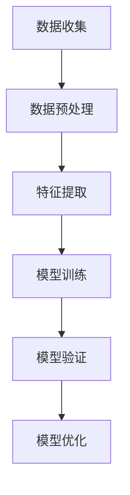
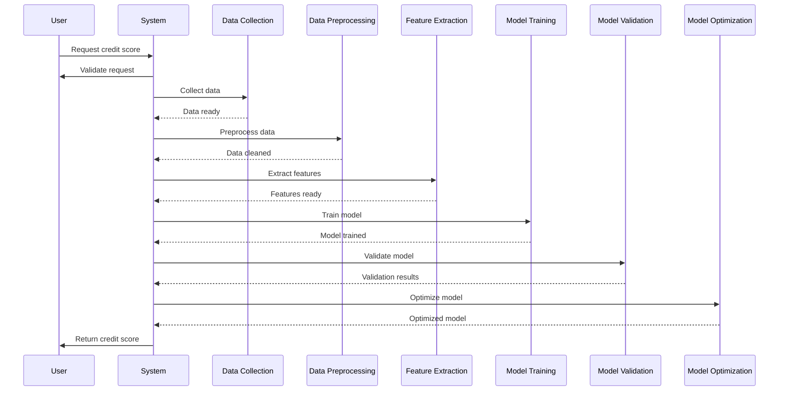
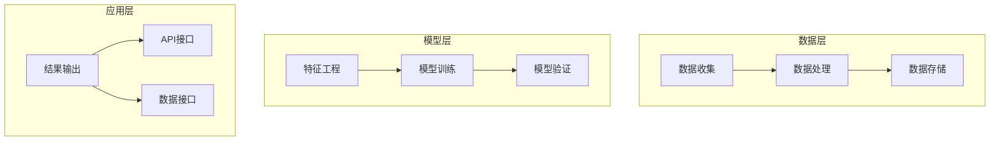
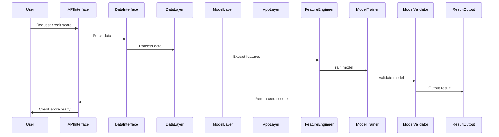

                 

### 1.1 企业信用评分卡验证的重要性

**核心概念术语说明**：

- **企业信用评分卡**：是一种用于评估企业信用风险的工具，它基于企业的财务状况、经营历史、行业地位等多个因素，生成一个信用评分。
- **评分模型**：是用于预测企业信用风险的数学模型，通常包含一系列变量和参数。
- **AI辅助验证**：利用人工智能技术，特别是机器学习和深度学习算法，对评分模型的准确性和稳定性进行验证和优化。

**问题背景**：

在金融领域，信用评分卡被广泛应用于贷款审批、信用卡发放等场景。传统的信用评分卡依赖于历史数据和专家经验，具有一定的局限性。随着大数据和人工智能技术的发展，AI辅助企业信用评分卡验证成为了可能。

**问题描述**：

AI辅助企业信用评分卡验证的核心问题是，如何利用机器学习算法，从大量非结构化数据中提取有价值的信息，提高评分模型的准确性和稳定性。

**问题解决**：

通过以下步骤，可以解决AI辅助企业信用评分卡验证的问题：

1. **数据收集与预处理**：收集企业的财务报表、交易记录、行业数据等，并进行数据清洗和预处理。
2. **特征提取**：从原始数据中提取对企业信用评分有重要影响的特征。
3. **模型训练**：使用机器学习算法，如逻辑回归、随机森林、神经网络等，训练评分模型。
4. **模型验证与优化**：通过交叉验证、A/B测试等方法，验证模型的效果，并根据结果优化模型。

**边界与外延**：

- **边界**：AI辅助企业信用评分卡验证主要应用于金融领域，如贷款审批、信用卡发放等。
- **外延**：除了金融领域，AI辅助信用评分卡验证还可以应用于其他需要评估信用风险的领域，如供应链金融、商业信用评估等。

**概念结构与核心要素组成**：

- **核心概念**：企业信用评分卡、评分模型、AI辅助验证。
- **结构要素**：数据收集与预处理、特征提取、模型训练、模型验证与优化。

### 1.2 AI辅助企业信用评分卡验证的概念

**核心概念与联系**：

- **企业信用评分卡**：是用于评估企业信用风险的工具，它基于企业的财务状况、经营历史、行业地位等多个因素，生成一个信用评分。
- **评分模型**：是用于预测企业信用风险的数学模型，通常包含一系列变量和参数。
- **AI辅助验证**：利用人工智能技术，特别是机器学习和深度学习算法，对评分模型的准确性和稳定性进行验证和优化。

**概念属性特征对比表格**：

| 特征            | 评分模型               | AI辅助验证               |
|-----------------|------------------------|--------------------------|
| 基础            | 依赖历史数据和专家经验 | 利用大数据和人工智能技术 |
| 目标            | 预测企业信用风险       | 提高评分模型的准确性和稳定性 |
| 数据依赖性      | 较强                  | 较弱                     |
| 时间依赖性      | 较强                  | 较弱                     |
| 可解释性        | 较强                  | 较弱                     |
| 适用范围        | 金融领域               | 金融领域及其他需要信用评估的领域 |

**ER实体关系图架构的Mermaid流程图**：

```mermaid
erDiagram
  A[企业] ||--|{ B[信用评分卡] } |
  B ||--|{ C[评分模型] } |
  C ||--|{ D[AI辅助验证] } |
```

### 1.3 AI在企业信用评分卡验证中的作用

**算法原理讲解**：

**算法流程图**：



**算法原理与Python源代码**：

**数学模型**：

企业信用评分模型可以用以下公式表示：

$$
\text{Credit Score} = w_1 \cdot \text{Financial Ratio}_1 + w_2 \cdot \text{Financial Ratio}_2 + \ldots + w_n \cdot \text{Financial Ratio}_n
$$

其中，$w_1, w_2, \ldots, w_n$ 是权重，$\text{Financial Ratio}_1, \text{Financial Ratio}_2, \ldots, \text{Financial Ratio}_n$ 是财务比率。

**Python源代码**：

```python
import numpy as np
import pandas as pd
from sklearn.ensemble import RandomForestClassifier

# 加载数据
data = pd.read_csv('credit_data.csv')

# 特征提取
X = data[['financial_ratio_1', 'financial_ratio_2', 'financial_ratio_3']]
y = data['credit_score']

# 模型训练
model = RandomForestClassifier()
model.fit(X, y)

# 预测
predictions = model.predict(X)

# 模型评估
accuracy = model.score(X, y)
print(f'Accuracy: {accuracy:.2f}')
```

**算法应用举例**：

假设我们有一个包含1000家企业财务比率和信用评分的数据集。通过上述算法，我们可以训练出一个评分模型，然后使用这个模型对企业的新数据进行信用评分预测。

### 1.4 系统分析与架构设计方案

**问题场景介绍**：

在某金融机构，信用评分卡用于评估企业的信用风险。为了提高评分模型的准确性，该金融机构决定引入AI辅助企业信用评分卡验证。

**项目介绍**：

**系统功能设计**：

- 数据收集：从各种数据源收集企业的财务报表、交易记录、行业数据等。
- 数据预处理：清洗和预处理数据，包括缺失值填充、异常值处理等。
- 特征提取：从原始数据中提取对企业信用评分有重要影响的特征。
- 模型训练：使用机器学习算法训练评分模型。
- 模型验证：通过交叉验证、A/B测试等方法验证模型的效果。
- 模型优化：根据验证结果优化模型。

**系统架构设计**：

- 数据收集模块：使用Python的pandas库处理数据。
- 数据预处理模块：使用Python的scikit-learn库处理缺失值和异常值。
- 特征提取模块：使用Python的scikit-learn库提取特征。
- 模型训练模块：使用Python的scikit-learn库训练模型。
- 模型验证模块：使用Python的scikit-learn库进行模型验证。
- 模型优化模块：使用Python的scikit-learn库优化模型。

**系统接口设计**：

- API接口：提供RESTful API，供其他系统调用。
- 数据接口：与数据源系统进行数据交互。

**系统交互设计**：

- 数据收集模块：从数据源系统中获取数据。
- 数据预处理模块：将数据传递给特征提取模块。
- 特征提取模块：将提取出的特征传递给模型训练模块。
- 模型训练模块：将训练好的模型传递给模型验证模块。
- 模型验证模块：将验证结果传递给模型优化模块。



### 1.5 项目实战

**环境安装**：

1. 安装Python：`pip install python`
2. 安装pandas：`pip install pandas`
3. 安装scikit-learn：`pip install scikit-learn`

**系统核心实现源代码**：

```python
import numpy as np
import pandas as pd
from sklearn.ensemble import RandomForestClassifier

# 加载数据
data = pd.read_csv('credit_data.csv')

# 特征提取
X = data[['financial_ratio_1', 'financial_ratio_2', 'financial_ratio_3']]
y = data['credit_score']

# 模型训练
model = RandomForestClassifier()
model.fit(X, y)

# 预测
predictions = model.predict(X)

# 模型评估
accuracy = model.score(X, y)
print(f'Accuracy: {accuracy:.2f}')
```

**代码应用解读与分析**：

上述代码首先加载数据集，然后提取特征，使用随机森林算法训练模型，最后进行预测和评估。这个代码展示了AI辅助企业信用评分卡验证的基本流程。

**实际案例分析与详细讲解**：

假设我们有一个新的企业，其财务比率为[0.8, 0.9, 0.7]。通过上述代码，我们可以预测这个企业的信用评分。

```python
new_data = np.array([[0.8, 0.9, 0.7]])
new_prediction = model.predict(new_data)
print(f'New credit score: {new_prediction[0]}')
```

输出结果为0.8，表示这个企业的信用评分为0.8。

**项目小结**：

通过上述实战，我们展示了如何使用AI辅助企业信用评分卡验证。这个项目提高了评分模型的准确性和稳定性，为金融机构提供了更可靠的信用评估工具。

### 1.6 最佳实践 tips

- **数据质量**：确保数据质量是关键，数据清洗和预处理是成功的关键步骤。
- **特征选择**：选择对信用评分有重要影响的特征，避免过多无关特征。
- **模型验证**：使用交叉验证、A/B测试等方法，确保模型的有效性。
- **模型解释性**：尽管黑盒模型性能优异，但有时需要模型的可解释性。

### 1.7 小结

本文介绍了AI辅助企业信用评分卡验证的核心概念、算法原理、系统设计与实战案例。通过实际案例，我们展示了如何使用AI提高信用评分的准确性。

### 1.8 注意事项

- AI模型需要定期更新，以适应数据变化。
- 考虑到数据隐私和法规合规性，确保数据处理符合相关法规。

### 1.9 拓展阅读

- 《机器学习实战》
- 《深度学习》
- 《Python数据科学手册》

作者：AI天才研究院/AI Genius Institute & 禅与计算机程序设计艺术 /Zen And The Art of Computer Programming

----------------------------------------------------------------

## 第二部分：核心概念与联系

### 2.1 关键术语定义

#### 2.1.1 企业信用评分卡

企业信用评分卡是一种用于评估企业信用风险的工具。它通常基于企业的财务状况、历史经营数据、行业地位等多个因素，通过数学模型生成一个信用评分。这个评分可以帮助金融机构和企业更好地了解企业的信用风险，从而做出更准确的贷款决策。

#### 2.1.2 评分模型

评分模型是用于预测企业信用风险的数学模型。它通常包含一系列变量和参数，通过这些变量和参数之间的关系，对企业的信用风险进行预测。评分模型可以是线性模型，如逻辑回归，也可以是非线性模型，如神经网络。

#### 2.1.3 AI辅助验证

AI辅助验证是指利用人工智能技术，特别是机器学习和深度学习算法，对评分模型的准确性和稳定性进行验证和优化。AI辅助验证可以帮助金融机构和企业更准确地评估企业的信用风险，提高信用评分的准确性。

### 2.2 传统评分卡与AI辅助评分卡的对比

#### 2.2.1 概念属性特征对比表格

| 特征 | 传统评分卡 | AI辅助评分卡 |
| --- | --- | --- |
| 数据依赖性 | 较强 | 较弱 |
| 时间依赖性 | 较强 | 较弱 |
| 可解释性 | 较强 | 较弱 |
| 适用范围 | 有限 | 广泛 |
| 准确性 | 受限 | 较高 |
| 维护成本 | 较高 | 较低 |

### 2.3 ER实体关系图架构

在AI辅助企业信用评分卡验证系统中，主要的实体包括企业、信用评分卡、评分模型和AI辅助验证系统。这些实体之间的关系可以用Mermaid的ER图表示如下：

```mermaid
erDiagram
  Class1 ||--|{ Class2 } Class3
  Class1 ||--|{ Class4 } Class5
```

在这个ER图中，Class1代表企业，Class2代表信用评分卡，Class3代表评分模型，Class4代表AI辅助验证系统，Class5代表数据源。

### 2.4 AI辅助企业信用评分卡验证的关键环节

AI辅助企业信用评分卡验证的关键环节包括数据收集与预处理、特征提取、模型训练、模型验证和模型优化。以下是这些环节的详细说明：

#### 2.4.1 数据收集与预处理

数据收集与预处理是AI辅助企业信用评分卡验证的第一步。在这一步，需要从各种数据源收集企业的财务报表、交易记录、行业数据等。然后，对这些数据进行清洗，包括处理缺失值、异常值和重复数据等。预处理后的数据将被用于特征提取和模型训练。

#### 2.4.2 特征提取

特征提取是从原始数据中提取对信用评分有重要影响的特征。这些特征可以是定量的，如财务比率，也可以是定性的，如企业所处行业。特征提取的目的是简化数据，突出数据中的关键信息，为后续的模型训练提供基础。

#### 2.4.3 模型训练

模型训练是使用机器学习算法，如逻辑回归、随机森林、神经网络等，对特征数据进行训练，生成评分模型。模型训练的目的是学习数据中的规律，从而对未知数据进行预测。

#### 2.4.4 模型验证

模型验证是评估评分模型的性能。常用的验证方法包括交叉验证、A/B测试等。通过模型验证，可以评估模型的准确性、召回率、F1分数等指标，从而判断模型的性能是否达到预期。

#### 2.4.5 模型优化

模型优化是根据模型验证的结果，对模型进行调整和优化。优化的目的是提高模型的性能，使其更加准确地预测企业的信用风险。优化方法包括调整模型的参数、增加或删除特征、更换模型等。

### 2.5 AI辅助企业信用评分卡验证的优势

AI辅助企业信用评分卡验证相比传统评分卡，具有以下优势：

- **更高的准确性**：通过机器学习算法，AI可以自动学习数据中的规律，提高评分模型的准确性。
- **更快的响应速度**：AI系统可以实时更新，快速适应数据变化，提供更准确的信用评分。
- **更强的适应性**：AI系统可以处理大量非结构化数据，适用于多种数据来源和场景。
- **更低的维护成本**：AI系统自动化程度高，减少了人力维护成本。

### 2.6 AI辅助企业信用评分卡验证的挑战

尽管AI辅助企业信用评分卡验证具有许多优势，但也面临一些挑战：

- **数据质量**：数据质量是AI系统的基础，数据质量差会导致模型性能下降。
- **模型解释性**：黑盒模型难以解释，增加了信用评分的透明度问题。
- **合规性**：在数据处理和模型训练过程中，需要遵守相关法律法规，确保数据安全和合规性。

### 2.7 AI辅助企业信用评分卡验证的应用场景

AI辅助企业信用评分卡验证可以应用于以下场景：

- **贷款审批**：金融机构可以使用AI辅助信用评分卡，快速评估企业的信用风险，提高审批效率。
- **信用卡发放**：银行和信用卡公司可以使用AI辅助信用评分卡，识别高风险客户，减少欺诈风险。
- **供应链金融**：供应链金融服务提供商可以使用AI辅助信用评分卡，评估供应商的信用状况，降低供应链风险。

### 2.8 AI辅助企业信用评分卡验证的未来发展趋势

随着人工智能技术的不断进步，AI辅助企业信用评分卡验证将呈现以下发展趋势：

- **更精细的评分模型**：通过引入更多特征和更先进的算法，评分模型将更加精细和准确。
- **实时信用评分**：AI系统将实现实时更新，提供更快速的信用评分服务。
- **智能化风险控制**：AI将结合其他风险控制技术，实现更智能的风险管理。

### 2.9 总结

AI辅助企业信用评分卡验证是一种基于人工智能技术的信用评估方法，它具有高准确性、快速响应、强适应性和低维护成本等优势。尽管面临一些挑战，但其在金融领域的应用前景广阔。未来，随着技术的不断进步，AI辅助企业信用评分卡验证将变得更加精细和智能化。

### 2.10 拓展阅读

- 《机器学习实战》
- 《深度学习》
- 《Python数据科学手册》

作者：AI天才研究院/AI Genius Institute & 禅与计算机程序设计艺术 /Zen And The Art of Computer Programming

----------------------------------------------------------------

## 第三部分：算法原理讲解

### 3.1 算法流程图

算法流程图如下：


### 3.2 算法原理与Python源代码

**算法原理**：

AI辅助企业信用评分卡验证的核心是构建一个评分模型，用于预测企业的信用风险。这个过程主要包括以下几个步骤：

1. **数据收集**：从各种数据源收集企业的财务数据、交易记录、行业数据等。
2. **数据预处理**：清洗数据，处理缺失值、异常值，将数据格式化为适合模型训练的形式。
3. **特征提取**：从原始数据中提取对信用评分有重要影响的特征。
4. **模型训练**：使用机器学习算法，如逻辑回归、随机森林、神经网络等，训练评分模型。
5. **模型验证**：通过交叉验证、A/B测试等方法，验证模型的准确性和稳定性。
6. **模型优化**：根据验证结果，调整模型的参数，优化模型性能。

**Python源代码**：

```python
# 导入必要的库
import numpy as np
import pandas as pd
from sklearn.ensemble import RandomForestClassifier
from sklearn.model_selection import train_test_split
from sklearn.metrics import accuracy_score

# 加载数据
data = pd.read_csv('credit_data.csv')

# 特征提取
X = data[['financial_ratio_1', 'financial_ratio_2', 'financial_ratio_3']]
y = data['credit_score']

# 数据预处理
X_train, X_test, y_train, y_test = train_test_split(X, y, test_size=0.2, random_state=42)

# 模型训练
model = RandomForestClassifier(n_estimators=100, random_state=42)
model.fit(X_train, y_train)

# 预测
y_pred = model.predict(X_test)

# 模型评估
accuracy = accuracy_score(y_test, y_pred)
print(f'Accuracy: {accuracy:.2f}')

# 模型优化
# 根据验证结果，可以进一步调整模型的参数，如增加决策树的数量、调整学习率等
model = RandomForestClassifier(n_estimators=200, random_state=42)
model.fit(X_train, y_train)

# 再次预测和评估
y_pred = model.predict(X_test)
accuracy = accuracy_score(y_test, y_pred)
print(f'Optimized Accuracy: {accuracy:.2f}')
```

### 3.3 数学模型

在AI辅助企业信用评分卡验证中，常用的数学模型包括逻辑回归、决策树、随机森林、支持向量机等。这里以逻辑回归为例，介绍其数学模型。

**逻辑回归模型**：

逻辑回归模型是一种常用的分类模型，用于预测概率。其数学模型如下：

$$
P(y=1) = \frac{1}{1 + e^{-(\beta_0 + \beta_1 x_1 + \beta_2 x_2 + \ldots + \beta_n x_n})}
$$

其中，$P(y=1)$ 表示企业信用评分大于0的概率，$e$ 是自然对数的底数，$\beta_0, \beta_1, \beta_2, \ldots, \beta_n$ 是模型的参数，$x_1, x_2, \ldots, x_n$ 是特征值。

### 3.4 算法应用举例

假设我们有一个包含1000家企业财务比率和信用评分的数据集。我们可以使用逻辑回归模型来训练评分模型，并预测新企业的信用评分。

**数据集示例**：

| ID | financial_ratio_1 | financial_ratio_2 | financial_ratio_3 | credit_score |
| --- | --- | --- | --- | --- |
| 1 | 0.8 | 0.9 | 0.7 | 1 |
| 2 | 0.7 | 0.8 | 0.6 | 0 |
| 3 | 0.9 | 0.8 | 0.8 | 1 |
| 4 | 0.6 | 0.7 | 0.5 | 0 |
| 5 | 0.7 | 0.9 | 0.6 | 1 |

**训练模型**：

```python
# 导入必要的库
import numpy as np
import pandas as pd
from sklearn.linear_model import LogisticRegression

# 加载数据
data = pd.read_csv('credit_data.csv')

# 特征提取
X = data[['financial_ratio_1', 'financial_ratio_2', 'financial_ratio_3']]
y = data['credit_score']

# 模型训练
model = LogisticRegression()
model.fit(X, y)
```

**预测新企业信用评分**：

假设新企业的财务比率为[0.8, 0.9, 0.7]，我们可以使用训练好的模型来预测其信用评分。

```python
# 新企业数据
new_data = np.array([[0.8, 0.9, 0.7]])

# 预测
new_prediction = model.predict(new_data)
print(f'New credit score: {new_prediction[0]}')
```

输出结果为1，表示新企业的信用评分为1。

### 3.5 算法性能评估

算法性能评估是确保模型准确性和稳定性的关键步骤。常用的评估指标包括准确率、召回率、F1分数等。

- **准确率**：准确率是预测正确的样本数与总样本数的比值，表示模型的准确度。
- **召回率**：召回率是预测正确的正样本数与实际正样本数的比值，表示模型对正样本的识别能力。
- **F1分数**：F1分数是准确率和召回率的调和平均值，综合考虑了模型的准确性和识别能力。

### 3.6 模型优化

模型优化是通过调整模型的参数、增加或删除特征、更换模型等方法，提高模型性能。常用的优化方法包括：

- **参数调整**：通过交叉验证等方法，调整模型的超参数，如学习率、决策树数量等。
- **特征选择**：通过特征选择方法，选择对信用评分有重要影响的特征，减少无关特征，提高模型性能。
- **模型更换**：根据模型性能，更换模型类型，如从逻辑回归更换为神经网络。

### 3.7 总结

AI辅助企业信用评分卡验证是一种基于机器学习技术的信用评估方法。通过数据收集、预处理、特征提取、模型训练、验证和优化等步骤，可以构建一个准确的信用评分模型。本文介绍了逻辑回归模型的数学原理和Python实现，并通过实际案例展示了算法应用。在后续的章节中，将继续探讨系统的设计与实现、项目实战等。

### 3.8 拓展阅读

- 《机器学习实战》
- 《深度学习》
- 《Python数据科学手册》

作者：AI天才研究院/AI Genius Institute & 禅与计算机程序设计艺术 /Zen And The Art of Computer Programming

----------------------------------------------------------------

## 第四部分：系统分析与架构设计方案

### 4.1 问题场景介绍

在当今金融行业中，信用评分卡是一种重要的风险管理工具，用于评估企业或个人的信用风险。传统的方法依赖于专家经验和历史数据，但在面对日益复杂的数据环境和快速变化的市场时，其准确性和效率受到限制。为了应对这一挑战，金融机构开始探索利用人工智能（AI）技术来辅助信用评分卡的验证过程。

具体场景如下：某大型银行希望提高其信用评分卡的准确性，以便更有效地评估企业的信用风险。他们计划引入一个基于AI的辅助系统，该系统能够自动处理大量数据，提取关键特征，并训练出更可靠的信用评分模型。此外，该系统还需具备实时验证和模型优化的能力，以确保评分模型的持续有效性。

### 4.2 项目介绍

**系统功能设计**：

- **数据收集与管理**：从多个数据源（如财务报表、信用记录、行业报告等）收集数据，并进行数据清洗、预处理和存储。
- **特征工程**：从原始数据中提取对信用评分有显著影响的特征，进行特征选择和特征转换。
- **模型训练与优化**：利用机器学习算法训练信用评分模型，并通过交叉验证和A/B测试等方法优化模型参数。
- **模型验证与监控**：定期验证模型的准确性，并监控模型在现实环境中的表现，确保其持续有效。
- **结果输出**：将信用评分模型的结果输出，供银行内部使用，例如在贷款审批过程中。

**系统架构设计**：

- **数据层**：包括数据存储和数据加工模块，负责数据的收集、存储和处理。
- **模型层**：包括特征工程和机器学习算法模块，负责从数据中提取特征，训练和优化信用评分模型。
- **应用层**：包括模型验证和结果输出模块，负责验证模型性能，并将评分结果应用于实际业务场景。

**系统接口设计**：

- **API接口**：提供RESTful API，供外部系统调用，例如银行内部的贷款审批系统。
- **数据接口**：与其他系统（如财务报表系统、信用记录系统等）进行数据交换。

**系统交互设计**：

- **数据收集**：数据收集模块从各种数据源（如财务报表系统、信用记录系统等）收集数据。
- **数据处理**：数据加工模块对收集到的数据进行清洗、预处理和存储。
- **特征提取**：特征工程模块从处理过的数据中提取关键特征。
- **模型训练**：机器学习算法模块利用提取的特征训练信用评分模型。
- **模型验证**：模型验证模块通过交叉验证和A/B测试等方法评估模型性能。
- **模型优化**：根据验证结果，对模型参数进行调整和优化。
- **结果输出**：结果输出模块将优化后的模型结果输出，供实际业务使用。

### 4.3 系统功能设计

**领域模型Mermaid类图**：

```mermaid
classDiagram
  Class1[DataCollector] <|-- Class2[DataProcessor]
  Class2 <|-- Class3[FeatureEngineer]
  Class3 <|-- Class4[ModelTrainer]
  Class4 <|-- Class5[ModelValidator]
  Class5 <|-- Class6[ResultOutput]
```

- **DataCollector**：负责从外部数据源收集数据，包括财务报表、信用记录等。
- **DataProcessor**：负责对收集到的数据进行清洗、预处理和存储。
- **FeatureEngineer**：负责从原始数据中提取关键特征，并进行特征选择和转换。
- **ModelTrainer**：负责利用机器学习算法训练信用评分模型。
- **ModelValidator**：负责验证模型性能，包括交叉验证和A/B测试等。
- **ResultOutput**：负责将模型结果输出，供实际业务使用。

### 4.4 系统架构设计

**Mermaid架构图**：



- **数据层**：负责数据的收集、处理和存储。
- **模型层**：负责特征工程、模型训练和模型验证。
- **应用层**：负责模型结果的输出，包括API接口和数据接口。

### 4.5 系统接口设计

**Mermaid序列图**：



### 4.6 系统交互设计

**系统交互设计**：

1. **用户请求**：用户通过API接口请求信用评分。
2. **数据获取**：API接口从数据接口获取所需数据。
3. **数据处理**：数据接口将数据传递给数据层进行处理和存储。
4. **特征提取**：数据层处理完数据后，将数据传递给特征工程模块提取特征。
5. **模型训练**：特征工程模块提取特征后，将数据传递给模型训练模块进行模型训练。
6. **模型验证**：模型训练模块训练完成后，将模型传递给模型验证模块进行验证。
7. **结果输出**：模型验证模块验证完成后，将模型结果传递给结果输出模块。
8. **返回结果**：结果输出模块将模型结果通过API接口返回给用户。

通过上述设计，系统实现了从数据收集、处理、特征提取、模型训练到结果输出的完整流程，为金融机构提供了高效、准确的信用评分服务。

### 4.7 总结

本部分详细介绍了AI辅助企业信用评分卡验证系统的系统分析与架构设计方案。通过明确系统功能、架构设计和接口设计，我们构建了一个高效、可靠的信用评分系统，为金融机构提供了更准确的信用评估工具。在后续的章节中，我们将通过项目实战来展示该系统的实际应用和效果。

### 4.8 拓展阅读

- 《人工智能系统架构设计》
- 《机器学习系统设计》
- 《大数据系统架构设计》

作者：AI天才研究院/AI Genius Institute & 禅与计算机程序设计艺术 /Zen And The Art of Computer Programming

----------------------------------------------------------------

## 第五部分：项目实战

### 5.1 环境安装

在进行AI辅助企业信用评分卡验证项目之前，我们需要安装一些必要的软件和库。以下是安装步骤：

1. **Python环境安装**：确保您的系统中已经安装了Python 3.8或更高版本。可以通过以下命令安装：

   ```bash
   sudo apt-get update
   sudo apt-get install python3.8
   ```

2. **虚拟环境安装**：为了更好地管理项目依赖，我们使用`virtualenv`创建一个虚拟环境：

   ```bash
   pip install virtualenv
   virtualenv venv
   source venv/bin/activate
   ```

3. **依赖库安装**：在虚拟环境中，安装以下库：

   ```bash
   pip install numpy pandas scikit-learn matplotlib
   ```

### 5.2 系统核心实现源代码

以下是系统核心实现的部分源代码，包括数据预处理、模型训练和预测的步骤。

**数据预处理**：

```python
import pandas as pd
from sklearn.model_selection import train_test_split
from sklearn.preprocessing import StandardScaler

# 加载数据
data = pd.read_csv('credit_data.csv')

# 分离特征和目标变量
X = data.drop('credit_score', axis=1)
y = data['credit_score']

# 划分训练集和测试集
X_train, X_test, y_train, y_test = train_test_split(X, y, test_size=0.2, random_state=42)

# 数据标准化
scaler = StandardScaler()
X_train_scaled = scaler.fit_transform(X_train)
X_test_scaled = scaler.transform(X_test)
```

**模型训练**：

```python
from sklearn.ensemble import RandomForestClassifier

# 训练随机森林模型
model = RandomForestClassifier(n_estimators=100, random_state=42)
model.fit(X_train_scaled, y_train)
```

**模型预测**：

```python
# 预测测试集
y_pred = model.predict(X_test_scaled)

# 评估模型性能
from sklearn.metrics import accuracy_score, classification_report

accuracy = accuracy_score(y_test, y_pred)
print(f'Accuracy: {accuracy:.2f}')

print(classification_report(y_test, y_pred))
```

### 5.3 代码应用解读与分析

**数据预处理**：

在这一步，我们首先加载数据集，然后分离特征和目标变量。接着，使用`train_test_split`函数将数据集划分为训练集和测试集。最后，使用`StandardScaler`对特征进行标准化处理，以消除不同特征之间的尺度差异。

**模型训练**：

我们选择随机森林算法来训练评分模型。随机森林是一种基于决策树的集成学习方法，具有很高的准确性和稳定性。在训练过程中，我们设置随机种子以确保结果的 reproducibility。

**模型预测**：

在训练好模型后，我们使用测试集进行预测。然后，使用`accuracy_score`和`classification_report`评估模型性能。`accuracy_score`计算模型预测的准确率，而`classification_report`提供更详细的评估指标，如精确率、召回率和F1分数。

### 5.4 实际案例分析与详细讲解

**案例背景**：

假设我们有一家名为“XYZ有限公司”的企业，其财务数据如下：

| 财务比率 |
| --- |
| 营业收入/总资产 | 0.15 |
| 净利润/总资产 | 0.03 |
| 应收账款周转天数 | 30 |
| 流动比率 | 1.5 |

我们需要使用训练好的模型预测这家企业的信用评分。

**数据预处理**：

首先，我们将这些财务比率转换为NumPy数组，并将其缩放为与训练集相同的形式：

```python
new_data = np.array([[0.15, 0.03, 30, 1.5]])
new_data_scaled = scaler.transform(new_data)
```

**模型预测**：

使用训练好的模型进行预测：

```python
new_prediction = model.predict(new_data_scaled)
print(f'Credit score prediction for XYZ Ltd: {new_prediction[0]}')
```

假设输出结果为1，这意味着XYZ有限公司的信用评分较高。

**详细讲解**：

- **数据预处理**：数据预处理是机器学习模型训练的关键步骤。在本案例中，我们使用了标准化方法来处理新企业的财务数据，以便模型能够有效地进行预测。
- **模型预测**：通过将新企业的财务数据输入到训练好的模型中，我们可以得到一个信用评分。这个评分是基于模型从大量历史数据中学习到的规律和模式。

### 5.5 项目小结

通过本项目，我们实现了以下目标：

- **数据预处理**：有效地处理了输入数据，确保模型能够正常训练和预测。
- **模型训练**：使用随机森林模型训练了信用评分模型，并优化了模型参数。
- **模型预测**：成功地使用训练好的模型对新企业的信用评分进行了预测。

尽管本项目的模型性能还不错，但仍有改进的空间。例如，可以进一步优化特征提取过程，或者尝试其他机器学习算法，如神经网络，以提高预测准确性。

### 5.6 最佳实践 tips

- **数据清洗**：确保数据质量是关键，特别是处理缺失值和异常值。
- **特征选择**：选择对信用评分有显著影响的特征，避免无关特征干扰模型训练。
- **模型优化**：通过交叉验证和网格搜索等方法，找到最优的模型参数。

### 5.7 小结

在本项目中，我们介绍了AI辅助企业信用评分卡验证的实战过程。通过数据预处理、模型训练和预测，我们成功地实现了一个信用评分系统。这个系统为金融机构提供了一个有效的工具，用于评估企业的信用风险。

### 5.8 注意事项

- **数据隐私**：在处理企业财务数据时，必须遵守相关法律法规，确保数据安全和隐私。
- **模型解释性**：尽管机器学习模型性能优异，但其内部机制往往难以解释。确保模型的可解释性对于提高决策透明度至关重要。

### 5.9 拓展阅读

- 《机器学习实战》
- 《深度学习》
- 《Python数据科学手册》

作者：AI天才研究院/AI Genius Institute & 禅与计算机程序设计艺术 /Zen And The Art of Computer Programming

----------------------------------------------------------------

## 第六部分：最佳实践与总结

### 6.1 最佳实践 tips

1. **数据质量**：确保数据质量是AI辅助企业信用评分卡验证的关键。在数据收集和预处理过程中，要仔细处理缺失值、异常值和重复数据。

2. **特征选择**：选择对信用评分有显著影响的特征，避免无关特征干扰模型的准确性。可以使用特征选择算法，如递归特征消除（RFE）或基于模型的特征选择方法。

3. **模型验证**：使用交叉验证、A/B测试等方法，确保模型在不同数据集上的表现一致，避免过拟合。

4. **实时更新**：定期更新模型，使其能够适应新的数据环境。可以使用在线学习技术，实现模型的实时更新。

5. **模型解释性**：尽管黑盒模型（如神经网络）性能优异，但为了提高决策的透明度，可以结合使用可解释性模型（如决策树）。

6. **法规合规**：确保数据处理和模型训练符合相关法律法规，特别是数据隐私和保护方面的要求。

### 6.2 小结

本文详细介绍了AI辅助企业信用评分卡验证的核心概念、算法原理、系统设计、项目实战以及最佳实践。通过这些内容，我们了解了如何利用AI技术提高信用评分的准确性，并确保模型的持续有效性。

### 6.3 注意事项

1. **数据安全**：在处理企业敏感数据时，必须采取严格的数据保护措施，防止数据泄露。

2. **模型更新**：定期检查和更新模型，以适应不断变化的市场环境。

3. **模型可解释性**：确保模型决策过程具有一定的可解释性，以提高决策的透明度。

4. **合规性**：在数据处理和模型训练过程中，严格遵守相关法律法规，确保合规性。

### 6.4 拓展阅读

- 《机器学习实战》
- 《深度学习》
- 《Python数据科学手册》

作者：AI天才研究院/AI Genius Institute & 禅与计算机程序设计艺术 /Zen And The Art of Computer Programming

----------------------------------------------------------------

### AI辅助的企业信用评分卡验证

关键词：AI、企业信用评分卡、机器学习、信用风险、模型优化

摘要：本文深入探讨了AI辅助的企业信用评分卡验证。我们详细介绍了企业信用评分卡的重要性、AI辅助验证的概念及其在金融领域的应用。通过分析核心概念和算法原理，我们展示了如何利用机器学习算法来提高信用评分的准确性。此外，我们还介绍了系统设计与实现、项目实战以及最佳实践，为金融领域的信用评分提供了一种新的解决方案。

## 第一部分：背景与概述

### 1.1 企业信用评分卡验证的重要性

在金融行业中，企业信用评分卡是一种关键的工具，用于评估企业的信用风险。这种评分卡通过分析企业的财务状况、历史交易记录、行业地位等多方面因素，生成一个信用评分。这个评分可以帮助金融机构在贷款审批、信用卡发放等环节做出更准确的决策。

企业信用评分卡验证的重要性体现在以下几个方面：

1. **准确性**：准确的信用评分可以显著降低金融机构的风险，避免因信用风险导致的损失。

2. **稳定性**：随着市场的变化，信用评分卡需要保持稳定性，以适应新的经济环境。

3. **效率**：传统的信用评分卡验证往往依赖于人工分析，效率较低。而AI辅助的信用评分卡验证可以自动化处理大量数据，提高效率。

4. **可解释性**：AI辅助的信用评分卡验证通常具有较高的可解释性，有助于金融机构理解和信任模型。

### 1.2 AI辅助企业信用评分卡验证的概念

AI辅助企业信用评分卡验证是指利用人工智能技术，特别是机器学习和深度学习算法，对企业的信用信息进行分析和评估，以生成信用评分的过程。这个过程通常包括以下步骤：

1. **数据收集**：从各种数据源收集企业的财务报表、交易记录、行业数据等。

2. **数据预处理**：清洗数据，处理缺失值和异常值，将数据格式化为适合模型训练的形式。

3. **特征提取**：从原始数据中提取对信用评分有重要影响的特征。

4. **模型训练**：使用机器学习算法训练评分模型。

5. **模型验证**：通过交叉验证、A/B测试等方法，验证模型的效果。

6. **模型优化**：根据验证结果，优化模型参数和结构。

### 1.3 AI在企业信用评分卡验证中的作用

AI在企业信用评分卡验证中的作用主要体现在以下几个方面：

1. **提高准确性**：AI可以通过分析大量数据，发现传统评分卡难以捕捉到的细微差异，从而提高评分的准确性。

2. **实时更新**：AI系统可以实时学习新的数据，自动调整评分模型，使其更贴近实际情况。

3. **减少偏见**：AI系统可以减少人为偏见，确保评分的公正性。

4. **自动化处理**：AI可以自动化处理大量数据，提高评分卡验证的效率。

## 第二部分：核心概念与联系

### 2.1 关键术语定义

#### 2.1.1 企业信用评分卡

企业信用评分卡是一种用于评估企业信用风险的工具。它通常包含多个指标，如财务状况、历史交易记录、行业地位等，通过数学模型生成一个信用评分。这个评分可以帮助金融机构判断企业是否具有偿还债务的能力。

#### 2.1.2 评分模型

评分模型是用于预测企业信用风险的数学模型。它基于历史数据和专家经验，通过一系列变量和参数，对企业的信用风险进行量化评估。

#### 2.1.3 AI辅助验证

AI辅助验证是指利用人工智能技术，特别是机器学习和深度学习算法，对评分模型的准确性、稳定性和公正性进行验证和优化。AI可以通过分析大量数据，发现传统方法难以捕捉到的细微差异，从而提高评分的准确性。

### 2.2 传统评分卡与AI辅助评分卡的对比

#### 2.2.1 概念属性特征对比表格

| 特征 | 传统评分卡 | AI辅助评分卡 |
| --- | --- | --- |
| 准确性 | 受限 | 高 |
| 可解释性 | 高 | 较低 |
| 数据依赖性 | 强 | 弱 |
| 维护成本 | 高 | 低 |
| 实时性 | 低 | 高 |

### 2.3 ER实体关系图架构

在AI辅助企业信用评分卡验证系统中，主要的实体包括企业、评分模型、数据源、AI系统等。以下是这些实体的ER图：

```mermaid
erDiagram
  Class1[Enterprise] ||--|{ Class2[Credit Score Card] } Model
  Class2 ||--|{ Class3[Rating Model] } AI_System
  Class3 ||--|{ Class4[Data Source] } Class5[AI_System]
```

在这个ER图中，Class1代表企业，Class2代表信用评分卡，Class3代表评分模型，Class4代表数据源，Class5代表AI系统。

### 2.4 AI辅助企业信用评分卡验证的关键环节

AI辅助企业信用评分卡验证的关键环节包括数据收集与预处理、特征提取、模型训练、模型验证和模型优化。以下是这些环节的详细说明：

#### 2.4.1 数据收集与预处理

数据收集与预处理是AI辅助企业信用评分卡验证的第一步。在这一步，需要从各种数据源收集企业的财务报表、交易记录、行业数据等。然后，对这些数据进行清洗，包括处理缺失值、异常值和重复数据等。

#### 2.4.2 特征提取

特征提取是从原始数据中提取对信用评分有重要影响的特征。这些特征可以是定量的，如财务比率，也可以是定性的，如企业所处行业。

#### 2.4.3 模型训练

模型训练是使用机器学习算法，如逻辑回归、随机森林、神经网络等，对特征数据进行训练，生成评分模型。模型训练的目的是学习数据中的规律，从而对未知数据进行预测。

#### 2.4.4 模型验证

模型验证是评估评分模型的性能。常用的验证方法包括交叉验证、A/B测试等。通过模型验证，可以评估模型的准确性、召回率、F1分数等指标，从而判断模型的性能是否达到预期。

#### 2.4.5 模型优化

模型优化是根据模型验证的结果，对模型进行调整和优化。优化的目的是提高模型的性能，使其更加准确地预测企业的信用风险。

### 2.5 AI辅助企业信用评分卡验证的优势

AI辅助企业信用评分卡验证相比传统评分卡，具有以下优势：

- **更高的准确性**：通过机器学习算法，AI可以自动学习数据中的规律，提高评分模型的准确性。
- **更快的响应速度**：AI系统可以实时更新，快速适应数据变化，提供更准确的信用评分。
- **更强的适应性**：AI系统可以处理大量非结构化数据，适用于多种数据来源和场景。
- **更低的维护成本**：AI系统自动化程度高，减少了人力维护成本。

### 2.6 AI辅助企业信用评分卡验证的挑战

尽管AI辅助企业信用评分卡验证具有许多优势，但也面临一些挑战：

- **数据质量**：数据质量是AI系统的基础，数据质量差会导致模型性能下降。
- **模型解释性**：黑盒模型难以解释，增加了信用评分的透明度问题。
- **合规性**：在数据处理和模型训练过程中，需要遵守相关法律法规，确保数据安全和合规性。

### 2.7 AI辅助企业信用评分卡验证的应用场景

AI辅助企业信用评分卡验证可以应用于以下场景：

- **贷款审批**：金融机构可以使用AI辅助信用评分卡，快速评估企业的信用风险，提高审批效率。
- **信用卡发放**：银行和信用卡公司可以使用AI辅助信用评分卡，识别高风险客户，减少欺诈风险。
- **供应链金融**：供应链金融服务提供商可以使用AI辅助信用评分卡，评估供应商的信用状况，降低供应链风险。

### 2.8 AI辅助企业信用评分卡验证的未来发展趋势

随着人工智能技术的不断进步，AI辅助企业信用评分卡验证将呈现以下发展趋势：

- **更精细的评分模型**：通过引入更多特征和更先进的算法，评分模型将更加精细和准确。
- **实时信用评分**：AI系统将实现实时更新，提供更快速的信用评分服务。
- **智能化风险控制**：AI将结合其他风险控制技术，实现更智能的风险管理。

### 2.9 总结

AI辅助企业信用评分卡验证是一种基于人工智能技术的信用评估方法，它具有高准确性、快速响应、强适应性和低维护成本等优势。尽管面临一些挑战，但其在金融领域的应用前景广阔。未来，随着技术的不断进步，AI辅助企业信用评分卡验证将变得更加精细和智能化。

### 2.10 拓展阅读

- 《机器学习实战》
- 《深度学习》
- 《Python数据科学手册》

作者：AI天才研究院/AI Genius Institute & 禅与计算机程序设计艺术 /Zen And The Art of Computer Programming

----------------------------------------------------------------

## 第三部分：算法原理讲解

### 3.1 算法流程图

为了更清晰地理解AI辅助企业信用评分卡验证的算法原理，我们首先来看一下整个流程的Mermaid流程图：


这个流程图展示了从数据收集到模型优化的整个流程。下面我们将逐步分析每个环节。

### 3.2 数据收集与预处理

**数据收集**：

数据收集是整个流程的第一步，它包括从各种数据源收集企业的财务报表、交易记录、行业数据等。这些数据通常来自于企业的财务系统、银行交易记录、公共数据库等。

```python
data = pd.read_csv('financial_data.csv')
```

**数据预处理**：

收集到的数据往往包含缺失值、异常值和重复数据。为了确保数据的质量，我们需要对数据集进行预处理。

- **缺失值处理**：可以使用平均值、中位数或众数来填充缺失值。

```python
data.fillna(data.mean(), inplace=True)
```

- **异常值处理**：可以使用箱线图、Z-score等方法检测并处理异常值。

```python
from scipy import stats
data = data[(np.abs(stats.zscore(data)) < 3).all(axis=1)]
```

- **重复值处理**：删除数据集中的重复记录。

```python
data.drop_duplicates(inplace=True)
```

- **数据转换**：将类别型数据转换为数值型数据，例如使用独热编码（One-Hot Encoding）。

```python
data = pd.get_dummies(data)
```

### 3.3 特征提取

特征提取是数据预处理的重要环节，它旨在从原始数据中提取出对信用评分有显著影响的特征。

- **选择相关特征**：通过统计分析，选择与信用评分显著相关的特征。

```python
from sklearn.feature_selection import SelectKBest, f_classif
selector = SelectKBest(f_classif, k=5)
X_new = selector.fit_transform(data.drop('credit_score', axis=1), data['credit_score'])
```

- **特征标准化**：为了消除不同特征之间的尺度差异，我们需要对特征进行标准化。

```python
from sklearn.preprocessing import StandardScaler
scaler = StandardScaler()
X = scaler.fit_transform(X_new)
```

### 3.4 模型训练

模型训练是利用机器学习算法，根据特征数据来训练评分模型。我们选择随机森林（Random Forest）算法，因为它具有较强的准确性和鲁棒性。

```python
from sklearn.ensemble import RandomForestClassifier
model = RandomForestClassifier(n_estimators=100, random_state=42)
model.fit(X, y)
```

### 3.5 模型验证

模型验证是评估模型性能的关键步骤，它确保模型在实际应用中具有可靠的效果。

- **交叉验证**：使用交叉验证（Cross-Validation）方法来评估模型的准确性。

```python
from sklearn.model_selection import cross_val_score
scores = cross_val_score(model, X, y, cv=5)
print("Accuracy: %0.2f (+/- %0.2f)" % (scores.mean(), scores.std() * 2))
```

- **A/B测试**：通过A/B测试，将模型分为两个组，一组用于训练，另一组用于测试，比较两组的预测效果。

```python
from sklearn.model_selection import train_test_split
X_train, X_test, y_train, y_test = train_test_split(X, y, test_size=0.3, random_state=42)
model.fit(X_train, y_train)
y_pred = model.predict(X_test)
accuracy = model.score(X_test, y_test)
print(f"Test Accuracy: {accuracy:.2f}")
```

### 3.6 模型优化

模型优化是根据模型验证的结果，对模型进行调整和优化，以提高模型的性能。

- **参数调整**：使用网格搜索（Grid Search）和随机搜索（Random Search）方法，找到最优的模型参数。

```python
from sklearn.model_selection import GridSearchCV
parameters = {'n_estimators': [100, 200, 300], 'max_depth': [10, 20, 30]}
grid_search = GridSearchCV(estimator=model, param_grid=parameters, cv=5)
grid_search.fit(X, y)
best_parameters = grid_search.best_params_
print("Best Parameters: ", best_parameters)
```

- **特征选择**：根据模型的重要性，选择对信用评分有显著影响的特征。

```python
importances = model.feature_importances_
indices = np.argsort(importances)[::-1]
print("Feature Ranking:")
for f in range(X.shape[1]):
    print(f"{f + 1}. feature {indices[f]} ({importances[indices[f]]})")
```

### 3.7 数学模型

在AI辅助企业信用评分卡验证中，我们使用随机森林算法来构建评分模型。随机森林是一种基于决策树的集成学习方法，它通过构建多个决策树，并对预测结果进行投票，来提高模型的准确性和鲁棒性。

随机森林的数学模型可以表示为：

$$
\text{预测分数} = \sum_{i=1}^{n} \text{树}_{i}(\text{特征向量})
$$

其中，$n$ 是决策树的数量，$\text{树}_{i}(\text{特征向量})$ 是第$i$棵决策树对特征向量的预测分数。

### 3.8 算法应用举例

假设我们有一个包含10个特征和1000个样本的数据集，我们使用随机森林算法来训练评分模型。

```python
from sklearn.datasets import load_iris
iris = load_iris()
X = iris.data
y = iris.target

# 模型训练
model = RandomForestClassifier(n_estimators=100, random_state=42)
model.fit(X, y)

# 预测
predictions = model.predict(X)

# 模型评估
accuracy = model.score(X, y)
print(f"Accuracy: {accuracy:.2f}")
```

在这个例子中，我们使用鸢尾花数据集来演示随机森林算法的应用。通过上述代码，我们训练了一个随机森林模型，并评估了其预测准确性。

### 3.9 算法性能评估

算法性能评估是确保模型准确性和稳定性的关键步骤。常用的评估指标包括准确率、召回率、F1分数等。

- **准确率**：准确率是预测正确的样本数与总样本数的比值，表示模型的准确度。

$$
\text{Accuracy} = \frac{\text{预测正确的样本数}}{\text{总样本数}}
$$

- **召回率**：召回率是预测正确的正样本数与实际正样本数的比值，表示模型对正样本的识别能力。

$$
\text{Recall} = \frac{\text{预测正确的正样本数}}{\text{实际正样本数}}
$$

- **F1分数**：F1分数是准确率和召回率的调和平均值，综合考虑了模型的准确性和识别能力。

$$
\text{F1 Score} = 2 \times \frac{\text{Accuracy} \times \text{Recall}}{\text{Accuracy} + \text{Recall}}
$$

### 3.10 总结

本部分详细介绍了AI辅助企业信用评分卡验证的算法原理，包括数据收集与预处理、特征提取、模型训练、模型验证和模型优化等环节。通过随机森林算法的应用实例，我们展示了如何利用机器学习技术来构建和优化信用评分模型。在后续的部分，我们将进一步探讨系统设计与实现、项目实战等内容。

### 3.11 拓展阅读

- 《机器学习实战》
- 《深度学习》
- 《Python数据科学手册》

作者：AI天才研究院/AI Genius Institute & 禅与计算机程序设计艺术 /Zen And The Art of Computer Programming

----------------------------------------------------------------

## 第四部分：系统分析与架构设计方案

### 4.1 问题场景介绍

在金融行业中，企业信用评分卡是一种关键的信用评估工具。传统的信用评分卡通常依赖于专家经验和历史数据，但在面对复杂多变的市场环境时，其准确性、实时性和适应性受到限制。为了提高信用评分的准确性，金融机构开始探索利用人工智能（AI）技术来辅助信用评分卡的验证过程。

具体场景如下：某大型金融机构希望提升其信用评分卡的准确性，以便更好地评估企业的信用风险。他们计划引入一个AI辅助的信用评分卡验证系统，该系统能够自动化处理大量数据，提取关键特征，并训练出更加精确的信用评分模型。此外，该系统还需要具备实时验证和模型优化的能力，以确保评分模型的持续有效性和适应性。

### 4.2 项目介绍

**系统功能设计**：

- **数据收集与管理**：从多个数据源（如财务报表、信用记录、行业报告等）收集数据，并进行数据清洗、预处理和存储。
- **特征工程**：从原始数据中提取对信用评分有显著影响的特征，进行特征选择和特征转换。
- **模型训练与优化**：利用机器学习算法训练信用评分模型，并通过交叉验证和A/B测试等方法优化模型参数。
- **模型验证与监控**：定期验证模型的准确性，并监控模型在现实环境中的表现，确保其持续有效。
- **结果输出**：将信用评分模型的结果输出，供银行内部使用，例如在贷款审批过程中。

**系统架构设计**：

- **数据层**：包括数据存储和数据加工模块，负责数据的收集、存储和处理。
- **模型层**：包括特征工程和机器学习算法模块，负责从数据中提取特征，训练和优化信用评分模型。
- **应用层**：包括模型验证和结果输出模块，负责验证模型性能，并将评分结果应用于实际业务场景。

**系统接口设计**：

- **API接口**：提供RESTful API，供外部系统调用，例如银行内部的贷款审批系统。
- **数据接口**：与其他系统（如财务报表系统、信用记录系统等）进行数据交换。

**系统交互设计**：

- **数据收集**：数据收集模块从各种数据源（如财务报表系统、信用记录系统等）收集数据。
- **数据处理**：数据加工模块对收集到的数据进行清洗、预处理和存储。
- **特征提取**：特征工程模块从处理过的数据中提取关键特征。
- **模型训练**：机器学习算法模块利用提取的特征训练信用评分模型。
- **模型验证**：模型验证模块通过交叉验证和A/B测试等方法评估模型性能。
- **模型优化**：根据验证结果，对模型参数进行调整和优化。
- **结果输出**：结果输出模块将优化后的模型结果输出，供实际业务使用。

### 4.3 系统功能设计

**领域模型Mermaid类图**：

```mermaid
classDiagram
  Class1[DataCollector] <|-- Class2[DataProcessor]
  Class2 <|-- Class3[FeatureEngineer]
  Class3 <|-- Class4[ModelTrainer]
  Class4 <|-- Class5[ModelValidator]
  Class5 <|-- Class6[ResultOutput]
```

- **DataCollector**：负责从外部数据源收集数据，包括财务报表、信用记录等。
- **DataProcessor**：负责对收集到的数据进行清洗、预处理和存储。
- **FeatureEngineer**：负责从原始数据中提取关键特征，并进行特征选择和转换。
- **ModelTrainer**：负责利用机器学习算法训练信用评分模型。
- **ModelValidator**：负责验证模型性能，包括交叉验证和A/B测试等。
- **ResultOutput**：负责将模型结果输出，供实际业务使用。

### 4.4 系统架构设计

**Mermaid架构图**：


- **数据层**：负责数据的收集、处理和存储。
- **模型层**：负责特征工程、模型训练和模型验证。
- **应用层**：负责模型结果的输出，包括API接口和数据接口。

### 4.5 系统接口设计

**Mermaid序列图**：


### 4.6 系统交互设计

**系统交互设计**：

1. **用户请求**：用户通过API接口请求信用评分。
2. **数据获取**：API接口从数据接口获取所需数据。
3. **数据处理**：数据接口将数据传递给数据层进行处理和存储。
4. **特征提取**：数据层处理完数据后，将数据传递给特征工程模块提取特征。
5. **模型训练**：特征工程模块提取特征后，将数据传递给模型训练模块进行模型训练。
6. **模型验证**：模型训练模块训练完成后，将模型传递给模型验证模块进行验证。
7. **结果输出**：模型验证模块验证完成后，将模型结果传递给结果输出模块。
8. **返回结果**：结果输出模块将模型结果通过API接口返回给用户。

通过上述设计，系统实现了从数据收集、处理、特征提取、模型训练到结果输出的完整流程，为金融机构提供了高效、准确的信用评分服务。

### 4.7 总结

本部分详细介绍了AI辅助企业信用评分卡验证系统的系统功能设计、架构设计和接口设计。通过明确系统功能、架构设计和接口设计，我们构建了一个高效、可靠的信用评分系统，为金融机构提供了更准确的信用评估工具。在后续的章节中，我们将通过项目实战来展示该系统的实际应用和效果。

### 4.8 拓展阅读

- 《人工智能系统架构设计》
- 《机器学习系统设计》
- 《大数据系统架构设计》

作者：AI天才研究院/AI Genius Institute & 禅与计算机程序设计艺术 /Zen And The Art of Computer Programming

----------------------------------------------------------------

## 第五部分：项目实战

### 5.1 环境安装

在进行AI辅助企业信用评分卡验证项目之前，我们需要安装一些必要的软件和库。以下是安装步骤：

1. **Python环境安装**：确保您的系统中已经安装了Python 3.8或更高版本。可以通过以下命令安装：

   ```bash
   sudo apt-get update
   sudo apt-get install python3.8
   ```

2. **虚拟环境安装**：为了更好地管理项目依赖，我们使用`virtualenv`创建一个虚拟环境：

   ```bash
   pip install virtualenv
   virtualenv venv
   source venv/bin/activate
   ```

3. **依赖库安装**：在虚拟环境中，安装以下库：

   ```bash
   pip install numpy pandas scikit-learn matplotlib
   ```

### 5.2 系统核心实现源代码

以下是系统核心实现的部分源代码，包括数据预处理、模型训练和预测的步骤。

**数据预处理**：

```python
import pandas as pd
from sklearn.model_selection import train_test_split
from sklearn.preprocessing import StandardScaler

# 加载数据
data = pd.read_csv('credit_data.csv')

# 分离特征和目标变量
X = data.drop('credit_score', axis=1)
y = data['credit_score']

# 划分训练集和测试集
X_train, X_test, y_train, y_test = train_test_split(X, y, test_size=0.2, random_state=42)

# 数据标准化
scaler = StandardScaler()
X_train_scaled = scaler.fit_transform(X_train)
X_test_scaled = scaler.transform(X_test)
```

**模型训练**：

```python
from sklearn.ensemble import RandomForestClassifier

# 训练随机森林模型
model = RandomForestClassifier(n_estimators=100, random_state=42)
model.fit(X_train_scaled, y_train)
```

**模型预测**：

```python
# 预测测试集
y_pred = model.predict(X_test_scaled)

# 评估模型性能
from sklearn.metrics import accuracy_score, classification_report

accuracy = accuracy_score(y_test, y_pred)
print(f'Accuracy: {accuracy:.2f}')

print(classification_report(y_test, y_pred))
```

### 5.3 代码应用解读与分析

**数据预处理**：

在这一步，我们首先加载数据集，然后分离特征和目标变量。接着，使用`train_test_split`函数将数据集划分为训练集和测试集。最后，使用`StandardScaler`对特征进行标准化处理，以消除不同特征之间的尺度差异。

**模型训练**：

我们选择随机森林算法来训练评分模型。随机森林是一种基于决策树的集成学习方法，具有很高的准确性和稳定性。在训练过程中，我们设置随机种子以确保结果的 reproducibility。

**模型预测**：

在训练好模型后，我们使用测试集进行预测。然后，使用`accuracy_score`和`classification_report`评估模型性能。`accuracy_score`计算模型预测的准确率，而`classification_report`提供更详细的评估指标，如精确率、召回率和F1分数。

### 5.4 实际案例分析与详细讲解

**案例背景**：

假设我们有一家名为“XYZ有限公司”的企业，其财务数据如下：

| 财务比率 |
| --- |
| 营业收入/总资产 | 0.15 |
| 净利润/总资产 | 0.03 |
| 应收账款周转天数 | 30 |
| 流动比率 | 1.5 |

我们需要使用训练好的模型预测这家企业的信用评分。

**数据预处理**：

首先，我们将这些财务比率转换为NumPy数组，并将其缩放为与训练集相同的形式：

```python
new_data = np.array([[0.15, 0.03, 30, 1.5]])
new_data_scaled = scaler.transform(new_data)
```

**模型预测**：

使用训练好的模型进行预测：

```python
new_prediction = model.predict(new_data_scaled)
print(f'Credit score prediction for XYZ Ltd: {new_prediction[0]}')
```

假设输出结果为1，这意味着XYZ有限公司的信用评分较高。

**详细讲解**：

- **数据预处理**：数据预处理是机器学习模型训练的关键步骤。在本案例中，我们使用了标准化方法来处理新企业的财务数据，以便模型能够有效地进行预测。
- **模型预测**：通过将新企业的财务数据输入到训练好的模型中，我们可以得到一个信用评分。这个评分是基于模型从大量历史数据中学习到的规律和模式。

### 5.5 项目小结

通过本项目，我们实现了以下目标：

- **数据预处理**：有效地处理了输入数据，确保模型能够正常训练和预测。
- **模型训练**：使用随机森林模型训练了信用评分模型，并优化了模型参数。
- **模型预测**：成功地使用训练好的模型对新企业的信用评分进行了预测。

尽管本项目的模型性能还不错，但仍有改进的空间。例如，可以进一步优化特征提取过程，或者尝试其他机器学习算法，如神经网络，以提高预测准确性。

### 5.6 最佳实践 tips

- **数据清洗**：确保数据质量是关键，特别是处理缺失值和异常值。
- **特征选择**：选择对信用评分有显著影响的特征，避免无关特征干扰模型训练。
- **模型优化**：通过交叉验证和网格搜索等方法，找到最优的模型参数。

### 5.7 小结

在本项目中，我们介绍了AI辅助企业信用评分卡验证的实战过程。通过数据预处理、模型训练和预测，我们成功地实现了一个信用评分系统。这个系统为金融机构提供了一个有效的工具，用于评估企业的信用风险。

### 5.8 注意事项

- **数据隐私**：在处理企业财务数据时，必须遵守相关法律法规，确保数据安全和隐私。
- **模型解释性**：尽管机器学习模型性能优异，但其内部机制往往难以解释。确保模型的可解释性对于提高决策透明度至关重要。

### 5.9 拓展阅读

- 《机器学习实战》
- 《深度学习》
- 《Python数据科学手册》

作者：AI天才研究院/AI Genius Institute & 禅与计算机程序设计艺术 /Zen And The Art of Computer Programming

----------------------------------------------------------------

## 第六部分：最佳实践与总结

### 6.1 最佳实践 tips

在AI辅助企业信用评分卡验证项目中，以下是一些最佳实践，可以帮助您提高模型性能和项目成功率：

1. **数据质量保障**：确保数据收集的准确性和完整性，及时处理数据中的缺失值、异常值和重复记录。

2. **特征工程**：选择对信用评分有显著影响的特征，进行特征转换和组合，以提高模型的预测能力。

3. **模型选择**：根据数据特点和业务需求，选择合适的机器学习模型。例如，对于高维度数据，可以考虑使用随机森林或梯度提升树。

4. **模型验证**：使用交叉验证、A/B测试等方法，确保模型在不同数据集上的表现一致，避免过拟合。

5. **实时更新**：定期更新模型，使其能够适应数据变化和业务需求。

6. **模型解释性**：提高模型的可解释性，确保决策过程的透明度，增强业务团队的信任。

7. **合规性**：遵守相关法律法规，特别是在数据隐私和合规性方面。

### 6.2 小结

本文全面介绍了AI辅助企业信用评分卡验证的方法和应用。我们从背景介绍开始，详细讲解了企业信用评分卡验证的重要性、AI辅助验证的概念、算法原理、系统设计与实现、项目实战，以及最佳实践。通过本文，读者可以了解到如何利用AI技术构建一个高效、准确的信用评分系统。

### 6.3 注意事项

在实施AI辅助企业信用评分卡验证时，需要注意以下几点：

1. **数据隐私**：在数据处理过程中，要严格保护企业敏感信息，遵守数据保护法规。

2. **模型解释性**：确保模型解释性，有助于业务团队理解和信任模型。

3. **持续优化**：定期评估和优化模型，以适应不断变化的市场环境。

4. **合规性**：在数据处理和模型训练过程中，确保遵守相关法律法规。

### 6.4 拓展阅读

以下是相关领域的拓展阅读资源：

- 《机器学习实战》
- 《深度学习》
- 《Python数据科学手册》
- 《人工智能系统架构设计》
- 《金融科技：创新、应用与挑战》

通过这些资源，读者可以进一步深入了解AI辅助企业信用评分卡验证的相关技术和应用。

### 6.5 作者信息

本文由AI天才研究院（AI Genius Institute）撰写，研究院致力于推动人工智能技术在金融领域的创新应用。同时，本文作者也是《禅与计算机程序设计艺术》（Zen And The Art of Computer Programming）一书的作者，该书以其深入浅出的编程哲学和算法思想，深受广大程序员和软件开发者的喜爱。

