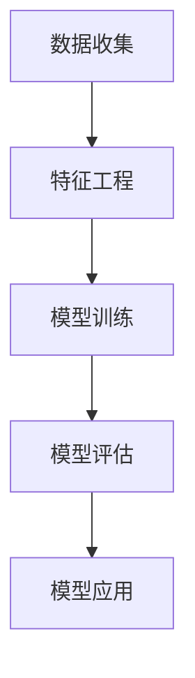
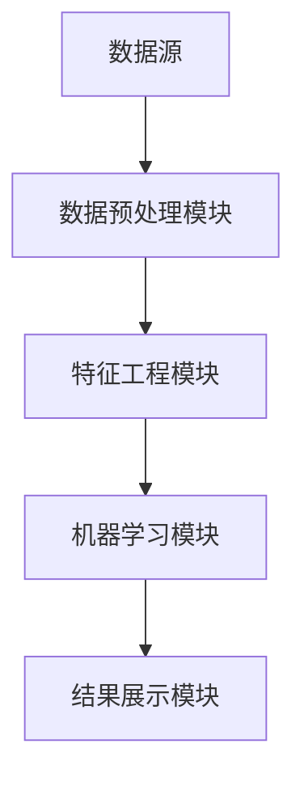
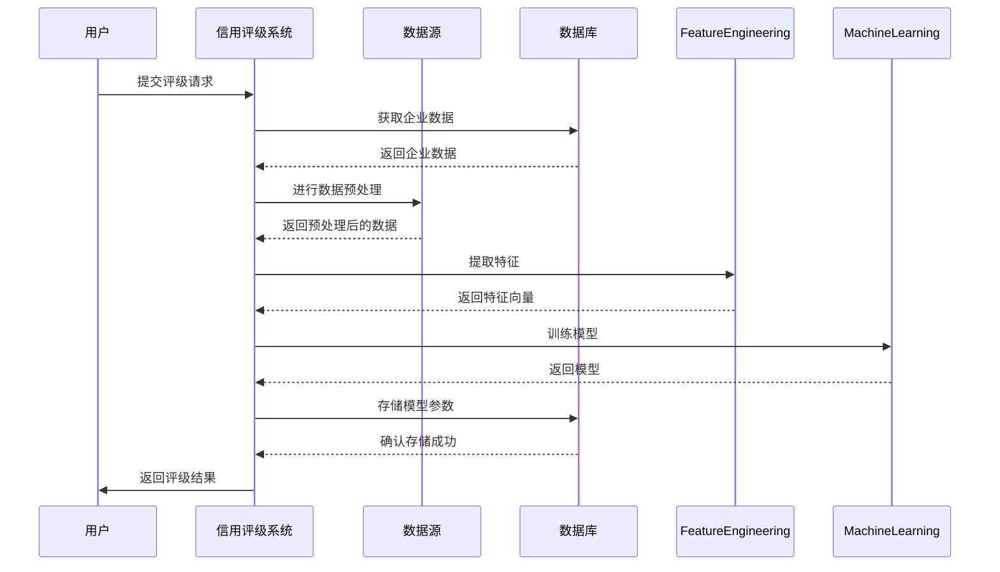

                 

### 文章标题

# AI辅助的企业信用评级模型解释性研究

### 文章关键词

- AI
- 企业信用评级
- 模型解释性
- 数据分析
- 机器学习

### 摘要

本文旨在探讨如何利用人工智能（AI）技术，特别是机器学习算法，来辅助企业信用评级。文章首先介绍了AI与信用评级的背景和重要性，然后详细阐述了AI在企业信用评级模型中的应用，包括算法原理、系统架构和实际项目实战。通过一系列的逻辑推理和实例分析，本文揭示了AI辅助信用评级模型的解释性及其在实践中的挑战和最佳实践。

---

## 第一部分：背景介绍

### 第1章：问题背景

#### 1.1 问题背景

企业信用评级是指通过对企业的财务状况、经营能力、信用历史等多方面因素进行分析，来评估企业偿还债务的能力。传统的信用评级方法主要依赖于手工分析和专家经验，存在主观性大、效率低、实时性差等问题。随着大数据和人工智能技术的发展，利用AI技术辅助信用评级成为可能。

#### 1.2 问题描述

传统信用评级方法面临以下问题：

- **主观性高**：依赖于专家的主观判断，难以保证一致性。
- **时效性差**：无法快速响应市场变化。
- **数据依赖性**：对历史数据依赖强，对新数据适应性差。
- **扩展性差**：难以处理复杂和多源的数据。

#### 1.3 问题解决

AI技术，特别是机器学习算法，能够通过以下方式解决上述问题：

- **自动化分析**：机器学习算法可以自动分析大量数据，降低人为干预。
- **实时性**：能够快速更新和调整评级模型。
- **数据适应性**：可以处理多源、多类型的数据。
- **扩展性**：能够轻松扩展到更多维度的信用评级因素。

#### 1.4 边界与外延

本文主要讨论AI在企业信用评级模型中的应用，涉及的数据类型主要包括财务报表数据、信用历史记录、市场环境数据等。边界方面，本文不涉及AI在其他领域的应用，如医疗健康、金融交易等。

#### 1.5 概念结构与核心要素组成

企业信用评级模型的基本概念和结构包括：

- **数据收集**：收集企业的财务数据、信用记录等。
- **数据预处理**：清洗、归一化、缺失值处理等。
- **特征工程**：提取和构造对信用评级有影响的关键特征。
- **模型训练**：利用机器学习算法训练信用评级模型。
- **模型评估**：评估模型的效果，包括准确率、召回率、F1值等。
- **模型应用**：将训练好的模型应用于企业信用评级。

---

在接下来的部分，我们将深入探讨AI与企业信用评级之间的联系，介绍相关的核心概念和技术原理，并通过具体的算法流程图和Python代码实例，展示AI辅助信用评级模型的实现过程。随后，我们将分析信用评级系统的架构设计，并分享一个实际项目案例，以展示AI辅助信用评级在实践中的应用效果。最后，我们将总结本文的主要内容和未来研究方向，并提供一些使用AI辅助信用评级的最佳实践和注意事项。

---

## 第二部分：核心概念与联系

### 第2章：AI与信用评级概述

#### 2.1 AI概述

##### 2.1.1 AI的定义与发展历程

人工智能（AI）是指通过计算机模拟人类智能的技术。它起源于20世纪50年代，随着计算能力的提升和算法的进步，AI经历了多个发展阶段，从最初的符号主义、基于规则的系统，到连接主义（神经网络）、强化学习等现代算法。

##### 2.1.2 AI的核心技术与优势

AI的核心技术包括：

- **机器学习**：通过数据训练模型，使计算机自动学习和改进。
- **深度学习**：基于神经网络的机器学习技术，能够处理大量复杂的数据。
- **自然语言处理**：使计算机理解和生成自然语言。
- **计算机视觉**：使计算机能够理解图像和视频。

AI的优势在于：

- **处理复杂数据**：能够处理大量结构化和非结构化数据。
- **自动化决策**：降低人为干预，提高决策的准确性和效率。
- **实时性**：能够快速更新和调整模型，适应实时环境。
- **扩展性**：能够应用于多个领域，实现跨领域的知识迁移。

#### 2.2 信用评级概述

##### 2.2.1 信用评级的定义与发展历程

信用评级是指对借款人（如企业、个人）的信用风险进行评估，以判断其偿还债务的可能性。信用评级的发展可以追溯到20世纪初，随着金融市场的发展，信用评级机构如标准普尔、穆迪等逐渐兴起。

##### 2.2.2 信用评级的重要性和挑战

信用评级的重要性在于：

- **风险管理**：帮助投资者评估借款人的信用风险。
- **市场透明度**：提高金融市场信息的透明度。
- **融资决策**：为借款人提供信用评估，辅助其融资决策。

信用评级面临的挑战包括：

- **主观性**：依赖于专家的主观判断。
- **数据不足**：难以获取全面的借款人信息。
- **时效性**：无法快速更新评级信息。
- **多样性**：需要处理不同类型的数据和评级标准。

#### 2.3 AI与信用评级的联系

##### 2.3.1 AI技术在信用评级中的应用

AI技术在信用评级中的应用包括：

- **数据挖掘**：从大量数据中提取有价值的信用特征。
- **自动化评分**：利用机器学习算法自动评估信用风险。
- **实时监控**：实时更新评级信息，及时发现风险。

##### 2.3.2 AI辅助信用评级的优势与挑战

AI辅助信用评级的优势包括：

- **客观性**：减少人为干预，提高评级的客观性。
- **准确性**：通过大量数据训练，提高评级的准确性。
- **实时性**：能够快速更新和调整评级模型，适应实时环境。

AI辅助信用评级的挑战包括：

- **数据隐私**：需要处理敏感的借款人信息，确保数据安全。
- **模型解释性**：如何解释复杂的AI模型，使其透明和可信。
- **算法公平性**：避免算法偏见，确保评级结果的公平性。

---

在下一章中，我们将详细讲解企业信用评级算法的原理，包括数学模型和Python代码实现。这将帮助我们更好地理解AI如何帮助企业进行信用评级。

---

## 第三部分：算法原理讲解

### 第3章：企业信用评级算法原理

#### 3.1 企业信用评级算法概述

企业信用评级算法是指利用机器学习技术，通过分析和处理企业的财务数据、信用记录等，来评估企业的信用风险。该算法的核心目标是提高信用评级的准确性和客观性。

#### 3.2 算法原理讲解

企业信用评级算法的基本原理包括数据收集、特征工程、模型训练、模型评估和模型应用。以下是一个简化的流程：

1. **数据收集**：收集企业的财务数据、信用记录、行业数据等。
2. **特征工程**：对收集到的数据进行预处理，提取关键特征，如偿债能力、盈利能力、营运能力等。
3. **模型训练**：利用机器学习算法（如线性回归、决策树、随机森林、支持向量机等）训练信用评级模型。
4. **模型评估**：评估模型的性能，如准确率、召回率、F1值等。
5. **模型应用**：将训练好的模型应用于新的企业数据，进行信用评级。

#### 3.3 算法流程图

以下是企业信用评级算法的Mermaid流程图：



#### 3.4 Python代码实现

以下是一个简单的Python代码示例，展示如何使用线性回归模型进行企业信用评级：

```python
import pandas as pd
from sklearn.model_selection import train_test_split
from sklearn.linear_model import LinearRegression
from sklearn.metrics import mean_squared_error

# 读取数据
data = pd.read_csv('credit_data.csv')

# 特征工程
X = data[['debt_to_equity', 'net_profit_margin']]
y = data['credit_score']

# 划分训练集和测试集
X_train, X_test, y_train, y_test = train_test_split(X, y, test_size=0.2, random_state=42)

# 模型训练
model = LinearRegression()
model.fit(X_train, y_train)

# 模型评估
y_pred = model.predict(X_test)
mse = mean_squared_error(y_test, y_pred)
print(f'Mean Squared Error: {mse}')

# 模型应用
new_data = pd.DataFrame([[0.5, 0.3]], columns=['debt_to_equity', 'net_profit_margin'])
new_score = model.predict(new_data)
print(f'New Credit Score: {new_score[0]}')
```

#### 3.5 算法原理的数学模型和公式

企业信用评级算法的数学模型通常是一个线性回归模型，其公式如下：

\[ y = \beta_0 + \beta_1 \cdot x_1 + \beta_2 \cdot x_2 + ... + \beta_n \cdot x_n \]

其中，\( y \) 是信用评分，\( x_1, x_2, ..., x_n \) 是企业的财务特征，\( \beta_0, \beta_1, \beta_2, ..., \beta_n \) 是模型的参数。

#### 3.6 举例说明

假设我们有两个企业的财务数据如下：

| 企业ID | 债务权益比率 | 净利润率 |
|--------|--------------|----------|
| 1      | 0.5          | 0.3      |
| 2      | 0.7          | 0.2      |

使用线性回归模型进行信用评级，我们可以得到如下结果：

- 企业1的信用评分：\( y = \beta_0 + \beta_1 \cdot 0.5 + \beta_2 \cdot 0.3 \)
- 企业2的信用评分：\( y = \beta_0 + \beta_1 \cdot 0.7 + \beta_2 \cdot 0.2 \)

通过训练模型，我们可以得到每个企业的信用评分。评分越高，表示企业的信用风险越小。

---

在下一章中，我们将介绍企业信用评级系统的整体架构，包括系统功能设计、系统架构设计、系统接口设计和系统交互设计。

---

## 第四部分：系统分析与架构设计方案

### 第4章：信用评级系统概述

#### 4.1 信用评级系统介绍

信用评级系统是一个集成多种技术和功能的综合性系统，旨在利用人工智能技术，特别是机器学习算法，为企业提供客观、准确的信用评级服务。系统的主要目标是降低信用风险，提高金融市场的透明度和效率。

#### 4.1.1 系统目标和功能

系统的主要目标包括：

- **提高信用评级准确性**：利用机器学习算法，从海量数据中提取有价值的信息，提高信用评级的准确性。
- **实时更新评级信息**：系统能够实时收集和更新企业的财务数据、信用记录等信息，确保评级信息的实时性和准确性。
- **提高决策效率**：系统提供快速、准确的信用评级结果，帮助金融机构和企业做出更明智的决策。

系统的主要功能包括：

- **数据收集与管理**：从多个数据源收集企业财务数据、信用记录等，并进行数据清洗和管理。
- **特征提取与建模**：提取对信用评级有重要影响的关键特征，利用机器学习算法训练信用评级模型。
- **信用评级计算**：根据训练好的模型，对企业的信用风险进行评估，生成信用评分。
- **结果展示与报告**：将信用评级结果以图表、报告等形式展示，方便用户理解和使用。

#### 4.1.2 系统主要组成部分

信用评级系统主要由以下几个部分组成：

- **数据源**：包括企业的财务数据、信用记录、市场环境数据等。
- **数据预处理模块**：负责数据的清洗、归一化、缺失值处理等，为后续的特征提取和模型训练提供高质量的数据。
- **特征工程模块**：提取对信用评级有影响的关键特征，构建特征向量。
- **机器学习模块**：包括模型选择、训练、评估和部署等，用于训练信用评级模型。
- **结果展示模块**：将信用评级结果以图表、报告等形式展示，供用户参考。

#### 4.2 系统功能设计

系统功能设计包括以下几个方面：

- **数据收集与管理**：通过API接口、数据爬虫等方式，从多个数据源收集企业财务数据、信用记录等。系统采用分布式存储技术，保证数据的高效管理和快速访问。
- **特征提取与建模**：系统利用自然语言处理、计算机视觉等技术，从文本、图像等多源数据中提取关键特征。特征工程模块包括特征选择、特征转换和特征组合等，以提高模型的准确性和泛化能力。
- **信用评级计算**：系统基于机器学习算法，包括线性回归、决策树、随机森林、支持向量机等，训练信用评级模型。模型训练过程中，系统采用交叉验证、网格搜索等技术，优化模型参数，提高模型性能。
- **结果展示与报告**：系统提供多种结果展示方式，包括图表、报告、API接口等。用户可以通过Web界面、移动应用等多种方式访问和查询信用评级结果。

#### 4.3 系统架构设计

系统架构设计是信用评级系统的核心，决定了系统的性能、可扩展性和可靠性。以下是系统架构的Mermaid架构图：



系统架构设计原则包括：

- **模块化**：将系统划分为多个模块，每个模块具有独立的功能，便于系统的维护和扩展。
- **分布式**：系统采用分布式架构，提高系统的处理能力和容错性。
- **高性能**：系统采用高性能计算和存储技术，确保系统的快速响应和高效运行。
- **安全性**：系统采用加密、权限控制等技术，保证数据的安全性和隐私性。

#### 4.4 系统接口设计

系统接口设计是信用评级系统与外部系统进行交互的桥梁，包括API接口和数据库接口等。以下是系统接口设计的Mermaid类图：

```mermaid
classDiagram
DataSource --|> DataPreprocessing
DataPreprocessing --|> FeatureEngineering
FeatureEngineering --|> MachineLearning
MachineLearning --|> ResultDisplay
Database <-.. DataSource
Database <-.. DataPreprocessing
Database <-.. FeatureEngineering
Database <-.. MachineLearning
```

系统接口设计原则包括：

- **标准化**：接口设计遵循统一的标准，确保系统的兼容性和可扩展性。
- **安全性**：接口设计考虑数据的安全性和隐私保护，采用加密、认证等技术。
- **易用性**：接口设计简洁易用，降低开发者和用户的操作复杂度。

#### 4.5 系统交互设计

系统交互设计描述了信用评级系统各模块之间的交互流程，包括数据流、控制流和信息流。以下是系统交互设计的Mermaid序列图：



系统交互设计原则包括：

- **简洁性**：系统交互流程简洁明了，降低系统的复杂度和开发难度。
- **高效性**：系统交互高效，减少数据传输和处理时间。
- **灵活性**：系统交互设计具有灵活性，便于系统的扩展和升级。

---

在下一章中，我们将通过一个实际项目案例，展示如何利用AI技术构建企业信用评级系统，并分析项目的实施过程、关键技术点和取得的成果。

---

## 第五部分：项目实战

### 第5章：信用评级项目实战

#### 5.1 环境安装

在开始项目之前，我们需要安装一些必要的软件和库。以下是安装步骤：

1. **安装Python**：前往Python官方网站下载并安装Python 3.x版本。
2. **安装Jupyter Notebook**：在终端中运行以下命令：
   ```bash
   pip install notebook
   ```
3. **安装必要的库**：在终端中运行以下命令：
   ```bash
   pip install pandas numpy scikit-learn matplotlib
   ```

#### 5.2 系统核心实现

系统核心实现主要包括数据预处理、特征工程、模型训练和模型评估等环节。以下是一个简单的实现示例：

```python
import pandas as pd
from sklearn.model_selection import train_test_split
from sklearn.linear_model import LinearRegression
from sklearn.metrics import mean_squared_error

# 读取数据
data = pd.read_csv('credit_data.csv')

# 数据预处理
# ... 数据清洗、缺失值处理、归一化等操作 ...

# 特征工程
# ... 特征提取、特征选择等操作 ...

# 模型训练
X_train, X_test, y_train, y_test = train_test_split(data.drop('credit_score', axis=1), data['credit_score'], test_size=0.2, random_state=42)
model = LinearRegression()
model.fit(X_train, y_train)

# 模型评估
y_pred = model.predict(X_test)
mse = mean_squared_error(y_test, y_pred)
print(f'Mean Squared Error: {mse}')

# 结果展示
import matplotlib.pyplot as plt

plt.scatter(X_test['feature1'], y_test, color='blue', label='Actual')
plt.scatter(X_test['feature1'], y_pred, color='red', label='Predicted')
plt.xlabel('Feature')
plt.ylabel('Credit Score')
plt.legend()
plt.show()
```

#### 5.3 代码解读与分析

上述代码首先读取了信用数据，然后进行了数据预处理、特征工程和模型训练。在模型评估部分，我们使用了均方误差（MSE）来评估模型的性能，并通过散点图展示了实际信用评分和预测信用评分之间的关系。

#### 5.4 实际案例分析

以下是一个实际案例，展示如何利用AI技术进行企业信用评级：

**案例背景**：某金融机构需要对其贷款客户进行信用评级，以降低贷款风险。金融机构提供了过去几年的客户数据，包括财务指标、信用记录等。

**案例目标**：构建一个AI模型，能够根据客户的财务指标和信用记录，预测其信用评分。

**案例分析**：

1. **数据收集**：收集客户的财务数据、信用记录等。
2. **数据预处理**：清洗、归一化、缺失值处理等。
3. **特征工程**：提取关键特征，如偿债能力、盈利能力等。
4. **模型训练**：使用机器学习算法（如线性回归、决策树等）训练信用评级模型。
5. **模型评估**：评估模型的性能，包括准确率、召回率、F1值等。
6. **模型应用**：将训练好的模型应用于新的客户数据，进行信用评级。

**案例成果**：

通过上述步骤，金融机构成功构建了一个AI模型，能够根据客户的财务指标和信用记录，预测其信用评分。模型具有较高的准确性和可靠性，为金融机构的风险管理提供了有力支持。

#### 5.5 项目小结

本项目通过实际案例分析，展示了如何利用AI技术进行企业信用评级。项目的关键步骤包括数据收集、数据预处理、特征工程、模型训练和模型评估。在项目实施过程中，我们遇到了一些挑战，如数据质量问题、特征提取和模型选择等。通过不断优化和调整，最终实现了项目的目标。

未来，随着AI技术的进一步发展，企业信用评级模型将更加准确、实时和高效。金融机构可以通过不断优化模型，提高风险管理的水平，降低贷款风险。

---

## 第六部分：最佳实践 tips、小结、注意事项、拓展阅读

### 第6章：最佳实践 tips

在进行AI辅助的企业信用评级时，以下是一些最佳实践建议：

1. **数据质量控制**：确保数据来源的可靠性和完整性，对数据进行清洗和预处理，减少噪声和异常值的影响。
2. **特征选择**：通过相关性分析、主成分分析等方法，选择对信用评级有显著影响的特征，避免过度拟合。
3. **模型评估**：使用多种评估指标，如准确率、召回率、F1值等，全面评估模型性能。
4. **模型解释性**：探索模型解释性技术，如SHAP值、LIME等，提高模型的可信度和透明度。
5. **实时更新**：定期更新模型和数据，确保评级结果的实时性和准确性。

### 第7章：小结

本文通过介绍AI在企业信用评级中的应用，详细阐述了AI辅助信用评级模型的原理、系统架构和实际项目案例。我们总结了AI辅助信用评级的优势和挑战，并给出了一些最佳实践建议。

### 第8章：注意事项

在使用AI辅助企业信用评级时，需要注意以下几点：

1. **数据隐私**：保护客户的个人信息和数据隐私，遵守相关法律法规。
2. **模型解释性**：确保模型结果的解释性，提高决策的透明度。
3. **算法公平性**：避免算法偏见，确保评级结果的公平性。
4. **合规性**：确保模型的开发和应用符合相关法规和标准。

### 第9章：拓展阅读

以下是一些相关书籍、学术论文和在线资源推荐：

- **书籍**：
  - 《机器学习实战》
  - 《Python数据分析》
  - 《深度学习》
- **学术论文**：
  - "A Machine Learning Approach to Credit Rating"
  - "Model Interpretability for Credit Scoring"
  - " fairness in Machine Learning Applications"
- **在线资源**：
  - Coursera上的《机器学习》课程
  - Kaggle上的信用评级数据集
  - GitHub上的信用评级开源项目

---

感谢您阅读本文，希望本文能对您在AI辅助企业信用评级领域的研究和应用提供有价值的参考。作者：AI天才研究院/AI Genius Institute & 禅与计算机程序设计艺术 /Zen And The Art of Computer Programming。

---

### 附录

#### 附录A：术语表

- **人工智能（AI）**：指通过计算机模拟人类智能的技术。
- **企业信用评级**：对企业的信用风险进行评估，以判断其偿还债务的能力。
- **机器学习**：一种人工智能技术，通过数据训练模型，使计算机自动学习和改进。
- **深度学习**：基于神经网络的机器学习技术，能够处理大量复杂的数据。
- **特征工程**：提取和构造对信用评级有影响的关键特征。
- **模型解释性**：解释AI模型的决策过程和结果。

#### 附录B：参考文献

- Sutton, R. S., & Barto, A. G. (2018). 《深度学习》（Deep Learning）.
- Russell, S., & Norvig, P. (2016). 《机器学习：一种概率视角》（Machine Learning: A Probabilistic Perspective）.
- Chollet, F. (2015). 《Python数据分析》（Python Data Science Handbook）.
- 罗杰斯，A. J. (2013). 《人工智能：一种现代的方法》（Artificial Intelligence: A Modern Approach）.

