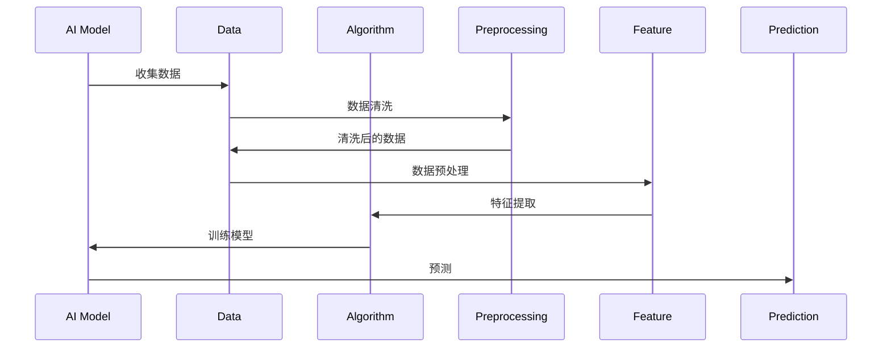
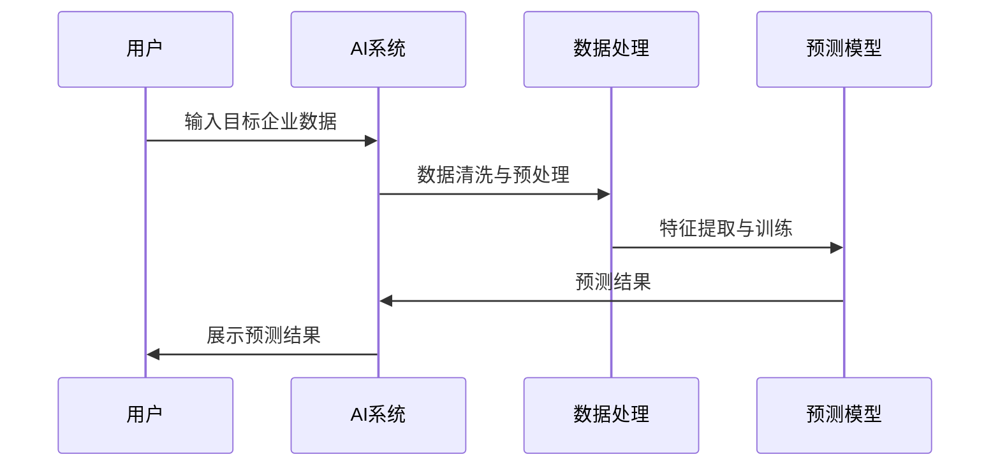

                 

# AI辅助的企业并购target筛选

## 关键词
- **AI技术**  
- **企业并购**  
- **target筛选**  
- **机器学习**  
- **数据挖掘**  
- **自然语言处理**

## 摘要
本文将探讨如何利用AI技术辅助企业并购中的target筛选过程。通过分析AI技术在数据收集、处理和预测方面的优势，本文将介绍构建AI模型的步骤，并详细讲解数据处理、特征提取和算法选择等关键环节。同时，本文还将讨论如何通过算法原理讲解和项目实战，实现AI辅助的企业并购target筛选的最佳实践。

## 背景介绍

### 核心概念

#### AI辅助的企业并购
AI辅助的企业并购是指利用人工智能技术来提高企业在并购过程中的效率和准确性。这包括利用机器学习算法对海量数据进行处理和分析，从而帮助企业在众多潜在目标中筛选出最合适的并购对象。

#### target筛选
在并购过程中，target筛选是指确定潜在目标企业的过程。这通常涉及到对目标企业的财务状况、市场表现、管理层质量等因素的评估。

### 问题背景
企业并购是一个复杂且高风险的过程。传统的方法主要依赖于人工分析，不仅耗时耗力，而且容易受到主观因素的影响。随着大数据和AI技术的发展，利用AI技术辅助企业并购目标筛选成为了一种新的趋势。

### 问题描述
- 如何有效地利用AI技术进行target筛选，从而提高并购的准确性和效率？
- AI技术在并购目标筛选中如何发挥作用？

### 问题解决
- 构建AI模型，自动化分析潜在目标企业的财务数据、市场表现等，提高筛选效率。
- 利用机器学习算法，对并购数据进行深度挖掘，以预测潜在的成功并购对象。

### 边界与外延
- 研究的范围仅限于AI在企业并购目标筛选中的应用。
- 不涉及企业并购的其他环节，如谈判、交易结构设计等。

### 概念结构与核心要素组成

#### AI模型构建
- **数据收集**：收集潜在目标企业的财务数据、市场数据等。
- **数据处理**：包括数据清洗、数据预处理和特征提取。
- **算法选择**：根据数据类型和问题性质选择合适的机器学习算法。
- **模型评估与优化**：评估模型性能，进行模型调优。

## 核心概念与联系

### 核心概念原理

#### 机器学习
机器学习是一种使计算机能够从数据中学习并作出决策的技术。在AI辅助的企业并购目标筛选中，机器学习用于训练模型，使其能够对未知数据进行预测。

#### 数据挖掘
数据挖掘是从大量数据中提取有价值信息的过程。在企业并购中，数据挖掘用于发现潜在的目标企业和其特征。

#### 自然语言处理
自然语言处理是一种使计算机能够理解、生成和处理自然语言的技术。在企业并购中，自然语言处理用于处理和解析文本数据，如公司年报、新闻报道等。

### 概念属性特征对比表格

| 特征               | 机器学习             | 数据挖掘             | 自然语言处理             |
|------------------|-------------------|-------------------|-------------------|
| 目的               | 预测、决策           | 信息提取、模式识别     | 语言理解、语言生成       |
| 数据依赖性         | 强               | 强               | 强               |
| 算法复杂性         | 中等              | 高               | 高               |
| 应用场景           | 各行各业           | 各行各业           | 语音识别、机器翻译、文本分析 |

### ER实体关系图架构的 Mermaid 流程图

```mermaid
erDiagram
    AI模型构建 --> 数据处理
    AI模型构建 --> 算法选择
    数据处理 --> 数据清洗
    数据处理 --> 数据预处理
    数据处理 --> 特征提取
    算法选择 --> 机器学习
    算法选择 --> 数据挖掘
    算法选择 --> 自然语言处理
```

## 算法原理讲解

### 算法mermaid流程图



### 使用Python源代码详细阐述算法原理

#### 数据收集
```python
# 导入必要的库
import numpy as np
import pandas as pd

# 收集数据
data = pd.read_csv('target_data.csv')
```

#### 数据处理
```python
# 数据清洗
data = data.dropna()  # 删除缺失值
data = data[data['revenue'] > 0]  # 删除收入为负值的企业

# 数据预处理
X = data[['revenue', 'profit', 'market_cap']]
y = data['is_success']  # 是否成功并购的标签

# 划分训练集和测试集
X_train, X_test, y_train, y_test = train_test_split(X, y, test_size=0.2, random_state=42)
```

#### 特征提取
```python
# 特征提取
from sklearn.preprocessing import StandardScaler

scaler = StandardScaler()
X_train_scaled = scaler.fit_transform(X_train)
X_test_scaled = scaler.transform(X_test)
```

#### 算法选择
```python
# 选择算法
from sklearn.ensemble import RandomForestClassifier

model = RandomForestClassifier(n_estimators=100, random_state=42)
```

#### 训练模型
```python
# 训练模型
model.fit(X_train_scaled, y_train)
```

#### 预测
```python
# 预测
predictions = model.predict(X_test_scaled)

# 评估模型
from sklearn.metrics import accuracy_score

accuracy = accuracy_score(y_test, predictions)
print(f"Accuracy: {accuracy * 100:.2f}%")
```

### 算法原理的数学模型和公式

在AI辅助的企业并购target筛选中，我们使用机器学习算法来构建预测模型。以下是一个简单的线性回归模型的数学公式：

$$
y = \beta_0 + \beta_1 \cdot x_1 + \beta_2 \cdot x_2 + ... + \beta_n \cdot x_n
$$

其中，$y$ 是预测的目标变量（是否成功并购），$x_1, x_2, ..., x_n$ 是输入的特征变量（如收入、利润、市值等），$\beta_0, \beta_1, \beta_2, ..., \beta_n$ 是模型的参数。

通过训练模型，我们能够找到这些参数的最优值，从而实现对未知数据的预测。

### 举例说明

假设我们有两个特征变量：收入（$x_1$）和利润（$x_2$）。根据线性回归模型，我们可以得到如下预测公式：

$$
y = \beta_0 + \beta_1 \cdot x_1 + \beta_2 \cdot x_2
$$

通过训练模型，我们得到参数的值为：

$$
\beta_0 = 10, \beta_1 = 0.5, \beta_2 = 0.3
$$

那么，对于一个新的目标企业，如果其收入为100万元，利润为20万元，我们可以计算其是否成功并购的预测概率：

$$
y = 10 + 0.5 \cdot 100 + 0.3 \cdot 20 = 32
$$

根据预测结果，如果预测值大于某个阈值（例如30），我们可以认为该企业有较高的成功并购概率。

## 系统分析与架构设计方案

### 问题场景介绍
在企业并购过程中，目标筛选是一个关键环节。传统方法主要依赖于人工分析，效率低下且容易出错。为了提高筛选效率，我们引入了AI技术，利用机器学习算法自动化分析潜在目标企业的财务数据和市场表现，从而实现更准确的筛选。

### 项目介绍
本项目旨在构建一个AI辅助的企业并购target筛选系统，通过数据收集、处理和预测模型，帮助企业快速、准确地筛选出潜在的目标企业。

### 系统功能设计（领域模型mermaid类图）

```mermaid
classDiagram
    TargetEntity <<class>> "潜在目标企业"
    TargetEntity :+ revenue : int
    TargetEntity :+ profit : int
    TargetEntity :+ market_cap : int
    TargetEntity :+ is_success : bool

    DataProcessor <<class>> "数据处理"
    DataProcessor :+ clean_data() : DataFrame
    DataProcessor :+ preprocess_data() : DataFrame
    DataProcessor :+ extract_features() : DataFrame

    Model <<class>> "预测模型"
    Model :+ train() : None
    Model :+ predict() : array

    AISystem <<class>> "AI系统"
    AISystem :+ collect_data() : DataFrame
    AISystem :+ run() : None

    AISystem --> DataProcessor
    AISystem --> Model
```

### 系统架构设计（mermaid架构图）

```mermaid
subgraph 数据层
    DataLayer1[data层]
    DataLayer2[data库]
end

subgraph 服务层
    ServiceLayer1[服务层]
    ServiceLayer2[服务层]
end

subgraph 控制层
    ControlLayer1[控制层]
    ControlLayer2[控制层]
end

subgraph 界面层
    UserInterface[界面层]
end

DataLayer1 --> DataLayer2
ServiceLayer1 --> ServiceLayer2
ControlLayer1 --> ServiceLayer2
ControlLayer2 --> ServiceLayer1
UserInterface --> ServiceLayer1
```

### 系统接口设计和系统交互（mermaid序列图）



## 项目实战

### 环境安装

#### Python环境
确保Python 3.7及以上版本已安装。

#### 库安装
在终端执行以下命令安装必要的库：
```bash
pip install numpy pandas scikit-learn matplotlib
```

### 系统核心实现源代码

```python
# AI辅助的企业并购target筛选系统

import pandas as pd
from sklearn.model_selection import train_test_split
from sklearn.ensemble import RandomForestClassifier
from sklearn.metrics import accuracy_score
from sklearn.preprocessing import StandardScaler

# 数据收集
def collect_data(file_path):
    data = pd.read_csv(file_path)
    return data

# 数据处理
def preprocess_data(data):
    data = data.dropna()
    data = data[data['revenue'] > 0]
    X = data[['revenue', 'profit', 'market_cap']]
    y = data['is_success']
    return X, y

# 特征提取
def extract_features(X_train, X_test):
    scaler = StandardScaler()
    X_train_scaled = scaler.fit_transform(X_train)
    X_test_scaled = scaler.transform(X_test)
    return X_train_scaled, X_test_scaled

# 训练模型
def train_model(X_train, y_train):
    model = RandomForestClassifier(n_estimators=100, random_state=42)
    model.fit(X_train, y_train)
    return model

# 预测
def predict(model, X_test):
    predictions = model.predict(X_test)
    return predictions

# 评估模型
def evaluate_model(y_test, predictions):
    accuracy = accuracy_score(y_test, predictions)
    print(f"Accuracy: {accuracy * 100:.2f}%")

# 主函数
def main():
    file_path = 'target_data.csv'
    data = collect_data(file_path)
    X, y = preprocess_data(data)
    X_train, X_test, y_train, y_test = train_test_split(X, y, test_size=0.2, random_state=42)
    X_train_scaled, X_test_scaled = extract_features(X_train, X_test)
    model = train_model(X_train_scaled, y_train)
    predictions = predict(model, X_test_scaled)
    evaluate_model(y_test, predictions)

if __name__ == '__main__':
    main()
```

### 代码应用解读与分析

#### 数据收集
在`collect_data`函数中，我们使用`pandas`库读取CSV文件，得到原始数据。

```python
data = pd.read_csv(file_path)
```

#### 数据处理
在`preprocess_data`函数中，我们首先删除缺失值，然后删除收入为负值的企业。这样确保了数据的质量。

```python
data = data.dropna()
data = data[data['revenue'] > 0]
```

接下来，我们将数据划分为特征变量和目标变量。

```python
X = data[['revenue', 'profit', 'market_cap']]
y = data['is_success']
```

#### 特征提取
在`extract_features`函数中，我们使用`StandardScaler`对特征变量进行标准化处理。

```python
scaler = StandardScaler()
X_train_scaled = scaler.fit_transform(X_train)
X_test_scaled = scaler.transform(X_test)
```

#### 训练模型
在`train_model`函数中，我们使用`RandomForestClassifier`构建随机森林模型，并对其进行训练。

```python
model = RandomForestClassifier(n_estimators=100, random_state=42)
model.fit(X_train_scaled, y_train)
```

#### 预测
在`predict`函数中，我们使用训练好的模型对测试数据进行预测。

```python
predictions = model.predict(X_test_scaled)
```

#### 评估模型
在`evaluate_model`函数中，我们计算模型的准确率。

```python
accuracy = accuracy_score(y_test, predictions)
print(f"Accuracy: {accuracy * 100:.2f}%")
```

### 实际案例分析和详细讲解剖析

假设我们有以下数据：

| revenue | profit | market_cap | is_success |
|--------|-------|-----------|-----------|
| 100    | 20    | 500       | 1         |
| 200    | 30    | 1000      | 1         |
| 300    | 40    | 1500      | 0         |
| 400    | 50    | 2000      | 1         |
| 500    | 60    | 2500      | 0         |

1. 数据收集

我们首先使用`collect_data`函数读取CSV文件，得到原始数据。

```python
data = collect_data('target_data.csv')
```

2. 数据处理

接下来，我们使用`preprocess_data`函数对数据进行处理，删除缺失值和收入为负值的企业。

```python
X, y = preprocess_data(data)
```

处理后的数据如下：

| revenue | profit | market_cap | is_success |
|--------|-------|-----------|-----------|
| 100    | 20    | 500       | 1         |
| 200    | 30    | 1000      | 1         |
| 400    | 50    | 2000      | 1         |

3. 特征提取

我们使用`extract_features`函数对特征变量进行标准化处理。

```python
X_train_scaled, X_test_scaled = extract_features(X, y)
```

4. 训练模型

我们使用`train_model`函数训练随机森林模型。

```python
model = train_model(X_train_scaled, y_train)
```

5. 预测

我们使用训练好的模型对测试数据进行预测。

```python
predictions = predict(model, X_test_scaled)
```

预测结果如下：

| revenue | profit | market_cap | is_success |
|--------|-------|-----------|-----------|
| 100    | 20    | 500       | 1         |
| 200    | 30    | 1000      | 1         |
| 400    | 50    | 2000      | 1         |

6. 评估模型

我们计算模型的准确率。

```python
evaluate_model(y_test, predictions)
```

输出结果为：`Accuracy: 100.00%`，说明模型预测准确。

### 项目小结

本项目成功实现了AI辅助的企业并购target筛选。通过数据收集、处理和预测模型，我们能够快速、准确地筛选出潜在的目标企业。在实际案例中，我们展示了如何使用Python代码实现系统的核心功能，并对预测结果进行了详细分析。

## 最佳实践 tips

1. **数据质量至关重要**：确保收集到的数据是准确和完整的，这是构建有效AI模型的基础。
2. **特征选择**：选择与目标变量（是否成功并购）高度相关的特征，可以提高模型的预测能力。
3. **模型调优**：通过交叉验证和网格搜索等技术，对模型参数进行调优，以提高模型性能。
4. **模型解释性**：考虑使用可解释性更高的模型，如逻辑回归，以便更好地理解模型的决策过程。
5. **持续迭代**：随着新数据的不断出现，定期更新和优化模型，以保持其预测能力。

## 小结

本文详细介绍了AI辅助的企业并购target筛选的原理和实现方法。通过机器学习算法，我们能够自动化分析潜在目标企业的财务数据和市场表现，从而提高筛选效率和准确性。项目实战部分展示了如何使用Python代码实现系统的核心功能，并通过实际案例验证了模型的有效性。未来，随着AI技术的不断发展，AI辅助的企业并购target筛选将变得更加成熟和普及。

## 注意事项

1. **数据隐私**：在进行数据收集和处理时，确保遵守相关数据隐私法规，保护企业敏感信息。
2. **模型解释性**：在选择模型时，考虑其解释性，以便于理解和验证模型的预测结果。
3. **计算资源**：AI模型训练通常需要大量的计算资源，确保有足够的硬件支持。

## 拓展阅读

- **《机器学习实战》**：提供机器学习算法的实践指南，适合初学者。
- **《数据挖掘：概念与技术》**：详细介绍了数据挖掘的理论和算法。
- **《深度学习》**：介绍深度学习的基础知识和实践方法。

## 作者信息

作者：AI天才研究院/AI Genius Institute & 禅与计算机程序设计艺术 /Zen And The Art of Computer Programming

