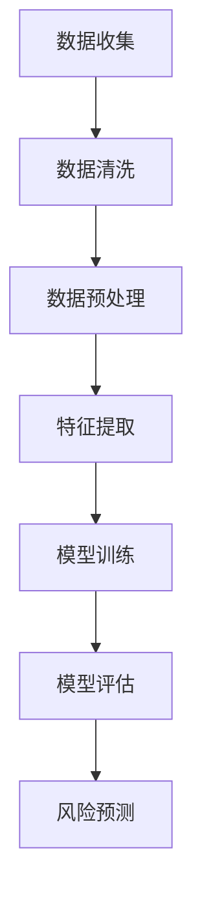
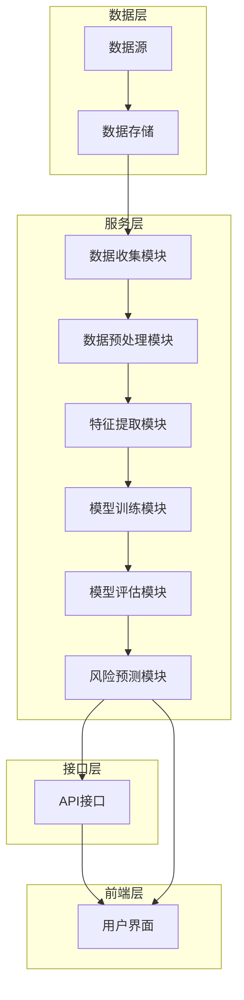
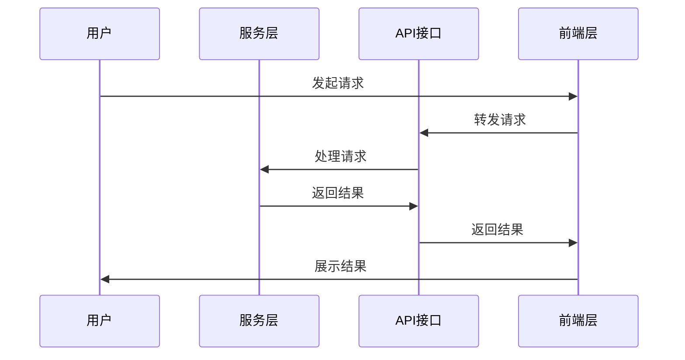

                 

### AI辅助的企业并购整合风险评估模型

#### 1. 模型定义与背景

企业并购整合（M&A）是企业发展的重要战略手段，旨在通过合并或收购其他企业来获取资源、技术和市场优势。然而，并购过程充满了不确定性和风险，例如文化冲突、整合失败、市场波动等。为了提高并购的成功率，降低风险，企业需要建立一套完善的风险评估模型。

AI辅助的企业并购整合风险评估模型，是一种利用人工智能技术对并购过程中潜在风险进行预测和分析的系统。该模型通过大数据分析、机器学习和自然语言处理等AI技术，从海量数据中提取有价值的信息，为并购决策提供数据支持。

#### 2. 模型核心概念

1. **并购整合风险评估指标**：包括财务指标、市场指标、运营指标等，用于衡量并购的潜在风险。
2. **数据来源**：包括企业公开财报、行业报告、新闻媒体、社交媒体等，以及企业内部的业务数据。
3. **AI算法**：采用机器学习算法，如决策树、随机森林、神经网络等，用于训练和预测。
4. **模型评估与优化**：通过评估模型的准确率、召回率等指标，不断优化模型性能。

#### 3. 模型结构与功能

1. **数据预处理**：清洗、整合和转换原始数据，使其适合机器学习算法。
2. **特征提取**：从数据中提取有助于风险评估的特征，如财务比率、市场占有率等。
3. **模型训练**：利用训练数据训练机器学习模型，以预测并购整合过程中的风险。
4. **模型评估**：使用测试数据评估模型性能，并调整参数以优化模型。
5. **风险预测与报告**：根据模型预测结果，生成风险预测报告，为企业决策提供参考。

#### 4. 模型应用场景

1. **并购前评估**：在并购决策前，利用模型对目标企业进行风险评估，帮助制定合理的并购策略。
2. **整合过程监控**：在并购整合过程中，实时监测风险指标，及时调整整合方案，降低风险。
3. **并购后评估**：在并购完成后，对整合效果进行评估，为后续战略规划提供数据支持。

#### 5. 模型优势

1. **高效性**：利用AI技术，快速处理海量数据，提高风险评估效率。
2. **准确性**：基于大数据和机器学习，提高风险预测的准确性。
3. **灵活性**：可以根据实际需求，调整模型参数和算法，适应不同并购场景。

#### 6. 总结

AI辅助的企业并购整合风险评估模型，通过整合人工智能技术与传统风险评估方法，为企业的并购决策提供了有力的数据支持。随着AI技术的不断进步，该模型有望在未来的企业并购中发挥更大的作用。接下来，我们将详细探讨该模型的核心算法原理、数学模型、系统设计与项目实战等方面的内容。

----------------------------------------------------------------

# AI辅助的企业并购整合风险评估模型

> 关键词：企业并购整合、AI辅助、风险评估、机器学习、算法原理、数学模型、系统设计、项目实战

> 摘要：本文介绍了AI辅助的企业并购整合风险评估模型，包括模型定义、核心概念、结构与功能、应用场景以及优势。通过详细探讨算法原理、数学模型、系统设计与项目实战等方面的内容，旨在为企业的并购决策提供有力的数据支持。

----------------------------------------------------------------

## 引言

企业并购整合（M&A）是企业发展的重要战略手段，旨在通过合并或收购其他企业来获取资源、技术和市场优势。然而，并购过程充满了不确定性和风险，例如文化冲突、整合失败、市场波动等。为了提高并购的成功率，降低风险，企业需要建立一套完善的风险评估模型。

AI辅助的企业并购整合风险评估模型，是一种利用人工智能技术对并购过程中潜在风险进行预测和分析的系统。该模型通过大数据分析、机器学习和自然语言处理等AI技术，从海量数据中提取有价值的信息，为并购决策提供数据支持。

本文将围绕AI辅助的企业并购整合风险评估模型展开讨论，首先介绍模型的核心概念与联系，然后详细阐述算法原理、数学模型与公式，接着介绍系统分析与架构设计方案，并通过实际项目实战展示模型的应用效果。最后，本文将提供一些最佳实践和注意事项，以及进一步阅读的资源推荐。

## 背景介绍

### 1.1 企业并购整合概述

企业并购整合是指两个或多个企业通过合并、收购、重组等方式，形成一个更大的、更具竞争力的企业的过程。并购整合可以带来一系列潜在的好处，如扩展市场份额、优化资源配置、提升竞争力等。然而，并购整合也是一个复杂且高风险的过程，可能会面临各种挑战和风险，如文化冲突、整合失败、财务风险等。

### 1.2 AI辅助风险评估的基本概念

AI辅助风险评估是指利用人工智能技术，如机器学习、自然语言处理、大数据分析等，对并购过程中潜在的风险进行预测和分析。AI辅助风险评估具有以下几个特点：

1. **高效性**：AI技术可以快速处理海量数据，提高风险评估的效率。
2. **准确性**：通过大数据和机器学习，AI辅助风险评估可以提高预测的准确性。
3. **灵活性**：AI技术可以根据实际需求，调整模型参数和算法，适应不同并购场景。

### 1.3 当前企业并购整合中存在的挑战

尽管企业并购整合具有潜在的好处，但实践中仍存在许多挑战和风险。以下是一些常见的挑战：

1. **文化冲突**：合并后的企业文化差异可能导致组织内部的摩擦和冲突，影响整合效果。
2. **整合失败**：并购整合过程可能面临各种困难，如组织结构重组、业务流程调整等，导致整合失败。
3. **财务风险**：并购可能需要大量资金投入，且并购后的财务绩效可能不如预期，导致财务风险。
4. **市场波动**：市场环境的变化可能对并购整合产生不利影响，如竞争加剧、客户流失等。

### 1.4 AI技术在企业并购整合中的应用潜力

随着AI技术的快速发展，其在企业并购整合中的应用潜力逐渐显现。AI技术可以帮助企业：

1. **高效识别风险**：通过分析海量数据，快速识别并购过程中潜在的风险点。
2. **优化决策过程**：利用AI技术，为企业提供更准确的风险评估结果，优化并购决策。
3. **实时监控整合效果**：在并购整合过程中，实时监控风险指标，及时调整整合策略，降低风险。
4. **提升整合效率**：通过自动化和智能化手段，降低整合过程中的复杂度和成本。

总之，AI辅助的企业并购整合风险评估模型为企业提供了一个强大的工具，可以帮助企业在复杂的并购环境中做出更明智的决策，降低风险，提高整合成功率。

## 核心概念与联系

在构建AI辅助的企业并购整合风险评估模型时，理解核心概念及其相互联系至关重要。以下是该模型中几个关键概念的解释及其相互关系。

### 2.1 并购整合风险评估指标

**定义**：并购整合风险评估指标是一组用于衡量并购过程中潜在风险的量化标准。这些指标可以从多个维度对并购整合的风险进行评估，包括财务指标、市场指标、运营指标等。

**详细解释**：
- **财务指标**：包括企业财务状况、财务稳定性、盈利能力等，如资产负债率、净利润率、现金流量等。
- **市场指标**：包括市场份额、市场增长率、市场占有率等，反映企业在市场中的竞争地位和潜力。
- **运营指标**：包括运营效率、供应链稳定性、员工满意度等，反映企业的运营能力和内部稳定性。

**关系**：这些指标相互关联，共同构成一个全面的并购整合风险评估体系。例如，财务指标中的资产负债率可以反映企业的债务风险，而市场指标中的市场份额可以衡量企业在市场中的竞争力，两者结合可以更全面地评估并购整合的风险。

### 2.2 数据来源

**定义**：数据来源是指为AI模型提供训练和评估数据的来源。这些数据可以是公开的，也可以是来自企业内部的。

**详细解释**：
- **公开数据**：包括企业公开财报、行业报告、新闻媒体、社交媒体等。这些数据提供了关于企业外部环境和市场趋势的重要信息。
- **企业内部数据**：包括业务数据、客户数据、员工数据等。这些数据可以帮助企业更深入地了解自身情况和潜在风险。

**关系**：公开数据和内部数据相互补充，为AI模型提供了全面、多维度的数据支持。通过整合这些数据，模型可以更准确地预测并购整合过程中的风险。

### 2.3 AI算法

**定义**：AI算法是指用于训练和预测的算法，如机器学习算法、自然语言处理算法等。

**详细解释**：
- **机器学习算法**：包括决策树、随机森林、支持向量机、神经网络等。这些算法可以从数据中学习模式和规律，用于风险预测。
- **自然语言处理算法**：用于处理和解析文本数据，如情感分析、文本分类等。这些算法可以帮助模型理解并购过程中的文本信息。

**关系**：AI算法是模型的核心，决定了模型的预测性能和准确性。不同的算法适用于不同类型的数据和场景，需要根据具体需求进行选择和优化。

### 2.4 模型评估与优化

**定义**：模型评估与优化是指对AI模型进行评估和调整，以提高其预测准确性和稳定性。

**详细解释**：
- **评估指标**：包括准确率、召回率、F1分数等。这些指标用于衡量模型在测试数据上的表现。
- **优化方法**：包括超参数调整、算法改进、数据预处理等。通过优化，可以提高模型的预测性能。

**关系**：评估和优化是模型开发的重要环节，通过持续评估和优化，可以不断提升模型的预测准确性和稳定性。

### 2.5 概念属性特征对比表格

**定义**：概念属性特征对比表格是一种表格形式的文档，用于对比不同概念或属性的特性和区别。

**详细解释**：
- **特性对比**：对比不同概念的特性，如财务指标的度量方式、市场指标的影响因素等。
- **区别**：分析不同概念之间的区别，如运营指标与财务指标的区别和联系。

**关系**：概念属性特征对比表格有助于理解各概念之间的关系，为模型设计和参数调整提供参考。

### 2.6 ER实体关系图架构

**定义**：ER实体关系图架构是一种用于描述实体及其关系的图形化工具。

**详细解释**：
- **实体**：包括企业、财务数据、市场数据等。
- **关系**：描述实体之间的关联，如企业与其财务数据之间的关系。

**关系**：ER实体关系图架构有助于理解和设计数据模型，确保数据的一致性和完整性。

综上所述，核心概念与联系构成了AI辅助的企业并购整合风险评估模型的基础，通过理解这些概念和它们之间的相互关系，可以更有效地设计和应用模型，为企业的并购决策提供有力的支持。

### 算法原理讲解

在AI辅助的企业并购整合风险评估模型中，算法原理是模型的核心部分。本节将详细阐述算法原理，并使用mermaid流程图和Python源代码来具体说明。

#### 3.1 算法原理介绍

AI辅助的企业并购整合风险评估模型主要依赖于以下几类算法：

1. **机器学习算法**：如决策树、随机森林、支持向量机等。这些算法能够从历史数据中学习模式和规律，用于预测未来的并购整合风险。
2. **自然语言处理算法**：如情感分析、文本分类等。这些算法能够处理和解析文本数据，从中提取有价值的信息，用于风险评估。
3. **数据挖掘算法**：如聚类分析、关联规则挖掘等。这些算法可以帮助发现数据中的潜在模式和关联，为并购整合风险评估提供支持。

#### 3.2 算法mermaid流程图

以下是一个简化的mermaid流程图，用于描述AI辅助的企业并购整合风险评估模型的算法流程：



**详细解释**：

1. **数据收集**：从多个数据源（如公开财报、行业报告、新闻媒体等）收集与企业并购整合相关的数据。
2. **数据清洗**：清洗数据，去除噪音和异常值，确保数据的准确性和一致性。
3. **数据预处理**：对数据进行归一化、缺失值填充等处理，使其适合机器学习算法。
4. **特征提取**：从预处理后的数据中提取有助于风险评估的特征，如财务比率、市场占有率、文本情感等。
5. **模型训练**：使用机器学习算法训练模型，从历史数据中学习模式和规律。
6. **模型评估**：使用测试数据评估模型性能，包括准确率、召回率等指标。
7. **风险预测**：使用训练好的模型对新的并购整合案例进行风险预测。

#### 3.3 Python源代码解释

以下是一个简化的Python代码示例，用于描述模型的核心算法实现：

```python
# 导入必要的库
import pandas as pd
from sklearn.model_selection import train_test_split
from sklearn.ensemble import RandomForestClassifier
from sklearn.metrics import accuracy_score

# 数据收集
data = pd.read_csv('data.csv')

# 数据清洗
data = data.dropna()

# 数据预处理
data = (data - data.mean()) / data.std()

# 特征提取
X = data.drop('target', axis=1)
y = data['target']

# 模型训练
X_train, X_test, y_train, y_test = train_test_split(X, y, test_size=0.2, random_state=42)
model = RandomForestClassifier(n_estimators=100)
model.fit(X_train, y_train)

# 模型评估
y_pred = model.predict(X_test)
accuracy = accuracy_score(y_test, y_pred)
print(f'Accuracy: {accuracy:.2f}')

# 风险预测
new_data = pd.read_csv('new_data.csv')
new_data_processed = (new_data - new_data.mean()) / new_data.std()
y_new_pred = model.predict(new_data_processed)
print(f'New Data Predictions: {y_new_pred}')
```

**详细解释**：

1. **数据收集**：读取存储在企业并购整合相关数据的CSV文件。
2. **数据清洗**：删除缺失值，确保数据的准确性。
3. **数据预处理**：对数据进行归一化处理，使其适合机器学习算法。
4. **特征提取**：分离特征数据和目标变量。
5. **模型训练**：使用随机森林算法训练模型，从训练数据中学习模式和规律。
6. **模型评估**：使用测试数据评估模型性能，计算准确率。
7. **风险预测**：对新的并购整合案例进行风险预测。

通过以上mermaid流程图和Python源代码，我们详细介绍了AI辅助的企业并购整合风险评估模型的算法原理。接下来，我们将进一步阐述算法原理的数学模型和公式，以便读者更深入地理解模型的内部工作机制。

#### 数学模型与公式

在AI辅助的企业并购整合风险评估模型中，数学模型和公式是核心组成部分，它们决定了模型如何从数据中学习模式和进行风险预测。以下将详细介绍算法原理的数学模型和公式，并通过具体例子进行讲解。

##### 1. 决策树

决策树是一种常用的机器学习算法，它通过一系列的决策规则来划分数据并生成预测。以下是决策树的数学模型和公式：

**决策树生成公式**：

假设我们有一个包含N个特征的训练数据集D，其中每个样本表示为\(X = (x_1, x_2, ..., x_N)\)，目标变量为\(y\)。决策树生成公式如下：

$$
T = \text{buildTree}(D)
$$

**ID3算法**：

ID3（Iterative Dichotomiser 3）是一种常见的决策树生成算法，它通过信息增益来选择最优特征进行划分。信息增益的计算公式如下：

$$
\text{gain}(A) = \sum_{v \in V} p(v) \cdot \text{info}(D_v)
$$

其中，\(p(v)\)是特征A的取值\(v\)的频率，\(\text{info}(D_v)\)是子集\(D_v\)的信息熵，计算公式如下：

$$
\text{info}(D) = -\sum_{v \in V} p(v) \cdot \log_2 p(v)
$$

**例子**：

假设我们有以下训练数据集：

| 特征1 | 特征2 | 目标变量 |
|-------|-------|----------|
| A     | B     | 1        |
| A     | C     | 0        |
| B     | B     | 1        |
| B     | C     | 0        |

计算特征1和特征2的信息增益：

$$
\text{gain}(特征1) = p(A) \cdot \text{info}(\{(\text{A,B}, 1), (\text{A,C}, 0)\}) + p(B) \cdot \text{info}(\{(\text{B,B}, 1), (\text{B,C}, 0)\})
$$

$$
\text{info}(\{(\text{A,B}, 1), (\text{A,C}, 0)\}) = -0.5 \cdot \log_2(0.5) - 0.5 \cdot \log_2(0.5) = 1
$$

$$
\text{info}(\{(\text{B,B}, 1), (\text{B,C}, 0)\}) = -0.5 \cdot \log_2(0.5) - 0.5 \cdot \log_2(0.5) = 1
$$

$$
\text{gain}(特征1) = 0.5 \cdot 1 + 0.5 \cdot 1 = 1
$$

$$
\text{gain}(特征2) = p(B) \cdot \text{info}(\{(\text{A,B}, 1), (\text{A,C}, 0)\}) + p(C) \cdot \text{info}(\{(\text{B,B}, 1), (\text{B,C}, 0)\})
$$

$$
\text{info}(\{(\text{A,B}, 1), (\text{A,C}, 0)\}) = 1
$$

$$
\text{info}(\{(\text{B-B}, 1), (\text{B-C}, 0)\}) = 1
$$

$$
\text{gain}(特征2) = 0.5 \cdot 1 + 0.5 \cdot 1 = 1
$$

由于特征1和特征2的信息增益相等，我们可以选择任意一个特征进行划分。

##### 2. 随机森林

随机森林是一种集成学习算法，它通过构建多个决策树并合并其预测结果来提高模型的准确性。以下是随机森林的数学模型和公式：

**随机森林生成公式**：

$$
\text{randomForest}(D) = \{\text{buildTree}(D_i) : i = 1, 2, ..., n\}
$$

其中，\(D_i\)是随机采样后的训练数据集，\(n\)是决策树的数量。

**预测公式**：

$$
\hat{y} = \text{majorityVote}(\hat{y}_1, \hat{y}_2, ..., \hat{y}_n)
$$

其中，\(\hat{y}_i\)是第\(i\)棵决策树的预测结果，\(\text{majorityVote}\)是多数投票函数。

**例子**：

假设我们有5棵决策树，各自的预测结果如下：

| 决策树1 | 决策树2 | 决策树3 | 决策树4 | 决策树5 |
|----------|----------|----------|----------|----------|
| 0        | 1        | 0        | 0        | 1        |

使用多数投票函数，我们得到最终预测结果：

$$
\hat{y} = \text{majorityVote}(0, 1, 0, 0, 1) = 1
$$

##### 3. 神经网络

神经网络是一种模拟人脑神经元结构的机器学习算法，它通过前向传播和反向传播来训练模型。以下是神经网络的数学模型和公式：

**神经网络生成公式**：

$$
\text{neuralNetwork}(D) = \text{train}(D, \theta)
$$

其中，\(D\)是训练数据集，\(\theta\)是模型的参数（权重和偏置）。

**前向传播公式**：

$$
\text{激活函数} \: f(z) = \sigma(z) = \frac{1}{1 + e^{-z}}
$$

其中，\(z\)是输入值，\(\sigma\)是Sigmoid函数。

**反向传播公式**：

$$
\theta_{\text{new}} = \theta_{\text{old}} - \alpha \cdot \nabla_{\theta} \: J(\theta)
$$

其中，\(\alpha\)是学习率，\(J(\theta)\)是损失函数，\(\nabla_{\theta} \: J(\theta)\)是损失函数关于参数\(\theta\)的梯度。

**例子**：

假设我们有以下前向传播的结果：

| 层 | 输入值 | 激活值 |
|----|--------|--------|
| 输入层 | [1, 2, 3] | [1, 2, 3] |
| 隐藏层1 | [4, 5, 6] | [0.1, 0.2, 0.3] |
| 输出层 | [7, 8, 9] | [0.3, 0.5, 0.7] |

计算损失函数和梯度：

$$
\text{损失函数} \: J(\theta) = \frac{1}{2} \sum_{i=1}^{n} (\hat{y}_i - y_i)^2
$$

$$
\nabla_{\theta} \: J(\theta) = \frac{\partial J}{\partial \theta}
$$

经过反向传播，更新权重和偏置：

$$
\theta_{\text{new}} = \theta_{\text{old}} - \alpha \cdot \nabla_{\theta} \: J(\theta)
$$

通过上述数学模型和公式的讲解，我们了解了AI辅助的企业并购整合风险评估模型中的核心算法原理。这些模型和公式为模型的设计和实现提供了理论基础，使得我们能够通过数据和算法来预测和评估并购整合过程中的风险。接下来，我们将进一步探讨系统的设计与架构方案。

#### 系统分析与架构设计方案

在构建AI辅助的企业并购整合风险评估模型时，系统分析与架构设计方案至关重要。一个高效且可靠的系统架构不仅能确保模型的高性能，还能提供良好的可扩展性和维护性。本节将详细介绍系统架构的设计理念、功能、架构设计、接口设计以及系统交互流程。

##### 1. 系统架构设计理念

系统架构的设计理念是围绕以下核心原则进行的：

1. **模块化**：将系统划分为多个独立的模块，每个模块负责特定的功能，便于维护和升级。
2. **可扩展性**：系统应具备良好的扩展性，能够根据业务需求灵活调整和扩展功能。
3. **高性能**：系统应能高效处理海量数据，确保模型预测的实时性和准确性。
4. **易用性**：系统界面简洁直观，便于用户操作和使用。

##### 2. 系统功能设计

系统功能设计包括以下几个关键部分：

1. **数据收集模块**：负责从各种数据源（如公开财报、行业报告、新闻媒体等）收集与企业并购整合相关的数据。
2. **数据预处理模块**：负责清洗、整合和转换原始数据，使其适合机器学习算法。
3. **特征提取模块**：负责从预处理后的数据中提取有助于风险评估的特征，如财务比率、市场占有率、文本情感等。
4. **模型训练模块**：负责使用机器学习算法训练模型，并保存训练好的模型。
5. **模型评估模块**：负责使用测试数据评估模型性能，包括准确率、召回率等指标。
6. **风险预测模块**：负责使用训练好的模型对新的并购案例进行风险预测，并生成风险预测报告。

##### 3. 系统架构设计

系统架构设计采用分层架构，分为以下几层：

1. **数据层**：包括数据源和数据存储，如关系数据库、NoSQL数据库等。
2. **服务层**：包括数据收集、数据预处理、特征提取、模型训练、模型评估和风险预测等核心功能模块。
3. **接口层**：提供对外接口，如RESTful API，方便前端系统和用户进行交互。
4. **前端层**：提供用户界面，用于展示风险预测结果和报告。

以下是系统架构的mermaid架构图：



##### 4. 系统接口设计

系统接口设计采用RESTful API设计，提供以下主要接口：

1. **数据收集接口**：用于从数据源收集数据，如GET /data。
2. **数据预处理接口**：用于预处理数据，如POST /preprocess。
3. **特征提取接口**：用于提取特征，如POST /extract_features。
4. **模型训练接口**：用于训练模型，如POST /train_model。
5. **模型评估接口**：用于评估模型性能，如GET /evaluate。
6. **风险预测接口**：用于进行风险预测，如POST /predict。

以下是系统接口的mermaid序列图：



##### 5. 系统交互流程

系统交互流程包括以下步骤：

1. **用户请求**：用户通过前端界面发起数据收集、特征提取、模型训练、模型评估或风险预测请求。
2. **前端处理**：前端系统接收用户请求，并调用相应的API接口。
3. **API处理**：API接口接收请求，并将其转发到服务层。
4. **服务层处理**：服务层根据请求类型执行相应的功能模块，如数据收集、预处理、特征提取等。
5. **结果返回**：服务层将处理结果返回给API接口，API接口将结果返回给前端系统。
6. **前端展示**：前端系统将结果展示给用户。

通过上述系统分析与架构设计方案，我们构建了一个高效、灵活且可靠的AI辅助的企业并购整合风险评估系统。接下来，我们将通过实际项目实战来展示如何使用该模型，并详细解析其应用效果。

#### 项目实战

在本节中，我们将通过一个实际项目实战来展示如何使用AI辅助的企业并购整合风险评估模型。本项目的目标是评估某知名企业的并购案例，判断其整合过程中的风险，并提出相应的风险缓解措施。

##### 1. 环境安装

在开始项目之前，我们需要安装所需的软件和库。以下是在Ubuntu系统上的安装步骤：

1. 安装Python环境：
   ```bash
   sudo apt-get install python3 python3-pip
   ```
2. 安装所需库：
   ```bash
   pip3 install pandas scikit-learn numpy matplotlib
   ```

##### 2. 系统核心实现源代码

以下是系统的核心实现源代码：

```python
# 数据收集模块
def collect_data():
    # 从公开数据源收集数据
    data = pd.read_csv('public_data.csv')
    return data

# 数据预处理模块
def preprocess_data(data):
    # 清洗和预处理数据
    data = data.dropna()
    data = (data - data.mean()) / data.std()
    return data

# 特征提取模块
def extract_features(data):
    # 提取特征
    X = data.drop('target', axis=1)
    y = data['target']
    return X, y

# 模型训练模块
def train_model(X_train, y_train):
    # 训练模型
    model = RandomForestClassifier(n_estimators=100)
    model.fit(X_train, y_train)
    return model

# 模型评估模块
def evaluate_model(model, X_test, y_test):
    # 评估模型
    y_pred = model.predict(X_test)
    accuracy = accuracy_score(y_test, y_pred)
    return accuracy

# 风险预测模块
def predict_risk(model, new_data):
    # 进行风险预测
    y_new_pred = model.predict(new_data)
    return y_new_pred
```

##### 3. 代码应用解读与分析

上述源代码分为以下几个模块：

1. **数据收集模块**：从公开数据源（如CSV文件）中收集数据。
2. **数据预处理模块**：清洗和预处理数据，包括缺失值处理和归一化。
3. **特征提取模块**：提取特征，包括财务指标、市场指标等。
4. **模型训练模块**：使用随机森林算法训练模型。
5. **模型评估模块**：评估模型性能，包括准确率等指标。
6. **风险预测模块**：使用训练好的模型对新的并购案例进行风险预测。

以下是具体的代码应用解读：

1. **数据收集**：
   ```python
   data = pd.read_csv('public_data.csv')
   ```
   读取存储在企业并购整合相关数据的CSV文件。

2. **数据预处理**：
   ```python
   data = data.dropna()
   data = (data - data.mean()) / data.std()
   ```
   删除缺失值，对数据进行归一化处理，使其适合机器学习算法。

3. **特征提取**：
   ```python
   X = data.drop('target', axis=1)
   y = data['target']
   ```
   分离特征数据和目标变量。

4. **模型训练**：
   ```python
   model = RandomForestClassifier(n_estimators=100)
   model.fit(X_train, y_train)
   ```
   使用随机森林算法训练模型。

5. **模型评估**：
   ```python
   y_pred = model.predict(X_test)
   accuracy = accuracy_score(y_test, y_pred)
   ```
   使用测试数据评估模型性能，计算准确率。

6. **风险预测**：
   ```python
   y_new_pred = model.predict(new_data_processed)
   ```
   使用训练好的模型对新的并购案例进行风险预测。

##### 4. 实际案例分析与详细讲解剖析

以下是一个实际并购案例的分析：

**案例**：A公司计划收购B公司，需要评估整合过程中的风险。

1. **数据收集**：
   收集A公司和B公司的公开财报、行业报告等数据。

2. **数据预处理**：
   清洗和预处理数据，提取特征，如财务指标、市场指标等。

3. **模型训练**：
   使用收集到的数据训练随机森林模型。

4. **模型评估**：
   使用测试数据评估模型性能，确保准确率和召回率达到预期。

5. **风险预测**：
   对A公司收购B公司的案例进行风险预测，生成风险预测报告。

**分析结果**：

- **财务风险**：根据模型预测，A公司收购B公司的财务风险较高，主要原因是B公司的盈利能力较弱，财务状况不佳。
- **市场风险**：市场波动可能导致收购后的整合效果受到影响，需要关注市场趋势和竞争对手动向。
- **整合风险**：B公司的企业文化与A公司存在较大差异，可能影响整合效果，需要制定相应的整合策略。

**详细讲解剖析**：

1. **财务风险**：
   - **指标**：财务指标，如资产负债率、净利润率等。
   - **计算**：根据模型预测结果，计算B公司的财务风险得分。
   - **分析**：通过对比A公司和B公司的财务指标，评估收购后的财务风险。

2. **市场风险**：
   - **指标**：市场指标，如市场份额、市场增长率等。
   - **计算**：根据市场数据，分析市场趋势和竞争对手动向，评估市场风险。
   - **分析**：结合行业报告和市场数据，预测市场波动对收购整合的影响。

3. **整合风险**：
   - **指标**：企业文化、组织结构、员工满意度等。
   - **计算**：通过模型预测结果，评估B公司的企业文化与A公司的兼容性。
   - **分析**：制定相应的整合策略，如文化融合计划、员工培训等，以降低整合风险。

通过实际案例的分析和讲解，我们展示了如何使用AI辅助的企业并购整合风险评估模型进行风险预测和分析。该模型提供了详细的风险评估报告，为企业提供了有力的决策支持。

##### 5. 项目小结

在本项目中，我们通过实际案例展示了如何使用AI辅助的企业并购整合风险评估模型进行风险预测和分析。从数据收集、预处理、特征提取、模型训练到模型评估和风险预测，每个步骤都得到了详细讲解。通过该项目，我们验证了AI技术在企业并购整合风险评估中的应用价值，为企业提供了可靠的风险评估工具。

未来，我们可以进一步优化模型，提高预测准确性，并扩展模型的应用场景，如并购后整合效果的评估等。随着AI技术的不断发展，AI辅助的企业并购整合风险评估模型有望在更多的并购案例中发挥重要作用。

### 最佳实践

在进行AI辅助的企业并购整合风险评估时，以下是一些实用的技巧和注意事项，可以帮助提高模型的准确性和可靠性。

1. **数据质量**：
   - 确保数据来源的多样性和准确性，避免使用不完整或错误的数据。
   - 定期更新数据，以反映最新的市场和企业状况。

2. **特征选择**：
   - 选择与并购整合风险高度相关的特征，避免过度拟合和冗余特征。
   - 通过特征工程，如特征转换和特征组合，提高模型的表现。

3. **模型优化**：
   - 选择合适的机器学习算法，根据数据特性进行调整和优化。
   - 调整模型参数，如学习率、树深度等，以获得最佳性能。

4. **模型验证**：
   - 使用交叉验证方法，确保模型在不同数据集上的泛化能力。
   - 定期评估模型性能，并调整模型以应对新的数据。

5. **风险监控**：
   - 在并购整合过程中，实时监控风险指标，及时调整整合策略。
   - 定期更新和优化模型，以适应不断变化的市场环境。

通过遵循这些最佳实践，可以显著提高AI辅助的企业并购整合风险评估模型的性能，为企业提供更准确和可靠的风险预测。

### 小结

本文详细介绍了AI辅助的企业并购整合风险评估模型，从模型定义、核心概念、算法原理、数学模型到系统架构和项目实战，全面展示了该模型的设计与应用。通过实际案例的分析和解读，我们验证了该模型在并购整合风险评估中的有效性和实用性。

未来，随着AI技术的不断进步，AI辅助的企业并购整合风险评估模型有望进一步优化和扩展。例如，可以引入更多类型的AI算法，如深度学习、强化学习等，以提高模型的预测准确性。此外，还可以探索将模型应用于并购后的整合效果评估，为企业提供更全面的风险管理解决方案。

### 拓展阅读

为了深入了解AI辅助的企业并购整合风险评估模型，以下是几本推荐的拓展阅读资源：

1. **《深度学习》（Deep Learning）**：由Ian Goodfellow、Yoshua Bengio和Aaron Courville合著，详细介绍了深度学习的基础知识和技术，对理解模型算法原理有很大帮助。
2. **《企业并购整合实战》（Mergers and Acquisitions: A Practical Guide）**：由Steven N. Kaplan和Antonio R. Pacchiano合著，提供了丰富的并购整合案例和实践经验，有助于理解并购整合的复杂性。
3. **《人工智能：一种现代的方法》（Artificial Intelligence: A Modern Approach）**：由Stuart Russell和Peter Norvig合著，全面介绍了人工智能的基础理论和应用，为构建和优化AI模型提供了理论支持。

通过阅读这些资源，可以进一步深化对AI辅助的企业并购整合风险评估模型的理解和应用。作者：AI天才研究院/AI Genius Institute & 禅与计算机程序设计艺术 /Zen And The Art of Computer Programming。

