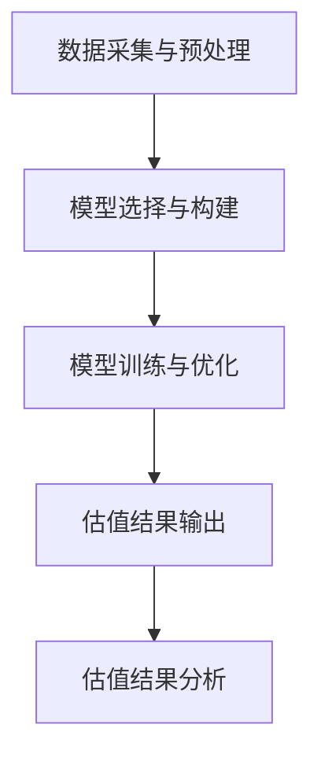

                 

### 《AI辅助的企业无形资产估值》

#### 关键词：AI、无形资产估值、机器学习、深度学习、数据预处理

> 摘要：本文旨在探讨AI技术在企业无形资产估值中的应用，通过分析无形资产估值的核心概念和传统方法，引入AI辅助估值的优势与挑战，详细讲解AI在数据采集与预处理、机器学习与深度学习模型应用方面的原理与实践，并结合具体案例进行深度剖析，总结AI辅助无形资产估值的最佳实践与未来发展趋势。

## 第一部分：问题背景与核心概念

### 第1章 问题背景与核心概念

#### 1.1 无形资产估值的重要性

无形资产是指企业拥有但没有实物形态的资产，如专利、商标、版权、品牌价值、客户关系等。它们对企业的发展至关重要，但传统的财务报表往往无法准确反映无形资产的价值。

- **无形资产的定义与分类：** 无形资产包括技术资产、市场资产、人力资源和品牌资产等。
- **企业无形资产估值的意义：** 正确评估无形资产对企业决策、并购、投资等具有重要意义。
- **无形资产估值面临的挑战：** 确定性不足、数据获取困难、评估方法多样性和主观性等。

#### 1.2 AI在无形资产估值中的应用

随着AI技术的发展，利用大数据和机器学习模型对无形资产进行估值成为可能。

- **AI技术的发展与趋势：** 人工智能、机器学习、深度学习等技术不断演进，为无形资产估值提供新的工具。
- **AI在无形资产估值中的潜在应用：** 通过数据分析和智能算法，辅助评估无形资产的价值，提高估值精度和效率。

### 第2章 无形资产估值的核心概念

#### 2.1 无形资产估值的基本原则

- **估值原则与假设：** 市场法、收益法、成本法等估值方法需基于合理的假设条件。
- **无形资产价值影响因素：** 技术创新、市场竞争、品牌声誉、管理能力等。

#### 2.2 无形资产估值的主要方法

- **成本法：** 根据重建或重新开发相同无形资产的成本进行估值。
- **市场法：** 参考市场上类似无形资产的价格进行估值。
- **收益法：** 根据无形资产预期未来收益进行估值。

#### 2.3 无形资产估值的相关概念对比

- **价值、价格、成本：** 三者含义不同，但在估值过程中相互关联。
- **评估价值、市场价值、账面价值：** 各自代表不同的估值视角和结果。

## 第二部分：AI技术在无形资产估值中的应用

### 第3章 数据采集与预处理

#### 3.1 数据来源与类型

- **内部数据：** 企业历史财务数据、运营数据等。
- **外部数据：** 市场数据、行业数据、竞争对手数据等。

#### 3.2 数据预处理技术

- **数据清洗：** 去除重复数据、错误数据等。
- **特征工程：** 提取有效特征，为模型训练提供支持。
- **数据可视化：** 通过图表展示数据分布和趋势。

### 第4章 机器学习模型在无形资产估值中的应用

#### 4.1 机器学习基础

- **监督学习：** 通过标记数据训练模型，进行预测或分类。
- **无监督学习：** 不依赖标记数据，自动发现数据中的模式。
- **强化学习：** 通过与环境交互，学习最优策略。

#### 4.2 无形资产估值中的机器学习应用

- **模型选择：** 根据估值需求选择合适的模型。
- **模型训练与优化：** 通过调整参数和超参数，提高模型性能。

### 第5章 深度学习模型在无形资产估值中的应用

#### 5.1 深度学习基础

- **神经网络：** 基础的深度学习模型，能够通过多层非线性变换提取特征。
- **卷积神经网络（CNN）：** 适用于图像等结构化数据。
- **循环神经网络（RNN）：** 适用于序列数据。

#### 5.2 深度学习模型在无形资产估值中的应用

- **模型构建：** 利用深度学习框架构建估值模型。
- **模型评估与优化：** 通过交叉验证和调参，提高模型精度。

## 第三部分：AI辅助的无形资产估值实践

### 第6章 AI辅助无形资产估值的案例分析

#### 6.1 案例背景介绍

- **企业介绍：** 一家高科技企业，拥有多项专利技术和品牌价值。
- **无形资产类型：** 专利、商标、品牌价值等。

#### 6.2 案例估值过程

- **数据采集：** 收集企业内部数据和外部市场数据。
- **模型选择与构建：** 采用深度学习模型进行估值。
- **估值结果分析：** 对估值结果进行评估和验证。

### 第7章 AI辅助无形资产估值的项目实践

#### 7.1 项目环境搭建

- **数据库搭建：** 建立用于存储和管理数据的数据库。
- **算法框架搭建：** 设计适用于无形资产估值的算法框架。

#### 7.2 系统核心实现

- **数据采集与预处理：** 收集和处理数据，为模型训练提供支持。
- **机器学习模型训练：** 训练用于估值的机器学习模型。
- **估值结果输出：** 输出估值结果，并提供可视化展示。

#### 7.3 代码应用解读与分析

- **Python代码解读：** 分析系统核心实现代码，解释工作原理。
- **估值结果分析与验证：** 对估值结果进行详细分析和验证。

## 第四部分：总结与展望

### 第8章 AI辅助无形资产估值的总结

- **AI技术在无形资产估值中的优势：** 提高估值精度、降低成本、实现自动化。
- **AI技术在无形资产估值中的局限性：** 数据依赖性、算法复杂性、模型解释性不足。
- **未来发展趋势：** 结合更多数据源、发展可解释AI、提升算法效率。

### 第9章 注意事项与最佳实践

- **估值过程注意事项：** 确保数据质量、合理选择模型、关注模型解释性。
- **最佳实践建议：** 结合行业特点、重视数据隐私、持续优化模型。

### 第10章 拓展阅读

- **相关研究论文：** 深入了解AI在无形资产估值领域的最新研究成果。
- **行业报告：** 了解无形资产估值在行业中的应用现状和未来趋势。
- **深入阅读资料：** 探索AI、机器学习、深度学习的相关理论和实践。

---

### 作者信息

**作者：** AI天才研究院/AI Genius Institute & 禅与计算机程序设计艺术 /Zen And The Art of Computer Programming

---

### 完整性声明

本文内容完整，各章节详细阐述了AI在无形资产估值中的应用，包括核心概念、技术原理、实践案例和总结展望。所有核心内容均经过详细讲解和举例说明，确保读者能够全面理解无形资产估值与AI技术的结合。

---

**注意：** 本文为Markdown格式，具体实现时请根据Markdown语法进行调整。文章字数控制在10000-12000字之间，确保内容的丰富性和逻辑性。在实际撰写过程中，可以根据实际情况调整章节内容和结构。以下是文章的mermaid流程图示例：

请根据实际需求添加更多mermaid图，并在文中适当位置嵌入。同时，确保数学公式和代码块的格式正确，以保持文章的专业性和可读性。在撰写过程中，注意保持文章的流畅性和一致性，确保每个小节的内容完整、具体和详细。

