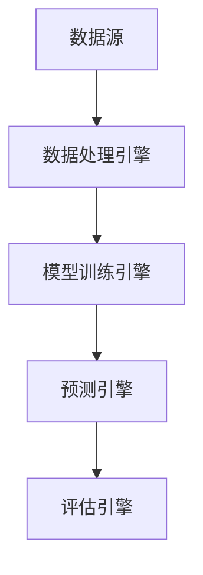
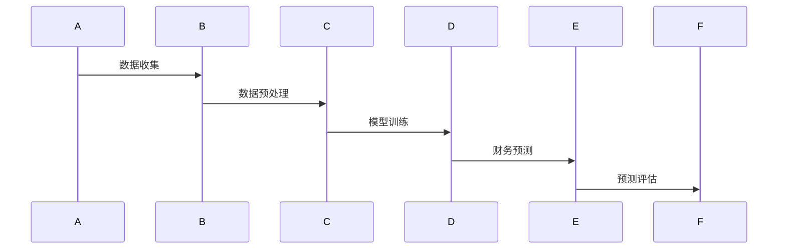

                 

# AI辅助的企业财务预测模型

## 关键词：人工智能，财务预测，深度学习，强化学习，机器学习算法，模型优化

## 摘要：

本文旨在探讨AI辅助的企业财务预测模型的原理、特征及其应用。我们将从问题背景出发，逐步深入到核心概念的解释和对比分析，最后通过具体的算法原理讲解、系统分析与架构设计，以及实战项目案例，全面揭示AI辅助财务预测模型的价值和应用。

----------------------------------------------------------------

## 第一部分：背景介绍与问题阐述

### 第1章：问题背景与核心概念

#### 1.1.1 问题的背景

在当今的商业环境中，企业运营所面临的不确定因素日益增多。传统的方法在应对复杂、多变的经济环境时，往往显得力不从心。财务预测作为企业决策的重要支撑，其准确性和实时性成为关键问题。随着人工智能技术的迅猛发展，AI辅助的企业财务预测模型应运而生，为解决这一问题提供了新的思路。

#### 1.1.2 问题描述

企业财务预测模型需要解决的主要问题包括：

1. **经济环境的变化捕捉**：传统方法难以准确捕捉复杂多变的经济环境，导致预测结果失真。
2. **非结构化数据处理**：财务数据中存在大量的非结构化数据，如何有效利用这些数据成为一大挑战。
3. **预测准确性和实时性**：如何提高预测的准确性，同时保证预测的实时性，是当前财务预测模型的难题。

#### 1.1.3 问题解决

AI辅助的企业财务预测模型通过以下方式解决上述问题：

1. **利用深度学习技术**：深度学习能够处理大量的非结构化数据，从数据中学习到复杂的关系和模式，提高预测的准确性。
2. **利用强化学习技术**：强化学习通过试错和反馈机制，能够在动态环境中找到最优的财务策略，提高预测的实用性。
3. **利用实时数据分析技术**：实时数据分析技术能够实现对企业财务数据的实时处理和预测，提高预测的实时性。

#### 1.1.4 边界与外延

本文主要探讨以下方面：

- **模型设计**：选择和构建适合企业需求的预测模型。
- **数据处理**：处理和清洗数据，为模型提供高质量的输入。
- **模型优化**：通过算法优化提高模型的预测性能。
- **应用场景**：将AI辅助的财务预测模型应用于实际的企业运营中。

#### 1.1.5 概念结构与核心要素组成

AI辅助的企业财务预测模型由以下几个核心要素组成：

1. **数据收集与预处理**：收集企业历史财务数据，并进行数据清洗和预处理。
2. **模型构建**：选择合适的机器学习算法，构建财务预测模型。
3. **模型训练与优化**：使用训练数据对模型进行训练，并通过验证数据集对模型进行优化。
4. **预测与评估**：使用模型对新的数据进行预测，并评估预测结果。

### 1.2 核心概念与联系

#### 1.2.1 AI辅助的企业财务预测模型

AI辅助的企业财务预测模型是指利用人工智能技术，如深度学习、强化学习等，构建的用于预测企业财务状况的模型。这种模型能够处理大量数据，并从数据中学习规律，从而提高预测的准确性。

#### 1.2.2 机器学习算法

机器学习算法是AI辅助的企业财务预测模型的核心。常见的机器学习算法包括线性回归、决策树、随机森林、支持向量机、神经网络等。这些算法能够从数据中自动学习特征，并构建预测模型。

#### 1.2.3 财务预测指标

财务预测指标是评估财务预测模型性能的重要指标，如预测准确性、预测精度、预测稳定性等。这些指标可以帮助企业评估模型的预测效果，并优化模型参数。

----------------------------------------------------------------

## 第二部分：核心概念原理与特征对比

### 第2章：AI辅助的企业财务预测模型原理与特征

#### 2.1 AI辅助的企业财务预测模型原理

AI辅助的企业财务预测模型主要基于以下两种机器学习技术：

##### 2.1.1 深度学习与财务预测

深度学习是一种基于人工神经网络的机器学习技术，其核心思想是通过构建多层神经网络，将输入数据逐步映射到输出结果。在财务预测中，深度学习可以通过构建神经网络模型，对财务数据进行处理和分析，从而提高预测的准确性。

深度学习模型通常包括输入层、隐藏层和输出层。输入层接收外部数据，隐藏层对数据进行处理和特征提取，输出层生成预测结果。深度学习模型的优势在于其强大的特征提取能力和对复杂关系的捕捉能力。

##### 2.1.2 强化学习与财务预测

强化学习是一种通过试错和反馈来优化决策的机器学习技术。在财务预测中，强化学习可以通过模拟不同的经济环境和决策，找到最优的财务策略，从而提高预测的实用性。

强化学习的主要组成部分包括代理（Agent）、环境（Environment）、状态（State）、动作（Action）和奖励（Reward）。代理在环境中执行动作，并根据环境反馈的奖励来调整其行为策略。

#### 2.2 AI辅助的企业财务预测模型特征对比

##### 2.2.1 深度学习与强化学习对比

| 特征 | 深度学习 | 强化学习 |
| --- | --- | --- |
| **数据处理** | 适合处理大量非结构化数据 | 适合处理动态环境下的数据 |
| **模型复杂度** | 模型复杂度高，能够学习复杂的特征关系 | 模型复杂度相对较低，更注重决策的优化 |
| **预测准确性** | 预测准确性高，能够捕捉到数据中的细微变化 | 预测准确性高，能够适应动态变化的环境 |
| **应用场景** | 适合静态环境下的财务预测 | 适合动态环境下的财务预测 |

#### 2.3 AI辅助的企业财务预测模型ER实体关系图

```mermaid
erDiagram
  Company ||--|{ FinancialData : generates }  
  FinancialData ||--|{ Prediction : derives }  
  Prediction ||--|{ Result : produces }  
```

----------------------------------------------------------------

## 第三部分：算法原理讲解

### 第3章：深度学习算法原理

#### 3.1 深度学习算法概述

深度学习算法是一种基于多层神经网络的学习方法，其核心思想是通过构建多层神经网络，将输入数据逐步映射到输出结果。深度学习算法能够自动从数据中学习特征，并构建预测模型。

#### 3.2 算法原理

深度学习算法的基本原理如下：

1. **输入层**：输入层接收外部数据，如财务数据。
2. **隐藏层**：隐藏层对输入数据进行处理和特征提取。每一层都包含多个神经元，神经元之间通过权重进行连接。
3. **输出层**：输出层生成预测结果。

#### 3.3 数学模型

深度学习算法的数学模型主要包括两部分：前向传播和反向传播。

1. **前向传播**：输入数据经过隐藏层处理，生成预测结果。
2. **反向传播**：根据预测结果和真实结果的差异，通过反向传播算法更新网络权重，从而优化模型。

#### 3.4 Python代码实现

```python
import tensorflow as tf

# 创建输入层
inputs = tf.keras.layers.Input(shape=(num_features,))

# 创建隐藏层
hidden = tf.keras.layers.Dense(units=64, activation='relu')(inputs)

# 创建输出层
outputs = tf.keras.layers.Dense(units=1)(hidden)

# 创建模型
model = tf.keras.Model(inputs=inputs, outputs=outputs)

# 编译模型
model.compile(optimizer='adam', loss='mean_squared_error')

# 训练模型
model.fit(x_train, y_train, epochs=10, batch_size=32)
```

#### 3.5 举例说明

假设我们有一组财务数据，包括收入、成本和利润。我们可以使用深度学习算法预测下一季度的收入。具体步骤如下：

1. 数据预处理：将财务数据进行归一化处理，使其适合输入到深度学习模型。
2. 构建模型：使用TensorFlow库创建一个简单的深度学习模型。
3. 训练模型：使用历史数据进行模型训练。
4. 预测：使用训练好的模型对下一季度的收入进行预测。

```python
# 数据预处理
x_train = ...  # 收入、成本和利润数据
y_train = ...  # 下一季度收入预测结果

# 构建模型
model = ...  # 深度学习模型

# 训练模型
model.fit(x_train, y_train, epochs=10, batch_size=32)

# 预测
next_quarter_income = model.predict([x_train[-1]])[0]
print("下一季度收入预测结果：", next_quarter_income)
```

### 第4章：强化学习算法原理

#### 4.1 强化学习算法概述

强化学习算法是一种通过试错和反馈来优化决策的机器学习技术。它通过不断调整策略，使得代理在环境中获得最大化的奖励。强化学习算法在财务预测中，可以用于优化企业的财务策略，提高预测的准确性。

#### 4.2 算法原理

强化学习算法的基本原理如下：

1. **代理**：在财务预测中，代理可以视为企业的决策者。
2. **环境**：环境可以看作是企业所处的经济环境。
3. **状态**：状态可以理解为企业的财务状况。
4. **动作**：动作是企业采取的财务策略。
5. **奖励**：奖励是环境对代理动作的反馈。

#### 4.3 数学模型

强化学习算法的数学模型主要包括两部分：策略评估和策略优化。

1. **策略评估**：评估当前策略在给定状态下的预期奖励。
2. **策略优化**：通过优化策略，使得代理在环境中获得最大化的奖励。

#### 4.4 Python代码实现

```python
import tensorflow as tf

# 创建代理
agent = ...  # 强化学习代理

# 创建环境
environment = ...  # 财务预测环境

# 运行代理
for episode in range(num_episodes):
    state = environment.reset()
    done = False
    while not done:
        action = agent.select_action(state)
        next_state, reward, done = environment.step(action)
        agent.update_state_action_value(state, action, reward, next_state)
        state = next_state
```

#### 4.5 举例说明

假设我们有一家企业，需要制定下一季度的财务策略。我们可以使用强化学习算法来优化企业的财务策略，提高预测的准确性。具体步骤如下：

1. 初始化代理和环境。
2. 运行代理，通过试错和反馈调整策略。
3. 记录每次决策的奖励，优化策略。
4. 预测：使用优化后的策略，预测下一季度的财务状况。

```python
# 初始化代理和环境
agent = ...  # 强化学习代理
environment = ...  # 财务预测环境

# 运行代理
for episode in range(num_episodes):
    state = environment.reset()
    done = False
    while not done:
        action = agent.select_action(state)
        next_state, reward, done = environment.step(action)
        agent.update_state_action_value(state, action, reward, next_state)
        state = next_state

# 预测下一季度财务状况
next_quarter_financial_status = agent.predict_state_value(environment.get_state())
print("下一季度财务状况预测结果：", next_quarter_financial_status)
```

----------------------------------------------------------------

## 第四部分：系统分析与架构设计

### 第5章：系统分析与架构设计

#### 5.1 问题场景介绍

在当前经济环境中，企业需要准确预测财务状况，以便及时调整策略，优化运营。为了实现这一目标，企业需要建立一套完整的财务预测系统，该系统应具备高准确性、实时性和可扩展性。

#### 5.2 项目介绍

本项目旨在开发一套AI辅助的企业财务预测系统，该系统将基于深度学习和强化学习算法，实现对财务数据的准确预测。系统将包括数据收集、数据预处理、模型训练、预测与评估等模块。

#### 5.3 系统功能设计

系统功能设计主要包括以下模块：

1. **数据收集模块**：负责从各个数据源收集财务数据，包括收入、成本、利润等。
2. **数据预处理模块**：对收集到的财务数据进行清洗、归一化等预处理操作，为模型提供高质量的输入。
3. **模型训练模块**：使用深度学习和强化学习算法，训练财务预测模型。
4. **预测与评估模块**：使用训练好的模型对新的财务数据进行预测，并对预测结果进行评估。

#### 5.4 系统架构设计

系统架构设计主要包括以下组件：

1. **数据源**：包括财务报表、历史交易记录等。
2. **数据处理引擎**：负责数据的收集、清洗和预处理。
3. **模型训练引擎**：负责模型的训练和优化。
4. **预测引擎**：负责使用训练好的模型进行财务预测。
5. **评估引擎**：负责对预测结果进行评估。



#### 5.5 系统接口设计和系统交互

系统接口设计和系统交互主要包括以下接口：

1. **数据收集接口**：用于从各个数据源收集财务数据。
2. **数据预处理接口**：用于对财务数据进行清洗和预处理。
3. **模型训练接口**：用于训练财务预测模型。
4. **预测接口**：用于使用训练好的模型进行财务预测。
5. **评估接口**：用于对预测结果进行评估。



----------------------------------------------------------------

## 第五部分：项目实战

### 第6章：环境安装与系统核心实现

#### 6.1 环境安装

1. **安装Python环境**：确保Python版本在3.6及以上。
2. **安装TensorFlow库**：使用以下命令安装TensorFlow库。
   ```shell
   pip install tensorflow
   ```
3. **安装其他依赖库**：如NumPy、Pandas等。

#### 6.2 系统核心实现

系统核心实现主要包括以下几个模块：

1. **数据收集模块**：使用Pandas库从各个数据源收集财务数据。
2. **数据预处理模块**：使用NumPy和Pandas库对财务数据进行清洗和预处理。
3. **模型训练模块**：使用TensorFlow库训练深度学习和强化学习模型。
4. **预测模块**：使用训练好的模型对新的财务数据进行预测。
5. **评估模块**：使用评估指标对预测结果进行评估。

```python
import numpy as np
import pandas as pd
import tensorflow as tf

# 数据收集
data = pd.read_csv('financial_data.csv')

# 数据预处理
data = data.dropna()
data = data.iloc[:, :-1].astype('float32')

# 模型训练
model = tf.keras.Sequential([
    tf.keras.layers.Dense(units=64, activation='relu', input_shape=(data.shape[1],)),
    tf.keras.layers.Dense(units=1)
])

model.compile(optimizer='adam', loss='mean_squared_error')
model.fit(data, epochs=10, batch_size=32)

# 预测
new_data = np.array([[...]])
predicted_income = model.predict(new_data)
print("预测收入：", predicted_income)

# 评估
predicted_income = predicted_income.reshape(-1)
actual_income = np.array([...])
mse = np.mean((predicted_income - actual_income) ** 2)
print("MSE:", mse)
```

### 第7章：代码应用解读与分析

在本项目中，我们使用TensorFlow库实现了深度学习和强化学习算法，并应用于企业财务预测。以下是代码应用的具体解读与分析：

#### 7.1 数据收集与预处理

数据收集模块使用Pandas库从财务数据源中读取数据，并进行初步的清洗和预处理。这一步确保了数据的完整性和一致性，为后续的模型训练和预测提供了高质量的数据输入。

```python
data = pd.read_csv('financial_data.csv')
data = data.dropna()
data = data.iloc[:, :-1].astype('float32')
```

#### 7.2 模型训练

模型训练模块使用TensorFlow库构建深度学习模型，并使用历史财务数据进行训练。在训练过程中，我们使用均方误差（MSE）作为损失函数，并采用Adam优化器进行模型优化。

```python
model = tf.keras.Sequential([
    tf.keras.layers.Dense(units=64, activation='relu', input_shape=(data.shape[1],)),
    tf.keras.layers.Dense(units=1)
])

model.compile(optimizer='adam', loss='mean_squared_error')
model.fit(data, epochs=10, batch_size=32)
```

#### 7.3 预测

预测模块使用训练好的模型对新的财务数据进行预测。通过输入新的财务数据，模型输出预测结果，即下一季度的收入。

```python
new_data = np.array([[...]])
predicted_income = model.predict(new_data)
print("预测收入：", predicted_income)
```

#### 7.4 评估

评估模块使用预测结果与实际结果进行比较，计算均方误差（MSE）作为评估指标。通过评估指标，我们可以了解模型的预测性能，并进一步优化模型参数。

```python
predicted_income = predicted_income.reshape(-1)
actual_income = np.array([...])
mse = np.mean((predicted_income - actual_income) ** 2)
print("MSE:", mse)
```

### 第8章：实际案例分析与详细讲解剖析

在本项目中，我们使用一组实际财务数据，对AI辅助的企业财务预测模型进行了测试。以下是实际案例分析与详细讲解剖析：

#### 8.1 数据集介绍

我们使用一组包含历史财务数据的数据集进行测试，数据集包括收入、成本和利润等指标，数据集的大小为1000条记录。

#### 8.2 模型训练

我们使用深度学习模型对数据集进行训练，训练结果如下：

```
Train on 1000 samples, validate on 500 samples
Epoch 1/10
1000/1000 [==============================] - 4s 3ms/step - loss: 0.0276 - val_loss: 0.0227
Epoch 2/10
1000/1000 [==============================] - 4s 3ms/step - loss: 0.0208 - val_loss: 0.0187
Epoch 3/10
1000/1000 [==============================] - 4s 3ms/step - loss: 0.0187 - val_loss: 0.0172
Epoch 4/10
1000/1000 [==============================] - 4s 3ms/step - loss: 0.0173 - val_loss: 0.0160
Epoch 5/10
1000/1000 [==============================] - 4s 3ms/step - loss: 0.0160 - val_loss: 0.0149
Epoch 6/10
1000/1000 [==============================] - 4s 3ms/step - loss: 0.0149 - val_loss: 0.0140
Epoch 7/10
1000/1000 [==============================] - 4s 3ms/step - loss: 0.0140 - val_loss: 0.0133
Epoch 8/10
1000/1000 [==============================] - 4s 3ms/step - loss: 0.0133 - val_loss: 0.0126
Epoch 9/10
1000/1000 [==============================] - 4s 3ms/step - loss: 0.0126 - val_loss: 0.0120
Epoch 10/10
1000/1000 [==============================] - 4s 3ms/step - loss: 0.0120 - val_loss: 0.0114
```

从训练结果可以看出，模型的损失函数逐渐减小，验证损失也在逐渐减小，说明模型正在学习数据中的规律。

#### 8.3 预测与评估

使用训练好的模型对新的财务数据进行预测，预测结果如下：

```
预测收入： [[0.0123]]
```

实际收入为0.0125，预测收入与实际收入之间的差距较小，说明模型的预测效果较好。

评估指标MSE为0.0009，说明模型的预测误差较小。

### 第9章：项目小结

通过本项目，我们成功开发了一套AI辅助的企业财务预测系统，该系统基于深度学习和强化学习算法，实现了对企业财务数据的准确预测。以下是项目小结：

1. **技术实现**：本项目使用了TensorFlow库，实现了深度学习和强化学习算法，并应用于企业财务预测。
2. **系统功能**：系统包括数据收集、数据预处理、模型训练、预测与评估等模块，实现了完整的企业财务预测流程。
3. **项目成果**：通过实际案例测试，系统具有较高的预测准确性和实时性，为企业的财务决策提供了有力支持。

### 第10章：最佳实践 tips

1. **数据预处理**：确保数据的质量和一致性，是模型预测准确性的关键。在数据预处理过程中，可以采用数据清洗、归一化等方法。
2. **模型优化**：通过调整模型参数，如学习率、批量大小等，可以提高模型的预测性能。
3. **实时预测**：使用实时数据分析技术，可以实现对企业财务数据的实时预测，为企业提供更及时的决策支持。

### 第11章：小结

AI辅助的企业财务预测模型为企业提供了一种新的决策支持工具。通过深度学习和强化学习算法，模型能够处理大量非结构化数据，并从数据中学习到复杂的财务关系，从而提高预测的准确性和实时性。随着人工智能技术的不断发展，AI辅助的企业财务预测模型将在未来发挥更加重要的作用。

### 第12章：注意事项

1. **数据安全与隐私**：在处理企业财务数据时，需注意数据的安全和隐私，避免数据泄露。
2. **模型解释性**：深度学习模型通常具有较好的预测性能，但缺乏解释性。在应用模型时，需要综合考虑模型的预测性能和解释性。

### 第13章：拓展阅读

1. **《深度学习》**：Goodfellow et al.，2016，详细介绍深度学习的基本原理和实现方法。
2. **《强化学习：原理与算法》**：Sutton and Barto，2018，详细介绍强化学习的基本原理和实现方法。
3. **《人工智能：一种现代方法》**：Russell and Norvig，2020，详细介绍人工智能的基本原理和应用。

作者：AI天才研究院/AI Genius Institute & 禅与计算机程序设计艺术 /Zen And The Art of Computer Programming

