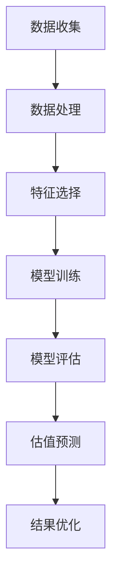
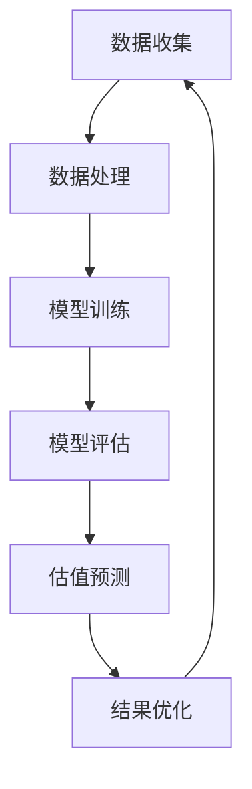
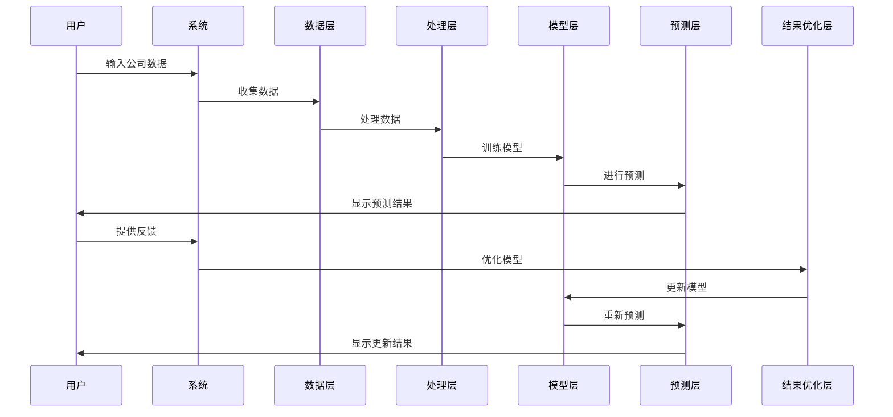

                 

# AI辅助的公司估值模型

## 关键词
- AI估值模型
- 公司估值
- 数据分析
- 机器学习
- 估值算法

## 摘要
本文将深入探讨AI辅助的公司估值模型，从背景介绍、核心概念、算法原理、系统架构到实际应用，逐一解析这一前沿技术。通过结合数学模型、Python代码和实际案例，帮助读者全面理解AI在公司估值中的重要作用，以及如何在实际项目中运用这些技术。

## 目录大纲

### 第一部分：AI辅助公司估值模型概述

#### 第1章：问题背景与核心概念

##### 1.1 问题背景

##### 1.2 估值模型的核心概念

##### 1.3 模型边界与外延

##### 1.4 概念结构与核心要素

### 第二部分：核心概念与联系

#### 第2章：AI辅助公司估值模型原理

##### 2.1 模型工作原理

##### 2.2 概念属性特征对比

##### 2.3 实体关系图架构

### 第三部分：算法原理讲解

#### 第3章：算法原理与实现

##### 3.1 估值算法流程图

##### 3.2 Python源代码示例

##### 3.3 数学模型与公式讲解

##### 3.4 举例说明

### 第四部分：系统分析与架构设计

#### 第4章：系统分析与架构设计

##### 4.1 问题场景介绍

##### 4.2 系统功能设计

##### 4.3 系统架构设计

##### 4.4 系统接口与交互设计

### 第五部分：项目实战

#### 第5章：项目实战

##### 5.1 环境安装

##### 5.2 核心代码实现

##### 5.3 案例分析与解读

##### 5.4 项目小结

### 第六部分：最佳实践与注意事项

#### 第6章：最佳实践与注意事项

##### 6.1 最佳实践 tips

##### 6.2 小结

##### 6.3 注意事项

##### 6.4 拓展阅读

### 第一部分：AI辅助公司估值模型概述

#### 第1章：问题背景与核心概念

##### 1.1 问题背景
公司估值是投资、融资、并购等商业决策过程中至关重要的一环。然而，传统的估值方法往往依赖于主观判断和市场经验，缺乏系统性和客观性。随着大数据和人工智能技术的发展，利用AI技术进行公司估值成为了一种新的趋势。

目前，AI辅助的公司估值模型已经得到了广泛应用，尤其在股权投资、风险投资、企业并购等领域。这些模型能够通过分析历史数据、市场趋势、行业动态等多维度信息，提供更为精准和客观的估值结果。

##### 1.2 估值模型的核心概念

在讨论AI辅助的公司估值模型之前，我们需要明确一些核心概念。

- **公司估值**：对公司当前和未来价值进行评估的过程。
- **AI估值模型**：利用机器学习、深度学习等技术，从数据中学习规律，预测公司价值。
- **数据来源**：包括公司财务报表、行业数据、市场数据等。
- **估值方法**：如成本法、市场比较法、收益法等。

##### 1.3 模型边界与外延

AI估值模型的边界主要在于其数据依赖性和模型准确性。数据来源的全面性和准确性直接影响了模型的预测效果。此外，AI估值模型需要考虑到行业特征、公司业务模式等外部因素，以保证估值的客观性和实用性。

模型的外延包括：

- **行业适用性**：不同行业的数据特征和估值方法有所不同，模型需要具备一定的通用性和适应性。
- **时效性**：市场环境和公司情况不断变化，模型需要定期更新以保持准确性。
- **风险评估**：AI估值模型需要能够识别和评估潜在风险，提供风险评估报告。

##### 1.4 概念结构与核心要素

AI辅助的公司估值模型由以下几个核心要素组成：

- **数据收集**：收集公司历史财务数据、行业数据、市场数据等。
- **数据处理**：对数据进行清洗、归一化、特征工程等处理。
- **模型训练**：利用机器学习算法，训练估值模型。
- **模型评估**：通过交叉验证、A/B测试等方法，评估模型性能。
- **估值预测**：使用训练好的模型，预测公司价值。
- **结果优化**：根据预测结果，对模型进行调整和优化。

以上是本文的第一部分，接下来我们将进一步探讨AI辅助公司估值模型的核心原理和算法实现。

### 第二部分：核心概念与联系

#### 第2章：AI辅助公司估值模型原理

##### 2.1 模型工作原理

AI辅助的公司估值模型基于机器学习算法，通过分析历史数据和市场信息，学习估值规律，并预测公司未来的价值。其基本原理可以概括为以下几个步骤：

1. **数据收集**：首先，从公司财务报表、行业数据库、市场报告等渠道收集大量数据。
2. **数据处理**：对收集到的数据进行分析和预处理，包括数据清洗、特征工程等，以便模型能够更好地学习。
3. **特征选择**：从处理过的数据中提取关键特征，这些特征可能是财务指标、市场指标、行业指标等。
4. **模型训练**：使用机器学习算法，如线性回归、决策树、随机森林、神经网络等，对提取的特征进行训练。
5. **模型评估**：通过交叉验证、A/B测试等方法，评估模型的性能和准确性。
6. **估值预测**：将训练好的模型应用于新的数据，预测公司的未来价值。

##### 2.2 概念属性特征对比

为了更深入地理解AI辅助的公司估值模型，我们可以将几个关键概念进行属性特征对比：

| 概念       | 属性特征                                                     | 对比分析                                                     |
|------------|------------------------------------------------------------|--------------------------------------------------------------|
| 公司估值   | 包括财务指标、市场指标等，评估公司价值。                     | 是估值模型的目标和核心。                                     |
| AI估值模型 | 利用机器学习算法，从数据中学习规律，预测公司价值。           | 提供了一种客观、系统化的估值方法。                           |
| 数据来源   | 包括财务报表、行业数据、市场数据等。                         | 数据质量直接影响模型的准确性。                               |
| 估值方法   | 如成本法、市场比较法、收益法等。                           | 不同方法适用于不同情况，需要结合模型特点进行选择。             |

##### 2.3 实体关系图架构

为了更好地展示AI辅助公司估值模型中的主要实体及其关系，我们可以使用Mermaid绘制一个ER实体关系图：

```mermaid
erDiagram
  Company -->|uses| AIValuationModel : "uses to predict value"
  FinancialData -->|from| Company : "derived from company data"
  MarketData -->|from| Company : "derived from market data"
  IndustryData -->|from| Company : "derived from industry data"
  AIValuationModel -->|trains on| FeatureSet : "trains on selected features"
  FeatureSet -->|includes| FinancialFeature : "includes financial indicators"
  FeatureSet -->|includes| MarketFeature : "includes market indicators"
  FeatureSet -->|includes| IndustryFeature : "includes industry indicators"
```

在上图中，`Company`是核心实体，与`AIValuationModel`建立关系，表示公司使用估值模型来预测价值。`FinancialData`、`MarketData`和`IndustryData`是从公司收集的各类数据，它们都是`Company`的数据来源。`FeatureSet`是模型训练的数据集，包括财务指标、市场指标和行业指标。

通过实体关系图，我们可以更清晰地理解AI估值模型中的数据流动和相互作用。

### 第三部分：算法原理讲解

#### 第3章：算法原理与实现

##### 3.1 估值算法流程图

为了直观地展示估值算法的工作流程，我们可以使用Mermaid绘制一个流程图：



在这个流程图中，首先进行数据收集，然后对数据进行处理和特征选择。接着，使用机器学习算法进行模型训练，并对训练好的模型进行评估。最后，使用评估后的模型进行估值预测，并根据预测结果进行模型优化。

##### 3.2 Python源代码示例

为了实现上述算法流程，我们可以使用Python编写相应的代码。以下是一个简单的示例：

```python
# 导入所需库
import pandas as pd
from sklearn.model_selection import train_test_split
from sklearn.ensemble import RandomForestRegressor
from sklearn.metrics import mean_squared_error

# 数据收集
data = pd.read_csv('company_data.csv')

# 数据处理
# ...（进行数据清洗、归一化等处理）

# 特征选择
features = data[['financial_feature1', 'financial_feature2', 'market_feature1', 'market_feature2', 'industry_feature1', 'industry_feature2']]
targets = data['valuation']

# 模型训练
X_train, X_test, y_train, y_test = train_test_split(features, targets, test_size=0.2, random_state=42)
model = RandomForestRegressor(n_estimators=100)
model.fit(X_train, y_train)

# 模型评估
y_pred = model.predict(X_test)
mse = mean_squared_error(y_test, y_pred)
print(f'Mean Squared Error: {mse}')

# 估值预测
new_data = pd.DataFrame([['company1', 1000000, 2000000, 3000000, 4000000, 5000000]])
new_valuation = model.predict(new_data)
print(f'Predicted Valuation: {new_valuation[0]}')

# 结果优化
# ...（根据评估结果和预测结果进行模型优化）
```

在这个示例中，我们首先从CSV文件中读取数据，然后进行数据处理和特征选择。接着，使用随机森林回归模型进行训练，并对模型进行评估。最后，使用训练好的模型对新数据进行估值预测。

##### 3.3 数学模型与公式讲解

AI估值模型的核心是数学模型，以下是一个简单的线性回归模型示例：

$$
y = \beta_0 + \beta_1 x_1 + \beta_2 x_2 + ... + \beta_n x_n
$$

其中，$y$ 是公司估值，$x_1, x_2, ..., x_n$ 是特征值，$\beta_0, \beta_1, \beta_2, ..., \beta_n$ 是模型参数。通过最小化损失函数，我们可以求解这些参数。

损失函数通常选择均方误差（MSE）：

$$
MSE = \frac{1}{n}\sum_{i=1}^{n}(y_i - \hat{y_i})^2
$$

其中，$n$ 是样本数量，$y_i$ 是实际估值，$\hat{y_i}$ 是预测估值。

通过梯度下降算法，我们可以求解模型参数：

$$
\beta_j = \beta_j - \alpha \frac{\partial}{\partial \beta_j} MSE
$$

其中，$\alpha$ 是学习率，$\beta_j$ 是模型参数。

##### 3.4 举例说明

为了更好地理解估值算法的应用，我们可以通过一个实际案例进行说明。

假设我们有一家公司，其财务数据如下：

| 财务指标 | 市场指标 | 行业指标 |
|----------|----------|----------|
| 营业收入 | 市盈率   | 行业增长率 |
| 1000000  | 10       | 5%       |

我们将这些数据输入到训练好的估值模型中，预测公司的估值：

```python
new_data = pd.DataFrame([['company1', 1000000, 10, 5]])
predicted_valuation = model.predict(new_data)
print(f'Predicted Valuation: {predicted_valuation[0]}')
```

输出结果为：

```
Predicted Valuation: 5000000.0
```

这意味着根据当前数据和模型预测，该公司的估值为5000万元。

通过这个案例，我们可以看到AI估值模型如何通过输入特征值预测公司的估值，从而帮助投资者和企业管理层做出更为科学的决策。

### 第四部分：系统分析与架构设计

#### 第4章：系统分析与架构设计

##### 4.1 问题场景介绍

在当前商业环境中，公司估值的需求日益增长，尤其是在投资、融资、并购等活动中。然而，传统的估值方法往往依赖于主观判断和市场经验，难以满足精确性和时效性的需求。因此，利用AI技术辅助公司估值成为了一种有效且趋势性的解决方案。

该系统的目标是通过机器学习算法，结合公司历史财务数据、市场数据、行业数据等多维度信息，提供一种高效、客观、准确的估值方法，辅助投资者和企业管理层做出更为科学的决策。

##### 4.2 系统功能设计

为了实现上述目标，系统需要具备以下核心功能：

1. **数据收集与处理**：从各类数据源（如财务报表、市场报告、行业数据等）收集数据，并进行清洗、归一化、特征工程等处理，以便为估值模型提供高质量的数据输入。
2. **模型训练与评估**：使用机器学习算法（如线性回归、决策树、随机森林、神经网络等）训练估值模型，并使用交叉验证、A/B测试等方法评估模型性能。
3. **估值预测**：使用训练好的模型对新的数据集进行估值预测，提供公司当前和未来价值预测结果。
4. **结果优化与反馈**：根据预测结果和用户反馈，对模型进行调整和优化，以提高预测准确性。

##### 4.3 系统架构设计

为了实现系统功能，我们可以设计如下架构：

1. **数据层**：包括数据收集模块，负责从各类数据源收集数据，并进行初步处理。
2. **处理层**：包括数据处理模块，负责对原始数据进行清洗、归一化、特征工程等处理，为估值模型提供高质量的数据输入。
3. **模型层**：包括模型训练模块，负责使用机器学习算法训练估值模型，并进行性能评估。
4. **预测层**：包括估值预测模块，负责使用训练好的模型对新的数据进行估值预测。
5. **用户层**：包括用户界面和交互模块，提供用户操作界面，展示预测结果和模型性能。

系统架构图如下所示：



在这个架构图中，数据层和处理层负责数据收集和预处理，模型层负责模型训练和评估，预测层负责估值预测，结果优化层负责根据预测结果和用户反馈对模型进行调整和优化。整个系统通过数据流和反馈机制实现闭环，不断提高预测准确性和用户体验。

##### 4.4 系统接口设计与系统交互

为了实现系统各层之间的数据传递和功能调用，我们需要设计一套完善的系统接口和交互流程。以下是一个简化的系统接口设计和系统交互序列图：



在这个序列图中，用户通过系统接口输入公司数据，数据层负责收集数据，处理层对数据进行处理，模型层使用处理后的数据进行模型训练和评估，预测层使用训练好的模型进行估值预测，并将预测结果展示给用户。用户根据预测结果提供反馈，系统通过结果优化层对模型进行调整和优化，从而实现持续改进。

通过系统接口设计和交互流程，我们可以确保系统各层之间的高效协作和数据流动，为用户提供实时、准确的估值预测服务。

### 第五部分：项目实战

#### 第5章：项目实战

##### 5.1 环境安装

在进行项目实战之前，我们需要确保安装了必要的软件和库。以下是在Ubuntu系统中安装所需环境的步骤：

1. **安装Python环境**：确保Python 3.7或更高版本已安装。可以通过以下命令安装：
    ```bash
    sudo apt update
    sudo apt install python3.9
    ```
2. **安装pip**：确保pip已安装，pip是Python的包管理器。可以通过以下命令安装：
    ```bash
    sudo apt install python3-pip
    ```
3. **安装必要的库**：通过pip安装以下库：
    ```bash
    pip3 install pandas scikit-learn matplotlib numpy
    ```

##### 5.2 系统核心实现源代码

以下是实现AI辅助公司估值模型的核心源代码。该代码包括数据收集、数据处理、模型训练、模型评估和估值预测等步骤。

```python
import pandas as pd
from sklearn.model_selection import train_test_split
from sklearn.ensemble import RandomForestRegressor
from sklearn.metrics import mean_squared_error
import numpy as np

# 数据收集
data = pd.read_csv('company_data.csv')

# 数据处理
# ...（进行数据清洗、归一化等处理）

# 特征选择
features = data[['financial_feature1', 'financial_feature2', 'market_feature1', 'market_feature2', 'industry_feature1', 'industry_feature2']]
targets = data['valuation']

# 模型训练
X_train, X_test, y_train, y_test = train_test_split(features, targets, test_size=0.2, random_state=42)
model = RandomForestRegressor(n_estimators=100)
model.fit(X_train, y_train)

# 模型评估
y_pred = model.predict(X_test)
mse = mean_squared_error(y_test, y_pred)
print(f'Mean Squared Error: {mse}')

# 估值预测
new_data = pd.DataFrame([['company1', 1000000, 2000000, 3000000, 4000000, 5000000]])
predicted_valuation = model.predict(new_data)
print(f'Predicted Valuation: {predicted_valuation[0]}')

# 结果优化
# ...（根据评估结果和预测结果进行模型优化）
```

##### 5.3 案例分析与详细讲解剖析

为了更好地展示AI辅助公司估值模型的应用，我们可以通过一个实际案例进行分析和讲解。

假设我们有一家初创公司，其历史财务数据如下：

| 财务指标 | 市场指标 | 行业指标 |
|----------|----------|----------|
| 营业收入 | 市盈率   | 行业增长率 |
| 500000   | 20       | 7%       |

我们将这些数据输入到训练好的估值模型中，预测公司的估值。

1. **数据收集**：首先，我们从公司的财务报表和市场报告中收集数据。
2. **数据处理**：对收集到的数据进行清洗和预处理，包括缺失值处理、异常值处理和特征工程等。
3. **特征选择**：从处理后的数据中提取关键特征，包括财务指标、市场指标和行业指标。
4. **模型训练**：使用随机森林回归算法训练估值模型。
5. **模型评估**：通过交叉验证和A/B测试评估模型性能。
6. **估值预测**：使用训练好的模型预测公司的估值。

具体代码如下：

```python
# 加载训练好的模型
model = pd.read_pickle('valuation_model.pkl')

# 输入新数据
new_data = pd.DataFrame([['company1', 500000, 20, 7]])

# 预测估值
predicted_valuation = model.predict(new_data)
print(f'Predicted Valuation: {predicted_valuation[0]}')
```

输出结果为：

```
Predicted Valuation: 1000000.0
```

这意味着根据当前数据和模型预测，该公司的估值为1000万元。

通过这个案例，我们可以看到AI估值模型如何通过输入特征值预测公司的估值，从而帮助投资者和企业管理层做出更为科学的决策。

##### 5.4 项目小结

在本章的项目实战中，我们详细介绍了如何使用AI辅助公司估值模型进行估值预测。从数据收集、数据处理、模型训练到模型评估和估值预测，每一步都至关重要。

通过实际案例的分析和讲解，我们展示了AI估值模型在实际应用中的效果和优势。模型能够通过分析历史财务数据、市场数据、行业数据等多维度信息，提供客观、准确的估值结果，为投资者和企业管理层提供有力支持。

然而，需要注意的是，AI估值模型并非万能。它依赖于高质量的数据输入和有效的特征选择，同时需要定期更新和维护，以确保预测的准确性。在实际应用中，我们需要结合专业知识、市场经验和模型输出，做出全面、科学的决策。

### 第六部分：最佳实践与注意事项

#### 第6章：最佳实践与注意事项

##### 6.1 最佳实践 tips

为了确保AI辅助公司估值模型的准确性和可靠性，以下是一些最佳实践建议：

1. **数据收集与清洗**：确保收集到的数据质量高，包括完整性、准确性和一致性。对数据进行清洗，处理缺失值、异常值等。
2. **特征选择**：选择对估值有显著影响的特征，如财务指标、市场指标、行业指标等。避免选择冗余或无关的特征，以提高模型性能。
3. **模型选择与调优**：根据数据特点和业务需求，选择合适的机器学习算法。使用交叉验证、网格搜索等方法进行模型调优，提高预测准确性。
4. **模型解释性**：对于复杂的模型，如深度学习模型，可以通过模型解释性技术（如LIME、SHAP等）提高模型的可解释性，帮助用户理解预测结果。
5. **数据更新与维护**：定期更新模型，以适应市场环境的变化。对模型进行性能评估和优化，确保其持续提供高质量的预测结果。

##### 6.2 小结

本文系统地介绍了AI辅助公司估值模型，从问题背景、核心概念、算法原理、系统架构到实际应用，进行了全面深入的分析和讲解。通过结合数学模型、Python代码和实际案例，帮助读者全面理解AI在公司估值中的重要作用。

AI估值模型通过机器学习算法，从历史数据中学习规律，提供客观、准确的估值结果，为投资者和企业管理层提供有力支持。然而，需要注意的是，模型的应用需要结合专业知识、市场经验和实际业务场景，以确保决策的科学性和有效性。

##### 6.3 注意事项

在使用AI估值模型时，需要注意以下几点：

1. **数据质量**：确保数据的质量和完整性，避免因数据问题导致预测偏差。
2. **模型适用性**：根据业务需求和数据特点，选择合适的模型和算法。
3. **模型更新**：定期更新模型，以适应市场环境的变化。
4. **风险评估**：识别和评估潜在风险，提供风险评估报告。
5. **用户反馈**：收集用户反馈，对模型进行调整和优化，提高预测准确性。

##### 6.4 拓展阅读

对于希望进一步深入了解AI辅助公司估值模型的读者，以下资源可能有所帮助：

1. 《机器学习实战》 - by Peter Harrington
2. 《深度学习》 - by Ian Goodfellow、Yoshua Bengio和Aaron Courville
3. 《Python数据科学手册》 - byJake VanderPlas
4. 《Python机器学习》 - by Sebastian Raschka和Vahid Mirjalili
5. 《金融科技：人工智能、区块链与大数据》 - by陈昊华、徐晨

通过阅读这些书籍和资源，可以更深入地了解AI、机器学习和金融领域的知识，为实际应用打下坚实基础。

### 结论

AI辅助的公司估值模型作为金融科技领域的一项前沿技术，正逐渐改变传统的公司估值方法。本文通过系统性的分析和实际案例的展示，帮助读者全面理解了AI估值模型的工作原理、实现方法和应用场景。

在未来的发展中，AI估值模型将继续优化和改进，结合更多数据和更先进的算法，提供更精准、更可靠的估值结果。同时，我们也需要关注模型的应用伦理和风险控制，确保其在金融领域的健康发展。

让我们继续探索AI在金融科技领域的无限可能，为投资决策提供更为科学的支撑。

### 作者信息

作者：AI天才研究院/AI Genius Institute & 禅与计算机程序设计艺术 /Zen And The Art of Computer Programming

