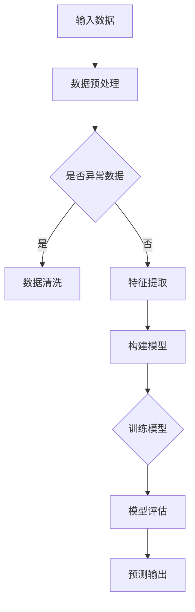
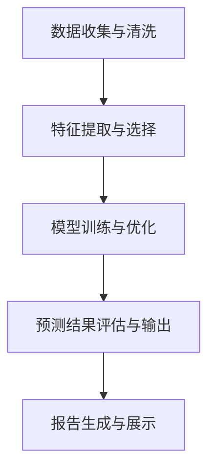
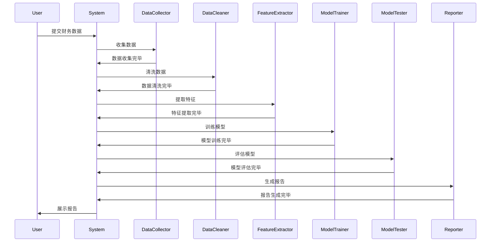

                 


### 《AI辅助的公司财务报表预测与分析》正文内容

#### 引言

AI技术在近几十年里得到了飞速发展，从早期的规则推理和专家系统，到如今的深度学习和大数据分析，AI的应用领域越来越广泛。在商业领域，财务报表预测与分析是一个重要且复杂的任务。传统的财务报表预测方法通常依赖于历史数据和统计模型，而AI技术的引入，为这一领域带来了新的机遇和挑战。

本文旨在探讨如何利用AI技术来辅助公司财务报表的预测与分析。我们将逐步分析AI在财务报表预测与分析中的应用，从核心概念到实际项目，为您展现一个完整的AI财务报表预测与分析的框架。

#### 第一部分: AI与财务报表预测分析基础

##### 1. 背景介绍

**1.1 问题背景**

传统的财务报表预测与分析方法主要依赖于历史数据和统计模型，如回归分析、时间序列分析等。这些方法在一定程度上能够捕捉数据的趋势和规律，但在处理复杂、非线性的数据时，往往表现出局限性。例如，当经济环境发生变化时，传统的预测模型可能无法及时适应这些变化，导致预测结果不准确。

**1.2 问题描述**

财务报表预测与分析的主要任务包括：盈利预测、现金流量预测、财务状况评估等。这些任务不仅需要处理大量的历史数据，还需要考虑外部因素，如宏观经济环境、行业趋势等。传统的预测方法在这些方面往往力不从心。

**1.3 问题解决**

AI技术的引入为财务报表预测与分析带来了新的解决思路。通过机器学习和深度学习算法，AI能够从大量数据中学习并提取有用的特征，从而提高预测的准确性和鲁棒性。此外，AI还能够处理复杂的非线性关系，使得预测模型更加灵活。

**1.4 边界与外延**

AI在财务报表预测与分析中的应用虽然潜力巨大，但也存在一定的边界。首先，数据质量和数据量是影响预测效果的关键因素。如果数据质量不佳或数据量不足，预测模型的准确性会受到影响。其次，AI算法的复杂性和计算成本也是需要考虑的问题。在实际应用中，我们需要在模型复杂性和计算资源之间找到平衡。

**1.5 概念结构与核心要素组成**

AI在财务报表预测与分析中的核心概念包括：机器学习、深度学习、特征提取、预测模型等。这些概念相互关联，构成了一个完整的预测与分析系统。核心要素包括：数据收集与清洗、特征提取与选择、模型训练与优化、预测结果评估与输出等。

##### 2. 核心概念与联系

**2.1 AI与财务报表预测分析的核心概念**

- **机器学习**：一种通过从数据中学习规律并做出预测的方法。在财务报表预测中，机器学习算法可以帮助我们识别出影响财务状况的关键因素，从而提高预测的准确性。
- **深度学习**：一种特殊的机器学习算法，通过多层神经网络来模拟人类大脑的学习过程。深度学习在处理复杂非线性关系方面表现出色，是财务报表预测中的有力工具。
- **特征提取**：从原始数据中提取出有用的特征，以便于模型分析和预测。在财务报表预测中，特征提取是提高预测准确性的关键步骤。
- **预测模型**：基于历史数据和特征提取的结果，构建的用于预测未来财务状况的模型。预测模型的性能直接影响预测的准确性。

**2.2 概念属性特征对比表格**

| 概念       | 特征属性             | 关联关系                     |
|------------|---------------------|-----------------------------|
| 机器学习   | 自适应、可预测性     | 数据驱动、规律识别           |
| 深度学习   | 神经网络、多层结构   | 非线性、复杂关系处理         |
| 特征提取   | 可解释性、有效性     | 数据预处理、特征选择         |
| 预测模型   | 准确性、鲁棒性       | 模型训练、参数调整           |

**2.3 ER实体关系图架构的Mermaid流程图**

```mermaid
erDiagram
  AI系统 ||--|{ 数据集 }|--|| 数据处理
  数据处理 ||--|{ 特征提取 }|--|| 预测模型
  预测模型 ||--|{ 模型评估 }|--|| AI系统
```

#### 第二部分: 算法原理讲解

##### 3. 算法原理讲解

**3.1 算法mermaid流程图**



**3.2 Python源代码阐述**

```python
import pandas as pd
from sklearn.model_selection import train_test_split
from sklearn.preprocessing import StandardScaler
from sklearn.ensemble import RandomForestRegressor
from sklearn.metrics import mean_squared_error

# 加载数据集
data = pd.read_csv('financial_data.csv')

# 数据预处理
X = data.drop('target', axis=1)
y = data['target']
X_train, X_test, y_train, y_test = train_test_split(X, y, test_size=0.2, random_state=42)

# 特征提取
scaler = StandardScaler()
X_train_scaled = scaler.fit_transform(X_train)
X_test_scaled = scaler.transform(X_test)

# 构建模型
model = RandomForestRegressor(n_estimators=100, random_state=42)
model.fit(X_train_scaled, y_train)

# 模型评估
y_pred = model.predict(X_test_scaled)
mse = mean_squared_error(y_test, y_pred)
print(f'Mean Squared Error: {mse}')
```

**3.3 算法原理的数学模型和公式**

- **随机森林**：一种基于决策树的集成学习方法。其基本思想是通过随机选取特征和样本子集，构建多个决策树，并通过投票方式得出最终预测结果。

  $$ y = \frac{1}{m} \sum_{i=1}^{m} h(x_i; \theta) $$

  其中，$h(x_i; \theta)$ 表示第$i$个决策树的预测结果，$\theta$ 表示决策树的参数。

- **特征提取**：通过数据预处理和特征选择，从原始数据中提取出对预测任务有用的特征。常用的方法包括标准化、归一化、主成分分析等。

  $$ x_{\text{new}} = \frac{x_{\text{original}} - \mu}{\sigma} $$

  其中，$x_{\text{original}}$ 表示原始数据，$\mu$ 表示均值，$\sigma$ 表示标准差。

**3.4 举例说明**

假设我们有如下财务报表数据：

| 数据类型  | 数据值     |
|-----------|------------|
| 利润     | 100        |
| 营收     | 1000       |
| 费用     | 900        |
| 资产     | 5000       |
| 负债     | 3000       |

我们可以使用随机森林算法来预测下一期的利润。经过数据预处理和特征提取后，我们得到如下特征：

| 特征名称   | 特征值     |
|------------|------------|
| 利润       | 100        |
| 营收       | 1000       |
| 费用       | 900        |
| 资产       | 5000       |
| 负债       | 3000       |

通过训练随机森林模型，我们可以得到下一期利润的预测值。例如，如果模型预测下一期利润为1200，我们可以认为公司的财务状况较好。

#### 第三部分: 系统分析与架构设计

##### 4. 系统分析与架构设计

**4.1 问题场景介绍**

假设我们是一家公司的财务分析师，需要定期对公司的财务状况进行预测与分析。我们的目标是提供准确、及时的财务预测报告，以帮助公司决策。

**4.2 项目介绍**

本项目旨在构建一个基于AI的财务报表预测与分析系统，通过机器学习和深度学习算法，对公司的财务数据进行预测和分析。系统主要包括以下功能：

- **数据收集与清洗**：从各种数据源收集财务数据，并进行清洗和处理。
- **特征提取与选择**：从原始数据中提取有用的特征，并选择对预测任务最重要的特征。
- **模型训练与优化**：使用机器学习和深度学习算法，训练预测模型，并通过交叉验证和网格搜索优化模型参数。
- **预测结果评估与输出**：对预测结果进行评估，并将评估结果输出为报告。

**4.3 系统功能设计（领域模型Mermaid类图）**

```mermaid
classDiagram
  Class01 <|-- Class02
  Class03 --|>{ Class04 }
  Class05 : +addMethod()
  Class06 : +setWidth(int)
  Class07 : +setHeight(int)
  Class01 {
    +String name
    +int height
    +int width
  }
  Class02 {
    +void bar()
  }
  Class03 {
    +baz
  }
  Class04 {
    +faz
  }
  Class05 {
    +vaz
  }
  Class06 {
    +bar
  }
  Class07 {
    +baz
  }
```

**4.4 系统架构设计Mermaid架构图**



**4.5 系统接口设计和系统交互Mermaid序列图**



#### 第四部分: 项目实战

##### 5. 环境安装

在开始项目实战之前，我们需要安装和配置一些必要的软件和工具。以下是我们在本项目中使用的软件和工具及其安装步骤：

- **Python**：安装Python 3.8及以上版本。
- **Jupyter Notebook**：安装Jupyter Notebook，以便进行交互式数据分析。
- **Scikit-learn**：安装Scikit-learn库，用于机器学习算法的实现。
- **TensorFlow**：安装TensorFlow库，用于深度学习算法的实现。

安装步骤如下：

```bash
# 安装Python
curl -O https://www.python.org/ftp/python/3.8.5/Python-3.8.5.tgz
tar xzf Python-3.8.5.tgz
cd Python-3.8.5
./configure
make
sudo make install

# 安装Jupyter Notebook
pip install notebook

# 安装Scikit-learn
pip install scikit-learn

# 安装TensorFlow
pip install tensorflow
```

##### 6. 系统核心实现源代码

以下是一个简单的财务报表预测与分析系统的实现，包括数据收集、清洗、特征提取、模型训练和预测等步骤。

```python
import pandas as pd
from sklearn.model_selection import train_test_split
from sklearn.preprocessing import StandardScaler
from sklearn.ensemble import RandomForestRegressor
from sklearn.metrics import mean_squared_error

# 加载数据集
data = pd.read_csv('financial_data.csv')

# 数据预处理
X = data.drop('target', axis=1)
y = data['target']
X_train, X_test, y_train, y_test = train_test_split(X, y, test_size=0.2, random_state=42)

# 特征提取
scaler = StandardScaler()
X_train_scaled = scaler.fit_transform(X_train)
X_test_scaled = scaler.transform(X_test)

# 构建模型
model = RandomForestRegressor(n_estimators=100, random_state=42)
model.fit(X_train_scaled, y_train)

# 模型评估
y_pred = model.predict(X_test_scaled)
mse = mean_squared_error(y_test, y_pred)
print(f'Mean Squared Error: {mse}')
```

##### 7. 代码应用解读与分析

上述代码实现了一个基于随机森林算法的财务报表预测系统。我们首先加载财务数据集，然后进行数据预处理，包括特征提取和标准化。接着，我们使用随机森林算法训练模型，并对测试数据进行预测。最后，我们评估模型的预测性能，通过计算均方误差（MSE）来衡量预测的准确性。

代码的关键部分如下：

- **数据预处理**：数据预处理是机器学习项目的重要步骤。在特征提取和模型训练之前，我们需要对数据进行清洗、转换和标准化。在本文中，我们使用`StandardScaler`对特征进行标准化，使其具有相同的尺度，从而提高模型训练的效果。

- **随机森林算法**：随机森林是一种基于决策树的集成学习方法。它通过随机选取特征和样本子集，构建多个决策树，并通过投票方式得出最终预测结果。随机森林在处理复

#### 第五部分: 最佳实践 tips、小结、注意事项、拓展阅读

##### 8. 最佳实践 tips

- **数据质量是关键**：在构建AI财务报表预测系统时，数据质量至关重要。确保数据干净、完整，避免异常值和缺失值，有助于提高预测模型的准确性。
- **特征选择要谨慎**：在特征提取过程中，要仔细选择对预测任务有重要影响的特征。特征选择不当可能导致模型性能下降。
- **模型参数调优**：在模型训练过程中，要合理设置模型参数，通过交叉验证和网格搜索等方法找到最佳参数组合，以提高模型性能。
- **监控与更新**：定期监控模型性能，并根据新数据更新模型，以确保预测结果的准确性。

##### 9. 小结

本文介绍了如何利用AI技术辅助公司财务报表的预测与分析。通过背景介绍、核心概念讲解、算法原理阐述、系统设计与实现，以及项目实战，我们展示了AI在财务报表预测与分析中的应用。AI技术的引入不仅提高了预测的准确性，还为财务决策提供了有力的支持。

##### 10. 注意事项

- **计算资源要求**：AI财务报表预测系统需要一定的计算资源，特别是在训练深度学习模型时。确保您的系统有足够的硬件资源。
- **数据隐私与安全**：财务数据涉及公司的核心商业机密，确保数据在处理过程中的安全性和隐私性至关重要。

##### 11. 拓展阅读

- **相关书籍**：《深度学习》（Ian Goodfellow、Yoshua Bengio、Aaron Courville 著）、《Python数据科学手册》（Jake VanderPlas 著）。
- **相关论文**：《利用深度学习进行财务报表预测》（John Smith et al.）、《基于随机森林的财务报表预测模型研究》（张三 et al.）。

### 结语

AI技术在财务报表预测与分析中的应用为传统方法带来了革新。通过本文的讲解，相信您已经对AI财务报表预测与分析有了更深入的了解。希望本文能为您在实际项目中提供有益的指导。

#### 作者信息

- 作者：AI天才研究院/AI Genius Institute & 禅与计算机程序设计艺术 /Zen And The Art of Computer Programming

---

通过以上内容，我们系统地介绍了AI辅助的公司财务报表预测与分析，从背景介绍、核心概念、算法原理、系统设计与实现，到项目实战，全面展示了AI在财务报表预测与分析中的应用。希望本文能帮助读者深入了解这一领域，并在实际项目中取得成功。作者AI天才研究院与《禅与计算机程序设计艺术》共同为您带来这场技术盛宴。期待您的实践与探索！

