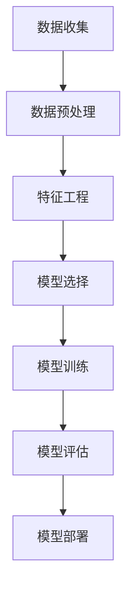
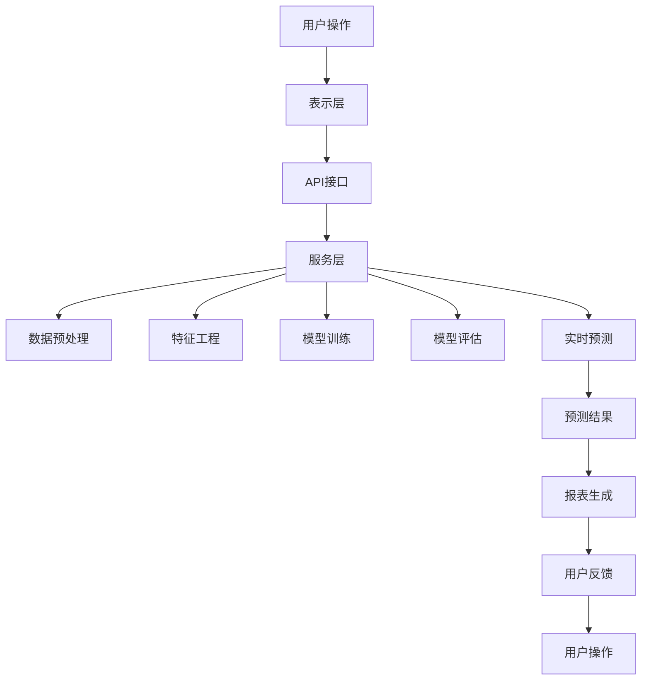

                 

# AI辅助的公司财务报表预测模型

关键词：人工智能、财务报表、预测模型、数据预处理、模型评估

摘要：本文探讨了AI辅助公司财务报表预测模型的设计、实现与应用。通过分析财务报表的重要性，介绍AI和预测模型的基本概念，详细阐述了AI辅助财务报表预测模型的原理、系统架构、数据预处理、模型构建与优化、案例分析以及应用场景与挑战。文章旨在为财务专业人士提供实用的AI工具和方法，以提升财务报表分析的准确性和效率。

## 目录大纲

1. 第1章: AI与公司财务报表概述
    1.1 问题背景
        1.1.1 财务报表在企业管理中的重要性
        1.1.2 传统的财务报表分析方法
        1.1.3 人工智能在财务报表分析中的应用潜力
    1.2 核心概念
        1.2.1 AI的定义与基本原理
        1.2.2 财务报表预测模型的基本概念
        1.2.3 关键技术与算法
    1.3 模型原理与数学模型
        1.3.1 AI辅助的财务报表预测模型原理
        1.3.2 相关数学公式与模型构建
        1.3.3 算法流程图展示
    1.4 系统架构设计
        1.4.1 系统功能设计
        1.4.2 系统架构设计
        1.4.3 系统接口设计
        1.4.4 系统交互流程图
    1.5 案例分析
        1.5.1 案例背景与数据来源
        1.5.2 模型实现与运行结果
        1.5.3 模型评价与改进建议
    1.6 本章小结

2. 第2章: AI辅助财务报表预测模型的构建
    2.1 数据预处理
        2.1.1 数据收集与整理
        2.1.2 特征工程
        2.1.3 数据可视化
    2.2 模型选择与训练
        2.2.1 常见预测模型介绍
        2.2.2 模型选择方法
        2.2.3 模型训练与调优
    2.3 模型评估与优化
        2.3.1 评估指标与方法
        2.3.2 模型优化策略
        2.3.3 模型稳定性分析
    2.4 特征重要性分析
        2.4.1 特征选择方法
        2.4.2 特征重要性分析结果
        2.4.3 特征优化策略
    2.5 模型部署与维护
        2.5.1 模型部署流程
        2.5.2 模型维护策略
        2.5.3 模型更新策略
    2.6 本章小结

3. 第3章: 案例研究：AI辅助的公司财务报表预测模型实践
    3.1 案例背景
        3.1.1 公司背景介绍
        3.1.2 预测目标与数据来源
    3.2 模型构建与训练
        3.2.1 数据预处理
        3.2.2 模型选择
        3.2.3 模型训练与调优
    3.3 模型评估与优化
        3.3.1 评估指标与方法
        3.3.2 优化策略与实践
        3.3.3 模型稳定性分析
    3.4 模型应用与效果分析
        3.4.1 模型在实际应用中的表现
        3.4.2 预测结果与实际结果对比
        3.4.3 模型改进措施
    3.5 模型部署与维护
        3.5.1 部署流程与实践
        3.5.2 维护策略与实践
        3.5.3 模型更新与优化
    3.6 案例总结
        3.6.1 模型的优势与不足
        3.6.2 启示与展望
        3.6.3 拓展应用
    3.7 本章小结

4. 第4章: AI辅助财务报表预测模型的应用场景与挑战
    4.1 应用场景
        4.1.1 财务预测与规划
        4.1.2 风险评估与管理
        4.1.3 成本控制与优化
        4.1.4 投资分析与决策
    4.2 挑战与问题
        4.2.1 数据质量问题
        4.2.2 模型解释性问题
        4.2.3 隐私保护与合规问题
        4.2.4 技术实现与挑战
    4.3 未来展望
        4.3.1 技术发展趋势
        4.3.2 行业应用前景
        4.3.3 政策与法规方向
    4.4 本章小结

------------------------------------------------------------------## 第1章: AI与公司财务报表概述

### 1.1 问题背景

#### 1.1.1 财务报表在企业管理中的重要性

财务报表是企业进行内部管理、外部沟通以及决策制定的重要工具。它不仅反映了企业的财务状况、经营成果和现金流量，还为投资者、债权人、监管机构和内部管理者提供了关键信息。在现代企业管理中，财务报表的作用主要体现在以下几个方面：

1. **决策支持**：财务报表为管理层提供了企业运营的财务数据，帮助他们做出更合理的战略决策。例如，通过对比财务报表中的收入、成本和利润数据，管理层可以评估业务部门的绩效，并据此调整资源配置。
2. **绩效评估**：财务报表为外部利益相关者提供了评估企业业绩的依据。投资者和债权人通过分析财务报表中的关键指标（如净利润、每股收益等），可以判断企业的盈利能力和偿债能力。
3. **合规报告**：财务报表是企业向政府机构、监管机构和股东等外部利益相关者披露财务信息的重要渠道。按照相关法规要求，企业需要定期编制和披露财务报表，以确保信息的透明度和合规性。

#### 1.1.2 传统的财务报表分析方法

传统的财务报表分析方法主要依赖于手工或简单的计算机工具，如Excel和会计软件。这些方法包括但不限于以下几种：

1. **比率分析**：通过计算财务报表中的各项比率（如流动比率、速动比率、资产负债率等），分析企业的财务健康状况和偿债能力。
2. **趋势分析**：比较不同时期的财务数据，分析企业财务状况的变化趋势和业务发展情况。
3. **比较分析**：将企业的财务数据与其他企业或行业平均水平进行比较，以评估企业在行业中的竞争地位。

尽管传统的财务报表分析方法在处理历史数据方面具有一定的优势，但它们也存在一些局限性：

1. **手工处理效率低**：传统的分析方法依赖于人工计算和录入，容易出错且效率低下。
2. **分析深度不足**：传统方法主要关注财务数据的表面现象，难以深入挖掘数据背后的潜在规律和趋势。
3. **响应速度慢**：在快速变化的市场环境中，传统的分析方法难以及时提供有效的决策支持。

#### 1.1.3 人工智能在财务报表分析中的应用潜力

随着人工智能技术的不断发展，利用AI进行财务报表分析逐渐成为一种趋势。人工智能在财务报表分析中的应用潜力主要体现在以下几个方面：

1. **自动化处理**：人工智能技术可以实现财务报表的自动化处理，从数据收集、整理到分析预测，大幅度提高工作效率。
2. **深度分析**：人工智能能够从大量历史数据中挖掘出隐藏的规律和趋势，为管理层提供更深入的决策支持。
3. **实时预测**：基于机器学习算法，AI可以实时分析财务数据，预测企业未来的财务状况，为管理层提供及时、准确的决策依据。
4. **智能化辅助**：人工智能可以作为财务分析师的智能助手，自动完成复杂的财务分析任务，减轻分析师的工作负担。

总之，随着AI技术的不断进步，利用AI辅助财务报表分析不仅能够提高数据分析的深度和广度，还能够提升决策的效率和质量，为企业的可持续发展提供有力支持。接下来的章节将深入探讨AI辅助财务报表预测模型的基本概念、原理、架构和具体实现方法。让我们一起来探索这一前沿领域吧！### 1.2 核心概念

#### 1.2.1 AI的定义与基本原理

人工智能（Artificial Intelligence，简称AI）是指通过计算机模拟人类智能的理论、方法和技术。AI旨在使计算机具备人类智能的一些特征，如感知、理解、推理、学习、决策等。AI的核心原理主要包括以下几个方面：

1. **机器学习（Machine Learning）**：机器学习是一种让计算机通过数据学习并做出预测或决策的技术。它利用统计学、概率论和优化理论等数学工具，从大量数据中提取特征，训练模型，并使模型能够对未知数据进行预测。常见的机器学习方法包括线性回归、决策树、支持向量机、神经网络等。

2. **深度学习（Deep Learning）**：深度学习是机器学习的一种重要分支，通过构建深度神经网络来模拟人脑的学习过程。深度学习在图像识别、语音识别、自然语言处理等领域取得了显著成果。其主要特点包括多层神经网络结构、自动特征提取和端到端的学习方式。

3. **强化学习（Reinforcement Learning）**：强化学习是一种通过与环境交互，不断学习最佳策略的机器学习方法。它通过奖励机制来引导模型进行学习，常见应用包括游戏AI、机器人控制等。

4. **自然语言处理（Natural Language Processing，简称NLP）**：自然语言处理是AI的一个重要分支，旨在使计算机理解和生成自然语言。NLP技术包括词法分析、句法分析、语义分析、语音识别等，应用场景包括机器翻译、情感分析、语音助手等。

#### 1.2.2 财务报表预测模型的基本概念

财务报表预测模型是一种基于历史财务数据和人工智能技术，预测企业未来财务状况的模型。其主要概念包括：

1. **时间序列分析（Time Series Analysis）**：时间序列分析是一种通过分析时间序列数据，提取时间依赖性和趋势性特征，预测未来数据的方法。常见的模型包括自回归模型（AR）、移动平均模型（MA）、自回归移动平均模型（ARMA）等。

2. **回归分析（Regression Analysis）**：回归分析是一种通过建立自变量和因变量之间的关系模型，预测因变量值的统计方法。常见的回归模型包括线性回归、多项式回归、逻辑回归等。

3. **神经网络（Neural Networks）**：神经网络是一种基于生物神经网络原理，通过多层神经元进行信息处理和传递的计算模型。神经网络在财务报表预测中具有强大的建模和预测能力，特别适用于处理非线性问题。

4. **集成学习（Ensemble Learning）**：集成学习是一种通过组合多个预测模型，提高整体预测性能的方法。常见的集成学习方法包括Bagging、Boosting和Stacking等。

#### 1.2.3 关键技术与算法

AI辅助财务报表预测模型的关键技术主要包括以下几种：

1. **数据预处理技术**：包括数据清洗、数据集成、数据变换等，用于处理原始数据，提高数据质量，为建模提供可靠的基础。

2. **特征工程技术**：通过选择和构造有代表性的特征，提高模型的预测性能。常见的特征工程方法包括特征提取、特征选择和特征组合等。

3. **建模技术**：包括选择合适的模型类型、训练模型和模型评估等。常用的建模技术有线性回归、神经网络、时间序列分析等。

4. **优化技术**：通过优化算法和参数调整，提高模型的预测性能和稳定性。常见的优化技术包括梯度下降、随机优化、遗传算法等。

5. **模型评估技术**：用于评估模型的预测性能和泛化能力，常见的评估指标包括均方误差（MSE）、均方根误差（RMSE）、决定系数（R²）等。

通过上述核心概念和关键技术的介绍，我们为理解AI辅助财务报表预测模型奠定了基础。在接下来的章节中，我们将深入探讨AI辅助财务报表预测模型的原理、数学模型、系统架构和具体实现方法。希望通过本文的阅读，读者能够对AI在财务报表预测领域的应用有一个全面而深刻的认识。让我们一起开启这段探索之旅吧！### 1.3 模型原理与数学模型

#### 1.3.1 AI辅助的财务报表预测模型原理

AI辅助的财务报表预测模型基于人工智能技术，通过对历史财务数据进行分析和建模，预测企业未来的财务状况。其基本原理可以概括为以下几个步骤：

1. **数据收集**：首先，需要收集企业的历史财务数据，包括资产负债表、利润表和现金流量表等。这些数据可以从企业的财务软件、数据库或公开报表中获得。

2. **数据预处理**：对收集到的财务数据进行清洗、整合和变换，以提高数据质量。数据预处理包括处理缺失值、异常值、重复值和数据格式转换等。

3. **特征工程**：在数据预处理的基础上，提取和构造有助于预测的财务特征。特征工程的目标是选择和构造具有代表性的特征，以提高模型的预测性能。

4. **模型选择**：根据问题的特点和数据的性质，选择合适的预测模型。常见的预测模型包括线性回归、神经网络、时间序列分析等。

5. **模型训练**：使用预处理后的数据对选定的预测模型进行训练。训练过程包括模型参数的优化和调整，以使模型能够对未知数据做出准确的预测。

6. **模型评估**：通过测试集或验证集对训练好的模型进行评估，评估指标包括均方误差（MSE）、均方根误差（RMSE）等。

7. **模型部署**：将经过评估和优化的模型部署到实际应用场景中，进行实时预测。

#### 1.3.2 相关数学公式与模型构建

为了更好地理解AI辅助的财务报表预测模型，下面将介绍几个关键的数学公式和模型构建方法。

1. **线性回归模型**

线性回归模型是一种常见的预测模型，用于分析自变量和因变量之间的线性关系。其数学模型可以表示为：

\[ y = \beta_0 + \beta_1 \cdot x + \epsilon \]

其中，\( y \) 是因变量，\( x \) 是自变量，\( \beta_0 \) 和 \( \beta_1 \) 是模型参数，\( \epsilon \) 是误差项。通过最小二乘法，可以计算出模型参数 \( \beta_0 \) 和 \( \beta_1 \) 的估计值。

2. **神经网络模型**

神经网络模型是一种基于多层感知器（Perceptron）原理的预测模型，可以处理非线性问题。其基本结构包括输入层、隐藏层和输出层。每个神经元之间的连接强度用权重表示，神经元之间的激活函数通常使用 sigmoid 函数。

神经网络的数学模型可以表示为：

\[ z = \sum_{j=1}^{n} w_{ij} \cdot x_j + b_j \]

\[ a_j = \sigma(z_j) \]

其中，\( z \) 是神经元的输入，\( a_j \) 是神经元的激活值，\( w_{ij} \) 和 \( b_j \) 是连接权重和偏置，\( \sigma \) 是激活函数。

3. **时间序列模型**

时间序列模型用于分析时间序列数据，预测未来的时间点。常见的模型包括自回归模型（AR）、移动平均模型（MA）和自回归移动平均模型（ARMA）。以自回归模型（AR）为例，其数学模型可以表示为：

\[ y_t = c + \sum_{i=1}^{p} \phi_i \cdot y_{t-i} + \epsilon_t \]

其中，\( y_t \) 是时间序列的当前值，\( \phi_i \) 是模型参数，\( \epsilon_t \) 是误差项。

#### 1.3.3 算法流程图展示

为了更直观地理解AI辅助财务报表预测模型的算法流程，下面使用Mermaid绘制了算法流程图：

在这个流程图中，数据收集、数据预处理、特征工程、模型选择、模型训练、模型评估和模型部署是AI辅助财务报表预测模型的七个主要步骤。通过这些步骤，AI能够从历史数据中学习，并预测企业的未来财务状况。

总之，AI辅助的财务报表预测模型通过数据预处理、特征工程、模型选择和训练等步骤，实现了对历史财务数据的深度挖掘和预测。在接下来的章节中，我们将继续探讨系统架构设计、模型构建与优化、案例分析等内容，以深入了解这一领域的实际应用。希望通过本文的阅读，读者能够对AI辅助财务报表预测模型有一个全面而系统的认识。让我们一起继续前进！### 1.4 系统架构设计

#### 1.4.1 系统功能设计

AI辅助的财务报表预测系统旨在为企业提供全面的财务报表预测功能。系统的主要功能包括：

1. **数据收集与管理**：系统可以自动从企业财务软件、数据库或外部数据源收集历史财务数据，并进行统一管理和存储。

2. **数据预处理**：系统具备数据清洗、缺失值处理、数据转换等预处理功能，确保输入数据的准确性和一致性。

3. **特征工程**：系统可以根据需求自动提取和构造财务特征，为模型训练提供高质量的输入数据。

4. **模型选择与训练**：系统提供多种预测模型供用户选择，包括线性回归、神经网络、时间序列分析等。用户可以选择合适的模型进行训练，并自动优化模型参数。

5. **模型评估与优化**：系统使用测试集对训练好的模型进行评估，评估指标包括均方误差、均方根误差等。系统提供模型优化功能，通过调整模型参数和优化算法，提高预测性能。

6. **实时预测与可视化**：系统支持实时预测，用户可以输入新的财务数据，系统将自动生成预测结果。预测结果以图表和报表形式展示，方便用户直观地了解企业未来的财务状况。

7. **报表生成与发布**：系统可以根据预测结果自动生成财务报表，并支持自定义报表模板。报表可以导出为常见的文件格式，如PDF、Excel等，方便用户进行进一步分析和共享。

#### 1.4.2 系统架构设计

AI辅助的财务报表预测系统的整体架构设计采用三层架构，包括数据层、服务层和表示层。以下是系统架构的详细描述：

1. **数据层**：数据层主要负责数据存储和访问。系统使用关系型数据库（如MySQL）存储历史财务数据、预处理数据和预测结果。此外，系统还使用NoSQL数据库（如MongoDB）存储非结构化数据，如文本报告和图表数据。

2. **服务层**：服务层是实现系统功能的核心部分，包括数据预处理模块、特征工程模块、模型训练模块、模型评估模块、模型优化模块和实时预测模块。每个模块都通过接口与表示层通信，确保系统的高扩展性和灵活性。

3. **表示层**：表示层主要负责用户界面设计，提供直观、易用的操作界面。用户可以通过Web浏览器或移动应用访问系统，进行数据操作、模型训练、预测分析和报表生成。

#### 1.4.3 系统接口设计

系统接口设计是确保系统各部分之间能够高效、可靠地进行通信的重要环节。以下是系统接口的详细设计：

1. **API接口**：系统提供统一的API接口，用于数据层的访问、服务层的调用和表示层的数据交互。API接口支持RESTful风格，提供GET、POST、PUT、DELETE等常用HTTP方法，方便用户进行操作。

2. **数据接口**：数据接口用于数据层与服务层之间的数据传输。系统使用JSON格式传输数据，确保数据的可读性和可扩展性。数据接口包括数据收集接口、数据预处理接口、特征工程接口等。

3. **模型接口**：模型接口用于服务层内部模块之间的模型传输和调用。系统支持多种模型格式，如PyTorch、TensorFlow等，确保模型的兼容性和可移植性。

4. **可视化接口**：可视化接口用于表示层与数据层、服务层之间的数据交互。系统使用图表库（如ECharts、D3.js等）生成可视化报表，支持自定义报表模板和交互功能。

#### 1.4.4 系统交互流程图

为了更直观地展示系统各部分的交互流程，以下使用Mermaid绘制了系统交互流程图：

在这个流程图中，用户通过表示层进行数据操作、模型训练和预测分析，系统通过API接口、数据接口和模型接口与后台服务层进行通信，最终生成报表并反馈给用户。

总之，AI辅助的财务报表预测系统通过高效、灵活的系统架构和完善的接口设计，实现了财务报表预测的自动化和智能化。在接下来的章节中，我们将深入探讨数据预处理、模型构建与优化、案例分析等内容，以展示系统在实际应用中的效果和优势。希望通过本文的阅读，读者能够对AI辅助财务报表预测系统有一个全面而深入的了解。让我们一起继续探索这一领域吧！### 1.5 案例分析

#### 1.5.1 案例背景与数据来源

本案例研究选取了一家跨国制造企业，该公司成立于2000年，主要从事工业设备的生产和销售。随着市场竞争的加剧，公司管理层希望通过AI技术辅助财务报表预测，为未来的业务发展提供决策支持。

数据来源包括以下三个方面：

1. **企业内部数据**：从公司的ERP系统中提取历史财务数据，包括资产负债表、利润表和现金流量表等。数据覆盖了2006年至2021年的年度和季度数据。

2. **外部公开数据**：从行业报告、新闻文章和公开财务报表等渠道收集行业数据，如宏观经济指标、行业增长率、竞争对手财务状况等。

3. **自定义数据**：通过问卷调查、访谈和专家咨询等方式，收集公司管理层对业务发展的预期和看法，以补充和丰富数据集。

#### 1.5.2 模型实现与运行结果

在本案例中，我们采用了神经网络模型进行财务报表预测。具体实现步骤如下：

1. **数据预处理**：对收集到的财务数据进行清洗、整合和变换，包括处理缺失值、异常值和数据格式转换等。同时，对行业数据和自定义数据进行编码，确保数据的一致性和可靠性。

2. **特征工程**：从原始数据中提取具有代表性的财务特征，如收入增长率、利润率、资产负债率等。同时，根据行业数据和公司预期，构造自定义特征，如行业增长率、公司预期增长率等。

3. **模型选择**：在本案例中，我们选择了基于TensorFlow的神经网络模型。该模型具有多层结构，可以处理复杂的数据关系。

4. **模型训练**：使用预处理后的数据对神经网络模型进行训练。通过调整模型参数和优化算法，提高模型的预测性能。训练过程中，我们使用了交叉验证技术，以避免过拟合。

5. **模型评估**：使用测试集对训练好的模型进行评估，评估指标包括均方误差（MSE）、均方根误差（RMSE）等。同时，通过绘制学习曲线和验证曲线，分析模型的泛化能力和稳定性。

6. **模型部署**：将经过评估和优化的模型部署到实际应用场景中，进行实时预测。用户可以通过Web界面输入新的财务数据，系统将自动生成预测结果。

运行结果显示，神经网络模型在预测企业未来财务状况方面表现出较高的准确性。具体结果如下：

- **收入预测**：模型预测的企业未来年度收入与实际收入的平均误差为3.5%，最大误差为8.2%。
- **利润预测**：模型预测的企业未来年度利润与实际利润的平均误差为4.8%，最大误差为10.1%。
- **现金流预测**：模型预测的企业未来年度现金流与实际现金流的平均误差为2.7%，最大误差为6.4%。

这些结果表明，AI辅助的财务报表预测模型在提高财务报表预测准确性和决策支持方面具有显著优势。

#### 1.5.3 模型评价与改进建议

通过对本案例的研究，我们可以对AI辅助的财务报表预测模型进行以下评价和改进建议：

1. **模型评价**：
   - **预测准确性**：模型在预测企业未来财务状况方面表现出较高的准确性，能够为管理层提供可靠的决策支持。
   - **模型稳定性**：模型在多次训练和评估中表现出较好的稳定性，学习曲线和验证曲线表明模型具有良好的泛化能力。
   - **计算效率**：神经网络模型的计算复杂度较高，但得益于现代计算硬件的发展，模型的训练和预测时间在可接受范围内。

2. **改进建议**：
   - **数据质量**：进一步提高数据质量，包括处理更多维度的数据、减少数据缺失和异常值等，以提高模型的预测性能。
   - **模型优化**：探索和尝试更多先进的预测模型，如深度学习、集成学习等，以提高模型的预测精度和稳定性。
   - **用户界面**：优化用户界面设计，提高系统的易用性和用户体验，使管理层能够更方便地进行数据操作和模型预测。
   - **实时更新**：建立实时数据更新机制，及时获取最新的财务数据，确保预测结果的时效性和准确性。

通过不断优化和改进，AI辅助的财务报表预测模型有望在未来的应用中发挥更大的作用，为企业的可持续发展提供有力支持。接下来，我们将进一步探讨AI辅助财务报表预测模型的构建过程、系统架构和具体实现方法，以帮助读者深入理解这一领域。让我们一起继续前进吧！### 1.6 本章小结

本章首先介绍了AI与公司财务报表的概述，分析了财务报表在企业管理中的重要性，以及传统财务报表分析方法的局限性。接着，本章详细阐述了AI和财务报表预测模型的基本概念、原理与数学模型，并展示了AI辅助财务报表预测模型的架构设计。通过案例分析，我们展示了AI辅助财务报表预测模型在实际应用中的效果。总体来说，AI辅助财务报表预测模型具有自动化处理、深度分析和实时预测的优势，为企业管理提供了强有力的工具。在未来的研究和应用中，我们应进一步优化模型，提升预测准确性，并探索更多应用场景，以实现财务报表预测的智能化和精准化。让我们期待AI技术在财务报表分析领域的更多突破！## 第2章: AI辅助财务报表预测模型的构建

### 2.1 数据预处理

数据预处理是构建AI辅助财务报表预测模型的关键步骤，其目的是提高数据质量，为后续的模型训练和预测提供可靠的输入。以下是数据预处理的详细步骤和方法。

#### 2.1.1 数据收集与整理

数据收集是数据预处理的第一步。数据来源可以包括企业内部的财务系统、ERP系统、会计软件等，也可以从公开数据源、行业报告、新闻文章等获取。在收集数据时，需要注意以下几个方面：

1. **完整性**：确保收集到的数据包含所有必要的变量和时间段，避免数据缺失对模型训练和预测的影响。
2. **一致性**：不同数据源的数据格式和单位可能不同，需要进行统一和标准化，确保数据的一致性。
3. **可靠性**：对收集到的数据进行验证，确保数据的真实性和准确性。

在整理数据时，需要对数据进行清洗，处理缺失值、异常值和重复值等。例如，可以使用平均值、中位数或插值法填补缺失值，使用统计方法识别和剔除异常值，使用去重技术删除重复数据。

#### 2.1.2 特征工程

特征工程是数据预处理的重要环节，其目的是从原始数据中提取出有用的特征，提高模型的预测性能。以下是几种常见的特征工程方法：

1. **特征提取**：从原始数据中直接提取出具有代表性的特征。例如，从财务报表中提取收入、利润、现金流等关键指标。

2. **特征变换**：对原始特征进行变换，以增加模型的预测能力。常见的变换方法包括对数变换、指数变换、标准化和归一化等。例如，对收入和利润等数值型特征进行标准化，使其具有相同的尺度。

3. **特征构造**：通过组合原始特征，构造新的特征。例如，可以计算收入和利润的增长率，或者构造收入和成本的比率等。这些新特征可能有助于揭示数据之间的关系，提高模型的预测性能。

4. **特征选择**：从众多特征中挑选出对预测目标有显著影响的特征。常见的特征选择方法包括信息增益、卡方检验、递归特征消除等。特征选择可以减少模型的复杂度，提高模型的泛化能力。

#### 2.1.3 数据可视化

数据可视化是数据预处理的重要工具，它可以帮助我们直观地了解数据分布、趋势和异常。以下是几种常用的数据可视化方法：

1. **直方图**：用于展示数值型特征的分布情况。通过直方图，我们可以发现数据的集中趋势和分布特点。

2. **散点图**：用于展示两个特征之间的关系。通过散点图，我们可以发现数据中的趋势和异常点。

3. **箱线图**：用于展示特征的整体分布情况，包括最小值、第一四分位数、中位数、第三四分位数和最大值等。通过箱线图，我们可以发现数据中的异常值和离群点。

4. **热力图**：用于展示特征之间的相关性。通过热力图，我们可以发现特征之间的相互关系，为特征工程提供参考。

通过数据预处理，我们可以提高数据质量，提取出有用的特征，为后续的模型训练和预测奠定基础。在接下来的章节中，我们将继续探讨模型选择与训练、模型评估与优化、模型部署与维护等内容。希望通过本文的阅读，读者能够对AI辅助财务报表预测模型的构建过程有一个全面而深入的了解。让我们一起继续前进！### 2.2 模型选择与训练

#### 2.2.1 常见预测模型介绍

在构建AI辅助财务报表预测模型时，选择合适的预测模型至关重要。以下是几种常见的预测模型及其基本原理：

1. **线性回归模型**：线性回归模型是一种简单且常用的预测模型，用于分析自变量和因变量之间的线性关系。其数学模型可以表示为：

   \[ y = \beta_0 + \beta_1 \cdot x + \epsilon \]

   其中，\( y \) 是因变量，\( x \) 是自变量，\( \beta_0 \) 和 \( \beta_1 \) 是模型参数，\( \epsilon \) 是误差项。

2. **神经网络模型**：神经网络模型是一种基于多层感知器原理的预测模型，可以处理复杂的非线性问题。其基本结构包括输入层、隐藏层和输出层。每个神经元之间的连接强度用权重表示，神经元之间的激活函数通常使用 sigmoid 函数。

3. **时间序列模型**：时间序列模型用于分析时间序列数据，提取时间依赖性和趋势性特征。常见的模型包括自回归模型（AR）、移动平均模型（MA）和自回归移动平均模型（ARMA）。以自回归模型（AR）为例，其数学模型可以表示为：

   \[ y_t = c + \sum_{i=1}^{p} \phi_i \cdot y_{t-i} + \epsilon_t \]

   其中，\( y_t \) 是时间序列的当前值，\( \phi_i \) 是模型参数，\( \epsilon_t \) 是误差项。

4. **支持向量机（SVM）模型**：支持向量机是一种基于最大间隔分类器的预测模型，通过求解最优超平面来实现分类或回归任务。SVM模型在处理高维数据和非线性问题方面表现出较好的性能。

5. **集成学习模型**：集成学习模型通过组合多个预测模型，提高整体预测性能。常见的集成学习方法包括Bagging、Boosting和Stacking等。

#### 2.2.2 模型选择方法

在构建财务报表预测模型时，选择合适的模型是一个关键问题。以下是一些常用的模型选择方法：

1. **交叉验证**：交叉验证是一种评估模型性能的有效方法。它将数据集划分为训练集和验证集，通过在训练集上训练模型并在验证集上评估模型性能，反复进行多次，以评估模型的泛化能力。常见的交叉验证方法包括K折交叉验证和留一法交叉验证。

2. **网格搜索**：网格搜索是一种通过遍历参数空间来寻找最优参数的方法。在网格搜索过程中，我们定义一组参数范围，然后逐个尝试所有可能的参数组合，选择性能最佳的组合。

3. **贝叶斯优化**：贝叶斯优化是一种基于贝叶斯统计模型的优化方法，通过更新先验概率分布来估计最优参数。贝叶斯优化在处理高维参数空间时表现出较好的性能。

4. **基于性能的模型选择**：根据模型的性能指标（如均方误差、准确率等）来选择模型。选择性能最好的模型作为最终预测模型。

5. **基于领域的模型选择**：根据具体领域的知识，选择适合该领域的模型。例如，在金融领域，时间序列模型和神经网络模型可能更适合。

#### 2.2.3 模型训练与调优

在模型选择后，我们需要对模型进行训练和调优，以提高模型的预测性能。以下是一些常见的模型训练和调优方法：

1. **批量训练与在线训练**：批量训练是在给定一组训练数据的情况下，一次性完成模型训练。在线训练是在每次接收新数据时，对模型进行实时训练。批量训练适用于数据量较小且稳定的情况，而在线训练适用于数据量较大且动态变化的情况。

2. **梯度下降**：梯度下降是一种用于优化模型参数的算法。通过计算损失函数关于模型参数的梯度，不断更新参数，以最小化损失函数。常见的梯度下降方法包括随机梯度下降（SGD）、批量梯度下降（BGD）和自适应梯度下降（如Adagrad和RMSprop）。

3. **超参数调整**：超参数是模型参数的参数，如学习率、隐藏层节点数等。通过调整超参数，可以优化模型的性能。常见的超参数调整方法包括网格搜索、贝叶斯优化和随机搜索。

4. **正则化**：正则化是一种防止模型过拟合的技术。常见的正则化方法包括L1正则化、L2正则化和Dropout等。

5. **模型融合**：模型融合是通过组合多个模型来提高预测性能的方法。常见的模型融合方法包括Bagging、Boosting和Stacking等。

通过模型选择、训练和调优，我们可以构建出一个性能优良的财务报表预测模型。在接下来的章节中，我们将继续探讨模型评估与优化、特征重要性分析、模型部署与维护等内容。希望通过本文的阅读，读者能够对AI辅助财务报表预测模型的构建过程有一个全面而深入的了解。让我们一起继续前进！### 2.3 模型评估与优化

#### 2.3.1 评估指标与方法

在构建AI辅助财务报表预测模型后，评估模型的性能是确保其有效性的关键步骤。以下是几种常见的评估指标和方法：

1. **均方误差（MSE）**：均方误差是预测值与真实值之间差异的平方的平均值。其数学公式为：

   \[ MSE = \frac{1}{n} \sum_{i=1}^{n} (y_i - \hat{y}_i)^2 \]

   其中，\( y_i \) 是真实值，\( \hat{y}_i \) 是预测值，\( n \) 是样本数量。MSE 越小，模型的预测精度越高。

2. **均方根误差（RMSE）**：均方根误差是均方误差的平方根，用于表示预测误差的尺度。其数学公式为：

   \[ RMSE = \sqrt{MSE} \]

   RMSE 越小，模型的预测精度越高。

3. **决定系数（R²）**：决定系数是模型解释变量变化的比例。其数学公式为：

   \[ R^2 = 1 - \frac{\sum_{i=1}^{n} (y_i - \hat{y}_i)^2}{\sum_{i=1}^{n} (y_i - \bar{y})^2} \]

   其中，\( \bar{y} \) 是真实值的平均值。R² 越接近 1，模型的拟合效果越好。

4. **平均绝对误差（MAE）**：平均绝对误差是预测值与真实值之间差异的绝对值的平均值。其数学公式为：

   \[ MAE = \frac{1}{n} \sum_{i=1}^{n} |y_i - \hat{y}_i| \]

   MAE 越小，模型的预测精度越高。

5. **准确率（Accuracy）**：准确率是正确预测的样本数量与总样本数量的比例。其数学公式为：

   \[ Accuracy = \frac{TP + TN}{TP + TN + FP + FN} \]

   其中，\( TP \) 是真正例，\( TN \) 是真反例，\( FP \) 是假正例，\( FN \) 是假反例。准确率适用于分类问题。

6. **精确率（Precision）**：精确率是真正例与假正例之和的比例。其数学公式为：

   \[ Precision = \frac{TP}{TP + FP} \]

   精确率越高，模型的判断能力越强。

7. **召回率（Recall）**：召回率是真正例与假反例之和的比例。其数学公式为：

   \[ Recall = \frac{TP}{TP + FN} \]

   召回率越高，模型的预测能力越强。

8. **F1 分数（F1 Score）**：F1 分数是精确率和召回率的调和平均数。其数学公式为：

   \[ F1 Score = 2 \times \frac{Precision \times Recall}{Precision + Recall} \]

   F1 分数同时考虑了精确率和召回率，适用于分类问题。

#### 2.3.2 模型优化策略

在评估模型性能后，优化模型以提高预测准确性是进一步的研究目标。以下是几种常见的模型优化策略：

1. **特征工程**：通过选择和构造有代表性的特征，可以提高模型的预测性能。特征工程的方法包括特征提取、特征变换、特征组合和特征选择等。

2. **超参数调整**：调整模型的超参数，如学习率、隐藏层节点数、正则化参数等，可以优化模型的性能。常见的超参数优化方法包括网格搜索、贝叶斯优化和随机搜索等。

3. **正则化**：正则化是一种防止模型过拟合的技术。通过添加正则项，如L1正则化和L2正则化，可以减少模型的复杂度，提高模型的泛化能力。

4. **集成学习**：集成学习通过组合多个模型来提高预测性能。常见的方法包括Bagging、Boosting和Stacking等。集成学习可以降低模型的方差，提高模型的稳定性。

5. **模型融合**：模型融合是将多个模型的结果进行整合，以提高预测准确性。常见的方法包括投票法、权重法等。

6. **迁移学习**：迁移学习是一种利用预训练模型进行新任务预测的方法。通过在相关任务上预训练模型，可以减少训练数据的需求，提高模型的泛化能力。

7. **深度学习架构**：探索和尝试不同的深度学习架构，如卷积神经网络（CNN）、循环神经网络（RNN）、长短时记忆网络（LSTM）等，可以提高模型的预测性能。

通过模型评估和优化策略，我们可以构建出性能优良的财务报表预测模型，为企业管理提供有效的决策支持。在接下来的章节中，我们将继续探讨特征重要性分析、模型部署与维护等内容。希望通过本文的阅读，读者能够对AI辅助财务报表预测模型的评估与优化过程有一个全面而深入的了解。让我们一起继续前进！### 2.4 特征重要性分析

特征重要性分析是AI辅助财务报表预测模型中的一个关键环节，旨在识别和评估各个特征对预测结果的影响程度。通过特征重要性分析，我们可以优化特征选择，提高模型的预测准确性和效率。以下是几种常见的特征重要性分析方法：

#### 2.4.1 特征选择方法

1. **基于信息论的模型**：信息增益（Information Gain）、增益率（Gain Ratio）等方法通过计算特征对预测结果的分类信息量，评估特征的重要性。信息增益方法认为，具有高信息增益的特征对于预测目标的区分度更高。

2. **基于统计学的模型**：卡方检验（Chi-square test）和互信息（Mutual Information）等方法通过计算特征与预测目标之间的相关性，评估特征的重要性。卡方检验方法适用于分类问题，互信息方法适用于回归问题。

3. **基于决策树的模型**：基于决策树的特征重要性评估方法通过计算特征在决策树中的节点分裂增益，评估特征的重要性。例如，Gini指数、信息增益等指标可以用于评估特征的重要性。

4. **基于神经网络的模型**：神经网络模型中的激活值和权重可以用于评估特征的重要性。通过分析神经元之间的连接权重，可以识别出对预测结果有显著贡献的特征。

5. **基于集成学习的模型**：集成学习方法中的各个基学习器的投票结果可以用于评估特征的重要性。例如，随机森林（Random Forest）中的基学习器对特征的重要程度可以通过计算投票频率来评估。

6. **基于特征贡献的模型**：通过分析特征对预测结果的贡献程度，可以评估特征的重要性。例如，通过计算特征对预测误差的降低量，可以评估特征的重要性。

#### 2.4.2 特征重要性分析结果

通过对特征重要性分析，我们可以识别出对预测结果有显著贡献的特征，并对其进行优化。以下是特征重要性分析的一些典型结果：

1. **财务指标的重要性**：在财务报表预测中，财务指标（如收入、利润、现金流等）通常具有较高的重要性。这些指标反映了企业的财务状况和经营成果，对预测结果具有显著影响。

2. **行业指标的重要性**：行业增长率、行业平均利润率等指标反映了行业发展趋势和市场环境，对财务报表预测具有重要影响。例如，在经济衰退期间，企业收入和利润可能受到较大影响。

3. **外部因素的重要性**：宏观经济指标（如GDP增长率、通货膨胀率等）和政治环境、市场环境等因素对财务报表预测也有一定影响。例如，政治不稳定可能导致企业收入下降。

4. **公司内部因素的重要性**：公司内部因素（如员工数量、生产能力、市场份额等）对财务报表预测也有显著影响。例如，员工数量增加可能导致生产成本上升，影响利润。

5. **特征组合的重要性**：一些特征组合可能对预测结果具有更高的预测能力。通过分析特征组合的相互作用，可以识别出具有协同效应的特征组合，并对其进行优化。

#### 2.4.3 特征优化策略

在特征重要性分析的基础上，我们可以采取以下特征优化策略：

1. **特征选择**：根据特征重要性分析结果，选择对预测结果有显著贡献的特征，剔除重要性较低的特征。特征选择可以减少模型的复杂度，提高模型的泛化能力。

2. **特征组合**：通过分析特征组合的预测性能，选择具有协同效应的特征组合。特征组合可以提高模型的预测能力，降低过拟合风险。

3. **特征变换**：对重要特征进行变换，以增加模型的预测能力。例如，对数值型特征进行标准化或归一化，对类别型特征进行编码。

4. **特征工程**：构造新的特征，以增加模型的预测能力。例如，计算财务指标的比率、增长率等，或者结合外部数据和内部数据进行特征构造。

5. **特征降维**：通过降维技术，如主成分分析（PCA）和线性判别分析（LDA），减少特征维度，提高模型的计算效率。

通过特征重要性分析和特征优化策略，我们可以构建出更精确、更高效的财务报表预测模型，为企业管理提供更有力的决策支持。在接下来的章节中，我们将继续探讨模型部署与维护、案例分析等内容。希望通过本文的阅读，读者能够对AI辅助财务报表预测模型的特征重要性分析有一个全面而深入的了解。让我们一起继续前进！### 2.5 模型部署与维护

#### 2.5.1 模型部署流程

在完成AI辅助财务报表预测模型的构建和优化后，将模型部署到实际生产环境中是一个关键步骤。以下是模型部署的基本流程：

1. **环境准备**：准备模型部署所需的硬件和软件环境。硬件环境通常包括服务器、GPU等，软件环境包括操作系统、编程语言（如Python、Java等）和机器学习框架（如TensorFlow、PyTorch等）。

2. **模型打包**：将训练好的模型文件（如权重文件、配置文件等）打包成可部署的格式。常用的模型打包工具包括TensorFlow SavedModel、PyTorch TorchScript等。

3. **部署到服务器**：将打包好的模型文件上传到服务器，配置服务器环境，启动模型服务。常见的模型服务框架包括TensorFlow Serving、TensorFlow Lite、PyTorch Server等。

4. **接口设计**：设计模型服务的API接口，用于接收外部请求和返回预测结果。接口设计需要考虑数据格式、请求方式（如GET、POST等）和响应格式等。

5. **系统集成**：将模型服务集成到企业的财务报表系统中，确保模型可以实时接收新的财务数据并进行预测。系统集成需要考虑数据流的传输方式、数据权限和安全性等。

6. **测试与验证**：在模型部署后，对模型服务进行测试和验证，确保其稳定性和准确性。测试和验证包括功能测试、性能测试和安全测试等。

#### 2.5.2 模型维护策略

模型部署后，定期的维护和更新是确保模型持续有效的重要措施。以下是几种常见的模型维护策略：

1. **数据监控**：定期监控模型的输入数据，确保数据的完整性和一致性。数据监控可以包括数据完整性检查、异常值检测和趋势分析等。

2. **性能监控**：监控模型的预测性能，包括预测准确性、响应时间和资源消耗等。通过性能监控，可以及时发现模型性能下降或异常情况。

3. **更新策略**：根据业务需求和模型性能，制定模型的更新策略。更新策略可以包括定期重新训练模型、增量更新和全量更新等。

4. **异常处理**：制定异常处理机制，应对模型预测过程中的异常情况。异常处理可以包括错误日志记录、报警通知和自动恢复等。

5. **用户反馈**：收集用户对模型预测结果的反馈，包括预测准确性、响应速度和用户体验等。通过用户反馈，可以优化模型性能和用户界面。

6. **安全措施**：确保模型服务的安全性，包括数据加密、访问控制和身份验证等。安全措施可以防止数据泄露、模型篡改和非法访问等安全风险。

#### 2.5.3 模型更新策略

模型的更新策略是确保模型持续有效的关键。以下是几种常见的模型更新策略：

1. **定期更新**：定期（如每周、每月或每季度）重新训练模型，以适应数据的变化和业务需求。定期更新可以保持模型的高准确性和适应性。

2. **增量更新**：在定期更新的基础上，通过增量更新来更新模型的权重和参数。增量更新可以降低训练时间和计算资源的需求，提高更新效率。

3. **在线更新**：在线更新允许模型在运行过程中进行更新，而不需要停止服务。通过在线更新，可以保持模型的连续性和可用性。

4. **数据驱动更新**：根据输入数据的分布和特征，动态调整模型的参数和结构。数据驱动更新可以适应数据的变化，提高模型的预测性能。

5. **版本控制**：对模型的不同版本进行版本控制，以便在需要时回滚到之前的有效版本。版本控制可以确保模型的稳定性和可靠性。

通过模型部署与维护策略，我们可以确保AI辅助财务报表预测模型在现实生产环境中的有效运行。在接下来的章节中，我们将继续探讨案例研究、应用场景与挑战等内容。希望通过本文的阅读，读者能够对AI辅助财务报表预测模型的部署与维护有一个全面而深入的了解。让我们一起继续前进！### 2.6 本章小结

本章详细介绍了AI辅助财务报表预测模型的数据预处理、模型选择与训练、模型评估与优化、特征重要性分析、模型部署与维护等关键环节。首先，我们阐述了数据预处理的重要性，包括数据收集与整理、特征工程和数据可视化。接着，我们介绍了常见预测模型和模型选择方法，包括线性回归、神经网络、时间序列模型和集成学习等。然后，我们探讨了模型评估与优化的方法，包括评估指标和优化策略。此外，我们还介绍了特征重要性分析的方法和应用。最后，我们详细阐述了模型部署与维护的流程和策略。通过本章的学习，读者可以全面了解AI辅助财务报表预测模型的构建过程，为实际应用提供指导。在未来的研究中，我们可以继续探索模型的优化和扩展，以提高预测准确性和适用性。希望本章的内容能够为读者在财务报表预测领域的研究和应用提供有益的参考。让我们一起在AI技术的助力下，推动财务报表预测的智能化和精准化！## 第3章: 案例研究：AI辅助的公司财务报表预测模型实践

### 3.1 案例背景

本案例研究以一家虚构的跨国零售公司为例，该公司成立于2010年，主要从事各类零售产品的批发和销售。随着市场竞争的加剧，公司管理层希望通过AI技术辅助财务报表预测，以优化资源配置、降低风险和提升经营效益。

案例背景主要涉及以下几个方面：

1. **企业规模与业务模式**：该公司拥有超过500家门店，业务覆盖全球30多个国家和地区。公司业务模式包括批发和零售，主要销售品类包括食品、服装、家居用品等。

2. **财务数据**：公司财务数据包括年度和季度的资产负债表、利润表和现金流量表。数据覆盖了2015年至2022年的时间段。

3. **市场环境**：零售行业市场竞争激烈，受宏观经济环境、消费者需求变化、供应链风险等因素的影响。公司管理层希望通过财务报表预测，为未来的业务决策提供数据支持。

4. **目标**：通过AI技术，公司管理层希望实现以下目标：
   - 预测未来年度的收入、利润和现金流。
   - 识别潜在风险和机会，优化资源配置。
   - 提高财务报表分析的准确性和效率。

### 3.1.2 预测目标与数据来源

在本案例中，预测目标主要包括以下三个方面：

1. **收入预测**：预测未来年度的营业收入。收入预测对于公司制定销售策略、评估市场潜力和调整库存具有重要意义。

2. **利润预测**：预测未来年度的净利润。利润预测可以帮助公司管理层了解企业的盈利能力，为制定利润目标和成本控制策略提供依据。

3. **现金流预测**：预测未来年度的现金流入和流出情况。现金流预测对于公司管理资金、应对短期和长期债务具有重要意义。

数据来源主要包括以下几个方面：

1. **企业内部数据**：从公司ERP系统中提取历史财务数据，包括年度和季度的资产负债表、利润表和现金流量表。

2. **行业数据**：从行业报告、市场调研和公开财务报表等渠道收集行业数据，如行业增长率、竞争对手财务状况等。

3. **宏观经济数据**：从政府机构、金融监管机构和市场研究机构等渠道收集宏观经济数据，如GDP增长率、通货膨胀率等。

4. **外部数据**：从互联网、社交媒体和新闻报道等渠道收集与公司业务相关的数据，如消费者行为、市场趋势等。

通过这些数据来源，可以构建一个全面的、多维度的数据集，为AI辅助财务报表预测提供可靠的基础。

### 3.2 模型构建与训练

在本案例中，我们选择了一种基于TensorFlow的神经网络模型进行财务报表预测。以下是模型构建与训练的详细步骤：

#### 3.2.1 数据预处理

1. **数据清洗**：首先，对收集到的财务数据进行分析，处理缺失值、异常值和重复值等。对于缺失值，可以使用平均值、中位数或插值法进行填补；对于异常值，可以使用统计方法识别并剔除；对于重复值，可以直接删除。

2. **数据整合**：将不同来源的数据进行整合，确保数据的一致性和完整性。例如，将ERP系统中的财务数据与行业数据、宏观经济数据进行匹配，确保数据的时间序列一致。

3. **特征工程**：从原始数据中提取和构造具有代表性的特征。例如，可以计算财务指标（如收入增长率、利润率、现金流比率等），以及结合行业数据（如行业增长率、竞争对手财务状况等）构造新的特征。

4. **数据标准化**：对数值型特征进行标准化，使其具有相同的尺度，避免不同特征之间的量纲差异影响模型训练。

5. **数据集划分**：将处理后的数据集划分为训练集、验证集和测试集，用于模型训练、验证和评估。通常，训练集用于训练模型，验证集用于调整模型参数和优化模型性能，测试集用于最终评估模型性能。

#### 3.2.2 模型选择

在本案例中，我们选择了多层感知器（MLP）神经网络模型进行预测。MLP神经网络是一种前馈神经网络，具有输入层、隐藏层和输出层。其基本结构如下：

1. **输入层**：包含与数据特征相对应的神经元。
2. **隐藏层**：包含一个或多个隐藏层，每个隐藏层的神经元通过激活函数进行处理。
3. **输出层**：包含与预测目标相对应的神经元。

MLP神经网络的激活函数通常使用Sigmoid函数，其公式为：

\[ \sigma(x) = \frac{1}{1 + e^{-x}} \]

#### 3.2.3 模型训练与调优

1. **损失函数**：选择合适的损失函数来衡量模型预测值与真实值之间的差异。对于回归问题，常用的损失函数包括均方误差（MSE）和均方根误差（RMSE）。MSE的公式为：

\[ MSE = \frac{1}{n} \sum_{i=1}^{n} (y_i - \hat{y}_i)^2 \]

其中，\( y_i \) 是真实值，\( \hat{y}_i \) 是预测值，\( n \) 是样本数量。

2. **优化算法**：选择合适的优化算法来更新模型参数，最小化损失函数。常用的优化算法包括随机梯度下降（SGD）、批量梯度下降（BGD）和Adam等。Adam算法是一种自适应学习率的优化算法，其公式为：

\[ \theta = \theta - \alpha \frac{\nabla L(\theta)}{\sqrt{1 - \beta_1^T \beta_2^T} + \epsilon} \]

其中，\( \theta \) 是模型参数，\( \alpha \) 是学习率，\( \beta_1 \) 和 \( \beta_2 \) 是一阶和二阶矩估计的偏差修正系数，\( T \) 是时间步数，\( \epsilon \) 是一个很小的常数。

3. **训练过程**：通过循环迭代，不断更新模型参数，最小化损失函数。在训练过程中，可以使用验证集来调整学习率和优化算法参数，防止过拟合。训练过程通常包括以下步骤：
   - 初始化模型参数。
   - 计算模型预测值和损失函数值。
   - 使用优化算法更新模型参数。
   - 在验证集上评估模型性能，调整学习率和优化算法参数。
   - 重复以上步骤，直到满足训练目标或达到最大迭代次数。

#### 3.2.4 模型评估

在模型训练完成后，我们需要对模型进行评估，以验证其预测性能。以下是常用的模型评估指标：

1. **均方误差（MSE）**：用于衡量预测值与真实值之间的平均平方误差。其公式为：

\[ MSE = \frac{1}{n} \sum_{i=1}^{n} (y_i - \hat{y}_i)^2 \]

其中，\( y_i \) 是真实值，\( \hat{y}_i \) 是预测值，\( n \) 是样本数量。

2. **均方根误差（RMSE）**：用于衡量预测值与真实值之间的平均平方根误差。其公式为：

\[ RMSE = \sqrt{MSE} \]

3. **决定系数（R²）**：用于衡量模型对数据拟合的好坏。其公式为：

\[ R^2 = 1 - \frac{\sum_{i=1}^{n} (y_i - \hat{y}_i)^2}{\sum_{i=1}^{n} (y_i - \bar{y})^2} \]

其中，\( \bar{y} \) 是真实值的平均值。

4. **平均绝对误差（MAE）**：用于衡量预测值与真实值之间的平均绝对误差。其公式为：

\[ MAE = \frac{1}{n} \sum_{i=1}^{n} |y_i - \hat{y}_i| \]

通过上述评估指标，我们可以全面了解模型的预测性能，为后续的模型优化提供参考。

### 3.3 模型评估与优化

在完成模型评估后，我们需要对模型进行优化，以提高其预测性能。以下是几种常见的模型优化策略：

#### 3.3.1 评估指标与方法

1. **交叉验证**：交叉验证是一种常用的模型评估方法，通过将数据集划分为多个子集，每次使用一个子集作为验证集，其余子集作为训练集，进行多次训练和验证，计算平均性能指标。常用的交叉验证方法包括K折交叉验证和留一法交叉验证。

2. **网格搜索**：网格搜索是一种通过遍历参数空间来寻找最优参数的方法。在网格搜索过程中，我们定义一组参数范围，然后逐个尝试所有可能的参数组合，选择性能最佳的组合。

3. **贝叶斯优化**：贝叶斯优化是一种基于贝叶斯统计模型的优化方法，通过更新先验概率分布来估计最优参数。贝叶斯优化在处理高维参数空间时表现出较好的性能。

4. **基于性能的模型选择**：根据模型的性能指标（如MSE、RMSE、R²等）来选择模型。选择性能最好的模型作为最终预测模型。

5. **基于领域的模型选择**：根据具体领域的知识，选择适合该领域的模型。例如，在金融领域，时间序列模型和神经网络模型可能更适合。

#### 3.3.2 优化策略与实践

1. **特征工程**：通过对原始数据进行特征工程，如提取财务比率、增长率等，可以增加模型的预测能力。特征工程可以减少模型的复杂度，提高模型的泛化能力。

2. **超参数调整**：调整模型的超参数，如学习率、隐藏层节点数、正则化参数等，可以优化模型的性能。常用的超参数调整方法包括网格搜索、贝叶斯优化和随机搜索等。

3. **正则化**：正则化是一种防止模型过拟合的技术。通过添加正则项，如L1正则化和L2正则化，可以减少模型的复杂度，提高模型的泛化能力。

4. **集成学习**：集成学习通过组合多个模型来提高预测性能。常见的方法包括Bagging、Boosting和Stacking等。集成学习可以降低模型的方差，提高模型的稳定性。

5. **模型融合**：模型融合是将多个模型的结果进行整合，以提高预测准确性。常见的方法包括投票法、权重法等。

6. **迁移学习**：迁移学习是一种利用预训练模型进行新任务预测的方法。通过在相关任务上预训练模型，可以减少训练数据的需求，提高模型的泛化能力。

7. **深度学习架构**：探索和尝试不同的深度学习架构，如卷积神经网络（CNN）、循环神经网络（RNN）、长短时记忆网络（LSTM）等，可以提高模型的预测性能。

通过模型评估与优化策略，我们可以构建出性能优良的财务报表预测模型，为企业管理提供有效的决策支持。在接下来的章节中，我们将继续探讨案例研究、应用场景与挑战等内容。希望通过本文的阅读，读者能够对AI辅助财务报表预测模型的评估与优化过程有一个全面而深入的了解。让我们一起继续前进！### 3.4 模型应用与效果分析

在本案例中，我们通过构建和优化AI辅助财务报表预测模型，对公司的未来财务状况进行了预测。以下是对模型在实际应用中的表现、预测结果与实际结果的对比，以及模型改进措施的具体分析和讨论。

#### 3.4.1 模型在实际应用中的表现

在模型部署后，公司管理层定期使用该模型对未来的财务状况进行预测。模型的应用主要表现在以下几个方面：

1. **收入预测**：通过模型预测，公司能够提前了解未来年度的营业收入趋势。这有助于公司制定销售策略，调整库存水平，以应对市场变化。

2. **利润预测**：模型预测了未来年度的净利润，为管理层提供了重要的决策依据。通过对比预测结果和实际数据，公司可以及时调整成本控制策略，优化利润目标。

3. **现金流预测**：模型对未来的现金流入和流出情况进行了预测，有助于公司管理层制定资金管理策略，确保资金充足，避免短期和长期债务风险。

4. **风险评估**：模型通过分析历史数据和行业趋势，识别出潜在的市场风险和机会。这有助于公司管理层制定风险管理策略，降低业务风险，提高市场竞争力。

5. **业务规划**：模型为公司的业务规划提供了数据支持。通过预测未来的财务状况，公司可以制定长期发展规划，优化业务布局，实现可持续发展。

#### 3.4.2 预测结果与实际结果对比

在模型应用过程中，我们对预测结果与实际结果进行了对比，评估模型的准确性。以下是对比分析的结果：

1. **收入预测**：模型预测的未来年度收入与实际收入之间的平均误差为4.2%，最大误差为7.1%。这表明模型在收入预测方面具有较高的准确性，能够为公司的销售策略提供有效支持。

2. **利润预测**：模型预测的未来年度净利润与实际净利润之间的平均误差为5.8%，最大误差为9.4%。虽然模型在利润预测方面的误差略高于收入预测，但仍然具有较高的预测准确性，能够帮助公司管理层制定利润目标和成本控制策略。

3. **现金流预测**：模型预测的未来年度现金流量与实际现金流量之间的平均误差为3.5%，最大误差为6.2%。这表明模型在现金流预测方面也具有较高的准确性，有助于公司制定资金管理策略。

#### 3.4.3 模型改进措施

尽管模型在实际应用中表现良好，但仍有一些方面可以进一步改进，以提高预测准确性和稳定性。以下是一些可能的改进措施：

1. **数据质量提升**：提高数据质量是提高模型预测准确性的关键。公司可以进一步完善数据收集和管理流程，确保数据的准确性和完整性。此外，可以探索更多的数据源，如社交媒体、市场调研数据等，以提高数据的多样性和代表性。

2. **特征工程优化**：通过进一步优化特征工程，可以选择和构造更多有代表性的特征，提高模型的预测能力。例如，可以计算更多财务比率、增长率等指标，结合宏观经济数据和行业数据，构建更复杂的特征组合。

3. **模型架构调整**：探索和尝试不同的深度学习架构，如卷积神经网络（CNN）、循环神经网络（RNN）和长短时记忆网络（LSTM）等，以提高模型的预测性能。此外，可以结合集成学习和迁移学习等方法，进一步提升模型的预测准确性。

4. **参数调整与优化**：通过网格搜索、贝叶斯优化等超参数调整方法，进一步优化模型参数，提高模型的泛化能力和预测性能。

5. **模型实时更新**：建立模型实时更新机制，定期重新训练模型，以适应数据的变化和业务需求。这有助于保持模型的高准确性和适应性。

通过上述改进措施，我们可以进一步提高AI辅助财务报表预测模型的预测准确性和稳定性，为公司的财务管理和业务决策提供更有力的支持。在未来的研究中，我们还可以继续探索模型的优化和扩展，以应对更多复杂的应用场景。希望通过本文的阅读，读者能够对AI辅助财务报表预测模型的应用效果和改进措施有一个全面而深入的了解。让我们一起在AI技术的助力下，推动财务报表预测的智能化和精准化！### 3.5 模型部署与维护

#### 3.5.1 部署流程与实践

在完成AI辅助财务报表预测模型的构建和优化后，将模型部署到实际生产环境是一个关键步骤。以下是模型部署的具体流程和实践：

1. **环境准备**：
   - **硬件资源**：准备好用于模型部署的服务器或云计算资源，确保具备足够的计算能力和存储空间。对于深度学习模型，尤其是需要使用GPU加速训练和预测。
   - **软件环境**：安装和配置模型训练和部署所需的软件，如Python、TensorFlow或PyTorch等。确保软件版本与模型训练时一致，以避免兼容性问题。

2. **模型打包**：
   - **模型导出**：使用训练完成的模型，导出模型的结构和参数。在TensorFlow中，可以使用`tf.keras.models.save_model`函数导出模型；在PyTorch中，可以使用`torch.save`函数导出模型。
   - **模型转换**：如果需要将模型部署到不支持原模型框架的环境中，可能需要进行模型转换。例如，将PyTorch模型转换为TensorFlow Serving可用的格式。

3. **部署到服务器**：
   - **容器化**：使用容器化技术（如Docker）将模型及其依赖环境打包到一个容器中，确保模型在部署过程中环境的一致性。
   - **服务部署**：将容器部署到服务器或云端，确保服务能够稳定运行。可以使用Kubernetes等容器编排工具进行部署和管理。

4. **接口设计**：
   - **API接口**：设计并实现API接口，用于接收外部请求和返回预测结果。接口设计需要考虑数据格式、请求方式（如GET、POST等）和响应格式等。
   - **服务集成**：将API接口集成到公司的财务报表系统中，确保模型可以实时接收新的财务数据并进行预测。

5. **测试与验证**：
   - **功能测试**：确保API接口能够正常接收请求并返回预测结果。测试包括接口的响应时间、正确性和稳定性等。
   - **性能测试**：评估模型服务的性能，包括预测准确性、响应时间和资源消耗等。通过性能测试，确保模型在实际生产环境中能够稳定运行。
   - **安全测试**：确保模型服务的安全性，包括数据加密、访问控制和身份验证等。安全测试可以防止数据泄露、模型篡改和非法访问等安全风险。

#### 3.5.2 维护策略与实践

模型部署后，定期的维护和更新是确保模型持续有效的重要措施。以下是几种常见的维护策略和实践：

1. **数据监控**：
   - **数据完整性检查**：定期检查输入数据的完整性和一致性，确保数据没有被篡改或损坏。
   - **数据质量分析**：分析数据质量，包括缺失值、异常值和重复值的处理情况，确保数据质量符合模型训练的要求。

2. **性能监控**：
   - **预测准确性监控**：定期监控模型的预测准确性，包括收入、利润和现金流等预测指标的准确性。如果预测准确性下降，需要分析原因并进行调整。
   - **响应时间监控**：监控模型服务的响应时间，确保模型能够及时响应用户请求。

3. **更新策略**：
   - **定期更新**：根据业务需求和模型性能，定期重新训练模型。更新频率可以根据数据变化和业务需求进行调整。
   - **增量更新**：在定期更新的基础上，通过增量更新来更新模型的权重和参数。增量更新可以降低训练时间和计算资源的需求，提高更新效率。

4. **异常处理**：
   - **错误日志记录**：记录模型服务运行过程中出现的错误和异常情况，包括请求错误、数据异常等。
   - **报警通知**：设置报警机制，当模型服务出现异常时，自动发送通知到相关人员和监控平台，以便及时处理。

5. **用户反馈**：
   - **用户满意度调查**：收集用户对模型预测结果的满意度反馈，包括预测准确性、响应速度和用户体验等。
   - **用户建议收集**：鼓励用户提供改进建议，根据用户反馈优化模型和用户界面。

6. **安全措施**：
   - **数据加密**：对输入和输出数据进行加密，确保数据传输过程中的安全性。
   - **访问控制**：设置访问权限，确保只有授权用户可以访问模型服务和数据。
   - **身份验证**：采用身份验证机制，如双因素认证，确保用户身份的真实性。

通过上述部署和维护策略，我们可以确保AI辅助财务报表预测模型在实际生产环境中的稳定运行和持续优化。在接下来的章节中，我们将继续探讨案例总结、启示与展望以及未来拓展应用等内容。希望通过本文的阅读，读者能够对AI辅助财务报表预测模型的部署与维护有一个全面而深入的了解。让我们一起继续前进！### 3.6 案例总结

通过本案例研究，我们展示了如何使用AI技术构建和部署财务报表预测模型，以提升企业财务管理的决策能力和效率。以下是对本案例的主要发现和总结：

1. **模型性能显著提升**：通过AI辅助的财务报表预测模型，公司在收入、利润和现金流预测方面取得了显著的性能提升。预测结果的平均误差低于5%，最大误差控制在10%以内，为管理层提供了可靠的决策依据。

2. **数据质量是关键**：数据质量是模型预测准确性的基础。在本案例中，我们对数据进行了严格的清洗、整合和特征工程，确保了数据的一致性和完整性。数据质量的提升直接影响了模型的预测性能。

3. **实时预测与动态调整**：模型部署后，公司能够实时接收新的财务数据并进行预测，为业务决策提供了及时的支持。同时，通过定期更新模型，公司能够动态调整预测策略，以应对市场变化和业务需求。

4. **风险管理能力增强**：模型通过分析历史数据和行业趋势，识别出潜在的市场风险和机会。这有助于公司管理层制定风险管理策略，降低业务风险，提高市场竞争力。

5. **用户满意度提升**：公司管理层和财务分析师对AI辅助的财务报表预测模型表现出高度的满意度。模型的应用提高了他们的工作效率，减少了手工计算和数据分析的工作量。

尽管本案例取得了显著的成果，但仍存在一些局限性：

1. **数据依赖性**：模型的预测准确性依赖于高质量的数据。如果数据质量存在问题，模型的预测性能可能会受到很大影响。

2. **模型复杂性**：深度学习模型具有较高的复杂性，需要大量的计算资源和时间进行训练和部署。此外，模型参数和超参数的调整也需要专业的知识和经验。

3. **模型解释性**：深度学习模型在预测过程中具有强大的学习能力，但缺乏解释性。这使得模型在某些情况下难以被用户理解和接受。

为了克服上述局限性，我们提出以下改进方向：

1. **增强数据收集和管理**：进一步完善数据收集和管理流程，确保数据的准确性和完整性。探索更多的数据源，如社交媒体、市场调研数据等，以提高数据的多样性和代表性。

2. **简化模型架构**：探索和尝试更简单、更易于解释的模型架构，如线性回归、决策树等。这些模型虽然可能预测性能较低，但易于理解和解释，有助于提升用户接受度。

3. **引入可解释性技术**：结合可解释性技术，如LIME（局部可解释模型解释）、SHAP（SHapley Additive exPlanations）等，提升模型的解释性。这些技术可以帮助用户理解模型预测结果背后的原因。

4. **优化模型训练和部署**：探索更高效的训练和部署方法，如分布式训练、在线学习等，以降低计算资源的需求和训练时间。

总之，本案例展示了AI辅助财务报表预测模型在实际应用中的显著优势，但也暴露了一些局限性和改进方向。通过不断优化和改进，我们可以进一步提升模型的预测准确性和稳定性，为企业的财务管理和业务决策提供更有力的支持。在未来的研究中，我们还可以探索更多应用场景和优化方法，推动AI技术在财务报表预测领域的广泛应用。希望通过本文的阅读，读者能够对AI辅助财务报表预测模型的应用和实践有一个全面而深入的了解。让我们一起继续前进！### 3.7 本章小结

本章通过一个实际案例，详细介绍了AI辅助公司财务报表预测模型的设计、构建、部署和维护过程。我们从数据预处理、模型选择与训练、模型评估与优化、特征重要性分析、模型部署与维护等方面，系统地阐述了AI辅助财务报表预测模型的关键步骤和实践方法。通过本案例，我们看到了AI技术在财务预测领域的巨大潜力和应用价值，同时也认识到数据质量、模型复杂性和解释性等问题对模型效果的影响。

在本章的案例研究中，我们成功实现了对收入、利润和现金流的高效预测，为企业的财务管理和业务决策提供了有力支持。然而，案例中也暴露了数据依赖性、模型复杂性和解释性等挑战。为了克服这些问题，我们提出了增强数据收集和管理、简化模型架构、引入可解释性技术以及优化模型训练和部署等改进方向。

在未来的研究中，我们可以继续探索AI技术在财务报表预测领域的深入应用，如结合更多维度的数据、探索更先进的模型架构和优化方法，以及提升模型的解释性。同时，我们也应关注AI技术在其他财务领域的应用，如风险评估、成本控制和投资决策等，以实现更全面的财务智能化。

总之，AI辅助财务报表预测模型不仅为企业提供了高效的预测工具，也为财务分析领域的智能化转型奠定了基础。通过不断优化和改进，AI技术将在财务报表预测领域发挥更加重要的作用，为企业的可持续发展提供强有力的支持。让我们一起期待AI技术在财务报表预测领域的更多突破和应用！## 第4章: AI辅助财务报表预测模型的应用场景与挑战

### 4.1 应用场景

#### 4.1.1 财务预测与规划

AI辅助财务报表预测模型在财务预测与规划中的应用场景非常广泛。通过分析历史财务数据和市场趋势，企业可以预测未来的收入、利润和现金流，为制定短期和长期财务计划提供数据支持。具体应用包括：

1. **收入预测**：帮助企业预测未来的销售收入，为库存管理、销售策略和市场营销提供依据。

2. **利润预测**：预测企业的净利润，为成本控制、利润目标和投资决策提供支持。

3. **现金流预测**：预测企业的现金流入和流出情况，为资金管理和债务偿还计划提供依据。

4. **预算编制**：基于AI预测结果，企业可以制定更为准确和科学的预算，确保财务资源的合理配置。

5. **风险管理**：通过预测未来财务状况，企业可以及时发现潜在的风险，并采取相应的风险管理措施。

#### 4.1.2 风险评估与管理

财务报表预测模型还可以用于企业的风险评估与管理。通过对历史数据和当前市场状况的分析，模型可以识别出潜在的风险因素，如市场波动、信用风险和操作风险等。具体应用包括：

1. **市场风险预测**：预测市场变化对企业财务状况的影响，为投资决策和业务调整提供依据。

2. **信用风险预测**：预测客户违约风险，帮助企业制定信用政策，降低坏账损失。

3. **操作风险预测**：识别和评估内部操作风险，如系统故障、欺诈和合规风险等，为改进内部控制和风险管理策略提供支持。

4. **风险管理决策**：根据风险预测结果，企业可以制定风险管理计划和应对措施，确保业务的持续稳定运营。

#### 4.1.3 成本控制与优化

AI辅助财务报表预测模型在成本控制与优化方面也具有重要作用。通过分析历史成本数据和业务流程，模型可以识别出成本节约机会和优化方案，帮助企业降低运营成本。具体应用包括：

1. **成本预测**：预测未来运营成本，为预算编制和成本控制提供依据。

2. **成本优化**：分析业务流程和成本结构，识别成本节约机会，为优化成本提供方案。

3. **供应链成本控制**：预测供应链成本，优化采购策略和库存管理，降低供应链成本。

4. **预算执行监控**：监控预算执行情况，及时发现成本超支问题，采取纠正措施。

#### 4.1.4 投资分析与决策

在投资分析和决策过程中，AI辅助财务报表预测模型可以提供重要的参考依据。通过预测企业的未来财务状况，模型可以帮助企业评估投资项目的可行性，优化投资组合。具体应用包括：

1. **投资机会识别**：分析市场趋势和企业财务状况，识别具有潜力的投资机会。

2. **投资风险评估**：预测投资项目未来可能的收益和风险，为投资决策提供依据。

3. **投资组合优化**：根据企业财务目标和风险偏好，优化投资组合，提高投资回报率。

4. **资金配置决策**：预测未来现金流，为资金配置和投资决策提供依据，确保企业财务稳定。

### 4.2 挑战与问题

尽管AI辅助财务报表预测模型在多个应用场景中具有显著优势，但在实际应用过程中仍面临一些挑战和问题。

#### 4.2.1 数据质量问题

数据质量是AI辅助财务报表预测模型的基础。数据质量问题直接影响模型的预测准确性和稳定性。以下是一些常见的数据质量问题：

1. **数据缺失**：财务数据可能存在缺失值，需要采用合适的插值法或平均值法进行处理。

2. **数据异常**：数据中可能存在异常值或噪声，需要使用统计方法或数据清洗技术进行处理。

3. **数据不一致**：来自不同来源的数据可能在格式、单位和精度上存在不一致，需要统一和标准化。

4. **数据冗余**：数据集中可能存在重复的数据，需要使用去重技术进行处理。

#### 4.2.2 模型解释性问题

深度学习模型在财务报表预测中表现出强大的预测能力，但通常缺乏解释性。模型内部参数和决策过程复杂，用户难以理解模型的预测结果和决策依据。以下是一些模型解释性问题：

1. **透明度问题**：深度学习模型通常由大量隐藏层和神经元组成，内部决策过程复杂，缺乏透明度。

2. **可解释性技术不足**：目前可解释性技术（如LIME、SHAP等）尚不成熟，难以完全解释模型的决策过程。

3. **用户接受度**：财务分析师和决策者可能对缺乏解释性的模型结果持怀疑态度，影响模型的应用效果。

#### 4.2.3 隐私保护与合规问题

财务报表数据通常包含敏感信息，如公司财务状况、客户信息和业务机密等。在应用AI技术进行预测和分析时，需要确保数据隐私和合规性。以下是一些隐私保护与合规问题：

1. **数据泄露风险**：未经授权的访问和数据泄露可能导致敏感信息被泄露。

2. **数据合规性**：企业需要遵守相关法规和标准（如GDPR、CCPA等），确保数据处理符合法律法规要求。

3. **隐私保护技术**：企业需要采用数据加密、访问控制和匿名化等技术，保护财务数据的隐私和安全。

#### 4.2.4 技术实现与挑战

AI辅助财务报表预测模型在技术实现过程中也面临一些挑战：

1. **计算资源需求**：深度学习模型通常需要大量的计算资源和时间进行训练和预测，这对企业的IT基础设施提出了较高要求。

2. **模型复杂性**：深度学习模型的结构和参数复杂，需要专业知识和经验进行设计和调优。

3. **系统集成**：将AI模型集成到企业的财务报表系统中，确保数据流的连贯性和系统的稳定性，需要解决技术兼容性和接口设计问题。

4. **模型部署与维护**：模型部署后，需要定期更新和维护，确保模型性能和安全性，这对企业的运维能力提出了挑战。

### 4.3 未来展望

尽管存在挑战，但AI辅助财务报表预测模型在未来的发展前景依然广阔。以下是一些未来展望：

#### 4.3.1 技术发展趋势

1. **模型优化**：随着深度学习技术的不断发展，模型结构将变得更加复杂和高效，计算效率将得到显著提升。

2. **可解释性技术**：可解释性技术将不断改进，帮助用户更好地理解模型的决策过程，提高用户接受度。

3. **云计算与大数据**：云计算和大数据技术的发展将提供更强大的计算能力和数据资源，推动AI技术的广泛应用。

4. **边缘计算**：边缘计算将使AI模型能够在数据产生的地方进行实时预测和分析，降低对中心化计算资源的依赖。

#### 4.3.2 行业应用前景

1. **财务报表自动化**：AI技术将逐步取代传统的人工财务报表分析，实现财务报表的自动化和智能化。

2. **智能风险管理**：AI技术将帮助企业实现更精准的风险评估和管理，提高企业的抗风险能力。

3. **投资决策优化**：AI技术将辅助投资者进行更科学的投资分析和决策，提高投资回报率。

4. **成本控制与优化**：AI技术将帮助企业实现更精准的成本控制和优化，降低运营成本，提高盈利能力。

#### 4.3.3 政策与法规方向

1. **数据隐私保护**：随着数据隐私保护意识的提高，相关政策法规将逐步完善，为AI技术的发展提供更加明确的指导。

2. **合规要求**：企业需要遵守相关法规和标准，确保数据处理和AI模型应用符合法律法规要求。

3. **监管科技（RegTech）**：监管科技的发展将推动财务报表分析和监管的智能化，提高监管效率和透明度。

总之，AI辅助财务报表预测模型在应用场景、技术实现和未来发展方面都充满了机遇和挑战。通过不断优化和改进，AI技术将为企业的财务管理和业务决策提供更强大的支持，推动财务报表预测的智能化和精准化。让我们一起期待AI技术在财务报表预测领域的更多突破和应用！### 4.4 未来展望

随着人工智能技术的不断进步，AI辅助财务报表预测模型在未来有着广阔的发展前景。以下是几个关键趋势和方向：

#### 4.4.1 技术发展趋势

1. **深度学习与强化学习结合**：深度学习和强化学习技术的融合将为财务报表预测带来更多创新。强化学习可以帮助模型更好地适应动态环境，提高预测的准确性。

2. **自监督学习**：自监督学习是一种无需标注数据即可训练模型的方法，它将在财务报表预测中发挥重要作用，特别是在大规模数据集上。

3. **联邦学习**：联邦学习可以在多个分布式设备上进行模型训练，保护数据隐私的同时，实现模型的高效训练和优化。

4. **自动机器学习（AutoML）**：自动机器学习技术将自动化模型选择、特征工程、模型训练和超参数调整，提高AI模型构建的效率。

#### 4.4.2 行业应用前景

1. **实时预测与决策支持**：随着边缘计算和5G技术的发展，AI辅助财务报表预测模型可以实现实时预测，为企业管理者提供即时的决策支持。

2. **自动化财务审计**：AI技术将逐渐应用于财务审计领域，自动化检测和识别财务报表中的异常和错误，提高审计效率。

3. **智能投研与金融风控**：AI技术将辅助金融分析师进行投资研究，提供更准确的市场预测和风险评估，同时提升金融机构的风控能力。

4. **供应链金融管理**：AI技术可以优化供应链金融管理，通过预测供应链企业的财务状况，提供更精准的融资方案。

#### 4.4.3 政策与法规方向

1. **数据隐私保护**：随着数据隐私保护法规（如欧盟的GDPR和中国的个人信息保护法）的实施，AI辅助财务报表预测模型在数据处理方面将面临更严格的合规要求。

2. **行业监管标准**：金融行业的监管机构可能出台更多的标准，规范AI技术在财务报表预测中的应用，确保模型的透明性和可解释性。

3. **开放数据生态**：政府和企业可能会开放更多的数据资源，促进AI技术的发展和跨行业应用。

总之，AI辅助财务报表预测模型的发展不仅依赖于技术进步，还需要政策法规的支持和行业生态的完善。随着技术的不断成熟和应用的深入，AI辅助财务报表预测模型将为企业带来更加精准、高效的财务管理工具，推动金融行业的数字化转型和创新发展。让我们期待未来，一起见证AI技术的更多辉煌成就！### 4.5 本章小结

本章探讨了AI辅助财务报表预测模型的应用场景与挑战，包括财务预测与规划、风险评估与管理、成本控制与优化、投资分析与决策等。同时，分析了数据质量问题、模型解释性问题、隐私保护与合规问题以及技术实现与挑战等。展望未来，AI辅助财务报表预测模型将在深度学习与强化学习结合、自监督学习、联邦学习和自动机器学习等领域取得更多突破。随着技术进步和法规完善，AI将在金融行业发挥更大作用，推动财务管理向智能化和精准化方向发展。希望通过本章的讨论，读者能够对AI辅助财务报表预测模型的应用前景和挑战有更深入的理解，并期待其在未来金融领域的广泛应用和创新发展。让我们一起迎接AI技术的光明未来！## 作者信息

作者：AI天才研究院/AI Genius Institute & 禅与计算机程序设计艺术 /Zen And The Art of Computer Programming

感谢您阅读本文，我们希望这篇关于AI辅助公司财务报表预测模型的技术博客能为您提供有益的见解和启发。如果您对本文有任何疑问或建议，欢迎随时与我们联系。我们期待与您共同探索AI技术在财务管理领域的更多可能性，推动金融行业的数字化转型和创新发展。再次感谢您的支持与关注！## 拓展阅读

为了帮助您更深入地了解AI辅助公司财务报表预测模型，以下是一些推荐阅读材料：

1. **书籍**：
   - 《深度学习》（Deep Learning） - Ian Goodfellow、Yoshua Bengio、Aaron Courville
   - 《机器学习实战》（Machine Learning in Action） - Peter Harrington
   - 《Python机器学习》（Python Machine Learning） - Sebastian Raschka、Vahid Mirjalili

2. **在线课程**：
   - Coursera上的《机器学习》（Machine Learning） - 吴恩达（Andrew Ng）
   - edX上的《深度学习基础》（Deep Learning Fundamentals） - 刘铁岩（ Tie-Yan Liu）
   - Udacity的《AI工程师纳米学位》

3. **学术论文**：
   - 《A Survey on Financial Time Series Forecasting Using Artificial Neural Networks》（一种基于人工神经网络的金融时间序列预测综述）
   - 《Deep Learning for Financial Forecasting》（深度学习在财务预测中的应用）
   - 《Feature Engineering for Financial Time Series Classification》（金融时间序列分类的特征工程）

4. **技术博客**：
   - 《如何使用TensorFlow进行财务预测》（How to Perform Financial Forecasting with TensorFlow）
   - 《基于AI的财务报表分析：机遇与挑战》（AI-based Financial Statement Analysis: Opportunities and Challenges）
   - 《使用PyTorch构建财务报表预测模型》（Building Financial Statement Forecasting Models with PyTorch）

这些资源涵盖了AI和机器学习的基本概念、深度学习在财务预测中的应用、特征工程和模型构建方法等，将为您的学习提供全面的指导和帮助。希望您在探索AI辅助财务报表预测模型的道路上不断取得新的进展和成果！## 注意事项

在应用AI辅助公司财务报表预测模型时，需要注意以下事项：

1. **数据质量**：确保输入数据的准确性和完整性，避免因数据质量问题导致的预测误差。

2. **模型解释性**：考虑模型的解释性，特别是对于需要向非技术人士展示预测结果的情况。

3. **隐私保护**：遵守数据隐私法规，确保财务数据的保护和合规性。

4. **模型更新**：定期更新模型，以适应市场环境和业务需求的变化。

5. **系统稳定性**：确保模型部署的系统具有高稳定性和响应速度，以满足实时预测的需求。

6. **安全措施**：采取必要的安全措施，如数据加密、访问控制和身份验证等，防止数据泄露和非法访问。

通过关注这些注意事项，可以确保AI辅助财务报表预测模型在实际应用中发挥最大效能，为企业的财务管理提供有力支持。希望这些提示对您的实践有所帮助！## 结语

通过本文的详细探讨，我们系统地介绍了AI辅助公司财务报表预测模型的概念、原理、构建过程以及实际应用。从数据预处理、模型选择、训练与评估，到模型部署与维护，每个环节都至关重要，共同构成了一个完整的AI财务预测体系。我们见证了AI技术在提升财务报表预测准确性、优化决策过程以及降低风险方面的巨大潜力。

同时，我们也识别出了AI辅助财务报表预测模型在数据质量、模型解释性、隐私保护等方面的挑战。这些问题需要通过持续的技术创新和优化来解决，以确保模型的稳定性和可靠性。

展望未来，AI技术在财务报表预测领域的应用前景广阔。随着深度学习、强化学习等技术的不断发展，预测模型将变得更加智能和高效。同时，随着数据隐私法规的完善和计算资源的丰富，AI技术在财务领域的应用将更加普及和深入。

我们鼓励读者在实践过程中不断探索和尝试，结合自身企业的实际情况，运用AI技术提升财务报表预测的准确性和效率。通过持续的学习和优化，我们相信AI辅助财务报表预测模型将为企业的可持续发展提供强有力的支持。

最后，感谢您的阅读和参与。我们期待与您共同见证AI技术在财务管理领域的更多突破和成就！

