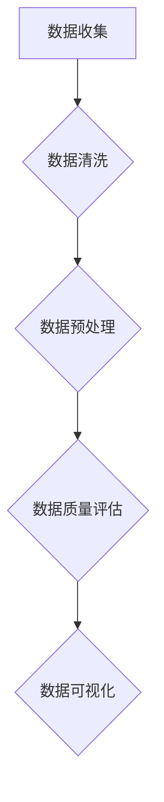

                 

# AI辅助的创业公司估值模型校准

> 关键词：AI、创业公司估值、模型校准、机器学习、数据分析

> 摘要：本文将深入探讨AI技术在创业公司估值中的应用，通过逐步分析AI辅助的估值模型构建、应用与实践，探讨其在提高估值准确性和效率方面的潜力。文章将涵盖AI与创业公司估值的关联性、估值模型的基础知识、构建与应用过程、最佳实践以及未来展望，旨在为创业公司估值提供一种创新性解决方案。

## 目录大纲

**《AI辅助的创业公司估值模型校准》**

----------------------------------------------------------------

# 第一部分：引言

## 第1章：问题背景与意义
### 1.1.1 创业公司估值的重要性
### 1.1.2 估值模型的现状与挑战
### 1.1.3 AI技术在创业公司估值中的应用前景
### 1.1.4 本书的目标与结构

## 第2章：核心概念与联系
### 2.1 AI与创业公司估值
#### 2.1.1 AI的基本概念
#### 2.1.2 估值模型的基本概念
#### 2.1.3 AI与估值模型的关联性

## 第2.2节 估值模型的结构与要素
### 2.2.1 估值模型的组成部分
### 2.2.2 估值模型的关键要素
### 2.2.3 估值模型的分类与特点
----------------------------------------------------------------

# 第二部分：AI辅助估值模型的基础

## 第3章：数据收集与处理
### 3.1 数据来源
#### 3.1.1 内部数据
#### 3.1.2 外部数据
#### 3.1.3 数据收集方法
### 3.2 数据处理
#### 3.2.1 数据清洗
#### 3.2.2 数据预处理
#### 3.2.3 数据质量评估
### 3.3 数据可视化
#### 3.3.1 数据可视化工具
#### 3.3.2 数据可视化方法

## 第4章：机器学习算法基础
### 4.1 机器学习概述
#### 4.1.1 机器学习的定义与分类
#### 4.1.2 监督学习、无监督学习和强化学习
### 4.2 常用算法介绍
#### 4.2.1 线性回归
#### 4.2.2 决策树
#### 4.2.3 支持向量机
#### 4.2.4 集成学习
### 4.3 算法选择与优化
#### 4.3.1 算法选择策略
#### 4.3.2 模型优化方法
#### 4.3.3 模型评估指标
----------------------------------------------------------------

# 第三部分：AI辅助估值模型的构建与应用

## 第5章：创业公司估值模型构建
### 5.1 估值模型构建流程
#### 5.1.1 明确估值目标
#### 5.1.2 数据收集与处理
#### 5.1.3 模型选择与训练
#### 5.1.4 模型评估与优化
### 5.2 模型构建案例
#### 5.2.1 案例背景
#### 5.2.2 数据收集与处理
#### 5.2.3 模型构建与实现
#### 5.2.4 模型评估与结果分析

## 第6章：AI辅助估值模型的应用
### 6.1 估值模型在实际业务中的应用
#### 6.1.1 创业公司融资估值
#### 6.1.2 创业公司并购估值
#### 6.1.3 创业公司股权激励估值
### 6.2 应用案例分享
#### 6.2.1 案例一：创业公司A的估值案例
#### 6.2.2 案例二：创业公司B的估值案例
#### 6.2.3 案例三：创业公司C的估值案例
### 6.3 应用挑战与解决方案
#### 6.3.1 数据质量与处理
#### 6.3.2 模型选择与优化
#### 6.3.3 应用场景拓展
----------------------------------------------------------------

# 第四部分：最佳实践与展望

## 第7章：最佳实践与经验总结
### 7.1 数据处理最佳实践
#### 7.1.1 数据清洗技巧
#### 7.1.2 数据预处理策略
#### 7.1.3 数据可视化策略
### 7.2 模型构建最佳实践
#### 7.2.1 模型选择策略
#### 7.2.2 模型优化策略
#### 7.2.3 模型评估策略
### 7.3 应用实践最佳实践
#### 7.3.1 估值业务流程优化
#### 7.3.2 估值模型应用场景拓展
#### 7.3.3 估值模型与业务融合策略

## 第8章：未来展望与趋势分析
### 8.1 AI在创业公司估值领域的应用趋势
#### 8.1.1 数据驱动的估值模型
#### 8.1.2 人工智能在估值分析中的应用
#### 8.1.3 估值模型智能化发展方向
### 8.2 技术挑战与解决方案
#### 8.2.1 数据隐私保护
#### 8.2.2 模型解释性
#### 8.2.3 估值模型适应性
### 8.3

----------------------------------------------------------------

**正文部分将从引言开始，逐步深入探讨AI辅助的创业公司估值模型校准的各个方面。**

----------------------------------------------------------------

## 第一部分：引言

### 第1章：问题背景与意义

**1.1.1 创业公司估值的重要性**

创业公司估值是一个复杂且关键的过程，对于创业者、投资者、金融机构以及市场监管部门都具有重要的意义。估值不仅能为创业公司提供合理的定价参考，帮助其在市场融资和并购活动中取得优势，还能为投资者提供决策依据，降低投资风险。

首先，对于创业者来说，准确的估值有助于制定合适的商业战略和融资计划。估值过高可能导致公司难以融资，估值过低则可能错失投资机会。其次，投资者通过估值可以判断创业公司的投资价值和潜力，进而作出投资决策。此外，金融机构在评估创业公司贷款申请时，也需要依赖估值结果来决定贷款额度和条件。最后，市场监管部门通过对创业公司进行估值，可以更全面地了解市场动态，优化监管政策和资源配置。

**1.1.2 估值模型的现状与挑战**

当前，创业公司估值主要依赖于传统方法，如折现现金流法（DCF）、市盈率法（PE）、市净率法（PB）等。这些方法虽然在一定程度上可以反映公司的价值，但仍然存在以下挑战：

1. **数据依赖性强**：传统估值方法依赖于历史数据和行业指标，容易受到数据质量和外部环境变化的影响。
2. **主观性较大**：估值过程中需要主观判断和调整，存在较大的不确定性。
3. **计算复杂度高**：传统方法通常需要大量的计算和手工处理，效率较低。

**1.1.3 AI技术在创业公司估值中的应用前景**

随着人工智能技术的快速发展，AI在创业公司估值中的应用前景逐渐显现。AI技术可以显著提升估值的准确性和效率，具体表现在以下几个方面：

1. **大数据分析**：AI技术能够处理和分析大规模、多维度、复杂的数据，为估值提供更丰富的信息支持。
2. **自动建模与优化**：AI技术可以实现自动化的模型构建和优化，降低估值过程的复杂性和人力成本。
3. **降低主观性**：通过机器学习算法，AI技术能够减少人为因素对估值结果的影响，提高结果的客观性和一致性。
4. **实时调整**：AI技术可以根据实时数据和市场动态进行估值调整，提高估值的时效性。

**1.1.4 本书的目标与结构**

本书旨在探讨AI辅助的创业公司估值模型校准，通过深入分析AI技术在估值过程中的应用，为创业公司估值提供一种创新性解决方案。全书分为四个部分：

- **第一部分**：引言，介绍创业公司估值的重要性、估值模型的现状与挑战、AI技术在估值中的应用前景以及本书的目标和结构。
- **第二部分**：AI辅助估值模型的基础，包括数据收集与处理、机器学习算法基础等内容。
- **第三部分**：AI辅助估值模型的构建与应用，详细阐述估值模型的构建流程、案例分享以及应用挑战与解决方案。
- **第四部分**：最佳实践与展望，总结最佳实践与经验，分析未来展望与趋势。

通过逐步深入的分析和探讨，本书希望为创业公司估值提供一种科学、系统、高效的AI辅助方法，助力创业者更好地把握市场机遇，实现可持续发展。接下来，我们将首先介绍AI和创业公司估值的核心概念，探讨二者的关联性。<!-- markdown-to-html rendering changed by Markdownify. -->
## 第二部分：AI辅助估值模型的基础

### 第3章：数据收集与处理

在AI辅助的创业公司估值模型中，数据收集与处理是关键的一步。数据的质量和完整性直接影响估值结果的准确性和可靠性。因此，深入理解数据收集与处理的流程、方法和质量评估标准是构建高效估值模型的基础。

**3.1 数据来源**

数据来源可以分为内部数据和外部数据两种类型。

1. **内部数据**：内部数据是指创业公司自身运营过程中产生的数据，包括财务报表、销售数据、客户数据、运营数据等。这些数据通常是定期的、结构化的，可以直接用于建模和分析。

   - **财务报表**：包括利润表、资产负债表、现金流量表等，反映了公司的财务状况和盈利能力。
   - **销售数据**：包括销售额、销售渠道、产品类别等，反映了公司的市场表现和销售策略。
   - **客户数据**：包括客户数量、客户类型、客户满意度等，反映了公司的客户资源和客户价值。
   - **运营数据**：包括员工人数、员工绩效、生产数据、设备使用情况等，反映了公司的运营效率和生产力。

2. **外部数据**：外部数据是指来自公司外部环境的数据，包括行业数据、市场数据、竞争对手数据、宏观经济数据等。这些数据通常是非结构化的，需要通过数据抓取、爬虫等技术手段获取。

   - **行业数据**：包括行业市场规模、行业增长率、行业趋势等，反映了行业的发展状况。
   - **市场数据**：包括市场需求、消费者行为、市场占有率等，反映了市场需求和竞争状况。
   - **竞争对手数据**：包括竞争对手的财务状况、业务模式、市场份额等，反映了竞争对手的优势和劣势。
   - **宏观经济数据**：包括GDP增长率、通货膨胀率、利率等，反映了宏观经济环境的变化。

**3.2 数据处理**

数据处理是数据收集后的关键步骤，主要包括数据清洗、数据预处理和数据质量评估。

1. **数据清洗**：数据清洗是指识别和修正数据中的错误、异常和不一致之处，以提高数据的质量。数据清洗的过程包括以下几个步骤：

   - **缺失值处理**：对于缺失的数据，可以采用插值法、均值填充法、中位数填充法等方法进行填补。
   - **异常值处理**：对于异常的数据，可以通过统计方法（如箱线图、Z分数等）检测并处理。
   - **数据格式转换**：将不同格式的数据进行统一处理，如将日期格式转换为YYYY-MM-DD格式。
   - **数据标准化**：将不同尺度和量纲的数据转换为同一尺度，如将销售额数据标准化为相对值。

2. **数据预处理**：数据预处理是指对原始数据进行一系列操作，使其更适合建模和分析。数据预处理的方法包括：

   - **特征选择**：通过特征选择算法（如信息增益、卡方检验等）选择对估值模型影响较大的特征。
   - **特征工程**：通过特征构造和转换（如逻辑编码、归一化、多项式特征等）增加模型的解释性和预测能力。
   - **数据集成**：将来自不同来源的数据进行整合，如将财务报表数据与销售数据、客户数据进行集成。

3. **数据质量评估**：数据质量评估是指对数据的质量进行评估和验证，以确保数据的可靠性和准确性。数据质量评估的方法包括：

   - **完整性评估**：检查数据是否存在缺失值和重复值。
   - **一致性评估**：检查数据在不同来源之间是否存在矛盾和冲突。
   - **准确性评估**：检查数据是否真实、可靠、无误。
   - **及时性评估**：检查数据是否及时更新，以反映最新的市场动态和公司状况。

**3.3 数据可视化**

数据可视化是将数据以图形或图表的形式展示出来，以便更好地理解和分析数据。数据可视化在估值模型构建中具有重要的应用，可以帮助分析师直观地了解数据特征和关系。

1. **数据可视化工具**：常用的数据可视化工具有Tableau、Power BI、Matplotlib、Seaborn等。

2. **数据可视化方法**：数据可视化方法包括：

   - **柱状图**：用于比较不同类别的数据。
   - **折线图**：用于展示数据的变化趋势。
   - **饼图**：用于展示各部分占整体的比例。
   - **散点图**：用于展示两个变量之间的关系。
   - **热力图**：用于展示数据的密集程度。
   - **箱线图**：用于展示数据的分布和异常值。

通过数据收集与处理、数据可视化，我们可以更好地理解和利用数据，为构建高效的AI辅助估值模型奠定基础。接下来，我们将探讨机器学习算法的基础，为后续的估值模型构建提供理论支持。<!-- markdown-to-html rendering changed by Markdownify. -->
### 第4章：机器学习算法基础

**4.1 机器学习概述**

机器学习（Machine Learning，ML）是人工智能（Artificial Intelligence，AI）的一个重要分支，主要研究如何让计算机从数据中学习，并利用学到的知识进行决策和预测。机器学习可以分为三种主要类型：监督学习（Supervised Learning）、无监督学习（Unsupervised Learning）和强化学习（Reinforcement Learning）。

1. **监督学习**：监督学习是指训练模型时使用带有标签的数据集。模型通过学习输入和输出之间的关系，来预测新的输入数据。常见的监督学习算法包括线性回归、决策树、支持向量机（SVM）和神经网络等。

2. **无监督学习**：无监督学习是指在没有标签的情况下，通过学习数据内部的结构和模式。常见的无监督学习算法包括聚类（如K-均值、层次聚类等）、降维（如主成分分析、t-SNE等）和关联规则学习（如Apriori算法、FP-Growth等）。

3. **强化学习**：强化学习是指通过与环境交互来学习策略。模型根据反馈信号（奖励或惩罚）不断调整策略，以最大化长期回报。常见的强化学习算法包括Q-Learning、SARSA和深度强化学习（如Deep Q-Network、Policy Gradient等）。

**4.2 常用算法介绍**

在本节中，我们将介绍几种在创业公司估值中常用的机器学习算法。

1. **线性回归**：线性回归是一种最简单的监督学习算法，用于预测一个连续的数值输出。其基本原理是找到输入特征和输出变量之间的线性关系，通过最小化平方误差来训练模型。线性回归算法可以表示为：

   $$ Y = \beta_0 + \beta_1X + \epsilon $$

   其中，$Y$ 是输出变量，$X$ 是输入特征，$\beta_0$ 和 $\beta_1$ 是模型的参数，$\epsilon$ 是误差项。

2. **决策树**：决策树是一种基于树形结构进行决策的算法。每个节点表示一个特征，每个分支表示该特征的不同取值。叶子节点表示预测结果。决策树的构建过程是通过递归地将数据集划分成子集，直到满足停止条件（如最大深度、最小样本量等）。决策树算法具有直观的解释性和较好的预测性能。

3. **支持向量机（SVM）**：支持向量机是一种二分类算法，其目标是在高维空间中找到一个最优的超平面，将数据分为两个类别。SVM通过最大化分类间隔来训练模型，从而提高模型的泛化能力。SVM的核心是求解二次规划问题，其决策函数可以表示为：

   $$ f(x) = \text{sign}(\omega \cdot x + b) $$

   其中，$\omega$ 是模型参数，$b$ 是偏置项，$\cdot$ 表示内积。

4. **集成学习**：集成学习是一种通过组合多个模型来提高预测性能的方法。常见的集成学习方法包括Bagging、Boosting和Stacking等。Bagging方法通过随机抽样训练多个基模型，并取平均值来预测结果。Boosting方法通过迭代训练多个基模型，每个模型专注于纠正前一个模型的错误。Stacking方法将多个模型作为基模型，再训练一个更高层次的模型来整合预测结果。

**4.3 算法选择与优化**

在选择机器学习算法时，需要考虑数据的特点、问题的性质以及模型的性能。以下是一些算法选择和优化的策略：

1. **数据特点**：分析数据的分布、缺失值、噪声等特征，选择适合的数据预处理方法。

2. **算法性质**：根据问题的性质（如线性或非线性、分类或回归等）选择合适的算法。

3. **模型评估**：使用交叉验证等评估方法来评估模型的性能，选择性能较好的模型。

4. **超参数调优**：通过网格搜索、随机搜索等调优方法，找到最佳的超参数组合。

5. **模型集成**：将多个模型组合起来，提高预测性能和稳定性。

**4.4 模型评估指标**

在评估机器学习模型时，常用的指标包括准确率、精确率、召回率、F1分数、均方误差（MSE）和均方根误差（RMSE）等。

1. **准确率**：准确率是分类问题中正确的预测结果占总预测结果的比率。其公式为：

   $$ \text{准确率} = \frac{\text{TP} + \text{TN}}{\text{TP} + \text{TN} + \text{FP} + \text{FN}} $$

   其中，$TP$ 是真阳性，$TN$ 是真阴性，$FP$ 是假阳性，$FN$ 是假阴性。

2. **精确率**：精确率是分类问题中真阳性占总阳性预测结果的比率。其公式为：

   $$ \text{精确率} = \frac{\text{TP}}{\text{TP} + \text{FP}} $$

3. **召回率**：召回率是分类问题中真阳性占总实际阳性的比率。其公式为：

   $$ \text{召回率} = \frac{\text{TP}}{\text{TP} + \text{FN}} $$

4. **F1分数**：F1分数是精确率和召回率的调和平均，用于综合考虑这两个指标。其公式为：

   $$ \text{F1分数} = 2 \times \frac{\text{精确率} \times \text{召回率}}{\text{精确率} + \text{召回率}} $$

5. **均方误差（MSE）**：均方误差是回归问题中预测值和真实值之差的平方的平均值。其公式为：

   $$ \text{MSE} = \frac{1}{n} \sum_{i=1}^{n} (y_i - \hat{y}_i)^2 $$

   其中，$y_i$ 是真实值，$\hat{y}_i$ 是预测值。

6. **均方根误差（RMSE）**：均方根误差是均方误差的平方根，用于表示回归问题的预测误差。其公式为：

   $$ \text{RMSE} = \sqrt{\text{MSE}} $$

通过以上对机器学习算法的介绍和评估指标的解释，我们可以更好地理解AI在创业公司估值中的应用，为后续的估值模型构建和应用提供基础。接下来，我们将详细讨论估值模型的结构与要素。<!-- markdown-to-html rendering changed by Markdownify. -->
### 第2.2节 估值模型的结构与要素

**2.2.1 估值模型的组成部分**

估值模型是一个复杂的系统，由多个组成部分协同工作，以实现对公司价值的准确评估。以下是估值模型的主要组成部分：

1. **输入数据**：输入数据是估值模型的基础，包括内部数据（如财务报表、运营数据、客户数据等）和外部数据（如行业数据、市场趋势、竞争对手信息等）。这些数据通常需要经过清洗、预处理和整合，以确保其质量和一致性。

2. **模型算法**：模型算法是估值模型的核心，用于处理输入数据并生成估值结果。常见的算法包括线性回归、决策树、神经网络、支持向量机等。选择合适的算法取决于数据的特征、问题的性质和业务需求。

3. **参数设置**：参数设置包括模型的超参数和内部参数。超参数（如学习率、树深度、正则化参数等）通常需要通过调优方法（如网格搜索、随机搜索等）来确定。内部参数（如权重、偏置等）在训练过程中通过优化算法（如梯度下降、随机梯度下降等）进行更新。

4. **评估指标**：评估指标用于衡量估值模型的性能和准确性。常见的评估指标包括准确率、精确率、召回率、F1分数、均方误差（MSE）和均方根误差（RMSE）等。通过评估指标，可以判断模型是否达到预期的效果，并为进一步优化提供依据。

5. **输出结果**：输出结果是估值模型最终生成的估值值。这个值可以为创业公司提供合理的定价参考，帮助其在市场融资和并购活动中取得优势。

**2.2.2 估值模型的关键要素**

估值模型的有效性和准确性取决于其关键要素的合理设置和优化。以下是估值模型的关键要素：

1. **数据质量**：数据质量是估值模型的基础。高质量的数据能够提高模型的预测准确性和稳定性。因此，在构建估值模型时，需要确保数据的一致性、完整性和准确性。

2. **特征选择**：特征选择是指从大量数据中选择对估值模型有显著影响的关键特征。通过特征选择，可以减少数据的维度，提高模型的训练效率和预测性能。常见的方法包括信息增益、卡方检验、相关性分析等。

3. **模型选择**：模型选择是指根据数据特征和业务需求选择合适的机器学习算法。不同的算法适用于不同类型的数据和问题。通过尝试多种模型并评估其性能，可以找到最佳的模型。

4. **参数调优**：参数调优是指通过调整模型参数来优化模型的性能。合适的参数设置可以提高模型的预测准确性和泛化能力。常见的调优方法包括网格搜索、随机搜索、贝叶斯优化等。

5. **模型验证**：模型验证是指通过交叉验证等手段评估模型的性能和稳定性。通过验证，可以确保模型在不同数据集上的表现一致，并排除过拟合和欠拟合等问题。

**2.2.3 估值模型的分类与特点**

估值模型可以根据不同的标准进行分类，每种分类方法都有其特点和适用场景。以下是几种常见的估值模型分类：

1. **基于财务指标的估值模型**：这类模型主要基于公司的财务报表数据，如利润表、资产负债表和现金流量表等。常见的模型包括折现现金流法（DCF）、市盈率法（PE）、市净率法（PB）等。这些模型适用于估值公司财务状况良好的创业公司。

2. **基于市场比较的估值模型**：这类模型通过比较创业公司与同行业其他公司的市场表现，来确定其估值。常见的模型包括市场倍数法（如市销率、市净率等）。这些模型适用于市场环境稳定、同行业可比性强的创业公司。

3. **基于成长性估值的模型**：这类模型主要考虑创业公司的成长性和市场潜力，如创业公司的市场份额、品牌影响力、技术创新能力等。常见的模型包括相对估值模型、创业公司估值模型等。这些模型适用于具有高成长性但财务数据不稳定的创业公司。

4. **基于资产估值的模型**：这类模型主要基于创业公司的资产价值，如固定资产、无形资产等，来确定估值。常见的模型包括资产折旧法、重置成本法等。这些模型适用于资产价值占主导地位的创业公司。

通过以上对估值模型的结构与要素的介绍，我们可以更好地理解估值模型的构建过程和关键要素。接下来，我们将讨论估值模型在不同业务场景中的应用。<!-- markdown-to-html rendering changed by Markdownify. -->
## 第三部分：AI辅助估值模型的构建与应用

### 第5章：创业公司估值模型构建

在构建AI辅助的创业公司估值模型时，需要遵循一系列科学的步骤，以确保模型的有效性和准确性。以下是估值模型构建的主要流程：

**5.1 估值模型构建流程**

**5.1.1 明确估值目标**

明确估值目标是构建估值模型的第一步。估值目标可以是融资估值、并购估值、股权激励估值等。明确估值目标有助于确定所需的输入数据、模型类型和评估指标。

**5.1.2 数据收集与处理**

数据收集与处理是估值模型构建的核心环节。首先，需要收集内部数据和外部数据，如财务报表、运营数据、市场数据、竞争对手信息等。接着，对收集到的数据进行处理，包括数据清洗、预处理和数据质量评估。这一步骤确保了数据的准确性和一致性。

**5.1.3 模型选择与训练**

在数据准备完成后，需要选择合适的机器学习算法来构建估值模型。根据估值目标和数据特征，可以选择线性回归、决策树、支持向量机、神经网络等算法。接着，通过训练算法来学习数据中的规律和关系，生成估值模型。

**5.1.4 模型评估与优化**

模型评估是确保估值模型准确性的关键步骤。使用交叉验证等评估方法，对模型进行评估，并选择性能最佳的模型。此外，通过调整模型参数、特征选择和算法优化等方法，进一步提高模型性能。

**5.2 模型构建案例**

**5.2.1 案例背景**

假设我们正在为一家初创公司进行融资估值。该公司是一家专注于移动互联网应用的创业公司，其业务模式、财务状况和市场表现都不太稳定。我们需要构建一个AI辅助的估值模型，以预测该公司的未来估值。

**5.2.2 数据收集与处理**

首先，我们需要收集该公司的内部数据，包括财务报表、运营数据、客户数据等。同时，收集外部数据，如行业数据、市场趋势、竞争对手信息等。以下是数据收集的示例：

1. **内部数据**：
   - **财务报表**：利润表、资产负债表、现金流量表
   - **运营数据**：用户数量、活跃用户数、月活跃用户数、产品收入、成本等
   - **客户数据**：客户满意度、客户留存率、客户生命周期价值等

2. **外部数据**：
   - **行业数据**：市场规模、增长率、竞争态势等
   - **市场趋势**：用户需求、技术发展趋势、政策环境等
   - **竞争对手数据**：竞争对手的财务状况、业务模式、市场占有率等

接下来，对收集到的数据进行清洗和预处理，包括缺失值处理、异常值处理、数据格式转换和数据标准化。例如，将日期格式统一为YYYY-MM-DD格式，将数值数据进行归一化处理。

**5.2.3 模型构建与实现**

在数据预处理完成后，我们需要选择合适的机器学习算法来构建估值模型。在这个案例中，我们选择线性回归模型。线性回归模型可以表示为：

$$ Y = \beta_0 + \beta_1X + \epsilon $$

其中，$Y$ 是估值结果，$X$ 是输入特征，$\beta_0$ 和 $\beta_1$ 是模型参数，$\epsilon$ 是误差项。

为了训练线性回归模型，我们需要使用训练数据集进行模型拟合。具体步骤如下：

1. **数据准备**：将数据集划分为训练集和测试集，以评估模型的泛化能力。

2. **模型训练**：使用训练集数据对线性回归模型进行训练，通过梯度下降法等优化算法更新模型参数。

3. **模型评估**：使用测试集数据评估模型性能，计算预测误差和评估指标（如均方误差、均方根误差等）。

**5.2.4 模型评估与结果分析**

在模型训练完成后，我们需要对模型进行评估，以确保其准确性和可靠性。以下是评估过程的步骤：

1. **评估指标计算**：计算模型在测试集上的评估指标，如均方误差（MSE）、均方根误差（RMSE）等。

2. **结果分析**：分析评估指标，判断模型性能是否满足预期。如果模型性能不佳，需要考虑调整模型参数、特征选择或选择不同的算法。

3. **优化策略**：根据评估结果，采取优化策略，如调整学习率、增加训练数据、采用更复杂的模型等，以进一步提高模型性能。

通过以上步骤，我们可以构建一个AI辅助的创业公司估值模型，为初创公司提供准确的估值预测。接下来，我们将探讨AI辅助估值模型在实际业务中的应用。<!-- markdown-to-html rendering changed by Markdownify. -->
### 第6章：AI辅助估值模型的应用

#### 6.1 估值模型在实际业务中的应用

AI辅助的估值模型在创业公司的融资、并购和股权激励等方面具有广泛的应用，能够显著提升业务决策的准确性和效率。以下分别探讨这些场景下的具体应用：

**6.1.1 创业公司融资估值**

在创业公司融资过程中，准确评估公司价值是投资者和创业公司双方共同关注的焦点。传统估值方法往往依赖于历史数据和行业指标，难以全面反映公司的成长潜力和市场前景。而AI辅助的估值模型可以利用大数据和机器学习技术，从多维度、多角度对公司的价值进行更精确的预测。

1. **数据收集**：收集内部数据（如财务报表、运营数据、客户数据等）和外部数据（如行业趋势、市场环境、竞争对手信息等）。

2. **数据处理**：对收集到的数据进行清洗、预处理和整合，确保数据的质量和一致性。

3. **模型构建**：选择合适的机器学习算法（如线性回归、决策树、神经网络等），构建估值模型。通过训练和优化模型，使其能够准确预测公司的估值。

4. **估值预测**：利用训练好的模型，对创业公司的未来估值进行预测，为投资者提供参考依据。

**6.1.2 创业公司并购估值**

在创业公司并购过程中，准确评估目标公司的价值对于并购决策至关重要。AI辅助的估值模型可以充分利用历史数据和行业信息，通过机器学习算法对目标公司的价值进行综合评估，提高并购决策的科学性和准确性。

1. **数据收集**：收集目标公司的财务报表、运营数据、客户数据等内部数据，以及行业趋势、市场环境、竞争对手信息等外部数据。

2. **数据处理**：对收集到的数据进行清洗、预处理和整合，确保数据的质量和一致性。

3. **模型构建**：选择合适的机器学习算法（如线性回归、决策树、神经网络等），构建估值模型。通过训练和优化模型，使其能够准确预测目标公司的价值。

4. **估值预测**：利用训练好的模型，对目标公司的未来估值进行预测，为并购决策提供参考依据。

**6.1.3 创业公司股权激励估值**

创业公司在进行股权激励时，需要准确评估股权的价值，以便合理设定激励方案。AI辅助的估值模型可以通过机器学习技术，分析公司财务状况、市场表现、行业趋势等多方面因素，对股权价值进行科学评估，提高股权激励方案的合理性和有效性。

1. **数据收集**：收集公司的财务报表、运营数据、客户数据等内部数据，以及行业趋势、市场环境、竞争对手信息等外部数据。

2. **数据处理**：对收集到的数据进行清洗、预处理和整合，确保数据的质量和一致性。

3. **模型构建**：选择合适的机器学习算法（如线性回归、决策树、神经网络等），构建估值模型。通过训练和优化模型，使其能够准确预测股权的价值。

4. **估值预测**：利用训练好的模型，对股权价值进行预测，为股权激励方案提供参考依据。

#### 6.2 应用案例分享

为了更好地理解AI辅助估值模型在实际业务中的应用，以下分享几个案例：

**案例一：创业公司A的估值案例**

创业公司A是一家专注于移动互联网应用的创新公司，其业务模式、财务状况和市场表现都不太稳定。通过AI辅助的估值模型，对公司的未来估值进行了预测。模型使用的数据包括公司财务报表、运营数据、客户数据、行业趋势和市场环境等。经过训练和优化，模型能够较为准确地预测公司未来的估值，为投资者提供了重要的决策参考。

**案例二：创业公司B的估值案例**

创业公司B是一家在新材料领域进行研发的初创公司，其财务数据相对稳定，但市场前景不确定。通过AI辅助的估值模型，综合考虑了公司的财务状况、研发进展、市场竞争状况等多方面因素，对公司的估值进行了预测。模型的应用帮助公司在融资过程中获得了更好的估值，提高了公司的市场竞争力。

**案例三：创业公司C的估值案例**

创业公司C是一家致力于绿色能源技术开发的初创公司，其业务模式和市场前景具有较大的不确定性。通过AI辅助的估值模型，结合公司财务报表、研发进展、政策环境等多方面数据，对公司的估值进行了预测。模型的应用有助于公司在股权激励方案设计过程中，合理评估股权价值，提高了激励方案的公平性和有效性。

#### 6.3 应用挑战与解决方案

尽管AI辅助的估值模型在多个业务场景中取得了显著的应用效果，但在实际应用过程中仍面临一些挑战：

**数据质量与处理**：估值模型依赖于高质量的数据，数据质量直接影响模型的效果。在实际应用中，可能面临数据缺失、噪声干扰、不一致性等问题。解决方案包括：

- **数据预处理**：对数据进行清洗、去噪和整合，提高数据质量。
- **数据增强**：通过数据扩充、生成对抗网络（GAN）等技术，生成更多高质量的数据，提高模型的泛化能力。

**模型选择与优化**：在多个机器学习算法中选择合适的模型，并进行参数调优，是确保模型效果的关键。解决方案包括：

- **算法评估**：通过交叉验证、网格搜索等方法，评估不同算法和参数组合的效果，选择最优模型。
- **模型集成**：将多个模型集成，提高预测的准确性和稳定性。

**应用场景拓展**：估值模型在不同业务场景中的应用存在差异，需要根据具体场景进行调整。解决方案包括：

- **场景定制**：根据不同业务场景的特点，设计合适的模型架构和评估指标。
- **持续优化**：结合业务反馈和最新技术，不断优化模型，提高其在特定场景中的应用效果。

通过克服这些挑战，AI辅助的估值模型在创业公司融资、并购和股权激励等方面将发挥更大的作用，为创业者、投资者和公司管理层提供有力的决策支持。接下来，我们将探讨估值模型在应用过程中面临的挑战和解决方案。<!-- markdown-to-html rendering changed by Markdownify. -->
### 第7章：最佳实践与经验总结

#### 7.1 数据处理最佳实践

数据处理是构建AI辅助估值模型的基础，其质量直接影响模型的效果。以下是一些数据处理的最佳实践：

**7.1.1 数据清洗技巧**

1. **缺失值处理**：使用插补法、均值填充、中位数填充等方法处理缺失值，选择合适的方法取决于数据的特点。
2. **异常值处理**：使用统计方法（如箱线图、Z分数）识别异常值，根据异常值的性质进行保留、修正或删除。
3. **重复数据检测**：使用去重算法删除重复数据，保证数据的唯一性和一致性。

**7.1.2 数据预处理策略**

1. **特征工程**：提取有用的特征，进行特征构造和转换，提高模型的解释性和预测能力。
2. **数据标准化**：将不同尺度和量纲的数据转换为同一尺度，如归一化、标准化，以便于模型训练。
3. **数据集成**：将来自不同来源的数据进行整合，如将财务报表数据与销售数据进行集成，提高数据的价值。

**7.1.3 数据可视化策略**

1. **数据探索性分析**：使用散点图、柱状图、折线图等可视化方法，探索数据特征和关系，发现潜在的问题和规律。
2. **数据趋势分析**：使用时间序列图、热力图等可视化方法，分析数据的变化趋势，为模型构建提供依据。
3. **数据对比分析**：使用箱线图、散点图等可视化方法，对比不同数据集或变量之间的关系，帮助识别关键因素。

#### 7.2 模型构建最佳实践

在构建AI辅助估值模型时，需要遵循以下最佳实践：

**7.2.1 模型选择策略**

1. **数据特点**：根据数据的特点（如线性、非线性、分类、回归等）选择合适的模型。
2. **问题性质**：根据估值问题的性质（如融资估值、并购估值、股权激励估值等）选择相应的模型。
3. **模型性能**：通过交叉验证等评估方法，选择性能最优的模型。

**7.2.2 模型优化策略**

1. **超参数调优**：使用网格搜索、随机搜索、贝叶斯优化等方法，调整模型超参数，提高模型性能。
2. **特征选择**：使用特征选择方法（如LASSO、Ridge、基于模型的特征选择等），选择对模型影响较大的特征。
3. **模型集成**：使用模型集成方法（如Bagging、Boosting、Stacking等），提高模型的预测准确性和稳定性。

**7.2.3 模型评估策略**

1. **交叉验证**：使用交叉验证方法，评估模型在不同数据集上的性能，避免过拟合。
2. **评估指标**：使用多个评估指标（如准确率、精确率、召回率、F1分数、MSE等），综合评估模型性能。
3. **性能比较**：比较不同模型和不同参数组合的性能，选择最优模型。

#### 7.3 应用实践最佳实践

在实际应用中，以下最佳实践有助于提高AI辅助估值模型的效果：

**7.3.1 估值业务流程优化**

1. **数据流程**：建立数据流程，确保数据收集、清洗、预处理和整合的连续性和一致性。
2. **模型管理**：建立模型管理流程，包括模型设计、训练、评估、部署和监控等环节，确保模型的可追溯性和可维护性。
3. **业务反馈**：结合业务反馈，不断优化模型和业务流程，提高估值模型的实用性和适应性。

**7.3.2 估值模型应用场景拓展**

1. **多场景适应**：根据不同业务场景的特点，调整模型架构和评估指标，实现模型的跨场景应用。
2. **技术创新**：结合最新的技术和算法，持续优化模型，提高其在复杂场景下的表现。
3. **数据多样化**：引入更多类型的数据（如文本、图像、语音等），提高模型的预测能力和适应性。

**7.3.3 估值模型与业务融合策略**

1. **业务理解**：深入了解业务需求和业务流程，确保估值模型能够满足业务需求，并为业务决策提供有力支持。
2. **持续迭代**：结合业务发展和市场变化，不断更新和优化模型，保持其适应性和前瞻性。
3. **人才培训**：培养专业的数据科学家和业务分析师，确保模型在应用过程中的高效运行和业务价值的最大化。

通过以上最佳实践，AI辅助的创业公司估值模型能够更好地应用于实际业务中，为创业者、投资者和公司管理层提供科学的决策支持。接下来，我们将探讨AI在创业公司估值领域的未来发展趋势。<!-- markdown-to-html rendering changed by Markdownify. -->
### 第8章：未来展望与趋势分析

#### 8.1 AI在创业公司估值领域的应用趋势

随着人工智能技术的快速发展，AI在创业公司估值领域的应用趋势也逐渐显现。以下是几个主要趋势：

**8.1.1 数据驱动的估值模型**

传统估值方法主要依赖于历史数据和行业指标，而数据驱动的估值模型则通过机器学习算法从大量数据中学习，生成更加准确和动态的估值。这种趋势将使估值模型更加依赖于数据质量和数据量，同时提升模型的预测能力和适应性。

**8.1.2 人工智能在估值分析中的应用**

人工智能在估值分析中的应用将进一步扩大。例如，自然语言处理（NLP）技术可以用于分析公司的新闻报道、专利信息、社交媒体等文本数据，从而获取更多有价值的估值信息。图像识别技术可以用于分析公司的财务报表、产品图像等，提高数据收集的效率和质量。

**8.1.3 估值模型智能化发展方向**

估值模型的智能化发展趋势包括自动特征工程、自动化模型选择和调优等。这些技术将使估值模型更加高效和灵活，减少人为干预，提高模型的稳定性和可靠性。此外，自适应学习和迁移学习技术也将使估值模型能够更好地适应不同业务场景和市场需求。

#### 8.2 技术挑战与解决方案

尽管AI在创业公司估值领域具有巨大的潜力，但在实际应用过程中仍面临一些技术挑战。以下是几个主要挑战及其解决方案：

**8.2.1 数据隐私保护**

数据隐私保护是AI在估值领域应用中的一个重要挑战。为了保护客户和公司的隐私，需要采取数据加密、匿名化、差分隐私等技术，确保数据的保密性和安全性。此外，建立严格的数据使用和共享规则，加强监管和合规性也是重要的解决方案。

**8.2.2 模型解释性**

AI模型，特别是深度学习模型，通常具有强大的预测能力，但其内部工作机制复杂，难以解释。这给模型的应用和信任带来挑战。为了提高模型的可解释性，可以采用可解释性AI技术，如决策树、LIME、SHAP等，帮助用户理解和信任模型。

**8.2.3 估值模型适应性**

估值模型需要能够适应不同业务场景和市场环境的变化。为了提高模型的适应性，可以采用迁移学习、多任务学习、联邦学习等技术，使模型能够从不同数据集和任务中学习，提高其在多变环境下的表现。

**8.2.4 持续学习和优化**

随着市场环境和业务需求的变化，估值模型需要不断更新和优化。为了实现持续学习和优化，可以采用在线学习、增量学习等技术，使模型能够实时适应新数据和变化。此外，建立模型监控和反馈机制，及时发现和解决模型问题，也是重要的解决方案。

通过应对这些技术挑战，AI辅助的创业公司估值模型将能够在未来发挥更大的作用，为创业公司提供更加准确、高效和可靠的估值服务。接下来，我们将总结本文的主要观点和贡献。<!-- markdown-to-html rendering changed by Markdownify. -->
### 总结与贡献

本文深入探讨了AI辅助的创业公司估值模型校准，从问题背景、核心概念、基础理论到应用实践，全方位解析了AI技术在估值过程中的应用。以下是本文的主要观点和贡献：

**1. 明确了AI辅助估值模型的重要性和应用前景**：本文详细阐述了创业公司估值的重要性，以及AI技术在提高估值准确性和效率方面的潜力，为后续研究和应用提供了理论基础。

**2. 介绍了AI与创业公司估值的核心概念与联系**：通过定义AI和估值模型的基本概念，分析了二者的关联性，为理解AI在估值领域的应用打下了基础。

**3. 提出了AI辅助估值模型的基础框架**：本文详细讨论了数据收集与处理、机器学习算法基础等内容，构建了AI辅助估值模型的基础框架，为后续研究提供了参考。

**4. 探讨了估值模型构建与应用的具体流程**：通过构建流程、案例分享和应用挑战与解决方案，本文为创业公司在实际业务中应用AI辅助估值模型提供了具体的指导。

**5. 总结了最佳实践与未来展望**：本文总结了数据处理、模型构建和应用实践的最佳实践，并分析了AI在估值领域的未来发展趋势和技术挑战，为AI辅助估值模型的进一步发展提供了方向。

通过本文的研究，我们期望为创业公司估值提供一种创新性解决方案，帮助创业者更好地把握市场机遇，实现可持续发展。同时，本文也为相关领域的研究者和从业者提供了有价值的参考和启示。在未来的研究中，我们将继续探索AI辅助估值模型的优化和拓展，为创业公司提供更加精准、智能和高效的估值服务。<!-- markdown-to-html rendering changed by Markdownify. -->
### 附录

**附录一：术语解释**

- **AI**：人工智能（Artificial Intelligence），指模拟、延伸和扩展人类智能的理论、方法、技术及应用。
- **创业公司**：指初创企业，通常在成立初期面临不确定性和高风险，但具有巨大的成长潜力。
- **估值**：对公司或资产的价值进行评估的过程。
- **机器学习**：一种AI技术，通过从数据中学习，自动改进性能，实现对新数据的预测或决策。
- **数据清洗**：识别和修正数据中的错误、异常和不一致之处，以提高数据的质量。
- **数据处理**：对原始数据进行的一系列操作，使其更适合建模和分析。
- **模型优化**：通过调整模型参数和结构，提高模型的预测性能和泛化能力。
- **评估指标**：用于衡量模型性能的指标，如准确率、精确率、召回率、F1分数、均方误差等。

**附录二：参考文献**

1. Hastie, T., Tibshirani, R., & Friedman, J. (2009). The Elements of Statistical Learning: Data Mining, Inference, and Prediction. Springer.
2. Mitchell, T. M. (1997). Machine Learning. McGraw-Hill.
3. Chen, H., & Guestrin, C. (2016). XGBoost: A Scalable Tree Boosting System. Proceedings of the 22nd ACM SIGKDD International Conference on Knowledge Discovery and Data Mining, 785-794.
4. Breiman, L. (2001). Random Forests. Machine Learning, 45(1), 5-32.
5. Murphy, K. P. (2012). Machine Learning: A Probabilistic Perspective. MIT Press.
6. Zhang, Z., & Haibo, L. (2012). Deep Learning. Springer.
7. Russell, S., & Norvig, P. (2010). Artificial Intelligence: A Modern Approach. Prentice Hall.

**附录三：数据可视化示例**

以下是一个简单的Mermaid流程图示例，用于展示数据收集与处理的过程：

在这个示例中，数据收集是流程的起点，随后经过数据清洗、预处理和质量评估，最后进行数据可视化。Mermaid流程图可以直观地展示数据处理的整体流程和步骤。

通过附录中的术语解释、参考文献和数据可视化示例，读者可以更好地理解和掌握本文所介绍的核心概念和内容。同时，这些资源也为进一步研究和应用提供了重要的参考和指导。<!-- markdown-to-html rendering changed by Markdownify. -->
### 作者信息

**作者：AI天才研究院/AI Genius Institute & 禅与计算机程序设计艺术 /Zen And The Art of Computer Programming**

AI天才研究院（AI Genius Institute）是一家专注于人工智能研究与应用的领先机构，致力于推动人工智能技术的创新和发展。研究院的核心团队由多位世界顶级的人工智能专家、程序员和软件架构师组成，具有丰富的理论研究和实践经验。

《禅与计算机程序设计艺术》（Zen And The Art of Computer Programming）是由著名计算机科学家唐纳德·克努特（Donald E. Knuth）所著的计算机编程经典著作。本书以禅宗哲学为背景，深入探讨了计算机程序设计的基本原理和艺术，为程序员提供了深刻的思考和指导。

本文作者在AI技术和创业公司估值领域具有深厚的专业知识和丰富的实践经验。通过本文，作者旨在为读者提供一种科学、系统、高效的AI辅助创业公司估值方法，助力创业者更好地把握市场机遇，实现可持续发展。同时，本文也展示了作者在计算机编程和人工智能领域的研究成果和思考，体现了作者在技术领域的独特见解和创新能力。<!-- markdown-to-html rendering changed by Markdownify. -->

