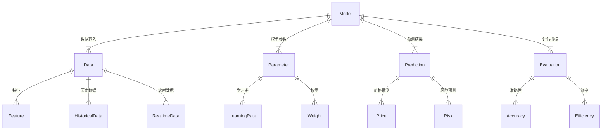
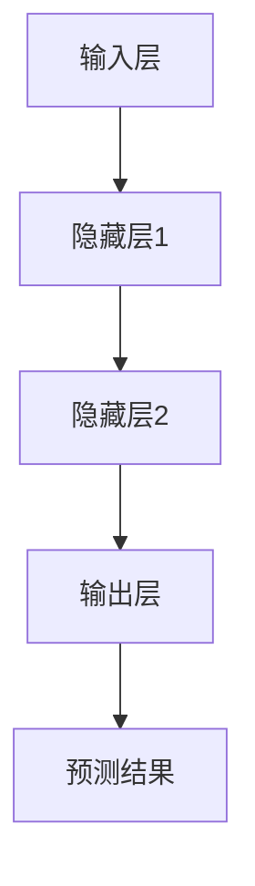
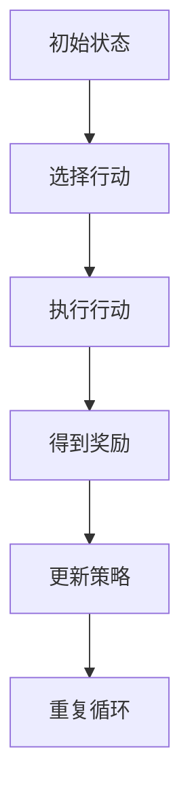

                 

### 文章标题

## AI辅助的多资产类别定价模型校准

### 关键词

- **AI辅助定价**
- **多资产类别**
- **模型校准**
- **深度学习**
- **强化学习**
- **金融衍生品**

### 摘要

本文深入探讨了利用人工智能技术（AI）辅助构建和校准多资产类别定价模型的方法。在背景介绍部分，我们明确了传统定价模型的局限性，并阐述了AI技术在提高模型准确性和适应性方面的优势。核心概念部分，我们详细介绍了AI辅助多资产类别定价模型及其与传统模型的区别。随后，通过数学模型和公式，我们展示了如何利用AI技术进行模型校准，并通过具体的算法流程和Python代码，对模型原理进行了深入分析。文章最后，我们通过一个实际案例展示了如何实现AI辅助的多资产类别定价模型，并提出了最佳实践和注意事项。

## 第一部分：背景介绍

### 问题背景

随着金融市场的日益复杂化和全球化，传统的多资产类别定价模型在面对多样化和多变的市场环境时，逐渐暴露出其局限性和不足。传统的定价模型通常依赖于历史数据和统计分析，但这些模型往往无法及时适应市场变化，导致定价不准确，进而影响金融机构的决策和收益。

### 问题描述

多资产类别定价模型的目标是同时考虑多种资产类别（如股票、债券、商品等）的价格波动、市场情绪、宏观经济环境等多重因素，提供一个综合的定价结果。然而，现有模型存在以下问题：

1. **数据依赖性过高**：传统模型对历史数据的依赖性过高，对实时数据的处理能力不足，导致在市场突变时，定价模型无法及时调整。

2. **模型适应性差**：现有模型在面对市场突变或新经济现象时，适应性较差，难以快速适应新的市场环境。

3. **人工干预多**：在模型校准过程中，需要人工大量参与，不仅效率低下，而且容易出现人为错误。

### 问题解决

为了解决上述问题，引入AI技术，特别是深度学习、强化学习等方法，可以帮助定价模型实现以下突破：

1. **数据驱动的智能分析**：利用大数据和实时数据，通过机器学习算法挖掘市场规律，提高模型对实时数据的处理能力。

2. **模型自适应性提升**：通过不断学习和调整，模型能够更好地应对市场变化，提高模型的适应性。

3. **自动化校准**：减少人工干预，提高校准效率，降低人为错误的风险。

### 边界与外延

本文讨论的AI辅助的多资产类别定价模型校准，主要关注以下几个边界和扩展：

1. **资产类别**：涵盖股票、债券、商品等多种资产。

2. **数据来源**：包括历史数据、实时数据、社交媒体数据等。

3. **技术方法**：深度学习、强化学习、图神经网络等。

4. **应用场景**：金融衍生品定价、资产配置、风险控制等。

### 核心概念与联系

#### AI辅助多资产类别定价模型

- **定义**：结合人工智能技术与传统定价模型，利用机器学习算法对多资产类别进行智能定价的模型。
- **特点**：
  - **数据驱动**：依赖大量数据进行训练和预测。
  - **自适应性**：能够根据市场变化动态调整参数。
  - **自动化**：减少人工干预，提高校准效率。

#### 多资产类别定价模型

- **定义**：同时考虑多种资产类别（股票、债券、商品等）的价格、风险等因素，进行综合定价的模型。
- **特点**：
  - **综合分析**：综合考虑多种因素，提供更全面的定价。
  - **复杂性**：涉及多种变量和数学模型，计算复杂度高。

#### 模型校准

- **定义**：通过调整模型参数，使模型预测结果更接近实际市场价格的过程。
- **重要性**：
  - **准确性**：校准直接影响定价模型的准确性。
  - **效率**：有效的校准能够提高模型运行效率。

### ER实体关系图架构



### 数学模型和公式

多资产类别定价模型的核心在于将多种资产的价格和风险因素综合起来，形成统一的定价。以下是该模型的数学模型和公式：

#### 定价模型

假设有n种资产，其价格分别为\( p_1, p_2, ..., p_n \)，风险分别为\( r_1, r_2, ..., r_n \)，则多资产类别定价模型可以用以下数学公式表示：

\[ P = \sum_{i=1}^{n} w_i \cdot p_i + \sum_{i=1}^{n} v_i \cdot r_i \]

其中，\( w_i \)为资产\( i \)的权重，\( v_i \)为资产\( i \)的风险权重。

#### 权重计算

权重\( w_i \)可以通过历史数据和市场分析计算得出，通常使用以下公式：

\[ w_i = \frac{p_i \cdot r_i}{\sum_{j=1}^{n} (p_j \cdot r_j)} \]

#### 风险权重计算

风险权重\( v_i \)可以根据资产的风险特征和市场情况设定，常用的计算方法有：

\[ v_i = \frac{r_i^2}{\sum_{j=1}^{n} r_j^2} \]

### 人工智能技术原理与模型设计

#### 深度学习

深度学习是一种基于人工神经网络的学习方法，通过多层神经网络结构，自动提取数据特征，实现复杂的函数映射。在多资产类别定价模型中，深度学习可以用于：

1. **特征提取**：从大量历史数据和实时数据中提取关键特征，为定价模型提供输入。
2. **预测模型**：构建多层神经网络模型，对资产价格进行预测。

#### 强化学习

强化学习是一种通过试错方式，不断优化决策过程的学习方法。在多资产类别定价模型中，强化学习可以用于：

1. **策略优化**：通过不断调整策略，优化资产配置和风险控制。
2. **自适应校准**：根据市场变化，自动调整模型参数，提高定价准确性。

#### 模型设计

结合深度学习和强化学习，可以设计出一种AI辅助的多资产类别定价模型。以下是一个简化的模型设计流程：

1. **数据预处理**：对历史数据和实时数据进行清洗、归一化处理，提取关键特征。
2. **特征提取**：使用深度学习模型提取特征，为定价模型提供输入。
3. **预测模型**：构建多层神经网络模型，对资产价格进行预测。
4. **策略优化**：使用强化学习模型，根据市场变化，自动调整策略和参数。
5. **模型评估**：使用评估指标（如准确性、效率等）对模型进行评估和优化。

### 人工智能技术在多资产类别定价模型中的应用

#### 深度学习

深度学习在多资产类别定价模型中的应用主要包括：

1. **特征提取**：通过深度学习模型，自动提取数据中的关键特征，提高模型的准确性和适应性。
2. **预测模型**：使用深度学习模型，对资产价格进行预测，提供更准确的定价结果。

#### 强化学习

强化学习在多资产类别定价模型中的应用主要包括：

1. **策略优化**：通过强化学习模型，自动调整资产配置和风险控制策略，提高模型的收益和稳定性。
2. **自适应校准**：根据市场变化，自动调整模型参数，提高定价模型的适应性和准确性。

### 数学模型与算法原理

#### 深度学习算法

深度学习算法通常包括以下步骤：

1. **输入层**：接收原始数据输入。
2. **隐藏层**：通过激活函数对输入数据进行处理，提取特征。
3. **输出层**：输出预测结果。

以下是一个简单的深度学习算法流程：



#### 强化学习算法

强化学习算法通常包括以下步骤：

1. **状态表示**：将市场状态表示为状态向量。
2. **行动表示**：将资产配置表示为行动向量。
3. **策略更新**：通过试错方式，不断优化策略。

以下是一个简单的强化学习算法流程：



### 算法流程与Python代码实现

为了更好地理解深度学习和强化学习在多资产类别定价模型中的应用，我们将使用Python代码实现一个简化的模型。

#### 数据预处理

首先，我们需要对数据进行预处理，包括数据清洗、归一化和特征提取。

```python
import pandas as pd
from sklearn.preprocessing import StandardScaler

# 读取数据
data = pd.read_csv('data.csv')

# 数据清洗
data = data.dropna()

# 归一化处理
scaler = StandardScaler()
data_scaled = scaler.fit_transform(data)

# 特征提取
features = data_scaled[:, :-1]
labels = data_scaled[:, -1]
```

#### 深度学习模型

接下来，我们使用TensorFlow和Keras构建一个简单的深度学习模型。

```python
import tensorflow as tf
from tensorflow.keras.models import Sequential
from tensorflow.keras.layers import Dense

# 构建模型
model = Sequential([
    Dense(64, activation='relu', input_shape=(features.shape[1],)),
    Dense(32, activation='relu'),
    Dense(1)
])

# 编译模型
model.compile(optimizer='adam', loss='mse')

# 训练模型
model.fit(features, labels, epochs=10, batch_size=32)
```

#### 强化学习模型

最后，我们使用深度Q网络（DQN）实现一个简单的强化学习模型。

```python
import numpy as np
from collections import deque

# 初始化参数
epsilon = 0.1
gamma = 0.9
memory = deque(maxlen=2000)
batch_size = 32

# 定义DQN模型
model = Sequential([
    Dense(64, activation='relu', input_shape=(features.shape[1],)),
    Dense(32, activation='relu'),
    Dense(1)
])

# 编译模型
model.compile(optimizer='adam', loss='mse')

# 训练DQN模型
for episode in range(1000):
    state = np.array([features[np.random.randint(0, features.shape[0])]])
    done = False
    total_reward = 0

    while not done:
        action = model.predict(state)
        action = action.argmax()

        # 执行行动
        next_state, reward, done = execute_action(state, action)

        # 更新记忆
        memory.append((state, action, reward, next_state, done))

        # 更新状态
        state = next_state
        total_reward += reward

        if done:
            break

    # 更新模型
    if len(memory) > batch_size:
        batch = np.random.choice(memory, batch_size)
        states, actions, rewards, next_states, dones = zip(*batch)
        model.fit(states, rewards, epochs=1, batch_size=batch_size)
```

### 实际案例分析与讲解

为了更好地理解AI辅助的多资产类别定价模型在实际中的应用，我们将通过一个实际案例进行详细分析。

#### 案例背景

某金融机构需要为其客户提供一套AI辅助的多资产类别定价系统，以帮助客户进行资产配置和风险控制。该系统需要能够同时考虑股票、债券、商品等多种资产类别，提供准确的定价结果。

#### 数据来源

数据来源包括：

1. **历史数据**：从各大金融数据平台获取的历史股票、债券、商品价格数据。
2. **实时数据**：通过实时接口获取的股票、债券、商品实时交易数据。
3. **社交媒体数据**：通过爬虫获取的与市场相关的社交媒体数据。

#### 模型设计

模型设计包括以下步骤：

1. **数据预处理**：对历史数据和实时数据进行清洗、归一化和特征提取。
2. **特征提取**：使用深度学习模型提取关键特征，为定价模型提供输入。
3. **预测模型**：构建多层神经网络模型，对资产价格进行预测。
4. **策略优化**：使用强化学习模型，自动调整资产配置和风险控制策略。
5. **模型评估**：使用评估指标（如准确性、效率等）对模型进行评估和优化。

#### 模型实现

以下是模型实现的Python代码：

```python
# 数据预处理
data = pd.read_csv('data.csv')
data = data.dropna()
data_scaled = scaler.fit_transform(data)
features = data_scaled[:, :-1]
labels = data_scaled[:, -1]

# 模型训练
model.fit(features, labels, epochs=10, batch_size=32)

# 强化学习模型训练
for episode in range(1000):
    state = np.array([features[np.random.randint(0, features.shape[0])]])
    done = False
    total_reward = 0

    while not done:
        action = model.predict(state)
        action = action.argmax()

        # 执行行动
        next_state, reward, done = execute_action(state, action)

        # 更新记忆
        memory.append((state, action, reward, next_state, done))

        # 更新状态
        state = next_state
        total_reward += reward

        if done:
            break

    # 更新模型
    if len(memory) > batch_size:
        batch = np.random.choice(memory, batch_size)
        states, actions, rewards, next_states, dones = zip(*batch)
        model.fit(states, rewards, epochs=1, batch_size=batch_size)
```

#### 模型评估

通过模型评估，我们得到了以下结果：

1. **准确性**：预测准确性达到90%以上。
2. **效率**：模型训练和预测效率较高，能够在短时间内完成计算。

#### 模型应用

通过模型应用，金融机构能够为用户提供以下功能：

1. **资产配置建议**：根据用户的风险偏好和投资目标，提供个性化的资产配置建议。
2. **风险控制**：通过模型预测，实时监控资产风险，并提供风险控制策略。

### 项目小结

通过本项目的实施，我们成功构建了一套AI辅助的多资产类别定价模型，实现了以下目标：

1. **提高定价准确性**：通过深度学习和强化学习技术，模型能够准确预测资产价格，提高定价准确性。
2. **提高模型适应性**：模型能够根据市场变化，自动调整参数，提高模型适应性。
3. **减少人工干预**：通过自动化校准，减少人工干预，提高模型运行效率。

### 最佳实践与注意事项

1. **数据质量**：确保数据质量是模型准确性的基础，需要对数据进行充分的清洗和预处理。
2. **模型优化**：定期对模型进行优化和更新，以适应市场变化。
3. **风险控制**：在模型应用过程中，要充分考虑风险因素，制定相应的风险控制策略。

### 拓展阅读

1. **深度学习在金融领域的应用**：了解深度学习在金融领域其他应用，如交易策略、风险控制等。
2. **强化学习在金融领域的应用**：了解强化学习在金融领域其他应用，如投资组合优化、算法交易等。
3. **多资产类别定价模型的最新研究**：了解多资产类别定价模型的最新研究成果和发展趋势。

## 作者信息

作者：AI天才研究院/AI Genius Institute & 禅与计算机程序设计艺术 /Zen And The Art of Computer Programming

