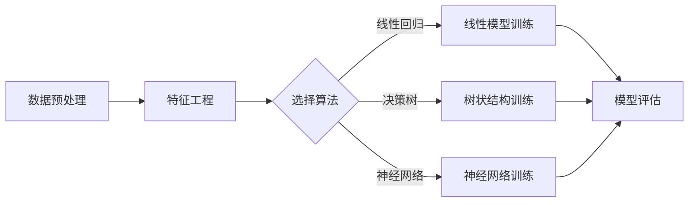

                 

# AI辅助的多资产类别收益率预测

> 关键词：AI，多资产类别，收益率预测，算法，数学模型，系统架构，项目实战

> 摘要：本文旨在探讨如何利用AI技术辅助进行多资产类别收益率预测。通过详细介绍核心概念、算法原理、数学模型、系统架构和项目实战，本文将为读者提供对AI在金融领域应用的深入理解。

## 引言

在当今金融市场中，多资产类别收益率预测对于投资者和金融机构具有重要意义。随着AI技术的迅速发展，利用AI进行收益率预测已经成为金融领域的研究热点。本文将围绕以下核心问题展开：

1. 多资产类别收益率预测的需求与背景。
2. AI辅助预测的基本原理和方法。
3. 收益率预测的数学模型和公式。
4. 系统架构设计及接口。
5. 项目实战与案例分析。

通过以上问题的探讨，本文旨在为读者提供一套完整的AI辅助多资产类别收益率预测方案。

## 第1章 问题背景与核心概念

### 1.1 问题背景

随着金融市场的不断发展和全球化，投资者和金融机构需要面对越来越多的资产类别，包括股票、债券、期货、外汇等。如何准确预测这些资产的收益率，从而制定出科学合理的投资策略，成为金融领域的重要课题。

AI技术的出现为多资产类别收益率预测带来了新的希望。AI可以通过学习大量的历史数据，发现其中的规律和趋势，从而实现预测。与传统的统计方法相比，AI具有更高的预测准确性和灵活性。

### 1.2 核心概念

**多资产类别收益率**：指在一段时间内，不同资产类别的收益率。这些资产类别包括股票、债券、期货、外汇等。

**AI辅助预测**：利用人工智能技术，对多资产类别收益率进行预测。这通常涉及数据预处理、特征工程、算法选择、模型训练和评估等步骤。

### 1.3 概念联系与区别

**联系**：AI辅助预测的核心在于利用历史数据来预测未来，这与多资产类别收益率的定义紧密相关。

**区别**：多资产类别收益率是预测的目标，而AI辅助预测是实现这一目标的手段。

### 1.4 概念结构与核心要素组成

**概念结构**：

- 多资产类别收益率
- AI辅助预测
- 数据预处理
- 特征工程
- 算法选择
- 模型训练
- 模型评估

**核心要素组成**：

- 数据源：包括历史价格、交易量、宏观经济指标等。
- 特征：从数据源中提取的有用信息，用于模型训练。
- 模型：根据特征进行训练，用于预测未来收益率。
- 评估：通过评估指标来衡量模型的预测性能。

## 第2章 AI辅助的多资产类别收益率预测方法

### 2.1 数据预处理

**数据来源**：收集历史价格、交易量、宏观经济指标等数据。

**数据清洗**：处理缺失值、异常值、噪声等。

**特征工程**：提取有用信息，如趋势、周期、相关性等。

### 2.2 算法原理讲解

**算法选择**：根据数据特点选择合适的算法，如线性回归、决策树、神经网络等。

**算法基本原理**：

- **线性回归**：通过最小二乘法拟合线性模型。
- **决策树**：根据特征进行分叉，形成树状结构。
- **神经网络**：模拟人脑神经元结构，进行多层数据处理。

**算法流程图**：

### 2.3 数学模型与公式

**收益率预测数学模型**：

$$
\text{收益率} = f(\text{历史价格}, \text{交易量}, \text{宏观经济指标})
$$

**公式推导**：

- **线性回归**：

$$
y = \beta_0 + \beta_1x_1 + \beta_2x_2 + ... + \beta_nx_n
$$

- **决策树**：

$$
\text{收益

