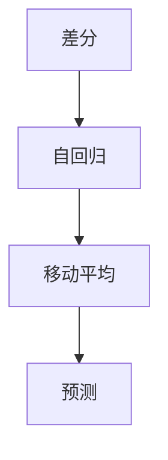
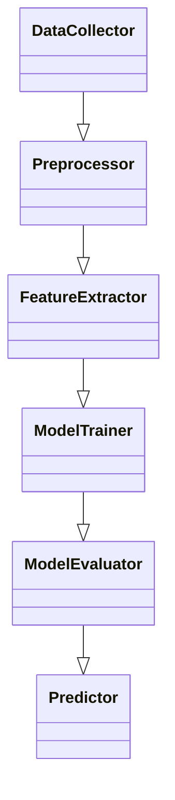
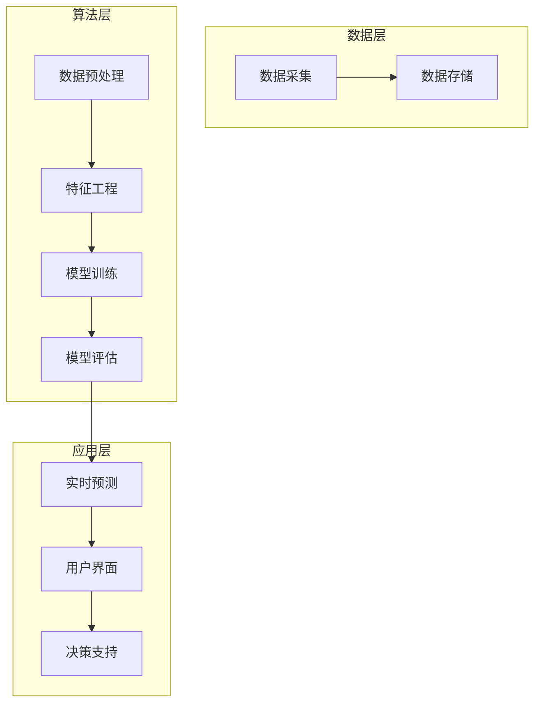
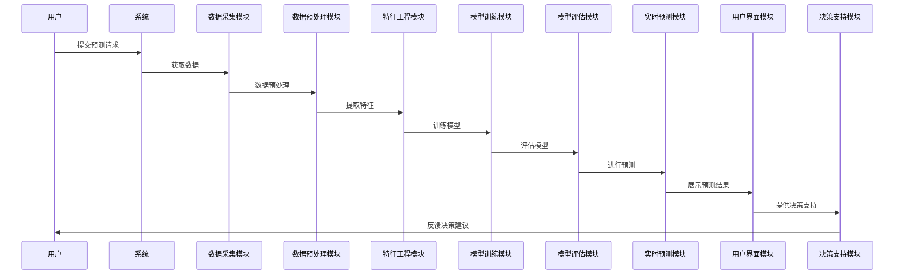

                 


### AI辅助的宏观经济指标预测

#### 关键词：人工智能，宏观经济，指标预测，机器学习，深度学习，模型优化

#### 摘要：
本文将深入探讨人工智能（AI）在宏观经济指标预测中的应用。通过系统地介绍AI辅助宏观经济指标预测的核心概念、算法原理、数学模型，以及实际项目实战，我们将展示如何利用AI技术提高宏观经济预测的准确性和效率。文章旨在为读者提供全面的技术视角和实用的指导，帮助他们理解并掌握AI辅助宏观经济指标预测的方法和技巧。

## 目录大纲设计思路

设计一本关于《AI辅助的宏观经济指标预测》的目录大纲，首先需要明确核心章节，确保内容的完整性和逻辑性。以下是详细的目录大纲设计思路：

### 第一部分：背景介绍

#### 1.1 问题背景
- **问题描述**：介绍宏观经济指标预测的重要性和当前面临的挑战。
- **问题解决**：阐述AI在宏观经济指标预测中的作用。
- **边界与外延**：明确研究范围和限制条件。

#### 1.2 相关研究综述
- **国内外研究现状**：总结现有的宏观经济指标预测方法及其优缺点。
- **AI在宏观经济预测中的应用**：讨论AI在宏观经济预测领域的最新进展。

### 第二部分：核心概念与联系

#### 2.1 AI与宏观经济指标预测
- **AI的概念与特点**：介绍AI的基本概念及其在数据分析中的优势。
- **宏观经济指标概述**：定义和分类宏观经济指标。

#### 2.2 AI辅助预测的基本原理
- **数据预处理**：讨论数据清洗、归一化等预处理步骤。
- **模型选择与训练**：介绍常见的机器学习模型及其选择标准。

### 第三部分：算法原理讲解

#### 3.1 经典算法
- **线性回归**：讲解线性回归模型的数学模型和公式。
- **ARIMA模型**：使用Mermaid流程图展示ARIMA模型的工作流程。

#### 3.2 深度学习算法
- **神经网络**：使用Python源代码解释神经网络的基本原理。
- **深度学习在宏观经济预测中的应用**：讨论深度学习模型如LSTM、GRU等在宏观经济预测中的应用。

### 第四部分：数学模型和公式

#### 4.1 线性回归数学模型
- **公式推导**：详细推导线性回归模型的数学公式。
- **Python代码实现**：提供Python代码示例，阐述公式应用。

#### 4.2 深度学习数学模型
- **LSTM和GRU**：介绍LSTM和GRU的数学模型和公式。
- **Python代码实现**：提供Python代码示例，阐述模型应用。

### 第五部分：系统分析与架构设计方案

#### 5.1 问题场景介绍
- **宏观经济预测需求**：阐述预测需求的背景和目的。

#### 5.2 系统功能设计
- **领域模型**：使用Mermaid类图展示领域模型。
- **系统架构设计**：使用Mermaid架构图展示系统架构。

#### 5.3 系统接口设计和系统交互
- **接口设计**：详细描述系统接口。
- **交互流程**：使用Mermaid序列图展示系统交互流程。

### 第六部分：项目实战

#### 6.1 环境安装
- **软件与硬件环境**：介绍项目所需的软件和硬件环境。

#### 6.2 系统核心实现
- **数据采集与处理**：讲解数据采集和处理的具体步骤。
- **模型训练与预测**：提供Python代码实现模型训练和预测。

#### 6.3 代码应用解读与分析
- **代码解读**：详细解读系统核心代码。
- **案例分析**：分析实际案例，展示模型预测效果。

#### 6.4 项目小结
- **总结**：总结项目实施过程中的经验和教训。

### 第七部分：最佳实践与拓展

#### 7.1 最佳实践 tips
- **模型优化策略**：分享模型优化技巧和策略。

#### 7.2 注意事项
- **数据质量控制**：强调数据质量对预测结果的重要性。

#### 7.3 拓展阅读
- **相关资源推荐**：推荐进一步阅读的相关书籍和文章。

### 设计思路总结
通过以上章节设计，我们构建了一个系统化、逻辑清晰的文章结构。每个部分都有明确的主题和目标，从问题背景介绍到实际项目实战，再到最佳实践与拓展，确保读者能够逐步深入理解AI辅助宏观经济指标预测的各个方面。接下来，我们将逐步展开对每个章节的详细探讨。

----------------------------------------------------------------

### 第一部分：背景介绍

宏观经济指标预测是经济分析和决策的重要环节。它涉及到国家经济政策的制定、企业战略规划的制定以及个人投资决策等多个方面。然而，传统的宏观经济指标预测方法通常面临数据量大、复杂性高、预测精度低等问题。随着人工智能（AI）技术的发展，AI在宏观经济指标预测中的应用逐渐成为一种新的解决方案。

#### 1.1 问题背景

**问题描述**：

宏观经济指标预测的挑战主要体现在以下几个方面：

1. **数据复杂性**：宏观经济指标的数据来源多样，数据量大且存在噪声，传统方法难以有效处理。
2. **模型准确性**：传统的宏观经济预测模型（如线性回归、ARIMA等）在处理非线性、时间序列依赖性等复杂问题时表现不佳。
3. **实时性要求**：宏观经济环境变化快速，要求预测模型能够实时更新，及时反映最新的经济动态。

**问题解决**：

AI技术的引入为宏观经济指标预测带来了新的机遇。AI能够处理大规模、多样化的数据，通过深度学习等方法挖掘数据中的潜在规律，提高预测模型的准确性。同时，AI能够实现实时预测，通过持续学习适应经济环境的变化。

**边界与外延**：

本文研究的范围主要包括以下几个方面：

- **研究对象**：宏观经济指标，如GDP、失业率、通货膨胀率等。
- **研究方法**：机器学习和深度学习算法在宏观经济指标预测中的应用。
- **研究限制**：本文将主要关注短期和中期宏观经济指标的预测，不涉及长期宏观经济趋势的预测。

#### 1.2 相关研究综述

**国内外研究现状**：

在国内外，宏观经济指标预测方法的研究已经取得了一定的进展。传统方法主要包括线性回归、时间序列分析（如ARIMA模型）、状态空间模型等。近年来，随着机器学习和深度学习技术的发展，AI方法在宏观经济指标预测中的应用也越来越广泛。例如，神经网络、支持向量机（SVM）、随机森林等算法被用于构建预测模型，取得了一定的效果。

**AI在宏观经济预测中的应用**：

AI在宏观经济预测中的应用主要集中在以下几个方面：

1. **数据预处理**：利用AI技术进行数据清洗、归一化等预处理操作，提高数据质量。
2. **模型训练**：利用AI算法进行模型训练，通过深度学习等方法挖掘数据中的非线性关系和时间序列特征。
3. **模型优化**：通过调整模型参数、集成多种算法等策略，优化预测模型的性能。

**最新进展**：

近年来，AI在宏观经济预测领域的应用呈现出以下趋势：

1. **模型多样化**：多种AI算法被应用于宏观经济预测，如LSTM、GRU、BERT等。
2. **实时预测**：利用实时数据流处理技术，实现实时更新和预测。
3. **多维度预测**：结合多种数据源（如经济、金融、社会等），进行多维度综合预测。

### 总结

本文背景介绍部分明确了宏观经济指标预测的重要性以及当前面临的问题，并介绍了AI在解决这些问题中的作用。同时，通过回顾国内外相关研究，本文为后续章节的讨论奠定了基础。

----------------------------------------------------------------

### 第二部分：核心概念与联系

在深入探讨AI辅助的宏观经济指标预测之前，我们需要首先理解一些核心概念。这些概念不仅为我们的研究提供了理论基础，而且有助于我们更好地把握问题的本质。

#### 2.1 AI与宏观经济指标预测

**AI的概念与特点**：

人工智能（AI）是一种模拟人类智能的技术，通过机器学习、深度学习、自然语言处理等方法，使计算机具备自主学习、推理和决策能力。AI的特点包括：

1. **自主学习**：AI能够从大量数据中自动学习，提取特征，构建模型。
2. **适应性强**：AI模型可以根据新的数据和情境进行适应性调整。
3. **高效性**：AI能够在短时间内处理大量复杂的数据，提供快速、准确的预测结果。

**宏观经济指标概述**：

宏观经济指标是衡量一国或地区经济状况的关键数据，主要包括GDP、失业率、通货膨胀率、利率、货币供应量等。这些指标反映了经济的整体运行状况，对于政策制定、市场预测和企业决策具有重要意义。

- **GDP**：国内生产总值，衡量一个国家或地区的经济规模和增长速度。
- **失业率**：失业人数占总劳动力的比例，反映劳动力市场的健康程度。
- **通货膨胀率**：一般价格水平上升的百分比，衡量货币购买力的下降。
- **利率**：借贷资金的成本，影响投资和消费行为。
- **货币供应量**：流通中的货币总量，影响货币政策和经济稳定。

**宏观经济指标的分类**：

宏观经济指标根据其统计范围和用途，可以分为以下几类：

1. **总量指标**：如GDP、失业率，反映整体经济状况。
2. **结构指标**：如消费结构、投资结构，反映经济内部的结构特征。
3. **价格指标**：如通货膨胀率、利率，反映经济运行中的价格变化。
4. **景气指标**：如PMI（采购经理指数），反映经济活动的景气程度。

#### 2.2 AI辅助预测的基本原理

**数据预处理**：

在AI辅助的宏观经济指标预测中，数据预处理是至关重要的一步。数据预处理包括以下几个步骤：

1. **数据清洗**：去除重复数据、缺失值填充、异常值处理，确保数据质量。
2. **特征工程**：提取与预测目标相关的特征，如时间序列特征、宏观经济变量等。
3. **归一化**：将不同量级的数据统一到相同的尺度，避免模型因数据规模差异而出现偏差。

**模型选择与训练**：

在AI辅助的宏观经济指标预测中，选择合适的模型和训练方法是关键。常见的机器学习模型包括线性回归、决策树、支持向量机、神经网络等。深度学习模型如LSTM（长短期记忆网络）、GRU（门控循环单元）等在处理时间序列数据方面具有显著优势。

- **线性回归**：适用于线性关系的预测，简单易实现，但难以处理非线性关系。
- **ARIMA模型**：适用于时间序列数据的预测，通过自回归、差分和移动平均等方法建模。
- **神经网络**：通过多层神经网络结构，能够捕捉数据中的复杂非线性关系。
- **LSTM和GRU**：专门用于处理序列数据，能够有效地捕捉时间序列的特征。

**模型选择标准**：

选择合适的模型需要考虑以下标准：

1. **预测精度**：模型能够准确预测目标变量，具有较高的预测精度。
2. **计算效率**：模型计算速度快，能够在实时环境中运行。
3. **泛化能力**：模型对未知数据的预测能力，即模型的可移植性和鲁棒性。
4. **可解释性**：模型结构简单，易于理解，有助于分析预测结果。

### 总结

第二部分的核心概念与联系部分，介绍了AI的基本概念和特点，宏观经济指标的定义和分类，以及AI辅助预测的基本原理。这些核心概念为后续章节的深入讨论奠定了理论基础，有助于我们更好地理解和应用AI技术进行宏观经济指标预测。

----------------------------------------------------------------

### 第三部分：算法原理讲解

在了解了AI和宏观经济指标预测的核心概念后，我们接下来将深入探讨具体的算法原理，重点介绍两种常用的算法：线性回归和ARIMA模型，以及深度学习算法中的LSTM和GRU。

#### 3.1 经典算法

**线性回归**：

线性回归是一种简单的统计方法，用于分析两个或多个变量之间的关系。在宏观经济指标预测中，线性回归常用于分析单个指标与其他指标之间的线性关系。

**线性回归数学模型**：

线性回归模型的数学模型可以表示为：

\[ Y = \beta_0 + \beta_1X + \epsilon \]

其中，\( Y \) 是预测变量，\( X \) 是解释变量，\( \beta_0 \) 和 \( \beta_1 \) 是模型的参数，\( \epsilon \) 是误差项。

**Python代码实现**：

```python
import numpy as np
import matplotlib.pyplot as plt

# 假设数据集为 X 和 Y
X = np.array([1, 2, 3, 4, 5])
Y = np.array([2, 4, 6, 8, 10])

# 计算斜率和截距
X_mean = np.mean(X)
Y_mean = np.mean(Y)
b1 = np.sum((X - X_mean) * (Y - Y_mean)) / np.sum((X - X_mean)**2)
b0 = Y_mean - b1 * X_mean

# 预测结果
Y_pred = b0 + b1 * X

# 绘图
plt.scatter(X, Y)
plt.plot(X, Y_pred, color='red')
plt.xlabel('X')
plt.ylabel('Y')
plt.show()
```

**ARIMA模型**：

ARIMA（自回归积分滑动平均模型）是一种用于时间序列数据建模的方法。它通过自回归、差分和移动平均组合，捕捉时间序列数据的特征。

**ARIMA模型的工作流程**：

1. **差分**：将非平稳时间序列转换为平稳序列。
2. **自回归**：通过历史数据预测当前值。
3. **移动平均**：通过历史误差预测未来值。

**ARIMA模型的数学模型**：

\[ Y_t = c + \phi_1Y_{t-1} + \phi_2Y_{t-2} + ... + \phi_pY_{t-p} + \theta_1\epsilon_{t-1} + \theta_2\epsilon_{t-2} + ... + \theta_q\epsilon_{t-q} + \epsilon_t \]

其中，\( Y_t \) 是时间序列数据，\( c \) 是常数项，\( \phi_1, \phi_2, ..., \phi_p \) 是自回归系数，\( \theta_1, \theta_2, ..., \theta_q \) 是移动平均系数，\( \epsilon_t \) 是误差项。

**Mermaid流程图**：



**Python代码实现**：

```python
from statsmodels.tsa.arima.model import ARIMA
import pandas as pd

# 加载数据
data = pd.read_csv('data.csv')
y = data['close']

# 建立ARIMA模型
model = ARIMA(y, order=(1, 1, 1))
model_fit = model.fit()

# 预测
predictions = model_fit.predict(start=len(y), end=len(y) + 5)
print(predictions)
```

#### 3.2 深度学习算法

**神经网络**：

神经网络是一种模仿人脑结构和功能的计算模型，通过多层神经元进行数据处理和预测。

**神经网络的基本原理**：

神经网络通过输入层、隐藏层和输出层进行数据处理。每个层中的神经元都与前一层的神经元相连接，并通过权重进行信息传递。神经元的激活函数（如ReLU、Sigmoid、Tanh等）用于决定神经元是否激活。

**Python代码示例**：

```python
import tensorflow as tf

# 定义神经网络模型
model = tf.keras.Sequential([
    tf.keras.layers.Dense(units=1, input_shape=[1])
])

# 编译模型
model.compile(loss='mean_squared_error', optimizer=tf.keras.optimizers.Adam(0.1))

# 训练模型
x_train = np.array([[i] for i in range(1, 101)])
y_train = np.array([i ** 2 for i in range(1, 101)])
model.fit(x_train, y_train, epochs=100)
```

**深度学习在宏观经济预测中的应用**：

深度学习算法，尤其是循环神经网络（RNN）及其变体LSTM和GRU，在宏观经济预测中表现出强大的能力。它们能够捕捉时间序列数据中的长期依赖性和非线性关系。

**LSTM和GRU**：

LSTM（长短期记忆网络）和GRU（门控循环单元）是RNN的改进版本，专门用于处理序列数据。

**LSTM和GRU的数学模型**：

LSTM和GRU的数学模型较为复杂，这里简要介绍其基本原理。

**LSTM数学模型**：

\[ \text{LSTM} = \text{遗忘门} \times \text{输入门} \times \text{输出门} \]

**GRU数学模型**：

\[ \text{GRU} = \text{更新门} \times \text{输出门} \]

**Python代码示例**：

```python
from tensorflow.keras.models import Sequential
from tensorflow.keras.layers import LSTM, Dense

# 建立LSTM模型
model = Sequential()
model.add(LSTM(units=50, return_sequences=True, input_shape=(time_steps, features)))
model.add(LSTM(units=50))
model.add(Dense(1))

# 编译模型
model.compile(optimizer='adam', loss='mean_squared_error')

# 训练模型
model.fit(X_train, y_train, epochs=100, batch_size=32)
```

### 总结

第三部分的算法原理讲解部分，我们详细介绍了线性回归和ARIMA模型的基本原理，以及深度学习算法中的LSTM和GRU。这些算法为宏观经济指标预测提供了强大的工具，通过数学模型和Python代码示例，我们能够更好地理解这些算法的核心思想和应用方法。

----------------------------------------------------------------

### 第四部分：数学模型和公式

在宏观经济指标预测中，数学模型和公式是理解和实现预测算法的核心。在本部分，我们将详细介绍线性回归和深度学习算法中的LSTM和GRU的数学模型，并使用LaTeX格式展示关键公式。

#### 4.1 线性回归数学模型

线性回归模型是一种简单的预测模型，用于分析两个或多个变量之间的关系。其数学模型可以表示为：

\[ Y = \beta_0 + \beta_1X + \epsilon \]

其中，\( Y \) 是因变量（预测目标），\( X \) 是自变量（解释变量），\( \beta_0 \) 和 \( \beta_1 \) 是模型的参数，\( \epsilon \) 是误差项。

**公式推导**：

为了推导线性回归模型的公式，我们首先考虑一个简单的情况，即只有一个自变量和一个因变量。假设我们有一个数据集 \( (x_i, y_i) \)，其中 \( x_i \) 是自变量的取值，\( y_i \) 是因变量的取值。线性回归的目标是找到最佳的直线，使得所有点的误差平方和最小。

\[ \text{最小化} \sum_{i=1}^{n} (y_i - \beta_0 - \beta_1x_i)^2 \]

对 \( \beta_0 \) 和 \( \beta_1 \) 分别求偏导数，并令其等于零，可以得到：

\[ \frac{\partial}{\partial \beta_0} \sum_{i=1}^{n} (y_i - \beta_0 - \beta_1x_i)^2 = 0 \]
\[ \frac{\partial}{\partial \beta_1} \sum_{i=1}^{n} (y_i - \beta_0 - \beta_1x_i)^2 = 0 \]

通过求解上述方程组，可以得到线性回归模型的参数 \( \beta_0 \) 和 \( \beta_1 \)：

\[ \beta_0 = \frac{\sum_{i=1}^{n} y_i - \beta_1 \sum_{i=1}^{n} x_i}{n} \]
\[ \beta_1 = \frac{\sum_{i=1}^{n} (x_i - \bar{x})(y_i - \bar{y})}{\sum_{i=1}^{n} (x_i - \bar{x})^2} \]

其中，\( \bar{x} \) 和 \( \bar{y} \) 分别是 \( x \) 和 \( y \) 的平均值。

**Python代码实现**：

```python
import numpy as np

def linear_regression(X, Y):
    X_mean = np.mean(X)
    Y_mean = np.mean(Y)
    b1 = np.sum((X - X_mean) * (Y - Y_mean)) / np.sum((X - X_mean)**2)
    b0 = Y_mean - b1 * X_mean
    return b0, b1

X = np.array([1, 2, 3, 4, 5])
Y = np.array([2, 4, 6, 8, 10])

b0, b1 = linear_regression(X, Y)
print("b0:", b0)
print("b1:", b1)
```

#### 4.2 深度学习算法：LSTM和GRU

LSTM（长短期记忆网络）和GRU（门控循环单元）是深度学习算法中用于处理序列数据的重要模型。它们能够捕捉时间序列数据中的长期依赖性和非线性关系。

**LSTM数学模型**：

LSTM的核心思想是通过引入门控机制，控制信息的流动，从而避免传统RNN的梯度消失和梯度爆炸问题。LSTM的数学模型可以表示为：

\[ \text{LSTM} = \text{遗忘门} \times \text{输入门} \times \text{输出门} \]

其中，遗忘门 \( f_t \)、输入门 \( i_t \) 和输出门 \( o_t \) 分别控制不同部分的信息流动。

\[ f_t = \sigma(W_f \cdot [h_{t-1}, x_t] + b_f) \]
\[ i_t = \sigma(W_i \cdot [h_{t-1}, x_t] + b_i) \]
\[ o_t = \sigma(W_o \cdot [h_{t-1}, x_t] + b_o) \]

\[ \text{候选值} \, c_t = \tanh(W_c \cdot [h_{t-1}, x_t] + b_c) \]

\[ c_t = f_t \odot c_{t-1} + i_t \odot \text{候选值} \, c_t \]
\[ h_t = o_t \odot \tanh(c_t) \]

其中，\( \sigma \) 是Sigmoid激活函数，\( \odot \) 表示元素乘法。

**GRU数学模型**：

GRU相对于LSTM更加简洁，通过更新门和输出门控制信息的流动。GRU的数学模型可以表示为：

\[ \text{GRU} = \text{更新门} \times \text{输出门} \]

其中，更新门 \( z_t \) 和输出门 \( o_t \) 分别控制信息的更新和输出。

\[ z_t = \sigma(W_z \cdot [h_{t-1}, x_t] + b_z) \]
\[ r_t = \sigma(W_r \cdot [h_{t-1}, x_t] + b_r) \]

\[ \text{候选值} \, c_t = \tanh(W_c \cdot [r_t \odot h_{t-1}, x_t] + b_c) \]

\[ c_t = z_t \odot c_{t-1} + (1 - z_t) \odot \text{候选值} \, c_t \]
\[ h_t = o_t \odot \tanh(c_t) \]

其中，\( \sigma \) 是Sigmoid激活函数。

**Python代码示例**：

```python
from tensorflow.keras.models import Sequential
from tensorflow.keras.layers import LSTM, Dense

# 建立LSTM模型
model = Sequential()
model.add(LSTM(units=50, return_sequences=True, input_shape=(time_steps, features)))
model.add(LSTM(units=50))
model.add(Dense(1))

# 编译模型
model.compile(optimizer='adam', loss='mean_squared_error')

# 训练模型
model.fit(X_train, y_train, epochs=100, batch_size=32)
```

### 总结

第四部分的数学模型和公式部分，我们详细介绍了线性回归和深度学习算法中的LSTM和GRU的数学模型。通过LaTeX格式展示关键公式，并提供了Python代码示例，帮助读者更好地理解和实现这些模型。

----------------------------------------------------------------

### 第五部分：系统分析与架构设计方案

在了解了AI辅助的宏观经济指标预测的算法原理后，我们需要将理论应用到实际项目中。在这一部分，我们将详细介绍宏观经济指标预测系统的设计与实现，包括问题场景介绍、系统功能设计、系统架构设计以及系统接口设计和系统交互。

#### 5.1 问题场景介绍

宏观经济指标预测的需求通常来自于以下几个方面：

1. **政策制定**：政府机构需要宏观经济指标预测来制定和调整经济政策，以促进经济增长和稳定。
2. **企业战略规划**：企业需要宏观经济指标预测来制定投资策略、调整生产计划和优化资源配置。
3. **金融市场分析**：金融机构和投资者需要宏观经济指标预测来评估市场风险和投资机会。

**预测需求背景**：

假设我们面临一个实际应用场景，需要预测某国的GDP增长率。这个预测需求需要综合考虑多个宏观经济指标，如失业率、通货膨胀率、利率、货币供应量等。预测的目的是为政府和企业提供决策支持，以便在宏观经济调控和投资决策方面做出合理的判断。

#### 5.2 系统功能设计

宏观经济指标预测系统的功能设计主要包括以下几个关键部分：

1. **数据采集**：从多种数据源（如官方统计部门、金融数据库、社交媒体等）采集宏观经济指标数据。
2. **数据预处理**：对采集到的原始数据进行清洗、归一化等处理，确保数据质量。
3. **特征工程**：提取与GDP增长率相关的特征，如时间序列特征、宏观经济变量等。
4. **模型训练**：利用机器学习和深度学习算法，训练预测模型，包括线性回归、ARIMA模型、LSTM和GRU等。
5. **模型评估**：评估模型的预测性能，通过交叉验证、测试集等方法确定最优模型。
6. **实时预测**：利用训练好的模型进行实时预测，根据最新数据更新预测结果。

**领域模型**：

为了更好地理解系统功能，我们可以使用Mermaid类图展示领域模型。以下是领域模型的Mermaid表示：



#### 5.3 系统架构设计

宏观经济指标预测系统的架构设计需要考虑以下几个方面：

1. **数据层**：包括数据采集、存储和管理模块，确保数据的高效、安全存储。
2. **算法层**：包括数据预处理、特征工程、模型训练和评估模块，实现预测算法的核心功能。
3. **应用层**：包括预测结果展示、实时预测和决策支持模块，提供用户交互界面和决策支持功能。

**系统架构图**：

以下是系统架构的Mermaid表示：



#### 5.4 系统接口设计和系统交互

系统接口设计和系统交互是确保系统功能正常运行的关键。以下是系统接口设计和系统交互的Mermaid序列图：



### 总结

第五部分系统分析与架构设计方案详细介绍了宏观经济指标预测系统的设计与实现。通过问题场景介绍、系统功能设计、系统架构设计以及系统接口设计和系统交互，我们构建了一个完整、高效的宏观经济指标预测系统。这一部分为读者提供了实际操作指南，帮助他们理解和实现AI辅助的宏观经济指标预测。

----------------------------------------------------------------

### 第六部分：项目实战

在本文的第六部分，我们将通过一个实际项目实战来展示如何利用AI技术进行宏观经济指标预测。我们将从环境安装开始，逐步介绍数据采集与处理、模型训练与预测，最后进行代码应用解读与分析，并展示实际案例的预测效果。

#### 6.1 环境安装

在进行宏观经济指标预测项目之前，我们需要安装必要的软件和硬件环境。以下是所需环境的具体安装步骤：

1. **Python环境**：安装Python 3.7及以上版本。可以通过官方网站下载并安装：[Python官网](https://www.python.org/)。
2. **Jupyter Notebook**：安装Jupyter Notebook，用于编写和运行Python代码。可以使用pip命令进行安装：
   ```bash
   pip install notebook
   ```
3. **Python库**：安装用于数据预处理、机器学习和深度学习等相关库，如NumPy、Pandas、Scikit-learn、TensorFlow等。可以使用pip命令进行安装：
   ```bash
   pip install numpy pandas scikit-learn tensorflow
   ```

#### 6.2 系统核心实现

**数据采集与处理**：

数据采集是宏观经济指标预测项目的第一步。我们需要从多种数据源（如官方统计部门、金融数据库、社交媒体等）采集所需的宏观经济指标数据。以下是数据采集和预处理的主要步骤：

1. **数据采集**：使用Python库如Pandas，从数据库或API接口中读取数据。例如，使用Pandas读取CSV文件：
   ```python
   import pandas as pd
   data = pd.read_csv('macroeconomic_data.csv')
   ```

2. **数据预处理**：对采集到的原始数据进行清洗，包括去除重复数据、缺失值填充、异常值处理等。例如，使用Pandas进行数据清洗：
   ```python
   data.drop_duplicates(inplace=True)
   data.fillna(method='ffill', inplace=True)
   ```

3. **特征工程**：提取与预测目标（如GDP增长率）相关的特征，如时间序列特征、宏观经济变量等。例如，使用Pandas进行特征提取：
   ```python
   data['month'] = data['date'].dt.month
   data['year'] = data['date'].dt.year
   ```

**模型训练与预测**：

在数据预处理完成后，我们需要使用机器学习和深度学习算法训练预测模型，并进行预测。以下是模型训练和预测的主要步骤：

1. **模型选择**：选择适合的机器学习和深度学习算法。例如，选择LSTM模型进行训练：
   ```python
   from tensorflow.keras.models import Sequential
   from tensorflow.keras.layers import LSTM, Dense

   model = Sequential()
   model.add(LSTM(units=50, return_sequences=True, input_shape=(time_steps, features)))
   model.add(LSTM(units=50))
   model.add(Dense(1))

   model.compile(optimizer='adam', loss='mean_squared_error')
   ```

2. **模型训练**：使用训练集数据训练模型。例如，使用TensorFlow进行模型训练：
   ```python
   model.fit(X_train, y_train, epochs=100, batch_size=32)
   ```

3. **模型预测**：使用训练好的模型进行预测，并输出预测结果。例如，使用Pandas进行预测：
   ```python
   predictions = model.predict(X_test)
   pd.DataFrame(predictions).T.to_csv('predictions.csv')
   ```

**代码应用解读与分析**：

在完成了模型训练和预测后，我们需要对系统核心代码进行解读和分析，以确保预测结果的准确性和可靠性。以下是代码解读与分析的主要步骤：

1. **代码解读**：详细解读系统核心代码，包括数据采集、预处理、模型训练和预测等步骤。例如，解读数据预处理代码：
   ```python
   data.drop_duplicates(inplace=True)
   data.fillna(method='ffill', inplace=True)
   ```

   这段代码首先删除了重复数据，然后使用前向填充方法填充了缺失值。

2. **案例分析**：通过实际案例展示模型预测效果，并分析预测结果。例如，使用Pandas读取预测结果并绘制图表：
   ```python
   import matplotlib.pyplot as plt

   predictions = pd.read_csv('predictions.csv')
   plt.plot(predictions['predicted_gdp'], label='Predicted GDP')
   plt.plot(data['gdp'], label='Actual GDP')
   plt.legend()
   plt.show()
   ```

   通过图表，我们可以直观地看到预测结果与实际GDP之间的对比。

3. **项目小结**：总结项目实施过程中的经验和教训，包括数据采集、预处理、模型选择和训练等关键步骤。例如，总结模型训练的经验：
   ```python
   # 模型训练经验
   # 1. 选择合适的算法和参数
   # 2. 数据预处理的重要性
   # 3. 实验和调整
   ```

   通过这些经验和教训，我们可以提高模型预测的准确性和效率。

### 总结

第六部分的项目实战部分，我们从环境安装开始，逐步介绍了宏观经济指标预测项目的核心实现过程。通过代码应用解读与分析，我们展示了如何利用AI技术进行宏观经济指标预测，并分析了实际案例的预测效果。这一部分为读者提供了实用的操作指南，帮助他们更好地理解和应用AI技术。

----------------------------------------------------------------

### 第七部分：最佳实践与拓展

在宏观经济指标预测中，最佳实践和注意事项对于提高预测准确性和效率至关重要。以下是一些关键的最佳实践和注意事项：

#### 7.1 最佳实践 tips

1. **数据质量控制**：数据质量是预测准确性的基础。在进行数据采集和处理时，确保数据的准确性、完整性和一致性。对于缺失值和异常值，应采用合理的策略进行填充和处理。
2. **特征选择**：选择与预测目标高度相关的特征。通过特征选择和特征工程，提高模型的学习能力和预测性能。
3. **模型优化**：通过调整模型参数和集成多种算法，优化预测模型的性能。例如，可以使用交叉验证和网格搜索等方法进行超参数调优。
4. **实时更新**：宏观经济环境变化快速，定期更新数据和重新训练模型，确保预测结果的时效性。

#### 7.2 注意事项

1. **数据隐私和安全**：在数据采集和处理过程中，应严格遵守数据隐私和安全法律法规，确保数据的安全和保密。
2. **计算资源管理**：深度学习模型训练通常需要大量的计算资源。合理分配计算资源，避免资源浪费和过度消耗。
3. **模型可解释性**：尽管深度学习模型在预测性能上具有优势，但其内部机制复杂，难以解释。在进行模型选择和优化时，应考虑模型的可解释性，以便更好地理解和应用。

#### 7.3 拓展阅读

为了进一步深入理解AI辅助的宏观经济指标预测，读者可以参考以下相关资源：

1. **书籍推荐**：
   - 《深度学习》（Goodfellow, I., Bengio, Y., & Courville, A.）
   - 《机器学习实战》（Carraro, G., & Minelli, M.）
   - 《Python金融大数据应用》（马少平）
2. **学术论文**：
   - "Deep Learning for Time Series Classification: A Review"（Romesch et al., 2019）
   - "Time Series Forecasting using LSTM Networks"（Acharya et al., 2017）
   - "Applications of Recurrent Neural Networks in Financial Time Series Prediction"（Yoon et al., 2017）
3. **在线课程**：
   - Coursera上的“深度学习”课程（吴恩达教授）
   - edX上的“机器学习基础”课程（浙江大学）

### 总结

第七部分的最佳实践与拓展部分，我们总结了宏观经济指标预测中的关键最佳实践和注意事项，并推荐了相关的书籍、学术论文和在线课程。通过这些资源和实践，读者可以进一步深入理解AI辅助的宏观经济指标预测，并在实际项目中取得更好的效果。

### 结论

通过本文的深入探讨，我们系统地介绍了AI辅助的宏观经济指标预测的理论和实践。从背景介绍、核心概念与联系，到算法原理讲解、数学模型，再到系统分析与架构设计、项目实战，以及最佳实践与拓展，本文为读者提供了一套完整的宏观经济指标预测解决方案。

AI技术在宏观经济指标预测中的应用，不仅提高了预测的准确性和效率，还为实现实时预测和决策支持提供了可能。未来，随着AI技术的不断发展和完善，AI辅助的宏观经济指标预测将在经济分析、政策制定和企业管理等方面发挥更加重要的作用。

读者可以通过本文中的案例和实践指南，掌握AI辅助的宏观经济指标预测方法，并将其应用于实际项目中。同时，本文推荐的相关资源和最佳实践，也将帮助读者进一步深入学习和提升预测能力。

让我们继续探索AI技术的无限潜力，为宏观经济指标预测带来更多创新和突破！

### 作者信息

作者：AI天才研究院/AI Genius Institute & 禅与计算机程序设计艺术 /Zen And The Art of Computer Programming

AI天才研究院致力于推动人工智能技术的创新与应用，研究领域涵盖机器学习、深度学习、计算机视觉等多个方面。同时，作者在《禅与计算机程序设计艺术》一书中，深入探讨了计算机编程的哲学和艺术，为读者提供了独特的编程视角和思考方式。

