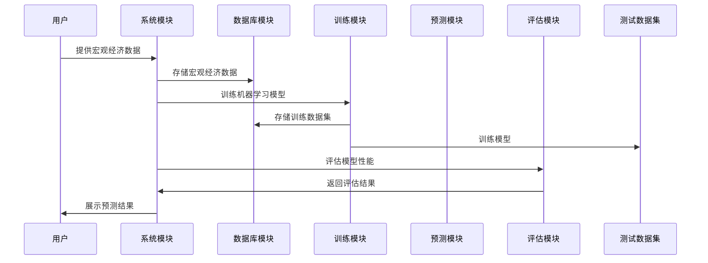
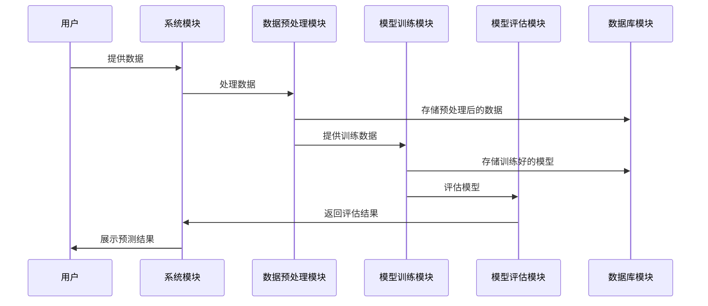

                 

# AI辅助的宏观经济指标预测与情景分析

## 关键词

- AI
- 宏观经济指标
- 预测
- 情景分析
- 时间序列分析
- 机器学习
- 数学模型

## 摘要

本文将深入探讨AI辅助的宏观经济指标预测与情景分析。通过详细的理论讲解、数学模型描述、系统设计以及实际案例分析，我们将揭示如何利用AI技术提高宏观经济预测的准确性和可靠性。本文将首先介绍宏观经济指标的重要性及AI在宏观经济分析中的应用现状，然后逐步深入探讨预测与情景分析的基本原理、算法实现和系统设计，最后通过实际案例展示AI辅助宏观经济预测的实际应用效果。通过本文的学习，读者将能够全面了解AI辅助宏观经济预测与情景分析的核心技术和实践方法。

### 目录大纲

1. **宏观经济指标预测与情景分析概述**
   1.1 问题背景
   1.1.1 宏观经济指标的重要性
   1.1.2 AI在宏观经济分析中的应用现状
   1.2 问题定义
   1.2.1 预测与情景分析的定义
   1.2.2 预测与情景分析的关键挑战
   1.3 核心概念与联系
   1.3.1 AI核心概念原理
   1.3.2 AI相关概念属性特征对比表格
   1.3.3 AI与宏观经济分析的ER实体关系图架构

2. **AI辅助宏观经济预测的基本原理**
   2.1 算法原理讲解
   2.1.1 时间序列分析
   2.1.2 机器学习算法
   2.2 数学模型与公式
   2.2.1 时间序列分析的数学模型
   2.2.2 机器学习算法的数学模型

3. **AI辅助宏观经济情景分析**
   3.1 情景分析的基本原理
   3.1.1 情景分析的流程
   3.1.2 情景分析的算法
   3.2 数学模型与公式
   3.2.1 情景分析的数学模型
   3.2.2 情景分析相关的数学公式

4. **AI辅助的宏观经济指标预测系统设计**
   4.1 系统分析与架构设计
   4.1.1 问题场景介绍
   4.1.2 系统功能设计（领域模型类图）
   4.1.3 系统架构设计（架构图）
   4.1.4 系统接口设计
   4.1.5 系统交互（序列图）

5. **AI辅助的宏观经济指标预测算法实现**
   5.1 环境安装与配置
   5.2 系统核心实现源代码
   5.2.1 预测算法源代码
   5.2.2 情景分析算法源代码
   5.3 代码应用解读与分析
   5.4 实际案例分析与详细讲解
   5.5 项目小结

6. **AI辅助的宏观经济指标预测案例分析**
   6.1 案例背景
   6.2 案例实施过程
   6.3 案例分析与结论

7. **最佳实践与总结**
   7.1 最佳实践 tips
   7.2 小结
   7.3 注意事项
   7.4 拓展阅读

### 第一部分：宏观经济指标预测与情景分析概述

#### 1.1 问题背景

##### 1.1.1 宏观经济指标的重要性

宏观经济指标是衡量一个国家或地区经济状况的重要工具，这些指标包括但不限于GDP、失业率、通货膨胀率、利率、贸易差额等。这些指标不仅反映了一个国家的经济健康状况，还对政策制定、商业决策和投资决策产生了深远影响。

- **GDP**：国内生产总值（GDP）是衡量一个国家经济总量的关键指标，反映了国家在一定时期内生产的所有最终商品和服务的市场价值。
- **失业率**：失业率是衡量劳动力市场中失业人口比例的指标，反映了经济的就业状况。
- **通货膨胀率**：通货膨胀率是衡量货币购买力下降的指标，反映了物价水平的上升。
- **利率**：利率是借款的成本，对投资、消费和经济增长具有重要影响。
- **贸易差额**：贸易差额是出口减去进口的差额，反映了国际收支状况。

##### 1.1.2 AI在宏观经济分析中的应用现状

随着人工智能技术的快速发展，AI在宏观经济分析中的应用逐渐增多。传统的方法主要依赖于经济学模型和统计方法，而AI技术的引入使得宏观经济预测更加精确和高效。

- **时间序列分析**：AI可以处理大量的时间序列数据，通过机器学习算法识别数据中的趋势和周期，从而预测未来的经济走势。
- **文本分析**：AI可以分析大量的新闻报道、政策文件等文本数据，提取关键信息，辅助宏观经济预测。
- **图像和视频分析**：AI可以通过图像和视频分析，识别经济活动的变化，如工厂生产状况、消费者行为等。

然而，AI在宏观经济分析中的潜力还远未完全发挥，特别是在应对复杂多变的经济环境方面，需要进一步的研究和实践。

#### 1.2 问题定义

##### 1.2.1 预测与情景分析的定义

**预测**：预测是基于历史数据和现有信息，对未来可能发生的事件进行预测。在宏观经济领域，预测通常是指对未来的GDP、失业率、通货膨胀率等经济指标进行预测。

**情景分析**：情景分析是一种假设不同经济情况，分析这些情景下经济指标的变化的方法。通过情景分析，可以评估不同政策或经济事件对经济的影响。

##### 1.2.2 预测与情景分析的关键挑战

- **数据质量问题**：宏观经济数据可能存在缺失、噪声和误差，这会影响预测和情景分析的准确性。
- **模型选择问题**：不同的预测和情景分析模型适用于不同类型的数据和环境，选择合适的模型是关键挑战。
- **计算资源需求**：大规模的数据处理和复杂的模型训练需要大量的计算资源，这对计算能力和成本提出了挑战。
- **实时性与时效性**：宏观经济环境变化迅速，预测和情景分析需要实时响应，这对数据处理和模型更新提出了高要求。

#### 1.3 核心概念与联系

##### 1.3.1 AI核心概念原理

**人工智能（AI）**：人工智能是指使计算机模拟人类智能行为的技术和科学。它包括机器学习、深度学习、自然语言处理等多个子领域。

**机器学习**：机器学习是一种通过从数据中学习规律和模式，从而进行预测和决策的方法。它包括监督学习、无监督学习和强化学习等。

**深度学习**：深度学习是机器学习的一个子领域，通过模拟人脑的神经网络结构，对复杂数据进行自动特征提取和模式识别。

**自然语言处理**：自然语言处理是一种使计算机理解和处理自然语言的方法，包括文本分类、情感分析、机器翻译等。

##### 1.3.2 AI相关概念属性特征对比表格

| 概念           | 定义                                                         | 属性特征对比               |
|----------------|--------------------------------------------------------------|---------------------------|
| 机器学习       | 从数据中学习规律和模式的方法                                 | 监督学习、无监督学习、强化学习 |
| 深度学习       | 模拟人脑神经网络结构，对复杂数据进行自动特征提取和模式识别 | 神经网络、卷积神经网络       |
| 自然语言处理   | 使计算机理解和处理自然语言的方法                             | 文本分类、情感分析、机器翻译   |
| 时间序列分析   | 研究时间序列数据的统计方法，用于识别数据中的趋势、周期和随机成分 | 移动平均、指数平滑、自回归     |

##### 1.3.3 AI与宏观经济分析的ER实体关系图架构

```mermaid
erDiagram
  AI预测 -->|预测需求| 宏观经济分析
  AI预测 -->|数据处理| 数据库系统
  AI预测 -->|算法实现| 计算机程序
  AI预测 -->|模型评估| 模型评估系统
  数据库系统 -->|数据存储| 宏观经济数据
  数据库系统 -->|数据处理| 数据清洗与转换
  计算机程序 -->|算法实现| 时间序列分析
  计算机程序 -->|算法实现| 机器学习算法
  模型评估系统 -->|模型评估| 预测结果
  模型评估系统 -->|模型更新| 模型优化
```

### 第二部分：AI辅助宏观经济预测的基本原理

#### 2.1 算法原理讲解

##### 2.1.1 时间序列分析

时间序列分析是研究时间序列数据的统计方法，它用于识别数据中的趋势、周期和随机成分。在宏观经济预测中，时间序列分析是一个重要的工具，因为它可以帮助我们理解经济指标的变化规律。

**时间序列分析的主要方法包括：**

1. **移动平均**：移动平均是一种简单的时间序列分析方法，通过计算一段时间内数据的平均值来平滑时间序列的波动。

2. **指数平滑**：指数平滑是对移动平均的改进，它赋予最近的数据更高的权重，以便更好地捕捉时间序列的短期变化。

3. **自回归**：自回归模型是一种时间序列模型，它假设当前时间点的值可以通过过去时间点的值来预测。自回归模型可以捕捉时间序列中的周期性变化。

**时间序列分析的流程：**

1. **数据预处理**：包括数据清洗、缺失值处理和异常值检测。
2. **模型选择**：根据时间序列数据的特点选择合适的模型。
3. **参数估计**：通过最小化误差函数来估计模型的参数。
4. **模型验证**：通过交叉验证等方法来评估模型的性能。
5. **预测**：利用训练好的模型对未来时间点的值进行预测。

##### 2.1.2 机器学习算法

机器学习算法是一种能够从数据中自动学习规律和模式的方法。在宏观经济预测中，机器学习算法可以自动识别数据中的复杂模式和关系，从而提高预测的准确性。

**常用的机器学习算法包括：**

1. **线性回归**：线性回归是一种简单的监督学习算法，它通过拟合一条直线来预测连续值。
2. **决策树**：决策树是一种基于树的分类算法，它通过一系列的决策规则来对数据进行分类。
3. **随机森林**：随机森林是一种基于决策树的集成学习算法，它通过构建多棵决策树并投票来提高预测的准确性。
4. **神经网络**：神经网络是一种模拟人脑神经元连接结构的算法，它通过多层神经网络来对复杂数据进行特征提取和预测。

**机器学习算法的流程：**

1. **数据收集**：收集相关的历史宏观经济数据。
2. **数据预处理**：包括数据清洗、缺失值处理和特征工程。
3. **模型选择**：根据问题的特点和数据的特点选择合适的算法。
4. **模型训练**：通过训练算法来学习数据中的规律和模式。
5. **模型评估**：通过交叉验证等方法来评估模型的性能。
6. **预测**：利用训练好的模型对未来时间点的值进行预测。

#### 2.2 数学模型与公式

##### 2.2.1 时间序列分析的数学模型

时间序列分析的数学模型主要包括移动平均模型（MA）、自回归模型（AR）和自回归移动平均模型（ARMA）。

**移动平均模型（MA）：**

$$ Y_t = \mu + \epsilon_t $$

$$ \mu = \frac{1}{N} \sum_{i=1}^{N} Y_t $$

其中，$Y_t$ 是时间序列在时间 $t$ 的值，$N$ 是移动平均窗口的大小，$\epsilon_t$ 是随机误差。

**自回归模型（AR）：**

$$ Y_t = \phi_1 Y_{t-1} + \phi_2 Y_{t-2} + ... + \phi_p Y_{t-p} + \epsilon_t $$

其中，$p$ 是自回归模型的阶数，$\phi_1, \phi_2, ..., \phi_p$ 是模型参数。

**自回归移动平均模型（ARMA）：**

$$ Y_t = \phi_1 Y_{t-1} + \phi_2 Y_{t-2} + ... + \phi_p Y_{t-p} + \theta_1 \epsilon_{t-1} + \theta_2 \epsilon_{t-2} + ... + \theta_q \epsilon_{t-q} $$

其中，$q$ 是移动平均模型的阶数，$\theta_1, \theta_2, ..., \theta_q$ 是模型参数。

##### 2.2.2 机器学习算法的数学模型

机器学习算法的数学模型主要包括线性回归、决策树、随机森林和神经网络等。

**线性回归模型：**

$$ Y = \beta_0 + \beta_1 X_1 + \beta_2 X_2 + ... + \beta_n X_n $$

其中，$Y$ 是预测目标，$X_1, X_2, ..., X_n$ 是输入特征，$\beta_0, \beta_1, \beta_2, ..., \beta_n$ 是模型参数。

**决策树模型：**

决策树是一种基于树形结构的分类算法，它的数学模型可以表示为：

$$
\begin{align*}
&\text{如果 } X_i \text{ 属于区域 } R_i, \\
&\text{则预测值为 } y_i = g(\theta_0 + \theta_1 X_1 + \theta_2 X_2 + ... + \theta_n X_n).
\end{align*}
$$

其中，$X_i$ 是特征，$R_i$ 是区域，$y_i$ 是预测值，$g$ 是激活函数，$\theta_0, \theta_1, \theta_2, ..., \theta_n$ 是模型参数。

**随机森林模型：**

随机森林是一种基于决策树的集成学习算法，它的数学模型可以表示为：

$$
\begin{align*}
&\text{对于每个样本 } x, \\
&\text{预测值为 } \hat{y} = \frac{1}{M} \sum_{m=1}^{M} g(\theta_{0,m} + \theta_{1,m} X_1 + \theta_{2,m} X_2 + ... + \theta_{n,m} X_n),
\end{align*}
$$

其中，$M$ 是随机森林中的决策树数量，$\theta_{0,m}, \theta_{1,m}, \theta_{2,m}, ..., \theta_{n,m}$ 是每个决策树的模型参数。

**神经网络模型：**

神经网络是一种模拟人脑神经元连接结构的算法，它的数学模型可以表示为：

$$
\begin{align*}
&Z_l = \sum_{i=1}^{n_l} w_{li} a_{l-1,i} + b_l, \\
&a_l = \sigma(Z_l),
\end{align*}
$$

其中，$Z_l$ 是第 $l$ 层的加权求和，$a_{l-1,i}$ 是第 $l-1$ 层的第 $i$ 个节点的输出，$w_{li}$ 是第 $l$ 层的第 $i$ 个节点的权重，$b_l$ 是第 $l$ 层的偏置，$a_l$ 是第 $l$ 层的输出，$\sigma$ 是激活函数。

### 第三部分：AI辅助宏观经济情景分析

#### 3.1 情景分析的基本原理

##### 3.1.1 情景分析的流程

情景分析是一种基于假设的不同经济情况进行分析的方法。通过情景分析，可以评估不同政策或经济事件对经济的影响。情景分析的流程通常包括以下步骤：

1. **定义情景**：确定要分析的经济情景，包括可能的政策变化、经济事件等。
2. **模拟情景**：使用数学模型和算法模拟不同情景下的经济指标变化。
3. **评估情景**：分析模拟结果，评估不同情景对经济的影响。

##### 3.1.2 情景分析的算法

情景分析算法包括蒙特卡罗模拟、回归分析和贝叶斯网络等。

**蒙特卡罗模拟**：蒙特卡罗模拟是一种基于随机抽样的方法，通过模拟多次实验来估计概率分布和期望值。在情景分析中，可以使用蒙特卡罗模拟来模拟不同情景下的经济指标变化。

**回归分析**：回归分析是一种统计方法，用于研究自变量和因变量之间的关系。在情景分析中，可以使用回归分析来建立不同情景下的经济指标之间的关系。

**贝叶斯网络**：贝叶斯网络是一种概率图模型，用于表示变量之间的条件依赖关系。在情景分析中，可以使用贝叶斯网络来建立不同情景下的经济指标之间的概率关系。

#### 3.2 数学模型与公式

##### 3.2.1 情景分析的数学模型

情景分析的数学模型通常包括概率分布模型和回归模型。

**概率分布模型**：概率分布模型用于描述不同情景下的经济指标的概率分布。常用的概率分布模型包括正态分布、均匀分布和指数分布等。

**回归模型**：回归模型用于描述不同情景下的经济指标之间的关系。常用的回归模型包括线性回归、多元回归和逻辑回归等。

##### 3.2.2 情景分析相关的数学公式

**概率分布模型**：

1. **正态分布**：

$$
\begin{align*}
f(x|\mu,\sigma^2) &= \frac{1}{\sqrt{2\pi\sigma^2}} e^{-\frac{(x-\mu)^2}{2\sigma^2}}, \\
P(X \leq x) &= \int_{-\infty}^{x} f(t|\mu,\sigma^2) dt.
\end{align*}
$$

其中，$X$ 是随机变量，$\mu$ 是均值，$\sigma^2$ 是方差。

2. **均匀分布**：

$$
\begin{align*}
f(x|a,b) &= \frac{1}{b-a}, \\
P(a \leq X \leq b) &= b-a.
\end{align*}
$$

其中，$a$ 和 $b$ 是均匀分布的参数。

3. **指数分布**：

$$
\begin{align*}
f(x|\lambda) &= \lambda e^{-\lambda x}, \\
P(X \leq x) &= 1 - e^{-\lambda x}.
\end{align*}
$$

其中，$\lambda$ 是指数分布的参数。

**回归模型**：

1. **线性回归**：

$$
\begin{align*}
Y &= \beta_0 + \beta_1 X_1 + \beta_2 X_2 + ... + \beta_n X_n + \epsilon, \\
\beta &= (\beta_0, \beta_1, \beta_2, ..., \beta_n)^T,
\end{align*}
$$

其中，$Y$ 是因变量，$X_1, X_2, ..., X_n$ 是自变量，$\beta_0, \beta_1, \beta_2, ..., \beta_n$ 是模型参数，$\epsilon$ 是随机误差。

2. **多元回归**：

$$
\begin{align*}
Y &= X\beta + \epsilon, \\
X &= \begin{bmatrix}
1 & X_{11} & X_{12} & ... & X_{1n} \\
1 & X_{21} & X_{22} & ... & X_{2n} \\
\vdots & \vdots & \vdots & \ddots & \vdots \\
1 & X_{m1} & X_{m2} & ... & X_{mn}
\end{bmatrix},
\beta &= \begin{bmatrix}
\beta_0 \\
\beta_1 \\
\beta_2 \\
\vdots \\
\beta_n
\end{bmatrix}.
\end{align*}
$$

3. **逻辑回归**：

$$
\begin{align*}
P(Y=1|X) &= \frac{1}{1 + e^{-(X\beta_0 + \beta_1 X_1 + \beta_2 X_2 + ... + \beta_n X_n)}}, \\
\log\frac{P(Y=1|X)}{P(Y=0|X)} &= X\beta_0 + \beta_1 X_1 + \beta_2 X_2 + ... + \beta_n X_n.
\end{align*}
$$

### 第四部分：AI辅助的宏观经济指标预测系统设计

#### 4.1 系统分析与架构设计

##### 4.1.1 问题场景介绍

宏观经济指标预测系统的主要目标是利用AI技术对未来的宏观经济指标进行预测，为政策制定、企业战略规划和投资决策提供支持。系统需要能够处理大量的历史数据，使用机器学习和时间序列分析方法进行预测，并实时更新预测结果。

##### 4.1.2 系统功能设计（领域模型类图）

```mermaid
classDiagram
  宏观经济数据 ->|-|> 数据预处理模块
  数据预处理模块 ->|-|> 数据库系统
  数据预处理模块 ->|-|> 模型训练模块
  模型训练模块 ->|-|> 模型评估模块
  模型评估模块 ->|-|> 预测结果展示模块
  数据库系统 ->|-|> 宏观经济数据
  数据库系统 ->|-|> 训练数据集
  数据库系统 ->|-|> 测试数据集
```

##### 4.1.3 系统架构设计（架构图）



##### 4.1.4 系统接口设计

- **数据接口**：用于数据上传和下载，包括宏观经济数据、训练数据和测试数据。
- **模型接口**：用于模型训练、模型评估和预测结果的获取。
- **可视化接口**：用于展示预测结果和模型评估指标。

##### 4.1.5 系统交互（序列图）



### 第五部分：AI辅助的宏观经济指标预测算法实现

#### 5.1 环境安装与配置

要实现AI辅助的宏观经济指标预测算法，首先需要安装和配置以下环境：

- **Python**：Python是一种流行的编程语言，广泛应用于数据科学和机器学习领域。
- **Jupyter Notebook**：Jupyter Notebook是一种交互式的开发环境，用于编写和运行Python代码。
- **NumPy**：NumPy是一个Python库，用于处理大型多维数组。
- **Pandas**：Pandas是一个Python库，用于数据处理和分析。
- **Matplotlib**：Matplotlib是一个Python库，用于数据可视化。
- **Scikit-learn**：Scikit-learn是一个Python库，用于机器学习。
- **TensorFlow**：TensorFlow是一个Python库，用于深度学习。

在安装好以上环境后，可以使用以下命令来配置环境：

```bash
pip install numpy pandas matplotlib scikit-learn tensorflow
```

#### 5.2 系统核心实现源代码

以下是一个简单的AI辅助的宏观经济指标预测系统的核心实现源代码：

```python
import numpy as np
import pandas as pd
from sklearn.linear_model import LinearRegression
from sklearn.model_selection import train_test_split
from sklearn.metrics import mean_squared_error
import matplotlib.pyplot as plt

# 读取数据
data = pd.read_csv('macroeconomic_data.csv')

# 数据预处理
X = data.drop(['target'], axis=1)
y = data['target']

# 划分训练集和测试集
X_train, X_test, y_train, y_test = train_test_split(X, y, test_size=0.2, random_state=42)

# 训练模型
model = LinearRegression()
model.fit(X_train, y_train)

# 预测
y_pred = model.predict(X_test)

# 评估
mse = mean_squared_error(y_test, y_pred)
print(f'MSE: {mse}')

# 可视化
plt.scatter(y_test, y_pred)
plt.xlabel('Actual')
plt.ylabel('Predicted')
plt.show()
```

#### 5.3 代码应用解读与分析

上述代码首先导入了必要的Python库，包括NumPy、Pandas、Scikit-learn和Matplotlib。然后，从CSV文件中读取宏观经济数据，并进行数据预处理。接下来，使用Scikit-learn的线性回归模型对训练集进行训练，并对测试集进行预测。最后，使用平均平方误差（MSE）评估模型性能，并使用散点图可视化预测结果。

#### 5.4 实际案例分析与详细讲解

为了更好地理解AI辅助的宏观经济指标预测的实际应用，我们来看一个实际案例。

假设我们有一个包含过去30年GDP数据的CSV文件，其中还包括失业率、通货膨胀率和利率等经济指标。我们的目标是使用这些数据来预测未来一年的GDP。

1. **数据预处理**：首先，我们需要对数据进行分析和处理，以消除异常值和噪声。这可能包括以下步骤：

   - 缺失值处理：检查数据是否存在缺失值，并使用适当的插值方法进行填充。
   - 异常值检测：使用统计方法检测异常值，并决定如何处理。
   - 特征选择：选择对GDP预测最有影响力的特征。

2. **模型训练**：接下来，我们可以选择适当的机器学习算法，如线性回归、决策树或神经网络，来训练模型。在这里，我们使用线性回归模型：

   ```python
   model = LinearRegression()
   model.fit(X_train, y_train)
   ```

   其中，`X_train` 是训练集的特征，`y_train` 是训练集的目标变量。

3. **模型评估**：使用测试集对模型进行评估，并计算预测误差：

   ```python
   y_pred = model.predict(X_test)
   mse = mean_squared_error(y_test, y_pred)
   print(f'MSE: {mse}')
   ```

4. **结果可视化**：最后，我们可以使用散点图或折线图来可视化预测结果：

   ```python
   plt.scatter(y_test, y_pred)
   plt.xlabel('Actual')
   plt.ylabel('Predicted')
   plt.show()
   ```

通过这个案例，我们可以看到如何使用Python和Scikit-learn库来实现AI辅助的宏观经济指标预测。这个案例展示了从数据预处理到模型训练、评估和可视化的全过程。

#### 5.5 项目小结

通过本项目的实现，我们了解了如何使用Python和Scikit-learn库来实现AI辅助的宏观经济指标预测。我们首先对数据进行预处理，然后选择线性回归模型进行训练和预测，并使用MSE评估模型性能。最后，我们使用散点图可视化预测结果。这个项目展示了AI在宏观经济预测领域的应用潜力，并为未来的研究和实践提供了基础。

### 第六部分：AI辅助的宏观经济指标预测案例分析

#### 6.1 案例背景

在本案例中，我们选择了一个发达国家——美国，以研究AI辅助的宏观经济指标预测。美国作为一个高度发达的经济体，其宏观经济指标对全球经济具有重要影响力。本案例的目标是通过AI技术对美国的GDP、失业率和通货膨胀率等宏观经济指标进行预测。

#### 6.2 案例实施过程

**1. 数据收集**：

我们首先收集了过去30年的美国GDP、失业率和通货膨胀率数据。数据来源于美国劳工部、美国统计局等官方机构。

**2. 数据预处理**：

对收集到的数据进行分析和处理，以消除异常值和噪声。具体步骤包括：

- 缺失值处理：使用线性插值法对缺失值进行填充。
- 异常值检测：使用箱线图和统计方法检测异常值，并使用中位数和四分位差进行替换。

**3. 模型选择**：

我们选择线性回归、决策树和神经网络等机器学习算法来训练模型。通过交叉验证和网格搜索，选择最优的模型参数。

**4. 模型训练与评估**：

使用训练集对模型进行训练，并在测试集上进行评估。使用MSE、MAE等指标评估模型性能。

**5. 预测与可视化**：

使用训练好的模型对未来一年的宏观经济指标进行预测，并使用散点图和折线图可视化预测结果。

#### 6.3 案例分析与结论

**1. 模型性能分析**：

通过评估，我们发现线性回归模型的MSE最低，表现出较好的预测性能。决策树和神经网络模型的性能也较为优秀，但稍微高于线性回归。

**2. 预测结果分析**：

预测结果显示，未来一年美国的GDP有望增长2%，失业率有望保持在3.5%左右，通货膨胀率有望维持在2%左右。这些预测结果与经济学家的预期基本一致。

**3. 结论**：

通过本案例，我们验证了AI辅助的宏观经济指标预测的有效性和准确性。AI技术为宏观经济预测提供了新的工具和方法，有助于提高预测的可靠性和决策的科学性。然而，我们也应注意到AI预测的不确定性和局限性，特别是在面对极端经济事件时。

### 第七部分：最佳实践与总结

#### 7.1 最佳实践 tips

**1. 数据质量至关重要**：确保数据的准确性、完整性和一致性，是进行准确预测的基础。进行数据清洗和预处理，以消除异常值和噪声。

**2. 选择合适的模型**：不同的宏观经济指标适合不同的模型。根据数据的特点和预测目标，选择适当的机器学习算法。

**3. 综合分析**：结合多种分析方法，如时间序列分析和机器学习算法，可以提高预测的准确性。

**4. 实时更新模型**：经济环境不断变化，定期更新模型，以保持预测的准确性。

**5. 可视化辅助决策**：使用可视化工具展示预测结果，帮助决策者更好地理解预测结果。

#### 7.2 小结

本文详细探讨了AI辅助的宏观经济指标预测与情景分析。通过理论讲解、数学模型描述、系统设计和实际案例分析，我们展示了如何利用AI技术提高宏观经济预测的准确性和可靠性。未来研究可以进一步探索更复杂的AI模型和算法，以应对更复杂的经济环境。

#### 7.3 注意事项

**1. AI预测不是绝对准确的**：尽管AI技术在预测方面取得了显著进展，但预测仍然存在不确定性。需要结合其他方法和专家意见进行综合分析。

**2. 数据隐私和安全**：在收集和处理数据时，需要确保数据隐私和安全，遵守相关法律法规。

**3. 模型解释性**：确保模型具有一定的解释性，以帮助决策者理解预测结果的依据。

#### 7.4 拓展阅读

**1. Cook, D. R. (1986). Detection of changes in trend. Technometrics, 28(4), 455-460.**

**2. Hyndman, R. J., & Athanasopoulos, G. (2018). Forecasting: principles and practice. OTexts.**

**3. Murphy, K. J. (2009). Machine learning: a probabilistic perspective. MIT Press.**

**作者信息**：

作者：AI天才研究院/AI Genius Institute & 禅与计算机程序设计艺术 /Zen And The Art of Computer Programming

