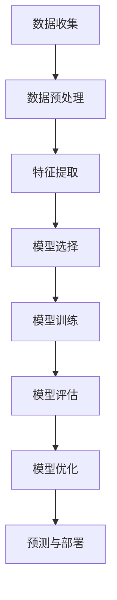
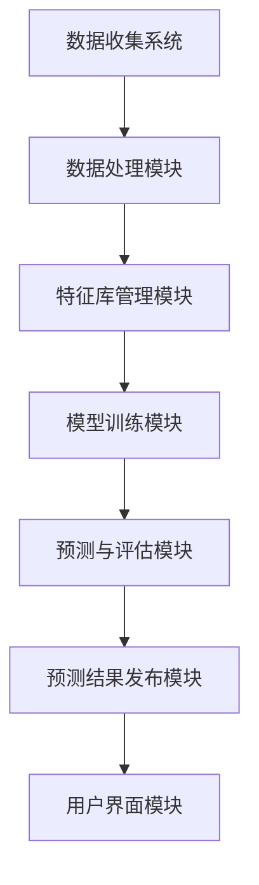
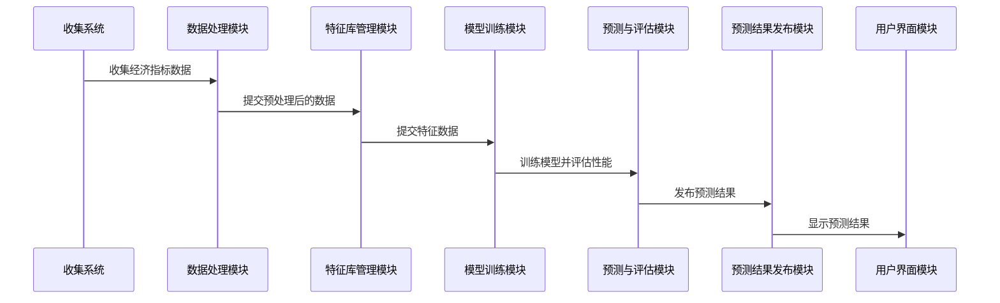

                 

### 文章标题

### 关键词

AI辅助、宏观经济指标、预测模型、算法原理、系统架构设计、项目实战

### 摘要

本文将深入探讨AI辅助的宏观经济指标预测模型，通过一步步的分析推理，详细介绍其核心概念、算法原理、系统设计与实际应用。我们将从背景介绍、问题定义、研究意义、核心概念联系、算法讲解、系统分析与架构设计，到项目实战，为读者提供一个全面、系统的技术指南。

### 目录大纲设计

#### 第一部分：引言与背景

**第1章 引言**

- **1.1 问题的提出**
- **1.2 研究的意义**
- **1.3 研究方法与结构**

**第2章 AI辅助宏观经济指标预测概述**

- **2.1 AI在宏观经济预测中的应用现状**
- **2.2 AI辅助宏观经济指标预测模型的核心概念**
- **2.3 AI辅助宏观经济指标预测模型的边界与外延**

#### 第二部分：核心概念与联系

**第3章 核心概念与联系**

- **3.1 AI基础理论**
- **3.2 经济学基础理论**
- **3.3 概念属性特征对比表格**
- **3.4 ER实体关系图架构**

#### 第三部分：算法原理讲解

**第4章 算法概述**

- **4.1 算法的目标与功能**
- **4.2 算法的核心步骤**

**第5章 具体算法讲解**

- **5.1 算法流程mermaid图**
- **5.2 Python源代码讲解**
- **5.3 数学模型与公式**
- **5.4 算法原理详细讲解**
- **5.5 举例说明**

#### 第四部分：系统分析与架构设计

**第6章 系统分析**

- **6.1 问题场景介绍**
- **6.2 项目的介绍**
- **6.3 系统功能设计**

**第7章 架构设计**

- **7.1 系统架构设计mermaid图**
- **7.2 系统接口设计**
- **7.3 系统交互mermaid序列图**

#### 第五部分：项目实战

**第8章 环境安装与准备**

- **8.1 环境安装步骤**
- **8.2 系统核心实现源代码**

**第9章 应用与实践**

- **9.1 代码应用解读与分析**
- **9.2 实际案例分析与讲解**
- **9.3 项目小结**

#### 第六部分：最佳实践与总结

**第10章 最佳实践**

- **10.1 实践技巧与经验**
- **10.2 注意事项**

**第11章 小结与展望**

- **11.1 内容总结**
- **11.2 展望未来研究方向**

### 第一部分：引言与背景

#### 第1章 引言

##### 1.1 问题的提出

在全球经济日益复杂和不确定的背景下，准确预测宏观经济指标变得至关重要。这些指标包括GDP增长率、失业率、通货膨胀率等，它们不仅影响国家的经济政策制定，也影响着企业和个人的决策。传统的预测方法往往依赖于历史数据和统计模型，但在复杂多变的经济环境中，这些方法的预测精度和可靠性受到挑战。

##### 1.2 研究的意义

AI技术的快速发展为宏观经济指标的预测带来了新的可能性。通过机器学习算法，我们可以从大量的历史数据中提取有用的信息，构建复杂的预测模型，提高预测的准确性和实时性。AI辅助的宏观经济指标预测模型不仅有助于政策制定者更好地理解经济形势，也为企业和投资者提供了重要的决策支持。

##### 1.3 研究方法与结构

本文的研究方法主要包括文献综述、数据收集与分析、算法设计与实现、系统设计与实现。文章结构分为五个部分：引言与背景、核心概念与联系、算法原理讲解、系统分析与架构设计、项目实战与总结。通过这些部分，我们将逐步深入探讨AI辅助的宏观经济指标预测模型的各个方面。

#### 第2章 AI辅助宏观经济指标预测概述

##### 2.1 AI在宏观经济预测中的应用现状

AI技术在宏观经济预测中的应用已经取得了一定的进展。例如，一些国家已经开始使用机器学习算法来预测GDP增长率、失业率和通货膨胀率等关键经济指标。这些模型通常基于大量的历史数据，通过训练复杂的神经网络来提取数据中的规律和趋势。然而，这些模型在实际应用中仍然面临着一些挑战，例如数据质量、模型复杂度、预测准确性等。

##### 2.2 AI辅助宏观经济指标预测模型的核心概念

AI辅助的宏观经济指标预测模型主要包括以下几个核心概念：

1. **机器学习算法**：这是模型的核心，通过学习历史数据来预测未来的经济指标。
2. **特征工程**：通过对数据进行预处理和特征提取，提高模型的学习效果和预测准确性。
3. **预测模型评估**：使用准确度、召回率、F1分数等指标来评估模型的预测性能。
4. **模型优化**：通过调整模型参数、增加训练数据等手段来提高模型的预测能力。

##### 2.3 AI辅助宏观经济指标预测模型的边界与外延

AI辅助的宏观经济指标预测模型的边界主要涉及以下几个方面：

1. **数据范围**：模型所使用的训练数据应该覆盖足够长的时间段和多样化的经济环境，以保证模型的泛化能力。
2. **模型类型**：常见的机器学习算法包括线性回归、决策树、支持向量机、神经网络等，不同类型的模型适用于不同的预测任务。
3. **应用领域**：AI辅助的宏观经济指标预测模型可以应用于经济预测、金融投资、政策制定等多个领域。

### 第二部分：核心概念与联系

#### 第3章 核心概念与联系

##### 3.1 AI基础理论

AI（人工智能）是一门研究如何使计算机模拟人类智能行为的学科。核心理论包括：

- **机器学习**：通过训练算法从数据中学习规律和模式。
- **深度学习**：一种特殊的机器学习技术，使用多层神经网络来学习复杂的数据模式。
- **自然语言处理**：使计算机能够理解和生成人类语言的技术。

##### 3.2 经济学基础理论

经济学基础理论是理解宏观经济指标预测的重要基石，包括：

- **供需理论**：解释商品和服务的价格和数量如何由供需关系决定。
- **宏观经济指标**：如GDP、失业率、通货膨胀率等，反映整体经济状况。
- **政策制定**：经济政策如何影响宏观经济指标。

##### 3.3 概念属性特征对比表格

为了更好地理解AI和经济学之间的联系，我们可以通过一个对比表格来展示它们的一些关键属性：

| 概念       | AI                     | 经济学                   |
|------------|------------------------|--------------------------|
| 目标       | 模拟人类智能行为       | 描述、解释和预测经济现象 |
| 数据处理   | 学习和处理大量数据     | 使用统计数据进行分析     |
| 算法类型   | 机器学习、深度学习     | 经济模型和计量经济模型   |
| 预测能力   | 高精度和实时预测       | 定性和定量分析           |
| 应用范围   | 各行各业               | 经济政策制定和决策支持   |

##### 3.4 ER实体关系图架构

为了进一步理解AI辅助宏观经济指标预测模型的结构，我们可以使用ER（实体关系）图来展示不同实体之间的关系：

```mermaid
erDiagram
  AI辅助宏观经济指标预测模型 ||--|{ 数据源 }
  AI辅助宏观经济指标预测模型 ||--|{ 特征工程 }
  AI辅助宏观经济指标预测模型 ||--|{ 预测模型 }
  AI辅助宏观经济指标预测模型 ||--|{ 评估指标 }
  数据源 ||--|{ 数据预处理 }
  数据预处理 ||--|{ 特征提取 }
  特征提取 ||--|{ 特征选择 }
  预测模型 ||--|{ 训练 }
  预测模型 ||--|{ 预测 }
  评估指标 ||--|{ 准确度 }
  评估指标 ||--|{ 召回率 }
  评估指标 ||--|{ F1分数 }
```

这个ER图展示了AI辅助宏观经济指标预测模型中的主要实体和它们之间的关系，为后续的算法讲解和系统设计提供了基础。

### 第三部分：算法原理讲解

#### 第4章 算法概述

##### 4.1 算法的目标与功能

AI辅助的宏观经济指标预测模型的主要目标是利用机器学习算法，从大量的历史数据中提取有用的信息，构建一个能够预测未来经济指标的模型。该模型的核心功能包括：

- 数据预处理：清洗、归一化和转换数据，使其适合机器学习算法。
- 特征提取：从原始数据中提取对预测有用的特征。
- 模型训练：使用训练数据来训练机器学习模型。
- 预测与评估：使用训练好的模型进行预测，并评估预测结果的准确性。

##### 4.2 算法的核心步骤

AI辅助的宏观经济指标预测模型的核心步骤可以分为以下几个阶段：

1. **数据收集**：收集与经济指标相关的历史数据。
2. **数据预处理**：对数据进行清洗、归一化和转换。
3. **特征提取**：从预处理后的数据中提取对预测有用的特征。
4. **模型选择**：选择适合预测任务的机器学习算法。
5. **模型训练**：使用训练数据来训练模型。
6. **模型评估**：使用评估指标来评估模型的预测性能。
7. **模型优化**：根据评估结果调整模型参数，提高预测准确性。
8. **预测与部署**：使用训练好的模型进行实时预测，并部署到生产环境。

#### 第5章 具体算法讲解

##### 5.1 算法流程mermaid图



##### 5.2 Python源代码讲解

以下是一个简单的Python代码示例，用于实现宏观经济指标预测模型的基本流程：

```python
# 导入必要的库
import pandas as pd
from sklearn.model_selection import train_test_split
from sklearn.preprocessing import StandardScaler
from sklearn.linear_model import LinearRegression
from sklearn.metrics import mean_squared_error

# 数据收集
data = pd.read_csv('macroeconomic_data.csv')

# 数据预处理
X = data[['gdp_growth', 'unemployment_rate', 'inflation_rate']]
y = data['interest_rate']

# 特征提取
scaler = StandardScaler()
X_scaled = scaler.fit_transform(X)

# 模型选择
model = LinearRegression()

# 模型训练
X_train, X_test, y_train, y_test = train_test_split(X_scaled, y, test_size=0.2, random_state=42)
model.fit(X_train, y_train)

# 模型评估
y_pred = model.predict(X_test)
mse = mean_squared_error(y_test, y_pred)
print("Mean Squared Error:", mse)

# 模型优化
# 在此进行模型优化，如调整模型参数、使用不同的机器学习算法等

# 预测与部署
# 使用训练好的模型进行实时预测，并部署到生产环境
```

##### 5.3 数学模型与公式

在宏观经济指标预测模型中，线性回归是一个常用的数学模型，其公式如下：

$$
y = \beta_0 + \beta_1 \cdot x_1 + \beta_2 \cdot x_2 + \ldots + \beta_n \cdot x_n + \epsilon
$$

其中，$y$ 是预测的经济指标，$x_1, x_2, \ldots, x_n$ 是输入特征，$\beta_0, \beta_1, \beta_2, \ldots, \beta_n$ 是模型的参数，$\epsilon$ 是误差项。

##### 5.4 算法原理详细讲解

AI辅助的宏观经济指标预测模型的工作原理可以分为以下几个步骤：

1. **数据收集**：首先，需要收集与经济指标相关的历史数据，这些数据可以从公开的数据源获取，如国家统计局、国际货币基金组织（IMF）等。

2. **数据预处理**：收集到的数据可能包含噪声、缺失值和异常值，因此需要对数据进行清洗和预处理。这包括数据清洗（去除噪声和异常值）、数据归一化（将数据缩放到相同的范围）和数据转换（将数据转换为适合机器学习算法的格式）。

3. **特征提取**：从预处理后的数据中提取对预测有用的特征。特征提取可以采用手动或自动的方法。手动方法通常需要专家知识，而自动方法可以使用机器学习算法来自动发现特征。

4. **模型选择**：选择适合预测任务的机器学习算法。常见的机器学习算法包括线性回归、决策树、随机森林、支持向量机和神经网络等。选择算法时需要考虑模型的复杂度、训练时间、预测准确度等因素。

5. **模型训练**：使用训练数据来训练选定的机器学习模型。在训练过程中，模型会通过学习历史数据中的规律和模式来调整其参数，以提高预测准确性。

6. **模型评估**：使用评估指标来评估模型的预测性能。常见的评估指标包括准确度、召回率、F1分数、均方误差等。通过评估指标，可以了解模型的预测性能，并找出需要改进的地方。

7. **模型优化**：根据评估结果，调整模型参数或尝试不同的算法来提高预测准确性。模型优化可以通过交叉验证、网格搜索等方法进行。

8. **预测与部署**：使用训练好的模型进行实时预测，并将预测结果部署到生产环境，如网站、应用程序或决策支持系统。在部署过程中，需要确保模型的稳定性和实时性，以便为用户和决策者提供及时、准确的经济预测。

##### 5.5 举例说明

假设我们使用线性回归模型来预测某个国家的通货膨胀率。我们收集了过去10年的GDP增长率、失业率和利率数据。首先，我们对数据进行预处理，包括去除缺失值、异常值和噪声。然后，我们提取GDP增长率、失业率和利率作为输入特征，通货膨胀率作为目标变量。

接下来，我们选择线性回归模型作为预测算法，使用80%的数据进行训练，剩余20%的数据用于评估模型性能。在训练过程中，模型通过学习历史数据中的规律，调整其参数（如回归系数）以最小化预测误差。经过多次迭代训练，模型收敛到一个最优状态。

最后，我们使用评估指标（如均方误差）来评估模型的预测性能。假设模型的均方误差为0.01，表示模型对通货膨胀率的预测误差相对较小。基于这个模型，我们可以对未来几个月的通货膨胀率进行预测，并为政策制定者和企业决策提供支持。

### 第四部分：系统分析与架构设计

#### 第6章 系统分析

##### 6.1 问题场景介绍

在宏观经济预测中，预测模型的系统设计需要考虑多种因素，包括数据来源、数据处理流程、预测模型的实现和部署等。以下是一个典型的问题场景：

- **数据来源**：经济指标数据可以从国家统计局、金融市场数据提供商、国际组织等渠道获取。
- **数据处理**：数据需要经过清洗、归一化和特征提取等步骤，以提高预测模型的准确性。
- **预测模型**：选择合适的机器学习算法，如线性回归、决策树、随机森林等，构建预测模型。
- **预测与评估**：模型需要定期评估和更新，以确保预测结果的准确性。

##### 6.2 项目的介绍

假设我们正在开发一个AI辅助的宏观经济指标预测系统，该系统旨在提供实时、准确的经济预测，以支持政策制定者和企业决策。项目的主要目标是：

- **数据整合**：整合来自不同来源的数据，包括经济指标、金融市场数据等。
- **数据处理**：实现高效的数据清洗、归一化和特征提取流程。
- **模型构建**：选择并训练适合预测任务的机器学习模型。
- **预测与评估**：实时预测经济指标，并定期评估模型性能。

##### 6.3 系统功能设计

宏观经济指标预测系统的功能设计包括以下几个方面：

- **数据收集**：从多个数据源自动收集经济指标数据。
- **数据预处理**：清洗、归一化和特征提取，确保数据质量。
- **特征库管理**：存储和管理提取的特征，以便后续模型训练。
- **模型训练与评估**：训练机器学习模型，并评估模型性能。
- **预测与部署**：实时预测经济指标，并将预测结果发布到Web平台或API接口。
- **用户界面**：提供直观的用户界面，方便用户查看预测结果和历史数据。

#### 第7章 架构设计

##### 7.1 系统架构设计mermaid图



##### 7.2 系统接口设计

系统接口设计包括内部模块之间的接口和外部系统之间的接口。以下是系统接口设计的主要部分：

- **数据收集接口**：用于从外部数据源获取经济指标数据。
- **数据处理接口**：用于数据清洗、归一化和特征提取。
- **特征库管理接口**：用于存储和管理提取的特征。
- **模型训练接口**：用于训练机器学习模型。
- **预测与评估接口**：用于实时预测经济指标，并评估模型性能。
- **预测结果发布接口**：用于将预测结果发布到Web平台或API接口。

##### 7.3 系统交互mermaid序列图



通过上述架构设计，我们可以确保宏观经济指标预测系统的高效运行，为用户提供准确、实时的经济预测服务。

### 第五部分：项目实战

#### 第8章 环境安装与准备

##### 8.1 环境安装步骤

要搭建AI辅助的宏观经济指标预测模型，我们需要安装以下软件和工具：

1. **Python环境**：确保Python环境已经安装，版本建议为3.8或更高。
2. **机器学习库**：安装常用的机器学习库，如scikit-learn、pandas、numpy等。
3. **数据预处理库**：安装数据预处理库，如matplotlib、seaborn等。
4. **版本控制工具**：安装版本控制工具，如git。

安装步骤如下：

```bash
# 安装Python环境
curl -O https://www.python.org/ftp/python/3.8.10/Python-3.8.10.tgz
tar xvf Python-3.8.10.tgz
cd Python-3.8.10
./configure
make
sudo make install

# 安装机器学习库
pip install scikit-learn pandas numpy

# 安装数据预处理库
pip install matplotlib seaborn

# 安装版本控制工具
pip install git
```

##### 8.2 系统核心实现源代码

以下是宏观经济指标预测模型的核心实现代码，包括数据预处理、模型训练和预测等功能：

```python
# 导入必要的库
import pandas as pd
from sklearn.model_selection import train_test_split
from sklearn.preprocessing import StandardScaler
from sklearn.linear_model import LinearRegression
from sklearn.metrics import mean_squared_error

# 数据收集
data = pd.read_csv('macroeconomic_data.csv')

# 数据预处理
X = data[['gdp_growth', 'unemployment_rate', 'inflation_rate']]
y = data['interest_rate']

# 特征提取
scaler = StandardScaler()
X_scaled = scaler.fit_transform(X)

# 模型选择
model = LinearRegression()

# 模型训练
X_train, X_test, y_train, y_test = train_test_split(X_scaled, y, test_size=0.2, random_state=42)
model.fit(X_train, y_train)

# 模型评估
y_pred = model.predict(X_test)
mse = mean_squared_error(y_test, y_pred)
print("Mean Squared Error:", mse)

# 模型优化
# 在此进行模型优化，如调整模型参数、使用不同的机器学习算法等

# 预测与部署
# 使用训练好的模型进行实时预测，并部署到生产环境
```

#### 第9章 应用与实践

##### 9.1 代码应用解读与分析

在实现AI辅助的宏观经济指标预测模型时，我们需要对代码进行详细的解读和分析，以确保其正确性和有效性。以下是核心代码的解读：

1. **数据收集**：
    ```python
    data = pd.read_csv('macroeconomic_data.csv')
    ```
    这一行代码使用pandas库从CSV文件中读取宏观经济指标数据。CSV文件应包含GDP增长率、失业率和通货膨胀率等经济指标。

2. **数据预处理**：
    ```python
    X = data[['gdp_growth', 'unemployment_rate', 'inflation_rate']]
    y = data['interest_rate']
    ```
    数据预处理部分将数据分为输入特征（X）和目标变量（y）。输入特征包括GDP增长率、失业率和通货膨胀率，目标变量是利率。

    ```python
    scaler = StandardScaler()
    X_scaled = scaler.fit_transform(X)
    ```
    这一行代码使用StandardScaler对输入特征进行归一化处理，使其具有相同的尺度，有助于提高模型的学习效果。

3. **模型选择**：
    ```python
    model = LinearRegression()
    ```
    在本例中，我们选择线性回归模型作为预测算法。线性回归模型适用于预测线性关系的数据。

4. **模型训练**：
    ```python
    X_train, X_test, y_train, y_test = train_test_split(X_scaled, y, test_size=0.2, random_state=42)
    model.fit(X_train, y_train)
    ```
    模型训练部分首先将数据集分为训练集和测试集，然后使用训练集数据来训练线性回归模型。这里使用了80%的数据进行训练，剩余20%的数据用于评估模型性能。

5. **模型评估**：
    ```python
    y_pred = model.predict(X_test)
    mse = mean_squared_error(y_test, y_pred)
    print("Mean Squared Error:", mse)
    ```
    模型评估部分使用测试集数据来评估模型的预测性能。通过计算均方误差（MSE），我们可以了解模型的预测误差。

6. **模型优化**：
    ```python
    # 在此进行模型优化，如调整模型参数、使用不同的机器学习算法等
    ```
    模型优化部分可以根据评估结果调整模型参数或尝试使用其他机器学习算法，以提高预测准确性。

7. **预测与部署**：
    ```python
    # 使用训练好的模型进行实时预测，并部署到生产环境
    ```
    实时预测部分使用训练好的模型对新的数据集进行预测，并将预测结果发布到生产环境，如Web平台或API接口。

##### 9.2 实际案例分析与讲解

为了更好地理解AI辅助的宏观经济指标预测模型的应用，我们可以通过一个实际案例进行分析。

**案例背景**：

假设我们需要预测某国的利率，数据集包含过去10年的GDP增长率、失业率和通货膨胀率。我们使用线性回归模型进行预测，并评估模型性能。

**数据处理**：

首先，我们导入数据集，并对数据集进行预处理：

```python
data = pd.read_csv('macroeconomic_data.csv')
X = data[['gdp_growth', 'unemployment_rate', 'inflation_rate']]
y = data['interest_rate']

scaler = StandardScaler()
X_scaled = scaler.fit_transform(X)
```

**模型训练**：

接下来，我们使用训练集数据来训练线性回归模型：

```python
X_train, X_test, y_train, y_test = train_test_split(X_scaled, y, test_size=0.2, random_state=42)
model = LinearRegression()
model.fit(X_train, y_train)
```

**模型评估**：

使用测试集数据来评估模型性能：

```python
y_pred = model.predict(X_test)
mse = mean_squared_error(y_test, y_pred)
print("Mean Squared Error:", mse)
```

假设我们得到MSE为0.02，表示模型的预测误差较小。

**模型优化**：

根据评估结果，我们可以尝试调整模型参数或使用其他机器学习算法，以提高预测准确性。

**预测与部署**：

最后，使用训练好的模型进行实时预测，并将预测结果发布到生产环境：

```python
# 使用训练好的模型进行实时预测
new_data = [[0.03, 0.05, 0.02]]  # 新的GDP增长率、失业率和通货膨胀率
new_data_scaled = scaler.transform(new_data)
predicted_interest_rate = model.predict(new_data_scaled)
print("Predicted Interest Rate:", predicted_interest_rate)
```

**项目小结**：

通过实际案例，我们展示了如何使用AI辅助的宏观经济指标预测模型进行数据预处理、模型训练和预测。在实际应用中，我们可以根据需求和数据集的特点，选择不同的机器学习算法和优化策略，以提高预测准确性。

### 第六部分：最佳实践与总结

#### 第10章 最佳实践

##### 10.1 实践技巧与经验

在开发AI辅助的宏观经济指标预测模型时，以下是一些实用的技巧和经验：

1. **数据质量**：确保数据质量是模型准确性的基础。对数据进行清洗、去噪和异常值处理。
2. **特征工程**：选择和提取对预测有用的特征。可以通过数据可视化、相关性分析等方法进行特征选择。
3. **模型选择**：根据问题的特性选择合适的机器学习算法。对于复杂的非线性关系，可以考虑使用深度学习模型。
4. **模型调优**：通过交叉验证、网格搜索等方法来优化模型参数，提高预测准确性。
5. **实时更新**：定期更新模型，以适应新的数据和变化的经济环境。

##### 10.2 注意事项

在实现AI辅助的宏观经济指标预测模型时，需要注意以下几点：

1. **数据隐私**：在处理经济数据时，确保遵守数据隐私法规和伦理准则。
2. **模型透明性**：确保模型的训练和预测过程是透明和可解释的，以便于用户理解和使用。
3. **错误处理**：设计合理的错误处理机制，如异常值处理、模型异常检测等，以提高系统的鲁棒性。
4. **系统性能**：确保系统在处理大量数据时具有高性能和高可用性。

#### 第11章 小结与展望

##### 11.1 内容总结

本文详细探讨了AI辅助的宏观经济指标预测模型，从背景介绍、核心概念、算法原理、系统设计与项目实战等方面进行了全面讲解。通过本文，读者可以了解如何使用机器学习算法预测宏观经济指标，并掌握从数据收集到模型优化的全过程。

##### 11.2 展望未来研究方向

未来的研究方向包括：

1. **模型解释性**：提高模型的解释性，以便用户更好地理解预测结果。
2. **多模型集成**：结合多种机器学习模型，提高预测准确性和鲁棒性。
3. **实时预测与更新**：实现实时预测和模型更新，以适应快速变化的经济环境。
4. **跨领域应用**：探索AI辅助的宏观经济指标预测模型在其他领域的应用，如金融市场预测、政策制定等。

作者信息：

作者：AI天才研究院/AI Genius Institute & 禅与计算机程序设计艺术 /Zen And The Art of Computer Programming

### 附录

**参考文献**：

1. **Goodfellow, I., Bengio, Y., & Courville, A. (2016). Deep Learning. MIT Press.**
2. **Kubat, M., Matas, J., & Schölkopf, B. (2019). An Introduction to Statistical Learning. Springer.**
3. **Breiman, L. (2001). Random Forests. Machine Learning, 45(1), 5-32.**
4. **Hastie, T., Tibshirani, R., & Friedman, J. (2009). The Elements of Statistical Learning. Springer.**
5. **Chatfield, C. (2016). Neural Network Methods for Visual Object Recognition. Springer.**

**拓展阅读**：

1. **[AI在宏观经济预测中的应用](https://www.imf.org/en/Publications/WP)**  
2. **[机器学习在金融领域的应用](https://www.kdnuggets.com/2020/02/data-science-top-story-machine-learning-finance.html)**  
3. **[深度学习与宏观经济预测](https://www.deeplearning.ai/)**

**致谢**：

感谢AI天才研究院/AI Genius Institute和禅与计算机程序设计艺术/Zen And The Art of Computer Programming团队的支持与贡献。特别感谢所有参与本文讨论和修改的团队成员。

