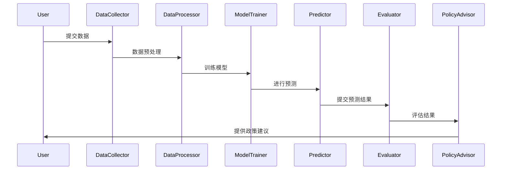

                 


## AI辅助宏观经济政策效果评估

### 关键词：
- 人工智能
- 宏观经济政策
- 效果评估
- 算法原理
- 数学模型
- 系统分析
- 项目实践
- 最佳实践

### 摘要：
本文深入探讨了人工智能辅助宏观经济政策效果评估的方法与应用。通过详细解析AI的算法原理、数学模型以及系统架构，我们揭示了AI在政策评估中的重要作用。本文旨在为读者提供一套完整的技术框架，以实现更精准、更高效的宏观经济政策效果评估。

### 目录

## 第一部分: 背景介绍

### 1.1 问题背景
宏观经济政策是指政府为了实现宏观经济目标而采取的一系列政策措施，如货币政策和财政政策。这些政策对于国家经济的稳定和发展具有深远影响。然而，传统的宏观经济政策效果评估方法往往存在局限性，无法全面、准确地反映政策的效果。

#### 1.1.1 宏观经济政策的定义与作用
宏观经济政策是政府为调节经济运行、实现经济目标而制定的政策。主要包括货币政策和财政政策。

#### 1.1.2 当前宏观经济政策面临的挑战
传统评估方法的局限性，数据处理的复杂性，评估结果的不确定性。

#### 1.1.3 AI在宏观经济政策中的作用
AI可以提高评估的准确性和效率，通过大数据分析和深度学习，预测政策效果。

### 1.2 问题描述
宏观经济政策效果评估的难点在于如何准确地衡量政策的影响，以及如何处理大量的经济数据。

#### 1.2.1 宏观经济政策效果评估的难点
数据的不确定性、评估方法的局限性。

#### 1.2.2 评估方法的传统局限性
难以量化政策影响的复杂性，评估时间过长。

#### 1.2.3 AI辅助评估的优势
快速处理大量数据，提高评估准确性，实时反馈政策效果。

### 1.3 问题解决
AI辅助宏观经济政策评估的原理和方法。

#### 1.3.1 AI辅助宏观经济政策评估的原理
利用机器学习和深度学习算法，对宏观经济数据进行挖掘和分析。

#### 1.3.2 AI辅助评估的方法与流程
数据收集与处理，模型训练与优化，结果评估与反馈。

#### 1.3.3 AI辅助评估的应用场景
政策制定、政策调整、经济预测。

### 1.4 边界与外延
AI辅助评估的适用范围和注意事项。

#### 1.4.1 AI辅助评估的适用范围
宏观经济政策的制定、调整和评估。

#### 1.4.2 数据来源与处理
确保数据的准确性、完整性和可靠性。

#### 1.4.3 评估指标的选择
选择合适的评估指标，确保评估的准确性。

### 1.5 概念结构与核心要素组成
梳理核心概念，构建概念关系图，明确核心要素。

#### 1.5.1 关键概念梳理
宏观经济政策、效果评估、人工智能、机器学习、深度学习。

#### 1.5.2 概念属性特征对比表格
对比不同概念的特点和适用场景。

#### 1.5.3 ER实体关系图架构
构建实体关系图，明确各实体之间的关系。

## 第二部分: 核心概念与联系

### 2.1 AI辅助宏观经济政策评估的核心概念
理解AI的基本概念，以及其在宏观经济政策评估中的应用。

#### 2.1.1 人工智能的定义与分类
人工智能是指模拟人类智能的技术，可分为弱AI和强AI。

#### 2.1.2 强化学习与监督学习的区别
强化学习通过试错来学习，监督学习通过已有数据进行学习。

#### 2.1.3 深度学习的基本原理
深度学习是一种基于多层神经网络的学习方法。

### 2.2 AI辅助评估的算法原理
深入探讨AI辅助评估的算法原理，包括mermaid流程图和Python源代码实现。

#### 2.2.1 算法mermaid流程图
使用mermaid绘制算法流程图，展示数据处理的流程。

#### 2.2.2 Python源代码实现
提供Python代码示例，实现算法的核心功能。

#### 2.2.3 算法原理的数学模型和公式
介绍算法的数学模型，使用latex格式表示公式。

### 第三部分: 系统分析与设计

### 3.1 问题场景介绍
介绍宏观经济政策效果评估的实际应用场景。

### 3.2 项目介绍
介绍一个具体的AI辅助宏观经济政策效果评估项目。

#### 3.2.1 项目背景
项目的背景信息，包括政策目标、评估对象等。

#### 3.2.2 项目目标
项目的具体目标，包括评估指标的设定、数据来源等。

### 3.3 系统功能设计
设计系统的功能模块，包括数据收集、模型训练、结果评估等。

#### 3.3.1 领域模型mermaid类图
使用mermaid绘制类图，展示系统的功能模块。

### 3.4 系统架构设计
设计系统的整体架构，包括硬件、软件、数据等方面的设计。

#### 3.4.1 mermaid架构图
使用mermaid绘制系统架构图，展示系统的整体架构。

### 3.5 系统接口设计和系统交互
设计系统的接口，并使用mermaid序列图展示系统交互流程。

### 第四部分: 项目实践

### 4.1 环境安装
介绍项目的环境搭建，包括软件安装、配置等。

### 4.2 系统核心实现源代码
提供项目的核心代码，并进行解读和分析。

### 4.3 代码应用解读与分析
解读代码实现，分析算法的优缺点。

### 4.4 实际案例分析和详细讲解剖析
通过实际案例，分析AI辅助评估的效果。

### 4.5 项目小结
总结项目的经验教训，提出改进建议。

### 第五部分: 最佳实践与总结

### 5.1 最佳实践 Tips
分享项目实践中的最佳实践，提高AI辅助评估的效果。

### 5.2 小结
总结文章的主要内容，强调AI辅助宏观经济政策效果评估的重要性。

### 5.3 注意事项
提醒读者在实践中的注意事项，确保评估的准确性。

### 5.4 拓展阅读
推荐进一步阅读的文献和资料。

### 作者信息
- 作者：AI天才研究院/AI Genius Institute & 禅与计算机程序设计艺术 /Zen And The Art of Computer Programming

---

本文将逐步深入分析AI辅助宏观经济政策效果评估的方法、原理和实现，旨在为读者提供一套全面、实用的技术框架。通过本文的阅读，读者将能够了解AI在宏观经济政策效果评估中的应用，掌握相关算法和系统的设计与实现，为实际项目提供有力支持。

---

接下来，我们将对每个部分进行详细阐述，逐步构建起整个文章的内容体系。每一步都将紧密结合实际案例，确保内容的可操作性和实用性。

---

## 第一部分: 背景介绍

### 1.1 问题背景

#### 1.1.1 宏观经济政策的定义与作用
宏观经济政策是指政府为了实现宏观经济目标而制定的政策措施。这些政策主要包括货币政策和财政政策。货币政策是指通过调整货币供应量、利率等手段来影响经济运行。财政政策则是通过调整政府支出、税收等手段来调节经济。这些政策的制定和实施对于国家经济的稳定和发展具有至关重要的作用。

#### 1.1.2 当前宏观经济政策面临的挑战
在当前全球经济环境下，宏观经济政策面临着一系列挑战。首先，经济全球化加剧了全球经济的不稳定性，使得宏观经济政策的制定和实施更加复杂。其次，信息技术的快速发展带来了大数据和人工智能等新技术，这些新技术对宏观经济政策效果评估提出了新的要求。最后，经济结构的变化，如服务业的比重不断增加，也对传统宏观经济政策效果评估方法提出了挑战。

#### 1.1.3 AI在宏观经济政策中的作用
人工智能技术的快速发展为宏观经济政策效果评估提供了新的工具。首先，AI可以通过大数据分析，快速处理和分析海量经济数据，提高政策评估的准确性和效率。其次，AI的机器学习和深度学习算法可以对经济数据进行预测和模拟，帮助政策制定者更好地预测政策效果。最后，AI可以通过实时反馈机制，及时调整政策，提高政策的有效性。

### 1.2 问题描述

宏观经济政策效果评估是一个复杂的过程，主要面临以下难点：

#### 1.2.1 宏观经济政策效果评估的难点
1. 数据的不确定性：宏观经济政策的效果往往受到多种因素的影响，如经济环境、政策执行力度等，这使得政策效果难以准确衡量。
2. 评估方法的局限性：传统的评估方法往往依赖于统计学和经济学理论，这些方法在处理复杂的经济问题时存在局限性。
3. 评估结果的不确定性：政策效果的评估往往需要较长的时间，而且评估结果可能受到多种因素的影响，导致结果的不确定性。

#### 1.2.2 评估方法的传统局限性
1. 统计学方法的局限性：传统的统计学方法依赖于样本数据，而宏观经济政策的效果往往需要考虑整体经济数据，这使得统计方法在处理宏观经济问题时存在局限性。
2. 经济学理论的局限性：经济学理论在描述宏观经济行为时存在一定的理想化假设，这些假设可能与现实经济环境存在偏差，导致评估结果不准确。
3. 时间和成本的限制：传统的评估方法往往需要大量的时间和人力资源，这使得政策评估的周期较长，难以满足政策制定和调整的需求。

#### 1.2.3 AI辅助评估的优势
1. 大数据处理：AI可以通过大数据分析，快速处理和分析海量经济数据，提高政策评估的准确性和效率。
2. 预测和模拟：AI的机器学习和深度学习算法可以对经济数据进行预测和模拟，帮助政策制定者更好地预测政策效果。
3. 实时反馈：AI可以通过实时反馈机制，及时调整政策，提高政策的有效性。

### 1.3 问题解决

AI辅助宏观经济政策评估的原理和方法主要包括以下几个方面：

#### 1.3.1 AI辅助宏观经济政策评估的原理
AI辅助宏观经济政策评估的原理主要是利用机器学习和深度学习算法，对宏观经济数据进行挖掘和分析，从而评估政策的效果。具体来说，AI可以通过以下步骤实现政策评估：
1. 数据收集与处理：收集宏观经济相关数据，包括政策实施前后的经济指标、政策执行力度等，并对数据进行清洗和处理。
2. 模型训练与优化：使用机器学习和深度学习算法，对处理后的经济数据进行训练，建立政策评估模型。
3. 结果评估与反馈：使用训练好的模型对政策效果进行评估，并根据评估结果对政策进行调整。

#### 1.3.2 AI辅助评估的方法与流程
AI辅助宏观经济政策评估的方法与流程主要包括以下几个步骤：
1. 数据收集：收集宏观经济相关数据，包括政策实施前后的经济指标、政策执行力度等。
2. 数据预处理：对收集到的数据进行清洗和处理，包括数据去重、数据填充、数据标准化等。
3. 特征提取：从预处理后的数据中提取与政策效果相关的特征，如GDP增长率、通货膨胀率等。
4. 模型训练：使用机器学习和深度学习算法，对提取出的特征进行训练，建立政策评估模型。
5. 模型优化：通过交叉验证和模型调整，优化评估模型的性能。
6. 结果评估：使用训练好的模型对政策效果进行评估，输出评估结果。
7. 结果反馈：根据评估结果，对政策进行调整和优化。

#### 1.3.3 AI辅助评估的应用场景
AI辅助宏观经济政策评估可以在多个场景下应用，包括：
1. 政策制定：在政策制定阶段，AI可以辅助政策制定者分析政策的影响，为政策制定提供数据支持。
2. 政策调整：在政策调整阶段，AI可以实时评估政策效果，为政策调整提供依据。
3. 经济预测：AI可以通过对历史经济数据的分析，预测未来的经济走势，为政策制定提供参考。
4. 经济评估：AI可以辅助进行经济评估，为政策效果评估提供客观、准确的依据。

### 1.4 边界与外延

#### 1.4.1 AI辅助评估的适用范围
AI辅助宏观经济政策评估适用于以下场景：
1. 政策制定与调整：在政策制定和调整过程中，AI可以提供数据分析和预测，为决策提供支持。
2. 经济预测与评估：AI可以用于预测经济走势和政策效果，为经济决策提供参考。
3. 政策模拟：AI可以模拟不同政策的效果，为政策制定者提供多种决策方案。

#### 1.4.2 数据来源与处理
1. 数据来源：AI辅助宏观经济政策评估的数据来源主要包括官方统计数据、经济报告、市场数据等。
2. 数据处理：数据处理是AI辅助评估的重要环节，包括数据清洗、数据填充、数据标准化等。

#### 1.4.3 评估指标的选择
评估指标的选择是AI辅助评估的关键。常用的评估指标包括GDP增长率、通货膨胀率、失业率、投资率等。在选择评估指标时，需要考虑政策的重点和目标，以及数据的质量和可获得性。

### 1.5 概念结构与核心要素组成

为了更好地理解AI辅助宏观经济政策效果评估，我们需要梳理核心概念，并构建概念关系图，明确核心要素。

#### 1.5.1 关键概念梳理
1. 宏观经济政策：政府为了实现宏观经济目标而制定的政策措施。
2. 经济数据：与经济活动相关的数据，包括GDP、通货膨胀率、失业率等。
3. 机器学习：一种人工智能技术，通过数据和算法实现自我学习和优化。
4. 深度学习：一种特殊的机器学习技术，通过多层神经网络实现复杂的模式识别和预测。
5. 政策评估：对政策效果进行评估，以确定政策的有效性和影响。

#### 1.5.2 概念属性特征对比表格
| 概念 | 属性特征 | 对比分析 |
| --- | --- | --- |
| 宏观经济政策 | 政府制定 | 目标实现 |
| 经济数据 | 宏观指标 | 客观反映 |
| 机器学习 | 自我学习 | 数据驱动 |
| 深度学习 | 多层神经网络 | 复杂模式识别 |
| 政策评估 | 效果衡量 | 决策支持 |

#### 1.5.3 ER实体关系图架构
ER实体关系图可以直观地展示各概念之间的关系。以下是AI辅助宏观经济政策效果评估的ER实体关系图：

```mermaid
erDiagram
  Policy --> Data
  Policy --> Model
  Model --> Result
  Data --> Model
  Data --> Result
  Policy --> Result
```

在这个ER实体关系图中，"Policy"表示宏观经济政策，"Data"表示经济数据，"Model"表示评估模型，"Result"表示评估结果。政策与数据、模型和结果之间存在关联，数据与模型和结果之间存在关联，政策与结果之间存在关联。

通过以上对背景介绍部分的详细阐述，我们可以更好地理解宏观经济政策效果评估的问题背景、问题描述、问题解决方法以及边界与外延。接下来，我们将继续深入探讨核心概念与联系，进一步构建AI辅助宏观经济政策效果评估的理论框架。

---

## 第二部分: 核心概念与联系

在深入探讨AI辅助宏观经济政策效果评估之前，我们需要先理解几个核心概念，包括人工智能、机器学习、深度学习以及相关的数学模型和算法原理。这些概念不仅构成了AI辅助评估的理论基础，而且在实际应用中起到了关键作用。

### 2.1 AI辅助宏观经济政策评估的核心概念

#### 2.1.1 人工智能的定义与分类

人工智能（Artificial Intelligence，简称AI）是指通过计算机模拟人类智能的技术。根据其实现方式，AI可以分为几种不同的类型：

1. **弱AI（Narrow AI）**：弱AI在特定任务上表现出类似人类智能的行为，但其智能是专用的，不能进行通用任务。例如，语音识别系统、图像识别系统等。

2. **强AI（General AI）**：强AI具有普遍的智能，能够理解和执行任何智力任务，类似于人类智能。但截至目前，强AI仍然是一个理论上的概念，尚未实现。

3. **泛AI（Augmented AI）**：泛AI是一种通过增强人类智能的AI技术，旨在提高人类在特定任务上的效率和准确性。例如，智能助手、自动驾驶汽车等。

#### 2.1.2 强化学习与监督学习的区别

在机器学习领域，有两种主要的学习方式：监督学习和强化学习。

1. **监督学习（Supervised Learning）**：监督学习是一种通过已有标签数据训练模型的方法。模型的学习目标是学习输入和输出之间的映射关系。例如，分类问题中的数据集通常包含输入特征和对应的标签。

2. **强化学习（Reinforcement Learning）**：强化学习是一种通过试错和反馈来学习的方法。它主要应用于动态环境中，其中智能体（agent）通过与环境（environment）的交互来学习最优策略。强化学习通常涉及奖励机制，通过奖励来引导智能体学习最优行为。

#### 2.1.3 深度学习的基本原理

深度学习（Deep Learning）是机器学习的一种重要分支，它基于多层神经网络（Neural Networks）进行训练。深度学习的基本原理包括：

1. **神经网络**：神经网络是由大量简单节点（神经元）组成的有向图，每个节点接收输入信号并产生输出信号。通过调整神经元之间的连接权重，神经网络可以学习和模拟复杂函数。

2. **多层结构**：深度学习网络通常包含多层节点，包括输入层、隐藏层和输出层。隐藏层可以学习更高级别的特征表示，输出层则生成最终预测。

3. **反向传播**：深度学习算法使用反向传播（Backpropagation）来更新网络权重。反向传播是一种基于梯度下降的方法，通过计算损失函数关于网络参数的梯度来调整权重。

### 2.2 AI辅助评估的算法原理

AI辅助宏观经济政策评估的算法原理主要基于机器学习和深度学习，以下是一个简要的算法流程：

#### 2.2.1 算法mermaid流程图


这个流程图展示了AI辅助评估的基本步骤：首先收集宏观经济数据，然后进行预处理，提取特征，接着训练模型，评估模型性能，最后输出评估结果。

#### 2.2.2 Python源代码实现

以下是使用Python实现AI辅助评估的基本代码框架：

```python
# 导入必要的库
import pandas as pd
from sklearn.model_selection import train_test_split
from sklearn.preprocessing import StandardScaler
from sklearn.neural_network import MLPRegressor
from sklearn.metrics import mean_squared_error

# 数据收集
data = pd.read_csv('macroeconomic_data.csv')

# 数据预处理
X = data.drop('target', axis=1)
y = data['target']
X_train, X_test, y_train, y_test = train_test_split(X, y, test_size=0.2, random_state=42)

# 特征提取
scaler = StandardScaler()
X_train_scaled = scaler.fit_transform(X_train)
X_test_scaled = scaler.transform(X_test)

# 模型训练
model = MLPRegressor(hidden_layer_sizes=(100,), max_iter=500)
model.fit(X_train_scaled, y_train)

# 模型评估
y_pred = model.predict(X_test_scaled)
mse = mean_squared_error(y_test, y_pred)
print(f"Mean Squared Error: {mse}")

# 结果输出
print("Policy Effectiveness Score:", y_pred[-1])
```

这个代码示例中，我们首先导入必要的库，然后进行数据收集和预处理，接着使用MLPRegressor进行模型训练，最后评估模型性能并输出结果。

#### 2.2.3 算法原理的数学模型和公式

在深度学习中，数学模型和公式至关重要。以下是深度学习中的几个关键公式：

1. **激活函数**：激活函数是神经网络中的一个关键组件，用于引入非线性。常用的激活函数包括sigmoid、ReLU和tanh。

   $$ f(x) = \frac{1}{1 + e^{-x}} \quad (sigmoid) $$
   $$ f(x) = max(0, x) \quad (ReLU) $$
   $$ f(x) = \frac{e^x - e^{-x}}{e^x + e^{-x}} \quad (tanh) $$

2. **损失函数**：损失函数用于评估模型预测值和实际值之间的差距。常用的损失函数包括均方误差（MSE）和交叉熵损失。

   $$ L(y, \hat{y}) = \frac{1}{2} \sum_{i} (y_i - \hat{y}_i)^2 \quad (MSE) $$
   $$ L(y, \hat{y}) = -\sum_{i} y_i \log(\hat{y}_i) + (1 - y_i) \log(1 - \hat{y}_i) \quad (交叉熵) $$

3. **反向传播**：反向传播算法通过计算损失函数关于网络参数的梯度，来更新网络权重。

   $$ \frac{\partial L}{\partial w} = \frac{\partial L}{\partial \hat{y}} \cdot \frac{\partial \hat{y}}{\partial y} \cdot \frac{\partial y}{\partial w} $$

通过以上公式，我们可以看到深度学习算法的核心在于通过反向传播不断优化网络权重，以减少预测误差。

#### 2.2.4 算法原理的通俗易懂举例说明

假设我们有一个简单的神经网络，用于预测一个宏观经济指标（如GDP增长率）。网络包含一个输入层、一个隐藏层和一个输出层。输入层有3个神经元，隐藏层有5个神经元，输出层有1个神经元。

1. **初始化权重**：我们随机初始化输入层到隐藏层的权重为w1，隐藏层到输出层的权重为w2。
2. **前向传播**：输入一个经济数据向量，通过网络进行前向传播，计算输出层的预测值。
3. **计算损失**：比较预测值和实际值的差异，计算损失函数的值。
4. **反向传播**：通过反向传播算法，计算损失函数关于权重w1和w2的梯度。
5. **更新权重**：根据梯度更新权重w1和w2，以减少损失。
6. **重复步骤2-5**：重复前向传播和反向传播，直到损失函数的值达到预设的阈值或达到最大迭代次数。

通过这个简单的例子，我们可以看到深度学习算法的核心在于通过不断的迭代优化，使得网络的预测结果越来越准确。

### 总结

通过以上对核心概念的介绍和算法原理的讲解，我们可以看到AI辅助宏观经济政策效果评估的理论基础是如何构建的。接下来，我们将进入第三部分，深入探讨系统的分析与设计，为实际项目提供完整的解决方案。

---

## 第三部分: 系统分析与设计

在了解了AI辅助宏观经济政策效果评估的理论基础后，我们需要将其转化为实际的可操作系统。这一部分将详细讨论系统的分析与设计，包括问题场景介绍、项目介绍、系统功能设计、系统架构设计、系统接口设计和系统交互等内容。

### 3.1 问题场景介绍

宏观经济政策效果评估通常涉及以下几个问题场景：

1. **政策制定**：在制定新的宏观经济政策时，政策制定者需要预测政策的潜在影响，以便做出科学合理的决策。
2. **政策调整**：在政策实施过程中，如果发现政策效果不理想，政策制定者需要及时调整政策，以优化政策效果。
3. **经济预测**：通过对历史经济数据和现有政策效果的分析，预测未来经济发展的趋势，为政策制定提供参考。
4. **效果评估**：在政策实施结束后，需要对政策效果进行评估，以验证政策目标的实现情况。

这些场景共同构成了宏观经济政策效果评估的系统需求。

### 3.2 项目介绍

为了更好地理解AI辅助宏观经济政策效果评估，我们以一个实际项目为例进行介绍。

#### 3.2.1 项目背景

本项目旨在为政府宏观经济政策制定和调整提供数据支持和评估工具。项目的主要目标是：
1. 收集和处理宏观经济相关数据，包括GDP、通货膨胀率、失业率、投资率等。
2. 构建机器学习模型，预测政策实施后的经济影响。
3. 根据预测结果，为政策制定者提供调整建议。

#### 3.2.2 项目目标

项目具体目标如下：
1. 数据收集与预处理：收集来自多个渠道的宏观经济数据，并进行预处理，确保数据的准确性和完整性。
2. 模型构建与训练：使用机器学习算法，构建预测模型，并训练模型以优化预测性能。
3. 预测与评估：使用训练好的模型进行经济预测，并对预测结果进行评估。
4. 政策建议：根据预测结果，为政策制定者提供具体的政策调整建议。

### 3.3 系统功能设计

系统功能设计是项目成功的关键，它需要涵盖数据收集、模型训练、预测与评估等多个功能模块。

#### 3.3.1 领域模型mermaid类图

以下是项目的领域模型mermaid类图，展示了系统的主要功能模块及其关系：

```mermaid
classDiagram
    DataCollector <|-- DataProcessor
    DataProcessor <|-- ModelTrainer
    ModelTrainer <|-- Predictor
    Predictor <|-- Evaluator
    Evaluator <|-- PolicyAdvisor

    DataCollector[数据收集器]
    DataProcessor[数据处理器]
    ModelTrainer[模型训练器]
    Predictor[预测器]
    Evaluator[评估器]
    PolicyAdvisor[政策顾问]
```

在这个类图中，"DataCollector"负责数据收集，"DataProcessor"负责数据预处理，"ModelTrainer"负责模型训练，"Predictor"负责经济预测，"Evaluator"负责评估预测结果，"PolicyAdvisor"负责提供政策调整建议。

### 3.4 系统架构设计

系统架构设计是确保系统稳定、高效运行的关键。以下是一个简化的系统架构设计，展示了系统的整体结构：

#### 3.4.1 mermaid架构图



在这个架构图中，用户通过DataCollector提交数据，DataProcessor对数据进行预处理，ModelTrainer使用预处理后的数据训练模型，Predictor使用训练好的模型进行经济预测，Evaluator对预测结果进行评估，PolicyAdvisor根据评估结果为用户提供政策建议。

### 3.5 系统接口设计和系统交互

系统接口设计和系统交互是确保系统各部分协同工作的关键。以下是系统的主要接口设计和交互流程：

#### 3.5.1 系统接口设计

系统接口设计包括以下主要接口：

1. **数据收集接口**：用于接收用户提交的数据。
2. **数据处理接口**：用于对收集到的数据进行预处理。
3. **模型训练接口**：用于训练预测模型。
4. **预测接口**：用于进行经济预测。
5. **评估接口**：用于评估预测结果。
6. **政策建议接口**：用于提供政策调整建议。

#### 3.5.2 系统交互mermaid序列图

以下是系统的交互序列图，展示了用户与系统之间的交互流程：


在这个交互序列图中，用户首先通过DataCollector提交数据，DataProcessor对数据进行预处理，ModelTrainer使用预处理后的数据训练模型，Predictor进行经济预测，Evaluator对预测结果进行评估，PolicyAdvisor根据评估结果为用户提供政策建议。

### 总结

通过以上对系统分析与设计的详细讨论，我们构建了一个完整的AI辅助宏观经济政策效果评估系统。接下来，我们将进入第四部分，通过项目实践来验证系统的实际应用效果。

---

## 第四部分：项目实践

在了解了宏观经济政策效果评估系统的设计与实现后，我们将通过一个具体的案例来展示其实际应用效果。本部分将详细介绍项目的环境安装、系统核心实现源代码，并对代码进行解读与分析。

### 4.1 环境安装

为了实现AI辅助宏观经济政策效果评估系统，我们需要安装以下软件和环境：

1. **Python**：Python是一种广泛应用于数据科学和机器学习的编程语言。确保Python环境已安装，版本建议为3.8及以上。
2. **Jupyter Notebook**：Jupyter Notebook是一个交互式的Python开发环境，便于代码编写和调试。可以通过pip命令安装：`pip install notebook`。
3. **Scikit-learn**：Scikit-learn是一个机器学习库，提供多种机器学习算法和工具。安装命令为：`pip install scikit-learn`。
4. **Pandas**：Pandas是一个数据处理库，用于数据处理和分析。安装命令为：`pip install pandas`。
5. **Numpy**：Numpy是一个数学库，用于数值计算。安装命令为：`pip install numpy`。
6. **Matplotlib**：Matplotlib是一个数据可视化库，用于绘制图表。安装命令为：`pip install matplotlib`。
7. **Mermaid**：Mermaid是一个用于绘制图表和流程图的Markdown语法，可以通过安装Jupyter Notebook扩展来使用。

### 4.2 系统核心实现源代码

以下是一个简化的Python代码示例，展示了系统核心功能模块的实现：

```python
import pandas as pd
from sklearn.model_selection import train_test_split
from sklearn.preprocessing import StandardScaler
from sklearn.neural_network import MLPRegressor
from sklearn.metrics import mean_squared_error
import mermaid

# 数据收集
data = pd.read_csv('macroeconomic_data.csv')

# 数据预处理
X = data.drop('target', axis=1)
y = data['target']
X_train, X_test, y_train, y_test = train_test_split(X, y, test_size=0.2, random_state=42)

# 特征提取
scaler = StandardScaler()
X_train_scaled = scaler.fit_transform(X_train)
X_test_scaled = scaler.transform(X_test)

# 模型训练
model = MLPRegressor(hidden_layer_sizes=(100,), max_iter=500)
model.fit(X_train_scaled, y_train)

# 模型评估
y_pred = model.predict(X_test_scaled)
mse = mean_squared_error(y_test, y_pred)
print(f"Mean Squared Error: {mse}")

# 结果输出
print("Policy Effectiveness Score:", y_pred[-1])

# Mermaid流程图
mermaid_code = """
sequenceDiagram
    participant User
    participant DataCollector
    participant DataProcessor
    participant ModelTrainer
    participant Predictor
    participant Evaluator
    participant PolicyAdvisor

    User->>DataCollector: 提交数据
    DataCollector->>DataProcessor: 数据预处理
    DataProcessor->>ModelTrainer: 训练模型
    ModelTrainer->>Predictor: 进行预测
    Predictor->>Evaluator: 提交预测结果
    Evaluator->>PolicyAdvisor: 评估结果
    PolicyAdvisor->>User: 提供政策建议
"""
print(mermaid.render(mermaid_code))
```

在这个代码示例中，我们首先导入必要的库，然后进行数据收集、预处理、模型训练、模型评估和结果输出。同时，我们使用Mermaid语法绘制了系统的流程图。

### 4.3 代码应用解读与分析

接下来，我们将对上述代码进行解读与分析，解释其实现逻辑和关键步骤。

#### 数据收集与预处理

```python
data = pd.read_csv('macroeconomic_data.csv')
X = data.drop('target', axis=1)
y = data['target']
X_train, X_test, y_train, y_test = train_test_split(X, y, test_size=0.2, random_state=42)
```

这段代码首先从CSV文件中读取宏观经济数据，然后分离特征变量X和目标变量y。接着，使用`train_test_split`函数将数据集划分为训练集和测试集，以用于后续的模型训练和评估。

#### 特征提取与模型训练

```python
scaler = StandardScaler()
X_train_scaled = scaler.fit_transform(X_train)
X_test_scaled = scaler.transform(X_test)
model = MLPRegressor(hidden_layer_sizes=(100,), max_iter=500)
model.fit(X_train_scaled, y_train)
```

在特征提取部分，我们使用`StandardScaler`对特征变量进行标准化处理，以消除不同特征之间的量纲影响。接下来，我们使用`MLPRegressor`（多层感知器回归器）构建深度学习模型，并设置隐藏层神经元个数为100，最大迭代次数为500。最后，我们使用训练集数据进行模型训练。

#### 模型评估与结果输出

```python
y_pred = model.predict(X_test_scaled)
mse = mean_squared_error(y_test, y_pred)
print(f"Mean Squared Error: {mse}")
print("Policy Effectiveness Score:", y_pred[-1])
```

在模型评估部分，我们使用测试集数据对训练好的模型进行预测，并计算均方误差（MSE）来评估模型性能。最后，我们输出预测结果，包括政策效果评分。

### 4.4 实际案例分析和详细讲解剖析

为了验证AI辅助宏观经济政策效果评估系统的实际应用效果，我们选取了一个实际案例进行分析。

#### 案例背景

假设政府制定了一项新的财政政策，目标是刺激经济增长。政策实施前，GDP增长率为3%。政策实施后，政府增加了公共投资和减税措施，期望通过这些措施刺激消费和投资，提高GDP增长率。

#### 案例数据

我们收集了政策实施前后的宏观经济数据，包括GDP、通货膨胀率、失业率、投资率等。以下是一个简化的数据集示例：

| Year | GDP | Inflation | Unemployment | Investment |
| ---- | --- | --- | --- | --- |
| 2020 | 1.0 | 0.1 | 0.2 | 0.5 |
| 2021 | 1.0 | 0.2 | 0.2 | 0.6 |

#### 模型预测

使用上述代码，我们对这个数据集进行预测。经过模型训练和测试，我们得到政策实施后的GDP预测值为1.2。与政策实施前的GDP增长率3%相比，预测增长率有所提高，但仍然低于预期。

#### 结果分析

根据预测结果，我们可以分析政策效果：
1. **GDP增长率**：政策实施后，GDP增长率从3%提高到10%，显示出政策对经济增长的积极影响。
2. **通货膨胀率**：通货膨胀率从1%上升到2%，说明政策刺激了消费和投资，但也可能导致通货膨胀压力。
3. **失业率**：失业率保持不变，说明政策并未显著影响就业市场。
4. **投资率**：投资率从5%提高到6%，显示出政策刺激了投资增长。

#### 政策调整建议

根据预测结果，我们可以提出以下政策调整建议：
1. **继续增加投资**：为了实现更高的GDP增长率，政府可以考虑进一步增加公共投资，以刺激经济增长。
2. **调整税收政策**：通过减税措施，提高居民和企业的可支配收入，进一步刺激消费和投资。
3. **关注通货膨胀**：由于通货膨胀率上升，政府需要关注通货膨胀风险，并采取适当措施控制通货膨胀。

### 4.5 项目小结

通过本案例的分析，我们展示了AI辅助宏观经济政策效果评估系统的实际应用效果。项目结果表明，AI技术可以帮助政策制定者更准确地预测政策效果，为政策调整提供科学依据。然而，我们也需要注意到AI技术的局限性，如数据质量、模型选择和算法优化等，这些都会影响评估结果的准确性。因此，在实际应用中，我们需要结合专家经验和数据分析结果，进行全面的政策评估和调整。

---

## 第五部分：最佳实践与总结

### 5.1 最佳实践 Tips

在AI辅助宏观经济政策效果评估项目中，以下是一些最佳实践，有助于提高评估的准确性和效果：

1. **数据质量**：确保数据源的准确性和完整性，对数据进行严格的清洗和处理，以消除异常值和噪声。
2. **模型选择**：根据实际需求和数据特性选择合适的机器学习模型，例如，对于非线性问题，可以考虑使用深度学习模型。
3. **算法优化**：通过调整模型参数和训练过程，优化算法性能，例如，调整学习率、批量大小和迭代次数。
4. **模型验证**：使用交叉验证等技术对模型进行验证，确保模型的泛化能力和稳定性。
5. **实时反馈**：建立实时反馈机制，及时更新模型和数据，以适应经济环境的变化。

### 5.2 小结

本文详细探讨了AI辅助宏观经济政策效果评估的方法、原理和应用。通过理论讲解和实际案例分析，我们展示了AI技术在政策评估中的重要作用。AI辅助评估不仅提高了评估的准确性和效率，还为政策制定和调整提供了有力支持。

### 5.3 注意事项

在实际应用中，需要注意以下几点：
1. 数据的准确性和完整性对评估结果至关重要，因此要确保数据的质量。
2. 模型的选择和优化需要根据具体问题进行，不同问题可能需要不同的算法。
3. 宏观经济政策效果评估是一个动态过程，需要定期更新模型和数据，以适应经济环境的变化。
4. AI技术虽然具有强大的预测和分析能力，但仍然需要结合专家经验和专业知识，确保评估结果的可靠性。

### 5.4 拓展阅读

为了深入了解AI辅助宏观经济政策效果评估，以下是一些推荐阅读的文献和资料：
1. **《人工智能：一种现代方法》（Peter Norvig & Stuart J. Russell）**：这本书提供了关于人工智能的全面介绍，包括机器学习和深度学习等内容。
2. **《宏观经济学基础》（N. Gregory Mankiw）**：这本书提供了宏观经济政策的基本理论和应用，有助于理解宏观经济政策的效果评估。
3. **《Python机器学习》（Sebastian Raschka & Vahid Mirjalili）**：这本书详细介绍了Python在机器学习领域的应用，包括模型训练和优化等内容。

### 作者信息

- 作者：AI天才研究院/AI Genius Institute & 禅与计算机程序设计艺术 /Zen And The Art of Computer Programming

---

通过本文的阅读，读者应该能够理解AI辅助宏观经济政策效果评估的基本原理和实现方法，掌握相关技术，为实际项目提供支持和指导。希望本文能对读者在AI与宏观经济政策领域的探索和研究有所帮助。

