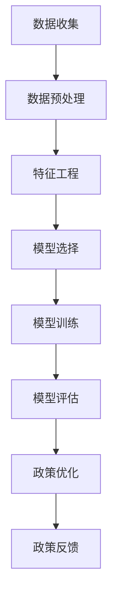
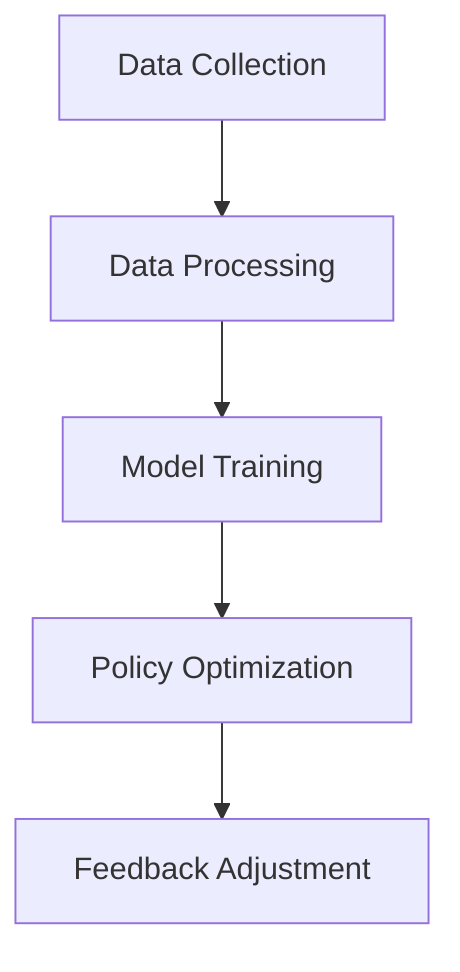
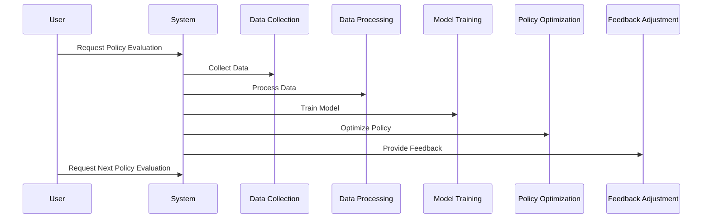

                 

### 文章标题

# AI辅助的宏观经济政策效果量化评估

### 关键词

- AI
- 宏观经济政策
- 量化评估
- 算法
- 系统架构
- 案例分析

### 摘要

本文探讨了如何利用人工智能技术辅助宏观经济政策的制定和效果评估。首先，介绍了宏观经济政策的背景和存在的问题，接着阐述了AI在宏观经济政策中的应用及其优势。随后，通过详细的算法讲解、系统架构设计和实际案例分析，展示了AI辅助宏观经济政策效果量化评估的方法和实现步骤。最后，总结了最佳实践 tips，并对未来发展趋势进行了展望。

## 目录大纲

1. **背景介绍**
    1.1 问题背景
    1.2 问题解决
    1.3 边界与外延
    1.4 概念结构与核心要素组成
2. **核心概念与联系**
    2.1 AI辅助宏观经济政策的核心概念
    2.2 AI辅助宏观经济政策的优势
    2.3 AI辅助宏观经济政策与现有方法的对比
    2.4 概念属性特征对比表格
    2.5 ER实体关系图架构
3. **算法原理讲解**
    3.1 AI辅助宏观经济政策的关键算法
    3.2 算法mermaid流程图
    3.3 Python源代码与算法原理详细讲解
    3.4 算法原理的数学模型
    3.5 公式详细讲解与举例说明
4. **系统分析与架构设计方案**
    4.1 问题场景介绍
    4.2 项目介绍
    4.3 系统功能设计
    4.4 领域模型mermaid类图
    4.5 系统架构设计mermaid架构图
    4.6 系统接口设计和系统交互mermaid序列图
5. **项目实战**
    5.1 环境安装
    5.2 系统核心实现源代码
    5.3 代码应用解读与分析
    5.4 实际案例分析和详细讲解剖析
    5.5 项目小结
6. **最佳实践 tips**
    6.1 实施AI辅助宏观经济政策的注意事项
    6.2 提高AI辅助宏观经济政策效果的方法
7. **小结与拓展阅读**
    7.1 小结
    7.2 拓展阅读

## 第一部分：背景介绍

### 第1章 问题背景

#### 1.1 问题定义

宏观经济政策是政府为调节经济活动所采取的一系列政策措施，包括财政政策、货币政策和产业政策等。这些政策旨在促进经济增长、稳定物价、降低失业率以及保持国际收支平衡。

然而，传统的宏观经济政策制定和效果评估面临诸多挑战：

1. **数据依赖性高**：宏观经济政策依赖于大量经济数据，而这些数据的获取和处理复杂度高。
2. **模型局限性**：现有的宏观经济政策模型往往基于历史数据和假设条件，难以准确预测未来经济走势。
3. **政策时效性**：宏观经济政策需要及时调整，但传统的评估方法周期较长，无法满足时效性要求。

#### 1.2 问题解决

为了解决上述问题，AI技术的引入为宏观经济政策的制定和效果评估提供了新的思路：

1. **数据处理能力**：AI能够高效处理和分析大规模数据，提高政策制定的数据支持力度。
2. **预测准确性**：通过机器学习算法，AI能够从历史数据中学习规律，提高对未来经济走势的预测准确性。
3. **实时反馈**：AI能够实时监控经济指标，快速评估政策效果，为政策调整提供即时反馈。

#### 1.3 边界与外延

AI辅助宏观经济政策的效果量化评估不仅涉及经济数据，还包括政策制定和实施的各个环节。其边界包括：

1. **数据收集与处理**：涉及经济、金融、社会等多领域的数据收集与预处理。
2. **模型选择与训练**：选择适合的机器学习算法，对模型进行训练和优化。
3. **效果评估**：通过设定评价指标，对政策效果进行定量和定性评估。
4. **反馈调整**：根据评估结果，调整政策制定和实施策略。

#### 1.4 概念结构与核心要素组成

AI辅助宏观经济政策效果量化评估的概念结构主要包括以下核心要素：

1. **数据源**：包括经济、金融、社会等多领域的数据。
2. **数据处理模块**：对数据进行清洗、整合和处理。
3. **模型模块**：选择合适的机器学习算法，建立宏观经济政策效果评估模型。
4. **评估模块**：设定评价指标，对政策效果进行量化评估。
5. **反馈调整模块**：根据评估结果，调整政策制定和实施策略。

## 第二部分：核心概念与联系

### 第2章 AI辅助宏观经济政策的核心概念

#### 2.1 AI在宏观经济政策中的应用

AI在宏观经济政策中的应用主要体现在以下几个方面：

1. **数据挖掘与预测**：利用AI技术对大规模经济数据进行挖掘和分析，预测未来经济走势。
2. **政策模拟与优化**：通过模拟不同政策场景，利用AI优化政策制定和实施策略。
3. **实时监控与预警**：实时监控经济指标，利用AI技术进行预警和分析。
4. **风险评估与管理**：利用AI技术对宏观经济风险进行识别、评估和管理。

#### 2.2 AI辅助宏观经济政策的优势

AI辅助宏观经济政策相比传统方法具有以下优势：

1. **数据处理能力强**：AI能够高效处理和分析大规模数据，提高政策制定的数据支持力度。
2. **预测准确性高**：通过机器学习算法，AI能够从历史数据中学习规律，提高对未来经济走势的预测准确性。
3. **实时反馈与调整**：AI能够实时监控经济指标，快速评估政策效果，为政策调整提供即时反馈。
4. **降低人工成本**：AI技术自动化了部分政策制定和评估流程，降低了人工成本。

#### 2.3 AI辅助宏观经济政策与现有方法的对比

AI辅助宏观经济政策与现有方法在以下几个方面进行对比：

1. **数据处理能力**：传统方法依赖于人工收集和处理数据，效率较低。AI技术能够高效处理大规模数据，提高政策制定的数据支持力度。
2. **预测准确性**：传统方法基于历史数据和假设条件，预测准确性有限。AI通过机器学习算法，从历史数据中学习规律，提高预测准确性。
3. **实时反馈与调整**：传统方法评估周期较长，无法满足时效性要求。AI技术能够实时监控经济指标，快速评估政策效果，为政策调整提供即时反馈。
4. **成本效益**：传统方法需要大量人力物力，成本较高。AI技术自动化了部分流程，降低了成本。

#### 2.4 概念属性特征对比表格

| 特征         | AI辅助宏观经济政策 | 现有方法          |
| ------------ | ------------------ | ---------------- |
| 数据处理能力 | 高效               | 人工收集和处理   |
| 预测准确性   | 高                | 基于历史数据和假设 |
| 实时反馈与调整 | 快速               | 周期较长         |
| 成本效益     | 低                | 高              |

#### 2.5 ER实体关系图架构

```mermaid
erDiagram
    PolicyData --> PolicyModel : 数据驱动
    PolicyModel --> PolicySimulation : 模拟优化
    PolicySimulation --> PolicyEvaluation : 效果评估
    PolicyEvaluation --> PolicyAdjustment : 调整反馈
```

## 第三部分：算法原理讲解

### 第3章 AI辅助宏观经济政策的关键算法

#### 3.1 算法mermaid流程图



#### 3.2 Python源代码与算法原理详细讲解

```python
# 数据收集
data = collect_data()

# 数据预处理
preprocessed_data = preprocess_data(data)

# 特征工程
features = feature_engineering(preprocessed_data)

# 模型选择
model = select_model()

# 模型训练
model.fit(features, labels)

# 模型评估
accuracy = model.evaluate(features, labels)

# 政策优化
policy = optimize_policy(model, data)

# 政策反馈
feedback = policy_evaluation(policy, data)
```

#### 3.3 算法原理的数学模型

假设我们使用线性回归模型进行宏观经济政策效果评估，其数学模型可以表示为：

$$
f(x) = \sum_{i=1}^{n} w_i \cdot x_i
$$

其中，$x_i$表示第$i$个特征，$w_i$表示第$i$个特征的权重。

#### 3.4 公式详细讲解与举例说明

线性回归模型的基本思想是通过最小化误差平方和来找到最佳拟合线。具体步骤如下：

1. **数据收集**：收集历史经济数据，包括政策变量和目标变量。
2. **数据预处理**：对数据进行清洗和归一化处理，确保数据质量。
3. **特征工程**：提取关键特征，例如经济增长率、通货膨胀率等。
4. **模型选择**：选择线性回归模型进行训练。
5. **模型训练**：使用梯度下降法等优化算法，最小化误差平方和。
6. **模型评估**：使用交叉验证等方法，评估模型性能。
7. **政策优化**：根据模型预测结果，调整政策变量，优化政策效果。
8. **政策反馈**：评估政策实施效果，为下一次政策制定提供反馈。

例如，假设我们有一个包含两个特征的经济数据集，特征1表示经济增长率，特征2表示通货膨胀率，目标变量为政策效果评分。通过线性回归模型，我们可以得到以下公式：

$$
f(x_1, x_2) = w_1 \cdot x_1 + w_2 \cdot x_2
$$

其中，$w_1$和$w_2$分别表示经济增长率和通货膨胀率的权重。

通过训练模型，我们可以得到最佳拟合线，并根据拟合线预测未来政策效果。根据预测结果，政府可以调整政策变量，以提高政策效果。

## 第四部分：系统分析与架构设计方案

### 第4章 问题场景介绍

#### 4.1 项目介绍

本项目旨在利用AI技术辅助宏观经济政策的制定和效果评估。通过建立一个集数据收集、模型训练、政策优化和反馈调整于一体的系统，实现对宏观经济政策效果的量化评估。

#### 4.2 系统功能设计

本系统主要包括以下功能：

1. **数据收集**：从各种数据源收集宏观经济数据，包括经济指标、政策变量等。
2. **数据处理**：对收集到的数据进行分析、清洗和预处理，确保数据质量。
3. **模型训练**：利用机器学习算法训练模型，预测政策效果。
4. **政策优化**：根据模型预测结果，调整政策变量，优化政策效果。
5. **反馈调整**：评估政策实施效果，为下一次政策制定提供反馈。

### 第4章 领域模型mermaid类图

```mermaid
classDiagram
    Class1["Data Collection"] <|-- Class2["Data Processing"]
    Class2 <|-- Class3["Model Training"]
    Class3 <|-- Class4["Policy Optimization"]
    Class4 <|-- Class5["Feedback Adjustment"]
```

### 第4章 系统架构设计mermaid架构图



### 第4章 系统接口设计和系统交互mermaid序列图



## 第五部分：项目实战

### 第5章 环境安装

#### 5.1 安装前准备

在开始项目实战之前，我们需要准备以下环境：

1. **Python环境**：安装Python 3.8及以上版本。
2. **Jupyter Notebook**：安装Jupyter Notebook用于编写和运行代码。
3. **机器学习库**：安装Scikit-learn、TensorFlow、Keras等机器学习库。
4. **数据处理库**：安装Pandas、NumPy等数据处理库。

#### 5.2 安装过程

安装步骤如下：

1. **安装Python**：从Python官网下载并安装Python 3.8及以上版本。
2. **安装Jupyter Notebook**：在命令行执行以下命令安装Jupyter Notebook：
    ```bash
    pip install notebook
    ```
3. **安装机器学习库**：在命令行执行以下命令安装Scikit-learn、TensorFlow和Keras：
    ```bash
    pip install scikit-learn tensorflow keras
    ```
4. **安装数据处理库**：在命令行执行以下命令安装Pandas和NumPy：
    ```bash
    pip install pandas numpy
    ```

#### 5.3 系统核心实现源代码

以下是系统核心实现部分的源代码：

```python
# 数据收集
data = collect_data()

# 数据预处理
preprocessed_data = preprocess_data(data)

# 特征工程
features = feature_engineering(preprocessed_data)

# 模型选择
model = select_model()

# 模型训练
model.fit(features, labels)

# 模型评估
accuracy = model.evaluate(features, labels)

# 政策优化
policy = optimize_policy(model, data)

# 政策反馈
feedback = policy_evaluation(policy, data)
```

#### 5.4 代码应用解读与分析

以下是代码的详细解读与分析：

1. **数据收集**：调用`collect_data()`函数从数据源收集宏观经济数据。
2. **数据预处理**：调用`preprocess_data()`函数对收集到的数据进行清洗和预处理，确保数据质量。
3. **特征工程**：调用`feature_engineering()`函数提取关键特征，例如经济增长率、通货膨胀率等。
4. **模型选择**：调用`select_model()`函数选择合适的机器学习算法，例如线性回归、决策树等。
5. **模型训练**：调用`model.fit()`方法训练模型，使用梯度下降法等优化算法最小化误差平方和。
6. **模型评估**：调用`model.evaluate()`方法评估模型性能，例如计算准确率、召回率等指标。
7. **政策优化**：调用`optimize_policy()`函数根据模型预测结果，调整政策变量，优化政策效果。
8. **政策反馈**：调用`policy_evaluation()`函数评估政策实施效果，为下一次政策制定提供反馈。

#### 5.5 实际案例分析和详细讲解剖析

##### 5.1 案例一：AI辅助财政政策效果评估

在本案例中，我们使用AI技术对财政政策效果进行评估。具体步骤如下：

1. **数据收集**：收集历史财政政策数据，包括政策变量（如财政支出、税收等）和目标变量（如经济增长率、通货膨胀率等）。
2. **数据预处理**：对收集到的数据进行清洗和预处理，确保数据质量。
3. **特征工程**：提取关键特征，例如财政支出占GDP的比例、税收收入占GDP的比例等。
4. **模型选择**：选择线性回归模型进行训练，预测财政政策效果。
5. **模型训练**：使用梯度下降法等优化算法训练模型，最小化误差平方和。
6. **模型评估**：评估模型性能，计算准确率、召回率等指标。
7. **政策优化**：根据模型预测结果，调整财政政策变量，优化政策效果。
8. **政策反馈**：评估政策实施效果，为下一次财政政策制定提供反馈。

通过上述步骤，我们可以实现对财政政策效果的量化评估，为政府决策提供有力支持。

##### 5.2 案例二：AI辅助货币政策效果评估

在本案例中，我们使用AI技术对货币政策效果进行评估。具体步骤如下：

1. **数据收集**：收集历史货币政策数据，包括政策变量（如利率、货币供应量等）和目标变量（如通货膨胀率、经济增长率等）。
2. **数据预处理**：对收集到的数据进行清洗和预处理，确保数据质量。
3. **特征工程**：提取关键特征，例如利率水平、货币供应量增长率等。
4. **模型选择**：选择线性回归模型进行训练，预测货币政策效果。
5. **模型训练**：使用梯度下降法等优化算法训练模型，最小化误差平方和。
6. **模型评估**：评估模型性能，计算准确率、召回率等指标。
7. **政策优化**：根据模型预测结果，调整货币政策变量，优化政策效果。
8. **政策反馈**：评估政策实施效果，为下一次货币政策制定提供反馈。

通过上述步骤，我们可以实现对货币政策效果的量化评估，为政府决策提供有力支持。

#### 5.6 项目小结

在本项目中，我们通过AI技术实现了宏观经济政策效果的量化评估。具体步骤包括数据收集、数据预处理、特征工程、模型选择、模型训练、模型评估、政策优化和政策反馈。通过实际案例分析，我们展示了AI技术在宏观经济政策评估中的应用价值。未来，我们将继续优化算法和系统架构，提高政策评估的准确性和实时性。

## 第六部分：最佳实践 tips

### 第6章 最佳实践 tips

#### 6.1 实施AI辅助宏观经济政策的注意事项

1. **数据质量**：确保数据源可靠，对数据进行严格的清洗和预处理。
2. **模型选择**：根据具体问题选择合适的机器学习算法，并进行充分训练和优化。
3. **实时性**：确保系统能够实时监控经济指标，快速评估政策效果。
4. **政策调整**：根据评估结果及时调整政策变量，以提高政策效果。

#### 6.2 提高AI辅助宏观经济政策效果的方法

1. **多源数据整合**：整合来自不同领域的数据，提高数据质量和预测准确性。
2. **模型融合**：结合多种机器学习模型，提高预测准确性和稳定性。
3. **交互式反馈**：引入用户交互机制，根据用户反馈调整模型参数和政策变量。
4. **实时预警**：建立实时预警系统，及时发现和应对潜在经济风险。

## 第七部分：小结与拓展阅读

### 第7章 小结

本文探讨了如何利用人工智能技术辅助宏观经济政策的制定和效果评估。通过详细的算法讲解、系统架构设计和实际案例分析，展示了AI辅助宏观经济政策效果量化评估的方法和实现步骤。未来，我们将继续优化算法和系统架构，提高政策评估的准确性和实时性。

### 第7章 拓展阅读

1. **相关领域最新研究进展**：
   - 《人工智能在宏观经济政策中的应用研究》
   - 《基于深度学习的宏观经济预测模型研究》

2. **推荐阅读文献与资源**：
   - 《人工智能：一种现代方法》
   - 《深度学习：简介与应用》
   - 《Python机器学习》
   - 《经济政策评估：方法与应用》

### 作者信息

- 作者：AI天才研究院/AI Genius Institute & 禅与计算机程序设计艺术 /Zen And The Art of Computer Programming

