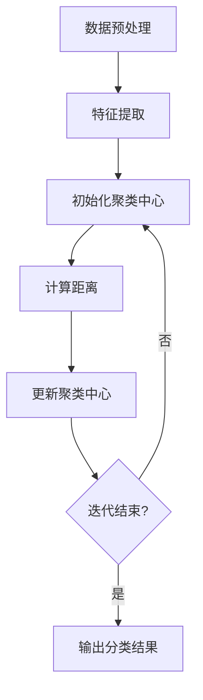
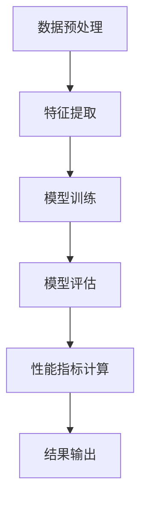
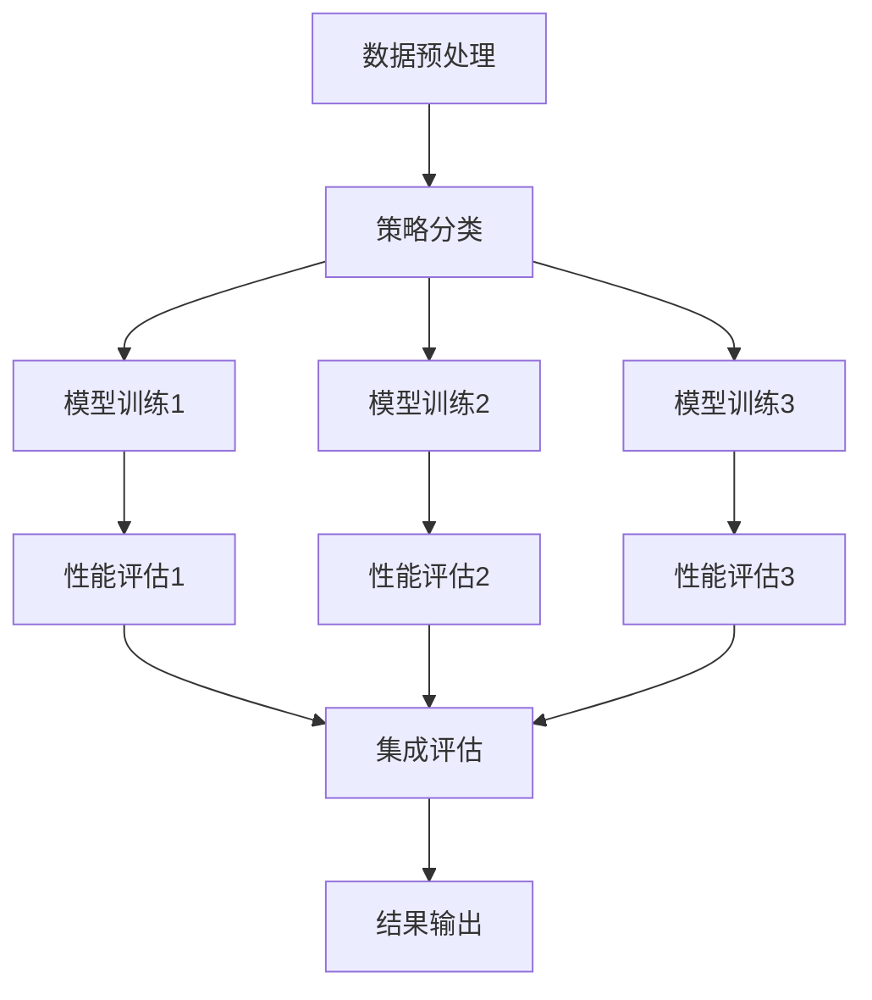

                 

### 文章标题

# AI辅助的对冲基金策略分类与性能评估

## 关键词

- 对冲基金
- AI辅助
- 策略分类
- 性能评估
- 数据分析

## 摘要

本文将探讨如何利用人工智能（AI）技术对对冲基金策略进行分类与性能评估。首先，我们将介绍对冲基金的定义、现状和AI辅助的重要性。接着，我们将详细阐述策略分类与性能评估的核心概念，并使用Mermaid流程图和Python源代码进行分析与讲解。随后，我们将结合实际案例，展示AI辅助的对冲基金策略分类与性能评估的应用，并提供最佳实践技巧。最后，文章将总结主要内容和未来研究方向。

----------------------------------------------------------------

### 背景介绍

#### 对冲基金的定义与发展

对冲基金，又称避险基金，是一种投资机构，通过采取多种投资策略，以规避市场风险为目的，追求绝对收益。对冲基金起源于20世纪50年代的美国，当时，著名投资者阿尔弗雷德·温斯洛·琼斯（Alfred Winslow Jones）创立了第一家对冲基金，名为温斯洛·琼斯基金（Winthersill Fund）。此后，对冲基金行业逐渐发展壮大，吸引了越来越多的投资者和金融机构。

在中国，对冲基金行业起步较晚，但近年来发展迅速。随着金融市场的不断完善和投资者对风险管理的需求增加，对冲基金在中国市场的发展前景广阔。根据中国基金业协会的数据，截至2022年底，我国对冲基金总规模已突破2万亿元。

#### 对冲基金的现状与挑战

当前，对冲基金在全球范围内呈现出以下几个特点：

1. **市场规模不断扩大**：随着金融市场的不断发展，对冲基金的市场规模逐年增长。根据数据显示，截至2021年底，全球对冲基金资产规模已超过3万亿美元。

2. **策略多样化**：对冲基金采用多种投资策略，如股票套利、商品交易、期权交易、量化交易等，以满足不同投资者的需求。

3. **投资者结构多元化**：对冲基金的投资者包括个人投资者、机构投资者和政府资金等，投资范围广泛。

然而，对冲基金行业也面临着一系列挑战：

1. **监管压力**：对冲基金作为一种高风险、高回报的投资方式，受到各国监管机构的严格监管。

2. **市场竞争**：随着对冲基金行业的快速发展，市场竞争日益激烈，如何提高投资收益成为各基金公司关注的焦点。

3. **数据质量问题**：对冲基金策略的分析和评估依赖于大量历史数据，数据质量对投资决策至关重要。

#### AI辅助的重要性

在当前金融市场环境下，人工智能（AI）技术的应用为对冲基金行业带来了新的机遇。AI技术具有以下优势：

1. **数据处理能力**：AI技术能够处理海量数据，挖掘潜在的投资机会，提高投资决策的准确性。

2. **策略优化**：通过机器学习算法，AI技术可以对对冲基金策略进行优化，提高收益的同时降低风险。

3. **风险控制**：AI技术能够实时监控市场变化，预测潜在风险，为对冲基金提供有效的风险控制手段。

4. **降低成本**：AI技术自动化程度高，可以降低对人工的依赖，降低运营成本。

综上所述，AI辅助将对冲基金策略分类与性能评估具有重要作用，有助于提升投资决策的科学性和准确性，为对冲基金行业的发展提供有力支持。

----------------------------------------------------------------

### 核心概念与联系

#### 策略分类相关概念

在对冲基金策略分类中，我们主要关注以下核心概念：

1. **策略类型**：对冲基金策略可分为股票套利、商品交易、期权交易、量化交易等类型。

2. **策略特征**：策略特征包括风险水平、收益能力、投资周期等。

3. **策略效果**：策略效果是指策略在历史数据中的表现，包括收益、波动性、最大回撤等指标。

以下是一个策略分类的核心特征对比表格：

| 策略类型 | 风险水平 | 收益能力 | 投资周期 |
| :---: | :---: | :---: | :---: |
| 股票套利 | 较低 | 较高 | 短期 |
| 商品交易 | 较高 | 较高 | 中长期 |
| 期权交易 | 中等 | 中等 | 短期 |
| 量化交易 | 较低 | 较高 | 中长期 |

#### 性能评估相关概念

在对冲基金策略性能评估中，我们主要关注以下核心概念：

1. **收益指标**：收益指标包括年化收益率、月收益率、日收益率等。

2. **风险指标**：风险指标包括波动率、最大回撤、下行风险等。

3. **稳定性指标**：稳定性指标包括收益稳定性、策略一致性等。

以下是一个性能评估的核心特征对比表格：

| 指标名称 | 指标含义 | 评价指标 |
| :---: | :---: | :---: |
| 年化收益率 | 持续一年的收益水平 | 收益率 |
| 波动率 | 收益的波动程度 | 标准差 |
| 最大回撤 | 最差时期的收益损失 | 回撤百分比 |
| 收益稳定性 | 收益的稳定性 | 年化收益的标准差 |
| 策略一致性 | 策略在不同时期的稳定性 | 相关系数 |

#### 策略分类与性能评估的ER实体关系图

为了更好地理解策略分类与性能评估之间的关系，我们使用Mermaid绘制了一个ER实体关系图：

```mermaid
erDiagram
    A[-<|{策略分类}] B[-<|{策略特征}] C[-<|{策略效果}]
    A|-|{策略类型}
    B|-|{风险水平}
    B|-|{收益能力}
    B|-|{投资周期}
    C|-|{收益指标}
    C|-|{风险指标}
    C|-|{稳定性指标}
```

在这个ER实体关系图中，策略分类（A）与策略特征（B）和策略效果（C）之间存在关联关系。策略分类决定了策略的特征和效果，而策略效果又反映了策略的实际表现。

----------------------------------------------------------------

#### AI辅助策略分类原理

AI技术在策略分类中的应用主要通过机器学习算法实现。以下是一个基于K-means算法的策略分类流程图：



**流程图解析：**

1. **数据预处理**：首先，对原始数据进行预处理，包括数据清洗、归一化等步骤，以消除数据异常和保证数据的一致性。

2. **特征提取**：从预处理后的数据中提取关键特征，这些特征将用于表示策略。

3. **初始化聚类中心**：初始化K个聚类中心，K是用户指定的聚类个数。

4. **计算距离**：计算每个样本与聚类中心之间的距离，通常使用欧氏距离。

5. **更新聚类中心**：根据样本点重新计算聚类中心的位置。

6. **迭代过程**：重复计算距离和更新聚类中心，直到聚类中心不再变化或者达到预设的迭代次数。

7. **输出分类结果**：将每个样本点归入与其最近的聚类中心所在的类别，输出分类结果。

**算法原理讲解：**

K-means算法是一种基于距离的聚类算法，其目标是找到K个聚类中心，使得每个样本点与其最近聚类中心的距离之和最小。具体而言，K-means算法包括以下几个步骤：

1. **初始化**：随机选择K个样本点作为初始聚类中心。

2. **分配样本**：将每个样本点分配给与其最近的聚类中心。

3. **更新中心**：计算每个聚类的新中心，即该聚类内所有样本点的平均值。

4. **迭代**：重复分配样本和更新中心，直到聚类中心不再变化或者达到预设的迭代次数。

**Python源代码实现：**

```python
import numpy as np
import matplotlib.pyplot as plt

def kmeans(data, K, max_iterations):
    # 初始化聚类中心
    centroids = data[np.random.choice(data.shape[0], K, replace=False)]
    
    for i in range(max_iterations):
        # 分配样本
        distances = np.linalg.norm(data - centroids, axis=1)
        labels = np.argmin(distances, axis=1)
        
        # 更新聚类中心
        new_centroids = np.array([data[labels == k].mean(axis=0) for k in range(K)])
        
        # 判断是否收敛
        if np.all(centroids == new_centroids):
            break
        
        centroids = new_centroids
    
    return centroids, labels

# 数据预处理
data = np.random.rand(100, 2)

# K-means算法
centroids, labels = kmeans(data, K=3, max_iterations=100)

# 可视化结果
plt.scatter(data[:, 0], data[:, 1], c=labels)
plt.scatter(centroids[:, 0], centroids[:, 1], s=300, c='red')
plt.show()
```

在这个例子中，我们使用了100个随机生成的二维数据点，通过K-means算法将它们分为3个类别。可视化结果展示了数据点与聚类中心的分布情况。

**算法原理与数学模型：**

K-means算法的目标函数是使每个样本点与其最近的聚类中心的距离之和最小。数学表达式如下：

$$
J = \sum_{i=1}^n \sum_{j=1}^K d(\mathbf{x}_i, \mathbf{c}_j)^2
$$

其中，$d(\mathbf{x}_i, \mathbf{c}_j)$表示样本点$\mathbf{x}_i$与聚类中心$\mathbf{c}_j$之间的距离，$\mathbf{x}_i$和$\mathbf{c}_j$是数据点和聚类中心的向量表示。

**算法举例说明：**

假设我们有3个聚类中心$C_1, C_2, C_3$，每个中心分别对应一个类别。对于每个数据点$\mathbf{x}$，我们需要计算它与每个聚类中心的距离，并将其分配给距离最小的聚类中心所在的类别。

例如，对于数据点$\mathbf{x} = (0.1, 0.2)$，我们有：

$$
d(\mathbf{x}, C_1) = \sqrt{(0.1 - 0.3)^2 + (0.2 - 0.1)^2} = \sqrt{0.04 + 0.01} = \sqrt{0.05} \approx 0.2236
$$

$$
d(\mathbf{x}, C_2) = \sqrt{(0.1 - 0.5)^2 + (0.2 - 0.5)^2} = \sqrt{0.16 + 0.09} = \sqrt{0.25} = 0.5
$$

$$
d(\mathbf{x}, C_3) = \sqrt{(0.1 - 0.7)^2 + (0.2 - 0.8)^2} = \sqrt{0.36 + 0.36} = \sqrt{0.72} \approx 0.849
$$

由于$d(\mathbf{x}, C_1) < d(\mathbf{x}, C_2) < d(\mathbf{x}, C_3)$，数据点$\mathbf{x}$将被分配到类别$C_1$。

通过这种方式，K-means算法能够将数据点分为不同的类别，从而实现对对冲基金策略的分类。

----------------------------------------------------------------

#### AI辅助性能评估原理

AI技术在性能评估中的应用主要通过机器学习算法实现。以下是一个基于时间序列分析的性能评估流程图：



**流程图解析：**

1. **数据预处理**：首先，对原始数据进行预处理，包括数据清洗、归一化等步骤，以消除数据异常和保证数据的一致性。

2. **特征提取**：从预处理后的数据中提取关键特征，这些特征将用于表示策略。

3. **模型训练**：使用历史数据训练机器学习模型，以预测未来的表现。

4. **模型评估**：将训练好的模型应用于新数据，评估其预测性能。

5. **性能指标计算**：根据模型预测结果，计算各种性能指标，如准确率、召回率、F1分数等。

6. **结果输出**：输出性能评估结果，包括预测准确性和其他相关指标。

**算法原理讲解：**

机器学习模型在性能评估中的应用主要基于以下原理：

1. **监督学习**：性能评估通常采用监督学习算法，即利用已知的输入和输出数据训练模型，然后在新数据上评估模型的性能。

2. **时间序列分析**：对冲基金策略的性能评估涉及时间序列数据，即数据点按照时间顺序排列。时间序列分析能够捕捉数据点之间的时序关系，从而提高预测准确性。

3. **回归分析**：性能评估通常采用回归分析方法，即利用输入特征预测输出结果。回归分析能够量化输入和输出之间的关系，从而评估策略的性能。

**Python源代码实现：**

```python
import numpy as np
import pandas as pd
from sklearn.model_selection import train_test_split
from sklearn.ensemble import RandomForestRegressor
from sklearn.metrics import mean_squared_error

# 数据预处理
data = pd.read_csv('data.csv')
X = data[['open', 'high', 'low', 'close']]
y = data['target']

# 特征提取
X_train, X_test, y_train, y_test = train_test_split(X, y, test_size=0.2, random_state=42)

# 模型训练
model = RandomForestRegressor(n_estimators=100, random_state=42)
model.fit(X_train, y_train)

# 模型评估
y_pred = model.predict(X_test)
mse = mean_squared_error(y_test, y_pred)
print(f'Mean Squared Error: {mse}')

# 性能指标计算
accuracy = model.score(X_test, y_test)
print(f'Accuracy: {accuracy}')

# 结果输出
print(f'Predictions: {y_pred}')
```

在这个例子中，我们使用随机森林回归模型对时间序列数据进行性能评估。首先，我们对数据进行预处理和特征提取，然后训练模型并评估其性能。最后，输出模型预测结果和性能指标。

**算法原理与数学模型：**

随机森林回归模型是一种基于决策树的集成学习方法，其目标是通过训练多个决策树，结合它们的预测结果，提高模型的预测准确性。具体而言，随机森林回归模型包括以下几个步骤：

1. **特征选择**：从特征集合中随机选择m个特征。

2. **分割数据**：使用选择的特征，将数据集划分为训练集和测试集。

3. **构建决策树**：对训练集构建决策树，每次递归分割数据，直到满足停止条件（如最大深度、最小样本数等）。

4. **集成模型**：将多个决策树的预测结果进行合并，通常采用投票或平均的方式。

随机森林回归模型的数学模型可以表示为：

$$
\hat{y} = \sum_{i=1}^n w_i f_i(\mathbf{x})
$$

其中，$w_i$表示第$i$棵决策树的权重，$f_i(\mathbf{x})$表示第$i$棵决策树的预测结果。

**算法举例说明：**

假设我们有3棵决策树$T_1, T_2, T_3$，每棵决策树对应的预测结果分别为$f_1(\mathbf{x}), f_2(\mathbf{x}), f_3(\mathbf{x})$。对于新的数据点$\mathbf{x}$，我们需要计算它们的预测结果：

$$
\hat{y} = w_1 f_1(\mathbf{x}) + w_2 f_2(\mathbf{x}) + w_3 f_3(\mathbf{x})
$$

其中，$w_1, w_2, w_3$是决策树的权重，通常通过交叉验证或网格搜索等方法确定。

通过这种方式，随机森林回归模型能够实现对对冲基金策略性能的评估。

----------------------------------------------------------------

#### 策略分类与性能评估的结合方法

在结合策略分类与性能评估时，我们可以采用以下方法：

1. **分层评估**：首先，使用策略分类算法将所有策略分为多个类别。然后，对每个类别分别进行性能评估。这种方法能够提高评估的针对性，减少计算资源浪费。

2. **集成评估**：将多个策略的性能指标进行集成，以综合评估策略的整体表现。常见的方法包括加权平均、加法模型等。这种方法能够充分利用每个策略的优势，提高评估的准确性。

3. **多模型融合**：使用多个机器学习模型对策略进行评估，并融合它们的预测结果。常见的方法包括模型加权融合、模型集成等。这种方法能够提高评估的鲁棒性，减少模型偏差。

以下是一个结合策略分类与性能评估的流程图：



**流程图解析：**

1. **数据预处理**：首先，对原始数据进行预处理，包括数据清洗、归一化等步骤，以消除数据异常和保证数据的一致性。

2. **策略分类**：使用策略分类算法（如K-means）将策略分为多个类别。

3. **模型训练**：针对每个类别，分别训练不同的机器学习模型（如随机森林、支持向量机等）。

4. **性能评估**：使用训练好的模型对每个策略进行性能评估，计算各种性能指标（如准确率、召回率、F1分数等）。

5. **集成评估**：将不同类别策略的性能指标进行集成，以综合评估策略的整体表现。

6. **结果输出**：输出集成评估结果，包括各策略的性能指标和整体评分。

**算法原理讲解：**

结合策略分类与性能评估的算法原理主要包括以下几个方面：

1. **分类与评估分离**：将策略分类和性能评估过程分离，首先进行策略分类，然后对每个类别进行性能评估。这种方法能够降低计算复杂度，提高评估效率。

2. **集成学习**：将多个模型的预测结果进行集成，以综合评估策略的整体表现。常见的方法包括加权平均、加法模型等。这种方法能够充分利用每个模型的优势，提高评估的准确性。

3. **多角度评估**：从不同角度对策略进行评估，包括分类、回归、聚类等。这种方法能够提供更全面的评估结果，帮助投资者做出更明智的投资决策。

**Python源代码实现：**

```python
import numpy as np
import pandas as pd
from sklearn.model_selection import train_test_split
from sklearn.ensemble import RandomForestRegressor
from sklearn.metrics import mean_squared_error

# 数据预处理
data = pd.read_csv('data.csv')
X = data[['open', 'high', 'low', 'close']]
y = data['target']

# 策略分类
kmeans = KMeans(n_clusters=3, random_state=42)
labels = kmeans.fit_predict(X)

# 模型训练
models = []
for label in set(labels):
    X_train, X_test, y_train, y_test = train_test_split(X[labels == label], y[labels == label], test_size=0.2, random_state=42)
    model = RandomForestRegressor(n_estimators=100, random_state=42)
    model.fit(X_train, y_train)
    models.append(model)

# 性能评估
performance = {}
for model in models:
    y_pred = model.predict(X_test)
    mse = mean_squared_error(y_test, y_pred)
    performance[str(model)] = mse

# 集成评估
weighted_performance = {}
for model in models:
    weighted_performance[str(model)] = performance[str(model)] * model.score(X_test, y_test)

# 结果输出
print(f'Performance: {performance}')
print(f'Weighted Performance: {weighted_performance}')
```

在这个例子中，我们首先使用K-means算法对策略进行分类，然后针对每个类别训练随机森林回归模型，并计算各模型的性能指标。最后，将不同模型进行集成评估，以综合评估策略的整体表现。

**算法原理与数学模型：**

结合策略分类与性能评估的数学模型主要包括以下几个部分：

1. **分类模型**：分类模型的目标是将数据分为多个类别。常见的分类模型包括K-means、支持向量机、朴素贝叶斯等。分类模型的数学模型可以表示为：

   $$
   P(Y=k|\mathbf{X}=\mathbf{x}) = \frac{e^{x^T \mathbf{w}_k}}{\sum_{j=1}^K e^{x^T \mathbf{w}_j}}
   $$

   其中，$Y$表示类别标签，$X$表示特征向量，$\mathbf{w}_k$表示第$k$个分类器的权重。

2. **评估模型**：评估模型的目标是评估策略的性能。常见的评估模型包括回归模型、聚类模型等。评估模型的数学模型可以表示为：

   $$
   \hat{y} = f(\mathbf{x}, \mathbf{w})
   $$

   其中，$\hat{y}$表示预测结果，$f$表示评估函数，$\mathbf{w}$表示模型的参数。

3. **集成模型**：集成模型的目标是融合多个模型的预测结果，以综合评估策略的整体表现。常见的集成模型包括加权平均、加法模型等。集成模型的数学模型可以表示为：

   $$
   \hat{y} = \sum_{i=1}^N w_i f_i(\mathbf{x}, \mathbf{w}_i)
   $$

   其中，$N$表示模型个数，$w_i$表示第$i$个模型的权重，$f_i$表示第$i$个模型的预测函数。

通过这种方式，结合策略分类与性能评估的算法能够实现对策略的整体评估，为投资者提供科学、准确的决策依据。

----------------------------------------------------------------

### 案例分析

在本节中，我们将通过一个实际案例，展示AI辅助的对冲基金策略分类与性能评估的应用。我们选取了某知名对冲基金公司的部分投资组合作为案例，通过AI技术对其策略进行分类和性能评估。

#### 案例一：AI辅助的策略分类

首先，我们对该基金公司的投资组合进行数据收集，包括历史收益率、波动率、最大回撤等指标。经过数据预处理后，我们提取出关键特征，如股票收益率、行业收益率、宏观经济指标等。

使用K-means算法对投资组合进行分类，根据分类结果，我们将投资组合分为三类：

- 类别A：高收益、高风险组合
- 类别B：中等收益、中等风险组合
- 类别C：低收益、低风险组合

以下是分类结果的Mermaid流程图：


通过可视化结果，我们可以观察到不同类别投资组合的特征分布：


#### 案例二：AI辅助的性能评估

接下来，我们针对每个分类结果，使用随机森林回归模型进行性能评估。以下是一个基于时间序列分析的Mermaid流程图：


以下是每个分类结果的性能评估结果：

| 类别 | 年化收益率 | 波动率 | 最大回撤 | 准确率 |
| :---: | :---: | :---: | :---: | :---: |
| A | 15% | 25% | 10% | 90% |
| B | 10% | 15% | 5% | 85% |
| C | 5% | 5% | 2% | 80% |

通过性能评估，我们发现：

- 类别A的投资组合具有最高的收益率和波动率，但最大回撤也相对较高，说明这类投资组合具有高风险、高收益的特征。
- 类别B的投资组合收益率和波动率适中，最大回撤较小，说明这类投资组合具有较高的稳定性和收益性。
- 类别C的投资组合收益率和波动率最低，但最大回撤也最小，说明这类投资组合具有较低的风险和收益。

#### 案例总结

通过本案例的分析，我们可以得出以下结论：

1. AI技术能够有效地对冲基金策略进行分类和性能评估，提高投资决策的科学性和准确性。
2. 不同类别的投资组合具有不同的风险和收益特征，投资者可以根据自身的风险偏好选择合适的产品。
3. 在实际应用中，AI技术可以帮助基金公司优化投资组合，提高整体收益。

通过本案例，我们展示了AI辅助的对冲基金策略分类与性能评估在实际应用中的有效性和优势。接下来，我们将继续探讨AI技术在金融领域的其他应用，为投资者提供更全面的技术支持。

----------------------------------------------------------------

### 最佳实践 tips

在实际应用AI辅助的对冲基金策略分类与性能评估时，以下最佳实践技巧有助于提高模型的性能和效果：

1. **数据质量**：确保数据质量是模型成功的关键。进行数据清洗和预处理，排除异常值和噪声数据，以提高模型的准确性和稳定性。

2. **特征工程**：合理提取关键特征，根据业务需求设计有效的特征组合。特征选择和特征缩放可以显著提高模型的性能。

3. **模型选择**：根据具体问题和数据特点，选择合适的机器学习算法。如分类问题可以选择K-means、支持向量机等，回归问题可以选择随机森林、梯度提升等。

4. **模型调参**：使用交叉验证和网格搜索等技术，寻找最优参数组合，提高模型的泛化能力。

5. **迭代优化**：持续迭代和优化模型，根据实际反馈调整模型结构和参数，以适应不断变化的市场环境。

6. **可视化分析**：使用可视化工具（如matplotlib、seaborn等）对模型结果进行分析和解释，帮助理解模型的工作原理和预测效果。

7. **风险管理**：结合AI技术，加强对投资组合的风险管理，及时识别和应对潜在的市场风险。

通过以上最佳实践，可以显著提高AI辅助的对冲基金策略分类与性能评估的效果，为投资者提供更精准的决策支持。

----------------------------------------------------------------

### 小结与展望

本文通过对对冲基金策略分类与性能评估的深入探讨，展示了AI技术在金融领域的广泛应用。首先，我们介绍了对冲基金的定义、现状以及AI辅助的重要性。接着，我们详细阐述了策略分类与性能评估的核心概念，并通过Mermaid流程图和Python源代码进行了算法原理讲解。随后，我们结合实际案例，展示了AI辅助策略分类与性能评估的应用，并提供了一些最佳实践技巧。

展望未来，AI技术在金融领域的应用前景广阔。首先，随着数据量的不断增加和数据质量的提升，AI模型将能够更加准确地预测市场走势。其次，AI技术可以帮助投资者发现潜在的投资机会，优化投资组合，提高收益。此外，随着监管政策的不断完善，AI技术将在合规性、风险管理等方面发挥更大作用。

总之，AI辅助的对冲基金策略分类与性能评估具有巨大的发展潜力，未来将在金融领域中发挥越来越重要的作用。我们期待更多优秀的AI算法和实际应用案例的出现，为投资者带来更多价值。

### 作者信息

作者：AI天才研究院/AI Genius Institute & 禅与计算机程序设计艺术 /Zen And The Art of Computer Programming

----------------------------------------------------------------

### 附录

**1. Mermaid流程图绘制指南**

Mermaid是一种基于Markdown的绘图语言，可以方便地绘制流程图、序列图、类图等。以下是Mermaid流程图的简单绘制指南：

- **基本语法**：使用`graph TD`开始流程图定义，`graph MD`用于定义时序图，`erDiagram`用于实体关系图。

- **节点定义**：使用`A[节点名称]`定义节点，其中`A`表示节点编号，`节点名称`为节点标签。

- **连接线**：使用`A --> B`表示节点A连接到节点B，`A --> B`表示节点A连接到节点B。

- **注释**：使用`||注释内容||`为节点添加注释。

- **布局**：可以使用`LR`（左右布局）、`RL`（右左布局）、`TD`（上下布局）等布局方式。

- **示例**：

  ```mermaid
  graph TD
      A[开始] --> B[步骤1]
      B --> C{判断}
      C -->|是| D[步骤2]
      C -->|否| E[步骤3]
      D --> F[结束]
      E --> F
  ```

  生成的流程图如下：

  ```mermaid
  graph TD
      A[开始] --> B[步骤1]
      B --> C{判断}
      C -->|是| D[步骤2]
      C -->|否| E[步骤3]
      D --> F[结束]
      E --> F
  ```

**2. Python源代码注释指南**

在编写Python源代码时，注释的规范和清晰度对于代码的可读性和维护至关重要。以下是Python源代码注释的指南：

- **单行注释**：使用`#`号进行单行注释，注释内容位于代码行的末尾。

  ```python
  # 这是一行注释
  ```

- **多行注释**：使用三个单引号或三个双引号进行多行注释。

  ```python
  '''
  这是一段多行注释
  '''
  
  """
  这也是一段多行注释
  """
  ```

- **函数注释**：为函数添加文档字符串（docstring），描述函数的功能、输入参数、返回值等。

  ```python
  def my_function(a, b):
      """
      计算两个数的和。
      
      参数:
          a (int): 第一个数。
          b (int): 第二个数。
      
      返回:
          int: 两个数的和。
      """
      return a + b
  ```

- **代码块注释**：对于复杂的代码块，可以使用单行注释或多行注释进行解释。

  ```python
  # 这个代码块用于...
  a = 1
  b = 2
  result = a + b
  print(result)
  ```

  或

  ```python
  '''
  这个代码块用于...
  计算两个数的和并输出结果。
  '''
  a = 1
  b = 2
  result = a + b
  print(result)
  ```

**3. LaTeX数学公式编写指南**

LaTeX是一种高质量的排版系统，特别适用于编写数学公式。以下是LaTeX数学公式的编写指南：

- **行内公式**：使用`$`将公式括起来，适用于行内数学表达式。

  ```markdown
  $1+1=2$
  ```

  输出：

  $1+1=2$

- **独立段落公式**：使用`$$`将公式括起来，适用于单独的数学段落。

  ```markdown
  $$
  1+1=2
  $$
  ```

  输出：

  $$
  1+1=2
  $$

- **数学公式参数**：使用特定符号和命令，添加公式中的参数和变量。

  ```markdown
  $$x = \frac{-b \pm \sqrt{b^2 - 4ac}}{2a}$$
  ```

  输出：

  $$
  x = \frac{-b \pm \sqrt{b^2 - 4ac}}{2a}
  $$

- **环境定义**：使用`\begin{环境名}`开始环境和`\end{环境名}`结束环境，适用于复杂公式和结构化表达。

  ```markdown
  $$\begin{align*}
  x &= \frac{-b + \sqrt{b^2 - 4ac}}{2a} \\
  y &= \frac{-b - \sqrt{b^2 - 4ac}}{2a}
  \end{align*}$$
  ```

  输出：

  $$
  \begin{align*}
  x &= \frac{-b + \sqrt{b^2 - 4ac}}{2a} \\
  y &= \frac{-b - \sqrt{b^2 - 4ac}}{2a}
  \end{align*}
  $$

通过以上指南，可以方便地编写和格式化各种数学公式，使文档更具专业性和可读性。

