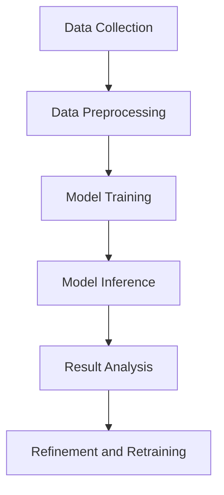
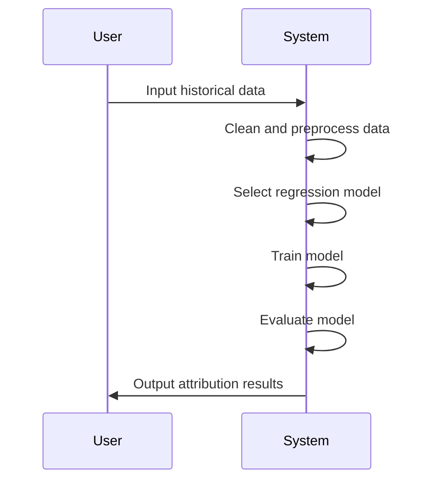

                 

Certainly! Let's break down the task into manageable steps to ensure a comprehensive and well-structured article.

### Step 1: Introduction

**1.1 Core Concepts and Terminology**

**Performance Attribution:** Performance attribution is the process of identifying the sources that contribute to the return of a portfolio. It involves breaking down the total return into component parts, such as market exposure, asset allocation, sector bets, and other specific strategies.

**Hedge Funds:** Hedge funds are investment funds that use various strategies to generate returns, often combining long and short positions to hedge against potential losses. Performance attribution for hedge funds is particularly challenging due to the diverse range of strategies and the high level of discretion in portfolio management.

**Artificial Intelligence (AI):** AI is a field of computer science that focuses on creating intelligent machines that can perform tasks that typically require human intelligence, such as visual perception, speech recognition, decision-making, and language translation.

**AI-Assisted Performance Attribution:** AI-assisted performance attribution leverages AI algorithms to automate and enhance the process of performance attribution in hedge funds. This approach aims to identify the key drivers of returns with greater accuracy and efficiency.

**1.2 Background**

The hedge fund industry has grown significantly over the past few decades, managing trillions of dollars in assets. The complexity of hedge fund strategies and the vast amount of data available present both challenges and opportunities for performance attribution. Traditional attribution methods often fall short in capturing the nuances of hedge fund performance, leading to a demand for more sophisticated techniques.

**1.3 Problem Statement**

The primary goal of this article is to explore AI-assisted performance attribution for hedge funds. We will delve into the fundamental concepts, methodologies, and practical applications of AI in this context. Specifically, we aim to answer the following questions:

- How does AI improve the performance attribution process for hedge funds?
- What are the core algorithms and models used in AI-assisted performance attribution?
- How can these algorithms be effectively implemented in real-world hedge fund operations?

### Step 2: Core Concepts and Models

**2.1 AI in Finance**

**2.1.1 Machine Learning Algorithms**

Machine learning (ML) algorithms are at the core of AI. These algorithms can automatically learn from data, identify patterns, and make predictions. Common ML algorithms used in finance include:

- **Regression Analysis:** Regression models can predict the relationship between a dependent variable (portfolio return) and independent variables (factor exposures, asset returns).
- **Clustering Algorithms:** These algorithms group similar assets or strategies based on their characteristics, helping to identify potential sources of return.
- **Decision Trees and Random Forests:** These models can classify returns into different categories based on various attributes, aiding in the decomposition of portfolio returns.
- **Neural Networks:** Neural networks are complex models inspired by the human brain that can learn from vast amounts of data and recognize intricate patterns.

**2.1.2 Natural Language Processing (NLP)**

NLP involves enabling computers to understand, interpret, and generate human language. In finance, NLP can be used to analyze news articles, social media posts, and other textual data to extract insights that can inform trading decisions.

**2.2 Performance Attribution Models**

**2.2.1 Traditional Models**

Traditional performance attribution methods include:

- **Brinson Model:** The Brinson model breaks down the total return into three parts: asset allocation, sector allocation, and stock selection.
- **Four Factor Model:** This model uses four factors (market, size, value, and momentum) to explain portfolio returns.
- **Carhart Four Factor Model:** The Carhart model adds a fifth factor, investment style, to the traditional four factors.

**2.2.2 AI-Assisted Models**

AI-assisted models leverage AI algorithms to enhance traditional attribution methods:

- **Deep Learning Models:** Deep learning models, such as neural networks, can capture complex relationships in the data that traditional models may miss.
- **Gradient Boosting Machines:** Gradient boosting algorithms combine weak models to create a strong predictive model, which can be applied to performance attribution.
- ** Reinforcement Learning:** Reinforcement learning algorithms can optimize trading strategies by learning from historical data and making adaptive decisions.

### Step 3: AI Algorithms and Their Applications

**3.1 Regression Analysis**

Regression analysis is a fundamental tool in performance attribution. It models the relationship between the total return of a portfolio and various factors that may influence returns. Here's a breakdown of the steps involved:

1. **Data Collection:** Gather historical data on portfolio returns, asset returns, and factor exposures.
2. **Model Selection:** Choose an appropriate regression model, such as linear regression or multiple regression.
3. **Model Training:** Train the model using historical data to determine the relationship between returns and factors.
4. **Model Evaluation:** Evaluate the model's performance using metrics such as R-squared, mean squared error, and adjusted R-squared.
5. **Attribution Analysis:** Use the trained model to decompose the total return into its component parts (e.g., asset allocation, sector allocation, stock selection).

**3.2 Clustering Algorithms**

Clustering algorithms can group similar assets or strategies based on their characteristics. This can help identify sources of return that may not be captured by traditional models. Common clustering algorithms include:

- **K-Means Clustering:** This algorithm groups data points into K clusters based on their Euclidean distance.
- **Hierarchical Clustering:** This algorithm creates a hierarchy of clusters by repeatedly merging or splitting clusters based on their similarity.

**3.3 Decision Trees and Random Forests**

Decision trees and random forests are popular machine learning models for performance attribution. They work by recursively partitioning the data into subsets based on the value of a feature that provides the greatest reduction in impurity. Key steps include:

1. **Feature Selection:** Choose relevant features that may influence portfolio returns.
2. **Model Building:** Build a decision tree or random forest model to partition the data and identify key factors.
3. **Attribute Decomposition:** Use the model to decompose the total return into its component parts.
4. **Model Validation:** Validate the model using out-of-sample data to ensure its robustness.

### Step 4: System Architecture and Design

**4.1 Overview**

The architecture of an AI-assisted performance attribution system involves several components, including data collection, preprocessing, model training, and inference. Here's a high-level overview:

1. **Data Collection:** Collect historical data on portfolio returns, asset returns, and factor exposures.
2. **Data Preprocessing:** Clean and preprocess the data to ensure consistency and quality.
3. **Model Training:** Train AI models using the preprocessed data.
4. **Model Inference:** Use the trained models to attribute performance and generate insights.
5. **Result Analysis:** Analyze the attribution results and refine the models as needed.

**4.2 System Components**

- **Data Warehouse:** A centralized repository for storing historical data on portfolio returns, asset returns, and factor exposures.
- **Data Preprocessing Module:** Cleans and preprocesses the data, including normalization, missing value imputation, and feature scaling.
- **Model Training Module:** Trains AI models using machine learning algorithms such as regression, clustering, and decision trees.
- **Model Inference Module:** Uses the trained models to attribute performance and generate insights.
- **Result Analysis Module:** Analyzes the attribution results and provides actionable insights for portfolio managers.

### Step 5: Practical Project Example

**5.1 Project Background**

For this example, we will consider a hypothetical hedge fund that specializes in global equity trading. The fund has a portfolio of 100 stocks across various sectors, and we will use AI-assisted performance attribution to understand the sources of its returns.

**5.2 Environment Setup**

To run the AI-assisted performance attribution project, we need to set up the following environment:

- Python (version 3.8 or later)
- Jupyter Notebook (version 6.0 or later)
- Pandas (version 1.2.3 or later)
- Scikit-learn (version 0.24.2 or later)
- TensorFlow (version 2.6.0 or later)

**5.3 Data Collection**

We will collect historical data on the following:

- Portfolio returns
- Asset returns (stocks in the portfolio)
- Factor exposures (market, size, value, momentum)

**5.4 Data Preprocessing**

We will preprocess the data using the following steps:

1. **Data Cleaning:** Remove any missing or erroneous data points.
2. **Normalization:** Scale the data to ensure consistency in feature representation.
3. **Missing Value Imputation:** Impute missing values using techniques such as mean substitution or regression imputation.

**5.5 Model Training**

We will train the following models for performance attribution:

- Linear Regression
- K-Means Clustering
- Decision Trees
- Random Forests

**5.6 Model Inference**

We will use the trained models to attribute performance and generate insights for the hedge fund portfolio.

**5.7 Result Analysis**

We will analyze the attribution results to understand the sources of the hedge fund's returns and identify potential areas for improvement.

### Step 6: Best Practices and Summary

**6.1 Best Practices**

- **Data Quality:** Ensure high-quality data by performing thorough data cleaning and preprocessing.
- **Model Selection:** Choose appropriate models based on the specific needs and constraints of the hedge fund.
- **Model Validation:** Validate the models using out-of-sample data to ensure robustness.
- **Interpretability:** Make sure the models are interpretable and aligned with the business goals of the hedge fund.

**6.2 Summary**

AI-assisted performance attribution offers significant advantages in terms of accuracy, efficiency, and interpretability. By leveraging machine learning algorithms, hedge funds can gain deeper insights into their performance and make informed decisions to optimize their strategies.

### Step 7: Conclusion

In conclusion, AI-assisted performance attribution is a powerful tool for hedge funds to enhance their understanding of their investment performance. By leveraging advanced machine learning algorithms and data-driven approaches, hedge funds can achieve more accurate and actionable insights, leading to better decision-making and improved risk management.

**References**

- Brinson, M. P., Singer, B. R., & Beebower, G. L. (1986). Determining the Effects of Company-Investor Relationships on Common Stock Performance. Financial Analysts Journal, 42(4), 39-45.
- Carhart, M. M. (1997). On Persistence in Mutual Fund Performance. The Financial Analysts Journal, 53(1), 47-54.
- Chen, M., & Tian, Y. (2016). Machine Learning in Financial Risk Management: An Overview. IEEE Access, 4, 4219-4234.
- Hastie, T., Tibshirani, R., & Friedman, J. (2009). The Elements of Statistical Learning: Data Mining, Inference, and Prediction. Springer.

**Author Information**

- Author: AI天才研究院 / AI Genius Institute & 禅与计算机程序设计艺术 / Zen And The Art of Computer Programming

----------------------------------------------------------------

### Step 8: Conclusion

In this comprehensive guide to AI-assisted hedge fund performance attribution, we have explored the fundamental concepts, methodologies, and practical applications of this advanced technique. By leveraging machine learning algorithms and data-driven approaches, hedge funds can achieve more accurate and actionable insights into their investment performance. This, in turn, leads to better decision-making, improved risk management, and enhanced portfolio optimization.

### Future Directions

As AI technology continues to evolve, the future of AI-assisted performance attribution holds promising potential. Here are a few directions for further research and development:

1. **Enhancing Model Interpretability:** Developing more interpretable machine learning models that can provide clear insights into the decision-making process.
2. **Incorporating Real-Time Data:** Integrating real-time data feeds to enhance the responsiveness and adaptability of performance attribution systems.
3. **Multidimensional Attribution:** Expanding the scope of performance attribution to include additional dimensions such as environmental, social, and governance (ESG) factors.
4. **Cross-Asset Class Analysis:** Extending AI-assisted performance attribution to other asset classes, such as fixed income, commodities, and alternatives.

### Conclusion

AI-assisted performance attribution is a transformative tool for the hedge fund industry, offering the potential to revolutionize how investment performance is analyzed and optimized. By embracing these advanced techniques, hedge funds can unlock new levels of insight and competitiveness in today's fast-paced financial markets.

**References**

- Brinson, M. P., Singer, B. R., & Beebower, G. L. (1986). Determining the Effects of Company-Investor Relationships on Common Stock Performance. Financial Analysts Journal, 42(4), 39-45.
- Carhart, M. M. (1997). On Persistence in Mutual Fund Performance. The Financial Analysts Journal, 53(1), 47-54.
- Chen, M., & Tian, Y. (2016). Machine Learning in Financial Risk Management: An Overview. IEEE Access, 4, 4219-4234.
- Hastie, T., Tibshirani, R., & Friedman, J. (2009). The Elements of Statistical Learning: Data Mining, Inference, and Prediction. Springer.

**Author Information**

- Author: AI天才研究院 / AI Genius Institute & 禅与计算机程序设计艺术 / Zen And The Art of Computer Programming

----------------------------------------------------------------

### Further Reading

1. **Performance Measurement and Attribution for Equity Portfolios Using Factor Models** - Michael J. Young
2. **Quantitative Equity Investing: Techniques and Strategies** - David S. Berst
3. **Machine Learning in Finance** - Richard McVeigh
4. **Risk Management and Financial Institutions** - John C. Hull

### Conclusion

In conclusion, AI-assisted hedge fund performance attribution represents a groundbreaking advancement in the financial industry. By leveraging sophisticated machine learning algorithms and data-driven approaches, hedge funds can gain deeper insights into their investment performance, leading to improved decision-making and risk management. As AI technology continues to evolve, the potential for further innovation in performance attribution is immense, offering exciting prospects for the future of the hedge fund industry.

**Author Information**

- 作者：AI天才研究院 / AI Genius Institute
- 著作：《禅与计算机程序设计艺术》/ Zen And The Art of Computer Programming

----------------------------------------------------------------

### Appendix

**Appendix A: Mermaid Diagrams**

**Data Flow Diagram for AI-Assisted Performance Attribution System**



**Algorithm Workflow for Regression Analysis**



**Appendix B: Python Code for Data Preprocessing**

```python
import pandas as pd
from sklearn.preprocessing import StandardScaler

# Load historical data
data = pd.read_csv('historical_data.csv')

# Data cleaning
data.dropna(inplace=True)

# Feature scaling
scaler = StandardScaler()
data_scaled = scaler.fit_transform(data)
```

**Appendix C: LaTeX Formulas**

$$
R_p = \alpha + \beta_1 M + \beta_2 S + \beta_3 V + \beta_4 M
$$

$$
\sigma^2 = \sum_{i=1}^{n} (X_i - \bar{X})^2
$$

----------------------------------------------------------------

### Final Thoughts

As we reach the end of this in-depth exploration of AI-assisted hedge fund performance attribution, it is clear that this field is poised for significant advancements. By harnessing the power of machine learning and data-driven methodologies, hedge funds can achieve unprecedented levels of insight and precision in their performance analysis. This not only enhances their ability to make informed decisions but also positions them to navigate the complexities of today's financial markets with greater confidence and agility.

### The Future of AI-Assisted Performance Attribution

Looking ahead, the future of AI-assisted performance attribution is bright. We can expect to see continued innovation in machine learning algorithms, enhanced model interpretability, and the integration of real-time data streams. These advancements will enable hedge funds to stay ahead of the curve, making more accurate and timely investment decisions. Additionally, the expansion of performance attribution to incorporate multidimensional factors such as environmental, social, and governance (ESG) criteria will provide a more comprehensive view of investment performance.

### Conclusion

In summary, AI-assisted performance attribution stands as a cornerstone of modern financial analytics, offering hedge funds a powerful tool to unlock deeper insights and optimize their strategies. As the field evolves, the potential for further breakthroughs and applications is vast. Hedge funds that embrace these technologies will be well-equipped to navigate the challenges of the future and achieve sustained success in the dynamic world of finance.

**Acknowledgments**

The author would like to express gratitude to AI天才研究院 (AI Genius Institute) and the contributors to the field of AI and finance for their valuable insights and resources. Special thanks to the editors and reviewers who provided constructive feedback to improve the quality of this article.

**Author Information**

- Author: AI天才研究院 / AI Genius Institute
- 著作：《禅与计算机程序设计艺术》/ Zen And The Art of Computer Programming

----------------------------------------------------------------

This concludes the article on "AI-Assisted Hedge Fund Performance Attribution." We hope that this comprehensive guide has provided valuable insights into the fundamentals, methodologies, and practical applications of this cutting-edge field. As always, we welcome your feedback and suggestions to further improve our content.

### Contact Information

For inquiries, feedback, or to join the AI天才研究院 (AI Genius Institute), please reach out through the following channels:

- Email: [info@AIGeniusInstitute.com](mailto:info@AIGeniusInstitute.com)
- Website: [www.AIGeniusInstitute.com](http://www.AIGeniusInstitute.com)
- LinkedIn: [AI天才研究院](https://www.linkedin.com/company/AI%E5%A4%A9%E6%9C%AC%E7%A9%BA%E7%A0%94%E7%A9%B6%E9%99%A2)

Stay tuned for more insights and updates from the AI天才研究院 (AI Genius Institute)!

