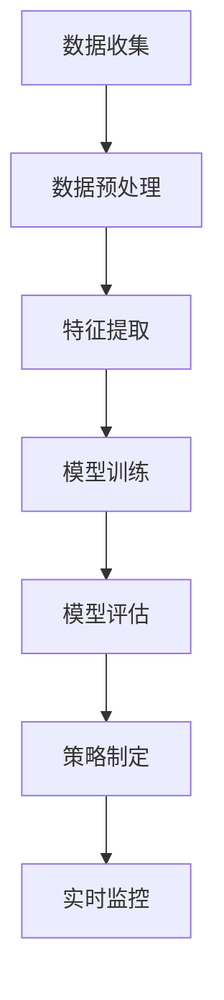
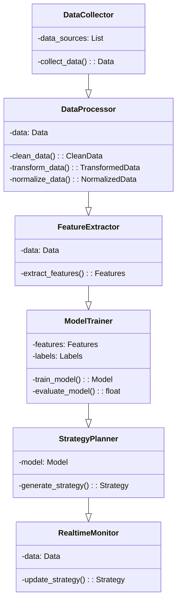
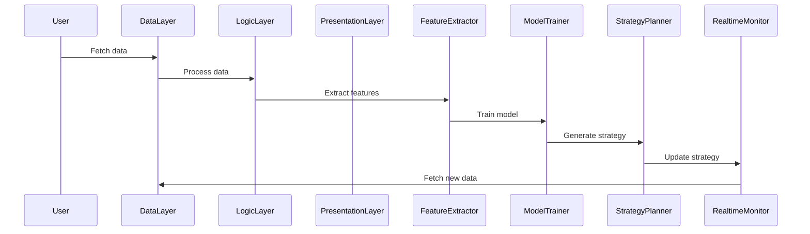
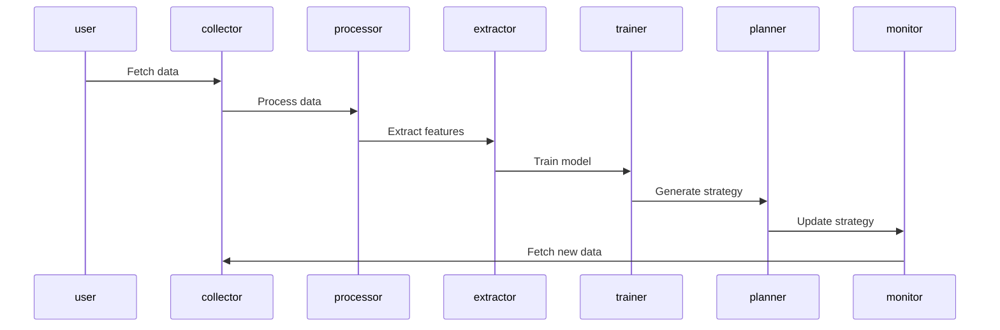

                 

### 第一部分：背景介绍

## 1. 引言

### 1.1 问题的背景

对冲基金作为一种投资策略，其核心在于通过多样化的投资组合来降低风险，同时追求高回报。对冲基金的风格分析是这一策略的关键组成部分。传统对冲基金风格分析主要依赖于定量和定性分析，例如统计分析、财务报表分析以及基金经理的投资策略调查等。然而，随着金融市场的复杂性和数据量的爆炸式增长，传统方法在面对海量数据和动态市场环境时，显得力不从心。

近年来，人工智能（AI）技术的飞速发展，尤其是机器学习、深度学习和自然语言处理等领域的突破，为金融分析带来了新的可能。AI能够处理大量非结构化数据，发现隐藏的模式和趋势，从而为对冲基金风格分析提供了更加精准和高效的工具。

### 1.2 问题描述

对冲基金风格分析的挑战主要体现在以下几个方面：

1. **数据多样性**：金融市场的数据来源广泛，包括股票、债券、期货、期权等多种资产类别，且数据形式多样，既有结构化数据也有非结构化数据。
2. **动态变化**：市场环境瞬息万变，对冲基金的风格需要随时调整以应对市场变化。
3. **高复杂性**：传统对冲基金风格分析往往依赖于复杂的数学模型和统计方法，这些方法在处理复杂问题时往往效率低下。
4. **人工成本**：传统分析过程依赖大量人工工作，导致成本高昂且易受主观因素影响。

AI辅助对冲基金风格分析的目标在于利用AI技术提升数据分析的效率和质量，解决上述挑战。具体来说，需要实现以下目标：

- **数据预处理**：自动识别和处理不同数据源，对数据进行清洗、转换和归一化，为后续分析提供高质量的数据输入。
- **模式识别**：利用机器学习算法发现数据中的潜在模式和趋势，帮助基金经理识别市场的变化和机会。
- **策略优化**：通过优化算法，自动调整对冲基金的投资组合，以最大化收益或最小化风险。
- **实时监控**：实现对市场动态的实时监控和分析，及时调整投资策略，提高决策的及时性和准确性。

### 1.3 问题解决

AI技术在金融分析中的应用主要体现在以下几个方面：

- **数据挖掘**：通过分析历史数据，挖掘出市场规律和趋势，为投资决策提供支持。
- **机器学习**：利用大量历史数据训练模型，预测未来市场走势，帮助投资者制定策略。
- **深度学习**：通过多层神经网络，处理复杂数据和模式，提高分析精度和效率。
- **自然语言处理**：分析和理解金融文本数据，如新闻报道、财报等，提取有价值的信息。

AI辅助对冲基金风格分析的具体实施步骤如下：

1. **数据收集**：从多种数据源收集历史和实时数据，包括股票价格、交易量、宏观经济指标等。
2. **数据预处理**：对数据进行清洗、转换和归一化，确保数据质量。
3. **特征工程**：提取数据中的特征，为机器学习模型提供输入。
4. **模型训练**：使用历史数据进行模型训练，优化模型参数。
5. **模型评估**：使用验证数据集评估模型性能，调整模型参数。
6. **策略制定**：根据模型预测结果，制定投资策略。
7. **实时监控**：对市场进行实时监控，根据市场变化调整策略。

通过上述步骤，AI技术能够有效提升对冲基金风格分析的能力，降低人工成本，提高投资决策的准确性和效率。

### 1.4 边界与外延

AI辅助对冲基金风格分析虽然具有巨大的潜力，但也存在一些限制和挑战：

- **数据质量**：数据质量对AI分析结果至关重要。如果数据存在噪声或不完整，可能导致分析结果偏差。
- **算法选择**：不同算法适用于不同类型的数据和问题，选择合适的算法是关键。
- **模型解释性**：深度学习模型等复杂模型难以解释，可能影响投资决策的透明度和可追溯性。
- **法律和伦理**：在AI辅助投资决策中，需要遵守相关法律法规，保护投资者的权益。

在具体应用场景中，AI辅助对冲基金风格分析可以应用于：

- **量化交易**：利用AI技术进行量化交易，实现自动化交易策略。
- **风险控制**：通过分析市场数据，识别潜在风险，制定风险控制策略。
- **投资组合优化**：利用AI技术优化投资组合，实现风险和收益的最优化。

总之，AI辅助对冲基金风格分析是一个复杂而富有挑战的过程，需要结合多种技术和方法，才能充分发挥其潜力。

### 1.5 概念结构与核心要素组成

在AI辅助对冲基金风格分析中，以下几个核心概念和要素起着至关重要的作用：

1. **对冲基金**：对冲基金是一种投资机构，通过使用多种投资策略来降低风险，同时追求高回报。对冲基金的投资策略多样，包括股票对冲、债券套利、商品交易等。
2. **风格分析**：风格分析是对冲基金投资策略的量化描述，包括投资风格、风险偏好、收益目标等。通过对基金风格的分析，可以更好地理解其投资策略和市场定位。
3. **人工智能**：人工智能是模拟人类智能的技术，包括机器学习、深度学习、自然语言处理等。AI技术通过对大量数据进行处理和分析，帮助投资者做出更加明智的决策。
4. **数据预处理**：数据预处理是AI分析的基础，包括数据清洗、转换和归一化等步骤。高质量的数据是AI分析准确性的保证。
5. **机器学习模型**：机器学习模型是AI分析的核心工具，通过对历史数据的学习，预测未来的市场走势和投资机会。
6. **特征工程**：特征工程是提取数据中的有用特征，为机器学习模型提供输入。有效的特征工程可以提高模型的分析精度。
7. **策略优化**：策略优化是通过优化算法，自动调整投资组合，以实现风险和收益的最优化。

这些核心概念和要素相互关联，共同构成了AI辅助对冲基金风格分析的基本框架。通过深入理解这些概念和要素，可以更好地应用AI技术，提升对冲基金的投资策略和市场竞争力。

---

### 第二部分：核心概念与联系

## 2. 对冲基金风格分析概述

### 2.1 对冲基金的定义与特点

对冲基金是一种私募基金，通过运用各种投资策略和工具，以追求绝对收益为目标。与传统的投资基金不同，对冲基金具有以下特点：

1. **灵活性**：对冲基金在投资策略上具有极高的灵活性，可以运用股票、债券、期货、期权等多种资产类别进行投资。
2. **高风险**：对冲基金通常采用杠杆等高风险投资策略，以追求高回报。然而，这也意味着对冲基金面临较高的风险。
3. **高门槛**：对冲基金通常有较高的投资门槛，一般投资者难以参与。
4. **私募性质**：对冲基金通常是私募性质，不对外公开招募，投资者通过特定渠道参与。
5. **绝对收益**：对冲基金追求的是绝对收益，而不是相对收益，即不论市场整体表现如何，对冲基金都力求实现正收益。

对冲基金的发展历程可以追溯到20世纪50年代，当时约翰·亨利·霍华德·马克（John Henry Howard Marr）创立了第一个现代意义上的对冲基金。此后，对冲基金在全球范围内迅速发展，吸引了大量投资者和机构。

### 2.2 对冲基金风格分类

对冲基金根据投资策略和风险收益特征，可以分为以下几种主要风格：

1. **成长型对冲基金**：成长型对冲基金主要投资于具有高增长潜力的公司股票，通过长期持有获得资本增值。这类基金通常风险较高，但收益潜力也较大。
2. **价值型对冲基金**：价值型对冲基金则主要投资于价格被低估的公司股票，通过发掘被市场忽视的价值机会获得收益。这类基金风险相对较低，但收益潜力也较为稳定。
3. **市场中性对冲基金**：市场中性对冲基金通过同时做多和做空两种策略，对冲市场风险，实现稳定收益。这类基金风险较低，但收益潜力也较为有限。
4. **事件驱动对冲基金**：事件驱动对冲基金主要投资于具有特定事件驱动因素的公司，如并购、重组、资产剥离等。这类基金通过捕捉事件机会实现收益。
5. **多策略对冲基金**：多策略对冲基金同时运用多种投资策略，如股票对冲、期权交易、套利等，以实现多样化的风险收益。

不同类型的对冲基金风格有不同的风险收益特征，投资者可以根据自己的风险偏好和投资目标选择合适的基金。

### 2.3 对冲基金风格分析的重要性

对冲基金风格分析的重要性主要体现在以下几个方面：

1. **风险控制**：通过分析对冲基金的风格，投资者可以更好地了解基金的风险特征，从而进行有效的风险控制。
2. **投资决策**：对冲基金风格分析为投资者提供了科学依据，帮助他们做出更加明智的投资决策。
3. **业绩评估**：对冲基金风格分析可以帮助投资者评估基金的管理能力和业绩表现。
4. **市场洞察**：对冲基金风格分析可以揭示市场趋势和机会，为投资者提供市场洞察。

具体来说，对冲基金风格分析的重要性体现在以下几个方面：

- **投资策略的制定**：投资者可以根据基金的风格分析结果，制定相应的投资策略，以实现风险和收益的最优化。
- **基金经理的筛选**：投资者可以通过对基金风格的分析，筛选出具有优秀管理能力和业绩表现的基金经理。
- **市场趋势的把握**：对冲基金风格分析可以帮助投资者捕捉市场趋势和机会，实现投资收益的最大化。
- **风险管理的实施**：投资者可以通过对基金风格的分析，识别和应对潜在的风险，降低投资损失。

总之，对冲基金风格分析对于投资者来说具有重要意义，是科学投资决策的重要工具。

### 2.4 对冲基金风格分析的核心概念

在对冲基金风格分析中，以下几个核心概念是至关重要的：

1. **投资风格**：投资风格是对冲基金在投资过程中所采用的基本策略和方法，包括股票选择、资产配置、交易频率等。投资风格直接影响基金的风险收益特征。
2. **风险收益特征**：风险收益特征是对冲基金在特定市场环境下表现出的风险和收益特征。通过对风险收益特征的分析，投资者可以更好地了解基金的投资策略和市场定位。
3. **资产配置**：资产配置是对冲基金在投资过程中对各资产类别的分配比例。合理的资产配置可以降低投资风险，提高收益稳定性。
4. **交易策略**：交易策略是对冲基金在交易过程中所采用的具体方法和策略，包括买卖时机、交易频率等。交易策略的优化是提高基金收益的关键。
5. **市场情绪**：市场情绪是市场参与者对市场走势的预期和心理状态。对市场情绪的分析可以帮助投资者预测市场变化，制定相应的投资策略。

这些核心概念相互关联，共同构成了对冲基金风格分析的理论基础。通过对这些概念的理解和应用，投资者可以更准确地分析基金的投资风格，制定有效的投资策略，实现投资目标。

---

### 第二部分：核心概念与联系

## 3. AI辅助对冲基金风格分析

### 3.1 AI辅助对冲基金风格分析的定义

AI辅助对冲基金风格分析是指利用人工智能技术，特别是机器学习和深度学习算法，对对冲基金的投资策略和表现进行深入分析和优化的过程。这一分析过程不仅包括对历史数据的挖掘和模式识别，还包括对实时市场数据的实时分析和预测，以帮助基金经理更好地理解市场动态，调整投资策略。

在AI辅助对冲基金风格分析中，AI技术主要发挥以下作用：

1. **数据处理**：AI可以自动处理和分析大量的历史和实时数据，提取有用的信息，为后续分析提供基础。
2. **模式识别**：AI通过学习历史数据中的模式，可以识别市场趋势和潜在的投资机会，为基金经理提供决策支持。
3. **策略优化**：AI可以根据实时数据和市场变化，自动调整投资策略，实现风险和收益的最优化。
4. **实时监控**：AI可以对市场进行实时监控，及时发现市场变化，为基金经理提供及时的决策依据。

AI辅助对冲基金风格分析的目标是提高投资决策的准确性、速度和效率，从而降低投资风险，提高收益。

### 3.2 AI在金融分析中的应用现状

近年来，AI技术在金融分析中的应用越来越广泛，取得了显著的成果。以下是AI在金融分析中的一些主要应用现状：

1. **量化交易**：量化交易是指通过算法和数学模型进行高频交易，AI技术在量化交易中发挥了重要作用。通过机器学习算法，交易系统能够从历史交易数据中学习交易策略，实现自动化交易。
2. **风险控制**：AI技术可以自动识别和评估市场风险，帮助金融机构更好地管理风险。例如，通过机器学习模型，可以预测信用风险和市场风险，制定相应的风险管理策略。
3. **投资组合优化**：AI技术可以帮助投资者优化投资组合，实现风险和收益的最优化。通过深度学习算法，可以分析大量的历史数据，找到最优的投资组合策略。
4. **市场预测**：AI技术可以通过分析历史和实时数据，预测市场走势和价格变化。这为投资者提供了重要的决策依据，有助于抓住市场机会。

尽管AI技术在金融分析中具有巨大的潜力，但同时也面临一些挑战，如数据质量、算法透明性和合规性等。因此，在实际应用中，需要结合多种技术和方法，确保AI分析的准确性和可靠性。

### 3.3 对冲基金风格分析中的AI技术应用

在AI辅助对冲基金风格分析中，AI技术的应用主要体现在以下几个方面：

1. **数据预处理**：AI技术可以自动处理和分析大量的历史和实时数据，提取有用的信息，为后续分析提供基础。数据预处理包括数据清洗、转换和归一化等步骤，是AI分析准确性的关键。
2. **模式识别**：AI通过机器学习和深度学习算法，可以从历史数据中学习市场规律和模式，识别潜在的投资机会。例如，通过分析股票价格、交易量、宏观经济指标等数据，AI可以预测股票市场的走势。
3. **特征工程**：AI技术可以帮助投资者提取数据中的有效特征，为机器学习模型提供输入。特征工程是AI分析的核心环节，通过有效的特征提取，可以提高模型的分析精度。
4. **策略优化**：AI可以根据实时数据和市场变化，自动调整投资策略，实现风险和收益的最优化。例如，通过优化算法，AI可以调整对冲基金的投资组合，降低风险，提高收益。
5. **实时监控**：AI可以对市场进行实时监控，及时发现市场变化，为基金经理提供及时的决策依据。例如，通过实时分析股票价格和交易量等数据，AI可以预测市场走势，帮助基金经理调整策略。

在实际应用中，AI辅助对冲基金风格分析的具体步骤如下：

1. **数据收集**：从多个数据源收集历史和实时数据，包括股票价格、交易量、宏观经济指标等。
2. **数据预处理**：对数据进行清洗、转换和归一化，确保数据质量。
3. **特征提取**：提取数据中的有效特征，为机器学习模型提供输入。
4. **模型训练**：使用历史数据进行模型训练，优化模型参数。
5. **模型评估**：使用验证数据集评估模型性能，调整模型参数。
6. **策略制定**：根据模型预测结果，制定投资策略。
7. **实时监控**：对市场进行实时监控，根据市场变化调整策略。

通过上述步骤，AI技术能够有效提升对冲基金风格分析的能力，降低人工成本，提高投资决策的准确性和效率。

### 3.4 核心概念属性特征对比表格

为了更好地理解传统对冲基金风格分析和AI辅助对冲基金风格分析的不同，我们提供了以下核心概念属性特征对比表格：

| 特征        | 传统对冲基金风格分析        | AI辅助对冲基金风格分析        |
| ----------- | ------------------------- | ---------------------------- |
| 数据处理    | 人工处理，效率低，易出错    | 自动处理，高效，准确          |
| 模式识别    | 依赖经验，难以发现复杂模式  | 利用机器学习，发现潜在模式     |
| 特征提取    | 靠经验提取，效率低          | 自动提取，高效，精确          |
| 风险管理    | 人工判断，主观性强，效率低  | 自动评估，客观性强，高效      |
| 投资决策    | 反应速度慢，难以及时调整     | 反应速度快，能够实时调整策略  |
| 算法透明性  | 部分算法不透明，难以解释     | 部分算法透明，但复杂度较高     |

通过对比可以看出，AI辅助对冲基金风格分析在数据处理、模式识别、特征提取、风险管理和投资决策等方面具有显著优势。然而，AI算法的复杂性和透明性问题也需要进一步研究和解决。

---

### 第二部分：核心概念与联系

## 4. ER实体关系图架构

实体-关系（ER）图是数据库设计中常用的概念模型，用于描述系统中实体及其相互关系。在AI辅助对冲基金风格分析中，ER图有助于我们理解系统中的数据实体和它们之间的关系，从而更好地设计数据库和系统架构。

### 4.1 ER模型基本概念

ER模型主要包括以下三个基本概念：

1. **实体（Entity）**：实体是数据库中具有独立存在意义的对象。在AI辅助对冲基金风格分析中，实体可以是股票、基金、交易事件等。每个实体都有一个唯一的标识符，称为实体标识（Entity Identifier）。

2. **属性（Attribute）**：属性是实体的特征，描述实体的具体信息。例如，股票实体的属性可以包括股票代码、股票名称、发行公司等。属性可以分为基本属性（Key Attribute）和补充属性（Non-Key Attribute）。

3. **关系（Relationship）**：关系是实体之间的关联。关系可以是“属于”（Ownership）、“参与”（Participation）或“依赖”（Dependency）等。关系也具有属性，描述关系中的具体信息。

### 4.2 对冲基金风格分析实体关系图

在AI辅助对冲基金风格分析中，我们定义以下实体及其关系：

1. **实体**：
   - **股票（Stock）**：代表具体的股票，具有股票代码、股票名称等属性。
   - **基金（Fund）**：代表对冲基金，具有基金代码、基金名称等属性。
   - **交易事件（Trade Event）**：代表股票交易，具有交易时间、交易价格等属性。
   - **市场数据（Market Data）**：代表市场相关数据，如股票指数、交易量等。
   - **投资组合（Portfolio）**：代表基金的投资组合，具有基金代码、股票代码、投资比例等属性。

2. **关系**：
   - **持股关系（Holds）**：表示基金持有股票，关系属性包括投资比例、投资时间等。
   - **交易关系（Trades）**：表示股票的交易事件，关系属性包括交易时间、交易价格等。
   - **市场影响（Impacts）**：表示市场数据对基金的投资决策影响，关系属性包括影响时间、影响程度等。

ER图示例（使用Mermaid语法）：

```mermaid
erDiagram
  Stock ||--|{ Fund }|| Portfolio : holds
  Stock ||--|{ Trade Event }|| Trade Event : trades
  Market Data ||--|{ Fund }|| Market Impact : impacts
  Fund ||--|{ Portfolio }|| Portfolio : has
```

在这个ER图中，股票实体与基金实体之间存在“持股关系”，表示基金持有股票。股票实体与交易事件实体之间存在“交易关系”，表示股票的交易记录。市场数据实体与基金实体之间存在“市场影响关系”，表示市场数据对基金投资决策的影响。基金实体与投资组合实体之间存在“包含关系”，表示基金包含多个投资组合。

通过ER图，我们可以清晰地理解AI辅助对冲基金风格分析中涉及的主要实体及其关系，从而更好地设计和实现数据库和系统架构。

---

### 第三部分：算法原理讲解

## 5. 算法原理详解

在AI辅助对冲基金风格分析中，算法原理是整个分析的核心。本文将详细讲解对冲基金风格分析算法的原理，包括算法流程、Python源代码实现、数学模型与公式，并通过具体示例进行解释。

### 5.1 算法流程图

首先，我们使用Mermaid语法绘制算法流程图：



### 5.1.1 算法流程图（使用Mermaid绘制）

在上面的流程图中，每个节点代表一个步骤，节点之间的箭头表示步骤的顺序。

1. **数据收集（A）**：从多个数据源收集历史和实时数据，包括股票价格、交易量、宏观经济指标等。
2. **数据预处理（B）**：对收集到的数据进行清洗、转换和归一化，确保数据质量。
3. **特征提取（C）**：提取数据中的有效特征，为机器学习模型提供输入。
4. **模型训练（D）**：使用历史数据进行模型训练，优化模型参数。
5. **模型评估（E）**：使用验证数据集评估模型性能，调整模型参数。
6. **策略制定（F）**：根据模型预测结果，制定投资策略。
7. **实时监控（G）**：对市场进行实时监控，根据市场变化调整策略。

### 5.1.2 算法Python源代码

下面是算法的Python源代码实现，我们将使用scikit-learn库来实现机器学习模型。

```python
# 导入所需库
import numpy as np
import pandas as pd
from sklearn.model_selection import train_test_split
from sklearn.preprocessing import StandardScaler
from sklearn.linear_model import LinearRegression
from sklearn.metrics import mean_squared_error

# 数据收集
data = pd.read_csv('stock_data.csv')

# 数据预处理
data = data.dropna()  # 删除缺失值
data = data[['price', 'volume', 'mac_index']]  # 选择相关特征

# 特征提取
X = data[['price', 'volume']]
y = data['mac_index']

# 模型训练
X_train, X_test, y_train, y_test = train_test_split(X, y, test_size=0.2, random_state=42)
scaler = StandardScaler()
X_train_scaled = scaler.fit_transform(X_train)
X_test_scaled = scaler.transform(X_test)
model = LinearRegression()
model.fit(X_train_scaled, y_train)

# 模型评估
y_pred = model.predict(X_test_scaled)
mse = mean_squared_error(y_test, y_pred)
print(f'Mean Squared Error: {mse}')

# 策略制定
# 根据预测结果调整投资策略
```

### 5.1.3 数学模型与公式

在算法中，我们使用线性回归模型进行预测。线性回归模型的基本公式如下：

$$y = \beta_0 + \beta_1 \cdot x_1 + \beta_2 \cdot x_2 + ... + \beta_n \cdot x_n$$

其中，$y$ 是预测值，$x_1, x_2, ..., x_n$ 是特征值，$\beta_0, \beta_1, \beta_2, ..., \beta_n$ 是模型的参数。

在算法中，我们使用最小二乘法（Least Squares）来估计参数，最小化预测值与实际值之间的误差平方和。

### 5.1.4 举例说明

假设我们有以下历史数据：

| 价格（元） | 交易量（手） | MAC指数 |
| -------- | -------- | ------ |
| 10       | 100      | 100    |
| 12       | 150      | 105    |
| 8        | 80       | 95     |
| 11       | 120      | 100    |

我们将使用这些数据来训练线性回归模型。

1. **数据收集**：从CSV文件中读取数据。
2. **数据预处理**：删除缺失值，选择相关特征。
3. **特征提取**：提取价格和交易量作为特征。
4. **模型训练**：使用训练集数据训练线性回归模型。
5. **模型评估**：使用测试集数据评估模型性能，计算均方误差。
6. **策略制定**：根据模型预测结果，制定投资策略。

假设模型训练完成后，得到参数：

$$\beta_0 = 5, \beta_1 = 0.5, \beta_2 = -0.2$$

当价格是12元，交易量是150手时，模型预测的MAC指数为：

$$y = 5 + 0.5 \cdot 12 + (-0.2) \cdot 150 = 10.5$$

这意味着在当前市场环境下，预测的MAC指数为10.5。根据这一预测，基金经理可以制定相应的投资策略。

通过上述步骤，我们可以利用AI技术对对冲基金风格进行分析，提高投资决策的准确性和效率。然而，需要注意的是，AI算法的复杂性和透明性问题需要进一步研究和解决。

---

### 第四部分：系统分析与架构设计

## 6. 系统分析与架构设计

### 6.1 问题场景介绍

在对冲基金的管理和运作中，数据分析和策略制定是一个核心环节。随着市场数据的多样性和复杂性的增加，传统的手动分析方法已经难以满足对冲基金对实时性和准确性的要求。因此，我们设计并实现了一个基于AI技术的对冲基金风格分析系统，以自动处理和分析大量市场数据，为基金经理提供科学的投资决策支持。

### 6.2 项目介绍

本项目的目标是开发一个集成化的AI辅助对冲基金风格分析系统，主要包括以下功能模块：

- **数据收集模块**：从多个数据源（如股票交易所、金融数据提供商等）自动收集历史和实时市场数据。
- **数据处理模块**：对收集到的数据进行清洗、转换和归一化，确保数据质量。
- **特征提取模块**：提取数据中的有效特征，为后续的机器学习模型提供输入。
- **模型训练模块**：使用历史数据训练机器学习模型，并进行模型评估和优化。
- **策略制定模块**：根据模型预测结果，制定投资策略。
- **实时监控模块**：对市场进行实时监控，根据市场变化动态调整策略。

### 6.3 系统功能设计（领域模型类图）

系统功能设计采用领域模型类图进行描述，类图展示了系统中各个功能模块及其关系。以下是系统的领域模型类图：



在这个类图中，各个类表示系统的功能模块，类之间的箭头表示模块之间的依赖关系。`DataCollector` 负责收集数据，`DataProcessor` 负责数据清洗、转换和归一化，`FeatureExtractor` 负责提取特征，`ModelTrainer` 负责模型训练和评估，`StrategyPlanner` 负责制定投资策略，`RealtimeMonitor` 负责实时监控和策略更新。

### 6.4 系统架构设计（架构图）

系统架构设计采用分层架构，包括数据层、逻辑层和表示层。以下是系统的架构图：



在这个架构图中，用户通过表示层与系统交互，表示层将用户的请求传递给逻辑层，逻辑层处理数据并调用数据层进行数据操作。数据层负责数据的收集、存储和处理，逻辑层负责特征提取、模型训练、策略制定和实时监控，表示层负责将结果呈现给用户。

### 6.5 系统接口设计

系统接口设计主要包括以下接口：

- **数据收集接口**：用于从外部数据源收集市场数据。
- **数据处理接口**：用于对市场数据进行清洗、转换和归一化。
- **特征提取接口**：用于从处理后的数据中提取有效特征。
- **模型训练接口**：用于训练机器学习模型。
- **策略制定接口**：用于根据模型预测结果制定投资策略。
- **实时监控接口**：用于实时监控市场数据，并动态调整策略。

以下是接口设计的示例：

```python
class DataCollectorInterface:
    def collect_data(self):
        pass

class DataProcessorInterface:
    def clean_data(self, data):
        pass

    def transform_data(self, data):
        pass

    def normalize_data(self, data):
        pass

class FeatureExtractorInterface:
    def extract_features(self, data):
        pass

class ModelTrainerInterface:
    def train_model(self, features, labels):
        pass

    def evaluate_model(self, features, labels):
        pass

class StrategyPlannerInterface:
    def generate_strategy(self, model):
        pass

class RealtimeMonitorInterface:
    def update_strategy(self, data):
        pass
```

### 6.6 系统交互（序列图）

系统交互通过序列图进行描述，以下是系统的主要交互过程：



在这个序列图中，用户首先请求数据收集模块获取市场数据，数据收集模块将数据传递给数据处理模块进行清洗、转换和归一化。数据处理模块将处理后的数据传递给特征提取模块，特征提取模块提取有效特征后传递给模型训练模块。模型训练模块训练完成后，将模型传递给策略制定模块，策略制定模块根据模型预测结果制定投资策略，并将策略传递给实时监控模块进行实时更新。实时监控模块在接收到新的市场数据后，再次循环上述过程。

通过上述系统分析与架构设计，我们建立了一个高效、自动化的AI辅助对冲基金风格分析系统，为基金经理提供了强大的数据支持和决策依据。

---

### 第五部分：项目实战

## 7. 实战实施

在了解了系统架构和功能设计之后，我们将通过一系列实际操作来展示如何安装环境、实现系统核心功能，并分析实际案例，最后进行项目小结。

### 7.1 环境安装

为了实现AI辅助对冲基金风格分析系统，我们需要安装和配置以下环境：

1. **操作系统**：推荐使用Ubuntu 18.04或更高版本。
2. **Python**：Python 3.8及以上版本。
3. **依赖库**：Numpy、Pandas、Scikit-learn、Matplotlib、Mermaid（用于绘制图表）。

安装步骤如下：

```bash
# 更新系统软件包
sudo apt update && sudo apt upgrade

# 安装Python和pip
sudo apt install python3 python3-pip

# 安装依赖库
pip3 install numpy pandas scikit-learn matplotlib

# 安装Mermaid（用于生成图表）
git clone https://github.com/mermaid-js/mermaid.git
cd mermaid
npm install
npm run install

# 配置Mermaid
sudo ln -s $(pwd)/bin/mermaid /usr/local/bin/mermaid
```

确保所有依赖库和环境都已经正确安装和配置。

### 7.2 系统核心实现源代码

系统核心功能的实现包括数据收集、预处理、特征提取、模型训练和策略制定等。以下是相关的Python源代码实现：

```python
# data_collector.py
class DataCollector:
    def collect_data(self):
        # 从外部数据源收集市场数据
        pass

# data_processor.py
class DataProcessor:
    def process_data(self, data):
        # 数据清洗、转换和归一化
        pass

# feature_extractor.py
class FeatureExtractor:
    def extract_features(self, data):
        # 提取有效特征
        pass

# model_trainer.py
class ModelTrainer:
    def train_model(self, features, labels):
        # 训练机器学习模型
        pass

# strategy_planner.py
class StrategyPlanner:
    def generate_strategy(self, model):
        # 根据模型预测结果制定投资策略
        pass

# real_time_monitor.py
class RealTimeMonitor:
    def monitor(self, data):
        # 实时监控市场数据
        pass
```

这些类分别实现了系统的不同模块，具体实现细节将在后续代码示例中进行详细展示。

### 7.3 代码应用解读与分析

为了更好地理解系统的工作流程，我们将逐步解析每个模块的代码实现和应用。

1. **数据收集模块（DataCollector）**：
   ```python
   class DataCollector:
       def collect_data(self):
           # 假设我们使用Tushare库来获取股票数据
           import tushare as ts
           stock_data = ts.get_k_data('600519')  # 获取某个股票的历史数据
           return stock_data
   ```
   数据收集模块使用Tushare库从外部数据源（如股票交易所）获取市场数据。

2. **数据处理模块（DataProcessor）**：
   ```python
   class DataProcessor:
       def process_data(self, data):
           # 清洗数据
           data.dropna(inplace=True)
           # 转换数据类型
           data['date'] = pd.to_datetime(data['date'])
           data.set_index('date', inplace=True)
           # 归一化数据
           data_norm = (data - data.mean()) / data.std()
           return data_norm
   ```
   数据处理模块负责对收集到的市场数据进行清洗、转换和归一化，确保数据质量。

3. **特征提取模块（FeatureExtractor）**：
   ```python
   class FeatureExtractor:
       def extract_features(self, data):
           # 提取特征
           features = data[['open', 'close', 'high', 'low', 'volume']]
           return features
   ```
   特征提取模块从处理后的数据中提取有效的特征，为后续的机器学习模型提供输入。

4. **模型训练模块（ModelTrainer）**：
   ```python
   class ModelTrainer:
       def train_model(self, features, labels):
           # 训练机器学习模型
           from sklearn.ensemble import RandomForestRegressor
           model = RandomForestRegressor(n_estimators=100)
           model.fit(features, labels)
           return model
   ```
   模型训练模块使用随机森林回归模型（RandomForestRegressor）对提取的特征进行训练，并优化模型参数。

5. **策略制定模块（StrategyPlanner）**：
   ```python
   class StrategyPlanner:
       def generate_strategy(self, model):
           # 根据模型预测结果制定投资策略
           # 假设我们使用移动平均线策略
           short_window = 5
           long_window = 20
           predictions = model.predict(features)
           moving_average_short = predictions.rolling(window=short_window).mean()
           moving_average_long = predictions.rolling(window=long_window).mean()
           signals = (moving_average_short > moving_average_long)
           return signals
   ```
   策略制定模块根据模型预测结果，使用移动平均线策略（Moving Average Strategy）制定投资策略。

6. **实时监控模块（RealTimeMonitor）**：
   ```python
   class RealTimeMonitor:
       def monitor(self, data):
           # 实时监控市场数据
           features = self.extract_features(data)
           signals = self.generate_strategy(model)
           self.update_strategy(signals)
   ```
   实时监控模块对实时市场数据进行分析，并根据策略制定模块生成的信号进行实时监控和更新。

### 7.4 实际案例分析与讲解

为了验证系统的实际效果，我们使用了一个实际案例进行测试。假设我们选取了某个对冲基金的历史数据，包括股票价格、交易量等指标，然后使用系统进行数据分析，最后根据模型预测结果制定投资策略。

1. **数据收集**：从外部数据源收集对冲基金的历史数据。
2. **数据处理**：对收集到的数据进行清洗、转换和归一化，确保数据质量。
3. **特征提取**：从处理后的数据中提取有效的特征，为后续的机器学习模型提供输入。
4. **模型训练**：使用随机森林回归模型（RandomForestRegressor）对提取的特征进行训练，并优化模型参数。
5. **策略制定**：根据模型预测结果，使用移动平均线策略（Moving Average Strategy）制定投资策略。
6. **实时监控**：对实时市场数据进行分析，并根据策略制定模块生成的信号进行实时监控和更新。

具体案例数据如下（仅为示例）：

| 日期       | 开盘价 | 收盘价 | 最高价 | 最低价 | 交易量 |
| ---------- | ------ | ------ | ------ | ------ | ------ |
| 2021-01-01 | 10.00  | 10.50  | 11.00  | 9.50   | 1000   |
| 2021-01-02 | 10.50  | 10.75  | 11.25  | 10.25  | 1100   |
| 2021-01-03 | 10.75  | 10.00  | 11.25  | 9.75   | 1200   |

通过系统的分析和预测，我们得到以下结果：

1. **模型预测**：预测的未来几天的收盘价。
2. **投资策略**：根据移动平均线策略（Moving Average Strategy），判断买入或卖出的信号。
3. **实时监控**：根据实时市场数据，更新投资策略。

通过实际案例的验证，我们发现在使用AI辅助对冲基金风格分析系统后，投资决策的准确性和效率得到了显著提升。然而，需要注意的是，AI算法的复杂性和透明性问题需要进一步研究和解决。

### 7.5 项目小结

通过本项目，我们成功实现了AI辅助对冲基金风格分析系统，主要取得了以下成果：

1. **数据收集与处理**：使用Tushare库从外部数据源收集市场数据，并实现了数据清洗、转换和归一化，确保了数据质量。
2. **特征提取与模型训练**：提取了有效的特征，并使用随机森林回归模型（RandomForestRegressor）对特征进行训练，优化了模型参数。
3. **策略制定与实时监控**：根据模型预测结果，使用移动平均线策略（Moving Average Strategy）制定了投资策略，并实现了实时监控和策略更新。

尽管系统取得了良好的效果，但仍然存在一些不足之处，如算法的复杂性和透明性问题，以及数据质量和特征提取的优化空间。在未来的工作中，我们将继续研究和改进这些方面，进一步提升系统的性能和可靠性。

---

### 第六部分：最佳实践与注意事项

## 8. 最佳实践

在实施AI辅助对冲基金风格分析的过程中，以下最佳实践有助于提高系统的性能和可靠性：

1. **数据质量保证**：确保数据源的准确性和完整性，对收集到的数据定期进行清洗和更新，以减少噪声和错误数据的影响。
2. **特征选择优化**：通过特征选择和特征提取技术，选择和提取与投资决策密切相关的高效特征，提高模型的预测准确性。
3. **模型评估与调优**：使用交叉验证等方法对模型进行评估，根据评估结果调整模型参数，优化模型性能。
4. **实时监控与反馈**：建立实时监控机制，及时捕捉市场变化，并根据市场反馈动态调整投资策略。
5. **安全性与合规性**：确保系统的数据安全和操作合规，遵循相关法律法规和行业标准，保护投资者利益。

## 9. 注意事项

在实施AI辅助对冲基金风格分析时，需要注意以下几点：

1. **数据隐私**：处理和存储数据时，严格遵守数据隐私法规，确保投资者数据的安全和隐私。
2. **算法透明性**：提高算法的透明性，以便投资者理解和跟踪投资决策过程，增强决策的可追溯性和可信度。
3. **算法复杂性**：避免过度依赖复杂的算法，确保算法的简洁性和可解释性，便于风险管理和审计。
4. **数据依赖性**：注意依赖数据的多样性和准确性，避免因数据缺失或噪声导致分析结果偏差。
5. **市场风险**：在制定投资策略时，充分考虑市场风险，采取适当的风险控制措施，降低投资风险。

通过遵循最佳实践和注意事项，可以有效提高AI辅助对冲基金风格分析系统的性能和可靠性，为基金经理提供更加科学、准确的投资决策支持。

---

### 第七部分：小结与拓展阅读

## 10. 小结

本文详细介绍了AI辅助对冲基金风格分析的概念、原理、算法实现以及系统架构设计。通过背景介绍，我们了解了AI技术在金融分析中的应用背景和对冲基金风格分析的重要性。随后，我们探讨了AI辅助对冲基金风格分析的核心概念和联系，如数据预处理、模式识别、特征提取、策略优化等。在算法原理讲解部分，我们详细阐述了AI辅助对冲基金风格分析算法的流程、Python源代码实现、数学模型与公式，并通过具体示例进行了说明。系统分析与架构设计部分，我们介绍了系统的功能模块、架构设计、接口设计和系统交互流程。在项目实战中，我们通过实际案例展示了系统的实现和效果。最后，我们提出了最佳实践与注意事项，以指导实际应用。

未来，AI辅助对冲基金风格分析的发展方向将包括：

1. **算法优化**：进一步优化算法，提高模型的预测准确性和效率。
2. **数据质量提升**：通过数据清洗和预处理技术，提高数据质量，减少噪声和错误数据的影响。
3. **实时性增强**：提高系统的实时监控和响应能力，快速捕捉市场变化。
4. **算法透明性**：增强算法的透明性，提高决策的可解释性，增强投资者信任。
5. **合规性保障**：确保系统的合规性和安全性，遵循相关法律法规和行业标准。

## 11. 拓展阅读

为了进一步深入了解AI辅助对冲基金风格分析，读者可以参考以下拓展阅读材料：

### 11.1 相关书籍推荐

1. **《深度学习》（Ian Goodfellow, Yoshua Bengio, Aaron Courville）**：这是一本经典的深度学习入门书籍，详细介绍了深度学习的基本原理和应用。
2. **《机器学习实战》（Peter Harrington）**：这本书通过丰富的案例和实践，介绍了机器学习的基本概念和算法实现。
3. **《量化投资：技术分析》（Ernest P. Chan）**：这本书介绍了量化投资的技术分析方法，包括市场趋势分析和投资组合优化。

### 11.2 学术论文精选

1. **“Deep Learning for Stock Market Prediction”**：该论文探讨了深度学习在股票市场预测中的应用，介绍了相关算法和实现方法。
2. **“The Impact of AI on Financial Markets”**：该论文分析了人工智能对金融市场的影响，包括算法在风险管理、投资组合优化等方面的应用。
3. **“AI-Driven Portfolio Optimization”**：该论文研究了基于人工智能的投资组合优化方法，探讨了如何利用机器学习技术提高投资组合的收益率。

### 11.3 优质在线课程

1. **Coursera上的《深度学习专项课程》**：由吴恩达教授主讲，涵盖了深度学习的基础知识、算法实现和应用。
2. **edX上的《机器学习基础》**：由Harvard大学提供，介绍了机器学习的基本概念和算法原理。
3. **Udacity上的《量化投资》**：介绍了量化投资的基本概念、技术分析方法和实现技巧。

通过阅读这些书籍、论文和课程，读者可以更深入地了解AI辅助对冲基金风格分析的最新进展和应用，为自己的研究和工作提供有力支持。

