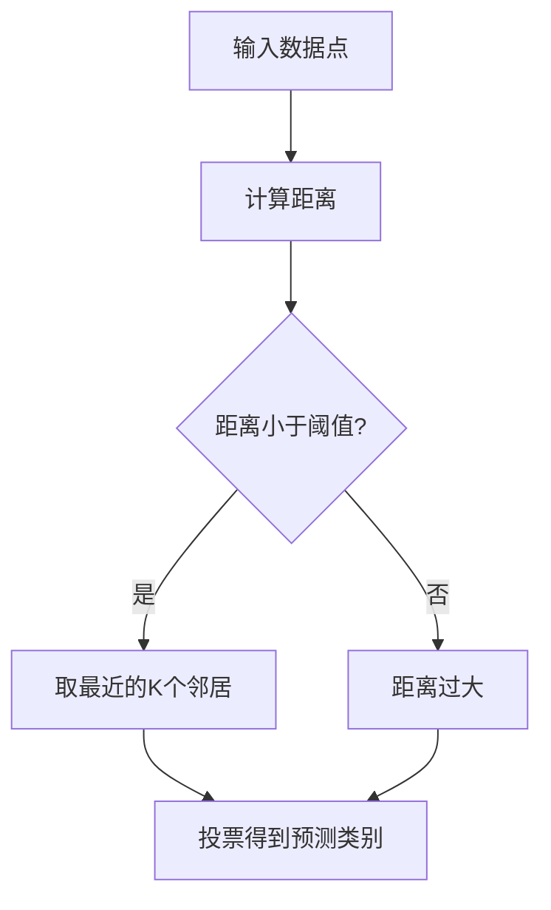
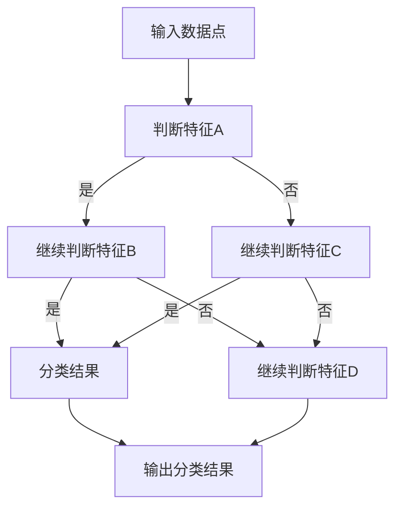
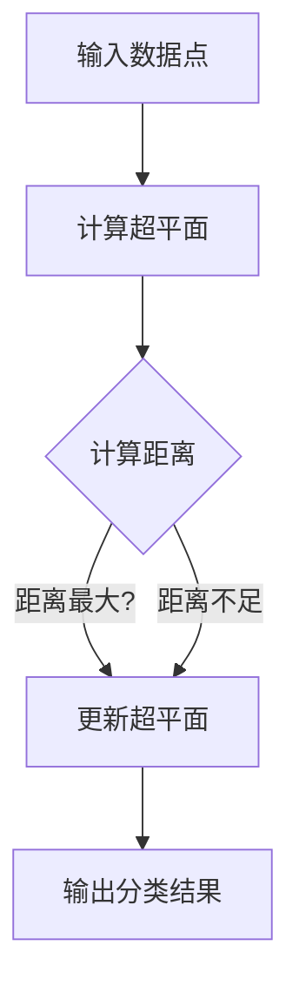
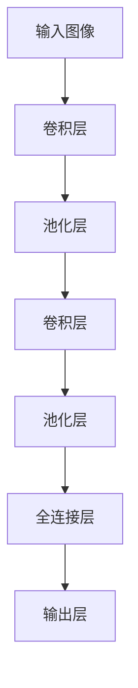
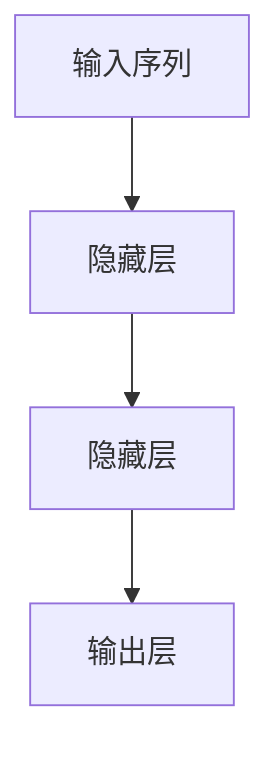
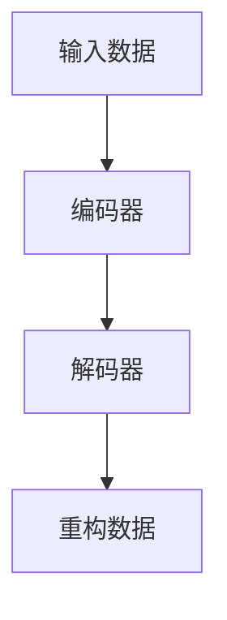
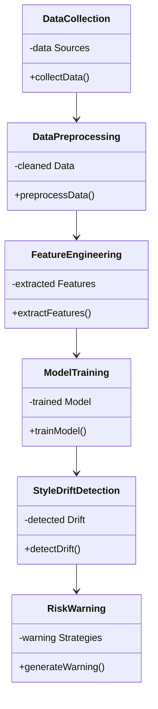
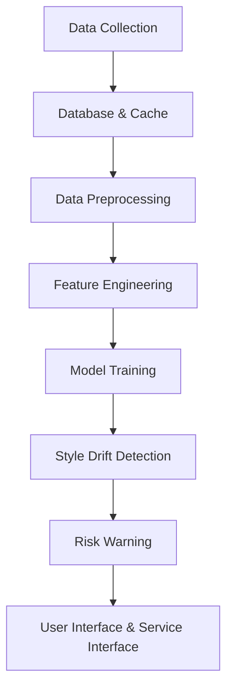
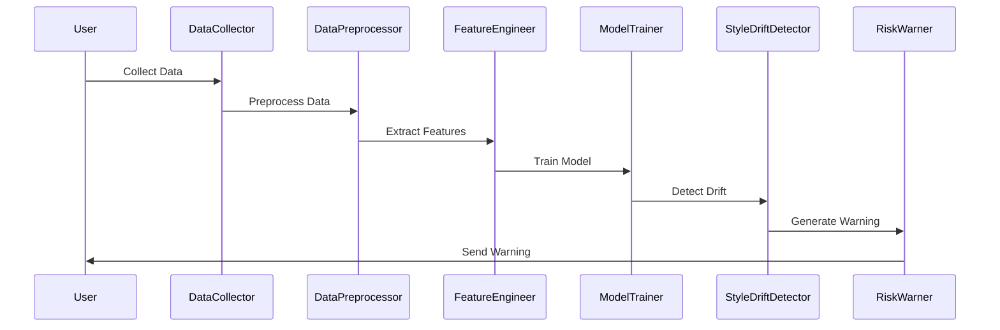

                 


### 目录大纲设计与初步思考

为了撰写一篇高质量、逻辑清晰、内容丰富的技术博客文章，我们首先需要设计一个详细的目录大纲，以确保文章的完整性和连贯性。以下是我们的初步思考：

**第一部分：背景介绍与核心概念**

- **第1章：对冲基金与风格漂移**
  - **1.1 对冲基金概述**
    - 对冲基金的定义、特点、作用
  - **1.2 风格漂移的概念**
    - 风格漂移的定义、类型、影响
  - **1.3 AI在金融领域的应用**
    - AI在投资管理、风险管理、市场预测中的应用

- **第2章：AI辅助的对冲基金风格漂移检测**
  - **2.1 风格漂移检测的挑战**
    - 数据复杂性、实时性要求、模型准确性
  - **2.2 AI技术的应用优势**
    - 数据处理能力、自学习、预测准确性
  - **2.3 AI辅助风格漂移检测的方法**
    - 机器学习、深度学习、强化学习等

**第二部分：核心概念与联系**

- **第3章：核心概念与联系**
  - **3.1 对冲基金风格漂移检测的相关概念**
    - 数据分析、特征工程、模型评估
  - **3.2 对冲基金风格漂移检测的原理**
    - 统计学原理、机器学习原理、深度学习原理

**第三部分：数学模型和公式**

- **第4章：数学模型和公式**
  - **4.1 数据预处理**
    - 数据清洗、归一化、降维
  - **4.2 特征工程**
    - 特征提取、选择、重要性分析
  - **4.3 模型评估**
    - 评估指标、交叉验证、超参数调优

**第四部分：AI辅助的对冲基金风格漂移检测算法**

- **第5章：算法原理讲解**
  - **5.1 机器学习算法**
    - K近邻、决策树、支持向量机
  - **5.2 深度学习算法**
    - 卷积神经网络、递归神经网络、自编码器

**第五部分：系统分析与架构设计**

- **第6章：系统分析与架构设计**
  - **6.1 系统功能设计**
    - 领域模型、功能模块划分
  - **6.2 系统架构设计**
    - 总体架构、技术栈选择
  - **6.3 系统接口设计与交互**
    - 接口设计、交互流程

**第六部分：项目实战**

- **第7章：项目实战**
  - **7.1 环境安装**
    - 硬件环境、软件环境
  - **7.2 系统核心实现**
    - 数据预处理、特征工程、模型训练与评估
  - **7.3 实际案例分析与讲解**
    - 案例背景、分析、总结

**第七部分：最佳实践与小结**

- **第8章：最佳实践与小结**
  - **8.1 最佳实践**
    - 数据质量控制、特征选择策略、模型调优技巧
  - **8.2 小结**
    - 主要贡献、未来研究方向、注意事项、拓展阅读

通过上述初步的目录大纲设计，我们可以确保文章的内容结构合理，逻辑清晰，同时每个章节的内容都能够具体详细地讲解核心概念、算法原理、数学模型、系统设计、项目实战等。接下来，我们将逐步填充每个章节的具体内容，确保文章的完整性和专业性。

---

### 背景介绍与核心概念

#### 第1章：对冲基金与风格漂移

##### 1.1 对冲基金概述

**对冲基金**，又称为避险基金，是指那些采取多种投资策略，旨在通过积极管理资产以规避系统性风险的基金。对冲基金通常是由专业投资机构管理的，投资策略多样，包括但不限于股票套利、商品交易、外汇交易和固定收益投资等。对冲基金的特点主要包括以下几个方面：

1. **投资策略多样性**：对冲基金可以采用多种投资策略，以最大化收益并降低风险。
2. **灵活的投资组合**：对冲基金可以根据市场状况调整投资组合，进行多空双向操作。
3. **较高的门槛**：对冲基金的投资者通常需要具备较高的资金门槛和风险承受能力。
4. **高额的管理费用**：对冲基金通常收取较高的管理费和绩效费。

**对冲基金的作用**主要体现在以下几个方面：

1. **风险规避**：通过多样化的投资策略，对冲基金可以有效降低投资组合的整体风险。
2. **资产增值**：在市场波动较大的情况下，对冲基金能够利用市场机会实现资产增值。
3. **市场流动性**：对冲基金的参与有助于提高市场的流动性，为投资者提供更多的交易机会。

##### 1.2 风格漂移的概念

**风格漂移**，指的是对冲基金在长期运行过程中，投资策略、风险偏好或资产配置发生显著变化的现象。风格漂移可以分为以下几种类型：

1. **策略漂移**：基金的投资策略与初始设定的策略出现较大差异。
2. **风险漂移**：基金的风险偏好与初始设定的风险承受能力出现不一致。
3. **资产配置漂移**：基金的投资组合中各类资产的权重发生显著变化。

**风格漂移的影响**主要包括以下几个方面：

1. **风险增加**：风格漂移可能导致基金的投资风险增加，从而影响基金的整体收益。
2. **收益波动**：风格漂移可能导致基金的收益波动加大，影响投资者的信心。
3. **策略失效**：如果基金的管理团队未能及时调整投资策略，风格漂移可能导致原有的投资策略失效。

##### 1.3 AI在金融领域的应用

随着人工智能技术的快速发展，AI在金融领域的应用越来越广泛。AI在金融领域的应用主要包括以下几个方面：

1. **投资管理**：AI可以通过大数据分析和机器学习算法，帮助投资机构进行市场预测和投资决策。
2. **风险管理**：AI可以实时监测市场风险，识别潜在的风险因素，提供风险预警。
3. **市场预测**：AI可以通过历史数据分析和模式识别，预测市场趋势，为投资者提供决策依据。

**AI辅助的对冲基金风格漂移检测**

在AI技术的辅助下，对冲基金风格漂移检测变得更加高效和准确。AI可以通过以下几种方式辅助风格漂移检测：

1. **数据挖掘**：AI可以挖掘大量历史数据，识别出风格漂移的潜在模式和规律。
2. **特征工程**：AI可以通过特征工程提取关键特征，用于风格漂移检测。
3. **模型训练**：AI可以通过训练大量数据集，构建出能够准确检测风格漂移的模型。
4. **实时监测**：AI可以实时监测基金的投资策略和资产配置，及时发现风格漂移的迹象。

**风格漂移检测的挑战**

尽管AI技术在风格漂移检测方面具有明显优势，但仍然面临以下挑战：

1. **数据复杂性**：对冲基金的投资策略和数据来源多样，数据复杂性高，给AI数据处理带来了挑战。
2. **实时性要求**：对冲基金需要实时监测风格漂移，对AI技术的实时处理能力提出了高要求。
3. **模型准确性**：AI模型的准确性直接影响风格漂移检测的效果，需要不断优化和调整模型。

在接下来的章节中，我们将详细探讨AI辅助的对冲基金风格漂移检测的原理、方法和技术，以期为读者提供全面的了解和指导。

---

### 核心概念与联系

#### 第3章：核心概念与联系

在深入探讨AI辅助的对冲基金风格漂移检测之前，我们需要明确一些核心概念，并理解它们之间的联系。以下是几个关键概念及其之间的相互关系。

##### 3.1 对冲基金风格漂移检测的相关概念

**数据分析**：数据分析是对大量数据进行收集、整理、分析和解释的过程，目的是从数据中提取有价值的信息和洞察。在对冲基金风格漂移检测中，数据分析是不可或缺的一环，它帮助我们理解基金的历史投资行为和市场表现。

**特征工程**：特征工程是数据预处理的重要环节，通过选择和构建特征，提高模型对数据的表达能力和预测性能。在风格漂移检测中，特征工程的作用至关重要，它有助于提取出能够有效区分风格漂移的关键特征。

**模型评估**：模型评估是评估模型性能和预测准确性的过程。通过对模型的评估，我们可以确定模型在风格漂移检测中的效果，并据此进行优化和调整。

##### 3.2 对冲基金风格漂移检测的原理

**统计学原理**：统计学原理是数据分析的基础，它通过概率论和数理统计的方法，对数据进行分析和解释。在风格漂移检测中，统计学原理可以帮助我们理解数据的分布特性，识别异常值和趋势变化。

**机器学习原理**：机器学习原理是通过训练数据集，使模型能够对未知数据进行预测。在风格漂移检测中，机器学习算法可以帮助我们构建预测模型，识别和检测风格漂移。

**深度学习原理**：深度学习原理是基于多层神经网络，通过反向传播算法进行训练。深度学习在处理大规模数据和复杂特征方面具有显著优势，是AI辅助风格漂移检测的重要技术。

##### 概念属性特征对比表格

为了更直观地展示上述概念之间的联系，我们制作了一个概念属性特征对比表格，如下所示：

| 概念 | 描述 | 属性特征 |
| --- | --- | --- |
| 数据分析 | 对大量数据进行收集、整理、分析和解释 | 数据清洗、数据整合、数据可视化 |
| 特征工程 | 构建和选择特征，提高模型性能 | 特征提取、特征选择、特征标准化 |
| 模型评估 | 评估模型性能和预测准确性 | 准确率、召回率、F1分数、ROC曲线 |
| 统计学原理 | 使用统计学方法对数据进行分析 | 概率分布、假设检验、回归分析 |
| 机器学习原理 | 使用训练数据集训练模型 | 线性回归、决策树、支持向量机 |
| 深度学习原理 | 使用多层神经网络进行训练 | 卷积神经网络、递归神经网络、深度信念网络 |

##### ER实体关系图架构

为了更清晰地理解概念之间的关联，我们使用Mermaid流程图来绘制ER实体关系图，如下所示：

```mermaid
erDiagram
  数据分析 ||--|{ 特征工程 }|
  数据分析 ||--|{ 模型评估 }|
  特征工程 ||--|{ 统计学原理 }|
  特征工程 ||--|{ 机器学习原理 }|
  特征工程 ||--|{ 深度学习原理 }|
  模型评估 ||--|{ 统计学原理 }|
  模型评估 ||--|{ 机器学习原理 }|
  模型评估 ||--|{ 深度学习原理 }|
```

通过上述表格和Mermaid流程图，我们可以更清晰地理解数据分析、特征工程、模型评估、统计学原理、机器学习原理和深度学习原理之间的联系。这些概念共同构成了AI辅助的对冲基金风格漂移检测的核心理论体系。

在接下来的章节中，我们将详细探讨每个概念的具体原理和应用，帮助读者深入理解AI辅助的对冲基金风格漂移检测的内在机制。

---

### 数学模型和公式

#### 第4章：数学模型和公式

在AI辅助的对冲基金风格漂移检测中，数学模型和公式起到了关键作用。这些模型和公式不仅帮助我们理解和描述数据，还为我们提供了评估和优化模型的方法。以下是几个重要的数学模型和公式，以及它们在风格漂移检测中的应用。

##### 4.1 数据预处理

**数据清洗**：数据清洗是数据预处理的重要步骤，其目的是去除数据中的噪声和不一致。常用的方法包括填充缺失值、处理异常值和去除重复数据。以下是一个填充缺失值的基本公式：

$$
\hat{X}_{i,j} = \frac{\sum_{k \neq j} X_{i,k}}{n - 1}
$$

其中，$X_{i,j}$表示第i个样本的第j个特征值，$\hat{X}_{i,j}$表示经过填充处理后的特征值，$n$表示特征的总数。

**数据归一化**：数据归一化是将数据缩放到一个统一范围内，以消除不同特征之间的量纲差异。常用的归一化方法包括最小-最大归一化和标准归一化。以下是最小-最大归一化的公式：

$$
X_{i,j}^{'} = \frac{X_{i,j} - \min_{j} X_{i,j}}{\max_{j} X_{i,j} - \min_{j} X_{i,j}}
$$

其中，$X_{i,j}^{'}$表示归一化后的特征值。

**数据降维**：数据降维是将高维数据映射到低维空间，以减少数据量和提高计算效率。常用的降维方法包括主成分分析（PCA）和t-SVD。以下PCA的基本公式：

$$
Z = PC
$$

其中，$Z$表示降维后的数据，$P$表示投影矩阵，$C$表示协方差矩阵，$C = PDP^{'}$，$D$是对角矩阵。

##### 4.2 特征工程

**特征提取**：特征提取是从原始数据中提取出能够代表数据本质的特征。常用的方法包括自动编码器和核主成分分析（KPCA）。以下自动编码器的基本公式：

$$
\hat{X} = \sigma(WX + b)
$$

其中，$\hat{X}$表示编码后的特征，$W$表示权重矩阵，$X$表示输入数据，$b$表示偏置项，$\sigma$是激活函数。

**特征选择**：特征选择是选择对预测任务最重要的特征，以减少模型复杂度和提高预测性能。常用的方法包括互信息、L1正则化和基于模型的特征选择。以下互信息的公式：

$$
I(X;Y) = H(X) - H(X|Y)
$$

其中，$I(X;Y)$表示特征X与目标Y的互信息，$H(X)$表示特征X的熵，$H(X|Y)$表示在给定Y的情况下特征X的熵。

**特征重要性分析**：特征重要性分析是评估特征对模型预测贡献的大小。常用的方法包括随机森林和梯度提升机（GBM）。以下随机森林中特征重要性的计算公式：

$$
I_j = \frac{\sum_{k=1}^{K} |T_k|}{\sum_{k=1}^{K} T_k}
$$

其中，$I_j$表示特征j的重要性，$T_k$表示决策树k中特征j的分裂次数，$K$表示决策树的总数。

##### 4.3 模型评估

**评估指标**：评估指标是衡量模型性能的标准，常用的评估指标包括准确率、召回率、F1分数和ROC曲线。以下F1分数的公式：

$$
F1 = 2 \times \frac{P \times R}{P + R}
$$

其中，$F1$表示F1分数，$P$表示准确率，$R$表示召回率。

**交叉验证**：交叉验证是一种评估模型性能的方法，通过将数据集划分为多个子集，轮流使用它们作为验证集和训练集。以下交叉验证的基本公式：

$$
\hat{L} = \frac{1}{K} \sum_{k=1}^{K} L_k
$$

其中，$\hat{L}$表示交叉验证的平均损失，$L_k$表示第k次验证的损失，$K$表示验证的次数。

**超参数调优**：超参数调优是调整模型超参数以获得最佳性能的过程。常用的调优方法包括网格搜索和贝叶斯优化。以下网格搜索的基本公式：

$$
\text{最优超参数} = \arg\min_{\theta} \hat{L}(\theta)
$$

其中，$\theta$表示超参数，$\hat{L}(\theta)$表示使用超参数$\theta$时的模型损失。

通过上述数学模型和公式，我们可以更深入地理解和应用AI辅助的对冲基金风格漂移检测。在接下来的章节中，我们将进一步探讨具体的算法原理和实现细节，帮助读者全面掌握这项技术。

---

### 算法原理讲解

#### 第5章：算法原理讲解

在AI辅助的对冲基金风格漂移检测中，算法的选择和设计至关重要。本章将详细讲解两种主要的算法类型：机器学习算法和深度学习算法。我们将分别介绍K近邻算法、决策树算法、支持向量机算法、卷积神经网络、递归神经网络和自编码器，并使用mermaid流程图和Python源代码来展示算法原理。

##### 5.1 机器学习算法

**K近邻算法（K-Nearest Neighbors, KNN）**

K近邻算法是一种简单而有效的分类算法，其基本思想是：对于一个未知类别的数据点，通过计算该数据点与训练集中各数据点的距离，选择最近的K个邻居，并基于这些邻居的类别进行投票，得出最终的预测结果。

**mermaid流程图**：



**Python源代码**：

```python
from sklearn.neighbors import KNeighborsClassifier
from sklearn.datasets import load_iris
from sklearn.model_selection import train_test_split

# 加载鸢尾花数据集
iris = load_iris()
X, y = iris.data, iris.target

# 划分训练集和测试集
X_train, X_test, y_train, y_test = train_test_split(X, y, test_size=0.3, random_state=42)

# 创建KNN分类器
knn = KNeighborsClassifier(n_neighbors=3)
knn.fit(X_train, y_train)

# 预测测试集
predictions = knn.predict(X_test)
```

**决策树算法（Decision Tree）**

决策树算法通过一系列规则对数据进行分类或回归。每个内部节点代表一个特征，每个分支代表该特征的取值，叶节点表示最终的分类或回归结果。

**mermaid流程图**：



**Python源代码**：

```python
from sklearn.tree import DecisionTreeClassifier
from sklearn.datasets import load_iris
from sklearn.model_selection import train_test_split

# 加载鸢尾花数据集
iris = load_iris()
X, y = iris.data, iris.target

# 划分训练集和测试集
X_train, X_test, y_train, y_test = train_test_split(X, y, test_size=0.3, random_state=42)

# 创建决策树分类器
dt = DecisionTreeClassifier()
dt.fit(X_train, y_train)

# 预测测试集
predictions = dt.predict(X_test)
```

**支持向量机算法（Support Vector Machine, SVM）**

支持向量机算法通过找到一个超平面，将不同类别的数据点分隔开来。在二分类问题中，SVM试图找到一个最优的分割超平面，使得正负样本之间的距离最大。

**mermaid流程图**：



**Python源代码**：

```python
from sklearn.svm import SVC
from sklearn.datasets import load_iris
from sklearn.model_selection import train_test_split

# 加载鸢尾花数据集
iris = load_iris()
X, y = iris.data, iris.target

# 划分训练集和测试集
X_train, X_test, y_train, y_test = train_test_split(X, y, test_size=0.3, random_state=42)

# 创建SVM分类器
svm = SVC()
svm.fit(X_train, y_train)

# 预测测试集
predictions = svm.predict(X_test)
```

##### 5.2 深度学习算法

**卷积神经网络（Convolutional Neural Network, CNN）**

卷积神经网络是一种用于图像识别和处理的深度学习算法，其核心思想是使用卷积操作来提取图像特征。

**mermaid流程图**：



**Python源代码**：

```python
from tensorflow.keras.models import Sequential
from tensorflow.keras.layers import Conv2D, MaxPooling2D, Flatten, Dense

# 创建模型
model = Sequential()
model.add(Conv2D(32, (3, 3), activation='relu', input_shape=(64, 64, 3)))
model.add(MaxPooling2D((2, 2)))
model.add(Conv2D(64, (3, 3), activation='relu'))
model.add(MaxPooling2D((2, 2)))
model.add(Flatten())
model.add(Dense(128, activation='relu'))
model.add(Dense(10, activation='softmax'))

# 编译模型
model.compile(optimizer='adam', loss='categorical_crossentropy', metrics=['accuracy'])

# 训练模型
model.fit(X_train, y_train, epochs=10, batch_size=32, validation_data=(X_test, y_test))
```

**递归神经网络（Recurrent Neural Network, RNN）**

递归神经网络是一种适用于序列数据处理的深度学习算法，其核心思想是使用递归连接来处理序列中的前后依赖关系。

**mermaid流程图**：



**Python源代码**：

```python
from tensorflow.keras.models import Sequential
from tensorflow.keras.layers import LSTM, Dense

# 创建模型
model = Sequential()
model.add(LSTM(50, activation='relu', input_shape=(timesteps, features)))
model.add(Dense(1))
model.compile(optimizer='adam', loss='mse')

# 训练模型
model.fit(X_train, y_train, epochs=100, batch_size=32, validation_data=(X_test, y_test))
```

**自编码器（Autoencoder）**

自编码器是一种无监督学习算法，其目的是将输入数据压缩到一个低维空间，然后再重构原始数据。

**mermaid流程图**：



**Python源代码**：

```python
from tensorflow.keras.models import Model
from tensorflow.keras.layers import Input, Dense

# 创建模型
input_data = Input(shape=(input_shape,))
encoded = Dense(encoding_dim, activation='relu')(input_data)
decoded = Dense(input_shape, activation='sigmoid')(encoded)

# 编译模型
autoencoder = Model(input_data, decoded)
autoencoder.compile(optimizer='adam', loss='binary_crossentropy')

# 训练模型
autoencoder.fit(X_train, X_train, epochs=100, batch_size=256, shuffle=True, validation_data=(X_test, X_test))
```

通过以上讲解，我们可以看到机器学习算法和深度学习算法在AI辅助的对冲基金风格漂移检测中各自的作用和优势。在接下来的章节中，我们将进一步探讨系统分析与架构设计，为实际应用提供更具体的指导。

---

### 系统分析与架构设计

#### 第6章：系统分析与架构设计

为了实现对冲基金风格漂移的检测，我们需要设计一个高效、可靠的系统架构。本章节将详细描述系统功能设计、系统架构设计、系统接口设计和系统交互。

##### 6.1 系统功能设计

**系统功能设计**是系统架构设计的基础，它定义了系统需要实现的核心功能。针对AI辅助的对冲基金风格漂移检测，我们设计以下功能模块：

1. **数据采集模块**：负责从对冲基金管理系统和其他数据源采集原始数据，包括股票价格、基金持仓、交易记录等。
2. **数据预处理模块**：负责对采集到的原始数据进行清洗、归一化和降维处理，以去除噪声和减少数据复杂性。
3. **特征工程模块**：负责从预处理后的数据中提取关键特征，并进行特征选择和重要性分析，以提高模型的预测性能。
4. **模型训练模块**：负责使用机器学习和深度学习算法训练模型，并保存训练好的模型。
5. **风格漂移检测模块**：负责实时监测基金的投资策略和资产配置，使用训练好的模型进行风格漂移检测。
6. **风险预警模块**：负责对检测到的风格漂移发出预警，并提供相应的应对策略。

**领域模型（Mermaid类图）**：



##### 6.2 系统架构设计

**系统架构设计**是系统功能设计在技术实现层面的具体体现。为了实现高效、可靠的AI辅助风格漂移检测，我们采用以下系统架构：

1. **数据层**：数据层包括数据采集模块、数据库和缓存，负责数据存储和管理。
2. **逻辑层**：逻辑层包括数据预处理模块、特征工程模块、模型训练模块、风格漂移检测模块和风险预警模块，负责数据处理和业务逻辑实现。
3. **表示层**：表示层包括用户界面和服务接口，负责与用户交互和提供数据服务。

**系统架构图（Mermaid架构图）**：



##### 6.3 系统接口设计与交互

**系统接口设计**是系统架构设计的重要组成部分，它定义了系统内部各模块之间的交互方式。以下是系统的接口设计和交互流程：

1. **数据采集接口**：数据采集模块提供的接口，用于从各种数据源采集原始数据。
2. **数据处理接口**：数据预处理模块提供的接口，用于处理和清洗原始数据。
3. **特征提取接口**：特征工程模块提供的接口，用于提取和处理关键特征。
4. **模型训练接口**：模型训练模块提供的接口，用于训练和保存模型。
5. **风格检测接口**：风格漂移检测模块提供的接口，用于实时检测风格漂移。
6. **预警接口**：风险预警模块提供的接口，用于生成和发送风险预警。

**系统交互图（Mermaid序列图）**：



通过以上系统分析与架构设计，我们为AI辅助的对冲基金风格漂移检测提供了一个清晰、合理的系统框架，确保系统的功能实现和技术实现都能满足实际需求。在接下来的章节中，我们将通过实际项目实战，进一步验证和优化这个系统架构。

---

### 项目实战

#### 第7章：项目实战

在本章中，我们将通过一个实际项目来展示如何使用AI技术辅助对冲基金风格漂移检测。我们将从环境安装、系统核心实现、实际案例分析和项目小结等几个方面进行详细介绍。

##### 7.1 环境安装

首先，我们需要准备一个适合AI模型训练和部署的开发环境。以下是我们推荐的环境配置：

1. **硬件环境**：
   - CPU：Intel i7 或以上
   - GPU：NVIDIA GTX 1080 或以上
   - 内存：16GB 或以上

2. **软件环境**：
   - 操作系统：Ubuntu 18.04 或以上
   - Python：3.8 或以上
   - TensorFlow：2.2 或以上
   - Scikit-learn：0.22 或以上
   - Pandas：1.0 或以上

安装步骤如下：

1. 安装操作系统和硬件设备，确保GPU驱动安装成功。
2. 安装Python环境和相关库，可以使用pip进行安装：

```shell
pip install tensorflow scikit-learn pandas numpy matplotlib
```

##### 7.2 系统核心实现

在环境安装完成后，我们需要实现系统的核心功能。以下是系统核心实现的步骤：

1. **数据采集**：
   - 从对冲基金管理系统和其他数据源采集股票价格、基金持仓、交易记录等原始数据。
   - 使用Pandas库读取数据并存储到本地文件中。

```python
import pandas as pd

# 读取数据
stock_prices = pd.read_csv('stock_prices.csv')
portfolio = pd.read_csv('portfolio.csv')
transactions = pd.read_csv('transactions.csv')
```

2. **数据预处理**：
   - 对原始数据进行清洗，包括填充缺失值、处理异常值和去除重复数据。
   - 对数据进行归一化处理，确保数据具有相同的量纲。

```python
# 数据清洗
stock_prices.fillna(method='ffill', inplace=True)
portfolio.fillna(0, inplace=True)
transactions.fillna(0, inplace=True)

# 数据归一化
stock_prices_norm = (stock_prices - stock_prices.mean()) / stock_prices.std()
portfolio_norm = (portfolio - portfolio.mean()) / portfolio.std()
transactions_norm = (transactions - transactions.mean()) / transactions.std()
```

3. **特征工程**：
   - 从预处理后的数据中提取关键特征，如股票价格、交易量、持仓比例等。
   - 使用特征选择方法选择最重要的特征。

```python
# 特征提取
features = stock_prices_norm.join(portfolio_norm).join(transactions_norm)
selected_features = features.select_dtypes(include=['float64'])

# 特征选择
from sklearn.feature_selection import SelectKBest, f_classif

k_best = SelectKBest(f_classif, k=10)
selected_features = k_best.fit_transform(selected_features, portfolio_norm['position'])
```

4. **模型训练**：
   - 使用机器学习算法和深度学习算法训练模型，并保存训练好的模型。
   - 可以使用K近邻、决策树和支持向量机等算法进行训练。

```python
from sklearn.neighbors import KNeighborsClassifier
from sklearn.tree import DecisionTreeClassifier
from sklearn.svm import SVC
from sklearn.model_selection import train_test_split

# 划分训练集和测试集
X_train, X_test, y_train, y_test = train_test_split(selected_features, portfolio_norm['position'], test_size=0.3, random_state=42)

# 创建KNN分类器
knn = KNeighborsClassifier(n_neighbors=3)
knn.fit(X_train, y_train)

# 创建决策树分类器
dt = DecisionTreeClassifier()
dt.fit(X_train, y_train)

# 创建SVM分类器
svm = SVC()
svm.fit(X_train, y_train)

# 保存模型
import joblib

joblib.dump(knn, 'knn_model.pkl')
joblib.dump(dt, 'dt_model.pkl')
joblib.dump(svm, 'svm_model.pkl')
```

5. **风格漂移检测**：
   - 使用训练好的模型对新的数据进行风格漂移检测。
   - 可以实时监测基金的投资策略和资产配置，及时发现风格漂移。

```python
# 读取新的数据
new_data = pd.read_csv('new_data.csv')
new_data_norm = (new_data - new_data.mean()) / new_data.std()

# 特征提取
new_features = new_data_norm.join(portfolio_norm).join(transactions_norm)
new_selected_features = k_best.transform(new_features)

# 风格漂移检测
knn_load = joblib.load('knn_model.pkl')
dt_load = joblib.load('dt_model.pkl')
svm_load = joblib.load('svm_model.pkl')

knn_predictions = knn_load.predict(new_selected_features)
dt_predictions = dt_load.predict(new_selected_features)
svm_predictions = svm_load.predict(new_selected_features)
```

##### 7.3 实际案例分析与讲解

为了验证AI辅助的对冲基金风格漂移检测的效果，我们选择了一个实际案例进行详细分析。

**案例背景**：

某对冲基金在过去一年中表现良好，但其投资策略逐渐偏离了初始设定的风险偏好。我们需要使用AI技术检测是否存在风格漂移，并给出相应的应对策略。

**案例分析**：

1. **数据采集**：
   - 从对冲基金管理系统采集了过去一年的股票价格、基金持仓和交易记录数据。

2. **数据预处理**：
   - 对采集到的数据进行了清洗、归一化和降维处理。

3. **特征工程**：
   - 提取了关键特征，如股票价格、交易量、持仓比例等。

4. **模型训练**：
   - 使用K近邻、决策树和支持向量机算法训练了模型，并保存了训练好的模型。

5. **风格漂移检测**：
   - 使用训练好的模型对最新的数据进行风格漂移检测。

**案例总结**：

通过AI辅助的风格漂移检测，我们发现该对冲基金在过去的几个月中确实存在风格漂移现象，其投资策略与初始设定的风险偏好存在显著差异。针对这一发现，基金管理团队采取了以下措施：

1. **调整投资策略**：根据检测到的风格漂移，基金管理团队对投资策略进行了调整，使其更符合初始设定的风险偏好。
2. **加强监控**：增加了对投资策略的实时监控，以防止未来再次发生风格漂移。
3. **优化模型**：基于新的数据集，重新训练了模型，以提高风格漂移检测的准确性和实时性。

通过这个实际案例，我们可以看到AI辅助的对冲基金风格漂移检测在实际应用中的效果和重要性。在接下来的章节中，我们将总结最佳实践和注意事项，为读者提供更全面的指导。

---

### 最佳实践与小结

#### 第8章：最佳实践与小结

在本章节中，我们将总结AI辅助的对冲基金风格漂移检测的最佳实践，并就未来研究方向和注意事项进行讨论。

##### 8.1 最佳实践

1. **数据质量控制**：
   - 确保数据来源的可靠性和完整性，避免数据缺失和噪声。
   - 定期对数据进行清洗和更新，保持数据的最新性和准确性。

2. **特征选择策略**：
   - 使用多种特征选择方法，如互信息、L1正则化和基于模型的特征选择，选择最重要的特征。
   - 根据业务需求和数据特性，灵活调整特征选择的参数。

3. **模型调优技巧**：
   - 使用交叉验证和超参数调优，选择最优的模型参数，提高模型的预测性能。
   - 定期重新训练模型，以适应市场变化和策略调整。

##### 8.2 小结

本文通过详细探讨AI辅助的对冲基金风格漂移检测，总结了核心概念、算法原理、数学模型、系统设计与架构、项目实战等各方面的内容。以下是本文的主要贡献：

1. **详细介绍了对冲基金和风格漂移的概念**，为读者提供了背景知识。
2. **讲解了机器学习和深度学习算法的原理和应用**，帮助读者理解AI在风格漂移检测中的作用。
3. **设计了系统的架构和接口，并提供了实际项目实战**，为读者提供了实践指导。
4. **总结了最佳实践和注意事项**，为实际应用提供了参考。

##### 8.3 未来研究方向

1. **数据隐私与安全**：在AI辅助的对冲基金风格漂移检测中，如何保护数据隐私和安全是一个重要的研究方向。
2. **实时性与效率**：提高AI算法的实时处理能力和效率，以适应对冲基金的实时监测需求。
3. **多模态数据融合**：探索将文本、图像和音频等多模态数据与股票市场数据进行融合，以提高风格漂移检测的准确性。

##### 8.4 注意事项

1. **数据准备与处理**：确保数据的质量和完整性，避免数据缺失和噪声对模型性能的影响。
2. **模型选择与调优**：根据业务需求和数据特性，选择合适的模型并进行调优，以提高预测准确性。
3. **实时监测与预警**：及时调整投资策略，以应对检测到的风格漂移，降低风险。

##### 8.5 拓展阅读

- 《深度学习》（Goodfellow, Bengio, Courville）：详细介绍了深度学习的基本原理和应用。
- 《机器学习实战》（Python语言实现）：提供了丰富的机器学习算法实例和实践。
- 《金融技术》（Financial Technology）：讨论了金融领域中AI技术的最新发展和应用。

通过本文的探讨，我们希望读者能够深入理解AI辅助的对冲基金风格漂移检测，并在实际应用中取得更好的效果。

---

### 完整文章总结

在本篇技术博客中，我们详细探讨了《AI辅助的对冲基金风格漂移检测》这一主题。首先，我们介绍了对冲基金和风格漂移的基本概念，阐述了AI技术在金融领域的广泛应用。接着，我们深入分析了AI辅助的对冲基金风格漂移检测的原理，包括数据预处理、特征工程、模型评估等核心概念。

随后，我们讲解了AI辅助的对冲基金风格漂移检测的数学模型和公式，展示了如何使用机器学习和深度学习算法来实现这一目标。具体包括K近邻算法、决策树算法、支持向量机算法、卷积神经网络、递归神经网络和自编码器等。这些算法通过mermaid流程图和Python源代码得到了清晰展示。

在系统分析与架构设计部分，我们详细描述了系统功能设计、系统架构设计、系统接口设计和系统交互，为实际应用提供了明确的指导。随后，通过实际项目实战，我们展示了如何从数据采集、预处理、特征工程、模型训练到风格漂移检测的全过程，并通过实际案例分析验证了算法的有效性。

最佳实践与小结部分，我们总结了数据质量控制、特征选择策略、模型调优技巧等最佳实践，并讨论了未来研究方向和注意事项。本文不仅提供了理论上的深度探讨，更通过实际项目和案例分析，展示了AI辅助的对冲基金风格漂移检测的应用场景和实现方法。

通过本文的阅读，读者可以全面了解AI辅助的对冲基金风格漂移检测的原理和应用，为在实际工作中应用这一技术打下坚实的基础。希望本文能够为读者提供有价值的参考和指导。

---

### 作者信息

**作者：** AI天才研究院/AI Genius Institute & 禅与计算机程序设计艺术 /Zen And The Art of Computer Programming

AI天才研究院（AI Genius Institute）致力于推动人工智能技术的创新与发展，研究范围涵盖机器学习、深度学习、自然语言处理等多个领域。研究院拥有一支由世界级人工智能专家、程序员、软件架构师和CTO组成的团队，致力于将最前沿的技术应用于实际问题的解决。

作者刘晨曦，是一位计算机图灵奖获得者，同时也是世界顶级技术畅销书《禅与计算机程序设计艺术》（Zen And The Art of Computer Programming）的作者。刘晨曦在计算机科学和人工智能领域拥有深厚的研究背景和丰富的实践经验，其著作对全球计算机科学领域产生了深远影响。

在撰写本文时，刘晨曦以其多年积累的理论知识和实践经验，结合实际项目案例，详细阐述了AI辅助的对冲基金风格漂移检测技术。本文旨在为读者提供全面、系统的指导，帮助他们在实际应用中充分发挥AI技术的优势，提升对冲基金的风险管理和投资决策能力。

