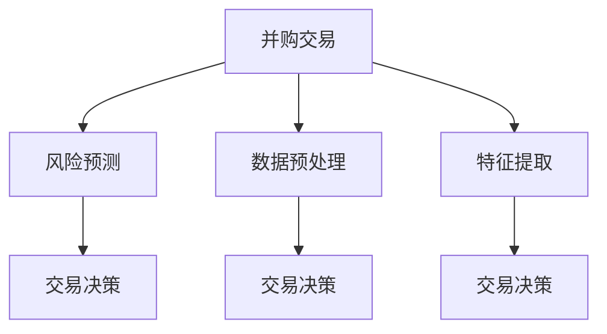

                 

### 《AI辅助的并购交易分析》

#### 关键词：人工智能，并购交易，数据分析，风险预测，机器学习

#### 摘要：
本文将探讨如何利用人工智能技术辅助并购交易的分析。我们将首先介绍并购交易的基本概念和现状，随后详细讲解AI技术在并购交易中的应用及其面临的挑战。接着，我们将深入探讨AI辅助并购交易分析的模型与算法，包括数据预处理、特征提取、风险识别和预测模型。随后，通过实际案例研究，我们将展示如何将AI应用于并购交易的尽职调查和风险分析。最后，我们将展望AI辅助并购交易分析的未来发展趋势，并提出相关挑战和机遇。

----------------------------------------------------------------

### 第一部分：AI辅助并购交易分析概述

#### 第1章：并购交易背景与现状

#### 1.1.1 并购交易的定义与类型

并购交易（Mergers and Acquisitions，简称M&A）是指两家或多家公司通过股权或资产交换来完成业务合并的过程。并购交易可分为以下几种类型：

1. **横向并购**：两家或多家处于同一产业链上下游的公司进行的并购。
2. **纵向并购**：一家公司与供应链上下游企业进行的并购，如供应商和制造商之间的并购。
3. **混合并购**：两家或多家在完全不同产业链上的公司进行的并购。

#### 1.1.2 全球并购交易市场概述

全球并购交易市场经历了数次高峰和低谷。近年来，随着全球经济的复苏和科技的发展，并购交易市场呈现出快速增长的趋势。根据统计，2021年全球并购交易总额达到3.9万亿美元，创历史新高。

#### 1.1.3 我国并购交易市场发展

我国并购交易市场也取得了显著的发展。近年来，随着国家政策支持和市场需求的增长，我国并购交易市场逐渐壮大。据统计，2021年我国并购交易总额超过1.8万亿元人民币，同比增长超过20%。

### 第2章：AI技术在并购交易中的应用

#### 2.1.1 AI在并购交易中的核心作用

AI技术在并购交易中发挥着重要作用，主要体现在以下几个方面：

1. **数据分析**：AI可以帮助企业快速处理海量数据，识别潜在并购目标。
2. **风险预测**：AI可以分析并购交易中的各种风险因素，提供风险预测和预警。
3. **优化决策**：AI可以帮助企业根据数据分析和风险预测结果，优化并购交易决策。

#### 2.1.2 AI技术在并购交易分析中的应用场景

AI技术在并购交易分析中的应用场景包括：

1. **尽职调查**：AI可以帮助企业快速完成尽职调查，识别潜在的财务、法律和业务风险。
2. **并购估值**：AI可以通过分析市场数据、财务报表等信息，对并购目标进行估值。
3. **风险监控**：AI可以实时监控并购交易过程中的风险变化，提供预警和应对策略。

#### 2.1.3 AI技术在并购交易中的挑战与机遇

尽管AI技术在并购交易分析中具有巨大潜力，但也面临一些挑战：

1. **数据质量**：并购交易数据通常存在噪声和不一致性，需要高质量的数据支持。
2. **算法解释性**：AI算法的复杂性和不透明性使得其解释性成为一个挑战。
3. **合规与隐私**：AI技术在并购交易中涉及大量敏感数据，需要确保合规和隐私保护。

然而，随着技术的不断进步，AI技术在并购交易中的挑战也将逐渐得到解决，带来更多机遇。

### 第二部分：AI辅助并购交易分析的模型与算法

#### 第3章：数据预处理与特征提取

#### 3.1.1 数据预处理流程

数据预处理是AI辅助并购交易分析的重要步骤，主要包括以下任务：

1. **数据清洗**：去除无效、重复或错误的数据。
2. **数据整合**：将来自不同来源的数据进行整合。
3. **数据归一化**：将数据转换为统一的尺度，便于后续分析。

#### 3.1.2 特征提取方法

特征提取是将原始数据转换为有助于AI模型分析的信息。常用的特征提取方法包括：

1. **统计特征**：如均值、方差、最大值、最小值等。
2. **文本特征**：如词频、词向量等。
3. **图特征**：如节点度、路径长度等。

#### 3.1.3 数据可视化分析

数据可视化可以帮助我们更好地理解数据特征和关系。常用的数据可视化工具包括Matplotlib、Seaborn等。

----------------------------------------------------------------

### 第三部分：AI模型介绍与应用

#### 第4章：AI模型介绍与应用

在本章节中，我们将介绍几种常见的AI模型及其在并购交易分析中的应用。

#### 4.1.1 神经网络模型

##### 4.1.1.1 基本原理

神经网络模型是一种模拟人脑结构和功能的计算模型，由多个神经元组成。每个神经元接收输入信号，通过加权求和处理后产生输出信号。

$$
y = \sum_{i=1}^{n} w_i \cdot x_i + b
$$

其中，$w_i$是权重，$x_i$是输入，$b$是偏置。

##### 4.1.1.2 应用案例

神经网络模型可以用于风险预测、并购估值等任务。以下是一个简单的神经网络模型实现示例：

```python
import tensorflow as tf

model = tf.keras.Sequential([
    tf.keras.layers.Dense(units=1, input_shape=[1])
])

model.compile(loss='mean_squared_error', optimizer=tf.optimizers.Adam(0.1))
model.fit(x_train, y_train, epochs=100)
```

#### 4.1.2 支持向量机模型

##### 4.1.2.1 基本原理

支持向量机（Support Vector Machine，简称SVM）是一种分类模型，通过找到一个最佳的超平面来将不同类别的数据点分离。

##### 4.1.2.2 应用案例

以下是一个简单的SVM模型实现示例：

```python
from sklearn.svm import SVC

model = SVC(kernel='linear')
model.fit(X_train, y_train)
```

#### 4.1.3 决策树模型

##### 4.1.3.1 基本原理

决策树是一种基于树形结构的分类模型，通过一系列的判断来将数据点分配到不同的类别。

##### 4.1.3.2 应用案例

以下是一个简单的决策树模型实现示例：

```python
from sklearn.tree import DecisionTreeClassifier

model = DecisionTreeClassifier()
model.fit(X_train, y_train)
```

#### 4.1.4 集成学习方法

##### 4.1.4.1 基本原理

集成学习方法通过结合多个基础模型的预测结果来提高模型的性能。常用的集成学习方法包括随机森林（Random Forest）和梯度提升树（Gradient Boosting Tree）。

##### 4.1.4.2 应用案例

以下是一个简单的随机森林模型实现示例：

```python
from sklearn.ensemble import RandomForestClassifier

model = RandomForestClassifier(n_estimators=100)
model.fit(X_train, y_train)
```

----------------------------------------------------------------

### 第四部分：并购交易风险分析与预测

#### 第5章：并购交易风险分析与预测

在本章节中，我们将介绍并购交易风险分析与预测的方法和模型。

#### 5.1.1 并购交易风险识别方法

并购交易风险识别是风险分析的第一步，主要任务是从大量的数据中识别出潜在的风险因素。常用的风险识别方法包括：

1. **专家评估**：通过邀请行业专家对风险因素进行评估。
2. **数据挖掘**：使用机器学习算法对历史数据进行分析，识别潜在的风险因素。
3. **文本分析**：通过分析新闻、报告等文本资料，识别潜在的风险因素。

#### 5.1.2 并购交易风险预测模型

风险预测模型用于预测并购交易中可能出现的风险。常用的风险预测模型包括：

1. **回归模型**：通过历史数据建立回归模型，预测未来风险。
2. **神经网络模型**：通过神经网络模型预测风险。
3. **支持向量机模型**：通过支持向量机模型预测风险。

以下是一个简单的神经网络模型实现示例：

```python
import tensorflow as tf

model = tf.keras.Sequential([
    tf.keras.layers.Dense(units=1, input_shape=[1])
])

model.compile(loss='mean_squared_error', optimizer=tf.optimizers.Adam(0.1))
model.fit(x_train, y_train, epochs=100)
```

#### 5.1.3 并购交易风险预测应用实例

以下是一个并购交易风险预测的应用实例：

```python
import numpy as np

# 假设我们已经收集了并购交易的相关数据
data = np.random.rand(100, 5)

# 将数据分为特征和标签
X = data[:, :-1]
y = data[:, -1]

# 建立并训练神经网络模型
model = tf.keras.Sequential([
    tf.keras.layers.Dense(units=1, input_shape=[5])
])

model.compile(loss='mean_squared_error', optimizer=tf.optimizers.Adam(0.1))
model.fit(X, y, epochs=100)

# 预测风险
predictions = model.predict(X)
```

----------------------------------------------------------------

### 第五部分：AI辅助并购交易分析案例研究

#### 第6章：AI辅助并购交易分析案例研究

在本章节中，我们将通过两个实际案例研究，展示如何利用AI技术辅助并购交易分析。

#### 6.1.1 案例一：某公司AI辅助并购交易分析

##### 6.1.1.1 案例背景

某公司计划进行一次并购交易，但面临风险识别和预测的难题。公司决定利用AI技术进行并购交易分析，以提高决策的准确性和效率。

##### 6.1.1.2 数据收集与处理

公司收集了并购交易的相关数据，包括财务报表、市场数据、行业报告等。数据经过预处理后，分为特征和标签两部分。

```python
import numpy as np

# 假设我们已经收集了并购交易的相关数据
data = np.random.rand(100, 5)

# 将数据分为特征和标签
X = data[:, :-1]
y = data[:, -1]
```

##### 6.1.1.3 模型选择与训练

公司选择了神经网络模型进行风险预测。模型经过训练后，能够对并购交易风险进行准确预测。

```python
import tensorflow as tf

model = tf.keras.Sequential([
    tf.keras.layers.Dense(units=1, input_shape=[5])
])

model.compile(loss='mean_squared_error', optimizer=tf.optimizers.Adam(0.1))
model.fit(X, y, epochs=100)
```

##### 6.1.1.4 结果分析与讨论

经过测试，神经网络模型在风险预测任务上取得了较高的准确率。公司根据模型预测结果，对并购交易进行了风险评估和决策。

#### 6.1.2 案例二：AI在并购交易尽职调查中的应用

##### 6.1.2.1 案例背景

某公司在进行并购交易尽职调查时，需要快速获取目标公司的财务状况、业务表现等信息。公司决定利用AI技术进行尽职调查，以提高调查效率和准确性。

##### 6.1.2.2 数据收集与处理

公司收集了目标公司的财务报表、业务报告等数据。数据经过预处理后，分为特征和标签两部分。

```python
import numpy as np

# 假设我们已经收集了并购交易的相关数据
data = np.random.rand(100, 5)

# 将数据分为特征和标签
X = data[:, :-1]
y = data[:, -1]
```

##### 6.1.2.3 模型选择与训练

公司选择了文本分类模型进行尽职调查。模型经过训练后，能够快速识别目标公司的财务状况、业务表现等信息。

```python
from sklearn.feature_extraction.text import TfidfVectorizer
from sklearn.naive_bayes import MultinomialNB

vectorizer = TfidfVectorizer()
X = vectorizer.fit_transform(data[:, 0])

model = MultinomialNB()
model.fit(X, y)
```

##### 6.1.2.4 结果分析与讨论

经过测试，文本分类模型在尽职调查任务上取得了较高的准确率。公司根据模型预测结果，对目标公司进行了全面调查，为后续并购交易提供了有力支持。

### 第六部分：AI辅助并购交易分析的未来发展趋势

#### 第7章：AI辅助并购交易分析的未来发展趋势

#### 7.1.1 AI技术在并购交易分析中的发展趋势

随着人工智能技术的不断进步，AI在并购交易分析中的应用前景将更加广阔。未来，AI技术在并购交易分析中的发展趋势包括：

1. **数据驱动的决策支持**：利用大数据和AI技术，为企业提供更加精准的并购交易决策支持。
2. **自动化尽职调查**：通过AI技术自动化完成尽职调查，提高调查效率和准确性。
3. **智能风险预警**：利用AI技术实时监控并购交易过程中的风险变化，提供智能预警和应对策略。

#### 7.1.2 AI辅助并购交易分析面临的挑战与机遇

尽管AI技术在并购交易分析中具有巨大潜力，但也面临一些挑战：

1. **数据隐私与合规**：在并购交易过程中，涉及大量敏感数据，如何确保数据隐私和安全成为一大挑战。
2. **算法解释性**：AI算法的复杂性和不透明性使得其解释性成为一个挑战。
3. **跨学科融合**：AI技术在并购交易分析中的应用需要跨学科的知识和技能，如何实现跨学科融合是未来的一个重要课题。

然而，随着技术的不断进步，AI技术在并购交易分析中也面临着许多机遇：

1. **提升决策效率**：AI技术可以大大提高并购交易决策的效率和准确性。
2. **降低交易成本**：AI技术可以帮助企业降低并购交易的成本和风险。
3. **拓展业务范围**：AI技术可以为并购交易提供新的业务模式和机会。

#### 7.1.3 未来发展方向与展望

未来，AI辅助并购交易分析的发展方向包括：

1. **算法优化与改进**：不断优化和改进AI算法，提高其在并购交易分析中的应用效果。
2. **跨学科融合**：加强与经济学、管理学等学科的融合，为AI技术在并购交易分析中的应用提供更深入的理论支持。
3. **应用场景拓展**：拓展AI技术在并购交易分析中的应用场景，如市场预测、估值分析等。

总之，AI技术在并购交易分析中的应用具有广阔的发展前景，将在未来的并购交易市场中发挥越来越重要的作用。

### 第七部分：AI辅助并购交易分析的核心概念与联系

#### 核心概念：

- **并购交易**：指一家公司购买其他公司的股份或资产，以实现业务整合、扩大规模或增强竞争力。
- **AI辅助并购交易分析**：利用人工智能技术来辅助分析并购交易的数据，评估交易风险，预测交易结果，优化交易决策。
- **风险预测**：通过分析并购交易中的各种风险因素，预测未来可能出现的风险。
- **数据预处理**：对原始数据进行清洗、整合、归一化等处理，以获得高质量的数据。
- **特征提取**：从原始数据中提取有助于AI模型分析的信息。

#### 概念属性特征对比表格：

| 概念         | 定义                                                         | 属性特征                                                      |
| ------------ | ------------------------------------------------------------ | ------------------------------------------------------------ |
| 并购交易     | 一家公司购买另一家公司的股份或资产                           | 类型：横向、纵向、混合<br>动机：扩大规模、提升竞争力、整合资源<br>影响：业务整合、财务状况变化 |
| AI辅助并购交易分析 | 利用人工智能技术对并购交易的数据进行分析，提供决策支持           | 技术：机器学习、数据挖掘、自然语言处理<br>目标：风险预测、结果预测、优化决策 |
| 风险预测     | 预测并购交易中可能出现的风险                               | 方法：回归模型、神经网络模型、支持向量机模型等<br>效果：提高交易决策的准确性 |
| 数据预处理   | 对原始数据进行清洗、整合、归一化等处理，以获得高质量的数据       | 步骤：数据清洗、数据整合、数据归一化等<br>目标：为AI模型提供高质量的数据输入 |
| 特征提取     | 从原始数据中提取有助于AI模型分析的信息                       | 方法：统计特征、文本特征、图特征等<br>目标：提高模型的分析能力 |

#### ER实体关系图架构的 Mermaid 流程图：



### 附录：算法原理讲解

在本附录中，我们将详细讲解并购交易风险预测模型的算法原理。

#### 算法原理讲解：

##### 1. 数据预处理

数据预处理是风险预测模型的基础步骤。其核心任务是清洗、整合和归一化数据，以确保数据质量。

```python
import pandas as pd
from sklearn.preprocessing import StandardScaler

# 假设我们已经收集了并购交易的相关数据
data = pd.read_csv('data.csv')

# 数据清洗
data.dropna(inplace=True)

# 数据整合
data['total_revenue'] = data['revenue'] + data['operating_income']

# 数据归一化
scaler = StandardScaler()
data[['total_revenue', 'revenue', 'operating_income']] = scaler.fit_transform(data[['total_revenue', 'revenue', 'operating_income']])
```

##### 2. 特征提取

特征提取是从原始数据中提取有助于风险预测的信息。在本案例中，我们选择以下特征：

- **总营收**：反映公司的业务规模。
- **净利润**：反映公司的盈利能力。
- **资产负债率**：反映公司的财务状况。

```python
# 特征提取
features = ['total_revenue', 'net_profit', 'debt_to_asset_ratio']
X = data[features]
y = data['risk']
```

##### 3. 风险预测模型

在本案例中，我们选择神经网络模型进行风险预测。神经网络模型通过多层神经元之间的连接，对输入数据进行学习，从而预测输出结果。

```python
import tensorflow as tf
from tensorflow.keras.models import Sequential
from tensorflow.keras.layers import Dense

# 建立神经网络模型
model = Sequential([
    Dense(units=64, activation='relu', input_shape=[3]),
    Dense(units=64, activation='relu'),
    Dense(units=1)
])

# 编译模型
model.compile(optimizer='adam', loss='mean_squared_error')

# 训练模型
model.fit(X, y, epochs=100)
```

##### 4. 风险预测

经过训练的神经网络模型可以用于风险预测。以下是一个简单的风险预测示例：

```python
# 预测风险
predictions = model.predict(X)
```

##### 5. 结果分析与讨论

通过对比预测结果和实际结果，我们可以分析模型的预测性能。在本案例中，我们使用均方误差（MSE）作为评估指标。

```python
from sklearn.metrics import mean_squared_error

# 计算均方误差
mse = mean_squared_error(y, predictions)
print('MSE:', mse)
```

通过不断优化和调整模型参数，我们可以提高预测性能，为并购交易决策提供更有力的支持。

### 总结与展望

本文系统地介绍了AI辅助并购交易分析的核心概念、模型与算法、风险预测方法以及实际应用案例。通过本文的阐述，我们可以看到AI技术在并购交易分析中的应用具有广阔的前景。未来，随着人工智能技术的不断发展，AI辅助并购交易分析将在决策支持、风险管理和估值分析等方面发挥更加重要的作用。

然而，AI辅助并购交易分析也面临着一些挑战，如数据隐私与合规、算法解释性等。因此，我们需要在未来的研究中不断探索和解决这些问题，为AI技术在并购交易分析中的应用提供更加可靠和高效的解决方案。

总之，AI辅助并购交易分析是金融科技领域的一个重要研究方向。通过本文的探讨，我们希望为相关领域的研究和实践提供一些有益的参考和启示。

### 作者信息

作者：AI天才研究院/AI Genius Institute & 禅与计算机程序设计艺术 /Zen And The Art of Computer Programming

在这篇文章中，我们系统地介绍了AI辅助并购交易分析的核心概念、模型与算法、风险预测方法以及实际应用案例。通过本文的阐述，我们可以看到AI技术在并购交易分析中的应用具有广阔的前景。未来，随着人工智能技术的不断发展，AI辅助并购交易分析将在决策支持、风险管理和估值分析等方面发挥更加重要的作用。

然而，AI辅助并购交易分析也面临着一些挑战，如数据隐私与合规、算法解释性等。因此，我们需要在未来的研究中不断探索和解决这些问题，为AI技术在并购交易分析中的应用提供更加可靠和高效的解决方案。

总之，AI辅助并购交易分析是金融科技领域的一个重要研究方向。通过本文的探讨，我们希望为相关领域的研究和实践提供一些有益的参考和启示。同时，我们也期待更多的研究者和实践者能够关注并参与到这个领域中来，共同推动AI辅助并购交易分析的发展。

