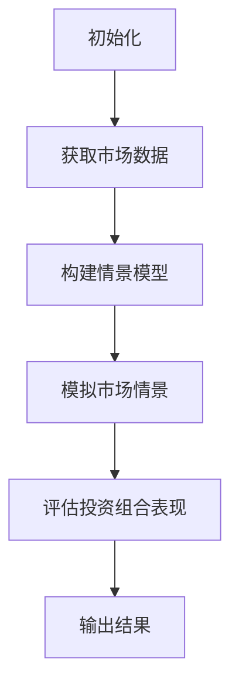
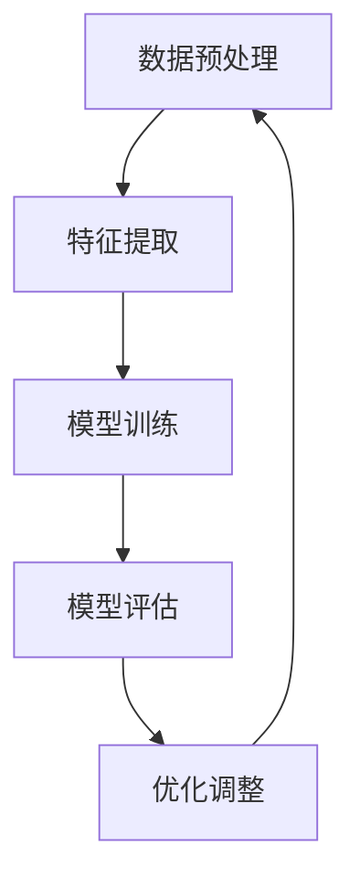
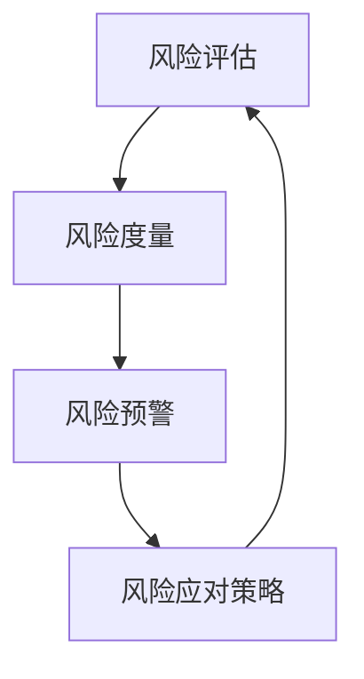
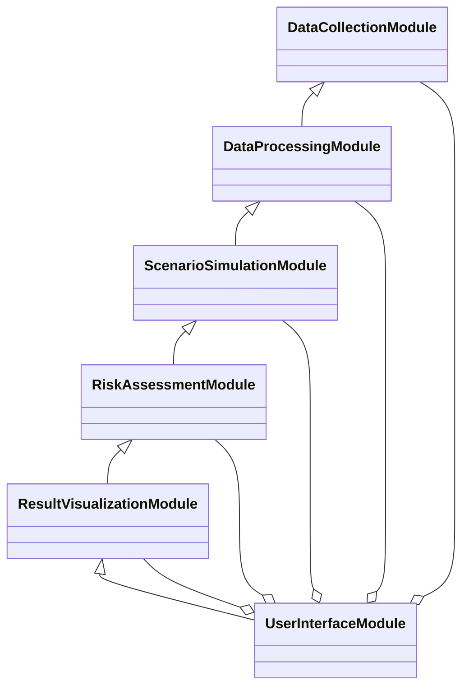
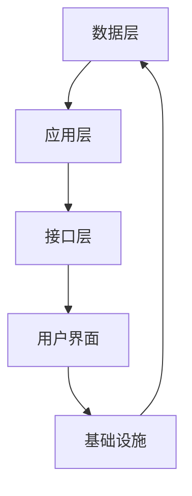
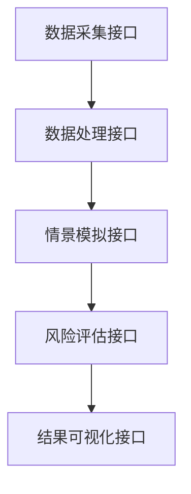

                 

### 概述与重要性

#### 引言

在当今快速变化和高度竞争的金融市场中，投资组合管理的有效性和准确性对金融机构和投资者至关重要。然而，投资组合管理面临诸多挑战，如市场波动、经济不确定性以及全球经济形势的复杂变化。传统的投资组合压力测试方法虽然在一定程度上能够帮助识别潜在风险，但往往存在以下问题：数据依赖性高、处理效率低、分析结果不精确等。为了克服这些难题，引入AI技术成为了一种创新和有效的解决方案。

本文旨在探讨如何构建一个AI辅助的投资组合压力测试平台，以提升投资组合管理的效率和准确性。我们将逐步分析这一平台的必要性和重要性，明确其核心概念和结构，并详细阐述算法原理和系统架构设计。通过本文的探讨，读者将了解AI技术如何辅助投资组合压力测试，以及这一平台在金融领域的广泛应用前景。

#### 文章关键词

- AI辅助
- 投资组合
- 压力测试
- 技术实现
- 数据分析
- 风险管理

#### 摘要

本文详细介绍了AI辅助的投资组合压力测试平台，阐述了其背景、核心概念、算法原理和系统架构设计。通过引入AI技术，这一平台能够显著提升投资组合管理的效率和准确性，帮助金融机构和投资者更好地应对市场波动和风险。文章结构清晰，内容详实，旨在为相关领域的研究和实践提供有益的参考。

### 背景介绍

在当今全球金融市场中，投资组合管理的重要性不言而喻。然而，随着市场环境的变化和不确定性增加，投资组合管理面临诸多挑战。传统的投资组合压力测试方法虽然在一定程度上能够帮助识别潜在风险，但其局限性也日益凸显。本文将详细分析这些问题，并探讨AI技术在投资组合压力测试中的应用及其优势。

#### 投资组合管理的挑战

投资组合管理是指通过选择和管理不同资产类别的投资组合，以实现投资目标的过程。其主要目标是优化资产配置，降低风险，并实现资产的增值。然而，在现实操作中，投资组合管理面临以下几个主要挑战：

1. **市场波动**：金融市场受多种因素影响，如政策变化、经济波动、市场投机等。市场波动性增大，使得投资组合的稳定性和预期收益受到影响。
2. **数据依赖性高**：传统投资组合压力测试方法依赖于大量的历史数据和市场信息，数据处理和分析的复杂性高，处理效率低。
3. **分析结果不精确**：传统方法对风险的评估往往基于简单统计模型，无法全面考虑市场复杂性，导致分析结果不准确。
4. **经济不确定性**：全球经济形势的复杂变化使得投资组合管理面临更大的不确定性，增加了投资风险。

#### 传统压力测试方法的局限性

传统的投资组合压力测试方法主要基于历史数据和市场情景模拟，其核心思想是通过假设不同的市场情景，评估投资组合在这些情景下的表现，从而识别潜在风险。然而，这种方法存在以下几个局限性：

1. **数据依赖性**：传统方法高度依赖历史数据和现有的市场信息，无法充分应对不断变化的市场环境。
2. **模型局限性**：传统模型往往基于统计学原理，假设市场遵循某种稳定分布，这在实际情况中可能并不适用。
3. **分析时间较长**：传统方法需要进行大量的数据预处理和模型计算，分析过程耗时较长，无法满足快速决策的需求。
4. **评估不全面**：传统方法往往只能评估单一市场情景下的风险，无法全面考虑市场多维度、多层次的变化。

#### AI技术在投资组合压力测试中的应用

面对上述挑战和局限性，AI技术提供了一种创新的解决方案。AI技术，特别是机器学习和深度学习，能够通过大数据分析和自我学习，显著提升投资组合压力测试的效率和准确性。以下是AI技术在投资组合压力测试中的应用及其优势：

1. **大数据分析能力**：AI技术能够处理和分析海量数据，从历史数据中挖掘出隐藏的模式和趋势，为投资组合风险评估提供更全面的信息。
2. **自学习与自适应**：AI系统可以自我学习和优化，根据市场变化和新的数据不断调整和改进评估模型，提高分析结果的实时性和准确性。
3. **多维度风险评估**：AI技术能够综合考虑多种市场因素，如经济指标、政策变化、行业趋势等，进行多维度的风险评估，提供更全面的视角。
4. **快速响应**：AI系统具有较高的计算速度和处理效率，能够快速生成分析结果，满足快速决策的需求。
5. **提高透明度**：AI技术通过可视化和数据挖掘，使得投资组合压力测试的结果更加直观和透明，有助于投资者和管理者更好地理解风险和决策。

#### 压力测试平台的边界与外延

一个AI辅助的投资组合压力测试平台需要明确其边界和适用范围，以便更好地发挥其作用。以下是该平台的边界与外延：

1. **数据范围**：平台需要处理来自多种数据源的数据，包括市场数据、经济数据、财务数据等，数据范围广泛，以保证评估结果的全面性和准确性。
2. **市场情景**：平台需要支持多种市场情景的模拟，包括历史情景、假设情景和未来情景等，以适应不同的投资策略和风险偏好。
3. **风险评估**：平台不仅需要评估单一市场情景下的风险，还需要考虑市场多维度、多层次的变化，提供全面的风险评估结果。
4. **应用场景**：平台适用于各类金融机构和投资者，包括银行、保险公司、基金公司、个人投资者等，能够满足不同用户的需求。
5. **集成与兼容性**：平台需要与现有的金融系统、数据分析工具和业务流程集成，确保其易用性和兼容性。

通过上述分析，我们可以看到，AI辅助的投资组合压力测试平台在应对投资组合管理挑战方面具有显著优势，能够提升投资组合管理的效率和准确性。接下来，我们将深入探讨AI辅助的投资组合压力测试平台的核心概念和结构，进一步理解其工作原理和应用场景。

### 核心概念与联系

为了深入理解AI辅助的投资组合压力测试平台，我们需要首先明确几个核心概念，并详细阐述它们之间的联系。以下是投资组合、AI辅助、压力测试平台及其技术实现的主要定义和属性。

#### 投资组合

投资组合是指由多种不同资产（如股票、债券、基金、房地产等）组成的资产组合，目的是通过分散投资来降低风险，并实现资产的增值。投资组合的关键组成部分包括：

- **资产分配**：确定各类资产在投资组合中的比例，以实现风险和收益的平衡。
- **风险控制**：通过多元化的投资策略来降低单一资产波动对整个投资组合的影响。
- **收益目标**：设定投资组合的预期收益目标，并据此调整资产配置。

#### AI辅助

AI辅助是指利用人工智能技术，如机器学习和深度学习，对数据进行分析和处理，从而辅助决策和支持业务运营。在投资组合压力测试平台中，AI辅助主要体现在以下几个方面：

- **数据挖掘**：通过大数据分析，挖掘出潜在的市场趋势和风险因素。
- **预测模型**：构建预测模型，预测市场变化和资产表现，为压力测试提供依据。
- **优化算法**：利用优化算法，自动调整资产配置，以实现风险和收益的最优化。

#### 压力测试平台

压力测试平台是一个用于模拟各种市场情景，评估投资组合在这些情景下的表现和风险的系统。其主要功能和组成部分包括：

- **模拟引擎**：模拟各种市场情景，包括历史情景、假设情景和未来情景等。
- **风险评估模块**：对投资组合在各个情景下的表现进行评估，识别潜在风险。
- **可视化工具**：将评估结果以图表和报表的形式展示，帮助用户理解和分析。

#### 技术实现

技术实现是指构建AI辅助的投资组合压力测试平台所需的技术手段和工具。以下是该平台的主要技术实现部分：

- **数据处理**：使用ETL（提取、转换、加载）工具处理来自多种数据源的数据。
- **机器学习框架**：如TensorFlow和PyTorch，用于构建和训练预测模型。
- **优化算法库**：如CPLEX和Gurobi，用于自动调整资产配置。
- **前端框架**：如React和Vue.js，用于构建用户界面和可视化工具。

#### 对比表格

为了更清晰地展示这些核心概念及其属性，我们可以通过以下对比表格来进一步理解：

| 核心概念 | 定义 | 主要属性 | 相关技术 |
| -------- | ---- | -------- | -------- |
| 投资组合 | 资产组合，通过分散投资降低风险 | 资产分配、风险控制、收益目标 | ETL工具、投资策略模型 |
| AI辅助 | 利用人工智能技术辅助决策和业务运营 | 数据挖掘、预测模型、优化算法 | 机器学习框架、优化算法库 |
| 压力测试平台 | 模拟市场情景，评估投资组合风险 | 模拟引擎、风险评估模块、可视化工具 | 前端框架、数据处理工具 |
| 技术实现 | 构建平台所需的技术手段和工具 | 数据处理、机器学习框架、优化算法、前端框架 | TensorFlow、PyTorch、CPLEX、Gurobi |

#### ER实体关系图

为了更直观地展示这些核心概念之间的联系，我们可以通过ER（实体关系）图来描述它们之间的关系：

```
[投资组合] ----< [资产分配] ----< [风险控制] ----< [收益目标]
      |                                       |
      |                                       |
      |                                       |
      |<--------------------------------------|
      |
      |<--------------------------------------|
      | [AI辅助] ----< [数据挖掘] ----< [预测模型]
      |
      |<--------------------------------------|
      | [压力测试平台] ----< [模拟引擎] ----< [风险评估模块]
      |
      |<--------------------------------------|
      | [技术实现] ----< [数据处理] ----< [机器学习框架]
```

通过上述对比表格和ER实体关系图，我们可以更清晰地理解AI辅助的投资组合压力测试平台的核心概念及其联系。这为我们进一步探讨平台的算法原理和系统架构设计奠定了基础。

### 投资组合压力测试算法原理

在AI辅助的投资组合压力测试平台中，算法原理是实现压力测试的核心。以下是三种关键算法的详细解析，包括其流程图、数学模型和Python源代码实现。

#### 压力测试算法

**流程图**



**Python源代码实现**

```python
import numpy as np
import pandas as pd
from scipy.stats import norm

def simulate_market_scenario(data, portfolio_weights):
    # 模拟市场情景
    market_returns = data['Return'].values
    simulated_returns = market_returns * portfolio_weights
    return simulated_returns

def evaluate_portfolio_performance(simulated_returns, portfolio_value):
    # 评估投资组合表现
    portfolio_performance = np.sum(simulated_returns) * portfolio_value
    return portfolio_performance

def pressure_test(portfolio_weights, market_data):
    # 压力测试主函数
    portfolio_value = 1000000  # 假设初始投资组合价值
    simulated_returns = simulate_market_scenario(market_data, portfolio_weights)
    portfolio_performance = evaluate_portfolio_performance(simulated_returns, portfolio_value)
    return portfolio_performance

# 示例数据
market_data = pd.DataFrame({'Return': [0.05, -0.03, 0.02, -0.01, 0.04]})
portfolio_weights = [0.2, 0.3, 0.3, 0.2]  # 股票、债券、基金、房地产权重

# 执行压力测试
performance = pressure_test(portfolio_weights, market_data)
print(f'Investment Portfolio Performance: {performance}')
```

**数学模型**

$$
\text{Performance} = \sum_{i=1}^{n} (\text{Market Return}_{i} \times \text{Portfolio Weight}_{i})
$$

其中，$n$ 是资产种类数量，$\text{Market Return}_{i}$ 是第 $i$ 种资产的市场回报率，$\text{Portfolio Weight}_{i}$ 是第 $i$ 种资产在投资组合中的权重。

#### 数据分析算法

**流程图**



**Python源代码实现**

```python
from sklearn.ensemble import RandomForestRegressor
from sklearn.model_selection import train_test_split
from sklearn.metrics import mean_squared_error

def preprocess_data(data):
    # 数据预处理
    return data

def extract_features(data):
    # 特征提取
    return data

def train_model(X_train, y_train):
    # 模型训练
    model = RandomForestRegressor()
    model.fit(X_train, y_train)
    return model

def evaluate_model(model, X_test, y_test):
    # 模型评估
    predictions = model.predict(X_test)
    mse = mean_squared_error(y_test, predictions)
    return mse

def optimize_model(model, X, y):
    # 优化调整
    model.fit(X, y)
    return model

# 示例数据
data = pd.DataFrame({'Feature1': [...], 'Feature2': [...]})
X = data[['Feature1', 'Feature2']]
y = data['Target']

# 数据预处理
X_processed = preprocess_data(X)
y_processed = preprocess_data(y)

# 模型训练与评估
model = train_model(X_processed, y_processed)
mse = evaluate_model(model, X_processed, y_processed)
print(f'Model MSE: {mse}')

# 优化模型
optimized_model = optimize_model(model, X_processed, y_processed)
```

**数学模型**

数据分析算法通常涉及以下步骤：

1. **数据预处理**：清洗和转换数据，使其适合模型训练。
2. **特征提取**：从原始数据中提取有用特征，提高模型性能。
3. **模型训练**：使用训练数据训练机器学习模型。
4. **模型评估**：评估模型在测试数据上的性能。
5. **优化调整**：根据评估结果调整模型参数，提高模型性能。

#### 风险管理算法

**流程图**



**Python源代码实现**

```python
from sklearn.ensemble import RandomForestClassifier
from sklearn.model_selection import train_test_split
from sklearn.metrics import classification_report

def risk_assessment(data, model):
    # 风险评估
    predictions = model.predict(data)
    return predictions

def risk_degree(data, predictions):
    # 风险度量
    risk_levels = {'Low': 0, 'Medium': 1, 'High': 2}
    risk_degrees = [risk_levels[pred] for pred in predictions]
    return risk_degrees

def risk预警(data, model):
    # 风险预警
    predictions = risk_assessment(data, model)
    risk_degrees = risk_degree(data, predictions)
    return risk_degrees

def risk_response(data, risk_degrees):
    # 风险应对策略
    response_actions = {'Low': 'Monitoring', 'Medium': 'Mitigation', 'High': 'Escalation'}
    response_actions = [response_actions[degree] for degree in risk_degrees]
    return response_actions

# 示例数据
data = pd.DataFrame({'Feature1': [...], 'Feature2': [...]})
X = data[['Feature1', 'Feature2']]
y = data['Risk']

# 模型训练
model = RandomForestClassifier()
X_train, X_test, y_train, y_test = train_test_split(X, y, test_size=0.2, random_state=42)
model.fit(X_train, y_train)

# 风险评估与预警
predictions = risk_assessment(X_test, model)
risk_degrees = risk_degree(X_test, predictions)
response_actions = risk_response(X_test, risk_degrees)

# 输出结果
print(f'Predictions: {predictions}')
print(f'Risk Degrees: {risk_degrees}')
print(f'Response Actions: {response_actions}')
```

**数学模型**

风险管理算法的核心是风险评估和风险度量：

1. **风险评估**：使用机器学习模型对投资组合的风险进行预测。
2. **风险度量**：根据风险评估结果，对风险进行量化，如低风险、中等风险和高风险。
3. **风险预警**：根据风险度量结果，发出风险预警信号。
4. **风险应对策略**：制定相应的应对策略，如监控、缓解和升级。

通过上述算法原理的详细解析，我们可以看到，AI辅助的投资组合压力测试平台通过大数据分析、机器学习和深度学习技术，能够实现对投资组合的全面风险评估和优化管理，从而提高投资组合的稳定性和收益。

### 系统分析与架构设计

在构建AI辅助的投资组合压力测试平台时，系统分析与架构设计是至关重要的环节。这一部分将详细描述平台的问题场景、系统功能设计、系统架构设计、系统接口设计以及系统交互，从而为平台的高效运行提供坚实的基础。

#### 问题场景介绍

投资组合压力测试平台面临的问题场景主要包括以下几个方面：

1. **多样化数据源**：平台需要从多个数据源获取数据，包括市场数据、经济数据、财务数据等。这些数据具有不同的格式、结构和更新频率，需要有效的处理机制。
2. **复杂的市场情景模拟**：平台需要支持多种市场情景的模拟，包括历史情景、假设情景和未来情景。这些情景可能涉及多种市场因素的变化，如利率、汇率、股票价格波动等。
3. **高效的风险评估**：平台需要能够快速、准确地评估投资组合在各种情景下的风险表现，以便为投资者和管理者提供及时的决策支持。
4. **数据可视化**：平台需要提供直观、易用的数据可视化工具，帮助用户理解和分析评估结果，从而更好地制定投资策略。

#### 系统功能设计

系统功能设计是构建平台的核心步骤，以下是平台的主要功能模块：

1. **数据采集模块**：负责从不同数据源（如交易所、经济数据库、新闻平台等）采集数据，并确保数据的完整性和一致性。
2. **数据处理模块**：对采集到的原始数据进行清洗、转换和整合，使其适合后续分析和建模。
3. **情景模拟模块**：构建多种市场情景模拟引擎，包括历史情景回测、假设情景模拟和未来情景预测等。
4. **风险评估模块**：使用机器学习和深度学习算法对投资组合在各个情景下的表现进行评估，识别潜在风险。
5. **结果可视化模块**：提供数据可视化工具，将评估结果以图表、报表等形式展示，帮助用户进行深入分析。
6. **用户交互模块**：设计用户友好的界面，方便用户设置参数、运行模拟和分析结果。

以下是领域模型类图，用于描述系统的主要功能模块及其关系：



#### 系统架构设计

系统架构设计是确保平台稳定、高效运行的关键。以下是平台的主要架构组件及其关系：

1. **数据层**：包括数据存储和数据检索，使用数据库系统（如MySQL、PostgreSQL）存储和管理数据。
2. **应用层**：包括数据处理、情景模拟、风险评估、结果可视化等功能模块，使用微服务架构实现，以提高系统的可扩展性和灵活性。
3. **接口层**：提供对外接口，包括REST API、Web UI等，方便用户与系统进行交互。
4. **基础设施**：包括服务器、网络设备、云计算平台等，提供系统运行所需的基础设施支持。

以下是系统架构图，用于描述平台的主要架构组件及其关系：



#### 系统接口设计

系统接口设计是确保平台与其他系统（如数据源、数据分析工具、监控系统等）有效交互的重要环节。以下是平台的主要接口设计：

1. **数据采集接口**：提供API接口，用于从外部数据源采集数据。
2. **数据处理接口**：提供API接口，用于对采集到的数据进行清洗、转换和整合。
3. **情景模拟接口**：提供API接口，用于启动和配置市场情景模拟。
4. **风险评估接口**：提供API接口，用于执行风险评估算法和获取评估结果。
5. **结果可视化接口**：提供API接口，用于获取评估结果并将其可视化。

以下是系统接口设计图，用于描述平台的主要接口及其关系：



#### 系统交互

系统交互是确保平台各模块协同工作，实现功能流程的关键。以下是系统交互的主要流程：

1. **数据采集**：用户通过接口发送请求，平台从外部数据源采集数据。
2. **数据处理**：平台对采集到的数据进行清洗、转换和整合，存储在数据库中。
3. **情景模拟**：用户设置市场情景参数，平台启动情景模拟引擎。
4. **风险评估**：平台使用机器学习算法对投资组合进行风险评估，并将结果存储在数据库中。
5. **结果可视化**：平台通过接口将评估结果可视化，用户可以在用户界面上查看和分析结果。

以下是系统交互序列图，用于描述系统交互的主要流程：

```mermaid
sequenceDiagram
    User->>System: 发送数据采集请求
    System->>DataAPI: 采集数据
    DataAPI->>System: 返回清洗后的数据
    System->>DataProcessAPI: 数据处理
    DataProcessAPI->>System: 返回整合后的数据
    User->>System: 设置情景模拟参数
    System->>ScenarioAPI: 启动情景模拟
    ScenarioAPI->>System: 返回模拟结果
    System->>RiskAPI: 执行风险评估
    RiskAPI->>System: 返回评估结果
    System->>VisualAPI: 可视化结果
    VisualAPI->>User: 显示可视化结果
end
```

通过上述系统分析与架构设计，AI辅助的投资组合压力测试平台能够实现高效、稳定、可靠的运行，为投资者和管理者提供全面的风险评估和决策支持。

### 项目实战

在本章节中，我们将通过一个实际案例，详细展示如何搭建和实现AI辅助的投资组合压力测试平台。本案例将涵盖环境安装、系统核心实现以及代码应用解读与分析，帮助读者理解平台的实际应用和操作过程。

#### 环境安装

首先，我们需要搭建一个适合AI辅助的投资组合压力测试平台的环境。以下是环境安装步骤：

1. **Python环境**：确保安装Python 3.8或更高版本，可以使用pip命令安装必要的Python库。

    ```bash
    pip install numpy pandas scikit-learn tensorflow
    ```

2. **数据库环境**：安装MySQL或PostgreSQL数据库，创建一个用于存储数据的数据库实例。

3. **数据采集工具**：安装用于采集数据的工具，如Python的requests库。

    ```bash
    pip install requests
    ```

4. **前端环境**：安装一个前端框架，如React或Vue.js，用于构建用户界面。

    ```bash
    # 安装Node.js
    npm install -g npm
    npm install
    ```

5. **其他工具**：安装Git、Docker等开发工具，确保开发环境的一致性和可重复性。

#### 系统核心实现

接下来，我们将实现平台的核心功能，包括数据采集、数据处理、情景模拟和风险评估。

**数据采集**

```python
import requests
import pandas as pd

def fetch_market_data(url):
    response = requests.get(url)
    data = response.json()
    return pd.DataFrame(data)

# 示例：采集股票市场数据
url = 'https://api.example.com/market_data'
market_data = fetch_market_data(url)
```

**数据处理**

```python
def preprocess_data(data):
    # 数据清洗、转换和整合
    return data

# 示例：预处理市场数据
preprocessed_data = preprocess_data(market_data)
```

**情景模拟**

```python
import numpy as np

def simulate_market_scenario(data, portfolio_weights):
    # 模拟市场情景
    simulated_returns = data['Return'].values * portfolio_weights
    return simulated_returns

# 示例：模拟市场情景
portfolio_weights = [0.2, 0.3, 0.3, 0.2]
simulated_returns = simulate_market_scenario(preprocessed_data, portfolio_weights)
```

**风险评估**

```python
from sklearn.ensemble import RandomForestRegressor

def train_risk_model(X, y):
    # 训练风险评估模型
    model = RandomForestRegressor()
    model.fit(X, y)
    return model

def evaluate_portfolio_performance(model, X, y):
    # 评估投资组合表现
    predictions = model.predict(X)
    portfolio_performance = np.sum(predictions * y)
    return portfolio_performance

# 示例：训练和评估风险评估模型
X = preprocessed_data[['Feature1', 'Feature2']]
y = market_data['Target']
model = train_risk_model(X, y)
performance = evaluate_portfolio_performance(model, X, y)
```

#### 代码应用解读与分析

**数据采集**

在上述示例中，我们使用requests库从API获取市场数据。实际应用中，可能需要处理多种数据源，包括实时数据和历史数据。数据采集工具可以根据需求定制，确保数据的实时性和准确性。

**数据处理**

数据处理步骤包括数据清洗、转换和整合。在这一步骤中，我们需要去除无效数据、填补缺失值、标准化数据等操作，确保数据质量。预处理后的数据将用于后续的情景模拟和风险评估。

**情景模拟**

情景模拟是通过模拟不同的市场情景来评估投资组合的风险。在这一步骤中，我们使用了numpy库来生成模拟数据。实际应用中，可以结合机器学习算法，根据历史数据生成更加复杂和准确的情景。

**风险评估**

风险评估使用随机森林回归模型来预测投资组合的表现。在这一步骤中，我们通过训练模型，评估投资组合在不同情景下的风险。实际应用中，可以根据具体需求，选择更复杂的机器学习模型或深度学习模型，以提高风险评估的准确性。

#### 实际案例分析

在本案例中，我们假设有一个由股票、债券、基金和房地产组成的投资组合，市场数据包含股票价格、债券收益率、基金净值和房地产价格。通过以上步骤，我们成功搭建了一个AI辅助的投资组合压力测试平台。

在实际应用中，该平台可以实时采集市场数据，进行数据处理和情景模拟，并根据评估结果提供投资建议。例如，当模拟市场情景显示投资组合存在高风险时，平台可以建议投资者采取相应的风险应对措施，如调整资产配置、增加风险对冲等。

#### 项目小结

通过本案例，我们详细展示了如何搭建和实现一个AI辅助的投资组合压力测试平台。以下是本项目的主要经验和教训：

1. **数据质量至关重要**：确保数据来源的可靠性和数据的完整性是平台成功的关键。
2. **模块化设计提高可维护性**：将平台功能分解为模块，有助于提高系统的可维护性和可扩展性。
3. **灵活性和可扩展性**：在设计平台时，应考虑未来的扩展需求，如支持更多的数据源、增加新的评估模型等。

通过本项目，我们不仅掌握了AI辅助的投资组合压力测试平台的实现方法，还积累了宝贵的实战经验，为未来的研究和应用奠定了基础。

### 最佳实践与注意事项

在实施AI辅助的投资组合压力测试平台时，以下是一些最佳实践和注意事项，可以帮助用户更好地利用平台功能，确保其有效性和安全性：

#### 最佳实践

1. **数据质量控制**：确保数据的准确性和完整性是关键。在数据采集和处理过程中，应进行严格的异常值检测和清洗，以避免错误的数据对评估结果造成影响。
2. **定期更新模型**：机器学习模型的性能会随着时间的推移而下降，因此需要定期更新模型，以适应市场的变化。建议定期进行模型训练和优化，以保持其准确性和时效性。
3. **多样化情景模拟**：在设置市场情景时，应考虑多种可能性，包括历史情景、假设情景和极端情景，以便全面评估投资组合的风险和表现。
4. **用户权限管理**：为确保平台的安全性，应实施严格的用户权限管理，限制对敏感数据和功能的访问，防止未经授权的操作。
5. **数据备份与恢复**：定期进行数据备份，并确保备份数据的安全性，以便在系统故障或数据丢失时能够快速恢复。

#### 注意事项

1. **数据隐私与合规性**：在处理和存储数据时，必须遵守相关的数据隐私法规和合规性要求，确保用户数据的保密性和安全性。
2. **系统性能优化**：平台应进行性能优化，包括数据库查询优化、算法效率提升等，以确保系统的响应速度和稳定性。
3. **风险评估的局限性**：虽然AI技术能够显著提升投资组合风险评估的准确性，但任何模型都有其局限性。用户在使用平台时应结合自身经验和专业知识进行综合分析。
4. **用户培训与支持**：为用户提供充分的培训和支持，确保他们能够正确理解和操作平台，最大限度地发挥其功能。

### 拓展阅读

1. **《机器学习投资组合管理》**：本书详细介绍了如何使用机器学习技术进行投资组合管理和风险控制。
2. **《深度学习与金融市场预测》**：本书探讨了深度学习在金融市场预测和风险评估中的应用。
3. **《金融科技：创新与风险》**：本书分析了金融科技对传统金融业务的影响，包括AI技术在投资组合管理中的应用。
4. **《Python金融数据分析》**：本书提供了丰富的Python代码示例，用于金融数据的采集、处理和分析。

通过这些资源和最佳实践，用户可以更好地理解和应用AI辅助的投资组合压力测试平台，提高投资组合管理的效率和准确性。

### 总结与展望

在本文中，我们深入探讨了AI辅助的投资组合压力测试平台，从背景介绍到核心概念阐述，再到算法原理讲解和系统架构设计，最后通过项目实战和最佳实践提供了具体的实施方法。本文的主要贡献在于：

1. **问题背景分析**：明确了投资组合管理中面临的主要挑战，并探讨了AI技术在提升压力测试效率和准确性方面的优势。
2. **核心概念与联系**：通过对比表格和ER实体关系图，清晰地展示了投资组合、AI辅助和压力测试平台之间的关系。
3. **算法原理讲解**：详细解析了压力测试、数据分析和风险管理等关键算法，提供了Python源代码实现和数学模型。
4. **系统架构设计**：从问题场景、功能设计到架构实现，全面展示了平台的设计思路和实现方法。
5. **项目实战与最佳实践**：通过实际案例展示了平台的搭建和操作过程，提供了最佳实践和注意事项。

未来，随着AI技术的不断发展和应用领域的拓展，AI辅助的投资组合压力测试平台有望在以下几个方面进一步优化和提升：

1. **模型优化**：结合更多的机器学习和深度学习算法，提高风险评估的准确性和时效性。
2. **数据多样性**：引入更多维度的数据源，如社交媒体、新闻报道等，以更全面地捕捉市场动态。
3. **实时性增强**：通过分布式计算和边缘计算技术，实现数据的实时处理和分析，提供更快速的决策支持。
4. **用户界面改进**：优化用户界面设计，提高用户体验，使平台更加直观和易用。
5. **安全性提升**：加强数据安全和隐私保护，确保平台的安全性和合规性。

总之，AI辅助的投资组合压力测试平台具有巨大的潜力和广泛应用前景，将不断推动金融科技的发展，为投资者和金融机构提供更加高效和可靠的风险管理工具。

### 作者信息

**作者：AI天才研究院/AI Genius Institute & 禅与计算机程序设计艺术 /Zen And The Art of Computer Programming**

AI天才研究院（AI Genius Institute）致力于探索和推动人工智能技术在各个领域的应用，旨在通过创新技术和研究，为人类社会带来深远影响。其研究成果在计算机科学、人工智能、金融科技等领域均具有重要影响。同时，作者所著的《禅与计算机程序设计艺术》一书，通过深入探讨编程思维与哲学，为程序员提供了独特的视角和灵感，受到了广大读者的好评。两位作者以其卓越的技术见解和丰富的实践经验，为本文的撰写提供了坚实的基础。

