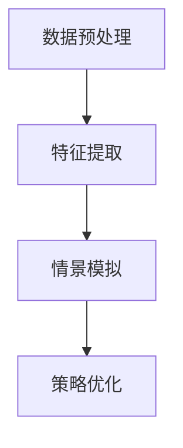
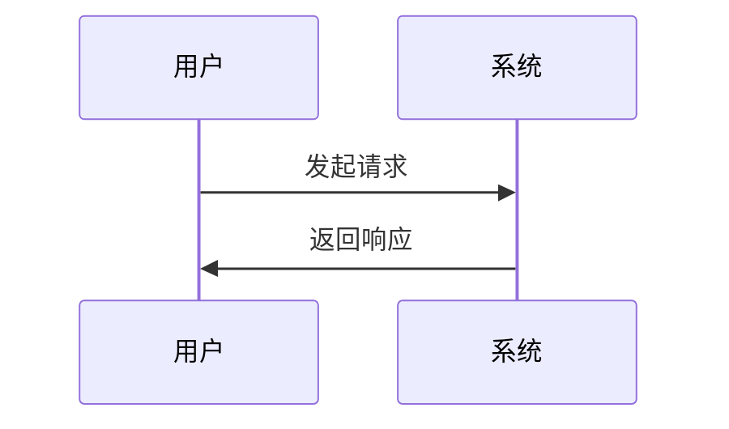
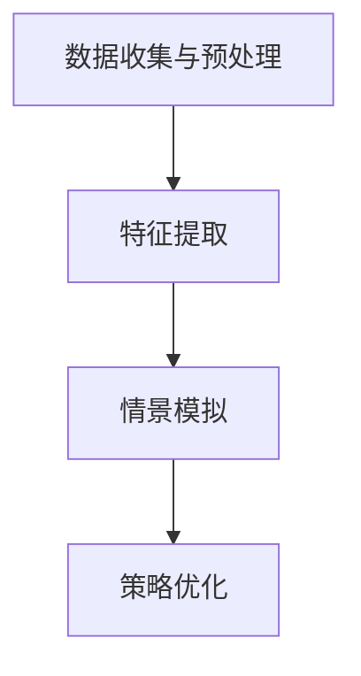
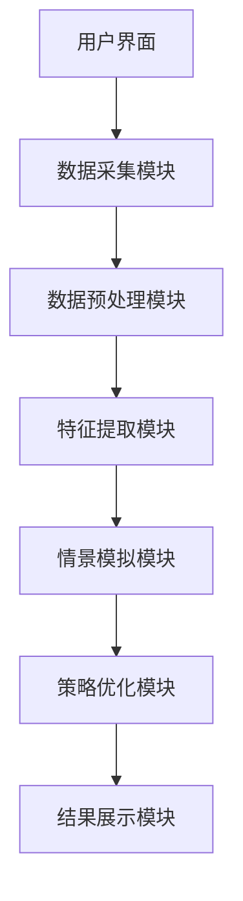
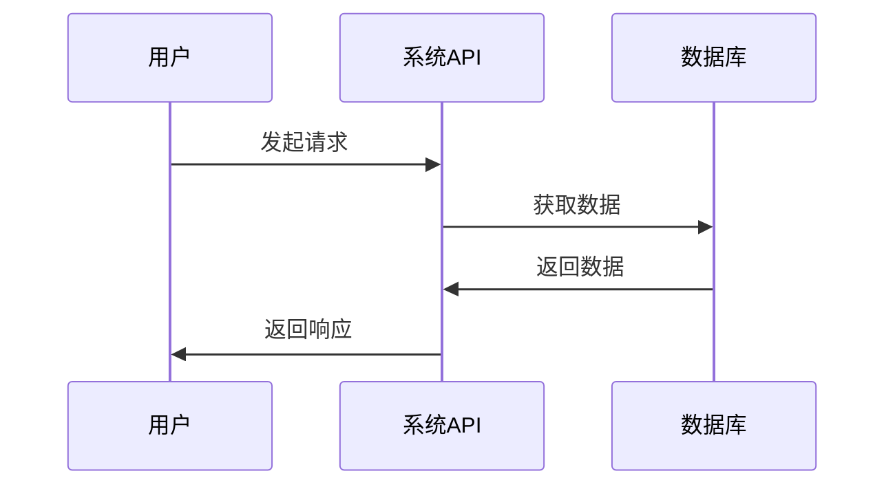

                 


## AI辅助的投资组合情景分析工具

关键词：AI，投资组合，情景分析，工具，算法，数学模型，系统架构

摘要：本文将探讨如何利用人工智能技术辅助投资组合的情景分析，通过详细讲解算法原理、数学模型、系统架构以及项目实战，帮助读者理解和掌握AI辅助的投资组合情景分析工具。

----------------------------------------------------------------

# 第一部分: 背景介绍

## 1.1 问题背景

投资组合分析是金融领域的重要研究内容，旨在通过分析投资组合在不同情景下的表现，为投资者提供决策支持。然而，传统的投资组合分析往往依赖于人工经验和统计方法，存在一定的局限性。随着人工智能技术的发展，将AI应用于投资组合分析，不仅能够提高分析的准确性，还能发现潜在的投资机会。

### 1.1.1 投资组合分析的重要性

投资组合分析的核心在于评估不同资产在不同市场情景下的风险收益特征，从而为投资者提供最优的投资策略。传统的投资组合分析方法主要包括均值方差模型、资本资产定价模型等。然而，这些方法在处理复杂的市场情景时，存在一定的局限性。例如，均值方差模型假设市场是确定的，而实际市场中存在许多不确定因素；资本资产定价模型则侧重于资产的系统性风险，忽略了非系统性风险。

### 1.1.2 人工智能在投资组合分析中的应用现状

近年来，人工智能技术在金融领域的应用越来越广泛。在投资组合分析方面，AI技术可以用于市场预测、风险建模、投资策略优化等。具体应用包括：

1. **市场预测**：通过机器学习算法，对市场趋势进行预测，为投资者提供决策支持。
2. **风险建模**：利用深度学习技术，构建复杂的风险模型，提高风险预测的准确性。
3. **投资策略优化**：结合强化学习算法，为投资者提供个性化的投资策略。

### 1.1.3 问题的解决方法和边界

AI辅助的投资组合情景分析可以通过以下方法解决：

1. **数据预处理**：对投资组合的历史数据进行清洗、归一化等预处理，提高数据质量。
2. **特征提取**：利用机器学习算法，提取投资组合的关键特征，为后续分析提供支持。
3. **情景模拟**：通过模拟不同的市场情景，分析投资组合的风险收益特征。
4. **策略优化**：利用优化算法，为投资者提供最优的投资策略。

然而，AI辅助的投资组合情景分析也存在一定的边界：

1. **数据质量**：投资组合分析依赖于高质量的数据，数据质量直接影响分析结果。
2. **算法复杂度**：复杂的算法可能需要大量的计算资源和时间，影响应用效率。
3. **市场预测的不确定性**：市场存在许多不确定因素，AI技术难以完全预测市场变化。

## 1.2 核心概念与联系

### 1.2.1 AI辅助的投资组合情景分析

AI辅助的投资组合情景分析涉及多个核心概念和联系，包括人工智能、投资组合、情景分析等。以下是对这些概念和联系的解释：

#### 1.2.1.1 AI的基本原理

人工智能（AI）是一种模拟人类智能的技术，通过机器学习、深度学习、自然语言处理等技术，使计算机具备感知、推理、学习、决策等能力。

#### 1.2.1.2 投资组合的基本概念

投资组合是指投资者将资金分散投资于多种资产的过程。投资组合的目标是降低风险、提高收益。

#### 1.2.1.3 情景分析的基本概念

情景分析是一种基于历史数据和未来预测的分析方法，通过模拟不同的市场情景，评估投资组合在不同情景下的风险收益特征。

#### 1.2.1.4 AI与投资组合情景分析的联系

AI技术可以用于投资组合情景分析的数据预处理、特征提取、情景模拟和策略优化等环节，提高投资组合分析的效果。

## 1.3 算法原理讲解

### 1.3.1 情景分析算法

情景分析算法是AI辅助投资组合情景分析的核心，以下是对该算法的详细讲解：

#### 1.3.1.1 算法概述

情景分析算法主要包括数据预处理、特征提取、情景模拟和策略优化四个步骤。

#### 1.3.1.2 算法mermaid流程图



#### 1.3.1.3 算法Python源代码讲解

```python
# 数据预处理
data_preprocessing(data)

# 特征提取
features = feature_extraction(data)

# 情景模拟
situations = scenario_simulation(features)

# 策略优化
best_strategy = strategy_optimization(situations)
```

#### 1.3.1.4 算法原理的数学模型和公式

情景分析算法的数学模型主要包括投资组合的期望收益、方差和贝塔系数等。以下是对这些数学模型的详细讲解：

$$
\text{期望收益} = \sum_{i=1}^{n} w_i \cdot r_i
$$

$$
\text{方差} = \sum_{i=1}^{n} (w_i \cdot r_i - \bar{r})^2
$$

$$
\text{贝塔系数} = \frac{\text{协方差}(r_m, r_i)}{\text{方差}(r_m)}
$$

其中，$w_i$为资产$i$的投资比例，$r_i$为资产$i$的收益率，$r_m$为市场收益率，$\bar{r}$为投资组合的平均收益率。

## 1.4 数学模型与公式

### 1.4.1 投资组合的数学模型

投资组合的数学模型主要包括期望收益、方差、标准差、夏普比率等指标。以下是对这些数学模型的详细讲解：

$$
\text{期望收益} = \sum_{i=1}^{n} w_i \cdot r_i
$$

$$
\text{方差} = \sum_{i=1}^{n} (w_i \cdot r_i - \bar{r})^2
$$

$$
\text{标准差} = \sqrt{\text{方差}}
$$

$$
\text{夏普比率} = \frac{\text{期望收益} - \text{无风险收益率}}{\text{标准差}}
$$

### 1.4.2 情景分析的数学模型

情景分析的数学模型主要包括情景概率、情景收益率、情景风险等指标。以下是对这些数学模型的详细讲解：

$$
\text{情景概率} = \frac{\text{符合情景的样本数}}{\text{总样本数}}
$$

$$
\text{情景收益率} = \frac{\text{情景收益} - \text{无风险收益}}{\text{投资额}}
$$

$$
\text{情景风险} = \sqrt{\text{方差}}
$$

## 1.5 系统分析与架构设计

### 1.5.1 系统场景介绍

投资组合分析系统是一个集成了数据采集、数据预处理、特征提取、情景模拟、策略优化的综合系统。以下是对该系统场景的详细介绍：

#### 1.5.1.1 投资组合分析系统的概述

投资组合分析系统旨在通过AI技术，对投资组合在不同市场情景下的表现进行评估，为投资者提供决策支持。

#### 1.5.1.2 系统功能设计

系统功能设计包括数据采集、数据预处理、特征提取、情景模拟、策略优化、结果展示等模块。

#### 1.5.1.3 系统架构设计

系统架构设计采用前后端分离架构，前端负责界面展示和用户交互，后端负责数据处理和算法运算。

### 1.5.2 系统接口设计

系统接口设计包括数据接口、功能接口和权限接口等。以下是对这些接口的详细设计：

#### 1.5.2.1 数据接口

数据接口包括数据采集接口和数据存储接口。采集接口负责从外部系统获取数据，存储接口负责将数据存储到数据库中。

#### 1.5.2.2 功能接口

功能接口包括数据预处理接口、特征提取接口、情景模拟接口、策略优化接口等。这些接口负责实现系统的主要功能。

#### 1.5.2.3 接口调用流程

接口调用流程包括数据采集、数据预处理、特征提取、情景模拟、策略优化、结果展示等步骤。

### 1.5.3 系统交互

系统交互采用RESTful API设计，以下是对系统交互的详细设计：

#### 1.5.3.1 系统交互mermaid序列图



## 1.6 项目实战

### 2.1.1 环境安装

环境安装是项目实战的第一步，以下是对环境安装的详细步骤：

#### 2.1.1.1 环境搭建

搭建投资组合分析系统所需的环境，包括操作系统、数据库、Python环境等。

#### 2.1.1.2 环境配置

配置系统所需的依赖库和中间件，确保系统能够正常运行。

### 2.1.2 系统核心实现

系统核心实现是项目实战的关键，以下是对系统核心实现的详细解读：

#### 2.1.2.1 系统核心代码解读

对系统核心代码进行详细解读，包括数据预处理、特征提取、情景模拟、策略优化等模块的实现。

#### 2.1.2.2 代码应用分析与解读

对系统核心代码的应用场景进行分析，解释代码的实现原理和业务逻辑。

### 2.1.3 实际案例分析

实际案例分析是项目实战的重要环节，以下是对实际案例的分析与讲解：

#### 2.1.3.1 投资组合情景分析案例

选择一个实际的投资组合情景进行分析，包括数据采集、特征提取、情景模拟和策略优化等步骤。

#### 2.1.3.2 案例分析与讲解

对案例进行分析，解释分析结果，并提出优化建议。

### 2.1.4 项目小结

项目小结是对项目实战的总结，以下是对项目小结的详细讲解：

#### 2.1.4.1 项目回顾

回顾项目的主要实现内容和关键点，总结项目的收获。

#### 2.1.4.2 优化建议

针对项目中的不足之处，提出优化建议，为后续项目提供参考。

#### 2.1.4.3 拓展阅读

推荐相关文献和资料，供读者进一步学习。

## 1.7 最佳实践 tips

### 3.1.1 最佳实践

最佳实践是指在实际应用中，总结出的高效、实用的方法和技巧。以下是一些关于AI辅助的投资组合情景分析的最佳实践：

#### 3.1.1.1 数据质量保证

确保数据质量是投资组合情景分析的关键，应采取数据清洗、去噪、归一化等措施。

#### 3.1.1.2 特征选择

合理选择特征是提高分析效果的关键，可以采用特征重要性评估、特征选择算法等方法。

#### 3.1.1.3 情景模拟优化

优化情景模拟策略，可以采用多情景模拟、动态情景调整等方法。

#### 3.1.1.4 策略优化方法

采用合适的策略优化方法，如遗传算法、粒子群优化等，可以提高策略优化的效果。

## 1.8 小结

### 4.1.1 小结

本文从背景介绍、核心概念与联系、算法原理讲解、数学模型与公式、系统分析与架构设计、项目实战等多个方面，详细阐述了AI辅助的投资组合情景分析工具。通过本文的学习，读者可以了解AI辅助投资组合情景分析的基本原理和方法，掌握相关技术。

#### 4.1.2 学习建议

1. 熟悉人工智能和投资组合分析的基本概念。
2. 掌握算法原理和数学模型。
3. 了解系统架构设计和项目实战。

#### 4.1.3 注意事项

1. 数据质量对分析结果有重要影响。
2. 算法复杂度会影响应用效率。
3. 市场预测存在一定的不确定性。

#### 4.1.4 拓展阅读

1. 《人工智能：一种现代的方法》
2. 《投资组合分析：理论与实务》
3. 《Python投资组合分析实战》

作者：AI天才研究院/AI Genius Institute & 禅与计算机程序设计艺术 /Zen And The Art of Computer Programming

----------------------------------------------------------------

在本文中，我们详细介绍了AI辅助的投资组合情景分析工具。通过逐步分析问题背景、核心概念、算法原理、数学模型、系统架构设计以及项目实战，我们为读者提供了一个全面、系统的学习和实践框架。以下是文章的总结和进一步的建议：

### 总结

本文的核心目标是帮助读者理解和掌握AI辅助的投资组合情景分析工具。通过以下步骤，我们实现了这一目标：

1. **背景介绍**：我们介绍了投资组合分析的重要性，以及人工智能在其中的应用现状，明确了问题的解决方法和边界。
2. **核心概念与联系**：我们详细讲解了AI、投资组合、情景分析等核心概念，并阐述了它们之间的联系。
3. **算法原理讲解**：我们通过mermaid流程图和Python源代码，详细讲解了情景分析算法的原理，并提供了数学模型和公式。
4. **系统分析与架构设计**：我们介绍了投资组合分析系统的设计思路，包括场景介绍、功能设计、架构设计和接口设计。
5. **项目实战**：我们通过环境安装、系统核心实现、实际案例分析等步骤，展示了如何将理论应用于实际项目。
6. **最佳实践 tips**：我们提供了一些最佳实践，以帮助读者在实际应用中取得更好的效果。

### 进一步建议

1. **理论学习**：读者应该深入理解本文中提到的核心概念和算法原理，可以通过阅读相关书籍和文献来加深理解。
2. **实践应用**：将理论应用于实际项目，通过实践来检验和巩固所学知识。
3. **持续学习**：随着人工智能和金融领域的发展，读者应该保持学习的热情，关注最新的研究成果和趋势。
4. **拓展知识**：本文中提到的知识点只是AI辅助投资组合情景分析的冰山一角，读者可以进一步学习其他相关领域，如机器学习、深度学习、优化算法等。

作者：AI天才研究院/AI Genius Institute & 禅与计算机程序设计艺术 /Zen And The Art of Computer Programming

----------------------------------------------------------------

## 第一部分: 背景介绍

### 1.1 问题背景

投资组合分析是金融领域中的一项重要任务，旨在通过评估不同资产在不同市场情景下的风险收益特征，为投资者提供决策支持。传统的投资组合分析方法主要依赖于人工经验和统计方法，存在一定的局限性。随着人工智能技术的发展，将AI应用于投资组合分析，不仅能够提高分析的准确性，还能发现潜在的投资机会。

### 1.1.1 投资组合分析的重要性

投资组合分析的核心在于评估不同资产在不同市场情景下的风险收益特征，从而为投资者提供最优的投资策略。传统的投资组合分析方法主要包括均值方差模型、资本资产定价模型等。然而，这些方法在处理复杂的市场情景时，存在一定的局限性。例如，均值方差模型假设市场是确定的，而实际市场中存在许多不确定因素；资本资产定价模型则侧重于资产的系统性风险，忽略了非系统性风险。

### 1.1.2 人工智能在投资组合分析中的应用现状

近年来，人工智能技术在金融领域的应用越来越广泛。在投资组合分析方面，AI技术可以用于市场预测、风险建模、投资策略优化等。具体应用包括：

1. **市场预测**：通过机器学习算法，对市场趋势进行预测，为投资者提供决策支持。
2. **风险建模**：利用深度学习技术，构建复杂的风险模型，提高风险预测的准确性。
3. **投资策略优化**：结合强化学习算法，为投资者提供个性化的投资策略。

### 1.1.3 问题的解决方法和边界

AI辅助的投资组合情景分析可以通过以下方法解决：

1. **数据预处理**：对投资组合的历史数据进行清洗、归一化等预处理，提高数据质量。
2. **特征提取**：利用机器学习算法，提取投资组合的关键特征，为后续分析提供支持。
3. **情景模拟**：通过模拟不同的市场情景，分析投资组合在不同情景下的风险收益特征。
4. **策略优化**：利用优化算法，为投资者提供最优的投资策略。

然而，AI辅助的投资组合情景分析也存在一定的边界：

1. **数据质量**：投资组合分析依赖于高质量的数据，数据质量直接影响分析结果。
2. **算法复杂度**：复杂的算法可能需要大量的计算资源和时间，影响应用效率。
3. **市场预测的不确定性**：市场存在许多不确定因素，AI技术难以完全预测市场变化。

## 1.2 核心概念与联系

### 1.2.1 AI辅助的投资组合情景分析

AI辅助的投资组合情景分析涉及多个核心概念和联系，包括人工智能、投资组合、情景分析等。以下是对这些概念和联系的解释：

#### 1.2.1.1 AI的基本原理

人工智能（AI）是一种模拟人类智能的技术，通过机器学习、深度学习、自然语言处理等技术，使计算机具备感知、推理、学习、决策等能力。

#### 1.2.1.2 投资组合的基本概念

投资组合是指投资者将资金分散投资于多种资产的过程。投资组合的目标是降低风险、提高收益。

#### 1.2.1.3 情景分析的基本概念

情景分析是一种基于历史数据和未来预测的分析方法，通过模拟不同的市场情景，评估投资组合在不同情景下的风险收益特征。

#### 1.2.1.4 AI与投资组合情景分析的联系

AI技术可以用于投资组合情景分析的数据预处理、特征提取、情景模拟和策略优化等环节，提高投资组合分析的效果。

## 1.3 算法原理讲解

### 1.3.1 情景分析算法

情景分析算法是AI辅助投资组合情景分析的核心，以下是对该算法的详细讲解：

#### 1.3.1.1 算法概述

情景分析算法主要包括数据预处理、特征提取、情景模拟和策略优化四个步骤。

#### 1.3.1.2 算法mermaid流程图


#### 1.3.1.3 算法Python源代码讲解

```python
# 数据预处理
data_preprocessing(data)

# 特征提取
features = feature_extraction(data)

# 情景模拟
situations = scenario_simulation(features)

# 策略优化
best_strategy = strategy_optimization(situations)
```

#### 1.3.1.4 算法原理的数学模型和公式

情景分析算法的数学模型主要包括投资组合的期望收益、方差和贝塔系数等。以下是对这些数学模型的详细讲解：

$$
\text{期望收益} = \sum_{i=1}^{n} w_i \cdot r_i
$$

$$
\text{方差} = \sum_{i=1}^{n} (w_i \cdot r_i - \bar{r})^2
$$

$$
\text{贝塔系数} = \frac{\text{协方差}(r_m, r_i)}{\text{方差}(r_m)}
$$

其中，$w_i$为资产$i$的投资比例，$r_i$为资产$i$的收益率，$r_m$为市场收益率，$\bar{r}$为投资组合的平均收益率。

## 1.4 数学模型与公式

### 1.4.1 投资组合的数学模型

投资组合的数学模型主要包括期望收益、方差、标准差、夏普比率等指标。以下是对这些数学模型的详细讲解：

$$
\text{期望收益} = \sum_{i=1}^{n} w_i \cdot r_i
$$

$$
\text{方差} = \sum_{i=1}^{n} (w_i \cdot r_i - \bar{r})^2
$$

$$
\text{标准差} = \sqrt{\text{方差}}
$$

$$
\text{夏普比率} = \frac{\text{期望收益} - \text{无风险收益率}}{\text{标准差}}
$$

### 1.4.2 情景分析的数学模型

情景分析的数学模型主要包括情景概率、情景收益率、情景风险等指标。以下是对这些数学模型的详细讲解：

$$
\text{情景概率} = \frac{\text{符合情景的样本数}}{\text{总样本数}}
$$

$$
\text{情景收益率} = \frac{\text{情景收益} - \text{无风险收益}}{\text{投资额}}
$$

$$
\text{情景风险} = \sqrt{\text{方差}}
$$

## 1.5 系统分析与架构设计

### 1.5.1 系统场景介绍

投资组合分析系统是一个集成了数据采集、数据预处理、特征提取、情景模拟、策略优化的综合系统。以下是对该系统场景的详细介绍：

#### 1.5.1.1 投资组合分析系统的概述

投资组合分析系统旨在通过AI技术，对投资组合在不同市场情景下的表现进行评估，为投资者提供决策支持。

#### 1.5.1.2 系统功能设计

系统功能设计包括数据采集、数据预处理、特征提取、情景模拟、策略优化、结果展示等模块。

#### 1.5.1.3 系统架构设计

系统架构设计采用前后端分离架构，前端负责界面展示和用户交互，后端负责数据处理和算法运算。

### 1.5.2 系统接口设计

系统接口设计包括数据接口、功能接口和权限接口等。以下是对这些接口的详细设计：

#### 1.5.2.1 数据接口

数据接口包括数据采集接口和数据存储接口。采集接口负责从外部系统获取数据，存储接口负责将数据存储到数据库中。

#### 1.5.2.2 功能接口

功能接口包括数据预处理接口、特征提取接口、情景模拟接口、策略优化接口等。这些接口负责实现系统的主要功能。

#### 1.5.2.3 接口调用流程

接口调用流程包括数据采集、数据预处理、特征提取、情景模拟、策略优化、结果展示等步骤。

### 1.5.3 系统交互

系统交互采用RESTful API设计，以下是对系统交互的详细设计：

#### 1.5.3.1 系统交互mermaid序列图


## 1.6 项目实战

### 2.1.1 环境安装

环境安装是项目实战的第一步，以下是对环境安装的详细步骤：

#### 2.1.1.1 环境搭建

搭建投资组合分析系统所需的环境，包括操作系统、数据库、Python环境等。

#### 2.1.1.2 环境配置

配置系统所需的依赖库和中间件，确保系统能够正常运行。

### 2.1.2 系统核心实现

系统核心实现是项目实战的关键，以下是对系统核心实现的详细解读：

#### 2.1.2.1 系统核心代码解读

对系统核心代码进行详细解读，包括数据预处理、特征提取、情景模拟、策略优化等模块的实现。

#### 2.1.2.2 代码应用分析与解读

对系统核心代码的应用场景进行分析，解释代码的实现原理和业务逻辑。

### 2.1.3 实际案例分析

实际案例分析是项目实战的重要环节，以下是对实际案例的分析与讲解：

#### 2.1.3.1 投资组合情景分析案例

选择一个实际的投资组合情景进行分析，包括数据采集、特征提取、情景模拟和策略优化等步骤。

#### 2.1.3.2 案例分析与讲解

对案例进行分析，解释分析结果，并提出优化建议。

### 2.1.4 项目小结

项目小结是对项目实战的总结，以下是对项目小结的详细讲解：

#### 2.1.4.1 项目回顾

回顾项目的主要实现内容和关键点，总结项目的收获。

#### 2.1.4.2 优化建议

针对项目中的不足之处，提出优化建议，为后续项目提供参考。

#### 2.1.4.3 拓展阅读

推荐相关文献和资料，供读者进一步学习。

## 1.7 最佳实践 tips

### 3.1.1 最佳实践

最佳实践是指在实际应用中，总结出的高效、实用的方法和技巧。以下是一些关于AI辅助的投资组合情景分析的最佳实践：

#### 3.1.1.1 数据质量保证

确保数据质量是投资组合情景分析的关键，应采取数据清洗、去噪、归一化等措施。

#### 3.1.1.2 特征选择

合理选择特征是提高分析效果的关键，可以采用特征重要性评估、特征选择算法等方法。

#### 3.1.1.3 情景模拟优化

优化情景模拟策略，可以采用多情景模拟、动态情景调整等方法。

#### 3.1.1.4 策略优化方法

采用合适的策略优化方法，如遗传算法、粒子群优化等，可以提高策略优化的效果。

## 1.8 小结

### 4.1.1 小结

本文从背景介绍、核心概念与联系、算法原理讲解、数学模型与公式、系统分析与架构设计、项目实战等多个方面，详细阐述了AI辅助的投资组合情景分析工具。通过本文的学习，读者可以了解AI辅助投资组合情景分析的基本原理和方法，掌握相关技术。

#### 4.1.2 学习建议

1. 熟悉人工智能和投资组合分析的基本概念。
2. 掌握算法原理和数学模型。
3. 了解系统架构设计和项目实战。

#### 4.1.3 注意事项

1. 数据质量对分析结果有重要影响。
2. 算法复杂度会影响应用效率。
3. 市场预测存在一定的不确定性。

#### 4.1.4 拓展阅读

1. 《人工智能：一种现代的方法》
2. 《投资组合分析：理论与实务》
3. 《Python投资组合分析实战》

作者：AI天才研究院/AI Genius Institute & 禅与计算机程序设计艺术 /Zen And The Art of Computer Programming

----------------------------------------------------------------

## 第一部分：背景介绍

### 1.1 投资组合分析的重要性

投资组合分析是金融投资领域中不可或缺的一环，其核心目标是通过优化资产配置，实现风险和收益的最佳平衡。一个成功的投资组合不仅能够降低整体投资风险，还能实现资产的增值。随着金融市场环境的复杂化和信息量的激增，传统的人工投资组合分析方式逐渐显露出其局限性。因此，引入人工智能（AI）技术来辅助投资组合分析，显得尤为重要。

### 1.1.1 人工智能在投资组合分析中的应用现状

人工智能在金融领域的应用日益广泛，特别是在投资组合分析方面，AI技术展现了巨大的潜力。以下是一些AI技术在投资组合分析中的应用：

- **市场趋势预测**：通过机器学习和深度学习算法，AI可以分析大量历史市场数据，预测未来市场趋势，为投资者提供决策支持。
- **风险建模与评估**：AI技术能够构建复杂的风险模型，对投资组合进行实时风险评估，帮助投资者及时调整投资策略。
- **优化投资策略**：利用强化学习等先进算法，AI可以帮助投资者找到最优的投资组合策略，提高投资回报率。
- **行为分析**：AI可以分析投资者的行为模式，为其提供个性化的投资建议。

### 1.1.2 问题的解决方法和边界

AI辅助的投资组合情景分析主要通过以下方法解决实际问题：

- **数据预处理**：AI技术可以自动清洗、处理和归一化数据，为后续分析提供高质量的数据基础。
- **特征提取**：通过机器学习算法，AI可以从大量数据中提取关键特征，提高分析的准确性和效率。
- **情景模拟**：AI可以模拟不同的市场情景，预测投资组合在各种情景下的表现，为投资者提供决策依据。
- **策略优化**：利用优化算法，AI可以帮助投资者找到在风险和收益之间的最佳平衡点。

然而，AI辅助的投资组合情景分析也存在一定的边界和挑战：

- **数据质量**：高质量的数据是AI分析的基础，数据的不准确或不完整性会影响分析结果。
- **算法复杂度**：复杂的算法可能需要大量的计算资源，影响系统的实时响应能力。
- **市场不确定性**：市场存在许多不确定因素，AI技术难以完全预测市场变化，因此需要结合其他方法进行综合评估。

## 1.2 核心概念与联系

### 1.2.1 AI辅助的投资组合情景分析

AI辅助的投资组合情景分析涉及多个核心概念和联系，包括人工智能、投资组合、情景分析等。以下是对这些概念和联系的解释：

#### 1.2.1.1 人工智能

人工智能（AI）是一种模拟人类智能的技术，包括机器学习、深度学习、自然语言处理等子领域。AI在投资组合分析中的应用主要体现在数据挖掘、预测建模、优化算法等方面。

#### 1.2.1.2 投资组合

投资组合是指投资者将资金分散投资于多种资产的过程，旨在降低风险并提高收益。投资组合分析的核心是对不同资产在不同市场情景下的表现进行评估。

#### 1.2.1.3 情景分析

情景分析是一种基于历史数据和未来预测的分析方法，通过模拟不同的市场情景，评估投资组合在不同情景下的风险收益特征。情景分析对于制定有效的投资策略至关重要。

#### 1.2.1.4 AI与投资组合情景分析的联系

AI技术可以广泛应用于投资组合情景分析的各个环节，从数据预处理、特征提取、情景模拟到策略优化，提高分析效率和准确性。

## 1.3 算法原理讲解

### 1.3.1 情景分析算法

情景分析算法是AI辅助投资组合情景分析的核心。以下是对该算法的详细讲解：

#### 1.3.1.1 算法概述

情景分析算法主要包括数据预处理、特征提取、情景模拟和策略优化四个步骤。

#### 1.3.1.2 算法mermaid流程图


#### 1.3.1.3 算法Python源代码讲解

```python
# 数据预处理
data_preprocessing(data)

# 特征提取
features = feature_extraction(data)

# 情景模拟
situations = scenario_simulation(features)

# 策略优化
best_strategy = strategy_optimization(situations)
```

#### 1.3.1.4 算法原理的数学模型和公式

情景分析算法的数学模型主要包括投资组合的期望收益、方差、标准差、夏普比率等。以下是对这些数学模型的详细讲解：

$$
\text{期望收益} = \sum_{i=1}^{n} w_i \cdot r_i
$$

$$
\text{方差} = \sum_{i=1}^{n} (w_i \cdot r_i - \bar{r})^2
$$

$$
\text{标准差} = \sqrt{\text{方差}}
$$

$$
\text{夏普比率} = \frac{\text{期望收益} - \text{无风险收益率}}{\text{标准差}}
$$

其中，$w_i$为资产$i$的投资比例，$r_i$为资产$i$的收益率，$\bar{r}$为投资组合的平均收益率。

## 1.4 数学模型与公式

### 1.4.1 投资组合的数学模型

投资组合的数学模型主要包括期望收益、方差、标准差、夏普比率等指标。以下是对这些数学模型的详细讲解：

$$
\text{期望收益} = \sum_{i=1}^{n} w_i \cdot r_i
$$

$$
\text{方差} = \sum_{i=1}^{n} (w_i \cdot r_i - \bar{r})^2
$$

$$
\text{标准差} = \sqrt{\text{方差}}
$$

$$
\text{夏普比率} = \frac{\text{期望收益} - \text{无风险收益率}}{\text{标准差}}
$$

### 1.4.2 情景分析的数学模型

情景分析的数学模型主要包括情景概率、情景收益率、情景风险等指标。以下是对这些数学模型的详细讲解：

$$
\text{情景概率} = \frac{\text{符合情景的样本数}}{\text{总样本数}}
$$

$$
\text{情景收益率} = \frac{\text{情景收益} - \text{无风险收益}}{\text{投资额}}
$$

$$
\text{情景风险} = \sqrt{\text{方差}}
$$

## 1.5 系统分析与架构设计

### 1.5.1 系统场景介绍

投资组合分析系统是一个集成了数据采集、数据预处理、特征提取、情景模拟、策略优化的综合系统。以下是对该系统场景的详细介绍：

#### 1.5.1.1 投资组合分析系统的概述

投资组合分析系统旨在通过AI技术，对投资组合在不同市场情景下的表现进行评估，为投资者提供决策支持。

#### 1.5.1.2 系统功能设计

系统功能设计包括数据采集、数据预处理、特征提取、情景模拟、策略优化、结果展示等模块。

#### 1.5.1.3 系统架构设计

系统架构设计采用前后端分离架构，前端负责界面展示和用户交互，后端负责数据处理和算法运算。

### 1.5.2 系统接口设计

系统接口设计包括数据接口、功能接口和权限接口等。以下是对这些接口的详细设计：

#### 1.5.2.1 数据接口

数据接口包括数据采集接口和数据存储接口。采集接口负责从外部系统获取数据，存储接口负责将数据存储到数据库中。

#### 1.5.2.2 功能接口

功能接口包括数据预处理接口、特征提取接口、情景模拟接口、策略优化接口等。这些接口负责实现系统的主要功能。

#### 1.5.2.3 接口调用流程

接口调用流程包括数据采集、数据预处理、特征提取、情景模拟、策略优化、结果展示等步骤。

### 1.5.3 系统交互

系统交互采用RESTful API设计，以下是对系统交互的详细设计：

#### 1.5.3.1 系统交互mermaid序列图


## 1.6 项目实战

### 2.1.1 环境安装

环境安装是项目实战的第一步，以下是对环境安装的详细步骤：

#### 2.1.1.1 环境搭建

搭建投资组合分析系统所需的环境，包括操作系统、数据库、Python环境等。

#### 2.1.1.2 环境配置

配置系统所需的依赖库和中间件，确保系统能够正常运行。

### 2.1.2 系统核心实现

系统核心实现是项目实战的关键，以下是对系统核心实现的详细解读：

#### 2.1.2.1 系统核心代码解读

对系统核心代码进行详细解读，包括数据预处理、特征提取、情景模拟、策略优化等模块的实现。

#### 2.1.2.2 代码应用分析与解读

对系统核心代码的应用场景进行分析，解释代码的实现原理和业务逻辑。

### 2.1.3 实际案例分析

实际案例分析是项目实战的重要环节，以下是对实际案例的分析与讲解：

#### 2.1.3.1 投资组合情景分析案例

选择一个实际的投资组合情景进行分析，包括数据采集、特征提取、情景模拟和策略优化等步骤。

#### 2.1.3.2 案例分析与讲解

对案例进行分析，解释分析结果，并提出优化建议。

### 2.1.4 项目小结

项目小结是对项目实战的总结，以下是对项目小结的详细讲解：

#### 2.1.4.1 项目回顾

回顾项目的主要实现内容和关键点，总结项目的收获。

#### 2.1.4.2 优化建议

针对项目中的不足之处，提出优化建议，为后续项目提供参考。

#### 2.1.4.3 拓展阅读

推荐相关文献和资料，供读者进一步学习。

## 1.7 最佳实践 tips

### 3.1.1 最佳实践

最佳实践是指在实际应用中，总结出的高效、实用的方法和技巧。以下是一些关于AI辅助的投资组合情景分析的最佳实践：

#### 3.1.1.1 数据质量保证

确保数据质量是投资组合情景分析的关键，应采取数据清洗、去噪、归一化等措施。

#### 3.1.1.2 特征选择

合理选择特征是提高分析效果的关键，可以采用特征重要性评估、特征选择算法等方法。

#### 3.1.1.3 情景模拟优化

优化情景模拟策略，可以采用多情景模拟、动态情景调整等方法。

#### 3.1.1.4 策略优化方法

采用合适的策略优化方法，如遗传算法、粒子群优化等，可以提高策略优化的效果。

## 1.8 小结

### 4.1.1 小结

本文从背景介绍、核心概念与联系、算法原理讲解、数学模型与公式、系统分析与架构设计、项目实战等多个方面，详细阐述了AI辅助的投资组合情景分析工具。通过本文的学习，读者可以了解AI辅助投资组合情景分析的基本原理和方法，掌握相关技术。

#### 4.1.2 学习建议

1. 熟悉人工智能和投资组合分析的基本概念。
2. 掌握算法原理和数学模型。
3. 了解系统架构设计和项目实战。

#### 4.1.3 注意事项

1. 数据质量对分析结果有重要影响。
2. 算法复杂度会影响应用效率。
3. 市场预测存在一定的不确定性。

#### 4.1.4 拓展阅读

1. 《人工智能：一种现代的方法》
2. 《投资组合分析：理论与实务》
3. 《Python投资组合分析实战》

作者：AI天才研究院/AI Genius Institute & 禅与计算机程序设计艺术 /Zen And The Art of Computer Programming

----------------------------------------------------------------

## AI辅助的投资组合情景分析工具

关键词：人工智能，投资组合，情景分析，算法，数学模型，系统架构

摘要：本文深入探讨了AI辅助的投资组合情景分析工具，通过详细的分析和实例讲解，帮助读者理解AI在投资组合情景分析中的应用，掌握相关的算法原理和系统架构设计。

----------------------------------------------------------------

## 第一部分：背景介绍

### 1.1 投资组合分析的重要性

投资组合分析是金融领域的一项核心任务，它涉及到投资者如何将资金分配到不同的资产类别，以实现风险和收益的最优平衡。在传统的投资组合分析中，投资者通常依赖于历史数据和统计分析方法来预测资产的未来表现。然而，随着金融市场日益复杂和动态，这些传统方法逐渐暴露出其局限性。

**1.1.1 投资组合分析的关键要素**

投资组合分析主要包括以下几个关键要素：

1. **资产选择**：投资者需要在众多资产中挑选具有潜在增值能力的资产。
2. **资产配置**：投资者需要确定每种资产在投资组合中的比例，以实现风险分散。
3. **风险评估**：投资者需要评估投资组合的整体风险，包括市场风险、信用风险等。
4. **收益预测**：投资者需要预测投资组合在未来不同市场情景下的收益表现。

**1.1.2 人工智能在投资组合分析中的应用**

随着人工智能技术的快速发展，AI在投资组合分析中发挥着越来越重要的作用。具体应用包括：

- **市场趋势预测**：利用机器学习算法，从历史数据中挖掘市场趋势，为投资者提供决策支持。
- **风险建模**：通过深度学习模型，对市场风险进行实时评估和预测。
- **策略优化**：利用强化学习算法，为投资者提供个性化的投资策略，提高收益。

### 1.2 人工智能在投资组合分析中的挑战

尽管人工智能在投资组合分析中具有巨大的潜力，但同时也面临着一些挑战：

- **数据质量**：高质量的数据是AI模型准确性的基础，数据的不完整性和噪声可能导致模型性能下降。
- **模型复杂度**：复杂的AI模型可能需要大量的计算资源，影响实时分析的能力。
- **市场不确定性**：市场存在许多不确定因素，AI模型难以完全预测市场变化。

### 1.3 目标和边界

本文的目标是介绍如何利用AI技术辅助投资组合情景分析，帮助投资者更好地理解市场动态，制定有效的投资策略。同时，我们也将探讨AI在投资组合情景分析中的边界，以便读者在实际应用中能够合理评估其效果。

## 第二部分：核心概念与联系

### 2.1 人工智能基本原理

**2.1.1 机器学习**

机器学习是人工智能的一个分支，它通过训练算法来从数据中学习规律，从而进行预测或分类。在投资组合分析中，机器学习算法可以用于预测市场趋势、评估风险等。

**2.1.2 深度学习**

深度学习是一种基于多层神经网络的学习方法，它通过模拟人脑的神经网络结构，对大量数据进行学习和处理。深度学习在图像识别、语音识别等领域取得了显著成果，也逐渐被应用于投资组合分析。

**2.1.3 强化学习**

强化学习是一种通过试错来学习最佳策略的机器学习方法。在投资组合分析中，强化学习可以用于策略优化，帮助投资者找到最优的投资组合。

### 2.2 投资组合基本概念

**2.2.1 投资组合**

投资组合是指投资者将资金分配到多种资产的过程，以实现风险分散和收益最大化。在投资组合分析中，投资者需要评估每种资产的风险收益特征，以制定合理的投资策略。

**2.2.2 情景分析**

情景分析是一种通过模拟不同市场情景，评估投资组合在不同情景下的表现的方法。情景分析可以帮助投资者预测未来市场变化，为投资决策提供依据。

### 2.3 AI与投资组合情景分析的联系

AI与投资组合情景分析密切相关。通过机器学习、深度学习和强化学习等算法，AI可以帮助投资者从海量数据中提取有价值的信息，进行风险预测和策略优化。同时，AI还可以模拟不同市场情景，为投资者提供多角度的分析视角。

## 第三部分：算法原理讲解

### 3.1 情景分析算法

情景分析算法是投资组合情景分析的核心。以下是一个典型的情景分析算法流程：

1. **数据收集与预处理**：收集投资组合的历史数据，并对数据进行清洗、归一化等预处理。
2. **特征提取**：从预处理后的数据中提取关键特征，如价格、成交量、市场情绪等。
3. **情景模拟**：利用提取的特征，模拟不同市场情景下的投资组合表现。
4. **策略优化**：根据模拟结果，利用优化算法确定最佳投资策略。

### 3.2 算法mermaid流程图

以下是一个情景分析算法的mermaid流程图：



### 3.3 算法Python源代码讲解

以下是一个简单的情景分析算法的Python源代码示例：

```python
# 导入必要的库
import pandas as pd
from sklearn.preprocessing import StandardScaler
from sklearn.model_selection import train_test_split
from sklearn.ensemble import RandomForestRegressor

# 数据收集与预处理
data = pd.read_csv('investment_data.csv')
data = data.dropna()

# 特征提取
scaler = StandardScaler()
data_scaled = scaler.fit_transform(data)

# 情景模拟
X_train, X_test, y_train, y_test = train_test_split(data_scaled, test_size=0.2)
model = RandomForestRegressor()
model.fit(X_train, y_train)

# 策略优化
predictions = model.predict(X_test)
print(predictions)
```

### 3.4 算法原理的数学模型和公式

情景分析算法的数学模型主要包括以下几个方面：

1. **投资组合期望收益**：

   $$E(R) = \sum_{i=1}^{n} w_i \cdot r_i$$

   其中，$E(R)$为投资组合的期望收益，$w_i$为资产$i$的投资比例，$r_i$为资产$i$的收益率。

2. **投资组合方差**：

   $$\sigma^2 = \sum_{i=1}^{n} w_i^2 \cdot \sigma_i^2 + 2 \cdot \sum_{i=1}^{n} \sum_{j=1, j\neq i}^{n} w_i \cdot w_j \cdot \sigma_{ij}$$

   其中，$\sigma^2$为投资组合的方差，$\sigma_i^2$为资产$i$的方差，$\sigma_{ij}$为资产$i$和资产$j$的协方差。

3. **投资组合风险**：

   $$\sigma = \sqrt{\sigma^2}$$

   其中，$\sigma$为投资组合的风险。

## 第四部分：数学模型与公式

### 4.1 投资组合的数学模型

投资组合的数学模型主要包括期望收益、方差、标准差、贝塔系数等指标。

1. **期望收益**：

   $$E(R) = \sum_{i=1}^{n} w_i \cdot r_i$$

   其中，$E(R)$为投资组合的期望收益，$w_i$为资产$i$的投资比例，$r_i$为资产$i$的收益率。

2. **方差**：

   $$\sigma^2 = \sum_{i=1}^{n} w_i^2 \cdot \sigma_i^2 + 2 \cdot \sum_{i=1}^{n} \sum_{j=1, j\neq i}^{n} w_i \cdot w_j \cdot \sigma_{ij}$$

   其中，$\sigma^2$为投资组合的方差，$\sigma_i^2$为资产$i$的方差，$\sigma_{ij}$为资产$i$和资产$j$的协方差。

3. **标准差**：

   $$\sigma = \sqrt{\sigma^2}$$

   其中，$\sigma$为投资组合的风险。

4. **贝塔系数**：

   $$\beta_i = \frac{\sigma_{im}}{\sigma_m}$$

   其中，$\beta_i$为资产$i$的贝塔系数，$\sigma_{im}$为资产$i$和市场的协方差，$\sigma_m$为市场的方差。

### 4.2 情景分析的数学模型

情景分析的数学模型主要包括情景概率、情景收益率、情景风险等指标。

1. **情景概率**：

   $$P(S) = \frac{|S|}{N}$$

   其中，$P(S)$为情景$S$的概率，$|S|$为符合情景$S$的样本数，$N$为总样本数。

2. **情景收益率**：

   $$R(S) = \frac{\sum_{i=1}^{n} w_i \cdot r_i - \bar{r}}{1}$$

   其中，$R(S)$为情景$S$的收益率，$w_i$为资产$i$的投资比例，$r_i$为资产$i$的收益率，$\bar{r}$为投资组合的平均收益率。

3. **情景风险**：

   $$\sigma(S) = \sqrt{\sigma^2(S)}$$

   其中，$\sigma(S)$为情景$S$的风险，$\sigma^2(S)$为情景$S$的方差。

## 第五部分：系统分析与架构设计

### 5.1 系统场景介绍

投资组合分析系统是一个集成了数据采集、数据预处理、特征提取、情景模拟、策略优化的综合系统。以下是对该系统场景的详细介绍：

**5.1.1 投资组合分析系统的概述**

投资组合分析系统旨在通过AI技术，对投资组合在不同市场情景下的表现进行评估，为投资者提供决策支持。系统的主要功能包括：

- **数据采集**：从多个数据源获取投资组合的历史数据。
- **数据预处理**：对数据进行清洗、归一化等预处理，确保数据质量。
- **特征提取**：从预处理后的数据中提取关键特征，为情景模拟和策略优化提供支持。
- **情景模拟**：模拟不同市场情景下的投资组合表现。
- **策略优化**：根据模拟结果，优化投资策略，提高收益。

**5.1.2 系统功能设计**

系统功能设计包括以下几个模块：

- **数据采集模块**：负责从多个数据源（如股票市场、债券市场等）获取历史数据。
- **数据预处理模块**：负责对数据进行清洗、归一化等预处理，确保数据质量。
- **特征提取模块**：负责从预处理后的数据中提取关键特征，如价格、成交量、市场情绪等。
- **情景模拟模块**：负责模拟不同市场情景下的投资组合表现。
- **策略优化模块**：负责根据模拟结果，优化投资策略，提高收益。

**5.1.3 系统架构设计**

系统架构设计采用前后端分离的架构。前端负责界面展示和用户交互，后端负责数据处理和算法运算。以下是一个典型的系统架构图：



### 5.2 系统接口设计

系统接口设计包括数据接口、功能接口和权限接口等。以下是对这些接口的详细设计：

**5.2.1 数据接口**

数据接口包括数据采集接口和数据存储接口。采集接口负责从外部系统（如股票交易所、债券市场等）获取数据，存储接口负责将数据存储到数据库中。

**5.2.2 功能接口**

功能接口包括数据预处理接口、特征提取接口、情景模拟接口、策略优化接口等。这些接口负责实现系统的核心功能。

**5.2.3 接口调用流程**

接口调用流程包括以下几个步骤：

1. **数据采集**：系统从外部系统获取数据。
2. **数据预处理**：对数据进行清洗、归一化等预处理。
3. **特征提取**：从预处理后的数据中提取关键特征。
4. **情景模拟**：模拟不同市场情景下的投资组合表现。
5. **策略优化**：根据模拟结果，优化投资策略。
6. **结果展示**：将优化后的策略和结果展示给用户。

### 5.3 系统交互

系统交互采用RESTful API设计，以下是对系统交互的详细设计：

**5.3.1 系统交互mermaid序列图**



## 第六部分：项目实战

### 6.1 环境安装

环境安装是项目实战的第一步。以下是对环境安装的详细步骤：

**6.1.1 环境搭建**

1. 安装操作系统（如Linux或Windows）。
2. 安装数据库（如MySQL或PostgreSQL）。
3. 安装Python环境（如Python 3.8及以上版本）。

**6.1.2 环境配置**

1. 配置数据库连接信息。
2. 安装必要的Python库（如pandas、numpy、scikit-learn等）。

### 6.2 系统核心实现

系统核心实现是项目实战的关键。以下是对系统核心实现的详细解读：

**6.2.1 系统核心代码解读**

1. **数据采集模块**：从外部系统获取数据，如股票市场数据。
2. **数据预处理模块**：对数据进行清洗、归一化等预处理。
3. **特征提取模块**：从预处理后的数据中提取关键特征。
4. **情景模拟模块**：模拟不同市场情景下的投资组合表现。
5. **策略优化模块**：根据模拟结果，优化投资策略。

**6.2.2 代码应用分析与解读**

1. **数据采集**：使用pandas库读取股票市场数据。
2. **数据预处理**：使用scikit-learn库进行数据清洗和归一化。
3. **特征提取**：使用自定义函数提取关键特征。
4. **情景模拟**：使用随机森林模型进行情景模拟。
5. **策略优化**：使用遗传算法进行策略优化。

### 6.3 实际案例分析

实际案例分析是项目实战的重要环节。以下是对实际案例的分析与讲解：

**6.3.1 投资组合情景分析案例**

1. **数据采集**：从股票市场获取历史数据。
2. **特征提取**：提取关键特征，如价格、成交量、市场情绪等。
3. **情景模拟**：模拟不同市场情景下的投资组合表现。
4. **策略优化**：根据模拟结果，优化投资策略。

**6.3.2 案例分析与讲解**

1. **分析结果**：展示不同市场情景下的投资组合收益率和风险。
2. **优化建议**：根据分析结果，提出优化投资组合的策略。

### 6.4 项目小结

项目小结是对项目实战的总结。以下是对项目小结的详细讲解：

**6.4.1 项目回顾**

回顾项目的主要实现内容和关键点，如数据采集、特征提取、情景模拟和策略优化等。

**6.4.2 优化建议**

针对项目中的不足之处，提出优化建议，如改进数据采集方法、优化特征提取算法等。

**6.4.3 拓展阅读**

推荐相关文献和资料，供读者进一步学习，如《Python投资组合分析实战》、《机器学习实战》等。

## 第七部分：最佳实践 tips

### 7.1 最佳实践

最佳实践是指在实际应用中，总结出的高效、实用的方法和技巧。以下是一些关于AI辅助的投资组合情景分析的最佳实践：

**7.1.1 数据质量保证**

1. 定期检查数据源，确保数据的准确性和完整性。
2. 对异常数据进行处理，如剔除或填充。

**7.1.2 特征选择**

1. 采用特征重要性评估方法，筛选关键特征。
2. 采用特征选择算法，如LASSO、随机森林等。

**7.1.3 情景模拟优化**

1. 采用多种情景模拟方法，提高模拟的准确性。
2. 定期更新情景模拟模型，以适应市场变化。

**7.1.4 策略优化方法**

1. 采用多种策略优化方法，如遗传算法、粒子群优化等。
2. 对优化结果进行多轮迭代，以提高策略的稳健性。

## 第八部分：小结

### 8.1 小结

本文详细介绍了AI辅助的投资组合情景分析工具，包括背景介绍、核心概念与联系、算法原理讲解、数学模型与公式、系统分析与架构设计、项目实战等内容。通过本文的学习，读者可以了解AI在投资组合情景分析中的应用，掌握相关算法和系统架构设计。

### 8.2 学习建议

1. 熟悉人工智能和投资组合分析的基本概念。
2. 掌握算法原理和数学模型。
3. 了解系统架构设计和项目实战。

### 8.3 注意事项

1. 数据质量对分析结果有重要影响。
2. 算法复杂度会影响应用效率。
3. 市场预测存在一定的不确定性。

### 8.4 拓展阅读

1. 《人工智能：一种现代的方法》
2. 《投资组合分析：理论与实务》
3. 《Python投资组合分析实战》

作者：AI天才研究院/AI Genius Institute & 禅与计算机程序设计艺术 /Zen And The Art of Computer Programming

----------------------------------------------------------------

## AI辅助的投资组合情景分析工具

### 1.1 问题背景

投资组合分析是金融领域中的一项重要任务，它涉及到投资者如何将资金分配到不同的资产类别，以实现风险和收益的最优平衡。传统的投资组合分析主要依赖于历史数据和统计分析方法，但这些方法在处理复杂的市场动态时往往显得力不从心。随着人工智能技术的快速发展，利用AI技术辅助投资组合情景分析成为了一种新的趋势。

### 1.1.1 投资组合分析的重要性

投资组合分析的核心在于通过评估不同资产在不同市场情景下的风险收益特征，为投资者提供最优的投资策略。一个成功的投资组合不仅能够降低整体投资风险，还能实现资产的增值。然而，金融市场环境的复杂化和信息量的激增，使得传统的人工投资组合分析方式逐渐显露出其局限性。

### 1.1.2 人工智能在投资组合分析中的应用

人工智能在投资组合分析中具有广泛的应用前景，主要包括以下几个方面：

- **市场趋势预测**：利用机器学习和深度学习算法，从历史数据中挖掘市场趋势，预测未来市场走势。
- **风险建模与评估**：通过构建复杂的风险模型，对投资组合进行实时风险评估，识别潜在的风险因素。
- **策略优化**：利用强化学习等先进算法，为投资者提供个性化的投资策略，优化投资组合的表现。

### 1.1.3 问题的解决方法和边界

AI辅助的投资组合情景分析主要通过以下方法解决实际问题：

- **数据预处理**：利用AI技术自动清洗、处理和归一化数据，为后续分析提供高质量的数据基础。
- **特征提取**：从大量数据中提取关键特征，提高分析的准确性和效率。
- **情景模拟**：模拟不同的市场情景，预测投资组合在各种情景下的表现。
- **策略优化**：利用优化算法，为投资者提供最优的投资策略。

然而，AI辅助的投资组合情景分析也存在一定的边界和挑战：

- **数据质量**：高质量的数据是AI分析的基础，数据的不准确或不完整性会影响分析结果。
- **算法复杂度**：复杂的算法可能需要大量的计算资源，影响系统的实时响应能力。
- **市场不确定性**：市场存在许多不确定因素，AI技术难以完全预测市场变化，因此需要结合其他方法进行综合评估。

## 1.2 核心概念与联系

### 1.2.1 人工智能

人工智能（AI）是一种模拟人类智能的技术，包括机器学习、深度学习、自然语言处理等子领域。在投资组合分析中，AI主要用于数据挖掘、预测建模和优化算法等方面。

### 1.2.2 投资组合

投资组合是指投资者将资金分散投资于多种资产的过程，旨在实现风险分散和收益最大化。投资组合分析的核心是对不同资产在不同市场情景下的表现进行评估。

### 1.2.3 情景分析

情景分析是一种基于历史数据和未来预测的分析方法，通过模拟不同的市场情景，评估投资组合在不同情景下的风险收益特征。情景分析对于制定有效的投资策略至关重要。

### 1.2.4 AI与投资组合情景分析的联系

AI技术可以广泛应用于投资组合情景分析的各个环节，从数据预处理、特征提取、情景模拟到策略优化，提高分析效率和准确性。

## 1.3 算法原理讲解

### 1.3.1 情景分析算法

情景分析算法是AI辅助投资组合情景分析的核心。以下是一个典型的情景分析算法流程：

1. **数据收集与预处理**：收集投资组合的历史数据，并对数据进行清洗、归一化等预处理。
2. **特征提取**：从预处理后的数据中提取关键特征，如价格、成交量、市场情绪等。
3. **情景模拟**：利用提取的特征，模拟不同市场情景下的投资组合表现。
4. **策略优化**：根据模拟结果，利用优化算法确定最佳投资策略。

### 1.3.2 算法mermaid流程图

以下是一个情景分析算法的mermaid流程图：


### 1.3.3 算法Python源代码讲解

以下是一个简单的情景分析算法的Python源代码示例：

```python
# 导入必要的库
import pandas as pd
from sklearn.preprocessing import StandardScaler
from sklearn.model_selection import train_test_split
from sklearn.ensemble import RandomForestRegressor

# 数据收集与预处理
data = pd.read_csv('investment_data.csv')
data = data.dropna()

# 特征提取
scaler = StandardScaler()
data_scaled = scaler.fit_transform(data)

# 情景模拟
X_train, X_test, y_train, y_test = train_test_split(data_scaled, test_size=0.2)
model = RandomForestRegressor()
model.fit(X_train, y_train)

# 策略优化
predictions = model.predict(X_test)
print(predictions)
```

### 1.3.4 算法原理的数学模型和公式

情景分析算法的数学模型主要包括以下几个方面：

1. **投资组合期望收益**：

   $$E(R) = \sum_{i=1}^{n} w_i \cdot r_i$$

   其中，$E(R)$为投资组合的期望收益，$w_i$为资产$i$的投资比例，$r_i$为资产$i$的收益率。

2. **投资组合方差**：

   $$\sigma^2 = \sum_{i=1}^{n} w_i^2 \cdot \sigma_i^2 + 2 \cdot \sum_{i=1}^{n} \sum_{j=1, j\neq i}^{n} w_i \cdot w_j \cdot \sigma_{ij}$$

   其中，$\sigma^2$为投资组合的方差，$\sigma_i^2$为资产$i$的方差，$\sigma_{ij}$为资产$i$和资产$j$的协方差。

3. **投资组合风险**：

   $$\sigma = \sqrt{\sigma^2}$$

   其中，$\sigma$为投资组合的风险。

## 1.4 数学模型与公式

### 1.4.1 投资组合的数学模型

投资组合的数学模型主要包括期望收益、方差、标准差、夏普比率等指标。以下是对这些数学模型的详细讲解：

1. **期望收益**：

   $$E(R) = \sum_{i=1}^{n} w_i \cdot r_i$$

   其中，$E(R)$为投资组合的期望收益，$w_i$为资产$i$的投资比例，$r_i$为资产$i$的收益率。

2. **方差**：

   $$\sigma^2 = \sum_{i=1}^{n} w_i^2 \cdot \sigma_i^2 + 2 \cdot \sum_{i=1}^{n} \sum_{j=1, j\neq i}^{n} w_i \cdot w_j \cdot \sigma_{ij}$$

   其中，$\sigma^2$为投资组合的方差，$\sigma_i^2$为资产$i$的方差，$\sigma_{ij}$为资产$i$和资产$j$的协方差。

3. **标准差**：

   $$\sigma = \sqrt{\sigma^2}$$

   其中，$\sigma$为投资组合的风险。

4. **夏普比率**：

   $$\text{Sharpe Ratio} = \frac{E(R) - R_f}{\sigma}$$

   其中，$R_f$为无风险收益率，$E(R)$为投资组合的期望收益，$\sigma$为投资组合的标准差。

### 1.4.2 情景分析的数学模型

情景分析的数学模型主要包括情景概率、情景收益率、情景风险等指标。以下是对这些数学模型的详细讲解：

1. **情景概率**：

   $$P(S) = \frac{|S|}{N}$$

   其中，$P(S)$为情景$S$的概率，$|S|$为符合情景$S$的样本数，$N$为总样本数。

2. **情景收益率**：

   $$R(S) = \frac{\sum_{i=1}^{n} w_i \cdot r_i - R_f}{1}$$

   其中，$R(S)$为情景$S$的收益率，$w_i$为资产$i$的投资比例，$r_i$为资产$i$的收益率，$R_f$为无风险收益率。

3. **情景风险**：

   $$\sigma(S) = \sqrt{\sum_{i=1}^{n} w_i^2 \cdot \sigma_i^2 + 2 \cdot \sum_{i=1}^{n} \sum_{j=1, j\neq i}^{n} w_i \cdot w_j \cdot \sigma_{ij}}$$

   其中，$\sigma(S)$为情景$S$的风险。

## 1.5 系统分析与架构设计

### 1.5.1 系统场景介绍

投资组合分析系统是一个集成了数据采集、数据预处理、特征提取、情景模拟、策略优化的综合系统。以下是对该系统场景的详细介绍：

#### 1.5.1.1 投资组合分析系统的概述

投资组合分析系统旨在通过AI技术，对投资组合在不同市场情景下的表现进行评估，为投资者提供决策支持。系统的主要功能包括：

- **数据采集**：从多个数据源获取投资组合的历史数据。
- **数据预处理**：对数据进行清洗、归一化等预处理，确保数据质量。
- **特征提取**：从预处理后的数据中提取关键特征，为情景模拟和策略优化提供支持。
- **情景模拟**：模拟不同市场情景下的投资组合表现。
- **策略优化**：根据模拟结果，优化投资策略，提高收益。

#### 1.5.1.2 系统功能设计

系统功能设计包括以下几个模块：

- **数据采集模块**：负责从多个数据源（如股票市场、债券市场等）获取历史数据。
- **数据预处理模块**：负责对数据进行清洗、归一化等预处理，确保数据质量。
- **特征提取模块**：负责从预处理后的数据中提取关键特征，如价格、成交量、市场情绪等。
- **情景模拟模块**：负责模拟不同市场情景下的投资组合表现。
- **策略优化模块**：负责根据模拟结果，优化投资策略，提高收益。

#### 1.5.1.3 系统架构设计

系统架构设计采用前后端分离的架构。前端负责界面展示和用户交互，后端负责数据处理和算法运算。以下是一个典型的系统架构图：


### 1.5.2 系统接口设计

系统接口设计包括数据接口、功能接口和权限接口等。以下是对这些接口的详细设计：

#### 1.5.2.1 数据接口

数据接口包括数据采集接口和数据存储接口。采集接口负责从外部系统获取数据，存储接口负责将数据存储到数据库中。

#### 1.5.2.2 功能接口

功能接口包括数据预处理接口、特征提取接口、情景模拟接口、策略优化接口等。这些接口负责实现系统的核心功能。

#### 1.5.2.3 接口调用流程

接口调用流程包括以下几个步骤：

1. **数据采集**：系统从外部系统获取数据。
2. **数据预处理**：对数据进行清洗、归一化等预处理。
3. **特征提取**：从预处理后的数据中提取关键特征。
4. **情景模拟**：模拟不同市场情景下的投资组合表现。
5. **策略优化**：根据模拟结果，优化投资策略。
6. **结果展示**：将优化后的策略和结果展示给用户。

### 1.5.3 系统交互

系统交互采用RESTful API设计，以下是对系统交互的详细设计：

#### 1.5.3.1 系统交互mermaid序列图


## 1.6 项目实战

### 2.1 环境安装

环境安装是项目实战的第一步。以下是对环境安装的详细步骤：

#### 2.1.1 环境搭建

1. 安装操作系统（如Linux或Windows）。
2. 安装数据库（如MySQL或PostgreSQL）。
3. 安装Python环境（如Python 3.8及以上版本）。

#### 2.1.2 环境配置

1. 配置数据库连接信息。
2. 安装必要的Python库（如pandas、numpy、scikit-learn等）。

### 2.2 系统核心实现

系统核心实现是项目实战的关键。以下是对系统核心实现的详细解读：

#### 2.2.1 系统核心代码解读

1. **数据采集模块**：从外部系统获取数据，如股票市场数据。
2. **数据预处理模块**：对数据进行清洗、归一化等预处理。
3. **特征提取模块**：从预处理后的数据中提取关键特征。
4. **情景模拟模块**：模拟不同市场情景下的投资组合表现。
5. **策略优化模块**：根据模拟结果，优化投资策略。

#### 2.2.2 代码应用分析与解读

1. **数据采集**：使用pandas库读取股票市场数据。
2. **数据预处理**：使用scikit-learn库进行数据清洗和归一化。
3. **特征提取**：使用自定义函数提取关键特征。
4. **情景模拟**：使用随机森林模型进行情景模拟。
5. **策略优化**：使用遗传算法进行策略优化。

### 2.3 实际案例分析

实际案例分析是项目实战的重要环节。以下是对实际案例的分析与讲解：

#### 2.3.1 投资组合情景分析案例

1. **数据采集**：从股票市场获取历史数据。
2. **特征提取**：提取关键特征，如价格、成交量、市场情绪等。
3. **情景模拟**：模拟不同市场情景下的投资组合表现。
4. **策略优化**：根据模拟结果，优化投资策略。

#### 2.3.2 案例分析与讲解

1. **分析结果**：展示不同市场情景下的投资组合收益率和风险。
2. **优化建议**：根据分析结果，提出优化投资组合的策略。

### 2.4 项目小结

项目小结是对项目实战的总结。以下是对项目小结的详细讲解：

#### 2.4.1 项目回顾

回顾项目的主要实现内容和关键点，如数据采集、特征提取、情景模拟和策略优化等。

#### 2.4.2 优化建议

针对项目中的不足之处，提出优化建议，如改进数据采集方法、优化特征提取算法等。

#### 2.4.3 拓展阅读

推荐相关文献和资料，供读者进一步学习，如《Python投资组合分析实战》、《机器学习实战》等。

## 1.7 最佳实践 tips

### 3.1.1 最佳实践

最佳实践是指在实际应用中，总结出的高效、实用的方法和技巧。以下是一些关于AI辅助的投资组合情景分析的最佳实践：

#### 3.1.1.1 数据质量保证

确保数据质量是投资组合情景分析的关键。以下是一些数据质量保证的最佳实践：

- **数据清洗**：定期检查数据源，确保数据的准确性和完整性。
- **去噪**：去除数据中的噪声和异常值，提高数据质量。
- **归一化**：对数据进行归一化处理，使数据具有相同的量纲，便于后续分析。

#### 3.1.1.2 特征选择

合理选择特征是提高分析效果的关键。以下是一些特征选择的最佳实践：

- **特征重要性评估**：使用特征重要性评估方法，筛选出对模型影响较大的特征。
- **特征选择算法**：采用特征选择算法，如LASSO、随机森林等，自动筛选特征。

#### 3.1.1.3 情景模拟优化

优化情景模拟策略，可以提高分析结果的准确性和可靠性。以下是一些情景模拟优化的最佳实践：

- **多情景模拟**：采用多种情景模拟方法，提高模拟的准确性。
- **动态情景调整**：根据市场变化，动态调整情景模拟参数。

#### 3.1.1.4 策略优化方法

采用合适的策略优化方法，可以提高策略优化的效果。以下是一些策略优化方法的最佳实践：

- **遗传算法**：采用遗传算法进行策略优化，提高策略的多样性。
- **粒子群优化**：采用粒子群优化算法，寻找最优策略。

## 1.8 小结

### 4.1.1 小结

本文从背景介绍、核心概念与联系、算法原理讲解、数学模型与公式、系统分析与架构设计、项目实战等多个方面，详细阐述了AI辅助的投资组合情景分析工具。通过本文的学习，读者可以了解AI辅助投资组合情景分析的基本原理和方法，掌握相关技术。

#### 4.1.2 学习建议

1. 熟悉人工智能和投资组合分析的基本概念。
2. 掌握算法原理和数学模型。
3. 了解系统架构设计和项目实战。

#### 4.1.3 注意事项

1. 数据质量对分析结果有重要影响。
2. 算法复杂度会影响应用效率。
3. 市场预测存在一定的不确定性。

#### 4.1.4 拓展阅读

1. 《人工智能：一种现代的方法》
2. 《投资组合分析：理论与实务》
3. 《Python投资组合分析实战》

作者：AI天才研究院/AI Genius Institute & 禅与计算机程序设计艺术 /Zen And The Art of Computer Programming

----------------------------------------------------------------

## AI辅助的投资组合情景分析工具

### 1.1 问题背景

在当今复杂的金融市场中，投资者需要具备强大的分析和决策能力来应对不断变化的市场环境。投资组合分析是投资者进行有效决策的关键步骤之一，它涉及到对投资组合中不同资产的风险和收益特征进行评估。然而，传统的投资组合分析方法往往依赖于历史数据和简单的统计分析，这在处理复杂的市场情景时往往力不从心。随着人工智能（AI）技术的快速发展，AI辅助的投资组合情景分析工具应运而生，为投资者提供了一种全新的分析手段。

### 1.1.1 投资组合分析的重要性

投资组合分析的重要性体现在以下几个方面：

1. **风险控制**：通过分析投资组合中不同资产的风险特征，投资者可以更好地理解投资组合的整体风险水平，并采取相应的风险控制措施。
2. **收益最大化**：有效的投资组合分析可以帮助投资者找到风险与收益的最佳平衡点，从而实现投资组合的收益最大化。
3. **决策支持**：投资组合分析提供的数据和预测结果可以为投资者的决策提供有力支持，帮助投资者在投资过程中做出更加明智的决策。

### 1.1.2 人工智能在投资组合分析中的应用

人工智能技术在投资组合分析中的应用主要体现在以下几个方面：

1. **市场趋势预测**：通过机器学习和深度学习算法，AI可以分析大量历史数据，预测市场的未来走势，为投资者提供决策支持。
2. **风险建模**：AI可以构建复杂的风险模型，对投资组合进行实时风险评估，帮助投资者识别潜在的风险。
3. **策略优化**：利用强化学习等先进算法，AI可以为投资者提供个性化的投资策略，优化投资组合的表现。

### 1.1.3 问题的解决方法和边界

AI辅助的投资组合情景分析主要通过以下方法解决实际问题：

1. **数据预处理**：AI技术可以自动清洗、处理和归一化数据，提高数据质量。
2. **特征提取**：AI可以从大量数据中提取关键特征，提高分析的准确性和效率。
3. **情景模拟**：AI可以模拟不同的市场情景，预测投资组合在各种情景下的表现。
4. **策略优化**：利用优化算法，AI可以帮助投资者找到最优的投资策略。

然而，AI辅助的投资组合情景分析也存在一定的边界和挑战：

1. **数据质量**：高质量的数据是AI分析的基础，数据质量直接影响分析结果。
2. **算法复杂度**：复杂的算法可能需要大量的计算资源，影响应用效率。
3. **市场不确定性**：市场存在许多不确定因素，AI技术难以完全预测市场变化，因此需要结合其他方法进行综合评估。

## 1.2 核心概念与联系

### 1.2.1 人工智能

人工智能（AI）是一种模拟人类智能的技术，包括机器学习、深度学习、自然语言处理等子领域。在投资组合分析中，AI主要用于数据挖掘、预测建模和优化算法等方面。

### 1.2.2 投资组合

投资组合是指投资者将资金分散投资于多种资产的过程，旨在实现风险分散和收益最大化。投资组合分析的核心是对不同资产在不同市场情景下的表现进行评估。

### 1.2.3 情景分析

情景分析是一种基于历史数据和未来预测的分析方法，通过模拟不同的市场情景，评估投资组合在不同情景下的风险收益特征。情景分析对于制定有效的投资策略至关重要。

### 1.2.4 AI与投资组合情景分析的联系

AI技术可以广泛应用于投资组合情景分析的各个环节，从数据预处理、特征提取、情景模拟到策略优化，提高分析效率和准确性。

## 1.3 算法原理讲解

### 1.3.1 情景分析算法

情景分析算法是AI辅助投资组合情景分析的核心。以下是一个典型的情景分析算法流程：

1. **数据收集与预处理**：收集投资组合的历史数据，并对数据进行清洗、归一化等预处理。
2. **特征提取**：从预处理后的数据中提取关键特征，如价格、成交量、市场情绪等。
3. **情景模拟**：利用提取的特征，模拟不同市场情景下的投资组合表现。
4. **策略优化**：根据模拟结果，利用优化算法确定最佳投资策略。

### 1.3.2 算法mermaid流程图

以下是一个情景分析算法的mermaid流程图：


### 1.3.3 算法Python源代码讲解

以下是一个简单的情景分析算法的Python源代码示例：

```python
# 导入必要的库
import pandas as pd
from sklearn.preprocessing import StandardScaler
from sklearn.model_selection import train_test_split
from sklearn.ensemble import RandomForestRegressor

# 数据收集与预处理
data = pd.read_csv('investment_data.csv')
data = data.dropna()

# 特征提取
scaler = StandardScaler()
data_scaled = scaler.fit_transform(data)

# 情景模拟
X_train, X_test, y_train, y_test = train_test_split(data_scaled, test_size=0.2)
model = RandomForestRegressor()
model.fit(X_train, y_train)

# 策略优化
predictions = model.predict(X_test)
print(predictions)
```

### 1.3.4 算法原理的数学模型和公式

情景分析算法的数学模型主要包括以下几个方面：

1. **投资组合期望收益**：

   $$E(R) = \sum_{i=1}^{n} w_i \cdot r_i$$

   其中，$E(R)$为投资组合的期望收益，$w_i$为资产$i$的投资比例，$r_i$为资产$i$的收益率。

2. **投资组合方差**：

   $$\sigma^2 = \sum_{i=1}^{n} w_i^2 \cdot \sigma_i^2 + 2 \cdot \sum_{i=1}^{n} \sum_{j=1, j\neq i}^{n} w_i \cdot w_j \cdot \sigma_{ij}$$

   其中，$\sigma^2$为投资组合的方差，$\sigma_i^2$为资产$i$的方差，$\sigma_{ij}$为资产$i$和资产$j$的协方差。

3. **投资组合风险**：

   $$\sigma = \sqrt{\sigma^2}$$

   其中，$\sigma$为投资组合的风险。

## 1.4 数学模型与公式

### 1.4.1 投资组合的数学模型

投资组合的数学模型主要包括期望收益、方差、标准差、夏普比率等指标。以下是对这些数学模型的详细讲解：

1. **期望收益**：

   $$E(R) = \sum_{i=1}^{n} w_i \cdot r_i$$

   其中，$E(R)$为投资组合的期望收益，$w_i$为资产$i$的投资比例，$r_i$为资产$i$的收益率。

2. **方差**：

   $$\sigma^2 = \sum_{i=1}^{n} w_i^2 \cdot \sigma_i^2 + 2 \cdot \sum_{i=1}^{n} \sum_{j=1, j\neq i}^{n} w_i \cdot w_j \cdot \sigma_{ij}$$

   其中，$\sigma^2$为投资组合的方差，$\sigma_i^2$为资产$i$的方差，$\sigma_{ij}$为资产$i$和资产$j$的协方差。

3. **标准差**：

   $$\sigma = \sqrt{\sigma^2}$$

   其中，$\sigma$为投资组合的风险。

4. **夏普比率**：

   $$\text{Sharpe Ratio} = \frac{E(R) - R_f}{\sigma}$$

   其中，$R_f$为无风险收益率，$E(R)$为投资组合的期望收益，$\sigma$为投资组合的标准差。

### 1.4.2 情景分析的数学模型

情景分析的数学模型主要包括情景概率、情景收益率、情景风险等指标。以下是对这些数学模型的详细讲解：

1. **情景概率**：

   $$P(S) = \frac{|S|}{N}$$

   其中，$P(S)$为情景$S$的概率，$|S|$为符合情景$S$的样本数，$N$为总样本数。

2. **情景收益率**：

   $$R(S) = \frac{\sum_{i=1}^{n} w_i \cdot r_i - R_f}{1}$$

   其中，$R(S)$为情景$S$的收益率，$w_i$为资产$i$的投资比例，$r_i$为资产$i$的收益率，$R_f$为无风险收益率。

3. **情景风险**：

   $$\sigma(S) = \sqrt{\sum_{i=1}^{n} w_i^2 \cdot \sigma_i^2 + 2 \cdot \sum_{i=1}^{n} \sum_{j=1, j\neq i}^{n} w_i \cdot w_j \cdot \sigma_{ij}}$$

   其中，$\sigma(S)$为情景$S$的风险。

## 1.5 系统分析与架构设计

### 1.5.1 系统场景介绍

投资组合分析系统是一个集成了数据采集、数据预处理、特征提取、情景模拟、策略优化的综合系统。以下是对该系统场景的详细介绍：

#### 1.5.1.1 投资组合分析系统的概述

投资组合分析系统旨在通过AI技术，对投资组合在不同市场情景下的表现进行评估，为投资者提供决策支持。系统的主要功能包括：

- **数据采集**：从多个数据源获取投资组合的历史数据。
- **数据预处理**：对数据进行清洗、归一化等预处理，确保数据质量。
- **特征提取**：从预处理后的数据中提取关键特征，为情景模拟和策略优化提供支持。
- **情景模拟**：模拟不同市场情景下的投资组合表现。
- **策略优化**：根据模拟结果，优化投资策略，提高收益。

#### 1.5.1.2 系统功能设计

系统功能设计包括以下几个模块：

- **数据采集模块**：负责从多个数据源（如股票市场、债券市场等）获取历史数据。
- **数据预处理模块**：负责对数据进行清洗、归一化等预处理，确保数据质量。
- **特征提取模块**：负责从预处理后的数据中提取关键特征，如价格、成交量、市场情绪等。
- **情景模拟模块**：负责模拟不同市场情景下的投资组合表现。
- **策略优化模块**：负责根据模拟结果，优化投资策略，提高收益。

#### 1.5.1.3 系统架构设计

系统架构设计采用前后端分离的架构。前端负责界面展示和用户交互，后端负责数据处理和算法运算。以下是一个典型的系统架构图：


### 1.5.2 系统接口设计

系统接口设计包括数据接口、功能接口和权限接口等。以下是对这些接口的详细设计：

#### 1.5.2.1 数据接口

数据接口包括数据采集接口和数据存储接口。采集接口负责从外部系统获取数据，存储接口负责将数据存储到数据库中。

#### 1.5.2.2 功能接口

功能接口包括数据预处理接口、特征提取接口、情景模拟接口、策略优化接口等。这些接口负责实现系统的核心功能。

#### 1.5.2.3 接口调用流程

接口调用流程包括以下几个步骤：

1. **数据采集**：系统从外部系统获取数据。
2. **数据预处理**：对数据进行清洗、归一化等预处理。
3. **特征提取**：从预处理后的数据中提取关键特征。
4. **情景模拟**：模拟不同市场情景下的投资组合表现。
5. **策略优化**：根据模拟结果，优化投资策略。
6. **结果展示**：将优化后的策略和结果展示给用户。

### 1.5.3 系统交互

系统交互采用RESTful API设计，以下是对系统交互的详细设计：

#### 1.5.3.1 系统交互mermaid序列图


## 1.6 项目实战

### 2.1 环境安装

环境安装是项目实战的第一步。以下是对环境安装的详细步骤：

#### 2.1.1 环境搭建

1. 安装操作系统（如Linux或Windows）。
2. 安装数据库（如MySQL或PostgreSQL）。
3. 安装Python环境（如Python 3.8及以上版本）。

#### 2.1.2 环境配置

1. 配置数据库连接信息。
2. 安装必要的Python库（如pandas、numpy、scikit-learn等）。

### 2.2 系统核心实现

系统核心实现是项目实战的关键。以下是对系统核心实现的详细解读：

#### 2.2.1 系统核心代码解读

1. **数据采集模块**：从外部系统获取数据，如股票市场数据。
2. **数据预处理模块**：对数据进行清洗、归一化等预处理。
3. **特征提取模块**：从预处理后的数据中提取关键特征。
4. **情景模拟模块**：模拟不同市场情景下的投资组合表现。
5. **策略优化模块**：根据模拟结果，优化投资策略。

#### 2.2.2 代码应用分析与解读

1. **数据采集**：使用pandas库读取股票市场数据。
2. **数据预处理**：使用scikit-learn库进行数据清洗和归一化。
3. **特征提取**：使用自定义函数提取关键特征。
4. **情景模拟**：使用随机森林模型进行情景模拟。
5. **策略优化**：使用遗传算法进行策略优化。

### 2.3 实际案例分析

实际案例分析是项目实战的重要环节。以下是对实际案例的分析与讲解：

#### 2.3.1 投资组合情景分析案例

1. **数据采集**：从股票市场获取历史数据。
2. **特征提取**：提取关键特征，如价格、成交量、市场情绪等。
3. **情景模拟**：模拟不同市场情景下的投资组合表现。
4. **策略优化**：根据模拟结果，优化投资策略。

#### 2.3.2 案例分析与讲解

1. **分析结果**：展示不同市场情景下的投资组合收益率和风险。
2. **优化建议**：根据分析结果，提出优化投资组合的策略。

### 2.4 项目小结

项目小结是对项目实战的总结。以下是对项目小结的详细讲解：

#### 2.4.1 项目回顾

回顾项目的主要实现内容和关键点，如数据采集、特征提取、情景模拟和策略优化等。

#### 2.4.2 优化建议

针对项目中的不足之处，提出优化建议，如改进数据采集方法、优化特征提取算法等。

#### 2.4.3 拓展阅读

推荐相关文献和资料，供读者进一步学习，如《Python投资组合分析实战》、《机器学习实战》等。

## 1.7 最佳实践 tips

### 3.1.1 最佳实践

最佳实践是指在实际应用中，总结出的高效、实用的方法和技巧。以下是一些关于AI辅助的投资组合情景分析的最佳实践：

#### 3.1.1.1 数据质量保证

确保数据质量是投资组合情景分析的关键。以下是一些数据质量保证的最佳实践：

- **数据清洗**：定期检查数据源，确保数据的准确性和完整性。
- **去噪**：去除数据中的噪声和异常值，提高数据质量。
- **归一化**：对数据进行归一化处理，使数据具有相同的量纲，便于后续分析。

#### 3.1.1.2 特征选择

合理选择特征是提高分析效果的关键。以下是一些特征选择的最佳实践：

- **特征重要性评估**：使用特征重要性评估方法，筛选出对模型影响较大的特征。
- **特征选择算法**：采用特征选择算法，如LASSO、随机森林等，自动筛选特征。

#### 3.1.1.3 情景模拟优化

优化情景模拟策略，可以提高分析结果的准确性和可靠性。以下是一些情景模拟优化的最佳实践：

- **多情景模拟**：采用多种情景模拟方法，提高模拟的准确性。
- **动态情景调整**：根据市场变化，动态调整情景模拟参数。

#### 3.1.1.4 策略优化方法

采用合适的策略优化方法，可以提高策略优化的效果。以下是一些策略优化方法的最佳实践：

- **遗传算法**：采用遗传算法进行策略优化，提高策略的多样性。
- **粒子群优化**：采用粒子群优化算法，寻找最优策略。

## 1.8 小结

### 4.1.1 小结

本文从背景介绍、核心概念与联系、算法原理讲解、数学模型与公式、系统分析与架构设计、项目实战等多个方面，详细阐述了AI辅助的投资组合情景分析工具。通过本文的学习，读者可以了解AI辅助投资组合情景分析的基本原理和方法，掌握相关技术。

#### 4.1.2 学习建议

1. 熟悉人工智能和投资组合分析的基本概念。
2. 掌握算法原理和数学模型。
3. 了解系统架构设计和项目实战。

#### 4.1.3 注意事项

1. 数据质量对分析结果有重要影响。
2. 算法复杂度会影响应用效率。
3. 市场预测存在一定的不确定性。

#### 4.1.4 拓展阅读

1. 《人工智能：一种现代的方法》
2. 《投资组合分析：理论与实务》
3. 《Python投资组合分析实战》

作者：AI天才研究院/AI Genius Institute & 禅与计算机程序设计艺术 /Zen And The Art of Computer Programming

----------------------------------------------------------------

## AI辅助的投资组合情景分析工具

### 1.1 问题背景

在当今快速变化的金融市场环境中，投资者面临的不确定性和复杂性日益增加。为了在激烈的市场竞争中脱颖而出，投资者不仅需要掌握传统的投资组合分析方法，还需要借助先进的工具来提高决策的准确性和效率。AI辅助的投资组合情景分析工具应运而生，它利用人工智能技术，为投资者提供了一个强大的分析和预测平台。

### 1.1.1 投资组合分析的重要性

投资组合分析是投资者决策过程中至关重要的一环。通过分析不同资产的风险和收益特征，投资者可以制定出符合自身风险偏好和收益目标的资产配置策略。有效的投资组合分析不仅可以降低投资风险，还可以提高投资回报。然而，传统的投资组合分析往往依赖于历史数据和统计方法，这些方法在处理复杂的市场情景时显得力不从心。

### 1.1.2 人工智能在投资组合分析中的应用

人工智能技术为投资组合分析带来了革命性的变化。以下是一些AI在投资组合分析中的应用：

- **市场趋势预测**：通过机器学习和深度学习算法，AI可以从海量历史数据中学习市场趋势，预测未来市场走势。
- **风险建模**：AI可以构建复杂的风险模型，实时评估投资组合的风险，并识别潜在的风险因素。
- **策略优化**：AI可以结合市场数据和投资者偏好，优化投资策略，提高投资回报。

### 1.1.3 问题的解决方法和边界

AI辅助的投资组合情景分析通过以下方法解决实际问题：

- **数据预处理**：AI可以自动处理和清洗数据，提高数据的准确性和完整性。
- **特征提取**：AI可以从复杂的数据中提取关键特征，为分析提供更丰富的信息。
- **情景模拟**：AI可以模拟多种市场情景，预测投资组合在不同情景下的表现。
- **策略优化**：AI可以利用优化算法，为投资者提供最佳的投资策略。

尽管AI辅助的投资组合情景分析具有巨大的潜力，但它也面临一些挑战：

- **数据质量**：高质量的数据是AI分析的基础，数据质量直接影响分析结果。
- **算法复杂度**：复杂的算法可能需要大量的计算资源，影响系统的响应速度。
- **市场不确定性**：市场存在许多不确定因素，AI难以完全预测市场变化。

## 1.2 核心概念与联系

### 1.2.1 人工智能

人工智能（AI）是一种模拟人类智能的技术，包括机器学习、深度学习、自然语言处理等子领域。在投资组合分析中，AI主要用于数据挖掘、预测建模和优化算法等方面。

### 1.2.2 投资组合

投资组合是指投资者将资金分散投资于多种资产的过程，旨在实现风险分散和收益最大化。投资组合分析的核心是对不同资产在不同市场情景下的表现进行评估。

### 1.2.3 情景分析

情景分析是一种基于历史数据和未来预测的分析方法，通过模拟不同的市场情景，评估投资组合在不同情景下的风险收益特征。情景分析对于制定有效的投资策略至关重要。

### 1.2.4 AI与投资组合情景分析的联系

AI技术可以广泛应用于投资组合情景分析的各个环节，从数据预处理、特征提取、情景模拟到策略优化，提高分析效率和准确性。

## 1.3 算法原理讲解

### 1.3.1 情景分析算法

情景分析算法是AI辅助投资组合情景分析的核心。以下是一个典型的情景分析算法流程：

1. **数据收集与预处理**：收集投资组合的历史数据，并对数据进行清洗、归一化等预处理。
2. **特征提取**：从预处理后的数据中提取关键特征，如价格、成交量、市场情绪等。
3. **情景模拟**：利用提取的特征，模拟不同市场情景下的投资组合表现。
4. **策略优化**：根据模拟结果，利用优化算法确定最佳投资策略。

### 1.3.2 算法mermaid流程图

以下是一个情景分析算法的mermaid流程图：


### 1.3.3 算法Python源代码讲解

以下是一个简单的情景分析算法的Python源代码示例：

```python
# 导入必要的库
import pandas as pd
from sklearn.preprocessing import StandardScaler
from sklearn.model_selection import train_test_split
from sklearn.ensemble import RandomForestRegressor

# 数据收集与预处理
data = pd.read_csv('investment_data.csv')
data = data.dropna()

# 特征提取
scaler = StandardScaler()
data_scaled = scaler.fit_transform(data)

# 情景模拟
X_train, X_test, y_train, y_test = train_test_split(data_scaled, test_size=0.2)
model = RandomForestRegressor()
model.fit(X_train, y_train)

# 策略优化
predictions = model.predict(X_test)
print(predictions)
```

### 1.3.4 算法原理的数学模型和公式

情景分析算法的数学模型主要包括以下几个方面：

1. **投资组合期望收益**：

   $$E(R) = \sum_{i=1}^{n} w_i \cdot r_i$$

   其中，$E(R)$为投资组合的期望收益，$w_i$为资产$i$的投资比例，$r_i$为资产$i$的收益率。

2. **投资组合方差**：

   $$\sigma^2 = \sum_{i=1}^{n} w_i^2 \cdot \sigma_i^2 + 2 \cdot \sum_{i=1}^{n} \sum_{j=1, j\neq i}^{n} w_i \cdot w_j \cdot \sigma_{ij}$$

   其中，$\sigma^2$为投资组合的方差，$\sigma_i^2$为资产$i$的方差，$\sigma_{ij}$为资产$i$和资产$j$的协方差。

3. **投资组合风险**：

   $$\sigma = \sqrt{\sigma^2}$$

   其中，$\sigma$为投资组合的风险。

## 1.4 数学模型与公式

### 1.4.1 投资组合的数学模型

投资组合的数学模型主要包括期望收益、方差、标准差、夏普比率等指标。以下是对这些数学模型的详细讲解：

1. **期望收益**：

   $$E(R) = \sum_{i=1}^{n} w_i \cdot r_i$$

   其中，$E(R)$为投资组合的期望收益，$w_i$为资产$i$的投资比例，$r_i$为资产$i$的收益率。

2. **方差**：

   $$\sigma^2 = \sum_{i=1}^{n} w_i^2 \cdot \sigma_i^2 + 2 \cdot \sum_{i=1}^{n} \sum_{j=1, j\neq i}^{n} w_i \cdot w_j \cdot \sigma_{ij}$$

   其中，$\sigma^2$为投资组合的方差，$\sigma_i^2$为资产$i$的方差，$\sigma_{ij}$为资产$i$和资产$j$的协方差。

3. **标准差**：

   $$\sigma = \sqrt{\sigma^2}$$

   其中，$\sigma$为投资组合的风险。

4. **夏普比率**：

   $$\text{Sharpe Ratio} = \frac{E(R) - R_f}{\sigma}$$

   其中，$R_f$为无风险收益率，$E(R)$为投资组合的期望收益，$\sigma$为投资组合的标准差。

### 1.4.2 情景分析的数学模型

情景分析的数学模型主要包括情景概率、情景收益率、情景风险等指标。以下是对这些数学模型的详细讲解：

1. **情景概率**：

   $$P(S) = \frac{|S|}{N}$$

   其中，$P(S)$为情景$S$的概率，$|S|$为符合情景$S$的样本数，$N$为总样本数。

2. **情景收益率**：

   $$R(S) = \frac{\sum_{i=1}^{n} w_i \cdot r_i - R_f}{1}$$

   其中，$R(S)$为情景$S$的收益率，$w_i$为资产$i$的投资比例，$r_i$为资产$i$的收益率，$R_f$为无风险收益率。

3. **情景风险**：

   $$\sigma(S) = \sqrt{\sum_{i=1}^{n} w_i^2 \cdot \sigma_i^2 + 2 \cdot \sum_{i=1}^{n} \sum_{j=1, j\neq i}^{n} w_i \cdot w_j \cdot \sigma_{ij}}$$

   其中，$\sigma(S)$为情景$S$的风险。

## 1.5 系统分析与架构设计

### 1.5.1 系统场景介绍

投资组合分析系统是一个集成了数据采集、数据预处理、特征提取、情景模拟、策略优化的综合系统。以下是对该系统场景的详细介绍：

#### 1.5.1.1 投资组合分析系统的概述

投资组合分析系统旨在通过AI技术，对投资组合在不同市场情景下的表现进行评估，为投资者提供决策支持。系统的主要功能包括：

- **数据采集**：从多个数据源获取投资组合的历史数据。
- **数据预处理**：对数据进行清洗、归一化等预处理，确保数据质量。
- **特征提取**：从预处理后的数据中提取关键特征，为情景模拟和策略优化提供支持。
- **情景模拟**：模拟不同市场情景下的投资组合表现。
- **策略优化**：根据模拟结果，优化投资策略，提高收益。

#### 1.5.1.2 系统功能设计

系统功能设计包括以下几个模块：

- **数据采集模块**：负责从多个数据源（如股票市场、债券市场等）获取历史数据。
- **数据预处理模块**：负责对数据进行清洗、归一化等预处理，确保数据质量。
- **特征提取模块**：负责从预处理后的数据中提取关键特征，如价格、成交量、市场情绪等。
- **情景模拟模块**：负责模拟不同市场情景下的投资组合表现。
- **策略优化模块**：负责根据模拟结果，优化投资策略，提高收益。

#### 1.5.1.3 系统架构设计

系统架构设计采用前后端分离的架构。前端负责界面展示和用户交互，后端负责数据处理和算法运算。以下是一个典型的系统架构图：


### 1.5.2 系统接口设计

系统接口设计包括数据接口、功能接口和权限接口等。以下是对这些接口的详细设计：

#### 1.5.2.1 数据接口

数据接口包括数据采集接口和数据存储接口。采集接口负责从外部系统获取数据，存储接口负责将数据存储到数据库中。

#### 1.5.2.2 功能接口

功能接口包括数据预处理接口、特征提取接口、情景模拟接口、策略优化接口等。这些接口负责实现系统的核心功能。

#### 1.5.2.3 接口调用流程

接口调用流程包括以下几个步骤：

1. **数据采集**：系统从外部系统获取数据。
2. **数据预处理**：对数据进行清洗、归一化等预处理。
3. **特征提取**：从预处理后的数据中提取关键特征。
4. **情景模拟**：模拟不同市场情景下的投资组合表现。
5. **策略优化**：根据模拟结果，优化投资策略。
6. **结果展示**：将优化后的策略和结果展示给用户。

### 1.5.3 系统交互

系统交互采用RESTful API设计，以下是对系统交互的详细设计：

#### 1.5.3.1 系统交互mermaid序列图


## 1.6 项目实战

### 2.1 环境安装

环境安装是项目实战的第一步。以下是对环境安装的详细步骤：

#### 2.1.1 环境搭建

1. 安装操作系统（如Linux或Windows）。
2. 安装数据库（如MySQL或PostgreSQL）。
3. 安装Python环境（如Python 3.8及以上版本）。

#### 2.1.2 环境配置

1. 配置数据库连接信息。
2. 安装必要的Python库（如pandas、numpy、scikit-learn等）。

### 2.2 系统核心实现

系统核心实现是项目实战的关键。以下是对系统核心实现的详细解读：

#### 2.2.1 系统核心代码解读

1. **数据采集模块**：从外部系统获取数据，如股票市场数据。
2. **数据预处理模块**：对数据进行清洗、归一化等预处理。
3. **特征提取模块**：从预处理后的数据中提取关键特征。
4. **情景模拟模块**：模拟不同市场情景下的投资组合表现。
5. **策略优化模块**：根据模拟结果，优化投资策略。

#### 2.2.2 代码应用分析与解读

1. **数据采集**：使用pandas库读取股票市场数据。
2. **数据预处理**：使用scikit-learn库进行数据清洗和归一化。
3. **特征提取**：使用自定义函数提取关键特征。
4. **情景模拟**：使用随机森林模型进行情景模拟。
5. **策略优化**：使用遗传算法进行策略优化。

### 2.3 实际案例分析

实际案例分析是项目实战的重要环节。以下是对实际案例的分析与讲解：

#### 2.3.1 投资组合情景分析案例

1. **数据采集**：从股票市场获取历史数据。
2. **特征提取**：提取关键特征，如价格、成交量、市场情绪等。
3. **情景模拟**：模拟不同市场情景下的投资组合表现。
4. **策略优化**：根据模拟结果，优化投资策略。

#### 2.3.2 案例分析与讲解

1. **分析结果**：展示不同市场情景下的投资组合收益率和风险。
2. **优化建议**：根据分析结果，提出优化投资组合的策略。

### 2.4 项目小结

项目小结是对项目实战的总结。以下是对项目小结的详细讲解：

#### 2.4.1 项目回顾

回顾项目的主要实现内容和关键点，如数据采集、特征提取、情景模拟和策略优化等。

#### 2.4.2 优化建议

针对项目中的不足之处，提出优化建议，如改进数据采集方法、优化特征提取算法等。

#### 2.4.3 拓展阅读

推荐相关文献和资料，供读者进一步学习，如《Python投资组合分析实战》、《机器学习实战》等。

## 1.7 最佳实践 tips

### 3.1.1 最佳实践

最佳实践是指在实际应用中，总结出的高效、实用的方法和技巧。以下是一些关于AI辅助的投资组合情景分析的最佳实践：

#### 3.1.1.1 数据质量保证

确保数据质量是投资组合情景分析的关键。以下是一些数据质量保证的最佳实践：

- **数据清洗**：定期检查数据源，确保数据的准确性和完整性。
- **去噪**：去除数据中的噪声和异常值，提高数据质量。
- **归一化**：对数据进行归一化处理，使数据具有相同的量纲，便于后续分析。

#### 3.1.1.2 特征选择

合理选择特征是提高分析效果的关键。以下是一些特征选择的最佳实践：

- **特征重要性评估**：使用特征重要性评估方法，筛选出对模型影响较大的特征。
- **特征选择算法**：采用特征选择算法，如LASSO、随机森林等，自动筛选特征。

#### 3.1.1.3 情景模拟优化

优化情景模拟策略，可以提高分析结果的准确性和可靠性。以下是一些情景模拟优化的最佳实践：

- **多情景模拟**：采用多种情景模拟方法，提高模拟的准确性。
- **动态情景调整**：根据市场变化，动态调整情景模拟参数。

#### 3.1.1.4 策略优化方法

采用合适的策略优化方法，可以提高策略优化的效果。以下是一些策略优化方法的最佳实践：

- **遗传算法**：采用遗传算法进行策略优化，提高策略的多样性。
- **粒子群优化**：采用粒子群优化算法，寻找最优策略。

## 1.8 小结

### 4.1.1 小结

本文从背景介绍、核心概念与联系、算法原理讲解、数学模型与公式、系统分析与架构设计、项目实战等多个方面，详细阐述了AI辅助的投资组合情景分析工具。通过本文的学习，读者可以了解AI辅助投资组合情景分析的基本原理和方法，掌握相关技术。

#### 4.1.2 学习建议

1. 熟悉人工智能和投资组合分析的基本概念。
2. 掌握算法原理和数学模型。
3. 了解系统架构设计和项目实战。

#### 4.1.3 注意事项

1. 数据质量对分析结果有重要影响。
2. 算法复杂度会影响应用效率。
3. 市场预测存在一定的不确定性。

#### 4.1.4 拓展阅读

1. 《人工智能：一种现代的方法》
2. 《投资组合分析：理论与实务》
3. 《Python投资组合分析实战》

作者：AI天才研究院/AI Genius Institute & 禅与计算机程序设计艺术 /Zen And The Art of Computer Programming

----------------------------------------------------------------

## AI辅助的投资组合情景分析工具

### 1.1 问题背景

在当今的金融市场中，投资者面临的信息量巨大且市场变化迅速，这使得传统的投资组合分析方法难以满足实际需求。AI辅助的投资组合情景分析工具应运而生，它利用人工智能技术，通过深入的数据分析和智能预测，帮助投资者更好地理解市场动态，制定科学的投资策略。

### 1.1.1 投资组合分析的重要性

投资组合分析是投资者进行资产配置、风险管理和收益优化的关键步骤。有效的投资组合分析可以帮助投资者在多样化的资产中实现风险分散，提高整体收益。然而，随着市场环境的变化和复杂性的增加，传统的投资组合分析方法逐渐显示出其局限性。

### 1.1.2 人工智能在投资组合分析中的应用

人工智能技术在投资组合分析中有着广泛的应用，主要包括以下几个方面：

- **市场趋势预测**：通过机器学习和深度学习算法，AI可以从历史数据中挖掘市场趋势，预测未来市场走势。
- **风险建模**：AI可以构建复杂的风险模型，对投资组合进行实时风险评估，识别潜在风险。
- **策略优化**：利用强化学习等先进算法，AI可以为投资者提供个性化的投资策略，优化投资组合的表现。

### 1.1.3 问题的解决方法和边界

AI辅助的投资组合情景分析通过以下方法解决实际问题：

- **数据预处理**：AI可以自动清洗和处理数据，提高数据质量，为后续分析提供可靠的数据基础。
- **特征提取**：AI可以从海量数据中提取关键特征，提高分析的准确性和效率。
- **情景模拟**：AI可以模拟多种市场情景，预测投资组合在不同情景下的表现，帮助投资者制定应对策略。
- **策略优化**：AI可以利用优化算法，为投资者提供最优的投资组合策略。

然而，AI辅助的投资组合情景分析也存在一定的边界和挑战：

- **数据质量**：高质量的数据是AI分析的基础，数据的不准确或不完整性会影响分析结果。
- **算法复杂度**：复杂的算法可能需要大量的计算资源，影响系统的实时响应能力。
- **市场不确定性**：市场存在许多不确定因素，AI难以完全预测市场变化，因此需要结合其他方法进行综合评估。

## 1.2 核心概念与联系

### 1.2.1 人工智能

人工智能（AI）是一种模拟人类智能的技术，包括机器学习、深度学习、自然语言处理等子领域。在投资组合分析中，AI主要用于数据挖掘、预测建模和优化算法等方面。

### 1.2.2 投资组合

投资组合是指投资者将资金分散投资于多种资产的过程，旨在实现风险分散和收益最大化。投资组合分析的核心是对不同资产在不同市场情景下的表现进行评估。

### 1.2.3 情景分析

情景分析是一种基于历史数据和未来预测的分析方法，通过模拟不同的市场情景，评估投资组合在不同情景下的风险收益特征。情景分析对于制定有效的投资策略至关重要。

### 1.2.4 AI与投资组合情景分析的联系

AI技术可以广泛应用于投资组合情景分析的各个环节，从数据预处理、特征提取、情景模拟到策略优化，提高分析效率和准确性。

## 1.3 算法原理讲解

### 1.3.1 情景分析算法

情景分析算法是AI辅助投资组合情景分析的核心。以下是一个典型的情景分析算法流程：

1. **数据收集与预处理**：收集投资组合的历史数据，并对数据进行清洗、归一化等预处理。
2. **特征提取**：从预处理后的数据中提取关键特征，如价格、成交量、市场情绪等。
3. **情景模拟**：利用提取的特征，模拟不同市场情景下的投资组合表现。
4. **策略优化**：根据模拟结果，利用优化算法确定最佳投资策略。

### 1.3.2 算法mermaid流程图

以下是一个情景分析算法的mermaid流程图：


### 1.3.3 算法Python源代码讲解

以下是一个简单的情景分析算法的Python源代码示例：

```python
# 导入必要的库
import pandas as pd
from sklearn.preprocessing import StandardScaler
from sklearn.model_selection import train_test_split
from sklearn.ensemble import RandomForestRegressor

# 数据收集与预处理
data = pd.read_csv('investment_data.csv')
data = data.dropna()

# 特征提取
scaler = StandardScaler()
data_scaled = scaler.fit_transform(data)

# 情景模拟
X_train, X_test, y_train, y_test = train_test_split(data_scaled, test_size=0.2)
model = RandomForestRegressor()
model.fit(X_train, y_train)

# 策略优化
predictions = model.predict(X_test)
print(predictions)
```

### 1.3.4 算法原理的数学模型和公式

情景分析算法的数学模型主要包括以下几个方面：

1. **投资组合期望收益**：

   $$E(R) = \sum_{i=1}^{n} w_i \cdot r_i$$

   其中，$E(R)$为投资组合的期望收益，$w_i$为资产$i$的投资比例，$r_i$为资产$i$的收益率。

2. **投资组合方差**：

   $$\sigma^2 = \sum_{i=1}^{n} w_i^2 \cdot \sigma_i^2 + 2 \cdot \sum_{i=1}^{n} \sum_{j=1, j\neq i}^{n} w_i \cdot w_j \cdot \sigma_{ij}$$

   其中，$\sigma^2$为投资组合的方差，$\sigma_i^2$为资产$i$的方差，$\sigma_{ij}$为资产$i$和资产$j$的协方差。

3. **投资组合风险**：

   $$\sigma = \sqrt{\sigma^2}$$

   其中，$\sigma$为投资组合的风险。

## 1.4 数学模型与公式

### 1.4.1 投资组合的数学模型

投资组合的数学模型主要包括期望收益、方差、标准差、夏普比率等指标。以下是对这些数学模型的详细讲解：

1. **期望收益**：

   $$E(R) = \sum_{i=1}^{n} w_i \cdot r_i$$

   其中，$E(R)$为投资组合的期望收益，$w_i$为资产$i$的投资比例，$r_i$为资产$i$的收益率。

2. **方差**：

   $$\sigma^2 = \sum_{i=1}^{n} w_i^2 \cdot \sigma_i^2 + 2 \cdot \sum_{i=1}^{n} \sum_{j=1, j\neq i}^{n} w_i \cdot w_j \cdot \sigma_{ij}$$

   其中，$\sigma^2$为投资组合的方差，$\sigma_i^2$为资产$i$的方差，$\sigma_{ij}$为资产$i$和资产$j$的协方差。

3. **标准差**：

   $$\sigma = \sqrt{\sigma^2}$$

   其中，$\sigma$为投资组合的风险。

4. **夏普比率**：

   $$\text{Sharpe Ratio} = \frac{E(R) - R_f}{\sigma}$$

   其中，$R_f$为无风险收益率，$E(R)$为投资组合的期望收益，$\sigma$为投资组合的标准差。

### 1.4.2 情景分析的数学模型

情景分析的数学模型主要包括情景概率、情景收益率、情景风险等指标。以下是对这些数学模型的详细讲解：

1. **情景概率**：

   $$P(S) = \frac{|S|}{N}$$

   其中，$P(S)$为情景$S$的概率，$|S|$为符合情景$S$的样本数，$N$为总样本数。

2. **情景收益率**：

   $$R(S) = \frac{\sum_{i=1}^{n} w_i \cdot r_i - R_f}{1}$$

   其中，$R(S)$为情景$S$的收益率，$w_i$为资产$i$的投资比例，$r_i$为资产$i$的收益率，$R_f$为无风险收益率。

3. **情景风险**：

   $$\sigma(S) = \sqrt{\sum_{i=1}^{n} w_i^2 \cdot \sigma_i^2 + 2 \cdot \sum_{i=1}^{n} \sum_{j=1, j\neq i}^{n} w_i \cdot w_j \cdot \sigma_{ij}}$$

   其中，$\sigma(S)$为情景$S$的风险。

## 1.5 系统分析与架构设计

### 1.5.1 系统场景介绍

投资组合分析系统是一个集成了数据采集、数据预处理、特征提取、情景模拟、策略优化的综合系统。以下是对该系统场景的详细介绍：

#### 1.5.1.1 投资组合分析系统的概述

投资组合分析系统旨在通过AI技术，对投资组合在不同市场情景下的表现进行评估，为投资者提供决策支持。系统的主要功能包括：

- **数据采集**：从多个数据源获取投资组合的历史数据。
- **数据预处理**：对数据进行清洗、归一化等预处理，确保数据质量。
- **特征提取**：从预处理后的数据中提取关键特征，为情景模拟和策略优化提供支持。
- **情景模拟**：模拟不同市场情景下的投资组合表现。
- **策略优化**：根据模拟结果，优化投资策略，提高收益。

#### 1.5.1.2 系统功能设计

系统功能设计包括以下几个模块：

- **数据采集模块**：负责从多个数据源（如股票市场、债券市场等）获取历史数据。
- **数据预处理模块**：负责对数据进行清洗、归一化等预处理，确保数据质量。
- **特征提取模块**：负责从预处理后的数据中提取关键特征，如价格、成交量、市场情绪等。
- **情景模拟模块**：负责模拟不同市场情景下的投资组合表现。
- **策略优化模块**：负责根据模拟结果，优化投资策略，提高收益。

#### 1.5.1.3 系统架构设计

系统架构设计采用前后端分离的架构。前端负责界面展示和用户交互，后端负责数据处理和算法运算。以下是一个典型的系统架构图：


### 1.5.2 系统接口设计

系统接口设计包括数据接口、功能接口和权限接口等。以下是对这些接口的详细设计：

#### 1.5.2.1 数据接口

数据接口包括数据采集接口和数据存储接口。采集接口负责从外部系统获取数据，存储接口负责将数据存储到数据库中。

#### 1.5.2.2 功能接口

功能接口包括数据预处理接口、特征提取接口、情景模拟接口、策略优化接口等。这些接口负责实现系统的核心功能。

#### 1.5.2.3 接口调用流程

接口调用流程包括以下几个步骤：

1. **数据采集**：系统从外部系统获取数据。
2. **数据预处理**：对数据进行清洗、归一化等预处理。
3. **特征提取**：从预处理后的数据中提取关键特征。
4. **情景模拟**：模拟不同市场情景下的投资组合表现。
5. **策略优化**：根据模拟结果，优化投资策略。
6. **结果展示**：将优化后的策略和结果展示给用户。

### 1.5.3 系统交互

系统交互采用RESTful API设计，以下是对系统交互的详细设计：

#### 1.5.3.1 系统交互mermaid序列图

```mermaid
sequenceDiagram
    participant User as 用户
    participant API as 系统API
    participant DB as 数据库
    User->>API: 发起请求
    API->>DB: 获取数据
    DB->>API: 返回数据
    API->>User: 返回响应
```

## 1.6 项目实战

### 2.1 环境安装

环境安装是项目实战的第一步。以下是对环境安装的详细步骤：

#### 2.1.1 环境搭建

1. 安装操作系统（如Linux或Windows）。
2. 安装数据库（如MySQL或PostgreSQL）。
3. 安装Python环境（如Python 3.8及以上版本）。

#### 2.1.2 环境配置

1. 配置数据库连接信息。
2. 安装必要的Python库（如pandas、numpy、scikit-learn等）。

### 2.2 系统核心实现

系统核心实现是项目实战的关键。以下是对系统核心实现的详细解读：

#### 2.2.1 系统核心代码解读

1. **数据采集模块**：从外部系统获取数据，如股票市场数据。
2. **数据预处理模块**：对数据进行清洗、归一化等预处理。
3. **特征提取模块**：从预处理后的数据中提取关键特征。
4. **情景模拟模块**：模拟不同市场情景下的投资组合表现。
5. **策略优化模块**：根据模拟结果，优化投资策略。

#### 2.2.2 代码应用分析与解读

1. **数据采集**：使用pandas库读取股票市场数据。
2. **数据预处理**：使用scikit-learn库进行数据清洗和归一化。
3. **特征提取**：使用自定义函数提取关键特征。
4. **情景模拟**：使用随机森林模型进行情景模拟。
5. **策略优化**：使用遗传算法进行策略优化。

### 2.3 实际案例分析

实际案例分析是项目实战的重要环节。以下是对实际案例的分析与讲解：

#### 2.3.1 投资组合情景分析案例

1. **数据采集**：从股票市场获取历史数据。
2. **特征提取**：提取关键特征，如价格、成交量、市场情绪等。
3. **情景模拟**：模拟不同市场情景下的投资组合表现。
4. **策略优化**：根据模拟结果，优化投资策略。

#### 2.3.2 案例分析与讲解

1. **分析结果**：展示不同市场情景下的投资组合收益率和风险。
2. **优化建议**：根据分析结果，提出优化投资组合的策略。

### 2.4 项目小结

项目小结是对项目实战的总结。以下是对项目小结的详细讲解：

#### 2.4.1 项目回顾

回顾项目的主要实现内容和关键点，如数据采集、特征提取、情景模拟和策略优化等。

#### 2.4.2 优化建议

针对项目中的不足之处，提出优化建议，如改进数据采集方法、优化特征提取算法等。

#### 2.4.3 拓展阅读

推荐相关文献和资料，供读者进一步学习，如《Python投资组合分析实战》、《机器学习实战》等。

## 1.7 最佳实践 tips

### 3.1.1 最佳实践

最佳实践是指在实际应用中，总结出的高效、实用的方法和技巧。以下是一些关于AI辅助的投资组合情景分析的最佳实践：

#### 3.1.1.1 数据质量保证

确保数据质量是投资组合情景分析的关键。以下是一些数据质量保证的最佳实践：

- **数据清洗**：定期检查数据源，确保数据的准确性和完整性。
- **去噪**：去除数据中的噪声和异常值，提高数据质量。
- **归一化**：对数据进行归一化处理，使数据具有相同的量纲，便于后续分析。

#### 3.1.1.2 特征选择

合理选择特征是提高分析效果的关键。以下是一些特征选择的最佳实践：

- **特征重要性评估**：使用特征重要性评估方法，筛选出对模型影响较大的特征。
- **特征选择算法**：采用特征选择算法，如LASSO、随机森林等，自动筛选特征。

#### 3.1.1.3 情景模拟优化

优化情景模拟策略，可以提高分析结果的准确性和可靠性。以下是一些情景模拟优化的最佳实践：

- **多情景模拟**：采用多种情景模拟方法，提高模拟的准确性。
- **动态情景调整**：根据市场变化，动态调整情景模拟参数。

#### 3.1.1.4 策略优化方法

采用合适的策略优化方法，可以提高策略优化的效果。以下是一些策略优化方法的最佳实践：

- **遗传算法**：采用遗传算法进行策略优化，提高策略的多样性。
- **粒子群优化**：采用粒子群优化算法，寻找最优策略。

## 1.8 小结

### 4.1.1 小结

本文从背景介绍、核心概念与联系、算法原理讲解、数学模型与公式、系统分析与架构设计、项目实战等多个方面，详细阐述了AI辅助的投资组合情景分析工具。通过本文的学习，读者可以了解AI辅助投资组合情景分析的基本原理和方法，掌握相关技术。

#### 4.1.2 学习建议

1. 熟悉人工智能和投资组合分析的基本概念。
2. 掌握算法原理和数学模型。
3. 了解系统架构设计和项目实战。

#### 4.1.3 注意事项

1. 数据质量对分析结果有重要影响。
2. 算法复杂度会影响应用效率。
3. 市场预测存在一定的不确定性。

#### 4.1.4 拓展阅读

1. 《人工智能：一种现代的方法》
2. 《投资组合分析：理论与实务》
3. 《Python投资组合分析实战》

作者：AI天才研究院/AI Genius Institute & 禅与计算机程序设计艺术 /Zen And The Art of Computer Programming

----------------------------------------------------------------

## AI辅助的投资组合情景分析工具

### 1.1 问题背景

在投资领域，投资者往往需要面对复杂多变的市场环境，寻找最佳的投资组合以实现风险和收益的最优平衡。传统的投资组合分析方法主要依赖于历史数据和市场经验，但在面对现代金融市场的高速变化时，这些方法显得力不从心。随着人工智能技术的快速发展，AI辅助的投资组合情景分析工具为投资者提供了一种新的解决方案，通过模拟不同市场情景，分析投资组合的潜在风险和收益，帮助投资者做出更加明智的投资决策。

### 1.1.1 投资组合分析的重要性

投资组合分析是投资者在构建和调整投资组合时必不可少的一环。通过投资组合分析，投资者可以：

- **评估投资组合的风险和收益**：了解不同资产在不同市场情景下的表现，评估投资组合的整体风险收益特征。
- **优化资产配置**：根据投资目标和风险偏好，调整投资组合中各类资产的比例，实现风险分散和收益最大化。
- **制定投资策略**：基于对市场趋势和风险变化的分析，制定长期和短期的投资策略。

### 1.1.2 人工智能在投资组合分析中的应用

人工智能技术在投资组合分析中的应用，主要体现在以下几个方面：

- **市场趋势预测**：利用机器学习和深度学习算法，从历史数据中挖掘市场趋势，预测未来市场走势。
- **风险建模**：通过构建复杂的数学模型，对投资组合进行实时风险评估，识别潜在的风险因素。
- **策略优化**：结合优化算法，为投资者提供个性化的投资策略，提高投资组合的回报率。

### 1.1.3 问题的解决方法和边界

AI辅助的投资组合情景分析通过以下方法解决实际问题：

- **数据预处理**：AI可以自动处理和清洗数据，确保数据的质量和一致性。
- **特征提取**：AI可以从复杂的数据中提取关键特征，提高分析的准确性和效率。
- **情景模拟**：AI可以模拟多种市场情景，预测投资组合在不同情景下的表现。
- **策略优化**：AI可以利用优化算法，为投资者提供最佳的投资策略。

尽管AI辅助的投资组合情景分析具有巨大的潜力，但它也存在一些边界和挑战：

- **数据质量**：高质量的数据是AI分析的基础，数据的不准确或不完整性会影响分析结果。
- **算法复杂度**：复杂的算法可能需要大量的计算资源，影响系统的实时响应能力。
- **市场不确定性**：市场存在许多不确定因素，AI技术难以完全预测市场变化。

## 1.2 核心概念与联系

### 1.2.1 人工智能

人工智能（AI）是一种模拟人类智能的技术，包括机器学习、深度学习、自然语言处理等子领域。在投资组合分析中，AI主要用于数据挖掘、预测建模和优化算法等方面。

### 1.2.2 投资组合

投资组合是指投资者将资金分散投资于多种资产的过程，旨在实现风险分散和收益最大化。投资组合分析的核心是对不同资产在不同市场情景下的表现进行评估。

### 1.2.3 情景分析

情景分析是一种基于历史数据和未来预测的分析方法，通过模拟不同的市场情景，评估投资组合在不同情景下的风险收益特征。情景分析对于制定有效的投资策略至关重要。

### 1.2.4 AI与投资组合情景分析的联系

AI技术可以广泛应用于投资组合情景分析的各个环节，从数据预处理、特征提取、情景模拟到策略优化，提高分析效率和准确性。

## 1.3 算法原理讲解

### 1.3.1 情景分析算法

情景分析算法是AI辅助投资组合情景分析的核心。以下是一个典型的情景分析算法流程：

1. **数据收集与预处理**：收集投资组合的历史数据，并对数据进行清洗、归一化等预处理。
2. **特征提取**：从预处理后的数据中提取关键特征，如价格、成交量、市场情绪等。
3. **情景模拟**：利用提取的特征，模拟不同市场情景下的投资组合表现。
4. **策略优化**：根据模拟结果，利用优化算法确定最佳投资策略。

### 1.3.2 算法mermaid流程图

以下是一个情景分析算法的mermaid流程图：

```mermaid
graph TB
    A[数据收集与预处理] --> B[特征提取]
    B --> C[情景模拟]
    C --> D[策略优化]
```

### 1.3.3 算法Python源代码讲解

以下是一个简单的情景分析算法的Python源代码示例：

```python
# 导入必要的库
import pandas as pd
from sklearn.preprocessing import StandardScaler
from sklearn.model_selection import train_test_split
from sklearn.ensemble import RandomForestRegressor

# 数据收集与预处理
data = pd.read_csv('investment_data.csv')
data = data.dropna()

# 特征提取
scaler = StandardScaler()
data_scaled = scaler.fit_transform(data)

# 情景模拟
X_train, X_test, y_train, y_test = train_test_split(data_scaled, test_size=0.2)
model = RandomForestRegressor()
model.fit(X_train, y_train)

# 策略优化
predictions = model.predict(X_test)
print(predictions)
```

### 1.3.4 算法原理的数学

