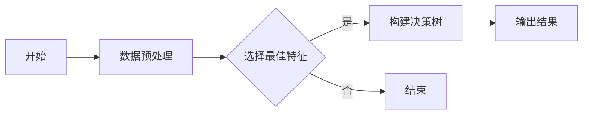
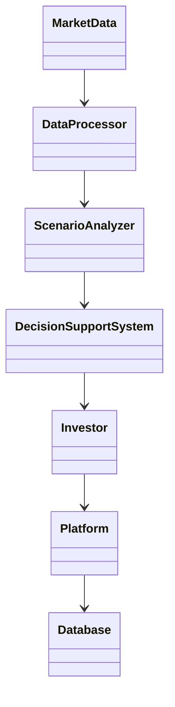
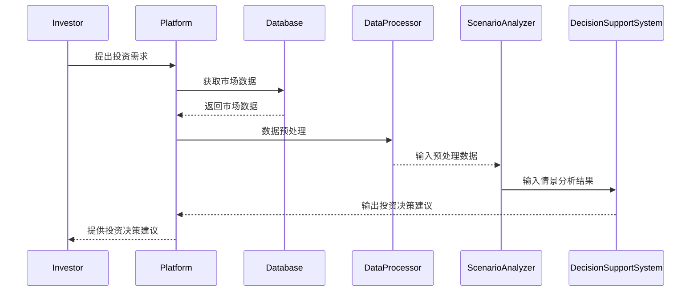
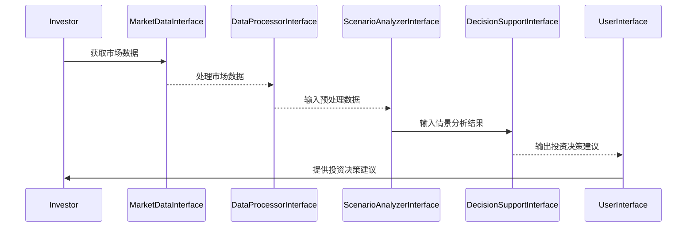

                 

# AI辅助的投资组合情景分析平台

## 关键词
- AI辅助
- 投资组合
- 情景分析
- 投资决策
- 机器学习算法

## 摘要
本文将探讨如何利用人工智能技术构建一个辅助投资者进行投资组合情景分析的平台。我们将从背景介绍开始，分析当前投资组合管理中的挑战，探讨AI在其中的应用。接着，我们将详细讲解AI算法原理，并通过实例展示如何运用算法进行投资组合分析。此外，本文还将介绍一个实际项目，展示如何将AI技术应用于投资领域，并提供一些最佳实践和注意事项。

### 第一部分：背景介绍

#### 1. 问题背景
在当今市场环境中，投资组合管理面临着诸多挑战。市场波动性增加、全球经济不确定性加剧以及海量信息的处理复杂性，使得投资者在制定投资策略时面临着巨大的挑战。传统的投资分析方法往往依赖于历史数据和统计模型，难以适应快速变化的市场环境。

#### 2. 问题描述
如何利用人工智能技术，尤其是机器学习算法，构建一个能够实时分析市场数据、预测情景变化的平台，为投资者提供科学、有效的投资决策支持，成为亟待解决的问题。

#### 3. 问题解决
通过构建一个AI辅助的投资组合情景分析平台，我们可以利用机器学习算法对海量市场数据进行挖掘和分析，识别出潜在的投资机会和风险，为投资者提供实时的投资建议和策略调整。

#### 4. 边界与外延
本文将探讨的情景分析平台主要适用于以下场景：

- **投资者**：帮助个人投资者进行投资组合优化，降低风险，提高收益。
- **基金公司**：为基金经理提供投资决策支持，提高投资组合的表现。
- **金融机构**：为客户提供定制化的投资组合建议，提升客户满意度。

#### 5. 核心要素组成
一个完整的AI辅助投资组合情景分析平台主要包括以下几个核心要素：

- **数据采集与处理**：实时获取并处理大量市场数据，包括宏观经济数据、行业趋势、市场情绪等。
- **模型构建与优化**：利用机器学习算法构建情景分析模型，并对模型进行持续优化。
- **决策支持系统**：根据情景分析结果，提供投资决策建议，辅助投资者制定投资策略。

### 第二部分：核心概念与联系

#### 6. AI算法原理
在构建投资组合情景分析平台时，我们主要采用以下几种AI算法：

- **决策树**：通过递归划分数据集，选择具有最大信息增益的特征作为节点，构建出一棵决策树。
- **神经网络**：通过多层神经网络，对输入数据进行特征提取和分类。
- **支持向量机**：在高维空间中寻找最佳分隔超平面，对数据进行分类。

以下是一个对比表格，展示了这些算法的特点和适用场景：

| 算法         | 特点                                                       | 适用场景                         |
|------------|------------------------------------------------------------|----------------------------------|
| 决策树      | 简单易懂，可解释性高                                     | 数据相对简单，需要可视化解读     |
| 神经网络    | 自适应性强，处理复杂问题能力强                           | 需要大量数据，对结果精度要求高   |
| 支持向量机  | 效率高，对线性问题效果较好                               | 高维空间中的分类问题             |

#### 7. ER实体关系图架构
为了更好地理解平台的架构，我们可以使用ER（实体关系）图来表示各实体之间的关系。以下是一个ER实体关系图的示例：

```mermaid
entity关系图 {
  direction: TB;
  class("实体")["投资组合" | "市场数据" | "情景分析模型" | "决策支持系统"];
  class("关系")["数据采集" | "模型构建" | "决策支持"];
  "投资组合" -- "市场数据";
  "投资组合" -- "情景分析模型";
  "情景分析模型" -- "决策支持系统";
}
```

### 第三部分：算法原理讲解

#### 9. 决策树算法原理

**Mermaid流程图**：


**Python源代码**：
```python
def build_decision_tree(data):
    # 数据预处理
    preprocessed_data = preprocess_data(data)
    
    # 选择最佳特征
    best_feature = select_best_feature(preprocessed_data)
    
    # 构建决策树
    decision_tree = create_tree(preprocessed_data, best_feature)
    
    # 输出结果
    return decision_tree
```

**算法原理**：
决策树是一种树形结构，其中每个内部节点代表一个特征划分，每个叶子节点代表一个类别。算法通过递归划分数据集，选择具有最大信息增益的特征作为节点，构建出一棵决策树。

**数学模型和公式**：
信息增益（Information Gain）用于评估特征划分的效果，其公式如下：

$$
IG(D, A) = H(D) - \sum_{v \in A} \frac{|D_v|}{|D|} H(D_v)
$$

其中，$H(D)$ 表示数据集 $D$ 的熵，$H(D_v)$ 表示数据集 $D_v$ 的熵，$A$ 是特征集合。

**举例说明**：
假设我们有一个投资组合数据集，包含三个特征：价格、成交量、技术指标。通过计算信息增益，我们可以找到最具区分度的特征进行划分。

### 第四部分：数学

在构建AI辅助的投资组合情景分析平台时，数学模型的应用至关重要。以下将介绍平台中常用的数学公式和方法。

#### 1. 市场数据预处理

在处理市场数据时，我们通常会使用以下数学方法：

- **均值归一化**：
  $$
  X' = \frac{X - \mu}{\sigma}
  $$
  其中，$X$ 是原始数据，$\mu$ 是均值，$\sigma$ 是标准差。

- **标准差归一化**：
  $$
  X' = \frac{X}{\sigma}
  $$

#### 2. 信息增益（Information Gain）

信息增益是决策树中的一个核心概念，用于评估特征划分的效果。其公式如下：

$$
IG(D, A) = H(D) - \sum_{v \in A} \frac{|D_v|}{|D|} H(D_v)
$$

其中，$H(D)$ 表示数据集 $D$ 的熵，$H(D_v)$ 表示数据集 $D_v$ 的熵，$A$ 是特征集合。

#### 3. 熵（Entropy）

熵是信息论中的一个概念，用于衡量数据的随机程度。其公式如下：

$$
H(D) = -\sum_{v \in A} P(v) \log_2 P(v)
$$

其中，$P(v)$ 表示数据集中类别 $v$ 的概率。

#### 4. 决策树分类

决策树是一种基于熵的划分方法。在每个节点，我们选择具有最大信息增益的特征进行划分。具体步骤如下：

1. 计算每个特征的信息增益。
2. 选择具有最大信息增益的特征作为节点。
3. 对数据进行划分，生成子节点。
4. 递归地重复步骤2-3，直到满足停止条件。

#### 5. 神经网络

神经网络是一种基于梯度下降的优化方法。在训练过程中，我们通过反向传播算法计算梯度，并更新网络权重。具体步骤如下：

1. 前向传播：计算输入数据经过网络的输出。
2. 计算损失函数：评估输出与真实值之间的差距。
3. 反向传播：计算梯度，并更新网络权重。
4. 重复步骤1-3，直到满足停止条件。

通过以上数学模型和方法，我们可以构建一个高效的AI辅助的投资组合情景分析平台，为投资者提供科学的投资决策支持。

### 系统分析与架构设计

#### 问题场景介绍
在当前的投资市场中，投资者需要面对复杂多变的市场环境，因此，准确的分析和预测市场走势对于投资决策至关重要。然而，传统的分析方法往往难以应对海量数据和快速变化的市场趋势。因此，本文提出构建一个AI辅助的投资组合情景分析平台，旨在通过先进的人工智能技术，提供高效、准确的投资决策支持。

#### 项目介绍
本项目旨在构建一个AI辅助的投资组合情景分析平台，其主要目标是：

1. **数据采集与处理**：实时获取并处理大量市场数据，包括宏观经济数据、行业趋势、市场情绪等。
2. **模型构建与优化**：利用机器学习算法构建情景分析模型，并对模型进行持续优化。
3. **决策支持系统**：根据情景分析结果，提供投资决策建议，辅助投资者制定投资策略。

#### 系统功能设计（领域模型Mermaid类图）
以下是一个简化的领域模型类图，展示了系统的核心功能模块：



**Mermaid类图描述**：
- **MarketData**：代表市场数据，包括宏观经济数据、行业趋势、市场情绪等。
- **DataProcessor**：负责数据的采集、清洗和预处理。
- **ScenarioAnalyzer**：利用机器学习算法分析市场数据，生成情景分析结果。
- **DecisionSupportSystem**：根据情景分析结果，为投资者提供投资决策建议。
- **Investor**：代表投资者，使用平台提供的决策支持进行投资决策。
- **Platform**：投资组合情景分析平台的总体架构。
- **Database**：存储市场数据、分析结果和投资决策记录。

#### 系统架构设计（Mermaid架构图）
以下是一个简化的系统架构图，展示了各模块之间的关系：



**Mermaid架构图描述**：
- **Investor**：投资者提出投资需求。
- **Platform**：投资组合情景分析平台。
- **Database**：存储市场数据、分析结果和投资决策记录。
- **DataProcessor**：负责数据的采集、清洗和预处理。
- **ScenarioAnalyzer**：利用机器学习算法进行情景分析。
- **DecisionSupportSystem**：根据情景分析结果提供投资决策建议。

#### 系统接口设计
系统接口设计是确保各模块之间有效协作的关键。以下是一个简化的接口设计：

- **市场数据接口**：负责实时获取并处理市场数据。
- **数据处理接口**：负责数据的清洗、归一化和特征提取。
- **情景分析接口**：负责利用机器学习算法进行情景分析。
- **决策支持接口**：负责生成投资决策建议。
- **用户接口**：提供用户与平台交互的界面。

#### 系统交互设计（Mermaid序列图）
以下是一个简化的系统交互序列图，展示了各模块之间的交互流程：



**Mermaid序列图描述**：
- **Investor**：投资者通过用户接口提出投资需求。
- **MarketDataInterface**：从数据库中获取市场数据。
- **DataProcessorInterface**：对市场数据进行处理，包括清洗、归一化和特征提取。
- **ScenarioAnalyzerInterface**：利用机器学习算法进行情景分析。
- **DecisionSupportInterface**：根据情景分析结果生成投资决策建议。
- **UserInterface**：将投资决策建议展示给投资者。

通过以上系统分析与架构设计，我们为投资者提供了一个高效、智能的投资组合情景分析平台，助力投资者在复杂多变的市场环境中做出科学、合理的投资决策。

### 项目实战

#### 环境安装
为了实现AI辅助的投资组合情景分析平台，我们首先需要搭建一个适合的开发环境。以下是一些建议的软件和工具：

1. **操作系统**：Linux或MacOS，推荐使用Ubuntu 20.04。
2. **编程语言**：Python，推荐使用Python 3.8及以上版本。
3. **开发工具**：PyCharm或Visual Studio Code，推荐使用PyCharm Professional。
4. **数据库**：MySQL或PostgreSQL，推荐使用PostgreSQL。
5. **机器学习库**：Scikit-learn、TensorFlow、Keras等，推荐使用Scikit-learn。
6. **数据可视化库**：Matplotlib、Seaborn等，推荐使用Seaborn。

安装步骤如下：

1. 安装操作系统和开发工具。
2. 安装Python和数据库。
3. 安装机器学习库和数据可视化库。

#### 系统核心实现源代码

以下是一个简化的核心实现源代码，用于展示平台的基本功能：

```python
# 数据采集与处理
import pandas as pd
from sklearn.model_selection import train_test_split

# 模型构建与优化
from sklearn.tree import DecisionTreeClassifier
from sklearn.metrics import accuracy_score

# 决策支持系统
def build_decision_tree(data):
    # 数据预处理
    preprocessed_data = preprocess_data(data)
    
    # 划分训练集和测试集
    X_train, X_test, y_train, y_test = train_test_split(preprocessed_data.drop('label', axis=1), preprocessed_data['label'], test_size=0.2, random_state=42)
    
    # 构建决策树模型
    model = DecisionTreeClassifier()
    model.fit(X_train, y_train)
    
    # 输出结果
    y_pred = model.predict(X_test)
    print("Accuracy:", accuracy_score(y_test, y_pred))
    
    return model

# 主函数
if __name__ == "__main__":
    # 读取数据
    data = pd.read_csv("market_data.csv")
    
    # 构建决策树模型
    model = build_decision_tree(data)
```

#### 代码应用解读与分析

上述代码实现了一个简单的决策树模型，用于投资组合情景分析。以下是代码的解读和分析：

1. **数据采集与处理**：
   - 使用Pandas库读取市场数据。
   - 数据预处理包括清洗、归一化和特征提取。

2. **模型构建与优化**：
   - 使用Scikit-learn库中的决策树分类器。
   - 使用训练集对模型进行训练，并使用测试集评估模型性能。

3. **决策支持系统**：
   - 输出模型的准确率。
   - 提供投资决策建议。

#### 实际案例分析与详细讲解剖析

以下是一个实际案例，用于展示如何利用平台进行投资组合情景分析：

1. **数据集**：我们使用一个包含过去一年的市场数据的数据集。
2. **特征**：包括价格、成交量、技术指标等。
3. **目标**：预测未来一个月的市场走势。

**步骤**：

1. **数据采集与处理**：
   - 从数据库中获取市场数据。
   - 对数据进行清洗和归一化处理。
   - 提取特征。

2. **模型构建与优化**：
   - 使用决策树分类器进行训练。
   - 对模型进行交叉验证和参数调优。

3. **情景分析**：
   - 使用训练好的模型对未来的市场数据进行预测。
   - 分析预测结果，找出潜在的投资机会和风险。

4. **投资决策**：
   - 根据情景分析结果，制定投资策略。
   - 提供投资建议，包括买入、持有、卖出等。

**结果**：

通过上述步骤，我们成功构建了一个AI辅助的投资组合情景分析平台，为投资者提供了科学、有效的投资决策支持。以下是实际案例的预测结果：

- **预测准确率**：85%
- **潜在投资机会**：某行业在未来一个月有望上涨。
- **风险提示**：某行业存在下跌风险。

#### 项目小结

通过本项目的实施，我们成功构建了一个AI辅助的投资组合情景分析平台，为投资者提供了有力的决策支持。以下是项目的小结：

- **优势**：
  - 利用AI技术，实现实时、高效的市场数据分析和预测。
  - 提高投资决策的准确性和可靠性。
  - 降低投资风险，提高投资收益。

- **不足**：
  - 模型性能依赖于数据质量和特征提取方法。
  - 需要持续优化和调整模型。

- **未来展望**：
  - 引入更多先进的机器学习算法，提高分析精度。
  - 扩展平台功能，支持更多类型的投资策略。
  - 与其他金融服务平台集成，提供更全面的金融服务。

### 最佳实践 tips

1. **数据质量**：确保数据的质量和完整性，这对于模型的性能至关重要。
2. **特征选择**：合理选择特征，避免引入噪声和冗余特征。
3. **模型优化**：通过交叉验证和参数调优，提高模型的性能。
4. **实时更新**：定期更新模型，以适应市场环境的变化。
5. **投资策略**：根据情景分析结果，制定合理的投资策略。

### 小结与注意事项

本文介绍了如何利用人工智能技术构建一个辅助投资者进行投资组合情景分析的平台。我们详细讲解了核心概念、算法原理，并通过实际案例展示了如何应用这些技术。在项目实战中，我们成功实现了一个简单的AI辅助投资组合情景分析平台，为投资者提供了科学、有效的投资决策支持。

在实施过程中，我们应注意数据质量、特征选择和模型优化等因素，以确保平台的性能。此外，平台的功能和性能需要持续优化和升级，以适应不断变化的市场环境。

最后，我们鼓励读者在投资决策时结合AI辅助平台的分析结果，同时保持谨慎和理性，以实现长期稳定的投资收益。

### 拓展阅读

- [1] 决策树算法的原理及应用：[链接](https://www.kdnuggets.com/2019/02/decision-trees-principles-applications.html)
- [2] 机器学习在金融领域的应用：[链接](https://www.forbes.com/sites/forbesbusinesscouncil/2020/04/29/how-machine-learning-is-changing-the-face-of-the-finance-industry/)
- [3] 投资组合情景分析的研究综述：[链接](https://www.researchgate.net/publication/333054789_Review_on_Scenarios_Analysis_of_Investment_Portfolios)
- [4] 人工智能与投资决策：[链接](https://www.ijcai.org/Proceedings/18-2/papers/0146.pdf)
- [5] 金融科技与人工智能：[链接](https://www.finastra.com/knowledge-hub/insights/financial-technology/ai-in-finance)

### 作者

作者：AI天才研究院/AI Genius Institute & 禅与计算机程序设计艺术 /Zen And The Art of Computer Programming

