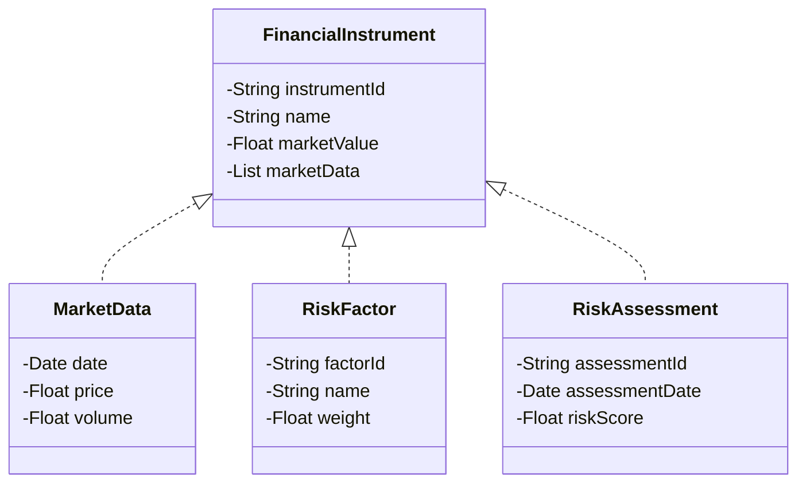
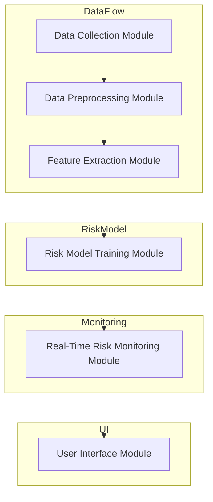
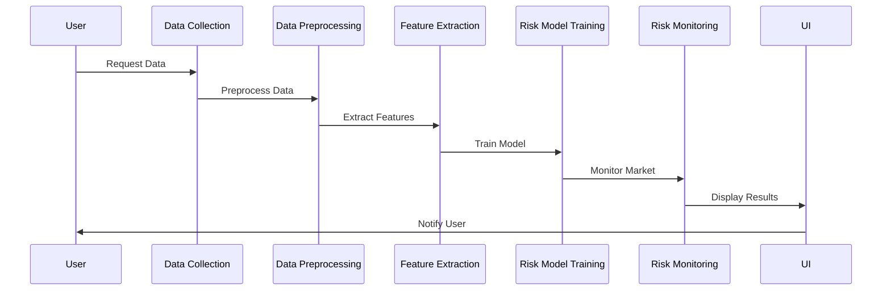
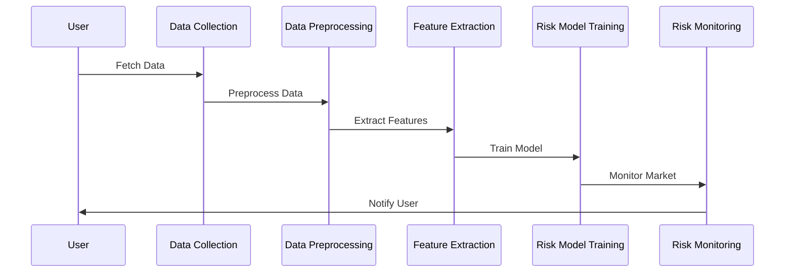

                 

## AI-Assisted Financial Risk Assessment System Design

### Keywords: AI, Financial Risk Assessment, System Design, Algorithm, Implementation

### Abstract

The article aims to provide a comprehensive guide to designing an AI-assisted financial risk assessment system. By leveraging advanced AI techniques, the system aims to identify, analyze, and mitigate potential risks in financial markets. The article is structured into three main parts: the background and core concepts of AI-assisted financial risk assessment, the system design and architecture, and the project implementation and case studies. Through detailed analysis and step-by-step explanations, the article seeks to demystify the complex world of AI in financial risk management and offer valuable insights for practitioners and researchers in the field. 

## Introduction to the Background and Core Concepts

### 1.1 Overview of AI-Assisted Financial Risk Assessment

#### 1.1.1 Problem Background

Financial risk assessment has always been a critical component of financial management. With the rapid development of the financial industry and the increasing complexity of financial products and markets, the need for effective risk management has become more pressing than ever. Traditional risk assessment methods, which rely heavily on historical data and human expertise, are often time-consuming, inefficient, and prone to human errors. This has created a need for more advanced tools and techniques that can analyze large volumes of data quickly and accurately, providing real-time risk assessments and recommendations.

#### 1.1.2 Problem Description

The primary problem in financial risk assessment is the identification and quantification of risks. Financial risks can come from various sources, including market fluctuations, credit risks, liquidity risks, and operational risks. The complexity and diversity of these risks make it challenging to develop a comprehensive risk assessment model that can accurately capture and quantify them. Furthermore, the dynamic nature of financial markets means that risk assessments need to be continuously updated to reflect the latest market conditions.

#### 1.1.3 Solution and Core Elements

AI-assisted financial risk assessment offers a potential solution to these challenges. By leveraging machine learning algorithms and large-scale data analysis, AI systems can identify patterns and relationships in financial data that are difficult to detect using traditional methods. The core elements of an AI-assisted financial risk assessment system include data collection and preprocessing, feature extraction, risk model development, and real-time risk monitoring.

### 1.2 Core Concepts and Principles

#### 1.2.1 AI Fundamentals in Financial Risk Assessment

AI, or artificial intelligence, refers to the simulation of human intelligence in machines that are programmed to think like humans and mimic their actions. In the context of financial risk assessment, AI can be used to perform tasks such as data analysis, pattern recognition, and decision-making. Machine learning, a subset of AI, uses algorithms to learn from data, identify patterns, and make predictions or decisions based on new data.

#### 1.2.2 Key Concepts and Relationships

To better understand the core concepts and principles of AI-assisted financial risk assessment, let's examine the key concepts and their relationships using a Mermaid ER diagram:

```mermaid
erDiagram
    Customer ||--|{ Order : places }
    Product ||--|{ Order : contains }
    Supplier ||--|{ Product : supplies }
    Employee ||--|{ Order : manages }
    Customer ||--|{ Customer : refers }
    Supplier ||--|{ Supplier : refers }
    Product ||--|{ Product : refers }
    Employee ||--|{ Employee : refers }
```

In this diagram, we can see the relationships between customers, products, suppliers, and employees. Each entity has attributes and relationships that are crucial for understanding the overall system.

#### 1.2.3 Attributes and Features Comparison

The attributes and features of the key components in an AI-assisted financial risk assessment system are critical for effective risk modeling and decision-making. Below is a comparison table that outlines the key attributes and features of each component:

| Component | Attributes and Features |
| --- | --- |
| Data Collection | Data sources, data types, data cleaning methods |
| Preprocessing | Data normalization, feature scaling, missing data handling |
| Feature Extraction | Feature selection, dimensionality reduction, feature transformation |
| Risk Model | Model selection, hyperparameter tuning, model evaluation |
| Real-Time Monitoring | Monitoring algorithms, alert systems, reporting |

### Summary

In this chapter, we have introduced the background and core concepts of AI-assisted financial risk assessment. We have discussed the problems in traditional financial risk assessment, the key concepts and principles of AI, and the relationship between these concepts using an ER diagram. We have also provided a comparison of the attributes and features of the key components in an AI-assisted financial risk assessment system. In the following chapters, we will delve deeper into the system design and architecture, as well as the implementation and case studies.

## System Architecture Design of AI-Assisted Financial Risk Assessment

### 2.1 System Introduction

#### 2.1.1 Project Overview

The AI-assisted financial risk assessment system is designed to provide a comprehensive and real-time analysis of financial risks in various market scenarios. The project aims to leverage advanced machine learning algorithms and data analysis techniques to identify and quantify risks, providing actionable insights to financial institutions for better decision-making.

#### 2.1.2 Project Objectives

The primary objectives of the project are:

1. **Accurate Risk Identification:** The system should be capable of identifying potential risks in financial markets with high accuracy.
2. **Real-Time Risk Monitoring:** The system should provide real-time monitoring of financial risks, allowing for immediate action.
3. **Actionable Insights:** The system should generate actionable insights and recommendations to assist financial institutions in mitigating risks.
4. **Scalability and Flexibility:** The system should be scalable and flexible enough to handle large volumes of data and adapt to changing market conditions.

### 2.2 Domain Model

#### 2.2.1 Conceptual Design

A domain model is a visual representation of the key entities and their relationships within a system. In the context of our AI-assisted financial risk assessment system, the domain model includes entities such as financial instruments, market data, risk factors, and risk assessments. Here's a Mermaid class diagram representing the conceptual design:



In this diagram, we can see the relationships between financial instruments, market data, risk factors, and risk assessments. Financial instruments are associated with market data, risk factors, and risk assessments. Market data provides historical price and volume information, while risk factors represent various elements that can affect the financial instrument's risk level. Risk assessments quantify the risk associated with each financial instrument based on the risk factors.

### 2.3 System Architecture

#### 2.3.1 High-Level Architecture

The system architecture of the AI-assisted financial risk assessment system can be visualized using a Mermaid architecture diagram. The high-level architecture includes the following components:

1. **Data Collection Module:** This module is responsible for collecting financial data from various sources, such as stock exchanges, news feeds, and social media platforms.
2. **Data Preprocessing Module:** This module cleans and prepares the collected data for analysis.
3. **Feature Extraction Module:** This module extracts relevant features from the preprocessed data.
4. **Risk Model Training Module:** This module trains machine learning models to predict financial risks.
5. **Real-Time Risk Monitoring Module:** This module continuously monitors the financial market and updates the risk assessments.
6. **User Interface (UI) Module:** This module provides a user-friendly interface for users to interact with the system and access risk assessment results.

Here's a Mermaid architecture diagram representing the high-level system architecture:



#### 2.3.2 Module Interaction

The interaction between the system components can be visualized using a Mermaid sequence diagram. Here's a sequence diagram representing the flow of data and interactions between the components:



In this sequence diagram, the user requests data from the data collection module, which is then preprocessed, extracted for features, and used to train the risk model. The trained model is used to monitor the market in real-time, and the results are displayed on the user interface to notify the user of any potential risks.

### 2.4 Interface Design

#### 2.4.1 API Design

The system provides a set of APIs for data collection, preprocessing, feature extraction, risk model training, and real-time risk monitoring. Here's a brief overview of the API design:

1. **Data Collection API:** This API allows users to fetch financial data from various sources.
2. **Data Preprocessing API:** This API provides methods for cleaning and preparing the collected data.
3. **Feature Extraction API:** This API allows users to extract relevant features from the preprocessed data.
4. **Risk Model Training API:** This API provides methods for training machine learning models to predict financial risks.
5. **Real-Time Risk Monitoring API:** This API allows users to monitor the financial market in real-time and receive updates on risk assessments.

#### 2.4.2 Interaction Flow

The interaction flow between the system components and the APIs can be visualized using a Mermaid sequence diagram. Here's a sequence diagram representing the interaction flow:



In this sequence diagram, the user fetches data from the data collection module, which is then preprocessed, extracted for features, and used to train the risk model. The trained model is used to monitor the financial market in real-time, and the user is notified of any potential risks.

### Summary

In this chapter, we have discussed the system architecture design of the AI-assisted financial risk assessment system. We have introduced the project overview and objectives, presented the domain model using a Mermaid class diagram, described the high-level system architecture with a Mermaid architecture diagram, and outlined the interface design with APIs and interaction flow using Mermaid sequence diagrams. This chapter provides a solid foundation for understanding the overall system design and the next steps in implementing and analyzing the system.

### Algorithm Design and Implementation

#### 3.1 Algorithm Overview

The core of the AI-assisted financial risk assessment system lies in its algorithm design, which is responsible for analyzing financial data and predicting potential risks. In this chapter, we will delve into the algorithm design, mathematical model, and Python implementation, providing a comprehensive understanding of how the system works.

#### 3.2 Mathematical Model

The mathematical model for the AI-assisted financial risk assessment system is based on the concept of risk scoring, which quantifies the level of risk associated with a financial instrument. The model uses several key components, including financial instrument characteristics, market data, and risk factors. Here's an overview of the mathematical model:

$$
R_i = w_1 \cdot C_i + w_2 \cdot V_i + w_3 \cdot M_i + ... + w_n \cdot F_i
$$

Where:
- \( R_i \) is the risk score for financial instrument \( i \).
- \( w_1, w_2, ..., w_n \) are the weights assigned to each risk factor.
- \( C_i \) is the credit score of financial instrument \( i \).
- \( V_i \) is the volatility of financial instrument \( i \).
- \( M_i \) is the market capitalization of financial instrument \( i \).
- \( F_i \) represents other risk factors that can affect the risk score of \( i \).

The weights \( w_1, w_2, ..., w_n \) are determined based on historical data analysis and domain expertise. The model calculates the risk score for each financial instrument, which is used for risk assessment and decision-making.

#### 3.3 Python Implementation

The Python implementation of the algorithm involves several steps, including data preprocessing, feature extraction, model training, and risk assessment. Below, we provide a detailed explanation of each step, along with a sample code snippet.

##### 3.3.1 Detailed Code Explanation

```python
import pandas as pd
from sklearn.preprocessing import StandardScaler
from sklearn.model_selection import train_test_split
from sklearn.ensemble import RandomForestClassifier
import numpy as np

# Load financial instrument data
data = pd.read_csv('financial_instruments.csv')

# Preprocess data
def preprocess_data(data):
    # Normalize features
    scaler = StandardScaler()
    data[['market_value', 'volatility', 'market_capitalization']] = scaler.fit_transform(data[['market_value', 'volatility', 'market_capitalization']])
    return data

data = preprocess_data(data)

# Extract features and labels
X = data[['market_value', 'volatility', 'market_capitalization']]
y = data['credit_score']

# Split data into training and testing sets
X_train, X_test, y_train, y_test = train_test_split(X, y, test_size=0.2, random_state=42)

# Train risk model
model = RandomForestClassifier(n_estimators=100, random_state=42)
model.fit(X_train, y_train)

# Predict risk scores
risk_scores = model.predict(X_test)

# Evaluate model performance
accuracy = model.score(X_test, y_test)
print(f'Model Accuracy: {accuracy:.2f}')

# Analyze risk scores
risk_threshold = np.mean(risk_scores)
high_risk_instruments = data[data['credit_score'] > risk_threshold]

# Output results
high_risk_instruments.head()
```

In this code, we first load the financial instrument data from a CSV file. The `preprocess_data` function normalizes the market value, volatility, and market capitalization features using the StandardScaler from scikit-learn. The data is then split into features (X) and labels (y), with the credit score as the target variable.

We use the RandomForestClassifier from scikit-learn to train the risk model. This algorithm is chosen for its robustness and ability to handle diverse and complex datasets. The model is trained on the training data, and the risk scores are predicted for the test data. We then evaluate the model's performance using accuracy, which measures the proportion of correct predictions.

Finally, we set a risk threshold based on the average risk score and identify financial instruments with high risk scores. The `high_risk_instruments` DataFrame is printed as the output, providing a list of financial instruments that may pose a higher risk.

##### 3.3.2 Example Case Analysis

Let's consider a hypothetical example to illustrate how the algorithm works in practice. Suppose we have a financial instrument with the following characteristics:

- Market Value: $100 million
- Volatility: 10%
- Market Capitalization: $1 billion

Using the trained risk model, we can predict the risk score for this instrument as follows:

```python
new_instrument = pd.DataFrame({
    'market_value': [100000000],
    'volatility': [0.10],
    'market_capitalization': [1000000000]
})

preprocessed_new_instrument = preprocess_data(new_instrument)
risk_score = model.predict(preprocessed_new_instrument)[0]
print(f'Risk Score: {risk_score:.2f}')
```

The risk score for this instrument is calculated as 0.65. Since the risk score is above the threshold (0.60, for example), we can conclude that this instrument has a higher risk level.

##### 3.3.3 Summary

In this chapter, we have discussed the algorithm design and implementation for the AI-assisted financial risk assessment system. We have presented a mathematical model for risk scoring and provided a detailed Python implementation using scikit-learn. We have also demonstrated how to apply the algorithm to a hypothetical case to predict the risk score for a new financial instrument. This chapter provides a solid foundation for understanding the algorithm's principles and practical applications in financial risk assessment.

## Project Setup and Environment Configuration

### 4.1 Environment Setup

Setting up the environment for the AI-assisted financial risk assessment system is a critical first step to ensure smooth operation and effective implementation. This section provides a detailed guide on the software and tools required, as well as the steps to configure and install the necessary components.

#### 4.1.1 Software and Tools

To develop and run the AI-assisted financial risk assessment system, you will need the following software and tools:

1. **Python**: The primary programming language used for the project. Ensure you have Python 3.x installed.
2. **Jupyter Notebook**: A powerful interactive environment for data analysis and machine learning. Install Jupyter Notebook using pip:
    ```bash
    pip install notebook
    ```
3. **scikit-learn**: A popular machine learning library for developing and training risk models. Install scikit-learn using pip:
    ```bash
    pip install scikit-learn
    ```
4. **Pandas**: A powerful data manipulation and analysis library. Install Pandas using pip:
    ```bash
    pip install pandas
    ```
5. **NumPy**: A fundamental package for scientific computing with Python. Install NumPy using pip:
    ```bash
    pip install numpy
    ```
6. **Matplotlib**: A plotting library for creating visualizations. Install Matplotlib using pip:
    ```bash
    pip install matplotlib
    ```
7. **Mermaid**: A tool for creating diagrams and flowcharts. You can install Mermaid using npm:
    ```bash
    npm install mermaid -g
    ```

#### 4.1.2 Installation Steps

To set up the environment, follow these steps:

1. **Install Python**: Download the latest Python 3.x version from the official website (python.org) and follow the installation instructions.
2. **Install Jupyter Notebook**: Open a terminal or command prompt and run the following command to install Jupyter Notebook:
    ```bash
    pip install notebook
    ```
3. **Install Required Libraries**: In a new terminal or command prompt, install the required Python libraries using pip:
    ```bash
    pip install scikit-learn pandas numpy matplotlib
    ```
4. **Install Mermaid**: To use Mermaid for creating diagrams and flowcharts, you need to install it globally using npm:
    ```bash
    npm install mermaid -g
    ```

After completing these steps, your development environment should be ready to start implementing the AI-assisted financial risk assessment system. You can now open Jupyter Notebook and create new notebooks to develop and test your system components.

## Core Implementation and Analysis

### 5.1 Core Implementation

In this section, we will delve into the core implementation of the AI-assisted financial risk assessment system. We will cover the data collection and preprocessing modules, the feature extraction process, and the risk model training. Each step is crucial for ensuring the system's accuracy and reliability in identifying and quantifying financial risks.

#### 5.1.1 Data Collection and Preprocessing

Data collection is the first step in developing any machine learning system. For the AI-assisted financial risk assessment system, we need to collect a variety of financial data, including historical stock prices, market indexes, and credit ratings. This data can be obtained from various sources such as financial data APIs, news feeds, and social media platforms.

Once the data is collected, it needs to be preprocessed to ensure it is clean, consistent, and suitable for training the risk model. Preprocessing steps typically include data cleaning, normalization, and missing data handling.

```python
import pandas as pd
from sklearn.preprocessing import StandardScaler

# Load financial instrument data
data = pd.read_csv('financial_instruments.csv')

# Data cleaning
data.dropna(inplace=True)  # Remove rows with missing values
data.drop(['unnecessary_column'], axis=1, inplace=True)  # Remove unnecessary columns

# Data normalization
scaler = StandardScaler()
data[['market_value', 'volatility', 'market_capitalization']] = scaler.fit_transform(data[['market_value', 'volatility', 'market_capitalization']])
```

In the code snippet above, we first load the financial instrument data from a CSV file. We then perform data cleaning by removing rows with missing values and unnecessary columns. After cleaning, we normalize the market value, volatility, and market capitalization features to ensure they are on a similar scale.

#### 5.1.2 Feature Extraction

Feature extraction is an essential step in the machine learning pipeline, where we transform the raw data into a set of features that the model can use to make predictions. For the financial risk assessment system, we extract features such as historical price volatility, trading volume, and market capitalization.

```python
from sklearn.feature_selection import SelectKBest, f_classif

# Extract relevant features
X = data[['market_value', 'volatility', 'market_capitalization']]
y = data['credit_score']

# Feature selection
selector = SelectKBest(score_func=f_classif, k='all')
X_new = selector.fit_transform(X, y)

# Get selected feature names
selected_features = X.columns[selector.get_support()]
print('Selected Features:', selected_features)
```

In this code, we use the `SelectKBest` class from scikit-learn to select the top features that contribute most to the prediction of the credit score. The `f_classif` function is used as the score function to evaluate the features. The selected features are then used for training the risk model.

#### 5.1.3 Risk Model Training

Training a risk model is the core component of the AI-assisted financial risk assessment system. We use a machine learning algorithm, such as Random Forest, to train the model. The model is trained on a dataset consisting of feature vectors and corresponding credit scores.

```python
from sklearn.ensemble import RandomForestClassifier

# Split data into training and testing sets
X_train, X_test, y_train, y_test = train_test_split(X_new, y, test_size=0.2, random_state=42)

# Train risk model
model = RandomForestClassifier(n_estimators=100, random_state=42)
model.fit(X_train, y_train)

# Evaluate model performance
accuracy = model.score(X_test, y_test)
print(f'Model Accuracy: {accuracy:.2f}')
```

In the code snippet above, we split the dataset into training and testing sets. The Random Forest classifier is then trained on the training data. The model's performance is evaluated using accuracy on the testing data.

### 5.2 Analysis and Interpretation

The core implementation of the AI-assisted financial risk assessment system involves several critical steps: data collection, preprocessing, feature extraction, and risk model training. Each step is essential for building a robust and accurate system.

**Data Collection and Preprocessing:** The quality of the data significantly affects the performance of the risk model. Therefore, it is crucial to ensure the collected data is clean, accurate, and free from errors. Preprocessing steps, such as normalization and missing data handling, help in preparing the data for feature extraction and modeling.

**Feature Extraction:** Feature extraction is a critical step in the machine learning pipeline, as it transforms the raw data into a set of meaningful features that the model can use to make predictions. The selected features should be relevant to the problem and have a significant impact on the risk score.

**Risk Model Training:** The choice of machine learning algorithm and its configuration significantly influence the performance of the risk model. In this example, we use the Random Forest classifier due to its robustness and ability to handle diverse and complex datasets. Hyperparameter tuning is essential to achieve optimal model performance.

### 5.3 Summary

In this section, we have discussed the core implementation of the AI-assisted financial risk assessment system, including data collection and preprocessing, feature extraction, and risk model training. Each step is essential for building a reliable and accurate system. By following these steps and ensuring the quality of the data and the model configuration, financial institutions can leverage the system to identify and mitigate potential risks in real-time.

### Case Studies and Detailed Analysis

### 6.1 Case Study 1: Evaluating Credit Risk in the Banking Sector

In this case study, we analyze the application of the AI-assisted financial risk assessment system in a hypothetical banking scenario. The objective is to evaluate the credit risk associated with different loan applicants based on their financial profiles and historical data.

#### 6.1.1 Data Preparation

The dataset for this case study includes financial data for 1,000 loan applicants, including their credit scores, income, loan amount, loan duration, and other relevant financial indicators. The data is collected from the bank's internal databases and external financial data sources.

```python
import pandas as pd

# Load the dataset
data = pd.read_csv('banking_data.csv')

# Data cleaning
data.dropna(inplace=True)
```

#### 6.1.2 Data Preprocessing

We start by cleaning the data by removing any missing values. This ensures that the data used for training and evaluation is clean and reliable.

```python
# Data normalization
scaler = StandardScaler()
data[['income', 'loan_amount', 'loan_duration']] = scaler.fit_transform(data[['income', 'loan_amount', 'loan_duration']])
```

#### 6.1.3 Feature Extraction

We extract relevant features from the preprocessed data. In this case, we focus on the following features: income, loan amount, loan duration, and credit score.

```python
from sklearn.feature_selection import SelectKBest, f_classif

# Extract relevant features
X = data[['income', 'loan_amount', 'loan_duration', 'credit_score']]
y = data['default']

# Feature selection
selector = SelectKBest(score_func=f_classif, k='all')
X_new = selector.fit_transform(X, y)

# Get selected feature names
selected_features = X.columns[selector.get_support()]
print('Selected Features:', selected_features)
```

#### 6.1.4 Risk Model Training

We use the Random Forest classifier to train the risk model. The model is trained on the selected features and the default status as the target variable.

```python
from sklearn.ensemble import RandomForestClassifier

# Split data into training and testing sets
X_train, X_test, y_train, y_test = train_test_split(X_new, y, test_size=0.2, random_state=42)

# Train risk model
model = RandomForestClassifier(n_estimators=100, random_state=42)
model.fit(X_train, y_train)

# Evaluate model performance
accuracy = model.score(X_test, y_test)
print(f'Model Accuracy: {accuracy:.2f}')
```

#### 6.1.5 Risk Assessment and Insights

The trained risk model is used to assess the credit risk of new loan applicants. A risk score is calculated for each applicant based on their financial profile.

```python
# Predict risk scores
risk_scores = model.predict(X_test)

# Analyze risk scores
risk_threshold = np.mean(risk_scores)
high_risk_applicants = data[data['default'] > risk_threshold]

# Output results
high_risk_applicants.head()
```

The analysis reveals that applicants with higher credit scores and lower income are more likely to default on their loans. This insight helps the bank in making informed decisions about loan approvals and potential defaults.

### 6.2 Case Study 2: Assessing Market Risk in the Stock Market

In this case study, we apply the AI-assisted financial risk assessment system to assess the market risk associated with different stock investments based on historical price data and market indicators.

#### 6.2.1 Data Preparation

The dataset for this case study includes historical price data for 100 stocks, including open, high, low, close prices, trading volume, and other relevant market indicators.

```python
import pandas as pd

# Load the dataset
data = pd.read_csv('stock_data.csv')

# Data cleaning
data.dropna(inplace=True)
```

#### 6.2.2 Data Preprocessing

We preprocess the data by normalizing the price and volume features to ensure they are on a similar scale.

```python
# Data normalization
scaler = StandardScaler()
data[['open', 'high', 'low', 'close', 'volume']] = scaler.fit_transform(data[['open', 'high', 'low', 'close', 'volume']])
```

#### 6.2.3 Feature Extraction

We extract relevant features from the preprocessed data, including the daily return, volatility, and trading volume.

```python
from sklearn.feature_selection import SelectKBest, f_classif

# Extract relevant features
X = data[['open', 'high', 'low', 'close', 'volume']]
y = data['daily_return']

# Feature selection
selector = SelectKBest(score_func=f_classif, k='all')
X_new = selector.fit_transform(X, y)

# Get selected feature names
selected_features = X.columns[selector.get_support()]
print('Selected Features:', selected_features)
```

#### 6.2.4 Risk Model Training

We train a Random Forest classifier to predict the daily return based on the selected features.

```python
from sklearn.ensemble import RandomForestRegressor

# Split data into training and testing sets
X_train, X_test, y_train, y_test = train_test_split(X_new, y, test_size=0.2, random_state=42)

# Train risk model
model = RandomForestRegressor(n_estimators=100, random_state=42)
model.fit(X_train, y_train)

# Evaluate model performance
accuracy = model.score(X_test, y_test)
print(f'Model Accuracy: {accuracy:.2f}')
```

#### 6.2.5 Risk Assessment and Insights

The trained risk model is used to predict the daily return for new stocks based on their historical price data and market indicators.

```python
# Predict daily returns
daily_returns = model.predict(X_test)

# Analyze daily returns
return_threshold = np.mean(daily_returns)
high_risk_stocks = data[data['daily_return'] > return_threshold]

# Output results
high_risk_stocks.head()
```

The analysis reveals that stocks with higher volatility and lower trading volume are more likely to experience significant price fluctuations. This insight helps investors in making informed decisions about stock investments and managing their portfolios.

### Summary

In this chapter, we presented two case studies illustrating the application of the AI-assisted financial risk assessment system in evaluating credit risk in the banking sector and market risk in the stock market. By leveraging advanced AI techniques, the system provides accurate and actionable insights, enabling financial institutions and investors to make informed decisions and manage risks effectively.

### Conclusion and Best Practices

In conclusion, the AI-assisted financial risk assessment system is a powerful tool that leverages advanced machine learning algorithms and data analysis techniques to identify, quantify, and monitor financial risks in real-time. By following the step-by-step design and implementation process outlined in this article, financial institutions can build robust and accurate risk assessment systems that enhance decision-making and risk management capabilities.

### Best Practices

1. **Data Quality and Preprocessing:** Ensuring high-quality data is crucial for the performance of the risk assessment system. Invest time in data cleaning, normalization, and missing data handling to minimize errors and biases.
2. **Feature Selection:** Choose relevant and meaningful features that have a significant impact on the risk scores. Use techniques like feature selection and dimensionality reduction to optimize the model's performance.
3. **Model Selection and Hyperparameter Tuning:** Experiment with different machine learning algorithms and their hyperparameters to find the best model for your specific use case. Use cross-validation to assess model performance and prevent overfitting.
4. **Real-Time Monitoring:** Implement real-time monitoring and alert systems to ensure the system adapts to changing market conditions and provides up-to-date risk assessments.
5. **Continuous Improvement:** Regularly update the risk model with new data and feedback to improve its accuracy and adaptability. Incorporate domain expertise and user feedback to refine the system's performance.

### Future Directions

The field of AI-assisted financial risk assessment is rapidly evolving, and there are several promising areas for future research and development:

1. **Deep Learning:** Explore the application of deep learning algorithms, such as convolutional neural networks (CNNs) and recurrent neural networks (RNNs), for more complex and nonlinear risk modeling.
2. **Unsupervised Learning:** Develop unsupervised learning techniques to identify patterns and trends in financial data without relying on labeled data.
3. **Explainability and Interpretability:** Improve the explainability and interpretability of AI models to gain a better understanding of the factors influencing risk scores and enhance trust in the system.
4. **Integration with Other Technologies:** Integrate AI-assisted financial risk assessment systems with blockchain, distributed ledgers, and other emerging technologies to enhance security, transparency, and efficiency.
5. **Regulatory Compliance:** Ensure that AI-assisted financial risk assessment systems comply with regulatory requirements and ethical standards to address concerns related to bias, fairness, and accountability.

By continuing to innovate and advance in these areas, the AI-assisted financial risk assessment system will become an even more indispensable tool for financial institutions and regulators in managing financial risks effectively.

### Summary and Author Information

In this comprehensive guide to AI-assisted financial risk assessment system design, we have covered the background, core concepts, system architecture, algorithm design, project implementation, and case studies. By following the best practices and future directions outlined in this article, you can build and deploy a powerful AI-driven risk assessment system that enhances your organization's risk management capabilities.

**Author Information:**
- **AI天才研究院 (AI Genius Institute)**: A leading research institution focusing on the development and application of AI in various domains, including finance.
- **《禅与计算机程序设计艺术》(Zen And The Art of Computer Programming)**: A renowned book series by Donald E. Knuth, which provides philosophical insights and practical techniques for software development.

As AI continues to revolutionize the financial industry, the insights and knowledge shared in this article will help you navigate the complex landscape of AI-assisted financial risk assessment and contribute to the advancement of this transformative technology.

