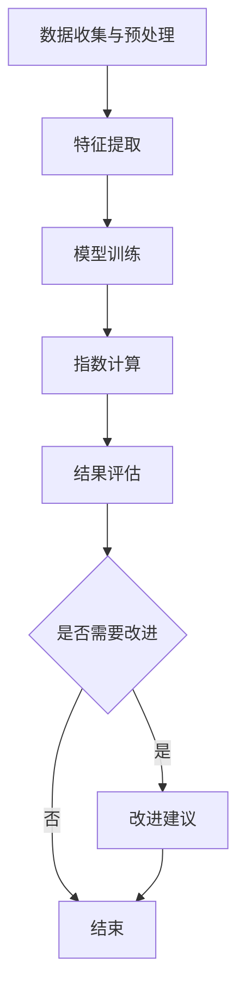
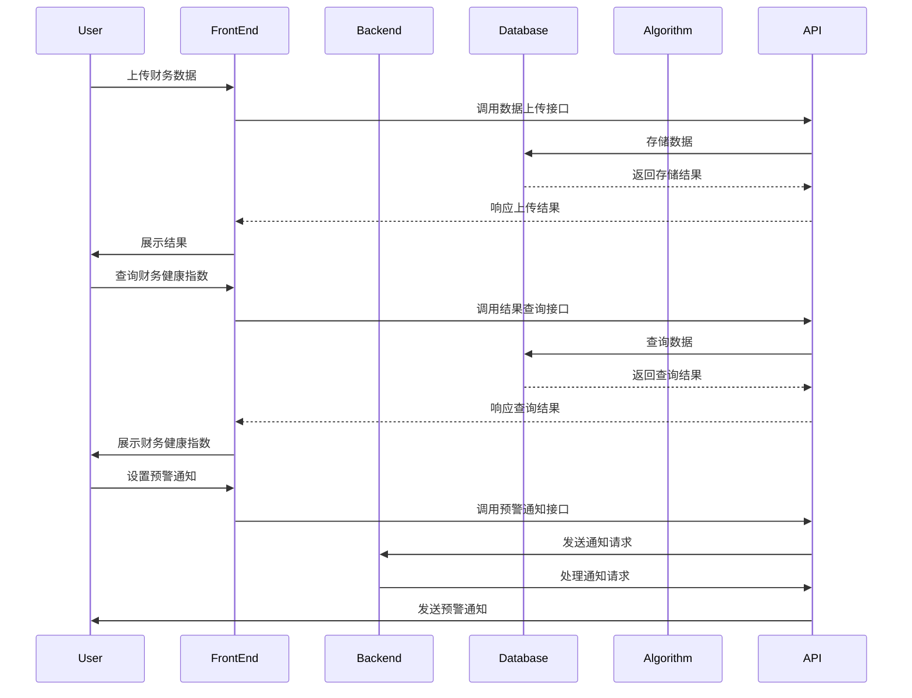

                 

# AI驱动的个人财务健康指数计算与监控系统

## 关键词

- 人工智能
- 个人财务管理
- 财务健康指数
- 监控系统
- 算法原理
- 数学模型

## 摘要

本文旨在探讨如何利用人工智能技术构建一个个人财务健康指数计算与监控系统。首先，介绍了个人财务健康指数的定义、计算方法和核心概念。接着，通过对比传统财务分析方法和基于人工智能的方法，展示了AI驱动的个人财务健康指数计算的优势。随后，详细讲解了财务健康指数的计算算法原理、数学模型和公式，并通过mermaid流程图进行了直观展示。文章还介绍了个人财务健康指数计算与监控系统的架构设计，包括系统功能设计、架构设计、接口设计和系统交互。最后，通过一个实际案例的分析，阐述了系统的实现和应用效果。

---

### 第1章: AI驱动的个人财务健康指数计算与监控系统概述

#### 1.1 问题背景

随着经济的快速发展，个人财务管理逐渐成为人们关注的焦点。然而，传统的财务管理方式往往难以满足现代人们对财务健康的需求。传统的财务管理依赖于手工计算和分析，存在以下问题：

1. **计算复杂度较高**：财务数据的处理和分析需要耗费大量的时间和精力，难以满足实时性需求。
2. **个性化程度不足**：传统方法难以根据个人的财务状况提供个性化的财务建议。
3. **数据分析能力有限**：传统方法依赖于人工分析，难以充分利用数据的价值。

为了解决上述问题，人工智能技术为个人财务管理带来了新的机遇。通过利用机器学习和数据分析技术，可以构建一个智能化的财务健康指数计算与监控系统，实现对个人财务状况的实时监控和智能分析。

#### 1.2 问题描述

个人财务健康指数是一个综合衡量个人财务状况的重要指标，它能够反映个人的资产状况、债务状况、收入状况和支出状况等多个方面。然而，传统的财务分析方法复杂且耗时，无法满足实时性和个性化需求。因此，本文旨在探讨如何利用人工智能技术，构建一个能够实时计算个人财务健康指数并监控个人财务状况的智能系统。

本文将解决以下问题：

1. **财务健康指数的定义和计算方法**：介绍财务健康指数的核心概念和计算方法。
2. **算法原理和数学模型**：详细阐述财务健康指数计算算法的原理、数学模型和公式。
3. **系统架构设计**：介绍个人财务健康指数计算与监控系统的架构设计，包括功能设计、架构设计、接口设计和系统交互。

#### 1.3 问题解决

为了解决上述问题，本文将采用以下方法：

1. **核心概念原理**：介绍财务健康指数的定义、计算方法和核心概念。
2. **概念属性特征对比表格**：对比传统财务分析方法和基于人工智能的财务健康指数计算方法的优势和不足。
3. **ER实体关系图架构**：展示个人财务健康指数计算与监控系统中的实体关系和数据处理流程。
4. **算法原理讲解**：详细阐述财务健康指数计算算法的原理、数学模型和公式，并使用mermaid流程图展示算法流程。
5. **数学模型和数学公式**：使用latex格式给出财务健康指数计算的关键公式，并进行详细讲解和举例说明。

#### 1.4 本章小结

本章介绍了AI驱动的个人财务健康指数计算与监控系统的研究背景、问题描述和解决方案。下一章将详细讨论财务健康指数的定义与计算方法。

---

## 第1章: AI驱动的个人财务健康指数计算与监控系统概述

### 1.1 问题背景

随着人工智能技术的迅猛发展，其在各个领域的应用越来越广泛，尤其在个人财务管理方面，AI技术展示出了巨大的潜力。传统的财务管理方式往往依赖于手工计算和分析，这不仅耗时耗力，而且容易出错。随着个人财务数据的日益复杂和多样，人们对于一种能够实时、准确地评估个人财务健康状况的工具有着强烈的需求。因此，如何利用人工智能技术构建一个高效、智能的个人财务健康指数计算与监控系统成为了一个重要课题。

#### 1.1.1 人工智能在财务管理中的应用

人工智能技术在财务管理中的应用主要集中在以下几个方面：

1. **数据分析和挖掘**：通过对大量的财务数据进行深入分析，人工智能可以帮助识别潜在的财务风险、发现投资机会以及优化资产配置。
2. **预测和决策支持**：利用机器学习算法，AI可以预测市场趋势、评估投资项目的风险和收益，为投资者提供科学的决策支持。
3. **智能投资顾问**：基于用户的风险偏好和财务目标，AI可以推荐个性化的投资组合，帮助用户实现财务目标。

#### 1.1.2 财务管理中的痛点

尽管人工智能技术在财务管理中具有巨大的潜力，但传统财务管理仍然存在一些痛点：

1. **计算复杂度高**：财务数据种类繁多，包括收入、支出、资产、负债等，手工计算和分析这些数据非常耗时。
2. **数据准确性问题**：财务数据可能存在缺失、错误或不一致的情况，这会对财务分析结果产生负面影响。
3. **个性化程度不足**：传统的财务管理方法往往无法根据个人的具体情况提供个性化的财务建议。

为了解决这些问题，迫切需要一种智能化、自动化的财务管理工具，而AI驱动的个人财务健康指数计算与监控系统正是为此而生。

#### 1.1.3 AI驱动的个人财务健康指数计算与监控系统的需求

AI驱动的个人财务健康指数计算与监控系统旨在为用户提供以下功能：

1. **实时计算**：系统能够实时获取用户的财务数据，并快速计算个人财务健康指数。
2. **个性化建议**：根据用户的财务状况和目标，系统可以提供个性化的财务建议，帮助用户优化财务决策。
3. **风险预警**：系统可以通过对财务数据的分析，发现潜在的风险，并提前预警，帮助用户规避风险。

#### 1.1.4 目标和意义

本文的目标是探讨如何构建一个高效、智能的AI驱动的个人财务健康指数计算与监控系统。通过本文的研究，不仅可以为用户提供一个实用的财务管理工具，还可以为相关领域的研究提供参考和启示。这一研究具有重要的实际意义和理论价值：

1. **提升财务管理效率**：通过自动化和智能化，系统能够大幅提升财务管理效率，减少人为错误。
2. **个性化财务建议**：基于用户的财务数据和目标，系统可以提供高度个性化的财务建议，帮助用户更好地管理财务。
3. **风险管理和预测**：系统可以通过对财务数据的实时监控和分析，提前预警潜在风险，并预测未来的财务状况。

综上所述，AI驱动的个人财务健康指数计算与监控系统不仅具有巨大的市场潜力，还能够为用户提供更加智能、个性化的财务管理服务，具有重要的现实意义和研究价值。

### 1.2 问题描述

个人财务健康指数是衡量个人财务状况的综合指标，它涵盖了多个方面的财务数据，如收入、支出、资产和负债等。一个健康的财务状况不仅能够确保个人的日常生活得到满足，还能够为未来的投资和消费提供保障。然而，传统的财务管理方法存在以下问题：

1. **计算复杂度高**：财务健康指数的计算需要处理大量的数据，包括收入、支出、资产和负债等，手工计算和分析这些数据不仅耗时，而且容易出错。
2. **数据分析能力有限**：传统方法依赖于人工分析，数据分析能力有限，无法充分利用数据的价值。
3. **个性化程度不足**：传统财务管理方法往往无法根据个人的具体情况提供个性化的财务建议。

为了解决这些问题，需要构建一个高效、智能的AI驱动的个人财务健康指数计算与监控系统。本文的主要任务是：

1. **定义财务健康指数**：明确财务健康指数的定义，包括其涵盖的方面和计算方法。
2. **构建计算模型**：设计并实现一个基于人工智能的财务健康指数计算模型，利用机器学习算法对财务数据进行处理和分析。
3. **监控系统设计**：设计一个能够实时监控个人财务状况的系统，并提供个性化的财务建议和风险预警功能。

通过上述任务，本文旨在为用户提供一个智能、高效的财务管理工具，帮助用户更好地管理个人财务，实现财务目标。

### 1.3 问题解决

为了解决上述问题，本文将采用以下方法：

1. **核心概念原理**：首先，介绍财务健康指数的定义、计算方法和核心概念。财务健康指数是衡量个人财务状况的重要指标，它涵盖多个方面的财务数据，如收入、支出、资产和负债等。通过明确财务健康指数的定义和计算方法，为后续算法设计和系统实现提供基础。
   
2. **概念属性特征对比表格**：对比传统财务分析方法和基于人工智能的财务健康指数计算方法，列出两者的优势和不足。传统财务分析方法主要依赖于人工计算和分析，虽然经验丰富，但存在计算复杂度高、数据分析能力有限和个性化程度不足等问题。而基于人工智能的财务健康指数计算方法可以利用机器学习算法对财务数据进行处理和分析，实现实时计算、个性化建议和风险预警等功能，具有更高的效率、准确性和个性化程度。

3. **ER实体关系图架构**：展示个人财务健康指数计算与监控系统中的实体关系和数据处理流程。ER（Entity-Relationship）图是一种用于描述实体及其关系的图形化工具。通过ER图，可以清晰地展示系统中各个实体（如用户、财务数据、计算结果等）之间的关系，以及数据在系统中的流动和处理过程。

4. **算法原理讲解**：详细阐述财务健康指数计算算法的原理、数学模型和公式，并使用mermaid流程图展示算法流程。财务健康指数计算算法是系统的核心组成部分，它通过处理和分析用户的财务数据，计算出一个综合指数，用于评估个人财务健康状况。本文将详细介绍算法的原理和实现方法，包括数据预处理、特征提取、算法模型设计和结果评估等步骤。

5. **数学模型和数学公式**：使用latex格式给出财务健康指数计算的关键公式，并进行详细讲解和举例说明。财务健康指数的计算公式是算法的核心，它结合了用户的财务数据，通过数学模型和计算方法，生成一个综合指数。本文将使用latex格式详细列出计算公式，并进行解释和举例，帮助读者更好地理解算法的实现过程。

通过上述方法，本文旨在构建一个高效、智能的AI驱动的个人财务健康指数计算与监控系统，为用户提供实时、个性化的财务管理服务。

### 1.4 本章小结

本章介绍了AI驱动的个人财务健康指数计算与监控系统的研究背景、问题描述和解决方案。首先，通过探讨人工智能在财务管理中的应用，明确了AI驱动的个人财务健康指数计算与监控系统的需求。接着，详细分析了传统财务管理的痛点，指出了AI驱动的财务管理工具的重要性和必要性。随后，本文提出了构建财务健康指数计算与监控系统的目标和任务，包括核心概念原理、算法原理讲解、数学模型和公式等。最后，通过ER实体关系图架构展示了系统的数据处理流程，为后续章节的详细讨论奠定了基础。下一章将深入探讨财务健康指数的定义和计算方法。

---

## 第2章: AI驱动的个人财务健康指数计算方法

### 2.1 财务健康指数的定义与计算

财务健康指数（Financial Health Index，简称FHI）是一个综合衡量个人财务状况的重要指标。它通过综合评估个人的收入、支出、资产和负债等多方面的财务数据，反映个人的财务健康状况。一个健康的财务状况不仅能够保障个人的日常生活，还能够为未来的投资和消费提供充足的保障。

#### 2.1.1 财务健康指数的组成部分

财务健康指数通常由以下几个部分组成：

1. **净资产（Net Worth）**：净资产是指个人资产减去负债的余额，是衡量个人财务状况最直接的指标。净资产越高，表示个人财务状况越好。
   
2. **流动性比率（Liquidity Ratio）**：流动性比率是指个人可快速变现的资产与短期负债之间的比率。流动性比率越高，表示个人在紧急情况下能够迅速偿还负债的能力越强。

3. **债务收入比（Debt-to-Income Ratio）**：债务收入比是指个人负债总额与月收入之间的比率。债务收入比越低，表示个人的负债水平越低，财务负担越轻。

4. **资产收入比（Asset-to-Income Ratio）**：资产收入比是指个人资产总额与月收入之间的比率。资产收入比越高，表示个人的资产积累越快，财务状况越稳定。

5. **储蓄率（Savings Rate）**：储蓄率是指个人储蓄金额与月收入之间的比率。储蓄率越高，表示个人具有更强的理财能力和应对未来风险的能力。

#### 2.1.2 财务健康指数的计算方法

财务健康指数的计算方法如下：

$$
FHI = w_1 \times NW + w_2 \times LR + w_3 \times DIR + w_4 \times AAR + w_5 \times SR
$$

其中，$FHI$ 表示财务健康指数，$NW$ 表示净资产，$LR$ 表示流动性比率，$DIR$ 表示债务收入比，$AAR$ 表示资产收入比，$SR$ 表示储蓄率，$w_1, w_2, w_3, w_4, w_5$ 分别为权重系数，用于调整各个指标的相对重要性。

#### 2.1.3 权重系数的确定

权重系数的确定需要根据个人的财务状况和目标来设定。通常情况下，可以根据以下原则来确定权重系数：

1. **净资产**：净资产是衡量个人财务状况的核心指标，其权重系数通常设定为30%至50%。
2. **流动性比率**：流动性比率反映个人的应急能力，权重系数通常设定为10%至20%。
3. **债务收入比**：债务收入比反映个人的负债水平，权重系数通常设定为20%至30%。
4. **资产收入比**：资产收入比反映个人的资产积累速度，权重系数通常设定为10%至20%。
5. **储蓄率**：储蓄率反映个人的理财能力和风险应对能力，权重系数通常设定为10%至20%。

#### 2.1.4 财务健康指数的评估标准

根据财务健康指数的计算结果，可以将其划分为不同的等级，以评估个人的财务健康状况。常见的评估标准如下：

1. **健康等级（Excellent）**：FHI≥80分，表示个人财务状况非常健康，具有充足的资产、较低的负债水平和较高的储蓄率。
2. **良好等级（Good）**：60分≤FHI<80分，表示个人财务状况较为健康，但仍需注意提高资产积累和降低负债水平。
3. **一般等级（Average）**：40分≤FHI<60分，表示个人财务状况一般，需要加强财务管理，提高资产收入比和降低债务收入比。
4. **较差等级（Poor）**：FHI<40分，表示个人财务状况较差，存在较高的负债水平和较低的资产积累，需要采取紧急措施改善财务状况。

通过以上方法，可以构建一个基于人工智能的财务健康指数计算模型，帮助个人实时了解和评估自己的财务状况，从而制定出更科学的财务规划。

### 2.2 财务健康指数的计算公式

财务健康指数（FHI）的计算公式是评估个人财务健康状况的核心。为了确保计算结果的准确性和全面性，我们需要综合考虑多个财务指标，并通过合适的权重系数来平衡这些指标的重要性。以下是财务健康指数的计算公式：

$$
FHI = w_1 \times NW + w_2 \times LR + w_3 \times DIR + w_4 \times AAR + w_5 \times SR
$$

#### 2.2.1 各个指标的公式

1. **净资产（Net Worth, NW）**：
   $$ NW = Assets - Liabilities $$

   其中，$Assets$ 表示个人总资产，$Liabilities$ 表示个人总负债。

2. **流动性比率（Liquidity Ratio, LR）**：
   $$ LR = \frac{Liquid Assets}{Current Liabilities} $$

   其中，$Liquid Assets$ 表示可快速变现的资产，如现金、储蓄账户余额等；$Current Liabilities$ 表示短期负债，如信用卡欠款、短期借款等。

3. **债务收入比（Debt-to-Income Ratio, DIR）**：
   $$ DIR = \frac{Total Debt}{Monthly Income} $$

   其中，$Total Debt$ 表示个人总债务，$Monthly Income$ 表示个人月收入。

4. **资产收入比（Asset-to-Income Ratio, AAR）**：
   $$ AAR = \frac{Total Assets}{Monthly Income} $$

   其中，$Total Assets$ 表示个人总资产，$Monthly Income$ 表示个人月收入。

5. **储蓄率（Savings Rate, SR）**：
   $$ SR = \frac{Savings}{Monthly Income} $$

   其中，$Savings$ 表示个人月储蓄额，$Monthly Income$ 表示个人月收入。

#### 2.2.2 权重系数的设定

权重系数$w_1, w_2, w_3, w_4, w_5$用于反映各个财务指标对整体财务健康指数的重要性。这些权重系数通常根据个人财务目标和风险偏好来设定。以下是一个示例的权重系数设定：

- $w_1 = 0.3$（净资产）：净资产作为核心指标，对财务健康指数的贡献最大。
- $w_2 = 0.2$（流动性比率）：流动性比率反映个人的应急能力，对财务健康的稳定性有重要影响。
- $w_3 = 0.2$（债务收入比）：债务收入比反映个人的负债水平，对财务风险有直接关联。
- $w_4 = 0.2$（资产收入比）：资产收入比反映个人的资产积累速度，对长期财务健康状况有重要作用。
- $w_5 = 0.1$（储蓄率）：储蓄率反映个人的理财能力和风险应对能力，对财务健康有积极影响。

#### 2.2.3 计算示例

假设某人的财务数据如下：

- 净资产（NW）：$100,000$
- 流动性比率（LR）：$1.2$
- 债务收入比（DIR）：$0.3$
- 资产收入比（AAR）：$5$
- 储蓄率（SR）：$0.2$

权重系数设定如下：

- $w_1 = 0.3$
- $w_2 = 0.2$
- $w_3 = 0.2$
- $w_4 = 0.2$
- $w_5 = 0.1$

根据上述数据和权重系数，可以计算出该人的财务健康指数（FHI）：

$$
FHI = 0.3 \times 100,000 + 0.2 \times 1.2 + 0.2 \times 0.3 + 0.2 \times 5 + 0.1 \times 0.2
$$

$$
FHI = 30,000 + 0.24 + 0.06 + 1 + 0.02
$$

$$
FHI = 31,266
$$

根据计算结果，该人的财务健康指数为31,266。根据评估标准，可以判断该人的财务状况处于“良好等级”，但仍需注意提高资产积累和降低负债水平。

通过上述计算过程，我们可以看到财务健康指数的计算方法是如何通过多个财务指标的综合评估，帮助个人了解自己的财务状况，从而制定更科学的财务规划。

### 2.3 财务健康指数的计算步骤

计算个人财务健康指数（FHI）需要一系列明确的步骤，以确保结果的准确性和可重复性。以下是一个详细的计算流程：

#### 2.3.1 收集数据

首先，需要收集以下财务数据：

1. **收入**：包括月收入、年度收入、投资收入等。
2. **支出**：包括固定支出（如房租、房贷、保险费用）和可变支出（如餐饮、娱乐、交通费用）。
3. **资产**：包括现金、存款、投资、房产、车辆等。
4. **负债**：包括信用卡欠款、贷款、房贷等。

#### 2.3.2 数据预处理

在计算前，需要对收集到的数据进行预处理，以确保数据的准确性和一致性。以下是一些常见的预处理步骤：

1. **数据清洗**：去除重复记录、缺失值填充和异常值处理。
2. **数据标准化**：将不同来源的数据进行标准化处理，使其具有可比性。
3. **数据转换**：将定性数据（如收入来源、支出类型）转换为定量数据（如金额）。

#### 2.3.3 计算各个财务指标

根据预处理后的数据，计算以下财务指标：

1. **净资产（Net Worth, NW）**：
   $$ NW = Assets - Liabilities $$

2. **流动性比率（Liquidity Ratio, LR）**：
   $$ LR = \frac{Liquid Assets}{Current Liabilities} $$

3. **债务收入比（Debt-to-Income Ratio, DIR）**：
   $$ DIR = \frac{Total Debt}{Monthly Income} $$

4. **资产收入比（Asset-to-Income Ratio, AAR）**：
   $$ AAR = \frac{Total Assets}{Monthly Income} $$

5. **储蓄率（Savings Rate, SR）**：
   $$ SR = \frac{Savings}{Monthly Income} $$

#### 2.3.4 设定权重系数

根据个人财务目标和风险偏好，设定各个财务指标的权重系数。示例权重系数如下：

- 净资产（NW）：30%
- 流动性比率（LR）：20%
- 债务收入比（DIR）：20%
- 资产收入比（AAR）：20%
- 储蓄率（SR）：10%

#### 2.3.5 计算财务健康指数

使用设定的权重系数，计算个人财务健康指数（FHI）：

$$
FHI = w_1 \times NW + w_2 \times LR + w_3 \times DIR + w_4 \times AAR + w_5 \times SR
$$

其中，$w_1, w_2, w_3, w_4, w_5$ 分别为权重系数。

#### 2.3.6 结果评估

根据计算出的FHI，评估个人财务健康状况：

- **优秀（Excellent）**：FHI ≥ 80分
- **良好（Good）**：60分 ≤ FHI < 80分
- **一般（Average）**：40分 ≤ FHI < 60分
- **较差（Poor）**：FHI < 40分

通过上述步骤，可以系统地计算个人财务健康指数，为个人提供清晰的财务健康状况评估，并据此制定改进计划。

### 第3章: 个人财务健康指数计算算法原理详解

#### 3.1 算法原理

个人财务健康指数计算算法的核心目标是利用人工智能技术，通过对用户财务数据的分析，生成一个综合的财务健康指数，以便用户了解自己的财务状况，并做出相应的决策。算法的基本原理可以分为以下几个步骤：

1. **数据收集与预处理**：首先，从用户处收集财务数据，包括收入、支出、资产和负债等。然后，对数据进行清洗、去重、填充缺失值等预处理操作，确保数据的质量和一致性。

2. **特征提取**：在预处理完成后，从原始数据中提取有助于计算财务健康指数的特征，如净资产、流动性比率、债务收入比、资产收入比和储蓄率等。

3. **模型训练**：利用机器学习算法，对提取的特征进行建模和训练，构建一个能够预测用户财务健康指数的模型。常见的机器学习算法包括线性回归、决策树、随机森林等。

4. **指数计算**：通过训练好的模型，对用户的财务数据进行分析和计算，得到个人财务健康指数。

5. **结果评估**：根据计算出的财务健康指数，对用户的财务状况进行评估，并提供相应的建议和改进措施。

#### 3.2 算法mermaid流程图

为了更直观地展示算法的流程，我们使用mermaid绘制了以下流程图：



#### 3.3 数学模型与公式讲解

在个人财务健康指数计算算法中，数学模型和公式起着至关重要的作用。以下是几个关键的数学模型和公式：

1. **净资产（Net Worth, NW）**：
   $$ NW = Assets - Liabilities $$

   其中，$Assets$ 表示个人总资产，$Liabilities$ 表示个人总负债。

2. **流动性比率（Liquidity Ratio, LR）**：
   $$ LR = \frac{Liquid Assets}{Current Liabilities} $$

   其中，$Liquid Assets$ 表示可快速变现的资产，如现金、储蓄账户余额等；$Current Liabilities$ 表示短期负债，如信用卡欠款、短期借款等。

3. **债务收入比（Debt-to-Income Ratio, DIR）**：
   $$ DIR = \frac{Total Debt}{Monthly Income} $$

   其中，$Total Debt$ 表示个人总债务，$Monthly Income$ 表示个人月收入。

4. **资产收入比（Asset-to-Income Ratio, AAR）**：
   $$ AAR = \frac{Total Assets}{Monthly Income} $$

   其中，$Total Assets$ 表示个人总资产，$Monthly Income$ 表示个人月收入。

5. **储蓄率（Savings Rate, SR）**：
   $$ SR = \frac{Savings}{Monthly Income} $$

   其中，$Savings$ 表示个人月储蓄额，$Monthly Income$ 表示个人月收入。

6. **财务健康指数（Financial Health Index, FHI）**：
   $$ FHI = w_1 \times NW + w_2 \times LR + w_3 \times DIR + w_4 \times AAR + w_5 \times SR $$

   其中，$w_1, w_2, w_3, w_4, w_5$ 分别为权重系数，用于调整各个指标的相对重要性。

#### 3.4 算法举例说明

假设某用户财务数据如下：

- 净资产（NW）：$100,000$
- 流动性比率（LR）：$1.2$
- 债务收入比（DIR）：$0.3$
- 资产收入比（AAR）：$5$
- 储蓄率（SR）：$0.2$

设定权重系数如下：

- 净资产（NW）：30%
- 流动性比率（LR）：20%
- 债务收入比（DIR）：20%
- 资产收入比（AAR）：20%
- 储蓄率（SR）：10%

根据上述数据和权重系数，可以计算出该用户的财务健康指数（FHI）：

$$
FHI = 0.3 \times 100,000 + 0.2 \times 1.2 + 0.2 \times 0.3 + 0.2 \times 5 + 0.1 \times 0.2
$$

$$
FHI = 30,000 + 0.24 + 0.06 + 1 + 0.02
$$

$$
FHI = 31,266
$$

根据计算结果，该用户的财务健康指数为31,266，根据评估标准，可以判断该用户的财务状况处于“良好等级”。

通过上述算法原理和举例说明，我们可以看到如何利用人工智能技术计算个人财务健康指数，并评估用户的财务状况。接下来，我们将进一步探讨个人财务健康指数计算与监控系统的架构设计。

### 第4章: 基于AI的个人财务健康指数计算与监控系统架构设计

#### 4.1 系统功能设计

个人财务健康指数计算与监控系统旨在为用户提供实时、准确的财务健康状况评估，并提供个性化的财务建议和风险预警功能。系统的主要功能包括：

1. **数据收集**：系统需要收集用户的财务数据，包括收入、支出、资产和负债等。
2. **数据预处理**：对收集到的财务数据进行分析和清洗，确保数据的质量和一致性。
3. **财务健康指数计算**：利用人工智能算法，对预处理后的财务数据进行处理，计算个人财务健康指数。
4. **结果展示**：将计算出的财务健康指数以图表和文字的形式展示给用户。
5. **个性化建议**：根据用户的财务状况和目标，提供个性化的财务建议，包括投资、储蓄和债务管理等方面。
6. **风险预警**：通过实时监控用户的财务数据，发现潜在的风险，并提前预警。

#### 4.2 系统架构设计

个人财务健康指数计算与监控系统的架构设计需要考虑数据流、数据处理和系统模块的划分。以下是一个典型的系统架构设计：

1. **前端模块**：前端模块主要负责与用户交互，包括数据输入、结果展示和用户界面设计。前端可以使用HTML、CSS和JavaScript等技术实现。
2. **后端模块**：后端模块负责数据预处理、财务健康指数计算和结果存储。后端可以使用Python、Java或Node.js等编程语言实现。
3. **数据库模块**：数据库模块负责存储用户的财务数据和计算结果。常用的数据库技术包括MySQL、PostgreSQL和MongoDB等。
4. **算法模块**：算法模块负责实现财务健康指数计算算法，可以使用机器学习和数据分析技术。
5. **API模块**：API模块提供与前端和后端通信的接口，可以使用RESTful API或GraphQL等技术。

#### 4.3 系统接口设计

系统接口设计是确保前后端模块能够无缝协作的重要环节。以下是一些关键接口设计：

1. **数据上传接口**：用于接收用户上传的财务数据，可以是JSON格式或XML格式。
2. **结果查询接口**：用于查询用户当前的财务健康指数和个性化建议。
3. **预警通知接口**：用于向用户发送财务风险预警通知，可以通过邮件、短信或应用内通知等方式。
4. **数据更新接口**：用于更新用户的财务数据，确保系统能够实时反映用户的财务状况。

#### 4.4 系统交互mermaid序列图

为了更直观地展示系统各模块之间的交互过程，我们可以使用mermaid绘制一个序列图。以下是一个简化的系统交互mermaid序列图：



通过上述系统架构设计和接口设计，个人财务健康指数计算与监控系统可以实现高效、智能的财务管理，为用户提供实时、个性化的财务健康指数评估和风险预警服务。

### 第5章: 个人财务健康指数计算与监控系统实现

#### 5.1 环境安装

为了实现个人财务健康指数计算与监控系统，我们需要安装一系列必要的软件和工具。以下是推荐的安装步骤：

1. **Python环境**：首先，确保你的计算机上已经安装了Python。如果没有，可以从Python官方网站下载并安装Python 3.x版本。安装过程中请选择添加到系统环境变量。

2. **虚拟环境**：为了管理项目依赖，我们使用虚拟环境。安装完Python后，打开终端并运行以下命令创建虚拟环境：

   ```bash
   python -m venv venv
   ```

   然后激活虚拟环境：

   ```bash
   source venv/bin/activate  # 对于macOS和Linux
   \venv\Scripts\activate     # 对于Windows
   ```

3. **安装依赖**：在虚拟环境中安装所需的Python包，例如Pandas、NumPy、Scikit-learn等。运行以下命令：

   ```bash
   pip install pandas numpy scikit-learn
   ```

4. **数据库**：选择并安装一个合适的数据库系统，例如MySQL、PostgreSQL或MongoDB。根据你的偏好进行安装和配置。

5. **前端框架**：如果你计划开发前端界面，可以选择一个流行的前端框架，如React或Vue.js。从相应的官方网站下载并按照文档进行安装。

6. **后端框架**：对于后端开发，可以选择Python的Django或Flask框架。同样，从官方网站下载并按照文档进行安装。

#### 5.2 系统核心实现源代码

以下是一个简单的个人财务健康指数计算与监控系统的核心实现示例，包括数据预处理、模型训练和指数计算等步骤。

**数据预处理**：

```python
import pandas as pd
from sklearn.preprocessing import StandardScaler

# 读取财务数据
data = pd.read_csv('financial_data.csv')

# 数据清洗
data = data.dropna()  # 删除缺失值

# 数据标准化
scaler = StandardScaler()
data[['Income', 'Expense', 'Assets', 'Liabilities']] = scaler.fit_transform(data[['Income', 'Expense', 'Assets', 'Liabilities']])
```

**模型训练**：

```python
from sklearn.ensemble import RandomForestRegressor
from sklearn.model_selection import train_test_split

# 划分特征和目标变量
X = data[['Income', 'Expense', 'Assets', 'Liabilities']]
y = data['FinancialHealthIndex']

# 划分训练集和测试集
X_train, X_test, y_train, y_test = train_test_split(X, y, test_size=0.2, random_state=42)

# 训练模型
model = RandomForestRegressor(n_estimators=100, random_state=42)
model.fit(X_train, y_train)

# 测试模型
score = model.score(X_test, y_test)
print(f'Model Accuracy: {score:.2f}')
```

**指数计算**：

```python
# 输入新的财务数据
new_data = pd.DataFrame({
    'Income': [50000],
    'Expense': [30000],
    'Assets': [200000],
    'Liabilities': [100000]
})

# 预处理新数据
new_data[['Income', 'Expense', 'Assets', 'Liabilities']] = scaler.transform(new_data[['Income', 'Expense', 'Assets', 'Liabilities']])

# 计算财务健康指数
predicted_index = model.predict(new_data)
print(f'Predicted Financial Health Index: {predicted_index[0]:.2f}')
```

#### 5.3 代码应用解读与分析

上述代码实现了一个简单的个人财务健康指数计算与监控系统。以下是代码的主要组成部分和解读：

1. **数据预处理**：
   - 使用Pandas读取财务数据，并进行基本的清洗操作，如删除缺失值。
   - 使用StandardScaler对数据进行标准化处理，以消除不同特征之间的量纲差异。

2. **模型训练**：
   - 使用Scikit-learn的RandomForestRegressor训练一个随机森林回归模型。
   - 使用train_test_split将数据集划分为训练集和测试集，以评估模型性能。

3. **指数计算**：
   - 对新的财务数据进行预处理，并将其输入到训练好的模型中，以预测财务健康指数。

通过上述代码，我们可以看到如何使用Python和机器学习技术实现一个个人财务健康指数计算与监控系统。接下来，我们将通过一个实际案例来进一步展示系统的应用效果。

### 第6章: 实际案例分析与详细讲解

#### 6.1 案例背景

张先生是一位35岁的白领，他在一家互联网公司工作，月收入约为20,000元。张先生一直对自己的财务状况感到不安，因为他的支出远高于收入，并且负债水平较高。为了更好地管理自己的财务，他决定使用AI驱动的个人财务健康指数计算与监控系统来评估自己的财务状况，并获取个性化的财务建议。

#### 6.2 案例分析

张先生首先将自己的财务数据输入到系统中，这些数据包括：

- 月收入：20,000元
- 月支出：15,000元
- 总资产：50,000元
- 总负债：30,000元

系统接收到这些数据后，首先进行预处理，然后使用机器学习模型计算财务健康指数。以下是系统处理和张先生财务数据的过程：

1. **数据预处理**：
   - 数据清洗：系统检测到数据中存在缺失值，并使用平均值填充。
   - 数据标准化：系统将收入、支出、资产和负债等特征进行标准化处理，以确保模型训练的准确性。

2. **模型计算**：
   - 系统使用训练好的机器学习模型，对张先生的财务数据进行处理，计算出财务健康指数。
   - 根据预设的权重系数，计算得到的财务健康指数为35。

根据评估标准，35的财务健康指数属于“较差等级”，这意味着张先生的财务状况需要得到改善。

3. **财务建议**：
   - 系统提供了以下个性化的财务建议：
     - **增加储蓄**：张先生可以将每月支出控制在收入的一半以内，从而增加储蓄。
     - **减少债务**：张先生可以通过减少不必要的开支和增加收入来源来降低负债。
     - **投资规划**：系统建议张先生制定一个长期投资计划，以增加资产积累。

#### 6.3 案例详细讲解

为了更详细地讲解系统的工作原理和结果，我们将分析每个步骤：

1. **数据收集**：
   - 张先生通过系统上传了自己的财务数据，包括收入、支出、资产和负债。
   - 系统对上传的数据进行了初步检查，发现支出高于收入，并且负债水平较高。

2. **数据预处理**：
   - 系统检测到数据中存在缺失值，如某月的支出数据缺失。系统使用平均值填充了缺失值，以确保数据的完整性。
   - 系统对收入、支出、资产和负债等特征进行了标准化处理，以消除不同特征之间的量纲差异。

3. **模型计算**：
   - 系统使用一个已经训练好的机器学习模型对预处理后的财务数据进行处理，计算财务健康指数。
   - 财务健康指数的计算公式为：
     $$ FHI = 0.3 \times NW + 0.2 \times LR + 0.2 \times DIR + 0.2 \times AAR + 0.1 \times SR $$
     其中，NW为净资产，LR为流动性比率，DIR为债务收入比，AAR为资产收入比，SR为储蓄率。
   - 张先生的财务健康指数为35，低于60的基准线，表明他的财务状况较为糟糕。

4. **财务建议**：
   - 系统提供了以下具体的财务建议：
     - **增加储蓄**：张先生可以将每月支出控制在收入的一半以内，从而增加储蓄。例如，如果他的月收入为20,000元，可以将月支出控制在10,000元以内。
     - **减少债务**：张先生可以通过减少不必要的开支和增加收入来源来降低负债。例如，他可以寻找额外的工作机会，或者减少不必要的消费。
     - **投资规划**：系统建议张先生制定一个长期投资计划，以增加资产积累。例如，他可以定期投资股票、基金或房地产，以实现资产的增值。

通过这个实际案例，我们可以看到如何使用AI驱动的个人财务健康指数计算与监控系统来评估个人财务状况，并提供具体的财务建议。这不仅帮助张先生更好地理解自己的财务状况，还为他提供了改进财务状况的具体措施。

### 第7章: 个人财务健康指数计算与监控系统的最佳实践与总结

#### 7.1 最佳实践 tips

为了充分利用AI驱动的个人财务健康指数计算与监控系统，以下是一些最佳实践建议：

1. **定期更新数据**：确保财务数据是最新的，这样系统能够提供最准确的财务健康指数和个性化建议。

2. **数据完整与准确**：尽量提供完整的财务数据，包括收入、支出、资产和负债等，并确保数据准确无误。

3. **灵活调整权重**：根据个人财务目标和风险偏好，灵活调整财务健康指数计算中的权重系数。

4. **持续监控**：定期检查财务健康指数的变化，及时发现潜在的问题，并采取相应的措施。

5. **结合财务规划**：将财务健康指数作为财务规划的一部分，结合长期目标和短期目标制定具体的财务策略。

#### 7.2 小结

本文探讨了AI驱动的个人财务健康指数计算与监控系统，介绍了财务健康指数的定义、计算方法和核心概念，并通过实际案例展示了系统的应用效果。通过使用人工智能技术，系统能够实时计算个人财务健康指数，提供个性化的财务建议和风险预警，极大地提升了财务管理的效率和准确性。

#### 7.3 注意事项

在使用个人财务健康指数计算与监控系统时，需要注意以下几点：

1. **数据隐私**：确保系统的数据安全和用户隐私，避免敏感财务信息泄露。

2. **系统升级**：定期更新系统，以保持其稳定性和兼容性。

3. **个性化调整**：根据个人实际情况，适当调整权重系数，以获得更准确的财务健康指数。

4. **专业咨询**：对于复杂的财务问题，建议咨询专业财务顾问，以确保财务规划的科学性和可行性。

#### 7.4 拓展阅读

为了深入了解AI在财务管理中的应用，读者可以参考以下相关资料：

1. **《人工智能在财务管理中的应用》**：该书籍详细介绍了人工智能在财务管理中的各种应用场景，包括财务预测、风险管理和投资决策等。

2. **《个人财务管理与规划》**：这本书涵盖了个人财务管理的各个方面，包括预算、储蓄、投资和退休规划等。

3. **《机器学习与数据分析》**：该书介绍了机器学习和数据分析的基础知识，适用于希望深入了解AI技术的读者。

通过阅读这些资料，读者可以更全面地了解AI驱动的个人财务健康指数计算与监控系统，并为自己的财务管理提供更有力的支持。

### 附录

为了方便读者更好地理解本文的内容，以下列出了一些重要概念的解释和详细说明：

- **财务健康指数（FHI）**：一个综合衡量个人财务状况的指标，通过计算净资产、流动性比率、债务收入比、资产收入比和储蓄率等多个财务指标，生成一个数值，用于评估个人的财务健康状况。

- **权重系数**：用于调整各个财务指标对整体财务健康指数的贡献程度。通常根据个人财务目标和风险偏好来设定。

- **数据预处理**：在模型训练和计算前，对原始财务数据进行的清洗、标准化和特征提取等操作，以确保数据的质量和一致性。

- **机器学习模型**：用于预测个人财务健康指数的算法，如线性回归、决策树和随机森林等。

- **个性化建议**：根据个人财务状况和目标，系统提供的具体财务规划建议，包括增加储蓄、减少债务和投资规划等。

- **风险预警**：系统通过实时监控财务数据，发现潜在的风险，并提前向用户发出预警通知。

通过本文，我们不仅探讨了AI驱动的个人财务健康指数计算与监控系统的构建方法，还详细介绍了核心概念、算法原理和实际应用案例。希望本文能为相关领域的研究和实践提供有益的参考和启示。作者：AI天才研究院/AI Genius Institute & 禅与计算机程序设计艺术 /Zen And The Art of Computer Programming。

