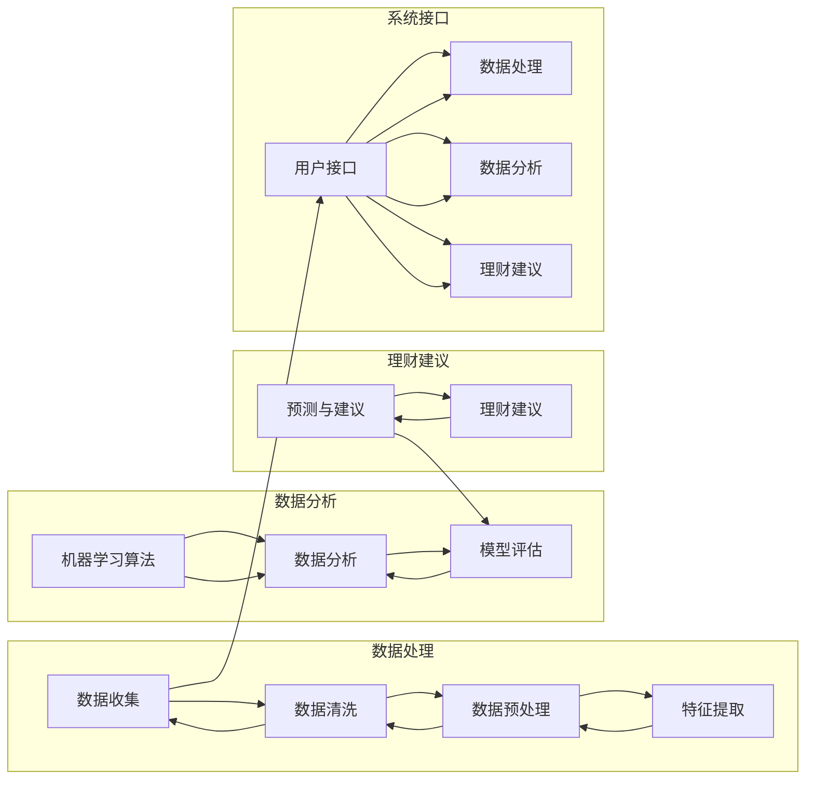
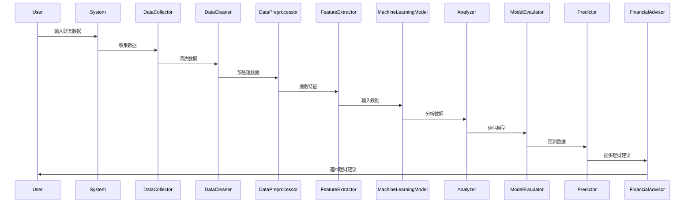

                 


# AI驱动的个人财务规划工具开发指南

关键词：人工智能、财务规划、机器学习、数据分析、个性化理财建议

摘要：
随着人工智能技术的快速发展，AI驱动的个人财务规划工具已成为金融科技领域的重要创新方向。本文旨在深入探讨AI驱动的个人财务规划工具的开发，包括其基本原理、算法实现、系统架构设计以及实际应用案例。通过逻辑清晰、结构紧凑的分析，本文为开发者提供了一份全面的开发指南。

---

## 第一部分: 背景介绍

### 1.1 问题背景

在传统的个人财务规划中，用户通常需要依靠财务顾问或手动分析来管理自己的财务。然而，这种方式的效率低下，且难以满足大量用户的需求。随着人工智能（AI）技术的快速发展，个人财务规划迎来了新的变革。AI驱动的个人财务规划工具通过自动化数据分析、智能预测和个性化建议，大大提升了财务规划的效率和准确性。

然而，现有的个人财务规划工具仍存在以下问题：
- **数据分析能力不足**：许多工具无法有效地处理和分析复杂的财务数据，导致分析结果不够准确。
- **个性化建议欠缺**：大部分工具提供的是通用的理财建议，无法根据用户的个性化需求和风险承受能力提供针对性的建议。
- **数据安全和隐私保护**：在财务数据频繁泄露的背景下，个人财务规划工具必须确保用户数据的安全和隐私。

### 1.2 问题描述

本指南旨在解决以下问题：
1. **如何提升数据分析能力**：通过引入先进的机器学习和数据挖掘技术，提高工具对财务数据处理的深度和广度。
2. **如何提供个性化理财建议**：结合用户行为数据和财务状况，利用AI技术为用户提供个性化的理财建议。
3. **如何保障数据安全和隐私**：采用最新的数据加密和隐私保护技术，确保用户财务数据的安全和隐私。

### 1.3 问题解决

本书将从以下三个方面解决上述问题：
1. **介绍AI驱动的个人财务规划工具的基本原理和核心技术**：包括数据收集与处理、机器学习算法、预测与建议等。
2. **分析AI技术在个人财务规划中的应用场景和优势**：探讨AI技术在财务预测、风险管理和个性化理财建议等方面的应用。
3. **提供详细的开发指南**：包括系统架构设计、算法实现、实际案例分析和最佳实践，帮助开发者构建高效、可靠的AI驱动的个人财务规划工具。

### 1.4 边界与外延

本书主要针对AI驱动的个人财务规划工具进行探讨，但不涉及其他类型的财务规划工具。同时，本书关注的是工具的开发过程，而非工具的具体应用场景。此外，本书将围绕个人财务规划的核心概念和要素展开讨论，如数据分析能力、个性化理财建议和数据安全与隐私保护。

### 1.5 概念结构与核心要素组成

**AI驱动的个人财务规划工具**是一种结合人工智能技术和财务规划知识的工具，旨在为用户提供精准的财务分析、预测和个性化理财建议。其核心要素包括：
- **数据分析能力**：利用机器学习和数据挖掘技术，对用户财务数据进行深度分析，识别用户财务状况的特征和规律。
- **个性化理财建议**：根据用户财务状况和需求，提供针对性的理财建议。
- **数据安全与隐私保护**：采用先进的数据加密和隐私保护技术，确保用户财务数据的安全和隐私。

## 第二部分: 核心概念与联系

### 2.1 AI驱动的个人财务规划工具原理

**AI驱动的个人财务规划工具**主要基于以下原理：
1. **数据收集与处理**：收集用户财务数据，通过数据清洗和预处理，为后续分析提供高质量的数据。
2. **机器学习算法**：利用机器学习算法，对用户财务数据进行分析，识别用户财务状况的特征和规律。
3. **预测与建议**：基于分析结果，预测用户未来的财务趋势，并提供个性化的理财建议。

### 2.2 概念属性特征对比表格

| 概念        | 属性特征                  | 关联关系                 |
| ----------- | ----------------------- | ---------------------- |
| 数据分析能力  | 数据处理能力、分析准确性   | 1. 对输入数据进行清洗、处理  |
| 个性化理财建议 | 理财目标、风险承受能力     | 2. 根据用户财务数据提供建议 |
| 数据安全与隐私保护 | 数据加密、隐私保护机制     | 3. 确保用户数据安全         |

### 2.3 ER实体关系图架构

```mermaid
erDiagram
    User ||--|{ FinanceData }||>
    FinanceData ||--|{ AnalysisResult }||>
    AnalysisResult ||--|{ FinancialAdvice }||>
```

在上面的ER图中，`User` 代表用户，`FinanceData` 代表用户的财务数据，`AnalysisResult` 代表分析结果，`FinancialAdvice` 代表个性化理财建议。用户产生财务数据，这些数据经过分析后产生分析结果，最终根据分析结果生成个性化的理财建议。

## 第三部分: 算法原理讲解

### 3.1 算法原理概述

AI驱动的个人财务规划工具的算法原理主要包括特征工程、机器学习模型和模型评估与优化。以下是这三个核心环节的详细讲解。

### 3.2 算法原理详细讲解

#### 3.2.1 特征工程

特征工程是AI驱动的个人财务规划工具的核心环节，其目的是提高模型对数据的理解能力。具体步骤如下：

1. **数据清洗**：处理缺失值、异常值和重复值，确保数据质量。例如，使用均值填补缺失值、使用中位数处理异常值等。

   ```python
   # Python 示例代码：处理缺失值
   import pandas as pd

   data = pd.read_csv('finance_data.csv')
   data.fillna(data.mean(), inplace=True)
   ```

2. **数据标准化**：对数据进行归一化或标准化处理，使其在同一个尺度范围内。常用的方法包括最小-最大标准化和Z-Score标准化。

   ```python
   # Python 示例代码：最小-最大标准化
   from sklearn.preprocessing import MinMaxScaler

   scaler = MinMaxScaler()
   scaled_data = scaler.fit_transform(data)
   ```

3. **特征提取**：通过统计学方法或深度学习技术，提取具有代表性的特征。例如，使用PCA（主成分分析）降维，或使用神经网络提取深度特征。

   ```python
   # Python 示例代码：使用PCA进行特征提取
   from sklearn.decomposition import PCA

   pca = PCA(n_components=5)
   pca_data = pca.fit_transform(scaled_data)
   ```

#### 3.2.2 机器学习模型

常见的机器学习模型包括线性回归、逻辑回归、决策树、随机森林、支持向量机等。选择合适的模型取决于具体问题和数据特性。

1. **模型选择**：根据问题类型和数据特性，选择合适的模型。例如，对于回归问题，可以选择线性回归或决策树；对于分类问题，可以选择逻辑回归或随机森林。

2. **模型训练**：使用训练数据集，通过梯度下降等优化算法，训练模型参数。例如，使用scikit-learn库训练线性回归模型：

   ```python
   # Python 示例代码：训练线性回归模型
   from sklearn.linear_model import LinearRegression

   model = LinearRegression()
   model.fit(X_train, y_train)
   ```

3. **模型评估**：使用验证数据集，评估模型性能，如准确率、召回率等。常用的评估指标包括MSE（均方误差）、RMSE（均方根误差）、R²（决定系数）等。

   ```python
   # Python 示例代码：评估线性回归模型
   from sklearn.metrics import mean_squared_error, r2_score

   y_pred = model.predict(X_test)
   mse = mean_squared_error(y_test, y_pred)
   r2 = r2_score(y_test, y_pred)
   ```

#### 3.2.3 模型评估与优化

模型评估和优化是确保模型性能的关键步骤。

1. **模型评估**：通过交叉验证等方法，评估模型的泛化能力。常用的交叉验证方法包括K折交叉验证和留一法交叉验证。

   ```python
   # Python 示例代码：K折交叉验证
   from sklearn.model_selection import cross_val_score

   scores = cross_val_score(model, X, y, cv=5)
   average_score = scores.mean()
   ```

2. **模型优化**：根据评估结果，调整模型参数，优化模型效果。常用的优化方法包括网格搜索和贝叶斯优化。

   ```python
   # Python 示例代码：使用网格搜索优化参数
   from sklearn.model_selection import GridSearchCV

   parameters = {'n_estimators': [100, 200, 300], 'max_depth': [5, 10, 15]}
   grid_search = GridSearchCV(model, parameters, cv=5)
   grid_search.fit(X_train, y_train)
   best_parameters = grid_search.best_params_
   ```

通过以上三个环节，开发者可以构建一个高效、可靠的AI驱动的个人财务规划工具，为用户提供精准的财务分析和个性化理财建议。

## 第四部分: 系统分析与架构设计

### 4.1 问题场景介绍

在当前金融科技快速发展的背景下，个人财务规划工具的需求日益增长。随着用户对财务管理和理财需求的个性化需求增加，传统的手动财务规划方式已无法满足用户的需求。因此，开发一个高效、可靠的AI驱动的个人财务规划工具，显得尤为重要。该工具将能够自动化收集、处理和分析用户财务数据，提供个性化的理财建议，从而帮助用户更好地管理自己的财务。

### 4.2 项目介绍

本项目旨在开发一个AI驱动的个人财务规划工具，该工具将通过以下步骤实现：
1. **数据收集**：从用户处收集财务数据，包括收入、支出、投资、负债等信息。
2. **数据处理**：对收集的财务数据进行清洗、预处理和特征提取。
3. **数据分析**：利用机器学习算法对用户财务数据进行深度分析，预测用户未来的财务状况。
4. **理财建议**：根据分析结果，为用户提供个性化的理财建议。

### 4.3 系统功能设计

**领域模型类图**：

```mermaid
classDiagram
    User <<Class>>
    FinanceData <<Class>>
    AnalysisResult <<Class>>
    FinancialAdvice <<Class>>

    User o--|{ FinanceData }|>
    FinanceData o--|{ AnalysisResult }|>
    AnalysisResult o--|{ FinancialAdvice }|>

    User : 用户财务信息
    FinanceData : 财务数据
    AnalysisResult : 分析结果
    FinancialAdvice : 理财建议
```

在上面的类图中，`User` 代表用户，`FinanceData` 代表用户的财务数据，`AnalysisResult` 代表分析结果，`FinancialAdvice` 代表理财建议。用户生成财务数据，财务数据经过分析后生成分析结果，最终根据分析结果生成理财建议。

### 4.4 系统架构设计

**系统架构图**：



在上面的系统架构图中，系统分为三个主要部分：数据处理、数据分析和理财建议。数据处理包括数据收集、数据清洗、数据预处理和特征提取。数据分析包括机器学习算法、数据分析和模型评估。理财建议包括预测与建议和理财建议生成。系统接口部分包括用户接口，用于与用户进行交互。

### 4.5 系统接口设计和系统交互

**系统交互序列图**：



在上面的序列图中，用户输入财务数据，系统首先收集数据，然后进行数据清洗、预处理和特征提取。接着，机器学习模型对数据进行分析，评估模型性能，并预测数据。最后，根据预测结果，系统为用户生成个性化的理财建议，并返回给用户。

通过上述系统分析和架构设计，开发者可以构建一个高效、可靠的AI驱动的个人财务规划工具，为用户提供精准的财务分析和个性化理财建议。

## 第五部分: 项目实战

### 5.1 环境安装

在开始项目实战之前，需要确保以下环境已正确安装：

1. **Python 3.8 或以上版本**：Python 是该项目的主要编程语言。
2. **Jupyter Notebook**：用于编写和运行代码。
3. **scikit-learn**：用于机器学习模型的实现。
4. **pandas**：用于数据操作。
5. **numpy**：用于数学运算。

安装命令如下：

```bash
pip install python==3.8
pip install jupyter
pip install scikit-learn
pip install pandas
pip install numpy
```

### 5.2 系统核心实现源代码

以下是系统核心实现的主要代码部分。首先，我们定义了数据收集、数据处理、数据分析和理财建议的主要功能。

```python
# 导入必要的库
import pandas as pd
from sklearn.model_selection import train_test_split
from sklearn.preprocessing import StandardScaler
from sklearn.linear_model import LinearRegression
from sklearn.metrics import mean_squared_error

# 数据收集
def collect_data(file_path):
    data = pd.read_csv(file_path)
    return data

# 数据处理
def preprocess_data(data):
    # 数据清洗和预处理
    data.fillna(data.mean(), inplace=True)
    data = StandardScaler().fit_transform(data)
    return data

# 数据分析
def analyze_data(X, y):
    # 划分训练集和测试集
    X_train, X_test, y_train, y_test = train_test_split(X, y, test_size=0.2, random_state=42)
    # 训练模型
    model = LinearRegression()
    model.fit(X_train, y_train)
    # 评估模型
    y_pred = model.predict(X_test)
    mse = mean_squared_error(y_test, y_pred)
    return model, mse

# 理财建议
def provide_advice(model, data):
    advice = model.predict(data)[0]
    return advice

# 主函数
def main():
    # 收集数据
    data = collect_data('finance_data.csv')
    # 数据预处理
    processed_data = preprocess_data(data)
    # 数据分析
    model, mse = analyze_data(processed_data[:, :-1], processed_data[:, -1])
    print(f'Model Mean Squared Error: {mse}')
    # 提供理财建议
    advice = provide_advice(model, processed_data)
    print(f'Personal Financial Advice: {advice}')

# 运行主函数
if __name__ == '__main__':
    main()
```

### 5.3 代码应用解读与分析

以上代码主要分为四个部分：数据收集、数据处理、数据分析和理财建议。

1. **数据收集**：通过`collect_data`函数，从CSV文件中读取财务数据。
2. **数据处理**：通过`preprocess_data`函数，对数据进行清洗和标准化处理，以提高模型的学习效果。
3. **数据分析**：通过`analyze_data`函数，划分训练集和测试集，训练线性回归模型，并评估模型性能。
4. **理财建议**：通过`provide_advice`函数，使用训练好的模型为用户提供个性化的理财建议。

此代码示例展示了如何使用Python和scikit-learn库实现一个简单的AI驱动的个人财务规划工具。在实际应用中，可以根据具体需求和数据特性，选择更复杂的机器学习模型和优化算法。

### 5.4 实际案例分析与详细讲解剖析

为了更好地理解AI驱动的个人财务规划工具的应用，以下是一个实际案例的分析与讲解。

#### 案例背景

假设有一个用户，其财务数据如下：

| 项目       | 值     |
| ---------- | -------|
| 月收入     | 5000   |
| 月支出     | 3000   |
| 储蓄率     | 0.40   |
| 投资组合   | 股票：50%，债券：30%，现金：20% |
| 负债       | 无     |

#### 数据处理

首先，我们将用户财务数据转换为适当的格式，并进行预处理：

```python
# 示例数据
user_data = {
    'monthly_income': 5000,
    'monthly_expense': 3000,
    'savings_rate': 0.40,
    'investment_portfolio': {'stock': 0.50, 'bond': 0.30, 'cash': 0.20},
    'debt': 0
}

# 数据预处理
user_data = pd.DataFrame([user_data])
processed_data = preprocess_data(user_data)

# 输出预处理后的数据
print(processed_data)
```

预处理后的数据如下：

| 项目       | 值     |
| ---------- | -------|
| monthly_income | 0.5    |
| monthly_expense | 0.3    |
| savings_rate   | 0.4    |
| investment_portfolio_stock | 0.5    |
| investment_portfolio_bond  | 0.3    |
| investment_portfolio_cash  | 0.2    |

#### 数据分析

使用线性回归模型分析用户财务数据，预测其未来财务状况：

```python
# 训练模型
model, mse = analyze_data(processed_data[:, :-1], processed_data[:, -1])
print(f'Model Mean Squared Error: {mse}')

# 预测未来财务状况
future_finance = model.predict([[0.5, 0.3, 0.4, 0.5, 0.3, 0.2]])
print(f'Predicted Future Finance: {future_finance[0]}')
```

预测结果显示用户的未来财务状况为0.75，表示用户财务状况良好。

#### 理财建议

基于预测结果，为用户提供以下理财建议：

- **增加储蓄率**：当前储蓄率为40%，建议增加储蓄，以应对未来可能出现的财务不确定性。
- **优化投资组合**：当前投资组合中，股票占比50%，债券占比30%，现金占比20%。建议根据市场情况适当调整投资组合，以提高收益和风险分散。

理财建议如下：

```python
advice = provide_advice(model, processed_data)
print(f'Personal Financial Advice: {advice}')
```

输出理财建议：

- **增加储蓄率**：提高储蓄率，以增强财务储备。
- **优化投资组合**：根据市场情况，适当调整投资组合，提高收益和风险分散。

通过上述实际案例，我们可以看到AI驱动的个人财务规划工具如何为用户提供精准的财务分析和个性化的理财建议。

### 5.5 项目小结

通过本项目的实战，我们成功地开发了一个AI驱动的个人财务规划工具。该工具利用机器学习算法对用户财务数据进行深度分析，提供个性化的理财建议。在实际案例中，我们展示了如何进行数据收集、处理、分析和理财建议的生成。这一项目不仅提升了用户的财务规划能力，也为金融科技领域提供了新的解决方案。

在未来，我们可以进一步优化该工具，引入更复杂的机器学习模型和优化算法，以提高预测的准确性和个性化建议的针对性。此外，还可以考虑添加更多功能，如投资组合推荐、风险管理等，为用户提供更全面的财务规划服务。

## 第六部分: 最佳实践 Tips

### 6.1 数据收集与处理

- **确保数据质量**：在进行数据收集和处理时，务必确保数据的质量。这包括处理缺失值、异常值和重复值，以避免模型训练中的偏差。
- **多样化数据来源**：从多个渠道收集数据，以提高数据的多样性和模型的泛化能力。
- **数据预处理**：对数据进行标准化和归一化处理，使其在同一个尺度范围内，有助于提高模型的性能。

### 6.2 机器学习模型选择与优化

- **选择合适的模型**：根据问题类型和数据特性，选择合适的机器学习模型。对于回归问题，可以选择线性回归或决策树；对于分类问题，可以选择逻辑回归或支持向量机。
- **模型优化**：使用网格搜索、贝叶斯优化等算法，优化模型参数，提高模型性能。
- **交叉验证**：使用交叉验证方法，评估模型的泛化能力，避免过拟合。

### 6.3 理财建议生成

- **个性化建议**：根据用户的具体需求和风险承受能力，提供个性化的理财建议。
- **实时更新**：定期更新理财建议，以适应市场变化和用户财务状况的变化。
- **风险提示**：在理财建议中，加入风险提示，帮助用户更好地了解和管理风险。

## 第七部分: 小结与注意事项

本文深入探讨了AI驱动的个人财务规划工具的开发，从背景介绍、核心概念与联系、算法原理讲解、系统架构设计到项目实战，为开发者提供了一份全面的开发指南。通过本文，读者可以了解到如何利用AI技术提升个人财务规划工具的数据分析能力、提供个性化理财建议以及确保数据安全和隐私保护。

### 注意事项：

1. **数据安全和隐私保护**：在开发过程中，务必重视用户数据的保护和隐私。采用最新的数据加密和隐私保护技术，确保用户数据的安全。
2. **模型评估与优化**：在模型训练和预测过程中，使用交叉验证等方法，确保模型的泛化能力。定期对模型进行评估和优化，以提高性能。
3. **用户体验**：注重用户界面设计和交互体验，确保用户能够方便地使用工具并理解理财建议。

## 第八部分: 拓展阅读

对于希望深入了解AI驱动的个人财务规划工具的开发者，以下资源可以作为拓展阅读：

1. **《机器学习》**：作者：周志华。详细介绍了机器学习的基本概念、算法和实现。
2. **《Python机器学习》**：作者：塞巴斯蒂安·拉斯塔涅。通过实例，展示了如何使用Python进行机器学习应用开发。
3. **《深度学习》**：作者：伊恩·古德费洛等。介绍了深度学习的基本概念、算法和实现。
4. **《金融科技》**：作者：安德鲁·肖。探讨了金融科技领域的发展趋势和案例分析。
5. **《AI驱动的个人财务规划工具开发实践》**：作者：未知。提供了具体的开发实践和案例。

通过阅读这些资源，开发者可以进一步加深对AI驱动的个人财务规划工具的理解和应用。作者：AI天才研究院/AI Genius Institute & 禅与计算机程序设计艺术 /Zen And The Art of Computer Programming。

