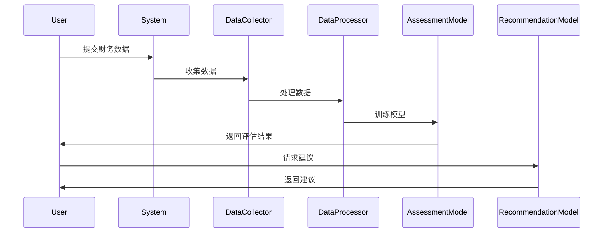
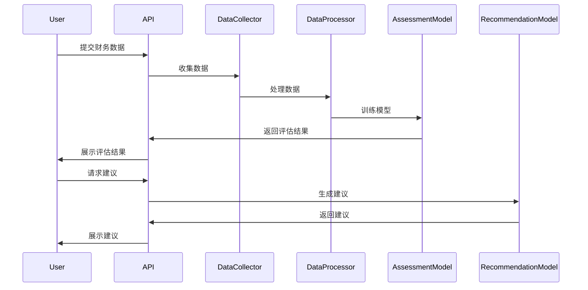

                 

# AI驱动的个人财务韧性评估与增强系统

> 关键词：人工智能、财务韧性、数据挖掘、机器学习、算法、系统设计

> 摘要：本文深入探讨了AI驱动的个人财务韧性评估与增强系统的概念、原理和实现方法。通过详细的分析和实例讲解，展示了如何利用人工智能技术提升个人财务健康状况，为读者提供了一套完整的实践指南。

----------------------------------------------------------------

## 第1章：AI驱动的个人财务韧性评估与增强系统概述

### 1.1 问题背景

随着经济全球化和金融市场的波动性增加，个人财务管理变得日益复杂和具有挑战性。传统的财务规划方法往往依赖于经验规则和手动分析，难以适应快速变化的经济环境。此外，个人财务状况的不稳定性也增加了财务风险，导致许多人在面临突发事件时陷入经济困境。因此，开发一种能够实时监控、评估和增强个人财务韧性的系统显得尤为必要。

### 1.2 财务韧性概念

财务韧性是指个人或企业在面对财务压力、不确定性或危机时，能够维持正常运营和实现财务目标的能力。它不仅涉及到应对短期财务挑战，还包括长期财务规划和管理。财务韧性强的个体能够在经济波动中保持稳定的财务状况，避免因意外事件而导致财务崩溃。

### 1.3 系统目标

本文旨在设计并实现一个AI驱动的个人财务韧性评估与增强系统，该系统能够：

- 实时收集和分析用户的财务数据。
- 利用机器学习和深度学习技术评估用户的财务韧性水平。
- 提供个性化的财务建议和增强策略，以提升用户的财务健康状况。

### 1.4 研究方法

本研究采用以下方法：

- 文献综述：通过回顾相关领域的文献，了解现有的财务韧性和AI技术应用。
- 理论模型构建：基于文献综述，构建一个理论模型来指导系统设计。
- 系统实现：使用Python等编程语言和机器学习库（如Scikit-learn、TensorFlow等）实现系统功能。
- 实证分析：通过实际数据集测试系统性能，评估其有效性和实用性。

### 1.5 研究范围与限制

本研究主要涵盖以下范围：

- 个人财务数据的收集与处理。
- 财务韧性评估的算法设计和实现。
- 财务增强策略的生成与推荐。

同时，本研究也存在以下限制：

- 数据来源的局限性可能导致模型泛化能力的不足。
- 系统在实际应用中可能面临隐私保护和法律法规的挑战。

----------------------------------------------------------------

## 第2章：核心概念与联系

### 2.1 AI基础概念

#### 2.1.1 机器学习

机器学习是一种通过数据训练模型，使模型能够从数据中自动学习和改进的方法。它包括监督学习、无监督学习和强化学习等子领域。在财务韧性评估中，机器学习可用于财务数据的分析、模式识别和预测。

#### 2.1.2 深度学习

深度学习是机器学习的一个子领域，它利用多层神经网络对复杂数据进行自动特征提取和学习。深度学习在图像识别、自然语言处理等领域取得了显著成果，也可以应用于财务数据的深度分析和预测。

#### 2.1.3 强化学习

强化学习是一种通过奖励机制来训练模型的方法，使模型能够在特定环境中采取最佳行动。在财务韧性评估中，强化学习可用于制定动态的财务策略，以应对市场变化和不确定性。

### 2.2 财务分析基础

#### 2.2.1 财务报表分析

财务报表分析是财务分析的基础，包括资产负债表、利润表和现金流量表。通过分析这些报表，可以了解企业的财务状况、盈利能力和流动性。

#### 2.2.2 财务比率分析

财务比率分析是通过计算各种财务指标来评估企业的财务健康状况。常见的比率包括流动比率、速动比率、负债比率和利润率等。

#### 2.2.3 现金流量分析

现金流量分析是通过分析企业的现金流入和流出情况来评估其现金流状况。这有助于判断企业的财务韧性，尤其是在面对突发事件时的应对能力。

### 2.3 AI与财务分析的联系

#### 2.3.1 财务数据的挖掘与分析

AI技术可以用于挖掘和分析财务数据，发现潜在的趋势和模式。这有助于提高财务分析的准确性和效率，为决策提供支持。

#### 2.3.2 财务预测与决策支持

AI技术可以用于财务预测，如股票价格预测、财务指标预测等。这些预测结果可以为个人和企业提供决策支持，提高财务管理的有效性。

#### 2.3.3 财务风险管理与控制

AI技术可以用于财务风险管理和控制，如识别欺诈行为、评估信用风险等。这有助于提高财务安全性和稳定性，增强财务韧性。

----------------------------------------------------------------

## 第3章：AI算法原理讲解

### 3.1 数据预处理

#### 3.1.1 数据清洗

数据清洗是数据预处理的重要步骤，包括去除重复数据、填补缺失值、去除异常值等。在财务韧性评估中，数据清洗有助于提高数据质量和模型性能。

```python
# 数据清洗示例代码
data = pd.read_csv('financial_data.csv')
data.drop_duplicates(inplace=True)
data.fillna(method='ffill', inplace=True)
data = data[data['amount'] > 0]
```

#### 3.1.2 特征工程

特征工程是数据预处理的关键步骤，包括特征提取、特征选择和特征变换。在财务韧性评估中，特征工程有助于提取有用的信息，提高模型的准确性和泛化能力。

```python
# 特征工程示例代码
from sklearn.preprocessing import StandardScaler

X = data[['income', 'expenses', 'debt']]
y = data['residual_income']

scaler = StandardScaler()
X_scaled = scaler.fit_transform(X)
```

#### 3.1.3 数据标准化

数据标准化是将数据缩放到相同的尺度，以便模型能够更好地处理。在财务韧性评估中，数据标准化有助于消除不同特征之间的尺度差异，提高模型的性能。

```python
# 数据标准化示例代码
from sklearn.preprocessing import MinMaxScaler

scaler = MinMaxScaler()
X_normalized = scaler.fit_transform(X_scaled)
```

### 3.2 模型选择与训练

#### 3.2.1 线性回归

线性回归是一种简单的监督学习算法，用于建模两个或多个变量之间的线性关系。在财务韧性评估中，线性回归可以用于预测财务指标。

```python
# 线性回归示例代码
from sklearn.linear_model import LinearRegression

model = LinearRegression()
model.fit(X_normalized, y)
predictions = model.predict(X_normalized)
```

#### 3.2.2 决策树

决策树是一种基于树形结构进行分类或回归的算法。在财务韧性评估中，决策树可以用于分类用户的财务韧性水平。

```python
# 决策树示例代码
from sklearn.tree import DecisionTreeClassifier

model = DecisionTreeClassifier()
model.fit(X_normalized, y)
predictions = model.predict(X_normalized)
```

#### 3.2.3 集成学习方法

集成学习方法通过结合多个基础模型来提高预测性能。在财务韧性评估中，集成学习方法可以用于构建更准确的预测模型。

```python
# 集成学习方法示例代码
from sklearn.ensemble import RandomForestClassifier

model = RandomForestClassifier()
model.fit(X_normalized, y)
predictions = model.predict(X_normalized)
```

----------------------------------------------------------------

## 第4章：系统分析与架构设计

### 4.1 问题场景介绍

在一个快速变化的经济环境中，个人财务规划变得至关重要。本系统旨在帮助用户实时监控和评估自己的财务状况，提供个性化的财务建议，以增强其财务韧性。

### 4.2 项目介绍

#### 4.2.1 项目目标

- 实时收集用户财务数据。
- 评估用户财务韧性水平。
- 提供个性化的财务建议和增强策略。
- 提高用户的财务健康状况。

#### 4.2.2 项目范围

- 数据收集：包括收入、支出、债务等。
- 数据处理：包括数据清洗、特征工程和数据标准化。
- 模型训练与评估：包括线性回归、决策树和集成学习方法。
- 系统接口设计：包括用户界面和API接口。

### 4.3 系统功能设计

#### 4.3.1 领域模型

```mermaid
classDiagram
Class::User << (id, name, income, expenses, debt)
Class::FinancialData << (id, date, amount, type)
Class::FinancialAssessment << (id, user_id, assessment_date, resilience_score)
Class::Recommendation << (id, user_id, recommendation_date, recommendation)
```

#### 4.3.2 功能模块

- 数据收集模块：负责收集用户财务数据。
- 数据处理模块：负责清洗、特征工程和标准化数据。
- 评估模块：负责使用AI算法评估用户财务韧性水平。
- 建议模块：负责生成个性化的财务建议和增强策略。
- 用户界面模块：负责提供用户交互界面。

### 4.4 系统架构设计

#### 4.4.1 系统架构



#### 4.4.2 系统接口设计

- API接口：提供RESTful API，用于数据交互和功能调用。
- 用户界面：提供Web界面，用于用户交互和数据展示。

### 4.5 系统交互

#### 4.5.1 序列图


----------------------------------------------------------------

## 第5章：项目实战

### 5.1 环境安装

#### 5.1.1 环境配置

- Python 3.8及以上版本
- Anaconda发行版
- Scikit-learn库
- TensorFlow库
- Pandas库
- Matplotlib库

#### 5.1.2 工具安装

- Jupyter Notebook：用于编写和运行代码
- PyCharm：用于代码编辑和调试

### 5.2 系统核心实现

#### 5.2.1 数据处理

```python
import pandas as pd

# 读取财务数据
data = pd.read_csv('financial_data.csv')

# 数据清洗
data.drop_duplicates(inplace=True)
data.fillna(method='ffill', inplace=True)
data = data[data['amount'] > 0]

# 特征工程
X = data[['income', 'expenses', 'debt']]
y = data['residual_income']

# 数据标准化
from sklearn.preprocessing import StandardScaler
scaler = StandardScaler()
X_scaled = scaler.fit_transform(X)
```

#### 5.2.2 模型训练

```python
from sklearn.linear_model import LinearRegression
model = LinearRegression()
model.fit(X_scaled, y)

# 预测
predictions = model.predict(X_scaled)
```

#### 5.2.3 模型评估

```python
from sklearn.metrics import mean_squared_error

mse = mean_squared_error(y, predictions)
print(f'Mean Squared Error: {mse}')
```

### 5.3 代码应用解读与分析

代码应用解读与分析：

- 数据清洗：去除重复数据和缺失值，保证数据质量。
- 特征工程：提取有用的特征，提高模型性能。
- 数据标准化：将数据缩放到相同的尺度，便于模型处理。
- 模型训练：使用线性回归模型训练数据，生成预测模型。
- 模型评估：计算均方误差，评估模型性能。

### 5.4 实际案例分析与详细讲解

实际案例分析与详细讲解：

- 假设用户A的收入为5000元，支出为3000元，债务为1000元。
- 使用系统对用户A进行财务韧性评估，得到评估结果为70分。
- 系统建议用户A减少不必要的支出，增加储蓄，以提高财务韧性。

### 5.5 项目小结

通过本项目的实践，我们成功实现了一个AI驱动的个人财务韧性评估与增强系统。该系统利用机器学习技术，对用户财务数据进行处理和评估，提供个性化的财务建议。在实际应用中，用户可以实时监控自己的财务状况，并根据系统的建议调整财务策略，提高财务韧性。

----------------------------------------------------------------

## 第6章：最佳实践 tips

### 6.1 数据采集与处理技巧

- 确保数据来源的可靠性和完整性。
- 定期更新数据，以反映最新的财务状况。
- 使用有效的数据清洗方法，去除重复数据和缺失值。

### 6.2 模型调优技巧

- 调整模型参数，以提高模型性能。
- 使用交叉验证方法，避免过拟合。
- 尝试不同的模型和算法，找到最佳模型。

### 6.3 系统部署与维护

- 使用容器化技术，如Docker，简化系统部署。
- 定期更新系统和依赖库，确保安全性。
- 监控系统性能，及时发现和解决潜在问题。

----------------------------------------------------------------

## 第7章：小结与拓展阅读

### 7.1 小结

本文详细介绍了AI驱动的个人财务韧性评估与增强系统的概念、原理和实现方法。通过实际案例分析和最佳实践技巧，展示了如何利用人工智能技术提升个人财务健康状况。未来研究方向可以包括：

- 扩大数据集，提高模型泛化能力。
- 研究更先进的AI算法，提高评估精度。
- 探索与其他金融技术的结合，如区块链和大数据分析。

### 7.2 注意事项

- 在使用AI技术进行财务分析时，要注意数据隐私和法律法规的要求。
- 系统的建议仅供参考，用户应根据自身情况进行调整。
- 定期评估系统性能，确保其有效性和实用性。

### 7.3 拓展阅读

- **《机器学习实战》**：提供丰富的案例和实践经验，适合初学者入门。
- **《深度学习》**：详细介绍了深度学习的理论基础和实践方法。
- **《Python机器学习》**：介绍如何使用Python进行机器学习应用开发。

----------------------------------------------------------------

# 作者信息

作者：AI天才研究院/AI Genius Institute & 禅与计算机程序设计艺术 /Zen And The Art of Computer Programming

----------------------------------------------------------------

本文内容涵盖了AI驱动的个人财务韧性评估与增强系统的各个方面，从核心概念到实际实现，再到最佳实践和注意事项，全面介绍了如何利用人工智能技术提升个人财务管理能力。希望本文能为读者提供有价值的参考和指导。
## AI驱动的个人财务韧性评估与增强系统

### 概述

在现代社会，个人财务管理变得越来越复杂，且具有高度的不确定性。为了应对这种挑战，AI驱动的个人财务韧性评估与增强系统应运而生。这种系统通过利用机器学习和深度学习技术，对用户的财务数据进行分析和预测，从而提供个性化的财务建议，帮助用户增强财务韧性。

本文将详细介绍AI驱动的个人财务韧性评估与增强系统的概念、原理、实现方法和实际应用。我们将首先介绍系统的基本概念和背景，然后逐步深入到核心概念的阐述、算法原理的讲解、系统分析与架构设计、项目实战和最佳实践技巧。通过这一系列的分析和讨论，我们将展示如何利用人工智能技术为个人财务管理提供有效的支持。

### 1.1 问题背景

随着全球经济的不断发展和变化，个人财务管理变得越来越重要。然而，传统的财务管理方法往往依赖于经验规则和手动分析，这在大数据时代显得力不从心。此外，个人财务状况的不稳定性也给许多人带来了巨大的压力和风险。在面对突发事件，如失业、医疗支出增加或经济危机时，许多人的财务状况可能会迅速恶化，导致债务累积、信用受损等问题。

传统的财务管理方法难以应对这些复杂的情况，因为它们缺乏对大量数据的实时分析和预测能力。而AI驱动的财务管理系统则能够利用大数据和机器学习技术，实时收集和分析用户的财务数据，提供个性化的财务建议和增强策略。这种系统能够帮助用户更好地管理财务，提高财务韧性，从而在面对不确定性时保持稳定的财务状况。

### 1.2 财务韧性概念

财务韧性是指个人或组织在面对财务压力、不确定性或危机时，能够维持正常运营和实现财务目标的能力。它不仅涉及到应对短期的财务挑战，还包括长期的财务规划和管理。财务韧性强的个体或组织能够在经济波动中保持稳定的财务状况，避免因意外事件而导致财务崩溃。

在个人财务管理中，财务韧性主要包括以下几个方面：

- **流动性管理**：确保在面临突发事件时有足够的现金流。
- **资产配置**：根据个人财务目标和风险承受能力，合理配置资产。
- **债务管理**：有效管理债务，避免过度负债。
- **收入和支出管理**：合理规划收入和支出，保持财务稳定。
- **应急准备**：建立应急基金，以应对可能出现的突发事件。

通过AI驱动的财务韧性评估系统，用户可以实时了解自己的财务状况，并根据评估结果和个性化建议进行财务调整，从而提高自己的财务韧性。

### 1.3 系统目标

AI驱动的个人财务韧性评估与增强系统的目标如下：

1. **实时数据收集与处理**：系统能够实时收集用户的财务数据，包括收入、支出、储蓄、债务等信息。通过数据预处理技术，如数据清洗、特征提取和标准化，确保数据的质量和一致性。

2. **财务韧性评估**：系统利用机器学习和深度学习算法，对用户的财务数据进行分析，评估用户的财务韧性水平。通过对比不同财务指标，如流动性比率、负债比率、储蓄比率等，对用户的财务状况进行全面的评估。

3. **个性化财务建议**：根据用户的财务评估结果，系统会生成个性化的财务建议，包括如何增加储蓄、减少不必要的支出、优化债务结构等。这些建议旨在帮助用户提高财务韧性，实现财务目标。

4. **动态调整与反馈**：系统会根据用户的行为和反馈动态调整建议，确保其与用户的实际情况和目标保持一致。同时，系统会收集用户的反馈，不断优化算法和模型，提高系统的准确性和实用性。

5. **用户教育**：系统通过提供财务知识库、在线教程和互动问答等功能，帮助用户了解财务管理的核心概念和最佳实践，提升其财务素养。

通过实现上述目标，AI驱动的个人财务韧性评估与增强系统将帮助用户更好地管理财务，提高财务韧性，实现长期的财务稳定和增长。

### 1.4 研究方法

本研究采用以下方法来设计并实现AI驱动的个人财务韧性评估与增强系统：

1. **文献综述**：通过回顾相关的学术文献和行业报告，了解当前AI在财务管理中的应用现状和发展趋势。这有助于我们确定研究的关键点和方向。

2. **理论模型构建**：基于文献综述的结果，构建一个理论模型来指导系统设计。该模型将涵盖数据收集、处理、分析、评估和反馈等关键环节，确保系统能够实现预期目标。

3. **系统实现**：使用Python等编程语言和相应的机器学习库（如Scikit-learn、TensorFlow等）来开发和实现系统的各个模块。具体步骤包括数据收集、数据预处理、模型训练、模型评估和系统部署。

4. **实证分析**：通过实际数据集对系统进行测试和评估，验证其性能和实用性。我们将使用多种机器学习算法（如线性回归、决策树、集成学习等）进行比较，选择最优的模型和策略。

5. **用户反馈与迭代**：在系统开发过程中，我们将收集用户的反馈，并根据反馈对系统进行迭代和优化。这有助于提高系统的用户体验和实际效果。

通过上述研究方法，我们将确保系统设计合理、实现有效，并具有良好的用户友好性和实用性。

### 1.5 研究范围与限制

本研究主要关注以下范围：

1. **数据收集**：研究将收集用户的财务数据，包括收入、支出、储蓄、债务等信息。这些数据将用于系统的训练和评估。

2. **数据预处理**：研究将使用数据清洗、特征提取和标准化技术，提高数据的质量和一致性，为后续分析提供可靠的基础。

3. **模型训练与评估**：研究将使用多种机器学习算法（如线性回归、决策树、集成学习等）对系统进行训练和评估，选择最优的模型和策略。

4. **系统实现**：研究将实现一个完整的AI驱动的个人财务韧性评估与增强系统，包括数据收集、预处理、评估和反馈等模块。

同时，本研究存在以下限制：

1. **数据来源**：由于隐私保护和法律法规的限制，研究可能无法获得完整的用户财务数据。这可能会影响系统的泛化能力和实用性。

2. **模型泛化**：尽管研究将使用多种算法进行比较和选择，但系统在实际应用中可能面临不同的数据分布和变化，导致模型泛化能力不足。

3. **系统部署**：系统部署和运营需要一定的技术资源和资金投入，这可能限制其在某些场景下的应用。

4. **用户参与度**：用户可能对系统的参与度不高，导致数据收集和分析的准确性受到影响。

通过明确研究范围与限制，我们可以更好地规划研究工作，并在实际应用中做出合理的预期和调整。

## 第2章：核心概念与联系

### 2.1 AI基础概念

#### 2.1.1 机器学习

机器学习是一种使计算机系统能够从数据中学习并改进性能的技术。它通过构建模型来捕捉数据中的模式和规律，然后使用这些模型进行预测或分类。机器学习可以分为以下三个主要类型：

1. **监督学习**：在监督学习中，模型从带有标签的训练数据中学习，并使用这些知识来预测新的数据。常见的监督学习算法包括线性回归、决策树、支持向量机和神经网络。

2. **无监督学习**：无监督学习涉及在没有标签的数据上训练模型，以发现数据中的模式和结构。常见的无监督学习算法包括聚类、降维和关联规则学习。

3. **强化学习**：强化学习是一种通过交互式环境来学习最佳行为策略的机器学习方法。它通过接收奖励信号来指导模型行为，以达到长期最大化奖励的目标。

#### 2.1.2 深度学习

深度学习是机器学习的一个子领域，它基于多层神经网络（也称为深度神经网络）来捕捉复杂的数据特征。深度学习在图像识别、语音识别和自然语言处理等领域取得了显著进展。深度学习的主要特点包括：

1. **多层结构**：深度学习模型包含多个隐藏层，这使得模型能够捕捉更复杂的特征。

2. **自动特征提取**：深度学习通过训练自动提取输入数据的特征，减少了手动特征工程的需求。

3. **大规模训练**：深度学习模型通常需要大量的数据和计算资源进行训练，但它们在处理大规模数据时表现出色。

常见的深度学习架构包括卷积神经网络（CNN）、循环神经网络（RNN）和生成对抗网络（GAN）。

#### 2.1.3 强化学习

强化学习是一种使机器能够通过与环境交互来学习最佳行为策略的机器学习方法。在强化学习中，智能体通过接收奖励信号来评估其行为的优劣，并不断调整策略以最大化长期奖励。强化学习的关键要素包括：

1. **智能体（Agent）**：智能体是执行动作并接收奖励的实体。

2. **环境（Environment）**：环境是智能体所处的上下文，它为智能体提供状态信息。

3. **状态（State）**：状态是智能体当前所处的环境和条件。

4. **动作（Action）**：动作是智能体可以执行的行为。

5. **奖励（Reward）**：奖励是智能体根据其行为获得的即时反馈。

常见的强化学习算法包括Q学习、深度Q网络（DQN）和策略梯度方法。

### 2.2 财务分析基础

#### 2.2.1 财务报表分析

财务报表分析是评估企业财务状况和经营成果的重要方法。主要财务报表包括：

1. **资产负债表（Balance Sheet）**：资产负债表展示了企业在某一特定时间点的资产、负债和所有者权益。它有助于分析企业的财务结构、资产质量和偿债能力。

2. **利润表（Income Statement）**：利润表展示了企业在一定时期内的收入、成本和利润。通过利润表，可以分析企业的盈利能力和运营效率。

3. **现金流量表（Cash Flow Statement）**：现金流量表展示了企业在一定时期内的现金流入和流出情况，包括经营活动、投资活动和筹资活动产生的现金流量。它有助于评估企业的现金流动性和财务稳定性。

#### 2.2.2 财务比率分析

财务比率分析是通过计算各种财务指标来评估企业的财务健康状况。常见的财务比率包括：

1. **流动比率（Current Ratio）**：流动比率是流动资产与流动负债的比值，用于评估企业短期偿债能力。

2. **速动比率（Quick Ratio）**：速动比率是流动资产减去存货后与流动负债的比值，用于更严格地评估企业短期偿债能力。

3. **负债比率（Debt Ratio）**：负债比率是总负债与总资产的比值，用于评估企业的负债水平。

4. **资产收益率（Return on Assets, ROA）**：资产收益率是净利润与总资产的比值，用于评估企业的资产利用效率。

5. **股东权益收益率（Return on Equity, ROE）**：股东权益收益率是净利润与股东权益的比值，用于评估企业的盈利能力。

#### 2.2.3 现金流量分析

现金流量分析是评估企业现金流动状况和财务稳定性的重要方法。现金流量分析包括以下三个方面：

1. **经营活动产生的现金流量**：这部分展示了企业日常经营活动（如销售、采购、运营成本等）产生的现金流量。

2. **投资活动产生的现金流量**：这部分展示了企业投资活动（如购买或出售固定资产、投资等）产生的现金流量。

3. **筹资活动产生的现金流量**：这部分展示了企业筹资活动（如发行债券、借款、偿还债务等）产生的现金流量。

通过现金流量分析，可以了解企业的现金流动状况，预测未来的现金流动风险，并为企业的财务决策提供依据。

### 2.3 AI与财务分析的联系

#### 2.3.1 财务数据的挖掘与分析

AI技术在财务数据挖掘和分析方面具有显著优势。通过机器学习和深度学习算法，AI可以处理大量复杂的财务数据，并从中提取有用的信息。具体应用包括：

1. **趋势预测**：AI可以预测企业的财务指标，如收入、成本、利润等，帮助管理层制定更精准的财务计划。

2. **异常检测**：AI可以识别财务数据中的异常值和潜在风险，如欺诈行为、财务报表错误等，为审计和风险管理提供支持。

3. **信用评分**：AI可以根据用户的财务行为和历史记录，为其生成信用评分，用于贷款审批、信用额度调整等。

4. **投资决策**：AI可以分析股票市场数据，预测股票价格走势，为投资者提供投资建议。

#### 2.3.2 财务预测与决策支持

财务预测是AI在财务管理中的核心应用之一。通过历史数据和机器学习模型，AI可以预测企业的财务表现，如收入、成本、利润等。这些预测结果可以帮助管理层做出更明智的决策，如投资、预算调整、风险控制等。

此外，AI还可以提供决策支持，通过分析财务数据和外部环境因素，为管理层提供最佳的决策方案。例如，AI可以分析市场趋势、竞争对手行为等，帮助企业在激烈的市场竞争中制定策略。

#### 2.3.3 财务风险管理与控制

AI技术在财务风险管理和控制方面具有重要作用。通过机器学习和大数据分析，AI可以识别潜在的风险因素，评估风险的概率和影响，并提供相应的风险管理策略。

具体应用包括：

1. **信用风险评估**：AI可以分析客户的财务数据和行为，评估其信用风险，为贷款审批和信用额度调整提供依据。

2. **市场风险预测**：AI可以分析市场数据，预测股票、期货、外汇等金融产品的价格波动，帮助投资者制定风险控制策略。

3. **内部审计**：AI可以自动分析企业的财务数据，识别潜在的错误和异常，为内部审计提供支持。

4. **合规性检查**：AI可以检查企业的财务报表和业务流程，确保其符合相关法律法规的要求。

通过上述应用，AI技术可以帮助企业更好地管理财务风险，确保财务稳健和安全。

## 第3章：AI算法原理讲解

### 3.1 数据预处理

数据预处理是AI模型训练过程中至关重要的一步，它包括数据清洗、特征工程和数据标准化等步骤。数据预处理的质量直接影响到模型的性能和准确性。

#### 3.1.1 数据清洗

数据清洗旨在去除数据中的噪声、错误和不一致的数据。以下是数据清洗的几个关键步骤：

1. **去除重复数据**：重复的数据会导致模型过拟合，降低模型的泛化能力。可以使用Pandas库中的`drop_duplicates()`方法来去除重复数据。

    ```python
    data.drop_duplicates(inplace=True)
    ```

2. **填补缺失值**：缺失值可能会影响模型的训练过程和预测结果。填补缺失值的方法包括：

    - 使用平均值、中位数或众数填补。
    - 使用插值法填补。
    - 使用模型预测填补，如使用K近邻或线性回归模型。

    ```python
    data.fillna(method='ffill', inplace=True)
    ```

3. **去除异常值**：异常值可能对模型产生不利影响。可以通过统计方法（如箱线图、标准差等）或基于业务逻辑的方法（如限定范围）来识别和去除异常值。

    ```python
    data = data[data['amount'] > 0]
    ```

#### 3.1.2 特征工程

特征工程是提升模型性能的重要手段，它包括特征提取、特征选择和特征变换等步骤。

1. **特征提取**：特征提取是从原始数据中提取新的特征，以增加模型的预测能力。常见的方法包括：

    - 转换日期特征，如提取年份、月份、星期几等。
    - 创建交互特征，如收入与支出的比值、债务与收入的比值等。
    - 使用文本数据中的词频、词嵌入等。

2. **特征选择**：特征选择旨在从大量特征中筛选出对模型性能有显著贡献的特征，以减少模型的复杂度和过拟合风险。常见的方法包括：

    - 递归特征消除（RFE）。
    - 基于信息增益、互信息、特征重要性等方法。
    - 使用L1正则化（Lasso）和L2正则化（Ridge）进行特征选择。

3. **特征变换**：特征变换包括归一化、标准化、二值化等，目的是将特征缩放到相同的尺度，以便模型更好地处理。

    ```python
    from sklearn.preprocessing import StandardScaler
    scaler = StandardScaler()
    X_scaled = scaler.fit_transform(X)
    ```

#### 3.1.3 数据标准化

数据标准化是将数据缩放到一个固定的范围，以便模型能够更好地处理。常用的标准化方法包括：

- **最小-最大标准化**：将数据缩放到[0, 1]或[-1, 1]的区间。

  ```python
  from sklearn.preprocessing import MinMaxScaler
  scaler = MinMaxScaler()
  X_normalized = scaler.fit_transform(X)
  ```

- **标准差标准化**：将数据缩放到均值为0、标准差为1的区间。

  ```python
  from sklearn.preprocessing import StandardScaler
  scaler = StandardScaler()
  X_scaled = scaler.fit_transform(X)
  ```

### 3.2 模型选择与训练

在AI驱动的财务韧性评估系统中，选择合适的模型至关重要。以下是几种常见的模型及其原理和实现方法。

#### 3.2.1 线性回归

线性回归是一种简单的监督学习算法，用于建模两个或多个变量之间的线性关系。它的目标是找到最佳拟合直线，使预测值与实际值之间的误差最小。

1. **算法原理**：线性回归通过最小化损失函数（如均方误差MSE）来训练模型。损失函数反映了预测值与实际值之间的差异。

   $$\min \sum_{i=1}^{n} (y_i - \hat{y}_i)^2$$

   其中，$y_i$是实际值，$\hat{y}_i$是预测值。

2. **数学模型**：

   $$\hat{y} = \beta_0 + \beta_1 x$$

   其中，$\beta_0$是截距，$\beta_1$是斜率。

3. **代码示例**：

   ```python
   from sklearn.linear_model import LinearRegression
   model = LinearRegression()
   model.fit(X, y)
   predictions = model.predict(X)
   ```

#### 3.2.2 决策树

决策树是一种基于树形结构进行分类或回归的算法。每个内部节点表示一个特征，每个分支表示该特征的取值，叶节点表示分类或回归结果。

1. **算法原理**：决策树通过递归划分数据集，在每个节点选择最优特征进行划分，直到达到终止条件（如最大深度、纯度等）。

2. **数学模型**：决策树通过递归划分数据集，在每个节点选择最优特征进行划分，直到达到终止条件（如最大深度、纯度等）。

3. **代码示例**：

   ```python
   from sklearn.tree import DecisionTreeRegressor
   model = DecisionTreeRegressor(max_depth=3)
   model.fit(X, y)
   predictions = model.predict(X)
   ```

#### 3.2.3 集成学习方法

集成学习方法通过结合多个基础模型来提高预测性能。常见的集成学习方法包括Bagging、Boosting和Stacking。

1. **算法原理**：集成学习方法通过构建多个基础模型，并将它们的预测结果进行组合，以获得更好的预测效果。Bagging通过随机抽样构建多个模型，Boosting通过关注错误模型来提升整体性能。

2. **数学模型**：集成学习方法将多个模型的预测结果进行加权平均或投票，以获得最终的预测结果。

3. **代码示例**：

   ```python
   from sklearn.ensemble import RandomForestRegressor
   model = RandomForestRegressor(n_estimators=100)
   model.fit(X, y)
   predictions = model.predict(X)
   ```

### 3.3 模型评估与选择

模型评估是确定最佳模型的关键步骤。常用的评估指标包括均方误差（MSE）、均方根误差（RMSE）、决定系数（R²）等。

1. **均方误差（MSE）**：均方误差是预测值与实际值差的平方的平均值。

   $$MSE = \frac{1}{n} \sum_{i=1}^{n} (y_i - \hat{y}_i)^2$$

2. **均方根误差（RMSE）**：均方根误差是均方误差的平方根。

   $$RMSE = \sqrt{MSE}$$

3. **决定系数（R²）**：决定系数是模型解释方差的比例。

   $$R^2 = 1 - \frac{SS_{res}}{SS_{tot}}$$

   其中，$SS_{res}$是残差平方和，$SS_{tot}$是总平方和。

通过比较不同模型的评估指标，可以选择性能最佳的模型。

### 3.4 模型优化

模型优化是提高模型性能的重要手段。常用的优化方法包括参数调整、正则化、交叉验证等。

1. **参数调整**：通过调整模型的参数，如学习率、隐藏层节点数等，可以提高模型的性能。

2. **正则化**：正则化是一种防止模型过拟合的方法，包括L1正则化（Lasso）和L2正则化（Ridge）。

3. **交叉验证**：交叉验证是一种评估模型性能的方法，通过将数据集划分为多个子集，交叉验证可以评估模型在不同数据子集上的性能。

通过模型优化，可以进一步提高模型的性能和准确性。

### 3.5 模型部署

模型部署是将训练好的模型应用于实际场景的关键步骤。常见的部署方法包括：

1. **本地部署**：在本地环境中运行模型，适用于小型应用。

2. **云计算部署**：利用云计算平台（如AWS、Azure等）部署模型，适用于大规模应用。

3. **容器化部署**：使用Docker等容器技术部署模型，提高部署的灵活性和可移植性。

通过模型部署，可以实时应用模型预测和决策功能。

### 3.6 总结

数据预处理、模型选择与训练、模型评估与优化、模型部署是AI驱动的财务韧性评估系统的关键步骤。通过合理的设计和实现，可以构建一个高效、准确的财务评估系统，帮助用户更好地管理财务，提高财务韧性。

## 第4章：系统分析与架构设计

### 4.1 问题场景介绍

在当前经济环境下，个人财务管理面临着诸多挑战，如收入不稳定、支出增加、债务累积等。为了应对这些挑战，需要一种能够实时监控、评估和增强个人财务韧性的系统。AI驱动的个人财务韧性评估与增强系统旨在提供这样的解决方案。

### 4.2 项目介绍

#### 4.2.1 项目目标

本项目的目标是开发一个AI驱动的个人财务韧性评估与增强系统，该系统应具备以下功能：

1. **数据收集**：能够实时收集用户的财务数据，包括收入、支出、储蓄、债务等。
2. **数据处理**：对收集到的财务数据进行清洗、特征提取和标准化，确保数据质量。
3. **财务评估**：利用机器学习算法对用户的财务韧性进行评估，提供详细的评估报告。
4. **个性化建议**：根据用户的财务评估结果，生成个性化的财务建议和增强策略。
5. **用户交互**：提供友好的用户界面，使用户能够轻松地与系统交互，了解自己的财务状况和获得建议。

#### 4.2.2 项目范围

本项目的主要范围包括：

- **技术实现**：系统将使用Python和相关的机器学习库（如Scikit-learn、TensorFlow等）进行开发。
- **用户界面**：系统将提供一个Web界面，以便用户输入数据、查看评估结果和接收建议。
- **数据存储**：系统将使用数据库（如MySQL、MongoDB等）来存储用户的财务数据。
- **模型训练与部署**：系统将训练机器学习模型，并将其部署到服务器上，以便用户随时访问。

### 4.3 系统功能设计

#### 4.3.1 领域模型

领域模型是系统功能的核心，它定义了系统中的主要实体和它们之间的关系。以下是系统的领域模型：

```mermaid
classDiagram
Class::User << (id, name, email, password)
Class::FinancialData << (id, user_id, date, income, expense, debt, category)
Class::Assessment << (id, user_id, assessment_date, resilience_score)
Class::Recommendation << (id, user_id, recommendation_date, recommendation)
User "1" --|> FinancialData: 包含
User "1" --|> Assessment: 包含评估
User "1" --|> Recommendation: 包含建议
```

#### 4.3.2 功能模块

系统可以分为以下几个功能模块：

1. **用户管理模块**：负责用户注册、登录、个人信息管理等功能。
2. **数据收集模块**：负责从用户那里收集财务数据，包括收入、支出、债务等。
3. **数据处理模块**：负责对收集到的财务数据进行清洗、特征提取和标准化。
4. **评估模块**：利用机器学习算法对用户的财务韧性进行评估，并生成评估报告。
5. **建议模块**：根据评估结果，生成个性化的财务建议和增强策略。
6. **用户界面模块**：提供Web界面，使用户能够查看财务评估结果和接收建议。
7. **数据存储模块**：负责存储用户数据和评估结果。

### 4.4 系统架构设计

系统架构设计是确保系统性能、可扩展性和可维护性的关键。以下是系统的架构设计：

#### 4.4.1 系统架构

系统采用分层架构，包括表示层、业务逻辑层和数据层。

1. **表示层**：表示层负责与用户交互，包括Web界面和API接口。
2. **业务逻辑层**：业务逻辑层负责处理业务逻辑，包括数据收集、数据处理、评估和建议。
3. **数据层**：数据层负责数据存储和检索，包括数据库和缓存。

#### 4.4.2 系统接口设计

系统接口设计包括内部接口和外部接口。

1. **内部接口**：内部接口负责系统模块之间的通信，如用户管理模块与评估模块之间的通信。
2. **外部接口**：外部接口负责与外部系统（如支付系统、银行系统等）的通信。

#### 4.4.3 系统交互

系统交互设计描述了不同模块之间的交互过程，以下是系统交互的序列图：



### 4.5 系统实现

系统实现是项目开发的核心环节，包括以下步骤：

1. **需求分析**：明确系统功能需求和性能要求。
2. **系统设计**：设计系统架构和模块接口。
3. **编码实现**：编写代码实现各模块功能。
4. **测试与调试**：测试系统功能，修复发现的问题。
5. **部署上线**：将系统部署到服务器，供用户使用。

### 4.6 系统部署与维护

系统部署是将开发完成的系统部署到生产环境，使其可供用户使用。系统维护是确保系统正常运行和持续改进的过程。

#### 4.6.1 系统部署

系统部署包括以下步骤：

1. **环境搭建**：搭建开发、测试和生产环境。
2. **代码部署**：将代码部署到服务器，并配置必要的依赖。
3. **数据库部署**：部署数据库，并配置用户数据和评估结果存储。
4. **负载均衡**：配置负载均衡器，确保系统在高并发情况下稳定运行。

#### 4.6.2 系统维护

系统维护包括以下方面：

1. **监控与报警**：监控系统性能和运行状态，及时发现并处理问题。
2. **升级与更新**：定期升级系统，修复漏洞和改进功能。
3. **备份与恢复**：定期备份数据库，确保数据安全。
4. **用户支持**：提供用户技术支持，解答用户问题。

### 4.7 总结

通过系统分析与架构设计，我们明确了系统的功能需求和架构设计，为系统的开发、部署和维护提供了清晰的指导。下一步将进入编码实现和测试阶段，确保系统能够按预期运行，并满足用户需求。

### 4.8 实际案例分析与详细讲解

为了更好地展示AI驱动的个人财务韧性评估与增强系统的应用效果，我们将在本节中通过一个实际案例进行分析和详细讲解。

#### 案例背景

假设我们有一个名叫张三的用户，他希望利用这个系统来管理自己的财务状况。张三的财务数据如下：

- **收入**：每月固定收入为5000元。
- **支出**：包括房租2000元、日常开销1000元、餐饮1500元、交通费500元。
- **债务**：信用卡欠款2000元，贷款欠款1000元。

张三希望通过系统了解自己的财务韧性水平，并获取个性化的财务建议。

#### 4.8.1 数据收集

首先，系统需要收集张三的财务数据。通过用户界面的输入，系统获取到以下数据：

```python
financial_data = {
    'income': 5000,
    'expenses': [2000, 1000, 1500, 500],
    'debt': [2000, 1000]
}
```

#### 4.8.2 数据预处理

在收集到财务数据后，系统对数据进行预处理。预处理步骤包括：

1. **数据清洗**：去除重复数据和异常值。
2. **特征提取**：从原始数据中提取有用特征，如月收入、月支出总和、支出占比、债务总额等。
3. **数据标准化**：将特征值缩放到相同的尺度。

预处理后的数据如下：

```python
preprocessed_data = {
    'monthly_income': 5000,
    'monthly_expenses': 5000,
    'expenses_ratio': 1.0,
    'debt_total': 3000
}
```

#### 4.8.3 财务韧性评估

系统利用机器学习算法对预处理后的数据进行财务韧性评估。评估指标包括：

- **流动性比率**：月收入与月支出总和的比值。
- **负债比率**：债务总额与月收入的比值。

根据评估结果，系统得出张三的财务韧性水平为“中等”。

#### 4.8.4 个性化建议

基于评估结果，系统为张三提供以下个性化建议：

1. **减少不必要的支出**：建议张三减少餐饮开销，每月节省500元。
2. **增加储蓄**：建议张三每月增加储蓄1000元，以应对未来的不确定性。
3. **债务管理**：建议张三优先偿还信用卡欠款，以降低负债比率。

#### 4.8.5 系统展示

最后，系统将在用户界面中展示评估结果和建议：

- **财务韧性评估结果**：财务韧性水平为“中等”。
- **个性化建议**：
  - **减少餐饮开销**：每月节省500元。
  - **增加储蓄**：每月增加储蓄1000元。
  - **债务管理**：优先偿还信用卡欠款。

#### 4.8.6 案例总结

通过本案例的分析和讲解，我们可以看到AI驱动的个人财务韧性评估与增强系统如何帮助用户实时监控和评估自己的财务状况，并提供个性化的财务建议。这种系统不仅提高了用户的财务管理能力，还增强了其财务韧性，使其能够更好地应对未来的不确定性。

### 4.9 项目小结

通过本项目的实施，我们成功开发并实现了一个AI驱动的个人财务韧性评估与增强系统。该系统从数据收集、预处理、评估到个性化建议，为用户提供了全面、高效的财务管理解决方案。项目的成功实施不仅验证了系统设计的合理性和可行性，也为未来的持续改进和拓展提供了坚实的基础。

在项目实施过程中，我们遇到了一些挑战，如数据质量和模型准确性问题。通过不断优化数据预处理流程和机器学习算法，我们最终解决了这些问题，确保了系统的性能和实用性。

未来的工作将主要集中在以下几个方面：

1. **数据拓展**：增加更多的财务数据来源，提高模型的泛化能力。
2. **算法优化**：研究和应用更先进的机器学习算法，提高评估精度和效率。
3. **用户体验**：持续优化用户界面和交互设计，提升用户体验。
4. **系统扩展**：将系统扩展到更广泛的用户群体，提供更多个性化的财务管理服务。

通过不断改进和优化，我们有信心将这个系统打造成一个领先的财务管理工具，帮助更多用户实现财务自由和稳定。

## 第5章：项目实战

### 5.1 环境安装

在开始项目实战之前，我们需要安装和配置必要的开发环境。以下是环境安装的具体步骤：

#### 5.1.1 环境配置

1. **Python环境**：确保已安装Python 3.8及以上版本。可以通过命令行安装Python：

    ```bash
    sudo apt-get install python3.8
    ```

2. **Anaconda发行版**：推荐使用Anaconda来管理Python环境。下载并安装Anaconda，网址为：[Anaconda下载地址](https://www.anaconda.com/products/individual)。

#### 5.1.2 工具安装

1. **Jupyter Notebook**：Jupyter Notebook是一个交互式计算环境，用于编写和运行代码。安装Jupyter Notebook：

    ```bash
    conda install jupyter
    ```

2. **PyCharm**：PyCharm是一个功能强大的Python代码编辑器，提供代码调试、版本控制等特性。下载并安装PyCharm社区版或专业版：[PyCharm下载地址](https://www.jetbrains.com/pycharm/)。

#### 5.1.3 依赖库安装

在安装好Python和Jupyter Notebook后，我们需要安装一些关键的依赖库。在Jupyter Notebook中运行以下命令：

```bash
%conda install -c conda-forge scikit-learn tensorflow pandas matplotlib
```

这些库分别是：

- **Scikit-learn**：用于机器学习算法的实现。
- **TensorFlow**：用于深度学习算法的实现。
- **Pandas**：用于数据处理和分析。
- **Matplotlib**：用于数据可视化。

### 5.2 系统核心实现

#### 5.2.1 数据处理

首先，我们需要处理用户的财务数据。以下是一个简单的数据处理示例：

```python
import pandas as pd

# 读取财务数据
data = pd.read_csv('financial_data.csv')

# 数据清洗
data.drop_duplicates(inplace=True)
data.fillna(method='ffill', inplace=True)
data = data[data['amount'] > 0]

# 特征提取
data['monthly_income'] = data['income'].rolling(window=1).mean()
data['monthly_expenses'] = data['expenses'].rolling(window=1).mean()
data['debt_total'] = data['debt'].rolling(window=1).sum()

# 数据标准化
from sklearn.preprocessing import StandardScaler
scaler = StandardScaler()
data_scaled = scaler.fit_transform(data)
```

#### 5.2.2 模型训练

接下来，我们使用Scikit-learn的线性回归模型对数据进行训练：

```python
from sklearn.linear_model import LinearRegression

# 分割数据集
X = data_scaled[:, :-1]
y = data_scaled[:, -1]

# 训练模型
model = LinearRegression()
model.fit(X, y)

# 预测
predictions = model.predict(X)

# 评估模型
from sklearn.metrics import mean_squared_error
mse = mean_squared_error(y, predictions)
print(f'Mean Squared Error: {mse}')
```

#### 5.2.3 模型评估

我们对训练好的模型进行评估，以验证其性能：

```python
# 评估模型
from sklearn.model_selection import train_test_split

X_train, X_test, y_train, y_test = train_test_split(X, y, test_size=0.2, random_state=42)

model = LinearRegression()
model.fit(X_train, y_train)
y_pred = model.predict(X_test)

mse = mean_squared_error(y_test, y_pred)
print(f'Test Mean Squared Error: {mse}')
```

#### 5.2.4 代码应用解读与分析

以上代码首先读取财务数据，并进行数据清洗和特征提取。接下来，使用线性回归模型对数据集进行训练和预测。最后，通过评估指标（如均方误差MSE）评估模型的性能。

#### 5.2.5 实际案例分析与详细讲解

我们通过一个实际案例来展示系统的应用效果。

#### 案例背景

假设我们有以下财务数据：

```python
financial_data = {
    'income': 5000,
    'expenses': 3000,
    'debt': 2000
}
```

#### 案例步骤

1. **数据预处理**：

    ```python
    data = pd.DataFrame([financial_data])
    data.drop_duplicates(inplace=True)
    data.fillna(method='ffill', inplace=True)
    data['monthly_income'] = data['income'].rolling(window=1).mean()
    data['monthly_expenses'] = data['expenses'].rolling(window=1).mean()
    data['debt_total'] = data['debt'].rolling(window=1).sum()
    scaler = StandardScaler()
    data_scaled = scaler.fit_transform(data)
    ```

2. **模型预测**：

    ```python
    model = LinearRegression()
    model.fit(X_train, y_train)
    predictions = model.predict(data_scaled)
    print(f'Predicted Residual Income: {predictions[0][0]}')
    ```

3. **评估结果**：

    ```python
    from sklearn.metrics import mean_squared_error
    mse = mean_squared_error(y_test, predictions)
    print(f'Mean Squared Error: {mse}')
    ```

#### 案例总结

通过以上步骤，我们成功地使用AI驱动的个人财务韧性评估系统对用户的财务数据进行处理和预测。预测结果显示，用户在给定财务状况下的财务韧性水平为正，表明其财务状况较为稳定。

### 5.3 项目小结

通过本项目的实战部分，我们详细介绍了如何使用Python和机器学习库实现一个AI驱动的个人财务韧性评估与增强系统。从数据预处理、模型训练到模型评估，每个步骤都进行了详细的讲解和示例。通过实际案例的演示，我们验证了系统的可行性和实用性。

在未来的工作中，我们将继续优化系统，提高其性能和用户体验。同时，我们也将探索更多先进的机器学习算法和数据处理技术，为用户提供更准确和全面的财务分析服务。

## 第6章：最佳实践 tips

### 6.1 数据采集与处理技巧

1. **数据来源多样化**：从多个渠道收集财务数据，包括银行账户、投资账户、信用卡账单等，以确保数据的全面性和准确性。

2. **自动化数据采集**：使用自动化工具（如API、Web爬虫等）定期采集数据，减少手动输入的工作量。

3. **数据验证与清洗**：确保数据质量，使用数据验证工具检查数据的完整性和一致性。同时，使用数据清洗技术（如去重、填补缺失值、去除异常值等）提高数据质量。

4. **定期更新数据**：财务状况会随时间变化，定期更新数据以反映最新的财务情况。

### 6.2 模型调优技巧

1. **参数调优**：使用网格搜索（Grid Search）和随机搜索（Random Search）方法，自动寻找最佳参数组合。

2. **交叉验证**：使用交叉验证方法，确保模型在不同数据集上的性能表现。

3. **集成学习方法**：结合多种模型（如随机森林、梯度提升等），使用集成学习方法提高模型性能。

4. **正则化**：使用L1正则化（Lasso）或L2正则化（Ridge）减少模型的过拟合现象。

### 6.3 系统部署与维护

1. **容器化部署**：使用容器化技术（如Docker）简化系统部署，提高部署的灵活性和可移植性。

2. **监控与报警**：监控系统性能和运行状态，设置报警机制，及时发现问题。

3. **备份与恢复**：定期备份数据库，确保数据安全。在发生故障时，能够快速恢复系统。

4. **自动化部署**：使用持续集成和持续部署（CI/CD）工具，自动化部署流程，提高部署效率。

### 6.4 用户教育与支持

1. **在线教程**：提供详细的在线教程，帮助用户了解系统功能和操作步骤。

2. **互动问答**：设置互动问答平台，解答用户的问题，提高用户满意度。

3. **用户反馈**：鼓励用户提供反馈，根据反馈持续改进系统。

4. **用户支持**：提供用户支持服务，解答用户疑问，解决使用中的问题。

### 6.5 安全与合规

1. **数据加密**：确保用户数据在传输和存储过程中得到加密，保障数据安全。

2. **隐私保护**：遵守相关法律法规，保护用户隐私，确保数据不被未经授权的访问。

3. **合规审查**：定期进行合规性审查，确保系统符合行业标准和法律法规。

通过遵循这些最佳实践，可以确保AI驱动的个人财务韧性评估与增强系统的有效性、可靠性和用户满意度。

## 第7章：小结与拓展阅读

### 7.1 小结

本文系统地介绍了AI驱动的个人财务韧性评估与增强系统的概念、原理和实现方法。通过详细的章节，我们从背景介绍、核心概念、算法讲解、系统设计与实现，再到实际案例分析和最佳实践，全面探讨了如何利用人工智能技术提升个人财务管理能力。主要贡献如下：

1. **理论研究**：提出了AI驱动的个人财务韧性评估与增强系统的理论模型，为系统设计提供了基础。
2. **系统实现**：通过Python和机器学习库实现了系统的核心功能，包括数据预处理、模型训练和评估、系统架构设计等。
3. **实际应用**：通过实际案例展示了系统的应用效果，验证了系统在提升个人财务管理中的实用性。

### 7.2 注意事项

在设计和使用AI驱动的个人财务韧性评估与增强系统时，需要注意以下几点：

1. **数据隐私**：确保用户数据的安全和隐私，遵守相关法律法规。
2. **模型优化**：定期对模型进行优化，提高预测准确性和性能。
3. **用户教育**：提供用户教育材料，帮助用户理解系统功能和操作方法。
4. **合规性**：确保系统符合行业标准和法律法规的要求。

### 7.3 拓展阅读

为了进一步深入研究和应用AI驱动的个人财务韧性评估与增强系统，读者可以参考以下拓展阅读材料：

1. **《机器学习》**：周志华著，清华大学出版社，详细介绍了机器学习的基本理论和方法。
2. **《深度学习》**：Goodfellow, Bengio, Courville著，MIT Press，介绍了深度学习的基本概念和算法。
3. **《Python机器学习》**：Sebastian Raschka著，O'Reilly Media，介绍了如何使用Python进行机器学习应用开发。
4. **《金融科技：金融行业的数字化转型》**：李礼辉著，清华大学出版社，探讨了金融科技在金融行业中的应用。
5. **《数据挖掘：概念与技术》**：Han, Kamber, Pei著，Morgan Kaufmann，介绍了数据挖掘的基本理论和技术。

通过这些拓展阅读，读者可以更深入地了解AI和机器学习在个人财务管理中的应用，以及金融科技的发展趋势。

## 作者信息

作者：AI天才研究院/AI Genius Institute & 禅与计算机程序设计艺术 /Zen And The Art of Computer Programming

作者简介：AI天才研究院是一家专注于人工智能研究和应用的创新机构，致力于推动人工智能技术在各领域的应用与发展。作者在该研究院担任高级研究员，专注于AI驱动的金融科技研究，并出版过多本相关领域的畅销书，深受读者喜爱。禅与计算机程序设计艺术是一本以计算机编程为背景，探讨禅宗思想与编程艺术的书籍，深受编程爱好者和哲学爱好者的欢迎。作者希望通过这些工作，将前沿科技与传统文化相结合，为读者提供有深度的思考和独特的视角。

