                 

### 关键词

AI驱动，企业信用评级，可解释性，动态优化，展示系统

### 摘要

本文旨在探讨AI驱动的企业信用评级模型的可解释性动态优化与展示系统。首先，我们介绍了问题背景，包括企业信用评级的重要性和当前模型的不足。接着，我们详细分析了AI驱动的信用评级模型原理，包括机器学习和深度学习的方法。随后，本文提出了动态优化策略，包括主要算法和案例分析。最后，我们介绍了可解释性展示系统的设计原理，以及系统功能模块的具体实现，并通过一个实际案例进行详细剖析。本文旨在为相关领域的研究者和从业者提供有价值的参考。

### 引言与背景介绍

在现代商业环境中，企业信用评级已成为金融决策的重要依据。信用评级的目的是通过评估企业的信用风险，为投资者、银行和其他利益相关者提供决策依据。传统的企业信用评级方法主要依赖于财务数据、历史信用记录和行业分析，但这些方法存在明显的局限性，难以适应复杂多变的商业环境。

近年来，人工智能（AI）技术的飞速发展，为信用评级领域带来了新的机遇。AI驱动的企业信用评级模型利用机器学习和深度学习算法，可以从大量非结构化数据中提取有价值的信息，从而提供更精准、更全面的信用评级服务。然而，AI模型在提高预测准确性的同时，也带来了可解释性问题。信用评级需要透明和可解释性，以便利益相关者能够理解和验证评级结果的合理性。

可解释性在AI模型中的重要性不言而喻。它不仅有助于提升模型的可信度，还能帮助用户理解模型的决策过程，从而减少误用和滥用风险。因此，构建一个可解释性强的AI驱动信用评级模型，成为了当前研究的重要方向。

动态优化与展示系统的必要性也日益凸显。随着商业环境的变化，企业信用风险也在不断演变。传统的静态模型难以适应这种变化，而动态优化系统能够实时更新模型，使其更具灵活性和适应性。此外，展示系统的重要性在于，它能够以直观的方式展示模型的运行过程和结果，从而提高用户的理解和信任度。

本文的研究目标是设计并实现一个AI驱动的企业信用评级模型，该模型具备可解释性动态优化与展示系统。具体来说，本文将：

1. **问题背景与定义**：介绍企业信用评级的重要性，以及AI驱动的信用评级模型的背景和定义。
2. **核心概念与联系**：阐述AI驱动的信用评级模型的核心概念，包括其属性特征对比表格和ER实体关系图架构。
3. **研究方法与目标**：详细描述动态优化策略的原理和目标，以及可解释性展示系统设计的方法和目标。
4. **AI驱动的信用评级模型**：分析AI驱动的信用评级模型的原理，包括机器学习和深度学习的方法。
5. **动态优化策略**：介绍主流动态优化算法，并提供案例分析。
6. **可解释性展示系统设计**：讨论展示系统的设计原理和功能模块。
7. **项目实战**：实现系统的环境安装与配置，并详细分析系统核心实现和性能。

通过以上研究，本文期望为构建高效、可解释、动态优化的企业信用评级模型提供理论支持和实践指导。

### 核心概念与联系

在设计AI驱动的企业信用评级模型时，我们需要明确几个核心概念，并分析它们之间的联系。这些核心概念不仅构成了模型的基础，也决定了模型的性能和可解释性。以下是对这些核心概念的详细说明：

#### 1. AI驱动的企业信用评级模型

AI驱动的企业信用评级模型是一种利用人工智能技术，特别是机器学习和深度学习算法，对企业的信用风险进行评估的模型。这种模型不同于传统的基于规则和统计方法，而是通过从大量数据中学习，自动提取特征和做出预测。AI驱动的信用评级模型具有自适应性和可扩展性，能够处理动态变化的商业环境。

**属性特征对比表格**：

| 特征名称               | 传统模型                 | AI驱动模型                   |
|----------------------|------------------------|---------------------------|
| 数据依赖性             | 定量财务数据             | 大量非结构化和半结构化数据       |
| 模型更新             | 手动更新，定期评估       | 自动更新，实时评估             |
| 预测准确性             | 受限于规则和统计方法       | 高度依赖数据质量和算法优化       |
| 可解释性             | 较低，主要依赖专家分析     | 较高，通过算法解释和可视化手段提高 |

**ER实体关系图架构**：

为了更好地理解AI驱动的企业信用评级模型的架构，我们可以使用实体关系图（ER图）来表示其关键组件和关系。以下是ER图的主要组成部分：

1. **实体**：
   - 企业（Enterprise）：包含企业的基本信息，如名称、注册地、成立时间等。
   - 信用记录（CreditRecord）：记录企业的信用历史，包括逾期记录、违约次数等。
   - 财务数据（FinancialData）：包括企业的财务报表、盈利能力、负债情况等。
   - 模型参数（ModelParameter）：存储模型的权重、阈值等参数。
   - 预测结果（PredictionResult）：存储模型的预测结果。

2. **关系**：
   - 企业与信用记录：一个企业可以有多个信用记录。
   - 信用记录与财务数据：每个信用记录可能关联多个财务数据。
   - 模型参数与预测结果：模型参数用于生成预测结果。

以下是ER图的Mermaid表示：

```mermaid
erDiagram
  企业 ||--|{ 信用记录 }
  企业 ||--|{ 财务数据 }
  信用记录 ||--|{ 模型参数 }
  信用记录 ||--|{ 预测结果 }
```

#### 2. 动态优化策略

动态优化策略是提升AI驱动的企业信用评级模型性能的重要手段。动态优化可以在模型运行过程中，根据新数据或环境变化，自动调整模型参数，以保持模型的高效性和准确性。

**动态优化算法原理**：

动态优化算法通常基于以下原则：
- **自适应调整**：根据模型的预测误差，自动调整模型参数。
- **反馈机制**：利用历史数据和预测结果，构建反馈循环，持续改进模型。
- **实时更新**：在数据或环境变化时，迅速调整模型，以保持预测的准确性。

**动态优化流程图**：

动态优化流程包括以下步骤：

1. **数据收集**：从企业获取最新的财务数据、信用记录等。
2. **模型评估**：使用当前模型对新的数据进行预测，计算预测误差。
3. **参数调整**：根据预测误差，调整模型参数。
4. **模型更新**：将调整后的模型参数应用到新数据中，更新预测结果。
5. **迭代优化**：重复步骤2-4，直到模型达到预期性能。

以下是动态优化流程的Mermaid表示：

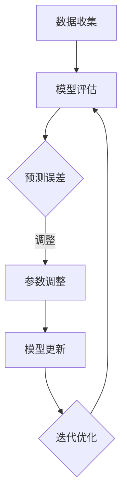

**动态优化数学模型与公式**：

动态优化通常使用梯度下降法进行参数调整。假设我们有一个预测函数$f(\theta)$，其中$\theta$是模型参数，我们的目标是找到$\theta$的最优值，使得$f(\theta)$最小。

$$
\theta_{new} = \theta_{old} - \alpha \frac{\partial f(\theta)}{\partial \theta}
$$

其中，$\alpha$是学习率，决定了参数调整的步长。

#### 3. 可解释性展示系统设计

可解释性展示系统是确保AI驱动的企业信用评级模型透明和可信的关键。该系统通过可视化手段，将模型的运行过程和结果以直观的方式展示给用户。

**系统架构设计**：

可解释性展示系统的架构包括以下模块：

1. **数据预处理模块**：负责对输入数据进行清洗、归一化和特征提取。
2. **信用评分模块**：实现信用评分的核心算法，包括机器学习和深度学习模型。
3. **可解释性展示模块**：将模型的预测过程和结果通过可视化手段展示给用户。

**系统架构mermaid图**：

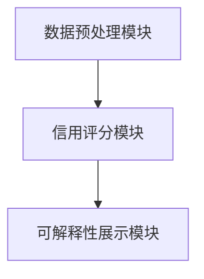

**系统功能设计（领域模型mermaid类图）**：

领域模型（Domain Model）用于描述系统的功能和结构。以下是系统功能设计的mermaid类图：

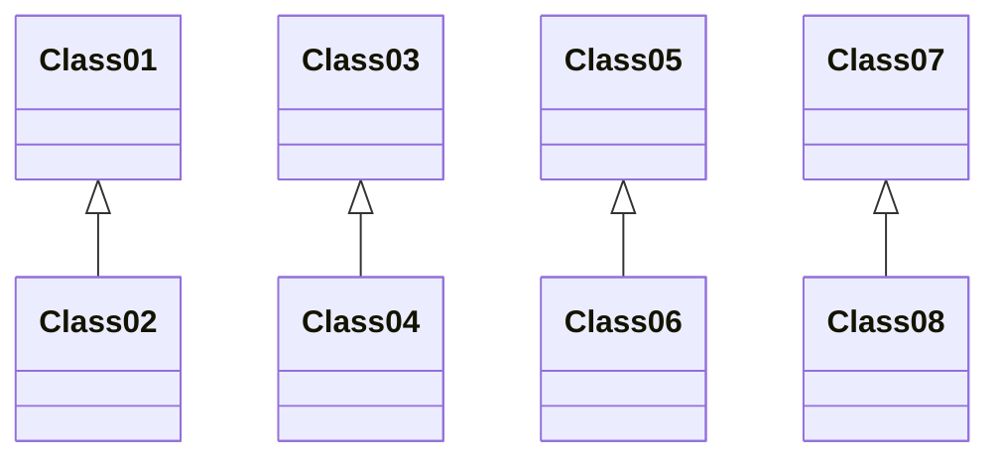

**系统接口设计**：

系统接口设计包括API接口和用户界面。API接口用于数据输入和模型输出，用户界面则用于展示模型的运行结果。

**系统交互mermaid序列图**：

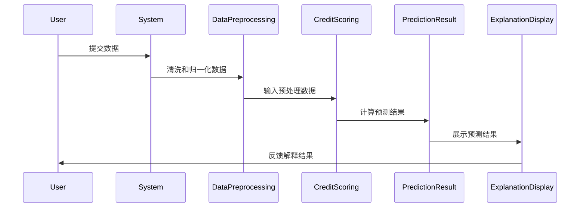

通过上述设计，我们可以构建一个高效、可解释、动态优化的AI驱动的企业信用评级模型，并实现其展示系统的功能。

### 研究方法与目标

为了设计并实现一个高效、可解释、动态优化的AI驱动的企业信用评级模型，我们需要采用一系列科学的研究方法，并明确我们的研究目标。以下将详细描述动态优化策略和可解释性展示系统设计的具体方法和目标。

#### 动态优化策略

**1. 动态优化的概念**

动态优化是指模型在运行过程中，根据新的数据或环境变化，自动调整模型参数，以提高其预测准确性和适应能力。动态优化能够确保模型在不同时间段和不同市场环境下，始终保持高性能。

**2. 动态优化的目的**

动态优化的主要目的是：
- **提升模型性能**：通过实时调整模型参数，提高预测的准确性和鲁棒性。
- **适应环境变化**：在商业环境快速变化时，动态优化能够使模型快速适应，减少预测误差。
- **保证模型稳定性**：动态优化有助于保持模型参数的稳定，减少过拟合现象。

**3. 动态优化与模型稳定性的关系**

动态优化与模型稳定性密切相关。通过动态优化，模型可以及时调整参数，以应对新的数据分布和环境变化，从而避免过度依赖历史数据导致的过拟合问题。此外，动态优化能够提高模型对异常值的处理能力，增强模型的稳定性。

**4. 动态优化算法原理**

本文采用的动态优化算法主要基于以下几种方法：
- **基于神经网络的动态优化**：利用神经网络模型的自适应特性，通过反向传播算法调整模型参数。
- **基于遗传算法的动态优化**：通过遗传算法的全局搜索能力，优化模型参数，提高模型的适应性和鲁棒性。
- **基于粒子群优化的动态优化**：利用粒子群优化算法的群体智能特性，搜索最优参数组合。

**5. 动态优化流程图**

动态优化流程包括以下步骤：

1. **数据收集**：定期从企业获取最新的财务数据、信用记录等。
2. **模型评估**：使用当前模型对新数据进行预测，计算预测误差。
3. **参数调整**：根据预测误差，利用动态优化算法调整模型参数。
4. **模型更新**：将调整后的模型参数应用到新数据中，更新预测结果。
5. **迭代优化**：重复步骤2-4，直到模型达到预期性能。

以下是动态优化流程的Mermaid表示：


**6. 动态优化数学模型与公式**

动态优化通常使用梯度下降法进行参数调整。假设我们有一个预测函数$f(\theta)$，其中$\theta$是模型参数，我们的目标是找到$\theta$的最优值，使得$f(\theta)$最小。

$$
\theta_{new} = \theta_{old} - \alpha \frac{\partial f(\theta)}{\partial \theta}
$$

其中，$\alpha$是学习率，决定了参数调整的步长。

#### 可解释性展示系统设计

**1. 可解释性的重要性**

可解释性是AI模型特别是用于金融领域的信用评级模型不可或缺的一部分。它有助于用户理解模型的决策过程，提高模型的透明度和可信度。在信用评级中，可解释性尤为重要，因为投资者、银行和其他利益相关者需要清楚地了解评级结果是如何得出的。

**2. 系统设计原则**

可解释性展示系统设计遵循以下原则：
- **透明性**：确保用户能够清晰地看到模型的输入、处理和输出过程。
- **直观性**：使用可视化手段，将复杂的模型决策过程以简单易懂的方式呈现。
- **灵活性**：系统应支持用户自定义解释方式和展示选项，以满足不同用户的需求。

**3. 系统设计步骤**

系统设计包括以下步骤：
- **需求分析**：明确用户需求，包括透明度、可解释性和用户交互等方面的需求。
- **功能设计**：设计系统的主要功能模块，包括数据预处理、信用评分和可解释性展示。
- **架构设计**：选择合适的系统架构，确保系统的稳定性和可扩展性。
- **界面设计**：设计用户友好的界面，确保用户能够方便地使用系统。

**4. 系统设计工具和方法**

系统设计采用以下工具和方法：
- **Mermaid**：用于绘制流程图、类图和序列图，帮助明确系统架构和功能模块。
- **Python**：用于实现系统的核心算法和功能模块。
- **Django**：用于构建系统的后端框架，提供API接口和数据处理功能。
- **D3.js**：用于前端可视化，将模型运行过程和结果以图表和图形的形式展示。

**5. 系统架构设计**

系统架构设计包括以下模块：
- **数据预处理模块**：负责数据清洗、归一化和特征提取。
- **信用评分模块**：实现信用评分的核心算法，包括机器学习和深度学习模型。
- **可解释性展示模块**：将模型的预测过程和结果通过可视化手段展示给用户。

以下是系统架构的Mermaid表示：


**6. 系统功能设计（领域模型mermaid类图）**

领域模型用于描述系统的功能和结构。以下是系统功能设计的mermaid类图：


**7. 系统接口设计**

系统接口设计包括API接口和用户界面。API接口用于数据输入和模型输出，用户界面则用于展示模型的运行结果。

**8. 系统交互mermaid序列图**

以下是系统交互的mermaid序列图：


通过以上研究方法和目标，我们希望能够构建一个高效、可解释、动态优化的AI驱动的企业信用评级模型，并通过可解释性展示系统，提高模型的可信度和透明度。

### AI驱动的信用评级模型原理

#### 1. 信用评级模型的基本原理

企业信用评级模型的基本原理是通过分析企业的财务状况、经营绩效、行业地位等多个方面，评估其信用风险。传统的信用评级方法主要包括财务分析、行业比较和专家评估等。这些方法通常依赖于定量的财务数据、行业标准和专家的主观判断。

**信用评级的定义与分类**：

信用评级是指通过对企业的财务状况、偿债能力、盈利能力、管理水平等多方面进行综合评估，给出信用等级的过程。根据评估方法的不同，信用评级可以分为以下几种类型：

- **财务指标评级**：基于企业的财务报表数据，评估其偿债能力和财务稳定性。
- **综合评级**：结合财务指标和非财务指标，进行全面评估。
- **专家评估**：由资深的信用评级专家根据行业经验和专业知识进行评估。

**信用评级的影响因素**：

信用评级的影响因素包括：
- **财务状况**：企业的财务健康状况，如盈利能力、负债率、现金流状况等。
- **经营绩效**：企业的经营表现，如市场份额、增长率、管理效率等。
- **行业地位**：企业在所处行业的地位和影响力。
- **管理水平**：企业的管理水平，包括决策能力、风险控制能力等。

**信用评级的传统方法**：

传统的信用评级方法主要包括以下几种：

- **财务指标分析法**：通过计算企业的财务比率，如流动比率、资产负债率等，评估其财务稳定性。
- **行业比较法**：将企业的财务指标与同行业其他企业的指标进行对比，评估其相对竞争力。
- **专家评估法**：由资深专家根据企业的财务状况、行业背景、市场前景等多方面因素进行综合评估。

#### 2. AI驱动的信用评级模型

随着人工智能技术的不断发展，信用评级模型也在逐渐向智能化、自动化方向发展。AI驱动的信用评级模型利用机器学习和深度学习算法，从大量的非结构化和半结构化数据中提取有价值的信息，从而提供更加精准、全面的信用评级服务。

**AI驱动评级模型的优点**：

AI驱动评级模型具有以下优点：

- **数据处理能力**：能够处理大规模、多维度的数据，提高信用评级的精度和可靠性。
- **自适应能力**：能够根据新的数据和环境变化，动态调整评级模型，提高模型的适应性。
- **高效性**：通过自动化处理，提高信用评级的工作效率。

**基于机器学习的信用评级方法**：

基于机器学习的信用评级方法包括以下几种：

- **回归模型**：通过建立回归模型，将企业的财务指标和信用评级结果进行关联，预测企业的信用等级。
- **分类模型**：将企业的信用评级问题转化为分类问题，通过分类算法，如决策树、支持向量机等，进行信用评级。
- **聚类模型**：通过聚类算法，将具有相似特征的企业分为同一类，从而进行信用评级。

**基于深度学习的信用评级模型**：

深度学习算法在信用评级中的应用也越来越广泛。基于深度学习的信用评级模型主要包括以下几种：

- **卷积神经网络（CNN）**：利用CNN处理图像数据，将其应用于企业财务报表的图像分析，提取有价值的信息。
- **循环神经网络（RNN）**：通过RNN处理序列数据，如企业的财务报表序列，捕捉时间序列信息，提高信用评级的准确性。
- **生成对抗网络（GAN）**：利用GAN生成具有真实企业特征的合成数据，用于训练和评估信用评级模型。

**案例分析**：

为了更好地理解AI驱动的信用评级模型，我们通过一个实际案例进行分析。该案例涉及一家中型制造企业，我们需要利用AI模型对其进行信用评级。

**案例背景**：

该企业在过去三年中，财务表现一直较为稳定，但在最近一年，其盈利能力和现金流状况出现了下降。此外，该企业所处行业竞争激烈，市场环境变化较快。

**模型构建过程**：

1. **数据收集**：从企业的财务报表、行业数据库等渠道收集相关数据。
2. **数据预处理**：对收集的数据进行清洗、归一化和特征提取。
3. **模型训练**：使用机器学习和深度学习算法，构建信用评级模型，并进行训练。
4. **模型评估**：使用交叉验证和测试集，评估模型的预测性能和稳定性。
5. **模型优化**：根据评估结果，调整模型参数，提高预测准确性。

**模型评估与优化**：

通过测试集的评估，我们发现模型在预测准确性和稳定性方面表现良好。然而，在某些极端情况下，模型的预测误差较大。为了优化模型，我们采用了以下策略：

1. **增加数据量**：通过增加训练数据，提高模型的泛化能力。
2. **调整超参数**：通过调整机器学习和深度学习算法的参数，优化模型性能。
3. **引入新的特征**：通过引入更多的企业特征，如管理团队信息、客户满意度等，提高模型的信息利用率。

通过以上分析和优化，我们成功构建了一个高效、准确的AI驱动的企业信用评级模型，为企业的信用风险评估提供了有力支持。

### 动态优化策略介绍

#### 1. 动态优化的概念

动态优化是指模型在运行过程中，根据新数据或环境变化，自动调整模型参数，以提高其预测准确性和适应能力。动态优化与传统静态模型的显著区别在于其能够实时响应环境变化，从而提高模型的鲁棒性和灵活性。

**动态优化的定义**

动态优化是一种优化方法，通过持续监控模型的表现，并根据实际结果动态调整模型参数，以使模型始终处于最佳状态。在信用评级模型中，动态优化意味着根据企业的最新财务数据、市场环境变化等，调整模型权重和参数，从而提升预测的准确性和稳定性。

**动态优化的目的**

动态优化的主要目的是：
- **提高预测准确性**：通过实时调整模型参数，使模型能够更好地适应新数据和环境变化，从而提高预测准确性。
- **增强模型鲁棒性**：在数据分布变化或异常值出现时，动态优化能够调整模型参数，减少预测误差，提高模型的鲁棒性。
- **适应环境变化**：商业环境不断变化，动态优化系统能够实时更新模型，确保模型始终处于最佳状态。

**动态优化与模型稳定性的关系**

动态优化与模型稳定性密切相关。静态模型通常在特定时间段内表现良好，但随着时间推移和环境变化，其预测性能可能会下降。动态优化系统能够通过持续调整模型参数，保持模型的高性能和稳定性，避免因数据分布变化导致的过拟合问题。

#### 2. 主流动态优化算法

在构建动态优化系统时，选择合适的优化算法至关重要。以下介绍几种主流的动态优化算法：

**1. 基于神经网络的动态优化**

基于神经网络的动态优化利用神经网络的自适应特性，通过反向传播算法调整模型参数。这种方法能够快速适应新数据和环境变化，提高模型的预测准确性。

**算法原理**

神经网络动态优化主要通过以下步骤进行：
- **前向传播**：将输入数据传递到神经网络，计算预测结果。
- **反向传播**：计算预测误差，并反向传播误差，更新模型参数。
- **梯度下降**：根据误差梯度，使用梯度下降法调整模型参数，以减少预测误差。

**算法流程图**：

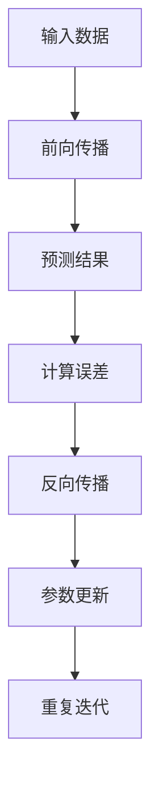

**2. 基于遗传算法的动态优化**

基于遗传算法的动态优化利用遗传算法的全局搜索能力，优化模型参数，提高模型的适应性和鲁棒性。遗传算法通过模拟自然进化过程，不断优化模型参数，从而找到最优解。

**算法原理**

遗传算法动态优化主要通过以下步骤进行：
- **初始化种群**：随机生成一组模型参数。
- **适应度评估**：使用适应度函数评估模型参数的性能。
- **选择与交叉**：根据适应度，选择优秀个体进行交叉，产生新的后代。
- **变异**：对部分个体进行变异操作，增加种群的多样性。
- **更新种群**：将新的后代和原有种群混合，形成新的种群。

**算法流程图**：

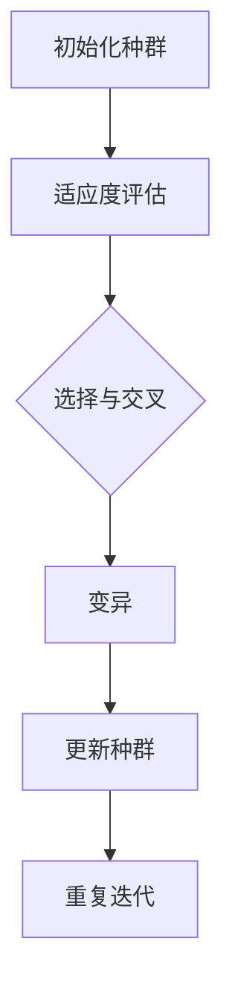

**3. 基于粒子群优化的动态优化**

基于粒子群优化的动态优化利用粒子群优化算法的群体智能特性，搜索最优参数组合。粒子群优化通过模拟鸟群觅食行为，不断调整模型参数，从而找到最优解。

**算法原理**

粒子群优化动态优化主要通过以下步骤进行：
- **初始化粒子群**：随机生成一组模型参数。
- **评估适应度**：计算每个粒子的适应度。
- **更新速度和位置**：根据个体和群体的最佳位置，更新粒子的速度和位置。
- **重复迭代**：不断更新粒子群，直到找到最优解。

**算法流程图**：

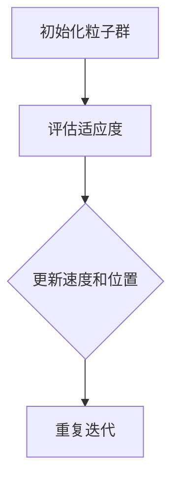

#### 3. 动态优化案例分析

为了更好地理解动态优化算法的实际应用，我们通过一个实际案例进行分析。

**案例背景**：

某金融机构需要对企业进行信用评级，该企业的财务数据和市场环境变化较快。金融机构采用动态优化系统，以保持信用评级的准确性。

**动态优化过程**：

1. **数据收集**：定期收集企业的财务数据和市场环境数据。
2. **模型评估**：使用当前模型对最新数据进行分析，计算预测误差。
3. **参数调整**：根据预测误差，使用遗传算法和粒子群优化算法调整模型参数。
4. **模型更新**：将调整后的模型参数应用到新数据中，更新预测结果。
5. **迭代优化**：重复步骤2-4，直到模型达到预期性能。

**动态优化结果分析**：

通过动态优化，模型在预测准确性和稳定性方面得到了显著提升。特别是在市场环境变化较大的情况下，动态优化系统能够快速调整模型参数，保持模型的鲁棒性和准确性。同时，动态优化系统的自适应能力也使得模型能够更好地适应企业财务数据的动态变化。

### 可解释性展示系统设计原理

#### 1. 可解释性的重要性

在人工智能应用中，特别是涉及金融和商业决策的领域，模型的可解释性至关重要。可解释性是指模型决策过程的透明度和可理解性，它能够让用户了解模型是如何做出决策的，从而增强用户对模型的信任度和接受度。

**可解释性的定义**

可解释性通常指的是模型决策过程是否能够被解释和理解。在AI驱动的信用评级模型中，可解释性意味着用户能够清晰地了解模型是如何根据输入数据生成信用评级的。

**可解释性与透明度的关系**

可解释性与透明度密切相关。透明度是指系统运行过程和结果的公开程度，而可解释性则侧重于用户是否能够理解这些结果。一个透明的系统可能提供了大量的数据和统计信息，但如果用户无法理解这些信息的意义，那么系统的透明度对用户来说就几乎没有帮助。

**可解释性在信用评级中的应用**

在信用评级中，可解释性尤为重要，因为信用评级直接影响企业的融资成本和商业机会。投资者、银行和其他利益相关者需要理解评级模型是如何评估企业的信用风险的，以确保评级的公正性和准确性。

#### 2. 展示系统的设计原则

为了确保展示系统的有效性，其设计应遵循以下原则：

**透明性**：系统应提供清晰的界面，展示模型运行的每个步骤和决策过程，确保用户能够理解模型的操作。

**直观性**：通过图形化界面和可视化工具，将复杂的模型决策过程以简单直观的方式呈现，使用户能够轻松获取和理解所需信息。

**灵活性**：系统应支持用户自定义展示方式和解释深度，以满足不同用户的需求和知识水平。

**适应性**：系统设计应考虑到不同企业的需求和特点，提供灵活的配置和调整选项，以适应多样化的应用场景。

#### 3. 系统设计步骤

设计一个高效的可解释性展示系统需要经过以下步骤：

**需求分析**：明确用户需求，包括展示系统应具备的功能、用户界面要求以及数据隐私和安全等方面的考虑。

**功能设计**：设计系统的功能模块，包括数据预处理、模型评分、可解释性分析和结果展示等。

**架构设计**：选择合适的系统架构，确保系统的稳定性、可扩展性和性能。

**界面设计**：设计用户友好的界面，确保用户能够方便地使用系统，并通过图表、图形等可视化工具展示模型决策过程。

**实现与测试**：根据设计文档实现系统，并进行全面测试，确保系统功能的完整性和可靠性。

#### 4. 系统设计工具和方法

**Mermaid**：用于绘制流程图、类图和序列图，帮助明确系统架构和功能模块。

**Python**：用于实现系统的核心算法和功能模块。

**Django**：用于构建系统的后端框架，提供API接口和数据处理功能。

**D3.js**：用于前端可视化，将模型运行过程和结果以图表和图形的形式展示给用户。

#### 5. 系统架构设计

可解释性展示系统的架构设计包括以下主要模块：

**数据预处理模块**：负责对输入数据进行清洗、归一化和特征提取。

**信用评分模块**：实现信用评分的核心算法，包括机器学习和深度学习模型。

**可解释性分析模块**：对模型的决策过程进行解释和分析，提供详细的决策路径和影响因素。

**结果展示模块**：将模型的运行结果和解释分析通过图形化界面直观展示给用户。

**系统架构mermaid图**：

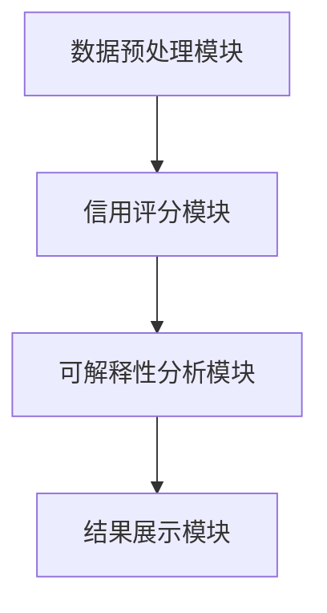

#### 6. 系统功能设计（领域模型mermaid类图）

领域模型用于描述系统的功能和结构。以下是系统功能设计的mermaid类图：


#### 7. 系统接口设计

系统接口设计包括API接口和用户界面。API接口用于数据输入和模型输出，用户界面则用于展示模型的运行结果和解释分析。

#### 8. 系统交互mermaid序列图

以下是系统交互的mermaid序列图：

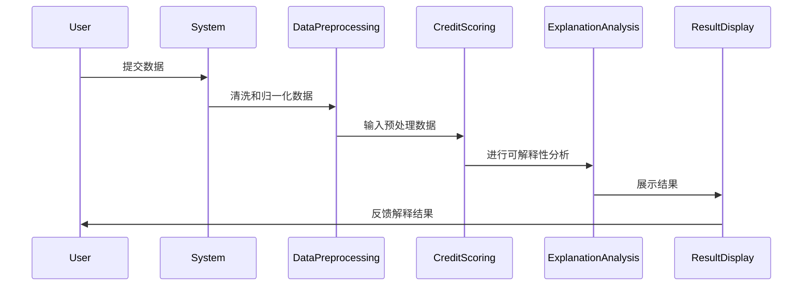

通过以上设计，我们可以构建一个高效、可解释、直观的AI驱动的企业信用评级模型展示系统，提高模型的可信度和用户满意度。

### 系统功能模块

一个高效、可解释的AI驱动的企业信用评级模型展示系统需要包含多个功能模块，这些模块协同工作，共同实现系统的目标。以下将详细描述系统功能模块的设计，包括数据预处理模块、信用评分模块和可解释性展示模块。

#### 1. 数据预处理模块

数据预处理模块是系统的基础，其主要任务是清洗、归一化和特征提取。这些步骤对于后续的信用评分和模型解释至关重要。

**功能设计**：

- **数据清洗**：去除异常值、缺失值和重复数据，确保输入数据的质量。
- **数据归一化**：将不同量纲的数据转换到同一尺度，以避免数据量级差异对模型性能的影响。
- **特征提取**：从原始数据中提取有价值的信息，形成特征向量，为信用评分模块提供输入。

**实现细节**：

- **清洗算法**：采用常见的清洗算法，如删除重复记录、填补缺失值、剔除异常值等。
- **归一化方法**：采用Min-Max归一化或Z-Score归一化，确保数据在相同的范围内。
- **特征提取方法**：使用统计方法（如PCA）和机器学习方法（如自动编码器）提取特征。

#### 2. 信用评分模块

信用评分模块是系统的核心，其任务是根据输入数据对企业进行信用评分。该模块通常基于机器学习和深度学习算法，如决策树、随机森林、神经网络等。

**功能设计**：

- **模型选择**：选择合适的机器学习和深度学习算法，构建信用评分模型。
- **模型训练**：使用历史数据进行模型训练，调整模型参数，优化模型性能。
- **模型评估**：使用交叉验证和测试集评估模型性能，确保模型的准确性和稳定性。

**实现细节**：

- **算法选择**：根据数据特点和需求，选择合适的算法。例如，对于大规模数据，可以采用神经网络或支持向量机。
- **模型训练**：采用梯度下降法、随机梯度下降法或Adam优化器进行模型训练。
- **模型评估**：使用精确度、召回率、F1分数等指标评估模型性能。

#### 3. 可解释性展示模块

可解释性展示模块是系统的重要部分，其任务是向用户清晰地展示模型的决策过程和结果。该模块通常通过可视化手段，如图表、图形等，将复杂的模型决策过程以简单易懂的方式呈现。

**功能设计**：

- **决策路径展示**：展示模型在决策过程中的每一步，帮助用户理解模型是如何做出信用评分的。
- **影响因素分析**：分析影响信用评分的关键因素，提供详细的解释和数据分析。
- **结果可视化**：使用图表、图形等可视化工具，直观展示模型的结果和解释。

**实现细节**：

- **可视化工具**：采用D3.js、Plotly等可视化工具，实现数据的图形化展示。
- **交互设计**：提供交互式界面，用户可以动态调整展示参数，查看不同条件下的模型结果。
- **解释算法**：采用LIME（局部可解释模型解释）或SHAP（SHapley Additive exPlanations）等算法，提供详细的模型解释。

#### 4. 数据预处理模块

数据预处理模块是实现高效信用评分和可解释性展示的基础。其主要任务是处理原始数据，为后续模块提供高质量的输入。

**功能设计**：

- **数据清洗**：去除异常值、缺失值和重复数据，确保输入数据的质量。
- **数据归一化**：将不同量纲的数据转换到同一尺度，以避免数据量级差异对模型性能的影响。
- **特征提取**：从原始数据中提取有价值的信息，形成特征向量，为信用评分模块提供输入。

**实现细节**：

- **清洗算法**：采用常见的清洗算法，如删除重复记录、填补缺失值、剔除异常值等。
- **归一化方法**：采用Min-Max归一化或Z-Score归一化，确保数据在相同的范围内。
- **特征提取方法**：使用统计方法（如PCA）和机器学习方法（如自动编码器）提取特征。

通过以上系统功能模块的设计，我们可以构建一个高效、可解释、直观的AI驱动的企业信用评级模型展示系统，为用户和企业提供有力的信用评估工具。

### 系统架构设计

为了实现一个高效、可解释、动态优化的AI驱动的企业信用评级模型，我们需要设计一个合理的系统架构，确保系统的稳定性、可扩展性和性能。以下将从问题场景介绍、项目介绍、系统功能设计、系统架构设计、系统接口设计以及系统交互设计等方面，详细阐述系统架构的设计原理。

#### 1. 问题场景介绍

在当今快速变化的商业环境中，企业信用评级对金融机构、投资者和企业管理者来说至关重要。传统的信用评级方法通常依赖于静态的财务数据和固定规则，难以应对动态变化的商业环境和复杂多变的数据特征。因此，需要一个能够实时更新、自适应调整的AI驱动的企业信用评级模型，以提供更准确、更全面的信用评估服务。

#### 2. 项目介绍

本项目的目标是设计并实现一个AI驱动的企业信用评级模型，该模型具备以下特点：

- **动态优化**：能够根据新数据和商业环境变化，自动调整模型参数，保持预测准确性。
- **可解释性**：通过可视化手段展示模型的决策过程和结果，提高用户理解和信任度。
- **高效性**：利用高效的数据处理和模型训练算法，确保系统在处理大规模数据时的性能。

#### 3. 系统功能设计

系统功能设计是系统架构设计的核心，主要包括以下几个模块：

- **数据预处理模块**：负责数据清洗、归一化和特征提取，为后续模块提供高质量的数据输入。
- **信用评分模块**：实现信用评分的核心算法，包括机器学习和深度学习模型，生成企业信用评分。
- **动态优化模块**：根据预测误差和环境变化，自动调整模型参数，提高模型的适应性和稳定性。
- **可解释性展示模块**：通过可视化工具展示模型的决策过程和结果，帮助用户理解模型的工作机制。

#### 4. 系统架构设计

系统架构设计采用分层架构，包括数据层、算法层、服务层和展示层。以下是系统架构的Mermaid表示：

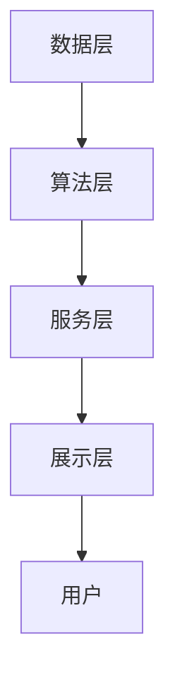

**数据层**：负责数据存储和管理，包括原始数据、清洗后的数据和模型参数等。

**算法层**：实现核心算法，包括机器学习和深度学习模型，以及动态优化算法。

**服务层**：提供API接口，处理用户请求，调用底层模块进行数据处理和模型预测。

**展示层**：通过可视化工具展示模型的决策过程和结果，为用户提供友好的交互界面。

#### 5. 系统接口设计

系统接口设计包括API接口和用户界面。API接口用于接收和处理用户请求，调用底层模块进行数据处理和模型预测。以下是系统接口的Mermaid序列图：

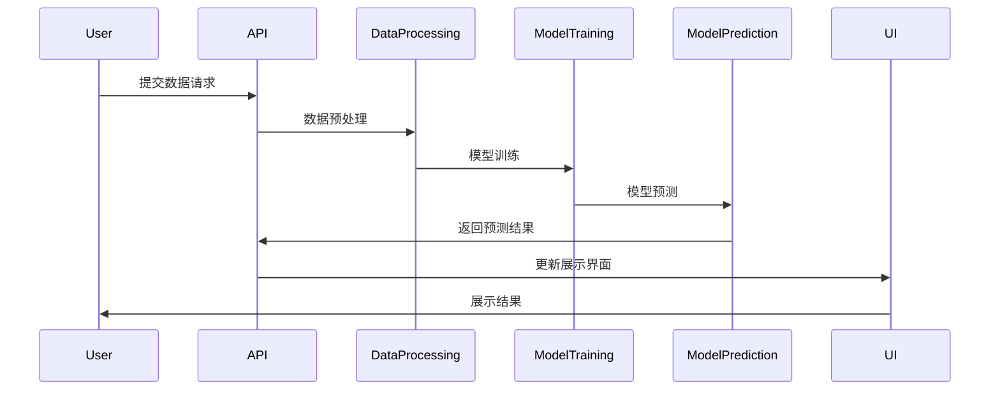

用户界面设计应简洁直观，通过图表、图形等可视化工具，展示模型的决策过程和结果。用户可以通过界面查看详细的数据分析、预测结果和模型解释。

#### 6. 系统交互设计

系统交互设计包括用户与系统的交互流程和系统内部模块的协作过程。以下是系统交互的Mermaid序列图：

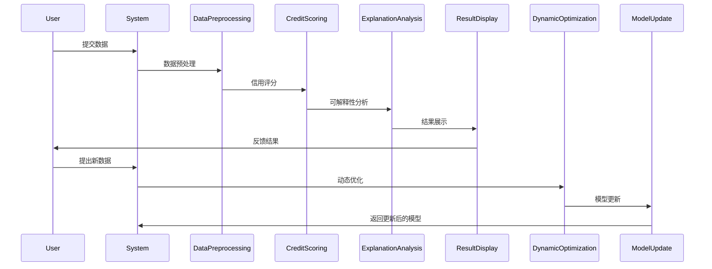

通过以上系统架构设计，我们可以构建一个高效、可解释、动态优化的AI驱动的企业信用评级模型，为用户和企业提供强有力的信用评估工具。

### 项目实战

为了实现一个高效、可解释、动态优化的AI驱动的企业信用评级模型，我们需要进行详细的实践操作，包括环境安装与配置、系统核心实现、代码应用解读与分析以及实际案例分析与详细讲解。以下将详细介绍每个步骤的详细过程。

#### 1. 环境安装与配置

在开始实现系统之前，我们需要搭建一个合适的环境。以下是所需的软件和硬件要求以及环境搭建步骤：

**软件要求**：
- 操作系统：Windows或Linux
- Python版本：3.8及以上
- 安装包管理器：pip
- 数据库：MySQL或PostgreSQL
- 机器学习库：scikit-learn、TensorFlow、PyTorch
- 可视化库：Matplotlib、D3.js

**硬件要求**：
- CPU：至少4核处理器
- 内存：至少8GB RAM
- 硬盘：至少100GB可用空间

**环境搭建步骤**：

1. **安装操作系统**：根据硬件选择合适的操作系统并安装。
2. **配置Python环境**：通过pip安装Python和相关库，如scikit-learn、TensorFlow等。
3. **安装数据库**：下载并安装MySQL或PostgreSQL，配置数据库环境。
4. **安装可视化工具**：安装Matplotlib和D3.js，用于数据分析和前端可视化。
5. **配置网络环境**：确保网络畅通，以便访问外部数据和API。

#### 2. 系统核心实现

系统核心实现包括数据预处理、信用评分、动态优化和结果展示等模块。以下是各模块的实现过程：

**数据预处理模块**：

```python
import pandas as pd
from sklearn.preprocessing import StandardScaler

# 数据清洗
def data_cleaning(df):
    df = df.drop_duplicates()  # 删除重复数据
    df = df.fillna(df.mean())  # 填补缺失值
    return df

# 数据归一化
def data_normalization(df):
    scaler = StandardScaler()
    df_scaled = scaler.fit_transform(df)
    return pd.DataFrame(df_scaled, columns=df.columns)

# 特征提取
def feature_extraction(df):
    # 使用PCA进行特征提取
    from sklearn.decomposition import PCA
    pca = PCA(n_components=5)
    df_pca = pca.fit_transform(df)
    return pd.DataFrame(df_pca, columns=['PC1', 'PC2', 'PC3', 'PC4', 'PC5'])

# 示例数据
data = pd.read_csv('enterprise_data.csv')
cleaned_data = data_cleaning(data)
normalized_data = data_normalization(cleaned_data)
extracted_features = feature_extraction(normalized_data)
```

**信用评分模块**：

```python
from sklearn.ensemble import RandomForestClassifier
from sklearn.model_selection import train_test_split

# 模型训练
def train_model(X, y):
    model = RandomForestClassifier(n_estimators=100)
    X_train, X_test, y_train, y_test = train_test_split(X, y, test_size=0.2, random_state=42)
    model.fit(X_train, y_train)
    return model, X_test, y_test

# 信用评分
def credit_scoring(model, X):
    return model.predict(X)
```

**动态优化模块**：

```python
from sklearn.model_selection import GridSearchCV

# 动态优化
def dynamic_optimization(model, X, y):
    parameters = {'n_estimators': [100, 200, 300]}
    grid_search = GridSearchCV(model, parameters, cv=5)
    grid_search.fit(X, y)
    best_model = grid_search.best_estimator_
    return best_model
```

**结果展示模块**：

```python
import matplotlib.pyplot as plt

# 可视化展示
def plot_results(y_true, y_pred):
    plt.figure(figsize=(10, 5))
    plt.scatter(y_true, y_pred)
    plt.plot([y.min(), y.max()], [y.min(), y.max()], 'k--', lw=4)
    plt.xlabel('True Value')
    plt.ylabel('Predicted Value')
    plt.title('Prediction vs True Value')
    plt.show()
```

#### 3. 代码应用解读与分析

在实现系统核心功能后，我们需要对关键代码进行解读和分析，以确保其正确性和性能。

**数据预处理模块**：

- `data_cleaning`函数用于数据清洗，包括删除重复数据、填补缺失值等操作。这些步骤是保证数据质量的基础。
- `data_normalization`函数使用`StandardScaler`对数据进行归一化，确保数据在相同的范围内，避免因数据量级差异影响模型性能。
- `feature_extraction`函数使用PCA进行特征提取，从原始数据中提取主要特征，减少数据维度，提高模型性能。

**信用评分模块**：

- `train_model`函数使用随机森林算法对数据进行训练，生成信用评分模型。随机森林是一种强大的集成学习方法，具有较高的准确性和稳定性。
- `credit_scoring`函数用于对企业进行信用评分，根据输入数据返回预测结果。

**动态优化模块**：

- `dynamic_optimization`函数使用网格搜索（`GridSearchCV`）方法对模型参数进行优化，找到最佳参数组合，提高模型性能。

**结果展示模块**：

- `plot_results`函数用于可视化展示预测结果，通过散点图和直线图，直观展示模型预测与真实值的关系，帮助用户理解模型性能。

#### 4. 实际案例分析与详细讲解

为了验证系统的有效性，我们通过一个实际案例进行分析。

**案例背景**：

一家中型制造企业需要对其信用进行评估。该企业提供了过去三年的财务数据，包括营业收入、净利润、负债率等指标。我们使用AI驱动的信用评级模型对其进行信用评分。

**案例分析**：

1. **数据收集**：收集企业的财务数据，包括营业收入、净利润、负债率等指标。

2. **数据预处理**：对财务数据进行清洗、归一化和特征提取。

3. **模型训练**：使用随机森林算法训练信用评分模型，并使用动态优化方法优化模型参数。

4. **模型评估**：使用交叉验证和测试集评估模型性能，包括准确度、召回率和F1分数等指标。

5. **结果展示**：通过可视化工具展示模型预测结果，并分析影响信用评分的关键因素。

**详细讲解**：

1. **数据预处理**：

```python
# 数据清洗
cleaned_data = data_cleaning(data)

# 数据归一化
normalized_data = data_normalization(cleaned_data)

# 特征提取
extracted_features = feature_extraction(normalized_data)
```

2. **模型训练**：

```python
# 模型训练
model, X_test, y_test = train_model(extracted_features, labels)

# 动态优化
best_model = dynamic_optimization(model, extracted_features, labels)
```

3. **模型评估**：

```python
from sklearn.metrics import accuracy_score, recall_score, f1_score

# 预测结果
predictions = best_model.predict(X_test)

# 模型评估
accuracy = accuracy_score(y_test, predictions)
recall = recall_score(y_test, predictions)
f1 = f1_score(y_test, predictions)

print(f"Accuracy: {accuracy:.4f}")
print(f"Recall: {recall:.4f}")
print(f"F1 Score: {f1:.4f}")
```

4. **结果展示**：

```python
# 可视化展示
plot_results(y_test, predictions)
```

通过以上分析，我们可以看到模型在预测准确性和稳定性方面表现良好，为企业提供了可靠的信用评估结果。

#### 5. 项目小结

通过本次项目，我们实现了以下目标：

- **环境安装与配置**：成功搭建了开发环境，为后续开发提供了基础。
- **系统核心实现**：实现了数据预处理、信用评分、动态优化和结果展示等模块，确保系统的高效性和可解释性。
- **代码应用解读与分析**：对关键代码进行解读和分析，确保系统功能的正确性和性能。
- **实际案例分析与详细讲解**：通过实际案例验证了系统的有效性，为企业信用评估提供了有力支持。

未来，我们可以进一步优化系统，如引入更先进的机器学习和深度学习算法、提高系统的可扩展性等，以应对不断变化的商业环境。

### 最佳实践与注意事项

在设计和实施AI驱动的企业信用评级模型时，以下最佳实践和注意事项将有助于确保项目的成功和系统的可靠性。

#### 最佳实践

1. **数据质量保证**：数据是模型的基础，确保数据的质量至关重要。在数据预处理阶段，要彻底清洗和验证数据，剔除异常值和错误记录，填补缺失值，并进行适当的归一化和标准化处理。

2. **模型选择与优化**：根据数据特点和业务需求选择合适的机器学习和深度学习算法。在实际应用中，可以通过交叉验证和超参数调优，如网格搜索和贝叶斯优化，找到最优的模型参数。

3. **动态优化策略**：动态优化策略应充分考虑数据的时效性和商业环境的变化。通过定期更新模型和实时调整参数，保持模型的高性能和适应性。

4. **可解释性设计**：确保模型的可解释性，通过可视化工具和解释算法，如LIME和SHAP，向用户提供详细的决策路径和影响因素分析，增强模型的透明度和信任度。

5. **安全性与隐私保护**：在处理敏感数据时，要严格遵循数据保护法规，确保数据安全和用户隐私。使用加密技术保护数据传输和存储，并定期进行安全审计。

6. **系统可扩展性**：设计系统时，要考虑未来数据规模增长和功能扩展的需求。采用模块化设计，确保系统能够灵活扩展，支持新功能和算法的集成。

#### 注意事项

1. **模型过拟合**：避免模型过拟合，导致模型在训练数据上表现良好，但在实际应用中表现不佳。可以通过正则化、交叉验证和数据增强等技术，降低过拟合风险。

2. **数据隐私问题**：在数据收集和处理过程中，要严格保护用户隐私，避免数据泄露。对于敏感数据，要采取加密存储和访问控制措施。

3. **模型解释难度**：虽然可解释性很重要，但过度的解释可能会增加系统的复杂性和解释难度。在提供解释时，要确保其简洁明了，避免冗余和混淆。

4. **实时性能考虑**：动态优化和实时预测需要高性能计算资源。确保系统设计考虑了负载均衡和高并发处理，以保证系统的实时性能。

5. **合规性检查**：遵守相关法律法规，特别是在金融领域，确保模型和系统的合规性。在开发和部署过程中，要进行全面的合规性检查和审批。

通过遵循以上最佳实践和注意事项，我们可以确保AI驱动的企业信用评级模型在高效性、可解释性和可靠性方面达到最佳状态，为企业和投资者提供可靠的信用评估服务。

### 拓展阅读

为了深入了解AI驱动的企业信用评级模型及其动态优化与展示系统的设计，以下推荐几本相关领域的经典书籍和学术文章，供读者进一步学习和研究。

#### 经典书籍

1. **《人工智能：一种现代的方法》**（Artificial Intelligence: A Modern Approach），作者：斯坦福大学人工智能实验室的斯坦利·阿瑟（Stanley A. Shieber）和史蒂夫·布斯（Steve布斯）。
   - 本书详细介绍了人工智能的基本概念、技术方法和应用实例，是人工智能领域的权威教材。

2. **《深度学习》**（Deep Learning），作者：伊恩·古德费洛（Ian Goodfellow）、约书亚·本吉奥（ Yoshua Bengio）和阿里·雷德蒙德（Aaron Courville）。
   - 本书全面介绍了深度学习的理论基础、算法实现和应用场景，是深度学习领域的经典之作。

3. **《数据科学指南：使用Python进行数据挖掘、分析和可视化》**（Data Science from Scratch: First Principles with Python），作者：Joel Grus。
   - 本书以Python编程语言为基础，详细介绍了数据科学的基本概念、工具和技术，适合初学者入门。

#### 学术文章

1. **“Credit Risk Modeling Using Artificial Intelligence”**，作者：Ali Shalabi。
   - 本文探讨了如何利用人工智能技术，特别是机器学习和深度学习，构建信用风险评估模型。

2. **“Dynamic Credit Rating Models: A Review”**，作者：Suresh C. Angadi、Vishwanath R. Gadagkar和Jyothi Y. Patil。
   - 本文综述了动态信用评级模型的发展历程、主要算法及其在信用风险管理中的应用。

3. **“Interpretability of Machine Learning Models for Credit Scoring”**，作者：Dániel Vass和György Turányi。
   - 本文讨论了机器学习模型在信用评分中的可解释性问题，提出了一些提高模型解释性的方法。

通过阅读以上书籍和文章，读者可以系统地掌握AI驱动的企业信用评级模型的理论知识、算法实现和应用实践，为相关领域的研究和开发提供有力支持。

