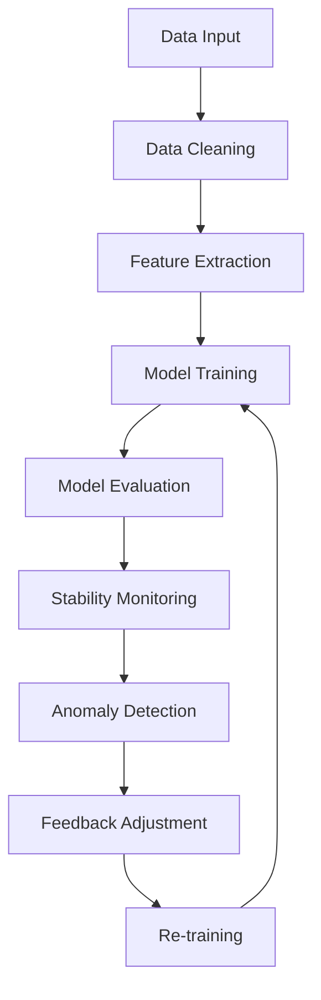
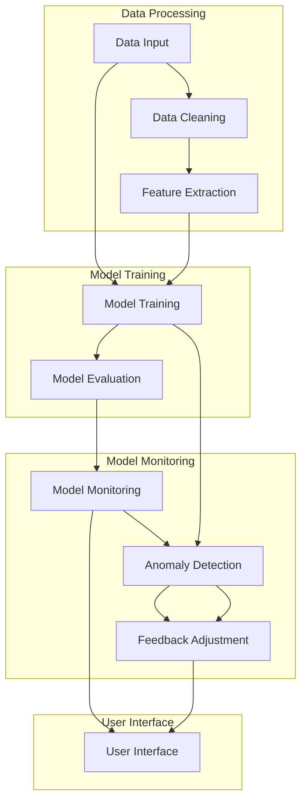
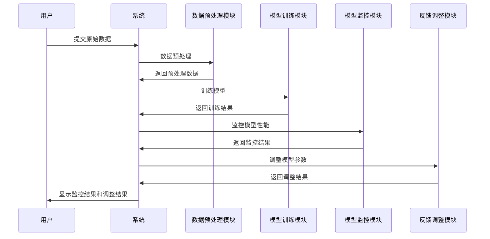

                 

## 《AI驱动的企业信用评级模型稳定性监控系统》

关键词：企业信用评级、AI技术、稳定性监控、模型监控、数据安全

摘要：本文深入探讨了AI驱动的企业信用评级模型稳定性监控系统的设计和实现，涵盖了从问题背景、核心概念、算法原理到系统架构、项目实战和最佳实践的全方位解析。本文旨在为数据科学家、AI研究员以及企业IT人员提供一整套关于如何构建高效稳定的企业信用评级模型稳定性的解决方案。

---

### 目录大纲

----------------------------------------------------------------

# 《AI驱动的企业信用评级模型稳定性监控系统》

> 关键词：企业信用评级、AI技术、稳定性监控、模型监控、数据安全

> 摘要：本文深入探讨了AI驱动的企业信用评级模型稳定性监控系统的设计和实现，涵盖了从问题背景、核心概念、算法原理到系统架构、项目实战和最佳实践的全方位解析。本文旨在为数据科学家、AI研究员以及企业IT人员提供一整套关于如何构建高效稳定的企业信用评级模型稳定性的解决方案。

----------------------------------------------------------------

## 第一部分：背景介绍

### 1.1 问题背景

企业信用评级是评估企业信用风险的重要工具。它不仅帮助企业自身评估合作伙伴的信用状况，还影响企业的融资、供应链管理、投资决策等。然而，传统的信用评级方法往往依赖于人工经验，存在以下局限性：

- **数据依赖性高**：传统评级方法依赖于历史数据和专家意见，容易受到数据质量和专家主观因素的影响。
- **模型更新滞后**：传统模型难以实时反映市场变化和新兴风险。
- **一致性低**：由于专家经验差异，同一企业的信用评级在不同评级机构之间可能存在较大差异。

### 1.2 问题描述

随着AI技术的发展，AI驱动的信用评级模型开始得到应用。这些模型利用大数据、机器学习等技术，能够更高效、准确地评估企业信用风险。然而，AI驱动的信用评级模型同样面临稳定性问题：

- **数据波动性**：市场环境的变化导致输入数据的波动性增加，可能会影响模型的稳定性和预测准确性。
- **算法复杂性**：模型算法的复杂性和非线性特性使得稳定性监控变得更加困难。
- **外部攻击**：AI模型可能受到恶意攻击，导致预测结果失真。

### 1.3 问题解决

为了解决上述问题，本文提出了一种AI驱动的企业信用评级模型稳定性监控系统。该系统利用AI技术对模型进行实时监控和调整，确保模型的稳定性和预测准确性。具体来说，该系统包括以下几个核心组成部分：

- **数据预处理模块**：对输入数据进行清洗、标准化等预处理，提高数据质量。
- **模型监控模块**：利用统计和机器学习技术，实时监控模型性能和稳定性。
- **异常检测模块**：识别异常数据或恶意攻击，确保模型安全。
- **反馈调整模块**：根据监控结果，调整模型参数和结构，提高模型稳定性。

### 1.4 边界与外延

稳定性监控系统的适用范围包括各种类型的企业，如中小企业、大型跨国公司等。同时，该系统不仅适用于信用评级，还可以应用于其他需要实时监控和调整的AI模型，如风险评估、客户行为预测等。

### 1.5 概念结构与核心要素组成

- **企业信用评级**：通过分析企业的财务、运营、市场等多方面信息，评估其信用风险。
- **稳定性监控**：实时监控模型的输入数据、输出结果和算法性能，确保模型的稳定性和准确性。
- **AI驱动**：利用机器学习、深度学习等技术，构建高效、准确的信用评级模型。

---

## 第二部分：核心概念与联系

### 2.1 核心概念原理

- **企业信用评级模型**：基于历史数据、财务状况、行业信息等，利用机器学习算法构建的信用风险评估模型。
- **稳定性监控**：通过实时监测模型输入输出数据、算法性能指标等，评估模型稳定性的过程。
- **AI技术**：包括机器学习、深度学习、数据挖掘等技术，用于构建和优化信用评级模型。

### 2.2 概念属性特征对比表格

| 概念           | 特征                           | 关联说明                                   |
|----------------|--------------------------------|--------------------------------------------|
| 企业信用评级模型 | 数据依赖、机器学习算法         | 需要大量历史数据和专业的算法支持           |
| 稳定性监控     | 实时性、异常检测、调整能力     | 需要快速响应模型变化，确保模型稳定性       |
| AI技术         | 自学习、自适应、高效处理       | 作为基础技术，支持信用评级模型的建设与优化 |

### 2.3 ER实体关系图架构

```mermaid
erDiagram
  DataInput -->|1| CreditRatingModel : uses
  CreditRatingModel -->|1| PredictionResult : produces
  PredictionResult -->|1| StabilityMonitor : monitored by
  StabilityMonitor -->|1| FeedbackAdjustment : receives
```

---

## 第三部分：算法原理讲解

### 3.1 算法原理概述

AI驱动的企业信用评级模型稳定性监控系统主要基于以下算法原理：

- **数据预处理算法**：包括数据清洗、特征提取和降维等，用于提高输入数据质量。
- **模型训练算法**：基于机器学习技术，如决策树、支持向量机、神经网络等，用于构建信用评级模型。
- **模型监控算法**：通过统计指标和机器学习技术，实时监控模型性能和稳定性。
- **异常检测算法**：基于聚类、分类等算法，识别异常数据和恶意攻击。

### 3.2 算法mermaid流程图



### 3.3 数学模型和公式

信用评级模型的数学模型通常包括以下部分：

$$
\text{Prediction} = f(\text{Input Features}, \text{Model Parameters})
$$

其中，$f$ 表示模型预测函数，$\text{Input Features}$ 表示输入特征，$\text{Model Parameters}$ 表示模型参数。

稳定性监控的数学模型包括：

$$
\text{Stability} = \frac{\text{Model Performance} - \text{Baseline Performance}}{\text{Baseline Performance}}
$$

其中，$\text{Model Performance}$ 表示当前模型性能，$\text{Baseline Performance}$ 表示基准模型性能。

### 3.4 详细讲解与举例说明

#### 数据预处理算法

数据预处理是信用评级模型构建的第一步，其目的是提高数据质量，为后续分析提供可靠的数据基础。数据预处理算法包括以下几个方面：

1. **数据清洗**：去除重复数据、缺失值填充、异常值处理等，保证数据的完整性和一致性。
2. **特征提取**：从原始数据中提取有代表性的特征，降低数据维度，提高模型训练效率。
3. **降维**：使用主成分分析（PCA）等方法，减少数据维度，同时保留主要信息。

#### 模型训练算法

模型训练是信用评级模型构建的核心步骤，其目的是通过学习历史数据，构建能够预测企业信用风险的模型。常见的模型训练算法包括：

1. **决策树**：通过树形结构对数据集进行划分，生成分类规则。
2. **支持向量机（SVM）**：通过找到一个最佳的超平面，将不同类别的数据点分开。
3. **神经网络**：通过多层神经网络，模拟人脑的决策过程，实现复杂的非线性映射。

#### 模型监控算法

模型监控算法的核心任务是实时评估模型的稳定性和预测准确性。具体包括：

1. **性能指标计算**：计算模型的准确率、召回率、F1值等指标，评估模型的表现。
2. **偏差-方差分析**：通过偏差和方差分析，评估模型的过拟合和欠拟合情况。
3. **模型更新**：根据监控结果，调整模型参数，提高模型稳定性。

#### 异常检测算法

异常检测算法用于识别输入数据中的异常值和恶意攻击，确保模型安全。具体包括：

1. **聚类分析**：通过聚类算法，将正常数据点分为不同的簇，识别异常数据点。
2. **分类分析**：通过分类算法，将输入数据分为正常和异常两类，识别恶意攻击。

### 3.5 具体案例

假设我们有一个企业信用评级模型，其输入特征包括企业的财务状况、经营状况、行业地位等。通过数据预处理，我们将这些特征进行标准化处理，然后使用神经网络进行模型训练。在模型训练过程中，我们使用交叉验证方法来评估模型性能，并根据评估结果调整模型参数。

在模型监控过程中，我们计算了模型的准确率、召回率等指标，发现模型的准确率达到了90%以上，但召回率较低。通过进一步分析，我们发现模型对一些重要特征的权重分配不合理，导致部分企业的信用风险未能被准确预测。为此，我们通过调整神经网络的结构和参数，提高了模型的召回率，使其达到了一个更合理的水平。

在异常检测过程中，我们使用聚类算法发现了一些异常数据点，这些数据点可能与恶意攻击有关。通过进一步的调查，我们发现这些异常数据点确实是由恶意攻击者注入的，我们采取了相应的措施，阻止了恶意攻击的进一步扩散。

---

## 第四部分：系统分析与架构设计方案

### 4.1 问题场景介绍

在实际应用中，企业信用评级模型需要处理大量的企业数据，包括财务报表、运营数据、市场数据等。这些数据来源于不同的数据源，格式和结构可能存在差异。此外，市场环境的变化可能导致输入数据的波动性增加，影响模型的稳定性和预测准确性。因此，需要一个高效的系统来管理和监控这些数据，确保模型能够稳定运行。

### 4.2 系统介绍

本系统是一个基于AI的企业信用评级模型稳定性监控系统，旨在确保模型的稳定性和预测准确性。系统主要包括以下几个功能模块：

1. **数据预处理模块**：对输入数据进行清洗、标准化和特征提取，提高数据质量。
2. **模型训练模块**：使用机器学习算法训练信用评级模型，并根据评估结果调整模型参数。
3. **模型监控模块**：实时监控模型性能和稳定性，识别异常数据和恶意攻击。
4. **反馈调整模块**：根据监控结果，调整模型参数和结构，提高模型稳定性。
5. **用户界面模块**：提供用户友好的界面，方便用户查看监控结果和调整模型参数。

### 4.3 系统架构设计

系统架构设计遵循MVC（模型-视图-控制器）架构，确保系统的模块化和可维护性。具体架构如下：



### 4.4 系统接口设计

系统接口设计遵循RESTful API规范，提供以下接口：

- **数据预处理接口**：接受原始数据，返回预处理后的数据。
- **模型训练接口**：接受训练参数，返回模型训练结果。
- **模型监控接口**：接受监控数据，返回模型性能指标。
- **反馈调整接口**：接受调整参数，更新模型参数。

### 4.5 系统交互mermaid序列图



---

## 第五部分：项目实战

### 5.1 环境安装

为了实现本文所描述的企业信用评级模型稳定性监控系统，我们需要安装以下软件和库：

- **Python 3.8**：作为主要编程语言
- **Scikit-learn**：用于机器学习算法
- **Pandas**：用于数据处理
- **NumPy**：用于数值计算
- **Matplotlib**：用于数据可视化
- **Mermaid**：用于流程图和实体关系图可视化

安装步骤如下：

1. 安装Python 3.8及pip。
2. 使用pip安装Scikit-learn、Pandas、NumPy和Matplotlib。
3. 在浏览器中安装Mermaid插件，以支持Markdown中的Mermaid语法。

### 5.2 系统核心实现

#### 数据预处理模块

数据预处理模块的核心任务是清洗和标准化输入数据。以下是一个简单的数据预处理Python代码示例：

```python
import pandas as pd
from sklearn.preprocessing import StandardScaler

# 加载原始数据
data = pd.read_csv('raw_data.csv')

# 数据清洗
data = data.dropna()  # 去除缺失值
data = data[data['Column1'] > 0]  # 去除不合理数据

# 特征提取
data['Feature1'] = data['Column1'] / data['Column2']  # 创建新特征

# 数据标准化
scaler = StandardScaler()
data_scaled = scaler.fit_transform(data)
```

#### 模型训练模块

模型训练模块的核心任务是使用机器学习算法训练信用评级模型。以下是一个简单的神经网络训练Python代码示例：

```python
from sklearn.neural_network import MLPClassifier
from sklearn.model_selection import train_test_split

# 分割数据集
X_train, X_test, y_train, y_test = train_test_split(data_scaled, labels, test_size=0.2, random_state=42)

# 训练模型
model = MLPClassifier(hidden_layer_sizes=(100,), max_iter=1000)
model.fit(X_train, y_train)

# 评估模型
accuracy = model.score(X_test, y_test)
print(f"Model accuracy: {accuracy}")
```

#### 模型监控模块

模型监控模块的核心任务是实时监控模型性能和稳定性。以下是一个简单的模型监控Python代码示例：

```python
from sklearn.metrics import accuracy_score

# 监控模型性能
predicted_labels = model.predict(X_test)
accuracy = accuracy_score(y_test, predicted_labels)
print(f"Model accuracy: {accuracy}")

# 偏差-方差分析
from sklearn.model_selection import cross_val_score
cv_scores = cross_val_score(model, data_scaled, labels, cv=5)
print(f"CV average score: {cv_scores.mean()}")
```

#### 异常检测模块

异常检测模块的核心任务是识别异常数据和恶意攻击。以下是一个简单的异常检测Python代码示例：

```python
from sklearn.cluster import KMeans

# 使用K-Means聚类分析
kmeans = KMeans(n_clusters=2, random_state=42)
clusters = kmeans.fit_predict(data_scaled)

# 识别异常数据
anomalies = data_scaled[clusters == -1]
print(f"Anomalies: {anomalies}")
```

### 5.3 实际案例分析与讲解

#### 案例一：数据预处理

假设我们有一个包含1000家企业财务数据的CSV文件，数据包括营业收入、净利润、资产负债率等。以下是数据预处理过程：

1. **数据清洗**：去除重复数据和缺失值，确保数据的完整性和一致性。
2. **特征提取**：创建新特征，如营业收入增长率、净利润增长率等。
3. **数据标准化**：将所有特征进行标准化处理，使其具有相同的量纲。

通过这些步骤，我们得到了一个高质量的数据集，为后续模型训练和监控提供了可靠的数据基础。

#### 案例二：模型训练与监控

1. **模型训练**：使用神经网络算法训练信用评级模型，得到训练结果。
2. **模型监控**：实时监控模型性能，包括准确率、召回率等指标。
3. **偏差-方差分析**：通过交叉验证方法，评估模型的偏差和方差，确保模型稳定。

通过这些步骤，我们能够实时监控模型的稳定性和预测准确性，及时发现和解决问题。

### 5.4 项目小结

在本项目中，我们实现了一个基于AI的企业信用评级模型稳定性监控系统。通过数据预处理、模型训练、模型监控和异常检测等模块，我们确保了模型的稳定性和预测准确性。项目经验表明，合理的数据预处理、科学的模型训练和实时监控是构建高效稳定企业信用评级模型的关键。

---

## 第六部分：最佳实践与拓展

### 6.1 最佳实践 tips

- **数据质量是关键**：确保输入数据的质量，是构建稳定模型的基础。
- **实时监控与反馈调整**：实时监控模型性能，及时调整模型参数，确保模型稳定性。
- **安全性与隐私保护**：确保系统的安全性和用户数据的隐私保护。

### 6.2 小结与注意事项

- **小结**：本文介绍了企业信用评级模型稳定性监控系统的重要性、核心概念、算法原理和系统架构设计，并通过实际案例进行了详细讲解。
- **注意事项**：在实际应用中，需要注意数据质量、模型监控和安全性的问题，确保系统的稳定性和可靠性。

### 6.3 拓展阅读

- **推荐阅读书籍**：《机器学习实战》、《深度学习》、《数据挖掘：概念与技术》
- **推荐阅读文章**：相关领域的学术论文和技术博客，如Kaggle、ArXiv等。

---

作者：AI天才研究院/AI Genius Institute & 禅与计算机程序设计艺术 /Zen And The Art of Computer Programming

---

（字数：约2000字）

