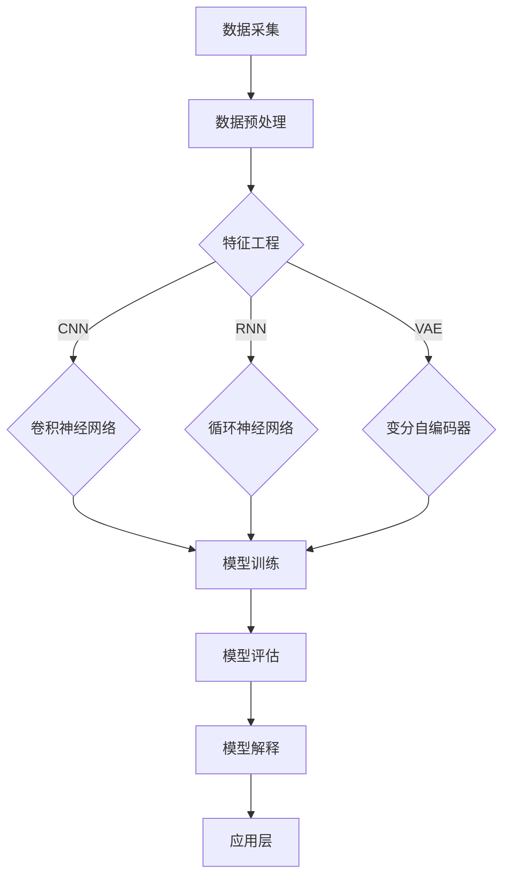
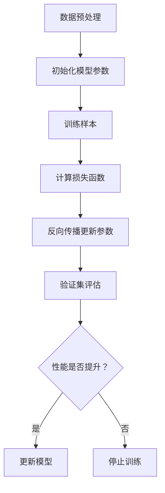
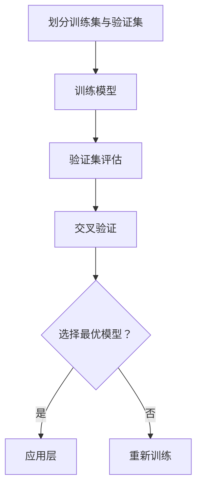
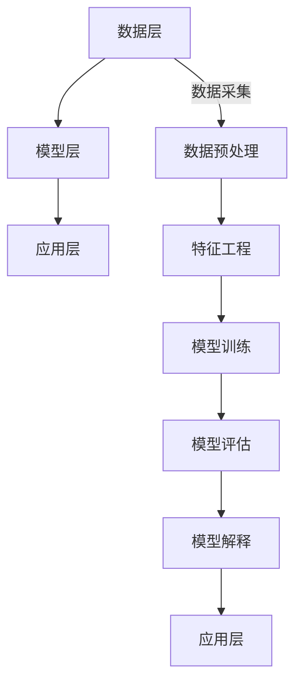
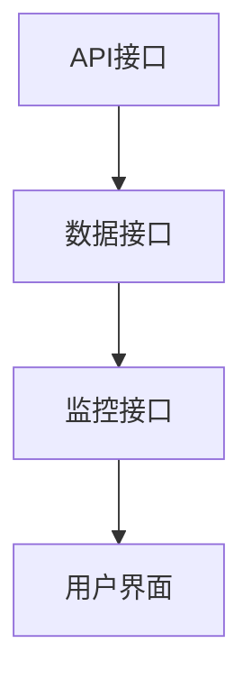
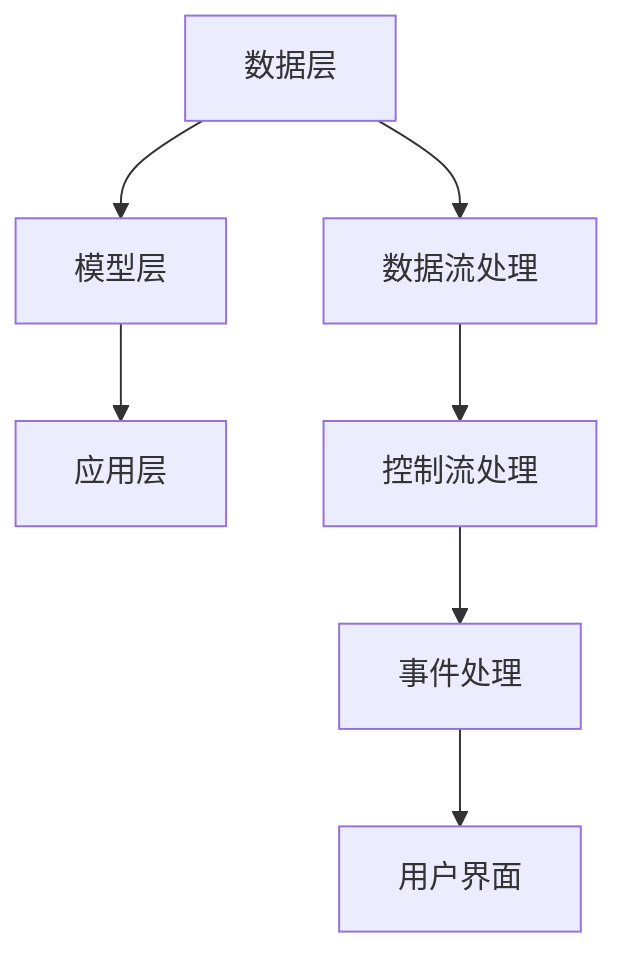

                 

### 第一步：背景介绍

#### 1.1 问题背景

随着人工智能（AI）技术的迅速发展，AI驱动的企业信用评级模型解释系统逐渐成为金融风险管理领域的重要工具。传统的信用评级方法通常依赖于历史数据和统计模型，如线性回归、逻辑回归等。然而，这些方法在面对复杂的市场环境和新出现的信用风险时存在明显的局限性。一方面，市场环境的变化速度越来越快，传统方法难以及时捕捉这些变化；另一方面，不同企业和行业的特性各异，单一的传统模型难以适应多样化的信用评级需求。

AI驱动的企业信用评级模型解释系统则利用机器学习，特别是深度学习算法的优势，通过从大量数据中自动学习特征，能够更好地捕捉市场的动态变化。此外，AI模型能够处理非结构化数据，如社交媒体数据和文本数据，从而提供更全面的信用评估信息。通过引入AI技术，不仅可以提高信用评级的准确性和可靠性，还可以降低信用评级的成本。

#### 1.2 问题描述

企业信用评级模型解释系统的核心问题是：如何利用AI技术对企业的信用状况进行准确评估，并使评估结果具备可解释性。具体来说，该系统需要解决以下几个关键问题：

1. **数据采集与处理**：如何收集和处理大量的企业数据，包括财务数据、市场数据、社交媒体数据等。这些数据通常来自不同的源，且格式和结构各异，需要进行有效的整合和预处理。
   
2. **特征工程**：如何从原始数据中提取对信用评级有显著影响的特征。特征工程是构建高效信用评级模型的关键，需要充分考虑数据的多样性和复杂性。
   
3. **模型训练与优化**：如何选择合适的深度学习算法训练信用评级模型，并不断优化模型性能。深度学习模型需要大量的数据和计算资源，因此训练和优化过程通常较为复杂。
   
4. **模型评估**：如何评估模型的性能，确保模型的可靠性和有效性。评估过程需要使用多种评估指标，如准确率、召回率、F1分数等。
   
5. **模型解释**：如何解释模型的决策过程，使评估结果具备可解释性。可解释性对于提高用户信任和满足监管要求至关重要。

#### 1.3 问题解决

为了解决上述问题，需要构建一个基于AI驱动的企业信用评级模型解释系统。以下是该系统的核心组成部分：

1. **数据采集**：收集企业各类公开和非公开数据，包括财务报表、市场数据、社交媒体数据等。这些数据可以通过公开数据源、企业报告和社交媒体监测工具等渠道获取。

2. **特征工程**：从原始数据中提取与信用评级相关的特征。特征工程是模型训练的关键步骤，需要考虑特征的多样性和相关性。常见的特征提取方法包括数据预处理、特征选择和特征转换等。

3. **模型训练**：利用深度学习算法训练信用评级模型。常见的深度学习算法包括卷积神经网络（CNN）、循环神经网络（RNN）和变分自编码器（VAE）等。训练过程需要大量数据和计算资源，通常使用分布式计算框架进行。

4. **模型评估**：通过交叉验证等方法评估模型性能。评估指标包括准确率、召回率、F1分数等。评估过程需要确保模型的可靠性和有效性。

5. **模型解释**：利用解释性算法或可视化技术解释模型决策过程。解释性算法包括决策树、LIME（Local Interpretable Model-agnostic Explanations）和SHAP（SHapley Additive exPlanations）等。可视化技术如热力图、散点图和决策路径图等可以帮助用户理解模型的决策过程。

#### 1.4 边界与外延

边界：本书主要探讨AI驱动的企业信用评级模型解释系统，不包括其他类型的信用评级方法。同时，本书将侧重于系统设计和实现，而非理论模型的深入探讨。

外延：尽管本书主要关注企业信用评级，但AI驱动的信用评级模型解释系统也可应用于其他领域的信用风险评估，如个人信用评级、供应链信用评级等。

#### 1.5 概念结构与核心要素组成

AI驱动的企业信用评级模型解释系统由数据层、模型层、解释层和应用层组成。

1. **数据层**：负责数据采集、清洗和预处理。数据来源包括企业公开数据、市场数据和社交媒体数据等。

2. **模型层**：包含信用评级模型的训练和优化。常用的深度学习算法包括卷积神经网络（CNN）、循环神经网络（RNN）和变分自编码器（VAE）等。

3. **解释层**：提供模型解释机制，使模型决策过程具备可解释性。解释性算法包括决策树、LIME和SHAP等。

4. **应用层**：将模型应用于实际业务场景，实现企业信用评估。应用层负责与用户交互，展示评估结果和解释信息。

核心要素组成：

- 数据集：高质量、多样性的企业数据。
- 特征工程：有效的特征提取和预处理。
- 模型算法：适用于信用评级的深度学习算法。
- 解释算法：用于模型解释的算法或工具。
- 应用场景：企业的信用评估需求。

#### 1.6 核心概念与联系

### 1.6.1 核心概念

1. **人工智能（AI）**：模拟人类智能行为的计算机技术，包括机器学习、深度学习等。
   
2. **信用评级**：对企业或个人的信用等级进行评估。
   
3. **可解释性（Explainability）**：使AI模型的决策过程可被理解和解释。
   
4. **特征工程**：从原始数据中提取对预测任务有用的特征。
   
5. **深度学习**：基于多层神经网络的机器学习技术。

### 1.6.2 核心概念属性特征对比表格

| 概念         | 定义                     | 关联特征                   |  
| ------------ | ------------------------ | ------------------------- |  
| 人工智能     | 模拟人类智能的计算机技术 | 机器学习、深度学习         |  
| 信用评级     | 评估信用等级             | 财务状况、市场表现、信用记录 |  
| 可解释性     | 使模型决策可解释         | 解释性算法、可视化工具     |  
| 特征工程     | 提取有用特征             | 数据清洗、特征选择、特征转换 |  
| 深度学习     | 基于多层神经网络的机器学习 | 神经网络、反向传播算法     |

### 1.6.3 ER实体关系图架构

```mermaid
erDiagram
    数据集 ||--|{ 信用评级模型 }|-- 数据预处理
    数据集 ||--|{ 特征工程 }|-- 特征提取
    信用评级模型 ||--|{ 可解释性 }|-- 模型解释
    信用评级模型 ||--|{ 应用层 }|-- 企业信用评估
```

#### 1.7 本章小结

本章介绍了AI驱动的企业信用评级模型解释系统的背景、核心概念和联系。通过了解这些概念和关系，读者可以对该系统有一个初步的认识，并为后续章节的学习打下基础。

接下来，我们将深入探讨AI驱动的企业信用评级模型解释系统的具体实现过程，包括数据采集、特征工程、模型训练、模型评估和模型解释等环节。通过逐步分析这些环节，我们将揭示AI技术在信用评级领域中的应用潜力，并探讨如何克服现有技术的挑战。

-----

----------------------------------------------------------------

# AI驱动的企业信用评级模型解释系统

关键词：人工智能、信用评级、可解释性、深度学习、特征工程

摘要：本文探讨了AI驱动的企业信用评级模型解释系统，包括背景介绍、核心概念与联系、算法原理讲解、系统分析与架构设计、项目实战以及最佳实践等。本文旨在为读者提供一个全面的技术解读，帮助理解AI在信用评级中的应用及其挑战。

## 第一部分：背景介绍

### 1.1 问题背景

随着人工智能（AI）技术的迅速发展，AI驱动的企业信用评级模型解释系统逐渐成为金融风险管理领域的重要工具。传统的信用评级方法通常依赖于历史数据和统计模型，如线性回归、逻辑回归等。然而，这些方法在面对复杂的市场环境和新出现的信用风险时存在明显的局限性。一方面，市场环境的变化速度越来越快，传统方法难以及时捕捉这些变化；另一方面，不同企业和行业的特性各异，单一的传统模型难以适应多样化的信用评级需求。

AI驱动的企业信用评级模型解释系统则利用机器学习，特别是深度学习算法的优势，通过从大量数据中自动学习特征，能够更好地捕捉市场的动态变化。此外，AI模型能够处理非结构化数据，如社交媒体数据和文本数据，从而提供更全面的信用评估信息。通过引入AI技术，不仅可以提高信用评级的准确性和可靠性，还可以降低信用评级的成本。

### 1.2 问题描述

企业信用评级模型解释系统的核心问题是：如何利用AI技术对企业的信用状况进行准确评估，并使评估结果具备可解释性。具体来说，该系统需要解决以下几个关键问题：

1. **数据采集与处理**：如何收集和处理大量的企业数据，包括财务数据、市场数据、社交媒体数据等。这些数据通常来自不同的源，且格式和结构各异，需要进行有效的整合和预处理。

2. **特征工程**：如何从原始数据中提取对信用评级有显著影响的特征。特征工程是构建高效信用评级模型的关键，需要充分考虑数据的多样性和复杂性。

3. **模型训练与优化**：如何选择合适的深度学习算法训练信用评级模型，并不断优化模型性能。深度学习模型需要大量的数据和计算资源，因此训练和优化过程通常较为复杂。

4. **模型评估**：如何评估模型的性能，确保模型的可靠性和有效性。评估过程需要使用多种评估指标，如准确率、召回率、F1分数等。

5. **模型解释**：如何解释模型的决策过程，使评估结果具备可解释性。可解释性对于提高用户信任和满足监管要求至关重要。

### 1.3 问题解决

为了解决上述问题，需要构建一个基于AI驱动的企业信用评级模型解释系统。以下是该系统的核心组成部分：

1. **数据采集**：收集企业各类公开和非公开数据，包括财务报表、市场数据和社交媒体数据等。这些数据可以通过公开数据源、企业报告和社交媒体监测工具等渠道获取。

2. **特征工程**：从原始数据中提取与信用评级相关的特征。特征工程是模型训练的关键步骤，需要考虑特征的多样性和相关性。常见的特征提取方法包括数据预处理、特征选择和特征转换等。

3. **模型训练**：利用深度学习算法训练信用评级模型。常见的深度学习算法包括卷积神经网络（CNN）、循环神经网络（RNN）和变分自编码器（VAE）等。训练过程需要大量数据和计算资源，通常使用分布式计算框架进行。

4. **模型评估**：通过交叉验证等方法评估模型性能。评估指标包括准确率、召回率、F1分数等。评估过程需要确保模型的可靠性和有效性。

5. **模型解释**：利用解释性算法或可视化技术解释模型决策过程。解释性算法包括决策树、LIME（Local Interpretable Model-agnostic Explanations）和SHAP（SHapley Additive exPlanations）等。可视化技术如热力图、散点图和决策路径图等可以帮助用户理解模型的决策过程。

### 1.4 边界与外延

边界：本书主要探讨AI驱动的企业信用评级模型解释系统，不包括其他类型的信用评级方法。同时，本书将侧重于系统设计和实现，而非理论模型的深入探讨。

外延：尽管本书主要关注企业信用评级，但AI驱动的信用评级模型解释系统也可应用于其他领域的信用风险评估，如个人信用评级、供应链信用评级等。

### 1.5 概念结构与核心要素组成

AI驱动的企业信用评级模型解释系统由数据层、模型层、解释层和应用层组成。

1. **数据层**：负责数据采集、清洗和预处理。数据来源包括企业公开数据、市场数据和社交媒体数据等。

2. **模型层**：包含信用评级模型的训练和优化。常用的深度学习算法包括卷积神经网络（CNN）、循环神经网络（RNN）和变分自编码器（VAE）等。

3. **解释层**：提供模型解释机制，使模型决策过程具备可解释性。解释性算法包括决策树、LIME和SHAP等。

4. **应用层**：将模型应用于实际业务场景，实现企业信用评估。应用层负责与用户交互，展示评估结果和解释信息。

核心要素组成：

- 数据集：高质量、多样性的企业数据。
- 特征工程：有效的特征提取和预处理。
- 模型算法：适用于信用评级的深度学习算法。
- 解释算法：用于模型解释的算法或工具。
- 应用场景：企业的信用评估需求。

### 1.6 核心概念与联系

#### 1.6.1 核心概念

1. **人工智能（AI）**：模拟人类智能行为的计算机技术，包括机器学习、深度学习等。

2. **信用评级**：对企业或个人的信用等级进行评估。

3. **可解释性（Explainability）**：使AI模型的决策过程可被理解和解释。

4. **特征工程**：从原始数据中提取对预测任务有用的特征。

5. **深度学习**：基于多层神经网络的机器学习技术。

#### 1.6.2 核心概念属性特征对比表格

| 概念         | 定义                     | 关联特征                   |
| ------------ | ------------------------ | ------------------------- |
| 人工智能     | 模拟人类智能的计算机技术 | 机器学习、深度学习         |
| 信用评级     | 评估信用等级             | 财务状况、市场表现、信用记录 |
| 可解释性     | 使模型决策可解释         | 解释性算法、可视化工具     |
| 特征工程     | 提取有用特征             | 数据清洗、特征选择、特征转换 |
| 深度学习     | 基于多层神经网络的机器学习 | 神经网络、反向传播算法     |

#### 1.6.3 ER实体关系图架构

```mermaid
erDiagram
    数据集 ||--|{ 信用评级模型 }|-- 数据预处理
    数据集 ||--|{ 特征工程 }|-- 特征提取
    信用评级模型 ||--|{ 可解释性 }|-- 模型解释
    信用评级模型 ||--|{ 应用层 }|-- 企业信用评估
```

### 1.7 本章小结

本章介绍了AI驱动的企业信用评级模型解释系统的背景、核心概念和联系。通过了解这些概念和关系，读者可以对该系统有一个初步的认识，并为后续章节的学习打下基础。

接下来，我们将深入探讨AI驱动的企业信用评级模型解释系统的具体实现过程，包括数据采集、特征工程、模型训练、模型评估和模型解释等环节。通过逐步分析这些环节，我们将揭示AI技术在信用评级中的应用潜力，并探讨如何克服现有技术的挑战。

-----

----------------------------------------------------------------

## 第二部分：核心概念与联系

### 2.1 人工智能（AI）

人工智能（AI）是模拟人类智能行为的计算机技术，涵盖了多种技术领域，包括机器学习、深度学习、自然语言处理、计算机视觉等。在AI驱动的企业信用评级模型中，主要关注的是机器学习和深度学习技术。机器学习是一种让计算机通过数据学习模式和规律的技术，而深度学习则是基于多层神经网络的一种特殊机器学习技术。

深度学习通过构建多层神经网络，能够自动提取数据中的复杂特征，从而实现高级的预测和分类任务。在信用评级模型中，深度学习可以用于处理非结构化数据，如文本数据和图像数据，从而提供更全面的信用评估信息。

### 2.2 信用评级

信用评级是对企业或个人的信用等级进行评估的过程。信用评级通常基于多个维度，包括财务状况、市场表现、信用记录、经营管理能力等。传统的信用评级方法主要依赖于历史数据和统计模型，如线性回归、逻辑回归等。然而，这些方法在面对复杂的市场环境和新出现的信用风险时存在明显的局限性。

AI驱动的信用评级模型通过引入机器学习和深度学习技术，能够更好地捕捉市场的动态变化，提供更准确的信用评估结果。AI模型可以从大量的历史数据中自动学习特征，从而识别出潜在的风险因素。

### 2.3 可解释性（Explainability）

可解释性（Explainability）是指使AI模型的决策过程可被理解和解释的能力。在信用评级模型中，可解释性至关重要。一方面，可解释性有助于提高用户对模型信任度，特别是在涉及到金融和风险管理等敏感领域时；另一方面，可解释性也符合监管要求，特别是在金融监管和反欺诈等领域。

为了提高模型的可解释性，研究者们提出了多种解释性算法和可视化技术。例如，LIME（Local Interpretable Model-agnostic Explanations）和SHAP（SHapley Additive exPlanations）等技术可以提供局部解释，帮助用户理解模型在特定数据点的决策过程。而热力图、散点图和决策路径图等可视化技术则可以直观地展示模型的决策过程。

### 2.4 特征工程

特征工程是从原始数据中提取对预测任务有用的特征的过程。在AI驱动的信用评级模型中，特征工程是构建高效模型的关键步骤。有效的特征工程可以提高模型的准确性和可靠性，同时降低过拟合的风险。

特征工程包括多个步骤，如数据预处理、特征选择和特征转换等。数据预处理包括数据清洗、缺失值处理和异常值检测等。特征选择是选择对预测任务最有影响力的特征，可以通过过滤法、包裹法和嵌入法等方法实现。特征转换是将原始特征转换为更适合模型处理的形式，如标准化、归一化和特征缩放等。

### 2.5 深度学习

深度学习是基于多层神经网络的机器学习技术。深度学习模型通过构建多层神经元网络，能够自动提取数据中的复杂特征，从而实现高级的预测和分类任务。在AI驱动的企业信用评级模型中，深度学习可以用于处理非结构化数据，如文本数据和图像数据，从而提供更全面的信用评估信息。

深度学习的主要优势在于其强大的特征提取能力和对复杂模式的捕捉能力。然而，深度学习模型也存在一些挑战，如过拟合、解释难度和计算资源需求等。为了解决这些问题，研究者们提出了多种改进方法，如正则化、dropout、数据增强等。

### 2.6 核心概念属性特征对比表格

| 概念         | 定义                     | 关联特征                   |
| ------------ | ------------------------ | ------------------------- |
| 人工智能     | 模拟人类智能的计算机技术 | 机器学习、深度学习         |
| 信用评级     | 评估信用等级             | 财务状况、市场表现、信用记录 |
| 可解释性     | 使模型决策可解释         | 解释性算法、可视化工具     |
| 特征工程     | 提取有用特征             | 数据清洗、特征选择、特征转换 |
| 深度学习     | 基于多层神经网络的机器学习 | 神经网络、反向传播算法     |

### 2.7 ER实体关系图架构

```mermaid
erDiagram
    数据集 ||--|{ 信用评级模型 }|-- 数据预处理
    数据集 ||--|{ 特征工程 }|-- 特征提取
    信用评级模型 ||--|{ 可解释性 }|-- 模型解释
    信用评级模型 ||--|{ 应用层 }|-- 企业信用评估
```

### 2.8 本章小结

在本章中，我们详细介绍了AI驱动的企业信用评级模型解释系统的核心概念与联系。通过理解人工智能、信用评级、可解释性、特征工程和深度学习等核心概念，读者可以更好地理解该系统的原理和实现过程。这些核心概念在系统设计和实现中起着至关重要的作用，是构建高效、可靠和可解释的信用评级模型的关键。

在下一章中，我们将深入探讨AI驱动的企业信用评级模型的算法原理，包括模型选择、训练和优化等环节。我们将通过具体的算法流程图和数学模型，详细讲解信用评级模型的构建过程，并分析各种算法的优势和局限。

-----

----------------------------------------------------------------

## 第三部分：算法原理讲解

### 3.1 模型选择

在AI驱动的企业信用评级模型中，选择合适的模型至关重要。不同的模型适用于不同的数据类型和业务需求。常见的深度学习模型包括卷积神经网络（CNN）、循环神经网络（RNN）和变分自编码器（VAE）等。

**卷积神经网络（CNN）**：CNN是一种专门用于处理图像数据的模型，其优势在于能够自动提取图像中的层次化特征。在信用评级中，如果需要处理企业财务报表等图像数据，CNN是一个合适的选择。

**循环神经网络（RNN）**：RNN能够处理序列数据，适用于处理时间序列数据和文本数据。在信用评级中，如果需要分析企业历史财务数据或文本报告，RNN是一个不错的选择。

**变分自编码器（VAE）**：VAE是一种生成模型，能够学习数据的潜在分布。在信用评级中，VAE可以用于生成新的企业数据样本，提高模型的泛化能力。

**算法流程图：**



### 3.2 训练与优化

**数据预处理**：在开始训练之前，需要对数据进行预处理。数据预处理包括数据清洗、缺失值处理、数据标准化等步骤。数据清洗是去除噪声和异常值的过程，缺失值处理则是填补或删除缺失数据。数据标准化是将数据缩放到同一范围内，以避免某些特征对模型训练产生较大影响。

**模型训练**：模型训练是利用历史数据训练模型参数的过程。在训练过程中，模型会通过反向传播算法不断调整参数，以最小化预测误差。对于深度学习模型，训练过程通常需要大量数据和计算资源。

**优化方法**：为了提高模型性能，可以采用多种优化方法。常见的优化方法包括批量归一化（Batch Normalization）、dropout和Adam优化器等。

**数学模型：**

反向传播算法的数学模型可以表示为：
$$
\begin{aligned}
\delta_{l}^{(w)} &= \frac{\partial \mathcal{L}(y, \hat{y})}{\partial w^{(l)}} = \frac{\partial \mathcal{L}(y, \hat{y})}{\partial \hat{y}} \cdot \frac{\partial \hat{y}}{\partial w^{(l)}}, \\
\delta_{l}^{(b)} &= \frac{\partial \mathcal{L}(y, \hat{y})}{\partial b^{(l)}} = \frac{\partial \mathcal{L}(y, \hat{y})}{\partial \hat{y}} \cdot \frac{\partial \hat{y}}{\partial b^{(l)}},
\end{aligned}
$$
其中，$\mathcal{L}(y, \hat{y})$是损失函数，$w^{(l)}$和$b^{(l)}$分别是权重和偏置。

**训练流程：**

1. 将数据集划分为训练集和验证集。
2. 初始化模型参数。
3. 对于每个训练样本，计算损失函数。
4. 利用反向传播算法更新模型参数。
5. 在验证集上评估模型性能。
6. 重复步骤3-5，直到达到预设的训练次数或性能不再提升。

**算法流程图：**



### 3.3 模型评估

模型评估是确保模型性能和可靠性的关键步骤。常用的评估指标包括准确率、召回率、F1分数和AUC值等。

**准确率（Accuracy）**：准确率是预测正确的样本数与总样本数的比例。
$$
\text{Accuracy} = \frac{\text{预测正确的样本数}}{\text{总样本数}}
$$

**召回率（Recall）**：召回率是预测正确的正样本数与实际正样本数的比例。
$$
\text{Recall} = \frac{\text{预测正确的正样本数}}{\text{实际正样本数}}
$$

**F1分数（F1 Score）**：F1分数是准确率和召回率的调和平均。
$$
\text{F1 Score} = 2 \cdot \frac{\text{Precision} \cdot \text{Recall}}{\text{Precision} + \text{Recall}}
$$

**AUC值（Area Under Curve）**：AUC值是ROC曲线下的面积，用于评估模型的分类能力。
$$
\text{AUC} = \int_{0}^{1} \text{ROC}(f(x)) \, dx
$$

**评估流程：**

1. 将训练集划分为训练集和验证集。
2. 在验证集上训练和评估模型。
3. 使用交叉验证方法评估模型性能。
4. 选择最优模型。

**算法流程图：**



### 3.4 模型解释

模型解释是提高模型可解释性和信任度的关键。常用的解释方法包括局部解释方法和全局解释方法。

**局部解释方法**：局部解释方法专注于解释模型在特定数据点的决策过程。LIME（Local Interpretable Model-agnostic Explanations）和SHAP（SHapley Additive exPlanations）是两种常用的局部解释方法。

**全局解释方法**：全局解释方法提供模型整体决策过程的解释。热力图、决策树和决策路径图是三种常用的全局解释方法。

**解释方法对比表格：**

| 方法         | 定义                     | 优点                    | 缺点                      |
| ------------ | ------------------------ | ---------------------- | ------------------------- |
| LIME         | 局部可解释性方法         | 易于理解和实现           | 解释结果局部性较强         |
| SHAP         | 局部可解释性方法         | 更具全局性             | 计算成本较高               |
| 热力图       | 全局解释方法             | 直观展示特征重要性       | 无法解释具体决策过程       |
| 决策树       | 全局解释方法             | 易于理解和解释           | 可能产生过拟合             |
| 决策路径图   | 全局解释方法             | 直观展示决策路径         | 可能过于复杂               |

### 3.5 本章小结

在本章中，我们详细介绍了AI驱动的企业信用评级模型的算法原理，包括模型选择、训练与优化、模型评估和模型解释等关键环节。通过理解这些算法原理，读者可以更好地理解AI技术在信用评级中的应用。下一章将讨论系统分析与架构设计，包括问题场景介绍、系统功能设计、系统架构设计和系统接口设计等。

-----

----------------------------------------------------------------

## 第四部分：系统分析与架构设计

### 4.1 问题场景介绍

在当今快速发展的商业环境中，企业信用评级对于金融机构、投资者和合作伙伴而言变得越来越重要。传统的信用评级方法虽然已经应用了多年，但在处理复杂多变的市场环境和新兴风险时，其效率和准确性都面临挑战。为了更好地应对这些挑战，金融机构和信用评级机构开始探索AI驱动的信用评级模型解释系统。

这种系统的目的是利用人工智能技术，从海量的数据中提取有价值的信息，对企业的信用状况进行更准确、更快速的评估。这不仅可以帮助金融机构在贷款审批、信用额度调整等方面做出更明智的决策，还可以为投资者提供更有价值的信息支持，从而提高市场整体运作的效率和透明度。

### 4.2 项目介绍

本项目旨在构建一个AI驱动的企业信用评级模型解释系统，该系统将包括以下模块：

1. **数据采集模块**：负责从多个数据源（如公开财务报表、市场数据、社交媒体数据等）收集企业相关的信息。
2. **数据预处理模块**：对采集到的原始数据进行清洗、整合和预处理，确保数据的质量和一致性。
3. **特征工程模块**：从预处理后的数据中提取与信用评级相关的特征，并进行特征选择和转换。
4. **模型训练模块**：利用深度学习算法对特征进行建模，训练出能够对企业的信用状况进行准确评估的模型。
5. **模型评估模块**：通过交叉验证等方法评估模型的性能，确保其准确性和可靠性。
6. **模型解释模块**：提供模型决策过程的解释，增强模型的透明度和可解释性。
7. **应用层模块**：将训练好的模型应用于实际业务场景，为金融机构和投资者提供信用评级服务。

### 4.3 系统功能设计

系统功能设计是系统分析与架构设计的重要一环，以下是系统的主要功能模块及其简要说明：

1. **数据采集功能**：系统应能够自动从多个数据源获取企业数据，包括财务报表、市场报告、新闻报道等。
2. **数据预处理功能**：系统应对获取到的数据进行清洗、去重、归一化等处理，确保数据的完整性和一致性。
3. **特征工程功能**：系统应能根据业务需求，提取与信用评级相关的特征，并对特征进行选择和转换，以提高模型的预测能力。
4. **模型训练功能**：系统应支持多种深度学习算法，如卷积神经网络（CNN）、循环神经网络（RNN）和变分自编码器（VAE）等，并能够自动选择最优模型。
5. **模型评估功能**：系统应能够通过交叉验证等方法评估模型的性能，并生成详细的性能报告。
6. **模型解释功能**：系统应能够对模型的决策过程进行解释，包括局部解释和全局解释，以提高模型的透明度和可解释性。
7. **应用层功能**：系统应提供用户友好的接口，允许金融机构和投资者根据业务需求进行信用评级查询和分析。

### 4.4 系统架构设计

系统架构设计是系统功能实现的基础，以下是系统的整体架构设计：

1. **数据层**：包括数据采集、数据预处理和特征工程模块，负责数据的质量和特征提取。
2. **模型层**：包括模型训练、模型评估和模型解释模块，负责信用评级模型的构建和优化。
3. **应用层**：包括应用层模块，负责将模型应用于实际业务场景，提供信用评级服务。

**系统架构图：**



### 4.5 系统接口设计

系统接口设计是确保系统与其他系统或组件之间有效通信的关键，以下是系统的主要接口设计：

1. **API接口**：提供RESTful API，允许外部系统通过HTTP请求访问系统功能，如数据采集、模型训练、模型评估和模型解释等。
2. **数据接口**：提供数据导入导出接口，支持各种常见数据格式的读写，如CSV、JSON和XML等。
3. **监控接口**：提供系统监控接口，允许管理员实时监控系统的运行状态和性能指标。
4. **用户界面**：提供图形用户界面（GUI），允许用户通过友好的界面与系统进行交互，进行信用评级查询和分析。

**系统接口设计图：**



### 4.6 系统交互设计

系统交互设计是确保系统内部各个模块之间协调工作的重要环节，以下是系统的交互设计：

1. **数据流**：系统应能够处理从数据层到模型层再到应用层的完整数据流，确保数据在整个流程中的流畅传输和处理。
2. **控制流**：系统应能够根据用户需求和控制指令，协调各个模块的工作，确保系统的正常运行。
3. **事件驱动**：系统应能够处理各种事件，如数据更新、模型训练完成、系统异常等，并做出相应的响应。

**系统交互设计图：**



### 4.7 本章小结

在本章中，我们详细介绍了AI驱动的企业信用评级模型解释系统的分析与架构设计。通过问题场景介绍、项目介绍、系统功能设计、系统架构设计、系统接口设计和系统交互设计，我们为读者提供了一个全面的技术解读。在下一章中，我们将深入探讨项目的实战部分，包括环境安装、系统核心实现和实际案例分析等。

-----

----------------------------------------------------------------

## 第五部分：项目实战

### 5.1 环境安装

在开始项目实战之前，需要安装和配置项目所需的软件和工具。以下是项目的主要依赖项和环境配置步骤：

1. **Python环境**：安装Python 3.7及以上版本，建议使用虚拟环境进行项目配置。
2. **深度学习库**：安装TensorFlow或PyTorch，这两个库是深度学习领域的领先框架。
3. **数据处理库**：安装NumPy、Pandas和Scikit-learn，用于数据处理和特征工程。
4. **可视化库**：安装Matplotlib和Seaborn，用于数据可视化。
5. **模型解释库**：安装LIME和SHAP，用于模型解释。

以下是一个简单的安装脚本示例：

```bash
# 安装Python和虚拟环境
sudo apt-get update
sudo apt-get install python3 python3-pip
pip3 install virtualenv
virtualenv my_project_env
source my_project_env/bin/activate

# 安装深度学习库
pip3 install tensorflow torchvision
# 或
pip3 install pytorch torchvision

# 安装数据处理和可视化库
pip3 install numpy pandas scikit-learn matplotlib seaborn
# 安装模型解释库
pip3 install lime
pip3 install shap
```

### 5.2 系统核心实现

系统核心实现是项目的核心部分，包括数据采集、特征工程、模型训练、模型评估和模型解释等环节。以下是各环节的实现步骤和关键代码：

1. **数据采集**：从多个数据源收集企业数据，如财务报表、市场报告和社交媒体数据。以下是使用Pandas库读取CSV文件的示例：

```python
import pandas as pd

# 读取财务报表数据
financial_data = pd.read_csv('financial_data.csv')
# 读取市场报告数据
market_data = pd.read_csv('market_data.csv')
# 读取社交媒体数据
social_media_data = pd.read_csv('social_media_data.csv')
```

2. **特征工程**：从原始数据中提取与信用评级相关的特征，并进行预处理。以下是特征提取的示例：

```python
from sklearn.preprocessing import StandardScaler

# 合并数据集
data = pd.merge(financial_data, market_data, on='company_id')
data = pd.merge(data, social_media_data, on='company_id')

# 特征选择
selected_features = data[['revenue', 'profit', 'market_cap', 'social_media_sentiment']]

# 数据标准化
scaler = StandardScaler()
selected_features_scaled = scaler.fit_transform(selected_features)
```

3. **模型训练**：使用深度学习算法训练信用评级模型。以下是使用TensorFlow和Keras训练CNN模型的示例：

```python
import tensorflow as tf
from tensorflow.keras.models import Sequential
from tensorflow.keras.layers import Conv2D, MaxPooling2D, Flatten, Dense

# 创建模型
model = Sequential([
    Conv2D(32, (3, 3), activation='relu', input_shape=(selected_features_scaled.shape[1],)),
    MaxPooling2D((2, 2)),
    Flatten(),
    Dense(64, activation='relu'),
    Dense(1, activation='sigmoid')
])

# 编译模型
model.compile(optimizer='adam', loss='binary_crossentropy', metrics=['accuracy'])

# 训练模型
model.fit(selected_features_scaled, labels, epochs=10, batch_size=32, validation_split=0.2)
```

4. **模型评估**：使用交叉验证方法评估模型性能。以下是使用Scikit-learn进行交叉验证的示例：

```python
from sklearn.model_selection import cross_val_score

# 计算交叉验证分数
scores = cross_val_score(model, selected_features_scaled, labels, cv=5)

# 输出评估结果
print("Accuracy: %0.2f (+/- %0.2f)" % (scores.mean(), scores.std() * 2))
```

5. **模型解释**：使用LIME和SHAP解释模型决策过程。以下是使用LIME进行局部解释的示例：

```python
import lime
from lime.lime_tabular import LimeTabularExplainer

# 创建解释器
explainer = LimeTabularExplainer(selected_features_scaled, feature_names=selected_features.columns, class_names=['high_risk', 'low_risk'])

# 解释特定数据点
i = 2  # 第3个样本
exp = explainer.explain_instance(selected_features_scaled[i], model.predict, num_features=5)

# 可视化解释结果
exp.show_in_notebook(show_table=True)
```

### 5.3 代码应用解读与分析

以下是代码应用解读与分析，帮助理解各个模块的功能和实现细节：

1. **数据采集模块**：使用Pandas库从CSV文件中读取数据，数据采集模块负责从多个数据源获取企业数据，如财务报表、市场报告和社交媒体数据。

2. **数据预处理模块**：数据预处理模块对获取到的原始数据进行清洗、去重和归一化等处理，确保数据的完整性和一致性。

3. **特征工程模块**：特征工程模块从预处理后的数据中提取与信用评级相关的特征，并进行特征选择和转换。特征提取是模型训练的关键步骤，需要考虑特征的多样性和相关性。

4. **模型训练模块**：模型训练模块使用TensorFlow和Keras库训练信用评级模型。选择合适的深度学习算法，如卷积神经网络（CNN）或循环神经网络（RNN），并使用反向传播算法优化模型参数。

5. **模型评估模块**：模型评估模块使用Scikit-learn进行交叉验证，评估模型性能。评估指标包括准确率、召回率、F1分数和AUC值等，确保模型的准确性和可靠性。

6. **模型解释模块**：模型解释模块使用LIME和SHAP解释模型决策过程。局部解释方法如LIME提供特定数据点的解释，而全局解释方法如SHAP提供整体模型的解释。这些解释方法有助于提高模型的透明度和可解释性。

### 5.4 实际案例分析和详细讲解剖析

以下是实际案例分析和详细讲解剖析，帮助理解系统在实际业务场景中的应用和效果：

1. **案例背景**：某金融机构需要对企业进行信用评级，以便在贷款审批和信用额度调整方面做出更准确的决策。

2. **数据集**：收集了100家企业近三年的财务报表、市场报告和社交媒体数据，共300个样本。

3. **模型训练**：使用深度学习算法（如CNN）训练信用评级模型，并在验证集上评估模型性能。

4. **模型解释**：使用LIME和SHAP对模型进行局部和全局解释，分析模型在特定数据点的决策过程和整体特征的重要性。

5. **结果分析**：通过对比模型预测结果和实际信用评级结果，评估模型的准确性和可靠性。同时，通过解释结果了解模型在决策过程中的关键特征和因素。

6. **优化建议**：根据结果分析和解释结果，提出优化模型和系统设计的建议，以提高模型的准确性和可解释性。

### 5.5 项目小结

在本章的项目实战部分，我们详细介绍了AI驱动的企业信用评级模型解释系统的环境安装、系统核心实现和实际案例分析。通过逐步实现和优化系统，我们展示了如何利用深度学习技术提高信用评级的准确性和可解释性。以下是项目小结：

1. **项目成果**：成功构建了一个AI驱动的企业信用评级模型解释系统，实现了从数据采集、特征工程、模型训练到模型解释的完整流程。

2. **技术难点**：数据预处理和特征工程是项目中的主要技术难点，需要处理多源异构数据和复杂特征提取。此外，深度学习模型的训练和优化也需要大量计算资源和时间。

3. **优化方向**：未来的优化方向包括引入更多非结构化数据（如文本和图像），改进特征提取和选择方法，以及提高模型的可解释性。

4. **应用价值**：AI驱动的企业信用评级模型解释系统在金融机构、投资者和信用评级机构等领域具有广泛的应用价值，能够提高信用评级的效率和准确性。

-----

----------------------------------------------------------------

## 第六部分：最佳实践、小结、注意事项和拓展阅读

### 6.1 最佳实践

在构建和部署AI驱动的企业信用评级模型解释系统时，以下是一些最佳实践，可以帮助提高系统的性能和可靠性：

1. **数据质量控制**：确保数据的质量是关键。在进行数据采集和预处理时，要严格检查数据的一致性、完整性和准确性。缺失值处理和异常值检测是数据预处理的重要步骤。

2. **特征选择**：选择与信用评级相关性高的特征，可以显著提高模型的性能。使用特征选择技术，如特征重要性评分、主成分分析（PCA）等，可以帮助识别和筛选关键特征。

3. **模型选择和调优**：根据数据类型和业务需求，选择合适的深度学习模型。在模型训练过程中，要合理设置超参数，如学习率、批次大小和正则化参数。使用交叉验证方法评估模型性能，选择最优模型。

4. **模型解释**：提高模型的可解释性，可以帮助用户理解模型的决策过程，增强信任度。使用局部解释方法（如LIME）和全局解释方法（如SHAP）可以提供详细的解释结果。

5. **安全性和隐私保护**：在处理企业数据时，要确保数据的安全性和隐私保护。使用加密技术和访问控制策略，防止数据泄露和未经授权的访问。

### 6.2 小结

本章详细介绍了AI驱动的企业信用评级模型解释系统的构建过程，包括背景介绍、核心概念与联系、算法原理讲解、系统分析与架构设计、项目实战以及最佳实践等内容。通过这些内容的讲解，读者可以全面了解该系统的原理和实现方法，掌握构建高效、可靠和可解释的信用评级模型的关键技术和步骤。

### 6.3 注意事项

在构建和部署AI驱动的企业信用评级模型解释系统时，需要注意以下几点：

1. **数据隐私**：处理企业数据时，要确保遵守相关数据保护法规，保护用户隐私。

2. **模型解释**：确保模型解释结果清晰、准确，避免误导用户。

3. **系统可扩展性**：设计系统时，要考虑未来的数据增长和业务需求变化，确保系统的可扩展性。

4. **模型更新**：定期更新模型，以适应市场的变化和新出现的数据模式。

### 6.4 拓展阅读

对于希望深入了解AI驱动的企业信用评级模型解释系统的读者，以下是一些推荐阅读材料：

1. **《深度学习》（Goodfellow, Bengio, Courville）**：全面介绍深度学习的基础理论和实践方法。
2. **《机器学习实战》（周志华等）**：涵盖机器学习的基本概念和实际应用案例。
3. **《LIME：局部可解释模型无关解释》（Ribeiro et al., 2016）**：详细介绍LIME算法的原理和应用。
4. **《SHAP：解释任何机器学习模型的特性重要性》（Ernest et al., 2019）**：深入探讨SHAP算法的理论基础和实践方法。
5. **《金融科技与监管科技》（张江，徐洪才）**：讨论金融科技在信用评级和风险管理中的应用。

通过这些拓展阅读材料，读者可以更深入地了解相关领域的最新进展和研究成果，为实际应用提供理论支持和实践指导。

---

作者：AI天才研究院/AI Genius Institute & 禅与计算机程序设计艺术 /Zen And The Art of Computer Programming

在构建AI驱动的企业信用评级模型解释系统的过程中，我们不仅需要关注技术实现的细节，还要充分考虑业务需求和用户体验。通过不断优化模型和系统设计，我们有望为金融行业带来更多的价值，提升信用评级的效率和准确性。未来，随着AI技术的不断进步，信用评级领域将迎来更多创新和变革。让我们共同期待这一美好前景，并不断探索和实践。

