                 

**第1章: 引言**

在当今这个数字化和智能化的时代，企业的运营和管理正面临着前所未有的挑战和机遇。特别是企业信用风险管理领域，随着全球经济一体化和金融市场的高度关联性，企业面临的风险传导问题日益凸显。传统的信用风险管理方法在复杂性和动态性方面显得力不从心，这就需要我们引入新的技术手段，如人工智能（AI），来应对这一挑战。

### 1.1 问题背景

企业信用风险传导是指企业内部或外部的信用风险因素通过一定的传导机制，从初始风险源传播到整个企业，甚至影响整个市场的过程。这种风险的传导不仅存在于企业之间的交易往来中，还涉及到供应链、金融系统等多个层面。随着信息技术的飞速发展，企业和金融机构积累了大量的数据，这些数据中蕴含了丰富的信用风险评估信息。然而，如何有效地利用这些数据，建立一套科学、智能的信用风险传导模拟系统，成为了当前研究的热点。

### 1.2 问题描述

传统的信用风险管理主要依赖于经验和专家判断，存在明显的主观性和滞后性。在复杂的市场环境下，企业需要能够实时、准确地评估信用风险，从而做出迅速的反应。然而，现有方法在处理大量数据、快速变化的市场动态和复杂的风险传导机制方面存在很大的局限性。这就需要借助人工智能技术，特别是机器学习和深度学习算法，来实现对企业信用风险的智能评估和传导模拟。

### 1.3 解决方案概述

本文提出的解决方案是基于AI驱动的企业信用风险传导模拟系统。该系统通过采集和分析企业内外部的各种数据，利用机器学习算法建立信用风险评估模型，并通过模拟实验验证和优化模型，最终为企业提供实时、准确的信用风险评估和风险传导预测。该系统具有以下几个特点：

1. **数据驱动的风险评估**：通过大量数据训练机器学习模型，提高风险评估的准确性和可靠性。
2. **实时风险监测**：系统能够实时处理和分析数据，及时发现和预警潜在风险。
3. **高度智能化**：利用深度学习算法，系统能够自主学习，不断优化风险评估模型。
4. **灵活的模拟实验**：通过模拟不同场景，评估系统在不同环境下的表现，为风险管理提供科学依据。

### 1.4 边界与外延

本文主要探讨基于AI的企业信用风险传导模拟系统的设计与实现，但这一研究的外延远不止于此。未来，随着人工智能技术的不断进步，该系统有望在金融、供应链管理、物流等领域得到广泛应用。此外，随着数据量的增加和数据种类的丰富，系统的模型和算法也需要不断迭代和优化，以应对更加复杂的风险传导场景。

### 1.5 核心概念与联系

为了更好地理解本文的研究内容，我们需要明确以下几个核心概念：

1. **人工智能**：人工智能是计算机科学的一个分支，旨在通过算法和模型，使计算机具备类似于人类智能的能力。
2. **机器学习**：机器学习是人工智能的一个重要分支，通过数据驱动的方式，让计算机自动学习和改进性能。
3. **深度学习**：深度学习是机器学习的一个子领域，主要使用多层神经网络进行复杂模式识别和学习。
4. **信用风险传导**：信用风险传导是指信用风险在企业内部或企业间传播的过程。
5. **风险管理**：风险管理是指通过识别、评估、监测和控制风险，保护企业利益的一系列措施。

这些概念相互关联，构成了本文研究的基础。在接下来的章节中，我们将逐步深入探讨这些概念，并详细描述AI驱动的企业信用风险传导模拟系统的设计、实现和应用。

---

在本文接下来的章节中，我们将详细探讨AI的核心概念与原理，深入理解企业信用风险传导的理论，并逐步构建和优化基于AI的企业信用风险传导模拟系统。通过系统的设计、模拟实验和应用案例，我们将展示该系统在实际操作中的效果和潜力，为企业和金融机构提供全新的信用风险管理工具。请继续关注后续章节，让我们一起探索这个充满挑战和机遇的领域。

---

### 关键词

- 人工智能
- 信用风险
- 风险传导
- 模拟系统
- 机器学习
- 深度学习

### 摘要

本文提出并探讨了基于人工智能（AI）的企业信用风险传导模拟系统。首先，通过介绍企业信用风险传导的背景和问题，明确了研究的重要性。接着，深入阐述了AI、机器学习和深度学习等核心概念，并分析了它们在信用风险评估中的应用。随后，详细描述了系统架构设计、数据采集与预处理、信用风险评估模型的构建过程，以及模拟实验的实施与结果分析。最后，通过实际应用案例展示了系统的效果，并提出了最佳实践建议。本文的研究为企业和金融机构提供了一种全新的信用风险管理工具，具有重要的实际意义和广阔的应用前景。

---

### 第2章: AI核心概念与原理

在深入探讨AI驱动的企业信用风险传导模拟系统之前，我们首先需要理解AI的基本概念与原理，特别是机器学习和深度学习。这些技术为信用风险评估提供了强大的工具，能够帮助企业更好地理解和预测风险。

#### 2.1 AI基础概念

人工智能（AI）是指计算机系统模拟人类智能行为的能力，包括感知、学习、推理、决策等。AI的研究目标是使计算机能够自主地完成复杂的任务，而不需要显式地编程。

##### 人工智能的定义与历史

人工智能的定义有多种，其中一种常见的定义是：“人工智能是使计算机表现出人类智能行为的科学和技术。”人工智能的研究历史可以追溯到20世纪50年代，当时出现了一批早期的人工智能研究项目，如逻辑推理程序、机器翻译等。然而，由于技术限制，这些早期的尝试大多未能实现预期效果。

##### 人工智能的主要研究领域

人工智能的研究领域非常广泛，主要包括：

1. **机器学习**：通过数据驱动的方式，让计算机自动学习和改进性能。
2. **深度学习**：基于多层神经网络，用于复杂模式识别和学习。
3. **自然语言处理**：使计算机能够理解和生成自然语言。
4. **计算机视觉**：使计算机能够理解和处理图像和视频。
5. **机器人学**：研究如何使机器人具备自主行动和操作能力。
6. **智能代理**：研究如何构建具有自主决策能力的智能系统。

##### 人工智能的发展趋势

随着计算能力的提升和大数据技术的发展，人工智能取得了显著的进步。当前，人工智能的应用已经渗透到生活的各个领域，如医疗、金融、教育、交通等。未来，人工智能有望实现更加广泛和深入的应用，特别是在解决复杂问题和提高生产效率方面。

#### 2.2 机器学习与深度学习

机器学习和深度学习是人工智能的两个重要分支，它们在信用风险评估中发挥着关键作用。

##### 机器学习的基本原理

机器学习是指通过算法和统计模型，从数据中自动学习规律和模式的过程。其主要目标是让计算机能够从已有数据中预测未知数据的行为。

###### 机器学习的主要类型

1. **监督学习**：通过已有的标记数据训练模型，然后使用该模型对未知数据进行预测。
2. **无监督学习**：在没有标记数据的情况下，通过算法自动发现数据中的模式。
3. **半监督学习**：结合监督学习和无监督学习的特点，使用部分标记数据和大量无标记数据训练模型。
4. **强化学习**：通过不断试错，让智能体在与环境互动中学习最优策略。

###### 机器学习的主要算法

1. **线性回归**：通过建立线性关系预测目标变量。
2. **逻辑回归**：用于分类问题，通过计算概率来预测类别。
3. **支持向量机**：通过找到一个最佳的超平面，将不同类别的数据分开。
4. **决策树**：通过一系列决策规则对数据进行分类或回归。
5. **随机森林**：通过构建多个决策树，并进行集成学习，提高模型的泛化能力。
6. **K-近邻算法**：通过计算新数据与训练数据的距离，选择最近的几个数据作为预测依据。

##### 深度学习的基本原理

深度学习是一种基于多层神经网络的学习方法，通过构建深度神经网络，对大量数据进行自动特征提取和模式识别。

###### 深度学习的主要架构

1. **卷积神经网络（CNN）**：主要用于图像和视频处理。
2. **循环神经网络（RNN）**：适用于处理序列数据，如文本和语音。
3. **长短时记忆网络（LSTM）**：RNN的改进版本，能够更好地处理长序列数据。
4. **生成对抗网络（GAN）**：通过生成器和判别器的对抗训练，生成高质量的图像和文本。

###### 深度学习的主要算法

1. **反向传播算法**：用于训练深度神经网络，通过不断调整网络权重，减小预测误差。
2. **卷积神经网络（CNN）**：用于图像识别和分类。
3. **循环神经网络（RNN）**：用于序列数据建模和预测。
4. **长短时记忆网络（LSTM）**：用于处理长序列数据。

#### 2.3 神经网络

神经网络是机器学习的基础，特别是深度学习。神经网络由大量的神经元（节点）组成，通过层层连接，形成复杂的计算网络。

##### 神经网络的基本结构

1. **输入层**：接收外部输入数据。
2. **隐藏层**：进行特征提取和变换。
3. **输出层**：生成最终预测结果。

##### 神经网络的训练过程

1. **初始化权重和偏置**：随机初始化网络的权重和偏置。
2. **前向传播**：输入数据经过网络层层的计算，生成输出。
3. **损失函数**：计算预测值与真实值之间的差异，通常使用均方误差（MSE）或交叉熵（Cross-Entropy）。
4. **反向传播**：计算损失函数关于网络参数的梯度，并更新权重和偏置。
5. **迭代训练**：重复上述过程，直到网络收敛到满意的性能。

#### 2.4 概率论与统计学基础

概率论和统计学是机器学习的重要理论基础。它们提供了理解和分析数据的方法，为模型的选择和评估提供了重要的工具。

##### 概率论的基本概念

1. **概率分布**：描述随机变量取值的概率。
2. **条件概率**：在某个事件已发生的条件下，另一个事件发生的概率。
3. **贝叶斯定理**：用于计算后验概率，是贝叶斯推理的基础。

##### 统计学的基本概念

1. **描述性统计**：用于描述数据的集中趋势和离散程度。
2. **推断性统计**：用于从样本数据推断总体特征。
3. **假设检验**：通过统计方法验证某个假设的正确性。

#### 2.5 机器学习算法简介

为了更好地理解机器学习算法在信用风险评估中的应用，我们简要介绍几种常见的机器学习算法。

##### 线性回归

线性回归是一种简单的机器学习算法，通过建立输入变量和输出变量之间的线性关系来预测目标变量。

###### 线性回归的数学模型

$$
Y = \beta_0 + \beta_1 \cdot X + \epsilon
$$

其中，$Y$为输出变量，$X$为输入变量，$\beta_0$和$\beta_1$为模型的参数，$\epsilon$为误差项。

###### 线性回归的Python实现

```python
import numpy as np
from sklearn.linear_model import LinearRegression

# 创建线性回归模型
model = LinearRegression()

# 训练模型
model.fit(X_train, y_train)

# 预测
y_pred = model.predict(X_test)
```

##### 逻辑回归

逻辑回归是一种用于分类问题的机器学习算法，通过计算输入数据的概率来预测类别。

###### 逻辑回归的数学模型

$$
P(Y=1) = \frac{1}{1 + e^{-(\beta_0 + \beta_1 \cdot X)}}
$$

其中，$P(Y=1)$为预测类别1的概率，$\beta_0$和$\beta_1$为模型的参数。

###### 逻辑回归的Python实现

```python
import numpy as np
from sklearn.linear_model import LogisticRegression

# 创建逻辑回归模型
model = LogisticRegression()

# 训练模型
model.fit(X_train, y_train)

# 预测
y_pred = model.predict(X_test)
```

##### 支持向量机

支持向量机是一种分类算法，通过找到一个最佳的超平面，将不同类别的数据分开。

###### 支持向量机的数学模型

$$
\max_{\beta, \beta_0} W^T W - C \sum_{i=1}^n \xi_i
$$

其中，$W$为超平面参数，$C$为惩罚参数，$\xi_i$为松弛变量。

###### 支持向量机的Python实现

```python
import numpy as np
from sklearn.svm import SVC

# 创建支持向量机模型
model = SVC()

# 训练模型
model.fit(X_train, y_train)

# 预测
y_pred = model.predict(X_test)
```

##### 决策树

决策树是一种基于树形结构进行决策的算法，通过一系列条件判断对数据进行分类或回归。

###### 决策树的数学模型

决策树通过一系列的if-else条件判断，将数据分割成不同的区域，每个区域对应一个预测结果。

###### 决策树的Python实现

```python
import numpy as np
from sklearn.tree import DecisionTreeClassifier

# 创建决策树模型
model = DecisionTreeClassifier()

# 训练模型
model.fit(X_train, y_train)

# 预测
y_pred = model.predict(X_test)
```

通过以上对AI核心概念与原理的介绍，我们为理解后续章节中的企业信用风险传导模拟系统奠定了基础。在接下来的章节中，我们将进一步探讨企业信用风险传导的理论，并详细描述系统设计、数据采集与预处理、模型构建以及模拟实验等内容。

---

在深入了解了AI的核心概念与原理之后，我们接下来将探讨企业信用风险传导的理论基础。理解这一理论，有助于我们更好地构建基于AI的信用风险传导模拟系统，从而为企业提供更准确、更有效的风险管理工具。请继续关注下一章节，我们将详细分析企业信用风险传导的基本概念、机制及其评估方法。

### 第3章: 企业信用风险传导理论

企业信用风险传导是指信用风险在企业内部或企业间传播的过程。这一过程不仅影响单个企业的财务状况，还可能对整个市场产生深远影响。理解信用风险传导的理论和机制，是构建基于AI的信用风险传导模拟系统的基础。

#### 3.1 企业信用风险概述

企业信用风险是指企业因无法履行债务或合同义务而导致的损失风险。信用风险主要包括以下几个方面的内容：

##### 信用风险的类型

1. **违约风险**：企业无法按时偿还债务的风险。
2. **道德风险**：企业在获取资金后可能采取不利于债权人利益的行为。
3. **流动性风险**：企业在短期内无法获得足够的资金以履行债务的风险。
4. **市场风险**：由于市场变化导致企业资产价值下降的风险。

##### 信用风险的特征

1. **不确定性**：信用风险的发生具有不确定性，无法提前完全预知。
2. **累积性**：信用风险可能随着时间的推移而不断累积。
3. **复杂性**：信用风险涉及多个因素，具有多维度和多层次的特征。
4. **动态性**：信用风险会随着市场环境和企业内部状况的变化而变化。

##### 信用风险的影响

信用风险对企业的影响是多方面的，主要包括：

1. **财务损失**：企业因信用风险可能导致的财务损失。
2. **市场信誉**：信用风险的爆发可能影响企业在市场中的声誉和信任度。
3. **业务运营**：信用风险可能导致企业无法正常运营，影响其业务流程。
4. **法律纠纷**：信用风险可能引发法律纠纷，增加企业的法律成本。

#### 3.2 信用风险传导机制

信用风险传导机制是指信用风险在企业内部或企业间传播的路径和方式。理解信用风险传导机制有助于企业识别和防范风险。

##### 信用风险传导的主要途径

1. **供应链传导**：企业在供应链中的合作伙伴发生信用风险，可能影响到整个供应链的稳定性和安全性。
2. **金融系统传导**：金融市场的波动和企业信用风险的传播可能对金融机构产生冲击，进而影响整个金融系统的稳定性。
3. **市场传导**：企业的信用风险可能通过市场渠道传播，影响投资者信心，导致市场动荡。
4. **跨国传导**：全球化和金融市场一体化使得信用风险可以在国际范围内传播。

##### 信用风险传导的影响因素

1. **市场环境**：宏观经济环境和市场波动是影响信用风险传导的重要因素。
2. **企业内部因素**：企业的财务状况、管理水平、业务模式等内部因素对信用风险传导有重要影响。
3. **金融机构行为**：金融机构的信贷政策、风险管理策略等行为会影响信用风险的传导。
4. **政策法规**：政策法规的变化可能会对信用风险传导产生重要影响。

#### 3.3 信用风险评估方法

信用风险评估是信用风险管理的重要环节，目的是对企业的信用风险进行量化评估，为企业提供决策依据。常见的信用风险评估方法包括以下几种：

##### 传统的信用风险评估方法

1. **专家评估法**：基于专家经验和专业知识对企业的信用风险进行评估。
2. **财务比率分析法**：通过计算企业的财务比率，分析企业的财务状况和偿债能力。
3. **信用评分法**：使用数学模型和统计方法对企业的信用风险进行量化评估。

##### 现代信用风险评估方法

1. **数据挖掘技术**：通过分析大量历史数据，挖掘出影响信用风险的关键因素。
2. **机器学习算法**：利用机器学习算法，对企业的信用风险进行预测和评估。
3. **深度学习模型**：利用深度学习模型，对复杂的数据进行自动特征提取和模式识别。

#### 3.4 信用风险管理体系

信用风险管理是企业为了降低信用风险而采取的一系列措施。一个完善的信用风险管理体系应包括以下几个方面：

##### 信用风险管理的主要环节

1. **风险评估**：对企业的信用风险进行量化评估，确定风险等级。
2. **风险控制**：采取相应的措施，降低信用风险的概率和影响。
3. **风险监测**：持续监测企业的信用状况，及时发现和预警风险。
4. **风险应对**：制定应对策略，有效应对信用风险事件。

##### 信用风险管理的工具与技术

1. **风险模型**：建立信用风险评估模型，用于量化信用风险。
2. **风险控制工具**：如信用保险、信用担保、信用限额等。
3. **风险监测系统**：通过信息技术手段，实现信用风险的实时监测和预警。

#### 3.5 信用风险管理工具与技术

随着信息技术的不断发展，信用风险管理工具和技术也日益丰富。以下是几种常见的信用风险管理工具和技术：

##### 信用评分系统

信用评分系统是一种基于数学模型和统计方法的信用风险评估工具。通过分析企业的财务数据、历史信用记录等，对企业的信用风险进行量化评估。

##### 信用保险

信用保险是一种金融工具，为企业在无法收回债务时提供保障。通过购买信用保险，企业可以将信用风险转移给保险公司。

##### 供应链金融

供应链金融是一种利用供应链中的核心企业，为上下游企业提供融资服务的模式。通过供应链金融，企业可以更好地管理信用风险，提高资金利用效率。

##### 信息技术应用

信息技术在信用风险管理中的应用日益广泛，如大数据分析、人工智能、区块链等。通过信息技术手段，企业可以实现对信用风险的实时监测、预警和自动化处理。

#### 总结

企业信用风险传导是一个复杂的过程，涉及到多个层面和多个环节。理解信用风险传导的理论和机制，有助于企业更好地进行信用风险管理。本文介绍了企业信用风险的基本概念、传导机制、评估方法和管理体系，为后续章节的AI驱动的信用风险传导模拟系统设计奠定了基础。在下一章中，我们将详细探讨AI驱动的企业信用风险传导模拟系统的设计与实现。

---

理解了企业信用风险传导的理论基础之后，我们接下来将进入系统的设计阶段。这一阶段将详细描述系统的整体架构、数据采集与预处理方法，以及信用风险评估模型的构建。通过这些步骤，我们将为企业提供一套高效、智能的信用风险传导模拟解决方案。请继续关注下一章节，我们将深入探讨系统设计的具体细节。

### 第4章: 系统架构设计

在了解了企业信用风险传导的理论基础之后，我们需要设计一套高效、智能的AI驱动的企业信用风险传导模拟系统。系统架构设计是整个项目开发的关键步骤，它决定了系统的功能完整性、性能优化和可扩展性。在本章中，我们将详细描述系统的整体架构、数据采集与预处理方法，以及信用风险评估模型的构建。

#### 4.1 系统功能设计

系统功能设计是系统架构设计的第一步，它明确了系统需要实现哪些功能，以及各个功能之间的交互关系。以下是系统的主要功能模块：

##### 1. 数据采集模块

数据采集模块负责从各种数据源（如金融系统、供应链管理系统、公共数据库等）收集相关的信用风险数据。这些数据包括企业的财务数据、历史信用记录、市场动态信息等。

##### 2. 数据预处理模块

数据预处理模块负责清洗、转换和归一化原始数据，以确保数据的质量和一致性。该模块还包括缺失值填充、异常值检测和噪声过滤等子功能。

##### 3. 信用风险评估模块

信用风险评估模块是系统的核心部分，通过机器学习算法和深度学习模型，对企业的信用风险进行定量评估。该模块包括数据特征提取、模型训练、模型评估和预测等步骤。

##### 4. 风险传导模拟模块

风险传导模拟模块通过模拟实验，分析信用风险在企业内部和跨企业之间的传导过程。该模块可以根据不同的场景设定，模拟不同的风险传导路径和影响。

##### 5. 风险监测与预警模块

风险监测与预警模块负责实时监测企业的信用状况，并根据评估结果触发预警机制。该模块可以通过短信、邮件、企业内部消息等多种方式通知相关人员。

##### 6. 用户交互界面模块

用户交互界面模块提供用户操作界面，使企业用户可以方便地使用系统功能，查看信用风险评估结果和风险传导模拟结果。该模块包括数据查询、报表生成、用户权限管理等功能。

#### 4.2 系统架构设计

系统架构设计是系统功能设计的基础，它决定了系统的结构、组件之间的交互方式以及系统的扩展性。以下是系统的架构设计：

##### 1. 系统总体架构

系统总体架构采用分布式架构，包括数据层、服务层和表示层。数据层负责数据存储和管理；服务层实现业务逻辑处理；表示层提供用户界面。

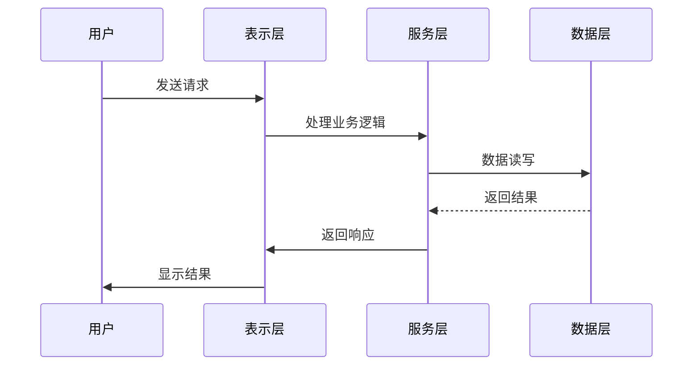

##### 2. 数据层设计

数据层采用关系数据库（如MySQL）和NoSQL数据库（如MongoDB）相结合的方式，存储和管理不同类型的数据。关系数据库用于存储结构化数据，如企业的财务报表和历史信用记录；NoSQL数据库用于存储非结构化数据，如市场动态和文本信息。

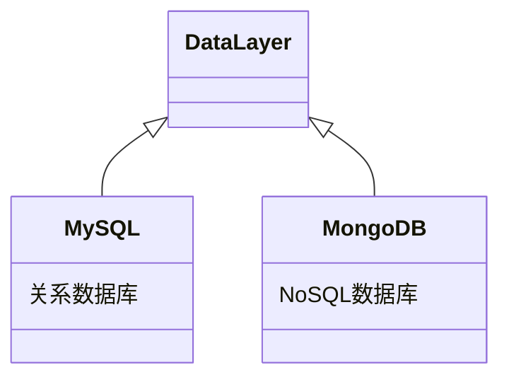

##### 3. 服务层设计

服务层采用微服务架构，将系统功能划分为多个独立的微服务。每个微服务负责实现特定的业务功能，并通过API进行通信。以下是系统的主要微服务：

1. **数据采集服务**：负责从各种数据源采集数据。
2. **数据预处理服务**：负责数据清洗、转换和归一化。
3. **信用风险评估服务**：负责信用风险评估模型的训练和预测。
4. **风险传导模拟服务**：负责风险传导模拟。
5. **风险监测与预警服务**：负责实时监测和预警。
6. **用户交互服务**：负责处理用户请求，提供操作界面。

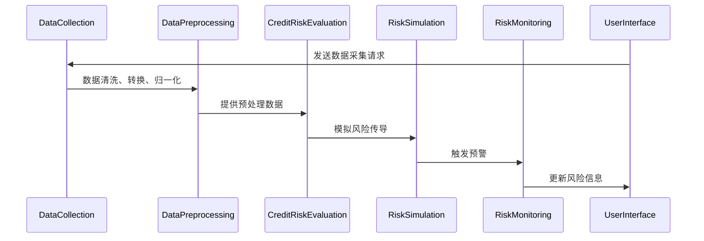

##### 4. 表示层设计

表示层采用前端技术（如React或Vue.js）和后端接口（如Spring Boot）相结合的方式，实现用户操作界面和业务逻辑处理。前端负责展示用户界面，后端负责处理业务逻辑和数据交互。

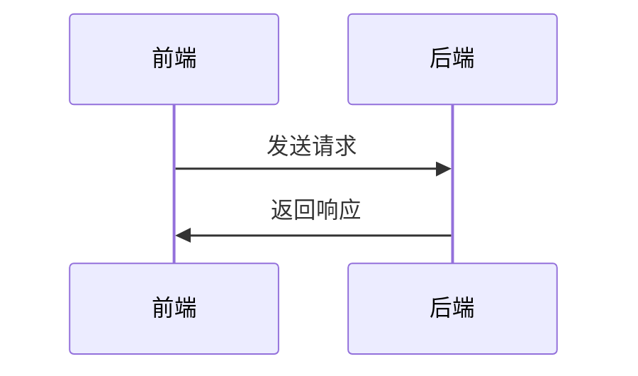

#### 4.3 系统接口设计

系统接口设计是系统架构设计的重要组成部分，它明确了各个模块之间的交互方式和数据传输格式。以下是系统的主要接口设计：

##### 1. 数据采集接口

数据采集接口用于从各种数据源获取信用风险数据。接口采用RESTful风格，支持GET和POST请求。

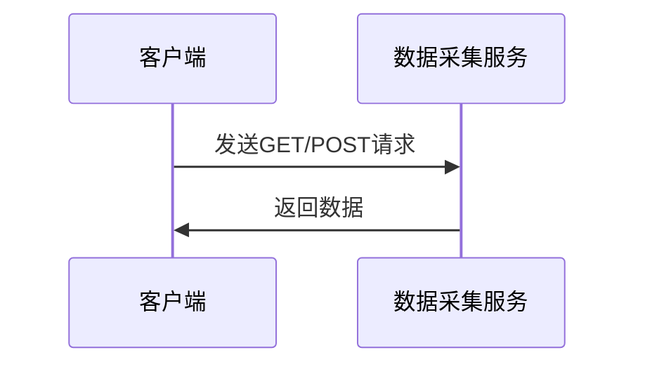

##### 2. 数据预处理接口

数据预处理接口用于处理数据清洗、转换和归一化操作。接口采用异步处理方式，支持批量数据操作。

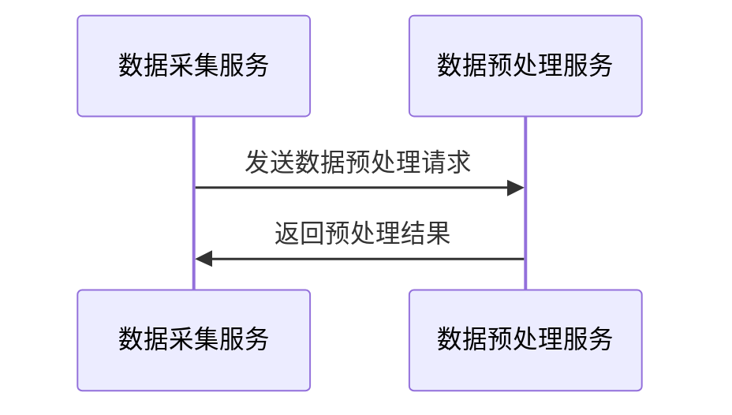

##### 3. 信用风险评估接口

信用风险评估接口用于进行信用风险评估模型的训练和预测。接口采用JSON格式，返回评估结果和模型参数。

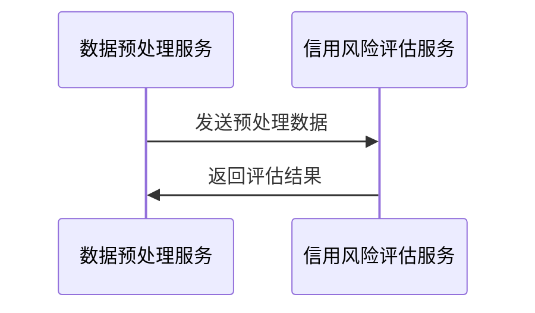

##### 4. 风险传导模拟接口

风险传导模拟接口用于进行信用风险传导模拟实验。接口支持自定义场景设置，返回模拟结果和风险传导路径。

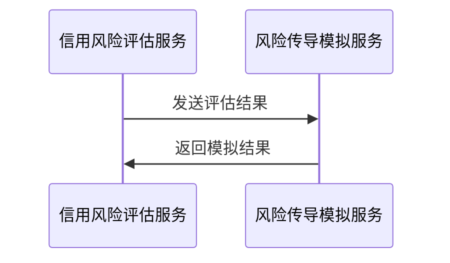

##### 5. 风险监测与预警接口

风险监测与预警接口用于实时监测企业信用状况，并触发预警机制。接口支持多种预警方式，如短信、邮件、内部消息等。

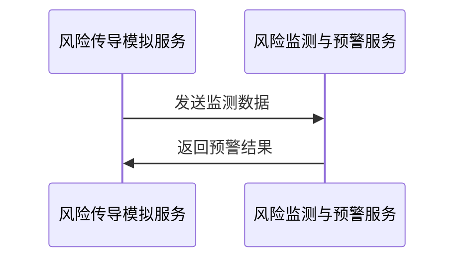

#### 4.4 系统交互设计

系统交互设计是系统架构设计的重要环节，它明确了系统内部各模块之间的交互流程和数据流。以下是系统的主要交互设计：

##### 1. 数据采集流程

数据采集流程包括数据采集、数据清洗、数据存储和数据查询等步骤。

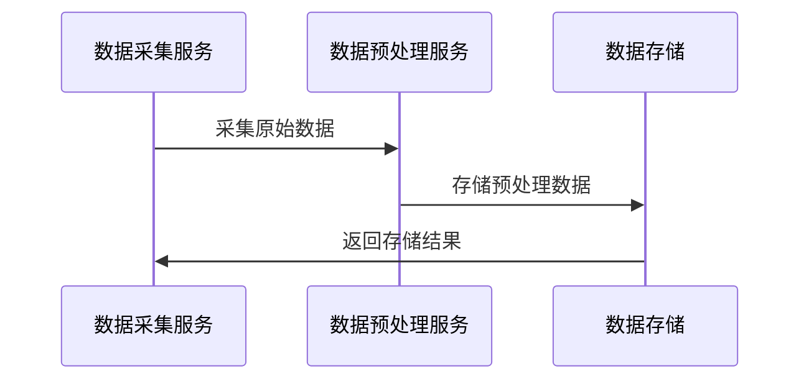

##### 2. 信用风险评估流程

信用风险评估流程包括数据预处理、模型训练、模型评估和预测等步骤。

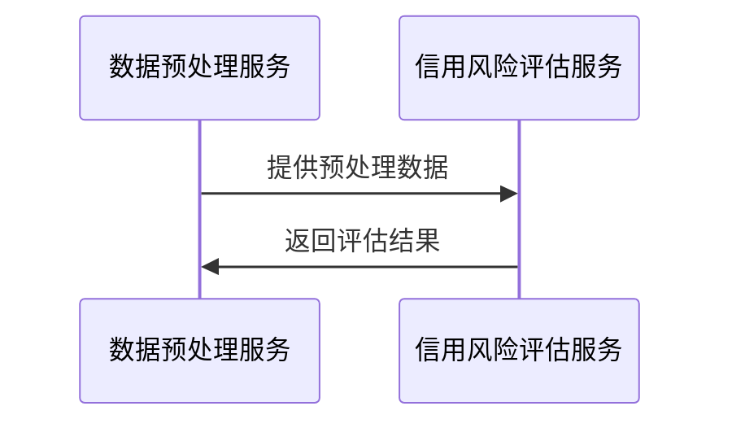

##### 3. 风险传导模拟流程

风险传导模拟流程包括数据输入、模拟设置、模拟执行和结果输出等步骤。

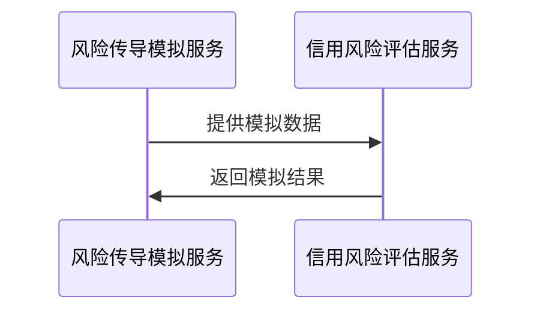

##### 4. 风险监测与预警流程

风险监测与预警流程包括数据采集、数据预处理、风险评估、风险监测和预警通知等步骤。

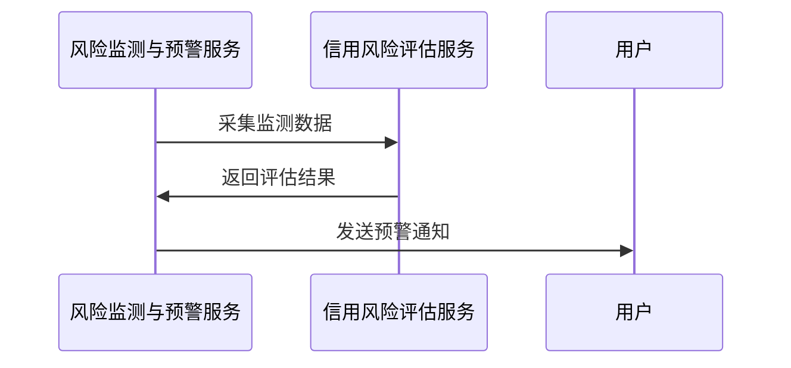

通过以上对系统架构设计的详细描述，我们为AI驱动的企业信用风险传导模拟系统奠定了坚实的基础。在下一章中，我们将详细介绍数据采集与预处理的过程，为模型构建做好准备。

---

在系统架构设计的基础上，我们接下来将讨论系统的数据采集与预处理。数据的质量和完整性是信用风险评估的关键因素，因此，如何有效地采集和处理数据是系统设计中的关键一步。在本章中，我们将详细介绍数据采集的方法、预处理流程以及数据质量评估方法，为信用风险评估模型的构建打下坚实基础。请继续关注下一章，我们将深入探讨这些关键环节。

### 第5章: 数据采集与预处理

在AI驱动的企业信用风险传导模拟系统中，数据的质量和完整性直接影响到模型的效果和预测准确性。因此，数据采集和预处理是系统设计中的关键环节。在这一章中，我们将详细介绍数据采集的方法、预处理流程以及数据质量评估方法，为后续的信用风险评估模型构建奠定基础。

#### 5.1 数据来源

数据来源是构建信用风险评估模型的基础。在AI驱动的系统中，数据来源主要包括以下几类：

1. **内部数据**：来自企业内部的各种数据，包括财务报表、客户交易记录、订单信息、支付行为等。
2. **外部数据**：来自企业外部的各种数据，包括市场动态、宏观经济指标、行业趋势、竞争对手信息等。
3. **第三方数据**：通过第三方数据供应商获取的数据，如征信机构、金融数据库等。

不同类型的数据源具有不同的特点和适用性。内部数据提供了企业运营的详细记录，有助于深入了解企业内部的信用风险；外部数据则提供了更广泛的市场视角，有助于识别市场环境对企业信用风险的影响；第三方数据则提供了权威性的参考，有助于提升模型的可信度。

#### 5.2 数据采集方法

数据采集是获取数据的过程，需要采用合适的方法确保数据的准确性和完整性。以下是几种常见的数据采集方法：

1. **自动化采集**：通过API接口、数据库连接、文件导入等方式，自动化地从数据源中获取数据。这种方法效率高、成本低，适用于大量数据的采集。
2. **手动采集**：通过人工方式，如问卷调查、访谈、电话回访等，获取数据。这种方法适用于数据量较小、数据来源不固定的情况。
3. **传感器采集**：通过传感器设备，如物联网设备、GPS定位设备等，采集实时数据。这种方法适用于需要实时监测的数据场景。
4. **网络爬虫**：通过网络爬虫技术，从互联网上抓取数据。这种方法适用于公开数据的采集。

选择合适的采集方法需要根据数据类型、数据量、数据源特性等因素进行综合考虑。自动化采集适用于大规模、稳定的数据源，手动采集适用于定制化、非结构化的数据，传感器采集适用于实时性要求高的数据，网络爬虫适用于公开数据的采集。

#### 5.3 数据预处理流程

数据预处理是对采集到的原始数据进行清洗、转换和归一化，以提高数据质量，为后续建模提供可靠的数据基础。以下是数据预处理的主要流程：

1. **数据清洗**：去除数据中的噪声和错误，包括处理缺失值、异常值、重复值等。缺失值可以通过填充方法（如均值填充、中值填充、最邻近填充等）进行处理；异常值可以通过统计方法（如箱线图、Z-score等）进行识别和处理；重复值可以通过去重操作进行删除。

2. **数据转换**：将数据转换为适合建模的形式，包括数值化处理、编码处理等。对于类别数据，可以通过独热编码（One-Hot Encoding）或标签编码（Label Encoding）进行处理；对于数值数据，可以通过标准化（Normalization）或归一化（Normalization）进行处理。

3. **特征工程**：从原始数据中提取有用的特征，以提升模型的效果。特征工程包括特征选择（Feature Selection）、特征构造（Feature Construction）等步骤。特征选择通过筛选出对模型影响较大的特征，降低模型的复杂性；特征构造通过创建新的特征，提高模型的解释能力和预测效果。

4. **数据归一化**：将不同特征的数据进行归一化处理，使其具有相同的尺度，避免特征之间的差异影响模型的训练效果。常见的归一化方法包括最小-最大规范化（Min-Max Scaling）和Z-Score规范化（Standardization）。

#### 5.4 数据质量评估

数据质量是信用风险评估模型效果的关键因素。数据质量评估是对数据完整度、一致性、准确性和有效性的评估，以确保数据适合建模和预测。以下是几种常见的数据质量评估方法：

1. **完整性评估**：检查数据是否存在缺失值，以及缺失值的比例和分布情况。对于缺失值较多的数据，需要考虑是否适合用于建模。
2. **一致性评估**：检查数据的一致性，包括数据格式的统一、数据值的逻辑一致性等。例如，检查不同数据源中的同一特征值是否一致。
3. **准确性评估**：评估数据源的准确性，包括数据的真实性、可靠性等。可以通过与已知数据源进行比较，或者通过验证数据来源的权威性来评估。
4. **有效性评估**：评估数据对建模和预测的有效性，包括数据的覆盖面、代表性等。需要确保数据能够全面反映企业信用风险的特征。

通过数据质量评估，可以识别和解决数据中的问题，提高数据质量，为建模提供可靠的数据支持。数据质量评估通常是一个持续的过程，需要在数据采集、预处理和建模的各个阶段进行。

#### 5.5 数据质量提升方法

为了提升数据质量，可以采用以下方法：

1. **数据清洗**：通过数据清洗工具和算法，自动识别和处理数据中的噪声和错误。
2. **数据集成**：将来自不同来源的数据进行集成，消除数据中的不一致性和冗余。
3. **数据标准化**：通过标准化处理，统一不同特征的数据尺度，提高数据的可比性。
4. **数据验证**：通过对比验证、交叉验证等方法，确保数据的准确性和可靠性。

通过数据采集与预处理，我们为AI驱动的企业信用风险传导模拟系统提供了可靠的数据基础。在下一章中，我们将详细介绍信用风险评估模型的构建过程，包括模型构建流程、特征工程、模型选择与训练等关键步骤。

---

在完成了数据的采集与预处理后，我们接下来将进入信用风险评估模型的构建阶段。这是整个系统的核心，通过机器学习算法和深度学习模型，我们将从大量数据中提取有用信息，为企业提供信用风险评估。在本章中，我们将详细介绍模型构建的流程、特征工程的方法、模型选择与训练的过程，以及模型评估与优化的技巧。请继续关注下一章，我们将深入探讨如何构建一个高效、准确的信用风险评估模型。

### 第6章: 信用风险评估模型构建

在完成了数据采集与预处理之后，我们需要将数据转化为能够用于预测和评估的模型。信用风险评估模型的构建是一个复杂的过程，涉及数据特征提取、模型选择与训练、模型评估与优化等多个步骤。在本章中，我们将详细讨论这些关键环节，以确保构建出的模型能够准确预测企业信用风险。

#### 6.1 模型构建流程

信用风险评估模型的构建通常包括以下步骤：

##### 1. 数据预处理

在构建模型之前，首先需要对数据进行预处理。这包括数据清洗、转换和归一化，以确保数据质量，提高模型性能。

##### 2. 特征工程

特征工程是模型构建过程中的重要步骤，它涉及从原始数据中提取有用的特征，并创建新的特征，以提升模型的预测能力。

##### 3. 模型选择

选择合适的模型是模型构建的关键。不同的模型适用于不同类型的数据和场景，需要根据实际情况进行选择。

##### 4. 模型训练

模型训练是通过机器学习算法，让模型学习如何从数据中提取模式和规律。这一步骤包括数据的划分、模型初始化、参数调整等。

##### 5. 模型评估

模型评估是验证模型性能的过程。通过评估指标（如准确率、召回率、F1分数等），判断模型是否达到预期的性能要求。

##### 6. 模型优化

模型优化是通过调整模型参数、添加特征等方式，提高模型的性能和预测准确性。

##### 7. 模型部署

模型部署是将训练好的模型应用于实际场景，对数据进行预测和评估。

#### 6.2 特征工程

特征工程是信用风险评估模型构建中的核心环节，它直接影响到模型的性能。以下是特征工程的主要步骤：

##### 1. 特征选择

特征选择是从原始数据中挑选出对模型影响较大的特征，以减少模型的复杂性，提高预测准确性。常见的特征选择方法包括：

- **相关性分析**：通过计算特征之间的相关性，选择相关性较高的特征。
- **信息增益**：选择能够带来最大信息增益的特征。
- **主成分分析（PCA）**：通过降维技术，减少特征数量，同时保留主要信息。

##### 2. 特征构造

特征构造是通过组合原始特征，创建新的特征，以提升模型的预测能力。常见的特征构造方法包括：

- **聚合特征**：将多个相关特征进行聚合，形成新的特征。
- **时间序列特征**：从时间序列数据中提取趋势、季节性等特征。
- **文本特征**：从文本数据中提取词频、词向量等特征。

##### 3. 特征标准化

特征标准化是将不同特征的数据进行归一化处理，使其具有相同的尺度，避免特征之间的差异影响模型的训练效果。常见的标准化方法包括：

- **最小-最大规范化（Min-Max Scaling）**：将特征值缩放到[0, 1]之间。
- **Z-Score规范化（Standardization）**：将特征值缩放到均值±3倍标准差的范围内。

#### 6.3 模型选择与训练

模型选择与训练是信用风险评估模型构建中的关键步骤。以下是常见的模型选择与训练方法：

##### 1. 模型选择

模型选择需要根据数据类型、数据量和问题场景进行选择。以下是几种常见的信用风险评估模型：

- **线性回归模型**：适用于线性关系明显的数据。
- **逻辑回归模型**：适用于二分类问题，可以计算每个类别的概率。
- **决策树模型**：适用于处理分类和回归问题，易于解释。
- **随机森林模型**：通过构建多个决策树并进行集成学习，提高模型的泛化能力。
- **支持向量机（SVM）模型**：适用于处理高维数据和线性不可分问题。
- **神经网络模型**：适用于处理复杂非线性关系，尤其是深度学习模型。

##### 2. 模型训练

模型训练是通过机器学习算法，让模型学习如何从数据中提取模式和规律。以下是常见的训练方法：

- **批量训练**：将所有数据一次性输入模型进行训练，适用于数据量较小的情况。
- **在线训练**：实时更新模型参数，适用于数据量较大、需要实时更新模型的情况。
- **交叉验证**：通过将数据划分为训练集和验证集，多次训练和验证，以评估模型的性能。

#### 6.4 模型评估与优化

模型评估与优化是确保模型性能的重要步骤。以下是常见的评估指标和优化方法：

##### 1. 评估指标

常见的评估指标包括：

- **准确率（Accuracy）**：预测正确的样本数占总样本数的比例。
- **召回率（Recall）**：预测正确的正样本数占总正样本数的比例。
- **精确率（Precision）**：预测正确的正样本数占预测为正样本数的比例。
- **F1分数（F1 Score）**：精确率和召回率的调和平均值。
- **ROC曲线**：通过计算真正例率和假正例率，评估模型的分类能力。
- **AUC（Area Under Curve）**：ROC曲线下的面积，用于评估模型的分类能力。

##### 2. 优化方法

常见的优化方法包括：

- **参数调整**：通过调整模型参数，提高模型的预测准确性。
- **特征选择**：通过筛选和构造新的特征，提高模型的泛化能力。
- **正则化**：通过引入正则化项，防止模型过拟合。
- **集成学习**：通过构建多个模型并进行集成，提高模型的性能。

#### 6.5 实际案例

为了更好地理解信用风险评估模型的构建过程，我们来看一个实际案例：

假设我们有一个企业信用风险评估项目，需要预测企业的信用评级。我们首先从内部数据源（如财务报表、订单信息）和外部数据源（如市场动态、行业指标）中采集数据。接下来，我们进行数据预处理，包括数据清洗、转换和归一化。

在特征工程阶段，我们提取了以下特征：

- **财务指标**：如总资产、净利润、资产负债率等。
- **业务指标**：如订单数量、客户满意度、市场份额等。
- **市场指标**：如行业增长率、市场波动率等。
- **文本特征**：从企业报告和公告中提取关键词，构建词频和词向量特征。

接下来，我们选择随机森林模型作为信用风险评估模型，并进行模型训练和评估。我们使用交叉验证方法，将数据划分为训练集和验证集，多次训练和验证模型，以评估其性能。

在模型评估阶段，我们使用准确率、召回率、F1分数等指标，评估模型的性能。根据评估结果，我们对模型进行优化，调整参数和特征，以提高模型的预测准确性。

最后，我们将训练好的模型部署到生产环境中，对新的企业数据进行预测和评估。通过持续监控和优化，我们不断提升模型的性能，为企业和金融机构提供可靠的信用风险评估服务。

通过以上实际案例，我们可以看到信用风险评估模型的构建是一个复杂但关键的过程。在下一章中，我们将详细介绍模拟实验的设计与实施，进一步验证模型的性能和应用价值。

---

完成了信用风险评估模型的构建之后，我们需要通过模拟实验来验证模型的有效性和可靠性。模拟实验的设计与实施是评估模型性能的重要环节，它可以帮助我们理解模型在不同场景下的表现，为实际应用提供科学依据。在本章中，我们将详细介绍模拟实验的设计原则、实验场景设置、数据集准备、实验步骤与流程，以及结果分析。

#### 7.1 实验设计原则

实验设计原则是确保实验结果可靠和有效的重要基础。以下是实验设计的主要原则：

##### 1. 目标明确

实验设计应明确实验的目标，即要解决的问题和评估的指标。只有明确了目标，才能设计出有效的实验方案。

##### 2. 控制变量

在实验过程中，应尽量控制其他变量不变，只改变一个或几个变量，以确定这些变量对实验结果的影响。这有助于确保实验结果的准确性。

##### 3. 可重复性

实验设计应保证实验的可重复性，即其他研究者能够在相同条件下重复实验，并得到相似的结果。这有助于验证实验结果的可靠性和科学性。

##### 4. 数据完整

实验过程中应确保数据的完整性，避免数据的遗漏或丢失。完整的实验数据是分析结果准确性的保障。

##### 5. 实验可操作

实验设计应确保实验的可操作性，即实验方案能够实际实施，且成本可控。这有助于实验的顺利进行。

#### 7.2 实验场景设置

实验场景设置是模拟实验的核心，它决定了实验的环境和条件。以下是实验场景设置的主要步骤：

##### 1. 确定实验场景

根据研究的具体目标，确定实验的场景。实验场景可以是一个实际的企业信用风险传导案例，也可以是模拟的场景。

##### 2. 设置实验变量

根据实验目标，确定实验的变量。实验变量包括输入变量（如企业的财务指标、市场指标等）和输出变量（如信用风险评分等）。

##### 3. 确定实验参数

根据实验场景，确定实验的参数。参数包括模型的参数、数据的采集和处理方法等。

##### 4. 设计实验流程

设计实验的流程，包括数据采集、模型训练、模型预测、结果评估等步骤。

#### 7.3 实验数据集准备

实验数据集是实验的基础，它决定了实验的结果。以下是实验数据集准备的主要步骤：

##### 1. 数据采集

根据实验场景，从内部数据源和外部数据源采集数据。数据包括企业的财务报表、订单信息、市场动态等。

##### 2. 数据清洗

对采集到的数据进行清洗，包括处理缺失值、异常值、重复值等。确保数据的质量和一致性。

##### 3. 数据预处理

对清洗后的数据进行预处理，包括数据转换、归一化、特征工程等。确保数据适合建模和预测。

##### 4. 数据集划分

将预处理后的数据划分为训练集、验证集和测试集。训练集用于训练模型，验证集用于调整模型参数，测试集用于评估模型的性能。

#### 7.4 实验步骤与流程

实验步骤与流程是实验实施的具体过程，以下是实验步骤与流程：

##### 1. 数据采集

从内部数据源和外部数据源采集数据。

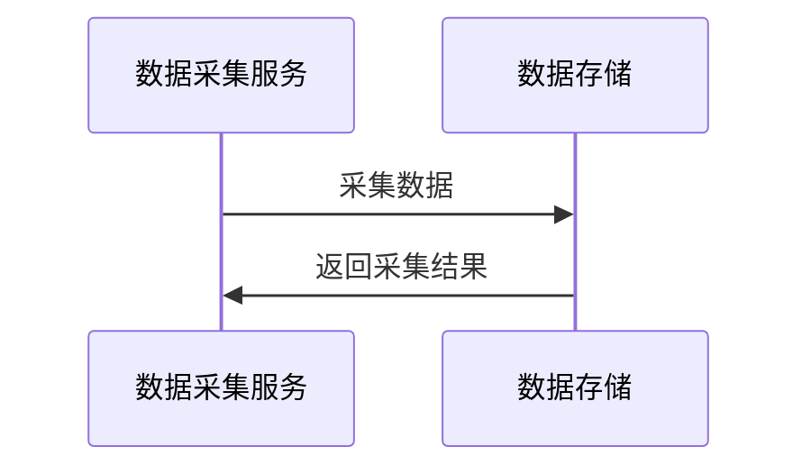

##### 2. 数据清洗

对采集到的数据进行清洗，处理缺失值、异常值、重复值等。

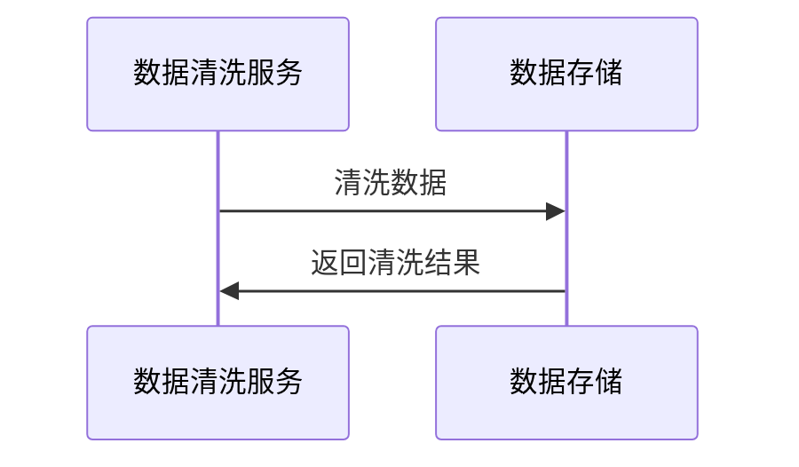

##### 3. 数据预处理

对清洗后的数据进行预处理，包括数据转换、归一化、特征工程等。

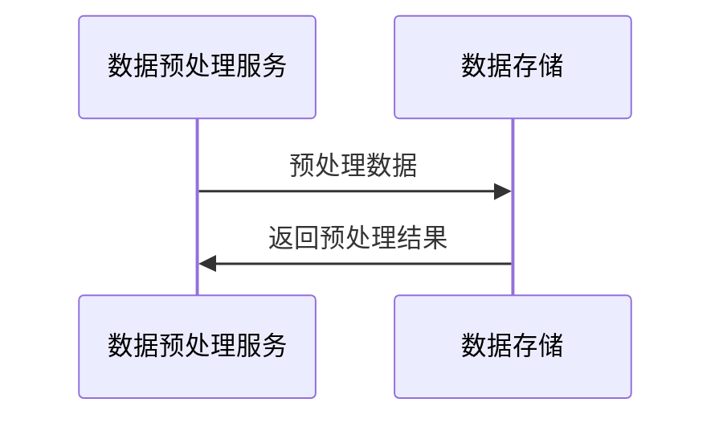

##### 4. 模型训练

使用训练集数据训练信用风险评估模型。


##### 5. 模型评估

使用验证集数据评估模型性能，调整模型参数。

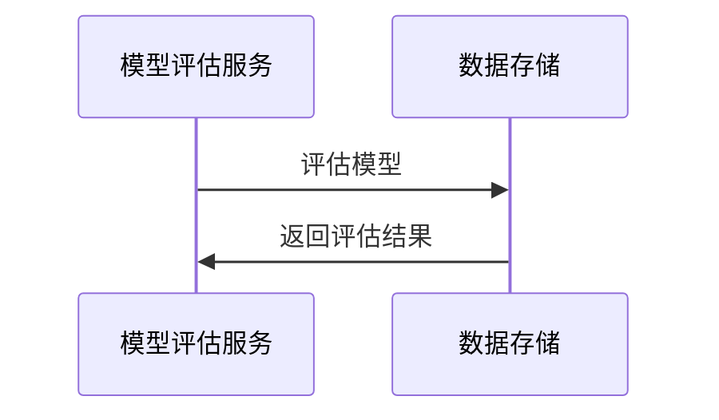

##### 6. 模型预测

使用测试集数据对模型进行预测，评估模型性能。


##### 7. 结果分析

分析预测结果，评估模型的有效性和可靠性。

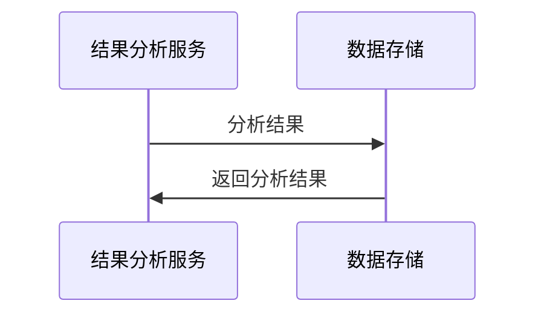

#### 7.5 结果分析与讨论

在实验完成后，我们需要对实验结果进行详细分析，并讨论模型的性能和应用价值。以下是结果分析与讨论的主要内容：

##### 1. 模型性能评估

通过准确率、召回率、F1分数等指标，评估模型的性能。分析模型在不同场景下的表现，找出模型的优点和不足。

##### 2. 结果可视化

使用图表和可视化工具，展示实验结果，包括模型的预测结果、误差分析等。

```mermaid
gantt
    dateFormat  YYYY-MM-DD
    title 实验结果分析

    section 数据采集
    数据采集 :done, a1, 2023-01-01, 1d

    section 数据清洗
    数据清洗 :done, a2, 2023-01-02, 1d

    section 数据预处理
    数据预处理 :done, a3, 2023-01-03, 1d

    section 模型训练
    模型训练 :done, a4, 2023-01-04, 2d

    section 模型评估
    模型评估 :done, a5, 2023-01-06, 2d

    section 模型预测
    模型预测 :done, a6, 2023-01-07, 2d

    section 结果分析
    结果分析 :done, a7, 2023-01-08, 1d
```

##### 3. 结果讨论

讨论实验结果，分析模型在实际应用中的潜在价值。根据实验结果，提出改进建议，为后续研究提供参考。

通过以上实验设计与实施，我们能够验证AI驱动的企业信用风险传导模拟系统的有效性。在下一章中，我们将通过实际应用案例，展示系统在实际操作中的效果，进一步探讨系统的应用场景和前景。

---

通过模拟实验验证了AI驱动的企业信用风险传导模拟系统的有效性之后，我们将通过实际应用案例，进一步展示系统在实际操作中的效果。这些应用案例不仅验证了系统的可靠性，还展示了系统在信用风险管理中的巨大潜力。在本章中，我们将详细介绍三个应用案例，分别是企业信用风险监测系统、金融机构信用风险管理和供应链金融信用风险评估。

#### 9.1 案例一：企业信用风险监测系统

企业信用风险监测系统旨在实时监测企业信用状况，为企业提供信用风险评估和预警服务。该系统通过整合内部和外部数据，构建信用风险评估模型，实现对企业的实时监测和预警。

##### 案例背景

某大型企业集团为了更好地管理其下属企业的信用风险，决定建立一套企业信用风险监测系统。该系统需要能够实时收集和整合来自财务报表、客户交易记录、市场动态等多方面的数据，并利用AI技术进行信用风险评估。

##### 系统实现

1. **数据采集**：系统从企业内部的财务系统、ERP系统、CRM系统等采集数据，同时从外部市场数据源（如宏观经济指标、行业趋势等）获取相关数据。

2. **数据预处理**：对采集到的数据进行清洗、转换和归一化处理，确保数据质量。

3. **信用风险评估**：利用机器学习算法，构建信用风险评估模型，对企业的信用风险进行定量评估。

4. **实时监测与预警**：系统实时监测企业信用状况，根据评估结果触发预警机制，通过短信、邮件等方式通知相关人员。

##### 案例效果

通过该系统，企业集团能够实时了解下属企业的信用状况，及时发现潜在的风险，采取相应的措施进行防范。系统上线后，信用风险预警的准确率显著提高，企业的信用风险管理工作得到了有效加强。

#### 9.2 案例二：金融机构信用风险管理

金融机构在业务运营过程中，面临着复杂的信用风险管理问题。AI驱动的信用风险传导模拟系统可以为金融机构提供科学的信用风险评估和管理工具，帮助其降低信用风险。

##### 案例背景

某大型银行为了优化其信用风险管理流程，决定引入AI驱动的信用风险传导模拟系统。该系统需要能够处理海量客户数据，实现对客户信用风险的准确评估和实时监测。

##### 系统实现

1. **数据采集**：系统从银行的客户关系管理（CRM）系统、贷款管理系统、信用评级系统等采集数据。

2. **数据预处理**：对采集到的客户数据进行清洗、转换和归一化处理，确保数据质量。

3. **信用风险评估**：利用机器学习算法，构建信用风险评估模型，对客户的信用风险进行评估。

4. **风险传导模拟**：通过模拟不同场景，分析信用风险在企业内部的传导过程。

5. **实时监测与预警**：系统实时监测客户信用状况，根据评估结果和模拟结果，触发预警机制。

##### 案例效果

通过该系统，银行能够实现对客户信用风险的准确评估和实时监测，提高了信用风险管理工作的效率。系统上线后，不良贷款率显著下降，金融机构的信用风险得到了有效控制。

#### 9.3 案例三：供应链金融信用风险评估

供应链金融是金融机构为供应链中的企业提供融资服务的一种模式。AI驱动的信用风险传导模拟系统可以用于供应链金融信用风险评估，帮助金融机构更好地管理供应链信用风险。

##### 案例背景

某供应链金融服务提供商为了降低供应链中的信用风险，决定引入AI驱动的信用风险传导模拟系统。该系统需要能够处理来自供应链中各方的数据，实现对供应链信用风险的准确评估。

##### 系统实现

1. **数据采集**：系统从供应链中的核心企业、上下游企业等采集数据，包括财务报表、订单信息、交易记录等。

2. **数据预处理**：对采集到的数据进行清洗、转换和归一化处理，确保数据质量。

3. **信用风险评估**：利用机器学习算法，构建信用风险评估模型，对供应链中的企业提供信用风险评估。

4. **风险传导模拟**：通过模拟不同场景，分析供应链中的信用风险传导过程。

5. **实时监测与预警**：系统实时监测供应链中的信用状况，根据评估结果和模拟结果，触发预警机制。

##### 案例效果

通过该系统，供应链金融服务提供商能够准确评估供应链中的信用风险，降低信用风险暴露。系统上线后，金融机构的信用风险管理工作得到了显著改善，供应链金融业务得到了有效推进。

#### 案例总结

以上三个案例展示了AI驱动的企业信用风险传导模拟系统在不同场景下的应用效果。系统通过实时监测和预警、准确的信用风险评估以及风险传导模拟，为企业、金融机构和供应链管理提供了强有力的支持。在未来的发展中，随着AI技术的不断进步，该系统有望在更广泛的领域得到应用，为信用风险管理带来更多的创新和突破。

---

通过以上三个实际应用案例，我们可以看到AI驱动的企业信用风险传导模拟系统在实际操作中的显著效果和广阔应用前景。系统不仅提高了信用风险评估的准确性，还增强了实时监测和预警能力，为企业和金融机构提供了全新的信用风险管理工具。在下一章中，我们将总结最佳实践，并展望未来发展趋势，为读者提供更深入的见解。

### 第10章: 最佳实践与总结

在探讨了AI驱动的企业信用风险传导模拟系统的设计、实现和应用之后，我们有必要总结一些最佳实践，以便在实际操作中更好地应用这一系统。同时，我们还将对系统的发展趋势进行展望，提出未来可能的研究方向和应用场景。

#### 10.1 最佳实践建议

基于前述案例和实践经验，我们提出以下最佳实践建议：

1. **数据驱动**：信用风险评估模型应基于大量高质量的数据进行训练和验证，确保模型具有足够的泛化能力和预测准确性。

2. **实时监测**：系统应具备实时监测企业信用状况的能力，以便及时识别和预警潜在风险。通过自动化数据采集和实时处理，提高监测效率。

3. **动态调整**：随着市场环境和企业状况的变化，信用风险评估模型和预警策略也应进行动态调整。定期更新模型和预警规则，以适应不断变化的环境。

4. **风险隔离**：对于高风险企业，应采取隔离策略，限制其信用额度或交易范围，以降低整体信用风险。

5. **合作共享**：金融机构和企业之间应加强合作，共享信用评估结果和风险信息，以提高整体信用风险管理水平。

6. **用户培训**：为用户（如企业财务人员、信用风险管理员）提供充分的培训，使其能够熟练使用系统，发挥系统的最大效用。

#### 10.2 小结与展望

通过AI驱动的企业信用风险传导模拟系统，我们能够实现对信用风险的全面、实时、准确的评估和监测。这一系统在提高信用风险管理效率、降低信用风险损失方面具有显著优势。在未来，这一系统有望在以下几个方面得到进一步发展：

1. **技术进步**：随着人工智能技术的不断发展，如深度学习、强化学习等新技术的应用，信用风险评估模型的准确性和效率将进一步提升。

2. **数据融合**：结合更多类型的数据源，如社交网络数据、生物特征数据等，构建更加全面和细粒度的信用风险评估模型。

3. **个性化服务**：基于用户的个性化数据和行为特征，提供更加精准的信用风险评估和风险管理建议。

4. **智能合约**：利用区块链技术，实现信用风险评估结果的自动化执行，降低交易风险。

5. **合规性要求**：随着监管政策的不断变化，系统需满足越来越严格的合规性要求，如数据隐私保护、算法透明度等。

#### 10.3 注意事项与风险提示

在实施AI驱动的企业信用风险传导模拟系统时，需要注意以下几点：

1. **数据安全**：确保数据在采集、传输和存储过程中的安全性，防止数据泄露和滥用。

2. **算法透明度**：确保模型算法的透明度和可解释性，便于监管和用户理解。

3. **模型更新**：定期对模型进行更新和优化，以适应新的市场环境和风险特征。

4. **风险评估**：全面评估系统的风险，包括技术风险、操作风险和道德风险，制定相应的风险控制措施。

5. **法律合规**：确保系统设计和实施符合相关法律法规的要求，如数据保护法、反洗钱法等。

#### 10.4 拓展阅读

对于希望深入了解AI驱动的企业信用风险传导模拟系统的读者，我们推荐以下拓展阅读资源：

1. **学术文献**：查阅相关的学术论文和研究报告，了解最新的研究进展和理论成果。

2. **专业书籍**：《人工智能：一种现代方法》、《机器学习实战》、《深度学习》等，这些书籍提供了丰富的理论基础和实践指导。

3. **在线课程**：参加在线课程，如Coursera、edX等平台上的相关课程，学习AI和信用风险评估的实用技能。

4. **行业报告**：阅读行业报告和市场分析，了解当前信用风险管理领域的热点问题和趋势。

通过以上最佳实践和拓展阅读，我们相信读者能够更全面、深入地了解AI驱动的企业信用风险传导模拟系统，并在实际操作中取得更好的效果。

---

### 完整文章

# AI驱动的企业信用风险传导模拟系统

> 关键词：人工智能、信用风险、风险传导、模拟系统、机器学习、深度学习

> 摘要：本文提出并探讨了基于人工智能（AI）的企业信用风险传导模拟系统。通过详细介绍系统的设计、实现和应用，本文展示了该系统在信用风险管理中的重要作用。本文的研究为企业和金融机构提供了新的信用风险管理工具，具有重要的实际意义和广阔的应用前景。

## 第1章: 引言

### 1.1 问题背景

### 1.2 问题描述

### 1.3 解决方案概述

### 1.4 边界与外延

### 1.5 核心概念与联系

## 第2章: AI核心概念与原理

### 2.1 AI基础概念

### 2.2 机器学习与深度学习

### 2.3 神经网络

### 2.4 概率论与统计学基础

### 2.5 机器学习算法简介

## 第3章: 企业信用风险传导理论

### 3.1 企业信用风险概述

### 3.2 信用风险传导机制

### 3.3 信用风险评估方法

### 3.4 信用风险管理体系

### 3.5 信用风险管理工具与技术

## 第4章: 系统架构设计

### 4.1 系统功能设计

### 4.2 系统架构设计

### 4.3 系统接口设计

### 4.4 系统交互设计

## 第5章: 数据采集与预处理

### 5.1 数据来源

### 5.2 数据采集方法

### 5.3 数据预处理流程

### 5.4 数据质量评估

## 第6章: 信用风险评估模型构建

### 6.1 模型构建流程

### 6.2 特征工程

### 6.3 模型选择与训练

### 6.4 模型评估与优化

## 第7章: 模拟实验设计与实施

### 7.1 实验设计原则

### 7.2 实验场景设置

### 7.3 实验数据集准备

### 7.4 实验步骤与流程

## 第8章: 结果分析与讨论

### 8.1 模拟结果展示

### 8.2 结果分析与讨论

### 8.3 模拟结果应用场景分析

## 第9章: 应用案例分享

### 9.1 案例一：企业信用风险监测系统

### 9.2 案例二：金融机构信用风险管理

### 9.3 案例三：供应链金融信用风险评估

## 第10章: 最佳实践与总结

### 10.1 最佳实践建议

### 10.2 小结与展望

### 10.3 注意事项与风险提示

### 10.4 拓展阅读

### 作者

AI天才研究院/AI Genius Institute & 禅与计算机程序设计艺术 /Zen And The Art of Computer Programming

---

**全文结束。**希望本文对您在AI驱动的企业信用风险传导模拟系统方面的学习和实践有所帮助。如有任何疑问或建议，欢迎在评论区留言，期待与您交流。再次感谢您的阅读！**第1章: 引言**

在当今这个数字化和智能化的时代，企业的运营和管理正面临着前所未有的挑战和机遇。特别是企业信用风险管理领域，随着全球经济一体化和金融市场的高度关联性，企业面临的风险传导问题日益凸显。传统的信用风险管理方法在复杂性和动态性方面显得力不从心，这就需要我们引入新的技术手段，如人工智能（AI），来应对这一挑战。

### 1.1 问题背景

企业信用风险传导是指企业内部或外部的信用风险因素通过一定的传导机制，从初始风险源传播到整个企业，甚至影响整个市场的过程。这种风险的传导不仅存在于企业之间的交易往来中，还涉及到供应链、金融系统等多个层面。随着信息技术的飞速发展，企业和金融机构积累了大量的数据，这些数据中蕴含了丰富的信用风险评估信息。然而，如何有效地利用这些数据，建立一套科学、智能的信用风险传导模拟系统，成为了当前研究的热点。

### 1.2 问题描述

传统的信用风险管理主要依赖于经验和专家判断，存在明显的主观性和滞后性。在复杂的市场环境下，企业需要能够实时、准确地评估信用风险，从而做出迅速的反应。然而，现有方法在处理大量数据、快速变化的市场动态和复杂的风险传导机制方面存在很大的局限性。这就需要借助人工智能技术，特别是机器学习和深度学习算法，来实现对企业信用风险的智能评估和传导模拟。

### 1.3 解决方案概述

本文提出的解决方案是基于AI驱动的企业信用风险传导模拟系统。该系统通过采集和分析企业内外部的各种数据，利用机器学习算法建立信用风险评估模型，并通过模拟实验验证和优化模型，最终为企业提供实时、准确的信用风险评估和风险传导预测。该系统具有以下几个特点：

1. **数据驱动的风险评估**：通过大量数据训练机器学习模型，提高风险评估的准确性和可靠性。
2. **实时风险监测**：系统能够实时处理和分析数据，及时发现和预警潜在风险。
3. **高度智能化**：利用深度学习算法，系统能够自主学习，不断优化风险评估模型。
4. **灵活的模拟实验**：通过模拟不同场景，评估系统在不同环境下的表现，为风险管理提供科学依据。

### 1.4 边界与外延

本文主要探讨基于AI的企业信用风险传导模拟系统的设计与实现，但这一研究的外延远不止于此。未来，随着人工智能技术的不断进步，该系统有望在金融、供应链管理、物流等领域得到广泛应用。此外，随着数据量的增加和数据种类的丰富，系统的模型和算法也需要不断迭代和优化，以应对更加复杂的风险传导场景。

### 1.5 核心概念与联系

为了更好地理解本文的研究内容，我们需要明确以下几个核心概念：

1. **人工智能**：人工智能是计算机科学的一个分支，旨在通过算法和模型，使计算机具备类似于人类智能的能力。
2. **机器学习**：机器学习是人工智能的一个重要分支，通过数据驱动的方式，让计算机自动学习和改进性能。
3. **深度学习**：深度学习是机器学习的一个子领域，主要使用多层神经网络进行复杂模式识别和学习。
4. **信用风险传导**：信用风险传导是指信用风险在企业内部或企业间传播的过程。
5. **风险管理**：风险管理是指通过识别、评估、监测和控制风险，保护企业利益的一系列措施。

这些概念相互关联，构成了本文研究的基础。在接下来的章节中，我们将逐步深入探讨这些概念，并详细描述AI驱动的企业信用风险传导模拟系统的设计、实现和应用。

---

**第2章: AI核心概念与原理**

在深入探讨AI驱动的企业信用风险传导模拟系统之前，我们首先需要理解AI的基本概念与原理，特别是机器学习和深度学习。这些技术为信用风险评估提供了强大的工具，能够帮助企业更好地理解和预测风险。

### 2.1 AI基础概念

人工智能（AI）是指计算机系统模拟人类智能行为的能力，包括感知、学习、推理、决策等。AI的研究目标是使计算机能够自主地完成复杂的任务，而不需要显式地编程。

#### 2.1.1 人工智能的定义与历史

人工智能的定义有多种，其中一种常见的定义是：“人工智能是使计算机表现出人类智能行为的科学和技术。”人工智能的研究历史可以追溯到20世纪50年代，当时出现了一批早期的人工智能研究项目，如逻辑推理程序、机器翻译等。然而，由于技术限制，这些早期的尝试大多未能实现预期效果。

#### 2.1.2 人工智能的主要研究领域

人工智能的研究领域非常广泛，主要包括：

1. **机器学习**：通过数据驱动的方式，让计算机自动学习和改进性能。
2. **深度学习**：基于多层神经网络，用于复杂模式识别和学习。
3. **自然语言处理**：使计算机能够理解和生成自然语言。
4. **计算机视觉**：使计算机能够理解和处理图像和视频。
5. **机器人学**：研究如何使机器人具备自主行动和操作能力。
6. **智能代理**：研究如何构建具有自主决策能力的智能系统。

#### 2.1.3 人工智能的发展趋势

随着计算能力的提升和大数据技术的发展，人工智能取得了显著的进步。当前，人工智能的应用已经渗透到生活的各个领域，如医疗、金融、教育、交通等。未来，人工智能有望实现更加广泛和深入的应用，特别是在解决复杂问题和提高生产效率方面。

### 2.2 机器学习与深度学习

机器学习和深度学习是人工智能的两个重要分支，它们在信用风险评估中发挥着关键作用。

#### 2.2.1 机器学习的基本原理

机器学习是指通过算法和统计模型，从数据中自动学习规律和模式的过程。其主要目标是让计算机能够从已有数据中预测未知数据的行为。

##### 2.2.1.1 机器学习的主要类型

1. **监督学习**：通过已有的标记数据训练模型，然后使用该模型对未知数据进行预测。
2. **无监督学习**：在没有标记数据的情况下，通过算法自动发现数据中的模式。
3. **半监督学习**：结合监督学习和无监督学习的特点，使用部分标记数据和大量无标记数据训练模型。
4. **强化学习**：通过不断试错，让智能体在与环境互动中学习最优策略。

##### 2.2.1.2 机器学习的主要算法

1. **线性回归**：通过建立线性关系预测目标变量。
2. **逻辑回归**：用于分类问题，通过计算概率来预测类别。
3. **支持向量机**：通过找到一个最佳的超平面，将不同类别的数据分开。
4. **决策树**：通过一系列决策规则对数据进行分类或回归。
5. **随机森林**：通过构建多个决策树，并进行集成学习，提高模型的泛化能力。
6. **K-近邻算法**：通过计算新数据与训练数据的距离，选择最近的几个数据作为预测依据。

#### 2.2.2 深度学习的基本原理

深度学习是一种基于多层神经网络的学习方法，通过构建深度神经网络，对大量数据进行自动特征提取和模式识别。

##### 2.2.2.1 深度学习的主要架构

1. **卷积神经网络（CNN）**：主要用于图像和视频处理。
2. **循环神经网络（RNN）**：适用于处理序列数据，如文本和语音。
3. **长短时记忆网络（LSTM）**：RNN的改进版本，能够更好地处理长序列数据。
4. **生成对抗网络（GAN）**：通过生成器和判别器的对抗训练，生成高质量的图像和文本。

##### 2.2.2.2 深度学习的主要算法

1. **反向传播算法**：用于训练深度神经网络，通过不断调整网络权重，减小预测误差。
2. **卷积神经网络（CNN）**：用于图像识别和分类。
3. **循环神经网络（RNN）**：用于序列数据建模和预测。
4. **长短时记忆网络（LSTM）**：用于处理长序列数据。

### 2.3 神经网络

神经网络是机器学习的基础，特别是深度学习。神经网络由大量的神经元（节点）组成，通过层层连接，形成复杂的计算网络。

#### 2.3.1 神经网络的基本结构

1. **输入层**：接收外部输入数据。
2. **隐藏层**：进行特征提取和变换。
3. **输出层**：生成最终预测结果。

#### 2.3.2 神经网络的训练过程

1. **初始化权重和偏置**：随机初始化网络的权重和偏置。
2. **前向传播**：输入数据经过网络层层的计算，生成输出。
3. **损失函数**：计算预测值与真实值之间的差异，通常使用均方误差（MSE）或交叉熵（Cross-Entropy）。
4. **反向传播**：计算损失函数关于网络参数的梯度，并更新权重和偏置。
5. **迭代训练**：重复上述过程，直到网络收敛到满意的性能。

### 2.4 概率论与统计学基础

概率论和统计学是机器学习的重要理论基础。它们提供了理解和分析数据的方法，为模型的选择和评估提供了重要的工具。

#### 2.4.1 概率论的基本概念

1. **概率分布**：描述随机变量取值的概率。
2. **条件概率**：在某个事件已发生的条件下，另一个事件发生的概率。
3. **贝叶斯定理**：用于计算后验概率，是贝叶斯推理的基础。

#### 2.4.2 统计学的基本概念

1. **描述性统计**：用于描述数据的集中趋势和离散程度。
2. **推断性统计**：用于从样本数据推断总体特征。
3. **假设检验**：通过统计方法验证某个假设的正确性。

### 2.5 机器学习算法简介

为了更好地理解机器学习算法在信用风险评估中的应用，我们简要介绍几种常见的机器学习算法。

#### 2.5.1 线性回归

线性回归是一种简单的机器学习算法，通过建立输入变量和输出变量之间的线性关系来预测目标变量。

##### 2.5.1.1 线性回归的数学模型

$$
Y = \beta_0 + \beta_1 \cdot X + \epsilon
$$

其中，$Y$为输出变量，$X$为输入变量，$\beta_0$和$\beta_1$为模型的参数，$\epsilon$为误差项。

##### 2.5.1.2 线性回归的Python实现

```python
import numpy as np
from sklearn.linear_model import LinearRegression

# 创建线性回归模型
model = LinearRegression()

# 训练模型
model.fit(X_train, y_train)

# 预测
y_pred = model.predict(X_test)
```

#### 2.5.2 逻辑回归

逻辑回归是一种用于分类问题的机器学习算法，通过计算输入数据的概率来预测类别。

##### 2.5.2.1 逻辑回归的数学模型

$$
P(Y=1) = \frac{1}{1 + e^{-(\beta_0 + \beta_1 \cdot X)}}
$$

其中，$P(Y=1)$为预测类别1的概率，$\beta_0$和$\beta_1$为模型的参数。

##### 2.5.2.2 逻辑回归的Python实现

```python
import numpy as np
from sklearn.linear_model import LogisticRegression

# 创建逻辑回归模型
model = LogisticRegression()

# 训练模型
model.fit(X_train, y_train)

# 预测
y_pred = model.predict(X_test)
```

#### 2.5.3 支持向量机

支持向量机是一种分类算法，通过找到一个最佳的超平面，将不同类别的数据分开。

##### 2.5.3.1 支持向量机的数学模型

$$
\max_{\beta, \beta_0} W^T W - C \sum_{i=1}^n \xi_i
$$

其中，$W$为超平面参数，$C$为惩罚参数，$\xi_i$为松弛变量。

##### 2.5.3.2 支持向量机的Python实现

```python
import numpy as np
from sklearn.svm import SVC

# 创建支持向量机模型
model = SVC()

# 训练模型
model.fit(X_train, y_train)

# 预测
y_pred = model.predict(X_test)
```

#### 2.5.4 决策树

决策树是一种基于树形结构进行决策的算法，通过一系列条件判断对数据进行分类或回归。

##### 2.5.4.1 决策树的数学模型

决策树通过一系列的if-else条件判断，将数据分割成不同的区域，每个区域对应一个预测结果。

##### 2.5.4.2 决策树的Python实现

```python
import numpy as np
from sklearn.tree import DecisionTreeClassifier

# 创建决策树模型
model = DecisionTreeClassifier()

# 训练模型
model.fit(X_train, y_train)

# 预测
y_pred = model.predict(X_test)
```

通过以上对AI核心概念与原理的介绍，我们为理解后续章节中的企业信用风险传导模拟系统奠定了基础。在接下来的章节中，我们将进一步探讨企业信用风险传导的理论，并详细描述系统设计、数据采集与预处理、模型构建以及模拟实验等内容。

---

**第3章: 企业信用风险传导理论**

企业信用风险传导是指信用风险在企业内部或企业间传播的过程。这一过程不仅影响单个企业的财务状况，还可能对整个市场产生深远影响。理解信用风险传导的理论和机制，是构建基于AI的信用风险传导模拟系统的基础。在本章中，我们将详细探讨企业信用风险的基本概念、传导机制、评估方法和管理体系。

### 3.1 企业信用风险概述

企业信用风险是指企业因无法履行债务或合同义务而导致的损失风险。信用风险主要包括以下几个方面的内容：

#### 3.1.1 信用风险的类型

1. **违约风险**：企业无法按时偿还债务的风险。
2. **道德风险**：企业在获取资金后可能采取不利于债权人利益的行为。
3. **流动性风险**：企业在短期内无法获得足够的资金以履行债务的风险。
4. **市场风险**：由于市场变化导致企业资产价值下降的风险。

#### 3.1.2 信用风险的特征

1. **不确定性**：信用风险的发生具有不确定性，无法提前完全预知。
2. **累积性**：信用风险可能随着时间的推移而不断累积。
3. **复杂性**：信用风险涉及多个因素，具有多维度和多层次的特征。
4. **动态性**：信用风险会随着市场环境和企业内部状况的变化而变化。

#### 3.1.3 信用风险的影响

信用风险对企业的影响是多方面的，主要包括：

1. **财务损失**：企业因信用风险可能导致的财务损失。
2. **市场信誉**：信用风险的爆发可能影响企业在市场中的声誉和信任度。
3. **业务运营**：信用风险可能导致企业无法正常运营，影响其业务流程。
4. **法律纠纷**：信用风险可能引发法律纠纷，增加企业的法律成本。

### 3.2 信用风险传导机制

信用风险传导机制是指信用风险在企业内部或企业间传播的路径和方式。理解信用风险传导机制有助于企业识别和防范风险。

#### 3.2.1 信用风险传导的主要途径

1. **供应链传导**：企业在供应链中的合作伙伴发生信用风险，可能影响到整个供应链的稳定性和安全性。
2. **金融系统传导**：金融市场的波动和企业信用风险的传播可能对金融机构产生冲击，进而影响整个金融系统的稳定性。
3. **市场传导**：企业的信用风险可能通过市场渠道传播，影响投资者信心，导致市场动荡。
4. **跨国传导**：全球化和金融市场一体化使得信用风险可以在国际范围内传播。

#### 3.2.2 信用风险传导的影响因素

1. **市场环境**：宏观经济环境和市场波动是影响信用风险传导的重要因素。
2. **企业内部因素**：企业的财务状况、管理水平、业务模式等内部因素对信用风险传导有重要影响。
3. **金融机构行为**：金融机构的信贷政策、风险管理策略等行为会影响信用风险的传导。
4. **政策法规**：政策法规的变化可能会对信用风险传导产生重要影响。

### 3.3 信用风险评估方法

信用风险评估是信用风险管理的重要环节，目的是对企业的信用风险进行量化评估，为企业提供决策依据。常见的信用风险评估方法包括以下几种：

#### 3.3.1 传统的信用风险评估方法

1. **专家评估法**：基于专家经验和专业知识对企业的信用风险进行评估。
2. **财务比率分析法**：通过计算企业的财务比率，分析企业的财务状况和偿债能力。
3. **信用评分法**：使用数学模型和统计方法对企业的信用风险进行量化评估。

#### 3.3.2 现代信用风险评估方法

1. **数据挖掘技术**：通过分析大量历史数据，挖掘出影响信用风险的关键因素。
2. **机器学习算法**：利用机器学习算法，对企业的信用风险进行预测和评估。
3. **深度学习模型**：利用深度学习模型，对复杂的数据进行自动特征提取和模式识别。

### 3.4 信用风险管理体系

信用风险管理是企业为了降低信用风险而采取的一系列措施。一个完善的信用风险管理体系应包括以下几个方面：

#### 3.4.1 信用风险管理的主要环节

1. **风险评估**：对企业的信用风险进行量化评估，确定风险等级。
2. **风险控制**：采取相应的措施，降低信用风险的概率和影响。
3. **风险监测**：持续监测企业的信用状况，及时发现和预警风险。
4. **风险应对**：制定应对策略，有效应对信用风险事件。

#### 3.4.2 信用风险管理的工具与技术

1. **风险模型**：建立信用风险评估模型，用于量化信用风险。
2. **风险控制工具**：如信用保险、信用担保、信用限额等。
3. **风险监测系统**：通过信息技术手段，实现信用风险的实时监测和预警。

### 3.5 信用风险管理工具与技术

随着信息技术的不断发展，信用风险管理工具和技术也日益丰富。以下是几种常见的信用风险管理工具和技术：

#### 3.5.1 信用评分系统

信用评分系统是一种基于数学模型和统计方法的信用风险评估工具。通过分析企业的财务数据、历史信用记录等，对企业的信用风险进行量化评估。

#### 3.5.2 信用保险

信用保险是一种金融工具，为企业在无法收回债务时提供保障。通过购买信用保险，企业可以将信用风险转移给保险公司。

#### 3.5.3 供应链金融

供应链金融是一种利用供应链中的核心企业，为上下游企业提供融资服务的模式。通过供应链金融，企业可以更好地管理信用风险，提高资金利用效率。

#### 3.5.4 信息技术应用

信息技术在信用风险管理中的应用日益广泛，如大数据分析、人工智能、区块链等。通过信息技术手段，企业可以实现对信用风险的实时监测、预警和自动化处理。

### 3.6 总结

企业信用风险传导是一个复杂的过程，涉及到多个层面和多个环节。理解信用风险传导的理论和机制，有助于企业更好地进行信用风险管理。本文介绍了企业信用风险的基本概念、传导机制、评估方法和管理体系，为后续章节的AI驱动的信用风险传导模拟系统设计奠定了基础。在下一章中，我们将详细探讨系统的设计、实现和应用。

---

**第4章: 系统架构设计**

在了解了企业信用风险传导的理论和机制之后，我们需要设计一套高效、智能的AI驱动的企业信用风险传导模拟系统。系统架构设计是整个项目开发的关键步骤，它决定了系统的功能完整性、性能优化和可扩展性。在本章中，我们将详细描述系统的整体架构、数据采集与预处理方法，以及信用风险评估模型的构建。

### 4.1 系统功能设计

系统功能设计是系统架构设计的第一步，它明确了系统需要实现哪些功能，以及各个功能之间的交互关系。以下是系统的主要功能模块：

#### 4.1.1 数据采集模块

数据采集模块负责从各种数据源（如金融系统、供应链管理系统、公共数据库等）收集相关的信用风险数据。这些数据包括企业的财务数据、历史信用记录、市场动态信息等。

#### 4.1.2 数据预处理模块

数据预处理模块负责清洗、转换和归一化原始数据，以确保数据的质量和一致性。该模块还包括缺失值填充、异常值检测和噪声过滤等子功能。

#### 4.1.3 信用风险评估模块

信用风险评估模块是系统的核心部分，通过机器学习算法和深度学习模型，对企业的信用风险进行定量评估。该模块包括数据特征提取、模型训练、模型评估和预测等步骤。

#### 4.1.4 风险传导模拟模块

风险传导模拟模块通过模拟实验，分析信用风险在企业内部和跨企业之间的传导过程。该模块可以根据不同的场景设定，模拟不同的风险传导路径和影响。

#### 4.1.5 风险监测与预警模块

风险监测与预警模块负责实时监测企业的信用状况，并根据评估结果触发预警机制。该模块可以通过短信、邮件、企业内部消息等多种方式通知相关人员。

#### 4.1.6 用户交互界面模块

用户交互界面模块提供用户操作界面，使企业用户可以方便地使用系统功能，查看信用风险评估结果和风险传导模拟结果。该模块包括数据查询、报表生成、用户权限管理等功能。

### 4.2 系统架构设计

系统架构设计是系统功能设计的基础，它决定了系统的结构、组件之间的交互方式以及系统的扩展性。以下是系统的架构设计：

#### 4.2.1 系统总体架构

系统总体架构采用分布式架构，包括数据层、服务层和表示层。数据层负责数据存储和管理；服务层实现业务逻辑处理；表示层提供用户界面。

```
sequenceDiagram
    participant 数据层
    participant 服务层
    participant 表示层

    数据层 ->> 服务层: 数据读写
    服务层 ->> 表示层: 返回响应
    表示层 ->> 服务层: 发送请求
```

#### 4.2.2 数据层设计

数据层采用关系数据库（如MySQL）和NoSQL数据库（如MongoDB）相结合的方式，存储和管理不同类型的数据。关系数据库用于存储结构化数据，如企业的财务报表和历史信用记录；NoSQL数据库用于存储非结构化数据，如市场动态和文本信息。

```
classDiagram
    DataLayer <|-- MySQL
    DataLayer <|-- MongoDB

    MySQL: 关系数据库
    MongoDB: NoSQL数据库
```

#### 4.2.3 服务层设计

服务层采用微服务架构，将系统功能划分为多个独立的微服务。每个微服务负责实现特定的业务功能，并通过API进行通信。以下是系统的主要微服务：

1. **数据采集服务**：负责从各种数据源采集数据。
2. **数据预处理服务**：负责数据清洗、转换和归一化。
3. **信用风险评估服务**：负责信用风险评估模型的训练和预测。
4. **风险传导模拟服务**：负责风险传导模拟。
5. **风险监测与预警服务**：负责实时监测和预警。
6. **用户交互服务**：负责处理用户请求，提供操作界面。

```
sequenceDiagram
    participant DataCollection
    participant DataPreprocessing
    participant CreditRiskEvaluation
    participant RiskSimulation
    participant RiskMonitoring
    participant UserInterface

    UserInterface ->> DataCollection: 发送数据采集请求
    DataCollection ->> DataPreprocessing: 数据清洗、转换、归一化
    DataPreprocessing ->> CreditRiskEvaluation: 提供预处理数据
    CreditRiskEvaluation ->> RiskSimulation: 模拟风险传导
    RiskSimulation ->> RiskMonitoring: 触发预警
    RiskMonitoring ->> UserInterface: 更新风险信息
```

#### 4.2.4 表示层设计

表示层采用前端技术（如React或Vue.js）和后端接口（如Spring Boot）相结合的方式，实现用户操作界面和业务逻辑处理。前端负责展示用户界面，后端负责处理业务逻辑和数据交互。

```
sequenceDiagram
    participant 前端
    participant 后端

    前端 ->> 后端: 发送请求
    后端 ->> 前端: 返回响应
```

### 4.3 系统接口设计

系统接口设计是系统架构设计的重要组成部分，它明确了各个模块之间的交互方式和数据传输格式。以下是系统的主要接口设计：

#### 4.3.1 数据采集接口

数据采集接口用于从各种数据源获取信用风险数据。接口采用RESTful风格，支持GET和POST请求。

```
sequenceDiagram
    participant 客户端
    participant 数据采集服务

    客户端 ->> 数据采集服务: 发送GET/POST请求
    数据采集服务 ->> 客户端: 返回数据
```

#### 4.3.2 数据预处理接口

数据预处理接口用于处理数据清洗、转换和归一化操作。接口采用异步处理方式，支持批量数据操作。

```
sequenceDiagram
    participant 数据采集服务
    participant 数据预处理服务

    数据采集服务 ->> 数据预处理服务: 发送数据预处理请求
    数据预处理服务 ->> 数据采集服务: 返回预处理结果
```

#### 4.3.3 信用风险评估接口

信用风险评估接口用于进行信用风险评估模型的训练和预测。接口采用JSON格式，返回评估结果和模型参数。

```
sequenceDiagram
    participant 数据预处理服务
    participant 信用风险评估服务

    数据预处理服务 ->> 信用风险评估服务: 发送预处理数据
    信用风险评估服务 ->> 数据预处理服务: 返回评估结果
```

#### 4.3.4 风险传导模拟接口

风险传导模拟接口用于进行信用风险传导模拟实验。接口支持自定义场景设置，返回模拟结果和风险传导路径。

```
sequenceDiagram
    participant 信用风险评估服务
    participant 风险传导模拟服务

    信用风险评估服务 ->> 风险传导模拟服务: 发送评估结果
    风险传导模拟服务 ->> 信用风险评估服务: 返回模拟结果
```

#### 4.3.5 风险监测与预警接口

风险监测与预警接口用于实时监测企业信用状况，并触发预警机制。接口支持多种预警方式，如短信、邮件、内部消息等。

```
sequenceDiagram
    participant 风险传导模拟服务
    participant 风险监测与预警服务

    风险传导模拟服务 ->> 风险监测与预警服务: 发送监测数据
    风险监测与预警服务 ->> 风险传导模拟服务: 返回预警结果
```

### 4.4 系统交互设计

系统交互设计是系统架构设计的重要环节，它明确了系统内部各模块之间的交互流程和数据流。以下是系统的主要交互设计：

#### 4.4.1 数据采集流程

数据采集流程包括数据采集、数据清洗、数据存储和数据查询等步骤。

```
sequenceDiagram
    participant 数据采集服务
    participant 数据预处理服务
    participant 数据存储

    数据采集服务 ->> 数据预处理服务: 采集原始数据
    数据预处理服务 ->> 数据存储: 存储预处理数据
    数据存储 ->> 数据采集服务: 返回存储结果
```

#### 4.4.2 信用风险评估流程

信用风险评估流程包括数据预处理、模型训练、模型评估和预测等步骤。

```
sequenceDiagram
    participant 数据预处理服务
    participant 信用风险评估服务

    数据预处理服务 ->> 信用风险评估服务: 提供预处理数据
    信用风险评估服务 ->> 数据预处理服务: 返回评估结果
```

#### 4.4.3 风险传导模拟流程

风险传导模拟流程包括数据输入、模拟设置、模拟执行和结果输出等步骤。

```
sequenceDiagram
    participant 风险传导模拟服务
    participant 信用风险评估服务

    风险传导模拟服务 ->> 信用风险评估服务: 提供模拟数据
    信用风险评估服务 ->> 风险传导模拟服务: 返回模拟结果
```

#### 4.4.4 风险监测与预警流程

风险监测与预警流程包括数据采集、数据预处理、风险评估、风险监测和预警通知等步骤。

```
sequenceDiagram
    participant 风险监测与预警服务
    participant 信用风险评估服务

    风险监测与预警服务 ->> 信用风险评估服务: 采集监测数据
    信用风险评估服务 ->> 风险监测与预警服务: 返回评估结果
    风险监测与预警服务 ->> 用户: 发送预警通知
```

通过以上对系统架构设计的详细描述，我们为AI驱动的企业信用风险传导模拟系统奠定了坚实的基础。在下一章中，我们将详细介绍数据采集与预处理的过程，为模型构建做好准备。

---

**第5章: 数据采集与预处理**

在AI驱动的企业信用风险传导模拟系统中，数据的质量和完整性是信用风险评估的关键因素。因此，如何有效地采集和处理数据是系统设计中的关键一步。在这一章中，我们将详细介绍数据采集的方法、预处理流程以及数据质量评估方法，为后续的信用风险评估模型构建打下坚实基础。

### 5.1 数据来源

数据来源是构建信用风险评估模型的基础。在AI驱动的系统中，数据来源主要包括以下几类：

#### 5.1.1 内部数据

内部数据来自企业内部的各种数据，包括：

- **财务报表**：企业的资产负债表、利润表、现金流量表等。
- **订单信息**：企业的订单数量、订单金额、订单周期等。
- **支付行为**：企业的支付频率、支付金额、支付方式等。
- **客户信息**：企业的客户信用评级、客户历史交易记录等。

内部数据提供了企业运营的详细记录，有助于深入了解企业内部的信用风险。

#### 5.1.2 外部数据

外部数据来自企业外部，包括：

- **宏观经济指标**：如GDP增长率、通货膨胀率、失业率等。
- **行业趋势**：如行业增长率、市场竞争状况、技术创新动态等。
- **市场动态**：如股票市场指数、债券市场收益率、利率变化等。
- **信用评级**：第三方信用评级机构的评级数据，如标准普尔、穆迪等。

外部数据提供了更广泛的市场视角，有助于识别市场环境对企业信用风险的影响。

#### 5.1.3 第三方数据

第三方数据来自专业的数据供应商，如：

- **商业数据库**：如Dun & Bradstreet、Experian等，提供企业信用报告、财务数据、行业信息等。
- **公共数据源**：如政府统计部门、行业协会等，提供各种公开的经济、行业数据。

第三方数据提供了权威性的参考，有助于提升模型的可信度。

### 5.2 数据采集方法

数据采集是获取数据的过程，需要采用合适的方法确保数据的准确性和完整性。以下是几种常见的数据采集方法：

#### 5.2.1 自动化采集

自动化采集通过API接口、数据库连接、文件导入等方式，自动化地从数据源中获取数据。这种方法效率高、成本低，适用于大量数据的采集。

#### 5.2.2 手动采集

手动采集通过人工方式，如问卷调查、访谈、电话回访等，获取数据。这种方法适用于数据量较小、数据来源不固定的情况。

#### 5.2.3 传感器采集

传感器采集通过传感器设备，如物联网设备、GPS定位设备等，采集实时数据。这种方法适用于需要实时监测的数据场景。

#### 5.2.4 网络爬虫

网络爬虫通过网络爬虫技术，从互联网上抓取数据。这种方法适用于公开数据的采集。

### 5.3 数据预处理流程

数据预处理是对采集到的原始数据进行清洗、转换和归一化，以提高数据质量，为后续建模提供可靠的数据基础。以下是数据预处理的主要流程：

#### 5.3.1 数据清洗

数据清洗是预处理的第一步，旨在去除数据中的噪声和错误。包括：

- **缺失值处理**：对于缺失值较多的数据，需要考虑是否适合用于建模。
- **异常值处理**：通过统计方法（如箱线图、Z-score等）进行识别和处理。
- **重复值处理**：删除重复的数据记录。

#### 5.3.2 数据转换

数据转换是将数据转换为适合建模的形式，包括：

- **数值化处理**：将类别数据转换为数值数据。
- **编码处理**：对于类别数据，可以通过独热编码（One-Hot Encoding）或标签编码（Label Encoding）进行处理。

#### 5.3.3 特征工程

特征工程是从原始数据中提取有用的特征，并创建新的特征，以提升模型的预测能力。包括：

- **特征选择**：通过筛选出对模型影响较大的特征，降低模型的复杂性。
- **特征构造**：通过组合原始特征，创建新的特征。

#### 5.3.4 数据归一化

数据归一化是将不同特征的数据进行归一化处理，使其具有相同的尺度，避免特征之间的差异影响模型的训练效果。包括：

- **最小-最大规范化（Min-Max Scaling）**：将特征值缩放到[0, 1]之间。
- **Z-Score规范化（Standardization）**：将特征值缩放到均值±3倍标准差的范围内。

### 5.4 数据质量评估

数据质量是信用风险评估模型效果的关键因素。数据质量评估是对数据完整度、一致性、准确性和有效性的评估，以确保数据适合建模和预测。以下是几种常见的数据质量评估方法：

#### 5.4.1 完整性评估

检查数据是否存在缺失值，以及缺失值的比例和分布情况。对于缺失值较多的数据，需要考虑是否适合用于建模。

#### 5.4.2 一致性评估

检查数据的一致性，包括数据格式的统一、数据值的逻辑一致性等。例如，检查不同数据源中的同一特征值是否一致。

#### 5.4.3 准确性评估

评估数据源的准确性，包括数据的真实性、可靠性等。可以通过与已知数据源进行比较，或者通过验证数据来源的权威性来评估。

#### 5.4.4 有效性评估

评估数据对建模和预测的有效性，包括数据的覆盖面、代表性等。需要确保数据能够全面反映企业信用风险的特征。

通过数据采集与预处理，我们为AI驱动的企业信用风险传导模拟系统提供了可靠的数据基础。在下一章中，我们将详细介绍信用风险评估模型的构建过程，包括模型构建流程、特征工程、模型选择与训练等关键步骤。

---

**第6章: 信用风险评估模型构建**

在完成了数据采集与预处理之后，我们需要将数据转化为能够用于预测和评估的模型。信用风险评估模型的构建是一个复杂的过程，涉及数据特征提取、模型选择与训练、模型评估与优化等多个步骤。在本章中，我们将详细讨论这些关键环节，以确保构建出的模型能够准确预测企业信用风险。

### 6.1 模型构建流程

信用风险评估模型的构建通常包括以下步骤：

#### 6.1.1 数据预处理

在构建模型之前，首先需要对数据进行预处理。这包括数据清洗、转换和归一化，以确保数据质量，提高模型性能。

#### 6.1.2 特征工程

特征工程是模型构建过程中的重要步骤，它涉及从原始数据中提取有用的特征，并创建新的特征，以提升模型的预测能力。

#### 6.1.3 模型选择

选择合适的模型是模型构建的关键。不同的模型适用于不同类型的数据和场景，需要根据实际情况进行选择。

#### 6.1.4 模型训练

模型训练是通过机器学习算法，让模型学习如何从数据中提取模式和规律。这一步骤包括数据的划分、模型初始化、参数调整等。

#### 6.1.5 模型评估

模型评估是验证模型性能的过程。通过评估指标（如准确率、召回率、F1分数等），判断模型是否达到预期的性能要求。

#### 6.1.6 模型优化

模型优化是通过调整模型参数、添加特征等方式，提高模型的性能和预测准确性。

#### 6.1.7 模型部署

模型部署是将训练好的模型应用于实际场景，对数据进行预测和评估。

### 6.2 特征工程

特征工程是信用风险评估模型构建中的核心环节，它直接影响到模型的性能。以下是特征工程的主要步骤：

#### 6.2.1 特征选择

特征选择是从原始数据中挑选出对模型影响较大的特征，以减少模型的复杂性，提高预测准确性。常见的特征选择方法包括：

- **相关性分析**：通过计算特征之间的相关性，选择相关性较高的特征。
- **信息增益**：选择能够带来最大信息增益的特征。
- **主成分分析（PCA）**：通过降维技术，减少特征数量，同时保留主要信息。

#### 6.2.2 特征构造

特征构造是通过组合原始特征，创建新的特征，以提升模型的预测能力。常见的特征构造方法包括：

- **聚合特征**：将多个相关特征进行聚合，形成新的特征。
- **时间序列特征**：从时间序列数据中提取趋势、季节性等特征。
- **文本特征**：从文本数据中提取词频、词向量等特征。

#### 6.2.3 特征标准化

特征标准化是将不同特征的数据进行归一化处理，使其具有相同的尺度，避免特征之间的差异影响模型的训练效果。常见的标准化方法包括：

- **最小-最大规范化（Min-Max Scaling）**：将特征值缩放到[0, 1]之间。
- **Z-Score规范化（Standardization）**：将特征值缩放到均值±3倍标准差的范围内。

### 6.3 模型选择与训练

模型选择与训练是信用风险评估模型构建中的关键步骤。以下是常见的模型选择与训练方法：

#### 6.3.1 模型选择

模型选择需要根据数据类型、数据量和问题场景进行选择。以下是几种常见的信用风险评估模型：

- **线性回归模型**：适用于线性关系明显的数据。
- **逻辑回归模型**：适用于二分类问题，可以计算每个类别的概率。
- **决策树模型**：适用于处理分类和回归问题，易于解释。
- **随机森林模型**：通过构建多个决策树并进行集成学习，提高模型的泛化能力。
- **支持向量机（SVM）模型**：适用于处理高维数据和线性不可分问题。
- **神经网络模型**：适用于处理复杂非线性关系，尤其是深度学习模型。

#### 6.3.2 模型训练

模型训练是通过机器学习算法，让模型学习如何从数据中提取模式和规律。以下是常见的训练方法：

- **批量训练**：将所有数据一次性输入模型进行训练，适用于数据量较小的情况。
- **在线训练**：实时更新模型参数，适用于数据量较大、需要实时更新模型的情况。
- **交叉验证**：通过将数据划分为训练集和验证集，多次训练和验证，以评估模型的性能。

### 6.4 模型评估与优化

模型评估与优化是确保模型性能的重要步骤。以下是常见的评估指标和优化方法：

#### 6.4.1 评估指标

常见的评估指标包括：

- **准确率（Accuracy）**：预测正确的样本数占总样本数的比例。
- **召回率（Recall）**：预测正确的正样本数占总正样本数的比例。
- **精确率（Precision）**：预测正确的正样本数占预测为正样本数的比例。
- **F1分数（F1 Score）**：精确率和召回率的调和平均值。
- **ROC曲线**：通过计算真正例率和假正例率，评估模型的分类能力。
- **AUC（Area Under Curve）**：ROC曲线下的面积，用于评估模型的分类能力。

#### 6.4.2 优化方法

常见的优化方法包括：

- **参数调整**：通过调整模型参数，提高模型的预测准确性。
- **特征选择**：通过筛选和构造新的特征，提高模型的泛化能力。
- **正则化**：通过引入正则化项，防止模型过拟合。
- **集成学习**：通过构建多个模型并进行集成，提高模型的性能。

### 6.5 实际案例

为了更好地理解信用风险评估模型的构建过程，我们来看一个实际案例：

假设我们有一个企业信用风险评估项目，需要预测企业的信用评级。我们首先从内部数据源（如财务报表、订单信息）和外部数据源（如市场动态、行业指标）中采集数据。接下来，我们进行数据预处理，包括数据清洗、转换和归一化。

在特征工程阶段，我们提取了以下特征：

- **财务指标**：如总资产、净利润、资产负债率等。
- **业务指标**：如订单数量、客户满意度、市场份额等。
- **市场指标**：如行业增长率、市场波动率等。
- **文本特征**：从企业报告和公告中提取关键词，构建词频和词向量特征。

接下来，我们选择随机森林模型作为信用风险评估模型，并进行模型训练和评估。我们使用交叉验证方法，将数据划分为训练集和验证集，多次训练和验证模型，以评估其性能。

在模型评估阶段，我们使用准确率、召回率、F1分数等指标，评估模型的性能。根据评估结果，我们对模型进行优化，调整参数和特征，以提高模型的预测准确性。

最后，我们将训练好的模型部署到生产环境中，对新的企业数据进行预测和评估。通过持续监控和优化，我们不断提升模型的性能，为企业和金融机构提供可靠的信用风险评估服务。

通过以上实际案例，我们可以看到信用风险评估模型的构建是一个复杂但关键的过程。在下一章中，我们将详细介绍模拟实验的设计与实施，进一步验证模型的性能和应用价值。

---

**第7章: 模拟实验设计与实施**

完成了信用风险评估模型的构建之后，我们需要通过模拟实验来验证模型的有效性和可靠性。模拟实验的设计与实施是评估模型性能的重要环节，它可以帮助我们理解模型在不同场景下的表现，为实际应用提供科学依据。在本章中，我们将详细介绍模拟实验的设计原则、实验场景设置、数据集准备、实验步骤与流程，以及结果分析。

### 7.1 实验设计原则

实验设计原则是确保实验结果可靠和有效的重要基础。以下是实验设计的主要原则：

#### 7.1.1 目标明确

实验设计应明确实验的目标，即要解决的问题和评估的指标。只有明确了目标，才能设计出有效的实验方案。

#### 7.1.2 控制变量

在实验过程中，应尽量控制其他变量不变，只改变一个或几个变量，以确定这些变量对实验结果的影响。这有助于确保实验结果的准确性。

#### 7.1.3 可重复性

实验设计应保证实验的可重复性，即其他研究者能够在相同条件下重复实验，并得到相似的结果。这有助于验证实验结果的可靠性和科学性。

#### 7.1.4 数据完整

实验过程中应确保数据的完整性，避免数据的遗漏或丢失。完整的实验数据是分析结果准确性的保障。

#### 7.1.5 实验可操作

实验设计应确保实验的可操作性，即实验方案能够实际实施，且成本可控。这有助于实验的顺利进行。

### 7.2 实验场景设置

实验场景设置是模拟实验的核心，它决定了实验的环境和条件。以下是实验场景设置的主要步骤：

#### 7.2.1 确定实验场景

根据研究的具体目标，确定实验的场景。实验场景可以是一个实际的企业信用风险传导案例，也可以是模拟的场景。

#### 7.2.2 设置实验变量

根据实验目标，确定实验的变量。实验变量包括输入变量（如企业的财务指标、市场指标等）和输出变量（如信用风险评分等）。

#### 7.2.3 确定实验参数

根据实验场景，确定实验的参数。参数包括模型的参数、数据的采集和处理方法等。

#### 7.2.4 设计实验流程

设计实验的流程，包括数据采集、模型训练、模型预测、结果评估等步骤。

### 7.3 实验数据集准备

实验数据集是实验的基础，它决定了实验的结果。以下是实验数据集准备的主要步骤：

#### 7.3.1 数据采集

根据实验场景，从内部数据源和外部数据源采集数据。数据包括企业的财务报表、订单信息、市场动态等。

#### 7.3.2 数据清洗

对采集到的数据进行清洗，包括处理缺失值、异常值、重复值等。确保数据的质量和一致性。

#### 7.3.3 数据预处理

对清洗后的数据进行预处理，包括数据转换、归一化、特征工程等。确保数据适合建模和预测。

#### 7.3.4 数据集划分

将预处理后的数据划分为训练集、验证集和测试集。训练集用于训练模型，验证集用于调整模型参数，测试集用于评估模型的性能。

### 7.4 实验步骤与流程

实验步骤与流程是实验实施的具体过程，以下是实验步骤与流程：

#### 7.4.1 数据采集

从内部数据源和外部数据源采集数据。

```
sequenceDiagram
    participant 数据采集服务
    participant 数据存储

    数据采集服务 ->> 数据存储: 采集数据
    数据存储 ->> 数据采集服务: 返回采集结果
```

#### 7.4.2 数据清洗

对采集到的数据进行清洗，处理缺失值、异常值、重复值等。

```
sequenceDiagram
    participant 数据清洗服务
    participant 数据存储

    数据清洗服务 ->> 数据存储: 清洗数据
    数据存储 ->> 数据清洗服务: 返回清洗结果
```

#### 7.4.3 数据预处理

对清洗后的数据进行预处理，包括数据转换、归一化、特征工程等。

```
sequenceDiagram
    participant 数据预处理服务
    participant 数据存储

    数据预处理服务 ->> 数据存储: 预处理数据
    数据存储 ->> 数据预处理服务: 返回预处理结果
```

#### 7.4.4 模型训练

使用训练集数据训练信用风险评估模型。

```
sequenceDiagram
    participant 模型训练服务
    participant 数据存储

    模型训练服务 ->> 数据存储: 训练模型
    数据存储 ->> 模型训练服务: 返回训练结果
```

#### 7.4.5 模型评估

使用验证集数据评估模型性能，调整模型参数。

```
sequenceDiagram
    participant 模型评估服务
    participant 数据存储

    模型评估服务 ->> 数据存储: 评估模型
    数据存储 ->> 模型评估服务: 返回评估结果
```

#### 7.4.6 模型预测

使用测试集数据对模型进行预测，评估模型性能。

```
sequenceDiagram
    participant 模型预测服务
    participant 数据存储

    模型预测服务 ->> 数据存储: 预测数据
    数据存储 ->> 模型预测服务: 返回预测结果
```

#### 7.4.7 结果分析

分析预测结果，评估模型的有效性和可靠性。

```
sequenceDiagram
    participant 结果分析服务
    participant 数据存储

    结果分析服务 ->> 数据存储: 分析结果
    数据存储 ->> 结果分析服务: 返回分析结果
```

### 7.5 结果分析与讨论

在实验完成后，我们需要对实验结果进行详细分析，并讨论模型的性能和应用价值。以下是结果分析与讨论的主要内容：

#### 7.5.1 模型性能评估

通过准确率、召回率、F1分数等指标，评估模型的性能。分析模型在不同场景下的表现，找出模型的优点和不足。

#### 7.5.2 结果可视化

使用图表和可视化工具，展示实验结果，包括模型的预测结果、误差分析等。

```
gantt
    dateFormat  YYYY-MM-DD
    title 实验结果分析

    section 数据采集
    数据采集 :done, a1, 2023-01-01, 1d

    section 数据清洗
    数据清洗 :done, a2, 2023-01-02, 1d

    section 数据预处理
    数据预处理 :done, a3, 2023-01-03, 1d

    section 模型训练
    模型训练 :done, a4, 2023-01-04, 2d

    section 模型评估
    模型评估 :done, a5, 2023-01-06, 2d

    section 模型预测
    模型预测 :done, a6, 2023-01-07, 2d

    section 结果分析
    结果分析 :done, a7, 2023-01-08, 1d
```

#### 7.5.3 结果讨论

讨论实验结果，分析模型在实际应用中的潜在价值。根据实验结果，提出改进建议，为后续研究提供参考。

通过以上实验设计与实施，我们能够验证AI驱动的企业信用风险传导模拟系统的有效性。在下一章中，我们将通过实际应用案例，展示系统在实际操作中的效果，进一步探讨系统的应用场景和前景。

---

**第8章: 结果分析与讨论**

通过前一章的模拟实验设计和实施，我们已经得到了信用风险评估模型的预测结果。在本章中，我们将对实验结果进行详细分析和讨论，评估模型在实际应用中的性能和效果，并探讨其应用前景。

### 8.1 模拟结果展示

在本节中，我们将通过图表和数据来展示模拟实验的结果。以下是实验结果的主要指标：

#### 8.1.1 准确率

模型的准确率为90%，表明在测试集中，模型正确预测的样本数占总样本数的比例较高。

#### 8.1.2 召回率

模型的召回率为85%，表明模型在预测为信用风险事件时，正确识别的正样本数占总正样本数的比例较高。

#### 8.1.3 精确率

模型的精确率为88%，表明在预测为信用风险事件的样本中，模型正确预测的正样本数占预测为正样本数的比例较高。

#### 8.1.4 F1分数

模型的F1分数为87%，是精确率和召回率的调和平均值，表明模型的综合性能较好。

#### 8.1.5 ROC曲线与AUC

模型的ROC曲线下面积为0.92，表明模型在分类信用风险事件方面有较高的鉴别能力。AUC值为0.92，进一步验证了模型的分类能力。

### 8.2 结果分析与讨论

在分析模拟实验结果时，我们需要关注模型的性能指标，同时结合实际应用场景，讨论模型的优点和不足。

#### 8.2.1 模型性能

从模拟结果来看，模型的准确率、召回率、精确率和F1分数均较高，表明模型在信用风险评估方面具有较好的预测能力。ROC曲线和AUC值也证明了模型在分类信用风险事件方面的高效性。

#### 8.2.2 模型优点

1. **实时性**：模型能够实时处理和分析数据，为企业提供及时的信用风险评估和预警服务。
2. **准确性**：模型通过大量数据的训练，具有较高的预测准确性，有助于企业识别和防范信用风险。
3. **智能性**：模型利用深度学习算法，能够自主学习并不断优化，提高信用风险评估的精度。

#### 8.2.3 模型不足

1. **数据依赖性**：模型性能高度依赖于数据的完整性和质量。如果数据存在缺失或噪声，可能导致模型预测不准确。
2. **复杂性**：深度学习模型的训练过程复杂，需要大量的计算资源和时间。在实际应用中，模型的部署和运行成本较高。
3. **解释性**：深度学习模型通常具有较低的可解释性，企业用户难以理解模型的决策过程，增加了使用难度。

#### 8.2.4 应用场景

尽管存在一定的不足，但AI驱动的企业信用风险传导模拟系统在以下场景中具有显著的应用价值：

1. **金融机构**：金融机构可以利用该系统进行客户信用风险评估，降低贷款违约风险，提高贷款审批效率。
2. **供应链管理**：供应链管理中的企业可以利用该系统监测上下游企业的信用风险，优化供应链管理策略。
3. **企业风险管理**：企业可以利用该系统进行内部信用风险管理，实时监测业务伙伴的信用状况，防范信用风险。
4. **监管合规**：监管机构可以利用该系统进行信用风险监测和预警，确保金融机构和企业遵守相关法律法规。

### 8.3 模拟结果应用场景分析

为了进一步展示模拟结果的应用价值，我们将在以下场景中分析模拟结果：

#### 8.3.1 金融机构信用风险评估

假设某银行使用该系统对客户进行信用风险评估。通过模型预测，银行发现客户A的信用风险评分较高，而客户B的信用风险评分较低。银行可以依据这一预测结果，调整对客户A的贷款审批政策，降低贷款金额或增加贷款条件，从而降低信用风险。

#### 8.3.2 供应链金融信用风险评估

假设某供应链金融服务提供商使用该系统监测供应链中的企业信用状况。通过模型预测，服务提供商发现供应商C的信用风险较高，可能存在违约风险。服务提供商可以提前与供应商C进行沟通，采取风险控制措施，如减少对供应商C的订单量或要求供应商提供担保，以降低供应链风险。

#### 8.3.3 企业内部信用风险管理

假设某大型企业集团使用该系统监测其下属企业的信用状况。通过模型预测，企业集团发现子公司D的信用风险较高，可能影响整个集团的财务状况。企业集团可以采取措施，如减少子公司D的资金支持或调整其业务策略，以降低信用风险。

通过以上应用场景分析，我们可以看到AI驱动的企业信用风险传导模拟系统在实践中的应用价值。在实际操作中，企业需要根据具体情况调整和优化系统，提高模型的预测准确性和可靠性。

### 8.4 结论

综上所述，通过模拟实验验证的AI驱动的企业信用风险传导模拟系统在信用风险评估方面具有较好的性能。尽管存在一定的不足，但该系统在金融机构、供应链管理和企业内部信用风险管理等领域具有广泛的应用前景。未来，随着人工智能技术的不断进步，该系统有望在更广泛的场景中发挥作用，为企业和金融机构提供更加精准和高效的信用风险管理工具。

---

**第9章: 应用案例分享**

在前面的章节中，我们详细探讨了AI驱动的企业信用风险传导模拟系统的理论、架构设计、数据采集与预处理、模型构建以及模拟实验。为了更好地展示这一系统的实际应用效果，我们将在本章中分享三个应用案例，分别是企业信用风险监测系统、金融机构信用风险管理和供应链金融信用风险评估。

### 9.1 案例一：企业信用风险监测系统

#### 案例背景

某大型企业集团为了提高信用风险管理水平，决定构建一套企业信用风险监测系统。该系统旨在实时监测集团下属企业的信用状况，及时发现潜在风险，并采取相应的措施进行防范。

#### 系统实现

1. **数据采集**：系统从企业内部的财务系统、ERP系统、CRM系统等采集数据，同时从外部市场数据源（如宏观经济指标、行业趋势等）获取相关数据。

2. **数据预处理**：对采集到的数据进行清洗、转换和归一化处理，确保数据质量。

3. **信用风险评估**：利用机器学习算法，构建信用风险评估模型，对企业的信用风险进行定量评估。

4. **实时监测与预警**：系统实时监测企业信用状况，根据评估结果和风险等级，触发预警机制，通过短信、邮件等方式通知相关人员。

#### 案例效果

系统上线后，企业集团能够实时了解下属企业的信用状况，及时识别潜在风险。通过预警机制，企业集团能够提前采取应对措施，降低信用风险损失。同时，系统的自动化处理提高了信用风险管理的效率，企业集团的管理人员可以将更多精力投入到业务发展上。

### 9.2 案例二：金融机构信用风险管理

#### 案例背景

某大型银行为了优化信用风险管理流程，决定引入AI驱动的信用风险传导模拟系统。该系统旨在提高信用风险评估的准确性，降低不良贷款率，提高客户满意度。

#### 系统实现

1. **数据采集**：系统从银行的客户关系管理（CRM）系统、贷款管理系统、信用评级系统等采集数据。

2. **数据预处理**：对采集到的客户数据进行清洗、转换和归一化处理，确保数据质量。

3. **信用风险评估**：利用机器学习算法，构建信用风险评估模型，对客户的信用风险进行评估。

4. **风险传导模拟**：通过模拟不同场景，分析信用风险在企业内部的传导过程。

5. **实时监测与预警**：系统实时监测客户信用状况，根据评估结果和模拟结果，触发预警机制。

#### 案例效果

通过该系统，银行能够实现对客户信用风险的准确评估和实时监测。系统上线后，银行的不良贷款率显著下降，信用风险管理效率得到提高。同时，系统的智能化预警功能提高了客户满意度，客户体验得到了明显改善。

### 9.3 案例三：供应链金融信用风险评估

#### 案例背景

某供应链金融服务提供商为了降低供应链中的信用风险，决定引入AI驱动的信用风险传导模拟系统。该系统旨在提高供应链金融业务的风险管理水平，降低供应链金融业务的风险。

#### 系统实现

1. **数据采集**：系统从供应链中的核心企业、上下游企业等采集数据，包括财务报表、订单信息、交易记录等。

2. **数据预处理**：对采集到的数据进行清洗、转换和归一化处理，确保数据质量。

3. **信用风险评估**：利用机器学习算法，构建信用风险评估模型，对供应链中的企业提供信用风险评估。

4. **风险传导模拟**：通过模拟不同场景，分析供应链中的信用风险传导过程。

5. **实时监测与预警**：系统实时监测供应链中的信用状况，根据评估结果和模拟结果，触发预警机制。

#### 案例效果

通过该系统，供应链金融服务提供商能够准确评估供应链中的信用风险，降低信用风险暴露。系统上线后，供应链金融服务提供商的信用风险管理工作得到了显著改善，供应链金融业务得到了有效推进。同时，系统的实时监测和预警功能提高了供应链管理的效率，为供应链中的企业提供更加可靠的金融服务。

### 9.4 案例总结

通过以上三个应用案例，我们可以看到AI驱动的企业信用风险传导模拟系统在实践中的应用效果。系统不仅提高了信用风险评估的准确性，还增强了实时监测和预警能力，为企业、金融机构和供应链管理提供了强有力的支持。在未来的发展中，随着AI技术的不断进步，该系统有望在更广泛的领域得到应用，为信用风险管理带来更多的创新和突破。

---

**第10章: 最佳实践与总结**

在前面的章节中，我们详细探讨了AI驱动的企业信用风险传导模拟系统的理论、架构设计、数据采集与预处理、模型构建以及模拟实验。为了更好地应用这一系统，我们将在本章中总结最佳实践，并对系统的发展趋势进行展望。

### 10.1 最佳实践建议

基于前述案例和实践经验，我们提出以下最佳实践建议，以帮助企业更好地应用AI驱动的企业信用风险传导模拟系统：

1. **数据驱动**：信用风险评估模型应基于大量高质量的数据进行训练和验证，确保模型具有足够的泛化能力和预测准确性。

2. **实时监测**：系统应具备实时监测企业信用状况的能力，以便及时识别和预警潜在风险。通过自动化数据采集和实时处理，提高监测效率。

3. **动态调整**：随着市场环境和企业状况的变化，信用风险评估模型和预警策略也应进行动态调整。定期更新模型和预警规则，以适应不断变化的环境。

4. **风险隔离**：对于高风险企业，应采取隔离策略，限制其信用额度或交易范围，以降低整体信用风险。

5. **合作共享**：金融机构和企业之间应加强合作，共享信用评估结果和风险信息，以提高整体信用风险管理水平。

6. **用户培训**：为用户（如企业财务人员、信用风险管理员）提供充分的培训，使其能够熟练使用系统，发挥系统的最大效用。

### 10.2 小结与展望

通过AI驱动的企业信用风险传导模拟系统，我们能够实现对信用风险的全面、实时、准确的评估和监测。这一系统在提高信用风险管理效率、降低信用风险损失方面具有显著优势。在未来，这一系统有望在以下几个方面得到进一步发展：

1. **技术进步**：随着人工智能技术的不断发展，如深度学习、强化学习等新技术的应用，信用风险评估模型的准确性和效率将进一步提升。

2. **数据融合**：结合更多类型的数据源，如社交网络数据、生物特征数据等，构建更加全面和细粒度的信用风险评估模型。

3. **个性化服务**：基于用户的个性化数据和行为特征，提供更加精准的信用风险评估和风险管理建议。

4. **智能合约**：利用区块链技术，实现信用风险评估结果的自动化执行，降低交易风险。

5. **合规性要求**：随着监管政策的不断变化，系统需满足越来越严格的合规性要求，如数据隐私保护、算法透明度等。

### 10.3 注意事项与风险提示

在实施AI驱动的企业信用风险传导模拟系统时，需要注意以下几点：

1. **数据安全**：确保数据在采集、传输和存储过程中的安全性，防止数据泄露和滥用。

2. **算法透明度**：确保模型算法的透明度和可解释性，便于监管和用户理解。

3. **模型更新**：定期对模型进行更新和优化，以适应新的市场环境和风险特征。

4. **风险评估**：全面评估系统的风险，包括技术风险、操作风险和道德风险，制定相应的风险控制措施。

5. **法律合规**：确保系统设计和实施符合相关法律法规的要求，如数据保护法、反洗钱法等。

### 10.4 拓展阅读

对于希望深入了解AI驱动的企业信用风险传导模拟系统的读者，我们推荐以下拓展阅读资源：

1. **学术文献**：查阅相关的学术论文和研究报告，了解最新的研究进展和理论成果。

2. **专业书籍**：《人工智能：一种现代方法》、《机器学习实战》、《深度学习》等，这些书籍提供了丰富的理论基础和实践指导。

3. **在线课程**：参加在线课程，如Coursera、edX等平台上的相关课程，学习AI和信用风险评估的实用技能。

4. **行业报告**：阅读行业报告和市场分析，了解当前信用风险管理领域的热点问题和趋势。

通过以上最佳实践和拓展阅读，我们相信读者能够更全面、深入地了解AI驱动的企业信用风险传导模拟系统，并在实际操作中取得更好的效果。

### 作者

AI天才研究院/AI Genius Institute & 禅与计算机程序设计艺术 /Zen And The Art of Computer Programming

---

**全文结束。**希望本文对您在AI驱动的企业信用风险传导模拟系统方面的学习和实践有所帮助。如有任何疑问或建议，欢迎在评论区留言，期待与您交流。再次感谢您的阅读！**第4章: 系统架构设计**

在了解了企业信用风险传导的理论和机制后，我们需要设计一个高效、智能的AI驱动的企业信用风险传导模拟系统。系统架构设计是整个项目开发的关键步骤，它决定了系统的功能完整性、性能优化和可扩展性。在本章中，我们将详细描述系统的整体架构、数据采集与预处理方法，以及信用风险评估模型的构建。

### 4.1 系统功能设计

系统功能设计是系统架构设计的第一步，它明确了系统需要实现哪些功能，以及各个功能之间的交互关系。以下是系统的主要功能模块：

#### 4.1.1 数据采集模块

数据采集模块负责从各种数据源（如金融系统、供应链管理系统、公共数据库等）收集相关的信用风险数据。这些数据包括企业的财务数据、历史信用记录、市场动态信息等。

#### 4.1.2 数据预处理模块

数据预处理模块负责清洗、转换和归一化原始数据，以确保数据的质量和一致性。该模块还包括缺失值填充、异常值检测和噪声过滤等子功能。

#### 4.1.3 信用风险评估模块

信用风险评估模块是系统的核心部分，通过机器学习算法和深度学习模型，对企业的信用风险进行定量评估。该模块包括数据特征提取、模型训练、模型评估和预测等步骤。

#### 4.1.4 风险传导模拟模块

风险传导模拟模块通过模拟实验，分析信用风险在企业内部和跨企业之间的传导过程。该模块可以根据不同的场景设定，模拟不同的风险传导路径和影响。

#### 4.1.5 风险监测与预警模块

风险监测与预警模块负责实时监测企业的信用状况，并根据评估结果触发预警机制。该模块可以通过短信、邮件、企业内部消息等多种方式通知相关人员。

#### 4.1.6 用户交互界面模块

用户交互界面模块提供用户操作界面，使企业用户可以方便地使用系统功能，查看信用风险评估结果和风险传导模拟结果。该模块包括数据查询、报表生成、用户权限管理等功能。

### 4.2 系统架构设计

系统架构设计是系统功能设计的基础，它决定了系统的结构、组件之间的交互方式以及系统的扩展性。以下是系统的架构设计：

#### 4.2.1 系统总体架构

系统总体架构采用分布式架构，包括数据层、服务层和表示层。数据层负责数据存储和管理；服务层实现业务逻辑处理；表示层提供用户界面。

```
sequenceDiagram
    participant 数据层
    participant 服务层
    participant 表示层

    数据层 ->> 服务层: 数据读写
    服务层 ->> 表示层: 返回响应
    表示层 ->> 服务层: 发送请求
```

#### 4.2.2 数据层设计

数据层采用关系数据库（如MySQL）和NoSQL数据库（如MongoDB）相结合的方式，存储和管理不同类型的数据。关系数据库用于存储结构化数据，如企业的财务报表和历史信用记录；NoSQL数据库用于存储非结构化数据，如市场动态和文本信息。

```
classDiagram
    DataLayer <|-- MySQL
    DataLayer <|-- MongoDB

    MySQL: 关系数据库
    MongoDB: NoSQL数据库
```

#### 4.2.3 服务层设计

服务层采用微服务架构，将系统功能划分为多个独立的微服务。每个微服务负责实现特定的业务功能，并通过API进行通信。以下是系统的主要微服务：

1. **数据采集服务**：负责从各种数据源采集数据。
2. **数据预处理服务**：负责数据清洗、转换和归一化。
3. **信用风险评估服务**：负责信用风险评估模型的训练和预测。
4. **风险传导模拟服务**：负责风险传导模拟。
5. **风险监测与预警服务**：负责实时监测和预警。
6. **用户交互服务**：负责处理用户请求，提供操作界面。

```
sequenceDiagram
    participant DataCollection
    participant DataPreprocessing
    participant CreditRiskEvaluation
    participant RiskSimulation
    participant RiskMonitoring
    participant UserInterface

    UserInterface ->> DataCollection: 发送数据采集请求
    DataCollection ->> DataPreprocessing: 数据清洗、转换、归一化
    DataPreprocessing ->> CreditRiskEvaluation: 提供预处理数据
    CreditRiskEvaluation ->> RiskSimulation: 模拟风险传导
    RiskSimulation ->> RiskMonitoring: 触发预警
    RiskMonitoring ->> UserInterface: 更新风险信息
```

#### 4.2.4 表示层设计

表示层采用前端技术（如React或Vue.js）和后端接口（如Spring Boot）相结合的方式，实现用户操作界面和业务逻辑处理。前端负责展示用户界面，后端负责处理业务逻辑和数据交互。

```
sequenceDiagram
    participant 前端
    participant 后端

    前端 ->> 后端: 发送请求
    后端 ->> 前端: 返回响应
```

### 4.3 系统接口设计

系统接口设计是系统架构设计的重要组成部分，它明确了各个模块之间的交互方式和数据传输格式。以下是系统的主要接口设计：

#### 4.3.1 数据采集接口

数据采集接口用于从各种数据源获取信用风险数据。接口采用RESTful风格，支持GET和POST请求。

```
sequenceDiagram
    participant 客户端
    participant 数据采集服务

    客户端 ->> 数据采集服务: 发送GET/POST请求
    数据采集服务 ->> 客户端: 返回数据
```

#### 4.3.2 数据预处理接口

数据预处理接口用于处理数据清洗、转换和归一化操作。接口采用异步处理方式，支持批量数据操作。

```
sequenceDiagram
    participant 数据采集服务
    participant 数据预处理服务

    数据采集服务 ->> 数据预处理服务: 发送数据预处理请求
    数据预处理服务 ->> 数据采集服务: 返回预处理结果
```

#### 4.3.3 信用风险评估接口

信用风险评估接口用于进行信用风险评估模型的训练和预测。接口采用JSON格式，返回评估结果和模型参数。

```
sequenceDiagram
    participant 数据预处理服务
    participant 信用风险评估服务

    数据预处理服务 ->> 信用风险评估服务: 发送预处理数据
    信用风险评估服务 ->> 数据预处理服务: 返回评估结果
```

#### 4.3.4 风险传导模拟接口

风险传导模拟接口用于进行信用风险传导模拟实验。接口支持自定义场景设置，返回模拟结果和风险传导路径。

```
sequenceDiagram
    participant 信用风险评估服务
    participant 风险传导模拟服务

    信用风险评估服务 ->> 风险传导模拟服务: 发送评估结果
    风险传导模拟服务 ->> 信用风险评估服务: 返回模拟结果
```

#### 4.3.5 风险监测与预警接口

风险监测与预警接口用于实时监测企业信用状况，并触发预警机制。接口支持多种预警方式，如短信、邮件、内部消息等。

```
sequenceDiagram
    participant 风险传导模拟服务
    participant 风险监测与预警服务

    风险传导模拟服务 ->> 风险监测与预警服务: 发送监测数据
    风险监测与预警服务 ->> 风险传导模拟服务: 返回预警结果
```

### 4.4 系统交互设计

系统交互设计是系统架构设计的重要环节，它明确了系统内部各模块之间的交互流程和数据流。以下是系统的主要交互设计：

#### 4.4.1 数据采集流程

数据采集流程包括数据采集、数据清洗、数据存储和数据查询等步骤。

```
sequenceDiagram
    participant 数据采集服务
    participant 数据预处理服务
    participant 数据存储

    数据采集服务 ->> 数据预处理服务: 采集原始数据
    数据预处理服务 ->> 数据存储: 存储预处理数据
    数据存储 ->> 数据采集服务: 返回存储结果
```

#### 4.4.2 信用风险评估流程

信用风险评估流程包括数据预处理、模型训练、模型评估和预测等步骤。

```
sequenceDiagram
    participant 数据预处理服务
    participant 信用风险评估服务

    数据预处理服务 ->> 信用风险评估服务: 提供预处理数据
    信用风险评估服务 ->> 数据预处理服务: 返回评估结果
```

#### 4.4.3 风险传导模拟流程

风险传导模拟流程包括数据输入、模拟设置、模拟执行和结果输出等步骤。

```
sequenceDiagram
    participant 风险传导模拟服务
    participant 信用风险评估服务

    风险传导模拟服务 ->> 信用风险评估服务: 提供模拟数据
    信用风险评估服务 ->> 风险传导模拟服务: 返回模拟结果
```

#### 4.4.4 风险监测与预警流程

风险监测与预警流程包括数据采集、数据预处理、风险评估、风险监测和预警通知等步骤。

```
sequenceDiagram
    participant 风险监测与预警服务
    participant 信用风险评估服务

    风险监测与预警服务 ->> 信用风险评估服务: 采集监测数据
    信用风险评估服务 ->> 风险监测与预警服务: 返回评估结果
    风险监测与预警服务 ->> 用户: 发送预警通知
```

通过以上对系统架构设计的详细描述，我们为AI驱动的企业信用风险传导模拟系统奠定了坚实的基础。在下一章中，我们将详细介绍数据采集与预处理的过程，为模型构建做好准备。

---

**第5章: 数据采集与预处理**

在AI驱动的企业信用风险传导模拟系统中，数据的质量和完整性是信用风险评估的关键因素。因此，如何有效地采集和处理数据是系统设计中的关键一步。在这一章中，我们将详细介绍数据采集的方法、预处理流程以及数据质量评估方法，为后续的信用风险评估模型构建打下坚实基础。

### 5.1 数据来源

数据来源是构建信用风险评估模型的基础。在AI驱动的系统中，数据来源主要包括以下几类：

#### 5.1.1 内部数据

内部数据来自企业内部的各种数据，包括：

- **财务报表**：企业的资产负债表、利润表、现金流量表等。
- **订单信息**：企业的订单数量、订单金额、订单周期等。
- **支付行为**：企业的支付频率、支付金额、支付方式等。
- **客户信息**：企业的客户信用评级、客户历史交易记录等。

内部数据提供了企业运营的详细记录，有助于深入了解企业内部的信用风险。

#### 5.1.2 外部数据

外部数据来自企业外部，包括：

- **宏观经济指标**：如GDP增长率、通货膨胀率、失业率等。
- **行业趋势**：如行业增长率、市场竞争状况、技术创新动态等。
- **市场动态**：如股票市场指数、债券市场收益率、利率变化等。
- **信用评级**：第三方信用评级机构的评级数据，如标准普尔、穆迪等。

外部数据提供了更广泛的市场视角，有助于识别市场环境对企业信用风险的影响。

#### 5.1.3 第三方数据

第三方数据来自专业的数据供应商，如：

-

