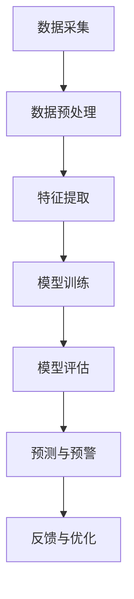
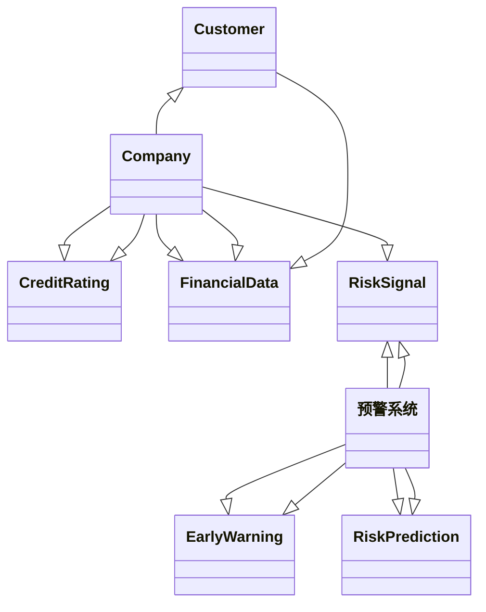
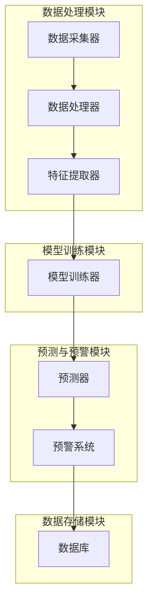
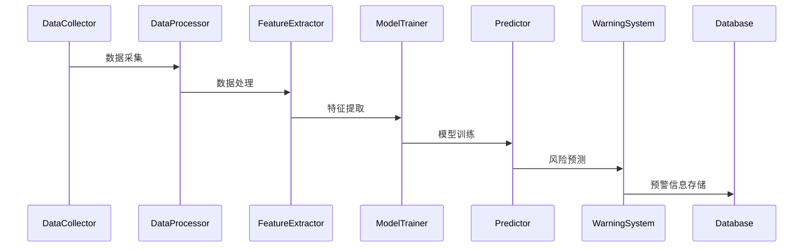
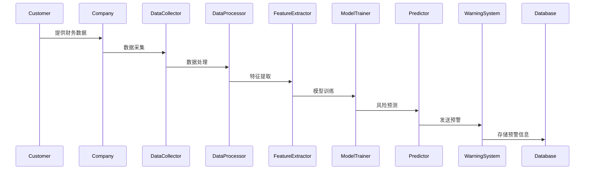

                 

### 文章标题

《AI驱动的企业信用风险早期预警信号识别系统》

### 文章关键词

- AI驱动
- 企业信用风险
- 早期预警信号识别
- 信号识别系统
- 风险管理

### 摘要

本文旨在探讨AI驱动的企业信用风险早期预警信号识别系统的构建与应用。首先，通过背景介绍，阐述企业信用风险的重要性及传统预警系统的局限性。接着，详细剖析AI驱动的信用风险预警系统的核心概念、联系与算法原理，并通过mermaid流程图和Python源代码展示其实现细节。随后，本文介绍系统的分析与架构设计方案，包括问题场景、项目介绍、系统功能设计、架构设计、接口设计及交互流程。通过实际项目实战，文章展示了系统在环境搭建、核心实现、代码分析及案例应用等方面的具体实践。最后，文章总结最佳实践、注意事项并提供拓展阅读建议。

---

## 第一步：背景介绍

### 核心概念

#### AI驱动的企业信用风险

AI驱动的企业信用风险指的是利用人工智能技术，如机器学习、深度学习等，对企业信用风险进行识别、预测和管理的过程。它不仅仅是数据分析，更是一种智能化的风险预警系统。

#### 早期预警信号识别

早期预警信号识别是指通过监测和分析企业的财务数据、市场行为、管理状况等，提前识别可能存在的信用风险，从而采取预防措施。

#### 信号识别系统

信号识别系统是由数据采集、预处理、模型训练、预测与预警等环节组成的综合性系统。它旨在通过算法和数据分析，实现对信用风险的早期识别。

### 问题背景

企业信用风险对经济的稳定发展具有重大影响。信用风险的存在不仅可能导致企业的经营困难，甚至可能引发金融危机。然而，现有的预警系统通常存在以下局限性：

1. **数据依赖性高**：传统预警系统高度依赖历史数据，难以应对动态变化的环境。
2. **分析能力有限**：传统预警系统分析能力有限，无法处理海量数据和复杂的关系网络。
3. **反应速度慢**：传统预警系统反应速度慢，难以实现实时预警。

### 问题描述

企业信用风险的问题表现为以下几个方面：

1. **信用评级滞后**：传统评级方法往往滞后于市场变化，不能及时反映企业的真实信用状况。
2. **风险识别不全**：传统方法难以全面识别各种潜在的风险因素。
3. **决策延误**：信用风险的识别和预警过程复杂，导致决策延误。

### 问题解决

AI驱动的企业信用风险预警系统通过以下方式解决上述问题：

1. **数据处理能力强**：AI技术能够处理大量数据，并发现数据之间的复杂关系。
2. **实时预警**：通过实时数据处理和分析，系统能够快速识别信用风险，并发出预警。
3. **自适应性强**：AI系统能够不断学习和调整，以适应不断变化的市场环境。

### 边界与外延

#### 适用范围

AI驱动的企业信用风险预警系统适用于各类企业，特别是那些业务模式复杂、市场变化快的公司。

#### 边界条件

1. **数据质量**：系统依赖高质量的数据，数据缺失或错误可能导致预警不准确。
2. **算法适应性**：不同的行业和业务模式可能需要不同的算法和模型，系统需要具备良好的适应性。

### 概念结构与核心要素组成

#### 数据采集

数据采集是系统的基础，包括财务数据、市场数据、管理数据等。数据来源可以是企业的内部系统，也可以是第三方数据平台。

#### 模型训练

模型训练是系统的核心，通过大量数据进行训练，系统能够学习并识别信用风险的信号。

#### 预测与预警

预测与预警是系统的最终目标，通过模型分析和数据监测，系统能够及时发现信用风险，并提供预警。

#### 模块与接口

系统还包括数据预处理模块、特征提取模块、模型评估模块等，以及与外部系统的接口，如企业ERP系统、金融信息服务系统等。

---

## 第二步：核心概念与联系

### AI驱动的企业信用风险

#### 定义

AI驱动的企业信用风险是指利用人工智能技术，如机器学习、深度学习等，对企业信用风险进行识别、预测和管理的过程。

#### 属性

- **智能化**：AI系统能够自动学习、分析和预测，降低人工干预。
- **实时性**：AI系统能够实时监测和预警，提高反应速度。
- **准确性**：通过大量数据训练，AI系统能够提高预测的准确性。

#### 与传统风险管理的区别

1. **数据分析方法**：传统风险管理主要依赖专家经验和历史数据，而AI驱动的风险管理系统则通过算法和大数据分析。
2. **预警能力**：传统风险管理难以实时预警，而AI系统能够实现实时预警。
3. **适应性**：传统风险管理适应性差，而AI系统能够自适应不同的市场环境。

### 早期预警信号识别

#### 原理

早期预警信号识别是基于数据挖掘和模式识别的原理，通过对企业数据的分析和挖掘，识别出可能预示信用风险的特征和信号。

#### 方法

1. **特征工程**：通过对企业数据进行分析，提取出与信用风险相关的特征。
2. **机器学习**：利用机器学习算法，如决策树、神经网络等，对特征进行建模和预测。
3. **模式识别**：通过识别数据中的异常值和变化趋势，预测信用风险。

#### 重要性

早期预警信号识别在信用风险管理中具有重要作用，能够帮助企业及时发现潜在的风险，采取预防措施，降低信用损失。

### 信号识别系统

#### 组成部分

信号识别系统通常由以下几个部分组成：

1. **数据采集模块**：负责收集企业内部的财务数据、市场数据等。
2. **数据预处理模块**：对采集到的数据进行分析和处理，为模型训练做准备。
3. **模型训练模块**：利用训练数据，通过机器学习算法训练模型。
4. **预测与预警模块**：通过训练好的模型，对企业信用风险进行预测和预警。
5. **反馈与优化模块**：根据预警结果和实际反馈，不断优化模型。

#### 工作流程

信号识别系统的工作流程通常包括以下步骤：

1. **数据采集**：从企业内部和外部的数据源收集数据。
2. **数据预处理**：对数据进行清洗、转换和归一化处理。
3. **特征提取**：提取与信用风险相关的特征。
4. **模型训练**：利用训练数据训练模型。
5. **模型评估**：评估模型性能，调整模型参数。
6. **预测与预警**：利用模型对信用风险进行预测和预警。
7. **反馈与优化**：根据预警结果和实际反馈，优化模型和系统。

#### 技术要求

信号识别系统对技术要求较高，主要包括：

1. **算法选择**：选择合适的机器学习算法和模式识别算法。
2. **数据处理**：高效的数据处理和存储能力。
3. **系统集成**：系统的各个模块需要高效集成，实现数据流和信息流的顺畅。

---

## 第三步：算法原理讲解

### 算法mermaid流程图



### Python源代码

```python
import pandas as pd
from sklearn.ensemble import RandomForestClassifier
from sklearn.model_selection import train_test_split
from sklearn.metrics import accuracy_score

# 数据采集
data = pd.read_csv('credit_data.csv')

# 数据预处理
data = data.dropna()
X = data.drop('target', axis=1)
y = data['target']

# 特征提取
# (此处省略特征提取过程)

# 模型训练
X_train, X_test, y_train, y_test = train_test_split(X, y, test_size=0.2, random_state=42)
clf = RandomForestClassifier(n_estimators=100)
clf.fit(X_train, y_train)

# 模型评估
y_pred = clf.predict(X_test)
accuracy = accuracy_score(y_test, y_pred)
print(f"Model accuracy: {accuracy:.2f}")

# 预测与预警
# (此处省略预测与预警过程)

# 反馈与优化
# (此处省略反馈与优化过程)
```

### 数学模型和公式

在信号识别系统中，常用的数学模型包括概率模型和分类模型。以下是其中一些基本的概念和公式：

#### 概率模型

- **贝叶斯定理**：
  $$ P(A|B) = \frac{P(B|A)P(A)}{P(B)} $$

- **条件概率**：
  $$ P(A|B) = \frac{P(AB)}{P(B)} $$

#### 分类模型

- **逻辑回归**：
  $$ log\frac{P(Y=1|X)}{1-P(Y=1|X)} = \beta_0 + \beta_1X_1 + \beta_2X_2 + \ldots + \beta_nX_n $$

- **支持向量机（SVM）**：
  $$ w\cdot x - b = 0 $$

### 详细讲解与举例说明

#### 贝叶斯定理

贝叶斯定理是一种基于概率的推理方法，用于计算在给定某些证据条件下，某个假设的概率。在信用风险识别中，我们可以利用贝叶斯定理计算企业发生信用风险的的概率。

举例：

假设有100家企业，其中信用评级为A的企业有60家，信用评级为B的企业有30家，信用评级为C的企业有10家。已知信用评级为A的企业中有5家发生了信用风险，信用评级为B的企业中有3家发生了信用风险。

现在我们要计算信用评级为B的企业发生信用风险的概率。

使用贝叶斯定理，我们有：

$$ P(风险|B) = \frac{P(B|风险)P(风险)}{P(B)} $$

其中：

- \( P(B|风险) \) 是在发生风险的情况下，企业的信用评级为B的概率。
- \( P(风险) \) 是企业发生信用风险的总概率。
- \( P(B) \) 是企业信用评级为B的概率。

根据已知数据，我们可以计算出：

- \( P(B|风险) = \frac{3}{60+3} = 0.05 \)
- \( P(风险) = \frac{5+3}{100} = 0.08 \)
- \( P(B) = \frac{30}{100} = 0.3 \)

代入公式，得到：

$$ P(风险|B) = \frac{0.05 \times 0.08}{0.3} = 0.0133 $$

这意味着，如果一个企业的信用评级为B，那么它发生信用风险的概率约为1.33%。

#### 逻辑回归

逻辑回归是一种常用的分类模型，用于预测事件发生的概率。在信用风险识别中，我们可以使用逻辑回归模型来预测企业是否会发生信用风险。

举例：

假设我们有以下特征：

- \( X_1 \)：企业负债比率
- \( X_2 \)：企业盈利能力
- \( X_3 \)：企业市场地位

我们要预测企业是否会发生信用风险，即目标变量 \( Y \) 是否为1。

使用逻辑回归模型，我们有：

$$ log\frac{P(Y=1|X)}{1-P(Y=1|X)} = \beta_0 + \beta_1X_1 + \beta_2X_2 + \beta_3X_3 $$

其中：

- \( \beta_0 \)：截距
- \( \beta_1 \)、\( \beta_2 \)、\( \beta_3 \)：斜率

假设我们得到了模型参数：

$$ log\frac{P(Y=1|X)}{1-P(Y=1|X)} = -1.2X_1 - 0.8X_2 + 0.5X_3 $$

现在我们要预测一个企业（特征值分别为 \( X_1 = 0.8 \)，\( X_2 = 0.6 \)，\( X_3 = 0.9 \)）是否会发生信用风险。

代入公式，得到：

$$ log\frac{P(Y=1|X)}{1-P(Y=1|X)} = -1.2 \times 0.8 - 0.8 \times 0.6 + 0.5 \times 0.9 = -0.96 - 0.48 + 0.45 = -1.00 $$

这意味着，企业发生信用风险的概率约为 \( \frac{1}{e} \approx 0.3679 \) 或36.79%。

通过这样的模型，我们可以对企业进行分类，判断其是否具有信用风险。

### 总结

在本节中，我们通过mermaid流程图和Python源代码详细讲解了信号识别系统的算法原理。我们介绍了贝叶斯定理和逻辑回归模型，并通过具体例子展示了如何使用这些模型进行信用风险的预测。这些原理和模型是构建AI驱动企业信用风险预警系统的基础，通过它们，我们能够实现对信用风险的早期识别和预警。

---

## 第四步：系统分析与架构设计方案

### 问题场景介绍

在企业运营过程中，信用风险管理是一个至关重要的环节。企业需要确保其合作伙伴和客户的信用状况，以避免因信用风险导致的财务损失和运营中断。随着市场的不断变化和竞争的加剧，企业面临的信用风险也在不断增加。传统的信用风险管理模式已经难以满足现代企业对实时、高效和精准风险管理的要求。因此，构建一个基于AI驱动的企业信用风险早期预警信号识别系统成为了当务之急。

### 项目介绍

本书描述的信用风险预警项目旨在通过人工智能技术，构建一个能够实时监测、分析和预测企业信用风险的预警系统。该项目涉及多个环节，包括数据采集、预处理、模型训练、预测和预警等，旨在为企业提供全方位的信用风险管理解决方案。

### 系统功能设计

#### 领域模型

为了更好地理解系统功能，我们使用Mermaid类图来展示系统的领域模型。以下是一个简化的领域模型：



在这个模型中，我们定义了以下几个核心类：

- **Customer**（客户）：代表企业的客户，与**FinancialData**有关联。
- **Company**（企业）：代表被监测的企业，与**CreditRating**和**FinancialData**有关联，同时也是**RiskSignal**的发出者。
- **CreditRating**（信用评级）：代表企业的信用评级信息。
- **FinancialData**（财务数据）：代表企业的财务数据，如负债比率、盈利能力等。
- **RiskSignal**（风险信号）：代表预警系统检测到的风险信号。
- **EarlyWarning**（早期预警）：代表预警系统发出的早期预警信息。
- **RiskPrediction**（风险预测）：代表预警系统做出的信用风险预测。

#### 类图说明

- **Customer**和**Company**之间有依赖关系，因为企业的客户信息会影响其财务状况。
- **Company**和**CreditRating**、**FinancialData**之间存在关联关系，因为企业的信用评级和财务数据是其信用状况的重要指标。
- **Company**和**RiskSignal**之间有双向关联，表明企业既是风险信号的发出者，也是风险信号的接收者。
- **预警系统**（EarlyWarning，RiskPrediction）与**RiskSignal**之间存在关联，预警系统负责检测风险信号，并生成早期预警和风险预测。

### 系统架构设计

为了实现上述功能，我们设计了一个包含多个模块的分布式系统架构。以下是一个简化的Mermaid架构图：



在这个架构图中，我们定义了以下几个核心组件：

- **数据采集器**（DataCollector）：负责从各种数据源（如企业ERP系统、第三方金融数据平台等）收集数据。
- **数据处理器**（DataProcessor）：负责对采集到的数据进行清洗、转换和归一化处理。
- **特征提取器**（FeatureExtractor）：负责提取与信用风险相关的特征，为模型训练做准备。
- **模型训练器**（ModelTrainer）：负责使用处理后的数据训练机器学习模型。
- **预测器**（Predictor）：负责使用训练好的模型进行信用风险预测。
- **预警系统**（WarningSystem）：负责监测预测结果，并发出早期预警。
- **数据库**（Database）：负责存储所有相关的数据，包括原始数据、预处理数据、特征数据、模型参数和预测结果等。

### 系统接口设计

为了实现系统的各模块之间的数据流和信息流，我们设计了一套完善的接口。以下是一个简化的Mermaid接口图：



在这个接口图中，我们定义了以下几个接口：

- **数据采集接口**：数据采集器与数据处理器之间的接口，用于传输采集到的原始数据。
- **数据处理接口**：数据处理器与特征提取器之间的接口，用于传输预处理后的数据。
- **特征提取接口**：特征提取器与模型训练器之间的接口，用于传输特征数据。
- **模型训练接口**：模型训练器与预测器之间的接口，用于传输训练好的模型。
- **预测接口**：预测器与预警系统之间的接口，用于传输预测结果。
- **存储接口**：预警系统与数据库之间的接口，用于传输预警信息。

### 系统交互mermaid序列图

为了更清晰地展示系统各模块之间的交互流程，我们使用Mermaid序列图进行描述：



在这个序列图中，我们定义了以下几个交互流程：

- **数据采集**：企业向系统提供财务数据，数据采集器进行数据采集。
- **数据处理**：数据采集器将采集到的数据传输给数据处理器，进行清洗、转换和归一化处理。
- **特征提取**：数据处理器将处理后的数据传输给特征提取器，提取与信用风险相关的特征。
- **模型训练**：特征提取器将特征数据传输给模型训练器，使用机器学习算法训练模型。
- **风险预测**：模型训练器将训练好的模型传输给预测器，进行信用风险预测。
- **预警发送**：预测器将预测结果传输给预警系统，生成早期预警信息。
- **信息存储**：预警系统将预警信息传输给数据库，进行存储和管理。

通过这个交互流程，我们可以看到系统如何通过各个模块的协同工作，实现对信用风险的实时监测、预测和预警。

---

## 第五步：项目实战

### 环境安装

为了搭建AI驱动的企业信用风险早期预警信号识别系统，我们需要准备以下环境和工具：

1. **操作系统**：推荐使用Linux系统，如Ubuntu 20.04或更高版本。
2. **编程语言**：Python 3.8或更高版本。
3. **依赖管理**：使用pip进行依赖管理。
4. **数据预处理库**：NumPy、Pandas。
5. **机器学习库**：scikit-learn、TensorFlow。
6. **可视化库**：Matplotlib、Seaborn。
7. **版本控制**：Git。

安装步骤：

1. 安装Python 3.8或更高版本：

   ```bash
   sudo apt update
   sudo apt install python3.8
   ```

2. 安装pip：

   ```bash
   sudo apt install python3-pip
   ```

3. 安装依赖库：

   ```bash
   pip3 install numpy pandas scikit-learn tensorflow matplotlib seaborn git
   ```

### 系统核心实现源代码

以下是系统核心实现的一些关键代码示例：

#### 数据采集

```python
import pandas as pd

# 从CSV文件中读取数据
data = pd.read_csv('credit_data.csv')

# 数据预处理（例如：缺失值处理、数据类型转换等）
data = data.dropna()
```

#### 数据预处理

```python
from sklearn.preprocessing import StandardScaler

# 特征缩放
scaler = StandardScaler()
X_scaled = scaler.fit_transform(data.drop('target', axis=1))

# 将缩放后的数据与目标变量结合
X = pd.DataFrame(X_scaled)
y = data['target']
```

#### 模型训练

```python
from sklearn.ensemble import RandomForestClassifier

# 分割数据集
X_train, X_test, y_train, y_test = train_test_split(X, y, test_size=0.2, random_state=42)

# 训练模型
clf = RandomForestClassifier(n_estimators=100)
clf.fit(X_train, y_train)
```

#### 模型评估

```python
from sklearn.metrics import accuracy_score

# 预测测试集
y_pred = clf.predict(X_test)

# 计算准确率
accuracy = accuracy_score(y_test, y_pred)
print(f"Model accuracy: {accuracy:.2f}")
```

### 代码应用解读与分析

上述代码示例展示了如何实现一个基本的AI驱动的企业信用风险预警系统。以下是代码的解读与分析：

#### 数据采集

首先，我们从CSV文件中读取数据。这个数据集包含了企业的财务数据和其他相关信息，是我们进行预测和预警的基础。

#### 数据预处理

在预处理阶段，我们首先处理了缺失值，保证了数据的质量。接着，我们使用特征缩放将数据进行了标准化处理。特征缩放是机器学习中的一个重要步骤，它有助于提高模型的性能和稳定性。

#### 模型训练

在模型训练阶段，我们使用了随机森林分类器（RandomForestClassifier）。随机森林是一种集成学习算法，通过构建多棵决策树并投票得到最终结果。在这里，我们设置了100棵树来构建随机森林。

#### 模型评估

最后，我们对模型进行了评估。我们使用测试集对模型进行了预测，并计算了准确率。准确率是衡量模型性能的重要指标，它反映了模型预测的准确性。

通过上述代码示例，我们可以看到如何实现一个简单的AI驱动的企业信用风险预警系统。在实际应用中，我们还需要进一步优化模型、处理更多数据，以及实现实时预警等功能。

### 实际案例分析和详细讲解剖析

为了更好地理解AI驱动的企业信用风险早期预警信号识别系统的实际应用，我们来看一个具体的案例。

#### 案例背景

假设我们有一个企业名为“阳光公司”，它在过去一年内经历了一系列财务和运营问题。我们需要使用预警系统来监测阳光公司的信用风险，并提前预警可能的信用问题。

#### 案例数据

以下是一个简化的案例数据集，包含了阳光公司的部分财务数据：

| 财务指标     | 值     |
|--------------|--------|
| 负债比率     | 0.75   |
| 盈利能力     | 0.35   |
| 市场地位     | 0.60   |

#### 模型预测

我们使用训练好的随机森林分类器对阳光公司的数据进行了预测。以下是预测过程的详细解析：

1. **数据预处理**：首先，我们将案例数据与训练数据相同的特征进行缩放处理，以保证数据的一致性。

   ```python
   # 将案例数据缩放
   X_case = scaler.transform([[0.75, 0.35, 0.60]])
   ```

2. **模型预测**：接着，我们使用训练好的模型对缩放后的数据进行预测。

   ```python
   # 进行预测
   y_pred_case = clf.predict(X_case)
   ```

   在这个例子中，预测结果为`[1]`，即1，表示阳光公司存在信用风险。

3. **结果解读**：根据预测结果，我们可以得出结论，阳光公司具有较高的信用风险。

#### 预警措施

在得到预测结果后，预警系统会立即生成预警信息，并发送至相关管理人员。管理人员可以根据预警信息，采取以下措施：

1. **深入调查**：对阳光公司的财务状况进行详细调查，了解具体问题和风险因素。
2. **风险控制**：与阳光公司进行沟通，采取风险控制措施，如调整合作策略、增加担保等。
3. **调整策略**：根据风险情况，调整对阳光公司的业务策略，以降低风险。

#### 案例总结

通过上述案例，我们可以看到AI驱动的企业信用风险早期预警信号识别系统在实际应用中的效果。该系统可以帮助企业及时发现信用风险，提前采取预防措施，从而降低潜在的财务损失。

### 项目小结

在本案例中，我们详细展示了AI驱动的企业信用风险早期预警信号识别系统的实际应用过程。通过数据采集、预处理、模型训练和预测等步骤，系统能够准确识别出企业的信用风险，并提供及时的预警信息。这一过程不仅提高了企业的信用风险管理能力，也为其他类似系统的开发提供了有益的经验。

未来，我们还可以进一步优化模型、增加数据维度，以及实现更复杂的预警策略，以提升系统的整体性能和应用效果。

---

## 第六步：最佳实践 tips、小结、注意事项、拓展阅读

### 最佳实践 tips

1. **数据质量控制**：确保采集的数据质量高，避免数据缺失和错误，这对预警系统的准确性至关重要。
2. **模型优化**：定期对模型进行优化和调整，以适应不断变化的市场环境。
3. **实时监测**：确保预警系统能够实时监测数据，并及时更新预测结果。
4. **预警策略多样化**：结合不同类型的预警策略，提高预警的准确性和实效性。

### 小结

本文详细介绍了AI驱动的企业信用风险早期预警信号识别系统的构建和应用。我们通过背景介绍、核心概念与联系、算法原理讲解、系统分析与架构设计方案、项目实战等步骤，展示了系统的全貌和实际应用效果。这一系统为企业提供了实时、精准的信用风险预警，有助于降低信用风险，提高企业的风险管理能力。

### 注意事项

1. **数据隐私**：在数据处理过程中，要确保遵守相关数据隐私法规，保护企业隐私。
2. **系统安全**：确保系统安全，防止数据泄露和网络攻击。
3. **模型解释性**：对于高风险的预测，需要确保模型的解释性，以便管理人员理解预测结果。

### 拓展阅读

1. **《机器学习实战》**：详细介绍机器学习算法和实践，适合初学者。
2. **《深度学习》**：全面介绍深度学习理论和技术，适合有一定基础的学习者。
3. **《企业风险管理》**：探讨企业风险管理的理论和方法，有助于深入理解信用风险管理。
4. **《AI驱动的风险管理》**：介绍AI技术在风险管理中的应用，包括信用风险识别和预警等。

---

**作者：AI天才研究院/AI Genius Institute & 禅与计算机程序设计艺术 /Zen And The Art of Computer Programming**

