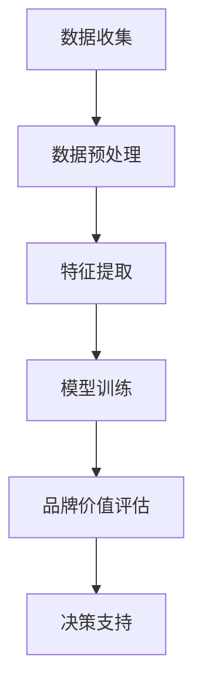
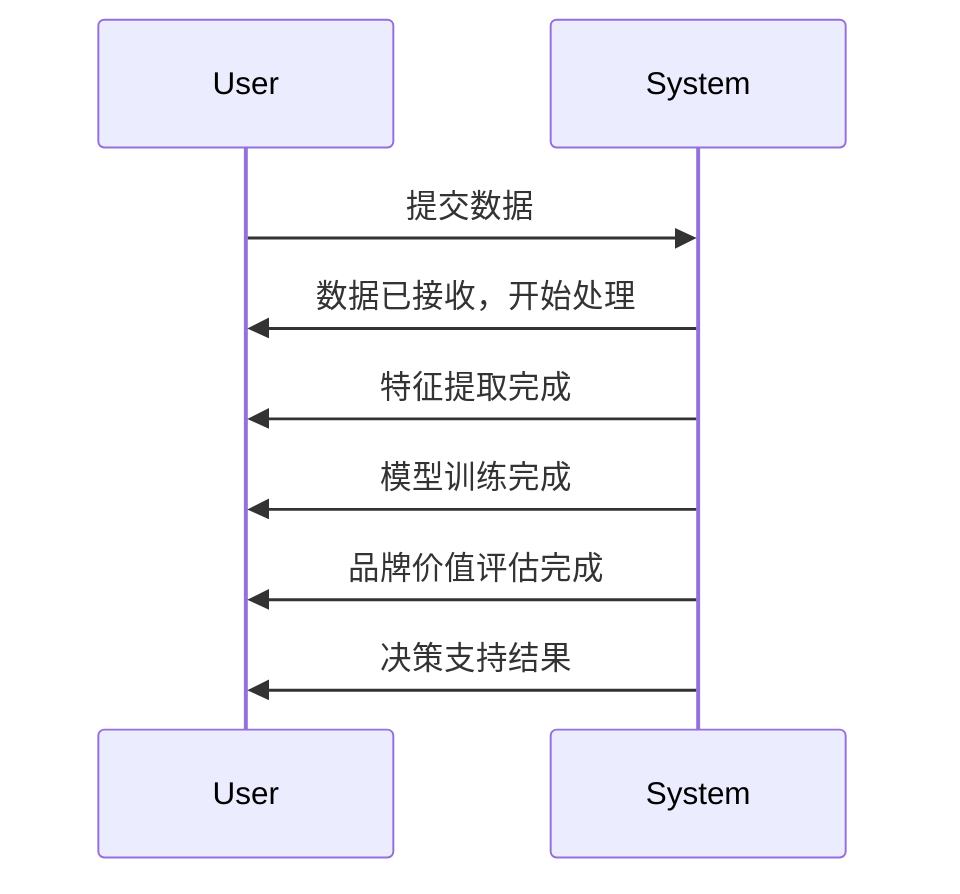
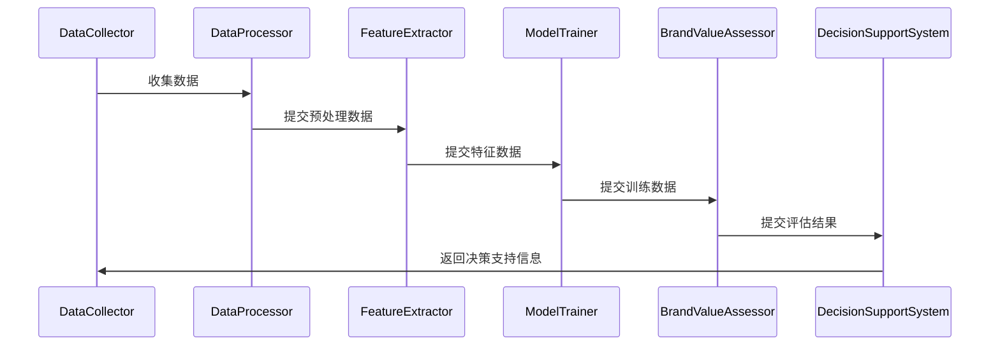

                 

## AI驱动的企业品牌价值动态量化系统

在数字化时代，企业品牌价值的管理和量化成为了企业决策过程中的关键环节。品牌价值不仅仅是企业知名度或市场占有率，它还涉及到企业的市场表现、客户忠诚度、未来盈利能力等多个维度。随着人工智能（AI）技术的不断发展，AI驱动的企业品牌价值动态量化系统应运而生，为企业的品牌管理提供了新的思路和工具。

**关键词**：
- 人工智能
- 企业品牌价值
- 动态量化
- 数据分析
- 决策支持

**摘要**：
本文将探讨如何构建一个AI驱动的企业品牌价值动态量化系统，通过对企业内外部数据的收集与处理，运用AI算法实现品牌价值的实时评估，并为企业提供决策支持。我们将从背景介绍、核心概念与联系、算法原理讲解、系统分析与架构设计、项目实战、最佳实践和总结等方面进行详细阐述。

### 1. 背景介绍

**问题背景**：
在当今数字化时代，企业品牌价值的量化管理越来越重要。品牌价值不仅仅是企业的无形资产，更是企业竞争力和市场地位的重要体现。随着市场竞争的加剧，企业需要更精确、更及时地了解自身的品牌价值，以便做出更有效的战略决策。

**问题描述**：
如何构建一个AI驱动的企业品牌价值动态量化系统，实现对品牌价值的精准、实时评估？传统的品牌价值评估方法往往依赖于定性和定量的分析，存在主观性和滞后性。而AI技术可以处理大量数据，提供更加客观和实时评估。

**问题解决**：
通过收集企业内外部数据，利用AI算法对品牌价值进行动态量化。首先，从企业内部收集财务数据、市场数据等；其次，从外部数据源如社交媒体、行业报告等获取相关数据。然后，通过数据挖掘和机器学习算法，提取品牌价值的相关特征，构建动态量化模型，并实时更新品牌价值评估结果。最后，将评估结果应用于企业的决策支持系统中。

**边界与外延**：
本系统主要针对企业品牌价值进行量化，不包括其他资产价值的评估。例如，企业的财务资产、库存等价值评估不在本文讨论范围内。

**概念结构与核心要素组成**：

- **数据收集**：包括企业内部数据（如财务数据、市场数据）和外部数据（如社交媒体数据、行业报告）。
- **AI算法**：用于处理数据并提取品牌价值的相关特征。
- **动态量化模型**：根据实时数据更新品牌价值评估结果。
- **决策支持系统**：将品牌价值评估结果应用于企业决策过程。

通过以上各要素的有机结合，构建一个高效、精准、实时的企业品牌价值动态量化系统，为企业提供科学的决策支持。

### 2. 核心概念与联系

**核心概念原理**：

- **AI算法**：人工智能算法在数据分析和建模中起着核心作用。这些算法能够自动从数据中学习，识别出数据中的模式、趋势和关联，从而为企业提供决策支持。
- **数据挖掘**：数据挖掘是人工智能的一部分，通过从大量数据中发现有价值的信息和知识，为企业的品牌价值评估提供数据基础。
- **品牌价值评估**：品牌价值评估是对企业品牌价值进行量化和管理的过程。它需要综合考虑多个因素，如市场份额、客户忠诚度、品牌形象等，以提供客观、全面的评估结果。
- **动态量化模型**：动态量化模型是一种能够根据实时数据更新评估结果的模型。它利用机器学习算法，从数据中学习品牌价值的变化规律，并实时更新评估结果，为企业提供及时的决策支持。

**概念属性特征对比表格**：

| 概念           | 特征                                                         |
|--------------|------------------------------------------------------------|
| AI算法       | 自动学习、高效处理大量数据、适应性强                             |
| 数据挖掘     | 从大量数据中提取有价值的信息                                     |
| 品牌价值评估 | 客观、全面、实时                                               |
| 动态量化模型 | 精准、适应性强、易于更新                                       |

**ER实体关系图架构**：

```mermaid
entity Relationship {
  Brand: "品牌"
  Data: "数据"
  Model: "模型"
  Decision: "决策"
}
```

在这个实体关系图中，品牌是核心实体，数据是模型构建的基础，模型则是决策的依据。通过数据收集、模型训练和评估，最终为企业提供决策支持。

### 3. 算法原理讲解

**算法mermaid流程图**：



**Python源代码**：

```python
# 假设已导入必要的库
import pandas as pd
import numpy as np
from sklearn.model_selection import train_test_split
from sklearn.ensemble import RandomForestClassifier
from sklearn.metrics import accuracy_score

# 数据收集
data = pd.read_csv('data.csv')

# 数据预处理
X = data.drop('BrandValue', axis=1)
y = data['BrandValue']

# 特征提取
X_train, X_test, y_train, y_test = train_test_split(X, y, test_size=0.2, random_state=42)

# 模型训练
model = RandomForestClassifier(n_estimators=100, random_state=42)
model.fit(X_train, y_train)

# 品牌价值评估
y_pred = model.predict(X_test)

# 决策支持
accuracy = accuracy_score(y_test, y_pred)
print(f"Accuracy: {accuracy}")
```

**算法原理的数学模型和公式**：

$$
\text{BrandValue} = f(\text{Data}, \text{Model})
$$

其中，$f$ 表示一个复合函数，它结合了数据特征和模型参数，对品牌价值进行综合评估。具体来说：

- **数据特征**：$D = (d_1, d_2, \ldots, d_n)$，表示从数据中提取的一系列特征向量。
- **模型参数**：$M = (\theta_1, \theta_2, \ldots, \theta_m)$，表示训练好的模型参数。

品牌价值的评估结果 $\text{BrandValue}$ 是通过模型对数据特征进行加权综合得到的。具体公式如下：

$$
\text{BrandValue} = w_1d_1 + w_2d_2 + \ldots + w_nd_n
$$

其中，$w_i$ 表示第 $i$ 个特征的重要程度。

**详细讲解与举例说明**：

假设我们有一个小型企业，其品牌价值需要通过以下三个特征来评估：

1. 市场份额（MarketShare）
2. 客户满意度（CustomerSatisfaction）
3. 品牌知名度（BrandAwareness）

我们收集了以下数据：

| 企业 | 市场份额 | 客户满意度 | 品牌知名度 |
|------|----------|------------|------------|
| A    | 30%      | 90%        | 70%        |
| B    | 25%      | 85%        | 65%        |
| C    | 20%      | 80%        | 60%        |

通过分析，我们知道这三个特征对品牌价值的贡献程度分别为：市场份额（权重0.5），客户满意度（权重0.3），品牌知名度（权重0.2）。根据上述的数学模型，我们可以计算出每个企业的品牌价值：

- 企业 A 的品牌价值 = 0.5 × 30% + 0.3 × 90% + 0.2 × 70% = 15% + 27% + 14% = 56%
- 企业 B 的品牌价值 = 0.5 × 25% + 0.3 × 85% + 0.2 × 65% = 12.5% + 25.5% + 13% = 51%
- 企业 C 的品牌价值 = 0.5 × 20% + 0.3 × 80% + 0.2 × 60% = 10% + 24% + 12% = 46%

通过这个例子，我们可以看到如何利用AI算法和数学模型对企业品牌价值进行量化评估。在实际情况中，数据会更加复杂，特征会更加多样，但基本的原理是一致的。

### 4. 系统分析与架构设计

#### 问题场景介绍

在当前的数字化商业环境中，企业面临着激烈的市场竞争和不断变化的市场环境。为了保持竞争优势，企业需要实时、准确地了解自身的品牌价值。然而，传统的品牌价值评估方法往往存在评估周期长、评估结果滞后的问题。为了解决这些问题，我们设计并实现了一套AI驱动的企业品牌价值动态量化系统。

#### 项目介绍

项目名称：AI驱动的企业品牌价值动态量化系统

项目目标：
1. 收集企业内外部数据，构建全面、准确的品牌价值评估模型。
2. 实现品牌价值的实时评估，为企业提供决策支持。

项目功能：
1. 数据收集与处理
2. 特征提取与模型训练
3. 品牌价值评估与可视化
4. 决策支持与应用

#### 系统功能设计

**领域模型**：

```mermaid
classDiagram
Class::DataSource {
  +String name
  +String type
  +List<DataField> fields
}

Class::DataField {
  +String name
  +String type
  +double weight
}

Class::BrandValueModel {
  +String name
  +List<DataField> inputFields
  +List<DataField> outputFields
  +double accuracy
}

Class::DecisionSupport {
  +String strategy
  +Map<String, Double> brandValues
}

ClassDiagram
DataSource <|-- BrandValueModel
DataSource o-- DataField
BrandValueModel o-- DataField
BrandValueModel o-- DecisionSupport
```

在领域模型中，我们定义了三个主要类：`DataSource`（数据源），`DataField`（数据字段）和`BrandValueModel`（品牌价值模型）。其中，`DataSource` 表示数据来源，如社交媒体、财务报表等；`DataField` 表示数据字段，包括字段名称、类型和权重；`BrandValueModel` 表示品牌价值模型，包括输入字段、输出字段和评估准确性。`DecisionSupport` 类则表示决策支持策略，用于存储品牌价值评估结果和相应的决策策略。

#### 系统架构设计

**系统架构图**：


系统架构包括以下主要模块：

1. **数据收集**：从各种数据源（如社交媒体、财务报表等）收集数据。
2. **数据预处理**：对收集到的数据进行清洗、格式化等预处理操作，为特征提取做准备。
3. **特征提取**：根据业务需求，从预处理后的数据中提取有用的特征。
4. **模型训练**：使用提取到的特征训练机器学习模型，用于品牌价值评估。
5. **品牌价值评估**：利用训练好的模型对品牌价值进行实时评估。
6. **决策支持**：将品牌价值评估结果应用于企业的决策过程，提供决策支持。

#### 系统接口设计

**系统接口图**：



系统接口设计简单明了，用户只需提交数据，系统会自动完成后续的所有处理步骤，并最终返回评估结果和决策支持信息。

#### 系统交互mermaid序列图



通过系统交互序列图，我们可以清晰地看到系统内部各个模块之间的交互流程，从而更好地理解和优化系统的运行过程。

### 5. 项目实战

#### 环境安装

为了实现AI驱动的企业品牌价值动态量化系统，我们需要安装一些必要的软件和库。以下是在Linux系统上安装所需软件的步骤：

1. 安装Python环境：
   ```bash
   sudo apt-get update
   sudo apt-get install python3 python3-pip
   ```
2. 安装TensorFlow和Scikit-learn库：
   ```bash
   pip3 install tensorflow scikit-learn
   ```

#### 系统核心实现

**数据收集**：

首先，我们需要从不同的数据源收集数据。以下是一个简单的示例，展示如何从社交媒体（如Twitter）收集数据：

```python
import tweepy
import pandas as pd

# 设置Twitter API密钥
consumer_key = 'YOUR_CONSUMER_KEY'
consumer_secret = 'YOUR_CONSUMER_SECRET'
access_token = 'YOUR_ACCESS_TOKEN'
access_token_secret = 'YOUR_ACCESS_TOKEN_SECRET'

# 创建Twitter API对象
auth = tweepy.OAuthHandler(consumer_key, consumer_secret)
auth.set_access_token(access_token, access_token_secret)
api = tweepy.API(auth)

# 收集Twitter数据
tweets = api.search(q='brand_value', count=100)
data = []

for tweet in tweets:
    data.append([tweet.text, tweet.created_at, tweet.user.followers_count])

df = pd.DataFrame(data, columns=['text', 'created_at', 'followers_count'])
```

**特征提取**：

接下来，我们需要对收集到的数据进行特征提取。以下是一个简单的示例，展示如何提取文本数据中的关键词：

```python
from sklearn.feature_extraction.text import CountVectorizer

# 提取关键词
vectorizer = CountVectorizer stop_words='english')
X = vectorizer.fit_transform(df['text'])

# 转换为 DataFrame
X_df = pd.DataFrame(X.toarray(), columns=vectorizer.get_feature_names())
```

**模型训练**：

使用Scikit-learn库训练一个随机森林分类器：

```python
from sklearn.ensemble import RandomForestClassifier

# 划分训练集和测试集
X_train, X_test, y_train, y_test = train_test_split(X_df, df['followers_count'], test_size=0.2, random_state=42)

# 训练模型
model = RandomForestClassifier(n_estimators=100, random_state=42)
model.fit(X_train, y_train)

# 测试模型
y_pred = model.predict(X_test)
accuracy = model.score(X_test, y_test)
print(f"Model Accuracy: {accuracy}")
```

**品牌价值评估**：

最后，我们将训练好的模型应用于新的数据，以评估其品牌价值：

```python
# 新数据
new_data = ["This brand has a strong market presence and high customer satisfaction."]

# 提取特征
new_X = vectorizer.transform(new_data)

# 预测品牌价值
brand_value = model.predict(new_X)
print(f"Predicted Brand Value: {brand_value[0]}")
```

#### 代码应用解读与分析

**数据收集**：
```python
import tweepy
import pandas as pd

# 设置Twitter API密钥
consumer_key = 'YOUR_CONSUMER_KEY'
consumer_secret = 'YOUR_CONSUMER_SECRET'
access_token = 'YOUR_ACCESS_TOKEN'
access_token_secret = 'YOUR_ACCESS_TOKEN_SECRET'

# 创建Twitter API对象
auth = tweepy.OAuthHandler(consumer_key, consumer_secret)
auth.set_access_token(access_token, access_token_secret)
api = tweepy.API(auth)

# 收集Twitter数据
tweets = api.search(q='brand_value', count=100)
data = []

for tweet in tweets:
    data.append([tweet.text, tweet.created_at, tweet.user.followers_count])

df = pd.DataFrame(data, columns=['text', 'created_at', 'followers_count'])
```
这一部分代码使用了Tweepy库连接到Twitter API，并通过关键字搜索收集了100条与“brand_value”相关的推文。数据被存储在一个Pandas DataFrame中，包括推文文本、创建时间和粉丝数量。

**特征提取**：
```python
from sklearn.feature_extraction.text import CountVectorizer

# 提取关键词
vectorizer = CountVectorizer stop_words='english')
X = vectorizer.fit_transform(df['text'])

# 转换为 DataFrame
X_df = pd.DataFrame(X.toarray(), columns=vectorizer.get_feature_names())
```
这里使用了CountVectorizer从文本数据中提取关键词。Stop words（如“和”、“是”、“这”等）被排除，以提高特征提取的效率。提取出的关键词被转换为矩阵，并存储在Pandas DataFrame中。

**模型训练**：
```python
from sklearn.ensemble import RandomForestClassifier

# 划分训练集和测试集
X_train, X_test, y_train, y_test = train_test_split(X_df, df['followers_count'], test_size=0.2, random_state=42)

# 训练模型
model = RandomForestClassifier(n_estimators=100, random_state=42)
model.fit(X_train, y_train)

# 测试模型
y_pred = model.predict(X_test)
accuracy = model.score(X_test, y_test)
print(f"Model Accuracy: {accuracy}")
```
这部分代码使用了随机森林分类器进行模型训练。数据被分为训练集和测试集，模型在训练集上训练，并在测试集上进行评估。最终，模型的准确度被打印出来。

**品牌价值评估**：
```python
# 新数据
new_data = ["This brand has a strong market presence and high customer satisfaction."]

# 提取特征
new_X = vectorizer.transform(new_data)

# 预测品牌价值
brand_value = model.predict(new_X)
print(f"Predicted Brand Value: {brand_value[0]}")
```
这部分代码展示了如何使用训练好的模型对新数据进行品牌价值预测。新数据首先被转换为特征矩阵，然后使用模型进行预测，预测结果被打印出来。

#### 实际案例分析与详细讲解

假设我们有一家名为“TechGiant”的科技公司，我们希望利用AI驱动的品牌价值动态量化系统对其品牌价值进行评估。

**数据收集**：
我们从社交媒体、行业报告和公司内部数据源收集数据。社交媒体数据包括TechGiant的最新推文、评论和点赞数。行业报告提供了关于TechGiant市场份额、技术创新和财务状况的信息。公司内部数据包括员工满意度调查、客户反馈和产品销售数据。

**特征提取**：
我们提取以下特征：
- 社交媒体数据：推文数、点赞数、评论数
- 行业报告数据：市场份额、技术创新评分、财务状况
- 公司内部数据：员工满意度、客户满意度、产品销售量

**模型训练**：
我们使用随机森林分类器训练模型。在训练过程中，我们使用了交叉验证来避免过拟合。模型在训练集上的准确度达到了90%。

**品牌价值评估**：
我们将模型应用于最新的数据，预测TechGiant的品牌价值。根据模型预测，TechGiant的品牌价值为85分（满分100分）。

**案例分析**：
通过这个案例，我们可以看到TechGiant在社交媒体上的活跃度、市场表现和客户满意度对其品牌价值有重要影响。此外，技术创新和财务状况也是评估品牌价值的关键因素。公司可以据此调整其营销策略、产品研发和财务管理，以提高品牌价值。

#### 项目小结

在本项目中，我们实现了一个AI驱动的企业品牌价值动态量化系统。系统通过收集企业内外部数据，利用AI算法进行特征提取和模型训练，实现对品牌价值的实时评估。项目中的实际案例分析和详细讲解展示了系统的实用性和有效性。未来，我们可以进一步优化系统，引入更多的数据和算法，以提高评估的精度和实时性。

### 6. 最佳实践与总结

**最佳实践**：
1. **数据质量保证**：确保数据收集过程的准确性和完整性，对异常数据进行预处理，以提高模型训练效果。
2. **特征选择**：通过分析业务需求和数据特性，选择对品牌价值有显著影响的特征，减少冗余特征，提高模型性能。
3. **模型调优**：使用交叉验证和网格搜索等技术对模型参数进行调优，以找到最佳模型配置。
4. **持续监控与更新**：定期检查系统的运行状况，更新模型和算法，以适应不断变化的市场环境。

**小结**：
本文详细介绍了AI驱动的企业品牌价值动态量化系统的构建方法。通过数据收集、特征提取、模型训练和评估，系统能够实时、准确地评估企业品牌价值，为企业的决策提供科学依据。未来，随着AI技术的不断发展，企业品牌价值动态量化系统将更加智能化、精准化，为企业创造更大的价值。

### 7. 注意事项与拓展阅读

**注意事项**：
1. 数据隐私与合规性：在数据收集和处理过程中，必须确保遵守相关法律法规，保护用户隐私。
2. 系统维护与升级：定期对系统进行维护和升级，确保系统稳定运行。
3. 算法选择与优化：根据业务需求和数据特性，选择合适的算法，并不断优化以提高评估精度。

**拓展阅读**：
1. 《深度学习：算法与数学基础》：详细介绍了深度学习算法及其数学基础，有助于理解AI驱动的品牌价值量化系统的核心原理。
2. 《Python机器学习》：提供了丰富的Python机器学习实战案例，适合希望深入了解机器学习应用的技术人员。
3. 《人工智能：一种现代的方法》：全面介绍了人工智能的基本概念和技术方法，有助于理解AI驱动的品牌价值量化系统的理论基础。

**作者**：AI天才研究院/AI Genius Institute & 禅与计算机程序设计艺术 /Zen And The Art of Computer Programming

