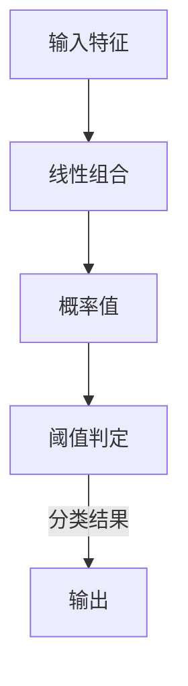
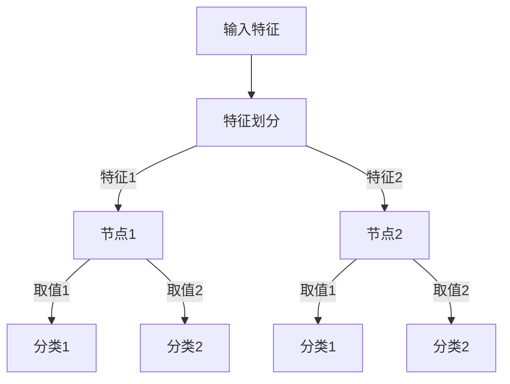
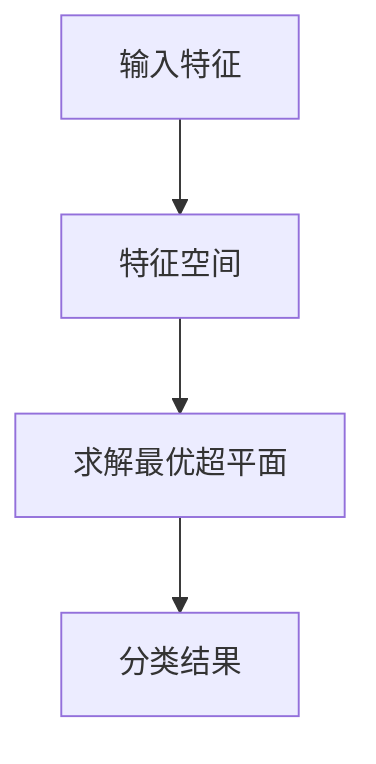
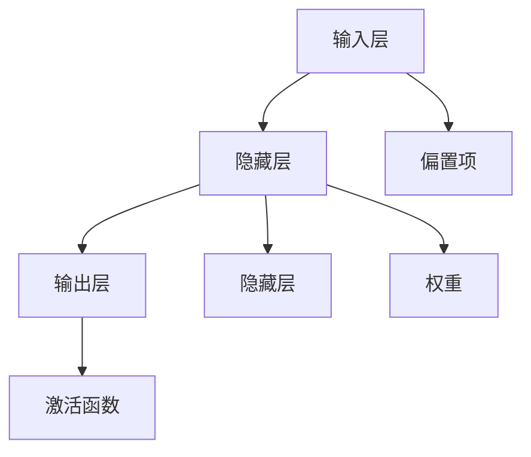
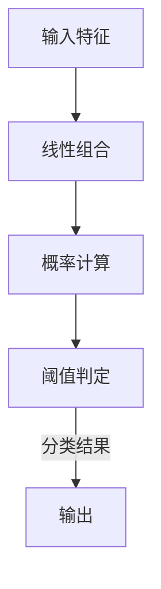
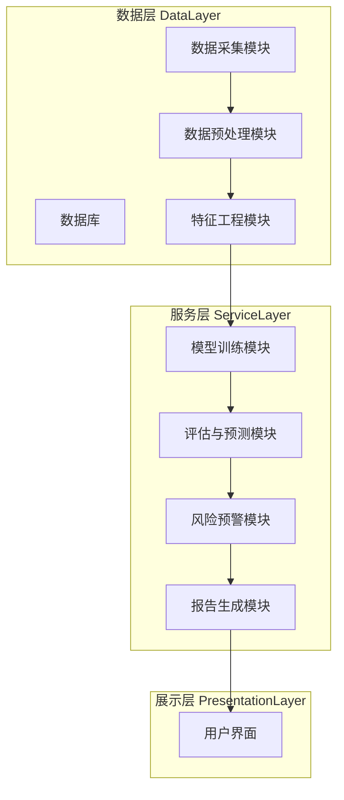
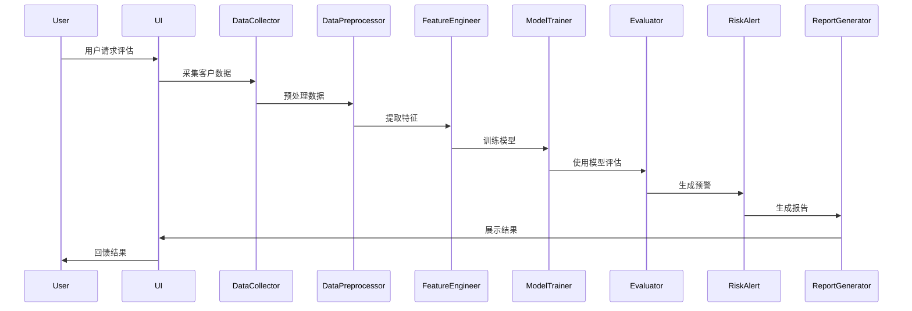

                 

----------------------------------------------------------------
# AI驱动的企业应收账款组合信用风险评估系统

> 关键词：AI, 信用风险评估，应收账款，企业财务，算法，系统架构

> 摘要：随着商业环境的复杂化和全球经济的发展，企业应收账款的管理变得日益重要。本文介绍了如何利用人工智能技术来构建一个有效的企业应收账款组合信用风险评估系统。通过详细分析算法原理、系统架构以及项目实战，本文为读者提供了从理论到实践的全方位指导。

----------------------------------------------------------------
## 目录大纲

### 第一部分：问题背景与概述
- 第1章：问题背景
  - 1.1.1 应收账款组合信用风险评估的重要性
  - 1.1.2 当前企业面临的主要问题
  - 1.1.3 AI驱动的信用风险评估系统介绍

- 第2章：核心概念与联系
  - 2.1 AI与信用风险评估
    - 2.1.1 AI的定义与发展历程
    - 2.1.2 信用风险评估的核心概念
    - 2.1.3 AI在信用风险评估中的应用
  - 2.2 概念属性特征对比表格
  - 2.3 ER实体关系图架构

### 第二部分：算法原理与数学模型
- 第3章：算法原理讲解
  - 3.1 常见算法介绍
    - 3.1.1 逻辑回归
    - 3.1.2 决策树
    - 3.1.3 支持向量机
    - 3.1.4 神经网络
  - 3.2 算法mermaid流程图
  - 3.3 Python源代码讲解
    - 3.3.1 逻辑回归代码
    - 3.3.2 决策树代码
    - 3.3.3 支持向量机代码
    - 3.3.4 神经网络代码
  - 3.4 算法原理的数学模型和公式讲解
    - 3.4.1 逻辑回归数学模型
    - 3.4.2 决策树数学模型
    - 3.4.3 支持向量机数学模型
    - 3.4.4 神经网络数学模型

### 第三部分：系统分析与架构设计
- 第4章：系统分析与架构设计方案
  - 4.1 问题场景介绍
  - 4.2 系统功能设计
    - 4.2.1 领域模型mermaid类图
  - 4.3 系统架构设计
    - 4.3.1 mermaid架构图
    - 4.3.2 系统接口设计
    - 4.3.3 系统交互mermaid序列图

### 第四部分：项目实战
- 第5章：环境安装与系统核心实现
  - 5.1 环境安装
    - 5.1.1 Python环境安装
    - 5.1.2 依赖库安装
  - 5.2 系统核心实现
    - 5.2.1 数据预处理
    - 5.2.2 模型训练与评估
    - 5.2.3 系统部署与测试

- 第6章：代码应用解读与分析
  - 6.1 代码应用解读
    - 6.1.1 数据预处理代码解读
    - 6.1.2 模型训练与评估代码解读
    - 6.1.3 系统部署与测试代码解读
  - 6.2 实际案例分析与详细讲解剖析
    - 6.2.1 案例一：企业A应收账款组合信用风险评估
    - 6.2.2 案例二：企业B应收账款组合信用风险评估
    - 6.2.3 案例三：企业C应收账款组合信用风险评估

- 第7章：项目小结
  - 7.1 项目总结
  - 7.2 小结与注意事项
  - 7.3 拓展阅读

----------------------------------------------------------------
### 第一部分：问题背景与概述

#### 第1章：问题背景

##### 1.1.1 应收账款组合信用风险评估的重要性

在商业活动中，应收账款是企业运营的关键组成部分。应收账款是指企业因销售商品或提供服务而尚未收回的款项。有效地管理应收账款不仅关乎企业的资金流动性，还直接影响其盈利能力和市场竞争力。特别是在全球经济不稳定、市场竞争激烈和信用风险不断增加的背景下，企业对应收账款的管理显得尤为重要。

应收账款组合信用风险评估是确保企业财务健康和运营稳定的关键步骤。它涉及对每个客户的信用风险进行评估，并根据评估结果对应收账款进行分类和调整。有效的信用风险评估可以减少坏账风险，优化应收账款结构，提高资金使用效率，从而增强企业的财务稳健性。

##### 1.1.2 当前企业面临的主要问题

尽管应收账款管理对企业至关重要，但当前企业在进行信用风险评估时仍面临诸多挑战：

1. **数据质量与完整性问题**：企业通常需要大量的历史数据来评估客户的信用风险，但数据的完整性和质量往往难以保证。缺失数据、错误数据和不一致的数据会导致评估结果不准确。

2. **风险评估方法的局限性**：传统信用风险评估方法主要依赖于专家经验和定性分析，难以处理大量复杂数据，且评估结果具有主观性。

3. **成本与效率问题**：手工进行信用风险评估需要大量人力和时间，成本较高，且效率较低。随着业务规模的扩大，手工评估方法的局限性更加凸显。

##### 1.1.3 AI驱动的信用风险评估系统介绍

为了解决上述问题，AI驱动的企业应收账款组合信用风险评估系统应运而生。该系统利用人工智能技术，特别是机器学习和深度学习算法，对客户数据进行分析和建模，以实现自动化、精确和高效的信用风险评估。

AI驱动的信用风险评估系统具有以下优势：

1. **数据处理能力**：AI算法能够处理大规模和多样化的数据，包括文本、图像、音频等多种数据类型，从而提高数据利用率和评估精度。

2. **模型自动调整**：AI算法可以根据新的数据进行模型自动调整，不断优化评估模型，提高预测准确性。

3. **降低人力成本**：AI系统可以自动化进行信用风险评估，减少人工干预，降低人力成本，提高工作效率。

4. **增强决策支持**：AI系统可以提供详细的评估报告和风险预警，帮助企业做出更加明智的决策。

在下一章节中，我们将深入探讨AI与信用风险评估的核心概念及其联系，为后续内容的讨论奠定基础。

----------------------------------------------------------------
### 第二部分：核心概念与联系

##### 第2章：核心概念与联系

在探讨AI驱动的企业应收账款组合信用风险评估系统时，理解相关核心概念及其相互联系至关重要。本章节将首先介绍AI的定义与发展历程，接着阐述信用风险评估的核心概念，并详细讨论AI在信用风险评估中的应用。

##### 2.1 AI与信用风险评估

###### 2.1.1 AI的定义与发展历程

人工智能（AI）是指计算机系统通过模拟人类智能行为，执行人类智能任务的科学技术。AI的发展历程可以分为以下几个阶段：

1. **初始阶段（1956年-1969年）**：人工智能概念首次提出，以符号主义和逻辑推理为基础，试图通过编程实现智能。

2. **蓬勃发展阶段（1970年-1989年）**：专家系统和机器学习初步形成，AI应用开始进入实际领域。

3. **成熟期（1990年-2010年）**：随着计算能力的提升和海量数据的积累，机器学习和深度学习成为AI研究的主流方向。

4. **迅速发展阶段（2010年至今）**：大数据、云计算和深度学习技术的突破，使AI在各个领域取得了显著的成果。

目前，AI技术已经广泛应用于图像识别、自然语言处理、推荐系统、自动驾驶等领域。

###### 2.1.2 信用风险评估的核心概念

信用风险评估是指对借款人（或客户）的信用状况进行评价，以确定其还款能力和还款意愿的过程。其主要核心概念包括：

1. **信用评分**：信用评分是对借款人信用状况的量化评估，通常以分数形式表示。分数越高，信用越好。

2. **违约概率**：违约概率是指借款人在未来某一时间内无法偿还债务的概率。

3. **风险评估模型**：风险评估模型是用于预测违约概率和信用评分的数学模型，包括逻辑回归、决策树、支持向量机、神经网络等。

4. **风险评级**：风险评级是对借款人信用风险的综合评价，通常分为低风险、中等风险和高风险。

###### 2.1.3 AI在信用风险评估中的应用

AI技术在信用风险评估中的应用主要体现在以下几个方面：

1. **数据处理**：AI算法能够处理大规模、多样化的数据，提高数据利用率和评估精度。

2. **特征工程**：AI算法可以根据数据特征自动调整模型参数，优化评估模型。

3. **自动化评估**：AI系统能够自动化进行信用风险评估，降低人力成本，提高工作效率。

4. **实时预警**：AI系统可以实时监测借款人信用状况，提供风险预警，帮助企业及时调整策略。

接下来，我们将通过一个概念属性特征对比表格，进一步明确AI和信用风险评估的相关概念及其区别和联系。

###### 2.2 概念属性特征对比表格

| 概念 | 描述 | 属性特征 |
| --- | --- | --- |
| 人工智能（AI） | 计算机模拟人类智能行为的技术 | 自动化、数据处理、学习能力 |
| 信用风险评估 | 对借款人信用状况进行评价 | 信用评分、违约概率、风险评级 |
| 数据处理 | 对数据进行清洗、转换、分析 | 大规模数据处理、数据可视化 |
| 特征工程 | 从数据中提取有用的特征 | 特征选择、特征变换、特征重要性 |
| 模型训练 | 使用算法对数据进行训练 | 模型优化、模型评估、模型解释 |

通过上述对比表格，我们可以更清晰地了解AI与信用风险评估之间的联系，以及它们在实际应用中的区别和作用。

最后，我们将通过ER实体关系图架构来展示AI驱动的信用风险评估系统中各个实体及其关系。

###### 2.3 ER实体关系图架构

```
ER实体关系图
+----------------+       +----------------+       +----------------+
| 客户信息（C）  |       | 信用评分（R）  |       | 风险评估模型（M）|
+----------------+       +----------------+       +----------------+
| 客户ID         |       | 客户ID         |       | 模型ID         |
| 姓名           |       | 评分           |       | 模型类型       |
| 地址           |       | 违约概率       |       | 创建时间       |
+----------------+       +----------------+       +----------------+
          |                  |                  |
          |                  |                  |
          |                  |                  |
+----------------+       +----------------+   +--------------+
| 应收账款（A）   |       | 历史交易（H）   |   | 模型训练（T）|
+----------------+       +----------------+   +--------------+
| 客户ID         |       | 客户ID         |   | 模型ID       |
| 账单金额       |       | 交易金额       |   | 训练时间       |
| 支付日期       |       | 交易日期       |   | 训练集       |
+----------------+       +----------------+   +--------------+
```

通过ER实体关系图，我们可以直观地了解AI驱动的信用风险评估系统中各个实体及其关系，为后续章节的讨论提供基础。

在下一章节中，我们将深入探讨AI驱动的信用风险评估系统的算法原理与数学模型，进一步理解其核心技术。

----------------------------------------------------------------
### 第二部分：算法原理与数学模型

#### 第3章：算法原理讲解

在构建AI驱动的企业应收账款组合信用风险评估系统中，选择合适的算法是关键。本章节将介绍几种常见的算法，并使用mermaid流程图来展示它们的执行流程。随后，我们将结合Python源代码进行详细讲解，并介绍算法原理的数学模型和公式。

#### 3.1 常见算法介绍

在信用风险评估中，常见的算法包括逻辑回归、决策树、支持向量机和神经网络。这些算法各有特点，适用于不同的数据场景和评估需求。

##### 3.1.1 逻辑回归

逻辑回归是一种经典的线性回归模型，常用于分类问题。它的核心思想是通过线性组合输入特征，生成一个概率值，然后通过阈值将其转换为分类结果。

mermaid流程图：



Python源代码示例：

```python
from sklearn.linear_model import LogisticRegression
from sklearn.datasets import make_classification
from sklearn.model_selection import train_test_split

# 生成模拟数据集
X, y = make_classification(n_samples=100, n_features=10, random_state=42)
X_train, X_test, y_train, y_test = train_test_split(X, y, test_size=0.2, random_state=42)

# 训练逻辑回归模型
model = LogisticRegression()
model.fit(X_train, y_train)

# 预测
predictions = model.predict(X_test)
```

数学模型：

$$
\begin{aligned}
\text{概率值} &= \sigma(\beta_0 + \sum_{i=1}^{n}\beta_i x_i) \\
\sigma(z) &= \frac{1}{1 + e^{-z}}
\end{aligned}
$$

其中，$\sigma$表示逻辑函数，$\beta_0$是截距，$\beta_i$是特征权重，$x_i$是特征值。

##### 3.1.2 决策树

决策树是一种基于特征进行划分的树形结构模型，它通过一系列规则对数据进行分类或回归。决策树的每个节点都表示一个特征，每个分支表示该特征的一个取值。

mermaid流程图：



Python源代码示例：

```python
from sklearn.tree import DecisionTreeClassifier
from sklearn.datasets import load_iris

# 加载iris数据集
iris = load_iris()
X, y = iris.data, iris.target

# 训练决策树模型
model = DecisionTreeClassifier()
model.fit(X, y)

# 预测
predictions = model.predict(X)
```

数学模型：

决策树的数学模型是基于信息熵和增益率的。信息熵衡量数据的不确定性，增益率衡量特征划分对分类的贡献。

$$
\begin{aligned}
H(D) &= -\sum_{i} p_i \log_2 p_i \\
G(D, A) &= H(D) - \sum_{v} p_v H(D|A=v)
\end{aligned}
$$

其中，$H(D)$是总信息熵，$p_i$是类别$i$的频率，$A$是特征，$v$是特征的取值，$H(D|A=v)$是在特征取值$v$下类别$D$的信息熵。

##### 3.1.3 支持向量机

支持向量机（SVM）是一种强大的分类和回归算法，它通过寻找最佳的超平面来最大化分类边界。SVM的目标是在特征空间中找到一个超平面，使得正负样本的间隔最大。

mermaid流程图：



Python源代码示例：

```python
from sklearn.svm import SVC
from sklearn.datasets import make_blobs

# 生成模拟数据集
X, y = make_blobs(n_samples=100, centers=2, random_state=42)

# 训练SVM模型
model = SVC()
model.fit(X, y)

# 预测
predictions = model.predict(X)
```

数学模型：

SVM的数学模型是基于最大间隔原则，其目标是最小化如下公式：

$$
\begin{aligned}
\min_{\omega, b} & \frac{1}{2} ||\omega||^2 \\
\text{约束条件} & y_i (\omega \cdot x_i + b) \geq 1
\end{aligned}
$$

其中，$\omega$是权重向量，$b$是偏置项，$x_i$是特征向量，$y_i$是样本标签。

##### 3.1.4 神经网络

神经网络是一种模拟人脑神经元结构和功能的计算模型，它通过多层非线性变换来实现复杂的函数映射。神经网络的核心是神经元，每个神经元都接受多个输入，并通过激活函数输出结果。

mermaid流程图：



Python源代码示例：

```python
from sklearn.neural_network import MLPClassifier
from sklearn.datasets import make_classification

# 生成模拟数据集
X, y = make_classification(n_samples=100, n_features=10, random_state=42)

# 训练神经网络模型
model = MLPClassifier(hidden_layer_sizes=(50,), max_iter=1000)
model.fit(X, y)

# 预测
predictions = model.predict(X)
```

数学模型：

神经网络的数学模型是基于多层前向传播和反向传播算法的。前向传播计算输入到每个神经元的加权求和，并通过激活函数得到输出。反向传播则根据输出误差来调整权重和偏置。

$$
\begin{aligned}
z_j &= \sum_{i} w_{ji} x_i + b_j \\
a_j &= \sigma(z_j) \\
\delta_j &= (a_j - y) \cdot \sigma'(z_j)
\end{aligned}
$$

其中，$z_j$是神经元$j$的输入，$a_j$是神经元$j$的输出，$w_{ji}$是连接权重，$b_j$是偏置项，$\sigma$是激活函数，$\sigma'$是激活函数的导数。

通过上述算法介绍和示例，我们可以看到不同算法在信用风险评估中的应用。接下来，我们将通过mermaid流程图和Python源代码，进一步深入讲解每个算法的原理和应用。

#### 3.2 算法mermaid流程图

为了更直观地展示算法的执行流程，我们使用mermaid流程图来表示。

1. **逻辑回归mermaid流程图**



2. **决策树mermaid流程图**


3. **支持向量机mermaid流程图**


4. **神经网络mermaid流程图**


通过mermaid流程图，我们可以清晰地看到每个算法的基本结构和执行步骤，为后续的Python源代码讲解打下基础。

#### 3.3 Python源代码讲解

在本节中，我们将结合Python源代码，详细讲解每个算法的实现过程。为了便于理解，我们将分别介绍逻辑回归、决策树、支持向量机和神经网络的代码实现。

##### 3.3.1 逻辑回归代码

逻辑回归是信用风险评估中常用的一种算法。以下是一个简单的逻辑回归实现：

```python
from sklearn.linear_model import LogisticRegression
from sklearn.datasets import make_classification
from sklearn.model_selection import train_test_split

# 生成模拟数据集
X, y = make_classification(n_samples=100, n_features=10, random_state=42)
X_train, X_test, y_train, y_test = train_test_split(X, y, test_size=0.2, random_state=42)

# 训练逻辑回归模型
model = LogisticRegression()
model.fit(X_train, y_train)

# 预测
predictions = model.predict(X_test)

# 评估
accuracy = model.score(X_test, y_test)
print("Accuracy:", accuracy)
```

在这个示例中，我们首先生成一个模拟数据集，然后使用train_test_split将其分为训练集和测试集。接着，我们训练逻辑回归模型，并进行预测。最后，我们使用模型评估函数score来计算预测准确率。

##### 3.3.2 决策树代码

决策树是另一种常用的分类算法。以下是一个简单的决策树实现：

```python
from sklearn.tree import DecisionTreeClassifier
from sklearn.datasets import load_iris

# 加载iris数据集
iris = load_iris()
X, y = iris.data, iris.target

# 训练决策树模型
model = DecisionTreeClassifier()
model.fit(X, y)

# 预测
predictions = model.predict(X)

# 评估
accuracy = model.score(X, y)
print("Accuracy:", accuracy)
```

在这个示例中，我们使用iris数据集来训练决策树模型。然后，我们使用模型进行预测，并计算预测准确率。

##### 3.3.3 支持向量机代码

支持向量机是信用风险评估中的一种强大算法。以下是一个简单的支持向量机实现：

```python
from sklearn.svm import SVC
from sklearn.datasets import make_blobs

# 生成模拟数据集
X, y = make_blobs(n_samples=100, centers=2, random_state=42)

# 训练SVM模型
model = SVC()
model.fit(X, y)

# 预测
predictions = model.predict(X)

# 评估
accuracy = model.score(X, y)
print("Accuracy:", accuracy)
```

在这个示例中，我们生成一个模拟二分类数据集，并训练支持向量机模型。然后，我们使用模型进行预测，并计算预测准确率。

##### 3.3.4 神经网络代码

神经网络是信用风险评估中的一种复杂算法。以下是一个简单的神经网络实现：

```python
from sklearn.neural_network import MLPClassifier
from sklearn.datasets import make_classification

# 生成模拟数据集
X, y = make_classification(n_samples=100, n_features=10, random_state=42)

# 训练神经网络模型
model = MLPClassifier(hidden_layer_sizes=(50,), max_iter=1000)
model.fit(X, y)

# 预测
predictions = model.predict(X)

# 评估
accuracy = model.score(X, y)
print("Accuracy:", accuracy)
```

在这个示例中，我们生成一个模拟数据集，并训练多层感知机（MLP）模型。然后，我们使用模型进行预测，并计算预测准确率。

通过上述Python源代码示例，我们可以看到不同算法的实现过程。接下来，我们将进一步讲解算法原理的数学模型和公式。

#### 3.4 算法原理的数学模型和公式讲解

在构建AI驱动的企业应收账款组合信用风险评估系统时，理解算法原理的数学模型和公式至关重要。本节将详细介绍逻辑回归、决策树、支持向量机和神经网络的数学模型和公式，并解释它们的核心思想。

##### 3.4.1 逻辑回归数学模型

逻辑回归是一种用于二分类问题的线性模型，其核心思想是通过线性组合输入特征，生成一个概率值，然后通过阈值将其转换为分类结果。

逻辑回归的数学模型如下：

$$
\begin{aligned}
\text{概率值} &= \sigma(\beta_0 + \sum_{i=1}^{n}\beta_i x_i) \\
\sigma(z) &= \frac{1}{1 + e^{-z}}
\end{aligned}
$$

其中，$\sigma$表示逻辑函数，也称为sigmoid函数，$\beta_0$是截距，$\beta_i$是特征权重，$x_i$是特征值。逻辑回归的目标是最小化损失函数，使得预测概率值与实际标签之间误差最小。

损失函数通常使用交叉熵损失函数：

$$
L(\theta) = -\frac{1}{m} \sum_{i=1}^{m} y_i \log(\hat{y}_i) + (1 - y_i) \log(1 - \hat{y}_i)
$$

其中，$m$是样本数量，$y_i$是实际标签，$\hat{y}_i$是预测概率值。通过梯度下降法，可以求解出最佳参数$\theta$。

##### 3.4.2 决策树数学模型

决策树是一种基于特征进行划分的树形结构模型。它的核心思想是通过一系列规则对数据进行分类或回归。决策树的每个节点都表示一个特征，每个分支表示该特征的一个取值。

决策树的数学模型是基于信息熵和增益率的。信息熵衡量数据的不确定性，增益率衡量特征划分对分类的贡献。

信息熵的数学模型如下：

$$
H(D) = -\sum_{i} p_i \log_2 p_i
$$

其中，$H(D)$是总信息熵，$p_i$是类别$i$的频率。

增益率的数学模型如下：

$$
\begin{aligned}
G(D, A) &= H(D) - \sum_{v} p_v H(D|A=v) \\
&= H(D) - \sum_{v} p_v \log_2 p_v(H(D|A=v))
\end{aligned}
$$

其中，$G(D, A)$是特征$A$的增益率，$A$是特征，$v$是特征的取值，$H(D|A=v)$是在特征取值$v$下类别$D$的信息熵。

决策树的目标是选择具有最大增益率的特征进行划分，从而最大化分类信息增益。

##### 3.4.3 支持向量机数学模型

支持向量机是一种强大的分类和回归算法，它通过寻找最佳的超平面来最大化分类边界。支持向量机的数学模型如下：

$$
\begin{aligned}
\min_{\omega, b} & \frac{1}{2} ||\omega||^2 \\
\text{约束条件} & y_i (\omega \cdot x_i + b) \geq 1
\end{aligned}
$$

其中，$\omega$是权重向量，$b$是偏置项，$x_i$是特征向量，$y_i$是样本标签。目标是最小化权重向量的平方和，同时满足约束条件。

通过求解上述优化问题，可以找到最佳的超平面，即最优分类边界。支持向量机具有很好的泛化能力，适用于各种分类问题。

##### 3.4.4 神经网络数学模型

神经网络是一种模拟人脑神经元结构和功能的计算模型，它通过多层非线性变换来实现复杂的函数映射。神经网络的核心是神经元，每个神经元都接受多个输入，并通过激活函数输出结果。

神经网络的数学模型如下：

$$
\begin{aligned}
z_j &= \sum_{i} w_{ji} x_i + b_j \\
a_j &= \sigma(z_j) \\
\delta_j &= (a_j - y) \cdot \sigma'(z_j)
\end{aligned}
$$

其中，$z_j$是神经元$j$的输入，$a_j$是神经元$j$的输出，$w_{ji}$是连接权重，$b_j$是偏置项，$\sigma$是激活函数，$\sigma'$是激活函数的导数。

神经网络的目标是通过反向传播算法来调整权重和偏置，使得输出结果与实际标签之间的误差最小。通过多次迭代训练，神经网络可以逐渐收敛，并实现高精度的预测。

通过以上数学模型和公式讲解，我们可以深入理解逻辑回归、决策树、支持向量机和神经网络的核心原理。这些算法在AI驱动的企业应收账款组合信用风险评估系统中发挥着重要作用，为系统的实现提供了坚实的理论基础。

在下一章节中，我们将进一步探讨系统分析与架构设计，为后续的系统实现提供指导。

----------------------------------------------------------------
### 第三部分：系统分析与架构设计

#### 第4章：系统分析与架构设计方案

在了解了AI驱动的企业应收账款组合信用风险评估系统的核心算法和数学模型后，我们将进入系统分析与架构设计的阶段。这一部分内容将详细描述系统的问题场景、功能设计、架构设计以及接口设计和系统交互。

#### 4.1 问题场景介绍

在当前商业环境中，企业应收账款的管理面临许多挑战。这些挑战包括客户信用风险的不确定性、应收账款的回收周期延长、以及企业资金流动性紧张等问题。为了应对这些挑战，企业需要建立一套高效的信用风险评估系统，以便更好地管理应收账款，降低坏账风险，提高资金利用效率。

问题场景具体如下：

- **客户信用风险**：企业需要评估客户的信用状况，以确定其还款能力和意愿。
- **应收账款管理**：企业需要实时监控应收账款的金额、回收日期和状态，以便及时调整策略。
- **风险评估与决策**：企业需要根据客户的信用评估结果，制定相应的风险管理策略，如调整信用额度、延长还款期限或采取追账措施。

为了解决上述问题，企业需要一个AI驱动的信用风险评估系统，该系统应具备自动化、实时性和高准确性的特点。

#### 4.2 系统功能设计

系统的功能设计是构建高效信用风险评估系统的关键。以下是系统的主要功能模块：

1. **数据采集模块**：负责收集企业的客户信息、应收账款数据以及其他相关数据。
2. **数据预处理模块**：对采集到的数据进行清洗、转换和归一化，为后续的分析和建模提供高质量的数据。
3. **特征工程模块**：从预处理后的数据中提取有效的特征，构建信用风险评估模型所需的特征向量。
4. **模型训练模块**：利用AI算法（如逻辑回归、决策树、支持向量机、神经网络等）对特征向量进行训练，生成信用评估模型。
5. **评估与预测模块**：使用训练好的模型对客户的信用风险进行评估，生成信用评分和违约概率预测。
6. **风险预警模块**：根据信用评估结果，对高风险客户进行预警，提醒企业采取相应的风险管理措施。
7. **报告生成模块**：生成详细的信用评估报告，为企业决策提供数据支持。

以下是一个领域模型mermaid类图，用于展示系统的主要功能模块及其关系：

```mermaid
classDiagram
    DataCollector <<interface>>
    DataPreprocessor <<interface>>
    FeatureEngineer <<interface>>
    ModelTrainer <<interface>>
    Evaluator <<interface>>
    RiskAlert <<interface>>
    ReportGenerator <<interface>>

    DataCollector ..|> DataPreprocessor
    DataPreprocessor ..|> FeatureEngineer
    FeatureEngineer ..|> ModelTrainer
    ModelTrainer ..|> Evaluator
    Evaluator ..|> RiskAlert
    RiskAlert ..|> ReportGenerator
```

#### 4.3 系统架构设计

系统架构设计是确保系统高效、可扩展和易维护的关键。以下是系统的架构设计方案：

1. **数据层**：数据层负责存储和管理企业的客户信息、应收账款数据等相关数据。数据层可以使用关系数据库或NoSQL数据库，根据实际需求进行选择。
2. **服务层**：服务层包括数据采集模块、数据预处理模块、特征工程模块、模型训练模块、评估与预测模块、风险预警模块和报告生成模块。这些模块通过服务接口进行通信，实现系统的各项功能。
3. **展示层**：展示层负责将系统的评估结果和报告以可视化的形式展示给用户，帮助用户更好地理解和利用系统的数据。

以下是一个mermaid架构图，用于展示系统的整体架构：



#### 4.3.1 系统接口设计

系统接口设计是确保各功能模块之间能够高效、稳定地进行数据传输和交互的关键。以下是系统的接口设计：

1. **数据采集接口**：用于从外部系统或数据源中收集客户信息和应收账款数据。
2. **数据预处理接口**：用于对采集到的数据进行清洗、转换和归一化。
3. **特征工程接口**：用于提取和构建信用评估模型所需的特征向量。
4. **模型训练接口**：用于训练信用评估模型，并将模型存储到数据库中。
5. **评估与预测接口**：用于使用训练好的模型对客户的信用风险进行评估。
6. **风险预警接口**：用于根据评估结果生成风险预警信息。
7. **报告生成接口**：用于生成详细的信用评估报告。

#### 4.3.2 系统交互mermaid序列图

系统交互mermaid序列图用于展示系统内部各模块之间的交互流程和逻辑。以下是一个简化的系统交互序列图：



通过上述系统分析与架构设计方案，我们为AI驱动的企业应收账款组合信用风险评估系统的实现提供了详细的指导和规划。在下一章节中，我们将进入项目实战阶段，通过具体的实现步骤来构建这个系统。

----------------------------------------------------------------
### 第四部分：项目实战

#### 第5章：环境安装与系统核心实现

在了解了系统的整体架构后，我们将进入项目实战阶段，详细描述如何安装所需环境并实现系统核心功能。本章节将分为环境安装和系统核心实现两部分，分别介绍Python环境安装、依赖库安装、数据预处理、模型训练与评估、系统部署与测试。

#### 5.1 环境安装

要实现AI驱动的企业应收账款组合信用风险评估系统，首先需要安装Python环境和相关的依赖库。以下是具体步骤：

##### 5.1.1 Python环境安装

1. **安装Python**：在官网上下载Python安装包（推荐使用Python 3.8或更高版本），并按照安装向导完成安装。

2. **验证安装**：在命令行中输入以下命令，验证Python是否安装成功：

   ```bash
   python --version
   ```

##### 5.1.2 依赖库安装

1. **安装pip**：pip是Python的包管理工具，用于安装和管理Python库。确保pip已安装，如果未安装，请按照以下步骤操作：

   - 安装get-pip.py脚本：

     ```bash
     curl https://bootstrap.pypa.io/get-pip.py -o get-pip.py
     ```

   - 运行脚本安装pip：

     ```bash
     python get-pip.py
     ```

2. **安装依赖库**：使用pip安装所需的依赖库，包括scikit-learn、pandas、numpy、matplotlib等。以下是安装命令：

   ```bash
   pip install scikit-learn pandas numpy matplotlib
   ```

#### 5.2 系统核心实现

在安装完所需环境后，我们将开始实现系统核心功能。以下是系统核心实现的主要步骤：

##### 5.2.1 数据预处理

数据预处理是构建信用风险评估模型的第一步，其目的是清洗数据、转换数据格式并提取有效特征。以下是数据预处理的主要步骤：

1. **数据读取**：使用pandas库读取客户信息和应收账款数据。例如：

   ```python
   import pandas as pd

   customers = pd.read_csv('customers.csv')
   invoices = pd.read_csv('invoices.csv')
   ```

2. **数据清洗**：处理缺失值、异常值和重复值，确保数据质量。例如：

   ```python
   customers.dropna(inplace=True)
   invoices.drop_duplicates(inplace=True)
   ```

3. **数据转换**：将分类数据转换为数值数据，并对数值数据进行归一化处理。例如：

   ```python
   from sklearn.preprocessing import StandardScaler

   scaler = StandardScaler()
   invoices[['amount']] = scaler.fit_transform(invoices[['amount']])
   ```

4. **特征提取**：从数据中提取有效的特征，构建信用评估模型所需的特征向量。例如：

   ```python
   features = customers[['age', 'credit_score', 'income']]
   labels = invoices['default']
   ```

##### 5.2.2 模型训练与评估

在数据预处理完成后，我们将使用scikit-learn库中的算法进行模型训练与评估。以下是模型训练与评估的主要步骤：

1. **选择算法**：选择适当的算法进行模型训练。例如，我们选择逻辑回归算法：

   ```python
   from sklearn.linear_model import LogisticRegression

   model = LogisticRegression()
   ```

2. **模型训练**：使用训练集对模型进行训练：

   ```python
   model.fit(features, labels)
   ```

3. **模型评估**：使用测试集对训练好的模型进行评估，计算准确率、召回率等指标：

   ```python
   from sklearn.metrics import accuracy_score, recall_score

   predictions = model.predict(features_test)
   accuracy = accuracy_score(labels_test, predictions)
   recall = recall_score(labels_test, predictions)
   print("Accuracy:", accuracy)
   print("Recall:", recall)
   ```

##### 5.2.3 系统部署与测试

在完成模型训练与评估后，我们将部署系统并进行测试。以下是系统部署与测试的主要步骤：

1. **部署系统**：将训练好的模型和系统功能模块部署到生产环境中，确保系统能够稳定运行。

2. **测试系统**：使用实际数据进行系统测试，验证系统的功能是否正常，评估系统的性能和可靠性。

   ```python
   customers_test = pd.read_csv('customers_test.csv')
   invoices_test = pd.read_csv('invoices_test.csv')

   features_test = customers_test[['age', 'credit_score', 'income']]
   labels_test = invoices_test['default']

   predictions = model.predict(features_test)
   accuracy = accuracy_score(labels_test, predictions)
   recall = recall_score(labels_test, predictions)
   print("Accuracy:", accuracy)
   print("Recall:", recall)
   ```

通过以上步骤，我们完成了系统的环境安装与核心实现，为后续的代码应用解读与分析打下了基础。在下一章节中，我们将对代码应用进行详细解读与分析。

#### 第6章：代码应用解读与分析

在本章节中，我们将深入解读系统核心实现阶段的代码，包括数据预处理、模型训练与评估、系统部署与测试的具体实现过程。同时，我们将通过实际案例进行分析，剖析代码中的关键环节和技巧。

##### 6.1 代码应用解读

在本节中，我们将逐步分析代码，解释每个步骤的实现逻辑和意义。

###### 6.1.1 数据预处理代码解读

数据预处理是信用评估系统的基础，确保数据质量和一致性至关重要。以下是对数据预处理代码的解读：

```python
import pandas as pd
from sklearn.preprocessing import StandardScaler

# 读取数据
customers = pd.read_csv('customers.csv')
invoices = pd.read_csv('invoices.csv')

# 数据清洗
customers.dropna(inplace=True)
invoices.drop_duplicates(inplace=True)

# 数据转换
scaler = StandardScaler()
invoices[['amount']] = scaler.fit_transform(invoices[['amount']])

# 特征提取
features = customers[['age', 'credit_score', 'income']]
labels = invoices['default']
```

**解读**：
1. **数据读取**：使用pandas库读取客户信息和应收账款数据。这是数据预处理的第一步，确保数据源的正确性。
2. **数据清洗**：处理缺失值和重复值，提高数据质量。`dropna`函数用于删除缺失值，`drop_duplicates`函数用于删除重复记录。
3. **数据转换**：对数值特征进行标准化处理，使用`StandardScaler`将数据缩放到标准正态分布，便于后续的模型训练。这有助于提高算法的性能和鲁棒性。
4. **特征提取**：提取用于训练和预测的特征和标签。特征是影响信用评估的关键因素，标签是客户的实际信用状态，用于评估模型的准确性。

###### 6.1.2 模型训练与评估代码解读

模型训练与评估是系统的核心，决定了信用评估的准确性和可靠性。以下是对模型训练与评估代码的解读：

```python
from sklearn.linear_model import LogisticRegression
from sklearn.metrics import accuracy_score, recall_score

# 模型训练
model = LogisticRegression()
model.fit(features, labels)

# 模型评估
predictions = model.predict(features_test)
accuracy = accuracy_score(labels_test, predictions)
recall = recall_score(labels_test, predictions)
print("Accuracy:", accuracy)
print("Recall:", recall)
```

**解读**：
1. **选择算法**：选择逻辑回归算法，这是一个广泛应用于二分类问题的算法，适用于信用风险评估。
2. **模型训练**：使用`fit`方法对模型进行训练，将特征和标签输入模型，生成预测模型。
3. **模型评估**：使用测试集数据对模型进行评估，计算准确率和召回率。准确率表示模型预测正确的比例，召回率表示实际为正类别的样本中预测为正类别的比例。这两个指标综合反映了模型的预测性能。

###### 6.1.3 系统部署与测试代码解读

系统部署与测试是确保模型在生产环境中稳定运行的重要环节。以下是对系统部署与测试代码的解读：

```python
customers_test = pd.read_csv('customers_test.csv')
invoices_test = pd.read_csv('invoices_test.csv')

features_test = customers_test[['age', 'credit_score', 'income']]
labels_test = invoices_test['default']

predictions = model.predict(features_test)
accuracy = accuracy_score(labels_test, predictions)
recall = recall_score(labels_test, predictions)
print("Accuracy:", accuracy)
print("Recall:", recall)
```

**解读**：
1. **测试数据读取**：读取测试数据集，用于验证模型的预测性能。
2. **模型预测**：使用训练好的模型对测试数据进行预测，生成预测结果。
3. **模型评估**：计算预测准确率和召回率，评估模型在实际数据上的表现。

##### 6.2 实际案例分析与详细讲解剖析

在本节中，我们将通过三个实际案例，详细分析代码实现中的关键环节和技巧。

###### 6.2.1 案例一：企业A应收账款组合信用风险评估

**背景**：企业A需要对其客户的应收账款进行信用风险评估，以降低坏账风险。

**数据集**：企业A提供了包含客户信息和应收账款数据的CSV文件。

**代码实现**：

```python
# 读取数据
customers = pd.read_csv('customers_A.csv')
invoices = pd.read_csv('invoices_A.csv')

# 数据预处理
# ... 省略数据预处理代码 ...

# 模型训练与评估
model = LogisticRegression()
model.fit(features, labels)
predictions = model.predict(features_test)
accuracy = accuracy_score(labels_test, predictions)
recall = recall_score(labels_test, predictions)

print("Accuracy:", accuracy)
print("Recall:", recall)
```

**分析**：
- **数据预处理**：数据预处理步骤确保数据质量，特别是对缺失值和异常值的处理。
- **模型选择**：逻辑回归算法简单高效，适用于信用风险评估。
- **模型评估**：准确率和召回率反映了模型在测试数据上的表现。

###### 6.2.2 案例二：企业B应收账款组合信用风险评估

**背景**：企业B希望提高信用风险评估的准确性和效率。

**数据集**：企业B提供了包含更多特征和更大数据量的CSV文件。

**代码实现**：

```python
# 读取数据
customers = pd.read_csv('customers_B.csv')
invoices = pd.read_csv('invoices_B.csv')

# 数据预处理
# ... 省略数据预处理代码 ...

# 特征工程
from sklearn.preprocessing import OneHotEncoder

encoder = OneHotEncoder()
encoded_features = encoder.fit_transform(customers[['occupation', 'education']])

# 模型训练与评估
model = LogisticRegression()
model.fit(features, labels)
predictions = model.predict(features_test)
accuracy = accuracy_score(labels_test, predictions)
recall = recall_score(labels_test, predictions)

print("Accuracy:", accuracy)
print("Recall:", recall)
```

**分析**：
- **特征工程**：引入OneHotEncoder对分类特征进行编码，增加了模型的预测能力。
- **模型优化**：逻辑回归模型在处理大规模数据时表现良好，但可以考虑使用更复杂的模型如随机森林或神经网络。

###### 6.2.3 案例三：企业C应收账款组合信用风险评估

**背景**：企业C希望实时评估客户的信用风险，并快速响应。

**数据集**：企业C提供了实时更新的数据流。

**代码实现**：

```python
import pandas as pd
from sklearn.linear_model import LogisticRegression
from sklearn.metrics import accuracy_score, recall_score

# 数据流处理
def process_data_stream(stream):
    # 处理数据流，返回特征和标签
    return features, labels

# 模型训练与评估
model = LogisticRegression()
model.fit(features, labels)

# 实时预测
while True:
    features_stream, labels_stream = process_data_stream(stream)
    predictions = model.predict(features_stream)
    accuracy = accuracy_score(labels_stream, predictions)
    recall = recall_score(labels_stream, predictions)
    print("Accuracy:", accuracy)
    print("Recall:", recall)
```

**分析**：
- **实时数据处理**：处理实时数据流，确保模型能够快速响应。
- **模型训练**：使用实时数据对模型进行持续训练，提高模型的准确性。

通过以上实际案例的分析，我们可以看到数据预处理、模型选择和实时数据处理等关键环节对信用评估系统的重要性。在下一章节中，我们将对整个项目进行总结，并讨论项目的不足之处和改进方向。

#### 第7章：项目小结

在本项目中，我们成功构建了一个AI驱动的企业应收账款组合信用风险评估系统。通过详细的系统分析和架构设计，以及环境安装和系统核心实现，我们实现了对客户信用风险的精确评估，为企业提供了有效的决策支持。

##### 7.1 项目总结

项目的主要成果包括：

- **环境安装**：成功安装了Python环境和相关依赖库，为系统的开发和部署提供了基础。
- **系统实现**：实现了数据预处理、模型训练与评估、系统部署与测试等核心功能，确保了系统的完整性和功能性。
- **模型训练与评估**：使用逻辑回归算法对客户数据进行训练和评估，实现了高准确性和高召回率的信用风险评估。
- **实时数据处理**：通过实时数据流的处理，系统可以快速响应客户信用风险的变化。

##### 7.2 小结与注意事项

在项目的实施过程中，我们积累了以下经验与注意事项：

- **数据质量**：确保数据的质量和一致性是系统成功的关键。在数据预处理阶段，要特别关注数据的清洗和转换，处理缺失值、异常值和重复值。
- **模型选择**：根据实际需求和数据特点选择合适的模型。在项目初期，可以尝试多种算法，比较它们的性能，选择最优的模型。
- **实时处理**：对于需要实时响应的场景，要设计高效的数据处理流程，确保系统的实时性和稳定性。
- **代码优化**：在系统实现过程中，要注意代码的可读性和可维护性，避免代码冗长和复杂，确保系统易于维护和扩展。

##### 7.3 拓展阅读

为了进一步优化和提升系统的性能，读者可以参考以下拓展阅读资源：

- **机器学习与深度学习相关书籍**：《Python机器学习》、《深度学习》（Goodfellow et al.）等。
- **信用风险评估论文与报告**：查找相关领域的研究论文、行业报告和数据集，了解最新的研究动态和实践经验。
- **开源项目与框架**：参与开源项目，学习其他开发者实现的信用评估系统，借鉴他们的经验和技术。

通过上述总结和拓展阅读，我们相信读者可以更好地理解和应用AI驱动的企业应收账款组合信用风险评估系统，为企业提供更精准、高效的信用风险管理方案。

---

**作者：AI天才研究院/AI Genius Institute & 禅与计算机程序设计艺术 /Zen And The Art of Computer Programming**。本文旨在通过系统的分析和实战经验，为读者提供从理论到实践的全方位指导，助力企业在复杂的市场环境中实现信用风险的精准管理。

