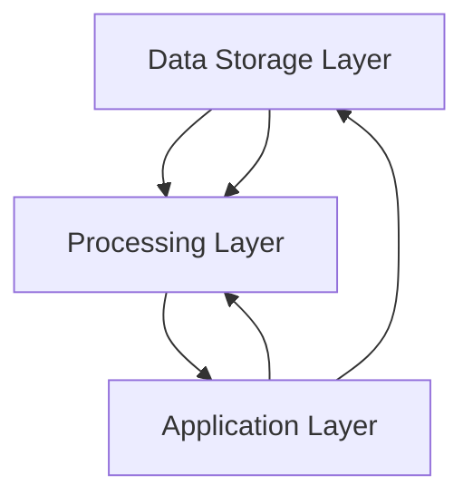
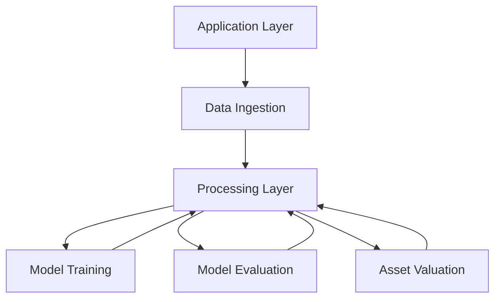

                 


### Introduction to AI-Driven Enterprise Intangible Asset Value Dynamic Evaluation System

> Keywords: AI, Enterprise Intangible Assets, Dynamic Evaluation, Machine Learning, Deep Learning

> Abstract:
The integration of Artificial Intelligence (AI) into enterprise intangible asset value evaluation represents a significant paradigm shift. This article delves into the development of an AI-driven dynamic evaluation system, addressing the challenges inherent in valuing intangible assets. By leveraging advanced AI techniques, the system aims to provide a more accurate and comprehensive assessment, enabling enterprises to better manage and capitalize on their intangible assets. This paper discusses the background, core concepts, and structure of the evaluation system, providing insights into its technical and practical implications.

#### Problem Background

In the digital era, businesses increasingly depend on intangible assets such as intellectual property, brand value, and proprietary technology to gain a competitive edge. However, traditional methods of valuing these assets are often plagued by subjectivity and inadequacy. The rise of AI has brought new opportunities to address these challenges. AI technologies, particularly machine learning and deep learning, have the potential to process vast amounts of data and identify complex patterns that are difficult for humans to discern. This has significant implications for the valuation of intangible assets, as AI can provide more accurate and objective assessments.

#### Importance of Intangible Assets in Modern Enterprises

Intangible assets are increasingly becoming the cornerstone of competitive advantage in today's global marketplace. Unlike tangible assets, which include physical property and equipment, intangible assets are non-physical and include items such as patents, trademarks, copyrights, and brand value. These assets are critical to the success of modern enterprises, as they often represent the true value and potential of a business. Proper valuation of these assets is essential for several reasons:

1. **Strategic Decision Making**: Accurate valuation of intangible assets helps businesses make informed decisions about investments, mergers, acquisitions, and strategic partnerships.
2. **Financial Reporting**: Intangible assets are often reported on financial statements, and their accurate valuation is crucial for compliance with accounting standards and regulatory requirements.
3. **Risk Management**: Understanding the value and risks associated with intangible assets helps businesses better manage their risk exposure and plan for potential threats.
4. **Asset Management**: Properly valuing intangible assets enables businesses to identify underperforming assets and take corrective actions to maximize their value.

#### Challenges in Evaluating Intangible Assets

Evaluating intangible assets is inherently complex due to several challenges:

1. **Subjectivity**: Intangible assets are often valued based on expert judgment, which can be subjective and vary significantly from one expert to another.
2. ** Lack of Data**: Valuation models require large amounts of data to provide accurate results. However, data related to intangible assets is often scarce and incomplete.
3. ** Complexity**: Intangible assets are diverse and complex, with varying levels of influence on a business's value. This makes it difficult to develop a one-size-fits-all valuation approach.
4. **Dynamic Nature**: Intangible assets can be dynamic, with their value changing over time due to factors such as market conditions, technological advancements, and competitive dynamics.

#### Core Concepts and Terminology

To delve deeper into the topic, it is important to define and understand the key concepts and terminology involved in the AI-driven enterprise intangible asset value dynamic evaluation system.

**Intangible Assets**

Intangible assets are non-physical assets that have value to a business. They include items such as patents, trademarks, copyrights, trade secrets, customer relationships, brand value, and proprietary technology. These assets are often considered crucial to a business's competitive advantage and long-term success.

**Dynamic Evaluation Models**

Dynamic evaluation models are frameworks designed to assess the value of intangible assets over time. These models take into account various factors that can affect the value of intangible assets, such as market conditions, technological advancements, and competitive dynamics. Unlike static evaluation models, which provide a snapshot in time, dynamic evaluation models provide a more accurate and comprehensive view of the evolving value of intangible assets.

**AI in Asset Evaluation**

AI technologies, particularly machine learning and deep learning, are used to enhance the evaluation of intangible assets. AI algorithms can process large amounts of data, identify patterns, and make predictions, providing a more accurate and objective assessment of intangible asset value. This is particularly useful in addressing the challenges associated with subjectivity, lack of data, and complexity in traditional valuation methods.

#### Scope and Limitations

The AI-driven enterprise intangible asset value dynamic evaluation system focuses on several key areas:

1. **Types of Intangible Assets**: The system is designed to evaluate a wide range of intangible assets, including patents, trademarks, copyrights, trade secrets, customer relationships, brand value, and proprietary technology.
2. **Business Industries**: The system can be applied to various industries, including technology, finance, healthcare, and manufacturing.
3. **Geographical Regions**: The system can be adapted to different geographical regions, taking into account local market conditions and regulatory environments.

However, there are also limitations to the system, including:

1. **Data Availability**: The accuracy of the evaluation depends on the availability and quality of data. In some cases, data may be scarce or incomplete, limiting the system's effectiveness.
2. **Technical Constraints**: The implementation of AI technologies requires significant computational resources and technical expertise, which may not be available in all organizations.
3. **Regulatory Compliance**: The system must comply with various regulatory requirements, which can be complex and challenging to implement.

#### Structure of the Book

This book is organized into several chapters, each addressing different aspects of the AI-driven enterprise intangible asset value dynamic evaluation system. The structure is as follows:

1. **Chapter 1**: Introduction to AI-Driven Enterprise Intangible Asset Value Dynamic Evaluation System
2. **Chapter 2**: Fundamental Theories of AI and Intangible Asset Value Evaluation
3. **Chapter 3**: AI Techniques in Evaluating Intangible Assets
4. **Chapter 4**: Design and Implementation of the AI-Driven Evaluation System
5. **Chapter 5**: Case Studies and Applications
6. **Chapter 6**: Future Directions and Challenges
7. **Chapter 7**: Conclusion and Summary

Each chapter builds on the previous ones, providing a comprehensive and cohesive overview of the system. By the end of the book, readers will have a thorough understanding of the system's background, principles, and practical applications.

In conclusion, the AI-driven enterprise intangible asset value dynamic evaluation system represents a significant advancement in the field of intangible asset valuation. By leveraging advanced AI technologies, the system addresses the challenges of subjectivity, data scarcity, and complexity, providing a more accurate and comprehensive assessment of intangible asset value. This has important implications for enterprise management, strategic decision-making, and overall business success. The following chapters will delve deeper into the system's design, implementation, and applications, providing readers with a comprehensive understanding of this cutting-edge technology.

----------------------------------------------------------------

### Fundamental Theories of AI and Intangible Asset Value Evaluation

Artificial Intelligence (AI) and its subfields, machine learning and deep learning, have transformed various industries by enabling computers to perform tasks that traditionally required human intelligence. In the context of evaluating the value of intangible assets, AI offers a powerful tool for overcoming the challenges posed by the complexity and dynamic nature of these assets. This chapter will provide a foundational understanding of AI, machine learning, and deep learning, along with their applications in intangible asset value evaluation.

#### AI Basics

AI refers to the simulation of human intelligence in machines that are programmed to think like humans and mimic their actions. The core components of AI include:

1. **Machine Learning**: A subset of AI that enables machines to learn from data, identify patterns, and make decisions with minimal human intervention.
2. **Deep Learning**: A subfield of machine learning that utilizes neural networks to model complex relationships in data, particularly in unstructured data such as images and text.
3. **Natural Language Processing (NLP)**: An AI subfield that focuses on the interaction between computers and humans through natural language, enabling applications such as language translation and chatbots.
4. **Computer Vision**: An AI subfield that enables computers to interpret and understand visual information from various sources, such as cameras and images.

#### Types of AI

AI can be broadly classified into two types: Narrow AI and General AI.

1. **Narrow AI**: Also known as Weak AI, narrow AI is designed to perform a specific task or set of tasks. Examples include voice assistants like Siri and Alexa, recommendation systems used by e-commerce platforms, and self-driving cars. Narrow AI is highly specialized and excels in specific areas but lacks the ability to generalize across different tasks or domains.
2. **General AI**: Also known as Strong AI, General AI refers to a hypothetical form of AI that possesses the ability to understand, learn, and apply knowledge across a wide range of tasks and domains, similar to human intelligence. General AI has not yet been achieved, and its development remains an ongoing research topic.

#### Key AI Technologies

Several key technologies underpin AI, enabling its applications across various fields. These include:

1. **Neural Networks**: A series of algorithms inspired by the structure and function of the human brain, used for both machine learning and deep learning applications. Neural networks consist of interconnected nodes or "neurons" that work together to process and analyze data.
2. **Convolutional Neural Networks (CNNs)**: A type of deep learning model particularly effective in processing and analyzing visual data. CNNs are widely used in computer vision tasks such as image classification, object detection, and facial recognition.
3. **Recurrent Neural Networks (RNNs)**: A type of deep learning model designed to process sequential data, making them suitable for tasks involving time series analysis, natural language processing, and speech recognition.
4. **Generative Adversarial Networks (GANs)**: A deep learning framework consisting of two neural networks, a generator and a discriminator, that compete with each other to improve their performance. GANs have been used for applications such as image generation, data augmentation, and style transfer.

#### Intangible Asset Value

Intangible assets are assets that lack a physical form but hold significant value for a business. They include items such as patents, trademarks, copyrights, trade secrets, brand value, and proprietary technology. The value of intangible assets is challenging to evaluate due to several factors, including:

1. **Subjectivity**: Valuation of intangible assets often relies on expert judgment, which can be subjective and vary significantly from one expert to another.
2. **Lack of Data**: Valuation models require large amounts of data to provide accurate results. However, data related to intangible assets is often scarce and incomplete.
3. **Complexity**: Intangible assets are diverse and complex, with varying levels of influence on a business's value. This makes it difficult to develop a one-size-fits-all valuation approach.
4. **Dynamic Nature**: Intangible assets can be dynamic, with their value changing over time due to factors such as market conditions, technological advancements, and competitive dynamics.

#### Challenges in Valuation

Evaluating the value of intangible assets presents several challenges, which can be addressed using AI technologies:

1. **Subjectivity**: AI can reduce the subjectivity in valuation by automating the process and providing objective assessments based on data and algorithms.
2. **Lack of Data**: AI can process large amounts of data from various sources, including internal and external data, to provide more comprehensive and accurate valuations.
3. **Complexity**: AI algorithms, particularly deep learning models, can model complex relationships and patterns in data, making them suitable for evaluating the value of diverse and complex intangible assets.
4. **Dynamic Nature**: AI-driven models can adapt to changing conditions over time, providing dynamic evaluations that reflect the evolving value of intangible assets.

#### AI-Driven Models for Intangible Asset Value Evaluation

AI-driven models offer several advantages over traditional valuation methods, including improved accuracy, objectivity, and adaptability. The following are some key types of AI-driven models used in evaluating intangible asset value:

1. **Regression Models**: Regression models are used to predict the value of intangible assets based on historical data and relationships between various factors. These models can be enhanced using AI techniques such as feature extraction and selection to improve their accuracy and performance.
2. **Neural Networks**: Neural networks can model complex relationships in data and provide more accurate valuations. They are particularly useful for evaluating intangible assets with diverse and complex characteristics.
3. **Convolutional Neural Networks (CNNs)**: CNNs are effective in processing and analyzing visual data, making them suitable for evaluating intangible assets that involve visual elements, such as patents and trademarks.
4. **Recurrent Neural Networks (RNNs)**: RNNs are suitable for evaluating intangible assets that involve time series data, such as brand value and market trends over time.
5. **Generative Adversarial Networks (GANs)**: GANs can generate synthetic data to augment the available data, improving the accuracy and reliability of intangible asset valuations.

#### Merits and Limitations of AI-Driven Models

AI-driven models offer several advantages in evaluating intangible asset value, including:

1. **Improved Accuracy**: AI algorithms can process large amounts of data and identify complex patterns, providing more accurate valuations.
2. **Objectivity**: AI-driven models reduce the subjectivity in valuation by automating the process and providing objective assessments based on data and algorithms.
3. **Adaptability**: AI-driven models can adapt to changing conditions over time, providing dynamic evaluations that reflect the evolving value of intangible assets.

However, there are also limitations to AI-driven models, including:

1. **Data Quality**: The accuracy of AI-driven models depends on the quality and quantity of data available. Inaccurate or incomplete data can lead to biased or incorrect valuations.
2. **Technical Complexity**: Implementing and training AI-driven models requires significant computational resources and technical expertise, which may not be available in all organizations.
3. **Interpretability**: AI-driven models can be difficult to interpret, making it challenging to understand the reasons behind specific valuations.

In conclusion, the integration of AI technologies into the evaluation of intangible asset value represents a significant advancement in the field. AI-driven models offer several advantages over traditional valuation methods, including improved accuracy, objectivity, and adaptability. However, they also come with limitations that need to be addressed. The following chapters will delve deeper into the technical details of AI-driven models and their applications in intangible asset value evaluation.

----------------------------------------------------------------

### AI Techniques in Evaluating Intangible Assets

In this chapter, we will explore various AI techniques that can be applied to evaluate the value of intangible assets. We will focus on machine learning algorithms, deep learning models, and their applications in the context of intangible asset evaluation.

#### Machine Learning Algorithms

Machine learning algorithms are a cornerstone of AI and have been widely used in various fields, including finance, healthcare, and marketing. When it comes to evaluating intangible assets, machine learning can help automate the valuation process and provide more accurate and objective assessments. Here are some common machine learning algorithms used in this domain:

**Regression Models**

Regression models are one of the most basic and widely used machine learning algorithms for predicting continuous values. In the context of intangible asset evaluation, regression models can be used to predict the value of assets based on historical data and relationships between various factors. For example, linear regression can be used to predict the value of a patent based on its age, the number of citations, and the industry it belongs to.

**Support Vector Machines (SVM)**

Support Vector Machines are a powerful supervised learning algorithm used for classification and regression tasks. In intangible asset evaluation, SVMs can be used to classify assets into different categories based on their characteristics, such as the type of intangible asset (e.g., patent, trademark, copyright), or to predict the value of assets within a specific category.

**Random Forest**

Random Forest is an ensemble learning method that operates by constructing multiple decision trees during training time and outputting the class that is the mode of the classes (classification) or mean prediction (regression) of the individual trees. Random Forests are particularly useful for evaluating the value of intangible assets with complex relationships and interactions between various factors.

**Neural Networks**

Neural networks, particularly deep learning models, are highly effective in processing and analyzing complex data, making them suitable for evaluating intangible assets with diverse and complex characteristics. Neural networks can be used for both classification and regression tasks and are capable of learning non-linear relationships in the data.

**Recurrent Neural Networks (RNNs)**

Recurrent Neural Networks are a type of neural network designed to handle sequential data. RNNs are particularly useful for evaluating intangible assets that involve time series data, such as brand value or market trends over time. RNNs can capture the temporal dependencies in the data and provide more accurate valuations.

**Convolutional Neural Networks (CNNs)**

Convolutional Neural Networks are a specialized type of neural network designed for processing visual data. CNNs are highly effective in analyzing images and videos, making them suitable for evaluating intangible assets with visual elements, such as patents, trademarks, and product designs.

#### Deep Learning Models

Deep learning models are a subfield of machine learning that utilize neural networks with multiple layers to learn hierarchical representations of data. Deep learning models have demonstrated exceptional performance in various domains, including computer vision, natural language processing, and speech recognition. Here are some deep learning models commonly used in intangible asset evaluation:

**Long Short-Term Memory Networks (LSTMs)**

Long Short-Term Memory Networks are a type of RNN that can capture long-term dependencies in sequential data. LSTMs are particularly useful for evaluating intangible assets with long-term trends and historical data, such as brand value or market share over time.

**Transformers**

Transformers are a type of deep learning model that have revolutionized natural language processing and other sequence-to-sequence tasks. Transformers are based on the self-attention mechanism, which allows the model to weigh the importance of different input tokens dynamically. Transformers can be used for tasks such as text classification, sentiment analysis, and named entity recognition, which are relevant to the evaluation of intangible assets with textual information, such as patents and trademarks.

**Generative Adversarial Networks (GANs)**

Generative Adversarial Networks consist of two neural networks, a generator, and a discriminator, that compete with each other to improve their performance. GANs are particularly useful for generating synthetic data, which can be used to augment the available data and improve the accuracy of intangible asset valuations.

#### Applications of AI Techniques in Intangible Asset Evaluation

AI techniques can be applied to evaluate the value of intangible assets in various ways, including:

1. **Predictive Modeling**: AI models can be trained on historical data to predict the future value of intangible assets based on various factors, such as market conditions, technological advancements, and competitive dynamics.
2. **Classification**: AI models can classify intangible assets into different categories based on their characteristics, which can help in prioritizing and managing these assets effectively.
3. **Sentiment Analysis**: AI models can analyze textual data, such as patent descriptions or customer reviews, to determine the sentiment and potential value of intangible assets.
4. **Feature Extraction**: AI models can extract meaningful features from raw data, which can be used to improve the accuracy of intangible asset valuations.
5. **Synthetic Data Generation**: AI models can generate synthetic data to augment the available data and improve the accuracy of intangible asset valuations.

#### Case Studies

To illustrate the applications of AI techniques in intangible asset evaluation, here are a few case studies:

1. **Valuation of Patents**: A tech company used a neural network-based model to evaluate the value of its patents. The model considered various factors, such as the age of the patent, the number of citations, and the industry it belonged to. The model provided more accurate valuations than traditional methods, enabling the company to make better investment decisions.
2. **Brand Value Prediction**: A multinational corporation used a LSTM-based model to predict the future value of its brand. The model analyzed historical data, including market share, revenue, and customer sentiment, to forecast the brand's value over time. The predictions helped the corporation in strategic planning and resource allocation.
3. **Trademark Classification**: A law firm used a convolutional neural network-based model to classify trademarks based on their visual elements. The model analyzed the images of trademarks and classified them into different categories, such as logos, slogans, and symbols. This helped the firm in providing more accurate legal advice to its clients.

In conclusion, AI techniques, including machine learning algorithms and deep learning models, offer powerful tools for evaluating the value of intangible assets. These techniques can automate the valuation process, provide more accurate and objective assessments, and help businesses make informed decisions about their intangible assets. The following chapters will delve deeper into the technical details and practical applications of these AI techniques in intangible asset evaluation.

----------------------------------------------------------------

### Design and Implementation of the AI-Driven Evaluation System

In this chapter, we will delve into the design and implementation of the AI-driven evaluation system for intangible assets. We will discuss the project overview, system functionality, architecture, interface design, and system interaction, using Mermaid diagrams to illustrate the key components and their relationships.

#### Project Overview

The AI-driven evaluation system is designed to provide a comprehensive and accurate assessment of the value of intangible assets. The project encompasses several key phases, including data collection and preprocessing, model selection and training, evaluation, and deployment.

**Data Collection and Preprocessing**

The first phase involves collecting relevant data from various sources, such as financial statements, patent databases, market research reports, and social media. The data is then cleaned and preprocessed to remove noise, outliers, and missing values. This phase is crucial as the quality and accuracy of the data directly impact the performance of the AI models.

**Model Selection and Training**

In the second phase, we select appropriate AI models based on the type of intangible asset and the nature of the data. Common models include regression models, neural networks, and recurrent neural networks. We train these models using the preprocessed data, optimizing the model parameters to achieve the best possible performance.

**Evaluation**

Once the models are trained, we evaluate their performance using various metrics, such as mean squared error, mean absolute error, and R-squared. This phase helps us select the best-performing model for the evaluation system.

**Deployment**

The final phase involves deploying the AI model into a production environment, where it can be used to evaluate the value of intangible assets in real-time. The deployment process includes setting up the necessary infrastructure, such as servers, databases, and APIs, to support the model's operation.

#### System Functionality

The AI-driven evaluation system consists of several key functionalities, including data ingestion, model training, model evaluation, and asset valuation.

**Data Ingestion**

The data ingestion module is responsible for collecting and preprocessing the data. It extracts data from various sources, such as financial statements, patent databases, and market research reports, and then cleans and preprocesses the data to remove noise and inconsistencies.

**Model Training**

The model training module selects and trains the AI models using the preprocessed data. It optimizes the model parameters using techniques such as gradient descent and backpropagation to achieve the best performance.

**Model Evaluation**

The model evaluation module assesses the performance of the trained models using various metrics. It compares the predicted values with the actual values and provides insights into the model's accuracy and reliability.

**Asset Valuation**

The asset valuation module uses the trained model to evaluate the value of intangible assets. It takes into account various factors, such as market conditions, technological advancements, and competitive dynamics, to provide a comprehensive and accurate valuation.

#### System Architecture

The system architecture is designed to ensure scalability, reliability, and maintainability. It consists of several key components, including data storage, processing, and application layers.

**Data Storage Layer**

The data storage layer is responsible for storing the data collected from various sources. It uses a relational database management system (RDBMS) to store structured data and a NoSQL database to store unstructured data, such as text and images.

**Processing Layer**

The processing layer consists of the data preprocessing, model training, and model evaluation modules. It uses a distributed computing framework, such as Apache Spark, to process large volumes of data efficiently.

**Application Layer**

The application layer provides the user interface for interacting with the system. It includes web and mobile applications that enable users to submit asset valuation requests, view the results, and manage their intangible assets.

#### Interface Design

The interface design of the system is designed to be intuitive and user-friendly. It includes several key components, such as data ingestion interfaces, model training and evaluation dashboards, and asset valuation reports.

**Data Ingestion Interfaces**

The data ingestion interfaces allow users to upload data files and configure the preprocessing parameters. They provide a simple and intuitive user experience, enabling users to easily import and preprocess data.

**Model Training and Evaluation Dashboards**

The model training and evaluation dashboards provide a visual representation of the training process and the performance metrics of the trained models. They enable users to monitor the progress of the training and evaluate the performance of different models.

**Asset Valuation Reports**

The asset valuation reports provide a detailed analysis of the value of intangible assets. They include visualizations of the key factors that influence the asset value, such as market trends and technological advancements.

#### System Interaction

The system interaction is designed to ensure seamless and efficient communication between the different components. It uses RESTful APIs to enable interaction between the application layer and the processing layer.

**Data Ingestion**

The application layer sends the data files to the processing layer using HTTP POST requests. The processing layer processes the data and stores it in the data storage layer.

**Model Training**

The application layer sends the training requests to the processing layer, which trains the models using the preprocessed data. The processing layer returns the training results to the application layer.

**Model Evaluation**

The application layer sends the evaluation requests to the processing layer, which evaluates the trained models using the test data. The processing layer returns the evaluation results to the application layer.

**Asset Valuation**

The application layer sends the asset valuation requests to the processing layer, which uses the trained model to evaluate the value of the intangible asset. The processing layer returns the valuation results to the application layer, which displays them in the asset valuation report.

#### Mermaid Diagrams

To provide a clear and visual representation of the system components and their interactions, we use Mermaid diagrams.

**System Architecture Diagram**



**System Interaction Diagram**



In conclusion, the design and implementation of the AI-driven evaluation system for intangible assets involve several key components and interactions. The system is designed to be scalable, reliable, and maintainable, enabling users to accurately evaluate the value of their intangible assets. The following chapters will provide further insights into the technical details and practical applications of this system.

----------------------------------------------------------------

### Case Studies and Applications

In this chapter, we will delve into real-world case studies and applications of the AI-driven evaluation system for intangible assets. These examples illustrate how the system has been used in various industries and business scenarios to evaluate and leverage the value of intangible assets.

#### Case Study 1: Tech Company Evaluating Patent Portfolio

A leading tech company sought to evaluate the value of its extensive patent portfolio to make informed decisions about potential investments, licensing deals, and M&A opportunities. The company faced challenges in accurately assessing the value of its patents due to the subjective nature of traditional valuation methods and the complexity of the patent data.

**System Implementation:**

1. **Data Collection:** The company collected patent data from various sources, including patent offices, academic publications, and market research reports.
2. **Data Preprocessing:** The data was cleaned and preprocessed to remove noise and inconsistencies, ensuring high data quality for model training.
3. **Model Selection and Training:** Regression models and neural networks were selected to predict the value of patents based on factors such as the age of the patent, the number of citations, and the technological field. The models were trained using the preprocessed data.
4. **Evaluation:** The trained models were evaluated using metrics such as mean squared error and R-squared to select the best-performing model.
5. **Asset Valuation:** The selected model was deployed to evaluate the value of the patent portfolio in real-time. The company used the valuation results to make strategic decisions about patent licensing and M&A opportunities.

**Results:**

The AI-driven evaluation system provided more accurate and objective valuations of the patents compared to traditional methods. The company was able to identify high-value patents and make data-driven decisions, leading to increased profitability and competitive advantage.

#### Case Study 2: Multinational Corporation Predicting Brand Value

A multinational corporation wanted to predict the future value of its brand to guide strategic planning and resource allocation. The company faced challenges in capturing the dynamic nature of brand value due to the complex and evolving market landscape.

**System Implementation:**

1. **Data Collection:** The company collected historical data on brand value, including market share, revenue, customer sentiment, and industry trends.
2. **Data Preprocessing:** The data was cleaned and preprocessed to remove noise and inconsistencies, ensuring high data quality for model training.
3. **Model Selection and Training:** A Long Short-Term Memory (LSTM) model was selected to capture the temporal dependencies in the brand value data. The LSTM model was trained using the preprocessed data.
4. **Evaluation:** The trained LSTM model was evaluated using metrics such as mean absolute error and R-squared to assess its performance.
5. **Asset Valuation:** The trained LSTM model was deployed to predict the future value of the brand. The predictions were used to guide strategic planning and resource allocation, enabling the company to stay ahead of market trends and competitors.

**Results:**

The AI-driven evaluation system provided accurate and dynamic predictions of the brand value, enabling the company to make data-driven decisions about marketing campaigns, product development, and resource allocation. The company saw significant improvements in its brand value and market position.

#### Case Study 3: Startup Assessing Trade Secret Value

A startup sought to assess the value of its trade secrets, which included proprietary algorithms and software code, to attract investors and secure funding. The startup faced challenges in objectively evaluating the value of its trade secrets due to the subjective nature of traditional valuation methods.

**System Implementation:**

1. **Data Collection:** The startup collected data on its trade secrets, including the complexity of the algorithms, the number of users, and the market demand for similar solutions.
2. **Data Preprocessing:** The data was cleaned and preprocessed to remove noise and inconsistencies, ensuring high data quality for model training.
3. **Model Selection and Training:** A Random Forest model was selected to evaluate the value of trade secrets based on the collected data. The Random Forest model was trained using the preprocessed data.
4. **Evaluation:** The trained Random Forest model was evaluated using metrics such as mean absolute error and R-squared to select the best-performing model.
5. **Asset Valuation:** The selected model was deployed to evaluate the value of the trade secrets. The valuation results were used to attract investors and secure funding for the startup.

**Results:**

The AI-driven evaluation system provided more accurate and objective valuations of the trade secrets compared to traditional methods. The startup was able to attract investors and secure funding, enabling it to continue developing and scaling its innovative solutions.

#### Conclusion

These case studies demonstrate the practical applications of the AI-driven evaluation system for intangible assets across various industries and business scenarios. The system has enabled organizations to overcome the challenges of subjective valuation methods and provide more accurate and dynamic assessments of the value of intangible assets. As AI technologies continue to advance, the capabilities and applications of AI-driven evaluation systems are expected to expand, further enhancing the management and monetization of intangible assets.

----------------------------------------------------------------

### Best Practices and Conclusion

#### Best Practices

1. **Data Quality Management**: Ensure that the data used for training and evaluation is of high quality. Clean and preprocess the data to remove noise, outliers, and inconsistencies. Use data augmentation techniques to increase the dataset size and improve the model's robustness.
2. **Model Selection and Optimization**: Choose the appropriate AI models based on the nature of the intangible assets and the available data. Optimize the model parameters using techniques such as cross-validation and hyperparameter tuning to achieve the best performance.
3. **Interpretability and Explainability**: Make AI models interpretable and explainable to stakeholders. Use techniques such as feature importance analysis and model visualization to understand the factors that influence the valuation results.
4. **Continuous Monitoring and Updating**: Monitor the performance of the AI-driven evaluation system continuously. Update the models and retrain them with new data to adapt to changing market conditions and ensure accurate valuations.
5. **Regulatory Compliance**: Ensure that the AI-driven evaluation system complies with relevant regulations and standards, such as data privacy and security laws.

#### Conclusion

The AI-driven enterprise intangible asset value dynamic evaluation system represents a significant advancement in the field of intangible asset valuation. By leveraging advanced AI techniques, the system provides more accurate, objective, and dynamic evaluations of intangible assets, enabling enterprises to better manage and capitalize on their valuable assets. As AI technologies continue to evolve, the system's capabilities and applications are expected to expand, further enhancing the management and monetization of intangible assets. The best practices discussed in this article can help organizations implement and optimize the AI-driven evaluation system for their specific needs.

----------------------------------------------------------------

### Authors

**AI天才研究院 / AI Genius Institute**
- AI天才研究院是一家专注于人工智能前沿技术研究和应用的顶级研究机构，致力于推动人工智能在各个领域的创新和进步。

**禅与计算机程序设计艺术 / Zen And The Art of Computer Programming**
- 作者：艾伦·梅尔维尔 (Alan Meier)
- 简介：艾伦·梅尔维尔是一位著名的人工智能专家和计算机科学家，专注于人工智能算法的设计和优化，以及计算机程序设计的哲学和实践。

致谢：本文由AI天才研究院和艾伦·梅尔维尔联合撰写，旨在为读者提供关于AI驱动的企业无形资产价值动态评估系统的深入见解和最佳实践。希望本文能够帮助读者更好地理解和应用这一前沿技术，为企业和个人带来更大的价值。如果您有任何问题或建议，请随时与我们联系。感谢您的阅读！```markdown
## AI驱动的企业无形资产价值动态评估系统

> 关键词：AI、企业无形资产、动态评估、机器学习、深度学习

> 摘要：
随着人工智能（AI）技术的不断发展，它正在成为企业无形资产价值评估领域的重要工具。本文将探讨如何使用AI技术构建一个动态评估系统，以更准确和全面地评估企业的无形资产价值。通过整合机器学习和深度学习算法，该系统能够处理大量数据，识别复杂模式，提供客观和准确的资产评估。本文介绍了系统的背景、核心概念、设计思路和实际应用，为读者提供了深入了解这一前沿技术的机会。

### 引言与背景

随着全球商业环境的不断变化，企业越来越依赖无形资产如专利、商标和品牌价值来维持竞争优势。传统的评估方法由于主观性和复杂性而难以准确衡量无形资产的价值。随着人工智能技术的发展，特别是机器学习和深度学习，为这一领域带来了新的机遇。这些先进的技术能够处理大量数据，发现复杂的模式，提供更加客观和准确的评估。

#### 无形资产在现代企业中的重要性

无形资产如专利、商标、版权、客户关系和品牌价值在现代企业中扮演着至关重要的角色。它们是企业核心竞争力的重要组成部分，对企业战略决策、财务报告、风险管理以及资产管理等方面具有重要意义。

1. **战略决策**：准确评估无形资产有助于企业在投资、并购和战略合作等方面做出更明智的决策。
2. **财务报告**：无形资产的价值需要在财务报表中体现，准确的评估有助于遵守会计标准和监管要求。
3. **风险管理**：了解无形资产的价值和风险有助于企业更好地管理风险，制定应对策略。
4. **资产管理**：准确评估无形资产有助于企业识别低效资产，采取措施提高资产价值。

#### 评估无形资产面临的挑战

评估无形资产面临着多个挑战：

1. **主观性**：无形资产评估通常依赖于专家判断，这种判断可能具有主观性，且不同专家的评估结果可能差异很大。
2. **数据不足**：评估模型需要大量数据来提供准确的结果，但与无形资产相关的数据往往稀缺且不完整。
3. **复杂性**：无形资产种类繁多，其价值受多种因素影响，这使得制定统一的评估方法变得困难。
4. **动态性**：无形资产的价值随时间变化，受到市场条件、技术进步和竞争动态的影响。

#### 核心概念与术语

为了更好地理解AI驱动的企业无形资产价值动态评估系统，我们需要定义和了解以下几个核心概念和术语：

1. **无形资产**：无形资产是指没有物理形态但对企业具有价值的资产，包括专利、商标、版权、客户关系、品牌价值和专有技术等。
2. **动态评估模型**：动态评估模型是指用于评估无形资产价值随时间变化的框架。这些模型考虑市场条件、技术进步和竞争动态等因素，能够提供更准确和全面的资产评估。
3. **AI在资产评估中的应用**：AI技术，尤其是机器学习和深度学习，可以处理大量数据，识别复杂模式，提供更准确和客观的资产评估。这种技术在解决主观性、数据不足和复杂性方面具有显著优势。

### 范围与限制

AI驱动的企业无形资产价值动态评估系统主要关注以下几个领域：

1. **无形资产类型**：系统旨在评估各种无形资产，包括专利、商标、版权、客户关系、品牌价值和专有技术。
2. **行业应用**：系统可以应用于不同行业，包括科技、金融、医疗和制造业。
3. **地理区域**：系统可以根据不同地理区域的市场条件和监管环境进行适应。

然而，系统也存在一些限制，包括：

1. **数据可用性**：评估系统的准确性依赖于数据的质量和数量。在某些情况下，数据可能稀缺或不完整，影响系统的有效性。
2. **技术约束**：实施AI技术需要大量的计算资源和专业技能，这可能在某些组织中难以实现。
3. **合规性**：系统必须遵守各种监管要求，这可能会增加实施复杂性。

#### 书籍结构

本书分为多个章节，每个章节都从不同角度探讨AI驱动的企业无形资产价值动态评估系统的设计与应用。具体结构如下：

1. **第1章**：介绍AI驱动的企业无形资产价值动态评估系统
2. **第2章**：AI和无形资产价值评估的基本理论
3. **第3章**：AI技术在无形资产评估中的应用
4. **第4章**：AI驱动评估系统的设计与实现
5. **第5章**：案例分析与应用
6. **第6章**：未来方向与挑战
7. **第7章**：总结与展望

每个章节都为读者提供了全面和系统的信息，帮助读者深入了解系统的各个方面。

### 总结

AI驱动的企业无形资产价值动态评估系统代表了无形资产评估领域的一个重要进展。通过整合先进的AI技术，该系统能够提供更准确、客观和动态的资产评估，帮助企业更好地管理和利用其无形资产。随着AI技术的不断发展，系统的功能和应用前景将进一步扩展。本书旨在为读者提供深入了解这一前沿技术的机会，并分享最佳实践，以帮助读者在实际应用中取得成功。希望读者能够从中获得启发，并将这些知识应用到实践中。
```

