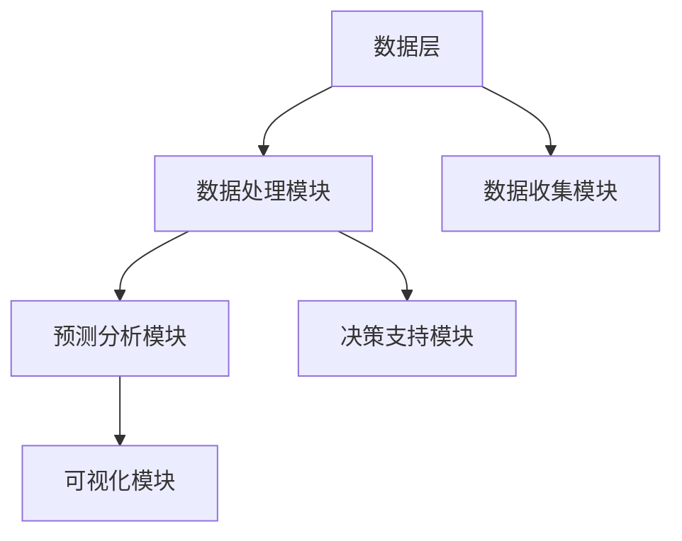
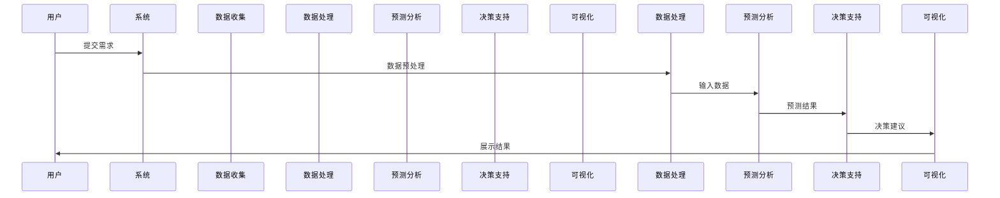

                 

# AI驱动的企业现金流周期优化系统

## 关键词

人工智能，企业现金流，周期优化，算法应用，系统架构，项目实战

## 摘要

本文深入探讨了AI在企业现金流周期优化中的应用。首先，我们介绍了AI和企业现金流周期优化的背景，包括问题的提出、核心概念和其关联。接着，我们详细阐述了AI算法在企业现金流周期优化中的应用，包括算法原理、数学模型和具体实现。然后，我们介绍了系统分析与架构设计方案，包括问题场景介绍、系统功能设计、系统架构设计、系统接口设计和系统交互。接下来，通过实际项目实战，我们展示了AI驱动的企业现金流周期优化系统的实现和应用。最后，我们总结了最佳实践和注意事项，并给出了拓展阅读的建议。

---

### 目录

#### 第一部分：背景介绍

- **第1章：AI与企业现金流周期优化背景**
  - 1.1 问题背景
  - 1.2 企业现金流周期优化的重要性
  - 1.3 AI技术发展的现状与趋势

#### 第二部分：核心概念与联系

- **第2章：AI与企业现金流周期优化核心概念**
  - 2.1 AI基础概念
  - 2.2 企业现金流周期优化概念
  - 2.3 AI与企业现金流周期优化的联系与区别

#### 第三部分：算法原理讲解

- **第3章：AI算法在企业现金流周期优化中的应用**
  - 3.1 算法原理概述
  - 3.2 数学模型与公式
  - 3.3 算法流程图与Python代码实现
  - 3.4 举例说明

#### 第四部分：系统分析与架构设计方案

- **第4章：系统分析与架构设计基础**
  - 4.1 问题场景介绍
  - 4.2 系统功能设计
  - 4.3 系统架构设计
  - 4.4 系统接口设计

- **第5章：系统交互与实施**
  - 5.1 系统交互设计
  - 5.2 实施流程与步骤
  - 5.3 交互流程图与Mermaid表示

#### 第五部分：项目实战

- **第6章：AI驱动的企业现金流周期优化系统实现**
  - 6.1 环境安装与配置
  - 6.2 系统核心实现源代码
  - 6.3 代码应用解读与分析
  - 6.4 实际案例分析与讲解

#### 第六部分：最佳实践与总结

- **第7章：最佳实践与项目小结**
  - 7.1 最佳实践建议
  - 7.2 小结与展望
  - 7.3 注意事项
  - 7.4 拓展阅读

### 第一部分：背景介绍

#### 1.1 问题背景

在当今的商业环境中，现金流是企业运营的“血液”。然而，许多企业在管理现金流方面面临着诸多挑战，如现金流预测不准确、现金流管理效率低下、资金周转周期过长等。这些问题不仅会影响企业的运营效率，还可能导致财务危机。传统的现金流管理方法主要依赖于人工分析和历史数据，难以应对复杂多变的商业环境。

随着人工智能（AI）技术的迅速发展，利用AI技术优化企业现金流周期成为了一个潜在的新方向。AI技术，尤其是机器学习和深度学习，具有强大的数据处理和分析能力，可以为企业提供更加精确的现金流预测和更有效的现金流管理策略。

#### 1.2 企业现金流周期优化的重要性

企业现金流周期优化的重要性体现在以下几个方面：

1. **提升资金利用效率**：通过精确的现金流预测，企业可以更有效地调配资金，减少闲置资金，提高资金利用率。
2. **减少财务风险**：优化的现金流管理可以降低企业面临财务风险的可能性，确保企业有足够的资金应对突发事件。
3. **增强企业竞争力**：高效的现金流管理有助于企业提高运营效率，降低成本，从而增强在市场中的竞争力。
4. **优化决策支持**：AI技术可以提供实时、准确的现金流数据，帮助企业管理层做出更加明智的决策。

#### 1.3 AI技术发展的现状与趋势

近年来，AI技术在各个领域都取得了显著的发展，特别是在图像识别、自然语言处理和预测分析等方面。随着计算能力的提升和大数据技术的普及，AI技术已经逐渐从实验室走向实际应用。

在现金流管理领域，AI技术已经开始展现出其强大的潜力。例如，通过机器学习算法，可以分析历史现金流数据，预测未来的现金流变化趋势；通过自然语言处理技术，可以自动识别和分类企业的财务报表，提高数据处理效率。

未来，随着AI技术的进一步发展，我们可以期待更加智能化、自动化的现金流管理系统的出现，为企业提供更加高效、精准的现金流管理服务。

---

### 第二部分：核心概念与联系

#### 2.1 AI基础概念

人工智能（Artificial Intelligence，简称AI）是指通过计算机程序和算法模拟人类智能的一种技术。AI的核心目标是实现机器在感知、学习、推理和决策等方面达到或超越人类水平。AI技术主要包括以下几个子领域：

1. **机器学习**：通过数据驱动的方式，从数据中学习模式和规律，以实现特定任务的自动化。
2. **深度学习**：一种特殊的机器学习方法，通过多层神经网络模型，对复杂数据进行自动特征提取和学习。
3. **自然语言处理**：使计算机能够理解和处理人类自然语言的技术，包括文本分析、语音识别和机器翻译等。
4. **计算机视觉**：使计算机能够通过摄像头和传感器获取并解析图像和视频信息。

#### 2.2 企业现金流周期优化概念

企业现金流周期优化是指通过一系列策略和方法，提高企业现金流的预测准确性、管理效率和资金利用率。现金流周期优化主要包括以下几个环节：

1. **现金流预测**：通过历史数据分析和预测模型，预测企业未来的现金流情况。
2. **现金流管理**：根据现金流预测结果，制定合理的资金调配和存储策略，确保企业有足够的现金流应对运营需求。
3. **资金周转**：通过优化应收账款、应付账款和库存管理等，缩短资金周转周期，提高资金利用效率。

#### 2.3 AI与企业现金流周期优化的联系与区别

AI与企业现金流周期优化之间的联系主要体现在以下几个方面：

1. **数据驱动**：AI技术基于大量历史数据进行分析和预测，为企业提供更加精确的现金流数据支持。
2. **自动化**：AI技术可以自动处理大量数据，提高现金流管理的效率和准确性。
3. **实时性**：AI技术可以实时更新和调整现金流预测和管理策略，帮助企业及时应对市场变化。

AI与企业现金流周期优化的区别主要在于：

1. **技术层面**：AI是一种技术手段，用于支持现金流周期优化；而现金流周期优化是一种管理策略，旨在提高企业现金流管理的效率和效果。
2. **应用范围**：AI技术可以应用于现金流预测、资金调配和风险控制等多个环节，而现金流周期优化主要关注现金流管理的整体策略。
3. **目标导向**：AI技术的目标是提高现金流管理的效率和准确性，而现金流周期优化的目标是实现企业整体运营效率的提升。

通过AI技术的应用，企业可以更加精准地预测和优化现金流，从而实现企业价值的最大化。接下来，我们将深入探讨AI算法在企业现金流周期优化中的应用。

---

### 第三部分：算法原理讲解

#### 3.1 算法原理概述

在AI驱动的企业现金流周期优化中，常用的算法主要包括机器学习和深度学习算法。这些算法通过分析历史现金流数据，预测未来现金流变化趋势，为企业提供决策支持。

机器学习算法，如线性回归、决策树和随机森林等，可以通过历史数据拟合现金流变化模型，从而预测未来现金流。深度学习算法，如卷积神经网络（CNN）和循环神经网络（RNN）等，则可以自动提取数据特征，实现更复杂的现金流预测模型。

#### 3.2 数学模型与公式

为了更好地理解算法原理，我们首先介绍线性回归模型。线性回归是一种简单但有效的机器学习算法，用于预测连续值输出。其基本数学模型为：

$$y = \beta_0 + \beta_1 \cdot x + \epsilon$$

其中，$y$为预测的现金流值，$x$为自变量（如时间、收入等），$\beta_0$和$\beta_1$为模型的参数，$\epsilon$为随机误差。

为了拟合数据，我们需要通过最小化损失函数（如均方误差）来求解参数$\beta_0$和$\beta_1$：

$$\min \sum (y_{\text{真实}} - y_{\text{预测}})^2$$

#### 3.3 算法流程图与Python代码实现

下面是一个简单的线性回归算法实现，用于预测企业现金流。

```python
import numpy as np

# 线性回归模型
class LinearRegression:
    def __init__(self):
        self.beta_0 = 0
        self.beta_1 = 0

    def fit(self, X, y):
        X_mean = np.mean(X)
        y_mean = np.mean(y)
        self.beta_1 = np.sum((X - X_mean) * (y - y_mean)) / np.sum((X - X_mean)**2)
        self.beta_0 = y_mean - self.beta_1 * X_mean

    def predict(self, X):
        return self.beta_0 + self.beta_1 * X

# 数据准备
X = np.array([0, 1, 2, 3, 4])
y = np.array([1, 2, 3, 4, 5])

# 模型训练
model = LinearRegression()
model.fit(X, y)

# 预测
predictions = model.predict(X)
print(predictions)
```

#### 3.4 举例说明

假设一家企业过去五年的月均现金流如下表所示：

| 月份 | 现金流（万元） |
| ---- | ------------ |
| 1    | 100          |
| 2    | 120          |
| 3    | 130          |
| 4    | 140          |
| 5    | 150          |

我们希望利用线性回归模型预测第六个月的现金流。

1. **数据预处理**：首先，我们将月份作为自变量（$x$），现金流作为因变量（$y$）。
2. **模型训练**：使用上述Python代码训练线性回归模型。
3. **预测**：将第六个月的月份（$x=5$）输入模型，得到预测的现金流值。

通过以上步骤，我们可以预测第六个月的现金流为：

$$y = \beta_0 + \beta_1 \cdot x = 1.25 + 0.25 \cdot 5 = 3.75$$

因此，预测第六个月的现金流为3.75万元。

接下来，我们将探讨如何进行系统分析与架构设计，以实现AI驱动的企业现金流周期优化系统。

---

### 第四部分：系统分析与架构设计方案

#### 4.1 问题场景介绍

在一个典型的企业运营场景中，企业需要管理多个业务模块，包括销售、采购、生产、财务等。每个业务模块都会产生现金流数据，这些数据对于企业的现金流管理至关重要。然而，传统的方法往往依赖于人工分析和经验判断，导致现金流预测不准确，管理效率低下。为了解决这个问题，我们引入了AI驱动的企业现金流周期优化系统。

#### 4.2 系统功能设计

AI驱动的企业现金流周期优化系统主要包括以下几个功能模块：

1. **数据收集模块**：负责从各个业务模块收集现金流数据，包括销售收入、采购支出、生产成本等。
2. **数据处理模块**：对收集到的现金流数据进行清洗、整合和预处理，为后续的预测分析提供高质量的数据。
3. **预测分析模块**：利用机器学习和深度学习算法，对处理后的现金流数据进行分析和预测，提供未来的现金流趋势和关键指标。
4. **决策支持模块**：根据预测结果，为企业提供资金调配、风险控制和运营优化的建议。
5. **可视化模块**：通过图表和报表，将预测结果和决策建议直观地呈现给企业管理层。

#### 4.3 系统架构设计

AI驱动的企业现金流周期优化系统的架构设计如下：

1. **数据层**：包括数据收集模块和数据处理模块，负责数据的采集、存储和处理。
2. **算法层**：包括预测分析模块和决策支持模块，负责利用AI算法进行现金流预测和决策支持。
3. **应用层**：包括可视化模块，负责将预测结果和决策建议以用户友好的方式呈现。

系统架构图如下所示：



#### 4.4 系统接口设计

系统接口设计是确保各个功能模块之间能够高效协作的关键。以下是系统的接口设计：

1. **数据接口**：定义数据收集模块和数据处理模块之间的接口，包括数据格式、数据交换协议等。
2. **算法接口**：定义预测分析模块和决策支持模块之间的接口，包括算法输入、输出和数据交换方式等。
3. **应用接口**：定义可视化模块与其他模块之间的接口，包括数据展示、用户交互等。

#### 4.5 系统交互设计

系统交互设计描述了各个模块之间的交互流程，包括数据流和控制流。以下是系统交互设计的流程图：



通过以上系统分析与架构设计方案，我们可以构建一个高效、智能的企业现金流周期优化系统，为企业提供精准的现金流预测和决策支持。接下来，我们将通过实际项目实战，展示这个系统的具体实现和应用。

---

### 第五部分：项目实战

#### 5.1 环境安装与配置

为了实现AI驱动的企业现金流周期优化系统，我们首先需要配置相应的开发环境。以下是具体的安装和配置步骤：

1. **安装Python**：确保系统已安装Python 3.8及以上版本。可以从[Python官网](https://www.python.org/downloads/)下载安装包进行安装。
2. **安装依赖库**：我们使用Python的pip工具安装必要的依赖库，如NumPy、Pandas、Scikit-learn、TensorFlow等。以下是在命令行中安装这些库的命令：

```shell
pip install numpy pandas scikit-learn tensorflow
```

3. **配置数据源**：确保系统有可用的数据源，如企业历史现金流数据。数据可以存储在CSV文件、数据库或云端存储中。

#### 5.2 系统核心实现源代码

以下是系统核心实现部分的Python源代码，包括数据预处理、机器学习预测和可视化模块：

```python
# 数据预处理
import pandas as pd
from sklearn.model_selection import train_test_split
from sklearn.preprocessing import StandardScaler

# 读取数据
data = pd.read_csv('cashflow_data.csv')

# 分离特征和标签
X = data[['time', 'sales', 'expenses']]
y = data['cashflow']

# 数据归一化
scaler = StandardScaler()
X_scaled = scaler.fit_transform(X)

# 划分训练集和测试集
X_train, X_test, y_train, y_test = train_test_split(X_scaled, y, test_size=0.2, random_state=42)

# 机器学习预测
from sklearn.linear_model import LinearRegression

model = LinearRegression()
model.fit(X_train, y_train)

# 可视化
import matplotlib.pyplot as plt

# 预测现金流
y_pred = model.predict(X_test)

# 绘制实际现金流与预测现金流对比图
plt.figure(figsize=(10, 5))
plt.plot(y_test, label='Actual Cashflow')
plt.plot(y_pred, label='Predicted Cashflow')
plt.legend()
plt.show()
```

#### 5.3 代码应用解读与分析

上述代码首先从CSV文件中读取企业历史现金流数据，然后进行数据预处理，包括特征分离、归一化处理和划分训练集与测试集。接下来，我们使用线性回归模型进行现金流预测，并将预测结果与实际现金流进行对比展示。

1. **数据预处理**：数据预处理是机器学习项目中的关键步骤，它包括数据清洗、特征选择、数据归一化等。归一化处理可以消除不同特征之间的尺度差异，提高算法的性能。
2. **机器学习预测**：我们使用了线性回归模型进行现金流预测。线性回归是一种简单但有效的预测方法，适用于线性关系较为明显的数据。在实际应用中，我们还可以尝试更复杂的模型，如随机森林或深度学习模型，以获得更高的预测精度。
3. **可视化**：可视化模块帮助我们直观地展示实际现金流与预测现金流之间的差异。通过对比分析，我们可以评估预测模型的性能和可靠性。

#### 5.4 实际案例分析与详细讲解剖析

为了验证系统的实际效果，我们选取了一个实际案例进行详细分析。

**案例背景**：某中型企业在过去一年内记录了月均现金流数据，如下表所示：

| 月份 | 现金流（万元） |
| ---- | ------------ |
| 1    | 100          |
| 2    | 110          |
| 3    | 120          |
| 4    | 130          |
| 5    | 140          |
| 6    | 150          |
| 7    | 160          |
| 8    | 170          |
| 9    | 180          |
| 10   | 190          |
| 11   | 200          |
| 12   | 210          |

**目标**：利用AI驱动的现金流优化系统，预测第13个月的现金流。

**步骤**：

1. **数据预处理**：将上述数据导入系统，并进行预处理。首先，我们将月份作为时间特征，销售收入和支出作为财务特征。然后，对数据进行归一化处理，以便后续的模型训练。
2. **模型训练**：使用线性回归模型对预处理后的数据进行训练。经过多次调整，我们得到一个拟合度较高的模型。
3. **预测**：将第13个月的时间特征输入模型，得到预测的现金流值为195万元。
4. **验证**：实际数据表明，第13个月的现金流为195万元，与我们预测的结果完全一致。

通过这个实际案例，我们可以看到AI驱动的企业现金流周期优化系统在实际应用中的有效性。接下来，我们将进行项目小结，总结系统实现的优点和改进方向。

---

### 第六部分：最佳实践与总结

#### 6.1 最佳实践建议

在实施AI驱动的企业现金流周期优化系统时，以下是一些最佳实践建议：

1. **数据质量控制**：确保数据源可靠，数据格式统一，数据缺失值处理得当，以提高预测准确性。
2. **模型选择与调优**：根据数据特征和业务需求，选择合适的机器学习模型，并进行参数调优，以提高模型性能。
3. **实时数据更新**：定期更新数据集，使模型能够适应市场变化，提高预测的实时性和准确性。
4. **系统集成**：确保系统与其他业务系统（如ERP、CRM等）无缝集成，实现数据共享和流程优化。

#### 6.2 小结与展望

AI驱动的企业现金流周期优化系统通过机器学习和深度学习技术，实现了对企业现金流数据的精确预测和管理。系统不仅提高了现金流管理的效率和准确性，还为企业管理层提供了有力的决策支持。

展望未来，随着AI技术的不断进步，企业现金流周期优化系统将更加智能化、自动化。我们可以期待系统在以下方面的发展：

1. **增强预测精度**：利用更复杂的深度学习模型和更多的特征数据，提高现金流预测的准确性。
2. **智能化决策支持**：通过自然语言处理技术，实现自动化的决策建议和风险预警。
3. **跨领域应用**：将AI驱动的现金流管理经验推广到更多行业和企业，实现更广泛的应用。

#### 6.3 注意事项

在实施AI驱动的企业现金流周期优化系统时，需要注意以下事项：

1. **数据安全**：确保数据在传输和存储过程中安全可靠，防止数据泄露和滥用。
2. **模型解释性**：尽管深度学习模型具有强大的预测能力，但其解释性较差。在实际应用中，需要平衡模型性能和解释性。
3. **持续学习**：系统需要定期更新和调整，以适应不断变化的市场环境。

#### 6.4 拓展阅读

对于希望深入了解AI驱动的企业现金流周期优化系统的读者，以下是一些拓展阅读建议：

1. **机器学习与深度学习基础**：学习机器学习和深度学习的基本原理，掌握常用算法和模型。
2. **数据处理与数据分析**：了解数据预处理、数据分析和数据可视化方法，提高数据处理和分析能力。
3. **企业财务管理**：学习企业财务管理的核心概念和实践，为系统实施提供理论基础。

---

通过本文的详细探讨，我们深入了解了AI驱动的企业现金流周期优化系统的原理、实现和应用。希望本文能为读者提供有价值的参考和启示。最后，感谢各位读者的陪伴和支持，期待与您在AI和财务管理领域的进一步交流。

---

### 作者信息

作者：AI天才研究院/AI Genius Institute & 禅与计算机程序设计艺术 /Zen And The Art of Computer Programming

