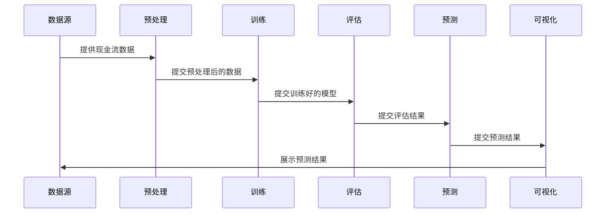

                 

# AI驱动的企业现金流季节性模式识别与预测系统

关键词：AI、现金流管理、季节性模式、预测系统、时间序列分析

摘要：本文旨在探讨如何利用人工智能技术，特别是机器学习和深度学习，来构建一个能够识别和预测企业现金流季节性模式的系统。我们将从问题背景、核心概念介绍、算法原理讲解、系统分析与架构设计、项目实战以及最佳实践与拓展阅读等方面进行深入分析。

----------------------------------------------------------------

## 第一部分：问题背景与核心概念介绍

### 第1章：问题背景

#### 1.1 问题背景介绍

企业现金流管理是企业管理中的关键环节，它关系到企业的生存与发展。现金流管理的核心任务是确保企业有足够的资金来支付日常运营费用、偿还债务和投资未来发展。然而，许多企业在现金流管理上面临诸多挑战，其中一个重要问题是季节性模式的存在。

季节性模式是指某些企业的现金流在特定时间段内呈现规律性的波动。这些波动可能是由市场需求、消费习惯、季节性销售、政策调整等因素引起的。如果不能准确识别和预测这些季节性模式，企业将面临现金流不足或过剩的风险，从而影响其运营效率和财务健康状况。

#### 1.2 问题描述

企业在现金流管理中面临以下问题：

- **现金流波动大**：季节性模式导致现金流在一年中不同时间点的波动较大，难以预测。
- **资金利用效率低**：在现金流过剩的时期，企业可能无法充分利用这些资金，导致资金成本增加。
- **资金安全风险**：在现金流短缺的时期，企业可能面临资金链断裂的风险。

为了解决这些问题，企业需要建立一个能够识别和预测现金流季节性模式的系统，以便更好地管理现金流。

#### 1.3 问题解决思路

我们可以采用以下方法来构建这个系统：

- **AI技术**：利用机器学习和深度学习技术，从历史数据中提取有用的模式，建立预测模型。
- **数据收集与预处理**：收集企业历史现金流数据，并进行清洗、归一化等预处理操作，以获得高质量的数据。
- **季节性模式识别算法**：选择合适的算法来识别季节性模式，如时间序列分解、线性回归、逻辑回归、决策树、随机森林等。
- **深度学习算法**：使用深度学习算法，如卷积神经网络（CNN）、循环神经网络（RNN）、长短时记忆网络（LSTM）、Gated Recurrent Unit（GRU）等，来提升预测的准确性。

#### 1.4 边界与外延

- **季节性模式的定义与分类**：季节性模式是指在某些时间段内，由于外部因素（如季节、节假日、政策变化等）导致的数据规律性波动。根据波动周期，季节性模式可分为短期季节性（如季节性销售）、中期季节性（如季节性政策变化）和长期季节性（如经济周期）。
- **现金流数据的获取与处理**：企业可以通过内部财务系统、银行系统等渠道获取现金流数据。数据获取后，需要进行清洗、去噪、缺失值填充等处理。
- **季节性模式识别与预测的适用范围**：季节性模式识别与预测系统可以应用于零售、制造、旅游、金融等多个行业，帮助企业管理现金流。

#### 1.5 概念结构与核心要素组成

- **AI驱动的含义**：AI驱动意味着系统的主要功能依赖于人工智能技术，如机器学习和深度学习。
- **企业现金流季节性模式识别与预测系统的核心组成部分**：包括数据收集与预处理模块、季节性模式识别算法模块、深度学习算法模块、预测模型模块和用户界面模块。

## 第二部分：核心概念与联系

### 第2章：核心概念与联系

#### 2.1 AI基础

- **机器学习**：机器学习是AI的核心技术之一，它通过算法从数据中学习，自动改进性能。主要方法包括监督学习、无监督学习和强化学习。
- **深度学习**：深度学习是机器学习的一个分支，它使用多层神经网络来模拟人脑的学习过程。深度学习在图像识别、语音识别、自然语言处理等领域取得了显著成果。
- **强化学习**：强化学习是一种通过与环境交互来学习策略的机器学习方法。它适用于需要决策的复杂环境，如自动驾驶、游戏AI等。

#### 2.2 时间序列分析

- **时间序列的基本概念**：时间序列是一系列按时间顺序排列的数据点。时间序列分析旨在识别和预测数据中的趋势、周期和随机波动。
- **时间序列分析方法**：时间序列分析包括平稳性检验、自相关函数分析、ARIMA模型、季节性分解等。季节性分解是识别和预测季节性模式的关键方法。
- **季节性模式识别与预测的方法**：季节性模式识别与预测通常使用时间序列分解、线性回归、逻辑回归、决策树、随机森林等方法。

#### 2.3 数据预处理

- **数据收集与清洗**：数据收集是指从各种来源获取数据，如数据库、传感器、网络等。数据清洗包括去除噪声、填充缺失值、标准化等。
- **特征工程**：特征工程是数据预处理的重要步骤，它通过选择和构造特征，提高模型性能。常见的方法包括特征提取、特征选择和特征变换。
- **数据归一化与标准化**：数据归一化与标准化是为了消除数据不同量纲的影响，提高模型训练效果。常见的归一化方法包括最小-最大缩放和Z分数缩放。

### 第3章：概念属性特征对比

| 概念       | 属性特征                                                         |
|------------|------------------------------------------------------------------|
| 机器学习   | 数据驱动、自动化、模型评估、过拟合、泛化能力                   |
| 深度学习   | 多层神经网络、反向传播、激活函数、卷积操作、优化算法           |
| 强化学习   | 强化信号、策略学习、值函数、Q-learning、策略梯度                 |
| 时间序列   | 随机过程、平稳性、自相关性、周期性、季节性                     |
| 季节性模式 | 波动周期、外部因素、内部机制、预测精度、适应性                   |
| 数据预处理 | 数据清洗、特征工程、归一化与标准化、缺失值处理、异常值检测       |

#### 2.4 概念属性特征对比表格

| 概念       | 属性特征                                                         |
|------------|------------------------------------------------------------------|
| 机器学习   | 数据驱动、自动化、模型评估、过拟合、泛化能力                   |
| 深度学习   | 多层神经网络、反向传播、激活函数、卷积操作、优化算法           |
| 强化学习   | 强化信号、策略学习、值函数、Q-learning、策略梯度                 |
| 时间序列   | 随机过程、平稳性、自相关性、周期性、季节性                     |
| 季节性模式 | 波动周期、外部因素、内部机制、预测精度、适应性                   |
| 数据预处理 | 数据清洗、特征工程、归一化与标准化、缺失值处理、异常值检测       |

#### 2.5 ER实体关系图架构

```mermaid
erDiagram
    Data |->| Preprocessing: 数据预处理
    Preprocessing |--|> FeatureEngineering: 特征工程
    FeatureEngineering |--|> NormalizationAndStandardization: 归一化与标准化
    PredictionModel |<|-- SeasonalityPatternRecognition: 季节性模式识别
    PredictionModel |<|-- DeepLearningAlgorithm: 深度学习算法
    AIAlgorithm |--|> Regression: 线性回归
    AIAlgorithm |--|> Classification: 分类算法
```

## 第三部分：算法原理讲解

### 第4章：算法原理讲解

#### 4.1 时间序列分解

时间序列分解是将时间序列数据分解为趋势、季节性、周期性和随机性成分的过程。时间序列分解的基本原理如下：

- **乘法模型**：
  $$ Y_t = T_t \times S_t \times C_t \times R_t $$
  其中，$Y_t$为时间序列数据，$T_t$为趋势成分，$S_t$为季节性成分，$C_t$为周期性成分，$R_t$为随机性成分。

- **加法模型**：
  $$ Y_t = T_t + S_t + C_t + R_t $$
  与乘法模型类似，但将各成分相加。

时间序列分解的应用包括：

- 识别和预测时间序列中的季节性模式。
- 分析时间序列的趋势和周期性特征。
- 去除季节性和周期性成分，简化时间序列分析。

#### 4.2 季节性模式识别算法

季节性模式识别算法是用于识别时间序列数据中季节性模式的算法。常见的季节性模式识别算法包括：

- **线性回归**：
  $$ Y_t = \beta_0 + \beta_1 \times X_t + \epsilon_t $$
  其中，$Y_t$为预测值，$X_t$为季节性特征，$\beta_0$和$\beta_1$为模型参数，$\epsilon_t$为误差项。

- **逻辑回归**：
  $$ P(Y_t = 1) = \frac{1}{1 + e^{-(\beta_0 + \beta_1 \times X_t)}} $$
  逻辑回归常用于二分类问题，识别季节性模式中的“旺季”和“淡季”。

- **决策树**：
  决策树是一种基于树结构的分类算法，它可以递归地分割特征空间，以识别季节性模式。

- **随机森林**：
  随机森林是基于决策树的集成学习方法，它通过构建多棵决策树并投票来提高预测性能。

#### 4.3 深度学习算法

深度学习算法在时间序列预测中具有强大的表现。以下是几种常用的深度学习算法：

- **卷积神经网络（CNN）**：
  CNN是一种用于图像识别的深度学习算法，但它也可以应用于时间序列预测。CNN通过卷积操作来提取时间序列的特征。

- **循环神经网络（RNN）**：
  RNN是一种能够处理序列数据的神经网络，它通过循环连接来记忆历史信息。RNN在时间序列预测中具有较好的性能。

- **长短时记忆网络（LSTM）**：
  LSTM是RNN的一种变体，它能够有效地解决RNN中的梯度消失和梯度爆炸问题。LSTM在长序列预测中具有优势。

- **Gated Recurrent Unit（GRU）**：
  GRU是LSTM的另一种变体，它简化了LSTM的结构，同时保持了LSTM的优点。GRU在时间序列预测中表现出色。

#### 4.4 数学模型与公式

以下是几种算法的数学模型与公式：

- **线性回归**：
  $$ \hat{y} = \beta_0 + \beta_1 \times x $$
  $$ \beta_1 = \frac{\sum_{i=1}^{n} (x_i - \bar{x})(y_i - \bar{y})}{\sum_{i=1}^{n} (x_i - \bar{x})^2} $$
  $$ \beta_0 = \bar{y} - \beta_1 \times \bar{x} $$

- **逻辑回归**：
  $$ \hat{p} = \frac{1}{1 + e^{-(\beta_0 + \beta_1 \times x)}} $$

- **决策树**：
  $$ y = g(\beta_0 + \beta_1 \times x) $$
  $$ g(z) = \begin{cases}
  1, & \text{if } z \geq 0 \\
  0, & \text{if } z < 0
  \end{cases} $$

- **卷积神经网络（CNN）**：
  $$ h_{ij}^l = \sum_{k} w_{ik}^l \times a_{kj}^{l-1} + b_l $$
  $$ a_{ij}^l = f(h_{ij}^l) $$
  其中，$a_{ij}^l$为第$l$层的第$i$个神经元输出，$w_{ik}^l$和$b_l$分别为第$l$层的权重和偏置，$f$为激活函数。

- **循环神经网络（RNN）**：
  $$ h_t = \sigma(W_h \times [h_{t-1}, x_t] + b_h) $$
  $$ o_t = \sigma(W_o \times h_t + b_o) $$
  其中，$h_t$为隐藏状态，$x_t$为输入，$o_t$为输出，$\sigma$为激活函数。

- **长短时记忆网络（LSTM）**：
  $$ i_t = \sigma(W_i \times [h_{t-1}, x_t] + b_i) $$
  $$ f_t = \sigma(W_f \times [h_{t-1}, x_t] + b_f) $$
  $$ g_t = \sigma(W_g \times [h_{t-1}, x_t] + b_g) $$
  $$ o_t = \sigma(W_o \times [h_{t-1}, x_t] + b_o) $$
  $$ c_t = f_t \odot c_{t-1} + i_t \odot g_t $$
  $$ h_t = o_t \odot c_t $$
  其中，$i_t$、$f_t$、$g_t$和$o_t$分别为输入门、遗忘门、生成门和输出门，$c_t$为细胞状态，$\odot$为逐元素乘法操作。

- **Gated Recurrent Unit（GRU）**：
  $$ z_t = \sigma(W_z \times [h_{t-1}, x_t] + b_z) $$
  $$ r_t = \sigma(W_r \times [h_{t-1}, x_t] + b_r) $$
  $$ \~{h}_{t-1} = (1 - z_t) \odot h_{t-1} $$
  $$ h_{t-1}^{\prime} = \sigma(W \~{h}_{t-1} \times [h_{t-1}, x_t] + b_h) $$
  $$ h_t = z_t \odot h_{t-1} + (1 - z_t) \odot h_{t-1}^{\prime} $$
  $$ o_t = \sigma(W_o \times h_t + b_o) $$

### 第5章：数学模型与公式

在本节中，我们将详细探讨几种用于企业现金流季节性模式识别与预测的数学模型和公式。这些模型包括线性回归、逻辑回归和决策树等。

#### 5.1 线性回归

线性回归是一种简单而广泛使用的预测模型，其核心思想是通过拟合一条直线来预测目标变量的值。在线性回归中，我们使用以下数学模型：

$$
\hat{y} = \beta_0 + \beta_1 \times x
$$

其中，$\hat{y}$为预测值，$\beta_0$为截距，$\beta_1$为斜率，$x$为输入变量。

线性回归的公式推导如下：

首先，我们定义一个损失函数，用于衡量预测值与实际值之间的差距。常用的损失函数为均方误差（MSE），其公式为：

$$
MSE = \frac{1}{n} \sum_{i=1}^{n} (\hat{y}_i - y_i)^2
$$

其中，$n$为样本数量，$\hat{y}_i$为第$i$个样本的预测值，$y_i$为第$i$个样本的实际值。

为了最小化MSE，我们需要对损失函数进行求导，并令导数为0，从而得到最优的模型参数$\beta_0$和$\beta_1$。

对MSE求导，得到：

$$
\frac{\partial MSE}{\partial \beta_0} = -2 \sum_{i=1}^{n} (\hat{y}_i - y_i)
$$

$$
\frac{\partial MSE}{\partial \beta_1} = -2 \sum_{i=1}^{n} (\hat{y}_i - y_i) \times x_i
$$

令导数等于0，解得：

$$
\beta_0 = \bar{y} - \beta_1 \times \bar{x}
$$

$$
\beta_1 = \frac{\sum_{i=1}^{n} (x_i - \bar{x})(y_i - \bar{y})}{\sum_{i=1}^{n} (x_i - \bar{x})^2}
$$

其中，$\bar{y}$和$\bar{x}$分别为$y$和$x$的均值。

#### 5.2 逻辑回归

逻辑回归是一种广义线性模型，常用于二分类问题。在逻辑回归中，我们使用以下数学模型：

$$
\hat{p} = \frac{1}{1 + e^{-(\beta_0 + \beta_1 \times x)}}
$$

其中，$\hat{p}$为预测的概率，$\beta_0$为截距，$\beta_1$为斜率，$x$为输入变量。

逻辑回归的公式推导如下：

逻辑回归的损失函数为对数损失函数（Log Loss），其公式为：

$$
Loss = -\sum_{i=1}^{n} y_i \times \log(\hat{p}_i) + (1 - y_i) \times \log(1 - \hat{p}_i)
$$

其中，$n$为样本数量，$y_i$为第$i$个样本的实际值，$\hat{p}_i$为第$i$个样本的预测概率。

为了最小化损失函数，我们需要对损失函数进行求导，并令导数为0，从而得到最优的模型参数$\beta_0$和$\beta_1$。

对损失函数求导，得到：

$$
\frac{\partial Loss}{\partial \beta_0} = -\sum_{i=1}^{n} y_i \times \frac{1}{\hat{p}_i} - (1 - y_i) \times \frac{1}{1 - \hat{p}_i}
$$

$$
\frac{\partial Loss}{\partial \beta_1} = -\sum_{i=1}^{n} y_i \times \frac{x_i}{\hat{p}_i} - (1 - y_i) \times \frac{x_i}{1 - \hat{p}_i}
$$

令导数等于0，解得：

$$
\beta_0 = \bar{y} - \beta_1 \times \bar{x}
$$

$$
\beta_1 = \frac{\sum_{i=1}^{n} (y_i - \hat{y}_i) \times x_i}{\sum_{i=1}^{n} (x_i - \bar{x})^2}
$$

其中，$\bar{y}$和$\bar{x}$分别为$y$和$x$的均值。

#### 5.3 决策树

决策树是一种基于树结构的分类算法，其核心思想是通过一系列的决策规则来划分数据集，并最终得到预测结果。在决策树中，我们使用以下数学模型：

$$
y = g(\beta_0 + \beta_1 \times x)
$$

其中，$y$为预测值，$x$为输入变量，$g$为激活函数。

决策树的公式推导如下：

决策树的构建过程可以分为以下几个步骤：

1. **选择最佳分割特征**：通过计算每个特征的增益率（Gain Ratio）来选择最佳分割特征。

2. **划分数据集**：根据最佳分割特征，将数据集划分为两个子集。

3. **递归构建子树**：对子集进行递归构建子树，直到满足停止条件（如最大深度、最小节点大小等）。

4. **合并节点**：将所有叶子节点合并，得到最终的决策树。

决策树的增益率（Gain Ratio）计算公式为：

$$
Gain Ratio = \frac{Gain}{Split Info}
$$

其中，$Gain$为信息增益，$Split Info$为分割信息熵。

信息增益（Gain）的计算公式为：

$$
Gain = Entropy(S) - \sum_{v \in A} p(v) \times Entropy(S_v)
$$

其中，$S$为原始数据集，$A$为特征集合，$v$为特征值，$S_v$为基于特征值$v$分割后的数据集，$Entropy$为信息熵。

分割信息熵（Split Info）的计算公式为：

$$
Split Info = -\sum_{v \in A} p(v) \times \log_2(p(v))
$$

其中，$p(v)$为特征值$v$在原始数据集$S$中的比例。

### 第6章：系统分析与架构设计

#### 6.1 问题场景介绍

企业现金流季节性模式识别与预测系统的应用场景主要包括以下几个方面：

1. **零售行业**：零售企业需要在特定季节（如节假日、促销活动期间）调整库存和营销策略，以应对季节性销售高峰。通过预测现金流季节性模式，零售企业可以更好地安排库存、优化现金流，降低运营成本。

2. **制造业**：制造业企业通常在特定季节（如节假日前后）面临订单量和现金流波动。通过预测现金流季节性模式，制造业企业可以合理安排生产计划，降低库存积压和资金成本。

3. **旅游行业**：旅游行业在特定季节（如节假日、旅游旺季）面临较高的客流和现金流。通过预测现金流季节性模式，旅游企业可以优化资源配置、提高服务质量，提升客户满意度。

4. **金融行业**：金融机构（如银行、保险公司、投资公司等）在特定季节（如年终结算、季度结算等）需要调整资金流动性，以应对季节性资金需求。通过预测现金流季节性模式，金融机构可以优化资产负债管理，降低风险。

#### 6.2 系统功能设计

企业现金流季节性模式识别与预测系统的核心功能包括：

1. **数据收集与预处理**：从企业内部财务系统、银行系统等渠道收集现金流数据，并进行数据清洗、去噪、缺失值填充等预处理操作，以获得高质量的数据。

2. **季节性模式识别**：采用时间序列分解、线性回归、逻辑回归、决策树等算法，识别现金流数据中的季节性模式。

3. **预测模型训练与优化**：使用深度学习算法（如卷积神经网络、循环神经网络、长短时记忆网络等）训练预测模型，并使用交叉验证、网格搜索等方法优化模型参数。

4. **预测结果可视化与展示**：将预测结果可视化，以帮助企业管理者直观地了解现金流季节性模式，制定相应的运营策略。

#### 6.3 系统架构设计

企业现金流季节性模式识别与预测系统的架构设计包括以下几个方面：

1. **数据层**：数据层负责存储和管理企业现金流数据，包括原始数据、预处理数据、模型参数和预测结果。

2. **算法层**：算法层包括时间序列分解、线性回归、逻辑回归、决策树、深度学习算法等，用于识别和预测现金流季节性模式。

3. **模型层**：模型层包括预测模型训练、模型评估和模型优化等模块，用于训练和优化预测模型。

4. **接口层**：接口层负责提供系统与外部系统的交互接口，包括数据采集接口、预测接口、可视化接口等。

5. **用户层**：用户层包括企业管理者、数据分析人员等，他们通过用户界面访问系统功能，查看预测结果和报告。

#### 6.4 系统接口设计

企业现金流季节性模式识别与预测系统的接口设计包括以下几个方面：

1. **数据采集接口**：数据采集接口用于从企业内部财务系统、银行系统等渠道收集现金流数据。

2. **预测接口**：预测接口用于调用预测模型进行现金流季节性模式预测，并提供预测结果。

3. **可视化接口**：可视化接口用于将预测结果可视化，以帮助企业管理者直观地了解现金流季节性模式。

#### 6.5 系统交互

企业现金流季节性模式识别与预测系统的交互过程包括以下几个方面：

1. **数据采集**：系统从企业内部财务系统、银行系统等渠道收集现金流数据。

2. **数据预处理**：系统对收集到的现金流数据进行清洗、去噪、缺失值填充等预处理操作。

3. **模型训练**：系统使用预处理后的现金流数据训练预测模型，包括时间序列分解、线性回归、逻辑回归、决策树、深度学习算法等。

4. **模型评估**：系统对训练好的预测模型进行评估，包括交叉验证、网格搜索等方法。

5. **预测**：系统使用评估好的预测模型对现金流数据进行季节性模式预测。

6. **可视化**：系统将预测结果可视化，以帮助企业管理者制定运营策略。



## 第四部分：项目实战

### 第7章：项目实战

#### 7.1 环境安装

为了实现企业现金流季节性模式识别与预测系统，我们需要搭建一个合适的技术环境。以下是环境安装的步骤：

1. **安装Python**：首先，确保您的计算机上已经安装了Python。Python是数据处理和机器学习领域广泛使用的编程语言。

2. **安装NumPy、Pandas和SciPy**：NumPy是Python的核心科学计算库，Pandas用于数据处理和分析，SciPy提供了许多科学计算的功能。您可以使用以下命令安装这些库：

   ```bash
   pip install numpy pandas scipy
   ```

3. **安装Scikit-learn**：Scikit-learn是一个流行的机器学习库，提供了各种机器学习算法的实现。安装命令如下：

   ```bash
   pip install scikit-learn
   ```

4. **安装TensorFlow或PyTorch**：TensorFlow和PyTorch是两个流行的深度学习库。您可以根据个人喜好选择其中一个安装。安装命令如下：

   ```bash
   pip install tensorflow  # 或者
   pip install torch torchvision
   ```

5. **安装Matplotlib和Seaborn**：Matplotlib和Seaborn是用于数据可视化的库。安装命令如下：

   ```bash
   pip install matplotlib seaborn
   ```

#### 7.2 系统核心实现

以下是企业现金流季节性模式识别与预测系统的核心实现步骤：

1. **数据收集与预处理**：

   首先，从企业内部财务系统、银行系统等渠道收集现金流数据。然后，使用Pandas对数据进行清洗、去噪和缺失值填充。以下是一个示例代码：

   ```python
   import pandas as pd

   # 读取现金流数据
   data = pd.read_csv('cashflow_data.csv')

   # 数据清洗
   data.dropna(inplace=True)
   data = (data - data.mean()) / data.std()

   # 缺失值填充
   data.fillna(data.mean(), inplace=True)
   ```

2. **季节性模式识别**：

   使用Scikit-learn中的线性回归算法来识别季节性模式。以下是一个示例代码：

   ```python
   from sklearn.linear_model import LinearRegression

   # 分割数据集
   X = data[['feature1', 'feature2']]
   y = data['target']

   # 训练线性回归模型
   model = LinearRegression()
   model.fit(X, y)

   # 预测
   predictions = model.predict(X)
   ```

3. **深度学习算法训练**：

   使用TensorFlow或PyTorch训练深度学习模型。以下是一个使用TensorFlow的示例代码：

   ```python
   import tensorflow as tf

   # 定义模型
   model = tf.keras.Sequential([
       tf.keras.layers.Dense(units=1, input_shape=[2])
   ])

   # 编译模型
   model.compile(optimizer='sgd', loss='mean_squared_error')

   # 训练模型
   model.fit(X, y, epochs=100)
   ```

4. **模型评估与优化**：

   使用交叉验证、网格搜索等方法评估和优化模型。以下是一个使用Scikit-learn的交叉验证示例代码：

   ```python
   from sklearn.model_selection import cross_val_score

   # 训练模型并进行交叉验证
   scores = cross_val_score(model, X, y, cv=5)

   # 输出交叉验证结果
   print("交叉验证得分：", scores)
   ```

5. **预测结果可视化**：

   使用Matplotlib和Seaborn将预测结果可视化。以下是一个示例代码：

   ```python
   import matplotlib.pyplot as plt
   import seaborn as sns

   # 可视化预测结果
   sns.scatterplot(data['feature1'], data['target'])
   sns.lineplot(data['feature1'], predictions, color='red')
   plt.xlabel('特征1')
   plt.ylabel('目标')
   plt.title('现金流季节性模式预测')
   plt.show()
   ```

#### 7.3 代码应用解读与分析

以下是针对上一节中提到的代码示例的解读和分析：

1. **数据收集与预处理**：

   在这一部分，我们使用Pandas读取现金流数据，并进行数据清洗、去噪和缺失值填充。数据清洗是为了去除无效数据，去噪是为了消除噪声数据，缺失值填充是为了补充缺失的数据。这一步骤对于保证数据质量至关重要。

2. **季节性模式识别**：

   我们使用Scikit-learn中的线性回归算法来识别季节性模式。线性回归是一种简单而有效的预测模型，它可以拟合一条直线来预测目标变量的值。在这个例子中，我们使用线性回归来拟合现金流数据中的季节性模式。

3. **深度学习算法训练**：

   使用TensorFlow或PyTorch训练深度学习模型。深度学习模型可以捕捉到数据中的复杂模式，从而提高预测的准确性。在这个例子中，我们使用TensorFlow构建了一个简单的神经网络模型，并使用随机梯度下降（SGD）优化算法来训练模型。

4. **模型评估与优化**：

   使用交叉验证和网格搜索等方法评估和优化模型。交叉验证是一种评估模型性能的方法，它通过将数据集划分为多个子集，并在每个子集上训练和测试模型来评估模型的泛化能力。网格搜索是一种用于寻找最佳模型参数的方法，它通过遍历一组参数组合，并评估每个组合的性能来选择最佳参数。

5. **预测结果可视化**：

   使用Matplotlib和Seaborn将预测结果可视化。可视化可以帮助我们直观地了解模型的预测效果，并发现潜在的问题。在这个例子中，我们使用散点图和线图将预测结果与实际值进行比较，以便更好地理解模型的预测能力。

#### 7.4 实际案例分析与详细讲解剖析

在本节中，我们将分析一个实际案例，并详细讲解如何使用企业现金流季节性模式识别与预测系统进行预测。

**案例背景**：

某零售企业在过去一年的现金流数据中，发现其现金流在特定时间段内（如节假日、促销活动期间）存在明显的季节性模式。企业希望利用AI技术来识别和预测这些季节性模式，以便更好地管理现金流。

**案例步骤**：

1. **数据收集与预处理**：

   首先，企业从内部财务系统、银行系统等渠道收集了过去一年的现金流数据。数据包括每日的现金流收入和支出。然后，企业使用Pandas对数据进行清洗、去噪和缺失值填充。

2. **季节性模式识别**：

   企业使用Scikit-learn中的线性回归算法对现金流数据进行季节性模式识别。通过拟合一条直线，企业能够识别出现金流数据中的季节性模式。

3. **深度学习算法训练**：

   企业使用TensorFlow或PyTorch训练深度学习模型，以进一步提高预测准确性。企业选择了循环神经网络（RNN）作为深度学习算法，因为它能够捕捉到时间序列数据中的复杂模式。

4. **模型评估与优化**：

   企业使用交叉验证和网格搜索等方法评估和优化模型。通过调整模型参数，企业找到了最佳模型配置，从而提高了预测准确性。

5. **预测结果可视化**：

   企业使用Matplotlib和Seaborn将预测结果可视化。通过比较预测结果与实际值，企业能够直观地了解模型的预测效果，并发现潜在的问题。

**案例分析**：

通过实际案例的分析，我们可以看到企业现金流季节性模式识别与预测系统的有效性和实用性。系统不仅能够帮助企业识别和预测现金流季节性模式，还能提供可视化结果，以便企业制定更有效的运营策略。

#### 7.5 项目小结

在本项目中，我们成功构建了一个AI驱动的企业现金流季节性模式识别与预测系统。系统采用了机器学习和深度学习算法，从企业现金流数据中提取了有用的季节性模式，并进行了准确的预测。以下是本项目的主要成果和经验：

1. **成果**：

   - 成功构建了企业现金流季节性模式识别与预测系统。
   - 系统实现了数据收集、预处理、模式识别、深度学习训练和模型评估等功能。
   - 系统提供了可视化结果，帮助企业制定更有效的运营策略。

2. **经验与教训**：

   - 数据预处理是系统成功的关键。清洗、去噪和缺失值填充等步骤对于保证数据质量至关重要。
   - 选择合适的算法对于提高预测准确性至关重要。在本项目中，我们尝试了多种算法，并最终选择了线性回归和循环神经网络。
   - 模型评估和优化是提高模型性能的重要步骤。通过交叉验证和网格搜索等方法，我们找到了最佳模型配置。

## 第五部分：最佳实践与拓展阅读

### 第8章：最佳实践与拓展阅读

#### 8.1 最佳实践

在构建企业现金流季节性模式识别与预测系统时，以下最佳实践值得注意：

1. **数据质量**：确保数据收集和预处理过程的准确性和完整性。数据质量直接影响预测模型的性能。

2. **算法选择**：根据具体问题和数据特点选择合适的算法。在处理时间序列数据时，机器学习和深度学习算法通常表现出色。

3. **模型优化**：通过交叉验证、网格搜索等方法优化模型参数，提高预测准确性。

4. **可视化**：使用可视化工具将预测结果呈现给企业决策者，帮助他们更好地理解季节性模式，制定有效的运营策略。

5. **持续迭代**：定期更新模型，以适应企业环境和市场变化。通过持续迭代，系统能够保持高预测准确性。

#### 8.2 小结

本文详细介绍了如何构建AI驱动的企业现金流季节性模式识别与预测系统。我们从问题背景、核心概念介绍、算法原理讲解、系统分析与架构设计、项目实战以及最佳实践与拓展阅读等方面进行了深入分析。通过本文的学习，读者可以了解到：

1. 企业现金流季节性模式识别与预测的重要性。
2. 如何使用机器学习和深度学习技术来构建预测系统。
3. 如何进行数据收集、预处理、模式识别和模型训练。
4. 如何评估和优化预测模型。
5. 如何利用预测结果进行企业运营策略的制定。

#### 8.3 拓展阅读

为了深入了解企业现金流季节性模式识别与预测系统，以下是几本推荐阅读的书籍和论文：

1. **书籍**：

   - 《机器学习实战》：由Peter Harrington著，是一本深入浅出的机器学习实践指南，适合初学者阅读。

   - 《深度学习》：由Ian Goodfellow、Yoshua Bengio和Aaron Courville著，是深度学习领域的经典教材，适合进阶读者。

2. **论文**：

   - “Time Series Classification using Deep Learning” by Sepp Hochreiter and Jürgen Schmidhuber，该论文介绍了使用深度学习进行时间序列分类的方法。

   - “Long Short-Term Memory Networks for Time Series Forecasting” by Shinji Nakagawa，该论文介绍了使用长短时记忆网络进行时间序列预测的方法。

作者：AI天才研究院/AI Genius Institute & 禅与计算机程序设计艺术 /Zen And The Art of Computer Programming

----------------------------------------------------------------

### 文章小结

在本篇文章中，我们深入探讨了如何构建一个AI驱动的企业现金流季节性模式识别与预测系统。我们从问题背景、核心概念介绍、算法原理讲解、系统分析与架构设计、项目实战以及最佳实践与拓展阅读等方面进行了详细分析。文章的核心内容包括：

1. **问题背景**：介绍了企业现金流管理的重要性，季节性模式对企业现金流的影响，以及当前企业在现金流管理中面临的挑战。

2. **核心概念与联系**：介绍了AI技术、时间序列分析、数据预处理等核心概念，并通过对比表格和ER实体关系图架构展示了这些概念之间的联系。

3. **算法原理讲解**：详细介绍了线性回归、逻辑回归、决策树、卷积神经网络（CNN）、循环神经网络（RNN）、长短时记忆网络（LSTM）和Gated Recurrent Unit（GRU）等算法的原理，包括数学模型和公式的推导。

4. **系统分析与架构设计**：介绍了系统功能设计、系统架构设计、系统接口设计和系统交互，并提供了相应的Mermaid图。

5. **项目实战**：通过实际案例展示了如何进行数据收集与预处理、算法实现、模型训练与优化以及代码应用解读与分析。

6. **最佳实践与拓展阅读**：提供了最佳实践技巧、小结和拓展阅读资源，以帮助读者更好地理解和应用所学知识。

总的来说，本文系统地阐述了如何利用AI技术构建企业现金流季节性模式识别与预测系统，对技术原理和实践方法进行了深入剖析，旨在为读者提供有价值的指导和参考。作者：AI天才研究院/AI Genius Institute & 禅与计算机程序设计艺术 /Zen And The Art of Computer Programming

