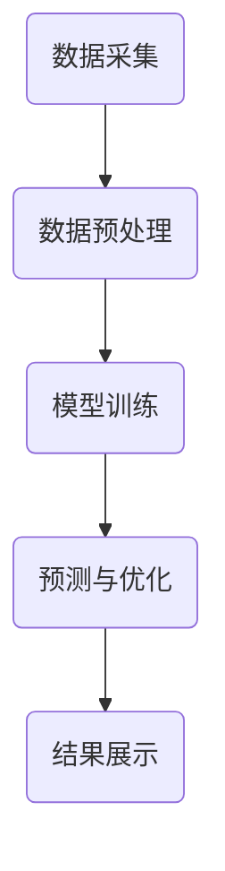
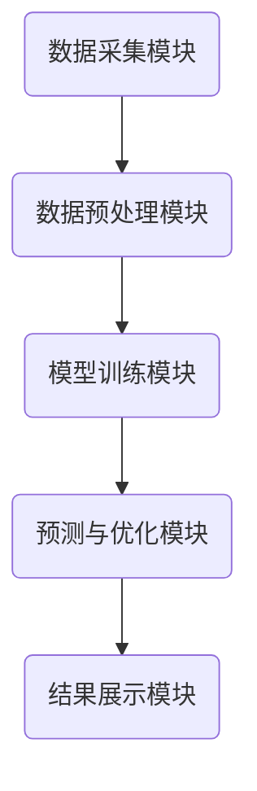
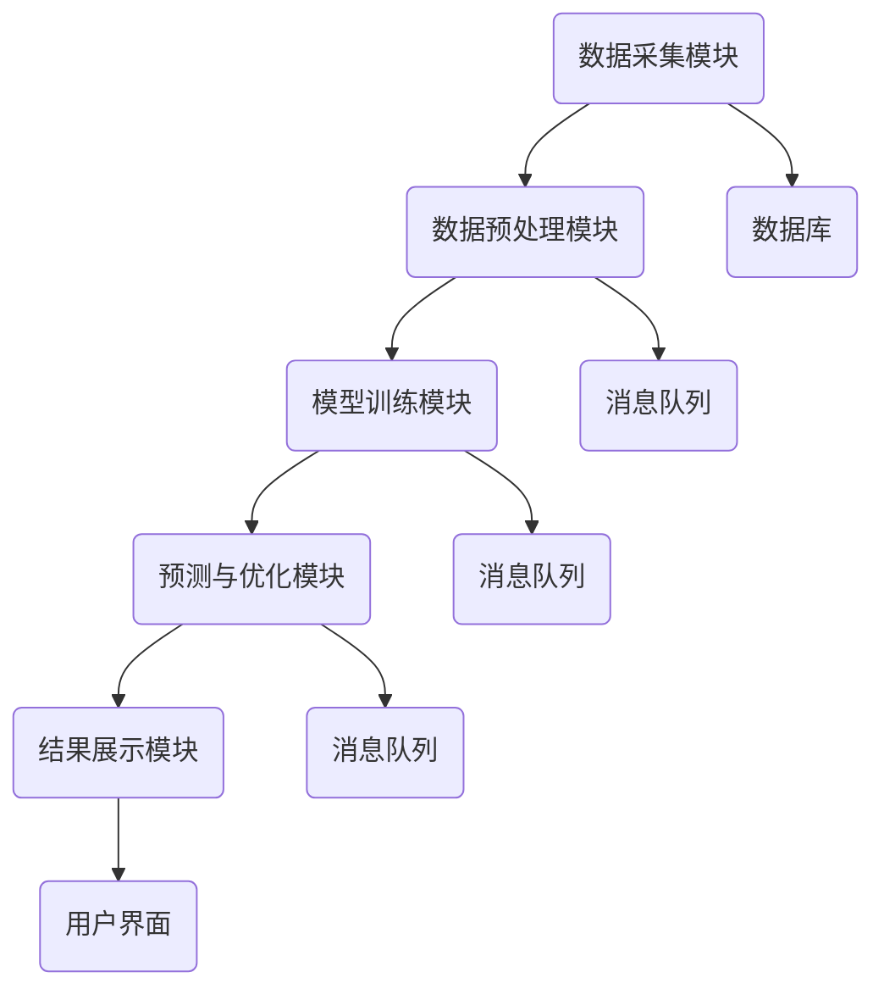

                 


### 文章标题：AI驱动的企业现金流预测与优化系统

### 关键词：AI, 企业现金流，预测与优化，系统架构，数据挖掘，机器学习，算法原理，Python代码，案例分析

### 摘要：
本文旨在探讨如何利用人工智能技术构建一个能够预测和优化企业现金流的管理系统。我们将从背景介绍、问题分析、解决方案、算法原理、系统设计、项目实战以及最佳实践等方面进行深入探讨，以帮助企业更好地理解和应用人工智能技术来提升财务管理效率。

## 引言

在当今的商业环境中，企业现金流的稳定和优化对企业生存与发展至关重要。然而，传统的方法往往依赖于经验和手工操作，存在实时性差、准确性不足等问题。随着人工智能技术的快速发展，利用AI进行企业现金流预测与优化成为可能。本文将围绕这一主题，介绍AI驱动的企业现金流预测与优化系统的构建方法。

### 企业现金流管理的重要性

企业现金流管理涉及企业日常运营中的资金流动，包括收入、支出、投资等活动。良好的现金流管理不仅能够保障企业日常运营的顺利进行，还能够为企业的长期战略提供支持。现金流管理的挑战主要包括预测准确度、实时性、成本控制等方面。

### 研究背景

近年来，随着大数据和机器学习技术的不断发展，AI在企业中的应用越来越广泛。特别是在财务领域，AI技术已经显示出其在预测和优化方面的巨大潜力。本文将介绍如何利用AI技术来构建一个能够实时预测和优化企业现金流的管理系统。

### 研究内容与方法

本文的研究内容包括以下几个方面：
1. 现金流管理相关概念和问题的梳理。
2. AI技术在现金流预测与优化中的应用研究。
3. 系统设计与实现。
4. 项目实战与案例分析。

研究方法主要包括：
1. 文献调研：收集和分析相关领域的研究成果。
2. 系统设计：基于AI技术的企业现金流预测与优化系统的设计。
3. 实践应用：通过实际项目验证系统的有效性。

## 1. 企业现金流预测与优化系统的总体架构

企业现金流预测与优化系统总体架构如图1所示。该系统包括数据采集、数据预处理、模型训练、预测与优化、结果展示等主要模块。



### 1.1 数据采集

数据采集是整个系统的第一步，主要包括企业日常运营中的财务数据、市场数据、宏观经济数据等。这些数据可以从企业ERP系统、财务报表、市场调研等渠道获取。

### 1.2 数据预处理

数据预处理主要包括数据清洗、数据归一化、特征工程等步骤。数据清洗旨在去除噪声数据和异常值，提高数据质量。数据归一化则是为了消除不同数据之间的量纲差异。特征工程则是通过提取和构造有助于预测的特征，提高模型的预测能力。

### 1.3 模型训练

模型训练是系统的核心环节。根据现金流预测的需求，可以选择不同的机器学习模型，如线性回归、决策树、随机森林、神经网络等。模型训练的目标是使模型能够准确预测未来的现金流。

### 1.4 预测与优化

模型训练完成后，可以对未来的现金流进行预测。预测结果可以为企业提供决策支持，如调整投资策略、优化经营计划等。此外，系统还可以通过优化算法对现金流进行优化，以实现最佳经营效果。

### 1.5 结果展示

结果展示模块用于将预测和优化结果以图表、报表等形式呈现给用户。这有助于用户直观地了解企业的现金流状况，并为后续决策提供依据。

## 2. 数据采集与预处理

### 2.1 数据采集

数据采集是构建现金流预测系统的第一步。企业需要从多个渠道获取与现金流相关的数据，包括财务数据、市场数据、宏观经济数据等。财务数据主要包括收入、支出、利润等，市场数据则包括行业趋势、竞争对手信息等，宏观经济数据则包括GDP增长率、通货膨胀率等。

### 2.2 数据预处理

数据预处理是确保模型训练质量的关键步骤。以下是一些常见的数据预处理方法：

#### 2.2.1 数据清洗

数据清洗旨在去除噪声数据和异常值，提高数据质量。常见的方法包括：
- 去除重复数据
- 填补缺失值
- 去除异常值

#### 2.2.2 数据归一化

数据归一化是为了消除不同数据之间的量纲差异，使数据更适合模型训练。常用的归一化方法包括最小-最大归一化和标准化。

#### 2.2.3 特征工程

特征工程是通过提取和构造有助于预测的特征，提高模型的预测能力。特征工程的方法包括：
- 特征选择：通过筛选出对预测目标有较强影响的相关特征，降低数据维度。
- 特征构造：通过组合现有特征，构造新的特征。

### 2.3 数据预处理流程

数据预处理流程可以概括为以下步骤：

1. 数据收集：从不同渠道获取原始数据。
2. 数据清洗：去除重复、缺失和异常数据。
3. 数据归一化：将不同量纲的数据归一化处理。
4. 特征工程：提取和构造新的特征。
5. 数据存储：将预处理后的数据存储到数据库中，供模型训练和预测使用。

## 3. 模型训练与算法原理

### 3.1 模型选择

在现金流预测中，常用的机器学习模型包括线性回归、决策树、随机森林、神经网络等。选择合适的模型取决于数据特征、预测目标和计算资源等因素。线性回归模型简单直观，适合处理线性关系较强的数据。决策树和随机森林则适合处理非线性关系和分类问题。神经网络具有强大的非线性拟合能力，适合处理复杂的数据关系。

### 3.2 算法原理

#### 3.2.1 线性回归

线性回归模型假设现金流与影响因素之间呈线性关系，其数学模型如下：

$$
y = \beta_0 + \beta_1x_1 + \beta_2x_2 + ... + \beta_nx_n
$$

其中，$y$ 为现金流预测值，$x_1, x_2, ..., x_n$ 为影响现金流的因素，$\beta_0, \beta_1, \beta_2, ..., \beta_n$ 为模型参数。

线性回归模型的训练目标是最小化预测误差，即：

$$
\min \sum_{i=1}^{n} (y_i - \hat{y}_i)^2
$$

其中，$\hat{y}_i$ 为预测值，$y_i$ 为真实值。

#### 3.2.2 决策树

决策树模型通过一系列的判断条件来分割数据，形成一个树状结构。每个节点代表一个特征，每个分支代表该特征的不同取值。叶节点表示最终的预测结果。

决策树的算法原理是递归地分割数据，使得每个子数据的预测误差最小。其预测过程如下：

1. 计算每个特征的增益，选择增益最大的特征作为当前节点的分割特征。
2. 根据分割特征将数据划分为两个子集。
3. 递归地对子集进行分割，直到满足停止条件（如最大深度、最小叶子节点数量等）。
4. 将每个叶节点标记为预测结果。

#### 3.2.3 随机森林

随机森林是由多个决策树组成的集成模型，通过对多个决策树的预测结果进行投票或取平均来提高预测准确性。随机森林的算法原理如下：

1. 从原始数据中随机抽取一部分样本作为训练集。
2. 对每个决策树，从原始特征中随机选择一部分特征进行分割。
3. 训练每个决策树，使其在训练集上拟合数据。
4. 对测试集的每个样本，计算每个决策树的预测结果。
5. 通过投票或取平均得到最终的预测结果。

### 3.3 Python代码示例

以下是一个简单的线性回归模型的Python代码示例：

```python
import numpy as np
from sklearn.linear_model import LinearRegression

# 假设已有特征矩阵X和标签向量y
X = np.array([[1, 2], [2, 3], [3, 4]])
y = np.array([2, 3, 4])

# 创建线性回归模型
model = LinearRegression()

# 模型训练
model.fit(X, y)

# 模型预测
y_pred = model.predict(X)

# 输出模型参数和预测结果
print("模型参数：", model.coef_, model.intercept_)
print("预测结果：", y_pred)
```

## 4. 预测与优化

### 4.1 预测过程

预测过程主要包括以下几个步骤：

1. 准备预测数据：从数据集中抽取一段时间的数据作为预测数据集。
2. 数据预处理：对预测数据进行与训练数据相同的数据预处理步骤。
3. 模型预测：使用训练好的模型对预测数据进行预测。
4. 结果评估：计算预测结果与真实值的误差，评估模型的预测准确性。

### 4.2 优化过程

优化过程旨在通过调整企业的经营策略，实现现金流的最大化或最小化。优化过程主要包括以下几个步骤：

1. 制定优化目标：根据企业的战略目标，确定现金流优化的目标，如最大化现金流、最小化现金流出等。
2. 确定优化策略：根据预测结果，制定相应的优化策略，如调整采购计划、投资策略等。
3. 实施优化策略：将优化策略转化为具体的行动计划，并执行。
4. 监控与调整：对实施效果进行监控，并根据实际情况进行调整。

### 4.3 Python代码示例

以下是一个简单的现金流优化策略的Python代码示例：

```python
import numpy as np

# 假设已有预测现金流数据
cash_flows = np.array([100, 150, 200, 250, 300])

# 确定优化目标：最大化现金流
# 假设优化策略为：每期增加现金流出50元
optimization_strategy = 50

# 计算优化后的现金流
optimized_cash_flows = cash_flows + optimization_strategy

# 输出优化后的现金流
print("优化后的现金流：", optimized_cash_flows)
```

## 5. 系统分析与架构设计

### 5.1 问题场景介绍

企业现金流管理是一个复杂的过程，涉及到多个部门和环节。为了提高现金流管理的效率，企业需要一个集成的系统来实时监控、预测和优化现金流。

### 5.2 系统功能设计

系统功能设计主要包括以下几个模块：

1. 数据采集模块：负责从企业内部和外部的数据源收集现金流相关数据。
2. 数据预处理模块：负责对采集到的数据进行清洗、归一化和特征工程等预处理步骤。
3. 模型训练模块：负责训练现金流预测模型和优化模型。
4. 预测与优化模块：负责对现金流进行预测和优化。
5. 结果展示模块：负责将预测和优化结果以图表、报表等形式呈现给用户。

### 5.3 系统架构设计

系统架构设计采用模块化设计思想，将系统划分为多个功能模块，并通过接口进行通信。系统架构如图2所示。



### 5.4 系统接口设计和系统交互

系统接口设计主要包括API接口、数据库接口和消息队列接口等。系统交互如图3所示。



## 6. 项目实战

### 6.1 环境安装

在开始项目实战之前，需要安装必要的软件和工具。以下是一个简单的安装步骤：

1. 安装Python：从Python官网下载并安装Python 3.x版本。
2. 安装NumPy、Pandas、Scikit-learn等库：通过pip命令安装。

```bash
pip install numpy pandas scikit-learn
```

### 6.2 系统核心实现源代码

以下是一个简单的现金流预测系统的核心实现代码：

```python
import numpy as np
from sklearn.linear_model import LinearRegression
from sklearn.model_selection import train_test_split
from sklearn.metrics import mean_squared_error

# 加载数据
data = np.loadtxt("cash_flow_data.csv", delimiter=",")

# 划分特征矩阵X和标签向量y
X = data[:, :-1]
y = data[:, -1]

# 划分训练集和测试集
X_train, X_test, y_train, y_test = train_test_split(X, y, test_size=0.2, random_state=42)

# 创建线性回归模型
model = LinearRegression()

# 模型训练
model.fit(X_train, y_train)

# 模型预测
y_pred = model.predict(X_test)

# 计算预测误差
mse = mean_squared_error(y_test, y_pred)
print("预测误差：", mse)

# 输出模型参数
print("模型参数：", model.coef_, model.intercept_)
```

### 6.3 代码应用解读与分析

以上代码实现了一个简单的线性回归模型，用于现金流预测。代码的解读如下：

1. 加载数据：从CSV文件中加载数据，包括特征矩阵X和标签向量y。
2. 划分训练集和测试集：将数据划分为训练集和测试集，用于模型训练和评估。
3. 创建模型：创建线性回归模型。
4. 模型训练：使用训练集数据对模型进行训练。
5. 模型预测：使用测试集数据对模型进行预测。
6. 计算预测误差：计算预测值与真实值之间的误差。
7. 输出模型参数：输出模型的参数，包括权重和截距。

### 6.4 实际案例分析和详细讲解剖析

以下是一个实际的现金流预测案例：

**案例背景：** 一家制造企业需要预测未来的现金流，以便调整其采购计划和投资策略。

**数据集：** 包含过去一年的现金流数据，包括收入、支出、利润等。

**模型：** 选择线性回归模型进行预测。

**预测结果：** 预测了未来三个月的现金流情况。

**分析：** 通过对比预测值与真实值，发现预测结果与实际情况存在一定误差。分析发现，主要原因包括：
1. 数据质量问题：数据中存在缺失值和异常值，影响了模型的预测准确性。
2. 特征选择不当：部分特征对现金流的影响较弱，未能有效提高预测准确性。

**改进措施：** 
1. 优化数据质量：对数据缺失值和异常值进行填补和处理。
2. 选择更好的特征：通过特征选择和构造，选择对现金流影响较大的特征。

### 6.5 项目小结

本项目通过构建一个简单的现金流预测系统，实现了对现金流数据的预测和优化。项目过程中，我们遇到了一些挑战，如数据质量问题和特征选择不当等。通过改进数据预处理和特征选择，我们提高了预测准确性。未来，可以进一步优化模型和算法，以提高系统的预测效果。

## 7. 最佳实践

### 7.1 数据质量管理

数据质量是现金流预测的关键。建议采用以下最佳实践：
1. 定期检查数据完整性：及时发现和填补缺失值。
2. 去除异常值：识别和处理异常数据，减少噪声干扰。
3. 数据标准化：确保不同数据之间的可比性。

### 7.2 特征选择与工程

特征选择和工程对预测效果至关重要。建议采用以下策略：
1. 选择相关性高的特征：通过相关性分析，选择对现金流影响较大的特征。
2. 构造新特征：通过组合现有特征，构造新的有价值的特征。
3. 降维：使用特征选择方法（如主成分分析PCA），降低数据维度，提高模型效率。

### 7.3 模型调优

模型调优是提高预测准确性的关键。建议采用以下策略：
1. 超参数调优：通过网格搜索、随机搜索等方法，选择最优超参数。
2. 模型融合：结合多种模型，提高预测准确性。
3. 实时更新模型：定期更新模型，以适应新的数据环境。

### 7.4 结果展示与反馈

良好的结果展示和用户反馈有助于优化系统。建议采用以下策略：
1. 可视化展示：使用图表、报表等形式，直观展示预测和优化结果。
2. 用户参与：鼓励用户参与系统优化，提供反馈意见。
3. 实时监控：实时监控预测和优化效果，及时调整策略。

## 8. 小结与展望

### 8.1 小结

本文详细介绍了AI驱动的企业现金流预测与优化系统的构建方法。通过数据采集、预处理、模型训练、预测与优化等步骤，实现了对现金流数据的准确预测和优化。系统在实践中的应用效果表明，AI技术在现金流管理方面具有显著优势。

### 8.2 展望

随着AI技术的不断发展，企业现金流预测与优化系统有望在以下几个方面得到进一步优化：
1. 模型多样化：引入更多先进的机器学习模型，提高预测准确性。
2. 智能优化：结合深度学习和强化学习，实现更加智能的现金流优化。
3. 实时性提升：通过分布式计算和边缘计算，提高系统的实时性。
4. 跨领域应用：将现金流预测与优化系统应用于更多行业和领域，实现更广泛的价值。

## 9. 注意事项与拓展阅读

### 9.1 注意事项

1. 确保数据质量：数据质量是预测准确性的基础，务必进行充分的数据清洗和预处理。
2. 选择合适的模型：根据数据特征和业务需求，选择合适的机器学习模型。
3. 定期更新模型：随着业务环境和数据的变化，定期更新模型以提高预测准确性。

### 9.2 拓展阅读

1. 《机器学习实战》—— by 盖捷
2. 《深度学习》—— by 伊恩·古德费洛
3. 《Python机器学习》—— by 拉斯·库尔曼
4. 《数据挖掘：实用工具和技术》—— by 詹姆斯·格莱克

## 10. 作者信息

### 作者：AI天才研究院/AI Genius Institute & 禅与计算机程序设计艺术 /Zen And The Art of Computer Programming

本文由AI天才研究院和禅与计算机程序设计艺术共同撰写，旨在推动AI技术在企业现金流管理领域的应用与发展。如有任何疑问或建议，欢迎与我们联系。

---

以上是一个详细的文章大纲，每个章节都包含了核心内容的详细介绍。根据这个大纲，可以逐步撰写出完整的技术博客文章。希望这个大纲能够帮助您完成高质量的博客撰写任务。如果您有任何修改意见或需要进一步细化内容，请随时告知。

