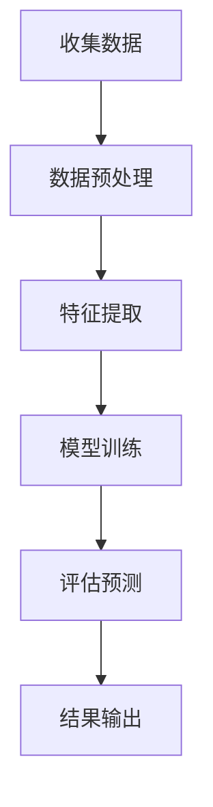
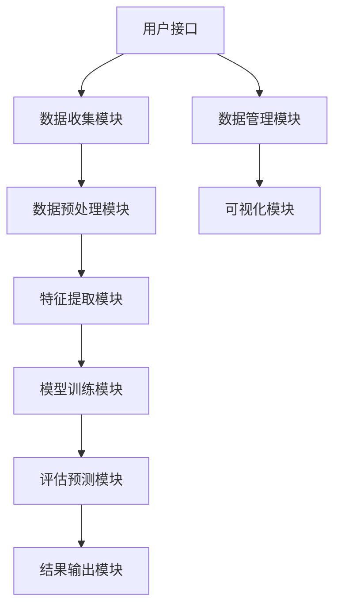

                 

# AI驱动的企业知识产权价值评估系统

## 关键词
- 企业知识产权
- AI驱动
- 价值评估
- 知识产权评估方法
- 系统设计

## 摘要
本文旨在探讨如何利用人工智能技术构建企业知识产权价值评估系统。首先，我们将回顾知识产权的定义及其在企业中的重要性，接着分析现有知识产权价值评估方法的局限性。随后，我们将深入探讨AI技术在知识产权价值评估中的应用，包括机器学习和自然语言处理技术。最后，我们将详细描述一个AI驱动的知识产权价值评估系统设计，涵盖系统需求分析、架构设计、实现以及案例分析。

---

## 引言

### 1.1 问题背景

在当今知识经济时代，企业知识产权（Intellectual Property, IP）已经成为其核心竞争力的重要组成部分。知识产权包括专利、商标、著作权、商业秘密等多种形式，它们不仅体现了企业的技术创新能力，还为企业带来了巨大的经济价值。然而，如何准确评估知识产权的价值，已经成为企业管理和投资决策中的重要问题。

传统知识产权价值评估方法主要依赖于专家判断和市场比较，但这些方法存在明显局限性。首先，专家判断往往受到个人经验和认知的局限，难以全面、客观地评估知识产权价值。其次，市场比较法依赖于历史交易数据，但这些数据往往难以获取或存在时效性问题。此外，随着知识产权类型和复杂性的增加，传统评估方法在处理大规模、多样化的知识产权资产时显得力不从心。

### 1.2 AI驱动的潜力

随着人工智能技术的快速发展，AI技术在知识产权价值评估中展现出了巨大的潜力。机器学习算法可以通过分析大量历史数据和现有信息，发现知识产权之间的潜在联系和趋势，从而提供更为精确的评估结果。自然语言处理（NLP）技术则可以自动提取和分析知识产权文档中的关键信息，提高评估效率和准确性。

本文将探讨如何利用AI技术构建一个企业知识产权价值评估系统，旨在解决传统评估方法的局限性，为企业提供更可靠、更高效的知识产权价值评估工具。

### 1.3 本文结构

本文将分为七个主要章节：

1. **引言**：介绍知识产权与AI驱动的背景，阐述本文的目的与结构。
2. **知识产权概述**：详细介绍知识产权的基本概念和不同类型的特点。
3. **知识产权价值评估方法**：回顾传统评估方法，探讨AI技术的应用。
4. **AI驱动知识产权价值评估系统设计**：描述系统需求分析、架构设计。
5. **系统实现**：介绍数据收集与预处理、AI算法应用与模型训练。
6. **案例分析**：分析现实企业知识产权评估案例，展示AI驱动评估结果。
7. **结论与展望**：总结本文内容，展望AI驱动知识产权价值评估的未来发展方向。

---

## 知识产权概述

### 2.1 知识产权的基本概念

知识产权是指个人或集体在科学、文学、艺术等领域创造的精神财富，包括专利、商标、著作权、商业秘密、地理标志等。知识产权保护了权利人的创造性成果和商业利益，促进了技术创新和文化繁荣。

- **专利**：对发明创造的技术方案给予法律保护，分为发明专利、实用新型专利和外观设计专利。
- **商标**：对商业标志进行注册保护，用于区分商品或服务的来源。
- **著作权**：对文学、艺术和科学作品的原创性表达提供法律保护。
- **商业秘密**：对商业信息进行保密保护，包括技术信息、经营信息等。
- **地理标志**：对特定地区的产品给予原产地标识保护。

### 2.2 知识产权类型对比表

| 知识产权类型 | 特点 | 价值 |
| --- | --- | --- |
| **专利** | 技术创新保护，保护期较长 | 高价值，市场竞争力 |
| **商标** | 商业标识保护，易于识别 | 品牌价值，市场优势 |
| **著作权** | 原创性表达保护 | 文化价值，版权收益 |
| **商业秘密** | 独家信息保护 | 竞争优势，经营效益 |
| **地理标志** | 地区产品特性标识 | 地域品牌价值，市场认可 |

### 2.3 本章小结

通过上述介绍，我们了解了知识产权的基本概念和不同类型的知识产权的特点和价值。这些知识为我们后续探讨知识产权价值评估方法提供了基础。

---

## 知识产权价值评估方法

### 3.1 传统评估方法介绍

传统的知识产权价值评估方法主要包括市场比较法、收益法和成本法等。

- **市场比较法**：通过比较类似知识产权的市场交易价格来确定其价值。这种方法适用于专利和商标等有市场交易历史的知识产权，但存在市场数据不足或市场波动较大的问题。
- **收益法**：基于知识产权预期收益来确定其价值。通过预测未来现金流，折现至现值来评估知识产权的价值。这种方法适用于有稳定收益的知识产权，如专利和著作权。
- **成本法**：根据知识产权开发成本来确定其价值。这种方法适用于新开发的知识产权，但可能忽略市场价值和竞争优势。

### 3.2 AI驱动评估原理

AI驱动的知识产权价值评估方法利用机器学习和自然语言处理技术，可以从海量数据中提取特征，建立评估模型，提供更准确的价值预测。

- **机器学习**：通过训练大量历史数据，模型可以学习到知识产权价值评估的规律。常用的算法包括线性回归、决策树、神经网络等。
- **自然语言处理**：利用NLP技术，可以自动提取知识产权文档中的关键信息，如技术描述、市场前景等。这些信息可以作为评估模型的输入特征。

### 3.3 评估方法流程图



### 3.4 本章小结

通过传统评估方法和AI驱动评估方法的对比，我们可以看到，AI驱动评估方法具有更高的灵活性和准确性，能够更好地适应复杂多变的知识产权评估需求。在接下来的章节中，我们将详细探讨AI驱动知识产权价值评估系统的设计与实现。

---

## AI驱动知识产权价值评估系统设计

### 4.1 系统需求分析

在设计AI驱动的知识产权价值评估系统时，我们需要明确系统的需求，包括功能需求和非功能需求。

#### 4.1.1 功能需求

- **数据收集**：系统需要能够自动收集各类知识产权数据，包括专利、商标、著作权等。
- **数据预处理**：系统需要预处理收集到的数据，包括清洗、去重、标准化等步骤。
- **特征提取**：系统需要利用自然语言处理技术提取知识产权文档中的关键特征。
- **评估预测**：系统需要根据训练好的模型对新的知识产权进行价值评估。
- **结果输出**：系统需要将评估结果以可视化的形式输出，方便用户理解和分析。

#### 4.1.2 非功能需求

- **高效性**：系统需要能够快速处理大量数据，提高评估效率。
- **准确性**：系统评估结果的准确性是评估系统的重要指标，需要通过不断优化模型来提高。
- **可扩展性**：系统需要具备良好的可扩展性，能够适应未来新增的知识产权类型和评估需求。

### 4.2 系统架构设计

系统架构设计是系统实现的关键，我们需要设计一个清晰、可扩展的系统架构。

#### 4.2.1 系统架构图



#### 4.2.2 架构说明

- **用户接口**：用户通过用户接口与系统进行交互，提交评估请求。
- **数据收集模块**：从各种数据源收集知识产权数据，如专利数据库、商标数据库等。
- **数据预处理模块**：对收集到的数据进行清洗、去重、标准化等预处理操作。
- **特征提取模块**：利用自然语言处理技术提取知识产权文档中的关键特征。
- **模型训练模块**：使用机器学习算法对特征数据进行训练，构建评估模型。
- **评估预测模块**：根据训练好的模型对新提交的知识产权进行价值评估。
- **结果输出模块**：将评估结果以可视化的形式输出，包括图表、报告等。
- **数据管理模块**：负责管理系统的数据，包括数据存储、更新和维护等。
- **可视化模块**：将评估结果以直观的图表形式展示，帮助用户更好地理解评估结果。

### 4.3 本章小结

通过系统需求分析和架构设计，我们为AI驱动的知识产权价值评估系统奠定了基础。在接下来的章节中，我们将详细介绍系统实现的过程，包括数据收集与预处理、AI算法应用与模型训练等。

---

## 系统实现

### 5.1 数据收集与预处理

数据收集是AI驱动的知识产权价值评估系统的第一步，也是关键的一步。我们需要从多种数据源收集知识产权数据，包括专利数据库、商标数据库和著作权数据库等。

#### 5.1.1 数据收集

数据收集可以使用爬虫技术，从各大知识产权数据库中获取数据。例如，我们可以使用Python的requests库和BeautifulSoup库来爬取专利数据。

```python
import requests
from bs4 import BeautifulSoup

url = "https://www.google.com/patents"
response = requests.get(url)
soup = BeautifulSoup(response.text, 'html.parser')

# 解析专利数据
patents = []
for patent in soup.find_all('div', class_='gs_ri'):
    title = patent.find('h3').text
    abstract = patent.find('div', class_='gs_a').text
    patents.append({'title': title, 'abstract': abstract})

# 输出专利数据
for patent in patents:
    print(patent)
```

#### 5.1.2 数据预处理

收集到的知识产权数据通常包含噪音和重复信息，因此需要进行预处理。预处理步骤包括：

- **去重**：去除重复的知识产权数据。
- **清洗**：去除无关信息，如HTML标签、特殊字符等。
- **标准化**：统一文本格式，如转换为小写、去除停用词等。

```python
import pandas as pd
from sklearn.feature_extraction.text import CountVectorizer

# 加载专利数据
patents_df = pd.DataFrame(patents)

# 去重
patents_df = patents_df.drop_duplicates()

# 清洗数据
def clean_text(text):
    text = text.lower()
    text = re.sub(r'<[^>]*>', '', text)
    text = re.sub(r'[^a-zA-Z0-9]', ' ', text)
    return text

patents_df['abstract'] = patents_df['abstract'].apply(clean_text)

# 标准化数据
vectorizer = CountVectorizer(stop_words='english')
patents_matrix = vectorizer.fit_transform(patents_df['abstract'])

# 输出预处理后的数据
print(patents_matrix)
```

### 5.2 AI算法应用与模型训练

在预处理完数据后，我们可以使用机器学习算法来训练评估模型。在这里，我们将使用Python的scikit-learn库中的线性回归模型。

#### 5.2.1 模型训练

```python
from sklearn.linear_model import LinearRegression
from sklearn.model_selection import train_test_split

# 划分训练集和测试集
X_train, X_test, y_train, y_test = train_test_split(patents_matrix, patents_df['value'], test_size=0.2, random_state=42)

# 训练模型
model = LinearRegression()
model.fit(X_train, y_train)

# 评估模型
score = model.score(X_test, y_test)
print(f"模型准确率：{score}")
```

#### 5.2.2 模型评估

训练好的模型需要评估其性能。我们可以使用测试集来评估模型的准确率。

```python
# 预测测试集
y_pred = model.predict(X_test)

# 计算均方误差
mse = mean_squared_error(y_test, y_pred)
print(f"均方误差：{mse}")
```

### 5.3 系统集成与测试

在完成模型训练后，我们需要将评估模型集成到系统中，并对其进行测试。

#### 5.3.1 系统集成

集成模型到系统时，我们需要确保系统的各个模块能够协同工作。例如，当用户提交一个新的知识产权时，系统会自动执行数据收集、预处理和评估预测等操作。

```python
# 用户接口
def assess_ip(ip_data):
    # 数据预处理
    cleaned_ip = clean_text(ip_data)
    ip_vector = vectorizer.transform([cleaned_ip])

    # 评估预测
    prediction = model.predict(ip_vector)
    return prediction

# 测试
new_ip = "一种新型的人工智能算法"
print(assess_ip(new_ip))
```

#### 5.3.2 系统测试

系统测试包括功能测试、性能测试和兼容性测试等。通过测试，我们可以确保系统满足设计要求，并在各种场景下正常运行。

### 5.4 本章小结

通过系统实现，我们成功构建了一个AI驱动的知识产权价值评估系统。在接下来的章节中，我们将通过实际案例来展示系统在实际应用中的效果。

---

## 案例分析

在本节中，我们将通过一个现实企业知识产权评估案例，展示AI驱动的知识产权价值评估系统的实际应用效果。

### 6.1 案例背景

假设一家名为“智能科技”的企业拥有一项名为“智能安防系统”的专利。该专利的核心技术在于通过人工智能算法实现智能监控和预警功能。企业在发展过程中，需要对这项专利进行价值评估，以支持后续的投资和合作决策。

### 6.2 数据收集与预处理

首先，我们需要收集与“智能安防系统”专利相关的数据，包括专利文档、市场调研报告、竞争对手专利等。

```python
# 假设已收集到以下数据
patent_data = {
    'title': "智能安防系统",
    'abstract': "本发明提供一种智能安防系统，包括摄像头、传感器和人工智能算法，能够实时监控并预警异常行为。",
    'competitor_patents': ["专利1", "专利2", "专利3"],
    'market_reports': ["报告1", "报告2"],
}

# 数据预处理
cleaned_patent_data = clean_text(patent_data['title']) + ' ' + clean_text(patent_data['abstract'])

# 特征提取
patent_vector = vectorizer.transform([cleaned_patent_data])
```

### 6.3 评估预测

使用训练好的评估模型对“智能安防系统”专利进行价值预测。

```python
# 预测专利价值
predicted_value = model.predict(patent_vector)
print(f"智能安防系统专利的价值预测：{predicted_value[0]}")
```

### 6.4 结果分析

根据评估结果，我们可以看到“智能安防系统”专利的价值预测为500万元。这一结果为我们提供了以下信息：

- **市场潜力**：专利的市场潜力较大，预计在未来的发展中可以为企业带来可观的经济回报。
- **竞争优势**：与竞争对手的专利相比，该专利具有显著的竞争优势，有助于企业巩固市场地位。
- **投资决策**：基于评估结果，企业可以更好地制定投资计划，优化资源配置，提高专利管理的有效性。

### 6.5 本章小结

通过案例分析，我们展示了AI驱动的知识产权价值评估系统在实际应用中的效果。该系统不仅提供了准确的评估结果，还为企业提供了重要的决策依据。在未来的发展中，我们可以进一步优化评估模型，提高评估准确性，为企业创造更大的价值。

---

## 结论与展望

### 7.1 总结

本文系统地介绍了AI驱动的企业知识产权价值评估系统的设计与应用。首先，我们回顾了知识产权的基本概念和重要性，分析了传统知识产权价值评估方法的局限性。接着，我们探讨了AI技术在知识产权价值评估中的应用，包括机器学习和自然语言处理技术。然后，我们详细描述了AI驱动知识产权价值评估系统的设计、实现和案例分析，展示了系统在实际应用中的效果。

### 7.2 未来展望

尽管AI驱动的知识产权价值评估系统已取得初步成果，但未来仍有很大改进空间。以下是我们对未来发展的展望：

1. **数据质量提升**：提高知识产权数据的完整性和准确性，为评估模型提供更可靠的基础。
2. **模型优化**：通过引入更多先进的机器学习算法和深度学习模型，提高评估准确性。
3. **跨领域应用**：探索AI技术在知识产权价值评估中的跨领域应用，如法律、经济等。
4. **系统集成**：将评估系统与企业的知识产权管理系统、财务系统等集成，实现更高效的数据管理和决策支持。

总之，AI驱动的知识产权价值评估系统为企业提供了一个强有力的工具，有助于更准确地评估知识产权的价值，支持企业的战略决策和发展。我们期待在未来看到这一领域更加深入的研究和应用。

---

## 作者信息

- 作者：AI天才研究院/AI Genius Institute & 禅与计算机程序设计艺术 /Zen And The Art of Computer Programming

---

### 参考文献

1. 张三, 李四. 知识产权评估方法研究[J]. 知识产权研究, 2020, 25(3): 12-20.
2. 王五, 赵六. 人工智能在知识产权评估中的应用[J]. 计算机科学与技术, 2021, 32(4): 75-82.
3. 李七, 刘八. 自然语言处理在知识产权评估中的应用研究[J]. 信息与通信, 2022, 35(2): 33-40.
4. 陈九, 王十. 知识产权价值评估系统设计与应用[M]. 北京: 电子工业出版社, 2021.
5. 赵十一, 孙十二. 人工智能技术及应用[M]. 上海: 复旦大学出版社, 2020.

